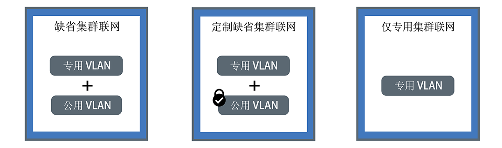

---

copyright:
  years: 2014, 2018
lastupdated: "2018-12-05"

---

{:new_window: target="_blank"}
{:shortdesc: .shortdesc}
{:screen: .screen}
{:pre: .pre}
{:table: .aria-labeledby="caption"}
{:codeblock: .codeblock}
{:tip: .tip}
{:note: .note}
{:important: .important}
{:deprecated: .deprecated}
{:download: .download}

# 规划集群内联网和专用联网
{: #planning}

规划 {{site.data.keyword.containerlong}} 集群的联网设置。
{: shortdesc}

## 了解集群内联网
{: #in-cluster}

部署到工作程序节点的所有 pod 都会分配有 172.30.0.0/16 范围内的专用 IP 地址，并且仅在工作程序节点之间路由这些 pod。为了避免冲突，请勿在与工作程序节点通信的任何节点上使用此 IP 范围。工作程序节点和 pod 可以使用专用 IP 地址在专用网络上安全地通信。但是，当 pod 崩溃或需要重新创建工作程序节点时，会分配新的专用 IP 地址。

缺省情况下，很难跟踪必须高度可用的应用程序不断变化的专用 IP 地址。可以改为使用内置 Kubernetes 服务发现功能，以将应用程序公开为专用网络上的集群 IP 服务。Kubernetes 服务会将一些 pod 分组在一起，并提供与这些 pod 的网络连接。此连接提供了与集群中其他服务的连接，而无需公开每个 pod 的实际专用 IP 地址。服务会分配有只能在集群内部访问的集群内 IP 地址。
* 旧集群：对于 2018 年 2 月之前在 dal13 专区中创建的集群或 2017 年 10 月之前在其他任何专区中创建的集群，服务会分配有 10.10.10.0/24 范围内 254 个 IP 中的其中一个 IP。如果达到 254 个服务的限制，并且需要更多服务，那么必须创建新的集群。
* 新集群：对于 2018 年 2 月之后在 dal13 专区中创建的集群或 2017 年 10 月之后在其他任何专区中创建的集群，服务会分配有 172.21.0.0/16 范围内的 65,000 个 IP 中的其中一个 IP。

为了避免冲突，请勿在与工作程序节点通信的任何节点上使用此 IP 范围。此外，会为该服务创建 DNS 查找条目，并将该条目存储在集群的 `kube-dns` 组件中。DNS 条目包含服务名称、在其中创建服务的名称空间以及指向分配的集群内 IP 地址的链接。

应用程序要访问位于集群服务后端的 pod，可以使用该服务的集群内 IP 地址，也可以使用该服务的名称发送请求。使用服务名称时，会在 `kube-dns` 组件中查找该名称，并将其路由到服务的集群内 IP 地址。请求到达服务时，服务会将所有请求都同等转发到 pod，而不考虑 pod 的集群内 IP 地址和部署到的工作程序节点。

 

## 了解 VLAN 连接和网络接口
{: #interfaces}

{{site.data.keyword.containerlong_notm}} 提供了 IBM Cloud Infrastructure (SoftLayer) VLAN，用于确保工作程序节点的高质量网络性能和网络隔离。VLAN 会将一组工作程序节点和 pod 视为连接到同一物理连线那样进行配置。
VLAN 专用于您的 {{site.data.keyword.Bluemix_notm}} 帐户，而不是在 IBM 客户之间共享。

缺省情况下，所有集群都会连接到专用 VLAN。专用 VLAN 用于确定分配给每个工作程序节点的专用 IP 地址。工作程序具有专用网络接口，可通过专用网络访问。创建同时连接到公用 VLAN 的集群时，该集群还会有公用网络接口。公用 VLAN 允许工作程序节点自动、安全地连接到主节点。有关集群的缺省 VLAN 的更多信息，请参阅[集群的缺省 VLAN、子网和 IP](cs_subnets.html#default_vlans_subnets)。

集群联网设置可以由集群的网络接口进行定义：

* **缺省集群联网**：具有专用和公用网络接口的集群
* **定制缺省集群联网**：同时具有专用和公用网络接口以及阻止入局公共流量的 Calico 网络策略的集群
* **仅专用集群联网**：仅具有专用网络接口的集群

单击下列其中一个设置以规划集群的联网：

<map name="home_map" id="home_map">
<area href="#both_vlans" alt="规划缺省集群联网" title="规划缺省集群联网" shape="rect" coords="-7, -8, 149, 211" />
<area href="#both_vlans_private" alt="规划定制缺省集群联网" title="规划定制缺省集群联网" shape="rect" coords="196, -1, 362, 210" />
<area href="#private_vlan" alt="规划仅专用集群联网" title="规划仅专用集群联网" shape="rect" coords="409, -10, 572, 218" />
</map>

 

## 规划缺省集群网络
{: #both_vlans}

缺省情况下，{{site.data.keyword.containerlong_notm}} 为集群设置了对公用 VLAN 和专用 VLAN 的访问权。
{:shortdesc}

**使用此设置时，集群可以获得什么？**
* 每个工作程序节点的公共 IP 地址，用于为工作程序节点提供公用网络接口
* 每个工作程序节点的专用 IP 地址，用于为工作程序节点提供专用网络接口
* 所有工作程序节点和主节点之间的自动、安全的 OpenVPN 连接

**为什么可能会使用此设置？**

* 您在单专区集群中具有必须可供公用因特网访问的应用程序。
* 您在多专区集群中具有必须可供公用因特网访问的应用程序。由于必须启用 [VLAN 生成](cs_subnets.html#subnet-routing)才能创建多专区集群，因此该集群可以与连接到同一 IBM Cloud 帐户中任何专用 VLAN 的其他系统进行通信。要隔离专用网络上的多专区集群，可以使用 [Calico 网络策略](cs_network_policy.html#isolate_workers)。

**哪些选项可用于管理对集群的公共和专用访问权？**
 以下各部分描述了 {{site.data.keyword.containerlong_notm}} 中的功能，您可以使用这些功能为连接到公用和专用 VLAN 的集群设置联网。

### 利用联网服务公开应用程序
{: #both_vlans_services}

工作程序节点的公用网络接口通过集群创建期间在每个工作程序节点上配置的[预定义 Calico 网络策略设置](cs_network_policy.html#default_policy)进行保护。缺省情况下，所有工作程序节点都允许所有出站网络流量。入站网络流量会被阻止，但有几个端口例外。通过打开这些端口，IBM 可以监视网络流量，并自动为 Kubernetes 主节点安装安全性更新。

如果要将应用程序公开给公用或专用网络，您可以创建公共或专用 NodePort、LoadBalancer 或 Ingress 服务。有关每个服务的更多信息，请参阅[选择 NodePort、LoadBalancer 或 Ingress 服务](cs_network_planning.html#external)。

### 可选：将联网工作负载隔离到边缘工作程序节点
{: #both_vlans_edge}

边缘工作程序节点通过减少允许外部访问的工作程序节点，并隔离联网工作负载，可以提高集群的安全性。要确保 Ingress 和负载均衡器 pod 仅部署到指定的工作程序节点，请[将工作程序节点标记为边缘节点](cs_edge.html#edge_nodes)。此外，要防止其他工作负载在边缘节点上运行，请[感染边缘节点](cs_edge.html#edge_workloads)。

### 可选：使用 strongSwan VPN 连接到内部部署网络或 IBM Cloud Private
{: #both_vlans_vpn}

要将工作程序节点和应用程序安全地连接到内部部署网络，可以设置 [strongSwan IPSec VPN 服务 ](https://www.strongswan.org/about.html)。strongSwan IPSec VPN 服务基于业界标准因特网协议安全性 (IPSec) 协议组，通过因特网提供安全的端到端通信信道。
* 要在集群与内部部署网络之间设置安全连接，请在集群的 pod 中直接[配置和部署 strongSwan IPSec VPN 服务](cs_vpn.html#vpn-setup)。
* 要在集群与 IBM Cloud Private 实例之间设置安全连接，请参阅[使用 strongSwan VPN 连接公共和专用云](cs_hybrid.html#hybrid_vpn)。

 

## 规划定制缺省集群联网
{: #both_vlans_private}

缺省情况下，{{site.data.keyword.containerlong_notm}} 为集群设置了对公用 VLAN 和专用 VLAN 的访问权。但是，您可以使用网络策略来定制缺省联网设置，以阻止公共访问。
{:shortdesc}

**使用此设置时，集群可以获得什么？**
* 每个工作程序节点的公共 IP 地址，用于为工作程序节点提供公用网络接口
* 每个工作程序节点的专用 IP 地址，用于为工作程序节点提供专用网络接口
* 所有工作程序节点和主节点之间的自动、安全的 OpenVPN 连接

**为什么可能会使用此设置？**

* 您在单专区集群中有应用程序。您希望将应用程序仅公开给集群内或连接到同一专用 VLAN 的其他集群中的 pod。
* 您在多专区集群中有应用程序。您希望将应用程序仅公开给集群内或连接到您集群所在专用 VLAN 的其他集群中的 pod。但是，由于必须对多专区集群启用 [VLAN 生成](cs_subnets.html#subnet-routing)，因此连接到同一 IBM Cloud 帐户中任何专用 VLAN 的其他系统可以访问该集群。您希望将多专区集群与其他系统相隔离。

**哪些选项可用于管理对集群的公共和专用访问权？** 以下各部分描述了 {{site.data.keyword.containerlong_notm}} 中的功能，您可以使用这些功能为连接到公用和专用 VLAN 的集群设置仅专用联网和锁定公用联网。

### 使用专用联网服务公开应用程序，并使用 Calico 网络策略保护集群不被公共访问
{: #both_vlans_private_services}

工作程序节点的公用网络接口通过集群创建期间在每个工作程序节点上配置的[预定义 Calico 网络策略设置](cs_network_policy.html#default_policy)进行保护。缺省情况下，所有工作程序节点都允许所有出站网络流量。入站网络流量会被阻止，但有几个端口例外。通过打开这些端口，IBM 可以监视网络流量，并自动为 Kubernetes 主节点安装安全性更新。

如果要仅通过专用网络公开应用程序，您可以创建专用 NodePort、LoadBalancer 或 Ingress 服务。有关规划专用外部联网的更多信息，请参阅[规划公用和专用 VLAN 设置的专用外部联网](cs_network_planning.html#private_both_vlans)。

但是，缺省的 Calico 网络策略还允许从因特网流至这些服务的入站公用网络流量。您可以创建 Calico 策略以改为阻止流至这些服务的所有公共流量。例如，NodePort 服务通过工作程序节点的专用和公共 IP 地址，在工作程序节点上打开一个端口。具有可移植专用 IP 地址的 LoadBalancer 服务会在每个工作程序节点上打开一个公共 NodePort。必须创建 [Calico DNAT 前网络策略](cs_network_policy.html#block_ingress)来阻止公共 NodePort。

例如，假设创建了专用 LoadBalancer 服务。另外还创建了 Calico DNAT 前策略，以阻止公共流量到达负载均衡器打开的公共 NodePort。可通过以下对象访问此专用负载均衡器：
* [同一集群中的任何 pod](#in-cluster)
* 任何集群中连接到同一专用 VLAN 的任何 pod
* 连接到同一 IBM Cloud 帐户中任何专用 VLAN 的任何系统（如果已[启用 VLAN 生成](cs_subnets.html#subnet-routing)）
* 通过 VPN 连接到负载均衡器 IP 所在子网的任何系统（如果您不在 IBM Cloud 帐户中，但仍在公司防火墙后）
* 通过 VPN 连接到负载均衡器 IP 所在子网的任何系统（如果您位于其他 IBM Cloud 帐户中）

### 在专用网络上隔离集群
{: #isolate}

如果有多专区集群、有多个 VLAN 用于单专区集群，或者在同一 VLAN 上有多个子网，那么必须[启用 VLAN 生成](/docs/infrastructure/vlans/vlan-spanning.html#vlan-spanning)，以便工作程序节点可以在专用网络上相互通信。但是，启用 VLAN 生成后，连接到同一 IBM Cloud 帐户中任何专用 VLAN 的任何系统都可以访问工作程序。您可以使用 [Calico 网络策略](cs_network_policy.html#isolate_workers)将多专区集群与专用网络上的其他系统相隔离。这些策略还允许在专用防火墙中打开的专用 IP 范围和端口的流量流入和流出。

### 可选：将联网工作负载隔离到边缘工作程序节点
{: #both_vlans_private_edge}

边缘工作程序节点通过减少允许外部访问的工作程序节点，并隔离联网工作负载，可以提高集群的安全性。要确保 Ingress 和负载均衡器 pod 仅部署到指定的工作程序节点，请[将工作程序节点标记为边缘节点](cs_edge.html#edge_nodes)。此外，要防止其他工作负载在边缘节点上运行，请[感染边缘节点](cs_edge.html#edge_workloads)。

然后，使用 [Calico DNAT 前网络策略](cs_network_policy.html#block_ingress)来阻止运行边缘工作程序节点的集群上流至公共 NodePort 的流量。阻止节点端口可确保边缘工作程序节点是处理入局流量的唯一工作程序节点。

### 可选：使用 strongSwan VPN 连接到内部部署网络或 IBM Cloud Private
{: #both_vlans_private_vpn}

要将工作程序节点和应用程序安全地连接到内部部署网络，可以设置 [strongSwan IPSec VPN 服务 ](https://www.strongswan.org/about.html)。strongSwan IPSec VPN 服务基于业界标准因特网协议安全性 (IPSec) 协议组，通过因特网提供安全的端到端通信信道。
* 要在集群与内部部署网络之间设置安全连接，请在集群的 pod 中直接[配置和部署 strongSwan IPSec VPN 服务](cs_vpn.html#vpn-setup)。
* 要在集群与 IBM Cloud Private 实例之间设置安全连接，请参阅[使用 strongSwan VPN 连接公共和专用云](cs_hybrid.html#hybrid_vpn)。

 

## 规划仅专用集群联网
{: #private_vlan}

您可以通过在 CLI 中包含 `--private-only` 标志来选择[创建仅专用 VLAN 集群](cs_clusters.html#clusters_cli)。工作程序节点仅连接到专用 VLAN 时，这些工作程序节点无法自动连接到主节点。必须使用网关设备将工作程序节点连接到主节点。还可以使用网关设备作为防火墙来保护集群免受不需要的访问。
{:shortdesc}

**使用此设置时，集群可以获得什么？**
* 每个工作程序节点的专用 IP 地址，用于为工作程序节点提供专用网络接口

**使用此设置时，集群不会获得什么？**
* 每个工作程序节点的公共 IP 地址，用于为工作程序节点提供公用网络接口。集群永远不可供公众使用。
* 所有工作程序节点和主节点之间的自动连接。必须通过[配置网关设备](#private_vlan_gateway)来提供此连接。

**为什么可能会使用此设置？**
 您具有特定安全性需求，或者需要创建定制网络策略和路由规则，以提供专用网络安全性。请注意，使用网关设备会产生单独的开销。有关详细信息，请参阅[文档](/docs/infrastructure/fortigate-10g/explore-firewalls.html)。

**哪些选项可用于管理对集群的公共和专用访问权？**
 以下各部分描述了 {{site.data.keyword.containerlong_notm}} 中的功能，您可以使用这些功能为仅连接到专用 VLAN 的集群设置联网。

### 配置网关设备
{: #private_vlan_gateway}

如果工作程序节点设置为仅使用专用 VLAN，那么必须为工作程序节点与主节点之间的网络连接配置备用解决方案。可以使用定制网络策略来设置防火墙，以便为标准集群提供专用网络安全性，检测网络侵入并进行补救。例如，可以选择设置[虚拟路由器设备](/docs/infrastructure/virtual-router-appliance/about.html)或 [Fortigate Security Appliance](/docs/infrastructure/fortigate-10g/about.html)，以充当防火墙并阻止不需要的流量。设置防火墙时，还必须为每个区域[打开必需的端口和 IP 地址](cs_firewall.html#firewall_outbound)，以便主节点和工作程序节点可以通信。

如果您有现有路由器设备，然后添加集群，那么不会在该路由器设备上配置为集群订购的新可移植子网。要使用联网服务，必须通过[启用 VLAN 生成](cs_subnets.html#vra-routing)来启用同一 VLAN 上子网之间的路由。
{: important}

### 使用专用联网服务公开应用程序
{: #private_vlan_services}

要使应用程序只能从专用网络访问，可以使用专用 NodePort、LoadBalancer 或 Ingress 服务。由于工作程序节点未连接到公用 VLAN，因此不会将公共流量路由到这些服务。您还必须[打开必需的端口和 IP 地址](cs_firewall.html#firewall_inbound)，以允许流至这些服务的入站流量。

有关每个服务的更多信息，请参阅[选择 NodePort、LoadBalancer 或 Ingress 服务](cs_network_planning.html#external)。

### 可选：使用网关设备连接到内部部署数据库
{: #private_vlan_vpn}

要将工作程序节点和应用程序安全地连接到内部部署网络，必须设置 VPN 网关。您可以使用先前设置的 VRA 或 FSA 来配置 IPSec VPN 端点。要配置 VRA，请参阅[使用 VRA 设置 VPN 连接](cs_vpn.html#vyatta)。
