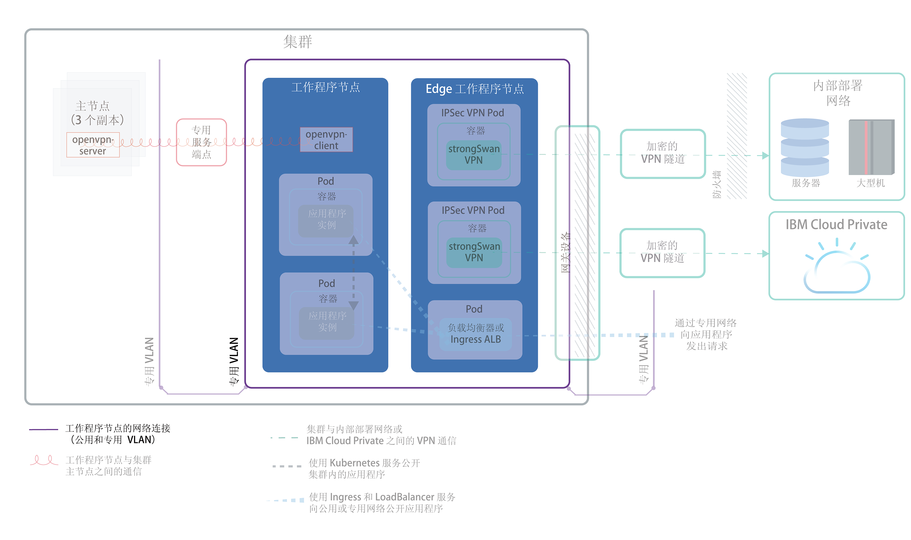
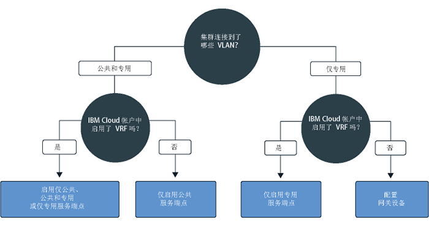
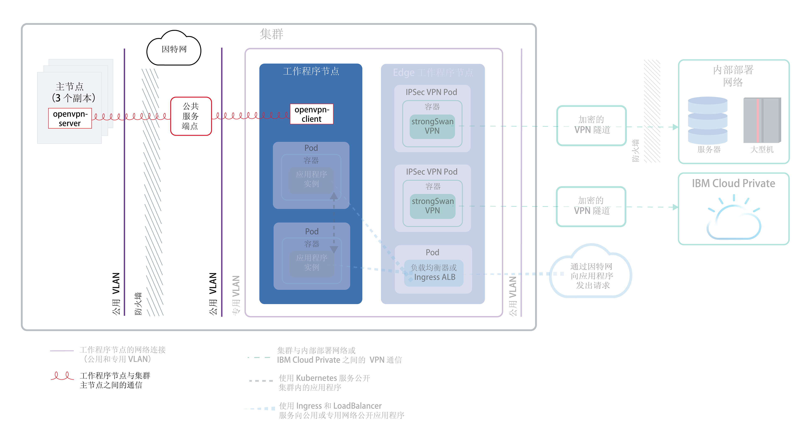
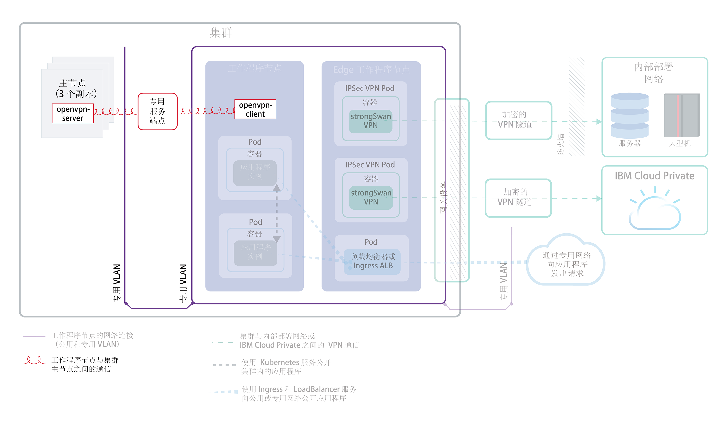
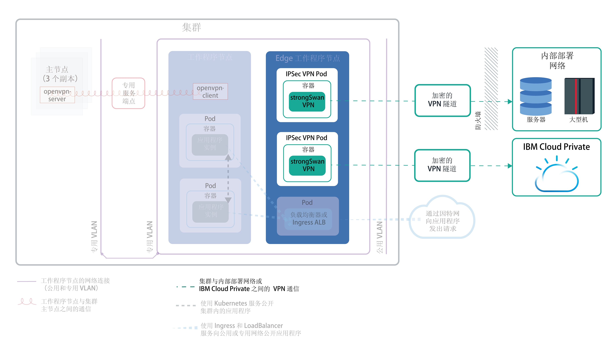
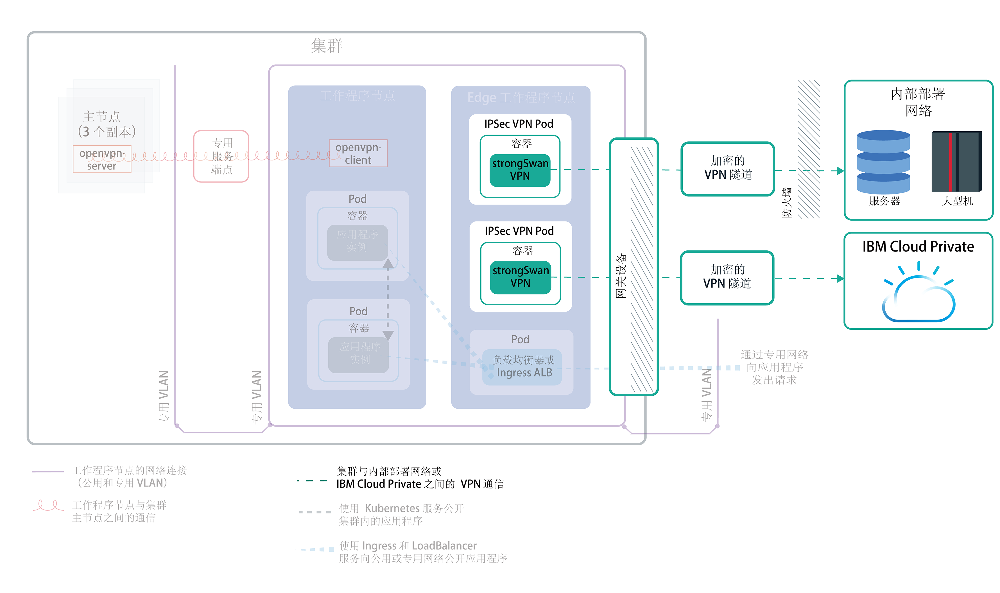

---

copyright:
  years: 2014, 2019
lastupdated: "2019-04-15"

---

{:new_window: target="_blank"}
{:shortdesc: .shortdesc}
{:screen: .screen}
{:pre: .pre}
{:table: .aria-labeledby="caption"}
{:codeblock: .codeblock}
{:tip: .tip}
{:note: .note}
{:important: .important}
{:deprecated: .deprecated}
{:download: .download}

# 规划集群网络
{: #cs_network_ov}

规划 {{site.data.keyword.containerlong}} 集群的联网设置。
{: shortdesc}

此页面可帮助您设置集群的网络配置。需要有关为应用程序设置联网的信息？请参阅[规划利用集群内联网和外部联网来公开应用程序](/docs/containers?topic=containers-cs_network_planning)。
{: tip}

## 了解 {{site.data.keyword.containerlong_notm}} 网络基础知识
{: #cs_network_ov_basics}

开始设置集群网络之前，请务必了解 {{site.data.keyword.containerlong_notm}} 集群中联网的基本概念。
{: shortdesc}

### 哪些集群组件必须相互通信？
{: #cs_network_ov_basics_components}

创建集群时，必须选择联网设置，以便特定集群组件可以相互通信。
{: shortdesc}

* 所有工作程序节点必须连接到 VLAN 才能相互通信，并与 Kubernetes 主节点进行通信。要选择 VLAN，请参阅[规划工作程序到工作程序之间的通信](#cs_network_ov_worker)。
* 必须允许跨多个专用 VLAN 进行通信，以支持工作程序相互连接并与主节点连接。要启用虚拟路由器功能 (VRF) 或 VLAN 生成，请参阅[如何配置 VLAN 和子网以确保网络分段？](#cs_network_ov_basics_segmentation)。
* 工作程序可以通过公用网络或专用网络安全地与 Kubernetes 主节点进行通信。要选择工作程序与主节点之间的通信信道，请参阅[规划主节点与工作程序之间的通信](#cs_network_ov_master)。

### 在 {{site.data.keyword.containerlong_notm}} 中联网是如何运作的？
{: #cs_network_ov_basics_vlans}

{{site.data.keyword.containerlong_notm}} 使用 VLAN、子网和 IP 地址来为集群组件提供网络连接。
{: shortdesc}

**什么是 VLAN？{{site.data.keyword.containerlong_notm}} 提供哪些类型的 VLAN？** 

创建集群时，集群的工作程序节点会自动连接到 VLAN。VLAN 会将一组工作程序节点和 pod 视为连接到同一物理连线那样进行配置，并为工作程序和 pod 之间的连接提供通道。
{: shortdesc}

<dl>
<dt>免费集群的 VLAN</dt>
<dd>在免费集群中，缺省情况下集群的工作程序节点会连接到 IBM 拥有的公用 VLAN 和专用 VLAN。因为是 IBM 控制 VLAN、子网和 IP 地址，所以无法创建多专区集群或向集群添加子网，而只能使用 NodePort 服务来公开应用程序。</dd>
<dt>标准集群的 VLAN</dt>
<dd>在标准集群中，首次在某个专区中创建集群时，会自动在 IBM Cloud Infrastructure (SoftLayer) 帐户中供应该专区中的公用 VLAN 和专用 VLAN。对于在该专区中创建的每个后续集群，必须指定要在该专区中使用的 VLAN 对。可以复用为您创建的相同公用和专用 VLAN，因为多个集群可以共享 VLAN。 
 可以将工作程序节点连接到公用 VLAN 和专用 VLAN，也可以仅连接到专用 VLAN。如果要将工作程序节点仅连接到专用 VLAN，那么可以在集群创建期间使用现有专用 VLAN 的标识，或者[创建专用 VLAN](/docs/cli/reference/ibmcloud?topic=cloud-cli-manage-classic-vlans#sl_vlan_create) 并使用其标识。</dd></dl>

要查看在您帐户的每个专区中供应的 VLAN，请运行 `ibmcloud ks vlans --zone <zone>`。要查看供应一个集群的 VLAN，请运行 `ibmcloud ks cluster-get --cluster <cluster_name_or_ID> --showResources`，然后查找 **Subnet VLANs** 部分。

IBM Cloud infrastructure (SoftLayer) 管理在专区中创建第一个集群时自动供应的 VLAN。如果使 VLAN 变为未使用（例如，从 VLAN 中除去所有工作程序节点），那么 IBMCloud infrastructure (SoftLayer) 将回收此 VLAN。此后，如果需要新 VLAN，[请联系 {{site.data.keyword.Bluemix_notm}} 支持](/docs/infrastructure/vlans?topic=vlans-ordering-premium-vlans#ordering-premium-vlans)。

**我选择的 VLAN 会如何影响集群？** 

您选择的 VLAN 连接将确定 Kubernetes 主节点和工作程序节点可以如何在集群中相互通信。有关更多信息，请参阅[规划工作程序节点与 Kubernetes 主节点之间的通信](/docs/containers?topic=containers-cs_network_ov#cs_network_ov_master)。

您选择的 VLAN 连接还用于确定应用程序的网络连接。有关更多信息，请参阅[规划使用集群内联网和外部联网来公开应用程序](/docs/containers?topic=containers-cs_network_planning)。

### 什么是子网？{{site.data.keyword.containerlong_notm}} 提供哪些类型的子网？
{: #cs_network_ov_basics_subnets}

除了工作程序节点和 pod 外，还会将子网自动供应到 VLAN。子网通过为集群组件分配 IP 地址来提供与这些组件的网络连接。
{: shortdesc}

在缺省公用和专用 VLAN 上会自动供应以下子网：

**公用 VLAN 子网**
* 主公用子网用于确定在集群创建期间分配给工作程序节点的公共 IP 地址。位于同一 VLAN 中的多个集群可以共享一个主公用子网。
* 可移植公用子网只绑定到一个集群，并为该集群提供 8 个公共 IP 地址。3 个 IP 保留用于 IBM Cloud Infrastructure (SoftLayer) 功能。1 个 IP 由缺省公共 Ingress ALB 使用，剩余 4 个 IP 可用于创建公用网络负载均衡器 (NLB) 服务。可移植公共 IP 是永久的固定 IP 地址，可用于通过因特网访问 NLB。如果需要 4 个以上的 IP 用于 NLB，请参阅[添加可移植 IP 地址](/docs/containers?topic=containers-subnets#adding_ips)。

**专用 VLAN 子网**
* 主专用子网用于确定在集群创建期间分配给工作程序节点的专用 IP 地址。位于同一 VLAN 中的多个集群可以共享一个主专用子网。
* 可移植专用子网只绑定到一个集群，并为该集群提供 8 个专用 IP 地址。3 个 IP 保留用于 IBM Cloud Infrastructure (SoftLayer) 功能。1 个 IP 由缺省专用 Ingress ALB 使用，剩余 4 个 IP 可用于创建专用网络负载均衡器 (NLB) 服务。可移植专用 IP 是永久的固定 IP 地址，可用于通过专用网络访问 NLB。如果需要 4 个以上的 IP 用于专用 NLB，请参阅[添加可移植 IP 地址](/docs/containers?topic=containers-subnets#adding_ips)。

要查看帐户中供应的所有子网，请运行 `ibmcloud ks subnets`。要查看绑定到一个集群的可移植公用子网和可移植专用子网，可以运行 `ibmcloud ks cluster-get --cluster <cluster_name_or_ID> --showResources`，然后查找 **Subnet VLANs** 部分。

在 {{site.data.keyword.containerlong_notm}} 中，VLAN 限制为 40 个子网。如果达到此限制，请首先检查以了解是否可以[在 VLAN 中复用子网以创建新集群](/docs/containers?topic=containers-subnets#subnets_custom)。如果需要新的 VLAN，请通过[联系 {{site.data.keyword.Bluemix_notm}} 支持](/docs/infrastructure/vlans?topic=vlans-ordering-premium-vlans#ordering-premium-vlans)进行订购。然后，[创建集群](/docs/containers?topic=containers-cs_cli_reference#cs_cluster_create)以使用这一新的 VLAN。
{: note}

### 如何配置 VLAN 和子网以确保网络分段？
{: #cs_network_ov_basics_segmentation}

网络分段描述了用于将网络划分为多个子网的方法。在一个子网中运行的应用程序无法查看或访问另一个子网中的应用程序。有关网络分段选项及其如何与 VLAN 相关的更多信息，请参阅[此集群安全性主题](/docs/containers?topic=containers-security#network_segmentation)。
{: shortdesc}

但是，在多种情况下，必须允许集群中的组件在多个专用 VLAN 中进行通信。例如，如果要创建多专区集群，如果集群有多个 VLAN，或者如果同一 VLAN 上有多个子网，那么同一 VLAN 中不同子网上的工作程序节点或不同 VLAN 中的工作程序节点无法自动相互通信。您必须为 IBM Cloud Infrastructure (SoftLayer) 帐户启用虚拟路由器功能 (VRF) 或 VLAN 生成。

**什么是虚拟路由器功能 (VRF) 和 VLAN 生成？** 

<dl>
<dt>[虚拟路由器功能 (VRF)](/docs/infrastructure/direct-link?topic=direct-link-overview-of-virtual-routing-and-forwarding-vrf-on-ibm-cloud#overview-of-virtual-routing-and-forwarding-vrf-on-ibm-cloud)</dt>
<dd>VRF 支持基础架构帐户中的所有 VLAN 和子网相互通信。此外，需要 VRF 来允许工作程序与主节点通过专用服务端点进行通信。要启用 VRF，请[联系 IBM Cloud Infrastructure (SoftLayer) 客户代表](/docs/infrastructure/direct-link?topic=direct-link-overview-of-virtual-routing-and-forwarding-vrf-on-ibm-cloud#how-you-can-initiate-the-conversion)。请注意，VRF 会使帐户的 VLAN 生成选项失效，因为所有 VLAN 都能够进行通信，除非您配置网关设备来管理流量。</dd>
<dt>[VLAN 生成](/docs/infrastructure/vlans?topic=vlans-vlan-spanning#vlan-spanning)</dt>
<dd>如果无法或不想启用 VR，请启用 VLAN 生成。要执行此操作，您需要**网络 > 管理网络 VLAN 生成**[基础架构许可权](/docs/containers?topic=containers-users#infra_access)，或者可以请求帐户所有者启用 VLAN 生成。要检查是否已启用 VLAN 生成，请使用 `ibmcloud ks vlan-spanning-get` [命令](/docs/containers?topic=containers-cs_cli_reference#cs_vlan_spanning_get)。请注意，如果选择启用 VLAN 生成而不是 VRF，那么无法启用专用服务端点。</dd>
</dl>

**VRF 或 VLAN 生成会如何影响网络分段？** 

启用 VRF 或 VLAN 生成后，任何连接到同一 {{site.data.keyword.Bluemix_notm}} 帐户中的任何专用 VLAN 的系统都可以与工作程序进行通信。您可以通过应用 [Calico 专用网络策略](/docs/containers?topic=containers-network_policies#isolate_workers)，将集群与专用网络上的其他系统相隔离。此外，{{site.data.keyword.containerlong_notm}} 还与所有 [IBM Cloud Infrastructure (SoftLayer) 防火墙产品 ](https://www.ibm.com/cloud-computing/bluemix/network-security) 相兼容。可以使用定制网络策略来设置防火墙（例如，[虚拟路由器设备](/docs/infrastructure/virtual-router-appliance?topic=virtual-router-appliance-about-the-vra)），以便为标准集群提供专用网络安全性，检测网络侵入并进行补救。

 

## 规划工作程序到工作程序的通信
{: #cs_network_ov_worker}

所有工作程序节点都必须连接到 VLAN 才能具有网络接口。此网络接口允许每个工作程序节点与其他工作程序节点之间发送和接收信息。
{: shortdesc}

### 工作程序节点 VLAN 连接的选项有哪些？
{: #cs_network_ov_worker_options}

创建集群时，可以选择是将工作程序节点连接到公用 VLAN 和专用 VLAN，还是连接到仅专用 VLAN。
{: shortdesc}

**为什么可能需要将集群连接到公用和专用 VLAN？** 

在大多数情况下，您可以通过创建连接到公用和专用 VLAN 的集群来实现网络灵活性。例如：
* 您有一个应用程序必须可供公用因特网访问。
* 您有一个应用程序要仅公开给集群内的 pod 或公开给连接到同一专用 VLAN 的其他集群中的 pod。有若干选项可用于保护应用程序不受公共接口的影响，例如使用 Calico 网络策略或将外部网络工作负载隔离到边缘工作程序节点。

下图显示了连接到公用和专用 VLAN 的工作程序节点的网络连接。

<figure>
 
 <figcaption>连接到公用和专用 VLAN 的工作程序节点的网络连接</figcaption>
</figure>

如果要创建多专区集群，如果集群有多个 VLAN，或者如果同一 VLAN 上有多个子网，那么同一 VLAN 中不同子网上的工作程序节点或不同 VLAN 中的工作程序节点无法自动相互通信。您必须为 IBM Cloud Infrastructure (SoftLayer) 帐户启用 [VRF 或 VLAN 生成](#cs_network_ov_basics_segmentation)。选择 VRF 可启用[专用服务端点用于主节点与工作程序之间的通信](#cs_network_ov_master_private)。如果无法或不想启用 VR，请启用 VLAN 生成。

**为什么可能需要将集群连接到仅专用 VLAN？** 

如果您有特定安全性需求，或者需要创建定制网络策略和路由规则，以提供专用网络安全性，请创建仅专用 VLAN 集群。
{: shortdesc}

下图显示了连接到仅专用 VLAN 的工作程序节点的网络连接。

<figure>
 
 <figcaption>专用联网设置中工作程序节点的网络连接</figcaption>
</figure>

如果要创建多专区集群，如果集群有多个 VLAN，或者如果同一 VLAN 上有多个子网，那么同一 VLAN 中不同子网上的工作程序节点或不同 VLAN 中的工作程序节点无法自动相互通信。您必须为 IBM Cloud Infrastructure (SoftLayer) 帐户启用 [VRF 或 VLAN 生成](#cs_network_ov_basics_segmentation)。选择 VRF 可启用[专用服务端点用于主节点与工作程序之间的通信](#cs_network_ov_master_private)。如果无法或不想启用 VRF，那么必须启用 VLAN 生成，同时还必须配置网关设备用于主节点与工作程序之间的通信。

### 我选择了 VLAN 连接。如何对其进行设置？
{: #cs_network_ov_worker_setup}

您可以执行[设置使用公用和专用 VLAN 的集群联网](/docs/containers?topic=containers-cs_network_cluster#both_vlans)或[设置使用仅专用 VLAN 的集群联网](/docs/containers?topic=containers-cs_network_cluster#setup_private_vlan)中的步骤。
{: shortdesc}

### 我日后可以更改 VLAN 决策吗？工作程序节点 IP 地址会更改吗？
{: #cs_network_ov_worker_change}

您可以通过修改集群中的工作程序池来更改 VLAN 设置。有关更多信息，请参阅[更改工作程序节点 VLAN 连接](/docs/containers?topic=containers-cs_network_cluster#change-vlans)。
{: shortdesc}

工作程序节点分配有集群使用的公用或专用 VLAN 上的 IP 地址。供应工作程序节点后，IP 地址不会更改。例如，工作程序节点 IP 地址在执行 `reload`、`reboot` 和 `update` 操作之间保持不变。此外，工作程序节点的专用 IP 地址在大多数 `kubectl` 命令中用于表示工作程序节点身份。如果更改了工作程序池使用的 VLAN，那么该池中供应的新工作程序节点会将新的 VLAN 用于其 IP 地址。现有工作程序节点 IP 地址不会更改，但您可以选择除去使用旧 VLAN 的工作程序节点。

 

## 规划主节点与工作程序之间的通信
{: #cs_network_ov_master}

创建集群时，必须选择工作程序节点和 Kubernetes 主节点如何进行通信，以便编排集群配置。
{: shortdesc}

必须设置通信信道，以便 Kubernetes 主节点可以管理工作程序节点。此通信设置取决于如何设置 VLAN 连接。您可通过启用仅公用、公用和专用或仅专用服务端点，允许工作程序节点与 Kubernetes 主节点进行通信。要确定是否可以使用服务端点，请遵循以下决策树。

<map name="dt-image-map" id="dt-image-map">
  <area alt="使用公共、公共和专用或专用服务端点的缺省联网" title="使用公共、公共和专用或专用服务端点的缺省联网" href="#cs_network_ov_master_both" coords="0,296,195,354" shape="rect" />
  <area alt="使用仅公共服务端点的缺省联网" title="使用仅公共服务端点的缺省联网" href="#cs_network_ov_master_public" coords="220,295,353,352" shape="rect" />
  <area alt="使用仅专用服务端点的专用联网" title="使用仅专用服务端点的专用联网" href="#cs_network_ov_master_private" coords="393,294,524,356" shape="rect" />
  <area alt="使用网关设备的专用联网" title="使用网关设备的专用联网" href="#cs_network_ov_master_gateway" coords="579,294,697,354" shape="rect" />
</map>

请参阅以下各部分，以获取有关每种设置的更多信息。

### 仅公共服务端点
{: #cs_network_ov_master_public}

如果工作程序节点设置为使用专用和公用 VLAN，那么工作程序节点可以通过公共服务端点自动连接到公用网络上的主节点。{{site.data.keyword.Bluemix_notm}} 帐户中不需要 VRF。
{: shortdesc}

下图显示了工作程序节点与 Kubernetes 主节点之间通过公共服务端点进行的通信。

<figure>
 
 <figcaption>工作程序节点与 Kubernetes 主节点之间通过公共服务端点进行的通信</figcaption>
</figure>

**工作程序节点与主节点之间的通信** 
此通信通过公共服务端点在公用网络上安全地建立。工作程序通过 TLS 证书与主节点进行安全对话，主节点通过 OpenVPN 连接与工作程序进行对话。

**访问主节点** 
主节点可供授权集群用户通过公共服务端点公开访问。例如，集群用户可以安全地通过因特网访问 Kubernetes 主节点，以运行 `kubectl` 命令。

要在集群创建期间或之后设置仅公共服务端点，请执行[设置公共服务端点](/docs/containers?topic=containers-cs_network_cluster#set-up-public-se)中的步骤。

### 仅专用服务端点
{: #cs_network_ov_master_private}

要使主节点仅可供专用访问，可以在运行 Kubernetes V1.11 或更高版本的集群中启用专用服务端点。{{site.data.keyword.Bluemix_notm}} 帐户中需要 VRF。集群连接到仅专用 VLAN 时，专用服务端点无需网关设备就能安全地连接到主节点。
{: shortdesc}

下图显示了工作程序节点与 Kubernetes 主节点之间通过专用服务端点进行的通信。

<figure>
 
 <figcaption>工作程序节点与 Kubernetes 主节点之间通过专用服务端点进行的通信</figcaption>
</figure>

**工作程序节点与主节点之间的通信** 
此通信通过专用服务端点在专用网络上建立。

**访问主节点** 
集群用户必须位于 {{site.data.keyword.Bluemix_notm}} 专用网络中，或者通过 VPN 连接与专用网络连接才能访问主节点。

要在集群创建期间或之后设置仅专用服务端点，请执行[设置专用服务端点](/docs/containers?topic=containers-cs_network_cluster#set-up-private-se)中的步骤。

### 公共和专用服务端点
{: #cs_network_ov_master_both}

要使主节点可供集群用户公共或专用访问，可以在运行 Kubernetes V1.11 或更高版本的集群中启用公共和专用服务端点。{{site.data.keyword.Bluemix_notm}} 帐户中需要 VRF。
{: shortdesc}

**工作程序节点与主节点之间的通信** 
此通信通过专用服务端点在专用网络上建立，以及通过公共服务端点在公用网络上建立。通过将工作程序到主节点的流量一半通过公共端点路由，一半通过专用端点路由，可保护主节点到工作程序的通信不受公共或专用网络潜在中断的影响。

**访问主节点** 
如果授权集群用户位于 {{site.data.keyword.Bluemix_notm}} 专用网络中或通过 VPN 连接与专用网络连接，那么主节点可通过专用服务端点供专用访问。否则，主节点可供授权集群用户通过公共服务端点公开访问。

要在集群创建期间设置公共和专用服务端点，请执行[设置专用服务端点](/docs/containers?topic=containers-cs_network_cluster#set-up-private-se)中的步骤。创建集群后，可以分别启用[公共](/docs/containers?topic=containers-cs_network_cluster#set-up-public-se)或[专用](/docs/containers?topic=containers-cs_network_cluster#set-up-private-se)服务端点。

### 使用网关设备的专用联网
{: #cs_network_ov_master_gateway}

如果工作程序节点设置为使用仅专用 VLAN，并且在 {{site.data.keyword.Bluemix_notm}} 帐户中未启用 VRF，那么必须为工作程序节点与主节点之间的网络连接配置备用解决方案。可以使用定制网络策略来设置防火墙，以便为标准集群提供专用网络安全性，检测网络侵入并进行补救。例如，可以选择设置[虚拟路由器设备](/docs/infrastructure/virtual-router-appliance?topic=virtual-router-appliance-about-the-vra)或 [Fortigate Security Appliance](/docs/services/vmwaresolutions/services?topic=vmware-solutions-fsa_considerations)，以充当防火墙并阻止不需要的流量。设置防火墙时，还必须为每个区域[打开必需的端口和 IP 地址](/docs/containers?topic=containers-firewall#firewall_outbound)，以便主节点和工作程序节点可以通信。
{: shortdesc}

如果您有现有路由器设备，然后添加集群，那么不会在该路由器设备上配置为集群订购的新可移植子网。要使用联网服务，必须通过[启用 VLAN 生成](/docs/containers?topic=containers-subnets#vra-routing)来启用同一 VLAN 上子网之间的路由。
{: important}

## 规划集群与内部部署网络或 {{site.data.keyword.icpfull_notm}} 之间的通信
{: #cs_network_ov_vpn}

通过在集群中设置 strongSwan VPN 连接服务，可将工作程序节点和应用程序安全地连接到内部部署网络或 {{site.data.keyword.icpfull_notm}}。
{: shortdesc}

### 设置 VPN 连接以用于公用和专用 VLAN 设置
{: #cs_network_ov_vpn_public}

<figure>
 
 <figcaption>缺省联网设置中集群与内部部署网络或 {{site.data.keyword.icpfull_notm}} 之间的 VPN 通信</figcaption>
</figure>

要将工作程序节点和应用程序安全地连接到内部部署网络，可以在集群中直接设置 [strongSwan IPSec VPN 服务 ](https://www.strongswan.org/about.html)。strongSwan IPSec VPN 服务基于业界标准因特网协议安全性 (IPSec) 协议组，通过因特网提供安全的端到端通信信道。
* 要在集群与内部部署网络之间设置安全连接，请在集群的 pod 中直接[配置和部署 strongSwan IPSec VPN 服务](/docs/containers?topic=containers-vpn#vpn-setup)。
* 要在集群与 {{site.data.keyword.icpfull_notm}} 实例之间设置安全连接，请参阅[使用 strongSwan VPN 连接公共和专用云](/docs/containers?topic=containers-hybrid_iks_icp#hybrid_vpn)。

### 设置 VPN 连接以用于仅专用 VLAN 设置
{: #cs_network_ov_vpn_private}

如果集群连接到仅专用 VLAN，那么必须在 VRA (Vyatta) 或 FSA 网关设备上设置 IPSec VPN 端点。然后，可以在集群中[配置和部署 strongSwan IPSec VPN 服务](/docs/containers?topic=containers-vpn#vpn-setup)，以在网关上使用 VPN 端点。如果不想使用 strongSwan，那么可以[直接使用 VRA 设置 VPN 连接](/docs/containers?topic=containers-vpn#vyatta)。
{: shortdesc}

<figure>
 
 <figcaption>专用联网设置中集群与内部部署网络或 {{site.data.keyword.icpfull_notm}} 之间通过网关设备进行的 VPN 通信</figcaption> </figure>

