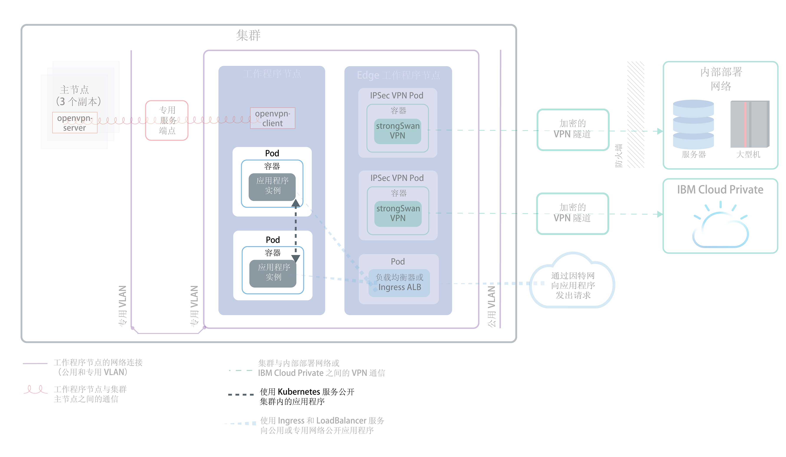
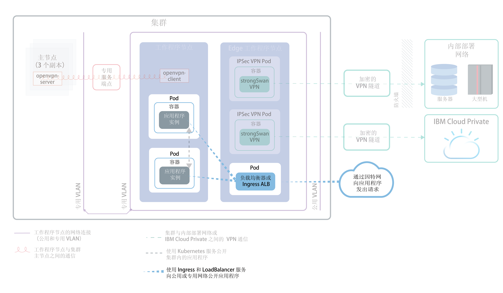
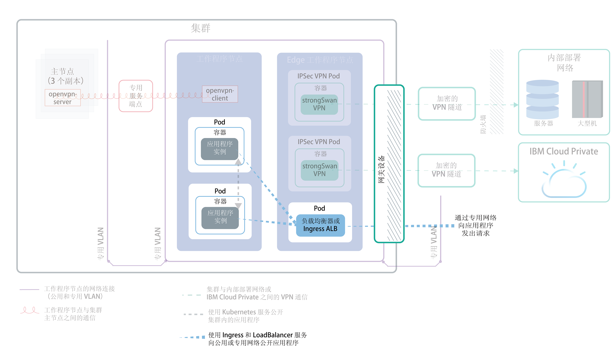

---

copyright:
  years: 2014, 2019
lastupdated: "2019-03-21"

keywords: kubernetes, iks

subcollection: containers

---

{:new_window: target="_blank"}
{:shortdesc: .shortdesc}
{:screen: .screen}
{:pre: .pre}
{:table: .aria-labeledby="caption"}
{:codeblock: .codeblock}
{:tip: .tip}
{:note: .note}
{:important: .important}
{:deprecated: .deprecated}
{:download: .download}

# 规划利用集群内联网和外部联网来公开应用程序
{: #cs_network_planning}

借助 {{site.data.keyword.containerlong}}，您可以通过使应用程序可供公开或专用访问来管理集群内联网和外部联网。
{: shortdesc}

此页面可帮助您规划应用程序的集群内联网和外部联网。有关设置集群进行联网的信息，请参阅[设置集群网络](/docs/containers?topic=containers-cs_network_cluster)。
{: tip}

## 通过 Kubernetes 服务向集群内部流量公开应用程序
{: #in-cluster}

创建 Kubernetes Discovery 服务，以允许集群中的 pod 之间通信。
{: shortdesc}

<figure>
 
 <figcaption>使用 Kubernetes 服务公开集群内部的应用程序</figcaption>
</figure>

部署到工作程序节点的所有 pod 都会分配有 172.30.0.0/16 范围内的专用 IP 地址，并且仅在工作程序节点之间路由这些 pod。为了避免冲突，请勿在与工作程序节点通信的任何节点上使用此 IP 范围。工作程序节点和 pod 可以使用专用 IP 地址在专用网络上安全地通信。但是，当 pod 崩溃或需要重新创建工作程序节点时，会分配新的专用 IP 地址。

缺省情况下，很难跟踪必须高度可用的应用程序不断变化的专用 IP 地址。可以改为使用内置 Kubernetes 服务发现功能，以将应用程序公开为专用网络上的集群 IP 服务。Kubernetes 服务会将一些 pod 分组在一起，并提供与这些 pod 的网络连接。此连接提供了与集群中其他服务的连接，而无需公开每个 pod 的实际专用 IP 地址。服务会分配有只能在集群内部访问的集群内 IP 地址。
* 旧集群：对于 2018 年 2 月之前在 dal13 专区中创建的集群或 2017 年 10 月之前在其他任何专区中创建的集群，服务会分配有 10.10.10.0/24 范围内 254 个 IP 中的其中一个 IP。如果达到 254 个服务的限制，并且需要更多服务，那么必须创建新的集群。
* 新集群：对于 2018 年 2 月之后在 dal13 专区中创建的集群或 2017 年 10 月之后在其他任何专区中创建的集群，服务会分配有 172.21.0.0/16 范围内的 65,000 个 IP 中的其中一个 IP。

为了避免冲突，请勿在与工作程序节点通信的任何节点上使用此 IP 范围。此外，会为该服务创建 DNS 查找条目，并将该条目存储在集群的 `kube-dns` 组件中。DNS 条目包含服务名称、在其中创建服务的名称空间以及指向分配的集群内 IP 地址的链接。

应用程序要访问位于集群服务后端的 pod，可以使用该服务的集群内 IP 地址，也可以使用该服务的名称发送请求。使用服务名称时，会在 `kube-dns` 组件中查找该名称，并将其路由到服务的集群内 IP 地址。请求到达服务时，服务会将所有请求都同等转发到 pod，而不考虑 pod 的集群内 IP 地址和部署到的工作程序节点。

 

## 选择 NodePort、LoadBalancer 或 Ingress 服务，以向集群外部流量公开应用程序
{: #external}

为了支持通过公用因特网或专用网络从外部访问应用程序，{{site.data.keyword.containerlong_notm}} 支持三种联网服务。
{:shortdesc}

**[NodePort 服务](/docs/containers?topic=containers-nodeport)**（免费和标准集群）
* 在每个工作程序节点上公开一个端口，并使用任一工作程序节点的公共或专用 IP 地址来访问集群中的服务。
* Iptables 是一个 Linux 内核功能，用于在应用程序的 pod 之间对请求进行负载均衡，提供高性能的网络路由，并提供网络访问控制。
* 工作程序节点的公共和专用 IP 地址不是永久固定的。除去或重新创建工作程序节点时，将为该工作程序节点分配新的公共 IP 地址和新的专用 IP 地址。
* NodePort 服务适合于测试公共或专用访问。如果您只需要短时间的公共或专用访问，那么也可以使用此服务。

**[LoadBalancer 服务](/docs/containers?topic=containers-loadbalancer)**（仅限标准集群）
* 每个标准集群供应有四个可移植的公共 IP 地址和四个可移植的专用 IP 地址，这些 IP 地址可以用于为应用程序创建外部 TCP/UDP 负载均衡器。您可以通过公开应用程序需要的任何端口来定制负载均衡器。
* Iptables 是一个 Linux 内核功能，用于在应用程序的 pod 之间对请求进行负载均衡，提供高性能的网络路由，并提供网络访问控制。
* 分配给负载均衡器的可移植公共和专用 IP 地址是永久固定的，在集群中重新创建工作程序节点时不会更改。
* 您可以为应用程序创建用于向 DNS 条目注册公共负载均衡器 IP 地址的主机名。还可以对每个主机名的负载均衡器 IP 启用运行状况检查监视器。

**[Ingress](/docs/containers?topic=containers-ingress)**（仅限标准集群）
* 通过创建一个外部 HTTP、HTTPS 或 TCP 应用程序负载均衡器 (ALB)，公开集群中的多个应用程序。ALB 使用安全的唯一公共或专用入口点（即 Ingress 子域）将入局请求路由到应用程序。
* 可以使用一个路径，将集群中的多个应用程序公开为服务。
* Ingress 由三个组件组成：
  * Ingress 资源用于定义如何对应用程序的入局请求进行路由和负载均衡的规则。
  * ALB 用于侦听入局 HTTP、HTTPS 或 TCP 服务请求。ALB 根据在 Ingress 资源中定义的规则，在各个应用程序 pod 之间转发请求。
  * 多专区负载均衡器 (MZLB) 用于处理对应用程序的所有入局请求，并在各个专区中的 ALB 之间对请求进行负载均衡。此外，它还支持对每个专区中的 ALB IP 地址执行运行状况检查。
* 如果需要通过定制路由规则来实施您自己的 ALB，并且需要对应用程序进行 SSL 终止，请使用 Ingress。

要为应用程序选择最佳联网服务，可以遵循以下决策树，并单击其中一个选项以开始使用。

<map name="networking_map" id="networking_map">
<area href="/docs/containers?topic=containers-nodeport" alt="Nodeport 服务" shape="circle" coords="52, 283, 45"/>
<area href="/docs/containers?topic=containers-loadbalancer" alt="LoadBalancer 服务" shape="circle" coords="247, 419, 44"/>
<area href="/docs/containers?topic=containers-ingress" alt="Ingress 服务" shape="circle" coords="445, 420, 45"/>
</map>

要了解有关 {{site.data.keyword.containerlong_notm}} 中可用负载均衡部署模式的更多详细信息吗？请查看此[博客帖子 ](https://www.ibm.com/blogs/bluemix/2018/10/ibm-cloud-kubernetes-service-deployment-patterns-for-maximizing-throughput-and-availability/)。
{: tip}

 

## 为公用和专用 VLAN 设置规划公共外部联网
{: #public_access}

在 {{site.data.keyword.containerlong_notm}} 中创建 Kubernetes 集群时，可以将集群连接到公用 VLAN。公用 VLAN 用于确定分配给每个工作程序节点的公共 IP 地址，这将为每个工作程序节点提供一个公用网络接口。
{:shortdesc}

<figure>
 
 <figcaption>在缺省联网设置中将应用程序公开到公用网络</figcaption>
</figure>

工作程序节点的公用网络接口通过集群创建期间在每个工作程序节点上配置的[预定义 Calico 网络策略设置](/docs/containers?topic=containers-network_policies#default_policy)进行保护。

缺省情况下，所有工作程序节点都允许所有出站网络流量。入站网络流量会被阻止，但有几个端口例外。这些端口已打开，以便 IBM 可以监视网络流量，并自动为 Kubernetes 主节点安装安全性更新，同时还可以建立与 NodePort、LoadBalancer 和 Ingress 服务的连接。有关这些策略的更多信息（包括如何修改这些策略），请参阅[网络策略](/docs/containers?topic=containers-network_policies#network_policies)。

要使应用程序在因特网上公开可用，可以创建 NodePort、LoadBalancer 或 Ingress 服务。要比较每个服务，请参阅[选择 NodePort、LoadBalancer 或 Ingress 服务](#external)。

下图显示了在 {{site.data.keyword.containerlong_notm}} 中 Kubernetes 如何转发公用网络流量。

 

## 为公用和专用 VLAN 设置规划专用外部联网
{: #private_both_vlans}

工作程序节点同时连接至公用 VLAN 和专用 VLAN 时，可以通过创建专用 NodePort、LoadBalancer 或 Ingress 服务来使应用程序只能从专用网络进行访问。然后，可以创建 Calico 策略以阻止流至服务的公共流量。
{: shortdesc}

工作程序节点的公用网络接口通过集群创建期间在每个工作程序节点上配置的[预定义 Calico 网络策略设置](/docs/containers?topic=containers-network_policies#default_policy)进行保护。缺省情况下，所有工作程序节点都允许所有出站网络流量。入站网络流量会被阻止，但有几个端口例外。这些端口已打开，以便 IBM 可以监视网络流量，并自动为 Kubernetes 主节点安装安全性更新，同时还可以建立与 NodePort、LoadBalancer 和 Ingress 服务的连接。

如果要仅通过专用网络公开应用程序，您可以创建专用 NodePort、LoadBalancer 或 Ingress 服务。

**NodePort**
* [创建 NodePort 服务](/docs/containers?topic=containers-nodeport)。除了公共 IP 地址外，NodePort 服务还可用于工作程序节点的专用 IP 地址。
* NodePort 服务通过工作程序节点的专用和公共 IP 地址，在工作程序节点上打开一个端口。必须使用 [Calico DNAT 前网络策略](/docs/containers?topic=containers-network_policies#block_ingress)来阻止公共 NodePort。

**LoadBalancer**
* [创建专用 LoadBalancer 服务](/docs/containers?topic=containers-loadbalancer)。
* 具有可移植专用 IP 地址的 LoadBalancer 服务仍在每个工作程序节点上打开公共节点端口。必须使用 [Calico DNAT 前网络策略](/docs/containers?topic=containers-network_policies#block_ingress)来阻止其上的公共节点端口。

**Ingress**
* 创建集群时，会自动创建一个公共和一个专用 Ingress 应用程序负载均衡器 (ALB)。由于缺省情况下会启用公共 ALB，而禁用专用 ALB，因此必须[禁用公共 ALB](/docs/containers?topic=containers-cs_cli_reference#cs_alb_configure) 而[启用专用 ALB](/docs/containers?topic=containers-ingress#private_ingress)。
* 然后，[创建专用 Ingress 服务](/docs/containers?topic=containers-ingress#ingress_expose_private)。

由于缺省 Calico 网络策略允许流至这些服务的入站公共流量，因此您可以创建 Calico 策略，以改为阻止流至这些服务的所有公共流量。例如，NodePort 服务通过工作程序节点的专用和公共 IP 地址，在工作程序节点上打开一个端口。具有可移植专用 IP 地址的 LoadBalancer 服务会在每个工作程序节点上打开一个公共 NodePort。必须创建 [Calico DNAT 前网络策略](/docs/containers?topic=containers-network_policies#block_ingress)来阻止公共 NodePort。

例如，假设创建了专用 LoadBalancer 服务。另外还创建了 Calico DNAT 前策略，以阻止公共流量到达负载均衡器打开的公共 NodePort。可通过以下对象访问此专用负载均衡器：
* 同一集群中的任何 pod
* 同一 {{site.data.keyword.Bluemix_notm}} 帐户中任何集群中的任何 pod
* 连接到同一 {{site.data.keyword.Bluemix_notm}} 帐户中任何专用 VLAN 的任何系统（如果已[启用 VLAN 生成](/docs/containers?topic=containers-subnets#subnet-routing)）
* 通过 VPN 连接来连接到负载均衡器 IP 所在子网的任何系统（如果您不在 {{site.data.keyword.Bluemix_notm}} 帐户中，但仍在公司防火墙后）
* 通过 VPN 连接来连接到负载均衡器 IP 所在子网的任何系统（如果您位于其他 {{site.data.keyword.Bluemix_notm}} 帐户中）

 

## 为仅专用 VLAN 设置规划专用外部联网
{: #plan_private_vlan}

如果工作程序节点连接到仅专用 VLAN，并且您允许主节点与工作程序节点通过[网关设备](/docs/containers?topic=containers-cs_network_ov#cs_network_ov_master_gateway)进行通信，那么可以创建专用 NodePort、LoadBalancer 或 Ingress 服务，使应用程序只能从专用网络进行访问。
{: shortdesc}

<figure>
 
 <figcaption>在专用联网设置中将应用程序公开到专用网络</figcaption>
</figure>

由于工作程序节点未连接到公用 VLAN，因此不会将公共流量路由到这些服务。您还必须在网关设备防火墙中[打开必需的端口和 IP 地址](/docs/containers?topic=containers-firewall#firewall_inbound)，以允许流至这些服务的入站流量。

**NodePort**：
* [创建专用 NodePort 服务](/docs/containers?topic=containers-nodeport)。该服务通过工作程序节点的专用 IP 地址可用。
* 在专用防火墙中，打开将服务部署到允许流量流至的所有工作程序节点的专用 IP 地址时所配置的端口。要查找该端口，请运行 `kubectl get svc`。端口在 20000-32000 范围内。

**LoadBalancer**
* [创建专用 LoadBalancer 服务](/docs/containers?topic=containers-loadbalancer)。如果集群仅在专用 VLAN 上可用，那么将使用 4 个可用的可移植专用 IP 地址中的一个地址。
* 在专用防火墙中，打开将服务部署到 LoadBalancer 服务的专用 IP 地址时所配置的端口。

**Ingress**：
* 必须配置[专用网络上可用的 DNS 服务 ](https://kubernetes.io/docs/tasks/administer-cluster/dns-custom-nameservers/)。
* 创建集群时，会自动创建专用 Ingress 应用程序负载均衡器 (ALB)，但缺省情况下并未启用 ALB。必须[启用专用 ALB](/docs/containers?topic=containers-ingress#private_ingress)。
* 然后，[创建专用 Ingress 服务](/docs/containers?topic=containers-ingress#ingress_expose_private)。
* 在专用防火墙中，针对专用 ALB 的 IP 地址打开端口 80（对于 HTTP）或端口 443（对于 HTTPS）。

如果集群连接到仅专用 VLAN，并且您允许主节点与工作程序节点通过仅专用服务端点进行通信，那么无法将应用程序公开到专用网络。您必须设置网关设备（如 [VRA](/docs/infrastructure/virtual-router-appliance?topic=virtual-router-appliance-about-the-vra) 或 [FSA](/docs/services/vmwaresolutions/services?topic=vmware-solutions-fsa_considerations)）以充当防火墙并阻止不需要的流量。如果不想设置网关设备，那么可以[创建工作程序池](/docs/containers?topic=containers-clusters#add_pool)，即连接到公用和专用 VLAN 的工作程序池。然后，可以将这些工作程序节点标记为边缘节点，并使用 Calico 策略来阻止所有不需要的公共流量。有关更多信息，请参阅[将联网工作负载隔离到边缘工作程序节点](/docs/containers?topic=containers-cs_network_planning#both_vlans_private_edge)。
{: note}

 

## 可选：将联网工作负载隔离到边缘工作程序节点
{: #both_vlans_private_edge}

边缘工作程序节点通过减少允许外部访问的工作程序节点，并隔离联网工作负载，可以提高集群的安全性。要确保 Ingress 和负载均衡器 pod 仅部署到指定的工作程序节点，请[将工作程序节点标注为边缘节点](/docs/containers?topic=containers-edge#edge_nodes)。此外，要防止其他工作负载在边缘节点上运行，请[感染边缘节点](/docs/containers?topic=containers-edge#edge_workloads)。
{: shortdesc}

如果集群连接到公用 VLAN，但您希望阻止流量流至边缘工作程序节点上的公共节点端口，那么还可以使用 [Calico DNAT 前网络策略](/docs/containers?topic=containers-network_policies#block_ingress)。阻止节点端口可确保边缘工作程序节点是处理入局流量的唯一工作程序节点。

## 可选：隔离专用网络上的集群
{: #isolate}

如果有多专区集群、有多个 VLAN 用于单专区集群，或者在同一 VLAN 上有多个子网，那么必须[启用 VLAN 生成](/docs/infrastructure/vlans?topic=vlans-vlan-spanning#vlan-spanning)或 [VRF](/docs/infrastructure/direct-link?topic=direct-link-overview-of-virtual-routing-and-forwarding-vrf-on-ibm-cloud#customer-vrf-overview)，以便工作程序节点可以在专用网络上相互通信。但是，启用 VLAN 生成或 VRF 后，连接到同一 IBM Cloud 帐户中任何专用 VLAN 的任何系统都可以访问工作程序。您可以使用 [Calico 网络策略](/docs/containers?topic=containers-network_policies#isolate_workers)将多专区集群与专用网络上的其他系统相隔离。这些策略还允许在专用防火墙中打开的专用 IP 范围和端口的流量流入和流出。
{: shortdesc}
