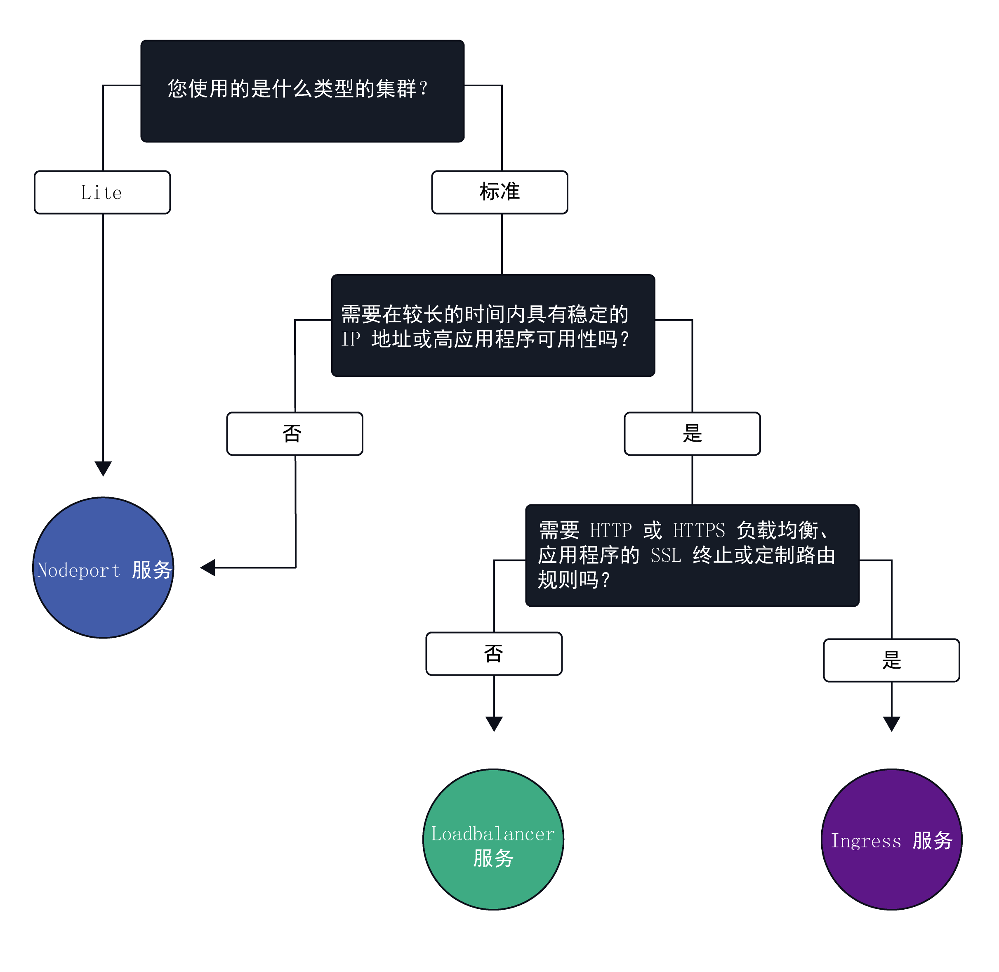
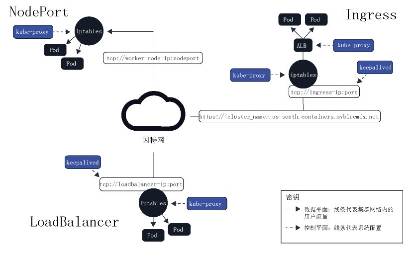

---

copyright:
  years: 2014, 2018
lastupdated: "2018-08-06"

---

{:new_window: target="_blank"}
{:shortdesc: .shortdesc}
{:screen: .screen}
{:pre: .pre}
{:table: .aria-labeledby="caption"}
{:codeblock: .codeblock}
{:tip: .tip}
{:download: .download}

# 规划集群联网
{: #planning}

借助 {{site.data.keyword.containerlong}}，您可以通过支持以公开或专用方式访问应用程序以及在集群中建立内部联网来管理外部联网。
{: shortdesc}

## 选择 NodePort、LoadBalancer 或 Ingress 服务
{: #external}

为了支持通过[公用因特网](#public_access)或[专用网络](#private_both_vlans)从外部访问应用程序，{{site.data.keyword.containershort_notm}} 支持三种联网服务。
{:shortdesc}

**[NodePort 服务](cs_nodeport.html)**（免费和标准集群）
* 在每个工作程序节点上公开一个端口，并使用任一工作程序节点的公共或专用 IP 地址来访问集群中的服务。
* Iptables 是一个 Linux 内核功能，用于在应用程序的 pod 之间对请求进行负载均衡，提供高性能的网络路由，并提供网络访问控制。
* 工作程序节点的公共和专用 IP 地址不是永久固定的。除去或重新创建工作程序节点时，将为该工作程序节点分配新的公共 IP 地址和新的专用 IP 地址。
* NodePort 服务适合于测试公共或专用访问。如果您只需要短时间的公共或专用访问，那么也可以使用此服务。

**[LoadBalancer 服务](cs_loadbalancer.html)**（仅限标准集群）
* 每个标准集群供应有四个可移植的公共 IP 地址和四个可移植的专用 IP 地址，这些 IP 地址可以用于为应用程序创建外部 TCP/UDP 负载均衡器。
* Iptables 是一个 Linux 内核功能，用于在应用程序的 pod 之间对请求进行负载均衡，提供高性能的网络路由，并提供网络访问控制。
* 分配给负载均衡器的可移植公共和专用 IP 地址是永久固定的，在集群中重新创建工作程序节点时不会更改。
* 您可以通过公开应用程序需要的任何端口来定制负载均衡器。

**[Ingress](cs_ingress.html)**（仅限标准集群）
* 通过创建一个外部 HTTP 或 HTTPS、TCP 或 UDP 应用程序负载均衡器 (ALB)，公开集群中的多个应用程序。ALB 使用安全的唯一公共或专用入口点将入局请求路由到应用程序。
* 可以使用一个路径，将集群中的多个应用程序公开为服务。
* Ingress 由三个组件组成：
  * Ingress 资源用于定义如何对应用程序的入局请求进行路由和负载均衡的规则。
  * ALB 用于侦听入局 HTTP 或 HTTPS、TCP 或 UDP 服务请求。ALB 根据在 Ingress 资源中定义的规则，在各个应用程序 pod 之间转发请求。
  * 多专区负载均衡器 (MZLB) 用于处理对应用程序的所有入局请求，并在各个专区中的 ALB 之间对请求进行负载均衡。
* 如果要通过定制路由规则来实施自己的 ALB，并需要对应用程序进行 SSL 终止，可使用 Ingress。

要为应用程序选择最佳联网服务，可以遵循以下决策树，并单击其中一个选项以开始使用。

<map name="networking_map" id="networking_map">
<area href="/docs/containers/cs_nodeport.html" alt="Nodeport 服务" shape="circle" coords="52, 283, 45"/>
<area href="/docs/containers/cs_loadbalancer.html" alt="LoadBalancer 服务" shape="circle" coords="247, 419, 44"/>
<area href="/docs/containers/cs_ingress.html" alt="Ingress 服务" shape="circle" coords="445, 420, 45"/>
</map>

 

## 规划公用外部联网
{: #public_access}

在 {{site.data.keyword.containershort_notm}} 中创建 Kubernetes 集群时，可以将集群连接到公用 VLAN。公用 VLAN 用于确定分配给每个工作程序节点的公共 IP 地址，这将为每个工作程序节点提供一个公用网络接口。
{:shortdesc}

要使应用程序在因特网上公开可用，可以创建 NodePort、LoadBalancer 或 Ingress 服务。要比较每个服务，请参阅[选择 NodePort、LoadBalancer 或 Ingress 服务](#external)。

下图显示了在 {{site.data.keyword.containershort_notm}} 中 Kubernetes 如何转发公用网络流量。

*{{site.data.keyword.containershort_notm}} 中的 Kubernetes 数据平面*

免费集群和标准集群中的工作程序节点的公用网络接口受 Calico 网络策略保护。缺省情况下，这些策略将阻止大多数入站流量。但是，允许 Kubernetes 正常运行所需的入站流量，正如与 NodePort、LoadBalancer 和 Ingress 服务的连接一样。有关这些策略的更多信息（包括如何修改这些策略），请参阅[网络策略](cs_network_policy.html#network_policies)。

 

## 为公用和专用 VLAN 设置规划专用外部联网
{: #private_both_vlans}

在 {{site.data.keyword.containershort_notm}} 中创建 Kubernetes 集群时，必须将集群连接到专用 VLAN。专用 VLAN 用于确定分配给每个工作程序节点的专用 IP 地址，这将为每个工作程序节点提供一个专用网络接口。
{:shortdesc}

当您希望仅使应用程序保持连接到专用网络时，可以将专用网络接口用于标准集群中的工作程序节点。但是，工作程序节点同时连接到公用和专用 VLAN 时，还必须使用 Calico 网络策略来保护集群免受不需要的公共访问。

以下各部分描述了 {{site.data.keyword.containershort_notm}} 中的功能，您可以使用这些功能将应用程序公开到专用网络，并保护集群免受不需要的公共访问。（可选）您还可以隔离联网工作负载，并将集群连接到内部部署网络中的资源。

### 使用专用联网服务公开应用程序，并使用 Calico 网络策略保护集群
{: #private_both_vlans_calico}

工作程序节点的公用网络接口通过集群创建期间在每个工作程序节点上配置的[预定义 Calico 网络策略设置](cs_network_policy.html#default_policy)进行保护。缺省情况下，所有工作程序节点都允许所有出站网络流量。入站网络流量会被阻止，但有几个端口例外；打开这些端口是为了供 IBM 监视网络流量，以及供 IBM 自动为 Kubernetes 主节点安装安全性更新。对工作程序节点的 kublet 的访问通过 OpenVPN 隧道进行保护。有关更多信息，请参阅 [{{site.data.keyword.containershort_notm}} 体系结构](cs_tech.html)。

如果使用 NodePort 服务、LoadBalancer 服务或 Ingress 应用程序负载均衡器来公开应用程序，那么缺省 Calico 策略还允许来自因特网的入站网络流量流至这些服务。要使应用程序只能从专用网络访问，可以选择仅使用专用 NodePort、LoadBalancer 或 Ingress 服务，并阻止所有公共流量流至这些服务。

**NodePort**
* [创建 NodePort 服务](cs_nodeport.html)。除了公共 IP 地址外，NodePort 服务还可用于工作程序节点的专用 IP 地址。
* NodePort 服务通过工作程序节点的专用和公共 IP 地址，在工作程序节点上打开一个端口。必须使用 [Calico DNAT 前网络策略](cs_network_policy.html#block_ingress)来阻止公共 NodePort。

**LoadBalancer**
* [创建专用 LoadBalancer 服务](cs_loadbalancer.html)。
* 具有可移植专用 IP 地址的 LoadBalancer 服务仍在每个工作程序节点上打开公共节点端口。必须使用 [Calico DNAT 前网络策略](cs_network_policy.html#block_ingress)来阻止其上的公共节点端口。

**Ingress**
* 创建集群时，会自动创建一个公共和一个专用 Ingress 应用程序负载均衡器 (ALB)。由于缺省情况下会启用公共 ALB，而禁用专用 ALB，因此必须[禁用公共 ALB](cs_cli_reference.html#cs_alb_configure) 而[启用专用 ALB](cs_ingress.html#private_ingress)。
* 然后，[创建专用 Ingress 服务](cs_ingress.html#ingress_expose_private)。

有关每个服务的更多信息，请参阅[选择 NodePort、LoadBalancer 或 Ingress 服务](#external)。

### 可选：将联网工作负载隔离到边缘工作程序节点
{: #private_both_vlans_edge}

边缘工作程序节点通过减少允许外部访问的工作程序节点，并隔离联网工作负载，可以提高集群的安全性。要确保 Ingress 和负载均衡器 pod 仅部署到指定的工作程序节点，请[将工作程序节点标记为边缘节点](cs_edge.html#edge_nodes)。此外，要防止其他工作负载在边缘节点上运行，请[感染边缘节点](cs_edge.html#edge_workloads)。

然后，使用 [Calico DNAT 前网络策略](cs_network_policy.html#block_ingress)来阻止运行边缘工作程序节点的集群上流至公共节点端口的流量。阻止节点端口可确保边缘工作程序节点是处理入局流量的唯一工作程序节点。

### 可选：使用 strongSwan VPN 连接到内部部署数据库
{: #private_both_vlans_vpn}

要将工作程序节点和应用程序安全地连接到内部部署网络，可以设置 [strongSwan IPSec VPN 服务 ](https://www.strongswan.org/about.html)。strongSwan IPSec VPN 服务基于业界标准因特网协议安全性 (IPSec) 协议组，通过因特网提供安全的端到端通信信道。要在集群与内部部署网络之间设置安全连接，请在集群的 pod 中直接[配置和部署 strongSwan IPSec VPN 服务](cs_vpn.html#vpn-setup)。

 

## 仅为专用 VLAN 设置规划专用外部联网
{: #private_vlan}

在 {{site.data.keyword.containershort_notm}} 中创建 Kubernetes 集群时，必须将集群连接到专用 VLAN。专用 VLAN 用于确定分配给每个工作程序节点的专用 IP 地址，这将为每个工作程序节点提供一个专用网络接口。
{:shortdesc}

当您希望工作程序节点仅连接到专用 VLAN 时，可以将专用网络接口用于工作程序节点，以使应用程序仅保持连接到专用网络。然后，可以使用网关设备来确保集群免受不需要的公共访问。

以下各部分描述了 {{site.data.keyword.containershort_notm}} 中的功能，您可以使用这些功能来保护集群免受不需要的公共访问，向专用网络公开应用程序，以及连接到内部部署网络中的资源。

### 配置网关设备
{: #private_vlan_gateway}

如果工作程序节点设置为仅使用专用 VLAN，那么必须为网络连接配置备用解决方案。可以使用定制网络策略来设置防火墙，以便为标准集群提供专用网络安全性，检测网络侵入并进行补救。例如，可以选择设置[虚拟路由器设备](/docs/infrastructure/virtual-router-appliance/about.html)或 [Fortigate Security Appliance](/docs/infrastructure/fortigate-10g/about.html)，以充当防火墙并阻止不需要的流量。设置防火墙时，[还必须为每个区域打开必需的端口和 IP 地址](cs_firewall.html#firewall_outbound)，以便主节点和工作程序节点可以通信。 

**注**：如果您有现有路由器设备，然后添加集群，那么不会在该路由器设备上配置为集群订购的新可移植子网。要使用联网服务，必须通过 [启用 VLAN 生成](cs_subnets.html#vra-routing)启用同一 VLAN 上子网之间的路由。

### 使用专用联网服务公开应用程序
{: #private_vlan_services}

要使应用程序只能从专用网络访问，可以使用专用 NodePort、LoadBalancer 或 Ingress 服务。由于工作程序节点未连接到公用 VLAN，因此不会将公共流量路由到这些服务。

**NodePort**：
* [创建专用 NodePort 服务](cs_nodeport.html)。该服务通过工作程序节点的专用 IP 地址可用。
* 在专用防火墙中，打开将服务部署到允许流量流至的所有工作程序节点的专用 IP 地址时所配置的端口。要查找该端口，请运行 `kubectl get svc`。端口在 20000-32000 范围内。

**LoadBalancer**
* [创建专用 LoadBalancer 服务](cs_loadbalancer.html)。如果集群仅在专用 VLAN 上可用，那么将使用 4 个可用的可移植专用 IP 地址中的一个地址。
* 在专用防火墙中，打开将服务部署到 LoadBalancer 服务的专用 IP 地址时所配置的端口。

**Ingress**：
* 创建集群时，会自动创建专用 Ingress 应用程序负载均衡器 (ALB)，但缺省情况下并未启用 ALB。必须[启用专用 ALB](cs_ingress.html#private_ingress)。
* 然后，[创建专用 Ingress 服务](cs_ingress.html#ingress_expose_private)。
* 在专用防火墙中，针对专用 ALB 的 IP 地址打开端口 80（对于 HTTP）或端口 443（对于 HTTPS）。

有关每个服务的更多信息，请参阅[选择 NodePort、LoadBalancer 或 Ingress 服务](#external)。

### 可选：使用网关设备连接到内部部署数据库
{: #private_vlan_vpn}

要将工作程序节点和应用程序安全地连接到内部部署网络，必须设置 VPN 网关。还可以使用设置为防火墙的[虚拟路由器设备 (VRA)](/docs/infrastructure/virtual-router-appliance/about.html) 或 [Fortigate Security Appliance (FSA)](/docs/infrastructure/fortigate-10g/about.html) 来配置 IPSec VPN 端点。要配置 VRA，请参阅[使用 VRA 设置 VPN 连接](cs_vpn.html#vyatta)。

 

## 规划集群内联网
{: #in-cluster}

部署到工作程序节点的所有 pod 都会分配有 172.30.0.0/16 范围内的专用 IP 地址，并且仅在工作程序节点之间路由这些 pod。为了避免冲突，请勿在与工作程序节点通信的任何节点上使用此 IP 范围。工作程序节点和 pod 可以使用专用 IP 地址在专用网络上安全地通信。但是，当 pod 崩溃或需要重新创建工作程序节点时，会分配新的专用 IP 地址。

缺省情况下，很难跟踪必须具备高可用性的应用程序不断变化的专用 IP 地址。可以改为使用内置 Kubernetes 服务发现功能，以将应用程序公开为专用网络上的集群 IP 服务。Kubernetes 服务会将一些 pod 分组在一起，并提供与这些 pod 的网络连接，以供集群中的其他服务使用，而无需公开每个 pod 的实际专用 IP 地址。服务会分配有只能在集群内部访问的集群内 IP 地址。
* **旧集群**：对于 2018 年 2 月之前在 dal13 专区中创建的集群或 2017 年 10 月之前在其他任何专区中创建的集群，服务会分配有 10.10.10.0/24 范围内的 254 个 IP 之一。如果达到 254 个服务的限制，并且需要更多服务，那么必须创建新的集群。
* **新集群**：对于 2018 年 2 月之后在 dal13 专区中创建的集群或 2017 年 10 月之后在其他任何专区中创建的集群，服务会分配有 172.21.0.0/16 范围内的 65,000 个 IP 之一。

为了避免冲突，请勿在与工作程序节点通信的任何节点上使用此 IP 范围。此外，会为该服务创建 DNS 查找条目，并将该条目存储在集群的 `kube-dns` 组件中。DNS 条目包含服务名称、在其中创建服务的名称空间以及指向分配的集群内 IP 地址的链接。

应用程序要访问位于集群 IP 服务后端的 pod，可以使用该服务的集群内 IP 地址，也可以使用该服务的名称发送请求。使用服务名称时，会在 `kube-dns` 组件中查找该名称，并将其路由到服务的集群内 IP 地址。请求到达服务时，服务会确保所有请求都同等转发到 pod，而不考虑其集群内 IP 地址和部署到的工作程序节点。
