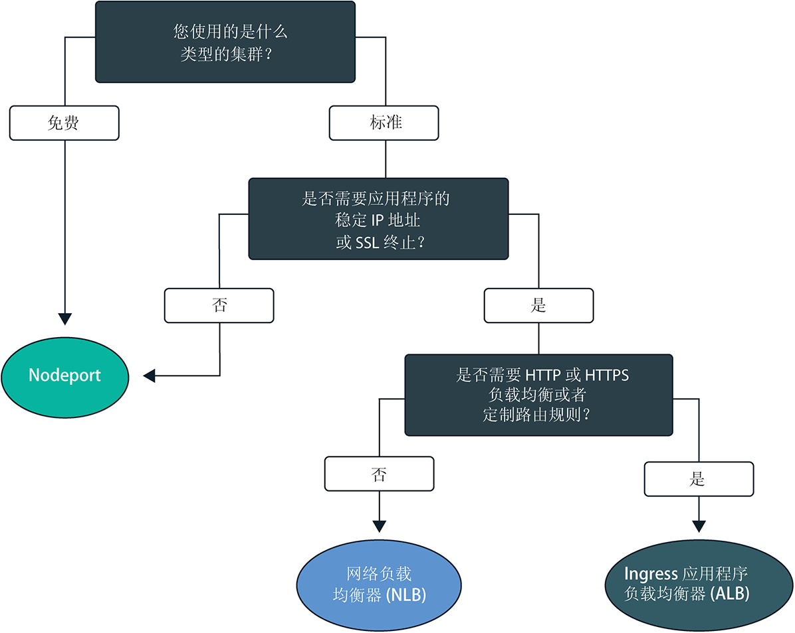
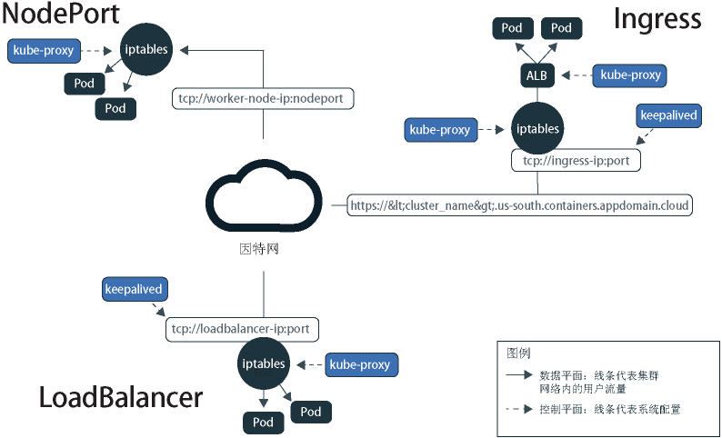
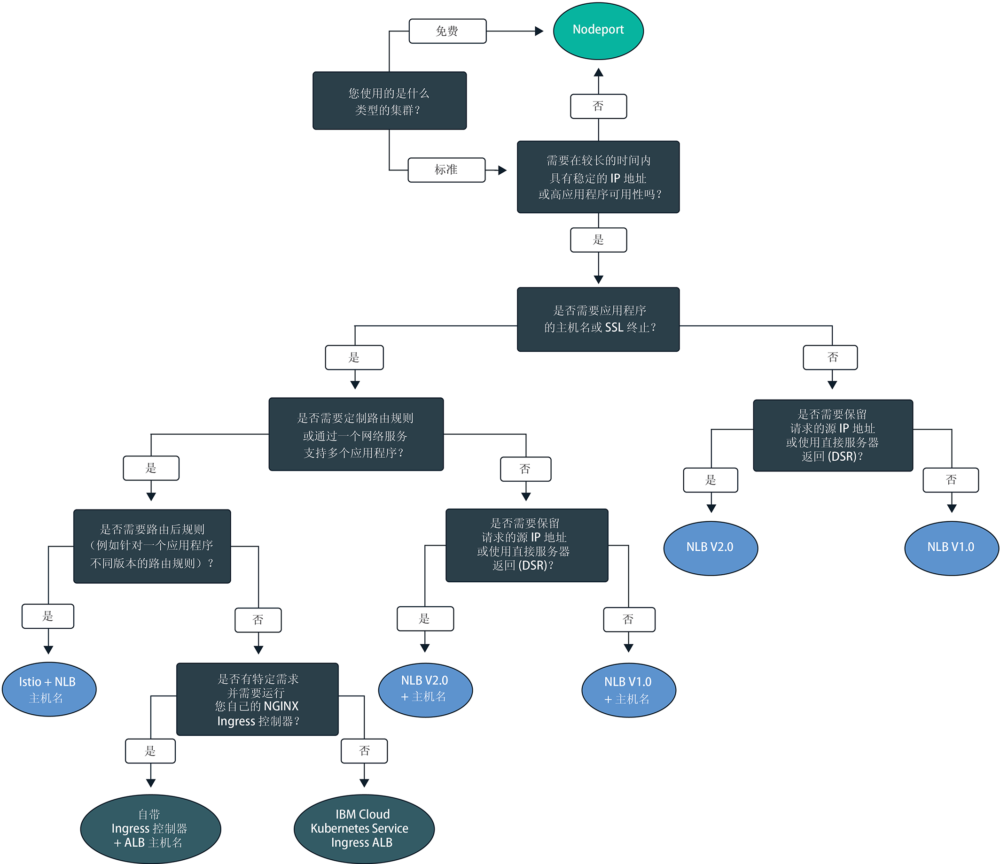

---

copyright:
  years: 2014, 2019
lastupdated: "2019-06-05"

keywords: kubernetes, iks

subcollection: containers

---

{:new_window: target="_blank"}
{:shortdesc: .shortdesc}
{:screen: .screen}
{:pre: .pre}
{:table: .aria-labeledby="caption"}
{:codeblock: .codeblock}
{:tip: .tip}
{:note: .note}
{:important: .important}
{:deprecated: .deprecated}
{:download: .download}
{:preview: .preview}

# 规划应用程序的集群内联网和外部联网
{: #cs_network_planning}

借助 {{site.data.keyword.containerlong}}，您可以通过使应用程序可供公开或专用访问来管理集群内联网和外部联网。
{: shortdesc}

要快速开始使用应用程序联网，请遵循以下决策树，然后单击其中一个选项以查看其设置文档：

<map name="networking_map" id="networking_map">
<area target="" href="/docs/containers?topic=containers-nodeport" alt="NodePort 服务" coords="52,254,78,260,93,270,101,285,92,302,72,314,49,318,19,309,0,281,18,263" shape="poly">
<area target="" href="/docs/containers?topic=containers-loadbalancer" alt="网络负载均衡器 (NLB) 服务" coords="288,405,324,414,348,434,350,455,327,471,295,477,246,471,222,446,237,417" shape="poly">
<area target="" href="/docs/containers?topic=containers-ingress" alt="Ingress 应用程序负载均衡器 (ALB) 服务" coords="532,405,568,410,593,427,600,448,582,468,554,477,508,476,467,463,454,441,474,419" shape="poly">
</map>

## 通过 Kubernetes 服务发现了解应用程序负载均衡
{: #in-cluster}

Kubernetes 服务发现使用网络服务和本地 Kubernetes 代理为应用程序提供网络连接。
{: shortdesc}

**服务** 
部署到工作程序节点的所有 pod 都会分配有 172.30.0.0/16 范围内的专用 IP 地址，并且仅在工作程序节点之间路由这些 pod。为了避免冲突，请勿在与工作程序节点通信的任何节点上使用此 IP 范围。工作程序节点和 pod 可以使用专用 IP 地址在专用网络上安全地通信。但是，当 pod 崩溃或需要重新创建工作程序节点时，会分配新的专用 IP 地址。

您不用尝试跟踪必须具有高可用性的应用程序不断变化的专用 IP 地址，而可以改为使用内置 Kubernetes 服务发现功能将应用程序公开为服务。Kubernetes 服务会将一些 pod 分组在一起，并提供与这些 pod 的网络连接。服务会通过标签选择将流量路由到的目标 pod。

服务提供了应用程序 pod 与集群中其他服务的连接，而无需公开每个 pod 的实际专用 IP 地址。服务会分配有只能在集群内部访问的集群内 IP 地址 `clusterIP`。此 IP 地址在服务的整个生命周期内绑定到服务，并且在服务存在期间不会更改。
* 新集群：对于 2018 年 2 月之后在 dal13 专区中创建的集群或 2017 年 10 月之后在其他任何专区中创建的集群，服务会分配有 172.21.0.0/16 范围内的 65,000 个 IP 中的其中一个 IP。
* 旧集群：对于 2018 年 2 月之前在 dal13 专区中创建的集群或 2017 年 10 月之前在其他任何专区中创建的集群，服务会分配有 10.10.10.0/24 范围内 254 个 IP 中的其中一个 IP。如果达到 254 个服务的限制，并且需要更多服务，那么必须创建新的集群。

为了避免冲突，请勿在与工作程序节点通信的任何节点上使用此 IP 范围。此外，会为该服务创建 DNS 查找条目，并将该条目存储在集群的 `kube-dns` 组件中。DNS 条目包含服务名称、在其中创建服务的名称空间以及指向分配的集群内 IP 地址的链接。

**`kube-proxy`** 
要为服务提供所有 TCP 和 UDP 网络流量的基本负载均衡，本地 Kubernetes 网络代理 `kube-proxy` 在 `kube-system` 名称空间中的每个工作程序节点上作为守护程序运行。`kube-proxy` 使用 Iptables 规则（一种 Linux 内核功能）将请求均匀定向到位于服务后端的 pod，不受 pod 的集群内 IP 地址以及 pod 部署到的工作程序节点的影响。

例如，集群内的应用程序可以使用服务的集群内 IP 或通过向服务名称发送请求来访问位于集群服务后端的 pod。使用服务名称时，`kube-proxy` 会在集群的 DNS 提供程序中查找该名称，并将请求路由到该服务的集群内 IP 地址。

如果使用的服务同时提供了内部集群 IP 地址和外部 IP 地址，那么集群外部的客户机可以向服务的外部公共或专用 IP 地址发送请求。`kube-proxy` 会将请求转发到服务的集群内 IP 地址，并在位于服务后端的应用程序 pod 之间进行负载均衡。

下图演示了 Kubernetes 如何在 {{site.data.keyword.containerlong_notm}} 中通过 `kube-proxy` 和 NodePort、LoadBalancer 或 Ingress 服务转发公用网络流量。

<figure>
 
 <figcaption>Kubernetes 如何在 {{site.data.keyword.containerlong_notm}} 中通过 NodePort、LoadBalancer 和 Ingress 服务转发公用网络流量。</figcaption>
</figure>

 

## 了解 Kubernetes 服务类型
{: #external}

Kubernetes 支持四种基本类型的网络服务：`ClusterIP`、`NodePort`、`LoadBalancer` 和 `Ingress`。`ClusterIP` 服务使应用程序可在内部访问，以仅允许集群中 pod 之间进行通信。`NodePort`、`LoadBalancer` 和 `Ingress` 服务使应用程序可通过公用因特网或专用网络进行外部访问。
{: shortdesc}

<dl>
<dt>[ClusterIP](https://kubernetes.io/docs/concepts/services-networking/service/#defining-a-service)</dt>
<dd>只能将应用程序公开为专用网络上的集群 IP 服务。`clusterIP` 服务提供的集群内 IP 地址只能由集群内的其他 pod 和服务访问。没有为应用程序创建外部 IP 地址。集群中的其他应用程序要访问位于集群服务后端的 pod，可以使用该服务的集群内 IP 地址，也可以使用该服务的名称发送请求。请求到达服务时，服务会将所有请求都同等转发到 pod，而不考虑 pod 的集群内 IP 地址和部署到的工作程序节点。请注意，如果未在服务的 YAML 配置文件中指定 `type`，那么缺省情况下会创建 `ClusterIP` 类型。</dd>

<dt>[NodePort](/docs/containers?topic=containers-nodeport)</dt>
<dd>使用 NodePort 服务来公开应用程序时，将为该服务分配 30000-32767 范围内的 NodePort 以及内部集群 IP 地址。要从集群外部访问该服务，请使用任何工作程序节点的公共或专用 IP 地址以及 NodePort，格式为 <code>&lt;IP_address&gt;:&lt;nodeport&gt;</code>。但是，工作程序节点的公共和专用 IP 地址不是永久固定的。除去或重新创建工作程序节点时，将为该工作程序节点分配新的公共 IP 地址和新的专用 IP 地址。NodePort 非常适合用于测试公共或专用访问权，或者仅在短时间内提供访问权。</dd>

<dt>[LoadBalancer (NLB)](/docs/containers?topic=containers-loadbalancer)</dt>
<dd>每个标准集群供应有四个可移植的公共 IP 地址和四个可移植的专用 IP 地址，这些 IP 地址可以用于为应用程序创建第 4 层 TCP/UDP 网络负载均衡器 (NLB)。您可以通过公开应用程序需要的任何端口来定制 NLB。分配给 NLB 的可移植公共和专用 IP 地址是永久固定的，在集群中重新创建工作程序节点时不会更改。您可以为应用程序创建主机名，用于通过 DNS 条目注册公共 NLB IP 地址。还可以对每个主机名的 NLB IP 启用运行状况检查监视器。</dd>

<dt>[Ingress (ALB)](/docs/containers?topic=containers-ingress)</dt>
<dd>通过创建一个第 7 层 HTTP、HTTPS 或 TCP Ingress 应用程序负载均衡器 (ALB)，公开集群中的多个应用程序。ALB 使用安全的唯一公共或专用入口点（即 Ingress 子域）将入局请求路由到应用程序。可以使用一个路径，将集群中的多个应用程序公开为服务。Ingress 由三个组件组成：<ul>
  <li>Ingress 资源用于定义如何对应用程序的入局请求进行路由和负载均衡的规则。</li>
  <li>ALB 用于侦听入局 HTTP、HTTPS 或 TCP 服务请求。ALB 根据在 Ingress 资源中定义的规则，在各个应用程序 pod 之间转发请求。</li>
  <li>多专区负载均衡器 (MZLB) 用于处理对应用程序的所有入局请求，并在各个专区中的 ALB 之间对请求进行负载均衡。此外，它还支持对每个专区中的 ALB IP 地址执行运行状况检查。</li></ul></dd>
</dl>

 
下表比较了各种网络服务类型的特点。

|特征|ClusterIP|NodePort|LoadBalancer (NLB)|Ingress (ALB)|
|---------------|---------|--------|------------|-------|
|免费集群||| | |
|标准集群|||||
|可外部访问| ||||
|稳定的外部 IP| | |||
|外部主机名| | |||
|SSL 终止| | |||
|HTTP(S) 负载均衡| | | ||
|定制路由规则| | | ||
|每个服务多个应用程序| | | ||
{: caption="Kubernetes 各网络服务类型的特征" caption-side="top"}

要基于其中一个或多个网络服务来选择负载均衡部署模式，请参阅[为公共外部负载均衡选择部署模式](#pattern_public)或[为专用外部负载均衡选择部署模式](#private_access)。

 

## 规划公共外部负载均衡
{: #public_access}

以公共方式向因特网公开集群中的应用程序。
{: shortdesc}

在 {{site.data.keyword.containerlong_notm}} 中创建 Kubernetes 集群时，可以将集群连接到公用 VLAN。公用 VLAN 用于确定分配给每个工作程序节点的公共 IP 地址，这将为每个工作程序节点提供一个公用网络接口。
公用联网服务通过向应用程序提供公共 IP 地址和（可选）公共 URL 来连接到此公用网络接口。应用程序以公共方式公开时，具有公共服务 IP 地址或为应用程序设置的 URL 的任何人都可以向应用程序发送请求。因此，请尽可能少公开应用程序。仅当准备好接受来自外部 Web 客户机或用户的流量时，才向公众公开应用程序。

工作程序节点的公用网络接口通过集群创建期间在每个工作程序节点上配置的[预定义 Calico 网络策略设置](/docs/containers?topic=containers-network_policies#default_policy)进行保护。缺省情况下，所有工作程序节点都允许所有出站网络流量。入站网络流量会被阻止，但有几个端口例外。这些端口已打开，以便 IBM 可以监视网络流量，并自动为 Kubernetes 主节点安装安全性更新，同时还可以建立与 NodePort、LoadBalancer 和 Ingress 服务的连接。有关这些策略的更多信息（包括如何修改这些策略），请参阅[网络策略](/docs/containers?topic=containers-network_policies#network_policies)。

要使应用程序在因特网上公开可用，请为应用程序选择负载均衡部署模式，以创建公共 NodePort、LoadBalancer 或 Ingress 服务。

### 为公共外部负载均衡选择部署模式
{: #pattern_public}

使用网络服务来公开应用程序时，您有多种部署模式选项。要快速开始使用，请遵循决策树来选择部署模式。有关每种部署模式的更多信息，以及可能要使用该模式的原因和设置该模式的方式的更多信息，请参阅决策树下面的表。有关这些部署模式使用的联网服务的基本信息，请参阅[了解 Kubernetes 服务类型](#external)。
{: shortdesc}

<figure>
  
  <figcaption>使用此决策树来为应用程序选择最佳联网部署模式。请参阅下表，获取有关每种部署模式的信息。</figcaption>
</figure>

<table summary="此表中的信息从左至右依次为公用网络部署模式的名称、特征、用例和部署步骤。">
<caption>IBM Cloud Kubernetes Service 中公用网络部署模式的特征</caption>
<col width="10%">
<col width="25%">
<col width="25%">
<thead>
<th>名称</th>
<th>负载均衡方法</th>
<th>用例</th>
<th>实现</th>
</thead>
<tbody>
<tr>
<td>NodePort</td>
<td>工作程序节点上用于在工作程序公共 IP 地址上公开应用程序的端口</td>
<td>测试对一个应用程序的公共访问权，或者仅在短时间内提供访问权。</td>
<td>[创建公共 NodePort 服务](/docs/containers?topic=containers-nodeport#nodeport_config)。</td>
</tr><tr>
<td>NLB V1.0（+ 主机名）</td>
<td>使用 IP 地址或主机名公开应用程序的基本负载均衡</td>
<td>使用支持 SSL 终止的 IP 地址或主机名快速向公众公开一个应用程序。</td>
<td><ol><li>在[单专区](/docs/containers?topic=containers-loadbalancer#lb_config)或[多专区](/docs/containers?topic=containers-loadbalancer#multi_zone_config)集群中创建公用网络负载均衡器 (NLB) 1.0。</li><li>（可选）[注册](/docs/containers?topic=containers-loadbalancer#loadbalancer_hostname)主机名和运行状况检查。</li></ol></td>
</tr><tr>
<td>NLB V2.0（+ 主机名）</td>
<td>使用 IP 地址或主机名公开应用程序的 DSR 负载均衡</td>
<td>公开一个应用程序，该应用程序可能使用支持 SSL 终止的 IP 地址或主机名接收流至公众的高流量。</td>
<td><ol><li>完成[先决条件](/docs/containers?topic=containers-loadbalancer#ipvs_provision)。</li><li>在[单专区](/docs/containers?topic=containers-loadbalancer#ipvs_single_zone_config)或[多专区](/docs/containers?topic=containers-loadbalancer#ipvs_multi_zone_config)集群中创建公共 NLB 2.0。</li><li>（可选）[注册](/docs/containers?topic=containers-loadbalancer#loadbalancer_hostname)主机名和运行状况检查。</li></ol></td>
</tr><tr>
<td>Istio + NLB 主机名</td>
<td>使用主机名公开应用程序并使用 Istio 路由规则的基本负载均衡</td>
<td>实现 Istio 路由后规则（如用于一个应用程序微服务的不同版本的规则），并使用公共主机名公开 Istio 管理的应用程序。</li></ol></td>
<td><ol><li>安装[受管 Istio 附加组件](/docs/containers?topic=containers-istio#istio_install)。</li><li>将应用程序包含在 [Istio 服务网](/docs/containers?topic=containers-istio#istio_sidecar)中。</li><li>通过[主机名](/docs/containers?topic=containers-istio#istio_expose_link)注册缺省 Istio 负载均衡器。</li></ol></td>
</tr><tr>
<td>Ingress ALB</td>
<td>使用主机名公开应用程序并使用定制路由规则的 HTTPS 负载均衡</td>
<td>为多个应用程序实现定制路由规则和 SSL 终止。</td>
<td><ol><li>为公共 ALB 创建 [Ingress 服务](/docs/containers?topic=containers-ingress#ingress_expose_public)。</li><li>使用[注释](/docs/containers?topic=containers-ingress_annotation)定制 ALB 路由规则。</li></ol></td>
</tr><tr>
<td>自带 Ingress 控制器 + ALB 主机名</td>
<td>使用定制 Ingress 控制器进行 HTTPS 负载均衡，通过 IBM 提供的 ALB 主机名公开应用程序，并使用定制路由规则</td>
<td>实现定制路由规则或其他特定需求，以针对多个应用程序进行定制调整。</td>
<td>[部署 Ingress 控制器并利用 IBM 提供的 ALB 主机名](/docs/containers?topic=containers-ingress#user_managed)。</td>
</tr>
</tbody>
</table>

还想了解有关 {{site.data.keyword.containerlong_notm}} 中可用负载均衡部署模式的更多详细信息吗？请查看此[博客帖子 ](https://www.ibm.com/blogs/bluemix/2018/10/ibm-cloud-kubernetes-service-deployment-patterns-for-maximizing-throughput-and-availability/)。
{: tip}

 

## 规划专用外部负载均衡
{: #private_access}

以专用方式向仅专用网络公开集群中的应用程序。
{: shortdesc}

在 {{site.data.keyword.containerlong_notm}} 的 Kubernetes 集群中部署应用程序后，您可能希望使应用程序仅可供位于集群所有专用网络上的用户和服务访问。专用负载均衡非常适用于使应用程序可供集群外部的请求使用，而无需向一般公众公开应用程序。还可以使用专用负载均衡来测试访问，请求路由以及对应用程序进行其他配置后，再使用公用网络服务向公众公开应用程序。

例如，假设为应用程序创建了专用 NLB 服务。此专用 NLB 可由以下各项进行访问：
* 该同一集群中的任何 pod。
* 同一 {{site.data.keyword.Bluemix_notm}} 帐户中任何集群中的任何 pod。
* 任何连接到同一 {{site.data.keyword.Bluemix_notm}} 帐户中任何专用 VLAN 的系统（如果启用了 [VRF 或 VLAN 生成](/docs/containers?topic=containers-subnets#basics_segmentation)）。
* 通过 VPN 连接来连接到 NLB IP 所在子网的任何系统（如果您不在 {{site.data.keyword.Bluemix_notm}} 帐户中，但仍在公司防火墙后）
* 通过 VPN 连接来连接到 NLB IP 所在子网的任何系统（如果您位于其他 {{site.data.keyword.Bluemix_notm}} 帐户中）。

要使应用程序仅在专用网络上可用，请根据集群的 VLAN 设置来选择负载均衡部署模式：
* [公用和专用 VLAN 设置](#private_both_vlans)
* [仅专用 VLAN 设置](#plan_private_vlan)

### 在公用和专用 VLAN 设置中设置专用负载均衡
{: #private_both_vlans}

工作程序节点同时连接至公用 VLAN 和专用 VLAN 时，可以通过创建专用 NodePort、LoadBalancer 或 Ingress 服务来使应用程序只能从专用网络进行访问。然后，可以创建 Calico 策略以阻止流至服务的公共流量。
{: shortdesc}

工作程序节点的公用网络接口通过集群创建期间在每个工作程序节点上配置的[预定义 Calico 网络策略设置](/docs/containers?topic=containers-network_policies#default_policy)进行保护。缺省情况下，所有工作程序节点都允许所有出站网络流量。入站网络流量会被阻止，但有几个端口例外。这些端口已打开，以便 IBM 可以监视网络流量，并自动为 Kubernetes 主节点安装安全性更新，同时还可以建立与 NodePort、LoadBalancer 和 Ingress 服务的连接。

由于缺省 Calico 网络策略允许流至这些服务的入站公共流量，因此您可以创建 Calico 策略，以改为阻止流至这些服务的所有公共流量。例如，NodePort 服务通过工作程序节点的专用和公共 IP 地址，在工作程序节点上打开一个端口。具有可移植专用 IP 地址的 NLB 服务会在每个工作程序节点上打开一个公共 NodePort。必须创建 [Calico DNAT 前网络策略](/docs/containers?topic=containers-network_policies#block_ingress)来阻止公共 NodePort。

查看用于专用联网的以下负载均衡部署模式：

|名称|负载均衡方法|用例|实现|
|----|---------------------|--------|--------------|
|NodePort|工作程序节点上用于在工作程序专用 IP 地址上公共应用程序的端口|测试对一个应用程序的专用访问权，或者仅在短时间内提供访问权。|<ol><li>[创建 NodePort 服务](/docs/containers?topic=containers-nodeport)。</li><li>NodePort 服务通过工作程序节点的专用和公共 IP 地址，在工作程序节点上打开一个端口。必须使用 [Calico DNAT 前网络策略](/docs/containers?topic=containers-network_policies#block_ingress)来阻止流至公共 NodePort 的流量。</li></ol>|
|NLB V1.0|使用专用 IP 地址公开应用程序的基本负载均衡|使用专用 IP 地址快速向专用网络公开一个应用程序。|<ol><li>[创建专用 NLB 服务](/docs/containers?topic=containers-loadbalancer)。</li><li>具有可移植专用 IP 地址的 NLB 仍在每个工作程序节点上打开公共节点端口。请创建 [Calico DNAT 前网络策略](/docs/containers?topic=containers-network_policies#block_ingress)来阻止流至公共 NodePort 的流量。</li></ol>|
|NLB V2.0|使用专用 IP 地址公开应用程序的 DSR 负载均衡|公开一个应用程序，该应用程序可能使用 IP 地址接收流至专用网络的高流量。|<ol><li>[创建专用 NLB 服务](/docs/containers?topic=containers-loadbalancer)。</li><li>具有可移植专用 IP 地址的 NLB 仍在每个工作程序节点上打开公共节点端口。请创建 [Calico DNAT 前网络策略](/docs/containers?topic=containers-network_policies#block_ingress)来阻止流至公共 NodePort 的流量。</li></ol>|
|Ingress ALB|使用主机名公开应用程序并使用定制路由规则的 HTTPS 负载均衡|为多个应用程序实现定制路由规则和 SSL 终止。|<ol><li>[禁用公共 ALB](/docs/containers?topic=containers-cli-plugin-kubernetes-service-cli#cs_alb_configure)。</li><li>[启用专用 ALB 并创建 Ingress 资源](/docs/containers?topic=containers-ingress#ingress_expose_private)。</li><li>使用[注释](/docs/containers?topic=containers-ingress_annotation)定制 ALB 路由规则。</li></ol>|
{: caption="公用和专用 VLAN 设置的网络部署模式的特征" caption-side="top"}

 

### 设置专用负载均衡以用于仅专用 VLAN 设置
{: #plan_private_vlan}

工作程序节点连接至仅专用 VLAN 时，可以通过创建专用 NodePort、LoadBalancer 或 Ingress 服务来使应用程序只能从专用网络进行外部访问。
{: shortdesc}

如果集群连接到仅专用 VLAN，并且您允许主节点与工作程序节点通过仅专用服务端点进行通信，那么无法将应用程序自动公开到专用网络。您必须设置网关设备（如 [VRA (Vyatta)](/docs/infrastructure/virtual-router-appliance?topic=virtual-router-appliance-about-the-vra) 或 [FSA](/docs/services/vmwaresolutions/services?topic=vmware-solutions-fsa_considerations)）以充当防火墙并阻止或允许流量。由于工作程序节点未连接到公用 VLAN，因此不会将公共流量路由到 NodePort、LoadBalancer 或 Ingress 服务。但是，您必须在网关设备防火墙中打开必需的端口和 IP 地址，以允许流至这些服务的入站流量。

查看用于专用联网的以下负载均衡部署模式：

|名称|负载均衡方法|用例|实现|
|----|---------------------|--------|--------------|
|NodePort|工作程序节点上用于在工作程序专用 IP 地址上公共应用程序的端口|测试对一个应用程序的专用访问权，或者仅在短时间内提供访问权。|<ol><li>[创建 NodePort 服务](/docs/containers?topic=containers-nodeport)。</li><li>在专用防火墙中，打开将服务部署到允许流量流至的所有工作程序节点的专用 IP 地址时所配置的端口。要查找该端口，请运行 `kubectl get svc`。端口在 20000-32000 范围内。</li></ol>|
|NLB V1.0|使用专用 IP 地址公开应用程序的基本负载均衡|使用专用 IP 地址快速向专用网络公开一个应用程序。|<ol><li>[创建专用 NLB 服务](/docs/containers?topic=containers-loadbalancer)。</li><li>在专用防火墙中，打开将服务部署到 NLB 的专用 IP 地址时所配置的端口。</li></ol>|
|NLB V2.0|使用专用 IP 地址公开应用程序的 DSR 负载均衡|公开一个应用程序，该应用程序可能使用 IP 地址接收流至专用网络的高流量。|<ol><li>[创建专用 NLB 服务](/docs/containers?topic=containers-loadbalancer)。</li><li>在专用防火墙中，打开将服务部署到 NLB 的专用 IP 地址时所配置的端口。</li></ol>|
|Ingress ALB|使用主机名公开应用程序并使用定制路由规则的 HTTPS 负载均衡|为多个应用程序实现定制路由规则和 SSL 终止。|<ol><li>配置[专用网络上可用的 DNS 服务 ](https://kubernetes.io/docs/tasks/administer-cluster/dns-custom-nameservers/)。</li><li>[启用专用 ALB 并创建 Ingress 资源](/docs/containers?topic=containers-ingress#private_ingress)。</li><li>在专用防火墙中，针对专用 ALB 的 IP 地址打开端口 80（对于 HTTP）或端口 443（对于 HTTPS）。</li><li>使用[注释](/docs/containers?topic=containers-ingress_annotation)定制 ALB 路由规则。</li></ol>|
{: caption="仅专用 VLAN 设置的网络部署模式的特征" caption-side="top"}
