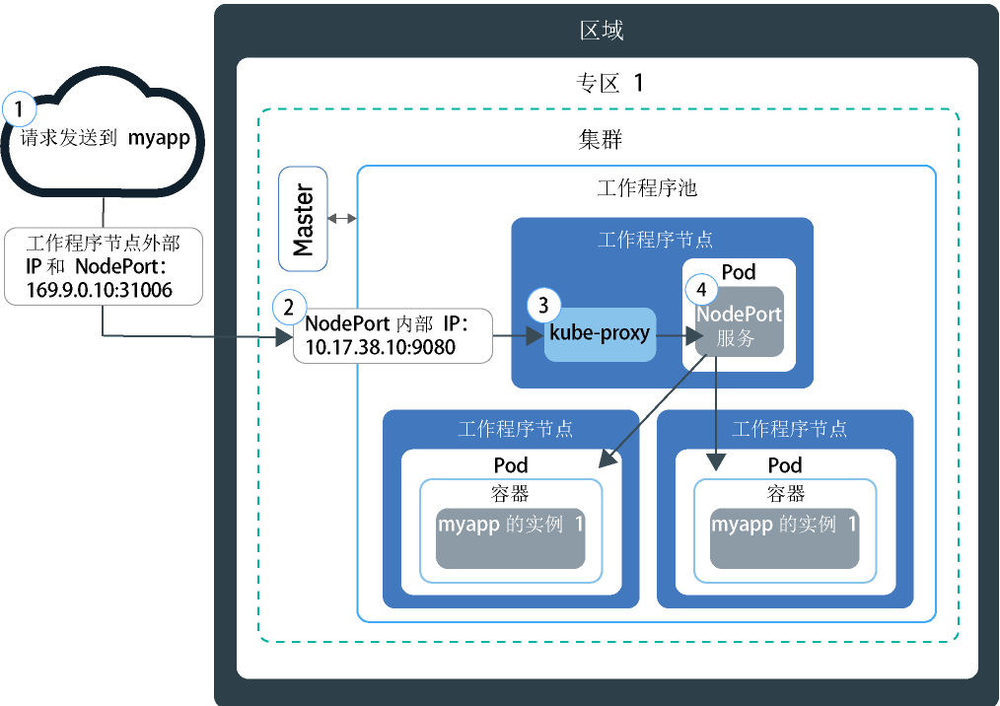

---

copyright:
  years: 2014, 2019
lastupdated: "2019-05-31"

keywords: kubernetes, iks

subcollection: containers

---

{:new_window: target="_blank"}
{:shortdesc: .shortdesc}
{:screen: .screen}
{:pre: .pre}
{:table: .aria-labeledby="caption"}
{:codeblock: .codeblock}
{:tip: .tip}
{:note: .note}
{:important: .important}
{:deprecated: .deprecated}
{:download: .download}
{:preview: .preview}


# 使用 NodePort 测试对应用程序的访问权
{: #nodeport}

通过使用 Kubernetes 集群中任何工作程序节点的公共 IP 地址并公开 NodePort，使容器化应用程序可通过因特网访问。此选项可用于在 {{site.data.keyword.containerlong}} 中进行测试以及用于短期公共访问权。
{:shortdesc}

## 使用 NodePort 管理网络流量
{: #nodeport_planning}

在工作程序节点上公开一个公共端口，并使用该工作程序节点的公共 IP 地址通过因特网来公共访问集群中的服务。
{:shortdesc}

通过创建类型为 NodePort 的 Kubernetes 服务来公开应用程序时，将为该服务分配 30000-32767 范围内的 NodePort 以及内部集群 IP 地址。NodePort 服务充当应用程序入局请求的外部入口点。分配的 NodePort 在集群中每个工作程序节点的 `kubeproxy` 设置中公共公开。每个工作程序节点都会在分配的 NodePort 上开始侦听该服务的入局请求。要从因特网访问该服务，可以使用在集群创建期间分配的任何工作程序节点的公共 IP 地址以及 NodePort，格式为 `<IP_address>:<nodeport>`。如果要访问专用网络上的服务，请使用任何工作程序节点的专用 IP 地址，而不要使用公共 IP 地址。

下图显示配置 NodePort 服务后，如何将通信从因特网定向到应用程序：



1. 使用工作程序节点的公共 IP 地址和工作程序节点上的 NodePort，将请求发送到应用程序。

2. 请求会自动转发到 NodePort 服务的内部集群 IP 地址和端口。该内部集群 IP 地址只能在集群内部访问。

3. `kube-proxy` 将请求路由到应用程序的 Kubernetes NodePort 服务。

4. 该请求会转发到部署了应用程序的 pod 的专用 IP 地址。如果集群中部署了多个应用程序实例，那么 NodePort 服务会在应用程序 pod 之间路由请求。

工作程序节点的公共 IP 地址不是永久固定的。除去或重新创建工作程序节点时，将为该工作程序节点分配新的公共 IP 地址。在测试应用程序的公共访问权时，或者仅在短时间内需要公共访问权时，可以使用 NodePort 服务。如果需要服务具有稳定的公共 IP 地址和更高可用性，请使用[网络负载均衡器 (NLB) 服务](/docs/containers?topic=containers-loadbalancer)或 [Ingress](/docs/containers?topic=containers-ingress) 来公开应用程序。
{: note}

<br />


## 使用 NodePort 服务来启用对应用程序的访问权
{: #nodeport_config}

对于免费或标准集群，可以将应用程序公开为 Kubernetes NodePort 服务。
{:shortdesc}

如果还没有应用程序准备就绪，可以使用名为 [Guestbook ](https://github.com/kubernetes/examples/blob/master/guestbook/all-in-one/guestbook-all-in-one.yaml) 的 Kubernetes 示例应用程序。

1.  在应用程序的配置文件中，定义 [service ](https://kubernetes.io/docs/concepts/services-networking/service/) 部分。

    对于 Guestbook 示例，配置文件中已存在前端服务部分。要使 Guestbook 应用程序在外部可用，请向前端服务部分添加 NodePort 类型以及范围为 30000-32767 的 NodePort。
    {: tip}

    示例：

    ```
apiVersion: v1
    kind: Service
    metadata:
      name: <my-nodeport-service>
      labels:
        <my-label-key>: <my-label-value>
    spec:
      selector:
        <my-selector-key>: <my-selector-value>
      type: NodePort
      ports:
       - port: <8081>
         # nodePort: <31514>

    ```
    {: codeblock}

    <table>
    <caption>了解 NodePort 服务的组成部分</caption>
    <thead>
    <th colspan=2> 了解 NodePort 服务部分的组成部分</th>
    </thead>
    <tbody>
    <tr>
    <td><code>metadata.name</code></td>
    <td>将 <code><em>&lt;my-nodeport-service&gt;</em></code> 替换为 NodePort 服务的名称。<p>使用 Kubernetes 资源时，请了解有关[确保个人信息安全](/docs/containers?topic=containers-security#pi)的更多信息。</p></td>
    </tr>
    <tr>
    <td><code>metadata.labels</code></td>
    <td>将 <code><em>&lt;my-label-key&gt;</em></code> 和 <code><em>&lt;my-label-value&gt;</em></code> 替换为要用于服务的标签。</td>
    </tr>
    <tr>
      <td><code>spec.selector</code></td>
      <td>将 <code><em>&lt;my-selector-key&gt;</em></code> 和 <code><em>&lt;my-selector-value&gt;</em></code> 替换为您在部署 YAML 的 <code>spec.template.metadata.labels</code> 部分中使用的键/值对。要将服务与部署相关联，选择器必须与部署标签相匹配。
      </tr>
    <tr>
    <td><code>ports.port</code></td>
    <td>将 <code><em>&lt;8081&gt;</em></code> 替换为服务侦听的端口。</td>
     </tr>
     <tr>
     <td><code>ports.nodePort</code></td>
     <td>可选：将 <code><em>&lt;31514&gt;</em></code> 替换为范围为 30000-32767 的 NodePort。不要指定其他服务已经在使用的 NodePort。如果未分配 NodePort，系统将为您分配随机的 NodePort。<br><br>要指定 NodePort，并希望查看哪些 NodePort 已在使用，请运行以下命令：<pre class="pre"><code>kubectl get svc</code></pre><p>所有已在使用的 NodePort 都会显示在**端口**字段下。</p></td>
     </tr>
     </tbody></table>

2.  保存已更新的配置文件。

3.  针对要向因特网公开的每个应用程序，重复上述步骤以创建 NodePort 服务。

**接下来要做什么？**

应用程序部署后，可以使用任何工作程序节点的公共 IP 地址和 NodePort 来构成公共 URL，以用于在浏览器中访问该应用程序。如果工作程序节点仅连接到专用 VLAN，那么会创建专用 NodePort 服务，并且可以通过工作程序节点的专用 IP 地址对其进行访问。

1.  获取集群中工作程序节点的公共 IP 地址。如果要访问专用网络上的工作程序节点，请改为获取专用 IP 地址。

    ```
    ibmcloud ks workers --cluster <cluster_name>
    ```
    {: pre}

    输出：

    ```
    ID                                                Public IP   Private IP    Size     State    Status
    prod-dal10-pa215dcf5bbc0844a990fa6b0fcdbff286-w1  192.0.2.23  10.100.10.10  u3c.2x4  normal   Ready
    prod-dal10-pa215dcf5bbc0844a990fa6b0fcdbff286-w2  192.0.2.27  10.100.10.15  u3c.2x4  normal   Ready
    ```
    {: screen}

2.  如果分配了随机 NodePort，请了解分配的是哪个 NodePort。

    ```
    kubectl describe service <service_name>
    ```
    {: pre}

    输出：

    ```
    Name:                   <service_name>
    Namespace:              default
    Labels:                 run=<deployment_name>
    Selector:               run=<deployment_name>
    Type:                   NodePort
    IP:                     10.10.10.8
    Port:                   <unset> 8080/TCP
    NodePort:               <unset> 30872/TCP
    Endpoints:              172.30.171.87:8080
    Session Affinity:       None
    No events.
    ```
    {: screen}

    在此示例中，NodePort 为 `30872`。

    如果 **Endpoints** 部分显示 `<none>`，请检查 NodePort 服务的 `spec.selector` 部分中使用的 `<selectorkey>` 和 `<selectorvalue>`。确保它与部署 YAML 的 `spec.template.metadata.labels` 部分中使用的_键/值_对相同。
    {: note}

3.  使用其中一个工作程序节点 IP 地址和 NodePort 来构成 URL。示例：`http://192.0.2.23:30872`
