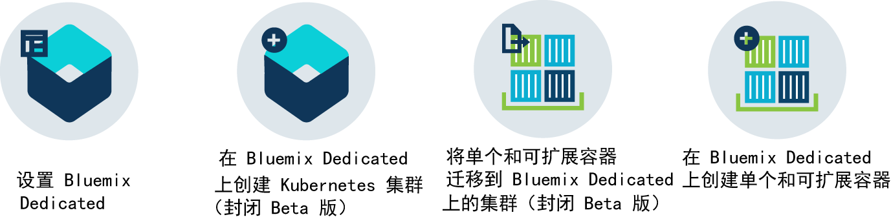
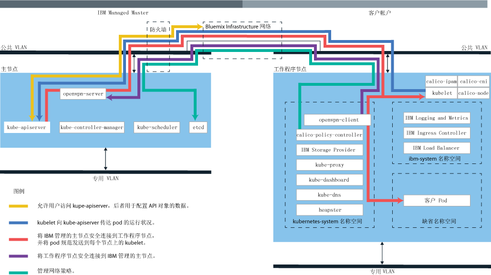

---

copyright:
  years: 2014, 2017
lastupdated: "2017-10-12"

---

{:new_window: target="_blank"}
{:shortdesc: .shortdesc}
{:screen: .screen}
{:pre: .pre}
{:table: .aria-labeledby="caption"}
{:codeblock: .codeblock}
{:tip: .tip}
{:download: .download}

# 关于 {{site.data.keyword.containerlong_notm}}
{: #cs_ov}

{{site.data.keyword.containershort}} 将 Docker 和 Kubernetes 相组合，以提供功能强大的工具、直观的用户体验以及内置安全性和隔离，可使用 Kubernetes API 通过独立计算主机的集群，自动对容器化应用程序进行部署、操作、扩展和监视。
{:shortdesc}

 

## Docker 容器
{: #cs_ov_docker}

Docker 是 2013 年 dotCloud 发布的一个开放式源代码项目。Docker 基于现有 Linux 容器技术 (LXC) 的功能进行构建，已成为一个软件平台，可以用于快速构建、测试、部署和扩展应用程序。Docker 将软件打包成标准化单元（称为容器），其中包含应用程序运行所需的所有元素。
{:shortdesc}

请查看以下概念，以了解有关基本 Docker 概念的信息。

<dl>
<dt>容器</dt>
<dd>容器是一种标准的打包方式，用来打包应用程序及其所有依赖项，以便应用程序可以在环境之间移动，并且无需更改即可运行。与虚拟机不同，容器不会对设备、其操作系统和底层硬件进行虚拟化。在容器中只打包应用程序代码、运行时、系统工具、库和设置。容器在其部署到的计算主机上作为隔离进程运行，并共享主机操作系统及其硬件资源。这种方式使得容器比虚拟机更轻便、可移植性更高且更高效。</dd>
<dt>映像</dt>
<dd>每个容器都基于 Docker 映像，被视为映像的实例。映像通过 Dockerfile 进行构建，此文件包含有关如何构建映像的指令以及任何构建工件（例如，应用程序、应用程序配置及其依赖项）。</dd>
<dt>注册表</dt>
<dd>映像注册表是可存储、检索和共享 Docker 映像的位置。存储在注册表中的映像可以公共可用（公共注册表），也可以仅供一小组用户访问（专用注册表）。{{site.data.keyword.containershort_notm}} 提供了公共映像（如 ibmliberty），可用于开始使用 Docker 和 Kubernetes 在集群中创建第一个容器化应用程序。对于企业应用程序，请使用专用注册表（如在 {{site.data.keyword.Bluemix_notm}} 中提供的注册表）来保护映像不被未经授权的用户使用和更改。  
要基于映像部署容器时，必须确保映像存储在公共或专用映像注册表中。</dd>
</dl>

### 使用容器的主要优点
{: #container_benefits}

<dl>
<dt>容器灵活</dt>
<dd>容器通过为开发和生产团队提供标准化环境，简化了系统管理。引擎的轻量级运行时支持快速向上扩展和向下扩展来响应需求的变化。容器有助于使管理不同操作系统平台和底层基础架构更加容易。容器可帮助您在任何基础架构上迅速、可靠地部署和运行任何应用程序。</dd>
<dt>容器小巧</dt>
<dd>在单个虚拟机所需的空间中，可以放入多个容器。</dd>
<dt>容器可移植</dt>
<dd>可以通过将其他映像用作基本映像，为其他容器构建映像。让其他人来做大部分的映像构建工作，您只需稍作调整即可使用。还可以快速将应用程序代码从过渡环境迁移到生产环境。迁移过程可通过工具（例如 Delivery Pipeline 或 UrbanCode Deploy）自动执行。</dd>
</dl>

 

## Kubernetes 基础知识
{: #kubernetes_basics}

Kubernetes 是由 Google 作为 Borg 项目的一部分开发的，并于 2014 年转给开放式源代码社区。Kubernetes 融合了 Google 在运行容器化基础架构方面 15 年以上的研究成果；该基础架构具有生产工作负载、开放式源代码供应和 Docker 容器管理工具，能提供隔离、安全的应用程序平台，这种平台可移植、可扩展，并能在发生故障转移时自我修复。
{:shortdesc}

通过一些术语来了解有关 Kubernetes 工作方式的基础知识。

<dl>
<dt>集群</dt>
<dd>Kubernetes 集群由一个或多个虚拟机组成，这些虚拟机称为工作程序节点。每个工作程序节点都代表一个计算主机，在其中可以部署、运行和管理容器化应用程序。工作程序节点由 Kubernetes 主节点管理，主节点用于集中控制和监视集群中的所有 Kubernetes 资源。部署容器化应用程序时，Kubernetes 主节点会考虑部署需求和集群中的可用容量，然后决定将应用程序部署在哪里。</dd>
<dt>Pod</dt>
<dd>部署到 Kubernetes 集群中的每个容器化应用程序都由 pod 进行部署、运行和管理。pod 代表 Kubernetes 集群中最小的可部署单元，用于将必须视为单个单元的容器分组在一起。在大多数情况下，容器都会部署到其自己的 pod 中。但是，应用程序可能需要将一个容器和其他辅助容器部署到一个 pod 中，以便可以使用相同的专用 IP 地址寻址到这些容器。</dd>
<dt>部署</dt>
<dd>部署是一种 Kubernetes 资源，在其中可指定运行应用程序所需的容器和其他 Kubernetes 资源，例如持久性存储器、服务或注释。部署会在 Kubernetes 部署脚本中进行记录。运行部署时，Kubernetes 主节点会根据集群的工作程序节点上的可用容量，将指定的容器部署到 pod 中。其他 Kubernetes 资源会如部署脚本中所指定那样进行创建和配置。  
您可以使用部署来定义应用程序的更新策略，包括在滚动更新期间要添加的 pod 数，以及允许同时不可用的 pod 数。执行滚动更新时，部署将检查修订版是否有效，并在检测到故障时停止应用。</dd>
<dt>服务</dt>
<dd>Kubernetes 服务会将一些 pod 分组在一起，并提供与这些 pod 的网络连接，以供集群中的其他服务使用，而无需公开每个 pod 的实际专用 IP 地址。您可以通过服务使应用程序在集群或公共因特网中可用。  
要了解有关 Kubernetes 术语的更多信息，请尝试<a href="cs_tutorials.html#cs_cluster_tutorial" target="_blank">教程</a>。</dd>
</dl>

 

## 使用集群的优点
{: #cs_ov_benefits}

每个集群都会部署在提供了 Kubernetes 和 {{site.data.keyword.IBM_notm}} 添加的本机功能的共享或专用虚拟机上。
{:shortdesc}

|优点|描述|
|-------|-----------|
|隔离了计算、网络和存储基础架构的单租户 Kubernetes 集群|<ul><li>创建自己的定制基础架构，以满足企业和开发环境的需求。</li><li>使用 IBM Bluemix Infrastructure (SoftLayer) 提供的资源来供应专用而安全的 Kubernetes 主节点、工作程序节点、虚拟网络和存储器。</li><li>存储持久数据，在 Kubernetes pod 之间共享数据，以及在需要时使用集成和安全卷服务复原数据。</li><li>由 {{site.data.keyword.IBM_notm}} 持续监视和更新的完全受管 Kubernetes 主节点，使您的集群可用。</li><li>受益于对所有本机 Kubernetes API 的完全支持。</li></ul>|
|使用漏洞顾问程序确保映像安全合规性|<ul><li>设置自己的安全 Docker 专用映像注册表，映像会存储在该注册表中，并供组织中的所有用户共享。</li><li>受益于自动扫描专用 {{site.data.keyword.Bluemix_notm}} 注册表中的映像。</li><li>查看特定于映像中所用操作系统的建议，以修复潜在漏洞。</li></ul>|
|自动扩展应用程序|<ul><li>定义定制策略，以基于 CPU 和内存使用量来向上和向下扩展应用程序。</li></ul>|
|持续监视集群运行状况|<ul><li>使用集群仪表板可快速查看和管理集群、工作程序节点和容器部署的运行状况。</li><li>使用 {{site.data.keyword.monitoringlong}}，找到详细的使用量度量值，并快速扩展集群以满足工作负载需求。</li><li>使用 {{site.data.keyword.loganalysislong}} 复查日志记录信息，以查看详细的集群活动。</li></ul>|
|自动恢复运行状况欠佳的容器|<ul><li>对部署在工作程序节点上的容器持续执行运行状况检查。</li><li>在容器发生故障时，自动重新创建容器。</li></ul>|
|服务发现和服务管理|<ul><li>集中注册应用程序服务可使这些服务可供集群中的其他应用程序使用，而不必将其公共公开。</li><li>发现注册的服务，而无需跟踪变化的 IP 地址或容器标识，并且受益于自动路由到可用实例。</li></ul>|
|安全地向公众公开服务|<ul><li>具有完全负载均衡器和 Ingress 支持的专用覆盖网络，可使应用程序公共可用，并跨多个工作程序节点均衡工作负载，而无需跟踪集群内变化的 IP 地址。</li><li>在公共 IP 地址、{{site.data.keyword.IBM_notm}} 提供的路径或自己的定制域之间进行选择，以通过因特网访问集群中的服务。</li></ul>|
|{{site.data.keyword.Bluemix_notm}} 服务集成|<ul><li>通过集成 {{site.data.keyword.Bluemix_notm}} 服务（例如，Watson API、Blockchain、数据服务或 Internet of Things）向应用程序添加额外的功能，并帮助集群用户简化应用程序开发和容器管理过程。</li></ul>|
{: caption="表 1. 将集群与 {{site.data.keyword.containerlong_notm}} 配合使用的优点" caption-side="top"}

 

## 云环境
{: #cs_ov_environments}

您可以选择要在其上部署集群和容器的 {{site.data.keyword.Bluemix_notm}} 云环境。
{:shortdesc}

### {{site.data.keyword.Bluemix_notm}} Public
{: #public_environment}

将集群部署到公共云环境 ([https://console.bluemix.net ](https://console.bluemix.net))，并连接到 {{site.data.keyword.Bluemix_notm}} 目录中的任何服务。

通过 {{site.data.keyword.Bluemix_notm}} Public 中的集群，可以为集群中的工作程序节点选择硬件隔离级别。将专用硬件用于仅供您的集群专用的可用物理资源，或使用共享硬件以允许与其他 {{site.data.keyword.IBM_notm}} 客户的集群共享物理资源。当您想要为集群进行隔离时，您可能会在 {{site.data.keyword.Bluemix_notm}} Public 环境中选择专用集群，但是对于您使用的其他 {{site.data.keyword.Bluemix_notm}} 服务，则不需要此类隔离。

单击以下某个选项以开始：

    <map name="public_options" id="public_options">
    <area href="container_index.html#clusters" alt="在 {{site.data.keyword.Bluemix_notm}} 中开始使用 Kubernetes 集群" title="在 {{site.data.keyword.Bluemix_notm}} 中开始使用 Kubernetes 集群" shape="rect" coords="-5, -6, 123, 154" />
    <area href="cs_classic.html#cs_classic" alt="在 {{site.data.keyword.containershort_notm}} 中运行单个和可扩展容器" title="在 {{site.data.keyword.containershort_notm}} 中运行单个和可扩展容器" shape="rect" coords="181, -5, 320, 161" />
    </map>

### {{site.data.keyword.Bluemix_notm}} Dedicated
{: #dedicated_environment}

在专用云环境 (`https://<my-dedicated-cloud-instance>.bluemix.net`) 中部署集群（封闭 Beta 版）或单个和可扩展容器，并使用也在其中运行的预先选择的 {{site.data.keyword.Bluemix_notm}} 服务进行连接。

具有 {{site.data.keyword.Bluemix_notm}} Dedicated 的集群等同于使用 {{site.data.keyword.Bluemix_notm}} Public 中专用硬件创建的集群。可用物理资源仅供您的集群专用，而不会与其他 {{site.data.keyword.IBM_notm}} 客户的集群共享。对于 Public 和 Dedicated，公共 API 端点用于创建集群。但是，对于 {{site.data.keyword.Bluemix_notm}} Dedicated 来说，最重要的差别如下所示。

*   {{site.data.keyword.IBM_notm}} 拥有并管理已部署工作程序节点、VLAN 和子网的 IBM Bluemix Infrastructure (SoftLayer) 帐户，而不是您拥有的帐户。
*   这些 VLAN 和子网的规范在创建 Dedicated 环境时确定，而不是在创建集群时确定。

在您想要为集群进行隔离时，您可能会选择设置 {{site.data.keyword.Bluemix_notm}} Dedicated 环境，并且还需要对您使用的其他 {{site.data.keyword.Bluemix_notm}} 服务进行此类隔离。

单击以下某个选项以开始：

    <map name="dedicated_options" id="dedicated_options">
    <area href="#setup_dedicated" alt="在 {{site.data.keyword.Bluemix_notm}} Dedicated（封闭 Beta 版）上设置 {{site.data.keyword.containershort_notm}}" title="在 {{site.data.keyword.Bluemix_notm}} Dedicated（封闭 Beta 版）上设置 {{site.data.keyword.containershort_notm}}" shape="rect" coords="-5, -15, 100, 153" />
    <area href="container_index.html#dedicated" alt="在 {{site.data.keyword.Bluemix_notm}} Dedicated（封闭 Beta 版）中开始使用 Kubernetes 集群" title="在 {{site.data.keyword.Bluemix_notm}} Dedicated（封闭 Beta 版）中开始使用 Kubernetes 集群" shape="rect" coords="153, -10, 276, 182" />
    <area href="cs_classic.html#cs_classic" alt="在 {{site.data.keyword.containershort_notm}} 中运行单个和可扩展容器" title="在 {{site.data.keyword.containershort_notm}} 中运行单个和可扩展容器" shape="rect" coords="317, -11, 436, 188" />
    <area href="container_ha.html#container_group_ui" alt="通过 {{site.data.keyword.Bluemix_notm}} GUI 作为容器组运行长期服务" title="通过 {{site.data.keyword.Bluemix_notm}} GUI 作为容器组运行长期服务" shape="rect" coords="485, -1, 600, 173" />
    </map>

### 云环境之间集群管理的差异
{: #env_differences}

|区域|{{site.data.keyword.Bluemix_notm}} Public|{{site.data.keyword.Bluemix_notm}} Dedicated（封闭 Beta 版）|
|--|--------------|--------------------------------|
|集群创建|创建 Lite 集群或为标准集群指定以下详细信息：<ul><li>集群类型</li><li>名称</li><li>位置</li><li>机器类型</li><li>工作程序节点数</li><li>公共 VLAN</li><li>专用 VLAN</li><li>硬件</li></ul>|为标准集群指定以下详细信息：<ul><li>名称</li><li>Kubernetes 版本</li><li>机器类型</li><li>工作程序节点数</li></ul>
**注**：在创建 {{site.data.keyword.Bluemix_notm}} 环境期间，会预先定义 VLAN 和硬件设置。
|
|集群硬件和所有权|在标准集群中，硬件可由其他 {{site.data.keyword.IBM_notm}} 客户共享或仅供您专用。公用和专用 VLAN 由您在 IBM Bluemix Infrastructure (SoftLayer) 帐户中所拥有和管理。|在 {{site.data.keyword.Bluemix_notm}} Dedicated 上的集群中，硬件始终是专用的。
公用和专用 VLAN 由 IBM 代表您拥有并进行管理。位置是为 {{site.data.keyword.Bluemix_notm}} 环境预定义的。|
|与集群绑定的服务|使用 [bx cs cluster-service-bind](cs_cluster.html#cs_cluster_service) 命令，将 Kubernetes 密钥绑定到集群。|为服务凭证创建 [JSON 密钥文件](cs_cluster.html#binding_dedicated)，然后从该文件创建 Kubernetes 私钥以绑定到集群。|
|负载均衡器和 Ingress 联网|在标准集群供应期间，会自动执行以下操作。<ul><li>将公共可移植子网绑定到您的集群，并分配给您的 IBM Bluemix Infrastructure (SoftLayer) 帐户。</li><li>一个可移植公共 IP 地址用于一个高可用性 Ingress 控制器，并分配格式为 &lt;cluster_name&gt;.containers.mybluemix.net 的唯一公共路径。您可以使用此路径向公众公开多个应用程序。</li><li>向集群分配 4 个可移植公共 IP 地址，这些 IP 地址可用于通过 LoadBalancer 服务向公众公开应用程序。通过 IBM Bluemix Infrastructure (SoftLayer) 帐户可以请求更多子网。</li></ul>|创建 Dedicated 帐户时，您将作出以下决策：<ul><li>需要多少子网</li><li>需要的子网类型，可以是负载均衡器或 Ingress。{{site.data.keyword.IBM_notm}} 将为您创建子网并执行网络管理任务。根据您的选择，可能会创建 Ingress 控制器，并且可能会分配公共路径。
可以通过[开具支持凭单](/docs/support/index.html#contacting-support)创建子网来请求更多子网，然后使用 [`bx cs cluster-subnet-add`](cs_cli_reference.html#cs_cluster_subnet_add) 命令将子网添加到集群。|
|NodePort 联网|在您的工作程序节点上公开一个公共端口，并使用该工作程序节点的公共 IP 地址来公共访问集群中的服务。|防火墙将阻止工作程序节点的所有公共 IP 地址。但是，对于添加到集群的 {{site.data.keyword.Bluemix_notm}} 服务，可以通过公共 IP 地址或专用 IP 地址访问节点端口。|
|持久性存储器|使用卷的[动态供应](cs_apps.html#cs_apps_volume_claim)或[静态供应](cs_cluster.html#cs_cluster_volume_create)。|使用卷的[动态供应](cs_apps.html)。</li></ul>|
|{{site.data.keyword.registryshort_notm}} 中的映像注册表 URL|<ul><li>美国南部和美国东部：<code>registry.ng bluemix.net</code></li><li>英国南部：<code>registry.eu-gb.bluemix.net</code></li><li>欧洲中部（法兰克福）：<code>registry.eu-de.bluemix.net</code></li><li>澳大利亚（悉尼）：<code>registry.au-syd.bluemix.net</code></li></ul>|<ul><li>对于新名称空间，请使用为 {{site.data.keyword.Bluemix_notm}} Public 定义的基于相同区域的注册表。</li><li>对于在 {{site.data.keyword.Bluemix_notm}} Dedicated 中为单个和可扩展容器设置的名称空间，请使用 <code>registry.&lt;dedicated_domain&gt;</code></li></ul>|
|访问注册表|请参阅[将专用和公共映像注册表用于 {{site.data.keyword.containershort_notm}}](cs_cluster.html#cs_apps_images) 中的选项。|<ul><li>有关新的名称空间，请参阅[将专用和公共映像注册表用于 {{site.data.keyword.containershort_notm}}](cs_cluster.html#cs_apps_images) 中的选项。</li><li>对于为单个和可扩展组设置的名称空间，请[使用令牌并创建 Kubetnetes 私钥](cs_dedicated_tokens.html#cs_dedicated_tokens)以进行认证。</li></ul>|
{: caption="表 2. {{site.data.keyword.Bluemix_notm}} Public 和 {{site.data.keyword.Bluemix_notm}} Dedicated 之间的功能差异" caption-side="top"}

### 在 {{site.data.keyword.Bluemix_notm}} Dedicated 上设置 {{site.data.keyword.containershort_notm}}（封闭 Beta 版）
{: #setup_dedicated}

管理员必须将组织的 IBM 管理员标识和用户添加到 Dedicated 环境。

开始之前，请[设置 {{site.data.keyword.Bluemix_notm}} Dedicated 环境](/docs/dedicated/index.html#setupdedicated)。

要设置 Dedicated 环境以使用集群，请执行以下操作：

1.  将提供的 IBM 管理员标识添加到环境。
    1.  选择 {{site.data.keyword.Bluemix_notm}} Dedicated 帐户。
    2.  从菜单栏中，单击**管理>安全性>身份和访问权**。“用户”窗口将显示用户列表，其中包含这些用户的电子邮件地址以及所选帐户的状态。
    3.  单击**邀请用户**。
    4.  在**电子邮件地址或现有 IBM 标识**中，输入以下电子邮件地址：`cfsdl@us.ibm.com`。
    5.  在**访问权**部分中，展开**支持身份和访问权的服务**。
    6.  从**服务**下拉列表中，选择 **{{site.data.keyword.containershort_notm}}**。
    7.  从**角色**下拉列表中，选择**管理员**。
    8.  单击**邀请用户**。
2.  [为 {{site.data.keyword.Bluemix_notm}} 帐户的最终用户创建 IBM 标识。](https://www.ibm.com/account/us-en/signup/register.html)
3.  [将先前步骤中的用户添加到 {{site.data.keyword.Bluemix_notm}} 帐户](cs_cluster.html#add_users)。
4.  通过 Public 控制台访问 {{site.data.keyword.Bluemix_notm}} Dedicated 帐户并开始创建集群。
    1.  使用您的 IBM 标识登录到 {{site.data.keyword.Bluemix_notm}} Public 控制台 ([https://console.bluemix.net ](https://console.bluemix.net))。
    2.  从帐户菜单中，选择 {{site.data.keyword.Bluemix_notm}} Dedicated 帐户。控制台会以 {{site.data.keyword.Bluemix_notm}} Dedicated 实例的服务和信息更新。
    3.  从 {{site.data.keyword.Bluemix_notm}} Dedicated 实例的目录中，选择**容器**，然后单击 **Kubernetes 集群**。有关创建集群的更多信息，请参阅[在 {{site.data.keyword.Bluemix_notm}} Dedicated（封闭 Beta 版）中通过 GUI 创建 Kubernetes 集群](cs_cluster.html#creating_ui_dedicated)。
5. 如果本地系统或企业网络通过使用代理或防火墙来控制公用因特网端点，请参阅[在防火墙中打开必要端口和 IP 地址](cs_security.html#opening_ports)，以获取有关如何允许出站流量的更多信息。

 

## 服务体系结构
{: #cs_ov_architecture}

每个工作程序节点均设置有 {{site.data.keyword.IBM_notm}} 管理的 Docker Engine、独立的计算资源、联网和卷服务以及内置安全功能，这些功能用于提供隔离、资源管理功能和工作程序节点安全合规性。工作程序节点使用安全 TLS 证书和 OpenVPN 连接与主节点进行通信。
{:shortdesc}

*图 1. {{site.data.keyword.containershort_notm}} 中的 Kubernetes 体系结构和联网情况*

 

## 容器滥用
{: #cs_terms}

客户机不能滥用 {{site.data.keyword.containershort_notm}}。
{:shortdesc}

滥用包括：

*   任何非法活动
*   分发或执行恶意软件
*   损害 {{site.data.keyword.containershort_notm}} 或干扰任何人使用 {{site.data.keyword.containershort_notm}}
*   损害或干扰任何人使用任何其他服务或系统
*   对任何服务或系统进行未经授权的访问
*   对任何服务或系统进行未经授权的修改
*   侵犯他人的权利

请参阅 [Cloud Services 条款](/docs/navigation/notices.html#terms)，以获取总体使用条款。
