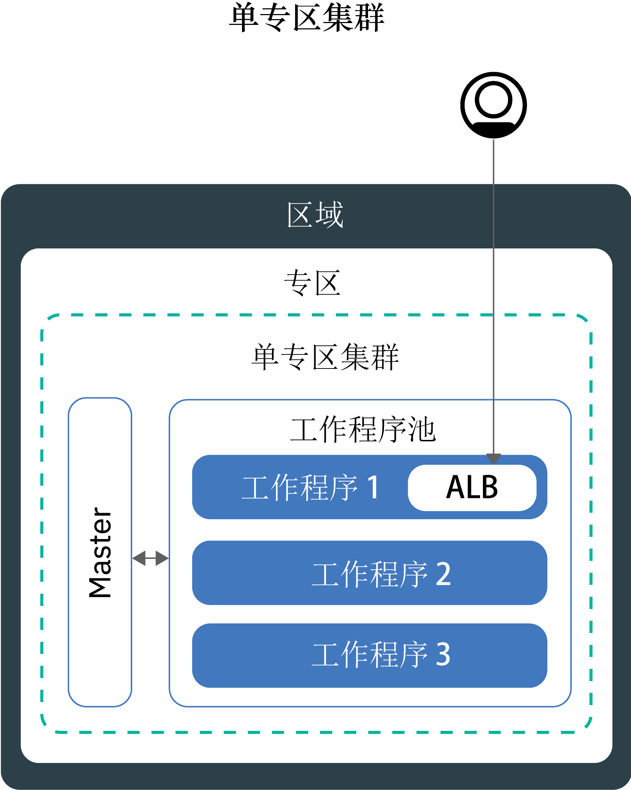
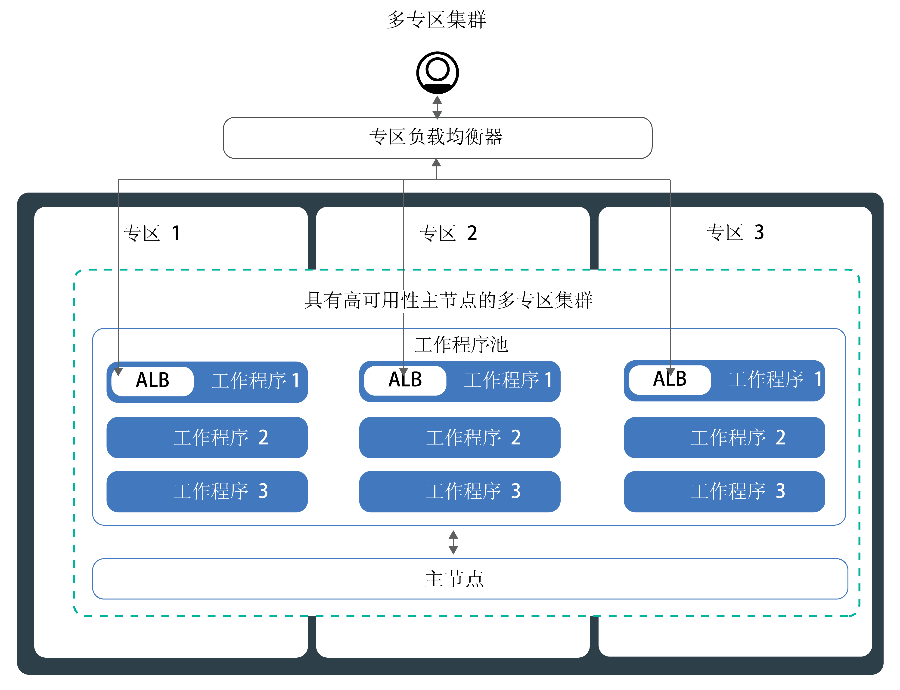
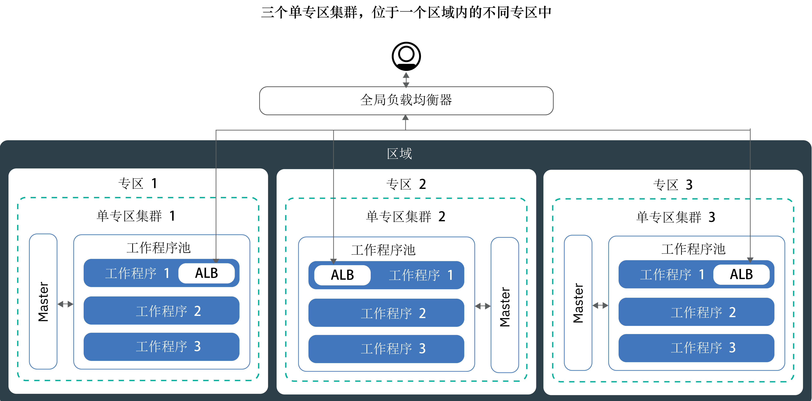

---

copyright:
  years: 2014, 2019
lastupdated: "2019-06-11"

keywords: kubernetes, iks, multi az, multi-az, szr, mzr

subcollection: containers

---

{:new_window: target="_blank"}
{:shortdesc: .shortdesc}
{:screen: .screen}
{:pre: .pre}
{:table: .aria-labeledby="caption"}
{:codeblock: .codeblock}
{:tip: .tip}
{:note: .note}
{:important: .important}
{:deprecated: .deprecated}
{:download: .download}
{:preview: .preview}


# 规划集群以实现高可用性
{: #ha_clusters}

通过 {{site.data.keyword.containerlong}} 设计标准集群，以实现应用程序的最大可用性和容量。
{: shortdesc}

跨多个工作程序节点、专区和集群分布应用程序时，用户不太可能会遇到停机时间。内置功能（例如负载均衡和隔离）可在主机、网络或应用程序发生潜在故障时更快恢复。
查看以下潜在的集群设置（按可用性程度从低到高排序）。


1. [单专区集群](#single_zone)，在一个工作程序池中具有多个工作程序节点。
2. [多专区集群](#multizone)，跨一个区域内的多个专区分布工作程序节点。
3. **连接到公用和仅专用 VLAN 的集群**：跨专区或区域设置并通过全局负载均衡器连接的[多个集群](#multiple_clusters)。

## 单专区集群
{: #single_zone}

要提高应用程序的可用性，并允许在一个工作程序节点在集群中不可用时进行故障转移，请向单专区集群添加更多工作程序节点。
{: shortdesc}



缺省情况下，单专区集群会设置为使用名为 `default` 的工作程序池。工作程序池将使用集群创建期间所定义的相同配置（如机器类型）的工作程序节点分组在一起。可以通过[调整现有工作程序池大小](/docs/containers?topic=containers-add_workers#resize_pool)或[添加新的工作程序池](/docs/containers?topic=containers-add_workers#add_pool)，向集群添加更多工作程序节点。

添加更多工作程序节点时，可以跨多个工作程序节点分布应用程序实例。如果一个工作程序节点停止运行，可用工作程序节点上的应用程序实例会继续运行。Kubernetes 会自动重新安排不可用工作程序节点中的 pod，以确保应用程序的性能和容量。要确保 pod 均匀分布在不同工作程序节点上，请实现 [pod 亲缘关系](https://kubernetes.io/docs/concepts/configuration/assign-pod-node/#inter-pod-affinity-and-anti-affinity-beta-feature)。

**可以将单专区集群转换为多专区集群吗？**</br>
如果集群位于某个[受支持的多专区大城市位置](/docs/containers?topic=containers-regions-and-zones#zones)中，那么可以这样做。请参阅[从独立工作程序节点更新到工作程序池](/docs/containers?topic=containers-update#standalone_to_workerpool)。


**必须使用多专区集群吗？**</br>
不是。您可以根据需要创建任意数量的单专区集群。实际上，为了简化管理，或者在集群必须位于特定[单专区城市](/docs/containers?topic=containers-regions-and-zones#zones)中时，您可能更愿意使用单专区集群。

**在单个专区中可以有高可用性主节点吗？**</br>
可以。在单个专区中，主节点具有高可用性，在分别用于 Kubernetes API 服务器、etcd、调度程序和控制器管理器的不同物理主机上包含多个副本，以防止发生中断，例如在主节点更新期间。要避免受到专区故障的影响，可以执行以下操作：
* [在支持多专区的专区中创建集群](#multizone)，其中主节点在各专区中分布。
* [创建连接到公用和专用 VLAN 的多个集群](#multiple_clusters)并使用全局负载均衡器连接这些集群。

## 多专区集群
{: #multizone}

通过 {{site.data.keyword.containerlong_notm}}，可以创建多专区集群。使用工作程序池跨多个工作程序节点和专区分布应用程序时，用户不太可能会遇到停机时间。通过内置功能（如负载均衡），可在主机、网络或应用程序发生潜在专区故障时更快恢复。如果一个专区中的资源停止运行，集群工作负载仍会在其他专区中运行。
{: shortdesc}

**什么是工作程序池？**</br>
工作程序池是具有相同类型模板（例如，机器类型、CPU 和内存）的工作程序节点的集合。在创建集群时，会自动为您创建缺省工作程序池。要使工作程序节点分布在跨专区的池中、将工作程序节点添加到池或者更新工作程序节点，那么可以使用新的 `ibmcloud ks worker-pool` 命令。

**仍可以使用独立工作程序节点吗？**</br>
支持独立工作程序节点的先前集群设置，但不推荐使用。确保[向集群添加工作程序池](/docs/containers?topic=containers-planning_worker_nodes#add_pool)，然后[使用工作程序池](/docs/containers?topic=containers-update#standalone_to_workerpool)来组织工作程序节点，以取代独立工作程序节点。

**可以将单专区集群转换为多专区集群吗？**</br>
如果集群位于某个[受支持的多专区大城市位置](/docs/containers?topic=containers-regions-and-zones#zones)中，那么可以这样做。请参阅[从独立工作程序节点更新到工作程序池](/docs/containers?topic=containers-update#standalone_to_workerpool)。


### 我想了解有关多专区集群设置的更多信息
{: #mz_setup}



您可以向集群添加更多专区，以在一个区域内跨多个专区的工作程序池中复制工作程序节点。多专区集群旨在跨工作程序节点和专区均匀安排 pod，以确保可用性和故障恢复。如果工作程序节点未跨专区均匀分布，或者其中一个专区中的容量不足，那么 Kubernetes 调度程序可能无法安排所有请求的 pod。结果，pod 可能会进入**暂挂**状态，直到有足够的容量可用为止。如果要更改缺省行为，以使 Kubernetes 调度程序在多个专区中以最佳分布方式分布 pod，请使用 `preferredDuringSchedulingIgnoredDuringExecution` [pod 亲缘关系策略](https://kubernetes.io/docs/concepts/configuration/assign-pod-node/#inter-pod-affinity-and-anti-affinity-beta-feature)。

**为什么需要工作程序节点位于 3 个专区中？**</br>在 3 个专区中分布工作负载可确保应用程序的高可用性，以防一个或两个专区不可用的情况，同时这也使集群设置更符合成本效益。您可能会问为什么？下面是一个示例。

假设您需要具有 6 个核心的工作程序节点来处理应用程序的工作负载。要使集群的可用性更高，您具有以下选项：

- **在另一个专区中复制资源：**使用此选项时，会有 2 个工作程序节点，每个节点在每个专区中有 6 个核心，总计 12 个核心。</br>
- **在 3 个专区中分布资源：**使用此选项时，每个专区会部署 3 个核心，总容量为 9 个核心。要处理工作负载，在同一时间必须有两个专区在正常运行。如果一个专区不可用，那么其他两个专区可以处理工作负载。如果两个专区不可用，那么剩余 3 个核心可供处理工作负载。每个专区部署 3 个核心意味着机器更小，从而降低了成本。</br>

**如何设置我的 Kubernetes 主节点？**</br>在[多专区大城市位置](/docs/containers?topic=containers-regions-and-zones#zones)中创建集群时，会自动部署高可用性 Kubernetes 主节点，并在该大城市的各专区中分布三个副本。例如，如果集群位于 `dal10`、`dal12` 或 `dal13` 专区中，那么 Kubernetes 主节点的副本会在达拉斯多专区大城市中的各专区中进行分布。

**Kubernetes 主节点变得不可用时会发生什么情况？**</br>[Kubernetes 主节点](/docs/containers?topic=containers-ibm-cloud-kubernetes-service-technology#architecture)是用于保持集群正常启动并运行的主组件。主节点将集群资源及其配置存储在充当集群单个事实点的 etcd 数据库中。Kubernetes API 服务器是从工作程序节点到主节点的所有集群管理请求或者想要与集群资源交互时的主入口点。<br><br>如果主节点发生故障，那么工作负载将继续在工作程序节点上运行，但是无法使用 `kubectl` 命令来处理集群资源或查看集群运行状况，直至主节点中的 Kubernetes API 服务器恢复运行。如果在主节点停运期间 pod 停止运行，那么在工作程序节点可再次访问 Kubernetes API 服务器之前，将无法重新调度 pod。<br><br>在主节点停运期间，您仍可以针对 {{site.data.keyword.containerlong_notm}} API 运行 `ibmcloud ks` 命令以处理基础架构资源，例如，工作程序节点或 VLAN。如果通过向集群添加或从中除去工作程序节点来更改当前集群配置，那么在主节点恢复运行前，更改不会发生。

在主节点停运期间，请勿重新启动或重新引导工作程序节点。此操作会从工作程序节点中除去 pod。因为 Kubernetes API 服务器不可用，因此无法将 pod 重新调度到集群中的其他工作程序节点。
{: important}


要保护集群不受 Kubernetes 主节点故障的影响或在多专区集群不可用的区域中保护集群，可以[设置连接到公用和专用 VLAN 的多个集群并通过全局负载均衡器连接](#multiple_clusters)。

**是否必须执行任何操作从而使主节点可与不同专区中的工作程序进行通信？**</br>
是的。如果有多个 VLAN 用于一个集群，有多个子网位于同一 VLAN 上或有一个多专区集群，那么必须针对 IBM Cloud Infrastructure (SoftLayer) 帐户启用[虚拟路由器功能 (VRF)](/docs/infrastructure/direct-link?topic=direct-link-overview-of-virtual-routing-and-forwarding-vrf-on-ibm-cloud#overview-of-virtual-routing-and-forwarding-vrf-on-ibm-cloud)，从而使工作程序节点可以在专用网络上相互通信。要启用 VRF，请[联系 IBM Cloud Infrastructure (SoftLayer) 客户代表](/docs/infrastructure/direct-link?topic=direct-link-overview-of-virtual-routing-and-forwarding-vrf-on-ibm-cloud#how-you-can-initiate-the-conversion)。如果无法或不想启用 VRF，请启用 [VLAN 生成](/docs/infrastructure/vlans?topic=vlans-vlan-spanning#vlan-spanning)。要执行此操作，您需要有**网络 > 管理网络 VLAN 生成**[基础架构许可权](/docs/containers?topic=containers-users#infra_access)，也可以请求帐户所有者来启用 VLAN 生成。要检查是否已启用 VLAN 生成，请使用 `ibmcloud ks vlan-spanning-get --region <region>` [命令](/docs/containers?topic=containers-cli-plugin-kubernetes-service-cli#cs_vlan_spanning_get)。

**如何允许用户通过公用因特网访问应用程序？**</br>
可以使用 Ingress 应用程序负载均衡器 (ALB) 或 LoadBalancer 服务来公开应用程序。

- **Ingress 应用程序负载均衡器 (ALB)：**缺省情况下，会自动在集群的每个专区中创建并启用公共 ALB。此外，还会自动创建并部署集群的 Cloudflare 多专区负载均衡器 (MZLB)，从而对于每个区域存在 1 个 MZLB。MZLB 将 ALB 的 IP 地址放在同一主机名后面，并且对这些 IP 地址启用运行状况检查，以确定它们是否可用。例如，如果工作程序节点位于美国东部区域的 3 个专区中，那么主机名 `yourcluster.us-east.containers.appdomain.cloud` 具有 3 个 ALB IP 地址。MZLB 运行状况检查会检查区域的每个专区中的公共 ALB IP，并根据这些运行状况检查使 DNS 查找结果保持更新。有关更多信息，请参阅 [Ingress 组件和体系结构](/docs/containers?topic=containers-ingress#planning)。

- **LoadBalancer 服务：**LoadBalancer 服务只需在一个专区中设置。应用程序的入局请求会从一个专区路由到其他专区中的所有应用程序实例。如果此专区变得不可用，那么可能无法通过因特网访问应用程序。考虑到单专区故障，您可以在其他专区中设置更多 LoadBalancer 服务。有关更多信息，请参阅高可用性 [LoadBalancer 服务](/docs/containers?topic=containers-loadbalancer#multi_zone_config)。

**是否可为多专区集群设置持久性存储器？**</br>
对于高可用性持久性存储器，请使用云服务，例如 [{{site.data.keyword.cloudant_short_notm}}](/docs/services/Cloudant?topic=cloudant-getting-started#getting-started) 或 [{{site.data.keyword.cos_full_notm}}](/docs/services/cloud-object-storage?topic=cloud-object-storage-about)。您还可以尝试软件定义的存储 (SDS) 解决方案，例如使用 [SDS 机器](/docs/containers?topic=containers-planning_worker_nodes#sds)的 [Portworx](/docs/containers?topic=containers-portworx#portworx)。有关更多信息，请参阅[多专区集群持久性存储选项的比较](/docs/containers?topic=containers-storage_planning#persistent_storage_overview)。

NFS 文件存储器和块存储器不可跨专区共享。持久卷只能在实际存储设备所在的专区中使用。如果要继续在集群中使用现有 NFS 文件或块存储器，那么必须将区域和专区标签应用于现有持久卷。这些标签可帮助 kube-scheduler 确定在何处安排使用持久卷的应用程序。运行以下命令并将 `<mycluster>` 替换为您的集群名称。

```
bash <(curl -Ls https://raw.githubusercontent.com/IBM-Cloud/kube-samples/master/file-pv-labels/apply_pv_labels.sh) <mycluster>
```
{: pre}

**我已创建多专区集群。为什么仍然只有一个专区？如何向集群添加专区？**</br>
如果是[使用 CLI 创建多专区集群](/docs/containers?topic=containers-clusters#clusters_ui)的，那么会创建集群，但您必须将专区添加到工作程序池才能完成该过程。要跨多个专区，集群必须位于[多专区大城市位置](/docs/containers?topic=containers-regions-and-zones#zones)中。要向集群添加专区，并跨专区分布工作程序节点，请参阅[向集群添加专区](/docs/containers?topic=containers-add_workers#add_zone)。

### 目前管理集群的方式会有哪些变化？
{: #mz_new_ways}

引入工作程序池后，可以使用一组新的 API 和命令来管理集群。可以在 [CLI 文档页面](/docs/containers?topic=containers-cli-plugin-kubernetes-service-cli)中或通过在终端中运行 `ibmcloud ks help` 来查看这些新命令。
{: shortdesc}

下表比较了几种常见集群管理操作的旧方法和新方法。
<table summary="该表显示了执行多专区命令的新方法的描述。每行从左到右阅读，其中第一列是描述，第二列是旧方法，第三列是新的多专区方法。">
<caption>多专区工作程序池命令的新方法。</caption>
  <thead>
  <th>描述</th>
  <th>旧的独立工作程序节点</th>
  <th>新的多专区工作程序池</th>
  </thead>
  <tbody>
    <tr>
    <td>向集群添加工作程序节点。</td>
    <td><p class="deprecated"><code>ibmcloud ks worker-add</code>，用于添加独立工作程序节点。</p></td>
    <td><ul><li>要添加与现有池不同的机器类型，请创建新的工作程序池：<code>ibmcloud ks worker-pool-create</code> [命令](/docs/containers?topic=containers-cli-plugin-kubernetes-service-cli#cs_worker_pool_create)。</li>
    <li>要向现有池添加工作程序节点，请调整池中每个专区的节点数：<code>ibmcloud ks worker-pool-resize</code> [命令](/docs/containers?topic=containers-cli-plugin-kubernetes-service-cli#cs_worker_pool_resize)。</li></ul></td>
    </tr>
    <tr>
    <td>从集群中除去工作程序节点。</td>
    <td><code>ibmcloud ks worker-rm</code>，仍可以使用此命令从集群中删除有问题的工作程序节点。</td>
    <td><ul><li>如果工作程序池不均衡（例如，除去工作程序节点后），请对其进行重新均衡：<code>ibmcloud ks worker-pool-rebalance</code> [命令](/docs/containers?topic=containers-cli-plugin-kubernetes-service-cli#cs_rebalance)。</li>
    <li>要减少池中的工作程序节点数，请调整每个专区的工作程序节点数（最小值为 `1`）：<code>ibmcloud ks worker-pool-resize</code> [命令](/docs/containers?topic=containers-cli-plugin-kubernetes-service-cli#cs_worker_pool_resize)。</li></ul></td>
    </tr>
    <tr>
    <td>将新的 VLAN 用于工作程序节点。</td>
    <td><p class="deprecated">添加使用新的专用或公用 VLAN 的新工作程序节点：<code>ibmcloud ks worker-add</code>。</p></td>
    <td>将工作程序池设置为使用不同于先前所用的公用或专用 VLAN：<code>ibmcloud ks zone-network-set</code> [命令](/docs/containers?topic=containers-cli-plugin-kubernetes-service-cli#cs_zone_network_set)。</td>
    </tr>
  </tbody>
  </table>

## 通过全局负载均衡器连接的多个公共集群
{: #multiple_clusters}

要保护应用程序不受 Kubernetes 主节点故障的影响以及对于多专区集群不可用的区域保护应用程序，可以在一个区域的不同专区中创建多个集群，并通过全局负载均衡器将集群连接在一起。
{: shortdesc}

要使用全局负载均衡器连接多个集群，集群必须连接到公用和专用 VLAN。
{: note}



要跨多个集群均衡工作负载，必须设置全局负载均衡器，并将应用程序负载均衡器 (ALB) 或 LoadBalancer 服务的公共 IP 地址添加到域。通过添加这些 IP 地址，可以在集群之间路由入局流量。要使全局负载均衡器检测其中一个集群是否不可用，请考虑向每个 IP 地址添加基于 ping 操作的运行状况检查。设置此检查后，DNS 提供程序会定期对添加到域的 IP 地址执行 ping 操作。如果一个 IP 地址变为不可用，那么不会再将流量发送到此 IP 地址。但是，Kubernetes 不会在可用集群中工作程序节点上自动重新启动不可用集群中的 pod。如果希望 Kubernetes 在可用集群中自动重新启动可用集群中的 pod，请考虑设置[多专区集群](#multizone)。

**为什么需要 3 个集群位于 3 个专区中？**</br>类似于[在多专区集群中使用 3 个专区](#multizone)，您可以通过设置跨专区的 3 个集群，为应用程序提供更高可用性。此外，还可以通过购买更小的机器来处理工作负载，从而降低成本。

**如果要跨区域设置多个集群该怎么做？**</br>可以在一个地理位置的不同区域（如美国南部和美国东部）或不同地理位置（如美国南部和欧洲中部）中设置多个集群。这两种设置为应用程序提供的可用性级别相同，但同时在数据共享和数据复制方面增加了复杂性。在大多数情况下，保持在同一地理位置中就足以满足需求。但是，如果您的用户分布在世界各地，那么最好设置用户所在的集群，以便用户在向应用程序发送请求时不会遇到很长的等待时间。

**要设置用于多个集群的全局负载均衡器，请执行以下操作：**

1. 在多个专区或区域中[创建集群](/docs/containers?topic=containers-clusters#clusters)。
2. 如果有多个 VLAN 用于一个集群，有多个子网位于同一 VLAN 上或有一个多专区集群，那么必须针对 IBM Cloud Infrastructure (SoftLayer) 帐户启用[虚拟路由器功能 (VRF)](/docs/infrastructure/direct-link?topic=direct-link-overview-of-virtual-routing-and-forwarding-vrf-on-ibm-cloud#overview-of-virtual-routing-and-forwarding-vrf-on-ibm-cloud)，从而使工作程序节点可以在专用网络上相互通信。要启用 VRF，请[联系 IBM Cloud Infrastructure (SoftLayer) 客户代表](/docs/infrastructure/direct-link?topic=direct-link-overview-of-virtual-routing-and-forwarding-vrf-on-ibm-cloud#how-you-can-initiate-the-conversion)。如果无法或不想启用 VRF，请启用 [VLAN 生成](/docs/infrastructure/vlans?topic=vlans-vlan-spanning#vlan-spanning)。要执行此操作，您需要有**网络 > 管理网络 VLAN 生成**[基础架构许可权](/docs/containers?topic=containers-users#infra_access)，也可以请求帐户所有者来启用 VLAN 生成。要检查是否已启用 VLAN 生成，请使用 `ibmcloud ks vlan-spanning-get --region <region>` [命令](/docs/containers?topic=containers-cli-plugin-kubernetes-service-cli#cs_vlan_spanning_get)。
3. 在每个集群中，使用[应用程序负载均衡器 (ALB)](/docs/containers?topic=containers-ingress#ingress_expose_public) 或 [LoadBalancer 服务](/docs/containers?topic=containers-loadbalancer)来公开应用程序。
4. 对于每个集群，列出 ALB 或 LoadBalancer 服务的公共 IP 地址。
   - 要列出集群中所有支持公共的 ALB 的 IP 地址，请运行以下命令：
     ```
     ibmcloud ks albs --cluster <cluster_name_or_id>
     ```
     {: pre}

   - 要列出 LoadBalancer 服务的 IP 地址，请运行以下命令：
     ```
    kubectl describe service <myservice>
    ```
     {: pre}

          **LoadBalancer Ingress** IP 地址是分配给 LoadBalancer 服务的可移植 IP 地址。


4.  使用 {{site.data.keyword.Bluemix_notm}} Internet Services (CIS) 来设置全局负载均衡器，或设置您自己的全局负载均衡器。

    **要使用 CIS 全局负载均衡器**：
    1.  通过执行 [{{site.data.keyword.Bluemix_notm}} Internet Services (CIS) 入门](/docs/infrastructure/cis?topic=cis-getting-started#getting-started)中的步骤 1 - 5 来设置服务。这些步骤会全程指导您供应服务实例，添加应用程序域，配置名称服务器以及创建 DNS 记录。请为收集的每个 ALB 或负载均衡器 IP 地址创建 DNS 记录。这些 DNS 记录会将应用程序域映射到所有集群 ALB 或负载均衡器，并确保在循环周期中将对应用程序域的请求转发到集群。
    2. 为 ALB 或负载均衡器[添加运行状况检查](/docs/infrastructure/cis?topic=cis-set-up-and-configure-your-load-balancers#add-a-health-check)。可以对所有集群中的 ALB 或负载均衡器使用相同的运行状况检查，或者创建特定运行状况检查以用于特定集群。
    3. 通过添加集群的 ALB 或负载均衡器 IP，为每个集群[添加源池](/docs/infrastructure/cis?topic=cis-set-up-and-configure-your-load-balancers#add-a-pool)。例如，如果您有 3 个集群，每个集群有 2 个 ALB，请创建 3 个源池，每个池有 2 个 ALB IP 地址。为创建的每个源池添加运行状况检查。
    4. [添加全局负载均衡器](/docs/infrastructure/cis?topic=cis-set-up-and-configure-your-load-balancers#set-up-and-configure-your-load-balancers)。

    **要使用自己的全局负载均衡器**：
    1. 通过将所有支持公共的 ALB 和 LoadBalancer 服务的 IP 地址添加到域，将域配置为将入局流量路由到 ALB 或 LoadBalancer 服务。
    2. 对于每个 IP 地址，启用基于 ping 操作的运行状况检查，以便 DNS 提供程序可以检测到运行状况欠佳的 IP 地址。如果检测到运行状况欠佳的 IP 地址，那么流量不会再路由到此 IP 地址。
