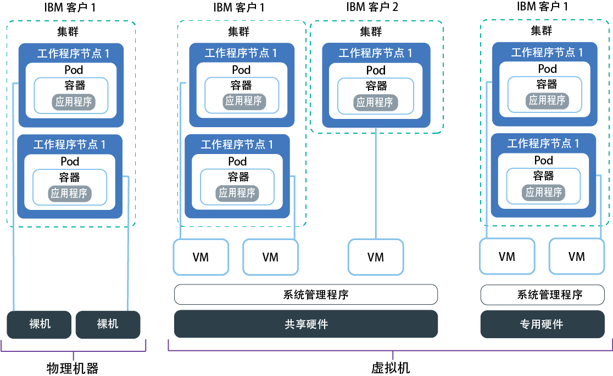

---

copyright:
  years: 2014, 2019
lastupdated: "2019-06-11"

keywords: kubernetes, iks, multi az, multi-az, szr, mzr

subcollection: containers

---

{:new_window: target="_blank"}
{:shortdesc: .shortdesc}
{:screen: .screen}
{:pre: .pre}
{:table: .aria-labeledby="caption"}
{:codeblock: .codeblock}
{:tip: .tip}
{:note: .note}
{:important: .important}
{:deprecated: .deprecated}
{:download: .download}
{:preview: .preview}

# 规划工作程序节点设置
{: #planning_worker_nodes}

Kubernetes 集群由分组成工作程序节点池的工作程序节点组成，并由 Kubernetes 主节点进行集中监视和管理。集群管理员决定如何设置工作程序节点的集群，以确保集群用户具备在集群中部署和运行应用程序所需的所有资源。
{:shortdesc}

创建标准集群时，会在 IBM Cloud Infrastructure (SoftLayer) 中以您的名义订购具有相同内存、CPU 和磁盘空间规格（类型模板）的工作程序节点，然后将其添加到集群中的缺省工作程序节点池。为每个工作程序节点分配唯一的工作程序节点标识和域名，在创建集群后，不得更改该标识和域名。您可以选择虚拟服务器或物理（裸机）服务器。根据选择的硬件隔离级别，可以将虚拟工作程序节点设置为共享或专用节点。要将不同的类型模板添加到集群，请[创建其他工作程序池](/docs/containers?topic=containers-cli-plugin-kubernetes-service-cli#cs_worker_pool_create)。

Kubernetes 限制了在一个集群中可以拥有的最大工作程序节点数。有关更多信息，请查看[工作程序节点和 pod 配额 ](https://kubernetes.io/docs/setup/cluster-large/)。

要确保始终有足够的工作程序节点来支持工作负载吗？请试用[集群自动缩放器](/docs/containers?topic=containers-ca#ca)。
{: tip}

 

## 工作程序节点的可用硬件
{: #shared_dedicated_node}

在 {{site.data.keyword.Bluemix_notm}} 中创建标准集群时，选择工作程序池包含的工作程序节点是物理机器（裸机）还是在物理硬件上运行的虚拟机。还可以选择工作程序节点类型模板，或者内存、CPU 和其他机器规格（例如，磁盘存储器）组合。
{:shortdesc}

如果想要多个工作程序节点类型模板，那么必须为每个类型模板创建一个工作程序池。不能调整现有工作程序节点的大小，使其具有不同的资源，例如 CPU 或内存。创建免费集群时，工作程序节点会自动作为 IBM Cloud Infrastructure (SoftLayer) 帐户中的虚拟共享节点进行供应。
在标准集群中，可以选择最适合工作负载的机器类型。规划时，请考虑有关总 CPU 和内存容量的[工作程序节点资源保留量](#resource_limit_node)。

选择以下一个选项以决定想要的工作程序池的类型。
* [虚拟机](#vm)
* [物理机器（裸机）](#bm)
* [软件定义的存储 (SDS) 机器](#sds)

## 虚拟机
{: #vm}

相对于裸机，使用虚拟机 (VM) 能以更具成本效益的价格获得更高灵活性、更短供应时间以及更多自动可扩展性功能。您可以将 VM 用于最通用的用例，例如测试和开发环境、编译打包和生产环境、微服务以及业务应用程序。但是，在性能方面会有所牺牲。如果需要针对 RAM 密集型、数据密集型或 GPU 密集型工作负载进行高性能计算，请使用[裸机](#bm)。
{: shortdesc}

**是想要使用共享还是专用硬件？** 
创建标准虚拟集群时，必须选择是希望底层硬件由多个 {{site.data.keyword.IBM_notm}} 客户共享（多租户）还是仅供您专用（单租户）。

* **在多租户、共享硬件设置中**：物理资源（如 CPU 和内存）在部署到同一物理硬件的所有虚拟机之间共享。要确保每个虚拟机都能独立运行，虚拟机监视器（也称为系统管理程序）会将物理资源分段成隔离的实体，并将其作为专用资源分配给虚拟机（系统管理程序隔离）。
* **在单租户、专用硬件设置中**：所有物理资源都仅供您专用。您可以将多个工作程序节点作为虚拟机部署在同一物理主机上。与多租户设置类似，系统管理程序也会确保每个工作程序节点在可用物理资源中获得应有的份额。

共享节点通常比专用节点更便宜，因为底层硬件的开销由多个客户分担。但是，在决定是使用共享还是专用节点时，可能需要咨询您的法律部门，以讨论应用程序环境所需的基础架构隔离和合规性级别。

某些类型模板仅可用于一种类型的租户设置。例如，`m3c` VM 仅作为 `shared` 租户设置提供。
{: note}

**VM 有哪些常规功能部件？** 
虚拟机使用本地磁盘（而不是存储区联网 (SAN)）来实现可靠性。可靠性优势包括在将字节序列化到本地磁盘时可提高吞吐量，以及减少因网络故障而导致的文件系统降级。每个 VM 具备 1000 Mbps 联网速度、用于操作系统文件系统的 25 GB 主本地磁盘存储和用于数据（例如，容器运行时和 `kubelet`）的 100 GB 辅助本地磁盘存储。工作程序节点上的本地存储器仅用于短期处理，更新或重新装入工作程序节点时将擦除主磁盘和辅助磁盘。对于持久性存储器解决方案，请参阅[规划高可用性持久性存储器](/docs/containers?topic=containers-storage_planning#storage_planning)。

**如果我拥有旧机器类型该怎么办？** 
例如，如果集群具有不推荐使用的 `x1c` 或较旧的 Ubuntu 16 `x2c` 工作程序节点类型模板，您可以[将集群更新为具有 Ubuntu 18 `x3c` 工作程序节点](/docs/containers?topic=containers-update#machine_type)。

**哪些虚拟机类型模板可用？** 
工作程序节点类型模板因专区而变化。下表包含最新版本的类型模板，例如 `x3c` Ubuntu 18 工作程序节点类型模板，而不是较旧的 `x2c` Ubuntu 16 工作程序节点类型模板。要查看专区中可用的机器类型，请运行 `ibmcloud ks machine-types <zone>`。您还可以复查可用[裸机](#bm)或 [SDS](#sds) 机器类型。

{: #vm-table}
<table>
<caption>{{site.data.keyword.containerlong_notm}} 中的可用虚拟机类型。</caption>
<thead>
<th>名称和用例</th>
<th>核心数/内存</th>
<th>主/辅助磁盘</th>
<th>网络速度</th>
</thead>
<tbody>
<tr>
<td><strong>虚拟，u3c.2x4</strong>：对于快速测试、概念验证和其他轻型工作负载，请使用此最小大小的 VM。</td>
<td>2 / 4 GB</td>
<td>25 GB / 100 GB</td>
<td>1000 Mbps</td>
</tr>
<tr>
<td><strong>虚拟，b3c.4x16</strong>：对于测试和开发以及其他轻型工作负载，请选择此均衡的 VM。</td>
<td>4 / 16 GB</td>
<td>25 GB / 100 GB</td>
<td>1000 Mbps</td>
</tr>
<tr>
<td><strong>虚拟，b3c.16x64</strong>：对于中型工作负载，请选择此均衡的 VM。</td></td>
<td>16 / 64 GB</td>
<td>25 GB / 100 GB</td>
<td>1000 Mbps</td>
</tr>
<tr>
<td><strong>虚拟，b3c.32x128</strong>：对于中型到大型工作负载（例如，具有大量并发用户的数据库和动态 Web 站点），请选择此均衡的 VM。</td>
<td>32 / 128 GB</td>
<td>25 GB / 100 GB</td>
<td>1000 Mbps</td>
</tr>
<tr>
<td><strong>虚拟，c3c.16x16</strong>：如果想要针对轻型工作负载完全均衡来自工作程序节点的计算资源，请使用此类型模板。</td>
<td>16 / 16 GB</td>
<td>25 GB / 100 GB</td>
<td>1000 Mbps</td>
</tr><tr>
<td><strong>虚拟，c3c.16x32</strong>：如果想要针对轻型到中型工作负载提供工作程序节点中比率为 1:2 的 CPU 和内存资源，请使用此类型模板。</td>
<td>16 / 32 GB</td>
<td>25 GB / 100 GB</td>
<td>1000 Mbps</td>
</tr><tr>
<td><strong>虚拟，c3c.32x32</strong>：如果想要针对中型工作负载完全均衡来自工作程序节点的计算资源，请使用此类型模板。</td>
<td>32 / 32 GB</td>
<td>25 GB / 100 GB</td>
<td>1000 Mbps</td>
</tr><tr>
<td><strong>虚拟，c3c.32x64</strong>：如果想要针对中型工作负载提供工作程序节点中比率为 1:2 的 CPU 和内存资源，请使用此类型模板。</td>
<td>32 / 64 GB</td>
<td>25 GB / 100 GB</td>
<td>1000 Mbps</td>
</tr>
<tr>
<td><strong>虚拟，m3c.8x64</strong>：如果想要针对需要更多内存的轻型到中型工作负载（类似于 {{site.data.keyword.Db2_on_Cloud_short}} 等数据库）提供比率为 1:8 的 CPU 和内存资源，请使用此类型模板。仅在达拉斯中可用且作为 `--hardware shared` 租户提供。</td>
<td>8 / 64 GB</td>
<td>25 GB / 100 GB</td>
<td>1000 Mbps</td>
</tr><tr>
<td><strong>虚拟，m3c.16x128</strong>：如果想要针对需要更多内存的中型工作负载（类似于 {{site.data.keyword.Db2_on_Cloud_short}} 等数据库）提供比率为 1:8 的 CPU 和内存资源，请使用此类型模板。仅在达拉斯中可用且作为 `--hardware shared` 租户提供。</td>
<td>16 / 128 GB</td>
<td>25 GB / 100 GB</td>
<td>1000 Mbps</td>
</tr><tr>
<td><strong>虚拟，m3c.30x240</strong>：如果想要针对需要更多内存的中型到大型工作负载（类似于 {{site.data.keyword.Db2_on_Cloud_short}} 等数据库）提供比率为 1:8 的 CPU 和内存资源，请使用此类型模板。仅在达拉斯中可用且作为 `--hardware shared` 租户提供。</td>
<td>30 / 240 GB</td>
<td>25 GB / 100 GB</td>
<td>1000 Mbps</td>
</tr>
<tr>
<td><strong>虚拟，z1.2x4</strong>：如果想要在 IBM Z Systems 中的 Hyper Protect Containers 上创建工作程序节点，请使用此类型模板。</td>
<td>2 / 4 GB</td>
<td>25 GB / 100 GB</td>
<td>1000 Mbps</td>
</tr>
</tbody>
</table>

## 物理机器（裸机）
{: #bm}

可以将工作程序节点作为单租户物理服务器（也称为裸机）进行供应。
{: shortdesc}

**裸机与 VM 有何不同？** 
通过裸机，您可以直接访问机器上的物理资源，例如内存或 CPU。此设置无需虚拟机系统管理程序将物理资源分配给在主机上运行的虚拟机。相反，裸机机器的所有资源都仅供工作程序专用，因此您无需担心“吵闹的邻居”共享资源或降低性能。物理机器类型的本地存储器大于虚拟机，并且某些类型具有用于提高数据可用性的 RAID。工作程序节点上的本地存储器仅用于短期处理，更新或重新装入工作程序节点时将擦除主磁盘和辅助磁盘。对于持久性存储器解决方案，请参阅[规划高可用性持久性存储器](/docs/containers?topic=containers-storage_planning#storage_planning)。

**除了更优秀的性能规格外，是否有些事情是裸机能做而 VM 无法做到的？** 
是。利用裸机，可以选择启用“可信计算”来验证工作程序节点是否被篡改。如果在创建集群期间未启用信任，但希望日后启用，那么可以使用 `ibmcloud ks feature-enable` [命令](/docs/containers?topic=containers-cli-plugin-kubernetes-service-cli#cs_cluster_feature_enable)。启用信任后，日后无法将其禁用。可以创建不含信任的新集群。有关节点启动过程中的信任工作方式的更多信息，请参阅[具有可信计算的 {{site.data.keyword.containerlong_notm}}](/docs/containers?topic=containers-security#trusted_compute)。可信计算可用于特定的裸机机器类型。运行 `ibmcloud ks machine-types <zone>` [命令](/docs/containers?topic=containers-cli-plugin-kubernetes-service-cli#cs_machine_types)后，可以通过查看 **Trustable** 字段来了解哪些机器支持信任。例如，`mgXc` GPU 类型模板不支持可信计算。

除了可信计算外，还可以利用 {{site.data.keyword.datashield_full}} (Beta)。{{site.data.keyword.datashield_short}} 与 Intel® Software Guard Extensions (SGX) 和 Fortanix® 技术相集成，以便保护使用中的 {{site.data.keyword.Bluemix_notm}} 容器工作负载代码和数据。应用程序代码和数据在 CPU 固化的相关可调度单元组中运行，这是工作程序节点上用于保护应用程序关键方面的可信内存区域，有助于使代码和数据保持机密性且不被修改。如果您或您的公司由于内部策略、政府法规或行业合规性要求而需要数据敏感度，那么此解决方案可帮助您移至云。示例用例包括金融机构和医疗保健机构，或实施了需要内部部署云解决方案的政府政策的国家或地区。

**裸机听起来很不错！有什么因素会影响我立即订购吗？** 
裸机服务器比虚拟服务器更昂贵，最适用于需要更多资源和主机控制的高性能应用程序。

裸机服务器按月计费。如果您在月底之前取消裸机服务器，那么仍将收取该整月的费用。订购或取消裸机服务器后，该过程在 IBM Cloud Infrastructure (SoftLayer) 帐户中手动完成。因此，完成此过程可能需要超过一个工作日的时间。
{: important}

**我可订购哪些裸机类型模板？** 
工作程序节点类型模板因专区而变化。下表包含最新版本的类型模板，例如 `x3c` Ubuntu 18 工作程序节点类型模板，而不是较旧的 `x2c` Ubuntu 16 工作程序节点类型模板。要查看专区中可用的机器类型，请运行 `ibmcloud ks machine-types <zone>`。您还可以复查可用 [VM](#vm) 或 [SDS](#sds) 机器类型。

裸机针对不同用例进行了优化，例如，RAM 密集型、数据密集型或 GPU 密集型工作负载。

选择具有正确的存储配置的机器类型以支持您的工作负载。一些类型模板具有以下磁盘和存储配置的组合。例如，一些类型模板可能具有一个 SATA 主磁盘以及一个原始 SSD 辅助磁盘。

* **SATA**：磁性旋转磁盘存储设备，通常用于存储操作系统文件系统的工作程序节点的主磁盘。
* **SSD**：用于高性能数据的固态驱动器存储设备。
* **原始**：存储设备未进行格式化，全部容量可供使用。
* **RAID**：存储设备针对冗余和高性能分布数据，根据 RAID 级别的不同而变化。例如，可供使用的磁盘容量会有所不同。

{: #bm-table}
<table>
<caption>{{site.data.keyword.containerlong_notm}} 中的可用裸机类型。</caption>
<thead>
<th>名称和用例</th>
<th>核心数/内存</th>
<th>主/辅助磁盘</th>
<th>网络速度</th>
</thead>
<tbody>
<tr>
<td><strong>RAM 密集型裸机，mr3c.28x512</strong>：最大限度提高可用于工作程序节点的 RAM。</td>
<td>28 / 512 GB</td>
<td>2 TB SATA / 960 GB SSD</td>
<td>10000 Mbps</td>
</tr>
<tr>
<td><strong>GPU 裸机，mg3c.16x128</strong>：对于数学密集型工作负载（例如，高性能计算、机器学习或 3D 应用程序），请选择此类型。此类型模板有 1 块 Tesla K80 物理卡，每块卡有 2 个图形处理单元 (GPU)，共有 2 个 GPU。</td>
<td>16 / 128 GB</td>
<td>2 TB SATA / 960 GB SSD</td>
<td>10000 Mbps</td>
</tr>
<tr>
<td><strong>GPU 裸机，mg3c.28x256</strong>：对于数学密集型工作负载（例如，高性能计算、机器学习或 3D 应用程序），请选择此类型。此类型模板有 2 块 Tesla K80 物理卡，每块卡有 2 个 GPU，共有 4 个 GPU。</td>
<td>28 / 256 GB</td>
<td>2 TB SATA / 960 GB SSD</td>
<td>10000 Mbps</td>
</tr>
<tr>
<td><strong>数据密集型裸机，md3c.16x64.4x4tb</strong>：要将大量本地磁盘存储（包括用于提高数据可用性的 RAID）用于分布式文件系统、大型数据库和大数据分析等工作负载，请使用此类型。</td>
<td>16 / 64 GB</td>
<td>2 个 2 TB RAID1 / 4 个 4 TB SATA RAID10</td>
<td>10000 Mbps</td>
</tr>
<tr>
<td><strong>数据密集型裸机，md3c.28x512.4x4tb</strong>：要将大量本地磁盘存储（包括用于提高数据可用性的 RAID）用于分布式文件系统、大型数据库和大数据分析等工作负载，请使用此类型。</td>
<td>28 / 512 GB</td>
<td>2 个 2 TB RAID1 / 4 个 4 TB SATA RAID10</td>
<td>10000 Mbps</td>
</tr>
<tr>
<td><strong>均衡裸机，mb3c.4x32</strong>：用于所需计算资源比虚拟机所提供的计算资源更多的均衡工作负载。此类型模板还可以通过 Intel® Software Guard Extensions (SGX) 启用，以便您可以使用 <a href="/docs/services/data-shield?topic=data-shield-getting-started#getting-started" target="_blank">{{site.data.keyword.datashield_short}} (Beta) </a> 来加密数据内存。</td>
<td>4 / 32 GB</td>
<td>2 TB SATA / 2 TB SATA</td>
<td>10000 Mbps</td>
</tr>
<tr>
<td><strong>均衡裸机，mb3c.16x64</strong>：用于所需计算资源比虚拟机所提供的计算资源更多的均衡工作负载。</td>
<td>16 / 64 GB</td>
<td>2 TB SATA / 960 GB SSD</td>
<td>10000 Mbps</td>
</tr>
<tr>
</tbody>
</table>

## 软件定义的存储 (SDS) 机器
{: #sds}

软件定义的存储 (SDS) 类型模板是供应有物理本地存储的其他原始磁盘的物理机器。与本地主磁盘和本地辅助磁盘不同，这些原始磁盘在工作程序节点更新或重新装入期间不会被擦除。因为数据与计算节点并存，因此 SDS 机器适合高性能工作负载。
{: shortdesc}

**何时使用 SDS 类型模板？** 
在下列情况下，通常使用 SDS 机器：
*  如果对集群使用 SDS 附加组件（例如，[Portworx](/docs/containers?topic=containers-portworx#portworx)），请使用 SDS 机器。
*  如果应用程序是需要本地存储器的 [StatefulSet ](https://kubernetes.io/docs/concepts/workloads/controllers/statefulset/)，那么可使用 SDS 机器并供应 [Kubernetes 本地持久卷 (beta) ](https://kubernetes.io/blog/2018/04/13/local-persistent-volumes-beta/)。
*  您可能具有需要其他原始本地存储器的定制应用程序。

有关更多存储解决方案的信息，请参阅[规划高可用性持久性存储器](/docs/containers?topic=containers-storage_planning#storage_planning)。

**我可订购哪些 SDS 类型模板？** 
工作程序节点类型模板因专区而变化。下表包含最新版本的类型模板，例如 `x3c` Ubuntu 18 工作程序节点类型模板，而不是较旧的 `x2c` Ubuntu 16 工作程序节点类型模板。要查看专区中可用的机器类型，请运行 `ibmcloud ks machine-types <zone>`。您还可以复查可用[裸机](#bm)或 [VM](#vm) 机器类型。

选择具有正确的存储配置的机器类型以支持您的工作负载。一些类型模板具有以下磁盘和存储配置的组合。例如，一些类型模板可能具有一个 SATA 主磁盘以及一个原始 SSD 辅助磁盘。

* **SATA**：磁性旋转磁盘存储设备，通常用于存储操作系统文件系统的工作程序节点的主磁盘。
* **SSD**：用于高性能数据的固态驱动器存储设备。
* **原始**：存储设备未进行格式化，全部容量可供使用。
* **RAID**：存储设备针对冗余和高性能分布数据，根据 RAID 级别的不同而变化。例如，可供使用的磁盘容量会有所不同。

{: #sds-table}
<table>
<caption>{{site.data.keyword.containerlong_notm}} 中的可用 SDS 机器类型。</caption>
<thead>
<th>名称和用例</th>
<th>核心数/内存</th>
<th>主/辅助磁盘</th>
<th>其他原始磁盘</th>
<th>网络速度</th>
</thead>
<tbody>
<tr>
<td><strong>具有 SDS 的裸机，ms3c.4x32.1.9tb.ssd</strong>：如果需要额外的本地存储器以提高性能，请使用支持软件定义的存储 (SDS) 的这一磁盘密集型类型模板。</td>
<td>4 / 32 GB</td>
<td>2 TB SATA / 960 GB SSD</td>
<td>1.9 TB 原始 SSD（设备路径：`/dev/sdc`）</td>
<td>10000 Mbps</td>
</tr>
<tr>
<td><strong>具有 SDS 的裸机，ms3c.16x64.1.9tb.ssd</strong>：如果需要额外的本地存储器以提高性能，请使用支持软件定义的存储 (SDS) 的这一磁盘密集型类型模板。</td>
<td>16 / 64 GB</td>
<td>2 TB SATA / 960 GB SSD</td>
<td>1.9 TB 原始 SSD（设备路径：`/dev/sdc`）</td>
<td>10000 Mbps</td>
</tr>
<tr>
<td><strong>具有 SDS 的裸机，ms3c.28x256.3.8tb.ssd</strong>：如果需要额外的本地存储器以提高性能，请使用支持软件定义的存储 (SDS) 的这一磁盘密集型类型模板。</td>
<td>28 / 256 GB</td>
<td>2 TB SATA / 1.9 TB SSD</td>
<td>3.8 TB 原始 SSD（设备路径：`/dev/sdc`）</td>
<td>10000 Mbps</td>
</tr>
<tr>
<td><strong>具有 SDS 的裸机，ms3c.28x512.4x3.8tb.ssd</strong>：如果需要额外的本地存储器以提高性能，请使用支持软件定义的存储 (SDS) 的这一磁盘密集型类型模板。</td>
<td>28 / 512 GB</td>
<td>2 TB SATA / 1.9 TB SSD</td>
<td>4 个磁盘，3.8 TB 原始 SSD（设备路径：`/dev/sdc`、`/dev/sdd`、`/dev/sde` 和 `/dev/sdf`）</td>
<td>10000 Mbps</td>
</tr>
</tbody>
</table>

## 工作程序节点资源保留量
{: #resource_limit_node}

{{site.data.keyword.containerlong_notm}} 会设置计算资源保留量，用于限制每个工作程序节点上的可用计算资源。保留的内存和 CPU 资源不能由工作程序节点上的 pod 使用，因此每个工作程序节点上的可分配资源会变少。最初部署 pod 时，如果工作程序节点没有足够的可分配资源，部署会失败。此外，如果 pod 超过工作程序节点资源限制，那么会逐出这些 pod。在 Kubernetes 中，此限制称为[硬逐出阈值 ](https://kubernetes.io/docs/tasks/administer-cluster/out-of-resource/#hard-eviction-thresholds)。
{:shortdesc}

如果可用的 CPU 或内存少于工作程序节点保留量，Kubernetes 会开始逐出 pod，以复原足够的计算资源。如果有其他工作程序节点可用，那么 pod 会重新安排到该工作程序节点上。如果频繁逐出 pod，请向集群添加更多工作程序节点，或者对 pod 设置[资源限制 ](https://kubernetes.io/docs/concepts/configuration/manage-compute-resources-container/#resource-requests-and-limits-of-pod-and-container)。

在工作程序节点上保留的资源取决于工作程序节点随附的 CPU 和内存量。{{site.data.keyword.containerlong_notm}} 定义了内存和 CPU 层，如下表中所示。如果工作程序节点随附多个层中的计算资源，那么将为每个层保留一定百分比的 CPU 和内存资源。

要查看工作程序节点上当前使用的计算资源量，请运行 [`kubectl top node` ](https://kubernetes.io/docs/reference/kubectl/overview/#top)。
{: tip}

<table summary="此表显示了工作程序节点内存保留量（按层）。">
<caption>工作程序节点内存保留量（按层）。</caption>
<thead>
<tr>
  <th>内存层</th>
  <th>保留的 % 或保留量</th>
  <th>`b3c.4x16` 工作程序节点 (16 GB) 示例</th>
  <th>`mg1c.28x256` 工作程序节点 (256 GB) 示例</th>
</tr>
</thead>
<tbody>
<tr>
  <td>前 4 GB (0-4 GB)</td>
  <td>25% 的内存</td>
  <td>1 GB</td>
  <td>1 GB</td>
</tr>
<tr>
  <td>接下来 4 GB (5-8 GB)</td>
  <td>20% 的内存</td>
  <td>0.8 GB</td>
  <td>0.8 GB</td>
</tr>
<tr>
  <td>接下来 8 GB (9-16 GB)</td>
  <td>10% 的内存</td>
  <td>0.8 GB</td>
  <td>0.8 GB</td>
</tr>
<tr>
  <td>接下来 112 GB (17-128 GB)</td>
  <td>6% 的内存</td>
  <td>不适用</td>
  <td>6.72 GB</td>
</tr>
<tr>
  <td>剩余 GB（129 GB 及更多）</td>
  <td>2% 的内存</td>
  <td>不适用</td>
  <td>2.54 GB</td>
</tr>
<tr>
  <td>用于 [`kubelet` 逐出 ](https://kubernetes.io/docs/tasks/administer-cluster/out-of-resource/) 的其他保留量</td>
  <td>100 MB</td>
  <td>100 MB（固定量）</td>
  <td>100 MB（固定量）</td>
</tr>
<tr>
  <td>**总保留量**</td>
  <td>**（变化）**</td>
  <td>**2.7 GB，共 16 GB**</td>
  <td>**11.96 GB，共 256 GB**</td>
</tr>
</tbody>
</table>

<table summary="此表显示了工作程序节点 CPU 保留量（按层）。">
<caption>工作程序节点 CPU 保留量（按层）。</caption>
<thead>
<tr>
  <th>CPU 层</th>
  <th>保留的 %</th>
  <th>`b3c.4x16` 工作程序节点（4 个核心）示例</th>
  <th>`mg1c.28x256` 工作程序节点（28 个核心）示例</th>
</tr>
</thead>
<tbody>
<tr>
  <td>第 1 个核心（核心 1）</td>
  <td>6% 的核心</td>
  <td>0.06 的核心</td>
  <td>0.06 的核心</td>
</tr>
<tr>
  <td>后 2 个核心（核心 2-3）</td>
  <td>1% 的核心</td>
  <td>0.02 的核心</td>
  <td>0.02 的核心</td>
</tr>
<tr>
  <td>后 2 个核心（核心 4-5）</td>
  <td>0.5% 的核心</td>
  <td>0.005 的核心</td>
  <td>0.01 的核心</td>
</tr>
<tr>
  <td>剩余核心（核心 6 及更多核心）</td>
  <td>0.25% 的核心</td>
  <td>不适用</td>
  <td>0.0575 的核心</td>
</tr>
<tr>
  <td>**总保留量**</td>
  <td>**（变化）**</td>
  <td>**0.085 的核心，共 4 个核心**</td>
  <td>**0.1475 的核心，共 28 个核心**</td>
</tr>
</tbody>
</table>
