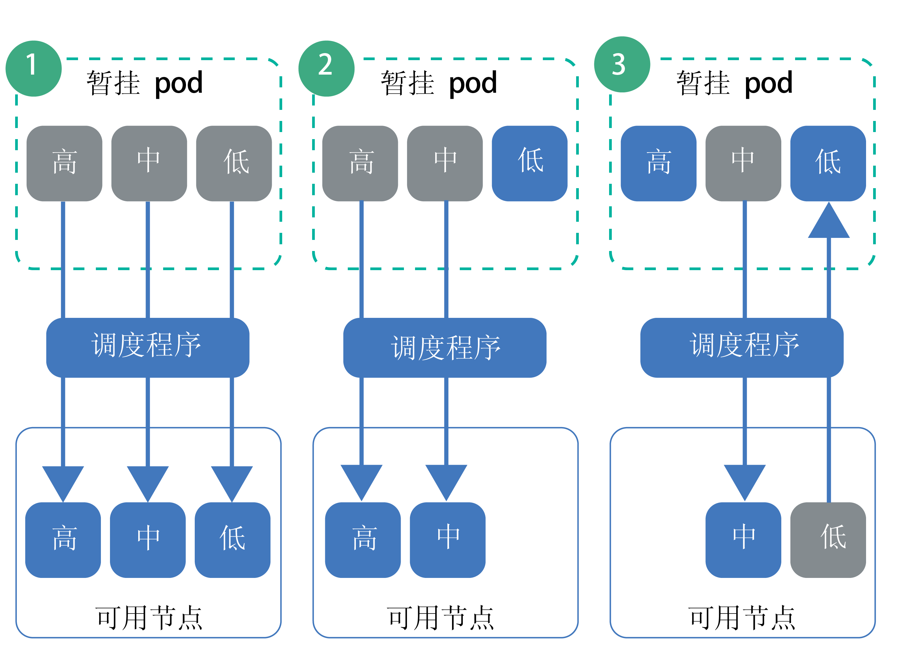

---

copyright:
  years: 2014, 2019
lastupdated: "2019-05-31"

keywords: kubernetes, iks

subcollection: containers

---

{:new_window: target="_blank"}
{:shortdesc: .shortdesc}
{:screen: .screen}
{:pre: .pre}
{:table: .aria-labeledby="caption"}
{:codeblock: .codeblock}
{:tip: .tip}
{:note: .note}
{:important: .important}
{:deprecated: .deprecated}
{:download: .download}
{:preview: .preview}


# 设置 pod 优先级
{: #pod_priority}

对于 Kubernetes pod 优先级和抢占，可以配置优先级类以指示 pod 的相对优先级。Kubernetes 调度程序会考虑 pod 的优先级，甚至可以抢占（除去）优先级较低的 pod，以便在工作程序节点上腾出空间以用于更高优先级的 pod。运行 Kubernetes V1.11.2 或更高版本的 {{site.data.keyword.containerlong}} 集群支持强制实施这些类的`优先级`许可控制器。
{: shortdesc}

**为什么要设置 pod 优先级？**</br>
作为集群管理员，您会希望控制哪些 pod 对集群工作负载更关键。优先级类可以帮助您控制 Kubernetes 调度程序决策，使优先级较高的 pod 优先于优先级较低的 pod 进行处理。调度程序甚至可以抢占（除去）正在运行的较低优先级的 pod，以便可以安排暂挂的更高优先级的 pod。

通过设置 pod 优先级，可以帮助防止较低优先级的工作负载影响集群中的关键工作负载，尤其是集群即将达到其资源容量的情况下。

确保已针对集群[设置正确的用户访问权](/docs/containers?topic=containers-users#users)，如果适用，还请确保设置了 [pod 安全策略](/docs/containers?topic=containers-psp#psp)。访问权和 pod 安全策略可以帮助防止不可信用户部署高优先级的 pod 而阻止调度其他 pod。
{: tip}

{: #priority_scheduling}
**优先级调度和抢占是如何运作的？**</br>
通常，优先级较高的暂挂 pod 会安排在较低优先级的 pod 之前执行。如果工作程序节点中没有足够的资源，那么调度程序可以抢占（除去）pod 以释放足够的资源，以便安排更高优先级的 pod。抢占还会受到正常终止时间段、pod 中断预算和工作程序节点亲缘关系的影响。

如果未对 pod 部署指定优先级，那么缺省优先级会设置为已设为 `globalDefault` 的优先级类。如果没有 `globalDefault` 优先级类，那么所有 pod 的缺省优先级都为零 (`0`)。缺省情况下，{{site.data.keyword.containerlong_notm}} 并未设置 `globalDefault`，因此 pod 的缺省优先级为零。

要了解 pod 优先级和调度程序如何一起工作，请考虑下图中的场景。您必须将已划分优先级的 pod 置于具有可用资源的工作程序节点上。否则，在除去现有 pod 的同时，集群中的高优先级 pod 可能保持暂挂状态，例如在场景 3 中那样。

_图：pod 优先级场景_


1.  具有高、中和低优先级的三个 pod 正在等待安排。调度程序找到了一个可用的工作程序节点，该节点有容纳所有 3 个 pod 的空间，并按优先级顺序安排这 3 个 pod，首先安排最高优先级的 pod。
2.  具有高、中和低优先级的三个 pod 正在等待安排。调度程序找到了一个可用的工作程序节点，但该工作程序节点只有足够的资源支持高优先级和中等优先级 pod。因此并未安排低优先级 pod，该 pod 仍处于暂挂状态。
3.  具有高优先级和中等优先级的两个 pod 处于等待安排状态。具有低优先级的第三个 pod 存在于一个可用工作程序节点上。但是，该工作程序节点没有足够的资源来安排任何暂挂的 pod。因此，调度程序会抢占或除去低优先级 pod，这将使该 pod 恢复为暂挂状态。然后，调度程序会尝试调度高优先级 pod。但是，该工作程序节点没有足够的资源来调度高优先级 pod，因此调度程序改为调度中等优先级 pod。

**有关更多信息**：请参阅 Kubernetes 文档中有关 [pod 优先级和抢占 ](https://kubernetes.io/docs/concepts/configuration/pod-priority-preemption/) 的内容。

**可以禁用 pod 优先级许可控制器吗？**</br>
不能。如果不想使用 pod 优先级，请勿设置 `globalDefault` 或在 pod 部署中包含优先级类。每个 pod 的优先级缺省为零，但 IBM 使用[缺省优先级类](#default_priority_class)部署的集群关键 pod 除外。因为 pod 优先级是相对优先级，所以此基本设置可确保对集群关键 pod 划分优先级以使用资源，并遵循已落实的现有安排策略来调度其他任何 pod。

**资源配额对 pod 优先级有怎样的影响？**</br>
对于运行 Kubernetes 1.12 或更高版本的集群，可以将 pod 优先级与资源配额组合使用，包括[配额作用域 ](https://kubernetes.io/docs/concepts/policy/resource-quotas/#quota-scopes)。借助配额作用域，可以设置资源配额来考虑 pod 优先级。优先级高的 pod 相比优先级低的 pod，可优先使用受到资源配额限制的系统资源。

## 了解缺省优先级类
{: #default_priority_class}

缺省情况下，{{site.data.keyword.containerlong_notm}} 集群会随附一些优先级类。
{: shortdesc}

请勿修改用于正确管理集群的缺省类。您可以在应用程序部署中使用这些类，或[创建自己的优先级类](#create_priority_class)。
{: important}

下表描述了缺省情况下集群中的优先级类以及使用这些类的原因。

|名称|设置方|优先级值|用途|
|---|---|---|
|`system-node-critical`|Kubernetes|2000001000|选择在创建集群时部署到 `kube-system` 名称空间中的 pod 会使用此优先级类来保护工作程序节点的关键功能，例如联网、存储器、日志记录、监视和度量值 pod。|
|`system-cluster-critical`|Kubernetes|2000000000|选择在创建集群时部署到 `kube-system` 名称空间中的 pod 会使用此优先级类来保护集群的关键功能，例如联网、存储器、日志记录、监视和度量值 pod。|
|`ibm-app-cluster-critical`|IBM|900000000|选择在创建集群时部署到 `ibm-system` 名称空间中的 pod 会使用此优先级类来保护应用程序的关键功能，例如负载均衡器 pod。|
{: caption="不能修改的缺省优先级类" caption-side="top"}

可以通过运行以下命令来检查哪些 pod 使用了优先级类。

```
kubectl get pods --all-namespaces -o custom-columns=NAME:.metadata.name,PRIORITY:.spec.priorityClassName
```
{: pre}

## 创建优先级类
{: #create_priority_class}

要设置 pod 优先级，需要使用优先级类。
{: shortdesc}

开始之前：
* [登录到您的帐户。如果适用，请将相应的资源组设定为目标。为集群设置上下文。](/docs/containers?topic=containers-cs_cli_install#cs_cli_configure)
* 确保您具有对 `default` 名称空间的 [{{site.data.keyword.Bluemix_notm}} IAM **写入者**或**管理者**服务角色](/docs/containers?topic=containers-users#platform)。
* [创建](/docs/containers?topic=containers-clusters#clusters_ui) Kubernetes V1.11 或更高版本的集群，或将集群[更新](/docs/containers?topic=containers-update#update)到 Kubernetes V1.11 或更高版本。

要使用优先级类，请执行以下操作：

1.  可选：使用现有优先级类作为新类的模板。

    1.  列出现有优先级类。

        ```
        kubectl get priorityclasses
        ```
        {: pre}

    2.  选择要复制的优先级类并创建本地 YAML 文件。

        ```
        kubectl get priorityclass <priority_class> -o yaml > Downloads/priorityclass.yaml
        ```
        {: pre}

2.  编写自己的优先级类 YAML 文件。

    ```yaml
    apiVersion: scheduling.k8s.io/v1alpha1
    kind: PriorityClass
    metadata:
      name: <priority_class_name>
    value: <1000000>
    globalDefault: <false>
    description: "Use this class for XYZ service pods only."
    ```
    {: codeblock}

    <table>
    <caption>了解 YAML 文件的组成部分</caption>
    <thead>
    <th colspan=2> 了解 YAML 文件的组成部分</th>
    </thead>
    <tbody>
    <tr>
    <td><code>metadata.name</code></td>
    <td>必需：要创建的优先级类的名称。</td>
    </tr>
    <tr>
    <td><code>value</code></td>
    <td>必需：输入小于或等于 10 亿 (1000000000) 的整数。值越高，优先级越高。值相对于集群中其他优先级类的值。对于不希望被抢占（除去）的系统关键 pod，请保留极大的数字。</br></br>例如，[缺省集群关键优先级类](#default_priority_class)的值范围为 900000000-2000001000，因此对于新的优先级类，请输入小于这些数字的值，避免任何 pod 的优先级高于这些 pod。</td>
    </tr>
    <tr>
    <td><code>globalDefault</code></td>
    <td>可选：将此字段设置为 `true` 可将此优先级类设置为全局缺省值，此缺省值将应用于安排的未指定 `priorityClassName` 值的每个 pod。集群中只能有 1 个优先级类可设置为全局缺省值。如果没有全局缺省值，那么没有指定 `priorityClassName` 的 pod 的优先级为零 (`0`)。</br></br>
        [缺省优先级类](#default_priority_class)不会设置 `globalDefault`。如果在集群中创建了其他优先级类，那么可以通过运行 `kubectl describe priorityclass <name>` 来检查以确保这些类未设置 `globalDefault`。</td>
    </tr>
    <tr>
    <td><code>description</code></td>
    <td>可选：指示用户使用此优先级类的原因。将字符串用引号 (`""`) 括起。</td>
    </tr></tbody></table>

3.  在集群中创建优先级类。

    ```
    kubectl apply -f filepath/priorityclass.yaml
    ```
    {: pre}

4.  验证优先级类是否已创建。

    ```
    kubectl get priorityclasses
    ```
    {: pre}

太好了！您已创建优先级类。请通知您的团队有关该优先级类以及他们必须用于自己 pod 部署的优先级类（如果有）的信息。  

## 为 pod 分配优先级
{: #prioritize}

为 pod spec 分配优先级类，以设置 {{site.data.keyword.containerlong_notm}} 集群内 pod 的优先级。如果优先级类在 Kubernetes V1.11 中可用之前 pod 就已存在，那么必须编辑 pod YAML 文件为这些 pod 分配优先级。
{: shortdesc}

开始之前：
* [登录到您的帐户。如果适用，请将相应的资源组设定为目标。为集群设置上下文。](/docs/containers?topic=containers-cs_cli_install#cs_cli_configure)
* 确保您在要将 pod 部署到的名称空间中具有 [{{site.data.keyword.Bluemix_notm}} IAM **写入者**或**管理者**服务角色](/docs/containers?topic=containers-users#platform)。
* [创建](/docs/containers?topic=containers-clusters#clusters_ui) Kubernetes V1.11 或更高版本的集群，或将集群[更新](/docs/containers?topic=containers-update#update)到 Kubernetes V1.11 或更高版本。
* [了解优先级安排的运作方式](#priority_scheduling)，因为优先级可以抢占现有 pod，并影响如何使用集群的资源。

要为 pod 分配优先级，请执行以下操作：

1.  检查其他已部署 pod 的重要性，以便可以相对于已部署的 pod，为您的 pod 选择适当的优先级类。

    1.  查看名称空间中其他 pod 使用的优先级类。

        ```
        kubectl get pods -n <namespace> -o custom-columns=NAME:.metadata.name,PRIORITY:.spec.priorityClassName
        ```
        {: pre}

    2.  获取优先级类的详细信息，并记下**值**数字。划分优先级时，数字较大的 pod 会位于数字较低的 pod 之前。对于要复查的每个优先级类重复此步骤。

        ```
        kubectl describe priorityclass <priorityclass_name>
        ```
        {: pre}

2.  获取要使用的优先级类，或者[创建自己的优先级类](#create_priority_class)。

    ```
    kubectl get priorityclasses
    ```
    {: pre}

3.  在 pod spec 中，为 `priorityClassName` 字段添加在上一步中检索到的优先级类的名称。

    ```yaml
    apiVersion: apps/v1
    kind: Deployment
    metadata:
      name: ibmliberty
    spec:
      replicas: 1
      selector:
        matchLabels:
          app: ibmliberty
      template:
        metadata:
          labels:
            app: ibmliberty
        spec:
          containers:
          - name: ibmliberty
            image: icr.io/ibmliberty:latest
            ports:
            - containerPort: 9080
          priorityClassName: <priorityclass_name>
    ```
    {: codeblock}

4.  在要部署划分优先级 pod 的名称空间中创建这些 pod。

    ```
    kubectl apply -f filepath/pod-deployment.yaml
    ```
    {: pre}
