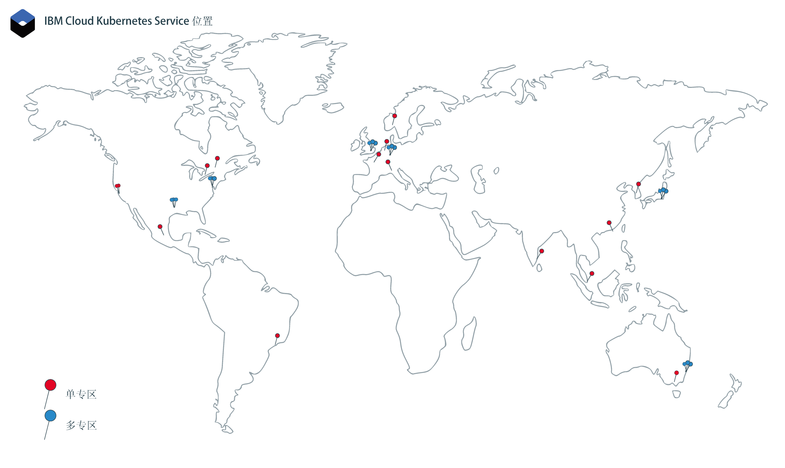

---

copyright:
  years: 2014, 2019
lastupdated: "2019-06-06"

keywords: kubernetes, iks

subcollection: containers

---

{:new_window: target="_blank"}
{:shortdesc: .shortdesc}
{:screen: .screen}
{:pre: .pre}
{:table: .aria-labeledby="caption"}
{:codeblock: .codeblock}
{:tip: .tip}
{:note: .note}
{:important: .important}
{:deprecated: .deprecated}
{:download: .download}
{:preview: .preview}

# 位置
{: #regions-and-zones}

您可以在全球范围部署 {{site.data.keyword.containerlong}} 集群。创建 Kubernetes 集群时，其资源会保留在将集群部署到的位置中。可以通过全局 API 端点来访问 {{site.data.keyword.containerlong_notm}} 以使用集群。
{:shortdesc}



_{{site.data.keyword.containerlong_notm}} 位置_

{{site.data.keyword.Bluemix_notm}} 资源以前是按区域进行组织，这些区域通过[特定于区域的端点](#bluemix_regions)进行访问。请改为使用[全局端点](#endpoint)。
{: deprecated}

## {{site.data.keyword.containerlong_notm}} 位置
{: #locations}

{{site.data.keyword.Bluemix_notm}} 资源会按地理位置的层次结构进行组织。{{site.data.keyword.containerlong_notm}} 在其中一部分位置中可用，包括所有六个支持多专区的全球区域。免费集群仅在精选位置中可用。其他 {{site.data.keyword.Bluemix_notm}} 服务可能在全球或在特定位置内提供。
{: shortdesc}

### 可用位置
{: #available-locations}

要列出可用的 {{site.data.keyword.containerlong_notm}} 位置，请使用 `ibmcloud ks supported-locations` 命令。
{: shortdesc}

下图用作示例，说明了 {{site.data.keyword.containerlong_notm}} 位置的组织方式。


<table summary="该表显示了 {{site.data.keyword.containerlong_notm}} 位置的组织方式。每行从左到右阅读，其中第一列是位置类型，第二列是类型示例，第三列是描述。">
<caption>{{site.data.keyword.containerlong_notm}} 位置的组织方式。</caption>
  <thead>
  <th>类型</th>
  <th>示例</th>
  <th>描述</th>
  </thead>
  <tbody>
    <tr>
      <td>地理位置</td>
      <td>北美洲 (`na`)</td>
      <td>基于地理大洲的组织分组。</td>
    </tr>
    <tr>
      <td>国家或地区</td>
      <td>加拿大 (`ca`)</td>
      <td>地理位置内位置的国家或地区。</td>
    </tr>
    <tr>
      <td>大城市</td>
      <td>墨西哥城 (`mex-cty`)、达拉斯 (`dal`)</td>
      <td>一个或多个数据中心（专区）所在城市的名称。大城市可以支持多专区，也可以具有支持多专区的数据中心（例如，达拉斯），或者只具有单专区数据中心（例如，墨西哥城）。如果在支持多专区的大城市中创建集群，那么可以在各专区中分布 Kubernetes 主节点和工作程序节点，以实现高可用性。</td>
    </tr>
    <tr>
      <td>数据中心（专区）</td>
      <td>达拉斯 12 (`dal12`)</td>
      <td>用于托管云服务和应用程序的计算、网络和存储基础架构以及相关冷却系统和电源所在的物理位置。集群可在多专区体系结构中的各数据中心（或专区）中分布，以实现高可用性。专区彼此隔离，可确保没有共享的单点故障。
</td>
    </tr>
  </tbody>
  </table>

### {{site.data.keyword.containerlong_notm}} 中的单专区和多专区位置
{: #zones}

下表列出了 {{site.data.keyword.containerlong_notm}} 中的可用单专区和多专区位置。请注意，在某些大城市中，可以将集群作为单专区或多专区集群进行供应。此外，免费集群仅在精选地理区域中可用，且仅作为具有一个工作程序节点的单专区集群。
{: shortdesc}

* **多专区**：如果在多专区大城市位置中创建集群，那么高可用性 Kubernetes 主节点的副本会在各专区中自动分布。您可以选择在各专区中分布工作程序节点，以保护应用程序不受专区故障的影响。
* **单专区**：如果在单数据中心位置中创建集群，那么可以创建多个工作程序节点，但却不能在各专区中分布这些节点。高可用性主节点包含三个副本，分别位于不同的主机上，但主节点不会在各专区中分布。

要快速确定专区是否支持多专区，可以运行 `ibmcloud ks supported-locations`，并在 `Multizone Metro` 列中查找值。
{: tip}


{{site.data.keyword.Bluemix_notm}} 资源以前是按区域进行组织，这些区域通过[特定于区域的端点](#bluemix_regions)进行访问。以下各表列出了先前的区域以供参考。以后，可以使用[全局端点](#endpoint)来移至无区域体系结构。
{: deprecated}

**多专区大城市位置**

<table summary="该表显示了 {{site.data.keyword.containerlong_notm}} 中的可用多专区大城市位置。每行从左到右阅读。第一列是位置所在的地理位置，第二列是位置所在的国家或地区，第三列是位置所在的大城市，第四列是数据中心，第五列是过去将位置划分到其中的不推荐区域。">
<caption>{{site.data.keyword.containerlong_notm}} 中的可用多专区大城市位置。</caption>
  <thead>
  <th>地理位置</th>
  <th>国家或地区</th>
  <th>大城市</th>
  <th>数据中心</th>
  <th>不推荐的区域</th>
  </thead>
  <tbody>
    <tr>
      <td>亚太地区</td>
      <td>澳大利亚</td>
      <td>悉尼</td>
      <td>syd01、syd04、syd05</td>
      <td>亚太地区南部（`ap-south` 和 `au-syd`）</td>
    </tr>
    <tr>
      <td>亚太地区</td>
      <td>日本</td>
      <td>东京</td>
      <td>tok02、tok04、tok05</td>
      <td>亚太地区北部（`ap-north` 和 `jp-tok`）</td>
    </tr>
    <tr>
      <td>欧洲</td>
      <td>德国</td>
      <td>法兰克福</td>
      <td>fra02、fra04、fra05</td>
      <td>欧洲中部（`eu-central` 和 `eu-de`）</td>
    </tr>
    <tr>
      <td>欧洲</td>
      <td>英国</td>
      <td>伦敦</td>
      <td>lon04、lon05`*`、lon06</td>
      <td>英国南部（`uk-south` 和 `eu-gb`）</td>
    </tr>
    <tr>
      <td>北美洲</td>
      <td>美国</td>
      <td>达拉斯</td>
      <td>dal10、dal12、dal13</td>
      <td>美国南部 (`us-south`)</td>
    </tr>
    <tr>
      <td>北美洲</td>
      <td>美国</td>
      <td>华盛顿</td>
      <td>wdc04、wdc06、wdc07</td>
      <td>美国东部 (`us-east`)</td>
    </tr>
  </tbody>
  </table>

**单专区数据中心位置**

<table summary="该表显示了 {{site.data.keyword.containerlong_notm}} 中的可用单专区大城市位置。每行从左到右阅读。第一列是位置所在的地理位置，第二列是位置所在的国家或地区，第三列是位置所在的大城市，第四列是数据中心，第五列是过去将位置划分到其中的不推荐区域。">
<caption>{{site.data.keyword.containerlong_notm}} 中的可用单专区大城市位置。</caption>
  <thead>
  <th>地理位置</th>
  <th>国家或地区</th>
  <th>大城市</th>
  <th>数据中心</th>
  <th>不推荐的区域</th>
  </thead>
  <tbody>
    <tr>
      <td>亚太地区</td>
      <td>澳大利亚</td>
      <td>墨尔本</td>
      <td>mel01</td>
      <td>亚太地区南部（`ap-South` 和 `au-syd`）</td>
    </tr>
    <tr>
      <td>亚太地区</td>
      <td>澳大利亚</td>
      <td>悉尼</td>
      <td>syd01、syd04、syd05</td>
      <td>亚太地区南部（`ap-South` 和 `au-syd`）</td>
    </tr>
    <tr>
      <td>亚太地区</td>
      <td>中国</td>
      <td>中国香港<br>特别行政区</td>
      <td>hkg02</td>
      <td>亚太地区北部（`ap-north` 和 `jp-tok`）</td>
    </tr>
    <tr>
      <td>亚太地区</td>
      <td>印度</td>
      <td>金奈</td>
      <td>che01</td>
      <td>亚太地区北部（`ap-north` 和 `jp-tok`）</td>
    </tr>
    <tr>
      <td>亚太地区</td>
      <td>日本</td>
      <td>东京</td>
      <td>tok02、tok04、tok05</td>
      <td>亚太地区北部（`ap-north` 和 `jp-tok`）</td>
    </tr>
    <tr>
      <td>亚太地区</td>
      <td>韩国</td>
      <td>首尔</td>
      <td>seo01</td>
      <td>亚太地区北部（`ap-north` 和 `jp-tok`）</td>
    </tr>
    <tr>
      <td>亚太地区</td>
      <td>新加坡</td>
      <td>新加坡</td>
      <td>sng01</td>
      <td>亚太地区北部（`ap-north` 和 `jp-tok`）</td>
    </tr>
    <tr>
      <td>欧洲</td>
      <td>法国</td>
      <td>巴黎</td>
      <td>par01</td>
      <td>欧洲中部（`eu-central` 和 `eu-de`）</td>
    </tr>
    <tr>
      <td>欧洲</td>
      <td>德国</td>
      <td>法兰克福</td>
      <td>fra02、fra04、fra05</td>
      <td>欧洲中部（`eu-central` 和 `eu-de`）</td>
    </tr>
    <tr>
      <td>欧洲</td>
      <td>意大利</td>
      <td>米兰</td>
      <td>mil01</td>
      <td>欧洲中部（`eu-central` 和 `eu-de`）</td>
    </tr>
    <tr>
      <td>欧洲</td>
      <td>荷兰</td>
      <td>阿姆斯特丹</td>
      <td>ams03</td>
      <td>欧洲中部（`eu-central` 和 `eu-de`）</td>
    </tr>
    <tr>
      <td>欧洲</td>
      <td>挪威</td>
      <td>奥斯陆</td>
      <td>osl</td>
      <td>欧洲中部（`eu-central` 和 `eu-de`）</td>
    </tr>
    <tr>
      <td>欧洲</td>
      <td>英国</td>
      <td>伦敦</td>
      <td>lon02`*`、lon04、lon05`*`、lon06</td>
      <td>英国南部（`uk-south` 和 `eu-gb`）</td>
    </tr>
    <tr>
      <td>北美洲</td>
      <td>加拿大</td>
      <td>蒙特利尔</td>
      <td>mon01</td>
      <td>美国东部 (`us-east`)</td>
    </tr>
    <tr>
      <td>北美洲</td>
      <td>加拿大</td>
      <td>多伦多</td>
      <td>tor01</td>
      <td>美国东部 (`us-east`)</td>
    </tr>
    <tr>
      <td>北美洲</td>
      <td>墨西哥</td>
      <td>墨西哥城</td>
      <td>mex01</td>
      <td>美国南部 (`us-south`)</td>
    </tr>
    <tr>
      <td>北美洲</td>
      <td>美国</td>
      <td>达拉斯</td>
      <td>dal10、dal12、dal13</td>
      <td>美国南部 (`us-south`)</td>
    </tr>
    <tr>
      <td>北美洲</td>
      <td>美国</td>
      <td>圣何塞</td>
      <td>sjc03、sjc04</td>
      <td>美国南部 (`us-south`)</td>
    </tr>
    <tr>
      <td>北美洲</td>
      <td>美国</td>
      <td>华盛顿</td>
      <td>wdc04、wdc06、wdc07</td>
      <td>美国东部 (`us-east`)</td>
    </tr>
    <tr>
      <td>南美洲</td>
      <td>巴西</td>
      <td>圣保罗</td>
      <td>sao01</td>
      <td>美国南部 (`us-south`)</td>
    </tr>
  </tbody>
  </table>

`*` lon05 已替换 lon02。新集群必须使用 lon05，并且只有 lon05 支持高可用性主节点在各专区中分布。
{: note}

### 单专区集群
{: #regions_single_zone}

在单专区集群中，集群的资源会保留在部署集群的专区中。下图重点说明了单专区集群组件的关系，以加拿大多伦多 `tor01` 位置为例。
{: shortdesc}


_了解单专区集群资源的位置。_

1.  集群资源（包括主节点和工作程序节点）位于将集群部署到的数据中心。启动本地容器编排操作（例如，`kubectl` 命令）时，将在同一专区内的主节点与工作程序节点之间交换信息。

2.  如果设置了其他集群资源（例如，存储器、联网、计算或在 pod 中运行的应用程序），那么资源及其数据会保留在将集群部署到的专区中。

3.  启动集群管理操作（例如，使用 `ibmcloud ks` 命令）时，将经由全局端点通过区域端点传递有关集群的基本信息（例如，名称、标识、用户和命令）。区域端点位于距离最近的多专区大城市区域中。在此示例中，大城市区域为华盛顿。

### 多专区集群
{: #regions_multizone}

在多专区集群中，集群的资源会在多个专区中分布，以实现更高可用性。
{: shortdesc}

1.  工作程序节点在大城市位置的多个专区中分布，从而为集群提供更高可用性。此外，Kubernetes 主节点副本也在多个专区中分布。启动本地容器编排操作（例如，`kubectl` 命令）时，将通过全局端点在主节点与工作程序节点之间交换信息。

2.  其他集群资源（例如，存储器、联网、计算或在 pod 中运行的应用程序）在多专区集群内的专区中的部署方式各不相同。有关更多信息，请查看以下主题：
    *   在多专区集群中设置[文件存储器](/docs/containers?topic=containers-file_storage#add_file)和[块存储器](/docs/containers?topic=containers-block_storage#add_block)，或[选择多专区持久性存储器解决方案](/docs/containers?topic=containers-storage_planning#persistent_storage_overview)。
    *   [在多专区集群中使用网络负载均衡器 (NLB) 服务启用对应用程序的公共或专用访问权](/docs/containers?topic=containers-loadbalancer#multi_zone_config)。
    *   [使用 Ingress 管理网络流量](/docs/containers?topic=containers-ingress#planning)。
    *   [提高应用程序的可用性](/docs/containers?topic=containers-app#increase_availability)。

3.  启动集群管理操作（例如，使用 [`ibmcloud ks` 命令](/docs/containers?topic=containers-cli-plugin-kubernetes-service-cli)）时，将通过全局端点传递有关集群的基本信息（例如，名称、标识、用户和命令）。

### 免费集群
{: #regions_free}

免费集群仅限于在特定位置可用。
{: shortdesc}

**在 CLI 中创建免费集群**：创建免费集群之前，必须通过运行 `ibmcloud ks region-set` 将某个区域设定为目标。集群将在目标区域内的某个大城市中进行创建：在 `ap-south` 中为悉尼大城市，在 `eu-central` 中为法兰克福大城市，在 `uk-south` 中为伦敦大城市，在 `us-south` 中为达拉斯大城市。请注意，不能在大城市内指定专区。

**在 {{site.data.keyword.Bluemix_notm}} 控制台中创建免费集群**：使用控制台时，可以选择地理位置和地理位置中的大城市位置。在北美，可以选择达拉斯大城市，在欧洲，选择法兰克福或伦敦大城市，或者在亚太地区，选择悉尼大城市。集群将在所选大城市内的专区中进行创建。

<br />


## 访问全局端点
{: #endpoint}

您可以使用 {{site.data.keyword.Bluemix_notm}} 位置（原先称为区域）组织各 {{site.data.keyword.Bluemix_notm}} 服务中的资源。例如，您可以通过使用存储在同一位置的 {{site.data.keyword.registryshort_notm}} 中的专用 Docker 映像来创建 Kubernetes 集群。
要访问这些资源，可以使用全局端点并按位置进行过滤。
{:shortdesc}

### 登录到 {{site.data.keyword.Bluemix_notm}}
{: #login-ic}

登录到 {{site.data.keyword.Bluemix_notm}} (`ibmcloud`) 命令行时，系统将提示您选择区域。但是，此区域不会影响仍使用全局端点的 {{site.data.keyword.containerlong_notm}} 插件 (`ibmcloud ks`) 端点。请注意，如果集群不在缺省资源组中，那么您仍需要将集群所在的资源组设定为目标。
{: shortdesc}

要登录到 {{site.data.keyword.Bluemix_notm}} 全局 API 端点，并将集群所在的资源组设定为目标，请运行以下命令：
```
ibmcloud login -a https://cloud.ibm.com -g <nondefault_resource_group_name>
```
{: pre}

### 登录到 {{site.data.keyword.containerlong_notm}}
{: #login-iks}

登录到 {{site.data.keyword.Bluemix_notm}} 后，可以访问 {{site.data.keyword.containershort_notm}}。为了帮助您入门，请查看有关使用 {{site.data.keyword.containerlong_notm}} CLI 和 API 的以下资源。
{: shortdesc}

**{{site.data.keyword.containerlong_notm}} CLI**：
* [将 CLI 设置为使用 `ibmcloud ks` 插件](/docs/containers?topic=containers-cs_cli_install#cs_cli_install)。
* [配置 CLI 以连接到特定集群并运行 `kubectl` 命令](/docs/containers?topic=containers-cs_cli_install#cs_cli_configure)。

缺省情况下，您已登录到全局 {{site.data.keyword.containerlong_notm}} 端点：`https://containers.cloud.ibm.com`。

在 {{site.data.keyword.containerlong_notm}} CLI 中使用新的全局功能时，请考虑基于区域的旧功能中的以下更改。

* 列出资源：
  * 列出资源时，例如使用 `ibmcloud ks clusters`、`ibmcloud ks subnets` 或 `ibmcloud ks zones` 命令，会返回所有位置中的资源。要按特定位置过滤资源，某些命令可包含 `--locations` 标志。例如，如果是按 `dal` 大城市过滤集群，那么会返回该大城市中的多专区集群以及该大城市内数据中心（专区）中的单专区集群。如果是按 `dal10` 数据中心（专区）过滤集群，那么将返回在该专区中具有工作程序节点的多专区集群以及该专区中的单专区集群。请注意，可以传递一个位置，也可以传递以逗号分隔的位置列表。
    按位置过滤的示例：
    ```
    ibmcloud ks clusters --locations dal
    ```
    {: pre}
  * 其他命令不会返回所有位置中的资源。要运行 `credential-set/unset/get`、`api-key-reset` 和 `vlan-spanning-get` 命令，必须在 `--region` 中指定区域。

* 使用资源：
  * 使用全局端点时，可以使用任何位置中您有权访问的资源，即使通过运行 `ibmcloud ks region-set` 设置了区域，但要使用的资源位于其他区域中。
  * 如果在不同区域中具有同名的集群，那么可以在运行命令时使用集群标识，也可以在运行命令时使用 `ibmcloud ks region-set` 命令设置区域并使用集群名称。

* 旧功能：
  * 如果只需要列出和使用一个区域中的资源，那么可以使用 `ibmcloud ks init` [命令](/docs/containers?topic=containers-cli-plugin-kubernetes-service-cli#cs_init)将区域端点而不是全局端点设定为目标。将美国南部区域端点设定为目标的示例：
    ```
    ibmcloud ks init --host https://us-south.containers.cloud.ibm.com
    ```
    {: pre}
  * 要使用全局功能，可以再次使用 `ibmcloud ks init` 命令将全局端点设定为目标。将全局端点重新设定为目标的示例：
    ```
  ibmcloud ks init --host https://containers.cloud.ibm.com
  ```
    {: pre}

</br></br>
**{{site.data.keyword.containerlong_notm}} API**：
* [API 入门](/docs/containers?topic=containers-cs_cli_install#cs_api)。
* [查看有关 API 命令的文档](https://containers.cloud.ibm.com/global/swagger-global-api/)。
* 使用 [`swagger.json` API](https://containers.cloud.ibm.com/global/swagger-global-api/swagger.json)，生成要在自动化中使用的 API 客户机。

要与全局 {{site.data.keyword.containerlong_notm}} API 交互，请输入命令类型并将 `global/v1/command` 附加到该端点。

`GET /clusters` 全局 API 的示例：
```
GET https://containers.cloud.ibm.com/global/v1/clusters
```
{: codeblock}

</br>

如果需要在 API 调用中指定区域，请从路径中除去 `/global` 参数，并在 `X-Region` 头中传递区域名称。要列出可用区域，请运行 `ibmcloud ks regions`。


<br />


## 不推荐：先前的 {{site.data.keyword.Bluemix_notm}} 区域和专区结构
{: #bluemix_regions}

先前，您的 {{site.data.keyword.Bluemix_notm}} 资源是按区域组织的。区域是用于组织专区的概念工具，可以包含不同国家或地区和地理位置中的专区（数据中心）。下表映射了先前的 {{site.data.keyword.Bluemix_notm}} 区域、{{site.data.keyword.containerlong_notm}} 区域和 {{site.data.keyword.containerlong_notm}} 专区。支持多专区的专区以粗体显示。
{: shortdesc}

不推荐使用特定于区域的端点。请改为使用[全局端点](#endpoint)。如果必须使用区域端点，请[将 {{site.data.keyword.containerlong_notm}} 插件中的 `IKS_BETA_VERSION` 环境变量设置为 `0.2`](/docs/containers-cli-plugin?topic=containers-cli-plugin-kubernetes-service-cli#cs_beta)。
{: deprecated}

|{{site.data.keyword.containerlong_notm}} 区域|对应的 {{site.data.keyword.Bluemix_notm}} 区域|区域中的可用专区|
| --- | --- | --- |
|亚太地区北部（仅限标准集群）|东京|che01、hkg02、seo01、sng01、**tok02、tok04、tok05**|
|亚太地区南部|悉尼|mel01、**syd01、syd04、syd05**|
|欧洲中部|法兰克福|ams03、**fra02、fra04、fra05**、mil01、osl01、par01|
|英国南部|伦敦|lon02、**lon04、lon05、lon06**|
|美国东部（仅限标准集群）|华盛顿|mon01、tor01、**wdc04、wdc06、wdc07**|
|美国南部|达拉斯|**dal10、dal12、dal13**、mex01、sjc03、sjc04、sao01|
{: caption="对应的 {{site.data.keyword.containershort_notm}} 和 {{site.data.keyword.Bluemix_notm}} 区域以及专区。支持多专区的专区以粗体显示。" caption-side="top"}

通过使用 {{site.data.keyword.containerlong_notm}} 区域，您可以在除您登录的 {{site.data.keyword.Bluemix_notm}} 区域以外的区域中创建或访问 Kibernetes 集群。
{{site.data.keyword.containerlong_notm}} 区域端点具体参考 {{site.data.keyword.containerlong_notm}}，而不是作为一个整体参考 {{site.data.keyword.Bluemix_notm}}。


出于以下原因，您可能希望登录到其他 {{site.data.keyword.containerlong_notm}} 区域：
  * 您在一个区域中创建了 {{site.data.keyword.Bluemix_notm}} 服务或专用 Docker 映像，并希望将其用于另一个区域中的 {{site.data.keyword.containerlong_notm}}。
  * 您希望访问与登录到的缺省 {{site.data.keyword.Bluemix_notm}} 区域不同的区域中的集群。

要快速切换区域，请使用 `ibmcloud ks region-set` [命令](/docs/containers?topic=containers-cli-plugin-kubernetes-service-cli#cs_region-set)。
