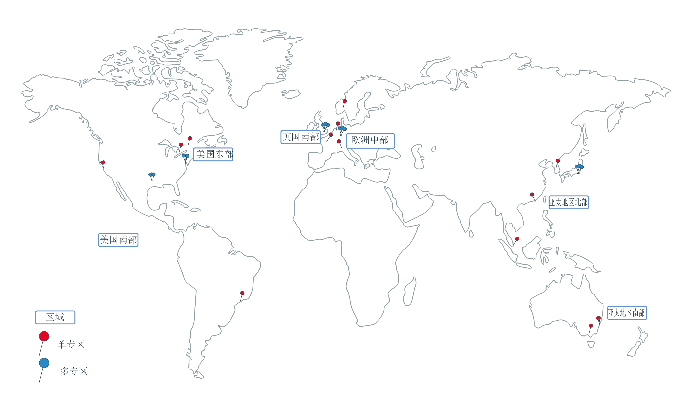

---

copyright:
  years: 2014, 2019
lastupdated: "2019-03-21"

keywords: kubernetes, iks 

subcollection: containers

---

{:new_window: target="_blank"}
{:shortdesc: .shortdesc}
{:screen: .screen}
{:pre: .pre}
{:table: .aria-labeledby="caption"}
{:codeblock: .codeblock}
{:tip: .tip}
{:note: .note}
{:important: .important}
{:deprecated: .deprecated}
{:download: .download}


# 区域和专区
{: #regions-and-zones}

区域是可以部署应用程序、服务和其他 {{site.data.keyword.Bluemix}} 资源的特定地理位置。[{{site.data.keyword.Bluemix_notm}} 区域](#bluemix_regions)与 [{{site.data.keyword.containerlong}} 区域](#container_regions)不同。区域由一个或多个专区组成，专区是物理数据中心，用于托管计算、网络和存储资源以及相关冷却系统和电源，服务和应用程序通过这些资源托管。专区彼此隔离，可确保没有共享的单点故障。
{:shortdesc}



_{{site.data.keyword.containerlong_notm}} 区域和专区_

{{site.data.keyword.Bluemix_notm}} 在全球托管。{{site.data.keyword.Bluemix_notm}} 内的服务可以在全球可用或在特定区域内可用。
在 {{site.data.keyword.containerlong_notm}} 中创建 Kubernetes 集群时，其资源仍保留在将集群部署到的区域中。


您可以在每个支持的 {{site.data.keyword.containerlong_notm}} 区域中创建标准集群。免费集群仅在精选区域中可用。
{: note}

|{{site.data.keyword.containerlong_notm}} 区域|相应的 {{site.data.keyword.Bluemix_notm}} 位置|
| --- | --- |
|亚太地区北部（仅限标准集群）|东京|
|亚太地区南部|悉尼|
|欧洲中部|法兰克福|
|英国南部|伦敦|
|美国东部（仅限标准集群）|华盛顿|
|美国南部
      |达拉斯|
{: caption="支持的 Kubernetes Service 区域和相应的 IBM Cloud 位置。" caption-side="top"}

<br />


## {{site.data.keyword.Bluemix_notm}} 中的位置
{: #bluemix_regions}

您可以使用 {{site.data.keyword.Bluemix_notm}} 位置（也称为区域）在 {{site.data.keyword.Bluemix_notm}} 服务之间组织资源。例如，您可以通过使用存储在同一位置的 {{site.data.keyword.registryshort_notm}} 中的专用 Docker 映像来创建 Kubernetes 集群。
{:shortdesc}

您可以在登录到全局 API 端点时指定 {{site.data.keyword.Bluemix_notm}} 区域。要列出可用区域，请运行 `ibmcloud regions`。要检查您当前所在的 {{site.data.keyword.Bluemix_notm}} 位置，请运行 `ibmcloud target` 并查看 **Region** 字段。如果未指定区域，系统将提示您选择区域。

例如，要登录到达拉斯 (`us-south`) 区域中的全局 API 端点，请运行以下命令：
```
ibmcloud login -a https://cloud.ibm.com -r us-south
```
{: pre}

要登录到全局 API 端点并选择区域，请运行以下命令：
```
ibmcloud login -a https://cloud.ibm.com
```
{: pre}

输出示例：
```
API endpoint: cloud.ibm.com

Get One Time Code from https://identity-2.eu-central.iam.cloud.ibm.com/identity/passcode to proceed.
Open the URL in the default browser? [Y/n]> y
One Time Code > 
Authenticating...
OK

Select an account:
1. MyAccount (00a11aa1a11aa11a1111a1111aaa11aa) <-> 1234567
2. TeamAccount (2bb222bb2b22222bbb2b2222bb2bb222) <-> 7654321
Enter a number> 2
Targeted account TeamAccount (2bb222bb2b22222bbb2b2222bb2bb222) <-> 7654321


Targeted resource group default

Select a region (or press enter to skip):
1. au-syd
2. jp-tok
3. eu-de
4. eu-gb
5. us-south
6. us-east
Enter a number> 5
Targeted region us-south

                      
API endpoint:      https://cloud.ibm.com   
Region:            us-south   
User:              first.last@email.com   
Account:           TeamAccount (2bb222bb2b22222bbb2b2222bb2bb222) <-> 7654321  
Resource group:    default   
CF API endpoint:      
Org:                  
Space:                

...
```
{: screen}

<br />


## {{site.data.keyword.containerlong_notm}} 中的区域
{: #container_regions}

通过使用 {{site.data.keyword.containerlong_notm}} 区域，您可以在除您登录的 {{site.data.keyword.Bluemix_notm}} 区域以外的区域中创建或访问 Kibernetes 集群。
{{site.data.keyword.containerlong_notm}} 区域端点具体参考 {{site.data.keyword.containerlong_notm}}，而不是作为一个整体参考 {{site.data.keyword.Bluemix_notm}}。
{:shortdesc}

您可以在每个支持的 {{site.data.keyword.containerlong_notm}} 区域中创建标准集群。免费集群仅在精选区域中可用。
{: note}

支持的 {{site.data.keyword.containerlong_notm}} 区域：
  * 亚太地区北部（仅限标准集群）
  * 亚太地区南部
  * 欧洲中部
  * 英国南部
  * 美国东部（仅限标准集群）
  * 美国南部

您可以通过一个全局端点来访问 {{site.data.keyword.containerlong_notm}}：`https://containers.cloud.ibm.com/v1`。
* 要检查您当前所在的 {{site.data.keyword.containerlong_notm}} 区域，请运行 `ibmcloud ks region`。
* 要检索可用区域及其端点的列表，请运行 `ibmcloud ks regions`。

要将 API 用于全球端点，请在所有请求的 `X-Region` 头中传递区域名称。
{: tip}

### 登录到其他 {{site.data.keyword.containerlong_notm}} 区域
{: #container_login_endpoints}

可以使用 {{site.data.keyword.containerlong_notm}} CLI 来更改区域。
{:shortdesc}

出于以下原因，您可能希望登录到其他 {{site.data.keyword.containerlong_notm}} 区域：
  * 您在一个区域中创建了 {{site.data.keyword.Bluemix_notm}} 服务或专用 Docker 映像，并希望将其用于另一个区域中的 {{site.data.keyword.containerlong_notm}}。
  * 您希望访问与登录到的缺省 {{site.data.keyword.Bluemix_notm}} 区域不同的区域中的集群。

要快速切换区域，请运行 [`ibmcloud ks region-set`](/docs/containers?topic=containers-cs_cli_reference#cs_region-set)。

### 使用 {{site.data.keyword.containerlong_notm}} API 命令
{: #containers_api}

要与 {{site.data.keyword.containerlong_notm}} API 交互，请输入命令类型并将 `/v1/command` 附加到全局端点。
{:shortdesc}

`GET /clusters` API 的示例：
  ```
  GET https://containers.cloud.ibm.com/v1/clusters
  ```
  {: codeblock}

</br>

要将 API 用于全球端点，请在所有请求的 `X-Region` 头中传递区域名称。要列出可用区域，请运行 `ibmcloud ks regions`。
{: tip}

要查看有关 API 命令的文档，请查看 [https://containers.cloud.ibm.com/swagger-api/](https://containers.cloud.ibm.com/swagger-api/)。

## {{site.data.keyword.containerlong_notm}} 中的专区
{: #zones}

专区是 {{site.data.keyword.Bluemix_notm}} 区域内可用的物理数据中心。区域是用于组织专区的概念工具，可以包含不同国家或地区中的专区（数据中心）。下表按区域显示可用的专区。
{:shortdesc}

* **多专区大城市**：如果在多专区大城市（**悉尼（亚太地区南部）除外）**中创建集群，那么高可用性 Kubernetes 主节点的副本会在各专区中分布。您可以选择在各专区中分布工作程序节点，以保护应用程序不受专区故障的影响。
* **单专区城市**：如果在单专区城市中创建了集群，那么可以创建多个工作程序节点，但不能在各专区之间分布这些节点。高可用性主节点包含三个副本，分别位于不同的主机上，但主节点不会在各专区中分布。

<table summary="该表显示了按区域列出的可用专区。每行从左到右阅读，其中第一列是区域，第二列是多专区大城市，第三列是单专区城市。">
<caption>按区域列出的可用单专区和多专区。</caption>
  <thead>
  <th>区域</th>
  <th>多专区大城市</th>
  <th>单专区城市</th>
  </thead>
  <tbody>
    <tr>
      <td>亚太地区北部</td>
      <td>东京：tok02、tok04、tok05</td>
      <td><p>金奈：che01</p>
      <p>中国香港特别行政区：hkg02</p>
      <p>首尔：seo01</p>
      <p>新加坡：sng01</p></td>
    </tr>
    <tr>
      <td>亚太地区南部</td>
      <td>悉尼：syd01、syd04、syd05</td>
      <td>墨尔本：mel01</td>
    </tr>
    <tr>
      <td>欧洲中部</td>
      <td>法兰克福：fra02、fra04、fra05</td>
      <td><p>阿姆斯特丹：ams03</p>
      <p>米兰：mil01</p>
      <p>奥斯陆：osl01</p>
      <p>巴黎：par01</p>
      </td>
    </tr>
    <tr>
      <td>英国南部</td>
      <td>伦敦：lon04、lon05`*`、lon06</td>
      <td></td>
    </tr>
    <tr>
      <td>美国东部</td>
      <td>华盛顿：wdc04、wdc06、wdc07</td>
      <td><p>蒙特利尔：mon01</p>
      <p>多伦多：tor01</p></td>
    </tr>
    <tr>
      <td>美国南部</td>
      <td>达拉斯：dal10、dal12、dal13</td>
      <td><p>墨西哥：mex01</p><p>圣何塞：sjc03、sjc04</p><p>圣保罗：sao01</p></td>
    </tr>
  </tbody>
</table>

`*` lon05 已替换 lon02。新集群必须使用 lon05，并且只有 lon05 支持高可用性主节点在各专区中分布。
{: note}

### 单专区集群
{: #regions_single_zone}

在单专区集群中，集群的资源会保留在部署集群的专区中。下图突出显示了单专区集群组件在美国东部示例区域中的关系：


_了解单专区集群资源的位置。_

1.  集群资源（包括主节点和工作程序节点）位于将集群部署到的专区中。启动本地容器编排操作（例如，`kubectl` 命令）时，将在同一专区内的主节点与工作程序节点之间交换信息。

2.  如果设置了其他集群资源（例如，存储器、联网、计算或在 pod 中运行的应用程序），那么资源及其数据会保留在将集群部署到的专区中。

3.  启动集群管理操作（例如，使用 `ibmcloud ks` 命令）时，有关集群的基本信息（如名称、标识、用户和命令）会通过区域端点进行路由。

### 多专区集群
{: #regions_multizone}

在多专区集群中，主节点部署在支持多专区的专区中，并且集群的资源会跨多个专区进行分布。

1.  工作程序节点跨一个区域中的多个专区进行分布，从而为集群提供更高可用性。主节点保留在将集群部署到的支持多专区的专区中。启动本地容器编排操作（例如，`kubectl` 命令）时，将通过区域端点在主节点与工作程序节点之间交换信息。

2.  其他集群资源（例如，存储器、联网、计算或在 pod 中运行的应用程序）在多专区集群内的专区中的部署方式各不相同。有关更多信息，请查看以下主题：
    * 在多专区集群中设置[文件存储器](/docs/containers?topic=containers-file_storage#add_file)和[块存储器](/docs/containers?topic=containers-block_storage#add_block)
    * [在多专区集群中使用 LoadBalancer 服务启用对应用程序的公共或专用访问权](/docs/containers?topic=containers-loadbalancer#multi_zone_config)
    * [使用 Ingress 管理网络流量](/docs/containers?topic=containers-ingress#planning)
    * [提高应用程序的可用性](/docs/containers?topic=containers-app#increase_availability)

3.  启动集群管理操作（例如，使用 [`ibmcloud ks` 命令](/docs/containers?topic=containers-cs_cli_reference#cs_cli_reference)）时，将通过区域端点传递有关集群（例如，名称、标识、用户和命令）的基本信息。


