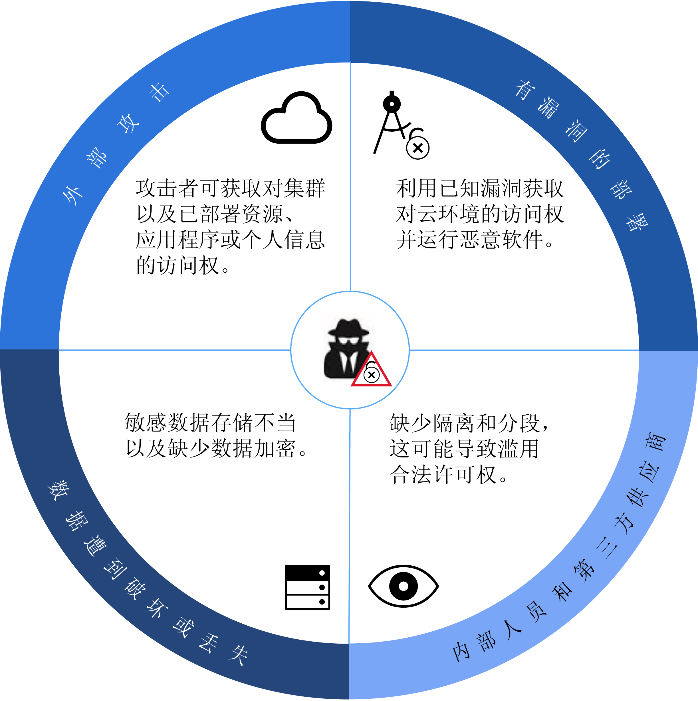
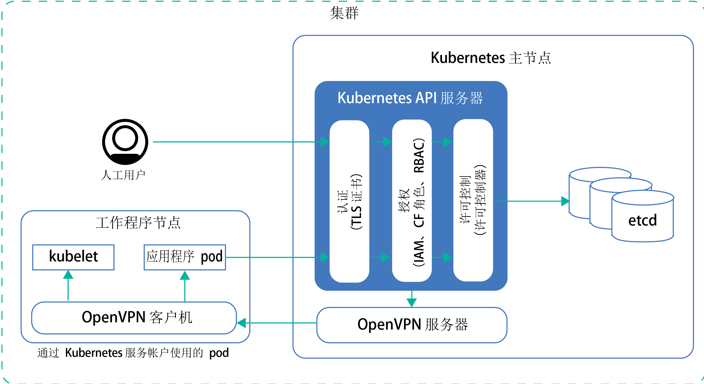
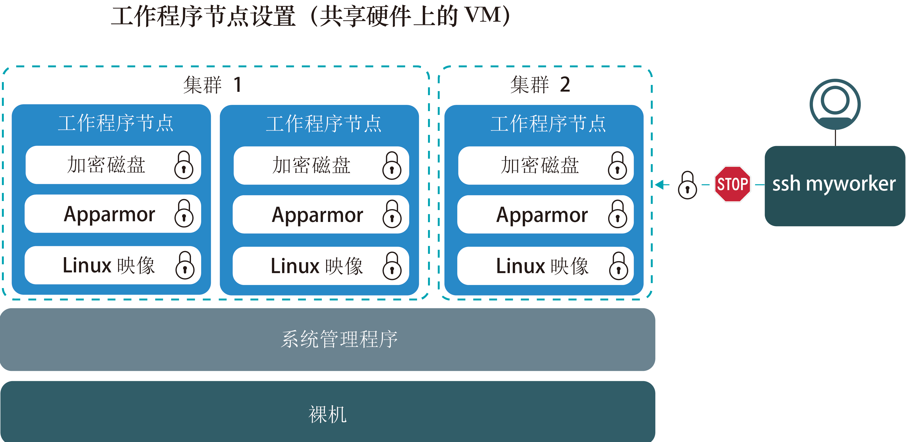
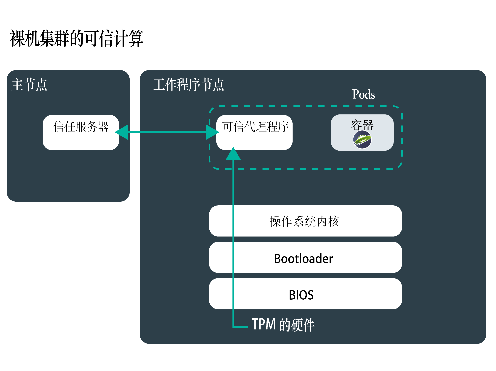
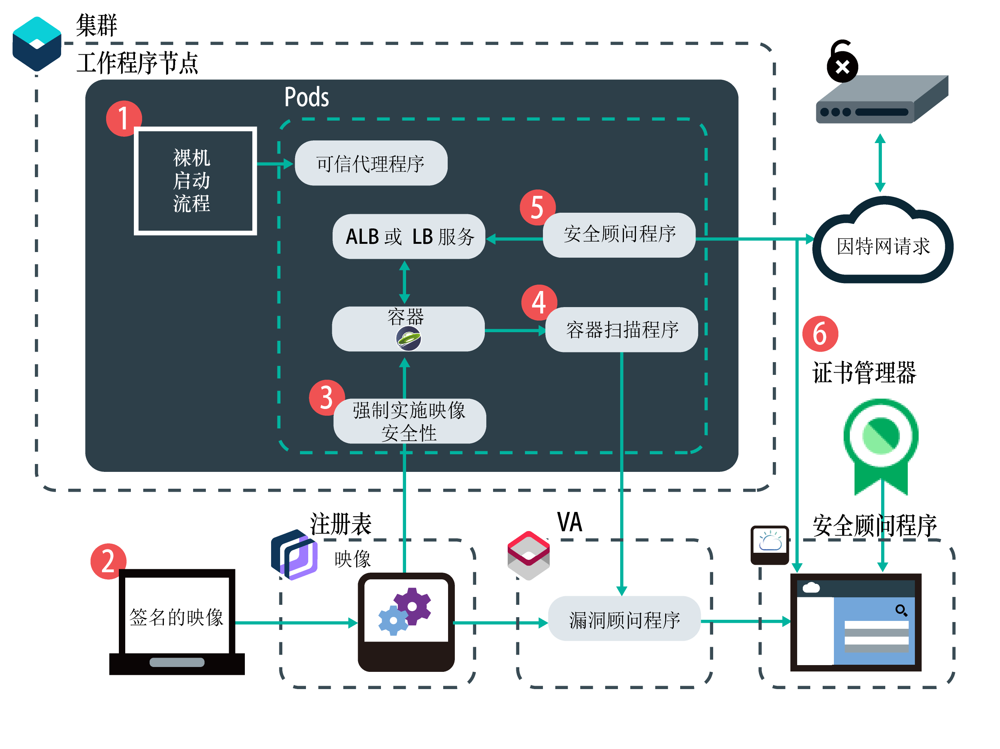
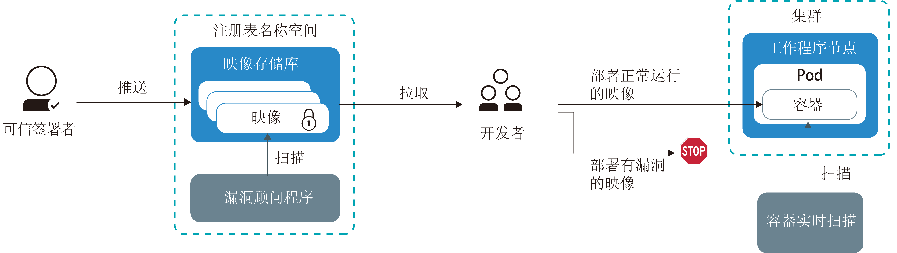
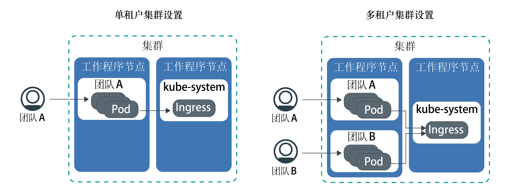

---

copyright:
  years: 2014, 2018
lastupdated: "2018-12-05"

---

{:new_window: target="_blank"}
{:shortdesc: .shortdesc}
{:screen: .screen}
{:pre: .pre}
{:table: .aria-labeledby="caption"}
{:codeblock: .codeblock}
{:tip: .tip}
{:note: .note}
{:important: .important}
{:deprecated: .deprecated}
{:download: .download}

# {{site.data.keyword.containerlong_notm}}的安全性
{: #security}

您可以使用 {{site.data.keyword.containerlong}} 中的内置安全功能来进行风险分析和安全保护。这些功能有助于保护 Kubernetes 集群基础架构和网络通信，隔离计算资源，以及确保基础架构组件和容器部署中的安全合规性。
{: shortdesc}

## 集群安全威胁概述
{: #threats}

要保护集群不被破坏，您必须了解集群的潜在安全威胁以及可以采取哪些措施来减少暴露于漏洞的风险。
{: shortdesc}

近几年来，随着公司不断将工作负载移至公共云中，云安全性以及防御对系统、基础架构和数据的攻击变得非常重要。集群由多个组件组成，每个组件都可能使环境面临遭受恶意攻击的风险。要保护集群免受这些安全威胁，您必须确保在所有集群组件中应用最新的 {{site.data.keyword.containerlong_notm}} 和 Kubernetes 安全功能与更新。

这些组件包括：
- [Kubernetes API 服务器和 etcd 数据存储](#apiserver)
- [工作程序节点](#workernodes)
- [网络](#network)
- [持久性存储器](#storage)
- [监视和日志记录](#monitoring_logging)
- [容器映像和注册表](#images_registry)
- [容器隔离和安全性](#container)
- [个人信息](#pi)

## Kubernetes API 服务器和 etcd
{: #apiserver}

Kubernetes API 服务器和 etcd 是 Kubernetes 主节点中运行的最易受攻击的组件。如果未经授权的用户或系统获得对 Kubernetes API 服务器的访问权，那么该用户或系统可以更改设置，操纵或控制集群，这会使集群面临遭受恶意攻击的风险。
{: shortdesc}

要保护 Kubernetes API 服务器和 etcd 数据存储，必须针对个人用户和 Kubernetes 服务帐户保护并限制对 Kubernetes API 服务器的访问权。

**对 Kubernetes API 服务器的访问权是如何授予的？** 
缺省情况下，在授予对 API 服务器的访问权之前，Kubernetes 需要每个请求都经历几个阶段：

<ol><li><strong>认证：</strong>验证注册用户或服务帐户的身份。</li><li><strong>授权：</strong>限制已认证的用户和服务帐户的许可权，以确保他们只能访问和操作您希望他们使用的集群组件。</li><li><strong>许可控制</strong>：在 Kubernetes API 服务器处理请求之前，对请求进行验证或更改。许多 Kubernetes 功能需要许可控制器才能正常运行。</li></ol>

**{{site.data.keyword.containerlong_notm}} 如何保护 Kubernetes API 服务器和 etcd 数据存储？** 
下图显示了用于处理认证、授权、许可控制以及 Kubernetes 主节点与工作程序节点之间安全连接的缺省集群安全设置。

<table>
<caption>Kubernetes API 服务器和 etcd 安全性</caption>
  <thead>
  <th>安全功能</th>
  <th>描述</th>
  </thead>
  <tbody>
    <tr>
      <td>全面管理的专用 Kubernetes 主节点</td>
      <td>
{{site.data.keyword.containerlong_notm}} 中的每个 Kubernetes 集群都由 IBM 拥有的 IBM Cloud Infrastructure(SoftLayer) 帐户中 IBM 管理的专用 Kubernetes 主节点进行控制。Kubernetes 主节点设置有以下专用组件，这些组件不与其他 IBM 客户共享。

        <ul><li><strong>etcd 数据存储：</strong>存储集群的所有 Kubernetes 资源，例如`服务`、`部署`和 `pod`。Kubernetes `ConfigMaps` 和 `Secrets` 是存储为键值对的应用程序数据，可由 pod 中运行的应用程序使用。在运行 Kubernetes V1.10 或更高版本的集群中，etcd 中的数据将存储在 Kubernetes 主节点的本地磁盘上，并备份到 {{site.data.keyword.cos_full_notm}}。数据在传输到 {{site.data.keyword.cos_full_notm}} 期间和处于静态时会进行加密。通过为集群[启用 {{site.data.keyword.keymanagementservicelong_notm}} 加密](cs_encrypt.html#encryption)，您可以选择对 Kubernetes 主节点的本地磁盘上的 etcd 数据启用加密。运行更低版本 Kubernetes 的集群的 etcd 数据会存储在由 IBM 管理并每天备份的加密磁盘上。将 etcd 数据发送到 pod 时，这些数据会通过 TLS 加密以确保数据保护和完整性。</li>
          <li><strong>kube-apiserver：</strong>充当从工作程序节点到 Kubernetes 主节点的所有集群管理请求的主入口点。kube-apiserver 会验证并处理请求，并可以对 etcd 数据存储器执行读写操作。</li>
          <li><strong>kube-scheduler：</strong>决定 pod 的部署位置，同时考虑容量和性能需求、软硬件策略约束、反亲缘关系规范和工作负载需求。如果找不到与这些需求相匹配的工作程序节点，那么不会在集群中部署 pod。</li>
          <li><strong>kube-controller-manager：</strong>负责监视副本集，并创建相应的 pod 以实现所需状态。</li>
          <li><strong>OpenVPN：</strong>特定于 {{site.data.keyword.containerlong_notm}} 的组件，用于为 Kubernetes 主节点到工作程序节点的所有通信提供安全的网络连接。Kubernetes 主节点到工作程序节点的通信由用户启动，并包含 <code>kubectl</code> 命令，例如 <code>logs</code>、<code>attach</code>、<code>exec</code> 和 <code>top</code>。</li></ul></td>
    </tr>
    <tr>
    <td>由 IBM 现场可靠性工程师 (SRE) 持续监视</td>
    <td>Kubernetes 主节点（包括所有主节点组件）、计算、联网和存储资源由 IBM 现场可靠性工程师 (SRE) 持续监视。SRE 将应用最新的安全标准，检测恶意活动并进行修复，以及设法确保 {{site.data.keyword.containerlong_notm}} 的可性和可用性。</td>
    </tr>
    <tr>
      <td>通过 TLS 保护通信</td>
      <td>要使用 {{site.data.keyword.containerlong_notm}}，您必须使用自己的凭证向服务进行认证。通过认证后，{{site.data.keyword.containerlong_notm}} 会生成 TLS 证书，用于加密 Kubernetes API 服务器与 etcd 数据存储之间的通信，以确保工作程序节点与 Kubernetes 主节点之间的端到端通信安全。这些证书从不会在集群之间或在 Kubernetes 主节点组件之间进行共享。</td>
    </tr>
    <tr>
      <td>工作程序节点的 OpenVPN 连接</td>
      <td>虽然 Kubernetes 会使用 <code>https</code> 协议来保护 Kubernetes 主节点与工作程序节点之间的通信，但缺省情况下不会在工作程序节点上提供任何认证。为了保护此通信，在创建集群时，{{site.data.keyword.containerlong_notm}} 会自动设置 Kubernetes 主节点与工作程序节点之间的 OpenVPN 连接。</td>
    </tr>
    <tr>
      <td>细颗粒度访问控制</td>
      <td>作为帐户管理员，您可以使用 {{site.data.keyword.Bluemix_notm}} Identity and Access Management (IAM) [向 {{site.data.keyword.containerlong_notm}} 其他用户授予访问权](cs_users.html#users)。{{site.data.keyword.Bluemix_notm}} IAM 提供了向 {{site.data.keyword.Bluemix_notm}} 平台、{{site.data.keyword.containerlong_notm}} 以及您帐户中的所有资源进行安全认证的功能。设置正确的用户角色和许可权是限制谁可以访问资源的关键，也是限制用户在滥用合法许可权时能够造成的破坏程度的关键。  可以从以下预定义的用户角色中进行选择，以确定用户可以执行的操作集：<ul><li><strong>平台角色：</strong>确定用户可以在 {{site.data.keyword.containerlong_notm}} 中执行的与集群和工作程序节点相关的操作。</li><li><strong>基础架构角色：</strong>确定订购、更新或除去基础架构资源（例如，工作程序节点、VLAN 或子网）的许可权。</li><li><strong>Kubernetes RBAC 角色：</strong>确定用户在有权访问集群时可以执行的 `kubectl` 命令。会自动为集群的缺省名称空间设置 RBAC 角色。要在其他名称空间中使用相同的 RBAC 角色，可以从缺省名称空间复制 RBAC 角色。</li></ul>   您可以不使用预定义的用户角色，而是选择[定制基础架构许可权](cs_users.html#infra_access)或[设置您自己的 RBAC 角色](cs_users.html#rbac)，以添加更细颗粒度的访问控制。</td>
    </tr>
    <tr>
      <td>许可控制器</td>
      <td>在 Kubernetes 和 {{site.data.keyword.containerlong_notm}} 中，实施了用于特定功能的许可控制器。通过许可控制器，可以在集群中设置策略，用于确定是否允许执行集群中的特定操作。在策略中，可以指定用户无法执行某个操作的条件，即使此操作是使用 RBAC 分配给该用户的一般许可权的一部分也不例外。因此，在 Kubernetes API 服务器处理 API 请求之前，许可控制器可以为集群提供额外的安全层。   创建集群时，{{site.data.keyword.containerlong_notm}} 会自动在 Kubernetes 主节点中安装以下 [Kubernetes 许可控制器 ](https://kubernetes.io/docs/admin/admission-controllers/)，用户无法更改这些许可控制器：<ul>
      <li>DefaultTolerationSeconds</li>
      <li>DefaultStorageClass</li>
      <li>GenericAdmissionWebhook (Kubernetes 1.8)</li>
      <li>Initializers</li>
      <li>LimitRanger</li>
      <li>MutatingAdmissionWebhook（Kubernetes 1.9 和更高版本）</li>
      <li>NamespaceLifecycle</li>
      <li>PersistentVolumeLabel</li>
      <li>[PodSecurityPolicy](cs_psp.html#ibm_psp)（Kubernetes 1.8.13、1.9.8 或 1.10.3 和更高版本）</li>
      <li>[优先级](cs_pod_priority.html#pod_priority)（Kubernetes 1.11.2 或更高版本）</li>
      <li>ResourceQuota</li>
      <li>ServiceAccount</li>
      <li>StorageObjectInUseProtection（Kubernetes 1.10 和更高版本）</li>
      <li>ValidatingAdmissionWebhook（Kubernetes 1.9 和更高版本）</li></ul> 
您可以[在集群中安装自己的许可控制器 ](https://kubernetes.io/docs/reference/access-authn-authz/extensible-admission-controllers/#admission-webhooks)，也可以从 {{site.data.keyword.containerlong_notm}} 提供的可选许可控制器中进行选择：<ul><li><strong>[容器映像安全性强制执行器](/docs/services/Registry/registry_security_enforce.html#security_enforce)：</strong>使用此许可控制器可在集群中强制执行漏洞顾问程序策略，以阻止有漏洞的映像进入部署。</li></ul> 
如果手动安装了许可控制器，但不想再使用这些控制器，请确保完全除去这些控制器。如果许可控制器未完全除去，可能会阻止您要在集群上执行的所有操作。
</td>
    </tr>
  </tbody>
</table>

## 工作程序节点
{: #workernodes}

工作程序节点具有组成应用程序的部署和服务。在公共云中托管工作负载时，您希望确保应用程序受到保护，不会被未经授权的用户或软件访问、更改或监视。
{: shortdesc}

**谁拥有工作程序节点？保护工作程序节点是我的责任吗？** 
工作程序节点的所有权取决于您创建的集群类型。免费集群中的工作程序节点将供应给 IBM 拥有的 IBM Cloud Infrastructure (SoftLayer) 帐户。可以将应用程序部署到工作程序节点，但无法在工作程序节点上更改设置或安装额外软件。由于免费集群的容量有限且 {{site.data.keyword.containerlong_notm}} 功能有限，因此不要在免费集群上运行生产工作负载。请考虑将标准集群用于生产工作负载。

标准集群中的工作程序节点将供应给与公共或专用 {{site.data.keyword.Bluemix_notm}} 帐户关联的 IBM Cloud Infrastructure (SoftLayer) 帐户。工作程序节点专用于您的帐户，您将负责请求及时更新工作程序节点，以确保工作程序节点操作系统和 {{site.data.keyword.containerlong_notm}} 组件应用最新的安全性更新和补丁。

定期（例如，每月）使用 `ibmcloud ks worker-update` [命令](cs_cli_reference.html#cs_worker_update)将更新和安全补丁部署到操作系统，并更新 Kubernetes 版本。更新可用时，您在 {{site.data.keyword.Bluemix_notm}} 控制台或 CLI 中查看有关主节点和工作程序节点的信息时（例如，使用 `ibmcloud ks clusters` 或 `ibmcloud ks workers <cluster_name>` 命令），会收到相应通知。
{: important}

**工作程序节点设置看起来是怎样的？** 
下图显示了为每个工作程序节点设置的组件，用于保护工作程序节点免受恶意攻击。

此图不包含用于确保与工作程序节点之间安全端到端通信的组件。有关更多信息，请参阅[网络安全性](#network)。
{: note}

<table>
<caption>工作程序节点安全设置</caption>
  <thead>
  <th>安全功能</th>
  <th>描述</th>
  </thead>
  <tbody>
    <tr><td>符合 CIS 的 Linux 映像</td><td>每个工作程序节点都安装有 Ubuntu 操作系统，该操作系统实施的是 Center for Internet Security (CIS) 发布的基准。用户或计算机所有者无法更改 Ubuntu 操作系统。要查看当前 Ubuntu 版本，请运行 <code>kubectl get nodes -o wide</code>。IBM 与内部和外部安全咨询团队合作，应对潜在的安全合规性漏洞。操作系统的安全性更新和补丁通过 {{site.data.keyword.containerlong_notm}} 提供，用户必须安装这些更新和补丁，才能使工作程序节点保持安全。
{{site.data.keyword.containerlong_notm}} 针对工作程序节点使用 Ubuntu Linux 内核。您可以基于 {{site.data.keyword.containerlong_notm}} 中的任何 Linux 分发版来运行容器。请向容器映像供应商验证是否支持在 Ubuntu Linux 内核上运行容器映像。
</td></tr>
    <tr>
    <td>由现场可靠性工程师 (SRE) 持续监视</td>
    <td>工作程序节点上安装的 Linux 映像由 IBM 现场可靠性工程师 (SRE) 持续监视，以检测漏洞和安全合规性问题。为了解决漏洞，SRE 会为工作程序节点创建安全补丁和修订包。确保在这些补丁可用时进行应用，以确保工作程序节点和基于这些节点运行的应用程序有一个安全的环境。</td>
    </tr>
    <tr>
  <td>计算隔离</td>
  <td>工作程序节点专用于一个集群，而不托管其他集群的工作负载。创建标准集群时，可以选择将工作程序节点作为[物理机器（裸机）或作为虚拟机](cs_clusters_planning.html#planning_worker_nodes)（在共享或专用物理硬件上运行）进行供应。免费集群中的工作程序节点会自动作为 IBM 拥有的 IBM Cloud Infrastructure (SoftLayer) 帐户中的虚拟共享节点进行供应。</td>
</tr>
<tr>
<td>用于部署裸机的选项</td>
<td>如果选择在裸机物理服务器（而不是虚拟服务器实例）上供应工作程序节点，您将对计算主机（例如，内存或 CPU）具有更多控制权。此设置无需虚拟机系统管理程序将物理资源分配给在主机上运行的虚拟机。相反，裸机机器的所有资源都仅供工作程序专用，因此您无需担心“吵闹的邻居”共享资源或降低性能。裸机服务器专供您使用，其所有资源可供集群使用。</td>
</tr>
<tr>
  <td id="trusted_compute">用于可信计算的选项</td>
    <td>在支持可信计算的裸机上部署集群时，可以[启用信任](cs_cli_reference.html#cs_cluster_feature_enable)。在集群中每个支持可信计算的裸机工作程序节点（包括未来添加到集群的节点）上，都会启用可信平台模块 (TPM) 芯片。因此，启用信任后，日后无法对集群禁用信任。信任服务器部署在主节点上，并且信任代理程序将作为 pod 部署在工作程序节点上。工作程序节点启动时，信任代理程序 pod 会监视该过程的每个阶段。
该硬件是信任的根源，使用 TPM 来发送度量。TPM 会生成加密密钥，用于保护整个过程中度量数据的传输。信任代理程序会将启动过程中每个组件的度量传递到信任服务器：从与 TPM 硬件交互的 BIOS 固件开始，一直到引导装入器和操作系统内核。然后，可信代理程序会将这些度量与可信服务器中的预期值进行比较，以证明启动是否有效。可信计算过程不会监视工作程序节点中的其他 pod，例如应用程序。

例如，如果未经授权的用户获得对系统的访问权，并使用额外逻辑来修改操作系统内核以收集数据，那么信任代理程序会检测到此更改并将该节点标记为不可信。通过可信计算，可以验证工作程序节点以防止篡改。

    
可信计算可用于精选的裸机机器类型。例如，`mgXc` GPU 类型模板不支持可信计算。

    

</td>
  </tr>
    <tr>
  <td id="encrypted_disk">加密磁盘</td>
    <td>缺省情况下，会为每个工作程序节点供应两个本地 SSD 加密数据分区。第一个分区包含用于引导工作程序节点并且未进行加密的内核映像。第二个分区保存容器文件系统并可使用 LUKS 加密密钥对其解锁。每个 Kubernetes 集群中的每个工作程序节点都有自己的唯一 LUKS 加密密钥，由 {{site.data.keyword.containerlong_notm}} 管理。当您创建集群或将工作程序节点添加到现有集群时，将安全地拉取密钥，然后在解锁加密磁盘后废弃。
加密可能会影响磁盘 I/O 性能。对于需要高性能磁盘 I/O 的工作负载，在启用和禁用加密的情况下测试集群以帮助您确定是否关闭加密。
</td>
      </tr>
    <tr>
      <td>专家 AppArmor 策略</td>
      <td>每个工作程序节点都设置有安全和访问策略，这些策略由在引导过程中装入到工作程序节点中的 [AppArmor ](https://wiki.ubuntu.com/AppArmor) 概要文件强制实施。用户或计算机所有者无法更改 AppArmor 概要文件。</td>
    </tr>
    <tr>
      <td>SSH 已禁用</td>
      <td>缺省情况下，工作程序节点上禁用了 SSH 访问，以保护集群免受恶意攻击。禁用了 SSH 访问时，对集群的访问将通过 Kubernetes API 服务器来强制执行。Kubernetes API 服务器需要根据在认证、授权和许可控制模块中设置的策略检查每个请求后，才在集群中执行该请求。    如果您有标准集群并且要在工作程序节点上安装更多功能，那么可以针对要在每个工作程序节点上运行的所有对象，选择使用 {{site.data.keyword.containerlong_notm}} 提供的附加组件，或者使用 [Kubernetes 守护程序集 ](https://kubernetes.io/docs/concepts/workloads/controllers/daemonset/)。对于您必须执行的任何一次性操作，请使用 [Kubernetes 作业 ](https://kubernetes.io/docs/concepts/workloads/controllers/jobs-run-to-completion/)。</td>
    </tr>
  </tbody>
  </table>

## 网络
{: #network}
保护公司网络的典型方法是设置防火墙，并阻止任何不需要的网络流量流至应用程序。虽然这种做法仍然很有用，但研究表明，许多恶意攻击来自内部人员或滥用所分配许可权的授权用户。
{: shortdesc}

要保护网络并限制在授予网络访问权后用户可能造成的损害范围，您必须确保尽可能隔离工作负载，并且限制公共公开的应用程序和工作程序节点的数量。

**缺省情况下，集群允许哪些网络流量？** 
所有容器都通过集群创建期间在每个工作程序节点上配置的[预定义 Calico 网络策略设置](cs_network_policy.html#default_policy)进行保护。缺省情况下，所有工作程序节点都允许所有出站网络流量。入站网络流量会被阻止，但有几个端口例外；打开这些端口是为了供 IBM 监视网络流量，以及供 IBM 自动为 Kubernetes 主节点安装安全性更新。从 Kubernetes 主节点到工作程序节点的 kubelet 的访问通过 OpenVPN 隧道进行保护。有关更多信息，请参阅 [{{site.data.keyword.containerlong_notm}} 体系结构](cs_tech.html)。

如果要允许来自因特网的入局网络流量，必须使用 [NodePort 服务、LoadBalancer 服务或 Ingress 应用程序负载均衡器](cs_network_planning.html#planning)来公开应用程序。  

**什么是网络分段？如何为集群设置网络分段？** 
网络分段描述了用于将网络划分为多个子网的方法。您可以对要由组织中特定组访问的应用程序和相关数据分组。在一个子网中运行的应用程序无法查看或访问另一个子网中的应用程序。网络分段还会限制提供给内部人员或第三方软件的访问权，并且可以限制恶意活动的范围。   

{{site.data.keyword.containerlong_notm}} 提供了 IBM Cloud Infrastructure (SoftLayer) VLAN，用于确保工作程序节点的高质量网络性能和网络隔离。VLAN 会将一组工作程序节点和 pod 视为连接到同一物理连线那样进行配置。
VLAN 专用于您的 {{site.data.keyword.Bluemix_notm}} 帐户，而不是在 IBM 客户之间共享。如果有多个 VLAN 用于一个集群、在同一 VLAN 上有多个子网或者有一个多专区集群，那么必须针对 IBM Cloud Infrastructure (SoftLayer) 帐户启用 [VLAN 生成](/docs/infrastructure/vlans/vlan-spanning.html#vlan-spanning)，从而使工作程序节点可以在专用网络上相互通信。要执行此操作，您需要**网络 > 管理网络 VLAN 生成**[基础架构许可权](cs_users.html#infra_access)，或者可以请求帐户所有者启用 VLAN 生成。要检查是否已启用 VLAN 生成，请使用 `ibmcloud ks vlan-spanning-get` [命令](/docs/containers/cs_cli_reference.html#cs_vlan_spanning_get)。如果使用 {{site.data.keyword.BluDirectLink}}，那么必须改为使用[虚拟路由器功能 (VRF)](/docs/infrastructure/direct-link/subnet-configuration.html#more-about-using-vrf)。要启用 VRF，请联系 IBM Cloud Infrastructure (SoftLayer) 帐户代表。

VLAN 生成是一个 {{site.data.keyword.Bluemix_notm}} 帐户设置，可以启用或禁用。启用时，帐户中的所有集群都可以彼此看到并对话。要检查是否已启用 VLAN 生成，请使用 `ibmcloud ks vlan-spanning-get` [命令](cs_cli_reference.html#cs_vlan_spanning_get)。虽然对于某些场景这可能很有用，但 VLAN 生成过程会除去集群的网络分段。

查看下表，以了解有关启用了 VLAN 生成时如何实现网络分段的选项。

|安全功能|描述|
|-------|----------------------------------|
|使用 Calico 设置定制网络策略|可以使用内置 Calico 接口为工作程序节点[设置定制 Calico 网络策略](cs_network_policy.html#network_policies)。例如，可以针对特定 pod 或服务，允许或阻止特定网络接口上的网络流量。要设置定制网络策略，必须[安装 <code>calicoctl</code> CLI](cs_network_policy.html#cli_install)。|
|对 IBM Cloud Infrastructure (SoftLayer) 网络防火墙的支持|{{site.data.keyword.containerlong_notm}} 与所有 [IBM Cloud Infrastructure (SoftLayer) 防火墙产品 ](https://www.ibm.com/cloud-computing/bluemix/network-security) 相兼容。在 {{site.data.keyword.Bluemix_notm}} Public 上，可以使用定制网络策略来设置防火墙，以便为标准集群提供专用网络安全性，检测网络侵入并进行补救。例如，您可以选择设置[虚拟路由器设备](/docs/infrastructure/virtual-router-appliance/about.html)以充当防火墙并阻止不需要的流量。设置防火墙时，[还必须为每个区域打开必需的端口和 IP 地址](cs_firewall.html#firewall)，以便主节点和工作程序节点可以通信。|
{: caption="网络分段选项" caption-side="top"}

**我还能做什么来减少外部攻击的范围？** 
公共公开的应用程序或工作程序节点越多，为阻止外部恶意攻击而必须执行的步骤就越多。请查看下表，以查找有关如何使应用程序和工作程序节点保持专用的选项。

|安全功能|描述|
|-------|----------------------------------|
|限制公开的应用程序数|缺省情况下，在集群中运行的应用程序和服务无法通过公用因特网访问。您可以选择是要向公众公开应用程序，还是希望应用程序和服务仅可在专用网络上访问。使服务和应用程序保持专用时，可以利用内置安全功能来确保工作程序节点与 pod 之间的安全通信。要将服务和应用程序公开到公用因特网，可以利用 [Ingress 和负载均衡器支持](cs_network_planning.html#planning)来安全地使服务公共可用。确保仅公开必要的服务，并定期重新访问已公开应用程序的列表，以确保这些应用程序仍然有效。|
|使工作程序节点保持专用|创建集群时，每个集群会自动连接到一个专用 VLAN。专用 VLAN 用于确定分配给工作程序节点的专用 IP 地址。可以选择通过将工作程序节点仅连接到专用 VLAN 来使其保持专用。免费集群中的专用 VLAN 由 IBM 管理，标准集群中的专用 VLAN 由您在 IBM Cloud Infrastructure (SoftLayer) 帐户中管理。  <strong>注意：</strong>请记住，为了与 Kubernetes 主节点进行通信，以及使 {{site.data.keyword.containerlong_notm}} 正常运行，您必须配置与[特定 URL 和 IP 地址](cs_firewall.html#firewall_outbound)的公共连接。要设置此公共连接，可以在工作程序节点前配置防火墙（例如，[虚拟路由器设备](/docs/infrastructure/virtual-router-appliance/about.html)），并允许网络流量流至这些 URL 和 IP 地址。|
|使用边缘节点限制公用因特网连接|缺省情况下，每个工作程序节点都会配置为接受应用程序 pod 及关联的负载均衡器或 Ingress pod。您可以将工作程序节点标记为[边缘节点](cs_edge.html#edge)，以强制将负载均衡器和 Ingress pod 仅部署到这些工作程序节点。此外，还可以[污染工作程序节点](cs_edge.html#edge_workloads)，使应用程序 pod 无法安排到边缘节点。利用边缘节点，可以将网络工作负载隔离在集群中更少的工作程序节点上，并使集群中的其他工作程序节点保持专用。|
{: caption="专用服务和工作程序节点选项" caption-side="top"}

**如果要将集群连接到内部部署的数据中心该怎么做？** 
要将工作程序节点和应用程序连接到内部部署的数据中心，您可以[使用 strongSwan 服务、虚拟路由器设备或 FortiGate Security Appliance 来配置 VPN IPSec 端点](cs_vpn.html#vpn)。

### LoadBalancer 和 Ingress 服务
{: #network_lb_ingress}

可以使用 LoadBalancer 和 Ingress 联网服务将应用程序连接到公用因特网或外部专用网络。请查看负载均衡器和 Ingress ALB 的以下可选设置，您可以使用这些设置来满足后端应用程序安全需求，或者可以对流过集群的流量进行加密。

**可以使用安全组来管理集群的网络流量吗？** 
要使用 Ingress 和 LoadBalancer 服务，请使用 [Calico 和 Kubernetes 策略](cs_network_policy.html)来管理流入和流出集群的网络流量。不要使用 IBM Cloud Infrastructure (SoftLayer) [安全组](/docs/infrastructure/security-groups/sg_overview.html#about-security-groups)。IBM Cloud Infrastructure (SoftLayer) 安全组会应用于单个虚拟服务器的网络接口，以过滤系统管理程序级别的流量。但是，安全组不支持 VRRP 协议，{{site.data.keyword.containerlong_notm}} 使用该协议来管理 LoadBalancer IP 地址。如果没有 VRRP 协议来管理 LoadBalancer IP，那么 Ingress 和 LoadBalancer 服务无法正常工作。如果未使用 Ingress 或 LoadBalancer 服务，并且希望将工作程序节点与公众完全隔离，那么可以使用安全组。

**如何保护集群中的源 IP？** 
缺省情况下，不会保留客户机请求的源 IP 地址。对应用程序的客户机请求发送到集群时，该请求会路由到用于公开 ALB 的 LoadBalancer 服务的 pod。如果在 LoadBalancer 服务 pod 所在的工作程序节点上不存在应用程序 pod，那么负载均衡器会将该请求转发到其他工作程序节点上的应用程序 pod。软件包的源 IP 地址将更改为运行应用程序 pod 的工作程序节点的公共 IP 地址。

例如，在应用程序服务器必须应用安全性和访问控制策略的情况下，保留客户机的 IP 非常有用。要保留客户机请求的原始源 IP 地址，可以为 [LoadBalancer](cs_loadbalancer.html#node_affinity_tolerations) 或 [Ingress ALB](cs_ingress.html#preserve_source_ip) 启用源 IP 保留。

**如何使用 TLS 加密流量？** 
Ingress 服务在流量流中的两个点提供 TLS 终止：
* [到达时解密包](cs_ingress.html#public_inside_2)：缺省情况下，Ingress ALB 会对流至集群中应用程序的 HTTP 网络流量进行负载均衡。要同时对入局 HTTPS 连接进行负载均衡，可以配置 ALB 来解密网络流量，然后将已解密的请求转发到集群中公开的应用程序。如果使用的是 IBM 提供的 Ingress 子域，那么可以使用 IBM 提供的 TLS 证书。如果使用的是定制域，那么可以使用您自己的 TLS 证书来管理 TLS 终止。
* [在将包转发到上游应用程序之前重新加密包](cs_annotations.html#ssl-services)：ALB 在将流量转发到应用程序之前解密 HTTPS 请求。如果您具有需要 HTTPS 的应用程序，并且在将流量转发到这些上游应用程序之前需要对流量进行加密，那么可以使用 `ssl-services` 注释。如果上游应用程序可以处理 TLS，那么可以选择提供单向或双向认证 TLS 私钥中包含的证书。

要保护服务到服务的通信，可以使用 [Istio 的双向 TLS 认证 ](https://istio.io/docs/concepts/security/mutual-tls/)。Istio 是一种开放式源代码服务，开发者可用于连接、保护、管理和监视云编排平台（如 Kubernetes）上的微服务网络（也称为服务网）。

## 持久性存储器
{: #storage}

供应持久性存储器以在集群中存储数据时，如果数据存储在文件共享或块存储器中，那么数据会自动加密，无需额外成本。加密包括快照和复制的存储器。
{: shortdesc}

有关如何加密特定存储类型的数据的更多信息，请参阅以下链接。
- [NFS 文件存储器](/docs/infrastructure/FileStorage/block-file-storage-encryption-rest.html#securing-your-data-provider-managed-encryption-at-rest)
- [块存储器](/docs/infrastructure/BlockStorage/block-file-storage-encryption-rest.html#securing-your-data-provider-managed-encryption-at-rest)  

您还可以使用 {{site.data.keyword.Bluemix_notm}} 数据库服务（如 [{{site.data.keyword.cloudant}} NoSQL DB](/docs/services/Cloudant/getting-started.html#getting-started-with-cloudant)）在集群外部的受管数据库中持久存储数据。通过云数据库服务存储的数据可以跨集群、专区和区域进行访问。有关 IBM Cloudant NoSQL DB 的安全相关信息，请参阅[服务文档](/docs/services/Cloudant/offerings/security.html#security)。

## 监视和日志记录
{: #monitoring_logging}

检测集群中恶意攻击的关键是正确监视和记录集群中发生的所有事件。监视和日志记录还可帮助您了解应用程序的集群容量和资源可用性，以便您可以相应地进行规划，避免应用程序产生停机时间。
{: shortdesc}

**IBM 会监视集群吗？** 
每个 Kubernetes 主节点都由 IBM 持续监视，以控制进程级别的拒绝服务 (DOS) 攻击，并采取相应的补救措施。{{site.data.keyword.containerlong_notm}} 会自动扫描部署了 Kubernetes 主节点的每个节点，以确定是否有在 Kubernetes 中找到的漏洞，以及特定于操作系统的安全修订。如果找到了漏洞，{{site.data.keyword.containerlong_notm}} 会自动代表用户应用修订并解决漏洞，以确保保护主节点。  

**会记录哪些信息？** 
对于标准集群，可以为从不同源到 {{site.data.keyword.loganalysislong_notm}} 或到其他外部服务器的所有集群相关事件[设置日志转发](/docs/containers/cs_health.html#logging)，以便可以过滤和分析日志。这些源包括来自以下对象的日志：

- **容器**：写入 STDOUT 或 STDERR 的日志。
- **应用程序**：写入应用程序中特定路径的日志。
- **工作程序**：Ubuntu 操作系统中发送到 /var/log/syslog 和 /var/log/auth.log 的日志。
- **Kubernetes API 服务器**：出于审计原因，将记录发送到 Kubernetes API 服务器的每个集群相关操作，包括时间、用户和受影响的资源。有关更多信息，请参阅 [Kubernetes 审计日志 ](https://kubernetes.io/docs/tasks/debug-application-cluster/audit/)。
- **Kubernetes 系统组件**：`kubelet`、`kube-proxy` 和在 `kube-system` 名称空间中运行的其他组件的日志。
- **Ingress**：用于管理进入集群的网络流量的 Ingress 应用程序负载均衡器的日志。

可以选择要记录集群的哪些事件以及要将日志转发到何处。要检测恶意活动并验证集群的运行状况，必须持续分析日志。

**如何监视集群的运行状况和性能？** 
可以通过监视集群组件和计算资源（例如，CPU 和内存使用情况）来验证集群的容量和性能。{{site.data.keyword.containerlong_notm}} 会自动将标准集群的度量值发送到 {{site.data.keyword.monitoringlong}}，以便您可以[在 Grafana 中查看和分析度量值](cs_health.html#view_metrics)。

还可以使用内置工具（如 {{site.data.keyword.containerlong_notm}} 详细信息页面、Kubernetes 仪表板），或者[设置第三方集成](cs_integrations.html#health_services)（如 Prometheus、Weave Scope 等）。

**如何审计集群中发生的事件？** 
可以[在 {{site.data.keyword.containerlong_notm}} 集群中设置 {{site.data.keyword.cloudaccesstraillong}}](cs_at_events.html#at_events)。有关更多信息，请查看 [{{site.data.keyword.cloudaccesstrailshort}} 文档](/docs/services/cloud-activity-tracker/activity_tracker_ov.html#activity_tracker_ov)。

**在集群中启用信任的选项是什么？** 
缺省情况下，{{site.data.keyword.containerlong_notm}} 提供了许多集群组件功能，以便您可以在高度安全的环境中部署容器化应用程序。扩展集群中的信任级别，以更好地确保集群中发生的情况符合您的意图。可以通过各种方式在集群中实现信任，如下图中所示。

1.  **具有可信计算的 {{site.data.keyword.containerlong_notm}}**：在裸机工作程序节点上，可以启用信任。信任代理程序会监视硬件启动过程并报告任何更改，以便您可以验证裸机工作程序节点是否被篡改。通过可信计算，可以在经过验证的裸机主机上部署容器，以便工作负载在可信硬件上运行。请注意，某些裸机机器（例如 GPU）不支持可信计算。[了解有关可信计算如何工作的更多信息](#trusted_compute)。

2.  **映像的内容信任**：通过在 {{site.data.keyword.registryshort_notm}} 中启用内容信任来确保映像的完整性。通过可信内容，可以控制谁可以将映像签名为可信。在可信签署者将映像推送到注册表之后，用户可以拉取已签名的内容，以便可以验证映像的源。有关更多信息，请参阅[对可信内容的映像签名](/docs/services/Registry/registry_trusted_content.html#registry_trustedcontent)。

3.  **Container Image Security Enforcement (beta)**：使用定制策略创建许可控制器，以便可以在部署容器映像之前验证这些映像。通过 Container Image Security Enforcement，可以控制从何处部署映像，并确保这些映像满足[漏洞顾问程序](/docs/services/va/va_index.html)策略或[内容信任](/docs/services/Registry/registry_trusted_content.html#registry_trustedcontent)需求。如果部署不满足设置的策略，那么强制实施的安全性会阻止对集群进行修改。有关更多信息，请参阅[强制实施容器映像安全性 (beta)](/docs/services/Registry/registry_security_enforce.html#security_enforce)。

4.  **容器漏洞扫描程序**：缺省情况下，漏洞顾问程序会扫描存储在 {{site.data.keyword.registryshort_notm}} 中的映像。要检查在集群中运行的实时容器的阶段状态，可以安装容器扫描程序。有关更多信息，请参阅[安装容器扫描程序](/docs/services/va/va_index.html#va_install_container_scanner)。

5.  **使用安全顾问程序进行网络分析（预览）**：通过 {{site.data.keyword.Bluemix_notm}} 安全顾问程序，可以从漏洞顾问程序和 {{site.data.keyword.cloudcerts_short}} 之类的 {{site.data.keyword.Bluemix_notm}} 服务集中安全性洞察。在集群中启用安全顾问程序后，可以查看有关可疑入局和出局网络流量的报告。有关更多信息，请参阅[网络分析](/docs/services/security-advisor/network-analytics.html#network-analytics)。要进行安装，请参阅[设置对 Kubernetes 集群的可疑客户机和服务器 IP 地址的监视](/docs/services/security-advisor/setup_cluster.html)。

6.  **{{site.data.keyword.cloudcerts_long_notm}} (beta)**：如果您在美国南部具有集群，并且希望[使用定制域（带 TLS）公开应用程序](cs_ingress.html#ingress_expose_public)，那么可以将 TLS 证书存储在 {{site.data.keyword.cloudcerts_short}} 中。安全顾问程序仪表板中还会报告到期或即将到期的证书。有关更多信息，请参阅 [{{site.data.keyword.cloudcerts_short}} 入门](/docs/services/certificate-manager/index.html#gettingstarted)。

## 映像和注册表
{: #images_registry}

每个部署都基于一个映像，映像用于保存有关如何启动运行应用程序的容器的指示信息。这些指示信息包括容器内的操作系统以及要安装的额外软件。要保护应用程序，必须保护映像并建立确保映像完整性的检查。
{: shortdesc}

**应该使用公共注册表还是专用注册表来存储映像？** 
开始使用 Docker 映像和 Kubernetes 在集群中创建第一个容器化应用程序时，可以使用公共注册表（如 Docker Hub）。但是，对于企业应用程序，请避免使用您不了解或不信任的注册表，以保护集群免受恶意映像的损害。将映像保留在专用注册表中，如 {{site.data.keyword.registryshort_notm}} 中提供的映像，并确保控制对注册表的访问权以及可以推送的映像内容。

**为什么检查映像是否有漏洞非常重要？** 
研究显示，大多数恶意攻击利用的是已知软件漏洞和薄弱的系统配置。基于映像部署容器时，容器将使用在映像中描述的操作系统和额外的二进制文件启动。就像保护虚拟机或物理机器一样，您必须消除在容器内使用的操作系统和二进制文件中的已知漏洞，以保护应用程序不被未经授权的用户访问。 

要保护应用程序，请考虑在您的团队中建立过程，以解决以下方面的问题:

1. **在映像部署到生产之前扫描映像：** 
确保在基于每个映像部署容器之前扫描该映像。如果发现漏洞，请考虑消除漏洞或阻止部署这些映像。建立一个过程，其中必须核准映像的内容，并且只能部署通过漏洞检查的映像。

2. **定期扫描运行中的容器：** 
即使基于通过漏洞检查的映像部署了容器，容器中运行的操作系统或二进制文件也可能会随时间推移而变得有漏洞。要保护应用程序，必须确保定期扫描运行中的容器，以便可以检测到漏洞并进行补救。根据应用程序的不同，要添加额外的安全性，可以建立用于在检测到有漏洞的容器后对其进行处理的过程。

**{{site.data.keyword.registryshort_notm}} 如何帮助保护映像和部署过程？**  

<table>
<caption>映像和部署的安全性</caption>
  <thead>
    <th>安全功能</th>
    <th>描述</th>
  </thead>
  <tbody>
    <tr>
      <td>{{site.data.keyword.registryshort_notm}} 中的安全 Docker 专用映像存储库</td>
      <td>可以在 IBM 托管和管理的具备高可用性和高可扩展性的多租户专用映像注册表中设置您自己的 Docker [映像存储库](/docs/services/Registry/index.html#index)。通过使用注册表，可以构建和安全地存储 Docker 映像，并在集群用户之间共享这些映像。
    使用容器映像时，请了解有关[确保个人信息安全](cs_secure.html#pi)的更多信息。</td>
    </tr>
    <tr>
      <td>仅推送具有可信内容的映像</td>
      <td>通过在映像存储库中启用[内容信任](/docs/services/Registry/registry_trusted_content.html#registry_trustedcontent)，确保映像完整性。通过可信内容，可以控制谁可以将映像签名为可信，并将映像推送到特定注册表名称空间。在可信签署者将映像推送到注册表名称空间之后，用户可以拉取已签名的内容，以便可以验证映像的发布者和完整性。</td>
    </tr>
    <tr>
      <td>自动漏洞扫描</td>
      <td>使用 {{site.data.keyword.registryshort_notm}} 时，可以利用[漏洞顾问程序](/docs/services/va/va_index.html#va_registry_cli)提供的内置安全性扫描。对于推送到注册表名称空间的每个映像，都会自动根据包含已知 CentOS、Debian、Red Hat 和 Ubuntu 问题的数据库进行扫描以确定是否有漏洞。如果发现了漏洞，漏洞顾问程序会提供指示信息指导如何解决这些漏洞，以确保映像完整性和安全性。</td>
    </tr>
    <tr>
      <td>阻止基于有漏洞映像进行的部署或由不可信用户进行的部署</td>
      <td>使用定制策略创建许可控制器，以便可以在部署容器映像之前验证这些映像。通过 [Container Image Security Enforcement](/docs/services/Registry/registry_security_enforce.html#security_enforce)，可以控制从何处部署映像，并确保这些映像满足漏洞顾问程序策略或内容信任需求。如果部署不满足设置的策略，那么许可控制器会阻止在集群中进行部署。</td>
    </tr>
    <tr>
      <td>实时扫描容器</td>
      <td>为了检测运行中容器中的漏洞，可以安装 [ibmcloud-container-scanner](/docs/services/va/va_index.html#va_install_container_scanner)。与映像类似，您也可以设置容器扫描程序来监视所有集群名称空间的容器中是否存在漏洞。发现漏洞时，更新源映像并重新部署容器。</td>
    </tr>
  </tbody>
  </table>

## 容器隔离和安全性
{: #container}

**什么是 Kubernetes 名称空间？为什么要使用 Kubernetes 名称空间？** 
Kubernetes 名称空间是一种对集群进行虚拟分区，并为部署和要将其工作负载移至集群的用户组提供隔离的方法。通过名称空间，可以跨工作程序节点以及跨多专区集群中的专区组织资源。  

每个集群都设置有以下名称空间：
- **default：**未定义特定名称空间时所有内容都会部署到其中的名称空间。将“查看者”、“编辑者”或“操作员”平台角色分配给用户时，用户可以访问 default 名称空间，但不能访问 `kube-system`、`ibm-system` 或 `ibm-cloud-cert` 名称空间。
- **kube-system 和 ibm-system：**此名称空间用于保存 Kubernetes 和 {{site.data.keyword.containerlong_notm}} 管理集群所需的部署和服务。集群管理员可以使用此名称空间来使 Kubernetes 资源在各个名称空间中可用。
- **ibm-cloud-cert：**此名称空间用于与 {{site.data.keyword.cloudcerts_long_notm}} 相关的资源。
- **kube-public：**所有用户都可以访问此名称空间，即使这些用户未向集群进行认证。请谨慎将资源部署到此名称空间，因为可能会使集群面临遭到破坏的风险。

集群管理员可以在集群中设置其他名称空间，并根据自己的需求对这些名称空间进行定制。

对于集群中包含的每个名称空间，请确保设置正确的 [RBAC 策略](cs_users.html#rbac)，以限制对此名称空间的访问权，控制部署的内容以及设置正确的[资源配额 ](https://kubernetes.io/docs/concepts/policy/resource-quotas/) 和[限制范围 ](https://kubernetes.io/docs/tasks/administer-cluster/memory-default-namespace/)。
{: important}

**应该设置单租户还是多租户集群？** 
在单租户集群中，将为必须在集群中运行工作负载的每组人员创建一个集群。通常，此团队负责管理集群并正确配置和保护集群。多租户集群使用多个名称空间来隔离租户及其工作负载。

单租户集群和多租户集群为工作负载提供的隔离级别相同，成本也相差无几。哪个选项适合您取决于必须在集群中运行工作负载的团队数量、其服务需求和服务大小。

如果您有很多具有复杂服务的团队，并且每个团队都必须控制集群的生命周期，那么单租户集群可能是适合您的选项。这包括有权决定何时更新集群，或者可以将哪些资源部署到集群。请记住，管理集群需要深厚的 Kubernetes 和基础架构知识，才能确保部署的集群容量和安全性。  

多租户集群的优点是可以在不同名称空间中使用相同的服务名称，如果计划使用名称空间来分隔生产、编译打包和开发环境，那么多租户集群可能会很有用。虽然多租户集群通常需要较少的人员来管理集群，但往往会在以下方面增加更多复杂性：

- **访问权：**设置多个名称空间时，必须为每个名称空间配置正确的 RBAC 策略，以确保资源隔离。RBAC 策略较为复杂，需要掌握深厚的 Kubernetes 知识。
- **计算资源限制：**要确保每个团队都有必需的资源来部署服务并在集群中运行应用程序，必须为每个名称空间设置[资源配额](https://kubernetes.io/docs/concepts/policy/resource-quotas/)。资源配额确定了名称空间的部署约束，例如可以部署的 Kubernetes 资源数以及这些资源可使用的 CPU 数和内存量。设置配额后，用户必须在其部署中包含资源请求和限制。
- **共享集群资源：**如果在一个集群中运行多个租户，那么会在租户之间共享一些集群资源，例如 Ingress 应用程序负载均衡器或可用的可移植 IP 地址。如果较小的服务必须与集群中的大型服务竞争资源，那么较小的服务要使用共享资源可能很难。
- **更新：**一次只能运行一个 Kubernetes API 版本。集群中运行的所有应用程序都必须采用当前 Kubernetes API 版本，与拥有应用程序的团队无关。要更新集群时，必须确保所有团队都准备好切换到新的 Kubernetes API 版本，并且应用程序已更新为使用新的 Kubernetes API 版本。这还意味着各个团队对要运行的 Kubernetes API 版本的控制力较小。
- **集群设置中的更改：**如果要更改集群设置或将工作负载重新安排到新工作程序节点上，必须对各租户应用此更改。相比单租户集群，这种应用需要更多的协调和测试。
- **通信过程：**管理多个租户时，请考虑设置通信过程，以便租户知道集群中存在问题时或者需要为其服务提供更多资源时应求助于何处。此通信过程还包括向租户通知集群设置或计划更新中的所有更改。

**我还能做什么来保护容器？**

|安全功能|描述|
|-------|----------------------------------|
|限制特权容器数|容器在与其他进程隔离的计算主机上作为单独的 Linux 进程运行。虽然用户在容器内具有 root 用户访问权，但在容器外部此用户的许可权受限，以保护其他 Linux 进程、主机文件系统和主机设备。某些应用程序需要对主机文件系统的访问权，或者需要高级许可权才能正常运行。您可以通过特权方式运行容器，以允许容器与计算主机上运行的进程具有相同的访问权。
请记住，特权容器在遭到破坏时，可能会对集群和底层计算主机造成巨大损害。请尝试限制以特权方式运行的容器数，并考虑更改应用程序的配置，以便应用程序可以在没有高级许可权的情况下运行。如果要阻止特权容器在集群中运行，请考虑设置定制 [pod 安全策略](cs_psp.html#customize_psp)。
|
|设置容器的 CPU 和内存限制|每个容器都需要特定的 CPU 数和内存量才能正确启动并继续运行。可以为容器定义 [Kubernetes 资源请求和资源限制 ](https://kubernetes.io/docs/concepts/configuration/manage-compute-resources-container/)，以限制容器可使用的 CPU 数和内存量。如果未设置 CPU 和内存的限制，并且容器处于繁忙状态，那么容器将使用所有可用的资源。这种资源高消耗情况可能会影响工作程序节点上的其他容器，导致它们没有足够资源来正确启动或运行，并使工作程序节点面临遭到拒绝服务攻击的风险。|
|将操作系统安全设置应用于 pod|可以将 [<code>securityContext</code> 部分 ](https://kubernetes.io/docs/tasks/configure-pod-container/security-context/) 添加到 pod 部署，以将特定于 Linux 的安全设置用于 pod 或 pod 内的特定容器。安全设置包含对在容器内部运行脚本（例如，入口点脚本）的用户标识和组标识的控制，或对拥有卷安装路径的用户标识和组 IP 的控制。  <strong>提示：</strong>如果要使用 <code>securityContext</code> 来设置 <code>runAsUser</code> 用户标识或 <code>fsGroup</code> 组标识，请考虑在[创建持久性存储器](cs_storage_block.html#add_block)时使用块存储器。NFS 存储器不支持 <code>fsGroup</code>，并且 <code>runAsUser</code> 必须在容器级别（而不是 pod 级别）进行设置。|
{: caption="其他安全保护措施" caption-side="top"}

## 存储个人信息
{: #pi}

您负责确保 Kubernetes 资源和容器映像中个人信息的安全性。个人信息包括您的姓名、地址、电话号码或电子邮件地址，或者包括可能识别、联系或查找到您、您的客户或其他任何人的其他信息。
{: shortdesc}

<dl>
  <dt>使用 Kubernetes 私钥存储个人信息</dt>
  <dd>仅将个人信息存储在设计为保存个人信息的 Kubernetes 资源中。例如，不要在 Kubernetes 名称空间、部署、服务或配置映射的名称中使用您的姓名。为了实现妥善保护和加密，请改为在 <a href="cs_encrypt.html#secrets">Kubernetes 私钥</a>中存储个人信息。</dd>

  <dt>使用 Kubernetes `imagePullSecret` 存储映像注册表凭证</dt>
  <dd>请勿在容器映像或注册表名称空间中存储个人信息。为了实现妥善保护和加密，请改为在 <a href="cs_images.html#other">Kubernetes ImagePullSecret</a> 中存储注册表凭证，在 <a href="cs_encrypt.html#secrets">Kubernetes 私钥</a>中存储其他个人信息。请记住，如果个人信息存储在先前的映像层中，那么删除映像可能不足以删除这些个人信息。</dd>
  </dl>

要为私钥设置加密，请参阅[使用 {{site.data.keyword.keymanagementserviceshort}} 加密 Kubernetes 私钥](cs_encrypt.html#keyprotect)。
