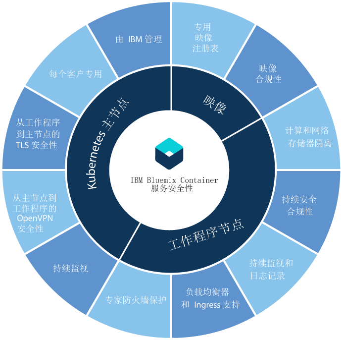

---

copyright:
  years: 2014, 2017
lastupdated: "2017-12-13"

---

{:new_window: target="_blank"}
{:shortdesc: .shortdesc}
{:screen: .screen}
{:pre: .pre}
{:table: .aria-labeledby="caption"}
{:codeblock: .codeblock}
{:tip: .tip}
{:download: .download}


# {{site.data.keyword.containerlong_notm}}的安全性
{: #cs_security}

您可以使用内置安全性功能来进行风险分析和安全保护。这些功能有助于保护集群基础架构和网络通信，隔离计算资源，以及确保基础架构组件和容器部署中的安全合规性。
{: shortdesc}

## 集群组件的安全性
{: #cs_security_cluster}

每个 {{site.data.keyword.containerlong_notm}} 集群都有内置到其[主](#cs_security_master)和[工作程序](#cs_security_worker)节点的安全功能。如果您有防火墙，需要从集群外部访问负载均衡，或者想要在企业网络策略阻止访问公用因特网端点时，从本地系统运行 `kubectl` 命令，那么可[在防火墙中打开端口](#opening_ports)。如果要将集群中的应用程序连接到内部部署网络或连接到集群外部的其他应用程序，请[设置 VPN 连接](#vpn)。
{: shortdesc}

在下图中，可以看到按 Kubernetes 主节点、工作程序节点和容器映像分组的安全功能。





  <table summary="表中的第一行跨两列。其余行应从左到右阅读，其中第一列是服务器位置，第二列是要匹配的 IP 地址。">
  <caption>表 1. 安全功能</caption>
  <thead>
  <th colspan=2> {{site.data.keyword.containershort_notm}} 中的内置集群安全设置</th>
  </thead>
  <tbody>
    <tr>
      <td>Kubernetes 主节点</td>
      <td>每个集群中的 Kubernetes 主节点由 IBM 管理，具备高可用性，并且包含 {{site.data.keyword.containershort_notm}} 安全设置，用于确保工作程序节点的安全合规性以及保护与工作程序节点之间的往来通信。IBM 会根据需要执行更新。专用 Kubernetes 主节点集中控制和监视集群中的所有 Kubernetes 资源。根据集群中的部署需求和容量，Kubernetes 主节点会自动安排容器化应用程序在可用的工作节点之间进行部署。有关更多信息，请参阅 [Kubernetes 主节点安全性](#cs_security_master)。</td>
    </tr>
    <tr>
      <td>工作程序节点</td>
      <td>容器部署在工作程序节点上；这些工作程序节点专用于集群，并确保为 IBM 客户提供计算、网络和存储隔离功能。{{site.data.keyword.containershort_notm}} 提供了内置安全性功能，以使工作程序节点在专用和公用网络上保持安全，并确保工作程序节点的安全合规性。有关更多信息，请参阅[工作程序节点安全性](#cs_security_worker)。此外，可以添加 [Calico 网络策略](#cs_security_network_policies)，以进一步指定要允许或阻止与工作程序节点上的 pod 之间进出的哪些网络流量。
</td>
     </tr>
     <tr>
      <td>映像</td>
      <td>作为集群管理员，您可以在 {{site.data.keyword.registryshort_notm}} 中设置自己的安全 Docker 映像存储库，在其中可以存储 Docker 映像并在集群用户之间共享这些映像。为了确保容器部署的安全，漏洞顾问程序会扫描专用注册表中的每个映像。漏洞顾问程序是 {{site.data.keyword.registryshort_notm}} 的一个组件，用于扫描以查找潜在的漏洞，提出安全性建议，并提供解决漏洞的指示信息。有关更多信息，请参阅 [{{site.data.keyword.containershort_notm}} 中的映像安全性](#cs_security_deployment)。</td>
    </tr>
  </tbody>
</table>

### Kubernetes 主节点
{: #cs_security_master}

查看内置 Kubernetes 主节点安全功能，以保护 Kubernetes 主节点，并保护集群网络通信安全。
{: shortdesc}

<dl>
  <dt>全面管理的专用 Kubernetes 主节点</dt>
    <dd>{{site.data.keyword.containershort_notm}} 中的每个 Kubernetes 集群都由 IBM 拥有的 IBM Cloud Infrastructure(SoftLayer) 帐户中 IBM 管理的专用 Kubernetes 主节点进行控制。Kubernetes 主节点设置有以下专用组件，这些组件不与其他 IBM 客户共享。<ul><li>etcd 数据存储器：存储集群的所有 Kubernetes 资源，例如服务、部署和 pod。Kubernetes ConfigMaps 和 Secrets 是存储为键/值对的应用程序数据，可由 pod 中运行的应用程序使用。etcd 中的数据存储在加密磁盘上，该磁盘由 IBM 管理，并在发送到 pod 时通过 TLS 加密，以确保数据保护和数据完整性。</li>
    <li>kube-apiserver：充当从工作程序节点到 Kubernetes 主节点的所有请求的主入口点。kube-apiserver 会验证并处理请求，并可以对 etcd 数据存储器执行读写操作。</li>
    <li>kube-scheduler：决定 pod 的部署位置，同时考虑容量和性能需求、软硬件策略约束、反亲缘关系规范和工作负载需求。如果找不到与这些需求相匹配的工作程序节点，那么不会在集群中部署 pod。</li>
    <li>kube-controller-manager：负责监视副本集，并创建相应的 pod 以实现所需状态。</li>
    <li>OpenVPN：特定于 {{site.data.keyword.containershort_notm}} 的组件，用于为所有 Kubernetes 主节点到工作程序节点的通信提供安全的网络连接。</li></ul></dd>
  <dt>针对工作程序节点到 Kubernetes 主节点的所有通信，受到 TLS 保护的网络连接</dt>
    <dd>为了保护与 Kubernetes 主节点的网络通信，{{site.data.keyword.containershort_notm}} 会生成 TLS 证书，用于加密每个集群的 kube-apiserver 与 etcd 数据存储器组件之间的通信。这些证书从不会在集群之间或在 Kubernetes 主节点组件之间进行共享。</dd>
  <dt>针对 Kubernetes 主节点到工作程序节点的所有通信，受到 OpenVPN 保护的网络连接</dt>
    <dd>虽然 Kubernetes 会使用 `https` 协议来保护 Kubernetes 主节点与工作程序节点之间的通信，但缺省情况下不会在工作程序节点上提供任何认证。为了保护此通信，在创建集群时，{{site.data.keyword.containershort_notm}} 会自动设置 Kubernetes 主节点与工作程序节点之间的 OpenVPN 连接。</dd>
  <dt>持续监视 Kubernetes 主节点网络</dt>
    <dd>每个 Kubernetes 主节点都由 IBM 持续监视，以控制进程级别的拒绝服务 (DOS) 攻击，并采取相应的补救措施。</dd>
  <dt>Kubernetes 主节点安全合规性</dt>
    <dd>{{site.data.keyword.containershort_notm}} 会自动扫描部署了 Kubernetes 主节点的每个节点，以确定是否有 Kubernetes 中找到的漏洞，以及为确保保护主节点而需要应用的特定于操作系统的安全修订。如果找到了漏洞，{{site.data.keyword.containershort_notm}} 会自动代表用户应用修订并解决漏洞。</dd>
</dl>

<br />


### 工作程序节点
{: #cs_security_worker}

查看内置工作程序节点安全功能，这些功能用于保护工作程序节点环境，并确保资源、网络和存储器隔离。
{: shortdesc}

<dl>
  <dt>计算、网络和存储基础架构隔离</dt>
    <dd>创建集群时，IBM 会将虚拟机作为客户 IBM Cloud infrastructure (SoftLayer) 帐户或专用 IBM Cloud infrastructure (SoftLayer) 帐户中的工作程序节点进行供应。工作程序节点专用于一个集群，而不托管其他集群的工作负载。</br> 每个 {{site.data.keyword.Bluemix_notm}} 帐户都设置有 IBM Cloud infrastructure (SoftLayer) VLAN，以确保工作程序节点上的高质量网络性能和隔离。</br>要在集群中持久存储数据，可以从 IBM Cloud infrastructure (SoftLayer) 供应基于 NFS 的专用文件存储器，并利用该平台的内置数据安全功能。</dd>
  <dt>安全的工作程序节点设置</dt>
    <dd>每个工作程序节点都由用户无法更改的 Ubuntu 操作系统进行设置。为保护工作程序节点的操作系统免受潜在攻击，每个工作程序节点都使用 Linux iptable 规则强制实施的专家防火墙设置进行配置。</br> 在 Kubernetes 上运行的所有容器都通过集群创建期间在每个工作程序节点上配置的预定义 Calico 网络策略设置进行保护。此设置将确保工作程序节点与 pod 之间的安全网络通信。要进一步限制容器可以对工作程序节点执行的操作，用户可以选择在工作程序节点上配置 [AppArmor 策略 ](https://kubernetes.io/docs/tutorials/clusters/apparmor/)。</br> 工作程序节点上禁用了 SSH 访问权。如果要在工作程序节点上安装附加功能，那么您可以对要在每个工作程序节点上运行的任何对象使用 [Kubernetes 守护程序集 ](https://kubernetes.io/docs/concepts/workloads/controllers/daemonset)，或者对您必须执行的任何一次性操作使用 [Kubernetes 作业 ](https://kubernetes.io/docs/concepts/workloads/controllers/jobs-run-to-completion/)。</dd>
  <dt>Kubernetes 工作程序节点安全合规性</dt>
    <dd>IBM 与内部和外部安全咨询团队合作，应对潜在的安全合规性漏洞。IBM 会维护对工作程序节点的访问权，以将更新和安全补丁部署到操作系统。
</br> <b>重要事项</b>：定期重新引导工作程序节点，以确保安装自动部署到操作系统的更新和安全补丁。IBM 不会重新引导您的工作程序节点。</dd>
  <dt>加密磁盘</dt>
  <dd>缺省情况下，{{site.data.keyword.containershort_notm}} 会为所有供应的工作程序节点提供两个本地 SSD 加密数据分区。第一个分区未加密，当使用 LUKS 加密密钥供应安装到 _/var/lib/docker_ 的第二个分区时，会解锁该分区。每个 Kubernetes 集群中的每个工作程序都有自己的唯一 LUKS 加密密钥，由 {{site.data.keyword.containershort_notm}} 管理。当您创建集群或将工作程序节点添加到现有集群时，将安全地拉取密钥，然后在解锁加密磁盘后废弃。<p><b>注</b>：加密可能会影响磁盘 I/O 性能。对于需要高性能磁盘 I/O 的工作负载，在启用和禁用加密的情况下测试集群以帮助您确定是否关闭加密。</p>
  </dd>
  <dt>对 IBM Cloud infrastructure (SoftLayer) 网络防火墙的支持</dt>
    <dd>{{site.data.keyword.containershort_notm}} 与所有 [IBM Cloud infrastructure (SoftLayer) 防火墙产品 ](https://www.ibm.com/cloud-computing/bluemix/network-security) 相兼容。在 {{site.data.keyword.Bluemix_notm}} Public 上，可以使用定制网络策略来设置防火墙，以便为集群提供专用网络安全性，检测网络侵入并进行补救。例如，您可以选择设置 [Vyatta ](https://knowledgelayer.softlayer.com/topic/vyatta-1) 以充当防火墙并阻止不需要的流量。设置防火墙时，[还必须为每个区域打开必需的端口和 IP 地址](#opening_ports)，以便主节点和工作程序节点可以通信。</dd>
  <dt>使服务保持专用，或者有选择地将服务和应用程序公开到公用因特网</dt>
    <dd>可以选择使服务和应用程序保持专用，并且利用本主题中所述的内置安全性功能来确保工作程序节点与 pod 之间的安全通信。要将服务和应用程序公开到公用因特网，可以利用 Ingress 和负载均衡器支持来安全地使服务公共可用。</dd>
  <dt>将工作程序节点和应用程序安全地连接到内部部署的数据中心</dt>
  <dd>要将工作程序节点和应用程序连接到内部部署的数据中心，您可以使用 Strongswan 服务或通过 Vyatta 网关设备或 Fortigate 设备，来配置 VPN IPSec 端点。<br><ul><li><b>Strongswan IPSec VPN 服务</b>：您可以设置 [Strongswan IPSec VPN 服务 ](https://www.strongswan.org/)，以将 Kubernetes 集群与内部部署网络安全连接。Strongswan IPSec VPN 服务基于业界标准因特网协议安全性 (IPsec) 协议组，通过因特网，提供安全的端到端通信信道。要在集群与内部部署网络之间设置安全连接，您必须在内部部署数据中心内安装 IPsec VPN 网关或 IBM Cloud infrastructure (SoftLayer) 服务器。然后，您可以在 Kubernetes pod 中[配置并部署 Strongswan IPSec VPN 服务](cs_security.html#vpn)。</li><li><b>Vyatta 网关设备或 Fortigate 设备</b>：如果您具有更大的集群，那么可选择设置 Vyatta 网关设备或 Fortigate 设备来配置 IPSec VPN 端点。有关更多信息，请参阅[将集群连接到内部部署数据中心 ](https://www.ibm.com/blogs/bluemix/2017/07/kubernetes-and-bluemix-container-based-workloads-part4/) 上的这个博客帖子。</li></ul></dd>
  <dt>持续监视和记录集群活动</dt>
    <dd>对于标准集群，{{site.data.keyword.containershort_notm}} 将记录并监视所有与集群相关的事件（例如，添加工作程序节点、滚动更新进度或容量使用情况信息），然后将其发送给 {{site.data.keyword.loganalysislong_notm}} 和 {{site.data.keyword.monitoringlong_notm}}。有关设置日志记录和监视的信息，请参阅[配置集群日志记录](https://console.bluemix.net/docs/containers/cs_cluster.html#cs_logging)和[配置集群监视](https://console.bluemix.net/docs/containers/cs_cluster.html#cs_monitoring)。</dd>
</dl>

### 映像
{: #cs_security_deployment}

使用内置安全性功能来管理映像的安全性与完整性。
{: shortdesc}

<dl>
<dt>{{site.data.keyword.registryshort_notm}} 中的安全 Docker 专用映像存储库</dt>
<dd>可以在 IBM 托管和管理的具备高可用性和高可扩展性的多租户专用映像注册表中设置自己的 Docker 映像存储库，以构建和安全地存储 Docker 映像，并在集群用户之间共享这些映像。</dd>

<dt>映像安全合规性</dt>
<dd>使用 {{site.data.keyword.registryshort_notm}} 时，可以利用漏洞顾问程序提供的内置安全性扫描。对于推送到名称空间的每个映像，都会自动根据包含已知 CentOS、Debian、Red Hat 和 Ubuntu 问题的数据库进行扫描以确定是否有漏洞。如果发现了漏洞，漏洞顾问程序会提供指示信息指导如何解决这些漏洞，以确保映像完整性和安全性。</dd>
</dl>

要查看映像的漏洞评估，请[查看漏洞顾问程序文档](/docs/services/va/va_index.html#va_registry_cli)。

<br />


## 在防火墙中打开必需的端口和 IP 地址
{: #opening_ports}

查看以下情况，在这些情况下，您可能需要在防火墙中打开特定端口和 IP 地址：
* 在企业网络策略阻止通过代理或防火墙访问公用因特网端点时从本地系统[运行 `bx` 命令](#firewall_bx)。
* 在企业网络策略阻止通过代理或防火墙访问公用因特网端点时从本地系统[运行 `kubectl` 命令](#firewall_kubectl)。
* 在企业网络策略阻止通过代理或防火墙访问公用因特网端点时从本地系统[运行 `calicoctl` 命令](#firewall_calicoctl)。
* 为工作程序节点设置防火墙或在 IBM Cloud infrastructure (SoftLayer) 帐户中定制防火墙设置时，[允许 Kubernetes 主节点与工作程序节点之间进行通信](#firewall_outbound)。
* [从集群外部访问 NodePort 服务、LoadBalancer 服务或 Ingress](#firewall_inbound)。

### 从防火墙后运行 `bx cs` 命令
{: #firewall_bx}

如果企业网络策略阻止通过代理或防火墙从本地系统访问公共端点，那么要运行 `bx cs` 命令，必须允许 {{site.data.keyword.containerlong_notm}} 的 TCP 访问。

1. 允许在端口 443 上访问 `containers.bluemix.net`。
2. 验证连接。如果正确配置了访问权，那么会在输出中显示船。
   ```
   curl https://containers.bluemix.net/v1/
   ```
   {: pre}

   输出示例：
   ```
                                     )___(
                              _______/__/_
                     ___     /===========|   ___
    ____       __   [\\\]___/____________|__[///]   __
    \   \_____[\\]__/___________________________\__[//]___
     \                                                    |
      \                                                  /
   ~~~~~~~~~~~~~~~~~~~~~~~~~~~~~~~~~~~~~~~~~~~~~~~~~~~~~~~~~~~~~~

   ```
   {: screen}

### 从防火墙后运行 `kubectl` 命令
{: #firewall_kubectl}

如果企业网络策略阻止通过代理或防火墙从本地系统访问公共端点，那么要运行 `kubectl` 命令，必须允许集群的 TCP 访问。

创建集群时，将从 20000-32767 中随机分配主 URL 中的端口。您可以选择为可能创建的任何集群打开端口范围 20000-32767，也可以选择允许对特定现有集群进行访问。

开始之前，允许访问以[运行 `bx cs` 命令](#firewall_bx)。

要允许访问特定集群：

1. 登录到 {{site.data.keyword.Bluemix_notm}} CLI。根据提示，输入您的 {{site.data.keyword.Bluemix_notm}} 凭证。如果您有联合帐户，请包括 `--sso` 选项。

    ```
    bx login [--sso]
    ```
    {: pre}

2. 选择集群所在的区域。

   ```
   bx cs region-set
   ```
   {: pre}

3. 获取集群的名称。

   ```
    bx cs clusters
    ```
   {: pre}

4. 检索集群的**主 URL**。

   ```
   bx cs cluster-get <cluster_name_or_id>
   ```
   {: pre}

   输出示例：
   ```
   ...
   Master URL:		https://169.46.7.238:31142
   ...
   ```
   {: screen}

5. 允许访问端口上的**主 URL**，例如，先前示例中的端口 `31142`。

6. 验证连接。

   ```
   curl --insecure <master_URL>/version
   ```
   {: pre}

   示例命令：
   ```
   curl --insecure https://169.46.7.238:31142/version
   ```
   {: pre}

   输出示例：
   ```
   {
     "major": "1",
     "minor": "7+",
     "gitVersion": "v1.7.4-2+eb9172c211dc41",
     "gitCommit": "eb9172c211dc4108341c0fd5340ee5200f0ec534",
     "gitTreeState": "clean",
     "buildDate": "2017-11-16T08:13:08Z",
     "goVersion": "go1.8.3",
     "compiler": "gc",
     "platform": "linux/amd64"
   }
   ```
   {: screen}

7. 可选：对您需要显示的每个集群重复上述步骤。

### 从防火墙后运行 `calicoctl` 命令
{: #firewall_calicoctl}

如果企业网络策略阻止通过代理或防火墙从本地系统访问公共端点，那么要运行 `calicoctl` 命令，必须允许 Calico 命令的 TCP 访问。

开始之前，允许访问以运行 [`bx` 命令](#firewall_bx)和 [`kubectl` 命令](#firewall_kubectl)。

1. 从用于允许 [`kubectl` 命令](#firewall_kubectl)的主 URL 中检索 IP 地址。

2. 获取 ETCD 的端口。

  ```
  kubectl get cm -n kube-system calico-config -o yaml | grep etcd_endpoints
  ```
  {: pre}

3. 允许通过主 URL IP 地址和 ETCD 端口访问 Calico 策略。

### 允许集群访问基础架构资源和其他服务
{: #firewall_outbound}

  1.  记下用于集群中所有工作程序节点的公共 IP 地址。

      ```
    bx cs workers <cluster_name_or_id>
    ```
      {: pre}

  2.  允许从源 _<each_worker_node_publicIP>_ 到目标 TCP/UDP 端口范围 20000-32767 和端口 443 以及以下 IP 地址和网络组的出站网络流量。如果您拥有的公司防火墙阻止您的本地机器访问公用因特网端点，请对源工作程序节点和本地机器执行此步骤。
      - **重要事项**：针对区域内的所有位置，必须允许出站流量从端口 443 流出，以便在引导过程中均衡负载。例如，如果集群位于美国南部，那么必须允许流量从端口 443 流至所有位置（dal10、dal12 和 dal13）的 IP 地址。
      <p>
  <table summary="表中的第一行跨两列。其余行应从左到右阅读，其中第一列是服务器位置，第二列是要匹配的 IP 地址。">
      <thead>
      <th>区域</th>
      <th>位置</th>
      <th>IP 地址</th>
      </thead>
    <tbody>
      <tr>
        <td>亚太地区北部</td>
        <td>hkg02<br>tok02</td>
        <td><code>169.56.132.234</code><br><code>161.202.126.210</code></td>
       </tr>
      <tr>
         <td>亚太地区南部</td>
         <td>mel01<br>syd01<br>syd04</td>
         <td><code>168.1.97.67</code><br><code>168.1.8.195</code><br><code>130.198.64.19, 130.198.66.34</code></td>
      </tr>
      <tr>
         <td>欧洲中部</td>
         <td>ams03<br>fra02<br>mil01<br>par01</td>
         <td><code>169.50.169.106, 169.50.154.194</code><br><code>169.50.56.170, 169.50.56.174</code><br><code>159.122.190.98</code><br><code>159.8.86.149, 159.8.98.170</code></td>
        </tr>
      <tr>
        <td>英国南部</td>
        <td>lon02<br>lon04</td>
        <td><code>159.122.242.78</code><br><code>158.175.65.170, 158.175.74.170, 158.175.76.2</code></td>
      </tr>
      <tr>
        <td>美国东部</td>
         <td>tor01<br>wdc06<br>wdc07</td>
         <td><code>169.53.167.50</code><br><code>169.60.73.142</code><br><code>169.61.83.62</code></td>
      </tr>
      <tr>
        <td>美国南部</td>
        <td>dal10<br>dal12<br>dal13</td>
        <td><code>169.47.234.18, 169.46.7.234</code><br><code>169.47.70.10</code><br><code>169.60.128.2</code></td>
      </tr>
      </tbody>
    </table>
</p>

  3.  允许出站网络流量从工作程序节点流至 {{site.data.keyword.registrylong_notm}}：
      - `TCP port 443 FROM <each_worker_node_publicIP> TO <registry_publicIP>`
      - 将 <em>&lt;registry_publicIP&gt;</em> 替换为要允许流量的注册表区域的所有地址：<p>
<table summary="表中的第一行跨两列。其余行应从左到右阅读，其中第一列是服务器位置，第二列是要匹配的 IP 地址。">
      <thead>
        <th>容器区域</th>
        <th>注册表地址</th>
        <th>注册表 IP 地址</th>
      </thead>
      <tbody>
        <tr>
          <td>亚太地区北部和亚太地区南部</td>
          <td>registry.au-syd.bluemix.net</td>
          <td><code>168.1.45.160/27</code></br><code>168.1.139.32/27</code></td>
        </tr>
        <tr>
          <td>欧洲中部</td>
          <td>registry.eu-de.bluemix.net</td>
          <td><code>169.50.56.144/28</code></br><code>159.8.73.80/28</code></td>
         </tr>
         <tr>
          <td>英国南部</td>
          <td>registry.eu-gb.bluemix.net</td>
          <td><code>159.8.188.160/27</code></br><code>169.50.153.64/27</code></td>
         </tr>
         <tr>
          <td>美国东部和美国南部</td>
          <td>registry.ng.bluemix.net</td>
          <td><code>169.55.39.112/28</code></br><code>169.46.9.0/27</code></br><code>169.55.211.0/27</code></td>
         </tr>
        </tbody>
      </table>
</p>

  4.  可选：允许出站网络流量从工作程序节点流至 {{site.data.keyword.monitoringlong_notm}} 和 {{site.data.keyword.loganalysislong_notm}} 服务：
      - `TCP port 443, port 9095 FROM <each_worker_node_publicIP> TO <monitoring_publicIP>`
      - 将 <em>&lt;monitoring_publicIP&gt;</em> 替换为要允许流量的监视区域的所有地址：<p><table summary="表中的第一行跨两列。其余行应从左到右阅读，其中第一列是服务器位置，第二列是要匹配的 IP 地址。">
      <thead>
        <th>容器区域</th>
        <th>监视地址</th>
        <th>监视 IP 地址</th>
        </thead>
      <tbody>
        <tr>
         <td>欧洲中部</td>
         <td>metrics.eu-de.bluemix.net</td>
         <td><code>159.122.78.136/29</code></td>
        </tr>
        <tr>
         <td>英国南部</td>
         <td>metrics.eu-gb.bluemix.net</td>
         <td><code>169.50.196.136/29</code></td>
        </tr>
        <tr>
          <td>美国东部、美国南部和亚太地区北部</td>
          <td>metrics.ng.bluemix.net</td>
          <td><code>169.47.204.128/29</code></td>
         </tr>
         
        </tbody>
      </table>
</p>
      - `TCP port 443, port 9091 FROM <each_worker_node_publicIP> TO <logging_publicIP>`
      - 将 <em>&lt;logging_publicIP&gt;</em> 替换为要允许流量的日志记录区域的所有地址：<p><table summary="表中的第一行跨两列。其余行应从左到右阅读，其中第一列是服务器位置，第二列是要匹配的 IP 地址。">
      <thead>
        <th>容器区域</th>
        <th>日志记录地址</th>
        <th>日志记录 IP 地址</th>
        </thead>
        <tbody>
          <tr>
            <td>美国东部和美国南部</td>
            <td>ingest.logging.ng.bluemix.net</td>
            <td><code>169.48.79.236</code><br><code>169.46.186.113</code></td>
           </tr>
          <tr>
           <td>欧洲中部、英国南部</td>
           <td>ingest-eu-fra.logging.bluemix.net</td>
           <td><code>158.177.88.43</code><br><code>159.122.87.107</code></td>
          </tr>
          <tr>
           <td>亚太南部、亚太北部</td>
           <td>ingest-au-syd.logging.bluemix.net</td>
           <td><code>130.198.76.125</code><br><code>168.1.209.20</code></td>
          </tr>
         </tbody>
       </table>
</p>

  5. 对于专用防火墙，允许适当的 IBM Cloud infrastructure (SoftLayer) 专用 IP 范围。请从**后端（专用）网络**部分开始查阅[此链接](https://knowledgelayer.softlayer.com/faq/what-ip-ranges-do-i-allow-through-firewall)。
      - 添加您正在使用的所有[区域内的位置](cs_regions.html#locations)。
      - 请注意，必须添加 dal01 位置（数据中心）。
      - 打开端口 80 和 443 以允许集群引导过程。

  6. 要为数据存储创建持久性卷申领，请允许通过防火墙 egress 访问集群所在位置（数据中心）的 [IBM Cloud infrastructure (SoftLayer) IP 地址](https://knowledgelayer.softlayer.com/faq/what-ip-ranges-do-i-allow-through-firewall)。
      - 要找到集群的位置（数据中心），请运行 `bx cs clusters`。
      - 允许访问**前端（公共）网络**和**后端（专用）网络**的 IP 范围。
      - 请注意，必须添加**后端（专用）网络**的 dal01 位置（数据中心）。

### 从集群外部访问 NodePort、LoadBalancer 和 Ingress 服务
{: #firewall_inbound}

您可以允许入站访问 NodePort、LoadBalancer 和 Ingress 服务。

<dl>
  <dt>NodePort 服务</dt>
  <dd>打开将服务部署到允许流量流到的所有工作程序节点的公共 IP 地址时所配置的端口。要查找该端口，请运行 `kubectl get svc`。端口在 20000-32000 范围内。<dd>
  <dt>LoadBalancer 服务</dt>
  <dd>打开将服务部署到 LoadBalancer 服务的公共 IP 地址时所配置的端口。</dd>
  <dt>Ingress</dt>
  <dd>针对 Ingress 应用程序负载均衡器的 IP 地址打开端口 80（对于 HTTP）或端口 443（对于 HTTPS）。</dd>
</dl>

<br />


## 使用 Strongswan IPSec VPN 服务 Helm 图表设置 VPN 连接
{: #vpn}

VPN 连接允许您将 Kubernetes 集群中的应用程序安全地连接到内部部署网络。您还可以将集群外部的应用程序连接到正在集群内部运行的应用程序。要设置 VPN 连接，可以使用 Helm 图表来配置并部署 Kubernetes pod 内的 [Strongswan IPSec VPN 服务 ](https://www.strongswan.org/)。然后所有 VPN 流量都通过此 pod 进行路由。有关用于设置 Strongswan 图表的 Helm 命令的更多信息，请参阅 [Helm 文档 ](https://docs.helm.sh/helm/)。

开始之前：

- [创建标准集群。](cs_cluster.html#cs_cluster_cli)
- [如果使用的是现有集群，请将其更新为 V1.7.4 或更高版本。](cs_cluster.html#cs_cluster_update)
- 集群必须至少具有一个可用的公共负载均衡器 IP 地址。
- [设定 Kubernetes CLI 的目标为集群](cs_cli_install.html#cs_cli_configure)。

要设置与 Strongswan 的 VPN 连接，请执行以下操作：

1. 如果尚未启用，请安装并初始化集群的 Helm。

    1. [安装 Helm CLI ](https://docs.helm.sh/using_helm/#installing-helm)。

    2. 初始化 Helm 并安装 `tiller`。

        ```
        helm init
        ```
        {: pre}

    3. 验证 `tiller-deploy` pod 是否在集群中具有 `Running` 状态。

        ```
        kubectl get pods -n kube-system -l app=helm
        ```
        {: pre}

        输出示例：

        ```
        NAME                            READY     STATUS    RESTARTS   AGE
        tiller-deploy-352283156-nzbcm   1/1       Running   0          10m
        ```
        {: screen}

    4. 向 Helm 实例添加 {{site.data.keyword.containershort_notm}} Helm 存储库。

        ```
        helm repo add bluemix  https://registry.bluemix.net/helm
        ```
        {: pre}

    5. 验证是否在 Helm 存储库中列出了 Strongswan 图表。

        ```
        helm search bluemix
        ```
        {: pre}

2. 在本地 YAML 文件中保存 Strongswan Helm 图表的缺省配置设置。

    ```
    helm inspect values bluemix/strongswan > config.yaml
    ```
    {: pre}

3. 打开 `config.yaml` 文件，并根据所需的 VPN 配置，对缺省值进行以下更改。如果对属性已设置可选择的值，那么这些值将列在该文件内每个属性上方的注释中。**重要信息**：如果不需要更改属性，请通过在属性前面放置 `#` 注释掉该属性。

    <table>
    <caption>表 2. 了解 YAML 文件的组成部分</caption>
    <thead>
    <th colspan=2> 了解 YAML 文件的组成部分</th>
    </thead>
    <tbody>
    <tr>
    <td><code>overRideIpsecConf</code></td>
    <td>如果您有要使用的现有 <code>ipsec.conf</code> 文件，请除去大括号 (<code>{}</code>) 并在此属性后添加文件的内容。文件内容必须缩进。**注：**如果您使用自己的文件，那么不会使用 <code>ipsec</code>、<code>local</code> 和 <code>remote</code> 部分的任何值。</td>
    </tr>
    <tr>
    <td><code>overRideIpsecSecrets</code></td>
    <td>如果您有要使用的现有 <code>ipsec.secrets</code> 文件，请除去大括号 (<code>{}</code>) 并在此属性后添加文件的内容。文件内容必须缩进。**注：**如果您使用自己的文件，那么不会使用 <code>preshared</code> 部分的任何值。</td>
    </tr>
    <tr>
    <td><code>ipsec.keyexchange</code></td>
    <td>如果内部部署的 VPN 通道端点不支持 <code>ikev2</code> 作为初始化连接的协议，请将此值更改为 <code>ikev1</code>。</td>
    </tr>
    <tr>
    <td><code>ipsec.esp</code></td>
    <td>将此值更改为内部部署 VPN 通道端点用于连接的 ESP 加密/认证算法列表。</td>
    </tr>
    <tr>
    <td><code>ipsec.ike</code></td>
    <td>将此值更改为内部部署 VPN 通道端点用于连接的 IKE/ISAKMP SA 加密/认证算法列表。</td>
    </tr>
    <tr>
    <td><code>ipsec.auto</code></td>
    <td>如果希望集群启动 VPN 连接，请将此值更改为 <code>start</code>。</td>
    </tr>
    <tr>
    <td><code>local.subnet</code></td>
    <td>将此值更改为应该通过 VPN 连接显示在内部部署网络上的集群子网 CIDR 的列表。此列表可以包含以下子网：<ul><li>Kubernetes pod 子网 CIDR：<code>172.30.0.0/16</code></li><li>Kubernetes 服务子网 CIDR：<code>172.21.0.0/16</code></li><li>工作程序节点的专用子网 CIDR（如果应用程序由专用网络上的 NodePort 服务显示）。要查找此值，请运行 <code>bx cs subnets | grep <xxx.yyy.zzz></code>，其中 &lt;xxx.yyy.zzz&gt; 是工作程序节点的专用 IP 地址的前 3 个八位字节。</li><li>集群的专用或用户管理的子网 CIDR（如果应用程序由专用网络上的 LoadBalancer 服务显示）。要查找这些值，请运行 <code>bx cs cluster-get <cluster name> --showResources</code>。在 <b>VLANS</b> 部分中，查找 <b>Public</b> 值为 <code>false</code> 的 CIDR。</li></ul></td>
    </tr>
    <tr>
    <td><code>local.id</code></td>
    <td>将此值更改为 VPN 通道端点用于连接的本地 Kubernetes 集群端的字符串标识。</td>
    </tr>
    <tr>
    <td><code>remote.gateway</code></td>
    <td>将此值更改为内部部署 VPN 网关的公共 IP 地址。</td>
    </tr>
    <td><code>remote.subnet</code></td>
    <td>将此值更改为允许 Kubernetes 集群访问的内部部署专用子网 CIDR 的列表。</td>
    </tr>
    <tr>
    <td><code>remote.id</code></td>
    <td>将此值更改为 VPN 通道端点用于连接的远程内部部署端的字符串标识。</td>
    </tr>
    <tr>
    <td><code>preshared.secret</code></td>
    <td>将此值更改为内部部署 VPN 通道端点网关用于连接的预共享密钥。</td>
    </tr>
    </tbody></table>

4. 保存更新的 `config.yaml` 文件。

5. 使用更新的 `config.yaml` 文件将 Helm 图表安装到集群。更新的属性存储在图表的配置映射中。

    ```
    helm install -f config.yaml --namespace=kube-system --name=vpn bluemix/strongswan
    ```
    {: pre}

6. 检查图表部署状态。当图表就绪时，输出顶部附近的 **STATUS** 字段的值为 `DEPLOYED`。

    ```
    helm status vpn
    ```
    {: pre}

7. 部署图表后，请验证是否使用了 `config.yaml` 文件中的已更新设置。

    ```
    helm get values vpn
    ```
    {: pre}

8. 测试新的 VPN 连接。
    1. 如果内部部署网关上的 VPN 处于不活动状态，请启动 VPN。

    2. 设置 `STRONGSWAN_POD` 环境变量。

        ```
        export STRONGSWAN_POD=$(kubectl get pod -n kube-system -l app=strongswan,release=vpn -o jsonpath='{ .items[0].metadata.name }')
        ```
        {: pre}

    3. 检查 VPN 的状态。状态 `ESTABLISHED` 表示 VPN 连接成功。

        ```
        kubectl exec -n kube-system  $STRONGSWAN_POD -- ipsec status
        ```
        {: pre}

        输出示例：
        ```
        Security Associations (1 up, 0 connecting):
            k8s-conn[1]: ESTABLISHED 17 minutes ago, 172.30.244.42[ibm-cloud]...192.168.253.253[on-prem]
            k8s-conn{2}:  INSTALLED, TUNNEL, reqid 12, ESP in UDP SPIs: c78cb6b1_i c5d0d1c3_o
            k8s-conn{2}:   172.21.0.0/16 172.30.0.0/16 === 10.91.152.128/26
        ```
        {: screen}

        **注**：
          - 首次使用此 Helm 图表时，VPN 的状态很可能不是 `ESTABLISHED`。您可能需要检查内部部署 VPN 端点设置并返回到步骤 3 以更改 `config.yaml` 文件数次，连接才能成功。
          - 如果 VPN pod 处于 `ERROR` 状态或继续崩溃并重新启动，那么可能是由于在图表的配置映射中对 `ipsec.conf` 设置进行了参数验证。要查看是否是这个原因，请通过运行 `kubectl logs -n kube-system $STRONGAN_POD` 来检查 Strongswan pod 日志中是否存在任何验证错误。如果存在验证错误，请运行 `helm delete --purge vpn`，返回到步骤 3 以修正 `config.yaml` 文件中的错误值，并重复步骤 4 到 8。如果集群具有大量工作程序节点，那么还可以使用 `helm upgrade` 来更迅速地应用更改，而不是运行 `helm delete` 和 `helm install`。

    4. VPN 的状态为 `ESTABLISHED` 后，请使用 `ping` 测试连接。以下示例将 ping 从 Kubernetes 集群中的 VPN pod 发送到内部部署 VPN 网关的专用 IP 地址。请确保在配置文件中指定了正确的 `remote.subnet` 和 `local.subnet`，并且本地子网列表包含发送 ping 的源 IP 地址。

        ```
        kubectl exec -n kube-system  $STRONGSWAN_POD -- ping -c 3  <on-prem_gateway_private_IP>
        ```
        {: pre}

要禁用 Strongswan IPSec VPN 服务，请执行以下操作：

1. 删除 Helm 图表。

    ```
    helm delete --purge vpn
    ```
    {: pre}

<br />


## 网络策略
{: #cs_security_network_policies}

每个 Kubernetes 集群均设置有名为 Calico 的网络插件。缺省网络策略设置为保护每个工作程序节点的公用网络接口的安全。当您有独特的安全需求时，可以使用 Calico 和本机 Kubernetes 功能来为集群配置更多网络策略。这些网络策略会指定是要允许还是阻止与集群中的 pod 之间进出的网络流量。
{: shortdesc}

可以从 Calico 和本机 Kubernetes 功能中进行选择来为集群创建网络策略。一开始可使用 Kubernetes 网络策略，但为了获得更稳健的功能，请使用 Calico 网络策略。

<ul>
  <li>[Kubernetes 网络策略 ](https://kubernetes.io/docs/concepts/services-networking/network-policies/)：提供了一些基本选项，例如指定哪些 pod 可以相互通信。对于协议和端口，可以允许或阻止入局网络流量。可以依据正尝试连接到其他 pod 的 pod 的标签和 Kubernetes 名称空间，过滤此流量。</br>可以使用 `kubectl` 命令或 Kubernetes API 来应用这些策略。这些策略应用后，即会转换成 Calico 网络策略，Calico 会强制实施这些策略。</li>
  <li>[Calico 网络策略 ](http://docs.projectcalico.org/v2.4/getting-started/kubernetes/tutorials/advanced-policy)：这些策略是 Kubernetes 网络策略的超集，通过以下功能增强了本机 Kubernetes 能力。</li>
    <ul><ul><li>允许或阻止特定网络接口上的网络流量，而不仅仅是 Kubernetes pod 流量。</li>
    <li>允许或阻止入局 (流入）和出局 (外流) 网络流量。</li>
    <li>[阻止流至 LoadBalancer 或 NodePort Kubernetes 服务的入局（Ingress）流量](#cs_block_ingress)。</li>
    <li>允许或阻止基于源或目标 IP 地址或 CIDR 的流量。</li></ul></ul></br>

这些策略通过使用 `calicoctl` 命令来应用。Calico 会通过在 Kubernetes 工作程序节点上设置 Linux iptable 规则来强制实施这些策略，包括转换为 Calico 策略的任何 Kubernetes 网络策略。iptable 规则充当工作程序节点的防火墙，可定义网络流量为能够转发到目标资源而必须满足的特征。</ul>


### 缺省策略配置
{: #concept_nq1_2rn_4z}

创建集群时，会自动为每个工作程序节点的公用网络接口设置缺省网络策略，以限制来自公共因特网的工作程序节点的入局流量。这些策略不会影响 pod 到 pod 的流量，并设置为允许访问 Kubernetes NodePort、LoadBalancer 和 Ingress 服务。

不会直接将缺省策略应用于 pod；缺省策略使用 Calico 主机端点应用于工作程序节点的公用网络接口。在 Calico 中创建主机端点后，除非策略允许与工作程序节点网络接口之间进出的所有流量，否则将阻止该流量。

**重要信息**：不要除去应用于主机端点的策略，除非您充分了解策略并确定无需该策略允许的流量。


 <table summary="表中的第一行跨两列。其余行应从左到右阅读，其中第一列是服务器位置，第二列是要匹配的 IP 地址。">
  <caption>表 3. 每个集群的缺省策略</caption>
  <thead>
  <th colspan=2> 每个集群的缺省策略</th>
  </thead>
  <tbody>
    <tr>
      <td><code>allow-all-outbound</code></td>
      <td>允许所有出站流量。</td>
    </tr>
    <tr>
      <td><code>allow-bixfix-port</code></td>
      <td>允许端口 52311 的入局流量流至 bigfix 应用程序，以允许执行必需的工作程序节点更新。</td>
    </tr>
    <tr>
      <td><code>allow-icmp</code></td>
      <td>允许入局 icmp 包 (ping)。</td>
     </tr>
    <tr>
      <td><code>allow-node-port-dnat</code></td>
      <td>允许入局 NodePort、LoadBalancer 和 Ingress 服务流量流入这些服务公开的 pod。请注意，这些服务在公共接口上公开的端口不必加以指定，因为 Kubernetes 会使用目标网络地址转换 (DNAT) 将这些服务请求转发到正确的 pod。这一转发过程在 iptable 中应用主机端点策略之前执行。</td>
   </tr>
   <tr>
      <td><code>allow-sys-mgmt</code></td>
      <td>允许用于管理工作程序节点的特定 IBM Cloud infrastructure (SoftLayer) 系统的入局连接。</td>
   </tr>
   <tr>
    <td><code>allow-vrrp</code></td>
    <td>允许使用 vrrp 包，这些包用于监视虚拟 IP 地址并在工作程序节点之间移动这些 IP 地址。</td>
   </tr>
  </tbody>
</table>


### 添加网络策略
{: #adding_network_policies}

在大多数情况下，缺省策略无需更改。只有高级场景可能需要更改。如果发现必须进行更改，请安装 Calico CLI 并创建自己的网络策略。

开始之前：

1.  [安装 {{site.data.keyword.containershort_notm}} 和 Kubernetes CLI](cs_cli_install.html#cs_cli_install)。
2.  [创建 Lite 或标准集群](cs_cluster.html#cs_cluster_ui)。
3.  [设定 Kubernetes CLI 的目标为集群](cs_cli_install.html#cs_cli_configure)。在 `bx cs cluster-config` 命令中包含 `--admin` 选项，以用于下载证书和许可权文件。此下载还包含超级用户角色的密钥，以供运行 Calico 命令时使用。

  ```
  bx cs cluster-config <cluster_name> --admin
  ```
  {: pre}

  **注**：支持 Calico CLI V1.6.1。

要添加网络策略，请执行以下操作：
1.  安装 Calico CLI。
    1.  [下载 Calico CLI ](https://github.com/projectcalico/calicoctl/releases/tag/v1.6.1)。

        **提示：**如果使用的是 Windows，请将 Calico CLI 安装在 {{site.data.keyword.Bluemix_notm}} CLI 所在的目录中。此安装将在您以后运行命令时减少一些文件路径更改操作。

    2.  对于 OSX 和 Linux 用户，请完成以下步骤。
        1.  将可执行文件移至 /usr/local/bin 目录。
            -   Linux：


              ```
              mv /<path_to_file>/calicoctl /usr/local/bin/calicoctl
              ```
              {: pre}

            -   OS X：

              ```
              mv /<path_to_file>/calicoctl-darwin-amd64 /usr/local/bin/calicoctl
              ```
              {: pre}

        2.  使文件可执行。

            ```
            chmod +x /usr/local/bin/calicoctl
            ```
            {: pre}

    3.  通过检查 Calico CLI 客户机版本，验证 `calico` 命令是否正常运行。

        ```
        calicoctl version
        ```
        {: pre}

2.  配置 Calico CLI。

    1.  对于 Linux 和 OS X，创建 `/etc/calico` 目录。对于 Windows，可以使用任何目录。

      ```
      sudo mkdir -p /etc/calico/
      ```
      {: pre}

    2.  创建 `calicoctl.cfg` 文件。
        -   Linux 和 OS X：

          ```
          sudo vi /etc/calico/calicoctl.cfg
          ```
          {: pre}

        -   Windows：使用文本编辑器创建该文件。

    3.  在 <code>calicoctl.cfg</code> 文件中输入以下信息。

        ```
      apiVersion: v1
      kind: calicoApiConfig
      metadata:
      spec:
          etcdEndpoints: <ETCD_URL>
          etcdKeyFile: <CERTS_DIR>/admin-key.pem
          etcdCertFile: <CERTS_DIR>/admin.pem
          etcdCACertFile: <CERTS_DIR>/<ca-*pem_file>
      ```
        {: codeblock}

        1.  检索 `<ETCD_URL>`. 如果此命令失败，并返回 `calico-config not found` 错误，请参阅此[故障诊断主题](cs_troubleshoot.html#cs_calico_fails)。

          -   Linux 和 OS X：

              ```
              kubectl get cm -n kube-system calico-config -o yaml | grep "etcd_endpoints:" | awk '{ print $2 }'
              ```
              {: pre}

          -   输出示例：

              ```
              https://169.1.1.1:30001
              ```
              {: screen}

          -   Windows：<ol>
            <li>从配置映射获取 Calico 配置值。</br><pre class="codeblock"><code>kubectl get cm -n kube-system calico-config -o yaml</code></pre></br>
            <li>在 `data` 部分中，找到 etcd_endpoints 值。示例：<code>https://169.1.1.1:30001</code></ol>

        2.  检索 `<CERTS_DIR>`，即 Kubernetes 证书的下载目录。

            -   Linux 和 OS X：

              ```
              dirname $KUBECONFIG
              ```
              {: pre}

                输出示例：

              ```
              /home/sysadmin/.bluemix/plugins/container-service/clusters/<cluster_name>-admin/
              ```
              {: screen}

            -   Windows：

              ```
              ECHO %KUBECONFIG%
              ```
              {: pre}

                输出示例：

              ```
              C:/Users/<user>/.bluemix/plugins/container-service/<cluster_name>-admin/kube-config-prod-<location>-<cluster_name>.yml
              ```
              {: screen}

            **注**：要获取目录路径，请除去输出末尾的文件名 `kube-config-prod-<location>-<cluster_name>.yml`。

        3.  检索 <code>ca-*pem_file<code>。

            -   Linux 和 OS X：

              ```
              ls `dirname $KUBECONFIG` | grep "ca-"
              ```
              {: pre}

            -   Windows：<ol><li>打开在最后一步中检索到的目录。</br><pre class="codeblock"><code>C:\Users\<user>\.bluemix\plugins\container-service\&lt;cluster_name&gt;-admin\</code></pre>
              <li> 找到 <code>ca-*pem_file</code> 文件。</ol>

        4.  验证 Calico 配置是否在正常运行。

            -   Linux 和 OS X：

              ```
              calicoctl get nodes
              ```
              {: pre}

            -   Windows：

              ```
              calicoctl get nodes --config=<path_to_>/calicoctl.cfg
              ```
              {: pre}

              输出：

              ```
              NAME
              kube-dal10-crc21191ee3997497ca90c8173bbdaf560-w1.cloud.ibm
              kube-dal10-crc21191ee3997497ca90c8173bbdaf560-w2.cloud.ibm
              kube-dal10-crc21191ee3997497ca90c8173bbdaf560-w3.cloud.ibm
              ```
              {: screen}

3.  检查现有网络策略。

    -   查看 Calico 主机端点。

      ```
      calicoctl get hostendpoint -o yaml
      ```
      {: pre}

    -   查看为集群创建的所有 Calico 和 Kubernetes 网络策略。此列表包含可能还未应用于任何 pod 或主机的策略。要强制实施网络策略，该策略必须找到与 Calico 网络策略中定义的选择器相匹配的 Kubernetes 资源。

      ```
      calicoctl get policy -o wide
      ```
      {: pre}

    -   查看网络策略的详细信息。

      ```
      calicoctl get policy -o yaml <policy_name>
      ```
      {: pre}

    -   查看集群的所有网络策略的详细信息。

      ```
      calicoctl get policy -o yaml
      ```
      {: pre}

4.  创建 Calico 网络策略以允许或阻止流量。

    1.  通过创建配置脚本 (.yaml) 来定义 [Calico 网络策略 ](http://docs.projectcalico.org/v2.1/reference/calicoctl/resources/policy)。这些配置文件包含选择器，用于描述这些策略应用于哪些 pod、名称空间或主机。请参阅这些[样本 Calico 策略 ](http://docs.projectcalico.org/v2.0/getting-started/kubernetes/tutorials/advanced-policy) 以帮助您创建自己的策略。

    2.  将策略应用于集群。
        -   Linux 和 OS X：

          ```
          calicoctl apply -f <policy_file_name.yaml>
          ```
          {: pre}

        -   Windows：

          ```
          calicoctl apply -f <path_to_>/<policy_file_name.yaml> --config=<path_to_>/calicoctl.cfg
          ```
          {: pre}

### 阻止流至 LoadBalancer 或 NodePort 服务的入局流量。
{: #cs_block_ingress}

缺省情况下， Kubernetes `NodePort` 和 `LoadBalancer` 服务旨在使应用程序在所有公用和专用集群接口上都可用。但是，您可以基于流量源或目标，阻止流至服务的入局流量。要阻止流量，请创建 Calico `preDNAT` 网络策略。

Kubernetes LoadBalancer 服务也是 NodePort 服务。LoadBalancer 服务通过负载均衡器 IP 地址和端口提供应用程序，并通过服务的节点端口使应用程序可用。对于集群内的每个节点，在每个 IP 地址（公共和专用）上都可以访问节点端口。

集群管理员可以使用 Calico `preDNAT` 网络策略来阻止：

  - 流至 NodePort 服务的流量。允许使用流至 LoadBalancer 服务的流量。
  - 基于源地址或 CIDR 的流量。

Calico `preDNAT` 网络策略的一些常见用法：

  - 阻止流至专用 LoadBalancer 服务的公共节点端口的流量。
  - 阻止流至正在运行[边缘工作程序节点](#cs_edge)的集群上公共节点端口的流量。阻止节点端口可确保边缘工作程序节点是处理入局流量的唯一工作程序节点。

`preDNAT` 网络策略非常有用，因为在保护 Kubernetes NodePort 和 LoadBalancer 服务的情况下，由于会为这些服务生成 DNAT iptables 规则，所以很难应用缺省的 Kubernetes 和 Calico 策略。

Calico `preDNAT` 网络策略基于 [Calico 网络策略资源 ](https://docs.projectcalico.org/v2.4/reference/calicoctl/resources/policy) 生成 iptables 规则。

1. 定义 Calico `preDNAT` 网络策略，以对 Kubernetes 服务进行 Ingress 访问。

  用于阻止所有节点端口的示例：

  ```
  apiVersion: v1
  kind: policy
  metadata:
    name: deny-kube-node-port-services
  spec:
    preDNAT: true
    selector: ibm.role in { 'worker_public', 'master_public' }
    ingress:
    - action: deny
      protocol: tcp
      destination:
        ports:
        - 30000:32767
    - action: deny
      protocol: udp
      destination:
        ports:
        - 30000:32767
  ```
  {: codeblock}

2. 应用 Calico preDNAT 网络策略。在整个集群中应用策略更改大约需要 1 分钟时间。

  ```
  calicoctl apply -f deny-kube-node-port-services.yaml
  ```
  {: pre}

<br />


## 将网络流量限于边缘工作程序节点
{: #cs_edge}

将 `dedicated=edge` 标签添加到集群中的两个或更多工作程序节点，以确保 Ingress 和负载均衡器仅部署到这些工作程序节点。

边缘工作程序节点通过减少允许外部访问的工作程序节点，并隔离联网工作负载，可以提高集群的安全性。当这些工作程序节点标记为仅用于联网时，其他工作负载无法使用工作程序节点的 CPU 或内存，也不会干扰联网。

开始之前：

- [创建标准集群。](cs_cluster.html#cs_cluster_cli)
- 确保集群至少具有一个公共 VLAN。边缘工作程序节点不可用于仅具有专用 VLAN 的集群。
- [设定 Kubernetes CLI 的目标为集群](cs_cli_install.html#cs_cli_configure)。


1. 列出集群中的所有工作程序节点。使用 **NAME** 列中的专用 IP 地址来标识节点。请至少选择两个工作程序节点作为边缘工作程序节点。使用两个或更多工作程序节点可提高联网资源的可用性。

  ```
  kubectl get nodes -L publicVLAN,privateVLAN,dedicated
  ```
  {: pre}

2. 使用 `dedicated=edge` 标记工作程序节点。工作程序节点标记有 `dedicated=edge` 后，所有后续 Ingress 和负载均衡器都会部署到边缘工作程序节点。

  ```
  kubectl label nodes <node_name> <node_name2> dedicated=edge
  ```
  {: pre}

3. 检索集群中的所有现有 LoadBalancer 服务。

  ```
  kubectl get services --all-namespaces -o jsonpath='{range .items[*]}kubectl get service -n {.metadata.namespace} {.metadata.name} -o yaml | kubectl apply -f - :{.spec.type},{end}' | tr "," "\n" | grep "LoadBalancer" | cut -d':' -f1
  ```
  {: pre}

  输出：

  ```
  kubectl get service -n <namespace> <name> -o yaml | kubectl apply -f
  ```
  {: screen}

4. 使用上一步中的输出内容，复制并粘贴每个 `kubectl get service` 行。此命令会将负载均衡器重新部署到边缘工作程序节点。只有公用负载均衡器需要重新部署。

  输出：

  ```
  service "<name>" configured
  ```
  {: screen}

您已使用 `dedicated=edge` 标记工作程序节点，并已将所有现有负载均衡器和 Ingress 重新部署到边缘工作程序节点。接下来，请[阻止其他工作负载在边缘工作程序节点上运行](#cs_edge_workloads)并[阻止流至工作程序节点上节点端口的入站流量](#cs_block_ingress)。

### 阻止工作负载在边缘工作程序节点上运行
{: #cs_edge_workloads}

边缘工作程序节点的一个优点是，这些工作程序节点可以指定为仅运行联网服务。使用 `dedicated=edge` 容忍度意味着所有 LoadBalancer 和 Ingress 服务仅部署到已标记的工作程序节点。但是，要阻止其他工作负载在边缘工作程序节点上运行并使用工作程序节点资源，必须使用 [Kubernetes 污点 ](https://kubernetes.io/docs/concepts/configuration/taint-and-toleration/)。

1. 列出具有 `edge` 标签的所有工作程序节点。

  ```
  kubectl get nodes -L publicVLAN,privateVLAN,dedicated -l dedicated=edge
  ```
  {: pre}

2. 将污点应用于每个工作程序节点，这将阻止 pod 在该工作程序节点上运行，并且会从该工作程序节点中除去没有 `edge` 标签的 pod。除去的 pod 会在具有容量的其他工作程序节点上重新部署。

  ```
  kubectl taint node <node_name> dedicated=edge:NoSchedule dedicated=edge:NoExecute
  ```

现在，仅具有 `dedicated=edge` 容忍度的 pod 会部署到边缘工作程序节点。
