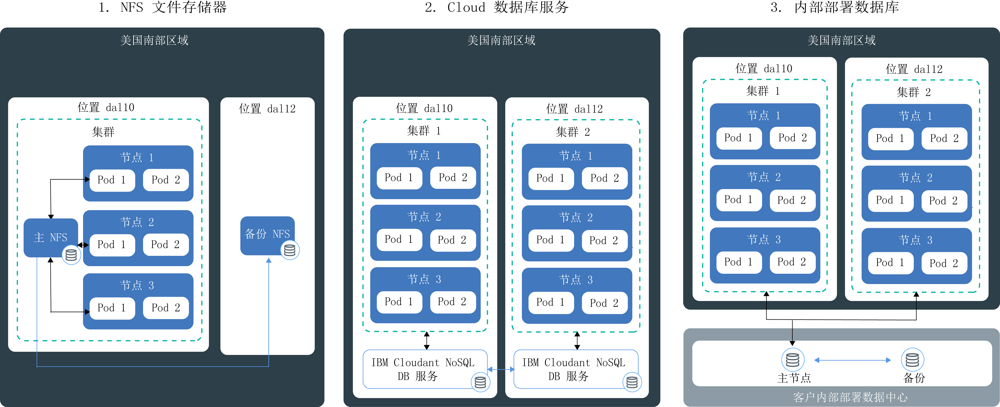

---

copyright:
  years: 2014, 2018
lastupdated: "2018-02-07"

---

{:new_window: target="_blank"}
{:shortdesc: .shortdesc}
{:screen: .screen}
{:pre: .pre}
{:table: .aria-labeledby="caption"}
{:codeblock: .codeblock}
{:tip: .tip}
{:download: .download}


# 保存集群中的数据
{: #storage}
您可以在集群中的某个组件发生故障的情况下持久存储数据，并在应用程序实例之间共享数据。

## 规划高可用性存储
{: #planning}

在 {{site.data.keyword.containerlong_notm}} 中，可以从多个选项中进行选择，以存储应用程序数据并在集群中的各个 pod 之间共享数据。但是，并非所有存储选项都提供相同级别的持久性和可用性，以防集群中的组件或整个站点发生故障。
{: shortdesc}

### 非持久性数据存储选项
{: #non_persistent}

如果数据不需要持久性存储，那么可以使用非持久性存储选项，以便可以在集群中的某个组件发生故障后恢复数据，或者用于数据无需在应用程序实例间共享的情况。非持久性存储选项还可用于对应用程序组件进行单元测试或试用新功能。
{: shortdesc}

下图显示 {{site.data.keyword.containerlong_notm}} 中可用的非持久性数据存储选项。这些选项可用于免费和标准集群。
<p>
</p>

<table summary="此表显示非持久性存储选项。各行都应从左到右阅读，其中第一列是选项编号，第二列是选项标题，第三列是描述。" style="width: 100%">
<colgroup>
       <col span="1" style="width: 5%;"/>
       <col span="1" style="width: 20%;"/>
       <col span="1" style="width: 75%;"/>
    </colgroup>
  <thead>
  <th>#</th>
  <th>选项</th>
  <th>描述</th>
  </thead>
  <tbody>
    <tr>
      <td>1 </td>
      <td>容器或 pod 内</td>
      <td>根据设计，容器和 pod 的生存时间短，并且可能会意外发生故障。但是，您可以将数据写入容器的本地文件系统，以存储容器整个生命周期内的数据。容器内的数据不能与其他容器或 pod 共享，并且在容器崩溃或被除去时会丢失。有关更多信息，请参阅[存储容器中的数据](https://docs.docker.com/storage/)。</td>
    </tr>
  <tr>
    <td>2</td>
    <td>在工作程序节点上</td>
    <td>每个工作程序节点都设置有主存储器和辅助存储器，这由您为工作程序节点选择的机器类型确定。主存储器用于存储来自操作系统的数据，并且无法由用户访问。辅助存储器用于将数据存储在 <code>/var/lib/docker</code> 中，这是所有容器数据写入的目录。<br/><br/>要访问工作程序节点的辅助存储器，可以创建 <code>/emptyDir</code> 卷。此空卷会分配给集群中的 pod，使得该 pod 中的容器可以对该卷执行读写操作。由于卷会分配给一个特定 pod，因此数据无法与副本集内的其他 pod 共享。
<br/><p>对于以下情况，会除去 <code>/emptyDir</code> 卷及其数据：<ul><li>从工作程序节点中永久删除分配的 pod。</li><li>在其他工作程序节点上安排了分配的 pod。</li><li>工作程序节点已重新装入或更新。</li><li>工作程序节点已删除。</li><li>集群已删除。</li><li>{{site.data.keyword.Bluemix_notm}} 帐户进入暂挂状态。</li></ul></p><p><strong>注</strong>：如果 pod 内的容器崩溃，该卷中的数据在工作程序节点上仍可用。</p><p>有关更多信息，请参阅 [Kubernetes 卷 ](https://kubernetes.io/docs/concepts/storage/volumes/)。</p></td>
    </tr>
    </tbody>
    </table>

### 用于高可用性的持久性数据存储选项
{: persistent}

创建高可用性有状态应用程序时，主要困难是如何在多个位置的多个应用程序实例中持久存储数据，并使数据始终保持同步。对于高可用性数据，您希望确保有一个主数据库及多个实例，这些实例分布在多个数据中心甚或多个区域中，并且会持续复制此主数据库中的数据。集群中的所有实例都必须对此主数据库执行读写操作。如果主数据库的一个实例停止运行，其他实例可以接管工作负载，避免您的应用程序发生停机时间。
{: shortdesc}

下图显示您在 {{site.data.keyword.containerlong_notm}} 中具有的可使数据在标准集群中实现高可用性的选项。适合您的选项取决于以下因素：
  * **拥有的应用程序的类型：**例如，您可能有一个应用程序必须基于文件存储数据，而不是在数据库内存储数据。
  * **数据存储和路由的法律要求：**例如，您可能只能在美国存储和路由数据，而不能使用位于欧洲的服务。
  * **备份和复原选项：**每个存储选项都随附数据备份和复原功能。检查可用的备份和复原选项是否满足灾难恢复计划的需求，例如备份频率或在主数据中心外部存储数据的功能。
  * **全局复制：**为了实现高可用性，您可能希望设置多个存储器实例以分布在全球各数据中心并进行复制。

<br/>


<table summary="此表显示持久性存储选项。各行都应从左到右阅读，其中第一列是选项编号，第二列是选项标题，第三列是描述。">
  <thead>
  <th>#</th>
  <th>选项</th>
  <th>描述</th>
  </thead>
  <tbody>
  <tr>
  <td width="5%">1 </td>
  <td width="20%">NFS 文件存储器</td>
  <td width="75%">使用此选项时，可以利用 Kubernetes 持久性卷来持久存储应用程序和容器数据。卷在[基于 NFS 的耐久性和高性能文件存储器 ](https://www.ibm.com/cloud/file-storage/details) 上托管，可以用于基于文件存储数据而不是在数据库中存储数据的应用程序。文件存储器在 REST 上进行加密，并由 IBM 建立集群以提供高可用性。<p>{{site.data.keyword.containershort_notm}} 会提供预定义存储类，用于定义存储器的大小范围、IOPS、删除策略以及卷的读写许可权。要对基于 NFS 的文件存储器发起请求，必须创建[持久性卷申领](cs_storage.html#create)。提交持久性卷申领后，{{site.data.keyword.containershort_notm}} 会以动态方式供应在基于 NFS 的文件存储器上托管的持久性卷。可以[将持久性卷申领作为卷安装到部署](cs_storage.html#app_volume_mount)，以允许容器对该卷执行读写操作。</p><p>持久性卷在工作程序节点所在的数据中心进行供应。您可以跨同一副本集共享数据，也可以与同一集群中的其他部署共享数据。集群位于不同数据中心或区域中时，不能在集群间共享数据。</p><p>缺省情况下，不会自动备份 NFS 存储器。您可以使用提供的备份和复原机制为集群设置定期备份。容器崩溃或从工作程序节点中除去 pod 时，数据不会除去，而是仍可由安装该卷的其他部署访问。</p><p><strong>注</strong>：持久性 NFS 文件共享存储器按月收费。如果为集群供应了持续存储器，但随后立即将其除去，那么即使只用了很短的时间，您也仍需支付该持久性存储器一个月的费用。</p></td>
  </tr>
  <tr>
    <td>2</td>
    <td>云数据库服务</td>
    <td>使用此选项时，可以利用 {{site.data.keyword.Bluemix_notm}} 数据库云服务（例如 [IBM Cloudant NoSQL DB](/docs/services/Cloudant/getting-started.html#getting-started-with-cloudant)）来持久存储数据。通过此选项存储的数据可以跨集群、位置和区域进行访问。<p> 您可以选择配置单个数据库实例供所有应用程序访问，或[跨数据中心和复制设置多个实例](/docs/services/Cloudant/guides/active-active.html#configuring-cloudant-nosql-db-for-cross-region-disaster-recovery)以在实例之间实现更高可用性。在 IBM Cloudant NoSQL 数据库中，不会自动备份数据。您可以使用提供的[备份和复原机制](/docs/services/Cloudant/guides/backup-cookbook.html#cloudant-nosql-db-backup-and-recovery)来保护数据不受站点故障影响。</p> <p> 要在集群中使用服务，必须[绑定 {{site.data.keyword.Bluemix_notm}} 服务](cs_integrations.html#adding_app)到集群中的名称空间。将该服务绑定到集群时，将创建 Kubernetes 私钥。Kubernetes 私钥会保存有关该服务的保密信息，例如服务的 URL、用户名和密码。可以将私钥作为私钥卷安装到 pod，并使用该私钥中的凭证来访问该服务。通过将私钥卷安装到其他 pod，还可以在 pod 之间共享数据。容器崩溃或从工作程序节点中除去 pod 时，数据不会除去，而是仍可由安装该私钥卷的其他 pod 访问。<p>大多数 {{site.data.keyword.Bluemix_notm}} 数据库服务都免费对较小的数据量提供磁盘空间，因此您可以测试其功能。
</p></td>
  </tr>
  <tr>
    <td>3 </td>
    <td>内部部署数据库</td>
    <td>如果由于法律原因必须在现场存储数据，请[设置 VPN 连接](cs_vpn.html#vpn)以连接到内部部署数据库，并使用数据中心内的现有存储、备份和复制机制。</td>
  </tr>
  </tbody>
  </table>

{: caption="表. 用于在 Kubernetes 集群中进行部署的持久数据存储选项" caption-side="top"}

<br />


## 在集群中使用 NFS 文件共享
{: #existing}

如果在 IBM Cloud infrastructure (SoftLayer) 帐户中已经有要用于 Kubernetes 的现有 NFS 文件共享，那么可以通过在现有 NFS 文件共享上创建持久性卷来使用 NFS 文件共享。持久性卷是一块实际硬件，用作 Kubernetes 集群资源，并可以由集群用户使用。
{:shortdesc}

Kubernetes 会区分持久性卷（代表实际硬件）和持久性卷申领（通常由集群用户发起的对存储器的请求）。下图说明持久性卷与持久性卷申领之间的关系。


 如图所示，要使现有 NFS 文件共享可用于 Kubernetes，必须创建具有特定大小和访问方式的持久性卷，并创建与持久性卷规范相匹配的持久性卷申领。如果持久性卷和持久性卷申领相匹配，那么会将它们相互绑定。只有绑定的持久性卷申领才能由集群用户用于将相应卷安装到部署。此过程称为持久性存储器的静态供应。

开始之前，请确保您拥有可用于创建持久性卷的现有 NFS 文件共享。

**注**：持久性存储器的静态供应仅适用于现有 NFS 文件共享。如果没有现有 NFS 文件共享，那么集群用户可以使用[动态供应](cs_storage.html#create)过程来添加持久性卷。

要创建持久性卷及匹配的持久性卷申领，请执行以下步骤。

1.  在 IBM Cloud infrastructure (SoftLayer) 帐户中，查找要在其中创建持久性卷对象的 NFS 文件共享的标识和路径。此外，将文件存储器授权给集群中的子网。此授权可授予您对存储器的集群访问权。
    1.  登录到 IBM Cloud infrastructure (SoftLayer) 帐户。
    2.  单击**存储器**。
    3.  单击**文件存储器**并从**操作**菜单中，选择**授权主机**。
    4.  单击**子网**。授权后，子网上的每个工作程序节点都可以访问文件存储器。
    5.  从菜单中选择集群的公共 VLAN 的子网，然后单击**提交**。如果需要查找该子网，请运行 `bx cs cluster-get <cluster_name> --showResources`。
    6.  单击文件存储器的名称。
    7.  记下**安装点**字段。该字段显示为 `<server>:/<path>`.
2.  为持久性卷创建存储器配置文件。在文件存储器**安装点**字段中包含服务器和路径。

    ```
    apiVersion: v1
    kind: PersistentVolume
    metadata:
     name: mypv
    spec:
     capacity:
       storage: "20Gi"
     accessModes:
       - ReadWriteMany
     nfs:
       server: "nfslon0410b-fz.service.networklayer.com"
       path: "/IBM01SEV8491247_0908"
    ```
    {: codeblock}

    <table>
    <caption>表. 了解 YAML 文件的组成部分</caption>
    <thead>
    <th colspan=2> 了解 YAML 文件的组成部分</th>
    </thead>
    <tbody>
    <tr>
    <td><code>name</code></td>
    <td>输入要创建的持久性卷对象的名称。</td>
    </tr>
    <tr>
    <td><code>storage</code></td>
    <td>输入现有 NFS 文件共享的存储器大小。输入的存储器大小必须以千兆字节为单位，例如 20Gi (20 GB) 或 1000Gi (1 TB)，并且大小必须与现有文件共享的大小相匹配。</td>
    </tr>
    <tr>
    <td><code>accessMode</code></td>
    <td>访问方式定义了持久性卷申领可以安装到工作程序节点的方式。<ul><li>ReadWriteOnce (RWO)：此持久性卷只能安装到单个工作程序节点中的部署。安装到此持久性卷的部署可以对该卷执行读写操作。</li><li>ReadOnlyMany (ROX)：此持久性卷可以安装到在多个工作程序节点上托管的部署。安装到此持久性卷的部署只能对该卷执行读操作。</li><li>ReadWriteMany (RWX)：此持久性卷可以安装到在多个工作程序节点上托管的部署。安装到此持久性卷的部署可以对该卷执行读写操作。</li></ul></td>
    </tr>
    <tr>
    <td><code>server</code></td>
    <td>输入 NFS 文件共享服务器标识。</td>
    </tr>
    <tr>
    <td><code>path</code></td>
    <td>输入要在其中创建持久性卷对象的 NFS 文件共享的路径。</td>
    </tr>
    </tbody></table>

3.  在集群中创建持久性卷对象。

    ```
    kubectl apply -f <yaml_path>
    ```
    {: pre}

    示例

    ```
    kubectl apply -f deploy/kube-config/pv.yaml
    ```
    {: pre}

4.  验证持久性卷是否已创建。

    ```
    kubectl get pv
    ```
    {: pre}

5.  创建另一个配置文件以创建持久性卷申领。为了使持久性卷申领与先前创建的持久性卷对象相匹配，必须为 `storage` 和 `accessMode` 选择相同的值。`storage-class` 字段必须为空。如果其中任何字段与持久性卷不匹配，那么会改为自动创建新的持久性卷。


    ```
    kind: PersistentVolumeClaim
    apiVersion: v1
    metadata:
     name: mypvc
     annotations:
       volume.beta.kubernetes.io/storage-class: ""
    spec:
     accessModes:
       - ReadWriteMany
     resources:
       requests:
         storage: "20Gi"
    ```
    {: codeblock}

6.  创建持久性卷申领。

    ```
    kubectl apply -f deploy/kube-config/mypvc.yaml
    ```
    {: pre}

7.  验证持久性卷申领是否已创建并绑定到持久性卷对象。此过程可能需要几分钟时间。

    ```
    kubectl describe pvc mypvc
    ```
    {: pre}

    输出类似于以下内容。

    ```
    Name: mypvc
    Namespace: default
    StorageClass: ""
    Status: Bound
    Volume: pvc-0d787071-3a67-11e7-aafc-eef80dd2dea2
    Labels: <none>
    Capacity: 20Gi
    Access Modes: RWX
    Events:
      FirstSeen LastSeen Count From        SubObjectPath Type Reason Message
      --------- -------- ----- ----        ------------- -------- ------ -------
      3m 3m 1 {ibm.io/ibmc-file 31898035-3011-11e7-a6a4-7a08779efd33 } Normal Provisioning External provisioner is provisioning volume for claim "default/my-persistent-volume-claim"
      3m 1m  10 {persistentvolume-controller } Normal ExternalProvisioning cannot find provisioner "ibm.io/ibmc-file", expecting that a volume for the claim is provisioned either manually or via external software
      1m 1m 1 {ibm.io/ibmc-file 31898035-3011-11e7-a6a4-7a08779efd33 } Normal ProvisioningSucceeded Successfully provisioned volume pvc-0d787071-3a67-11e7-aafc-eef80dd2dea2
    ```
    {: screen}


您已成功创建持久性卷对象，并将其绑定到持久性卷申领。现在，集群用户可以[安装持久性卷申领](#app_volume_mount)至其部署，并开始对持久性卷对象执行读写操作。

<br />


## 为应用程序创建持久性存储器 
{: #create}

创建持久性卷申领 (pvc) 以便为集群供应 NFS 文件存储器。然后，将此申领安装到部署可确保即便 pod 崩溃或关闭，数据也仍然可用。
{:shortdesc}

支持持久性卷的 NFS 文件存储器由 IBM 建立集群，以便为数据提供高可用性。存储类描述可用的存储产品类型，并在创建持久性卷时定义数据保留策略、大小（以千兆字节计）和 IOPS 等方面。

**注**：如果您具有防火墙，那么[允许 egress 访问](cs_firewall.html#pvc)集群所在位置的 IBM Cloud infrastructure (SoftLayer) IP 范围（数据中心），以便您可以创建持久性卷申领。


1.  查看可用的存储类。{{site.data.keyword.containerlong}} 提供了八个预定义的存储类，因此集群管理员不必创建任何存储类。`ibmc-file-bronze` 存储类与 `default` 存储类相同。

    ```
    kubectl get storageclasses
    ```
    {: pre}

    ```
    $ kubectl get storageclasses
    NAME                         TYPE
    default                      ibm.io/ibmc-file   
    ibmc-file-bronze (default)   ibm.io/ibmc-file   
    ibmc-file-custom             ibm.io/ibmc-file
    ibmc-file-gold               ibm.io/ibmc-file   
    ibmc-file-retain-bronze      ibm.io/ibmc-file   
    ibmc-file-retain-custom      ibm.io/ibmc-file   
    ibmc-file-retain-gold        ibm.io/ibmc-file   
    ibmc-file-retain-silver      ibm.io/ibmc-file   
    ibmc-file-silver             ibm.io/ibmc-file 
    ```
    {: screen}

2.  决定在删除 pvc 之后是否要保存数据和 NFS 文件共享，这称为回收策略。如果要保留数据，请选择 `retain` 存储类。如果要在删除 pvc 时删除数据和文件共享，请选择不带 `retain` 的存储类。

3.  获取存储类的详细信息。在 CLI 输出的**参数**字段中，查看每千兆字节的 IOPS 和大小范围。 

    <ul>
      <li>使用铜牌级、银牌级或金牌级存储类时，您将获得[耐久性存储器 ](https://knowledgelayer.softlayer.com/topic/endurance-storage)，用于为每个类定义 IOPS/GB。但是，您可以通过在可用范围内选择大小来确定总 IOPS。例如，如果在 4 IOPS/GB 银牌级存储类中选择 1000Gi 文件共享大小，那么您的卷总计有 4000 IOPS。持久性卷的 IOPS 越高，处理输入和输出操作的速度越快。<p>**描述存储类的示例命令**：</p>

       <pre class="pre">    kubectl describe storageclasses ibmc-file-silver
    </pre>

       **parameters** 字段提供与存储类关联的 IOPS/GB 以及可用大小（以千兆字节为单位）。<pre class="pre">    Parameters: iopsPerGB=4,sizeRange=20Gi,40Gi,80Gi,100Gi,250Gi,500Gi,1000Gi,2000Gi,4000Gi,8000Gi,12000Gi
    </pre>
       
       </li>
      <li>使用定制存储类，您将获得[高性能存储器 ](https://knowledgelayer.softlayer.com/topic/performance-storage)，并在选择 IOPS 和大小的组合时具有更多控制权。<p>**描述定制存储类的示例命令**：</p>

       <pre class="pre">    kubectl describe storageclasses ibmc-file-retain-custom 
    </pre>

       **parameters** 字段提供与存储类关联的 IOPS 以及可用大小（以千兆字节为单位）。例如，40Gi pvc 可以选择 100 - 2000 IOPS 范围内的 100 的倍数的 IOPS。

       ```
    Parameters:	Note=IOPS value must be a multiple of 100,reclaimPolicy=Retain,sizeIOPSRange=20Gi:[100-1000],40Gi:[100-2000],80Gi:[100-4000],100Gi:[100-6000],1000Gi[100-6000],2000Gi:[200-6000],4000Gi:[300-6000],8000Gi:[500-6000],12000Gi:[1000-6000]
    ```
       {: screen}
       </li></ul>
4. 创建配置文件以定义持久性卷申领，并将配置保存为 `.yaml` 文件。

    -  **铜牌级、银牌级和金牌级存储类的示例**：
       

       ```
       apiVersion: v1
       kind: PersistentVolumeClaim
       metadata:
        name: mypvc
        annotations:
          volume.beta.kubernetes.io/storage-class: "ibmc-file-silver"
          
       spec:
        accessModes:
          - ReadWriteMany
        resources:
          requests:
            storage: 20Gi
        ```
        {: codeblock}

    -  **定制存储类的示例**：
       

       ```
       apiVersion: v1
       kind: PersistentVolumeClaim
       metadata:
         name: mypvc
         annotations:
           volume.beta.kubernetes.io/storage-class: "ibmc-file-retain-custom"
         
       spec:
         accessModes:
           - ReadWriteMany
         resources:
           requests:
             storage: 40Gi
             iops: "500"
        ```
        {: codeblock}

        <table>
        <thead>
        <th colspan=2> 了解 YAML 文件的组成部分</th>
        </thead>
        <tbody>
        <tr>
        <td><code>metadata/name</code></td>
        <td>输入持久性卷申领的名称。</td>
        </tr>
        <tr>
        <td><code>metadata/annotations</code></td>
        <td>指定持久性卷的存储类：<ul>
          <li>ibmc-file-bronze / ibmc-file-retain-bronze：2 IOPS/GB。</li>
          <li>ibmc-file-silver / ibmc-file-retain-silver：4 IOPS/GB。</li>
          <li>ibmc-file-gold / ibmc-file-retain-gold：10 IOPS/GB。</li>
          <li>ibmc-file-custom / ibmc-file-retain-custom：多个 IOPS 值可用。</li>
          <p>如果未指定存储类，那么会使用铜牌级存储类来创建持久性卷。</p></td>
        </tr>
        
        <tr>
        <td><code>spec/accessModes</code>
    <code>resources/requests/storage</code></td>
        <td>如果选择的大小不同于列出的大小，那么该大小会向上舍入。如果选择的大小大于最大大小，那么会对该大小向下舍入。</td>
        </tr>
        <tr>
        <td><code>spec/accessModes</code>
    <code>resources/requests/iops</code></td>
        <td>此选项仅适用于客户存储类 (`ibmc-file-custom / ibmc-file-retain-custom`)。指定存储器的总 IOPS。要查看所有选项，请运行 `kubectl describe storageclasses ibmc-file-custom`。如果选择的 IOPS 不同于列出的 IOPS，那么该 IOPS 会向上舍入。</td>
        </tr>
        </tbody></table>

5.  创建持久性卷申领。

    ```
    kubectl apply -f <local_file_path>
    ```
    {: pre}

6.  验证持久性卷申领是否已创建并绑定到持久性卷。此过程可能需要几分钟时间。

    ```
    kubectl describe pvc mypvc
    ```
    {: pre}

    输出示例：

    ```
    Name: mypvc
    Namespace: default
    StorageClass: ""
    Status:  Bound
    Volume:  pvc-0d787071-3a67-11e7-aafc-eef80dd2dea2
    Labels:  <none>
    Capacity: 20Gi
    Access Modes: RWX
    Events:
      FirstSeen LastSeen Count From        SubObjectPath Type  Reason   Message
      --------- -------- ----- ----        ------------- -------- ------   -------
      3m  3m  1 {ibm.io/ibmc-file 31898035-3011-11e7-a6a4-7a08779efd33 }   Normal  Provisioning  External provisioner is provisioning volume for claim "default/my-persistent-volume-claim"
      3m  1m  10 {persistentvolume-controller }       Normal  ExternalProvisioning cannot find provisioner "ibm.io/ibmc-file", expecting that a volume for the claim is provisioned either manually or via external software
      1m  1m  1 {ibm.io/ibmc-file 31898035-3011-11e7-a6a4-7a08779efd33 }   Normal  ProvisioningSucceeded Successfully provisioned volume pvc-0d787071-3a67-11e7-aafc-eef80dd2dea2

    ```
    {: screen}

6.  {: #app_volume_mount}要将持久性卷申领安装到部署，请创建配置文件。将配置保存为 `.yaml` 文件。

    ```
    apiVersion: extensions/v1beta1
    kind: Deployment
    metadata:
     name: <deployment_name>
    replicas: 1
    template:
     metadata:
       labels:
         app: <app_name>
    spec:
     containers:
     - image: <image_name>
       name: <container_name>
       volumeMounts:
       - mountPath: /<file_path>
         name: <volume_name>
     volumes:
     - name: <volume_name>
       persistentVolumeClaim:
         claimName: <pvc_name>
    ```
    {: codeblock}

    <table>
    <thead>
    <th colspan=2> 了解 YAML 文件的组成部分</th>
    </thead>
    <tbody>
    <tr>
    <td><code>metadata/name</code></td>
    <td>部署的名称。</td>
    </tr>
    <tr>
    <td><code>template/metadata/labels/app</code></td>
    <td>部署的标签。</td>
    </tr>
    <tr>
    <td><code>spec/containers/image</code></td>
    <td>要使用的映像的名称。要列出 {{site.data.keyword.registryshort_notm}} 帐户中的可用映像，请运行 `bx cr image-list`。</td>
    </tr>
    <tr>
    <td><code>spec/containers/name</code></td>
    <td>要部署到集群的容器的名称。</td>
    </tr>
    <tr>
    <td><code>spec/containers/volumeMounts/mountPath</code></td>
    <td>在容器中安装卷的目录的绝对路径。</td>
    </tr>
    <tr>
    <td><code>spec/containers/volumeMounts/name</code></td>
    <td>要安装到 pod 中的卷的名称。</td>
    </tr>
    <tr>
    <td><code>volumes/name</code></td>
    <td>要安装到 pod 中的卷的名称。通常此名称与 <code>volumeMounts/name</code> 相同。</td>
    </tr>
    <tr>
    <td><code>volumes/persistentVolumeClaim/claimName</code></td>
    <td>要用作卷的持久性卷申领的名称。将卷安装到 pod 时，Kubernetes 会识别绑定到该持久性卷申领的持久性卷，并支持用户对持久性卷执行读写操作。</td>
    </tr>
    </tbody></table>

8.  创建部署并安装持久性卷申领。

    ```
    kubectl apply -f <local_yaml_path>
    ```
    {: pre}

9.  验证是否已成功安装卷。

    ```
    kubectl describe deployment <deployment_name>
    ```
    {: pre}

    安装点位于 **Volume Mounts** 字段中，卷位于 **Volumes** 字段中。

    ```
     Volume Mounts:
          /var/run/secrets/kubernetes.io/serviceaccount from default-token-tqp61 (ro)
          /volumemount from myvol (rw)
    ...
    Volumes:
      myvol:
        Type: PersistentVolumeClaim (a reference to a PersistentVolumeClaim in the same namespace)
        ClaimName: mypvc
        ReadOnly: false

    ```
    {: screen}

<br />


## 添加持久性存储器的非 root 用户访问权
{: #nonroot}

非 root 用户在支持 NFS 的存储器的卷安装路径上没有写许可权。要授予写许可权，您必须编辑映像的 Dockerfile，以在具有正确许可权的安装路径上创建目录。
{:shortdesc}

开始之前，请[设定 CLI 的目标](cs_cli_install.html#cs_cli_configure)为集群。

如果您使用需要对卷的写许可权的非 root 用户来设计应用程序，那么您必须将以下过程添加到 Dockerfile 和入口点脚本中：

-   创建非 root 用户。
-   临时向 root 组添加用户。
-   在具有正确用户许可权的卷安装路径中创建目录。

对于 {{site.data.keyword.containershort_notm}}，卷安装路径的缺省所有者是所有者 `nobody`。对于 NFS 存储器，如果在 pod 中本地不存在所有者，那么将创建 `nobody` 用户。卷设置为识别容器中的 root 用户；对于某些应用程序，该用户是容器中的唯一用户。但是，许多应用程序指定除了 `nobody` 之外的非 root 用户来写入容器安装路径。某些应用程序指定卷必须由 root 用户拥有。通常，出于安全考虑，应用程序不会使用 root 用户。但是，如果应用程序需要 root 用户，那么可以联系 [{{site.data.keyword.Bluemix_notm}} 支持](/docs/get-support/howtogetsupport.html#getting-customer-support)以获取帮助。


1.  在本地目录中创建 Dockerfile。此示例 Dockerfile 创建名为 `myguest` 的非 root 用户。

    ```
    FROM registry.<region>.bluemix.net/ibmliberty:latest

    # Create group and user with GID & UID 1010.
    # In this case your are creating a group and user named myguest.
    # The GUID and UID 1010 is unlikely to create a conflict with any existing user GUIDs or UIDs in the image.
    # The GUID and UID must be between 0 and 65536. Otherwise, container creation fails.
    RUN groupadd --gid 1010 myguest
    RUN useradd --uid 1010 --gid 1010 -m --shell /bin/bash myguest

    ENV MY_USER=myguest

    COPY entrypoint.sh /sbin/entrypoint.sh
    RUN chmod 755 /sbin/entrypoint.sh

    EXPOSE 22
    ENTRYPOINT ["/sbin/entrypoint.sh"]
    ```
    {: codeblock}

2.  在与 Dockerfile 相同的本地文件夹中，创建入口点脚本。此示例入口点脚本将 `/mnt/myvol` 指定为卷安装路径。


    ```
    #!/bin/bash
    set -e

    # This is the mount point for the shared volume.
    # By default the mount point is owned by the root user.
    MOUNTPATH="/mnt/myvol"
    MY_USER=${MY_USER:-"myguest"}

    # This function creates a subdirectory that is owned by
    # the non-root user under the shared volume mount path.
    create_data_dir() {
      #Add the non-root user to primary group of root user.
      usermod -aG root $MY_USER

      # Provide read-write-execute permission to the group for the shared volume mount path.
      chmod 775 $MOUNTPATH

      # Create a directory under the shared path owned by non-root user myguest.
      su -c "mkdir -p ${MOUNTPATH}/mydata" -l $MY_USER
      su -c "chmod 700 ${MOUNTPATH}/mydata" -l $MY_USER
      ls -al ${MOUNTPATH}

      # For security, remove the non-root user from root user group.
      deluser $MY_USER root

      # Change the shared volume mount path back to its original read-write-execute permission.
      chmod 755 $MOUNTPATH
      echo "Created Data directory..."
    }

    create_data_dir

    # This command creates a long-running process for the purpose of this example.
    tail -F /dev/null
    ```
    {: codeblock}

3.  登录到 {{site.data.keyword.registryshort_notm}}。

    ```
    bx cr login
    ```
    {: pre}

4.  在本地构建映像。记住将 _&lt;my_namespace&gt;_ 替换为专用映像注册表的名称空间。如果您需要查找名称空间，请运行 `bx cr namespace-get`。

    ```
    docker build -t registry.<region>.bluemix.net/<my_namespace>/nonroot .
    ```
    {: pre}

5.  将映像推送到 {{site.data.keyword.registryshort_notm}} 中的名称空间。

    ```
    docker push registry.<region>.bluemix.net/<my_namespace>/nonroot
    ```
    {: pre}

6.  通过创建配置 `.yaml` 文件来创建持久性卷申领。此示例使用的是较低性能的存储类。运行 `kubectl get storageclasses` 可查看可用的存储类。

    ```
    apiVersion: v1
    kind: PersistentVolumeClaim
    metadata:
      name: mypvc
      annotations:
        volume.beta.kubernetes.io/storage-class: "ibmc-file-bronze"
    spec:
      accessModes:
        - ReadWriteMany
      resources:
        requests:
          storage: 20Gi
    ```
    {: codeblock}

7.  创建持久性卷申领。

    ```
    kubectl apply -f <local_file_path>
    ```
    {: pre}

8.  创建配置文件以安装卷，并从非根映像运行 pod。卷安装路径 `/mnt/myvol` 与 Dockerfile 中指定的安装路径匹配。将配置保存为 `.yaml` 文件。

    ```
    apiVersion: v1
    kind: Pod
    metadata:
     name: mypod
    spec:
     containers:
     - image: registry.<region>.bluemix.net/<my_namespace>/nonroot
       name: mycontainer
       volumeMounts:
       - mountPath: /mnt/myvol
         name: myvol
     volumes:
     - name: myvol
       persistentVolumeClaim:
         claimName: mypvc
    ```
    {: codeblock}

9.  创建 pod 并将持久性卷申领安装到该 pod。

    ```
    kubectl apply -f <local_yaml_path>
    ```
    {: pre}

10. 验证卷是否已成功安装到 pod。

    ```
    kubectl describe pod mypod
    ```
    {: pre}

    安装点会列在 **Volume Mounts** 字段中，卷会列在 **Volumes** 字段中。

    ```
     Volume Mounts:
          /var/run/secrets/kubernetes.io/serviceaccount from default-token-tqp61 (ro)
          /mnt/myvol from myvol (rw)
    ...
    Volumes:
      myvol:
        Type: PersistentVolumeClaim (a reference to a PersistentVolumeClaim in the same namespace)
        ClaimName: mypvc
        ReadOnly: false

    ```
    {: screen}

11. 在 pod 开始运行之后，登录到该 pod。

    ```
    kubectl exec -it mypod /bin/bash
    ```
    {: pre}

12. 查看卷安装路径的许可权。

    ```
    ls -al /mnt/myvol/
    ```
    {: pre}

    ```
    root@instance-006ff76b:/# ls -al /mnt/myvol/
    total 12
    drwxr-xr-x 3 root    root    4096 Jul 13 19:03 .
    drwxr-xr-x 3 root    root    4096 Jul 13 19:03 ..
    drwx------ 2 myguest myguest 4096 Jul 13 19:03 mydata
    ```
    {: screen}

    此输出显示 root 用户在卷安装路径 `mnt/myvol/` 上具有读、写和执行许可权，但非 root 用户 myguest 对 `mnt/myvol/mydata` 文件夹具有读和写许可权。由于这些更新的许可权，非 root 用户现在可以向持久性卷写入数据。


