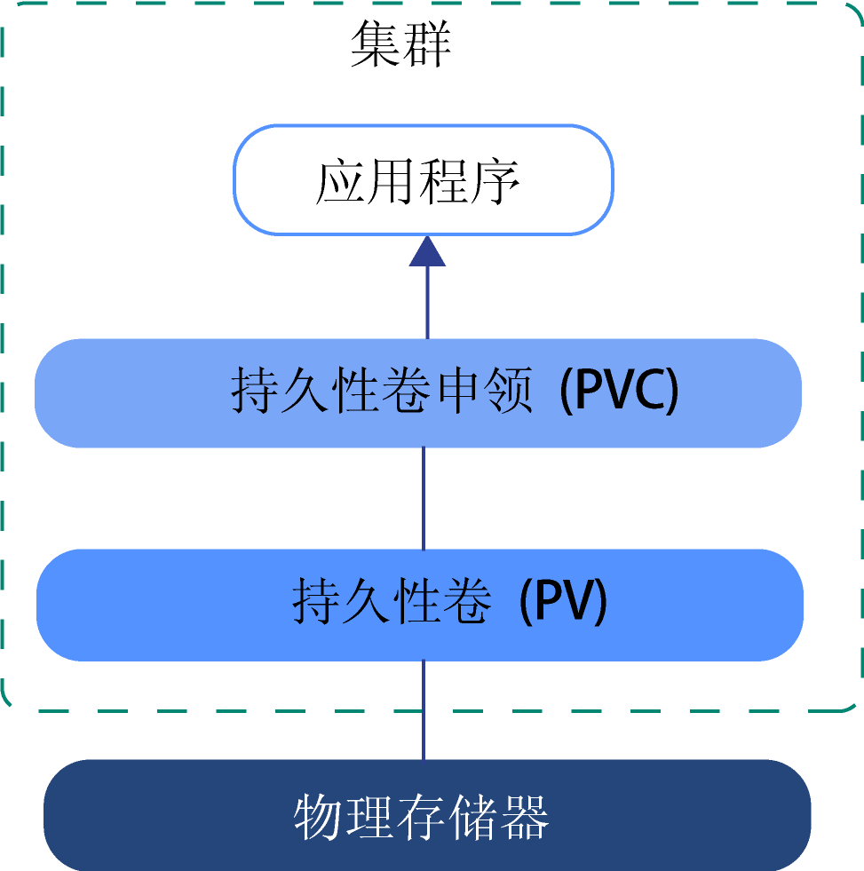
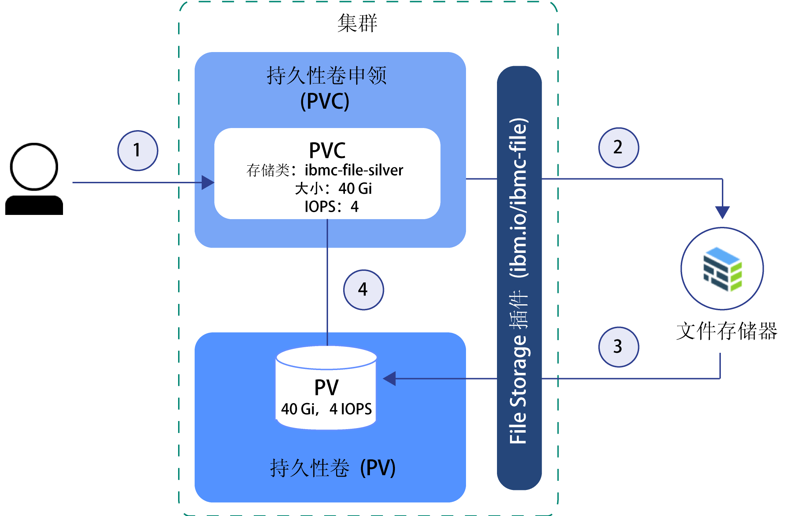
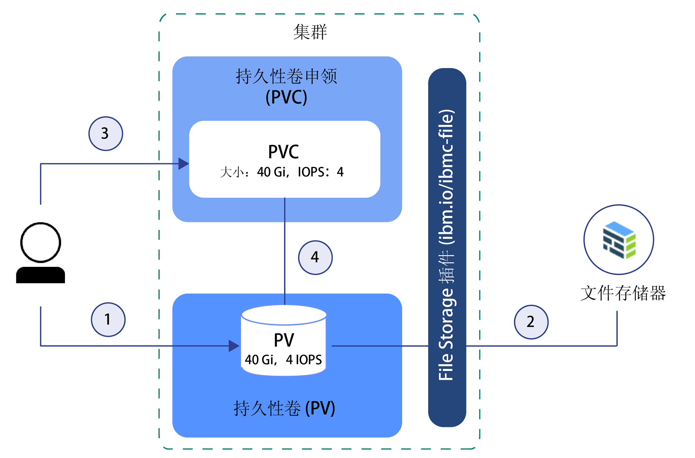

---

copyright:
  years: 2014, 2019
lastupdated: "2019-05-31"

keywords: kubernetes, iks

subcollection: containers

---

{:new_window: target="_blank"}
{:shortdesc: .shortdesc}
{:screen: .screen}
{:pre: .pre}
{:table: .aria-labeledby="caption"} 
{:codeblock: .codeblock}
{:tip: .tip}
{:note: .note}
{:important: .important}
{:deprecated: .deprecated}
{:download: .download}
{:preview: .preview}


# 了解 Kubernetes 存储器基础知识
{: #kube_concepts}

## 持久卷和持久卷声明
{: #pvc_pv}

开始供应存储器之前，请务必了解持久卷和持久卷声明 Kubernetes 概念以及如何在集群中使用持久卷和持久卷声明。
{: shortdesc}

下图显示了 Kubernetes 集群中的存储组件。



- **集群**</br>缺省情况下，每个集群都设置有一个插件，以[供应文件存储](/docs/containers?topic=containers-file_storage#add_file)。您可以选择安装其他附加组件，例如用于[块存储器](/docs/containers?topic=containers-block_storage)的附加组件。要在集群中使用存储器，必须创建持久卷声明、持久卷和物理存储器实例。删除集群时，可以选择是否删除相关的存储器实例。
- **应用程序**</br>要读取和写入存储器实例，必须将持久卷声明 (PVC) 安装到应用程序。不同的存储器类型具有不同的读写规则。例如，对于文件存储器，可以将多个 pod 安装到同一 PVC。块存储器随附 RWO (ReadWriteOnce) 访问方式，因此只能将存储器安装到一个 pod。
- **持久卷声明 (PVC)**</br>PVC 是用于供应具有特定类型和配置的持久性存储器的请求。要指定所需的持久性存储器类型模板，请使用 [Kubernetes 存储类](#storageclasses)。集群管理员可以定义存储类，也可以从 {{site.data.keyword.containerlong_notm}} 的预定义存储类中选择一个存储类。创建 PVC 后，系统会将该请求发送给 {{site.data.keyword.Bluemix}} 存储器提供者。然后，根据存储类中定义的配置来订购物理存储设备，并将其供应到您的 IBM Cloud Infrastructure (SoftLayer) 帐户中。如果请求的配置不存在，那么不会创建存储器。
- **持久卷 (PV)**</br>PV 是作为卷添加到集群的虚拟存储器实例。PV 会指向 IBM Cloud Infrastructure (SoftLayer) 帐户中的物理存储设备，并抽象化处理用于与存储设备进行通信的 API。要将 PV 安装到应用程序，必须具有匹配的 PVC。所安装的 PV 在容器的文件系统中会显示为文件夹。
- **物理存储器**</br>可用于持久存储数据的物理存储器实例。{{site.data.keyword.Bluemix_notm}} 中的物理存储器示例包括[文件存储器](/docs/containers?topic=containers-file_storage#file_storage)、[块存储器](/docs/containers?topic=containers-block_storage#block_storage)、[对象存储器](/docs/containers?topic=containers-object_storage#object_storage)以及可通过 [Portworx](/docs/containers?topic=containers-portworx#portworx) 用作 SDS 存储器的本地工作程序节点存储器。{{site.data.keyword.Bluemix_notm}} 为物理存储器实例提供了高可用性。但是，存储在物理存储器实例上的数据不会自动备份。有多种不同的方法可用于设置备份和复原解决方案，具体取决于所使用的存储器类型。

有关如何创建和使用 PVC、PV 和物理存储设备的更多信息，请参阅：
- [动态供应](#dynamic_provisioning)
- [静态供应](#static_provisioning)

## 动态供应
{: #dynamic_provisioning}

如果您希望开发者能够自由地根据需要供应存储器，请使用动态供应。
{: shortdesc}

**其运作方式如何？**</br>

动态供应是 Kubernetes 的一项本机功能，通过该功能，集群开发者可以订购具有预定义类型和配置的存储器，而无需了解有关如何供应物理存储设备的所有详细信息。要抽象化处理特定存储器类型的详细信息，集群管理员必须创建可供开发者使用的[存储类](#storageclasses)，或者使用随 {{site.data.keyword.Bluemix}} 存储器插件一起提供的存储类。

要订购存储器，必须创建 PVC。PVC 用于确定要供应的存储器的规范。创建 PVC 后，将自动创建存储设备和 PV。  

下图显示了如何在集群中动态供应文件存储器。此样本流程的工作方式与其他存储器类型（例如，块存储器）类似。

**使用预定义的银牌级存储类来动态供应文件存储器的样本流程**



1. 用户创建持久卷声明 (PVC)，在其中指定存储器类型、存储类、大小（以千兆字节计）、IOPS 数和计费类型。存储类用于确定所供应的存储器类型以及所允许的大小和 IOPS 的范围。在集群中创建 PVC 会自动触发所请求存储器类型的存储器插件，以供应具有给定规范的存储器。
2. 系统自动订购存储设备，并将其供应到您的 IBM Cloud Infrastructure (SoftLayer) 帐户中。此时，您的存储设备计费周期即会开始。
3. 存储器插件自动在集群中创建持久卷 (PV)。PV 是一种指向 IBM Cloud Infrastructure (SoftLayer) 帐户中实际存储设备的虚拟存储设备。
4. PVC 和 PV 彼此自动连接。PVC 和 PV 的阶段状态会更改为 `Bound`。现在，可以使用 PVC 将持久性存储器安装到应用程序。如果删除了 PVC，那么 PV 和相关存储器实例也会一起删除。</br>

**何时使用动态供应？**</br>

下面是动态供应的常见用例：
1. **按需供应存储器**：您可以让开发者自由地根据需要供应存储器，而无需预先为开发者提供持久性存储器，也无需为未使用的存储器付费。要确定开发者可以供应的存储器的类型，可以定义[存储类](#storageclasses)。
2. **自动创建 PVC、PV 和存储设备**：您希望自动供应和取消供应存储器，而无需集群管理员手动干预。
3. **经常创建和删除存储器**：您有可定期创建和除去持久性存储器的应用程序，或设置了具有此功能的持续交付管道。通过删除 PVC，可以除去使用非保留存储类动态供应的持久性存储器。

有关如何动态供应持久性存储器的更多信息，请参阅：
- [文件存储器](/docs/containers?topic=containers-file_storage#add_file)
- [块存储器](/docs/containers?topic=containers-block_storage#add_block)

## 静态供应
{: #static_provisioning}

如果您的 IBM Cloud Infrastructure (SoftLayer) 帐户中已有持久性存储设备，那么可以使用静态供应将存储器实例用于集群。
{: shortdesc}

**其运作方式如何？**</br>

静态供应是 Kubernetes 的一项本机功能，通过该功能，集群管理员可以将现有存储设备用于集群。集群管理员必须了解有关存储设备、其支持的配置和安装选项的详细信息。  

要使现有存储器可供集群用户使用，必须手动创建存储设备、PV 和 PVC。  

下图显示了如何在集群中静态供应文件存储器。此样本流程的工作方式与其他存储器类型（例如，块存储器）类似。

**用于静态供应文件存储器的样本流程**



1. 集群管理员收集有关现有存储设备的所有详细信息，并在集群中创建持久卷 (PV)。
2. 根据 PV 中的存储器详细信息，存储器插件将 PV 与 IBM Cloud Infrastructure (SoftLayer) 帐户中的存储设备连接在一起。
3. 集群管理员或开发者创建 PVC。由于 PV 和存储设备已存在，因此不需要在 PVC 中指定任何存储类。
4. 创建 PVC 后，存储器插件尝试将该 PVC 与现有 PV 相匹配。如果 PVC 和 PV 中使用的大小、IOPS 和访问方式的值相同，那么表示 PVC 与 PV 匹配。PVC 与 PV 匹配时，PVC 和 PV 的阶段状态会更改为 `Bound`。现在，可以使用 PVC 将持久性存储器安装到应用程序。删除 PVC 后，不会除去相应的 PV 和物理存储器实例。您必须分别除去 PVC、PV 和物理存储器实例。</br>

**何时使用静态供应？**</br>

下面是静态供应持久性存储器的常见用例：
1. **使保留的数据可供集群使用**：您已使用“动态供应”供应了具有保留存储类的持久性存储器。您除去了 PVC，但是相应的 PV、IBM Cloud Infrastructure (SoftLayer) 中的物理存储器以及数据仍然存在。您希望通过集群中的应用程序访问保留的数据。
2. **使用现有存储设备**：您直接在 IBM Cloud Infrastructure (SoftLayer) 帐户中供应了持久性存储器，并且希望在集群中使用此存储设备。
3. **在同一专区中的集群之间共享持久性存储器**：您为集群供应了持久性存储器。要与同一专区中的其他集群共享同一持久性存储器实例，必须在其他集群中手动创建 PV 和匹配的 PVC。**注：**只有集群和存储器实例位于同一专区中，才能在集群之间共享持久性存储器。
4. **在同一集群中的名称空间之间共享持久性存储器**：您在集群的名称空间中供应了持久性存储器。您希望将相同的存储器实例用于部署到集群中其他名称空间的应用程序 pod。

有关如何静态供应存储器的更多信息，请参阅：
- [文件存储器](/docs/containers?topic=containers-file_storage#file_predefined_storageclass)
- [块存储器](/docs/containers?topic=containers-block_storage#block_predefined_storageclass)

## 存储类
{: #storageclasses}

要动态供应持久性存储器，必须定义所需的存储器类型和配置。
{: shortdesc}

[Kubernetes 存储类 ](https://kubernetes.io/docs/concepts/storage/storage-classes/) 用于抽象化处理 {{site.data.keyword.Bluemix_notm}} 中支持的底层存储平台，可帮助您在集群中成功供应持久性存储器，而无需了解有关支持的大小、IOPS 或保留策略的所有详细信息。{{site.data.keyword.containerlong_notm}} 为支持的每种存储器都提供了预定义的存储类。每个存储类都是为了抽象化处理支持的存储层而设计的，允许您选择所需的大小、IOPS 和保留策略。

有关预定义的存储类规范，请参阅：
- [文件存储器](/docs/containers?topic=containers-file_storage#file_storageclass_reference)
- [块存储器](/docs/containers?topic=containers-block_storage#block_storageclass_reference)

找不到所需的内容？您也可以创建自己的定制存储类，以供应所需类型的存储器。
{: tip}

### 定制存储类
{: #customized_storageclass}

如果无法使用所提供的某个存储类，那么可以创建自己的定制存储类。您可能希望定制一个存储类来指定专区、文件系统类型、服务器类型或[卷绑定方式 ](https://kubernetes.io/docs/concepts/storage/storage-classes/#volume-binding-mode) 选项（仅限块存储器）等配置。
{: shortdesc}

1. 创建定制存储类。您可以基于某个预定义的存储类来创建，也可以查看我们的样本定制存储类。
   - 预定义的存储类：
     - [文件存储器](/docs/containers?topic=containers-file_storage#file_storageclass_reference)
     - [块存储器](/docs/containers?topic=containers-block_storage#block_storageclass_reference)
   - 样本定制存储类：
     - [文件存储器](/docs/containers?topic=containers-file_storage#file_custom_storageclass)
     - [块存储器](/docs/containers?topic=containers-block_storage#block_custom_storageclass)

2. 创建定制存储类。
   ```
    kubectl apply -f <local_file_path>
    ```
   {: pre}

3.  验证定制存储类是否已创建。
    ```
    kubectl get storageclasses                                                        
    ```
    {: pre}

4. 创建持久卷声明 (PVC) 以动态供应具有定制存储类的存储器。
   - [文件存储器](/docs/containers?topic=containers-file_storage#add_file)
   - [块存储器](/docs/containers?topic=containers-block_storage#add_block)

5. 验证 PVC 是否已创建并绑定到持久卷 (PV)。此过程可能需要几分钟才能完成。
   ```
   kubectl get pvc
   ```
   {: pre}

### 更改为或更新为其他存储类
{: #update_storageclass}

使用存储类来动态供应持久性存储器，就是供应具有特定配置的持久性存储器。存储类的名称或所供应的存储器类型都不能更改。但是，可以选择缩放存储器，如下表所示。
{: shortdesc}

<table>
<caption>{{site.data.keyword.containerlong_notm}} 存储解决方案的缩放选项概述</caption>
<thead>
<th>存储解决方案</th>
<th>缩放选项</th>
</thead>
<tbody>
<tr>
<td>文件存储器</td>
<td>您可以通过[修改现有卷](/docs/containers?topic=containers-file_storage#file_change_storage_configuration)来增加存储器大小和分配的 IOPS 数。</td>
</tr>
<tr>
<td>块存储器</td>
<td>您可以通过[修改现有卷](/docs/containers?topic=containers-block_storage#block_change_storage_configuration)来增加存储器大小和分配的 IOPS 数。</td>
</tr>
<tr>
<td>对象存储器</td>
<td>卷的大小可自动缩放，费用会按实际使用量进行收取。但是，卷的性能属性不能更改，因为这些属性是在 {{site.data.keyword.cos_full_notm}} 中创建存储区时所使用的存储类中定义的。要更改为其他存储类，必须使用所需的存储类来供应新的存储区。然后，将旧存储区中的数据复制到新存储区。</td>
</tr>
</tbody>
</table>


## 使用 Kubernetes 标签准备现有存储器以将其用于多专区集群
{: #storage_multizone}

如果将集群从单专区集群更新成了多专区集群，并且已有持久卷 (PV)，那么需要向 PV 添加 Kubernetes 专区和区域标签。标签可确保安装此存储器的 pod 会部署到持久性存储器所在的专区。
{:shortdesc}

仅当您的现有 PV 是在多专区功能可用之前创建的，才需要执行以下步骤。在多专区功能可用之后创建的 PV 会包含 Kubernetes 区域和专区标签。
{: note}

使用脚本来查找集群中的所有 PV，然后应用 Kubernetes `failure-domain.beta.kubernetes.io/region` 和 `failure-domain.beta.kubernetes.io/zone` 标签。如果 PV 已有标签，脚本不会覆盖现有值。

开始之前：
- [将 Kubernetes CLI 的目标指定为集群](/docs/containers?topic=containers-cs_cli_install#cs_cli_configure)。
- 如果有多个 VLAN 用于一个集群，有多个子网位于同一 VLAN 上或有一个多专区集群，那么必须针对 IBM Cloud Infrastructure (SoftLayer) 帐户启用[虚拟路由器功能 (VRF)](/docs/infrastructure/direct-link?topic=direct-link-overview-of-virtual-routing-and-forwarding-vrf-on-ibm-cloud#overview-of-virtual-routing-and-forwarding-vrf-on-ibm-cloud)，从而使工作程序节点可以在专用网络上相互通信。要启用 VRF，请[联系 IBM Cloud Infrastructure (SoftLayer) 客户代表](/docs/infrastructure/direct-link?topic=direct-link-overview-of-virtual-routing-and-forwarding-vrf-on-ibm-cloud#how-you-can-initiate-the-conversion)。如果无法或不想启用 VRF，请启用 [VLAN 生成](/docs/infrastructure/vlans?topic=vlans-vlan-spanning#vlan-spanning)。要执行此操作，您需要有**网络 > 管理网络 VLAN 生成**[基础架构许可权](/docs/containers?topic=containers-users#infra_access)，也可以请求帐户所有者来启用 VLAN 生成。要检查是否已启用 VLAN 生成，请使用 `ibmcloud ks vlan-spanning-get --region <region>` [命令](/docs/containers?topic=containers-cs_cli_reference#cs_vlan_spanning_get)。

更新现有 PV：

1.  通过运行脚本，将多专区标签应用于 PV。将 <mycluster> 替换为集群的名称。在出现提示时，确认更新 PV。

    ```
    bash <(curl -Ls https://raw.githubusercontent.com/IBM-Cloud/kube-samples/master/file-pv-labels/apply_pv_labels.sh) <mycluster>
    ```
    {: pre}

    **输出示例**：

    ```
    Retrieving cluster storage...
    OK

    Name:			mycluster
    ID:			  myclusterID1234
    State:			normal
    ...
    Addons
    Name                   Enabled
    storage-watcher-pod    true
    basic-ingress-v2       true
    customer-storage-pod   true
    us-south
    kube-config-dal10-storage.yml
    storage.yml
    dal10\n
    The persistent volumes which do not have region and zone labels will be updated with REGION=
    us-south and ZONE=dal10. Are you sure to continue (y/n)?y
    persistentvolume "pvc-ID-123456" labeled
    persistentvolume "pvc-ID-789101" labeled
    ['failure-domain.beta.kubernetes.io/region' already has a value (us-south), and --overwrite is false, 'failure-domain.beta.kubernetes.io/zone' already has a value (dal10), and --overwrite is false]
    ['failure-domain.beta.kubernetes.io/region' already has a value (us-south), and --overwrite is false, 'failure-domain.beta.kubernetes.io/zone' already has a value (dal10), and --overwrite is false]
    \nSuccessfully applied labels to persistent volumes which did not have region and zone labels.
    ```
    {: screen}

2.  验证标签是否已应用于 PV。

    1.  在上一个命令的输出中查找已添加标签的 PV 的标识。

        ```
        persistentvolume "pvc-ID-123456" labeled
        persistentvolume "pvc-ID-789101" labeled
        ```
        {: screen}

    2.  查看 PV 的区域和专区标签。

        ```
        kubectl describe pv pvc-ID-123456
        ```
        {: pre}

        **输出示例**：
        ```
        Name:		pvc-ID-123456
        Labels:		CapacityGb=4
        		Datacenter=dal10
            ...
        		failure-domain.beta.kubernetes.io/region=us-south
        		failure-domain.beta.kubernetes.io/zone=dal10
            ...
        ```
        {: screen}

**接下来要做什么？**

现在，您已为现有 PV 添加了标签，可以将 PV 安装到多专区集群了。有关更多信息，请参阅以下链接。
- 使用[现有 NFS 文件存储器](/docs/containers?topic=containers-file_storage#existing_file)
- 使用[现有块存储器](/docs/containers?topic=containers-block_storage#existing_block)
