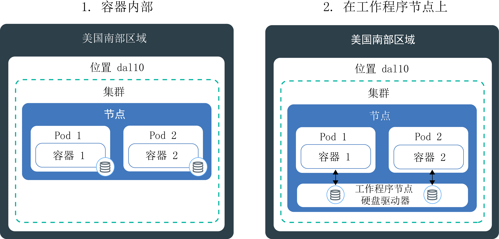
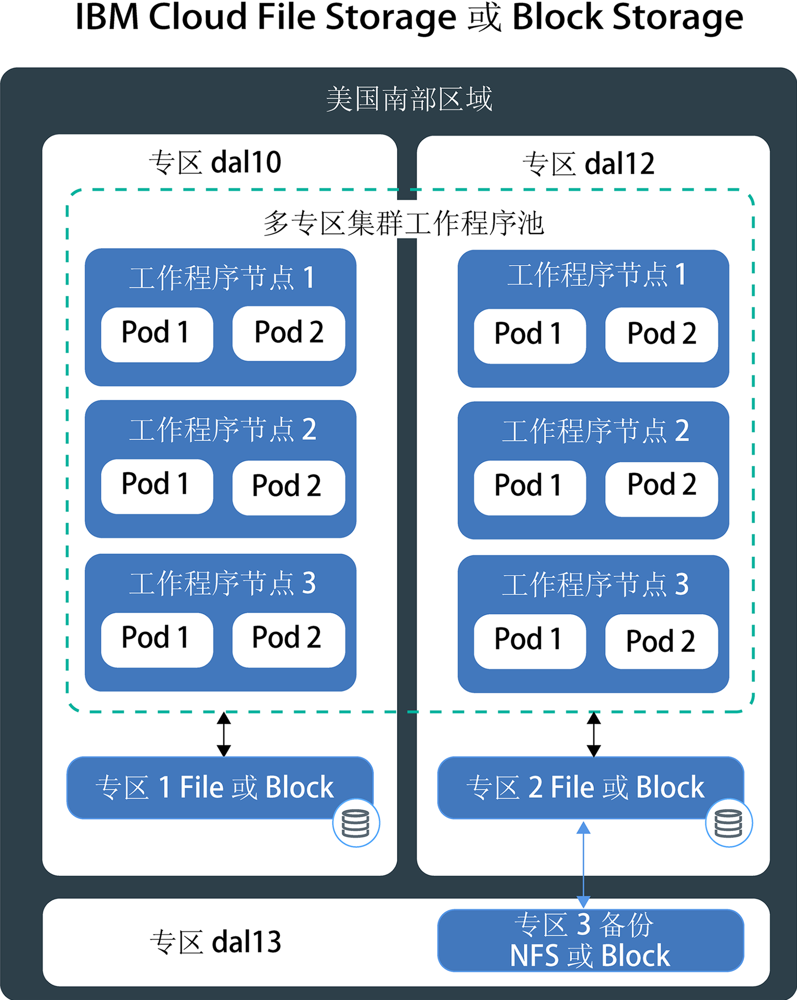
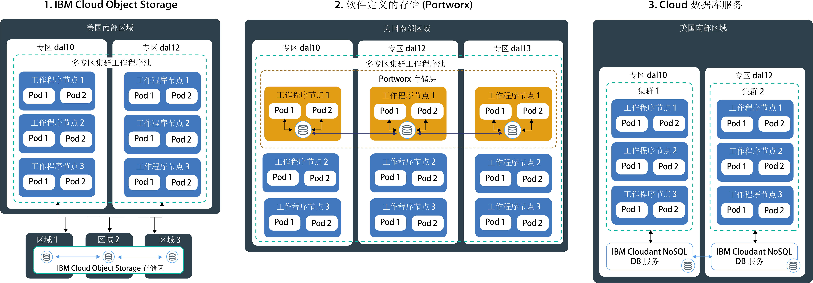

---

copyright:
  years: 2014, 2019
lastupdated: "2019-06-11"

keywords: kubernetes, iks

subcollection: containers

---

{:new_window: target="_blank"}
{:shortdesc: .shortdesc}
{:screen: .screen}
{:pre: .pre}
{:table: .aria-labeledby="caption"}
{:codeblock: .codeblock}
{:tip: .tip}
{:note: .note}
{:important: .important}
{:deprecated: .deprecated}
{:download: .download}
{:preview: .preview}

# 规划高可用性持久性存储器
{: #storage_planning}

## 选择存储解决方案
{: #choose_storage_solution}

您必须了解应用程序需求、要存储的数据类型以及访问此数据的频率，然后才能决定哪种类型的存储器是适合您的解决方案。
{: shortdesc}

1. 决定是必须永久存储数据，还是可以随时除去数据。
   - **持久性存储器**即使除去了容器、工作程序节点或集群，数据仍然必须可用。在以下场景中，请使用持久性存储器：
       - 有状态应用程序
       - 核心业务数据
       - 由于法律需求（例如，定义的保留期）而必须可用的数据
       - 审计
       - 必须在应用程序实例之间访问和共享的数据
   - **非持久性存储器：**除去容器、工作程序节点或集群时，可以除去数据。非持久性存储器通常用于日志记录信息（例如，系统日志或容器日志）、开发测试或要从主机的文件系统访问数据时。要查找可用非持久性存储选项的概述，请参阅[非持久性存储选项的比较](#non_persistent_overview)。

2. 如果必须持久存储数据，请分析应用程序是否需要特定类型的存储器。使用现有应用程序时，该应用程序可能设计为以下列其中一种方式存储数据：  
   - **在文件系统中：**数据可以作为目录中的文件进行存储。例如，可以将此文件存储在本地硬盘上。某些应用程序需要将数据存储在特定文件系统（如 `nfs` 或 `ext4`）中，以优化数据存储并实现性能目标。
   - **在数据库中：**数据必须存储在遵循特定模式的数据库中。某些应用程序随附可用于存储数据的数据库接口。例如，WordPress 已优化为可将数据存储在 MySQL 数据库中。在这些情况下，会为您选择存储器类型。

3. 如果应用程序对必须使用的存储器类型没有限制，请确定要存储的数据的类型。
   - **结构化数据：**可以存储在关系数据库中的数据，该数据库中有一个包含列和行的表。表中的数据可以使用键进行连接，并且由于采用了预定义的数据模型，因此数据通常易于访问。例如，电话号码、帐号、社会保障号或邮政编码。
   - **半结构化数据：**不适用于关系数据库的数据，但这类数据随附一些组织属性，可以用于更轻松地读取和分析这类数据。例如，CSV、XML 或 JSON 等标记语言文件。  
   - **非结构化数据：**不遵循组织模式的数据，这类数据过于复杂，无法存储在使用预定义数据模型的关系数据库中。要访问这类数据，需要高级工具和软件。例如，电子邮件消息、视频、照片、音频文件、演示文稿、社交媒体数据或 Web 页面。

   如果您有结构化和非结构化数据，请尝试将每种数据类型分别存储在为此数据类型设计的存储解决方案中。使用适合数据类型的存储解决方案可以轻松访问数据，并给予您高性能、可扩展性、耐久性和一致性等优点。
   {: tip}

4. 分析您希望如何访问数据。存储解决方案通常是为了支持读或写操作而设计并优化的。  
   - **只读：**数据为只读。您不想写入或更改数据。
   - **读写：**要读取、写入和更改数据。对于读取和写入的数据，了解操作是多读少写、多写少读还是读写均衡很重要。

4. 确定访问数据的频率。了解数据访问的频率可帮助您了解存储器所需的性能。例如，频繁访问的数据通常位于快速存储器上。
   - **热数据：**频繁访问的数据。常见用例是 Web 或移动应用程序。
   - **冷数据或温数据：**不经常访问（例如，每月一次或更低频率）的数据。常见用例是归档、短期数据保留或灾难恢复。
   - **冷数据：**极少访问的数据（如果有访问的话）。常见用例是归档、长期备份和历史数据。
   - **冻结数据：**不进行访问，但由于法律原因而需要保留的数据。

   如果无法预测频率或者频率并不遵循严格的模式，请确定工作负载是属于多读少写、多写少读还是读写均衡。然后，查看适合工作负载的存储选项，并调查哪个存储层为您提供所需的灵活性。例如，{{site.data.keyword.cos_full_notm}} 提供了 `flex` 存储类，该存储类会考虑在一个月内访问数据的频率，并基于对此度量的考量来优化按月计费。
   {: tip}

5. 调查数据是否必须在多个应用程序实例、专区或区域中共享。
   - **跨 pod 访问：**使用 Kubernetes 持久性卷访问存储器时，可以确定可同时安装该卷的 pod 的数量。某些存储解决方案（例如，Block Storage）一次只能由一个 pod 进行访问。通过其他存储解决方案，可以在多个 pod 中共享卷。
   - **跨专区和区域访问：**您可能需要数据可跨专区或区域进行访问。某些存储解决方案（例如，File Storage 和 Block Storage）是特定于数据中心的，无法在多专区集群设置中跨专区共享。

   如果要使数据可以在各个专区或区域中进行访问，请确保咨询法律部门，以验证您的数据是否可以存储在多个专区或者不同的国家或地区中。
   {: note}

6. 了解影响您选择的其他存储特征。
   - **一致性：**保证读操作返回文件的最新版本。保证始终收到最新版本的文件时，存储解决方案可以提供`强一致性`；或者，在读操作可能无法返回最新版本时，存储解决方案可以提供`最终一致性`。通常，在必须首先在所有实例中复制写操作的地理分布式系统上可获得最终一致性。
   - **性能：**完成读或写操作所需的时间。
   - **耐久性：**保证落实到存储器的写操作能持久生存，不会被损坏或丢失，即使同时将数千兆字节或太字节的数据写入存储器时也不例外。
   - **弹性：**能够从中断恢复并继续运行，即使硬件或软件组件发生故障时也不例外。例如，物理存储器遇到断电、网络中断或在自然灾害期间被破坏的情况。
   - **可用性：**能够提供对数据的访问，即使数据中心或区域不可用时也不例外。通常通过添加冗余和设置故障转移机制来实现数据的可用性。
   - **可扩展性：**能够根据需求扩展容量和定制性能。
   - **加密：**在未经授权的用户访问数据时，掩蔽数据以阻止查看。

7. [查看可用的持久性存储器解决方案](#persistent_storage_overview)，并选取最适合您的应用程序和数据需求的解决方案。

## 非持久性存储选项的比较
{: #non_persistent_overview}

如果数据不需要持久存储，或者要对应用程序组件进行单元测试，那么可以使用非持久性存储选项。
{: shortdesc}

下图显示 {{site.data.keyword.containerlong_notm}} 中可用的非持久性数据存储选项。这些选项可用于免费和标准集群。

<table>
<thead>
<th style="text-align:left">特征</th>
<th style="text-align:left">容器内</th>
<th style="text-align:left">在工作程序节点的主磁盘或辅助磁盘上</th>
</thead>
<tbody>
<tr>
<td style="text-align:left">支持多专区</td>
<td style="text-align:left">否</td>
<td style="text-align:left">否</td>
</tr>
<tr>
<td style="text-align:left">数据类型</td>
<td style="text-align:left">所有</td>
<td style="text-align:left">所有</td>
</tr>
<tr>
<td style="text-align:left">容量</td>
<td style="text-align:left">限于工作程序节点的可用辅助磁盘。要限制 pod 使用的辅助存储量，请使用[临时存储器 ](https://kubernetes.io/docs/concepts/configuration/manage-compute-resources-container/#local-ephemeral-storage) 的资源请求和限制。</td>
<td style="text-align:left">限于工作程序节点在主磁盘 (`hostPath`) 或辅助磁盘 (`emptyDir`) 上的可用空间。要限制 pod 使用的辅助存储量，请使用[临时存储器 ](https://kubernetes.io/docs/concepts/configuration/manage-compute-resources-container/#local-ephemeral-storage) 的资源请求和限制。</td>
</tr>
<tr>
<td style="text-align:left">数据访问模式</td>
<td style="text-align:left">任何频率的读写操作</td>
<td style="text-align:left">任何频率的读写操作</td>
</tr>
<tr>
<td style="text-align:left">访问</td>
<td style="text-align:left">通过容器的本地文件系统</td>
<td style="text-align:left"><ul style="margin:0px 0px 0px 20px; padding:0px"><li style="margin:0px; padding:0px">通过 [Kubernetes <code>hostPath</code> 卷 ](https://kubernetes.io/docs/concepts/storage/volumes/#hostpath) 来访问工作程序节点主存储器。</li><li style="margin:0px; padding:0px">通过 [Kubernetes <code>emptyDir</code> 卷 ](https://kubernetes.io/docs/concepts/storage/volumes/#emptydir) 来访问工作程序节点辅助存储器。</li></ul></td>
</tr>
<tr>
<td style="text-align:left">性能</td>
<td style="text-align:left">高</td>
<td style="text-align:left">使用 SSD 时，性能高，等待时间更短</td>
</tr>
<tr>
<td style="text-align:left">一致性</td>
<td style="text-align:left">强</td>
<td style="text-align:left">强</td>
</tr>
<tr>
<td style="text-align:left">弹性</td>
<td style="text-align:left">低</td>
<td style="text-align:left">低</td>
</tr>
<tr>
<td style="text-align:left">可用性</td>
<td style="text-align:left">特定于容器</td>
<td style="text-align:left">特定于工作程序节点</td>
</tr>
<tr>
<td style="text-align:left">可扩展性</td>
<td style="text-align:left">难以扩展，因为限于工作程序节点的辅助磁盘容量</td>
<td style="text-align:left">难以扩展，因为限于工作程序节点的主磁盘容量和辅助磁盘容量</td>
</tr>
<tr>
<td style="text-align:left">耐久性</td>
<td style="text-align:left">容器崩溃或除去容器时，数据会丢失。</td>
<td style="text-align:left">在以下情况下，会丢失 <code>hostPath</code> 或 <code>emptyDir</code> 卷中的数据：<ul><li>工作程序节点已删除。</li><li>工作程序节点已重新装入或更新。</li><li>集群已删除。</li><li>{{site.data.keyword.Bluemix_notm}} 帐户进入暂挂状态。</li></ul>

此外，在以下情况下，也将除去 <code>emptyDir</code> 卷中的数据：<ul><li>从工作程序节点中永久删除分配的 pod。</li><li>在其他工作程序节点上安排了分配的 pod。</li></ul>
</tr>
<tr>
<td style="text-align:left">常见用例</td>
<td style="text-align:left"><ul style="margin:0px 0px 0px 20px; padding:0px"><li style="margin:0px; padding:0px">本地映像高速缓存</li><li style="margin:0px; padding:0px">容器日志</li></ul></td>
<td style="text-align:left"><ul style="margin:0px 0px 0px 20px; padding:0px"><li style="margin:0px; padding:0px">高性能本地高速缓存</li><li style="margin:0px; padding:0px">从工作程序节点文件系统访问文件</li><li style="margin:0px; padding:0px">单元测试</li></ul></td>
</tr>
<tr>
<td style="text-align:left">非理想用例</td>
<td style="text-align:left"><ul style="margin:0px 0px 0px 20px; padding:0px"><li style="margin:0px; padding:0px">持久数据存储</li><li style="margin:0px; padding:0px">在容器之间共享数据</li></ul></td>
<td style="text-align:left"><ul style="margin:0px 0px 0px 20px; padding:0px"><li style="margin:0px; padding:0px">持久数据存储</li></ul></td>
</tr>
</tbody>
</table>

## 单专区集群持久性存储选项的比较
{: #single_zone_persistent_storage}

如果您有单专区集群，那么可以在 {{site.data.keyword.containerlong_notm}} 中的以下选项之间进行选择，以快速访问您的数据。为了获得更高的可用性，请使用专为[地理分布式数据](#persistent_storage_overview)而设计的存储选项，并尽可能针对您的需求创建多专区集群。
{: shortdesc}

持久性数据存储选项仅可用于标准集群。
{: note}

下图显示了 {{site.data.keyword.containerlong_notm}} 中用于在单个集群中永久存储数据的选项。

<table>
<thead>
<th style="text-align:left">特征</th>
<th style="text-align:left">File</th>
<th style="text-align:left">Block</th>
</thead>
<tbody>
<tr>
<td style="text-align:left">支持多专区</td>
<td style="text-align:left">否，因为特定于数据中心。除非实现自己的数据复制，否则不能跨专区共享数据。</td>
<td style="text-align:left">否，因为特定于数据中心。除非实现自己的数据复制，否则不能跨专区共享数据。</td>
</tr>
<tr>
<td style="text-align:left">理想的数据类型</td>
<td style="text-align:left">所有</td>
<td style="text-align:left">所有</td>
</tr>
<tr>
<td style="text-align:left">数据使用模式</td>
<td style="text-align:left"><ul style="margin:0px 0px 0px 20px; padding:0px"><li style="margin:0px; padding:0px">随机读写操作</li><li style="margin:0px; padding:0px">顺序读写操作</li></ul></td>
<td style="text-align:left"><ul style="margin:0px 0px 0px 20px; padding:0px"><li style="margin:0px; padding:0px">随机读写操作</li><li style="margin:0px; padding:0px">写密集型工作负载</li></ul></td>
</tr>
<tr>
<td style="text-align:left">访问</td>
<td style="text-align:left">通过已安装卷上的文件系统</td>
<td style="text-align:left">通过已安装卷上的文件系统</td>
</tr>
<tr>
<td style="text-align:left">支持的 Kubernetes 访问写操作</td>
<td style="text-align:left"><ul style="margin:0px 0px 0px 20px; padding:0px"><li style="margin:0px; padding:0px">ReadWriteMany (RWX)</li><li style="margin:0px; padding:0px"> ReadOnlyMany (ROX)</li><li style="margin:0px; padding:0px">ReadWriteOnce (RWO)</li></ul></td>
<td style="text-align:left"><ul style="margin:0px 0px 0px 20px; padding:0px"><li style="margin:0px; padding:0px">ReadWriteOnce (RWO)</li></ul></td>
</tr>
<tr>
<td style="text-align:left">性能</td>
<td style="text-align:left">由于分配了 IOPS 和大小，因此可预测。IOPS 在访问卷的 pod 之间共享。</td>
<td style="text-align:left">由于分配了 IOPS 和大小，因此可预测。IOPS 不在 pod 之间共享。</td>
</tr>
<tr>
<td style="text-align:left">一致性</td>
<td style="text-align:left">强</td>
<td style="text-align:left">强</td>
</tr>
<tr>
<td style="text-align:left">耐久性</td>
<td style="text-align:left">高</td>
<td style="text-align:left">高</td>
</tr>
<tr>
<td style="text-align:left">弹性</td>
<td style="text-align:left">中等，因为特定于数据中心。File Storage 服务器由 IBM 通过冗余联网进行集群。</td>
<td style="text-align:left">中等，因为特定于数据中心。Block Storage 服务器由 IBM 通过冗余联网进行集群。</td>
</tr>
<tr>
<td style="text-align:left">可用性</td>
<td style="text-align:left">中等，因为特定于数据中心。</td>
<td style="text-align:left">中等，因为特定于数据中心。</td>
</tr>
<tr>
<td style="text-align:left">可扩展性</td>
<td style="text-align:left">难以扩展到数据中心之外。无法更改现有存储层。</td>
<td style="text-align:left">难以扩展到数据中心之外。无法更改现有存储层。</td>
</tr>
<tr>
<td style="text-align:left">加密</td>
<td style="text-align:left">静态</td>
<td style="text-align:left">静态</td>
</tr>
<tr>
<td style="text-align:left">常见用例</td>
<td style="text-align:left"><ul style="margin:0px 0px 0px 20px; padding:0px"><li style="margin:0px; padding:0px">海量或单个文件存储</li><li style="margin:0px; padding:0px">文件在单专区集群中共享</li></ul></td>
<td style="text-align:left"><ul style="margin:0px 0px 0px 20px; padding:0px"><li style="margin:0px; padding:0px">有状态集</li><li style="margin:0px; padding:0px">运行自己的数据库时备份存储器</li><li style="margin:0px; padding:0px">高性能访问单个 pod</li></ul></td>
</tr>
<tr>
<td style="text-align:left">非理想用例</td>
<td style="text-align:left"><ul style="margin:0px 0px 0px 20px; padding:0px"><li style="margin:0px; padding:0px">多专区集群</li><li style="margin:0px; padding:0px">地理分布式数据</li></ul></td>
<td style="text-align:left"><ul style="margin:0px 0px 0px 20px; padding:0px"><li style="margin:0px; padding:0px">多专区集群</li><li style="margin:0px; padding:0px">地理分布式数据</li><li style="margin:0px; padding:0px">跨多个应用程序实例共享数据</li></ul></td>
</tr>
</tbody>
</table>

## 多专区集群持久性存储选项的比较
{: #persistent_storage_overview}

如果您有多专区集群，请在以下持久性存储选项之间进行选择，以从跨专区分布的工作程序节点访问数据。
{: shortdesc}

持久性数据存储选项仅可用于标准集群。

要改为将集群连接到内部部署数据库吗？请参阅[设置到集群的 VPN 连接](/docs/containers?topic=containers-vpn#vpn)。
{: tip}

下图显示了 {{site.data.keyword.containerlong_notm}} 中用于在多专区集群中永久存储数据并使数据高度可用的选项。您可以在单专区集群中使用这些选项，但可能无法获得应用程序所需的高可用性优点。

<table>
<thead>
<th style="text-align:left">特征</th>
<th style="text-align:left">Object</th>
<th style="text-align:left">SDS (Portworx)</th>
<th style="text-align:left">{{site.data.keyword.Bluemix_notm}} 数据库</th>
</thead>
<tbody>
<tr>
<td style="text-align:left">支持多专区</td>
<td style="text-align:left">是</td>
<td style="text-align:left">是</td>
<td style="text-align:left">是</td>
</tr>
<tr>
<td style="text-align:left">理想的数据类型</td>
<td style="text-align:left">半结构化数据和非结构化数据</td>
<td style="text-align:left">所有</td>
<td style="text-align:left">取决于 DBaaS</td>
</tr>
<tr>
<td style="text-align:left">数据使用模式</td>
<td style="text-align:left"><ul style="margin:0px 0px 0px 20px; padding:0px"><li style="margin:0px; padding:0px">读密集型工作负载</li><li style="margin:0px; padding:0px">很少或没有写操作</li></ul></td>
<td style="text-align:left"><ul style="margin:0px 0px 0px 20px; padding:0px"><li style="margin:0px; padding:0px">写密集型工作负载</li><li style="margin:0px; padding:0px">随机读写操作</li><li style="margin:0px; padding:0px">顺序读写操作</li></ul></td>
<td style="text-align:left"><ul style="margin:0px 0px 0px 20px; padding:0px"><li style="margin:0px; padding:0px">读写密集型工作负载</li></ul></td>
</tr>
<tr>
<td style="text-align:left">访问</td>
<td style="text-align:left">通过已安装卷（插件）上的文件系统或通过应用程序中的 REST API</td>
<td style="text-align:left">通过已安装卷上的文件系统或 NFS 客户机来访问卷</td>
<td style="text-align:left">通过应用程序中的 REST API</td>
</tr>
<tr>
<td style="text-align:left">支持的 Kubernetes 访问写操作</td>
<td style="text-align:left"><ul style="margin:0px 0px 0px 20px; padding:0px"><li style="margin:0px; padding:0px">ReadWriteMany (RWX)</li><li style="margin:0px; padding:0px"> ReadOnlyMany (ROX)</li><li style="margin:0px; padding:0px">ReadWriteOnce (RWO)</li></ul></td>
<td style="text-align:left">所有</td>
<td style="text-align:left"><ul style="margin:0px 0px 0px 20px; padding:0px"><li style="margin:0px; padding:0px">不适用，因为是从应用程序直接访问</li></ul></td>
</tr>
<tr>
<td style="text-align:left">性能</td>
<td style="text-align:left">对于读操作，性能高。由于在使用非 SDS 机器时分配了 IOPS 和大小，因此可预测。</td>
<td style="text-align:left"><ul style="margin:0px 0px 0px 20px; padding:0px"><li style="margin:0px; padding:0px">使用 SDS 机器时，顺序读写操作的性能接近于裸机。</li><li style="margin:0px; padding:0px">提供[概要文件 ](https://docs.portworx.com/portworx-install-with-kubernetes/storage-operations/create-pvcs/dynamic-provisioning/#using-dynamic-provisioning) 来运行高性能数据库</li><li style="margin:0px; padding:0px">可以创建具有不同性能概要文件的存储层，供应用程序从中选择概要文件。</li></ul> </td>
<td style="text-align:left">如果部署到应用程序所在的数据中心，那么性能高。</td>
</tr>
<tr>
<td style="text-align:left">一致性</td>
<td style="text-align:left">最终</td>
<td style="text-align:left">强</td>
<td style="text-align:left">取决于 DBaaS</td>
</tr>
<tr>
<td style="text-align:left">耐久性</td>
<td style="text-align:left">数据切片分散在存储节点集群上时，耐久性非常高。每个节点只存储一部分数据。</td>
<td style="text-align:left">非常高，因为在任何时候都维护数据的三个副本。</td>
<td style="text-align:left">高</td>
</tr>
<tr>
<td style="text-align:left">弹性</td>
<td style="text-align:left">数据切片分散在三个专区或区域时，弹性高。仅在单个专区中设置时，弹性中等。</td>
<td style="text-align:left">设置为在三个专区中进行复制时，弹性高。仅在单个专区中存储数据时，弹性中等。</td>
<td style="text-align:left">取决于 DBaaS 和设置。</td>
</tr>
<tr>
<td style="text-align:left">可用性</td>
<td style="text-align:left">高，因为跨专区或区域进行分布。</td>
<td style="text-align:left">在跨不同专区的三个工作程序节点中复制数据时，可用性高。</td>
<td style="text-align:left">如果设置了多个实例，可用性为高。</td>
</tr>
<tr>
<td style="text-align:left">可扩展性</td>
<td style="text-align:left">自动缩放</td>
<td style="text-align:left">通过调整卷大小来提高卷容量。要增加总体存储层容量，必须添加工作程序节点或远程块存储器。这两种场景都需要用户来监视容量。</td>
<td style="text-align:left">自动缩放</td>
</tr>
<tr>
<td style="text-align:left">加密</td>
<td style="text-align:left">动态和静态</td>
<td style="text-align:left">自带密钥通过 {{site.data.keyword.keymanagementservicelong_notm}} 来保护动态和静态数据。</td>
<td style="text-align:left">静态</td>
</tr>
<tr>
<td style="text-align:left">常见用例</td>
<td style="text-align:left"><ul style="margin:0px 0px 0px 20px; padding:0px"><li style="margin:0px; padding:0px">多专区集群</li><li style="margin:0px; padding:0px">地理分布式数据</li><li style="margin:0px; padding:0px">静态大数据</li><li style="margin:0px; padding:0px">静态多媒体内容</li><li style="margin:0px; padding:0px">Web 应用程序</li><li style="margin:0px; padding:0px">备份</li><li style="margin:0px; padding:0px">归档</li></ul></td>
<td style="text-align:left"><ul style="margin:0px 0px 0px 20px; padding:0px"><li style="margin:0px; padding:0px">有状态集</li><li style="margin:0px; padding:0px">地理分布式数据</li><li style="margin:0px; padding:0px">跨多个云提供者运行应用程序时的常用存储解决方案</li><li style="margin:0px; padding:0px">运行自己的数据库时备份存储器</li><li style="margin:0px; padding:0px">高性能访问单个 pod</li><li style="margin:0px; padding:0px">跨多个 pod 和工作程序节点的共享存储器访问</li></ul></td>
<td style="text-align:left"><ul style="margin:0px 0px 0px 20px; padding:0px"><li style="margin:0px; padding:0px">多专区集群</li><li style="margin:0px; padding:0px">关系数据库和非关系数据库</li><li style="margin:0px; padding:0px">地理分布式数据</li></ul></td>
</tr>
<tr>
<td style="text-align:left">非理想用例</td>
<td style="text-align:left"><ul style="margin:0px 0px 0px 20px; padding:0px"><li style="margin:0px; padding:0px">写密集型工作负载</li><li style="margin:0px; padding:0px">随机写操作</li><li style="margin:0px; padding:0px">增量数据更新</li><li style="margin:0px; padding:0px">事务数据库</li></ul></td>
<td style="text-align:left">不适用</td>
<td style="text-align:left"><ul style="margin:0px 0px 0px 20px; padding:0px"><li style="margin:0px; padding:0px">设计为写入文件系统的应用程序</li></ul></td>
</tr>
</tbody>
</table>
