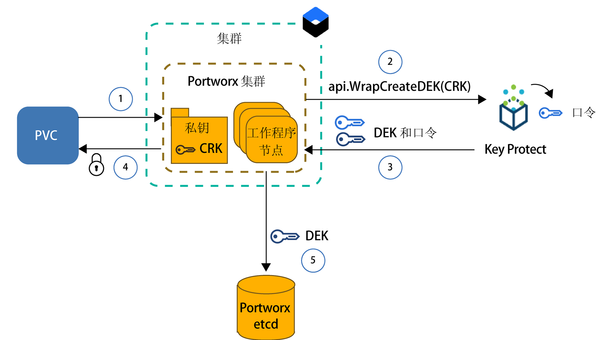
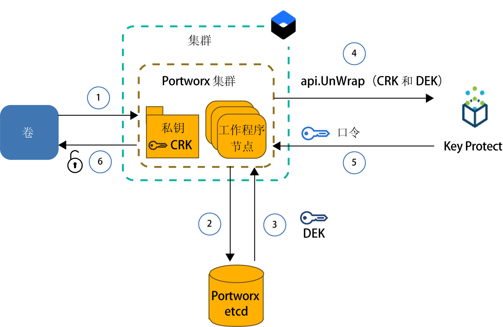

---

copyright:
  years: 2014, 2019
lastupdated: "2019-05-31"

keywords: kubernetes, iks, local persistent storage

subcollection: containers

---

{:new_window: target="_blank"}
{:shortdesc: .shortdesc}
{:screen: .screen}
{:pre: .pre}
{:table: .aria-labeledby="caption"}
{:codeblock: .codeblock}
{:tip: .tip}
{:note: .note}
{:important: .important}
{:deprecated: .deprecated}
{:download: .download}
{:preview: .preview}


# 使用 Portworx 在软件定义的存储 (SDS) 上存储数据
{: #portworx}

[Portworx ](https://portworx.com/products/introduction/) 是一种高可用性软件定义的存储解决方案，可用于管理容器化数据库和其他有状态应用程序的本地持久性存储器，或者在多个专区的 pod 之间共享数据。
{: shortdesc}

**什么是软件定义的存储 (SDS)？**</br>SDS 解决方案会对连接到集群中工作程序节点的各种类型、大小或来自不同供应商的存储设备进行抽象化处理。在硬盘上具有可用存储器的工作程序节点会添加为存储集群的节点。在此集群中，会对物理存储器进行虚拟化，并将其作为虚拟存储池显示给用户。存储集群由 SDS 软件进行管理。如果数据必须存储在存储集群上，那么 SDS 软件会决定在何处存储数据以实现最高可用性。虚拟存储器随附一组常用的功能和服务，您可以利用这些功能和服务，而无需关注实际底层存储体系结构。

**Portworx 是如何运作的？**</br>Portworx 将连接到工作程序节点的可用存储器聚集在一起，并创建统一的持久存储层，供要在集群中运行的容器化数据库或其他有状态应用程序使用。通过在多个工作程序节点上使用每个容器级别卷的卷复制，Portworx 可确保跨专区的数据持久性和数据可访问性。

此外，Portworx 还随附可用于有状态应用程序的其他功能，例如卷快照、卷加密、隔离，以及集成的 Kubernetes 存储编排器 (Stork)，用于确保以最佳方式布置集群中的卷。有关更多信息，请参阅 [Portworx 文档 ](https://docs.portworx.com/)。

**{{site.data.keyword.containerlong_notm}} 中的哪种工作程序节点类型模板适用于 Portworx？**</br>
{{site.data.keyword.containerlong_notm}} 提供了针对[软件定义的存储 (SDS) 使用情况](/docs/containers?topic=containers-planning_worker_nodes#sds)进行优化的裸机工作程序节点类型模板，这些类型模板随附一个或多个可用于 Portworx 存储层的未格式化且未安装的原始本地磁盘。您使用随附 10 Gbps 网络速度的 SDS 工作程序节点机器时，Portworx 的性能最佳。

**如果要在非 SDS 工作程序节点上运行 Portworx 该怎么做？**</br> 您可以在非 SDS 工作程序节点类型模板上安装 Portworx，但可能无法获得应用程序所需的性能优点。非 SDS 工作程序节点可以是虚拟或裸机。如果要使用虚拟机，请使用工作程序节点类型模板 `b2c.16x64` 或更好版本。类型模板为 `b3c.4x16` 或 `u3c.2x4` 的虚拟机没有提供 Portworx 正常工作所需的资源。请记住，虚拟机随附的网速是 1000 Mbps，这不足以使 Portworx 达到理想性能。裸机机器随附的计算资源和网络速度足以满足 Portworx 的需求，但您必须先[添加未格式化且未安装的原始块存储器](#create_block_storage)，然后才能使用这些机器。

**如何确保数据是以高可用性方式存储的？**</br>在 Portworx 集群中需要至少有 3 个工作程序节点，这样 Portworx 才能跨节点复制数据。通过跨工作程序节点复制数据，Portworx 可以确保万一发生故障，有状态应用程序可以重新安排到其他工作程序节点，而不会丢失数据。要实现更高可用性，请使用[多专区集群](/docs/containers?topic=containers-ha_clusters#multizone)，并跨 3 个或更多专区中的 SDS 工作程序节点复制卷。

**哪种卷拓扑可为 pod 提供最佳性能？**</br>在集群中运行有状态应用程序时，最大挑战之一是确保在容器或整个主机出现故障时，可以将容器重新安排到其他主机上。在 Docker 中，容器必须重新安排到其他主机上时，卷不会移至新主机。可以将 Portworx 配置为以 `hyper-converged` 方式运行，以确保计算资源和存储器始终位于同一工作程序节点上。必须对应用程序进行重新安排时，Portworx 会将应用程序移至其中一个卷副本所在的工作程序节点，以确保有状态应用程序的本地磁盘访问速度和最佳性能。以 `hyper-converged` 方式运行可为 pod 提供最佳性能，但需要存储器在集群中的所有工作程序节点上可用。

此外，还可以选择仅将一部分工作程序节点用于 Portworx 存储层。例如，您可能有两个工作程序池，一个包含随附本地原始块存储器的 SDS 工作程序节点，另一个包含未随附本地存储器的虚拟工作程序节点。安装 Portworx 时，会将 Portworx pod 安排到集群中的每个工作程序节点上，以作为守护程序集的一部分。由于 SDS 工作程序节点具有本地存储器，因此这些工作程序节点仅会包含在 Portworx 存储层中。虚拟工作程序节点因缺少本地存储器，不作为存储节点包含在内。但是，将应用程序 pod 部署到虚拟工作程序节点时，此 pod 仍可以使用 Portworx 守护程序集 pod 来访问物理存储在 SDS 工作程序节点上的数据。此设置称为 `storage-heavy`，提供的性能比 `hyper-converged` 设置略慢，因为虚拟工作程序节点必须通过专用网络与 SDS 工作程序节点进行对话来访问数据。

**供应 Portworx 时需要什么？**</br>{{site.data.keyword.containerlong}} 提供了针对 SDS 使用情况进行优化的工作程序节点类型模板，这些类型模板随附一个或多个可用于存储数据的未格式化且未安装的原始本地磁盘。您使用随附 10 Gbps 网络速度的 [SDS 工作程序节点机器](/docs/containers?topic=containers-planning_worker_nodes#sds)时，Portworx 的性能最佳。然而，您可以在非 SDS 工作程序节点类型模板上安装 Portworx，但可能无法获得应用程序所需的性能优点。工作程序节点成功运行 Portworx 的最低需求包括：
- 4 个 CPU 核心
- 4 GB 内存
- 128 GB 未格式化的原始存储器
- 10 Gbps 网络速度

**必须计划哪些限制？**</br>Portworx 可用于设置为使用公用网络连接的标准集群。如果集群无法访问公用网络（例如，防火墙后面的专用集群或仅启用了专用服务端点的集群），那么除非在 TCP 端口 443 上打开所有输出网络流量，或者启用公共服务端点，否则无法在集群中使用 Portworx。


一切准备就绪？首先，[创建包含具有至少 3 个工作程序节点的 SDS 工作程序池的集群](/docs/containers?topic=containers-clusters#clusters_ui)。如果要将非 SDS 工作程序节点包含在 Portworx 集群中，请向每个工作程序节点[添加原始块存储器](#create_block_storage)。准备好集群后，在集群中[安装 Portworx Helm chart](#install_portworx)，并创建第一个超融合存储集群。  

## 为非 SDS 工作程序节点创建未格式化且未安装的原始块存储器
{: #create_block_storage}

使用针对[软件定义的存储 (SDS) 使用情况](/docs/containers?topic=containers-planning_worker_nodes#sds)进行优化的工作程序节点类型模板时，Portworx 能以最佳性能运行。但是，如果您无法或不想使用 SDS 工作程序节点，那么可以选择在非 SDS 工作程序节点类型模板上安装 Portworx。请记住，非 SDS 工作程序节点未针对 Portworx 进行优化，因此可能无法提供应用程序所需的性能优点。
{: shortdesc}

要将非 SDS 工作程序节点包含在 Portworx 集群中，必须使用 {{site.data.keyword.Bluemix_notm}} Block Volume Attacher 插件将未格式化且未安装的原始块存储设备添加到工作程序节点。不能使用 Kubernetes 持久卷声明 (PVC) 来供应原始块存储器，因为 {{site.data.keyword.containerlong_notm}} 会对块存储设备自动进行格式化。Portworx 仅支持块存储器。不能将用于安装文件存储器或对象存储器的非 SDS 工作程序节点用于 Portworx 数据层。

如果集群中有 SDS 工作程序节点类型模板，并且您希望仅使用这些工作程序节点来创建 Portworx 存储层，那么可以完全跳过此步骤，而继续[设置 Portworx 数据库](#portworx_database)。
{: note}

1. [安装 {{site.data.keyword.Bluemix_notm}} Block Volume Attacher 插件](/docs/containers?topic=containers-utilities#block_storage_attacher)。
2. 如果要向所有工作程序节点添加具有相同配置的块存储器，请使用 {{site.data.keyword.Bluemix_notm}} Block Volume Attacher 插件[自动添加块存储器](/docs/containers?topic=containers-utilities#automatic_block)。要添加具有不同配置的块存储器，请将块存储器仅添加到一部分工作程序节点；或者，要拥有对供应过程的更多控制权，请[手动添加块存储器](/docs/containers?topic=containers-utilities#manual_block)。
3. [连接块存储器](/docs/containers?topic=containers-utilities#attach_block)至工作程序节点。

## 获取 Portworx 许可证
{: #portworx_license}

[使用 Helm chart 安装 Portworx](#install_portworx) 时，可获取 Portworx `px-enterprise` 版本作为试用版。该试用版提供了完整的 Portworx 功能，可以试用 30 天。试用版到期后，必须购买 Portworx 许可证才能继续使用 Portworx 集群。
{: shortdesc}

有关可用许可证类型以及如何升级试用许可证的更多信息，请参阅 [Portworx Licensing ](https://docs.portworx.com/reference/knowledge-base/px-licensing/)。IBM 员工必须遵循[此过程](https://github.ibm.com/alchemy-containers/armada-storage/blob/master/portworx/px-license.md)来订购 Portworx 许可证。

## 设置用于 Portworx 元数据的数据库
{: #portworx_database}

设置 {{site.data.keyword.Bluemix_notm}} 数据库服务（例如，[Databases for etcd](#databaseetcd) 或 [{{site.data.keyword.composeForEtcd}}](#compose)），以创建用于 Portworx 集群元数据的键/值存储。
{: shortdesc}

Portworx 键/值存储充当 Portworx 集群的单一事实源。如果键/值存储不可用，那么无法使用 Portworx 集群来访问或存储数据。Portworx 数据库不可用时，不会更改或除去现有数据。

### 设置 Databases for etcd 服务实例
{: #databaseetcd}

Databases for etcd 是一种受管 etcd 服务，用于跨三个存储器实例安全地存储和复制数据，从而为数据提供高可用性和弹性。有关更多信息，请参阅 [Databases for etcd 入门教程](/docs/services/databases-for-etcd?topic=databases-for-etcd-getting-started#getting-started)。

以下步骤说明如何为 Portworx 供应和设置 Databases for etcd 服务实例。

1. 确保具有对 Databases for etcd 服务的 [{{site.data.keyword.Bluemix_notm}} Identity and Access Management (IAM) 中的`管理员`平台访问角色](/docs/iam?topic=iam-iammanidaccser#iammanidaccser)。  

2. 供应 Databases for etcd 服务实例。
   1. 打开 [Databases for etcd 目录页面](https://cloud.ibm.com/catalog/services/databases-for-etcd)。
   2. 输入服务实例的名称，例如 `px-etcd`。
   3. 选择要在其中部署服务实例的区域。为了获得最佳性能，请选择集群所在的区域。
   4. 选择集群所在的资源组。
   5. 使用初始内存和磁盘分配的缺省设置。
   6. 选择是要使用缺省 {{site.data.keyword.keymanagementserviceshort}} 服务实例还是您自己的服务实例。
   5. 查看价格套餐。
   6. 单击**创建**以开始设置服务实例。设置可能需要几分钟才能完成。
3. 为 Databases for etcd 服务实例创建服务凭证。
   1. 在服务详细信息页面上的导航中，单击**服务凭证**。
   2. 单击**新建凭证**。
   3. 输入服务凭证的名称，然后单击**添加**。
4. {: #databases_credentials}检索服务凭证和证书。
   1. 在服务凭证表中的**操作**列中，单击**查看凭证**。
   2. 找到服务凭证的 `grp.authentication` 部分，并记下 **`username`** 和 **`password`**。
      用户名和密码的输出示例：
      ```
      "grpc": {
      "authentication": {
        "method": "direct",
        "password": "123a4567ab89cde09876vaa543a2bc2a10a123456bcd123456f0a7895aab1de",
        "username": "ibm_cloud_1abd2e3f_g12h_3bc4_1234_5a6bc7890ab"
      }
      ```
      {: screen}
   3. 找到服务凭证的 `composed` 部分，并记下 etcd **`--endpoints`**。  
      `--endpoints` 的输出示例：
      ```
      --endpoints=https://1ab234c5-12a1-1234-a123-123abc45cde1.123456ab78cd9ab1234a456740ab123c.databases.appdomain.cloud:32059
      ```
      {: screen}

   4. 找到服务凭证的 `certificate` 部分，并记下 **`certificate_base64`**。
      `certificate` 的输出示例：
      ```
      "certificate": {
        "certificate_base64": "AB0cAB1CDEaABcCEFABCDEF1ACB3ABCD1ab2AB0cAB1CDEaABcCEFABCDEF1ACB3ABCD1ab2AB0cAB1CDEaABcCEFABCDEF1ACB3ABCD1ab2..."
      ```
      {: screen}

5. 为证书创建 Kubernetes 私钥。
   1. 为私钥创建配置文件。
      ```
      apiVersion: v1
      kind: Secret
      metadata:
        name: px-etcd-certs
        namespace: kube-system
      type: Opaque
      data:
        ca.pem: <certificate_base64>
        client-key.pem: ""
        client.pem: ""
      ```
      {: codeblock}

   2. 在集群中创建私钥。
      ```
      kubectl apply -f secret.yaml
      ```

6. [在集群中安装 Portworx](#install_portworx)。


### 设置 Compose for etcd 服务实例
{: #compose}

{{site.data.keyword.composeForEtcd}} 随附用于将数据库设置为云存储集群一部分的选项，以在发生专区故障时提供高可用性和弹性。有关更多信息，请参阅 {{site.data.keyword.composeForEtcd}} [入门教程](/docs/services/ComposeForEtcd?topic=compose-for-etcd-getting-started-tutorial#getting-started-tutorial)。
{: shortdesc}

以下步骤说明如何为 Portworx 供应和设置 {{site.data.keyword.composeForEtcd}} 数据库服务。

1. 确保您具有对要在其中创建 {{site.data.keyword.composeForEtcd}} 数据库服务的[空间的 Cloud Foundry `开发者`角色](/docs/iam?topic=iam-mngcf#mngcf)。

2. 供应 {{site.data.keyword.composeForEtcd}} 服务实例。
   1. 打开 [{{site.data.keyword.composeForEtcd}} 目录页面](https://cloud.ibm.com/catalog/services/compose-for-etcd)。
   2. 输入服务实例的名称，例如 `px-etcd`。
   3. 选择要在其中部署服务实例的区域。为了获得最佳性能，请选择集群所在的区域。
   4. 选择 Cloud Foundry 组织和空间。
   5. 查看价格套餐，然后选择您需要的套餐。
   6. 单击**创建**以开始设置服务实例。设置完成后，将打开服务详细信息页面。
3. {: #etcd_credentials}检索 {{site.data.keyword.composeForEtcd}} 服务凭证。
   1. 在服务详细信息页面上的导航中，单击**管理**。
   2. 转至**概述**选项卡。
   3. 在**连接字符串**部分中，选择**命令行**。
   4. 记下 `--endpoints` 和 `--user` 参数的值。
      `--endpoints` 的输出示例：
      ```
      --endpoints=https://portal-ssl123-34.bmix-dal-yp-12a23b5c-123a-12ab-a1b2-1a2bc3d34567.1234567890.composedb.com:12345,https://portal-ssl123-35.bmix-dal-yp-12a23b5c-123a-12ab-a1b2-1a2bc3d34567.1234567890.composedb.com:12345
      ```
      {: screen}

      `--user` 的输出示例：
      ```
      --user=root:ABCDEFGHIJKLMNOP
      ```
      {: screen}
   5. [在集群中安装 Portworx](#install_portworx) 时，请使用这些服务凭证。


## 在集群中安装 Portworx
{: #install_portworx}

使用 Helm chart 安装 Portworx。Helm chart 会部署 Portworx 企业版 `px-enterprise` 的试用版，此版本可以使用 30 天。此外，还会在 Kubernetes 集群上安装 [Stork ](https://docs.portworx.com/portworx-install-with-kubernetes/storage-operations/stork/)。Stork 是 Portworx 存储调度程序，允许对 pod 及其数据进行主机托管，并可创建和复原 Portworx 卷的快照。
{: shortdesc}

在寻找有关如何更新或除去 Portworx 的指示信息？请参阅[更新 Portworx](#update_portworx) 和[除去 Portworx](#remove_portworx)。
{: tip}

开始之前：
- [创建或使用现有集群](/docs/containers?topic=containers-clusters#clusters_ui)。
- 如果要将非 SDS 工作程序节点用于 Portworx 存储层，请[向非 SDS 工作程序节点添加未格式化的块存储设备](#create_block_storage)。
- 创建 [{{site.data.keyword.composeForEtcd}} 服务实例](#portworx_database)，以存储 Portworx 配置和元数据。
- 决定是否要使用 {{site.data.keyword.keymanagementservicelong_notm}} 来加密 Portworx 卷。要加密卷，必须[设置 {{site.data.keyword.keymanagementservicelong_notm}} 服务实例并在 Kubernetes 私钥中存储服务信息](#encrypt_volumes)。
- [登录到您的帐户。如果适用，请将相应的资源组设定为目标。为集群设置上下文。](/docs/containers?topic=containers-cs_cli_install#cs_cli_configure)

要安装 Portworx，请执行以下操作：

1.  [按照指示信息](/docs/containers?topic=containers-helm#public_helm_install)在本地计算机上安装 Helm 客户机，然后使用服务帐户在集群中安装 Helm 服务器 (Tiller)。

2.  验证是否已使用服务帐户安装 Tiller。

    ```
    kubectl get serviceaccount -n kube-system tiller
    ```
    {: pre}

    输出示例：

    ```
    NAME                                 SECRETS   AGE
    tiller                               1         2m
    ```
    {: screen}

3. 检索先前设置的 Portworx 数据库的 etcd 端点、用户名和密码。根据使用的数据库服务类型，请参阅 [{{site.data.keyword.composeForEtcd}}](#etcd_credentials) 或 [Databases for etcd](#databases_credentials)。

4. 下载 Portworx Helm chart。
   ```
   git clone https://github.com/portworx/helm.git
   ```
   {: pre}

5. 使用首选编辑器打开 `values.yaml` 文件。此示例使用 `nano` 编辑器。
   ```
   nano helm/charts/portworx/values.yaml
   ```
   {: pre}

6. 更新以下值并保存更改。
   - **`etcdEndPoint`**：以 `"etcd:<etcd_endpoint1>;etcd:<etcd_endpoint2>"` 格式添加先前检索到的 {{site.data.keyword.composeForEtcd}} 服务实例的端点。如果有多个端点，请包含所有端点，并用分号 (`;`) 来分隔各端点。
    - **`imageVersion`**：输入最新版本的 Portworx Helm chart。要查找最新版本，请参阅 Portworx [发行说明 ](https://docs.portworx.com/reference/release-notes/)。
   - **`clusterName`**：输入要在其中安装 Portworx 的集群的名称。
   - **`usedrivesAndPartitions`**：输入 `true` 以允许 Portworx 查找未安装的硬盘驱动器和分区。
   - **`usefileSystemDrive`**：输入 `true` 以允许 Portworx 查找未安装的硬盘驱动器，包括已格式化的驱动器。
   - **`drives`**：输入 `none` 以允许 Portworx 查找未安装且未格式化的硬盘驱动器。
   - **`etcd.credentials`**：以 `<user_name>:<password>` 格式输入先前检索到的 {{site.data.keyword.composeForEtcd}} 服务实例的用户名和密码。
   - **`etcd.certPath`**：输入存储数据库服务实例证书的路径。如果设置的是 Databases for etcd 服务实例，请输入 `/etc/pwx/etcdcerts`。对于 {{site.data.keyword.composeForEtcd}}，请输入 `none`。
   - **`etcd.ca`**：输入认证中心 (CA) 文件的路径。如果设置的是 Databases for etcd 服务实例，请输入 `/etc/pwx/etcdcerts/ca.pem`。对于 {{site.data.keyword.composeForEtcd}}，请输入 `none`。

   有关受支持参数的完整列表，请参阅 [Portworx Helm chart 文档 ](https://github.com/portworx/helm/blob/master/charts/portworx/README.md#configuration)。

   Databases for etcd 的示例 `values.yaml` 文件：
   ```
   # 请根据您的需求，取消注释和指定这些选项的值。

   deploymentType: oci                     # 接受“oci”或“docker”
   imageType: none                         #
   imageVersion: 2.0.2                   # PX 映像的版本。

   openshiftInstall: false                 # 缺省值为 false，表示在 Openshift 上安装 Portworx。
   isTargetOSCoreOS: false                 # 目标操作系统是否为 CoreOS？缺省值为 false。
   pksInstall: false                       # 在 PKS (Pivotal Container Service) 上安装
   AKSorEKSInstall: false                  # 在 AKS 或 EKS 上安装。
   etcdEndPoint: "etcd:<etcd_endpoint1>;etcd:<etcd_endpoint2>"
                                         # 缺省值为空，因为它需要使用 -f values.yaml 的 --set 选项进行显式设置。
   clusterName: <cluster_name>     # 这是缺省值。请将其更改为您的集群名称。
   usefileSystemDrive: true              # true/false，指示 PX 使用未安装的驱动器（即使该驱动器具有文件系统）。
   usedrivesAndPartitions: true          # 缺省值为 false。更改为 true，PX 将使用未安装的驱动器和分区。
   secretType: none                      # 缺省值为 None，但可以为 AWS / KVDB / Vault。
   drives: none                          # 注：这是“;”分隔的驱动器列表。例如：“/dev/sda;/dev/sdb;/dev/sdc”。缺省为使用 -A 开关。
   dataInterface: none                   # 接口 <ethX> 的名称
   managementInterface: none             # 接口 <ethX> 的名称
   envVars: none                         # 注：这是“;”分隔的环境变量列表。例如：MYENV1=myvalue1;MYENV2=myvalue2

   stork: true                           # 使用 Stork (https://docs.portworx.com/portworx-install-with-kubernetes/storage-operations/stork/) 以实现超融合。
   storkVersion: 1.1.3

   customRegistryURL:
   registrySecret:

   lighthouse: false
   lighthouseVersion: 1.4.0

   journalDevice:

   deployOnMaster:  false                # 仅限 POC
   csi: false                            # 启用 CSI

   internalKVDB: false                   # 内部 KVDB
   etcd:
     credentials: <username>:<password>  # 用于 ETCD 认证的用户名和密码，格式为 user:password
     certPath: /etc/pwx/etcdcerts                      # 证书所在的基本路径。（示例：如果证书 ca、crt 和 key 都位于 /etc/pwx/etcdcerts 中，那么值应该作为 /etc/pwx/$ 提供
     ca: /etc/pwx/etcdcerts/ca.pem                            # 用于 ETCD 认证的 CA 文件的位置。应该为 /path/to/server.ca
     cert: none                          # 用于 ETCD 认证的证书的位置。应该为 /path/to/server.crt
     key: none                           # 用于 ETCD 认证的证书密钥的位置。应该为 /path/to/servery.key
   consul:
     token: none                           # ACL 用于 Consul 认证的 ACL 令牌值。（示例：398073a8-5091-4d9c-871a-bbbeb030d1f6）

   serviceAccount:
     hook:
       create: true
       name:
   ```
   {: codeblock}

7. 安装 Portworx Helm chart。
   ```
   helm install ./helm/charts/portworx/ --debug --name portworx
   ```
   {: pre}

   输出示例：
   ```
   LAST DEPLOYED: Mon Sep 17 16:33:01 2018
   NAMESPACE: default
   STATUS: DEPLOYED

   RESOURCES:
   ==> v1/Pod(related)
   NAME                             READY  STATUS             RESTARTS  AGE
   portworx-594rw                   0/1    ContainerCreating  0         1s
   portworx-rn6wk                   0/1    ContainerCreating  0         1s
   portworx-rx9vf                   0/1    ContainerCreating  0         1s
   stork-6b99cf5579-5q6x4           0/1    ContainerCreating  0         1s
   stork-6b99cf5579-slqlr           0/1    ContainerCreating  0         1s
   stork-6b99cf5579-vz9j4           0/1    ContainerCreating  0         1s
   stork-scheduler-7dd8799cc-bl75b  0/1    ContainerCreating  0         1s
   stork-scheduler-7dd8799cc-j4rc9  0/1    ContainerCreating  0         1s
   stork-scheduler-7dd8799cc-knjwt  0/1    ContainerCreating  0         1s

   ==> v1/ConfigMap
   NAME          DATA  AGE
   stork-config  1     1s

   ==> v1/ClusterRoleBinding
   NAME                          AGE
   node-role-binding             1s
   stork-scheduler-role-binding  1s
   stork-role-binding            1s

   ==> v1/ServiceAccount
   NAME                     SECRETS  AGE
   px-account               1        1s
   stork-account            1        1s
   stork-scheduler-account  1        1s

   ==> v1/ClusterRole
   NAME                    AGE
   node-get-put-list-role  1s
   stork-scheduler-role    1s
   stork-role              1s

   ==> v1/Service
   NAME              TYPE       CLUSTER-IP     EXTERNAL-IP  PORT(S)   AGE
   portworx-service  ClusterIP  172.21.50.26   <none>       9001/TCP  1s
   stork-service     ClusterIP  172.21.132.84  <none>       8099/TCP  1s

   ==> v1beta1/DaemonSet
   NAME      DESIRED  CURRENT  READY  UP-TO-DATE  AVAILABLE  NODE SELECTOR  AGE
   portworx  3        3        0      3           0          <none>         1s

   ==> v1beta1/Deployment
   NAME             DESIRED  CURRENT  UP-TO-DATE  AVAILABLE  AGE
   stork            3        3        3           0          1s
   stork-scheduler  3        3        3           0          1s

   ==> v1/StorageClass
   NAME                                    PROVISIONER                    AGE
   px-sc-repl3-iodb-512blk-snap60-15snaps  kubernetes.io/portworx-volume  1s
   px-sc-repl3-iodb-snap60-15snaps         kubernetes.io/portworx-volume  1s

   ==> v1/StorageClass
   stork-snapshot-sc  stork-snapshot  1s

   注：

   您的发行版的名称为“portworx”
   Portworx pod 应该在集群中的每个节点上运行。

   Portworx 将创建连接到 Kubernetes 节点的磁盘的统一池。
   应该不需要任何进一步的操作，并且作为应用程序数据需求的一部分，您已准备好使用 Portworx 卷。

   有关使用 Portworx 创建卷的更多信息，请参阅
       https://docs.portworx.com/scheduler/kubernetes/preprovisioned-volumes.html

   有关有状态应用程序在 Kubernetes 上运行时，为这些应用程序动态供应卷的信息，请参阅
       https://docs.portworx.com/scheduler/kubernetes/dynamic-provisioning.html

   要使用存储编排进行超融合，请查看此处的 STork。（注：目前，这并没有部署为 Helm chart 的一部分）
       https://docs.portworx.com/portworx-install-with-kubernetes/storage-operations/stork/

   请参阅应用程序解决方案，例如 Cassandra、Kafka 等。
       https://docs.portworx.com/portworx-install-with-kubernetes/application-install-with-kubernetes/cassandra/
       https://docs.portworx.com/portworx-install-with-kubernetes/application-install-with-kubernetes/kafka-with-zookeeper/

   有关在集群上安装 Portworx 时可以提供的选项的信息，请转至 README.md
   ```
   {: screen}

8. 验证 Portworx 是否已成功安装。
   1. 列出 `kube-system` 名称空间中的 Portworx pod。
      ```
      kubectl get pods -n kube-system | grep 'portworx\|stork'
      ```
      {: pre}

      输出示例：
    ```
      portworx-594rw                          1/1       Running     0          20h
      portworx-rn6wk                          1/1       Running     0          20h
      portworx-rx9vf                          1/1       Running     0          20h
      stork-6b99cf5579-5q6x4                  1/1       Running     0          20h
      stork-6b99cf5579-slqlr                  1/1       Running     0          20h
      stork-6b99cf5579-vz9j4                  1/1       Running     0          20h
      stork-scheduler-7dd8799cc-bl75b         1/1       Running     0          20h
      stork-scheduler-7dd8799cc-j4rc9         1/1       Running     0          20h
      stork-scheduler-7dd8799cc-knjwt         1/1       Running     0          20h
      ```
      {: screen}

      如果看到一个或多个 `portworx`、`stork` 和 `stork-scheduler` pod，说明安装成功。`portworx`、`stork` 和 `stork-scheduler` pod 的数量等于 Portworx 集群中包含的工作程序节点数。所有 pod 都必须处于 **Running** 状态。

9. 验证 Portworx 集群是否已正确设置。      
   1. 登录到其中一个 `portworx` pod，并列出 Portworx 集群的状态。
      ```
      kubectl exec <portworx_pod> -it -n kube-system -- /opt/pwx/bin/pxctl status
      ```
      {: pre}

输出示例：
        ```
      Status: PX is operational
      License: Trial (expires in 30 days)
      Node ID: 10.176.48.67
	      IP: 10.176.48.67
 	      Local Storage Pool: 1 pool
	      POOL	IO_PRIORITY	RAID_LEVEL	USABLE	USED	STATUS	ZONE	REGION
      	0	LOW		raid0		20 GiB	3.0 GiB	Online	dal10	us-south
      	Local Storage Devices: 1 device
      	Device	Path						Media Type		Size		Last-Scan
       	0:1	/dev/mapper/3600a09803830445455244c4a38754c66	STORAGE_MEDIUM_MAGNETIC	20 GiB		17 Sep 18 20:36 UTC
      	total							-			20 GiB
      Cluster Summary
	      Cluster ID: multizone
	      Cluster UUID: a0d287ba-be82-4aac-b81c-7e22ac49faf5
	      Scheduler: kubernetes
	      Nodes: 2 node(s) with storage (2 online), 1 node(s) without storage (1 online)
	      IP		ID		StorageNode	Used	Capacity	Status	StorageStatus	Version		Kernel			OS
	      10.184.58.11	10.184.58.11	Yes		3.0 GiB	20 GiB		Online	Up		1.5.0.0-bc1c580	4.4.0-133-generic	Ubuntu 16.04.5 LTS
	      10.176.48.67	10.176.48.67	Yes		3.0 GiB	20 GiB		Online	Up (This node)	1.5.0.0-bc1c580	4.4.0-133-generic	Ubuntu 16.04.5 LTS
	      10.176.48.83	10.176.48.83	No		0 B	0 B		Online	No Storage	1.5.0.0-bc1c580	4.4.0-133-generic	Ubuntu 16.04.5 LTS
      Global Storage Pool
	      Total Used    	:  6.0 GiB
	      Total Capacity	:  40 GiB
      ```
      {: screen}

   2. 通过查看 CLI 输出的 **Cluster Summary** 部分中的 **`StorageNode`** 列，验证希望包含到 Portworx 集群中的所有工作程序节点是否都包含在内。如果工作程序节点作为存储节点包含在 Portworx 集群中，那么此工作程序节点会在 **`StorageNode`** 列中显示 **Yes**。如果工作程序节点未包含在 Portworx 集群中，那么 Portworx 会找不到连接到该工作程序节点的未格式化原始块存储设备。

      由于 Portworx 是作为集群中的守护程序集运行，因此会自动检查添加到集群的新工作程序节点的原始块存储器，并将其添加到 Portworx 数据层。
       {: note}

   3. 通过查看 CLI 输出的 **Cluster Summary** 部分中的 **Capacity** 列，验证每个存储节点是否都已列出并具有正确的原始块存储量。

   4. 查看分配给属于 Portworx 集群的磁盘的 Portworx I/O 分类。在设置 Portworx 集群期间，将检查每个磁盘以确定设备的性能概要文件。概要文件分类取决于工作程序节点连接到的网络的速度以及您拥有的存储设备类型。SDS 工作程序节点的磁盘分类为 `high`。如果手动将磁盘连接到虚拟工作程序节点，那么这些磁盘会分类为 `low`，因为虚拟工作程序节点随附的网络速度较低。

      ```
      kubectl exec -it <portworx_pod> -n kube-system -- /opt/pwx/bin/pxctl cluster provision-status
      ```
      {: pre}

      输出示例：
    ```
      NODE		NODE STATUS	POOL	POOL STATUS	IO_PRIORITY	SIZE	AVAILABLE	USED	PROVISIONED	RESERVEFACTOR	ZONE	REGION		RACK
      10.184.58.11	Up		0	Online		LOW		20 GiB	17 GiB		3.0 GiB	0 B		0		dal12	us-south	default
      10.176.48.67	Up		0	Online		LOW		20 GiB	17 GiB		3.0 GiB	0 B		0		dal10	us-south	default
      10.176.48.83	Up		0	Online		HIGH		3.5 TiB	3.5 TiB		10 GiB	0 B		0		dal10	us-south	default
      ```
      {: screen}

太好了！既然您已设置好 Portworx 集群，现在可以[将存储器从集群添加到应用程序](#add_portworx_storage)。

### 更新集群中的 Portworx
{: #update_portworx}

可以将 Portworx 升级到最新版本。
{: shortdesc}

1. 执行[在集群上安装 Portworx](#install_portworx) 中的步骤 2-5。

2. 查找 Portworx Helm chart 的安装名称。
   ```
   helm list | grep portworx
   ```
   {: pre}

   输出示例：
   ```
   <helm_chart_name>            1       	Mon Sep 17 16:33:01 2018	DEPLOYED	portworx-1.0.0     default     
   ```
   {: screen}

3. 更新 Portworx Helm chart。
   ```
   helm upgrade <helm_chart_name> ./helm/charts/portworx/
   ```
   {: pre}

### 从集群中除去 Portworx
{: #remove_portworx}

如果不想在集群中使用 Portworx，那么可以卸载相应的 Helm chart。
{: shortdesc}

1. 查找 Portworx Helm chart 的安装名称。
   ```
   helm list | grep portworx
   ```
   {: pre}

   输出示例：
   ```
   <helm_chart_name>            1       	Mon Sep 17 16:33:01 2018	DEPLOYED	portworx-1.0.0     default     
   ```
   {: screen}

2. 通过除去 Helm chart 来删除 Portworx。
   ```
   helm delete --purge <helm_chart_name>
   ```
   {: pre}

3. 验证 Portworx pod 是否已除去。
   ```
   kubectl get pod -n kube-system | grep 'portworx\|stork'
   ```
   {: pre}

      如果 CLI 输出中未显示任何 pod，那么表明已成功除去 pod。

## 使用 {{site.data.keyword.keymanagementservicelong_notm}} 加密 Portworx 卷
{: #encrypt_volumes}

要保护 Portworx 卷中的数据，可以选择使用 {{site.data.keyword.keymanagementservicelong_notm}} 来保护卷。
{: shortdesc}

{{site.data.keyword.keymanagementservicelong_notm}} 可帮助您供应加密密钥，加密密钥由通过了 FIPS 140-2 二级认证的基于云的硬件安全模块 (HSM) 进行保护。可以使用这些密钥来安全地保护数据，避免未经授权的用户访问。您可以选择使用一个加密密钥来加密集群中的所有卷，或者对每个卷使用一个加密密钥。数据发送到其他工作程序节点时，Portworx 会使用此密钥对静态数据和传输期间的数据进行加密。有关更多信息，请参阅 [Volume encryption ](https://docs.portworx.com/portworx-install-with-kubernetes/storage-operations/create-pvcs/create-encrypted-pvcs/#volume-encryption)。要实现更高安全性，请设置按卷加密。

查看以下信息：
- 将使用 {{site.data.keyword.keymanagementservicelong_notm}} 的 [Portworx 卷加密工作流程](#px_encryption)用于按卷加密的概述
- 将使用 {{site.data.keyword.keymanagementservicelong_notm}} 的 [Portworx 卷解密工作流程](#decryption)用于按卷加密的概述
- 为 Portworx 卷[设置按卷加密](#setup_encryption)。

### Portworx 按卷加密工作流程
{: #px_encryption}

下图说明了在 Portworx 中设置按卷加密时，使用 {{site.data.keyword.keymanagementservicelong_notm}} 的加密工作流程。
{: shortdesc}



1. 用户使用 Portworx 存储类创建 PVC，并请求对存储器进行加密。
2. Portworx 使用存储在 Portworx 私钥中的客户根密钥 (CRK) 来调用 {{site.data.keyword.keymanagementservicelong_notm}} API `WrapCreateDEK` 以创建口令。
3. {{site.data.keyword.keymanagementservicelong_notm}} 服务实例会生成 256 位口令，并在 DEK 中包装该口令。该 DEK 会返回到 Portworx 集群。
4. Portworx 集群使用该口令来加密卷。
5. Portworx 集群将该 DEK 以明文形式存储在 Portworx etcd 数据库中，将卷标识与该 DEK 相关联，然后从其内存中除去该口令。

### Portworx 按卷解密工作流程
{: #decryption}

下图说明了在 Portworx 中设置按卷加密时，使用 {{site.data.keyword.keymanagementservicelong_notm}} 的解密工作流程。




1. Kubernetes 发送用于对加密卷进行解密的请求。
2. Portworx 向 Portworx etcd 数据库请求卷的 DEK。
3. Portworx etcd 查找 DEK，并将该 DEK 返回给 Portworx 集群。
4. Portworx 集群通过提供 DEK 和存储在 Portworx 私钥中的根密钥 (CRK) 来调用 {{site.data.keyword.keymanagementservicelong_notm}} API `UnWrappDEK`。
5. {{site.data.keyword.keymanagementservicelong_notm}} 对 DEK 解包以抽取口令，并将该口令返回给 Portworx 集群。
6. Portworx 集群使用该口令来解密卷。解密卷后，将从 Portworx 集群中除去该口令。  

### 为 Portworx 卷设置按卷加密
{: #setup_encryption}

执行以下步骤以使用 {{site.data.keyword.keymanagementservicelong_notm}} 为 Portworx 卷设置加密。
{: shortdesc}

1. 确保您在 {{site.data.keyword.Bluemix_notm}} Identity and Access Management 中，针对 {{site.data.keyword.keymanagementservicelong_notm}} [分配有`编辑者`平台访问角色和`写入者`服务访问角色](/docs/services/key-protect?topic=key-protect-manage-access#manage-access)。

2. 创建 {{site.data.keyword.keymanagementservicelong_notm}} 服务实例。
   1. 打开 [{{site.data.keyword.keymanagementservicelong_notm}} 目录页面](https://cloud.ibm.com/catalog/services/key-protect)。
   2. 在**服务名称**字段中，输入服务实例的名称。
   3. 选择要在其中部署服务实例的区域。为了获得最佳性能，请选择集群所在的区域。
   4. 选择集群所在的资源组。
   5. 查看价格套餐。
   6. 单击**创建**以创建服务实例。创建完成后，将打开服务详细信息页面。

3. 创建 {{site.data.keyword.keymanagementservicelong_notm}} 根密钥。
   1. 在服务详细信息页面上，选择**管理**。
   2. 单击**添加密钥**。
   3. 输入密钥的**名称**，然后从**密钥类型**下拉列表中，选择**根密钥**。
   4. 单击**创建密钥**。
   5. 记下您创建的根密钥的标识。

4. 检索服务实例的 **GUID**。
   ```
   ibmcloud resource service-instance <service_instance_name_or_ID>
   ```
   {: pre}

   输出示例：
   ```
   Retrieving service instance portworx in resource group default under account IBM as nspies@us.ibm.com...
   OK

   Name:                  portworx   
   ID:                    crn:v1:bluemix:public:kms:us-south:a/1ab123ab3c456789cde1f1234ab1cd123:a1a2b345-1d12-12ab-a12a-1abc2d3e1234::   
   GUID:                  a1a2b345-1d12-12ab-a12a-1abc2d3e1234  
   Location:              us-south   
   Service Name:          kms   
   Service Plan Name:     tiered-pricing   
   Resource Group Name:   default   
   State:                 active   
   Type:                  service_instance   
   Sub Type:                 
   Tags:                     
   Created at:            2018-10-30T20:24:54Z   
   Updated at:            2018-10-30T20:24:54Z  
   ```
   {: screen}

5. [为帐户创建服务标识](/docs/iam?topic=iam-serviceids#serviceids)。  

6. 针对 {{site.data.keyword.keymanagementservicelong_notm}} 服务实例，[为服务标识分配许可权](/docs/iam?topic=iam-serviceidpolicy#serviceidpolicy)。

7. [为服务标识创建 API 密钥](/docs/iam?topic=iam-serviceidapikeys#serviceidapikeys)。此 API 密钥由 Portworx 用于访问 {{site.data.keyword.keymanagementservicelong_notm}} API。

8. 针对在其中创建了服务实例的区域，[检索 {{site.data.keyword.keymanagementservicelong_notm}} API 端点](/docs/services/key-protect?topic=key-protect-regions#regions)。请确保您以格式 `https://<api_endpoint>` 记下 API 端点。

9. 将 {{site.data.keyword.keymanagementservicelong_notm}} GUID、API 密钥、根密钥和 {{site.data.keyword.keymanagementservicelong_notm}} API 端点编码成 Base64，并记下所有 Base64 编码值。对每个参数重复此命令，以检索 Base64 编码值。
   ```
   echo -n "<value>" | base64
   ```
   {: pre}

10. 在集群中创建名为 `portworx` 的名称空间，并允许 Portworx 访问存储在此名称空间中的所有 Kubernetes 私钥。
    ```
    apiVersion: v1
    kind: Namespace
    metadata:
      name: portworx
    ---
    # 用于仅访问 portworx 名称空间中 Kubernetes 私钥的角色
    kind: Role
    apiVersion: rbac.authorization.k8s.io/v1
    metadata:
      name: px-role
      namespace: portworx
    rules:
    - apiGroups: [""]
          resources: ["secrets"]
      verbs: ["get", "list", "create", "update", "patch"]
    ---
    # 允许 Portworx 服务帐户访问 portworx 名称空间中的私钥
    kind: RoleBinding
    apiVersion: rbac.authorization.k8s.io/v1
    metadata:
      name: px-role-binding
      namespace: portworx
    subjects:
    - kind: ServiceAccount
      name: px-account
      namespace: kube-system
    roleRef:
      kind: Role
      name: px-role
      apiGroup: rbac.authorization.k8s.io
    ```
    {: codeblock}

11. 在集群的 `portworx` 名称空间中创建名为 `px-ibm` 的 Kubernetes 私钥，用于存储 {{site.data.keyword.keymanagementservicelong_notm}} 信息。
   1. 使用以下内容为 Kubernetes 私钥创建配置文件。
      ```
      apiVersion: v1
      kind: Secret
      metadata:
        name: px-ibm
        namespace: portworx
      type: Opaque
      data:
        IBM_SERVICE_API_KEY: <base64_apikey>
        IBM_INSTANCE_ID: <base64_guid>
        IBM_CUSTOMER_ROOT_KEY: <base64_rootkey>
	    IBM_BASE_URL: <base64_kp_api_endpoint>
      ```
      {: codeblock}

      <table>
      <caption>了解 YAML 文件的组成部分</caption>
      <thead>
      <th colspan=2> 了解 YAML 文件的组成部分</th>
      </thead>
      <tbody>
      <tr>
      <td><code>metadata.name</code></td>
      <td>输入 <code>px-ibm</code> 作为 Kubernetes 私钥的名称。如果使用其他名称，Portworx 在安装期间不会识别到该私钥。</td>
      </tr>
      <tr>
      <td><code>data.IBM_SERVICE_API_KEY</code></td>
      <td>输入先前检索到的 Base64 编码的 {{site.data.keyword.keymanagementservicelong_notm}} API 密钥。</td>
      </tr>
      <tr>
      <td><code>data.IBM_INSTANCE_ID</code></td>
      <td>输入先前检索到的 Base64 编码的 {{site.data.keyword.keymanagementservicelong_notm}} GUID。</td>
      </tr>
      <tr>
      <td><code>data.IBM_CUSTOMER_ROOT_KEY</code></td>
      <td>输入先前检索到的 Base64 编码的 {{site.data.keyword.keymanagementservicelong_notm}} 根密钥。</td>
      </tr>
      <tr>
      <td><code>data.IBM_BASE_URL</code></td>
      <td>输入 {{site.data.keyword.keymanagementservicelong_notm}} 服务实例的 Base64 编码的 API 端点。</td>
      </tr>
      </tbody>
      </table>

   2. 在集群的 `portworx` 名称空间中创建私钥。
      ```
      kubectl apply -f secret.yaml
      ```
      {: pre}

   3. 验证私钥是否已成功创建。
      ```
      kubectl get secrets -n portworx
      ```
      {: pre}

12. 如果是在安装 Portworx 之前设置的加密，那么现在可以[在集群中安装 Portworx](#add_portworx_storage)。要在安装 Portworx 后向集群添加加密，请更新 Portworx 守护程序集，以将 `"-secret_type"` 和 `"ibm-kp"` 作为额外的自变量添加到 Portworx 容器定义。
   1. 更新 Portworx 守护程序集。
      ```
      kubectl edit daemonset portworx -n kube-system
      ```
      {: pre}

      更新后的守护程序集示例：
      ```
            containers:

       - args:
       - -c
       - testclusterid
       - -s
       - /dev/sdb
       - -x
       - Kubernetes
       - -secret_type
       - ibm-kp
       name: portworx
      ```
      {: codeblock}

      编辑守护程序集后，Portworx pod 会重新启动，并自动更新工作程序节点上的 `config.json` 文件以反映该更改。

   2. 列出 `kube-system` 名称空间中的 Portworx pod。
      ```
      kubectl get pods -n kube-system | grep portworx
      ```
      {: pre}

   3. 登录到其中一个 Portworx pod。
      ```
      kubectl exec -it <pod_name> -it -n kube-system
      ```
      {: pre}

   4. 导航到 `pwx` 目录。
      ```
      cd etc/pwx
      ```
      {: pre}

   5. 查看 `config.json` 文件，以验证 `"secret_type": "ibm-kp"` 是否添加到 CLI 输出的 **secret** 部分。
      ```
      cat config.json
      ```
      {: pre}

      输出示例：
    ```
      {
      "alertingurl": "",
      "clusterid": "px-kp-test",
      "dataiface": "",
      "kvdb": [
          "etcd:https://portal-ssl748-34.bmix-dal-yp-12a2312v5-123a-44ac-b8f7-5d8ce1d123456.123456789.composedb.com:56963",
          "etcd:https://portal-ssl735-35.bmix-dal-yp-12a2312v5-123a-44ac-b8f7-5d8ce1d123456.12345678.composedb.com:56963"
      ],
      "mgtiface": "",
      "password": "ABCDEFGHIJK",
      "scheduler": "kubernetes",
      "secret": {
         "cluster_secret_key": "",
         "secret_type": "ibm-kp"
      },
      "storage": {
        "devices": [
         "/dev/sdc1"
        ],
        "journal_dev": "",
        "max_storage_nodes_per_zone": 0,
        "system_metadata_dev": ""
      },
      "username": "root",
      "version": "1.0"
      }
      ```
      {: screen}

   6. 退出 pod。

请查看如何[加密 Kubernetes 集群中的私钥](/docs/containers?topic=containers-encryption#keyprotect)，包括在其中存储 Portworx 存储集群的 {{site.data.keyword.keymanagementserviceshort}} CRK 的私钥。
{: tip}

## 将存储器从 Portworx 集群添加到应用程序
{: #add_portworx_storage}

既然 Portworx 集群已一切准备就绪，现在可以开始使用 [Kubernetes 动态供应](/docs/containers?topic=containers-kube_concepts#dynamic_provisioning)来创建 Portworx 卷。
{: shortdesc}

### 步骤 1：为 PVC 创建存储类或使用 PVC 的现有存储类
{: #create_storageclass}

要向 Portworx 集群请求存储器并将其用于应用程序，必须首先创建或查找可用于供应 Portworx 卷的存储类。
{: shortdesc}

1. 列出集群中的可用存储类，并检查是否可以使用现有的 Portworx 存储类。Portworx 随附一组缺省存储类，这些存储类已针对数据库使用情况进行优化，可跨 pod 共享数据。
   ```
   kubectl get storageclasses | grep portworx
   ```
   {: pre}

   要查看存储类的详细信息，请运行 `kubectl describe storageclass <storageclass_name>`。
   {: tip}

2. 如果不想使用现有存储类，请为新的存储类创建配置文件。

   有关可以在存储类中指定的受支持选项的完整列表，请参阅 [Using Dynamic Provisioning ](https://docs.portworx.com/portworx-install-with-kubernetes/storage-operations/create-pvcs/dynamic-provisioning/#using-dynamic-provisioning)

   ```
   kind: StorageClass
   apiVersion: storage.k8s.io/v1
   metadata:
       name: <storageclass_name>
   provisioner: kubernetes.io/portworx-volume
   parameters:
      repl: "<replication_factor>"
      secure: "<true_or_false>"
      priority_io: "<io_priority>"
      shared: "<true_or_false>"
   ```
   {: codeblock}

   <table>
   <caption>了解 YAML 文件的组成部分</caption>
   <thead>
   <th colspan=2> 了解 YAML 文件的组成部分</th>
   </thead>
   <tbody>
   <tr>
   <td><code>metadata.name</code></td>
   <td>输入存储类的名称。</td>
   </tr>
   <tr>
   <td><code>parameters.repl</code></td>
   <td>输入要跨不同工作程序节点存储的数据的副本数。允许的数字为 `1`、`2` 或 `3`。例如，如果输入 `3`，那么将跨 Portworx 集群中的 3 个不同工作程序节点复制数据。要以高可用性方式存储数据，请使用多专区集群，并跨不同专区中的 3 个工作程序节点复制数据。<strong>注：</strong>您必须具有足够的工作程序节点来满足复制需求。例如，如果有两个工作程序节点，但指定三个副本，那么使用此存储类创建 PVC 会失败。</td>
   </tr>
   <tr>
   <td><code>parameters.secure</code></td>
   <td>指定是否要使用 {{site.data.keyword.keymanagementservicelong_notm}} 对卷中的数据进行加密。在以下选项之间进行选择：<ul><li><strong>true</strong>：输入 <code>true</code> 将对 Portworx 卷启用加密。要加密卷，您必须具有 {{site.data.keyword.keymanagementservicelong_notm}} 服务实例以及用于保存客户根密钥的 Kubernetes 私钥。有关如何为 Portworx 卷设置加密的更多信息，请参阅[加密 Portworx 卷](#encrypt_volumes)。</li><li><strong>false</strong>：输入 <code>false</code>时，不会对 Portworx 卷加密。</li></ul> 如果未指定此选项，那么缺省情况下，不会对 Portworx 卷加密。<strong>注：</strong>可以选择在 PVC 中启用卷加密，即使在存储类中禁用了加密也不受影响。在 PVC 中创建的设置优先于存储类中的设置。</td>
   </tr>
   <tr>
   <td><code>parameters.priority_io</code></td>
   <td>输入要为数据请求的 Porttworx I/O 优先级。可用选项为 `high`、`medium` 和 `low`。在设置 Portworx 集群期间，将检查每个磁盘以确定设备的性能概要文件。概要文件分类取决于工作程序节点的网络带宽以及您拥有的存储设备类型。SDS 工作程序节点的磁盘分类为 `high`。由于虚拟工作程序节点随附的网络速度较低，所以如果您手动将磁盘连接到虚拟工作程序节点，那么这些磁盘会分类为 `low`。</br><br> 使用存储类创建 PVC 时，在 <code>parameters/repl</code> 中指定的副本数优先于 I/O 优先级。例如，如果指定要在高速磁盘上存储的 3 个副本，但在集群中只有一个工作程序节点具有高速磁盘，那么 PVC 创建仍会成功。数据会在高速和低速磁盘上进行复制。</td>
   </tr>
   <tr>
   <td><code>parameters.shared</code></td>
   <td>定义是否要允许多个 pod 访问同一卷。在以下选项之间进行选择：<ul><li><strong>True：</strong>如果将此选项设置为 <code>true</code>，那么可以通过跨不同专区中的工作程序节点分布的多个 pod 来访问同一卷。</li><li><strong>False：</strong>如果将此选项设置为 <code>false</code>，那么仅当多个 pod 部署到的工作程序节点连接了备份卷的物理磁盘时，才能从这些 pod 访问该卷。如果 pod 部署到其他工作程序节点上，那么该 pod 无法访问该卷。</li></ul></td>
   </tr>
   </tbody>
   </table>

3. 创建存储类。
   ```
   kubectl apply -f storageclass.yaml
   ```
   {: pre}

4. 验证存储类是否已创建。
   ```
    kubectl get storageclasses
    ```
   {: pre}

### 步骤 2：创建持久卷声明 (PVC)
{: #create_dynamic_pvc}

通过指定先前创建的存储类来创建 PVC 时，可动态供应持久卷 (PV) 和 Portworx 卷，Portworx 卷用于对 Portworx 集群的磁盘上的空间分块。
{: shortdesc}

1. 为 PVC 创建配置文件。
   ```
   kind: PersistentVolumeClaim
   apiVersion: v1
   metadata:
      name: mypvc
   spec:
      accessModes:
        - <access_mode>
      resources:
        requests:
          storage: <size>
      storageClassName: portworx-shared-sc
    ```
    {: codeblock}

    <table>
    <caption>了解 YAML 文件的组成部分</caption>
    <thead>
    <th colspan=2> 了解 YAML 文件的组成部分</th>
    </thead>
    <tbody>
    <tr>
    <td><code>metadata.name</code></td>
    <td>输入 PVC 的名称，例如 <code>mypvc</code>。</td>
    </tr>
    <tr>
    <td><code>spec.accessModes</code></td>
    <td>输入要使用的 [Kubernetes 访问方式 ](https://kubernetes.io/docs/concepts/storage/persistent-volumes/#access-modes)。</td>
    </tr>
    <tr>
    <td><code>resources.requests.storage</code></td>
    <td>输入要从 Portworx 集群分配的存储量（以千兆字节为单位）。例如，要从 Portworx 集群分配 2 千兆字节，请输入 `2Gi`。可以指定的存储量受 Portworx 集群中可用存储量的限制。如果在[存储类](#create_storageclass)中指定的复制因子大于 1，那么在 PVC 中指定的存储量将在多个工作程序节点上保留。</td>
    </tr>
    <tr>
    <td><code>spec.storageClassName</code></td>
    <td>输入先前选择或创建并要用于供应 PV 的存储类的名称。示例 YAML 文件使用的是 <code>portworx-shared-sc</code> 存储类。</td>
    </tr>
    </tbody>
    </table>

2. 创建 PVC。
   ```
   kubectl apply -f pvc.yaml
   ```
   {: pre}

3. 验证 PVC 是否已创建并绑定到持久卷 (PV)。此过程可能需要几分钟时间。
   ```
   kubectl get pvc
   ```
   {: pre}

### 步骤 3：将 PVC 安装到应用程序
{: #mount_pvc}

要从应用程序访问存储器，必须将 PVC 安装到应用程序。
{: shortdesc}

1. 为安装 PVC 的部署创建配置文件。

   有关如何使用 Portworx 部署有状态集的提示，请参阅 [StatefulSets ](https://docs.portworx.com/portworx-install-with-kubernetes/application-install-with-kubernetes/cassandra/)。Portworx 文档还包含如何部署 [Cassandra ](https://docs.portworx.com/portworx-install-with-kubernetes/application-install-with-kubernetes/cassandra/)、[Kafka ](https://docs.portworx.com/portworx-install-with-kubernetes/application-install-with-kubernetes/kafka-with-zookeeper/)、[使用 Kibana 的 ElasticSearch ](https://docs.portworx.com/portworx-install-with-kubernetes/application-install-with-kubernetes/elastic-search-and-kibana/) 和[使用 MySQL 的 WordPress ](https://docs.portworx.com/portworx-install-with-kubernetes/application-install-with-kubernetes/wordpress/) 的示例。
   {: tip}

   ```
   apiVersion: apps/v1
   kind: Deployment
   metadata:
     name: <deployment_name>
     labels:
       app: <deployment_label>
   spec:
     selector:
       matchLabels:
         app: <app_name>
     template:
       metadata:
         labels:
           app: <app_name>
       spec:
         schedulerName: stork
         containers:
         - image: <image_name>
           name: <container_name>
	   securityContext:
             fsGroup: <group_ID>
           volumeMounts:
           - name: <volume_name>
             mountPath: /<file_path>
         volumes:
         - name: <volume_name>
           persistentVolumeClaim:
             claimName: <pvc_name>
   ```
   {: codeblock}

   <table>
    <caption>了解 YAML 文件的组成部分</caption>
    <thead>
    <th colspan=2> 了解 YAML 文件的组成部分</th>
    </thead>
    <tbody>
        <tr>
    <td><code>metadata.labels.app</code></td>
    <td>部署的标签。</td>
      </tr>
      <tr>
        <td><code>spec.selector.matchLabels.app</code> <br/> <code>spec.template.metadata.labels.app</code></td>
        <td>应用程序的标签。</td>
      </tr>
    <tr>
    <td><code>template.metadata.labels.app</code></td>
    <td>部署的标签。</td>
      </tr>
    <tr>
    <td><code>spec.schedulerName</code></td>
    <td>使用 [Stork ](https://docs.portworx.com/portworx-install-with-kubernetes/storage-operations/stork/) 作为 Portworx 集群的调度程序。通过 Stork，可以对 pod 及其数据进行主机托管，在发生存储器错误时提供 pod 无缝迁移，以及更轻松地创建和复原 Portworx 卷的快照。</td>
    </tr>
    <tr>
    <td><code>spec.containers.image</code></td>
    <td>要使用的映像的名称。要列出 {{site.data.keyword.registryshort_notm}} 帐户中的可用映像，请运行 <code>ibmcloud cr image-list</code>。</td>
    </tr>
    <tr>
    <td><code>spec.containers.name</code></td>
    <td>要部署到集群的容器的名称。</td>
    </tr>
    <tr>
    <td><code>spec.containers.securityContext.fsGroup</code></td>
    <td>可选：要使用非 root 用户来访问存储器，请为 pod 指定[安全上下文 ](https://kubernetes.io/docs/tasks/configure-pod-container/security-context/)，并在部署 YAML 上的 `fsGroup` 部分中定义要向其授予访问权的用户集。有关更多信息，请参阅 [Accessing Portworx volumes with a non-root user ](https://docs.portworx.com/portworx-install-with-kubernetes/storage-operations/create-pvcs/access-via-non-root-users/)。</td>
    </tr>
    <tr>
    <td><code>spec.containers.volumeMounts.mountPath</code></td>
    <td>在容器中安装卷的目录的绝对路径。如果要在不同应用程序之间共享卷，可以为每个应用程序指定[卷子路径 ](https://kubernetes.io/docs/concepts/storage/volumes/#using-subpath)。</td>
    </tr>
    <tr>
    <td><code>spec.containers.volumeMounts.name</code></td>
    <td>要安装到 pod 中的卷的名称。</td>
    </tr>
    <tr>
    <td><code>volumes.name</code></td>
    <td>要安装到 pod 中的卷的名称。通常此名称与 <code>volumeMounts/name</code> 相同。</td>
    </tr>
    <tr>
    <td><code>volumes.persistentVolumeClaim.claimName</code></td>
    <td>绑定要使用的 PV 的 PVC 的名称。</td>
    </tr>
    </tbody></table>

2. 创建部署。
   ```
   kubectl apply -f deployment.yaml
   ```
   {: pre}

3. 验证 PV 是否已成功安装到应用程序。

   ```
    kubectl describe deployment <deployment_name>
    ```
   {: pre}

   安装点位于 **Volume Mounts** 字段中，卷位于 **Volumes** 字段中。

   ```
    Volume Mounts:
         /var/run/secrets/kubernetes.io/serviceaccount from default-token-tqp61 (ro)
         /volumemount from myvol (rw)
   ...
   Volumes:
     myvol:
       Type:	PersistentVolumeClaim (a reference to a PersistentVolumeClaim in the same namespace)
       ClaimName:	mypvc
       ReadOnly:	false
   ```
   {: screen}

4. 验证是否可以将数据写入 Portworx 集群。
   1. 登录到安装 PV 的 pod。
      ```
      kubectl exec <pod_name> -it bash
      ```
      {: pre}

   2. 浏览到在应用程序部署中定义的卷安装路径。
   3. 创建文本文件。
      ```
      echo "This is a test" > test.txt
      ```
      {: pre}

   4. 读取所创建的文件。
      ```
      cat test.txt
      ```
      {: pre}


## 探索其他 Portworx 功能
{: #features}

<dl>
<dt>使用现有 Portworx 卷</dt>
<dd>如果您有手动创建的现有 Portworx 卷，或者有在删除 PVC 时未自动删除的 Portworx 卷，那么可以静态供应相应的 PV 和 PVC，并将此卷用于应用程序。有关更多信息，请参阅 [Using existing volumes ](https://docs.portworx.com/portworx-install-with-kubernetes/storage-operations/create-pvcs/using-preprovisioned-volumes/#using-the-portworx-volume)。</dd>
<dt>在 Portworx 上运行有状态集</dt>
<dd>如果您的有状态应用程序要作为有状态集部署到集群中，那么可以将有状态集设置为使用 Portworx 集群中的存储器。有关更多信息，请参阅 [Create a MySQL StatefulSet ](https://docs.portworx.com/portworx-install-with-kubernetes/application-install-with-kubernetes/cassandra/#create-a-mysql-statefulset)。</dd>
<dt>以超融合方式运行 pod</dt>
<dd>可以配置 Portworx 集群以将 pod 安排在该 pod 的卷所在的工作程序节点上。此设置也称为 `hyperconverged`，可以提高数据存储性能。有关更多信息，请参阅 [Run pods on same host as a volume ](https://docs.portworx.com/portworx-install-with-kubernetes/storage-operations/hyperconvergence/)。</dd>
<dt>创建 Portworx 卷的快照</dt>
<dd>可以通过创建 Portworx 快照来保存卷及其数据的当前状态。快照可以存储在本地 Portworx 集群上或云中。有关更多信息，请参阅 [Create and use local snapshots ](https://docs.portworx.com/portworx-install-with-kubernetes/storage-operations/create-snapshots/)。</dd>
	<dt>使用 Lighthouse 监视和管理 Portworx 集群</dt>
	<dd>[Lighthouse ](https://docs.portworx.com/reference/lighthouse/) 是一种直观的图形工具，可帮助您管理和监视 Portworx 集群和卷快照。通过 Lighthouse，可以查看 Portworx 集群的运行状况，包括可用存储节点数、卷数和可用容量，并在 Prometheus、Grafana 或 Kibana 中分析数据。</dd>
</dl>

## 清除 Portworx 卷和集群
{: #portworx_cleanup}

如果不再需要 [Portworx 卷](#remove_pvc)、[存储节点](#remove_storage_node_cluster)或[整个 Portworx 集群](#remove_storage_node_cluster)，请将其除去。
{: shortdesc}

### 从应用程序中除去 Portworx 卷
{: #remove_pvc}

将存储器从 Portworx 集群添加到应用程序时，有三个主要组件：Kubernetes 持久卷声明 (PVC)（用于请求存储器）、Kubernetes 持久卷 (PV)（安装到 pod，并在 PVC 中进行描述）和 Portworx 卷（用于对 Portworx 集群的物理磁盘上的空间分块）。要从应用程序中除去存储器，必须除去所有这些组件。
{: shortdesc}

1. 列出集群中的 PVC，并记下 PVC 的 **NAME**，以及绑定到该 PVC 并显示为 **VOLUME** 的 PV 的名称。
    ```
    kubectl get pvc
    ```
    {: pre}

    输出示例：
    ```
    NAME                  STATUS    VOLUME                                     CAPACITY   ACCESSMODES   STORAGECLASS            AGE
    px-pvc		  Bound     pvc-06886b77-102b-11e8-968a-f6612bb731fb   20Gi       RWO           px-high                 78d
    ```
    {: screen}

2. 查看存储类的 **`ReclaimPolicy`**。
   ```
   kubectl describe storageclass <storageclass_name>
   ```
   {: pre}

   如果回收策略显示为 `Delete`，那么在除去 PVC 时，会除去 PV 以及 Portworx 集群中物理存储器上的数据。如果回收策略显示 `Retain`，或者供应的是不使用存储类的存储器，那么在除去 PVC 时不会除去 PV 和数据。必须分别除去 PVC、PV 和数据。

3. 除去安装了 PVC 的所有 pod。
   1. 列出安装了 PVC 的所有 pod。
      ```
      kubectl get pods --all-namespaces -o=jsonpath='{range .items[*]}{"\n"}{.metadata.name}{":\t"}{range .spec.volumes[*]}{.persistentVolumeClaim.claimName}{" "}{end}{end}' | grep "<pvc_name>"
      ```
      {: pre}

      输出示例：
    ```
      blockdepl-12345-prz7b:	claim1-block-bronze  
      ```
      {: screen}

      如果 CLI 输出中未返回任何 pod，那么说明没有 pod 使用 PVC。

   2. 除去使用 PVC 的 pod。

      如果 pod 是部署的一部分，请除去该部署。
      {: tip}

      ```
      kubectl delete pod <pod_name>
      ```
      {: pre}

   3. 验证 pod 是否已除去。
      ```
      kubectl get pods
      ```
      {: pre}

4. 除去 PVC。
   ```
   kubectl delete pvc <pvc_name>
   ```
   {: pre}

5. 查看 PV 的阶段状态。使用先前检索到的显示为 **VOLUME** 的 PV 的名称。
   ```
   kubectl get pv <pv_name>
   ```
   {: pre}

   除去 PVC 时，会释放绑定到该 PVC 的 PV。如果 PV 是自动删除的，那么该 PV 会进入 `Deleting` 状态；如果必须手动删除 PV，那么该 PV 会进入 `Released` 状态，具体取决于存储器的供应方式。**注**：对于自动删除的 PV，在删除之前，阶段状态可能会短暂地显示为 `Released`。请在几分钟后重新运行该命令以查看该 PV 是否已除去。

6. 如果 PV 未删除，请手动除去该 PV。
   ```
   kubectl delete pv <pv_name>
   ```
   {: pre}

7. 验证 PV 是否已除去。
   ```
    kubectl get pv
    ```
   {: pre}

8. 验证 Portworx 卷是否已除去。登录到集群中的其中一个 Portworx pod 以列出卷。要查找可用的 Portworx pod，请运行 `kubectl get pods -n kube-system | grep portworx`。
   ```
   kubectl exec <portworx-pod>  -it -n kube-system -- /opt/pwx/bin/pxctl volume list
   ```
   {: pre}

9. 如果 Portworx 卷未除去，请手动除去该卷。
   ```
   kubectl exec <portworx-pod>  -it -n kube-system -- /opt/pwx/bin/pxctl volume delete <volume_ID>
   ```
   {: pre}

### 从 Portworx 集群中除去工作程序节点或除去整个 Portworx 集群
{: #remove_storage_node_cluster}

如果不想再使用 Portworx，那么可以从 Portworx 集群中排除工作程序节点，或者除去整个 Portworx 集群。
{: shortdesc}

除去 Portworx 集群会从该 Portworx 集群中除去所有数据。确保[为数据创建快照并将此快照保存到云 ](https://docs.portworx.com/portworx-install-with-kubernetes/storage-operations/create-snapshots/)。
{: important}

- **从 Portworx 集群中除去工作程序节点：**如果要除去运行 Portworx 并将数据存储在 Portworx 集群中的工作程序节点，那么必须将现有 pod 迁移到其余工作程序节点，然后从该节点卸载 Portworx。有关更多信息，请参阅 [Decommission a Portworx node in Kubernetes ](https://docs.portworx.com/portworx-install-with-kubernetes/operate-and-maintain-on-kubernetes/uninstall/decommission-a-node/)。
- **除去整个 Porttworx 集群：**您可以通过使用 [`kubectl exec <portworx-pod> -it -n kube-system -- /opt/pwx/bin/pxctl cluster-delete` 命令 ](https://docs.portworx.com/reference/cli/#pxctl-cluster-delete) 或[卸载 Portworx Helm chart](#remove_portworx) 来除去 Porttworx 集群。

## 获取帮助和支持
{: #portworx_help}

如果使用 Portworx 时遇到问题，或者希望就特定用例的 Portworx 配置进行交谈，请在 [{{site.data.keyword.containerlong_notm}} Slack ](https://ibm-container-service.slack.com/) 中的 `portworx-on-iks` 通道中发帖提问。请使用您的 IBM 标识登录到 Slack。如果未将 IBM 标识用于 {{site.data.keyword.Bluemix_notm}} 帐户，可[请求加入此 Slack 的邀请 ](https://bxcs-slack-invite.mybluemix.net/)。
