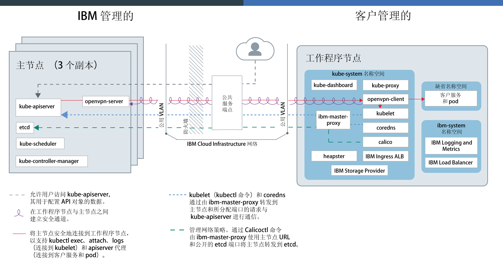
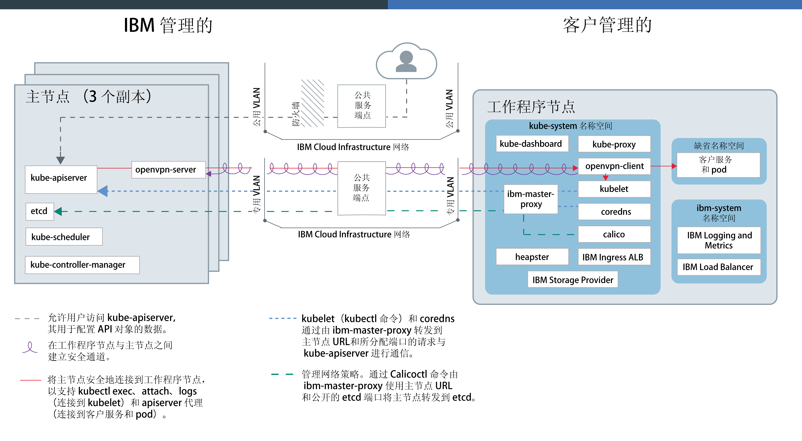

---

copyright:
  years: 2014, 2019
lastupdated: "2019-06-12"

keywords: kubernetes, iks, docker

subcollection: containers

---

{:new_window: target="_blank"}
{:shortdesc: .shortdesc}
{:screen: .screen}
{:pre: .pre}
{:table: .aria-labeledby="caption"}
{:codeblock: .codeblock}
{:tip: .tip}
{:note: .note}
{:important: .important}
{:deprecated: .deprecated}
{:download: .download}
{:preview: .preview}

# {{site.data.keyword.containerlong_notm}} 技术

了解有关 {{site.data.keyword.containerlong}} 的支持技术的更多信息。
{:shortdesc}

## Docker 容器
{: #docker_containers}

名为 Docker 的开放式源代码项目基于现有 Linux 容器技术 (LXC) 构建，定义了模板，用于指示如何将软件打包成标准化单元（称为容器）以包含应用程序运行所需的所有元素。
{{site.data.keyword.containerlong_notm}} 将 `containerd` 用作容器运行时，用于将 Docker 容器映像中的容器部署到集群中。
{:shortdesc}

了解一些基本 Docker 概念：

<dl>
<dt>映像</dt>
<dd>容器映像是要运行的每一个容器的基础。容器映像通过 Dockerfile 进行构建，此文本文件可定义如何构建映像以及要包含在其中的构建工件（例如，应用程序、应用程序配置及其依赖项）。映像始终从其他映像构建，从而使它们的配置更加快速。让其他人来做大部分的映像构建工作，您只需稍作调整即可使用。</dd>
<dt>注册表</dt>
<dd>映像注册表是用于存储、检索和共享容器映像的位置。存储在注册表中的映像可以公共可用（公共注册表），也可以供一小组用户访问（专用注册表）。{{site.data.keyword.containerlong_notm}} 提供了公共映像（如 ibmliberty），可用于创建第一个容器化应用程序。对于企业应用程序，请使用专用注册表（如在 {{site.data.keyword.Bluemix_notm}} 中提供的注册表）来保护映像不被未经授权的用户使用。</dd>
<dt>容器</dt>
<dd>每个容器都是通过映像创建的。容器是一个打包应用程序，其具有所有依赖项，以便可以在环境之间移动应用程序并在不进行更改的情况下运行。与虚拟机不同，容器不会对设备、其操作系统和底层硬件进行虚拟化。在容器中只打包应用程序代码、运行时、系统工具、库和设置。容器在 Ubuntu 计算主机上作为隔离进程运行，并共享主机操作系统及其硬件资源。这种方式使得容器比虚拟机更轻便、可移植性更高且更高效。</dd>
</dl>

### 使用容器的主要优点
{: #container_benefits}

<dl>
<dt>容器灵活</dt>
<dd>容器通过为开发和生产部署提供标准化环境，简化了系统管理。轻量级运行时支持快速扩展和缩减部署。通过使用容器帮助您快速可靠地在任何基础架构上部署和运行任何应用程序，以除去管理不同操作系统平台及其底层基础架构的复杂性。</dd>
<dt>容器小巧</dt>
<dd>在单个虚拟机所需的空间中，可以放入许多容器。</dd>
<dt>容器可移植</dt>
<dd>
<ul>
  <li>复用一些映像来构建容器。</li>
  <li>快速将应用程序代码从编译打包环境转移到生产环境。</li>
  <li>利用持续交付工具使流程自动化。</li>
  </ul>
  </dd>

使用容器映像时，请了解有关[确保个人信息安全](/docs/containers?topic=containers-security#pi)的更多信息。

准备好进一步了解 Docker 了吗？<a href="https://developer.ibm.com/courses/all/docker-essentials-a-developer-introduction/" target="_blank">通过完成本课程，了解如何一起使用 Docker 和 {{site.data.keyword.containerlong_notm}}</a>。

</dl>

 

## Kubernetes 集群
{: #kubernetes_basics}

名为 Kubernetes 的开放式源代码项目将运行容器化基础架构与生产工作负载、开放式源代码供应和 Docker 容器管理工具相结合。Kubernetes 基础架构提供了隔离、安全的应用程序平台，用于管理可移植、可扩展，并能在发生故障转移时自我复原的容器。
{:shortdesc}

了解一些基本的 Kubernetes 概念，如下图所示。

<dl>
<dt>帐户</dt>
<dd>帐户是指 {{site.data.keyword.Bluemix_notm}} 帐户。</dd>

<dt>集群</dt>
<dd>Kubernetes 集群由一个或多个计算主机组成，这些计算主机称为工作程序节点。工作程序节点由 Kubernetes 主节点管理，主节点用于集中控制和监视集群中的所有 Kubernetes 资源。因此，在部署容器化应用程序的资源时，Kubernetes 主节点会考虑部署需求和集群中的可用容量，然后决定将这些资源部署在哪个工作程序节点上。Kubernetes 资源包括服务、部署和 pod。</dd>

<dt>服务</dt>
<dd>服务是 Kubernetes 资源，可将一组 pod 分组在一起，并提供与这些 pod 的网络连接，而无需公开每个 pod 的实际专用 IP 地址。您可以通过服务使应用程序在集群或公共因特网中可用。</dd>

<dt>部署</dt>
<dd>部署是一种 Kubernetes 资源，在其中可指定运行应用程序所需的其他资源或功能的信息，例如服务、持久性存储器或注释。在配置 YAML 文件中记录部署，然后将其应用于集群。Kubernetes 主节点会配置资源，并将容器部署到具有可用容量的工作程序节点上的 pod 中。  
为您的应用程序定义更新策略，包括在滚动更新期间要添加的 pod 数，以及可以同时不可用的 pod 数。执行滚动更新时，部署将检查更新是否有效，并在检测到故障时停止应用。</dd>

<dt>Pod</dt>
<dd>部署到集群中的每个容器化应用程序都由称为 pod 的 Kubernetes 资源进行部署、运行和管理。pod 代表 Kubernetes 集群中的小型可部署单元，用于将必须视为单个单元的容器分组在一起。在大多数情况下，每个容器都会部署到其自己的 pod 中。但是，应用程序可能需要将一个容器和其他辅助容器部署到一个 pod 中，以便可以使用相同的专用 IP 地址寻址到这些容器。</dd>

<dt>应用程序</dt>
<dd>应用程序可能是指完整应用程序，也可能指应用程序组件。可在单独的 pod 或单独的工作程序节点中部署应用程序的组件。</dd>

使用 Kubernetes 资源时，请了解有关[确保个人信息安全](/docs/containers?topic=containers-security#pi)的更多信息。

准备好进一步了解 Kubernetes 了吗？

<ul><li><a href="/docs/containers?topic=containers-cs_cluster_tutorial#cs_cluster_tutorial" target="_blank">通过“创建集群”教程扩大对术语的了解</a>。</li>
<li><a href="https://developer.ibm.com/courses/all/container-kubernetes-essentials-with-ibm-cloud/" target="_blank">通过完成本课程，了解如何一起使用 Kubernetes 和 {{site.data.keyword.containerlong_notm}}</a>。</li></ul>

</dl>

 

## 服务体系结构
{: #architecture}

在 {{site.data.keyword.containerlong_notm}} 上运行的 Kubernetes 集群中，容器化应用程序在称为工作程序节点的计算主机上托管。更具体地说，应用程序在 pod 中运行，而 pod 在工作程序节点上托管。工作程序节点由 Kubernetes 主节点进行管理。Kubernetes 主节点与工作程序节点之间的通信设置取决于如何设置 IBM Cloud Infrastructure (SoftLayer) 网络：具有公共服务端点的帐户，或者具有公共和专用服务端点的启用 VRF 的帐户。
{: shortdesc}

下图显示了集群的组件及其在仅[启用公共服务端点](/docs/containers?topic=containers-plan_clusters#workeruser-master)时在帐户中的交互方式。

<figure>
 
 <figcaption>仅启用了公共服务端点时的 {{site.data.keyword.containerlong_notm}} 体系结构</figcaption>
</figure>

下图显示了集群的组件及其在已[启用公共和专用服务端点](/docs/containers?topic=containers-plan_clusters#workeruser-master)时在启用 VRF 的帐户中的交互方式。

<figure>
 
 <figcaption>启用公共和专用服务端点时的 {{site.data.keyword.containerlong_notm}} 体系结构</figcaption>
</figure>

Kubernetes 主节点与工作程序节点之间有何区别？问得好。

<dl>
  <dt>Kubernetes 主节点</dt>
    <dd>Kubernetes 主节点负责的任务是管理集群中的所有计算资源、网络资源和存储资源。Kubernetes 主节点可确保将容器化应用程序和服务同等部署到集群中的工作程序节点。根据您配置应用程序和服务的方式，主节点确定具有足够资源来满足应用程序需求的工作程序节点。  下表描述了 Kubernetes 主节点的组件。
    <table>
    <caption>Kubernetes 主节点的组件</caption>
    <thead>
    <th>主节点组件</th>
    <th>描述</th>
    </thead>
    <tbody>
    <tr>
    <td>kube-apiserver</td>
    <td>Kubernetes API 服务器充当从工作程序节点到 Kubernetes 主节点的所有集群管理请求的主入口点。Kubernetes API 服务器会验证并处理更改 Kubernetes 资源（例如，pod 或服务）状态的请求，并将此状态存储在 etcd 中。</td>
    </tr>
    <tr>
    <td>openvpn-server</td>
    <td>OpenVPN 服务器与 OpenVPN 客户机配合使用，以安全地将主节点连接到工作程序节点。此连接支持对 pod 和服务的 `apiserver proxy` 调用，还支持对 kubelet 的 `kubectl exec`、`attach` 和 `logs` 调用。</td>
    </tr>
    <tr>
    <td>etcd</td>
    <td>etcd 是一种高可用性键值存储，用于存储集群的所有 Kubernetes 资源（例如，服务、部署和 pod）的状态。etcd 中的数据会备份到 IBM 管理的加密存储器实例中。</td>
    </tr>
    <tr>
    <td>kube-scheduler</td>
    <td>Kubernetes 调度程序监视新创建的 pod，并根据容量、性能需求、策略约束、反亲缘关系规范和工作负载需求来决定这些 pod 的部署位置。如果找不到与这些需求相匹配的工作程序节点，那么不会在集群中部署 pod。</td>
    </tr>
    <tr>
    <td>kube-controller-manager</td>
    <td>Kubernetes 控制器管理器是一种守护程序，用于监视集群资源（例如，副本集）的状态。当资源的状态更改时（例如，如果副本集内的 pod 停止运行），控制器管理器会开始更正操作以实现所需的状态。</td>
    </tr>
    </tbody></table></dd>
  <dt>工作程序节点</dt>
    <dd>每个工作程序节点都是物理机器（裸机）或是在云环境中的物理硬件上运行的虚拟机。供应工作程序节点时，您将确定可供该工作程序节点上托管的容器使用的资源。工作程序节点现成设置有 {{site.data.keyword.IBM_notm}} 管理的 Docker Engine 以及独立的计算资源、联网和卷服务。内置安全性功能提供了隔离、资源管理功能和工作程序节点安全合规性。  
不支持修改缺省工作程序节点组件（如 `kubelet`），这可能会导致意外结果。
下表描述了工作程序节点的组件。
    <table>
    <caption>工作程序节点的组件</caption>
    <thead>
    <th>工作程序组件</th>
    <th>名称空间</th>
    <th>描述</th>
    </thead>
    <tbody>
    <tr>
    <td>`ibm-master-proxy`</td>
    <td>kube-system</td>
    <td>`ibm-master-proxy` 会将请求从工作程序节点转发到高可用性主节点副本的 IP 地址。在单专区集群中，主节点有三个副本，每个副本位于单独的主机上，使用一个主节点 IP 地址和域名。对于位于支持多专区的专区中的集群，主节点的三个副本在各专区中进行分布。因此，每个主节点都有自己的 IP 地址（已向 DNS 注册），并且整个集群主节点使用一个域名。</td>
    </tr>
    <tr>
    <td>`openvpn-client`</td>
    <td>kube-system</td>
    <td>OpenVPN 客户机与 OpenVPN 服务器配合使用，以安全地将主节点连接到工作程序节点。此连接支持对 pod 和服务的 `apiserver proxy` 调用，还支持对 kubelet 的 `kubectl exec`、`attach` 和 `logs` 调用。</td>
    </tr>
    <tr>
    <td>`kubelet`</td>
    <td>kube-system</td>
    <td>kubelet 是一个 pod，在每个工作程序节点上运行，负责监视在工作程序节点上运行的 pod 的运行状况，以及监视 Kubernetes API 服务器发送的事件。根据事件，kubelet 会创建或除去 pod，确保活性和就绪性探测，并向 Kubernetes API 服务器报告 pod 的阶段状态。</td>
    </tr>
    <tr>
    <td>`coredns`</td>
    <td>kube-system</td>
    <td>缺省情况下，Kubernetes 会在集群上安排 CoreDNS pod（或者在 V1.12 和更低版本中，安排 KubeDNS pod）和服务。容器会自动使用 DNS 服务的 IP 来解析对其他 pod 和服务的搜索中的 DNS 名称。</td>
    </tr>
    <tr>
    <td>`calico`</td>
    <td>kube-system</td>
    <td>Calico 管理集群的网络策略，并由如下一些组件组成。
    <ul>
    <li>**`calico-cni`**：Calico 容器网络接口 (CNI) 管理容器的网络连接，并在删除容器时除去分配的资源。</li>
    <li>**`calico-ipam`**：Calico IPAM 管理容器的 IP 地址分配。</li>
    <li>**`calico-node`**：Calico 节点是一个容器，用于将使用 Calico 对容器联网所需的各种组件捆绑在一起。</li>
    <li>**`calico-policy-controller`**：Calico 策略控制器监视入站和出站网络流量，以确定是否符合设置的网络策略。如果集群中不允许该流量，那么会阻止对该集群的访问。Calico 策略控制器还用于为集群创建和设置网络策略。</li></ul></td>
    </tr>
    <tr>
    <td>`kube-proxy`</td>
    <td>kube-system</td>
    <td>Kubernetes 网络代理是一种守护程序，在每个工作程序节点上运行，并且为集群中运行的服务转发 TCP 和 UDP 网络流量或对这些流量进行负载均衡。</td>
    </tr>
    <tr>
    <td>`kube-dashboard`</td>
    <td>kube-system</td>
    <td>Kubernetes 仪表板是一种基于 Web 的 GUI，允许用户对集群和集群中运行的应用程序进行管理和故障诊断。</td>
    </tr>
    <tr>
    <td>`heapster`</td>
    <td>kube-system</td>
    <td>Heapster 是一种集群范围的监视和事件数据聚集器。Heapster pod 会发现集群中的所有节点，并查询每个节点的 kubelet 中的使用情况信息。可以在 Kubernetes 仪表板中找到利用率图形。</td>
    </tr>
    <tr>
    <td>Ingress ALB</td>
    <td>kube-system</td>
    <td>Ingress 是一种 Kubernetes 服务，可用于通过将公共或专用请求转发到集群中的多个应用程序，均衡集群中的网络流量工作负载。要通过公用或专用网络公开应用程序，必须创建 Ingress 资源，以向 Ingress 应用程序负载均衡器 (ALB) 注册应用程序。然后，可以使用单个 URL 或 IP 地址来访问多个应用程序。</td>
    </tr>
    <tr>
    <td>存储器提供者</td>
    <td>kube-system</td>
    <td>每个集群都设置有一个插件，用于供应文件存储器。您可以选择安装其他附加组件，例如块存储器。</td>
    </tr>
    <tr>
    <td>日志记录和度量</td>
    <td>ibm-system</td>
    <td>在使用日志和度量值时，可以使用集成的 {{site.data.keyword.loganalysislong_notm}} 和 {{site.data.keyword.monitoringlong_notm}} 服务来扩展收集和保留功能。</td>
    </tr>
    <tr>
    <td>负载均衡器</td>
    <td>ibm-system</td>
    <td>负载均衡器是一种 Kubernetes 服务，可用于通过将公共或专用请求转发到应用程序，均衡集群中的网络流量工作负载。</td>
    </tr>
    <tr>
    <td>应用程序 pod 和服务</td>
    <td>default</td>
    <td>在 <code>default</code> 名称空间或您创建的名称空间中，可以在 pod 和服务中部署应用程序，以与这些 pod 进行通信。</td>
    </tr>
    </tbody></table></dd>
</dl>

想要了解如何将 {{site.data.keyword.containerlong_notm}} 与其他产品和服务配合使用？请查看一些[集成](/docs/containers?topic=containers-supported_integrations#supported_integrations)。
{: tip}

## 服务限制
{: #tech_limits}

{{site.data.keyword.containerlong_notm}} 和 Kubernetes 开放式源代码项目随附缺省服务设置和限制，以确保提供基本功能以及安全性和便利性。您可能可以更改其中注明的一些限制。如果预期会达到以下 {{site.data.keyword.containerlong_notm}} 限制，请通过[内部 ](https://ibm-argonauts.slack.com/messages/C4S4NUCB1) 或[外部 Slack ](https://ibm-container-service.slack.com) 联系 IBM 团队。
{: shortdesc}

<table summary="该表包含有关 {{site.data.keyword.containerlong_notm}} 限制的信息。各列从左到右阅读。第一列是限制的类型，第二列是限制的描述。">
<caption>{{site.data.keyword.containerlong_notm}} 限制</caption>
<thead>
  <tr>
    <th>类型</th>
    <th>描述</th>
  </tr>
</thead>
<tbody>
  <tr>
    <td>API 速率限制</td>
    <td>针对每个唯一源 IP 地址，每 10 秒向 {{site.data.keyword.containerlong_notm}} API 发出 100 个请求。</td>
  </tr>
  <tr>
    <td>工作程序节点容量</td>
    <td>工作程序节点在计算资源的[选择类型模板](/docs/containers?topic=containers-planning_worker_nodes#shared_dedicated_node)中提供。</td>
  </tr>
  <tr>
    <td>工作程序节点主机访问</td>
    <td>出于安全原因，您无法通过 SSH 登录到工作程序节点计算主机。</td>
  </tr>
  <tr>
    <td>最大工作程序节点数</td>
    <td>如果计划每个集群的工作程序节点数会超过 900 个，请首先通过[内部 ](https://ibm-argonauts.slack.com/messages/C4S4NUCB1) 或[外部 Slack ](https://ibm-container-service.slack.com) 联系 IBM 团队。
  如果看到针对每个数据中心的实例数或每月订购的实例数的 IBM Cloud Infrastructure (SoftLayer) 容量限制，请联系 IBM Cloud Infrastructure (SoftLayer) 代表。</td>
  </tr>
  <tr>
    <td>最大 pod 数</td>
    <td>每个工作程序节点 110 个 pod。  pod 数包括在工作程序节点上运行的 `kube-system` 和 `ibm-system` pod。要提高性能，请考虑限制每个计算核心运行的 pod 数，以便不会过度使用工作程序节点。例如，在使用 `b3c.4x16` 类型模板的工作程序节点上，可每个核心运行 10 个 pod，这些 pod 使用的容量占工作程序节点总容量的比例不超过 75%。</td>
  </tr>
  <tr>
    <td>最大 Kubernetes 服务数</td>
    <td>在 172.21.0.0/16 范围内，每个集群 65,000 个 IP，可以将这些 IP 分配给集群中的 Kubernetes 服务。</td>
  </tr>
  <tr>
    <td>Ingress 应用程序负载均衡器 (ALB) 流量</td>
    <td>每秒 32,768 个连接。  如果入口流量超过此数量，请在集群中[扩展 ALB 副本数](/docs/containers?topic=containers-ingress#scale_albs)，以处理增加的工作负载。</td>
  </tr>
  <tr>
    <td>存储卷</td>
    <td>每个帐户的 IBM Cloud Infrastructure (SoftLayer) 文件存储器和块存储器实例的卷的合并总数 250 个。  如果安装的数量超过此数量，那么在供应持久卷时可能会看到“容量不足”消息，并且需要联系 IBM Cloud Infrastructure (SoftLayer) 代表。有关更多常见问题，请参阅[文件](/docs/infrastructure/FileStorage?topic=FileStorage-file-storage-faqs#how-many-volumes-can-i-provision-)存储器和[块](/docs/infrastructure/BlockStorage?topic=BlockStorage-block-storage-faqs#how-many-instances-can-share-the-use-of-a-block-storage-volume-)存储器文档。</td>
  </tr>
</tbody>
</table>
