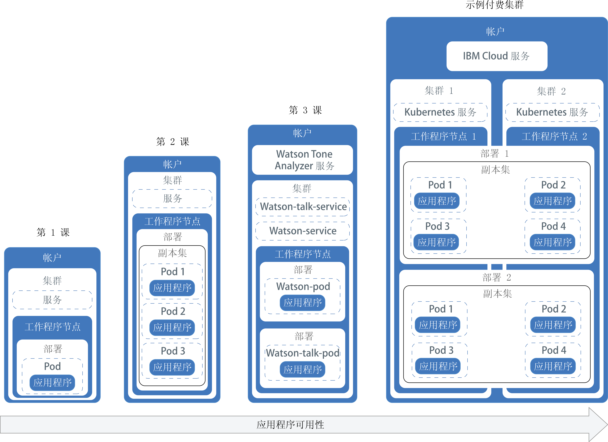
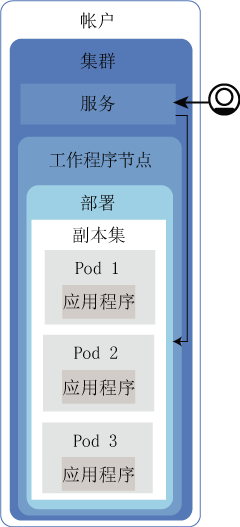
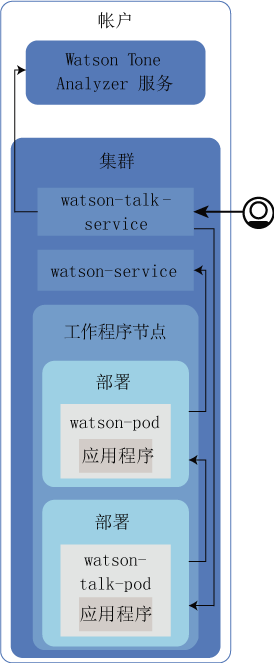

---

copyright:
  years: 2014, 2017
lastupdated: "2017-08-17"

---

{:new_window: target="_blank"}
{:shortdesc: .shortdesc}
{:screen: .screen}
{:pre: .pre}
{:table: .aria-labeledby="caption"}
{:codeblock: .codeblock}
{:tip: .tip}
{:download: .download}


# 集群的教程
{: #cs_tutorials}

尝试以下教程和其他资源以开始使用该服务。
{:shortdesc}

## 教程：创建集群
{: #cs_cluster_tutorial}

在云中部署和管理自己的 Kubernetes 集群，这将支持通过名为工作程序节点的独立计算主机的集群，自动对容器化应用程序进行部署、操作、扩展和监视。
{:shortdesc}

本教程系列演示了一家虚构的公关公司可以如何使用 Kubernetes 在 {{site.data.keyword.Bluemix_short}} 中部署利用了 Watson Tone Analyzer 的容器化应用程序。这家公关公司使用 Watson Tone Analyzer 分析了其新闻稿，并在消息中收到了关于语气的反馈。在这第一个教程中，该公关公司的网络管理员设置了定制 Kubernetes 集群，作为公司的 Watson Tone Analyzer 应用程序的计算基础架构。此集群用于部署和测试该公关公司的应用程序的 Hello World 版本。

### 目标

-   创建具有一个工作程序节点的 Kubernetes 集群
-   安装可使用 Kubernetes API 和管理 Docker 映像的 CLI
-   在 IBM {{site.data.keyword.Bluemix_notm}} Container Registry 中创建专用映像存储库以存储映像
-   将 Watson Tone Analyzer {{site.data.keyword.Bluemix_notm}} 服务添加到集群，以便集群中的任何应用程序都可使用该服务

### 所需时间

25 分钟

### 受众

本教程适用于此前从未创建过 Kubernetes 集群的软件开发者和网络管理员。

### 第 1 课：设置 CLI
{: #cs_cluster_tutorial_lesson1}

安装 {{site.data.keyword.containershort_notm}} CLI、{{site.data.keyword.registryshort_notm}} CLI 及其必备软件。这些 CLI 在后面的课程中会用到，并且在管理本地计算机中的 Kubernetes 集群，创建要部署为容器的映像，以及后面教程中将应用程序部署到集群时，都需要这些 CLI。

本课程包含用于安装以下 CLI 的信息。

-   {{site.data.keyword.Bluemix_notm}} CLI 
-   {{site.data.keyword.containershort_notm}} 插件
-   Kubernetes CLI
-   {{site.data.keyword.registryshort_notm}} 插件
-   Docker CLI


要安装 CLI，请执行以下操作：
1.  如果还没有 [{{site.data.keyword.Bluemix_notm}} 帐户 ](https://console.ng.bluemix.net/registration/)，请进行创建。记下您的用户名和密码，以后会需要这些信息。
2.  作为 {{site.data.keyword.containershort_notm}} 插件的必备软件，请安装 [{{site.data.keyword.Bluemix_notm}} CLI ](https://clis.ng.bluemix.net/ui/home.html)。用于通过 {{site.data.keyword.Bluemix_notm}} CLI 运行命令的前缀是 `bx`。
3.  遵循提示来选择帐户和 {{site.data.keyword.Bluemix_notm}} 组织。集群是特定于帐户的，但又独立于 {{site.data.keyword.Bluemix_notm}} 组织或空间。

5.  要创建 Kubernetes 集群以及管理工作程序节点，请安装 {{site.data.keyword.containershort_notm}} 插件。用于通过 {{site.data.keyword.containershort_notm}} 插件运行命令的前缀是 `bx cs`。

    ```
    bx plugin install container-service -r {{site.data.keyword.Bluemix_notm}}
    ```
    {: pre}
6.  登录到 {{site.data.keyword.Bluemix_notm}} CLI。根据提示，输入您的 {{site.data.keyword.Bluemix_notm}} 凭证。

    ```
    bx login
    ```
    {: pre}

    要指定特定的 {{site.data.keyword.Bluemix_notm}} 区域，请包含相应的 API 端点。如果有专用 Docker 映像存储在特定 {{site.data.keyword.Bluemix_notm}} 区域或者已经创建的 {{site.data.keyword.Bluemix_notm}} 服务实例的容器注册表中，请登录到此区域来访问映像和 {{site.data.keyword.Bluemix_notm}} 服务。


    您登录到的 {{site.data.keyword.Bluemix_notm}} 区域还决定了可以在其中创建 Kubernetes 集群的区域，包括可用的数据中心。如果未指定区域，那么您会自动登录到离您最近的区域。

       -  美国南部

           ```
           bx login -a api.ng.bluemix.net
           ```
           {: pre}
     
       -  悉尼

           ```
           bx login -a api.au-syd.bluemix.net
           ```
           {: pre}

       -  德国

           ```
           bx login -a api.eu-de.bluemix.net
           ```
           {: pre}

       -  英国

           ```
           bx login -a api.eu-gb.bluemix.net
           ```
           {: pre}

    **注**：如果您有联合标识，请使用 `bx login --sso` 登录到 {{site.data.keyword.Bluemix_notm}} CLI。输入您的用户名，并使用 CLI 输出中提供的 URL 来检索一次性密码。如果不使用 `--sso` 时登录失败，而使用 `--sso` 选项时登录成功，说明您拥有的是联合标识。

7.  如果要在除了先前所选 {{site.data.keyword.Bluemix_notm}} 区域以外的区域中创建 Kubernetes 集群，请指定此区域。例如，您在一个区域中创建了 {{site.data.keyword.Bluemix_notm}} 服务或专用 Docker 映像，并希望将其用于另一个区域中的 {{site.data.keyword.containershort_notm}}。

    在以下 API 端点中进行选择：

    * 美国南部：

        ```
        bx cs init --host https://us-south.containers.bluemix.net
        ```
        {: pre}

    * 英国南部：

        ```
        bx cs init --host https://uk-south.containers.bluemix.net
        ```
        {: pre}

    * 欧洲中部：

        ```
        bx cs init --host https://eu-central.containers.bluemix.net
        ```
        {: pre}

    * 亚太南部：

        ```
        bx cs init --host https://ap-south.containers.bluemix.net
        ```
        {: pre}

8.  要查看 Kubernetes 仪表板的本地版本以及将应用程序部署到集群，请[安装 Kubernetes CLI ](https://kubernetes.io/docs/tasks/tools/install-kubectl/)。用于通过 Kubernetes CLI 来运行命令的前缀是 `kubectl`。
    1.  下载 Kubernetes CLI。

        OS X：[https://storage.googleapis.com/kubernetes-release/release/v1.5.6/bin/darwin/amd64/kubectl ](https://storage.googleapis.com/kubernetes-release/release/v1.5.6/bin/darwin/amd64/kubectl)

        Linux：[https://storage.googleapis.com/kubernetes-release/release/v1.5.6/bin/linux/amd64/kubectl ](https://storage.googleapis.com/kubernetes-release/release/v1.5.6/bin/linux/amd64/kubectl)

        Windows：[https://storage.googleapis.com/kubernetes-release/release/v1.5.6/bin/windows/amd64/kubectl.exe ](https://storage.googleapis.com/kubernetes-release/release/v1.5.6/bin/windows/amd64/kubectl.exe)

          **提示：**如果使用的是 Windows，请将 Kubernetes CLI 安装在 {{site.data.keyword.Bluemix_notm}} CLI 所在的目录中。此安装将在您以后运行命令时减少一些文件路径更改操作。

    2.  对于 OSX 和 Linux 用户，请完成以下步骤。
        1.  将可执行文件移至 `/usr/local/bin` 目录。


            ```
            mv /<path_to_file>/kubectl /usr/local/bin/kubectl
            ```
            {: pre}

        2.  确保 /usr/local/bin 列在 `PATH` 系统变量中。`PATH` 变量包含操作系统可以在其中找到可执行文件的所有目录。列在 `PATH` 变量中的目录用于不同的用途。/usr/local/bin 用于为不属于操作系统的一部分，而是由系统管理员手动安装的软件存储其可执行文件。

            ```
            echo $PATH
            ```
            {: pre}

            CLI 输出类似于以下内容。

            ```
            /usr/local/bin:/usr/bin:/bin:/usr/sbin:/sbin
            ```
            {: screen}

        3.  将二进制文件转换为可执行文件。

            ```
            chmod +x /usr/local/bin/kubectl
            ```
            {: pre}

9. 要在 {{site.data.keyword.registryshort_notm}} 中设置并管理专用映像存储库，请安装 {{site.data.keyword.registryshort_notm}} 插件。用于运行注册表命令的前缀是 `bx cr`。

    ```
    bx plugin install container-registry -r {{site.data.keyword.Bluemix_notm}}
    ```
    {: pre}

    要验证是否已正确安装 container-service 和 container-registry 插件，请运行以下命令：

    ```
    bx plugin list
    ```
    {: pre}

10. 要在本地构建映像并将其推送到专用映像存储库，请[安装 Docker CE CLI ](https://www.docker.com/community-edition#/download)。如果使用的是 Windows 8 或更低版本，可以改为安装 [Docker Toolbox ](https://www.docker.com/products/docker-toolbox)。

祝贺您！您已成功创建 {{site.data.keyword.Bluemix_notm}} 帐户并安装了 CLI，可以继续学习后续课程和教程。接下来，请使用 CLI 访问集群，并开始添加 {{site.data.keyword.Bluemix_notm}} 服务。

### 第 2 课：设置集群环境
{: #cs_cluster_tutorial_lesson2}

创建 Kubernetes 集群，在 {{site.data.keyword.registryshort_notm}} 中设置专用映像存储库以及向集群添加私钥，以便应用程序可以访问 {{site.data.keyword.watson}} {{site.data.keyword.toneanalyzerfull}} 服务。

1.  创建 Lite Kubernetes 集群。

    ```
    bx cs cluster-create --name <pr_firm_cluster>
    ```
    {: pre}

    Lite 集群随附一个用于部署容器 pod 的工作程序节点。工作程序节点是运行应用程序的计算主机，通常为虚拟机。生产中的应用程序会跨多个工作程序节点运行应用程序的副本，以为应用程序提供更高可用性。


    **注**：可能需要最长 15 分钟时间，才能订购好工作程序节点计算机，并且设置并供应集群。

2.  在 {{site.data.keyword.registryshort_notm}} 中设置自己的专用映像存储库，以安全地存储 Docker 映像并与所有集群用户共享这些映像。{{site.data.keyword.Bluemix_notm}} 中的专用映像存储库通过在此步骤中设置的名称空间进行标识。名称空间用于创建映像存储库的唯一 URL，开发者可使用此 URL 来访问专用 Docker 映像。可以在您的帐户中创建多个名称空间，用于对映像进行分组和组织。例如，可以为每个部门、每个环境或每个应用程序创建一个名称空间。

    在此示例中，公关公司希望在 {{site.data.keyword.registryshort_notm}} 中仅创建一个映像存储库，所以他们选择 _pr_firm_ 作为其名称空间，用于对其帐户中的所有映像分组。将 _&lt;your_namespace&gt;_ 替换为您所选择的名称空间而非与教程相关的其他项目。


    ```
    bx cr namespace-add <your_namespace>
    ```
    {: pre}

3.  继续执行下一步之前，请验证工作程序节点的部署是否已完成。

    ```
    bx cs workers <pr_firm_cluster>
    ```
     {: pre}

    工作程序节点供应完成时，状态会更改为 **Ready**，这时可以开始绑定 {{site.data.keyword.Bluemix_notm}} 服务，以便在未来教程中使用。


    ```
    ID                                                 Public IP       Private IP       Machine Type   State    Status   
    kube-dal10-pafe24f557f070463caf9e31ecf2d96625-w1   169.48.131.37   10.177.161.132   free           normal    Ready   
    ```
    {: screen}

4.  在 CLI 中设置集群的上下文。每次登录到容器 CLI 来使用集群时，必须运行这些命令以将集群配置文件的路径设置为会话变量。Kubernetes CLI 使用此变量来查找与 {{site.data.keyword.Bluemix_notm}} 中的集群连接所必需的本地配置文件和证书。

    1.  获取命令以设置环境变量并下载 Kubernetes 配置文件。


        ```
        bx cs cluster-config pr_firm_cluster
        ```
        {: pre}

        配置文件下载完成后，会显示一个命令，您可以使用该命令将本地 Kubernetes 配置文件的路径设置为环境变量。

        OS X 的示例：

        ```
        export KUBECONFIG=/Users/<user_name>/.bluemix/plugins/container-service/clusters/pr_firm_cluster/kube-config-prod-dal10-pr_firm_cluster.yml
        ```
        {: screen}

    2.  复制并粘贴终端中显示的命令，以设置 `KUBECONFIG` 环境变量。

    3.  验证已正确设置 `KUBECONFIG` 环境变量。


        OS X 的示例：

        ```
        echo $KUBECONFIG
        ```
        {: pre}

        输出：

        ```
        /Users/<user_name>/.bluemix/plugins/container-service/clusters/pr_firm_cluster/kube-config-prod-dal10-pr_firm_cluster.yml
        ```
        {: screen}

    4.  通过检查 Kubernetes CLI 服务器版本，验证 `kubectl` 命令是否针对您的集群正常运行。

        ```
        kubectl version  --short
        ```
        {: pre}

        输出示例：


        ```
        Client Version: v1.5.6
        Server Version: v1.5.6
        ```
        {: screen}

5.  将 {{site.data.keyword.watson}} {{site.data.keyword.toneanalyzershort}} {{site.data.keyword.Bluemix_notm}} 服务添加到集群。使用 {{site.data.keyword.Bluemix_notm}} 服务（如 {{site.data.keyword.watson}} {{site.data.keyword.toneanalyzershort}}）时，可以利用应用程序中已经开发的功能。集群中部署的任何应用程序都可以使用绑定到该集群的任何 {{site.data.keyword.Bluemix_notm}} 服务。对要用于应用程序的每个 {{site.data.keyword.Bluemix_notm}} 服务，重复以下步骤。
    1.  将 {{site.data.keyword.watson}} {{site.data.keyword.toneanalyzershort}} 服务添加到您的 {{site.data.keyword.Bluemix_notm}} 帐户。

        **注**：将 {{site.data.keyword.watson}} {{site.data.keyword.toneanalyzershort}} 服务添加到您的帐户时，将显示一条消息表明该服务不是免费的。如果限制 API 调用，那么本教程不会导致 {{site.data.keyword.watson}} 服务收取费用。可以[查看 {{site.data.keyword.watson}} {{site.data.keyword.toneanalyzershort}}  的定价信息](https://www.ibm.com/watson/developercloud/tone-analyzer.html#pricing-block)。

        ```
        bx service create tone_analyzer standard <mytoneanalyzer>
        ```
        {: pre}

    2.  将 {{site.data.keyword.watson}} {{site.data.keyword.toneanalyzershort}} 实例绑定到集群的 `default` Kubernees 名称空间。您可以在以后创建自己的名称空间来管理对 Kubernetes 资源的用户访问权，但现在，请使用 `default` 名称空间。Kubernetes 名称空间不同于先前创建的注册表名称空间。

        ```
        bx cs cluster-service-bind <pr_firm_cluster> default <mytoneanalyzer>
        ```
        {: pre}

        输出：

        ```
        bx cs cluster-service-bind <pr_firm_cluster> default <mytoneanalyzer>
        Binding service instance to namespace...
        OK
        Namespace: default
        Secret name: binding-mytoneanalyzer
        ```
        {: screen}

6.  验证是否已在集群名称空间中创建 Kubernetes 私钥。每个 {{site.data.keyword.Bluemix_notm}} 服务都由一个 JSON 文件进行定义，此文件包含有关该服务的保密信息，例如容器用于访问该服务的用户名、密码和 URL。为了安全地存储这些信息，将使用 Kubernetes 私钥。在此示例中，私钥所包含的凭证用于访问您的 {{site.data.keyword.Bluemix_notm}} 帐户中供应的 {{site.data.keyword.watson}} {{site.data.keyword.toneanalyzershort}} 实例。

    ```
    kubectl get secrets --namespace=default
    ```
    {: pre}

    输出：

    ```
    NAME                       TYPE                                  DATA      AGE
    binding-mytoneanalyzer     Opaque                                1         1m
    bluemix-default-secret     kubernetes.io/dockercfg               1         1h
    default-token-kf97z        kubernetes.io/service-account-token   3         1h
    ```
    {: screen}


非常好！集群已创建并配置，并且本地环境已准备就绪可用于开始将应用程序部署到集群。

**接下来要做什么？**

* [测试您的掌握情况并进行测验！](https://bluemix-quizzes.mybluemix.net/containers/cluster_tutorial/quiz.php)
* 尝试[教程：在 {{site.data.keyword.containershort_notm}} 中将应用程序部署到 Kubernetes 集群](#cs_apps_tutorial)，以将公关公司的应用程序部署到已创建的集群。

## 教程：将应用程序部署到集群
{: #cs_apps_tutorial}

这第二个教程继续说明可以如何使用 Kubernetes 来部署利用 {{site.data.keyword.watson}} {{site.data.keyword.toneanalyzershort}} {{site.data.keyword.Bluemix_notm}} 服务的容器化应用程序。一家虚构的公关公司使用 {{site.data.keyword.watson}} 来分析其新闻稿，并在消息中收到了关于语气的反馈。
{:shortdesc}

在此场景中，该公关公司的应用程序开发者将应用程序的 Hello World 版本部署到网络管理员在[第一个教程](#cs_cluster_tutorial)中创建的 Kubernetes 集群中。

每一课会指导您如何以渐进方式部署同一应用程序的更复杂版本。下图显示了教程中应用程序部署的各个组成部分，但第四部分除外。

<a href="https://console.bluemix.net/docs/api/content/containers/images/cs_app_tutorial_roadmap.png"></a>

Kubernetes 使用多种不同类型的资源使应用程序在集群中启动并开始运行。在 Kubernetes 中，部署与服务一起工作。部署包含应用程序的定义，例如要用于容器的映像以及必须为应用程序公开的端口。创建部署时，会为部署中定义的每个容器创建一个 Kubernetes pod。要使应用程序更具弹性，可以在部署中定义同一应用程序的多个实例，并允许 Kubernetes 自动为您创建副本集。副本集用于监视 pod，并确保始终有所需数量的 pod 启动并在运行。如果其中一个 pod 无响应，那么会自动重新创建该 pod。

服务会将一些 pod 分组在一起，并提供与这些 pod 的网络连接，以供集群中的其他服务使用，而无需公开每个 pod 的实际专用 IP 地址。可以使用 Kubernetes 服务来使应用程序可供集群内的其他 pod 使用，也可以将应用程序公开到因特网。在本教程中，您将通过一个自动分配给工作程序节点的公共 IP 地址和一个公共端口，使用 Kubernetes 服务从因特网访问正在运行的应用程序。

要使应用程序具有更高可用性，可以在标准集群中创建多个工作程序节点以运行应用程序的更多副本。本教程中未涉及此任务，但请记住这一概念，以便将来改进应用程序可用性时加以运用。

虽然只有其中一个课程涉及将 {{site.data.keyword.Bluemix_notm}} 服务集成到应用程序中，但您可以将这些服务用于任何复杂程度的应用程序。

### 目标

* 了解基本 Kubernetes 术语
* 将映像推送到 {{site.data.keyword.registryshort_notm}} 中的注册表名称空间
* 使应用程序可公共访问
* 通过使用 Kubernetes 命令和脚本，在集群中部署应用程序的单个实例
* 在运行状况检查期间重新创建的容器中，部署应用程序的多个实例
* 部署使用 {{site.data.keyword.Bluemix_notm}} 服务中功能的应用程序

### 所需时间

40 分钟

### 受众

此前从未在 Kubernetes 集群中部署过应用程序的软件开发者和网络管理员。

### 先决条件

[教程：在 {{site.data.keyword.containershort_notm}} 中创建 Kubernetes 集群](#cs_cluster_tutorial)。

### 第 1 课：将单实例应用程序部署到 Kubernetes 集群
{: #cs_apps_tutorial_lesson1}

在本课中，您要将 Hello World 应用程序的单个实例部署到集群中。

<a href="https://console.bluemix.net/docs/api/content/containers/images/cs_app_tutorial_components1.png"></a>


1.  登录到 {{site.data.keyword.Bluemix_notm}} CLI。根据提示，输入您的 {{site.data.keyword.Bluemix_notm}} 凭证。

    ```
    bx login
    ```
    {: pre}

    要指定特定的 {{site.data.keyword.Bluemix_notm}} 区域，请包含相应的 API 端点。如果有专用 Docker 映像存储在特定 {{site.data.keyword.Bluemix_notm}} 区域或者已经创建的 {{site.data.keyword.Bluemix_notm}} 服务实例的容器注册表中，请登录到此区域来访问映像和 {{site.data.keyword.Bluemix_notm}} 服务。


    您登录到的 {{site.data.keyword.Bluemix_notm}} 区域还决定了可以在其中创建 Kubernetes 集群的区域，包括可用的数据中心。如果未指定区域，那么您会自动登录到离您最近的区域。

    -  美国南部

        ```
        bx login -a api.ng.bluemix.net
        ```
        {: pre}
  
    -  悉尼

        ```
        bx login -a api.au-syd.bluemix.net
        ```
        {: pre}

    -  德国

        ```
        bx login -a api.eu-de.bluemix.net
        ```
        {: pre}

    -  英国

        ```
        bx login -a api.eu-gb.bluemix.net
        ```
        {: pre}

    **注**：如果您有联合标识，请使用 `bx login --sso` 登录到 {{site.data.keyword.Bluemix_notm}} CLI。输入您的用户名，并使用 CLI 输出中提供的 URL 来检索一次性密码。如果不使用 `--sso` 时登录失败，而使用 `--sso` 选项时登录成功，说明您拥有的是联合标识。

2.  在 CLI 中设置集群的上下文。
    1.  获取命令以设置环境变量并下载 Kubernetes 配置文件。


        ```
        bx cs cluster-config <pr_firm_cluster>
        ```
        {: pre}

        配置文件下载完成后，会显示一个命令，您可以使用该命令将本地 Kubernetes 配置文件的路径设置为环境变量。

        OS X 的示例：

        ```
        export KUBECONFIG=/Users/<user_name>/.bluemix/plugins/container-service/clusters/<pr_firm_cluster>/kube-config-prod-dal10-pr_firm_cluster.yml
        ```
        {: screen}

    2.  复制并粘贴终端中显示的命令，以设置 `KUBECONFIG` 环境变量。
    3.  验证已正确设置 `KUBECONFIG` 环境变量。


        OS X 的示例：

        ```
        echo $KUBECONFIG
        ```
        {: pre}

        输出：

        ```
        /Users/<user_name>/.bluemix/plugins/container-service/clusters/<pr_firm_cluster>/kube-config-prod-dal10-pr_firm_cluster.yml
        ```
        {: screen}

    4.  通过检查 Kubernetes CLI 服务器版本，验证 `kubectl` 命令是否针对您的集群正常运行。

        ```
        kubectl version  --short
        ```
        {: pre}

        输出示例：


        ```
        Client Version: v1.5.6
        Server Version: v1.5.6
        ```
        {: screen}

3.  启动 Docker。
    * 如果使用的是 Docker CE，那么无需任何操作。
    * 如果使用的是 Linux，请访问 [Docker 文档 ](https://docs.docker.com/engine/admin/)，以查找有关如何启动 Docker 的指示信息，具体取决于使用的 Linux 分发版。
    * 如果在 Windows 或 OSX 上使用的是 Docker Toolbox，那么可以使用 Docker Quickstart Terminal，该程序将为您启动 Docker。将 Docker Quickstart Terminal 用于后面的几个步骤以运行 Docker 命令，然后切换回在其中设置 `KUBECONFIG` 会话变量的 CLI。
        * 如果使用的是 Docker Quickstart Terminal，请再次运行 {{site.data.keyword.Bluemix_notm}} CLI 登录命令。

          ```
          bx login
          ```
          {: pre}

4.  登录到 {{site.data.keyword.registryshort_notm}} CLI。

    ```
    bx cr login
    ```
    {: pre}

    -   如果忘记了 {{site.data.keyword.registryshort_notm}} 中的名称空间，请运行以下命令。

        ```
        bx cr namespace-list
        ```
        {: pre}

5.  将 [Hello world 应用程序 ](https://github.com/IBM/container-service-getting-started-wt) 的源代码克隆或下载到用户主目录。

    ```
    git clone https://github.com/IBM/container-service-getting-started-wt.git
    ```
    {: pre}

    如果下载了该存储库，请解压压缩文件。


    示例：

    * Windows：`C:Users\<my_username>\container-service-getting-started-wt`
    * OS X：`/Users/<my_username>/container-service-getting-started-wt`

    该存储库在名为 `Stage1`、`Stage2` 和 `Stage3` 的文件夹中分别包含类似应用程序的三个版本。每个版本包含以下文件：

    * `Dockerfile`：映像的构建定义
    * `app.js`：Hello World 应用程序
    * `package.json`：有关应用程序的元数据

6.  浏览到第一个应用程序目录 `Stage1`。

    ```
    cd <username_home_directory>/container-service-getting-started-wt/Stage1
    ```
    {: pre}

7.  构建包含 `Stage1` 目录中应用程序文件的 Docker 映像。如果未来需要对应用程序进行更改，请重复这些步骤以创建映像的另一个版本。

    1.  在本地构建映像，并通过您希望使用的名称和标记以及先前教程中在 {{site.data.keyword.registryshort_notm}} 中创建的名称空间来标记该映像。使用名称空间信息来标记映像，可让 Docker 知道在后续步骤中应将映像推送到何处。在映像名称中仅使用小写字母数字字符或下划线 (`_`)。不要忘记在命令末尾输入句点 (`.`)。句点将通知 Docker 在当前目录内查找用于构建映像的 Dockerfile 和构建工件。

        ```
        docker build -t registry.<region>.bluemix.net/<namespace>/hello-world:1 .
        ```
        {: pre}

        构建完成后，请验证是否看到成功消息。


        ```
        Successfully built <image_id>
        ```
        {: screen}

    2.  将映像推送到注册表名称空间。

        ```
        docker push registry.<region>.bluemix.net/<namespace>/hello-world:1
        ```
        {: pre}

        输出：

        ```
        The push refers to a repository [registry.<region>.bluemix.net/<namespace>/hello-world]
        ea2ded433ac8: Pushed
        894eb973f4d3: Pushed
        788906ca2c7e: Pushed
        381c97ba7dc3: Pushed
        604c78617f34: Pushed
        fa18e5ffd316: Pushed
        0a5e2b2ddeaa: Pushed
        53c779688d06: Pushed
        60a0858edcd5: Pushed
        b6ca02dfe5e6: Pushed
        1: digest: sha256:0d90cb73288113bde441ae9b8901204c212c8980d6283fbc2ae5d7cf652405
        43 size: 2398
        ```
        {: screen}

        等待映像推送完后，再继续执行下一步。

    3.  如果使用的是 Docker Quickstart Terminal，请切换回用于设置 `KUBECONFIG` 会话变量的 CLI。

    4.  验证映像是否已成功添加到名称空间。

        ```
        bx cr images
        ```
        {: pre}

        输出：

        ```
        Listing images...

        REPOSITORY                                  NAMESPACE   TAG       DIGEST         CREATED        SIZE     VULNERABILITY STATUS
        registry.<region>.bluemix.net/<namespace>/hello-world   <namespace>   1   0d90cb732881   1 minute ago   264 MB   OK
        ```
        {: screen}

8.  创建名为 _hello-world-deployment_ 的 Kubernetes 部署，以将应用程序部署到集群中的 pod。部署用于管理 pod；pod 包含应用程序的容器化实例。以下部署会将应用程序部署在单个 pod 中。

    ```
    kubectl run hello-world-deployment --image=registry.<region>.bluemix.net/<namespace>/hello-world:1
    ```
    {: pre}

    输出：

    ```
    deployment "hello-world-deployment" created
    ```
    {: screen}

    由于此部署仅创建了应用程序的一个实例，因此与创建应用程序多个实例的后续课程相比，部署的创建速度更快。

9.  通过将部署公开为 NodePort 服务，使应用程序可供公共访问。服务会对应用程序应用联网。因为集群具有一个工作程序节点而不是多个工作程序节点，因此无需在工作程序节点之间进行负载平衡。所以，NodePort 可用于向用户提供对应用程序的外部访问权。正如您可能会公开 Cloud Foundry 应用程序的端口，您公开的 NodePort 就是工作程序节点用于侦听流量的端口。在后续步骤中，您将看到随机分配给服务的 NodePort。

    ```
    kubectl expose deployment/hello-world-deployment --type=NodePort --port=8080 --name=hello-world-service --target-port=8080
    ```
    {: pre}

    输出：

    ```
    service "hello-world-service" exposed
    ```
    {: screen}

    <table>
    <table summary=\xe2\x80\x9cInformation about the expose command parameters.\xe2\x80\x9d>
    <caption>表 1. 命令参数</caption>
    <thead>
    <th colspan=2>关于 expose 参数的更多信息</th>
    </thead>
    <tbody>
    <tr>
    <td><code>expose</code></td>
    <td>将资源作为 Kubernetes 服务公开，并使其可供用户公共使用。</td>
    </tr>
    <tr>
    <td><code>deployment/<em>&lt;hello-world-deployment&gt;</em></code></td>
    <td>要使用此服务公开的资源的资源类型和名称。</td>
    </tr>
    <tr>
    <td><code>--name=<em>&lt;hello-world-service&gt;</em></code></td>
    <td>服务的名称。</td>
    </tr>
    <tr>
    <td><code>--port=<em>&lt;8080&gt;</em></code></td>
    <td>服务应该发挥作用的端口。</td>
    </tr>
    <tr>
    <td><code>--type=NodePort</code></td>
    <td>要创建的服务类型。</td>
    </tr>
    <tr>
    <td><code>--target-port=<em>&lt;8080&gt;</em></code></td>
    <td>服务将流量定向到的目标端口。在本例中，target-port 与 port 相同，但您创建的其他应用程序可能不同。</td>
    </tr>
    </tbody></table>

    现在所有的部署工作均已完成，您可以检查以确定结果怎么样。

10. 要在浏览器中测试应用程序，请获取详细信息来构成 URL。
    1.  获取有关服务的信息以查看分配的 NodePort。

        ```
        kubectl describe service <hello-world-service>
        ```
        {: pre}

        输出：

        ```
        Name:                   hello-world-service
        Namespace:              default
        Labels:                 run=hello-world-deployment
        Selector:               run=hello-world-deployment
        Type:                   NodePort
        IP:                     10.10.10.8
        Port:                   <unset> 8080/TCP
        NodePort:               <unset> 30872/TCP
        Endpoints:              172.30.171.87:8080
        Session Affinity:       None
        No events.
        ```
        {: screen}

        使用 `expose` 命令生成 NodePort 时，会随机分配这些 NodePort，但范围为 30000-32767。在此示例中，NodePort 为 30872。

    2.  获取集群中工作程序节点的公共 IP 地址。

        ```
        bx cs workers <pr_firm_cluster>
        ```
        {: pre}

        输出：

        ```
        Listing cluster workers...
        OK
        ID                                            Public IP        Private IP      Machine Type   State      Status
        dal10-pa10c8f571c84d4ac3b52acbf50fd11788-w1   169.47.227.138   10.171.53.188   free           normal    Ready
        ```
        {: screen}

11. 打开浏览器并通过以下 URL 检查应用程序：`http://<IP_address>:<NodePort>`。使用示例值时，URL 为 `http://169.47.227.138:30872`。在浏览器中输入该 URL 时，可以看到以下文本。


    ```
    Hello world! Your app is up and running in a cluster!
    ```
    {: screen}

    您可以将此 URL 提供给同事试用，或者在您的手机浏览器中输入该 URL，从而可以查看 Hello World 应用程序是否确实已公共可用。

12. 使用缺省端口 8001 启动 Kubernetes 仪表板。
    1.  使用缺省端口号设置代理。

        ```
        kubectl proxy
        ```
         {: pre}

        ```
        Starting to serve on 127.0.0.1:8001
        ```
        {: screen}

    2.  在 Web 浏览器中打开以下 URL 以查看 Kubernetes 仪表板。

        ```
        http://localhost:8001/ui
        ```
         {: pre}

13. 在**工作负载**选项卡中，可以查看已创建的资源。探索完 Kubernetes 仪表板后，使用 CTRL+C 以退出 `proxy` 命令。

祝贺您！您已部署了应用程序的第一个版本。

本课中的命令太多？没错。那么使用配置脚本为您执行其中一些工作怎么样？要为应用程序的第二个版本使用配置脚本，并要通过部署该应用程序的多个实例来创建更高可用性，请继续学习下一课。

### 第 2 课：部署和更新更高可用性的应用程序
{: #cs_apps_tutorial_lesson2}

在本课中，您要将 Hello World 应用程序的三个实例部署到集群中，以实现比应用程序的第一个版本更高的可用性。更高可用性意味着用户访问会在这三个实例之间分布。如果有过多用户尝试访问同一应用程序实例，他们可能会发现响应缓慢。而多个实例可提高对用户的响应速度。在本课中，您还将学习运行状况检查和部署更新可以如何用于 Kubernetes。


<a href="https://console.bluemix.net/docs/api/content/containers/images/cs_app_tutorial_components2.png"></a>


如配置脚本中所定义，Kubernetes 可以使用可用性检查来查看 pod 中的容器是否在运行。例如，这些检查可以发现死锁情况，即应用程序在运行，但无法取得进展。重新启动处于这种状况的容器，有助于使应用程序在有错误的情况下仍能有更高可用性。然后，Kubernetes 会使用就绪性检查来确定容器何时已准备就绪可再次开始接受流量。在 pod 的容器准备就绪时，该 pod 即视为准备就绪。pod 准备就绪后，即会再次启动。在 Stage2 应用程序中，应用程序每 15 秒就会超时一次。通过在配置脚本中配置的运行状况检查，如果运行状况检查发现应用程序有问题，会重新创建容器。

1.  在 CLI 中，浏览到第二个应用程序目录 `Stage2`。如果使用的是 Docker Toolbox for Windows 或 Docker Toolbox for OS X，请使用 Docker Quickstart Terminal。

  ```
  cd <username_home_directory>/container-service-getting-started-wt/Stage2
  ```
  {: pre}

2.  将应用程序的第二个版本作为映像在本地进行构建和标记。同样，不要忘记在命令末尾输入句点 (`.`)。

  ```
  docker build -t registry.<region>.bluemix.net/<namespace>/hello-world:2 .
  ```
  {: pre}

  验证是否看到成功消息。


  ```
  Successfully built <image_id>
  ```
  {: screen}

3.  将映像的第二个版本推送到注册表名称空间中。等待映像推送完后，再继续执行下一步。

  ```
  docker push registry.<region>.bluemix.net/<namespace>/hello-world:2
  ```
  {: pre}

  输出：

  ```
  The push refers to a repository [registry.<region>.bluemix.net/<namespace>/hello-world]
  ea2ded433ac8: Pushed
  894eb973f4d3: Pushed
  788906ca2c7e: Pushed
  381c97ba7dc3: Pushed
  604c78617f34: Pushed
  fa18e5ffd316: Pushed
  0a5e2b2ddeaa: Pushed
  53c779688d06: Pushed
  60a0858edcd5: Pushed
  b6ca02dfe5e6: Pushed
  1: digest: sha256:0d90cb73288113bde441ae9b8901204c212c8980d6283fbc2ae5d7cf652405
  43 size: 2398
  ```
  {: screen}

4.  如果使用的是 Docker Quickstart Terminal，请切换回用于设置 `KUBECONFIG` 会话变量的 CLI。
5.  验证映像是否已成功添加到注册表名称空间。

    ```
    bx cr images
    ```
     {: pre}

    输出：

    ```
    Listing images...

    REPOSITORY                                 NAMESPACE  TAG  DIGEST        CREATED        SIZE     VULNERABILITY STATUS
    registry.<region>.bluemix.net/<namespace>/hello-world  <namespace>  1    0d90cb732881  30 minutes ago 264 MB   OK
    registry.<region>.bluemix.net/<namespace>/hello-world  <namespace>  2    c3b506bdf33e  1 minute ago   264 MB   OK
    ```
    {: screen}

6.  使用文本编辑器打开 `<username_home_directory>/container-service-getting-started-wt/Stage2/healthcheck.yml` 文件。此配置脚本包含上一课中的若干步骤，用于同时创建部署和服务。公关公司的应用程序开发者在进行更新或要通过重新创建 pod 对问题进行故障诊断时，可以使用这些脚本。

    1.  在**部署**部分中，记下 `replicas`。Replicas 是应用程序的实例数。应用程序的可用性在运行三个实例时高于仅运行一个实例时。

        ```
        replicas: 3
        ```
        {: pre}

    2.  在专用注册表名称空间中更新映像的详细信息。

        ```
        image: "registry.<region>.bluemix.net/<namespace>/hello-world:2"
        ```
        {: pre}

    3.  记下 HTTP 活性探测器，此探测器每 5 秒检查一次容器的运行状况。

        ```
        livenessProbe:
                    httpGet:
                      path: /healthz
                      port: 8080
                    initialDelaySeconds: 5
                    periodSeconds: 5
        ```
        {: codeblock}

    4.  在**服务**部分中，记下 `NodePort`。与上一课中生成随机 NodePort 不同，您可以指定 30000-32767 范围内的端口。此示例使用 30072。

7.  在集群中运行配置脚本。创建了部署和服务后，应用程序可供公关公司用户查看。

  ```
  kubectl apply -f <username_home_directory>/container-service-getting-started-wt/Stage2/healthcheck.yml
  ```
  {: pre}

  输出：

  ```
  deployment "hw-demo-deployment" created
  service "hw-demo-service" created
  ```
  {: screen}

  现在所有的部署工作均已完成，请检查结果怎么样。您可能会注意到因为有更多实例在运行，所以运行速度可能略慢。

8.  打开浏览器并检查应用程序。要构成 URL，请采用上一课中用于工作程序节点的公共 IP 地址，并将其与配置脚本中指定的 NodePort 组合在一起。要获取工作程序节点的公共 IP 地址，请执行以下操作：

  ```
  bx cs workers <pr_firm_cluster>
  ```
  {: pre}

  使用示例值时，URL 为 `http://169.47.227.138:30072`。在浏览器中，可能会看到以下文本。如果未看到此文本，也不必担心。此应用程序本来就是要让文本时而显示时而隐藏的。


  ```
  Hello world! Great job getting the second stage up and running!
  ```
  {: screen}

  您还可以检查 `http://169.47.227.138:30072/healthz` 以了解状态。

  在前 10-15 秒内返回了 200 消息，这表明应用程序在成功运行。这 15 秒后，将显示超时消息（如应用程序中所设计）。


  ```
  {
    "error": "Timeout, Health check error!"
  }
  ```
  {: screen}

9.  使用缺省端口 8001 启动 Kubernetes 仪表板。
    1.  使用缺省端口号设置代理。

        ```
        kubectl proxy
        ```
        {: pre}

        输出：

        ```
        Starting to serve on 127.0.0.1:8001
        ```
        {: screen}

    2.  在 Web 浏览器中打开以下 URL 以查看 Kubernetes 仪表板。

        ```
        http://localhost:8001/ui
        ```
        {: codeblock}

10. 在**工作负载**选项卡中，可以查看已创建的资源。在此选项卡中，可以持续刷新并查看运行状况检查是否在运行。在 **Pod** 部分中，可以查看在重新创建 pod 中的容器时，pod 重新启动的次数。如果在仪表板中偶然遇到以下错误，此消息指示运行状况检查遇到问题。请等待几分钟，然后重新刷新。您会看到每个 pod 的重新启动次数发生变化。


    ```
    Liveness probe failed: HTTP probe failed with statuscode: 500
    Back-off restarting failed docker container
    Error syncing pod, skipping: failed to "StartContainer" for "hw-container" with CrashLoopBackOff: "Back-off 1m20s restarting failed container=hw-container pod=hw-demo-deployment-3090568676-3s8v1_default(458320e7-059b-11e7-8941-56171be20503)"
    ```
    {: screen}

    探索完 Kubernetes 仪表板后，在 CLI 中，输入 CTRL+C 以退出 `proxy` 命令。


祝贺您！您已部署了应用程序的第二个版本。您在此过程中必须使用更少的命令，学习了运行状况检查如何运行，并编辑了部署，非常不错！Hello World 应用程序已通过公关公司的测试。现在，您可以为公关公司部署更有用的应用程序，以开始分析新闻稿。

继续之前，准备好删除已创建的内容了吗？现在，您可以使用相同的配置脚本删除已创建的两个资源。

```
kubectl delete -f <username_home_directory>/container-service-getting-started-wt/Stage2/healthcheck.yml
```
{: pre}

输出：

```
deployment "hw-demo-deployment" deleted
service "hw-demo-service" deleted
```
{: screen}

### 第 3 课：部署和更新 Watson Tone Analyzer 应用程序
{: #cs_apps_tutorial_lesson3}

在前几课中，应用程序部署为一个工作程序节点中的单独组件。在本课中，您要将应用程序的两个组件部署到集群中，该集群使用您在之前教程中添加到集群的 Watson Tone Analyzer服务。将组件分隔到不同的容器中可确保更新一个组件时不会影响其他组件。然后，您将更新应用程序以使用更多副本将其向上扩展，使其可用性更高。

<a href="https://console.bluemix.net/docs/api/content/containers/images/cs_app_tutorial_components3.png">[</a>


#### **第 3a 课：部署 Watson Tone Analyzer 应用程序**
{: #lesson3a}

1.  在 CLI 中，浏览到第三个应用程序目录 `Stage3`。如果使用的是 Docker Toolbox for Windows 或 Docker Toolbox for OS X，请使用 Docker Quickstart Terminal。

  ```
  cd <username_home_directory>/container-service-getting-started-wt/Stage3
  ```
  {: pre}

2.  构建第一个 {{site.data.keyword.watson}} 映像。

    1.  浏览到 `watson` 目录。

        ```
        cd watson
        ```
        {: pre}

    2.  将应用程序的第一部分作为映像在本地进行构建和标记。同样，不要忘记在命令末尾输入句点 (`.`)。

        ```
        docker build -t registry.<region>.bluemix.net/<namespace>/watson .
        ```
        {: pre}

        验证是否看到成功消息。


        ```
        Successfully built <image_id>
        ```
        {: screen}

    3.  将应用程序的第一部分作为映像推送到专用注册表名称空间中。等待映像推送完后，再继续执行下一步。

        ```
        docker push registry.<region>.bluemix.net/<namespace>/watson
        ```
        {: pre}

3.  构建第二个 {{site.data.keyword.watson}}-talk 映像。

    1.  浏览到 `watson-talk` 目录。

        ```
        cd <username_home_directory>/container-service-getting-started-wt/Stage3/watson-talk
        ```
        {: pre}

    2.  将应用程序的第二部分作为映像在本地进行构建和标记。同样，不要忘记在命令末尾输入句点 (`.`)。

        ```
        docker build -t registry.<region>.bluemix.net/<namespace>/watson-talk .
        ```
        {: pre}

        验证是否看到成功消息。


        ```
        Successfully built <image_id>
        ```
        {: screen}

    3.  将应用程序的第二部分推送到专用注册表名称空间中。等待映像推送完后，再继续执行下一步。

        ```
        docker push registry.<region>.bluemix.net/<namespace>/watson-talk
        ```
        {: pre}

4.  如果使用的是 Docker Quickstart Terminal，请切换回用于设置 `KUBECONFIG` 会话变量的 CLI。

5.  验证映像是否已成功添加到注册表名称空间。

    ```
    bx cr images
    ```
    {: pre}

    输出：

    ```
    Listing images...

    REPOSITORY                                  NAMESPACE  TAG            DIGEST         CREATED         SIZE     VULNERABILITY STATUS
    registry.<region>.bluemix.net/namespace/hello-world   namespace  1              0d90cb732881   40 minutes ago  264 MB   OK
    registry.<region>.bluemix.net/namespace/hello-world   namespace  2              c3b506bdf33e   20 minutes ago  264 MB   OK
    registry.<region>.bluemix.net/namespace/watson        namespace  latest         fedbe587e174   3 minutes ago   274 MB   OK
    registry.<region>.bluemix.net/namespace/watson-talk   namespace  latest         fedbe587e174   2 minutes ago   274 MB   OK
    ```
    {: screen}

6.  使用文本编辑器打开 `<username_home_directory>/container-service-getting-started-wt/Stage3/watson-deployment.yml` 文件。此配置脚本包含同时用于应用程序的 watson 和 watson-talk 组件的部署和服务。

    1.  在注册表名称空间中为两个部署更新该映像的详细信息。

        watson:

        ```
        image: "registry.<region>.bluemix.net/namespace/watson"
        ```
        {: codeblock}

        watson-talk:

        ```
        image: "registry.<region>.bluemix.net/namespace/watson-talk"
        ```
        {: codeblock}

    2.  在 watson 部署的 volumes 部分中，更新在先前教程中创建的 {{site.data.keyword.watson}} {{site.data.keyword.toneanalyzershort}} 私钥的名称。通过将 Kubernetes 私钥作为卷安装到您的部署，可使 {{site.data.keyword.Bluemix_notm}} 服务凭证可用于在 pod 中运行的容器。
本教程中的 {{site.data.keyword.watson}} 应用程序组件配置为使用卷安装路径来查找服务凭证。


        ```
        volumes:
                - name: service-bind-volume
                  secret:
                    defaultMode: 420
                    secretName: binding-<mytoneanalyzer>
        ```
        {: codeblock}

        如果忘记了私钥的名称，请运行以下命令。


        ```
        kubectl get secrets --namespace=default
        ```
        {: pre}

    3.  在 watson-talk 服务部分中，记下为 `NodePort` 设置的值。此示例使用 30080。

7.  运行配置脚本。

  ```
  kubectl apply -f <username_home_directory>/container-service-getting-started-wt/Stage3/watson-deployment.yml
  ```
  {: pre}

8.  可选：验证 {{site.data.keyword.watson}} {{site.data.keyword.toneanalyzershort}} 私钥是否已作为卷安装到 pod。

    1.  要获取 watson pod 的名称，请运行以下命令。

        ```
        kubectl get pods
        ```
        {: pre}

        输出：

        ```
        NAME                                 READY     STATUS    RESTARTS  AGE
        watson-pod-4255222204-rdl2f          1/1       Running   0         13h
        watson-talk-pod-956939399-zlx5t      1/1       Running   0         13h
        ```
        {: screen}

    2.  获取有关 pod 的详细信息，并查找私钥名称。

        ```
        kubectl describe pod <pod_name>
        ```
        {: pre}

        输出：

        ```
        Volumes:
          service-bind-volume:
            Type:       Secret (a volume populated by a Secret)
            SecretName: binding-mytoneanalyzer
          default-token-j9mgd:
            Type:       Secret (a volume populated by a Secret)
            SecretName: default-token-j9mgd
        ```
        {: codeblock}

9.  打开浏览器并分析一些文本。使用示例 IP 地址时，URL 的格式为 `http://<worker_node_IP_address>:<watson-talk-nodeport>/analyze/"<text_to_analyze>"`。示例：

    ```
    http://169.47.227.138:30080/analyze/"Today is a beautiful day"
    ```
    {: codeblock}

    在浏览器中，可以看到对所输入文本的 JSON 响应。

10. 使用缺省端口 8001 启动 Kubernetes 仪表板。

    1.  使用缺省端口号设置代理。

        ```
        kubectl proxy
        ```
        {: pre}

        ```
        Starting to serve on 127.0.0.1:8001
        ```
        {: screen}

    2.  在 Web 浏览器中打开以下 URL 以查看 Kubernetes 仪表板。

        ```
        http://localhost:8001/ui
        ```
        {: codeblock}

11. 在**工作负载**选项卡中，可以查看已创建的资源。探索完 Kubernetes 仪表板后，使用 CTRL+C 以退出 `proxy` 命令。

#### 第 3b 课：更新正在运行的 Watson Tone Analyzer 部署
{: #lesson3b}

部署正在运行时，可以编辑部署以更改 pod 模板中的值。本课程包含如何更新使用的映像。

1.  更改映像的名称。一家公关公司想在同一部署中试用其他应用程序，但在发现新应用程序有问题时可进行回滚。

    1.  打开正在运行的部署的配置脚本。

        ```
        kubectl edit deployment/watson-talk-pod
        ```
        {: pre}

        根据操作系统，将打开 vi 编辑器或文本编辑器。

    2.  将映像的名称更改为 ibmliberty 映像。

        ```
        spec:
              containers:
              - image: registry.<region>.bluemix.net/ibmliberty:latest
        ```
        {: codeblock}

    3.  保存更改并退出编辑器。

    4.  将配置脚本中的更改应用于正在运行的部署。

        ```
        kubectl rollout status deployment/watson-talk-pod
        ```
        {: pre}

        等待有关应用完成的确认。


        ```
        deployment "watson-talk-pod" successfully rolled out
        ```
        {: screen}

        推广更改时，Kubernetes 会创建并测试另一个 pod。测试成功后，将除去原先的 pod。

    5.  如果更改看上去与预期不符，那么可以回滚更改。公关公司的某个人员可能在更改应用程序时出了错，因此希望返回到先前的部署。

        1.  查看修订版本号以确定先前部署的编号。最新的修订版是最高版本号。在此示例中，修订版 1 是原始部署，修订版 2 是上一步中进行的映像更改。

            ```
            kubectl rollout history deployment/watson-talk-pod
            ```
            {: pre}

            输出：

            ```
            deployments "watson-talk-pod"
            REVISION CHANGE-CAUSE
            1          <none>
            2          <none>

            ```
            {: screen}

        2.  运行以下命令以将部署还原为上一个修订版。同样，Kubernetes 会创建并测试另一个 pod。测试成功后，将除去原先的 pod。

            ```
            kubectl rollout undo deployment/watson-talk-pod --to-revision=1
            ```
            {: pre}

            输出：

            ```
            deployment "watson-talk-pod" rolled back
            ```
            {: screen}

        3.  获取 pod 的名称以在下一步中使用。

            ```
            kubectl get pods
            ```
            {: pre}

            输出：

            ```
            NAME                              READY     STATUS    RESTARTS   AGE
            watson-talk-pod-2511517105-6tckg  1/1       Running   0          2m
            ```
            {: screen}

        4.  查看 pod 的详细信息，并验证映像是否已回滚。

            ```
            kubectl describe pod <pod_name>
            ```
            {: pre}

            输出：

            ```
            Image: registry.<region>.bluemix.net/namespace/watson-talk
            ```
            {: screen}

2.  可选：对 watson-pod 部署重复上述更改。

[测试您的掌握情况并进行测验！](https://bluemix-quizzes.mybluemix.net/containers/apps_tutorial/quiz.php)

祝贺您！您已部署了 Watson Tone Analyzer 应用程序。公关公司肯定可以开始使用应用程序的这一部署来着手分析其新闻稿。

准备好删除已创建的内容了吗？您可以使用配置脚本删除已创建的资源。


```
kubectl delete -f <username_home_directory>/container-service-getting-started-wt/Stage3/watson-deployment.yml
```
{: pre}

输出：

```
deployment "watson-pod" deleted
deployment "watson-talk-pod" deleted
service "watson-service" deleted
service "watson-talk-service" deleted
```
{: screen}

如果不希望保留集群，还可以删除该集群。

```
bx cs cluster-rm <pr_firm_cluster>
```
{: pre}

**接下来要做什么？**

请尝试在 [developerWorks ](https://developer.ibm.com/code/journey/category/container-orchestration/) 上浏览容器编排过程。
