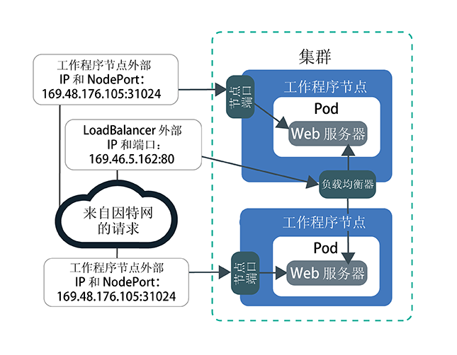
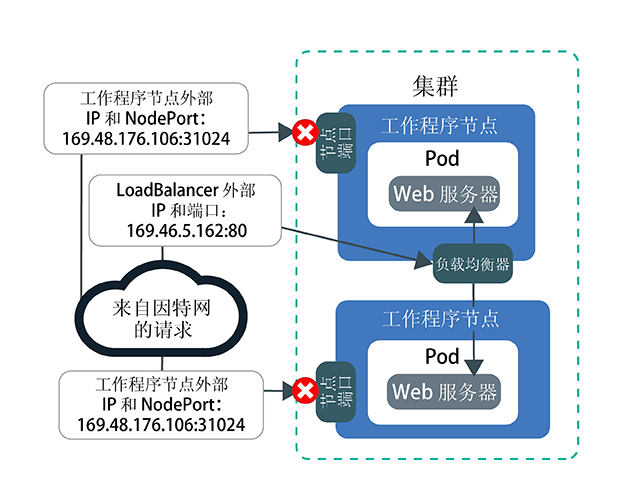
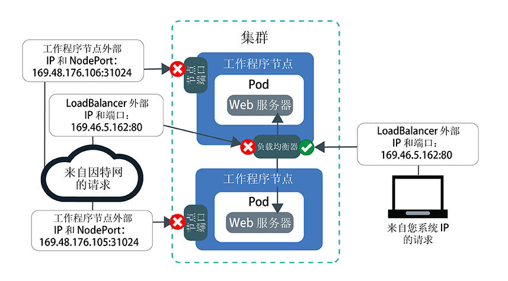

---

copyright:
  years: 2014, 2019
lastupdated: "2019-06-11"

keywords: kubernetes, iks

subcollection: containers

---

{:new_window: target="_blank"}
{:shortdesc: .shortdesc}
{:screen: .screen}
{:pre: .pre}
{:table: .aria-labeledby="caption"}
{:codeblock: .codeblock}
{:tip: .tip}
{:note: .note}
{:important: .important}
{:deprecated: .deprecated}
{:download: .download}
{:preview: .preview}


# 教程：使用 Calico 网络策略阻止流量
{: #policy_tutorial}

缺省情况下，Kubernetes NodePort、LoadBalancer 和 Ingress 服务能使应用程序在所有公共和专用集群网络接口上都可用。`allow-node-port-dnat` 缺省 Calico 策略允许来自 NodePort、网络负载均衡器 (NLB) 和 Ingress 应用程序负载均衡器 (ALB) 服务的入局流量流至这些服务公开的应用程序 pod。Kubernetes 会使用目标网络地址转换 (DNAT) 将服务请求转发到正确的 pod。
{: shortdesc}

但是，出于安全原因，您可能需要仅允许来自特定源 IP 地址的流量流至联网服务。可以使用 [Calico DNAT 前策略 ](https://docs.projectcalico.org/v3.1/getting-started/bare-metal/policy/pre-dnat) 将流量流入或流出的特定 IP 地址列入白名单或黑名单。DNAT 前策略会阻止指定流量到达应用程序，因为会在 Kubernetes 使用常规 DNAT 将流量转发到 pod 之前应用这些策略。创建 Calico DNAT 前策略时，可以选择是将源 IP 地址列入白名单还是黑名单。对于大多数场景，白名单可提供最安全的配置，因为除了来自已知的允许源 IP 地址的流量之外，将阻止其他所有流量。黑名单通常仅在阻止来自一小组 IP 地址的攻击等场景中有用。

在此场景中，您扮演的是公关公司的网络管理员角色，并且您注意到应用程序遇到一些异常流量。本教程中的课程将全程指导您创建样本 Web 服务器应用程序，使用网络负载均衡器 (NLB) 服务公开应用程序，以及使用白名单和黑名单 Calico 策略保护应用程序不受不需要的异常流量的影响。

## 目标
{: #policies_objectives}

- 了解如何通过创建高位 DNAT 前策略，阻止流至所有节点端口的所有入局流量。
- 了解如何通过创建低位 DNAT 前策略，允许列入白名单的源 IP 地址访问 NLB 公共 IP 和端口。低位策略会覆盖高位策略。
- 了解如何通过创建低位 DNAT 前策略，阻止列入黑名单的源 IP 地址访问 NLB 公共 IP 和端口。

## 所需时间
{: #policies_time}

1 小时

## 受众
{: #policies_audience}

本教程适用于希望管理应用程序的网络流量的软件开发者和网络管理员。

## 先决条件
{: #policies_prereqs}

- [创建集群](/docs/containers?topic=containers-clusters#clusters_ui)。
- [设定 CLI 的目标为集群](/docs/containers?topic=containers-cs_cli_install#cs_cli_configure)。
- [安装和配置 Calico CLI](/docs/containers?topic=containers-network_policies#cli_install)。
- 确保您具有用于 {{site.data.keyword.containerlong_notm}} 的以下 {{site.data.keyword.Bluemix_notm}} IAM 访问策略：
    - [任何平台角色](/docs/containers?topic=containers-users#platform)
    - [**写入者**或**管理者**服务角色](/docs/containers?topic=containers-users#platform)

<br />


## 第 1 课：部署应用程序并使用 NLB 将其公开
{: #lesson1}

第一课说明如何从多个 IP 地址和端口公开应用程序，以及公共流量进入集群的位置。
{: shortdesc}

首先，部署要在整个教程中使用的样本 Web 服务器应用程序。`echoserver` Web 服务器显示有关从客户机与集群建立的连接的数据，并且您可以测试对公关公司集群的访问。然后，通过创建网络负载均衡器 (NLB) 1.0 服务来公开应用程序。NLB 1.0 服务通过 NLB 服务 IP 地址和工作程序节点的节点端口使应用程序可用。

要使用 Ingress 应用程序负载均衡器 (ALB) 吗？请不要在步骤 3 和 4 中创建 NLB，而改为[为 Web 服务器应用程序创建服务](/docs/containers?topic=containers-ingress#public_inside_1)，并[为 Web 服务器应用程序创建 Ingress 资源](/docs/containers?topic=containers-ingress#public_inside_4)。接着，通过运行 `ibmcloud ks albs --cluster <cluster_name>` 来获取 ALB 的公共 IP，然后在本教程中使用这些 IP 来替代 `<loadbalancer_IP>`。
{: tip}

下图显示了在第 1 课结束时，Web 服务器应用程序如何通过公共节点端口和公共 NLB 公开到因特网：



1. 部署样本 Web 服务器应用程序。连接到该 Web 服务器应用程序时，应用程序会使用在连接中接收到的 HTTP 头进行响应。
    ```
    kubectl run webserver --image=k8s.gcr.io/echoserver:1.10 --replicas=3
    ```
    {: pre}

2. 验证 Web 服务器应用程序 pod 的 **STATUS** 是否为 `Running`。
    ```
    kubectl get pods -o wide
    ```
    {: pre}

    输出示例：
    ```
    NAME                         READY     STATUS    RESTARTS   AGE       IP               NODE
    webserver-855556f688-6dbsn   1/1       Running   0          1m        172.30.xxx.xxx   10.176.48.78
    webserver-855556f688-76rkp   1/1       Running   0          1m        172.30.xxx.xxx   10.176.48.78
    webserver-855556f688-xd849   1/1       Running   0          1m        172.30.xxx.xxx   10.176.48.78
    ```
    {: screen}

3. 要将应用程序公开到公用因特网，请在文本编辑器中创建名为 `webserver-lb.yaml` 的 NLB 1.0 服务配置文件。
    ```
    apiVersion: v1
    kind: Service
    metadata:
      labels:
        run: webserver
      name: webserver-lb
    spec:
      type: LoadBalancer
      selector:
        run: webserver
      ports:
      - name: webserver-port
        port: 80
        protocol: TCP
        targetPort: 8080
    ```
    {: codeblock}

4. 部署 NLB。
    ```
    kubectl apply -f filepath/webserver-lb.yaml
    ```
    {: pre}

5. 验证是否可以从您的计算机以公共方式访问由 NLB 公开的应用程序。

    1. 获取 NLB 的公共 **EXTERNAL-IP** 地址。
        ```
        kubectl get svc -o wide
        ```
        {: pre}

        输出示例：
        ```
        NAME           CLUSTER-IP       EXTERNAL-IP        PORT(S)        AGE       SELECTOR
        webserver-lb   172.21.xxx.xxx   169.xx.xxx.xxx     80:31024/TCP   2m        run=webserver
        ```
        {: screen}

    2. 创建备忘单文本文件，并将 NLB IP 复制到该文本文件中。备忘单将帮助您更快地在后面课程中使用值。

    3. 验证是否能够以公共方式访问 NLB 的外部 IP。
        ```
        curl --connect-timeout 10 <loadbalancer_IP>:80
        ```
        {: pre}

        以下输出示例确认 NLB 在 `169.1.1.1` 公共 NLB IP 地址上公开了应用程序。`webserver-855556f688-76rkp` 应用程序 pod 收到了 curl 请求：
        ```
        Hostname: webserver-855556f688-76rkp
        Pod Information:
            -no pod information available-
        Server values:
            server_version=nginx: 1.13.3 - lua: 10008
        Request Information:
            client_address=1.1.1.1
            method=GET
            real path=/
            query=
            request_version=1.1
            request_scheme=http
            request_uri=http://169.1.1.1:8080/
        Request Headers:
            accept=*/*
            host=169.1.1.1
            user-agent=curl/7.54.0
        Request Body:
            -no body in request-
        ```
        {: screen}

6. 验证是否可以从您的计算机以公共方式访问由节点端口公开的应用程序。NLB 服务通过 NLB 服务 IP 地址和工作程序节点的节点端口使应用程序可用。

    1. 获取 NLB 分配给工作程序节点的节点端口。节点端口的范围是 30000-32767。
        ```
        kubectl get svc -o wide
        ```
        {: pre}

        在以下输出示例中，节点端口为 `31024`：
    ```
        NAME           CLUSTER-IP       EXTERNAL-IP        PORT(S)        AGE       SELECTOR
        webserver-lb   172.21.xxx.xxx   169.xx.xxx.xxx     80:31024/TCP   2m        run=webserver
        ```
        {: screen}  

    2. 获取工作程序节点的 **Public IP** 地址。
        ```
        ibmcloud ks workers --cluster <cluster_name>
        ```
        {: pre}

        输出示例：
        ```
        ID                                                 Public IP        Private IP     Machine Type        State    Status   Zone    Version   
        kube-dal10-cr18e61e63c6e94b658596ca93d087eed9-w1   169.xx.xxx.xxx   10.176.48.67   u3c.2x4.encrypted   normal   Ready    dal10   1.13.6_1513*   
        kube-dal10-cr18e61e63c6e94b658596ca93d087eed9-w2   169.xx.xxx.xxx   10.176.48.79   u3c.2x4.encrypted   normal   Ready    dal10   1.13.6_1513*   
        kube-dal10-cr18e61e63c6e94b658596ca93d087eed9-w3   169.xx.xxx.xxx   10.176.48.78   u3c.2x4.encrypted   normal   Ready    dal10   1.13.6_1513*   
        ```
        {: screen}

    3. 将工作程序节点的公共 IP 以及节点端口复制到文本备忘单中，以便在后面的课程中使用。

    4. 验证是否可以通过节点端口访问工作程序节点的公共 IP 地址。
        ```
        curl  --connect-timeout 10 <worker_IP>:<NodePort>
        ```
        {: pre}

        以下输出示例确认对应用程序的请求通过工作程序节点的专用 IP 地址 `10.1.1.1` 和节点端口 `31024` 传入。`webserver-855556f688-xd849` 应用程序 pod 收到了 curl 请求：
        ```
        Hostname: webserver-855556f688-xd849
        Pod Information:
            -no pod information available-
        Server values:
            server_version=nginx: 1.13.3 - lua: 10008
        Request Information:
            client_address=1.1.1.1
            method=GET
            real path=/
            query=
            request_version=1.1
            request_scheme=http
            request_uri=http://10.1.1.1:8080/
        Request Headers:
            accept=*/*
            host=10.1.1.1:31024
            user-agent=curl/7.60.0
        Request Body:
            -no body in request-
        ```
        {: screen}

此时，应用程序已从多个 IP 地址和端口公开。这些 IP 中大部分都是集群内部 IP，只能通过专用网络进行访问。只有公共节点端口和公共 NLB 端口会公开到公用因特网。

接下来，您可以开始创建并应用 Calico 策略来阻止公共流量。

## 第 2 课：阻止流至所有节点端口的所有入局流量
{: #lesson2}

要保护公关公司的集群，必须阻止对公开应用程序的 NLB 服务和节点端口的公共访问。首先是阻止对节点端口的访问。
{: shortdesc}

下图显示了在第 2 课结束时，如何允许流量流至 NLB，但不允许流至节点端口：



1. 在文本编辑器中，创建名为 `deny-nodeports.yaml` 的高位 DNAT 前策略，以拒绝来自任何源 IP 的入局 TCP 和 UDP 流量流至所有节点端口。
    ```
    apiVersion: projectcalico.org/v3
    kind: GlobalNetworkPolicy
    metadata:
      name: deny-nodeports
    spec:
      applyOnForward: true
      preDNAT: true
      ingress:
      - action: Deny
        destination:
          ports:
          - 30000:32767
        protocol: TCP
        source: {}
      - action: Deny
        destination:
          ports:
          - 30000:32767
        protocol: UDP
        source: {}
      selector: ibm.role=='worker_public'
      order: 1100
      types:
      - Ingress
        ```
    {: codeblock}

2. 应用该策略。
    - Linux：


      ```
      calicoctl apply -f filepath/deny-nodeports.yaml
      ```
      {: pre}

    - Windows 和 OS X：

      ```
      calicoctl apply -f filepath/deny-nodeports.yaml --config=filepath/calicoctl.cfg
      ```
      {: pre}
  输出示例：
  ```
  Successfully applied 1 'GlobalNetworkPolicy' resource(s)
  ```
  {: screen}

3. 使用备忘单中的值，验证是否无法以公共方式访问工作程序节点公共 IP 地址和节点端口。
    ```
    curl  --connect-timeout 10 <worker_IP>:<NodePort>
    ```
    {: pre}

    由于创建的 Calico 策略阻止流至节点端口的流量，因此连接会超时。
    ```
    curl: (28) Connection timed out after 10016 milliseconds
    ```
    {: screen}

4. 将上一课中创建的 LoadBalancer 的 externalTrafficPolicy 从 `Cluster` 更改为 `Local`。`Local` 可确保在下一步中对 LoadBalancer 的外部 IP 时运行 curl 命令时保留系统的源 IP。
    ```
    kubectl patch svc webserver -p '{"spec":{"externalTrafficPolicy":"Local"}}'
    ```
    {: pre}

5. 使用备忘单中的值，验证是否仍能够以公共方式访问 NLB 外部 IP 地址。
    ```
    curl --connect-timeout 10 <loadbalancer_IP>:80
    ```
    {: pre}

    输出示例：
    ```
    Hostname: webserver-855556f688-76rkp
    Pod Information:
        -no pod information available-
    Server values:
        server_version=nginx: 1.13.3 - lua: 10008
    Request Information:
        client_address=1.1.1.1
        method=GET
        real path=/
        query=
        request_version=1.1
        request_scheme=http
        request_uri=http://<loadbalancer_IP>:8080/
    Request Headers:
        accept=*/*
        host=<loadbalancer_IP>
        user-agent=curl/7.54.0
    Request Body:
        -no body in request-
    ```
    {: screen}
    例如，在输出的 `Request Information` 部分中，源 IP 地址为 `client_address=1.1.1.1`。源 IP 地址是用于运行 curl 的系统的公共 IP。反之，如果通过代理或 VPN 连接到因特网，代理或 VPN 可能会隐藏系统的实际 IP 地址。在任一情况下，NLB 都会将系统的源 IP 地址视为客户机 IP 地址。

6. 将系统的源 IP 地址（上一步输出中的 `client_address=1.1.1.1`）复制到备忘单中以在后面的课程中使用。

太好了！此时，应用程序仅从公共 NLB 端口公开到公用因特网。将阻止流至公共节点端口的流量。已部分锁定集群以阻止不需要的流量。

接下来，您可以创建并应用 Calico 策略将来自某些源 IP 的流量列入白名单。

## 第 3 课：允许来自列入白名单的 IP 的入局流量流至 NLB
{: #lesson3}

现在，您决定通过仅将自己计算机的 IP 地址列入白名单，以完全锁定流至公关公司集群的流量并测试访问。
{: shortdesc}

首先，除了节点端口外，还必须阻止流至公开应用程序的 NLB 的所有入局流量。然后，可以创建一个策略，用于将系统的 IP 地址列入白名单。在第 3 课结束时，将阻止流至公共节点端口和 NLB 的所有流量，并且只允许来自列入白名单的系统 IP 的流量：



1. 在文本编辑器中，创建名为 `deny-lb-port-80.yaml` 的高位 DNAT 前策略，以拒绝来自任何源 IP 的所有入局 TCP 和 UDP 流量流至 NLB IP 地址和端口。将 `<loadbalancer_IP>` 替换为备忘单中的 NLB 公共 IP 地址。

    ```
    apiVersion: projectcalico.org/v3
    kind: GlobalNetworkPolicy
    metadata:
      name: deny-lb-port-80
    spec:
      applyOnForward: true
      preDNAT: true
      ingress:
      - action: Deny
        destination:
          nets:
          - <loadbalancer_IP>/32
          ports:
          - 80
        protocol: TCP
        source: {}
      - action: Deny
        destination:
          nets:
          - <loadbalancer_IP>/32
          ports:
          - 80
        protocol: UDP
        source: {}
      selector: ibm.role=='worker_public'
      order: 800
      types:
      - Ingress
        ```
    {: codeblock}

2. 应用该策略。
    - Linux：


      ```
      calicoctl apply -f filepath/deny-lb-port-80.yaml
      ```
      {: pre}

    - Windows 和 OS X：

      ```
      calicoctl apply -f filepath/deny-lb-port-80.yaml --config=filepath/calicoctl.cfg
      ```
      {: pre}

3. 使用备忘单中的值，验证是否现在无法访问公共 NLB IP 地址。由于创建的 Calico 策略阻止流至 NLB 的流量，因此连接会超时。
    ```
    curl --connect-timeout 10 <loadbalancer_IP>:80
    ```
    {: pre}

4. 在文本编辑器中，创建名为 `whitelist.yaml` 的低位 DNAT 前策略，以允许来自系统 IP 的流量流至 NLB IP 地址和端口。使用备忘单中的值，将 `<loadbalancer_IP>` 替换为 NLB 的公共 IP 地址，将 `<client_address>` 替换为系统源 IP 的公共 IP 地址。
    如果记不住系统 IP，可以运行 `curl ifconfig.co`。
    ```
    apiVersion: projectcalico.org/v3
    kind: GlobalNetworkPolicy
    metadata:
      name: whitelist
    spec:
      applyOnForward: true
      preDNAT: true
      ingress:
      - action: Allow
        destination:
          nets:
          - <loadbalancer_IP>/32
          ports:
          - 80
        protocol: TCP
        source:
          nets:
          - <client_address>/32
      selector: ibm.role=='worker_public'
      order: 500
      types:
      - Ingress
        ```
    {: codeblock}

5. 应用该策略。
    - Linux：


      ```
      calicoctl apply -f filepath/whitelist.yaml
      ```
      {: pre}

    - Windows 和 OS X：

      ```
      calicoctl apply -f filepath/whitelist.yaml --config=filepath/calicoctl.cfg
      ```
      {: pre}
  现在，系统的 IP 地址已列入白名单。

6. 使用备忘单中的值，验证是否现在可以访问公共 NLB IP 地址。
    ```
    curl --connect-timeout 10 <loadbalancer_IP>:80
    ```
    {: pre}

7. 如果您有权访问具有不同 IP 地址的另一个系统，请尝试从该系统访问 NLB。
    ```
    curl --connect-timeout 10 <loadbalancer_IP>:80
    ```
    {: pre}
    由于该系统的 IP 地址未列入白名单，因此连接会超时。

此时，将阻止流至公共节点端口和 NLB 的所有流量。只允许来自列入白名单的系统 IP 的流量。

## 第 4 课：拒绝来自列入黑名单的 IP 的入局流量流至 NLB
{: #lesson4}

在上一课中，您阻止了所有流量，并且只将若干 IP 列入了白名单。针对您希望将访问仅限于若干个受控源 IP 地址的测试目的，该场景非常适用。但是，公关公司拥有需要可供公众广泛使用的应用程序。因此，除了发现的来自若干 IP 地址的异常流量外，您需要确保允许其他所有流量。黑名单在像这样的场景中非常有用，因为它可以帮助您阻止来自一小组 IP 地址的攻击。
{: shortdesc}

在本课程中，您将通过阻止来自自己系统的源 IP 地址的流量来测试黑名单功能。在第 4 课结束时，将阻止流至公共节点端口的所有流量，但允许流至公共 NLB 的所有流量。只阻止来自列入黑名单的系统 IP 的流量流至 NLB：


1. 清除上一课中创建的白名单策略。
    
    - Linux：
      ```
      calicoctl delete GlobalNetworkPolicy deny-lb-port-80
      ```
      {: pre}
      ```
    calicoctl delete GlobalNetworkPolicy whitelist
    ```
      {: pre}

    - Windows 和 OS X：
      ```
      calicoctl delete GlobalNetworkPolicy deny-lb-port-80 --config=filepath/calicoctl.cfg
      ```
      {: pre}
      ```
      calicoctl delete GlobalNetworkPolicy whitelist --config=filepath/calicoctl.cfg
      ```
      {: pre}

    现在，再次允许来自任何源 IP 的所有入局 TCP 和 UDP 流量流至 NLB IP 地址和端口。

2. 要拒绝来自系统的源 IP 地址的所有入局 TCP 和 UDP 流量流至 NLB IP 地址和端口，请在文本编辑器中创建名为 `blacklist.yaml` 的低位 DNAT 前策略。使用备忘单中的值，将 `<loadbalancer_IP>` 替换为 NLB 的公共 IP 地址，将 `<client_address>` 替换为系统源 IP 的公共 IP 地址。
  ```
  apiVersion: projectcalico.org/v3
  kind: GlobalNetworkPolicy
  metadata:
    name: blacklist
  spec:
    applyOnForward: true
    preDNAT: true
    ingress:
    - action: Deny
      destination:
        nets:
        - <loadbalancer_IP>/32
        ports:
        - 80
      protocol: TCP
      source:
        nets:
        - <client_address>/32
    - action: Deny
      destination:
        nets:
        - <loadbalancer_IP>/32
        ports:
        - 80
      protocol: UDP
      source:
        nets:
        - <client_address>/32
    selector: ibm.role=='worker_public'
    order: 500
    types:
    - Ingress
  ```
  {: codeblock}

3. 应用该策略。
    - Linux：


      ```
      calicoctl apply -f filepath/blacklist.yaml
      ```
      {: pre}

    - Windows 和 OS X：

      ```
      calicoctl apply -f filepath/blacklist.yaml --config=filepath/calicoctl.cfg
      ```
      {: pre}
  现在，系统的 IP 地址已列入黑名单。

4. 使用备忘单中的值，从系统验证您是否由于系统的 IP 已列入黑名单而无法访问 NLB IP。
    ```
    curl --connect-timeout 10 <loadbalancer_IP>:80
    ```
    {: pre}
    此时，将阻止流至公共节点端口的所有流量，但允许流至公共 NLB 的所有流量。只阻止来自列入黑名单的系统 IP 的流量流至 NLB。

非常好！您已通过使用 Calico DNAT 前策略将源 IP 列入黑名单，成功控制了流至应用程序的流量。

## 第 5 课：记录从列入黑名单的 IP 流至 NLB 的被阻止流量
{: #lesson5}

在上一课中，您将从系统 IP 流至 NLB 的流量列入了黑名单。在本课中，您可以了解如何记录被拒绝的流量请求。
{: shortdesc}

在示例场景中，您工作的公关公司希望您设置日志记录跟踪，以记录被某个网络策略持续拒绝的任何异常流量。要监视潜在安全威胁，可以设置日志记录，以在每次黑名单策略拒绝对 NLB IP 尝试的操作时进行记录。

1. 创建名为 `log-denied-packets` 的 Calico NetworkPolicy。此日志策略使用与 `blacklist` 策略相同的选择器，这会将此策略添加到 Calico Iptables 规则链。通过使用更低位的数字（例如，`300`），可确保将此规则添加到 Iptables 规则链中 blacklist 策略之前。来自 IP 的包在尝试匹配 `blacklist` 策略规则并被拒绝之前，会由此策略进行记录。
  ```
  apiVersion: projectcalico.org/v3
  kind: GlobalNetworkPolicy
  metadata:
    name: log-denied-packets
  spec:
    applyOnForward: true
    preDNAT: true
    ingress:
    - action: Log
      destination:
        nets:
        - <loadbalancer_IP>/32
        ports:
        - 80
      protocol: TCP
      source:
        nets:
        - <client_address>/32
    - action: Deny
      destination:
        nets:
        - <loadbalancer_IP>/32
        ports:
        - 80
      protocol: UDP
      source:
        nets:
        - <client_address>/32
    selector: ibm.role=='worker_public'
    order: 300
    types:
    - Ingress
  ```
  {: codeblock}

2. 应用该策略。
  ```
    calicoctl apply -f log-denied-packets.yaml --config=<filepath>/calicoctl.cfg
    ```
  {: pre}

3. 通过将请求从系统 IP 发送到 NLB IP 来生成日志条目。这些请求包在被拒绝之前会进行记录。
  ```
    curl --connect-timeout 10 <loadbalancer_IP>:80
    ```
  {: pre}

4. 检查写入 `/var/log/syslog` 路径的日志条目。日志条目类似于以下内容。
  ```
  Sep 5 14:34:40 <worker_hostname> kernel: [158271.044316] calico-packet: IN=eth1 OUT= MAC=08:00:27:d5:4e:57:0a:00:27:00:00:00:08:00 SRC=192.XXX.XX.X DST=192.XXX.XX.XX LEN=60 TOS=0x00 PREC=0x00 TTL=64 ID=52866 DF PROTO=TCP SPT=42962 DPT=22 WINDOW=29200 RES=0x00 SYN URGP=0
  ```
  {: screen}

非常好！您已设置日志记录，现在可以更轻松地监视列入黑名单的流量。

如果要清除黑名单和日志策略，请执行以下操作：
1. 清除黑名单策略。
    - Linux：
      ```
    calicoctl delete GlobalNetworkPolicy blacklist
    ```
      {: pre}

    - Windows 和 OS X：
      ```
      calicoctl delete GlobalNetworkPolicy blacklist --config=filepath/calicoctl.cfg
      ```
      {: pre}

2. 清除日志策略。
    - Linux：
      ```
      calicoctl delete GlobalNetworkPolicy log-denied-packets
      ```
      {: pre}

    - Windows 和 OS X：
      ```
      calicoctl delete GlobalNetworkPolicy log-denied-packets --config=filepath/calicoctl.cfg
      ```
      {: pre}

## 接下来要做什么？
{: #whats_next}

* 请阅读有关[使用网络策略控制流量](/docs/containers?topic=containers-network_policies)的更多信息。
* 有关用于控制流入和流出集群的流量的更多示例 Calico 网络策略，可以查看 [Stars Policy Demo ](https://docs.projectcalico.org/v3.1/getting-started/kubernetes/tutorials/stars-policy/) 和 [Advanced Network Policy ](https://docs.projectcalico.org/v3.1/getting-started/kubernetes/tutorials/advanced-policy)。
