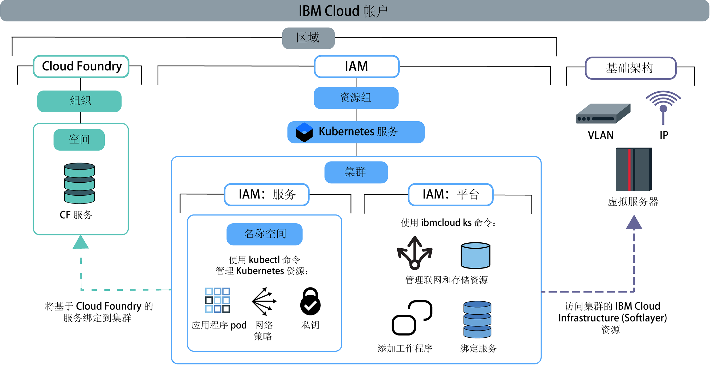

---

copyright:
  years: 2014, 2019
lastupdated: "2019-06-12"

keywords: kubernetes, iks

subcollection: containers

---

{:new_window: target="blank"}
{:shortdesc: .shortdesc}
{:screen: .screen}
{:pre: .pre}
{:table: .aria-labeledby="caption"}
{:codeblock: .codeblock}
{:tip: .tip}
{:note: .note}
{:important: .important}
{:deprecated: .deprecated}
{:download: .download}
{:preview: .preview}


# 分配集群访问权
{: #users}

作为集群管理员，您可以为 {{site.data.keyword.containerlong}} 集群定义访问策略，以便为不同用户创建不同级别的访问权。例如，您可以授权某些用户使用集群基础架构资源，而其他用户只能部署容器。
{: shortdesc}

自 2019 年 1 月 30 日开始，{{site.data.keyword.containerlong_notm}} 采用新的方式通过 {{site.data.keyword.Bluemix_notm}} IAM：[服务访问角色](/docs/containers?topic=containers-access_reference#service)来对用户授权。这些服务角色用于授予对集群中资源（例如，Kubernetes 名称空间）的访问权。有关更多信息，请查看博客 [Introducing service roles and namespaces in IAM for more granular control of cluster access ](https://www.ibm.com/blogs/bluemix/2019/02/introducing-service-roles-and-namespaces-in-iam-for-more-granular-control-of-cluster-access/)。
{: note}

## 了解访问策略和角色
{: #access_policies}

访问策略确定 {{site.data.keyword.Bluemix_notm}} 帐户中用户对整个 {{site.data.keyword.Bluemix_notm}} 平台上资源具有的访问级别。策略会为用户分配一个或多个角色，这些角色定义对单个服务或在资源组中组织在一起的一组服务和资源的访问权作用域。{{site.data.keyword.Bluemix_notm}} 中的每个服务可能都需要自己的一组访问策略。
{: shortdesc}

在制定管理用户访问权的计划时，请考虑以下常规步骤：
1.  [为用户选取适当的访问策略和角色](#access_roles)
2.  [在 {{site.data.keyword.Bluemix_notm}} IAM 中将访问角色分配给单个用户或用户组](#iam_individuals_groups)
3.  [将用户访问权的作用域限定为集群实例、Kubernetes 名称空间或资源组](#resource_groups)

了解如何管理帐户中的角色、用户和资源后，请查看[设置集群访问权](#access-checklist)以获取如何配置访问权的核对表。

### 为用户选取适当的访问策略和角色
{: #access_roles}

必须为使用 {{site.data.keyword.containerlong_notm}} 的每个用户定义访问策略。访问策略的作用域基于用户定义的一个或多个角色，这些角色确定用户可以执行的操作。某些策略是预定义策略，但其他策略可以进行定制。无论用户是通过 {{site.data.keyword.containerlong_notm}} 控制台还是通过 CLI 发出请求，都将强制执行同一策略；即便在 IBM Cloud Infrastructure (SoftLayer) 中完成这些操作也是如此。
{: shortdesc}

下图显示了不同类型的许可权和角色，哪个角色可以执行哪类操作，以及这些角色如何相互关联。



要查看每个角色的特定 {{site.data.keyword.containerlong_notm}} 许可权，请查看[用户访问许可权](/docs/containers?topic=containers-access_reference)参考主题。
{: tip}

<dl>
<dt><a href="#platform">{{site.data.keyword.Bluemix_notm}} IAM 平台和服务角色</a></dt>
<dd>{{site.data.keyword.containerlong_notm}} 使用 {{site.data.keyword.Bluemix_notm}} Identity and Access Management (IAM) 平台和服务角色来授予用户对集群的访问权。
<ul><li>**平台**：平台角色使用 {{site.data.keyword.containerlong_notm}} API、控制台和 CLI (`ibmcloud ks`) 来确定用户可以对集群基础架构执行的操作。平台角色不授予对 Kubernetes API 的访问权。您可以按资源组、区域或集群实例为这些角色设置策略。虽然平台角色会授权您对集群执行基础架构操作，但不会授予对 IBM Cloud Infrastructure (SoftLayer) 资源的访问权。对 IBM Cloud Infrastructure (SoftLayer) 资源的访问权由[为区域设置的 API 密钥](#api_key)确定。平台角色允许的示例操作包括创建或除去集群，将服务绑定到集群，管理联网和存储资源，或添加额外的工作程序节点。<br><br>如果仅为用户分配平台角色，那么他们无法与集群中的 Kubernetes 资源进行交互。但是，他们仍可以执行 `ibmcloud ks cluster-config` [命令](/docs/containers?topic=containers-cli-plugin-kubernetes-service-cli#cs_cluster_config)。然后，可以使用[定制 RBAC 策略](/docs/containers?topic=containers-users#role-binding)，授权用户执行精选 Kubernetes 操作。如果您的组织当前是使用定制 RBAC 策略来控制 Kubernetes 访问权，并且计划继续使用定制 RBAC，而不使用服务角色，那么您可以执行此操作。</li>
<li>**服务**：服务角色授予在集群中向用户提供的相应 Kubernetes RBAC 策略。因此，服务角色会授予对 Kubernetes API、仪表板和 CLI (`kubectl`) 的访问权。您可以按资源组、区域或集群实例限定服务角色策略的作用域。此外，还可以将服务角色的作用域限定为所有集群、单个集群或区域范围集群中的 Kubernetes 名称空间。将服务角色的作用域限定为名称空间时，不能将策略应用于资源组，也不能同时分配平台角色。服务角色允许的示例操作包括创建应用程序部署，添加名称空间或设置配置映射。<br><br>如果仅为用户分配服务角色，那么他们无法查看任何 {{site.data.keyword.containerlong_notm}} 资源或与这些资源进行交互。要使用户能够访问集群并使用集群的 Kubernetes 资源，必须为用户提供集群名称和标识，以便他们可以执行 `ibmcloud ks cluster-config` [命令](/docs/containers?topic=containers-cli-plugin-kubernetes-service-cli#cs_cluster_config)，然后[通过 CLI 启动 Kubernetes 仪表板](/docs/containers?topic=containers-app#db_cli)。如果希望这些用户仍能够通过 CLI 访问 {{site.data.keyword.containerlong_notm}} 集群控制台，并列出集群和其他基础架构资源，请授予用户**查看者**平台角色。</li></ul></dd>
<dt><a href="#role-binding">RBAC</a></dt>
<dd>在 Kubernetes 中，基于角色的访问控制 (RBAC) 是保护集群中资源的一种方法。RBAC 角色确定用户可对这些资源执行的 Kubernetes 操作。分配有服务角色的每个用户都将自动分配有相应的 RBAC 集群角色。此 RBAC 集群角色将应用于特定名称空间或所有名称空间，具体取决于您是否将策略的作用域限定为某个名称空间。</br></br>RBAC 角色允许的示例操作包括创建对象（如 pod）或读取 pod 日志。</dd>
<dt><a href="#api_key">基础架构</a></dt>
<dd>基础架构角色支持访问 IBM Cloud Infrastructure (SoftLayer) 资源。设置具有**超级用户**基础架构角色的用户，并将此用户的基础架构凭证存储在 API 密钥中。然后，在要创建集群的每个区域中设置 API 密钥。设置 API 密钥后，您为其授予 {{site.data.keyword.containerlong_notm}} 访问权的其他用户无需基础架构角色，因为该区域中的所有用户会共享该 API 密钥。{{site.data.keyword.Bluemix_notm}} IAM 平台角色改为确定允许用户执行的基础架构操作。如果未使用完全<strong>超级用户</strong>基础架构角色设置 API 密钥，或者需要为用户授予特定设备访问权，那么可以[定制基础架构许可权](#infra_access)。</br></br>
基础架构角色允许的示例操作包括查看集群工作程序节点机器的详细信息或编辑联网和存储资源。</dd>
<dt>Cloud Foundry</dt>
<dd>并非所有服务都可以通过 {{site.data.keyword.Bluemix_notm}} IAM 进行管理。如果使用的是无法通过 IAM 管理的其中一个服务，那么可以继续使用 Cloud Foundry 用户角色来控制对这些服务的访问。Cloud Foundry 角色会授予对帐户内组织和空间的访问权。要在 {{site.data.keyword.Bluemix_notm}} 中查看基于 Cloud Foundry 的服务的列表，请运行 <code>ibmcloud service list</code>。</br></br>
Cloud Foundry 角色允许的示例操作包括创建新的 Cloud Foundry 服务实例或将 Cloud Foundry 服务实例绑定到集群。要了解更多信息，请参阅 {{site.data.keyword.Bluemix_notm}} IAM 文档中的可用[组织和空间角色](/docs/iam?topic=iam-cfaccess)或[管理 Cloud Foundry 访问权](/docs/iam?topic=iam-mngcf)的步骤。</dd>
</dl>

### 在 {{site.data.keyword.Bluemix_notm}} IAM 中将访问角色分配给单个用户或用户组
{: #iam_individuals_groups}

设置 {{site.data.keyword.Bluemix_notm}} IAM 策略时，可以将角色分配给单个用户或用户组。
{: shortdesc}

<dl>
<dt>单个用户</dt>
<dd>您可能有特定用户需要的许可权多于或少于团队中其他用户的许可权。您可以分别定制许可权，以便每人都具有完成其任务所需的许可权。您可以为每个用户分配多个 {{site.data.keyword.Bluemix_notm}} IAM 角色。</dd>
<dt>访问组中的多个用户</dt>
<dd>您可以创建一组用户，然后为该组分配许可权。例如，您可以将所有团队负责人分组在一起，并将管理员访问权分配给该组。然后，可以将所有开发者分组在一起，并为该组仅分配写访问权。您可以为每个访问组分配多个 {{site.data.keyword.Bluemix_notm}} IAM 角色。为组分配许可权后，将影响添加到该组或从该组中除去的任何用户。如果将用户添加到组，那么这些用户还具有该组所授予的额外访问权。如果从组中除去用户，那么将撤销其访问权。
</dd>
</dl>

无法为服务帐户分配 {{site.data.keyword.Bluemix_notm}} IAM 角色。可以改为直接[为服务帐户分配 RBAC 角色](#rbac)。
{: tip}

您还必须指定用户是有权访问一个资源组中的一个集群、一个资源组中的所有集群，还是帐户中所有资源组中的所有集群。

### 将用户访问权的作用域限定为集群实例、名称空间或资源组
{: #resource_groups}

在 {{site.data.keyword.Bluemix_notm}} IAM 中，您可以为用户分配对资源实例、Kubernetes 名称空间或资源组的访问角色。
{: shortdesc}

创建 {{site.data.keyword.Bluemix_notm}} 帐户时，将自动创建缺省资源组。如果在创建资源时未指定资源组，那么资源实例（集群）会属于缺省资源组。在 {{site.data.keyword.Bluemix_notm}} IAM 中，Kubernetes 名称空间是一种资源类型的资源实例（集群）。如果要在帐户中添加资源组，请参阅[设置帐户的最佳实践](/docs/account?topic=account-account_setup)和[设置资源组](/docs/resources?topic=resources-bp_resourcegroups#setuprgs)。

<dl>
<dt>资源实例</dt>
  <dd><p>帐户中的每个 {{site.data.keyword.Bluemix_notm}} 服务都是具有实例的资源。实例因服务而异。例如，在 {{site.data.keyword.containerlong_notm}} 中，实例是集群，但在 {{site.data.keyword.cloudcerts_long_notm}} 中，实例是证书。缺省情况下，资源还属于您帐户中的缺省资源组。对于以下场景，您可以为用户分配对资源实例的访问角色。
  <ul><li>帐户中的所有 {{site.data.keyword.Bluemix_notm}} IAM 服务，包括 {{site.data.keyword.containerlong_notm}} 中的所有集群和 {{site.data.keyword.registrylong_notm}} 中的映像。</li>
  <li>服务内的所有实例，例如 {{site.data.keyword.containerlong_notm}} 中的所有集群。</li>
  <li>服务区域内的所有实例，例如 {{site.data.keyword.containerlong_notm}} 的**美国南部**区域中的所有集群。</li>
  <li>单个实例（例如，一个集群）。</li></ul></dd>
<dt>Kubernetes 名称空间</dt>
  <dd><p>作为 {{site.data.keyword.Bluemix_notm}} IAM 中集群资源实例的一部分，您可以为用户分配对集群中 Kubernetes 名称空间的服务访问角色。</p>
  <p>分配对名称空间的访问权时，策略将应用于您授权的所有集群中该名称空间的所有当前和未来实例。例如，假设您希望 `dev` 用户组能够在亚太地区北部所有集群中的 `test` 名称空间中部署 Kubernetes 资源。如果为 `dev` 访问组分配了对 `default` 资源组中亚太地区北部区域所有集群中的 Kubernetes 名称空间 test 的**写入者**服务访问角色，那么 `dev` 组可以访问当前具有或最终具有 test 名称空间的 `default` 资源组中任何亚太地区北部集群中的 `test` 名称空间。</p>
  <p class="important">如果将服务角色的作用域限定为名称空间，那么不能将策略应用于资源组，也不能同时分配平台角色。</p></dd>
<dt>资源组</dt>
  <dd><p>您可以在可定制的分组中组织帐户资源，以便可以一次快速为单个用户或用户组分配对多个资源的访问权。资源组可以帮助操作员和管理员过滤资源，以查看其当前使用情况，对问题进行故障诊断以及管理团队。</p>
  <p class="important">只能在一个资源组中创建集群，并且在此之后无法更改资源组。如果在错误的资源组中创建了集群，那么必须删除该集群，然后在正确的资源组中重新创建该集群。此外，如果您需要使用 `ibmcloud ks cluster-service-bind` [命令](/docs/containers-cli-plugin?topic=containers-cli-plugin-kubernetes-service-cli#cs_cluster_service_bind)[与 {{site.data.keyword.Bluemix_notm}} 服务集成](/docs/containers?topic=containers-service-binding#bind-services)，那么该服务必须与集群位于同一资源组中。对于不使用资源组的服务（如 {{site.data.keyword.registrylong_notm}}）或不需要服务绑定的服务（如 {{site.data.keyword.la_full_notm}}），即使集群位于其他资源组中，这些服务也可正常工作。</p>
  <p>如果计划将 [{{site.data.keyword.monitoringlong_notm}} 用于监视度量值](/docs/containers?topic=containers-health#view_metrics)，请考虑为集群提供在帐户中的各资源组和区域中唯一的名称，以避免发生度量值命名冲突。不能重命名集群。</p>
  <p>对于以下场景，您可以为用户分配对资源组的访问角色。请注意，与资源实例不同，您无法授予对资源组中单个实例的访问权。</p>
  <ul><li>资源组中的所有 {{site.data.keyword.Bluemix_notm}} IAM 服务，包括 {{site.data.keyword.containerlong_notm}} 中的所有集群和 {{site.data.keyword.registrylong_notm}} 中的映像。</li>
  <li>资源组中服务内的所有实例，例如 {{site.data.keyword.containerlong_notm}} 中的所有集群。</li>
  <li>资源组中服务的区域内的所有实例，例如 {{site.data.keyword.containerlong_notm}} 的**美国南部**区域中的所有集群。</li></ul></dd>
</dl>

<br />


## 设置对集群的访问权
{: #access-checklist}

[了解帐户中的角色、用户和资源](#access_policies)的管理方式后，使用以下核对表来配置集群中的用户访问权。
{: shortdesc}

<p class="tip">不要在分配 {{site.data.keyword.Bluemix_notm}} IAM 平台角色的同时分配服务角色。您必须单独分配平台角色和服务角色。</p>

1. 对于要在其中创建集群的所有区域和资源组，[设置 API 密钥](#api_key)。
2. 邀请用户加入您的帐户，并[为用户分配 {{site.data.keyword.Bluemix_notm}} IAM 角色](#platform)以访问 {{site.data.keyword.containerlong_notm}}。
3. 要允许用户将服务绑定到集群或查看通过集群日志记录配置转发的日志，请[授予用户 Cloud Foundry 角色](/docs/iam?topic=iam-mngcf)，以访问将服务部署到其中或在其中收集日志的组织和空间。
4. 如果使用 Kubernetes 名称空间来隔离集群中的资源，请通过[为用户分配对名称空间的 {{site.data.keyword.Bluemix_notm}} IAM 服务角色](#platform)来授予对名称空间的访问权。
5. 对于任何自动化工具（例如，在 CI/CD 管道中），设置服务帐户并[为服务帐户分配 Kubernetes RBAC 许可权](#rbac)。
6. 有关用于控制对 pod 级别集群资源的访问的其他高级配置，请参阅[配置 pod 安全性](/docs/containers?topic=containers-psp)。

</br>

有关设置帐户和资源的更多信息，请尝试使用本教程中有关[组织用户、团队和应用程序的最佳实践](/docs/tutorials?topic=solution-tutorials-users-teams-applications)的内容。
{: tip}

<br />


## 设置 API 密钥以启用对基础架构产品服务组合的访问
{: #api_key}

要成功供应和使用集群，必须确保 {{site.data.keyword.Bluemix_notm}} 帐户已正确设置为访问集群所在的每个资源组和区域中的 IBM Cloud Infrastructure (SoftLayer) 产品服务组合。
{: shortdesc}

**大多数情况**：{{site.data.keyword.Bluemix_notm}} 现收现付帐户已有权访问 IBM Cloud Infrastructure (SoftLayer) 产品服务组合。要设置 {{site.data.keyword.containerlong_notm}} 来访问产品服务组合，**帐户所有者**必须为区域和资源组设置 API 密钥。

1. 以帐户所有者身份登录到终端。
    ```
    ibmcloud login [--sso]
    ```
    {: pre}

2. 将要在其中设置 API 密钥的资源组设定为目标。如果未将某个资源组设定为目标，那么会自动为缺省资源组设置 API 密钥。
    要列出可用的资源组，请运行 `ibmcloud resource groups`。
    ```
    ibmcloud target -g <resource_group_name>
    ```
    {:pre}

3. 为区域和资源组设置 API 密钥。
    ```
    ibmcloud ks api-key-reset --region <region>
    ```
    {: pre}    

4. 验证 API 密钥是否已设置。
        ```
        ibmcloud ks api-key-info --cluster <cluster_name_or_ID>
        ```
    {: pre}

5. 对于要在其中创建集群的每个区域和资源组重复上述操作。

**备用选项和更多信息**：有关访问 IBM Cloud Infrastructure (SoftLayer) 产品服务组合的其他方式，请查看以下各部分。
* 如果不确定您的帐户是否有权访问 IBM Cloud Infrastructure (SoftLayer) 产品服务组合，请参阅[了解对 IBM Cloud Infrastructure (SoftLayer) 产品服务组合的访问权](#understand_infra)。
* 如果帐户所有者未设置 API 密钥，请[确保设置 API 密钥的用户具有正确的许可权](#owner_permissions)。
* 有关使用缺省帐户设置 API 密钥的更多信息，请参阅[使用缺省 {{site.data.keyword.Bluemix_notm}} 现收现付帐户访问基础架构产品服务组合](#default_account)。
* 如果您没有缺省现收现付帐户或需要使用其他 IBM Cloud Infrastructure (SoftLayer) 帐户，请参阅[访问其他 IBM Cloud Infrastructure (SoftLayer) 帐户](#credentials)。

### 了解对 IBM Cloud Infrastructure (SoftLayer) 产品服务组合的访问权
{: #understand_infra}

确定您的帐户是否有权访问 IBM Cloud Infrastructure (SoftLayer) 产品服务组合，并了解有关 {{site.data.keyword.containerlong_notm}} 如何使用 API 密钥来访问产品服务组合的信息。
{: shortdesc}

**我的帐户是否已有权访问 IBM Cloud Infrastructure (SoftLayer) 产品服务组合？**</br>

要访问 IBM Cloud Infrastructure (SoftLayer) 产品服务组合，请使用 {{site.data.keyword.Bluemix_notm}} 现收现付帐户。如果您具有其他类型的帐户，请在下表中查看您的选项。

<table summary="该表显示了按帐户类型列出的标准集群创建选项。每行从左到右阅读，其中第一列是帐户描述，第二列是用于创建标准集群的选项。">
    <caption>按帐户类型列出的标准集群创建选项</caption>
  <thead>
  <th>帐户描述</th>
  <th>用于创建标准集群的选项</th>
  </thead>
  <tbody>
    <tr>
      <td>**轻量帐户**无法供应集群。</td>
      <td>[将轻量帐户升级到 {{site.data.keyword.Bluemix_notm}} 现收现付帐户](/docs/account?topic=account-accounts#paygo)。</td>
    </tr>
    <tr>
      <td>**现收现付**帐户随附对基础架构产品服务组合的访问权。</td>
      <td>可以创建标准集群。使用 API 密钥可为集群设置基础架构许可权。</td>
    </tr>
    <tr>
      <td>**预订帐户**未设置为具有对 IBM Cloud Infrastructure (SoftLayer) 产品服务组合的访问权。</td>
      <td><p><strong>选项 1：</strong>[创建新的现收现付帐户](/docs/account?topic=account-accounts#paygo)，该帐户设置为具有对 IBM Cloud Infrastructure (SoftLayer) 产品服务组合的访问权。选择此选项时，您有两个单独的 {{site.data.keyword.Bluemix_notm}} 帐户和帐单。</p><p>如果要继续使用预订帐户，那么可以使用新的现收现付帐户在 IBM Cloud Infrastructure (SoftLayer) 中生成 API 密钥。然后，必须手动为预订帐户设置 IBM Cloud Infrastructure (SoftLayer) API 密钥。请记住，IBM Cloud Infrastructure (SoftLayer) 资源将通过新的现收现付帐户进行计费。</p><p><strong>选项 2：</strong>如果您已经拥有要使用的现有 IBM Cloud Infrastructure (SoftLayer) 帐户，那么可以为 {{site.data.keyword.Bluemix_notm}} 帐户手动设置 IBM Cloud Infrastructure (SoftLayer) 凭证。</p><p class="note">手动链接到 IBM Cloud Infrastructure (SoftLayer) 帐户时，凭证用于 {{site.data.keyword.Bluemix_notm}} 帐户中每个特定于 IBM Cloud Infrastructure (SoftLayer) 的操作。您必须确保设置的 API 密钥具有[足够的基础架构许可权](/docs/containers?topic=containers-users#infra_access)，以便用户可以创建和使用集群。</p></td>
    </tr>
    <tr>
      <td>**IBM Cloud infrastructure (SoftLayer) 帐户**，无 {{site.data.keyword.Bluemix_notm}} 帐户</td>
      <td><p>[创建 {{site.data.keyword.Bluemix_notm}} 现收现付帐户](/docs/account?topic=account-accounts#paygo)。您有两个独立的 IBM Cloud Infrastructure (SoftLayer) 帐户，两者单独进行计费。</p><p>缺省情况下，新的 {{site.data.keyword.Bluemix_notm}} 帐户将使用新的基础架构帐户。要继续使用旧基础架构帐户，请手动设置凭证。</p></td>
    </tr>
  </tbody>
  </table>

**现在，我的基础架构产品服务组合已设置，{{site.data.keyword.containerlong_notm}} 会如何访问产品服务组合？**</br>

{{site.data.keyword.containerlong_notm}} 使用 API 密钥来访问 IBM Cloud Infrastructure (SoftLayer) 产品服务组合。API 密钥用于存储有权访问 IBM Cloud Infrastructure (SoftLayer) 帐户的用户的凭证。API 密钥由资源组内的区域设置，并且由该区域中的用户共享。

要支持所有用户访问 IBM Cloud Infrastructure (SoftLayer) 产品服务组合，在 API 密钥中存储其凭证的用户必须在您的 {{site.data.keyword.Bluemix_notm}} 帐户中具有 [{{site.data.keyword.containerlong_notm}} 和 {{site.data.keyword.registryshort_notm}} 的**超级用户**基础架构角色和**管理员**平台角色](#owner_permissions)。然后，允许该用户在区域和资源组中执行第一个管理操作。用户的基础架构凭证会存储在该区域和资源组的 API 密钥中。

帐户内的其他用户将共享该 API 密钥来访问基础架构。当用户登录到 {{site.data.keyword.Bluemix_notm}} 帐户时，会针对 CLI 会话生成基于 API 密钥的 {{site.data.keyword.Bluemix_notm}} IAM 令牌，并支持与基础架构相关的命令在集群中运行。

要查看用于 CLI 会话的 {{site.data.keyword.Bluemix_notm}} IAM 令牌，可以运行 `ibmcloud iam oauth-tokens`。{{site.data.keyword.Bluemix_notm}} IAM 令牌还可用于[直接调用 {{site.data.keyword.containerlong_notm}} API](/docs/containers?topic=containers-cs_cli_install#cs_api)。
{: tip}

**如果用户通过 {{site.data.keyword.Bluemix_notm}} IAM 令牌有权访问产品服务组合，我该如何限制用户可以运行的命令？**

为您帐户中的用户设置对产品服务组合的访问权之后，您可以通过分配相应的[平台角色](#platform)来控制用户可以执行哪些基础架构操作。通过将 {{site.data.keyword.Bluemix_notm}} IAM 角色分配给用户，可以限制用户可以对集群运行的命令。例如，由于 API 密钥所有者具有**超级用户**基础架构角色，因此可以在集群中运行所有与基础架构相关的命令。但是，根据分配给用户的 {{site.data.keyword.Bluemix_notm}} IAM 角色，用户只能运行其中某些与基础架构相关的命令。

例如，如果要在新区域中创建集群，请确保第一个集群由具有**超级用户**基础架构角色（例如，帐户所有者）的用户创建。此后，可以通过在该区域中为单个用户或 {{site.data.keyword.Bluemix_notm}} IAM 访问组中的用户设置平台管理策略，以邀请这些用户加入该区域。例如，具有**查看者**平台角色的用户无权添加工作程序节点。因此，`worker-add` 操作失败，尽管 API 密钥具有正确的基础架构许可权。如果将用户的平台角色更改为**操作员**，那么用户有权添加工作程序节点。`worker-add` 操作成功，因为用户已获得授权，并且 API 密钥设置正确。您无需编辑用户的 IBM Cloud Infrastructure (SoftLayer) 许可权。

要审计您帐户中的用户运行的操作，可以使用 [{{site.data.keyword.cloudaccesstrailshort}}](/docs/containers?topic=containers-at_events) 来查看所有与集群相关的事件。
{: tip}

**如果我不想为 API 密钥所有者或凭证所有者分配超级用户基础架构角色该怎么做？**</br>

出于合规性、安全性或计费原因，您可能不想将**超级用户**基础架构角色授予设置 API 密钥的用户或使用 `ibmcloud ks credential-set` 命令设置其凭证的用户。但是，如果此用户没有**超级用户**角色，那么与基础架构相关的操作（例如，创建集群或重新装入工作程序节点）可能会失败。您必须为用户[设置特定 IBM Cloud Infrastructure (SoftLayer) 许可权](#infra_access)，而不使用 {{site.data.keyword.Bluemix_notm}} IAM 平台角色来控制用户的基础架构访问权。

**如果设置区域和资源组的 API 密钥的用户离开了公司，会发生什么情况？**

如果用户离开组织，{{site.data.keyword.Bluemix_notm}} 帐户所有者可以除去该用户的许可权。但是，在除去用户的特定访问许可权或从帐户中完全除去用户之前，必须使用其他用户的基础架构凭证来重置 API 密钥。否则，帐户中的其他用户可能会失去对 IBM Cloud Infrastructure (SoftLayer) 门户网站的访问权，并且与基础架构相关的命令可能会失败。有关更多信息，请参阅[除去用户许可权](#removing)。

**如果我的 API 密钥泄露，我该如何锁定集群？**

如果为集群中的区域和资源组设置了 API 密钥，请[删除 API 密钥](/docs/iam?topic=iam-userapikey#delete_user_key)，这样就无法再使用 API 密钥作为认证方式来进行其他调用。有关保护对 Kubernetes API 服务器的访问权的更多信息，请参阅 [Kubernetes API 服务器和 etcd](/docs/containers?topic=containers-security#apiserver) 安全性主题。

**如何为集群设置 API 密钥？**</br>

这取决于要用于访问 IBM Cloud Infrastructure (SoftLayer) 产品服务组合的帐户的类型：
* [缺省 {{site.data.keyword.Bluemix_notm}} 现收现付帐户](#default_account)
* [未链接到缺省 {{site.data.keyword.Bluemix_notm}} 现收现付帐户的其他 IBM Cloud Infrastructure (SoftLayer) 帐户](#credentials)

### 确保 API 密钥或基础架构凭证所有者具有正确的许可权
{: #owner_permissions}

要确保可以在集群中成功完成所有与基础架构相关的操作，您要为 API 密钥设置其凭证的用户必须具有正确的许可权。
{: shortdesc}

1. 登录到 [{{site.data.keyword.Bluemix_notm}} 控制台 ](https://cloud.ibm.com/)。

2. 要确保可以成功执行与帐户相关的所有操作，请验证用户是否具有正确的 {{site.data.keyword.Bluemix_notm}} IAM 平台角色。
    1. 在菜单栏中，选择**管理 > 访问权 (IAM)**，然后单击**用户**页面。
    2. 单击要为其设置 API 密钥的用户的名称，或者单击要为 API 密钥设置其凭证的用户的名称，然后单击**访问策略**选项卡。
    3. 如果用户对于所有区域中的所有 {{site.data.keyword.containerlong_notm}} 集群都不具有**管理员**平台角色，请[为用户分配该平台角色](#platform)。
    4. 如果用户对于要在其中设置 API 密钥的资源组并未至少具有**查看者**平台角色，请[为用户分配该资源组角色](#platform)。
    5. 要创建集群，用户还需要对 {{site.data.keyword.registrylong_notm}} 的帐户级别的**管理员**平台角色。不要将 {{site.data.keyword.registryshort_notm}} 的策略限制为资源组级别。

3. 要确保可以成功执行集群中与基础架构相关的所有操作，请验证用户是否具有正确的基础架构访问策略。
    1.  在菜单栏中，选择**管理 > 访问权 (IAM)**。
    2.  选择**用户**选项卡，然后单击用户。
    3. 在 **API 密钥**窗格中，验证用户是否具有**经典基础架构 API 密钥**，或者单击**创建 IBM Cloud API 密钥**。有关更多信息，请参阅[管理经典基础架构 API 密钥](/docs/iam?topic=iam-classic_keys#classic_keys)。
    4. 单击**经典基础架构**选项卡，然后单击**许可权**选项卡。
    5. 如果用户未选中每个类别，那么可以使用**许可权集**下拉列表来分配**超级用户**角色。或者，可以展开每个类别，并授予用户必需的[基础架构许可权](/docs/containers?topic=containers-access_reference#infra)。

### 使用缺省 {{site.data.keyword.Bluemix_notm}} 现收现付帐户访问基础架构产品服务组合
{: #default_account}

如果您有 {{site.data.keyword.Bluemix_notm}} 现收现付帐户，那么缺省情况下您有权访问链接的 IBM Cloud Infrastructure (SoftLayer) 产品服务组合。API 密钥用于订购此 IBM Cloud Infrastructure (SoftLayer) 产品服务组合中的基础架构资源，例如新的工作程序节点或 VLAN。
{: shortdec}

可以通过运行 [`ibmcloud ks api-key-info --cluster <cluster>`](/docs/containers?topic=containers-cli-plugin-kubernetes-service-cli#cs_api_key_info) 来查找当前 API 密钥所有者。如果发现需要更新为某个区域存储的 API 密钥，那么可以通过运行 [`ibmcloud ks api-key-reset --region <region>`](/docs/containers?topic=containers-cli-plugin-kubernetes-service-cli#cs_api_key_reset) 命令来执行此操作。此命令需要 {{site.data.keyword.containerlong_notm}} 管理员访问策略，并在帐户中存储执行此命令的用户的 API 密钥。

请确定您需要重置密钥并了解此操作对应用程序的影响。密钥会在多个不同位置中使用，如果进行不必要地更改，可能会导致中断。
{: note}

**开始之前**：
- 如果帐户所有者未设置 API 密钥，请[确保设置 API 密钥的用户具有正确的许可权](#owner_permissions)。
- [登录到您的帐户。如果适用，请将相应的资源组设定为目标。为集群设置上下文。](/docs/containers?topic=containers-cs_cli_install#cs_cli_configure)

要设置用于访问 IBM Cloud Infrastructure (SoftLayer) 产品服务组合的 API 密钥，请执行以下操作：

1.  为集群所在的区域和资源组设置 API 密钥。
    1.  使用要使用其基础架构许可权的用户登录到终端。
    2.  将要在其中设置 API 密钥的资源组设定为目标。如果未将某个资源组设定为目标，那么会自动为缺省资源组设置 API 密钥。
        ```
        ibmcloud target -g <resource_group_name>
        ```
        {:pre}
    4.  设置该区域的用户 API 密钥。
        ```
        ibmcloud ks api-key-reset --region <region>
        ```
        {: pre}    
    5.  验证 API 密钥是否已设置。
        ```
        ibmcloud ks api-key-info --cluster <cluster_name_or_ID>
        ```
        {: pre}

2. [创建集群](/docs/containers?topic=containers-clusters)。要创建集群，请使用为区域和资源组设置的 API 密钥凭证。

### 访问其他 IBM Cloud Infrastructure (SoftLayer) 帐户
{: #credentials}

您可能希望使用已经拥有的其他 IBM Cloud Infrastructure (SoftLayer) 帐户，而不是使用缺省链接的 IBM Cloud Infrastructure (SoftLayer) 帐户来为区域内的集群订购基础架构。您可以使用 [`ibmcloud ks credential-set`](/docs/containers?topic=containers-cli-plugin-kubernetes-service-cli#cs_credentials_set) 命令将此基础架构帐户链接到 {{site.data.keyword.Bluemix_notm}} 帐户。这将使用 IBM Cloud infrastructure (SoftLayer) 凭证，而不使用为区域存储的缺省现收现付帐户凭证。
{: shortdesc}

`ibmcloud ks credential-set` 命令设置的 IBM Cloud Infrastructure (SoftLayer) 凭证在会话结束后仍然会持久存储。如果使用 [`ibmcloud ks credential-unset --region <region>`](/docs/containers?topic=containers-cli-plugin-kubernetes-service-cli#cs_credentials_unset) 命令除去手动设置的 IBM Cloud Infrastructure (SoftLayer) 凭证，那么将使用缺省现收现付帐户凭证。但是，基础架构帐户凭证中的此更改可能导致[孤立集群](/docs/containers?topic=containers-cs_troubleshoot_clusters#orphaned)。
{: important}

**开始之前**：
- 如果不打算使用帐户所有者的凭证，请[确保要为 API 密钥设置其凭证的用户具有正确的许可权](#owner_permissions)。
- [登录到您的帐户。如果适用，请将相应的资源组设定为目标。为集群设置上下文。](/docs/containers?topic=containers-cs_cli_install#cs_cli_configure)

要设置用于访问 IBM Cloud Infrastructure (SoftLayer) 产品服务组合的基础架构帐户凭证，请执行以下操作：

1. 获取要用于访问 IBM Cloud Infrastructure (SoftLayer) 产品服务组合的基础架构帐户。根据您[当前的帐户类型](#understand_infra)，您会有不同的选项。

2.  为正确帐户的用户设置基础架构 API 凭证。

    1.  获取用户的基础架构 API 凭证。请注意，凭证与 IBM 标识不同。

        1.  在 [{{site.data.keyword.Bluemix_notm}} ](https://cloud.ibm.com/) 控制台中，选择**管理** > **访问权 (IAM)** > **用户**表，然后单击用户名。

        2.  在 **API 密钥**部分中，找到或创建经典基础架构 API 密钥。   

    2.  设置要使用的基础架构 API 凭证。
        ```
        ibmcloud ks credential-set --infrastructure-username <infrastructure_API_username> --infrastructure-api-key <infrastructure_API_authentication_key> --region <region>
        ```
        {: pre}

    3. 验证是否已设置正确的凭证。
        ```
        ibmcloud ks credential-get --region <region>
        ```
输出示例：
        ```
        Infrastructure credentials for user name user@email.com set for resource group default.
        ```
        {: screen}

3. [创建集群](/docs/containers?topic=containers-clusters)。要创建集群，请使用为区域和资源组设置的基础架构凭证。

4. 验证集群是否使用的是您设置的基础架构帐户凭证。
  1. 打开 [{{site.data.keyword.containerlong_notm}} 控制台 ](https://cloud.ibm.com/kubernetes/clusters)，然后选择集群。
  2. 在“概述”选项卡中，查找**基础架构用户**字段。
  3. 如果看到此字段，那么请勿使用此区域中的现收现付帐户随附的缺省基础架构凭证。此区域会改为设置为使用您设置的其他基础架构帐户凭证。

<br />


## 通过 {{site.data.keyword.Bluemix_notm}} IAM 授予用户对集群的访问权
{: #platform}

在 [{{site.data.keyword.Bluemix_notm}} 控制台](#add_users)或 [CLI](#add_users_cli) 中设置 {{site.data.keyword.Bluemix_notm}} IAM 平台管理和服务访问策略，以便用户可以使用 {{site.data.keyword.containerlong_notm}} 中的集群。开始之前，请先查看[了解访问权策略和角色](#access_policies)，以查看什么是策略，可为谁分配策略，以及可为哪些资源授予策略。
{: shortdesc}

无法为服务帐户分配 {{site.data.keyword.Bluemix_notm}} IAM 角色。可以改为直接[为服务帐户分配 RBAC 角色](#rbac)。
{: tip}

### 使用控制台分配 {{site.data.keyword.Bluemix_notm}} IAM 角色
{: #add_users}

通过使用 {{site.data.keyword.Bluemix_notm}} 控制台分配 {{site.data.keyword.Bluemix_notm}} IAM 平台管理和服务访问角色，授予用户对集群的访问权。
{: shortdesc}

<p class="tip">不要在分配平台角色的同时分配服务角色。您必须单独分配平台角色和服务角色。</p>

开始之前，请验证是否已为您分配了要在其中工作的 {{site.data.keyword.Bluemix_notm}} 帐户的**管理员**平台角色。

1. 登录到 [{{site.data.keyword.Bluemix_notm}} 控制台 ](https://cloud.ibm.com/)。在菜单栏中，选择**管理 > 访问权 (IAM)**。

2. 单独选择用户或创建用户的访问组。
    * **为单个用户分配角色**：
      1. 在左侧导航中，单击**用户**页面，然后单击要为其设置许可权的用户的名称。如果该用户未显示，请单击**邀请用户**以将其添加到帐户。
      2. 单击**访问策略**选项卡，然后单击**分配访问权**。
    * **为访问组中的多个用户分配角色**：
      1. 在左侧导航中，单击**访问组**页面。
      2. 单击**创建**，然后为组提供**名称**和**描述**。单击**创建**。
      3. 单击**添加用户**以将人员添加到访问组。这将显示有权访问帐户的用户的列表。
      4. 选中要添加到组的用户旁边的框。这将显示一个对话框。
      5. 单击**添加到组**。
      6. 单击**访问策略**选项卡。
      7. 单击**分配访问权**。

3. 为资源组或资源实例分配策略。如果要将策略的作用域限定为名称空间，那么必须将策略分配给资源实例（而不是分配给资源组）。
  * **对于资源组**：
    1. 单击**在资源组中分配访问权**。
    2. 选择资源组名称。
    3. 在**分配对资源组的访问权**下拉列表中，选择要授予用户对资源组本身（而不是组中的资源）的许可权级别。例如，要允许用户查看自己在多个资源组中有权访问的集群，请授予用户对每个资源组的**查看者**角色。
    4. 从**服务**列表中，选择 **{{site.data.keyword.containershort_notm}}**。
    5. 从**区域**列表中，选择一个或所有区域。
    6. 选择策略的角色。
       * **平台访问角色**：授予对 {{site.data.keyword.containerlong_notm}} 的访问权，以便用户可以管理基础架构资源，例如集群、工作程序节点、工作程序池、Ingress 应用程序负载均衡器和存储器。要查找每个角色的受支持操作列表，请参阅[平台角色参考页面](/docs/containers?topic=containers-access_reference#iam_platform)。
       * **服务访问角色**：授予对 Kubernetes 的访问权，使得可从集群内进行访问，以便用户可以管理 Kubernetes 资源，例如 pod、部署、服务和名称空间。要查找每个角色的受支持操作列表，请参阅[服务角色参考页面](/docs/containers?topic=containers-access_reference#service)。<p class="note">如果在资源组级别分配了角色，那么无法将服务访问角色的作用域限定为名称空间。请改为分配对资源实例的访问权。此外，不要在分配平台角色的同时分配服务角色。</p>
    7. 单击**分配**。
    8. **可选**：如果仅为用户分配了服务角色，那么必须为用户提供集群名称和标识，以便他们可以执行 `ibmcloud ks cluster-config` [命令](/docs/containers?topic=containers-cli-plugin-kubernetes-service-cli#cs_cluster_config)，然后[通过 CLI 启动 Kubernetes 仪表板](/docs/containers?topic=containers-app#db_cli)或者以其他方式与 Kubernetes API 进行交互。如果希望这些用户仍能够通过 CLI 访问 {{site.data.keyword.containerlong_notm}} 集群控制台，并列出集群和其他基础架构资源，请重复上述步骤以授予用户**查看者**平台角色。
  * **对于资源组内或跨资源组的资源实例**：
    1. 单击**分配对资源的访问权**。
    2. 从**服务**列表中，选择 **{{site.data.keyword.containershort_notm}}**。
    3. 从**区域**列表中，选择一个或所有区域。
    4. 从**集群**列表中，选择一个或所有集群实例。
    5. 在**名称空间**字段中，输入要将_服务访问_策略的作用域限定为的 Kubernetes 名称空间的名称。请注意，不能将_平台访问_策略的作用域限定为名称空间。该策略授予对先前所选所有集群（例如某个区域内的所有集群）中的名称空间的访问权。如果要授予对所有名称空间的访问权，可以将名称空间字段保留为空。
    6. 选择策略的角色。
       *  **平台访问角色**：授予对 {{site.data.keyword.containerlong_notm}} 的访问权，以便用户可以管理基础架构资源，例如集群、工作程序节点、工作程序池、Ingress 应用程序负载均衡器和存储器。要查找每个角色的受支持操作列表，请参阅[平台角色参考页面](/docs/containers?topic=containers-access_reference#iam_platform)。
          * 如果为用户分配了仅对一个集群的**管理员**平台角色，那么还必须为用户分配对该资源组的该区域内所有集群的**查看者**平台角色。
          * 如果将策略的作用域限定为名称空间，那么不能同时分配平台角色。如果您还希望用户具有平台角色，请重复上述步骤，但将名称空间字段保留为空并仅分配平台角色（不要再次分配服务访问角色）。
       * **服务访问角色**：授予对 Kubernetes 的访问权，使得可从集群内进行访问，以便用户可以管理 Kubernetes 资源，例如 pod、部署、服务和名称空间。要查找每个角色的受支持操作列表，请参阅[服务角色参考页面](/docs/containers?topic=containers-access_reference#service)。
    7. 单击**分配**。
    8. **可选**：如果仅为用户分配了服务角色，那么必须为用户提供集群名称和标识，以便他们可以执行 `ibmcloud ks cluster-config` [命令](/docs/containers?topic=containers-cli-plugin-kubernetes-service-cli#cs_cluster_config)，然后[通过 CLI 启动 Kubernetes 仪表板](/docs/containers?topic=containers-app#db_cli)或者以其他方式与 Kubernetes API 进行交互。如果希望这些用户仍能够通过 CLI 访问 {{site.data.keyword.containerlong_notm}} 集群控制台，并列出集群和其他基础架构资源，请重复上述步骤以授予用户**查看者**平台角色。

4.  可选：如果希望用户能够使用非缺省资源组中的集群，那么这些用户需要对集群所在的资源组的其他访问权。您可以为这些用户至少分配对资源组的**查看者**平台角色（如果先前未分配）。
    1.  单击**在资源组中分配访问权**。
    2.  选择资源组名称。
    3.  从**分配对资源组的访问权**列表中，选择**查看者**角色。此角色允许用户访问资源组本身，但不允许访问组内的资源。
    4.  单击**分配**。

5.  要能够添加用户，必须将 RBAC 许可权同步到集群。被授予访问权的用户必须[启动 Kubernetes 仪表板](/docs/containers?topic=containers-app#db_gui)来启动同步。RBAC 许可权已高速缓存，因此同步可能不是即时执行的。

### 使用 CLI 分配 {{site.data.keyword.Bluemix_notm}} IAM 角色
{: #add_users_cli}

通过使用 CLI 分配 {{site.data.keyword.Bluemix_notm}} IAM 平台管理和服务访问角色，授予用户对集群的访问权。
{: shortdesc}

**开始之前**：

- 验证是否已为要在其中工作的 {{site.data.keyword.Bluemix_notm}} 帐户分配了 IAM 平台 `cluster-admin` {{site.data.keyword.Bluemix_notm}} 角色。
- 验证用户是否已添加到该帐户。如果用户未添加到该帐户，请通过运行 `ibmcloud account user-invite <user@email.com>` 来邀请用户加入帐户。
- [登录到您的帐户。如果适用，请将相应的资源组设定为目标。为集群设置上下文。](/docs/containers?topic=containers-cs_cli_install#cs_cli_configure)
- 决定是分配[平台还是服务访问](/docs/containers?topic=containers-users#access_policies)角色。CLI 步骤根据要分配的访问角色而变化：
  * [通过 CLI 分配平台角色](#add_users_cli_platform)
  * [通过 CLI 分配服务角色](#add_users_cli_service)

**要通过 CLI 分配 {{site.data.keyword.Bluemix_notm}} IAM _平台_角色，请执行以下操作**：
{: #add_users_cli_platform}

1.  创建 {{site.data.keyword.Bluemix_notm}} IAM 访问策略以设置 {{site.data.keyword.containerlong_notm}} 的许可权 (**`--service-name containers-kubernetes`**)。根据要分配对其的访问权的内容来限定访问策略的作用域。

    <table summary="该表描述了可以使用 CLI 标志将策略的作用域限定为的访问区域。每行从左到右阅读，其中第一列是作用域，第二列是 CLI 标志，第三列是描述。">
    <caption>用于限定访问策略作用域的选项</caption>
      <thead>
      <th>作用域</th>
      <th>CLI 标志</th>
      <th>描述</th>
      </thead>
      <tbody>
        <tr>
        <td>用户</td>
        <td>不适用</td>
        <td>可以将策略分配给单个用户或一组用户。将此位置参数直接放在命令后面。
        <ul><li>**单个用户**：输入用户的电子邮件地址。</li>
        <li>**访问组**：输入用户访问组的名称。可以使用 `ibmcloud iam access-group-create` 命令来创建访问组。要列出可用的访问组，请运行 `ibmcloud iam access-groups`。要将用户添加到访问组，请运行 `ibmcloud iam access-group-user-add <access_group_name> <user_email>`。</li></ul></td>
        </tr>
        <tr>
        <td>资源组</td>
        <td>`--resource-group-name`</td>
        <td>可以为资源组授予策略。如果未指定资源组或特定集群标识，那么策略将应用于所有资源组的所有集群。要列出可用的资源组，请运行 `ibmcloud resource groups`。</td>
        </tr>
        <tr>
        <td>集群</td>
        <td>`--service-instance`</td>
        <td>可以将策略限制用于单个集群。要列出集群标识，请运行 `ibmcloud ks clusters`。**注**：如果为用户分配了仅对一个集群的**管理员**平台角色，那么还必须为用户分配对该资源组的该区域内所有集群的**查看者**平台角色。</td>
        </tr>
        <tr>
        <td>区域</td>
        <td>`--region`</td>
        <td>可以将策略的作用域限定为应用于特定区域内的集群。如果未指定区域或特定集群标识，那么策略将应用于所有区域的所有集群。要列出可用区域，请运行 `ibmcloud ks regions` 并使用 **Region Alias** 列中的值。</td>
        </tr>
        <tr>
        <td>角色</td>
        <td>`--role`</td>
        <td>选择要分配的[平台角色](/docs/containers?topic=containers-access_reference#iam_platform)。可能的值为：`Administrator`（管理员）、`Operator`（操作员）、`Editor`（编辑者）或 `Viewer`（查看者）。</td>
        </tr>
      </tbody>
      </table>

    **示例命令**：

    *  为单个用户分配对缺省资源组和美国东部区域中一个集群的**查看者**平台角色：
       ```
       ibmcloud iam user-policy-create user@email.com --resource-group-name default --service-name containers-kubernetes --region us-east --service-instance clusterID-1111aa2b2bb22bb3333c3c4444dd4ee5 --roles Viewer
       ```
       {: pre}

    *  为单个用户分配对 `HR` 资源组中所有集群的**管理员**平台访问权：
       ```
       ibmcloud iam user-policy-create user@email.com --resource-group-name HR --service-name containers-kubernetes [--region <region>] --roles Administrator
       ```
       {: pre}

    *  为 `auditors` 用户组分配对所有资源组中所有集群的**查看者**平台角色：
       ```
       ibmcloud iam access-group-policy-create auditors --service-name containers-kubernetes --roles Viewer
       ```
       {: pre}

2. 如果希望用户能够使用非缺省资源组中的集群，那么这些用户需要对集群所在的资源组的其他访问权。您可以为这些用户至少分配对资源组的**查看者**角色。可以通过运行 `bmcloud resource group <resource_group_name> --id` 来查找资源组标识。
    *   对于单个用户：
        ```
        ibmcloud iam user-policy-create <user@email.com> --resource-type resource-group --resource <resource_group_ID> --roles Viewer
        ```
        {: pre}
    *   对于访问组：
        ```
        ibmcloud iam access-group-policy-create <access_group> --resource-type resource-group --resource <resource_group_ID> --roles Viewer
        ```
        {: pre}

3.  验证用户或访问组是否具有分配的平台角色。
    *   对于单个用户：
        ```
        ibmcloud iam user-policies <user@email.com>
        ```
        {: pre}
    *   对于访问组：
        ```
        ibmcloud iam access-group-policies <access_group>
        ```
        {: pre}

<br>
<br>

**要通过 CLI 分配 {{site.data.keyword.Bluemix_notm}} IAM _服务_角色，请执行以下操作**：
{: #add_users_cli_service}

1.  获取要为其分配服务角色的单个用户或访问组的用户信息。

    1.  获取**帐户标识**。
        ```
        ibmcloud account show
        ```
        {: pre}
    2.  对于单个用户，获取用户的 **userID** 和 **ibmUniqueId**。
        ```
        ibmcloud account users --account-id <account_ID> --output JSON
        ```
        {: pre}
    3.  对于访问组，获取 **Name** 和 **ID**。
        ```
        ibmcloud iam access-groups
        ```
        {: pre}

2.  创建 `policy.json` 文件，以用于将服务访问角色的作用域限定为集群中的某个 Kubernetes 名称空间。

    ```
    {
        "subjects": [
            {
                "attributes": [
                    {
                        "name": "(iam_id|access_group_id)",
                        "value": "<user_or_group_ID>"
                    }
                ]
            }
        ],
        "roles": [
            {
                "role_id": "crn:v1:bluemix:public:iam::::serviceRole:<(Manager|Writer|Reader)>"
            }
        ],
        "resources": [
            {
                "attributes": [
                    {
                        "name": "accountId",
                        "value": "<account_ID>"
                    },
                    {
                        "name": "serviceName",
                        "value": "containers-kubernetes"
                    },
                    {
                        "name": "serviceInstance",
                        "value": "<cluster_ID1,cluster_ID2>"
                    },
                    {
                        "name": "namespace",
                        "value": "<namespace_name>"
                    }
                ]
            }
        ]
    }
    ```
    {: codeblock}

    <table summary="此表描述在 JSON 文件中要填充的字段。各行都应从左到右阅读，其中第一列是作用域，第二列是 CLI 标志，第三列是描述。">
    <caption>了解 JSON 文件的组成部分</caption>
      <thead>
      <th colspan=2> 了解 JSON 文件的组成部分</th>
      </thead>
      <tbody>
        <tr>
        <td>`subjects.attributes`</td>
        <td>输入先前检索到的单个用户或访问组的 {{site.data.keyword.Bluemix_notm}} IAM 详细信息。
        <ul><li>对于单个用户，为 `name` 字段设置 `iam_id`。为 `value` 字段输入先前检索到的 **ibmUniqueId**。</li>
        <li>对于访问组，为 `name` 字段设置 `access_group_id`。为 `value` 字段输入先前检索到的 **ID**。</li></ul></td>
        </tr>
        <tr>
        <td>`roles.role_id`</td>
        <td>选择要分配的 [IAM 服务访问角色](/docs/containers?topic=containers-access_reference#service)。可能的值为：
    <ul><li>`crn:v1:bluemix:public:iam::::serviceRole:Manager`</li>
        <li>`crn:v1:bluemix:public:iam::::serviceRole:Writer`</li>
        <li>`crn:v1:bluemix:public:iam::::serviceRole:Reader`</li></ul></td>
        </tr>
        <tr>
        <td>`resources.attributes`</td>
        <td>将策略的作用域配置为帐户、集群和名称空间。使 `"name"` 字段保持为示例中给定的值，然后按如下所示输入特定 `"value"` 字段。
        <ul><li>**对于 `"accountId"`**：输入先前检索到的 {{site.data.keyword.Bluemix_notm}} 帐户标识</li>
        <li>**对于 `"serviceName"`**：使服务名称保持为给定值：`containers-kubernetes`。</li>
        <li>**对于 `"serviceInstance"`**：输入集群标识。对于多个集群，请使用逗号分隔。要获取集群标识，请运行 `ibmcloud ks clusters`。</li>
        <li>**对于 `"namespace"`**：输入集群中的 Kubernetes 名称空间。要列出集群中的名称空间，请运行 `kubectl get namespaces`。<p class="note">要将访问策略分配给集群中的所有名称空间，请除去整个 `{"name": "namespace", "value": "<namespace_name"}` 条目。</p></li></td>
        </tr>
      </tbody>
      </table>

3.  将 {{site.data.keyword.Bluemix_notm}} IAM 策略应用于单个用户或访问组。
    *   对于单个用户：
        ```
        ibmcloud iam user-policy-create <user@email.com> --file <filepath>/policy.json
        ```
        {: pre}
    *   对于访问组：
        ```
        ibmcloud iam access-group-policy-create <access_group> --file <filepath>/policy.json
        ```
        {: pre}

4.  如果仅为用户分配了服务角色，那么必须为用户提供集群名称和标识，以便他们可以执行 `ibmcloud ks cluster-config` [命令](/docs/containers?topic=containers-cli-plugin-kubernetes-service-cli#cs_cluster_config)，然后[通过 CLI 启动 Kubernetes 仪表板](/docs/containers?topic=containers-app#db_cli)或者以其他方式与 Kubernetes API 进行交互。如果希望这些用户仍能够通过 CLI 访问 {{site.data.keyword.containerlong_notm}} 集群控制台并列出集群和其他基础架构资源，请[授予用户**查看者**平台角色](#add_users_cli_platform)。

5.  要使更改生效，被授予访问权的用户必须刷新集群配置。
    在用户分别刷新集群配置之前，不会将用户添加到角色绑定，即使您同时添加了多个用户也是如此。如果用户具有更高许可权，那么也不会将用户添加到角色绑定。例如，如果用户具有集群角色并且处于集群角色绑定中，那么也不会将其添加到每个单独的名称空间角色绑定。
    ```
    ibmcloud ks cluster-config --cluster <cluster_name_or_id>
    ```
    {: pre}

6.  **可选**：验证用户是否已添加到相应的 [RBAC 角色绑定或集群角色绑定](#role-binding)。请注意，您必须是集群管理员（所有名称空间中的**管理者**服务角色），才能检查角色绑定和集群角色绑定。
    检查角色的角色绑定或集群角色绑定。
    *   读取者：
        ```
        kubectl get rolebinding ibm-view -o yaml -n <namespace>
        ```
        {: pre}
    *   写入者：
        ```
        kubectl get rolebinding ibm-edit -o yaml -n <namespace>
        ```
        {: pre}
    *   管理者，作用域限定为名称空间：
        ```
        kubectl get rolebinding ibm-operate -o yaml -n <namespace>
        ```
        {: pre}
    *   管理者，所有名称空间：
        ```
        kubectl get clusterrolebinding ibm-admin -o yaml
        ```
        {: pre}

    **输出示例**：如果为用户 `user@email.com` 和访问组 `team1` 分配了**读取者**服务角色并运行了 `kubectl get rolebinding ibm-view -o yaml -n default`，您将获得以下输出示例。

    ```
    apiVersion: rbac.authorization.k8s.io/v1
    kind: RoleBinding
    metadata:
      creationTimestamp: 2018-05-23T14:34:24Z
      name: ibm-view
      namespace: default
      resourceVersion: "8192510"
      selfLink: /apis/rbac.authorization.k8s.io/v1/namespaces/default/rolebindings/ibm-view
      uid: 63f62887-5e96-11e8-8a75-b229c11ba64a
    roleRef:
      apiGroup: rbac.authorization.k8s.io
      kind: ClusterRole
      name: view
    subjects:
    - apiGroup: rbac.authorization.k8s.io
      kind: User
      name: IAM#user@email.com
    - apiGroup: rbac.authorization.k8s.io
      kind: group
      name: team1
    ```
    {: screen}

<br />


## 分配 RBAC 许可权
{: #role-binding}

使用 RBAC 角色，可以定义在使用集群中的 Kubernetes 资源时用户可执行的操作。
{: shortdesc}

**什么是 RBAC 角色和集群角色？**</br>
RBAC 角色和集群角色定义了用户与集群中 Kubernetes 资源进行交互所需的一组许可权。角色的作用域限定为特定名称空间（如部署）中的资源。集群角色的作用域限定为集群范围的资源（如工作程序节点），或限定为可在每个名称空间中找到的作用域限定为名称空间的资源（如 pod）。

**什么是 RBAC 角色绑定和集群角色绑定？**</br>
角色绑定将 RBAC 角色或集群角色应用于特定名称空间。使用角色绑定来应用角色时，即授予用户对特定名称空间中特定资源的访问权。使用角色绑定来应用集群角色时，即授予用户对可在每个名称空间中找到的作用域限定为名称空间的资源（如 pod）的访问权，但仅限于访问该特定名称空间内的资源。

集群角色绑定将 RBAC 集群角色应用于集群中的所有名称空间。使用集群角色绑定来应用集群角色时，即授予用户对集群范围资源（如工作程序节点）的访问权，或授予用户对每个名称空间中作用域限定为名称空间的资源（如 pod）的访问权。

**在集群中这些角色是怎样的？**</br>
如果希望用户能够与集群中的 Kubernetes 资源进行交互，那么必须通过 [{{site.data.keyword.Bluemix_notm}} IAM 服务角色](#platform)为用户分配对一个或多个名称空间的访问权。分配有服务角色的每个用户都将自动分配有相应的 RBAC 集群角色。这些 RBAC 集群角色是预定义的，并允许用户与集群中的 Kubernetes 资源进行交互。此外，还会创建角色绑定以将集群角色应用于特定名称空间，或创建集群角色绑定以将集群角色应用于所有名称空间。

要了解有关每个 RBAC 角色所允许的操作的更多信息，请查看 [{{site.data.keyword.Bluemix_notm}} IAM 服务角色](/docs/containers?topic=containers-access_reference#service)参考主题。要查看每个 RBAC 角色授予的对单个 Kubernetes 资源的许可权，请查看[每个 RBAC 角色的 Kubernetes 资源许可权](/docs/containers?topic=containers-access_reference#rbac_ref)。
{: tip}

**可以创建定制角色或集群角色吗？**
`view`、`edit`、`admin` 和 `cluster-admin` 集群角色是预定义角色，在为用户分配相应的 {{site.data.keyword.Bluemix_notm}} IAM 服务角色时会自动创建。要授予其他 Kubernetes 许可权，可以[创建定制 RBAC 许可权](#rbac)。定制 RBAC 角色是对您可能已分配有服务访问角色的任何 RBAC 角色的补充，不会更改或覆盖后者。请注意，要创建定制 RBAC 许可权，您必须具有 IAM **管理者**服务访问角色，该角色授予您 `cluster-admin` Kubernetes RBAC 角色。但是，如果您管理自己的定制 Kubernetes RBAC 角色，那么其他用户不需要 IAM 服务访问角色。

要创建您自己的定制 RBAC 策略？请确保不要编辑集群中的现有 IBM 角色绑定，或者指定同名的新角色绑定。对 IBM 提供的 RBAC 角色绑定的任何更改都会定期覆盖。请改为创建您自己的角色绑定。
{: tip}

**何时需要使用未与我设置的 {{site.data.keyword.Bluemix_notm}} IAM 许可权绑定的集群角色绑定和角色绑定？**
您可能希望授权谁可以在集群中创建和更新 pod。通过 [pod 安全策略](/docs/containers?topic=containers-psp#psp)，您可以使用集群随附的现有集群角色绑定，也可以创建自己的集群角色绑定。

您可能还希望将附加组件集成到集群。例如，[在集群中设置 Helm](/docs/containers?topic=containers-helm#public_helm_install) 时，必须在 `kube-system` 名称空间中为 Tiller 创建服务帐户，并为 `tiller-deploy` pod 创建 Kubernetes RBAC 集群角色绑定。

### 为用户、组或服务帐户创建定制 RBAC 许可权
{: #rbac}

在分配相应的 {{site.data.keyword.Bluemix_notm}} IAM 服务角色时，会自动创建 `view`、`edit`、`admin` 和 `cluster-admin` 集群角色。需要集群访问策略的详细程度高于这些预定义许可权所允许的详细程度吗？没问题！您可以创建定制 RBAC 角色和集群角色。
{: shortdesc}

您可以将定制 RBAC 角色和集群角色分配给单个用户、用户组（在运行 Kubernetes V1.11 或更高版本的集群中）或服务帐户。为组创建绑定时，会影响添加到组中或从组中除去的任何用户。将用户添加到组时，除了您授予用户的任何单个访问权之外，他们还会获得组的访问权。如果从组中除去用户，那么将撤销其访问权。
请注意，您无法向访问组添加服务帐户。

如果要分配对在 pod 中运行的进程（例如，持续交付工具链）的访问权，可以使用 [Kubernetes `服务帐户` ](https://kubernetes.io/docs/reference/access-authn-authz/service-accounts-admin/)。要遵循演示如何为 Travis 和 Jenkins 设置服务帐户以及为服务帐户分配定制 RBAC 角色的教程，请参阅博客帖子 [Kubernetes `ServiceAccounts` for use in automated systems ](https://medium.com/@jakekitchener/kubernetes-serviceaccounts-for-use-in-automated-systems-515297974982)。

为了避免发生导致中断的更改，请勿更改预定义的 `view`、`edit`、`admin` 和 `cluster-admin` 集群角色。定制 RBAC 角色是对您可能已分配有 {{site.data.keyword.Bluemix_notm}} IAM 服务访问角色的任何 RBAC 角色的补充，不会更改或覆盖后者。
{: important}

**我是否要创建角色或集群角色？是否要通过角色绑定或集群角色绑定来应用此角色？**

* **名称空间访问权**：要允许用户、访问组或服务帐户访问特定名称空间中的资源，请选择下列其中一个组合：
  * 创建角色，然后通过角色绑定来应用该角色。要控制对仅在一个名称空间（如应用程序部署）中存在的唯一资源的访问，此选项非常有用。
  * 创建集群角色，然后通过角色绑定来应用该角色。要控制对一个名称空间中常规资源（如 pod）的访问，此选项非常有用。
* **集群范围的访问权**：要允许用户或访问组访问集群范围的资源或访问所有名称空间中的资源，请创建集群角色，然后通过集群角色绑定来应用该角色。要控制对未将作用域限定为名称空间的资源（如工作程序节点）的访问，或控制对集群中所有名称空间中资源（如每个名称空间中的 pod）的访问，此选项非常有用。

**开始之前**：

- 设定 [Kubernetes CLI](/docs/containers?topic=containers-cs_cli_install#cs_cli_configure) 的目标为集群。
- 确保您具有对所有名称空间的[**管理者** {{site.data.keyword.Bluemix_notm}} IAM 服务角色](/docs/containers?topic=containers-users#platform)。
- 要为单个用户或访问组中的用户分配访问权，请确保已在 {{site.data.keyword.containerlong_notm}} 服务级别为用户或组分配了至少一个 [{{site.data.keyword.Bluemix_notm}}IAM 平台角色](#platform)。

**要创建定制 RBAC 许可权，请执行以下操作**：

1. 创建具有要分配的访问权的角色或集群角色。

    1. 创建 `.yaml` 文件以定义角色或集群角色。

        ```
kind: Role
        apiVersion: rbac.authorization.k8s.io/v1
        metadata:
          namespace: default
          name: my_role
        rules:
        - apiGroups: [""]
          resources: ["pods"]
          verbs: ["get", "watch", "list"]
        - apiGroups: ["apps", "extensions"]
          resources: ["daemonsets", "deployments"]
          verbs: ["get", "list", "watch", "create", "update", "patch", "delete"]
        ```
        {: codeblock}

        <table>
        <caption>了解 YAML 的组成部分</caption>
          <thead>
            <th colspan=2> 了解 YAML 的组成部分</th>
          </thead>
          <tbody>
            <tr>
              <td><code>kind</code></td>
              <td>使用 `Role` 来授予对特定名称空间中资源的访问权。使用 `ClusterRole` 来授予对集群范围资源（如工作程序节点）的访问权，或授予对所有名称空间中作用域限定为名称空间的资源（如 pod）的访问权。</td>
            </tr>
            <tr>
              <td><code>apiVersion</code></td>
              <td><ul><li>对于运行 Kubernetes 1.8 或更高版本的集群，请使用 `rbac.authorization.k8s.io/v1`。</li><li>对于更早的版本，请使用 `apiVersion: rbac.authorization.k8s.io/v1beta1`。</li></ul></td>
            </tr>
            <tr>
              <td><code>metadata.namespace</code></td>
              <td>仅限 kind 为 `Role` 的情况：指定授予其访问权的 Kubernetes 名称空间。</td>
            </tr>
            <tr>
              <td><code>metadata.name</code></td>
              <td>对角色或集群角色命名。</td>
            </tr>
            <tr>
              <td><code>rules.apiGroups</code></td>
              <td>指定您希望用户能够与之进行交互的 Kubernetes [API 组 ](https://kubernetes.io/docs/reference/using-api/api-overview/#api-groups)，例如 `"apps"`、`"batch"` 或 `"extensions"`。要访问 REST 路径 `api/v1` 上的核心 API 组，请将该组保留为空：`[""]`。</td>
            </tr>
            <tr>
              <td><code>rules.resources</code></td>
              <td>指定要授予其访问权的 Kubernetes [资源类型 ](https://kubernetes.io/docs/reference/kubectl/cheatsheet/)，例如 `"daemonsets"`、`"deployments"`、`"events"` 或 `"ingresses"`。如果指定 `"nodes"`，那么 kind 必须为 `ClusterRole`。</td>
            </tr>
            <tr>
              <td><code>rules.verbs</code></td>
              <td>指定希望用户能够执行的[操作 ](https://kubectl.docs.kubernetes.io/) 的类型，例如 `"get"`、`"list"`、`"describe"`、`"create"` 或 `"delete"`。</td>
            </tr>
          </tbody>
        </table>

    2. 在集群中创建角色或集群角色。

        ```
        kubectl apply -f my_role.yaml
        ```
        {: pre}

    3. 验证角色或集群角色是否已创建。
      * 角色：
          ```
          kubectl get roles -n <namespace>
          ```
          {: pre}

      * 集群角色：
          ```
          kubectl get clusterroles
          ```
          {: pre}

2. 将用户绑定到角色或集群角色。

    1. 创建 `.yaml` 文件以将用户绑定到角色或集群角色。记下用于每个主体名称的唯一 URL。

        ```
        kind: RoleBinding
        apiVersion: rbac.authorization.k8s.io/v1
        metadata:
          name: my_role_binding
          namespace: default
        subjects:
        - kind: User
          name: IAM#user1@example.com
          apiGroup: rbac.authorization.k8s.io
        - kind: Group
          name: team1
          apiGroup: rbac.authorization.k8s.io
        - kind: ServiceAccount
          name: <service_account_name>
          namespace: <kubernetes_namespace>
        roleRef:
          kind: Role
          name: my_role
          apiGroup: rbac.authorization.k8s.io
        ```
        {: codeblock}

        <table>
        <caption>了解 YAML 的组成部分</caption>
          <thead>
            <th colspan=2> 了解 YAML 的组成部分</th>
          </thead>
          <tbody>
            <tr>
              <td><code>kind</code></td>
              <td><ul><li>对于特定于名称空间的 `Role` 或 `ClusterRole`，指定 `RoleBinding`。</li><li>对于集群范围的 `ClusterRole`，指定 `ClusterRoleBinding`。</li></ul></td>
            </tr>
            <tr>
              <td><code>apiVersion</code></td>
              <td><ul><li>对于运行 Kubernetes 1.8 或更高版本的集群，请使用 `rbac.authorization.k8s.io/v1`。</li><li>对于更早的版本，请使用 `apiVersion: rbac.authorization.k8s.io/v1beta1`。</li></ul></td>
            </tr>
            <tr>
              <td><code>metadata.namespace</code></td>
              <td><ul><li>对于 kind 为 `RoleBinding` 的情况：指定授予其访问权的 Kubernetes 名称空间。</li><li>对于 kind 为 `ClusterRoleBinding` 的情况：请勿使用 `namespace` 字段。</li></ul></td>
            </tr>
            <tr>
              <td><code>metadata.name</code></td>
              <td>对角色绑定或集群角色绑定命名。</td>
            </tr>
            <tr>
              <td><code>subjects.kind</code></td>
              <td>将种类指定为以下某项：<ul><li>`User`：将 RBAC 角色或集群角色绑定到帐户中的单个用户。</li>
              <li>`Group`：对于运行 Kubernetes 1.11 或更高版本的集群，将 RBAC 角色或集群角色绑定到帐户中的 [{{site.data.keyword.Bluemix_notm}}IAM 访问组](/docs/iam?topic=iam-groups#groups)。</li>
              <li>`ServiceAccount`：将 RBAC 角色或集群角色绑定到集群的名称空间中的服务帐户。</li></ul></td>
            </tr>
            <tr>
              <td><code>subjects.name</code></td>
              <td><ul><li>对于 `User`：将单个用户的电子邮件地址附加到 `IAM#`，如下所示：<code>IAM#user@email.com</code>。</li>
              <li>对于 `Group`：对于运行 Kubernetes 1.11 或更高版本的集群，指定帐户中 [{{site.data.keyword.Bluemix_notm}} IAM 访问组](/docs/iam?topic=iam-groups#groups)的名称。</li>
              <li>对于 `ServiceAccount`：指定服务帐户名称。</li></ul></td>
            </tr>
            <tr>
              <td><code>subjects.apiGroup</code></td>
              <td><ul><li>对于 `User` 或 `Group`：使用 `rbac.authorization.k8s.io`。</li>
              <li>对于 `ServiceAccount`：请勿包含此字段。</li></ul></td>
            </tr>
            <tr>
              <td><code>subjects.namespace</code></td>
              <td>仅限 `ServiceAccount`：指定要将服务帐户部署到的 Kubernetes 名称空间的名称。</td>
            </tr>
            <tr>
              <td><code>roleRef.kind</code></td>
              <td>在角色 `.yaml` 文件中输入与 `kind` 相同的值：`Role` 或 `ClusterRole`。</td>
            </tr>
            <tr>
              <td><code>roleRef.name</code></td>
              <td>输入角色 `.yaml` 文件的名称。</td>
            </tr>
            <tr>
              <td><code>roleRef.apiGroup</code></td>
              <td>使用 `rbac.authorization.k8s.io`。</td>
            </tr>
          </tbody>
        </table>

    2. 在集群中创建角色绑定或集群角色绑定资源。

        ```
        kubectl apply -f my_role_binding.yaml
        ```
        {: pre}

    3.  验证绑定是否已创建。

        ```
        kubectl get rolebinding -n <namespace>
        ```
        {: pre}

3. （可选）要强制将相同的用户访问级别应用于其他名称空间，可以将这些角色或集群角色的角色绑定复制到其他名称空间。
    1. 将角色绑定从一个名称空间复制到其他名称空间。
        ```
        kubectl get rolebinding <role_binding_name> -o yaml | sed 's/<namespace_1>/<namespace_2>/g' | kubectl -n <namespace_2> create -f -
        ```
        {: pre}

        例如，将 `custom-role` 角色绑定从 `default` 名称空间复制到 `testns` 名称空间：
        ```
        kubectl get rolebinding custom-role -o yaml | sed 's/default/testns/g' | kubectl -n testns create -f -
        ```
        {: pre}

    2. 验证角色绑定是否已复制。如果已将 {{site.data.keyword.Bluemix_notm}} IAM 访问组添加到角色绑定，那么会分别添加该组中的每个用户，而不会作为访问组标识添加。
        ```
        kubectl get rolebinding -n <namespace_2>
        ```
        {: pre}

即然您已经创建并绑定了定制 Kubernetes RBAC 角色或集群角色，接下来该由用户进行操作。请要求用户测试根据其角色有权完成的操作，例如删除 pod。

### 通过聚集集群角色扩展现有许可权 
{: #rbac_aggregate}

可以通过聚集或组合集群角色及其他集群角色，扩展用户的现有许可权。为用户分配 {{site.data.keyword.Bluemix_notm}} 服务角色时，用户会添加到[相应的 Kubernetes RBAC 集群角色](/docs/containers?topic=containers-access_reference#service)。但是，您可能希望允许特定用户执行其他操作。
{: shortdesc}

例如，具有作用域限定为名称空间的 `admin` 集群角色的用户无法使用 `kubectl top pods` 命令来查看名称空间中所有 pod 的 pod 度量值。您可以聚集集群角色，以便 `admin` 集群角色中的用户有权运行 `top pod` 命令。有关更多信息，请参阅 [Kubernetes 文档 ](https://kubernetes.io/docs/reference/access-authn-authz/rbac/#aggregated-clusterroles)。

**可用于扩展缺省集群角色许可权的常见操作有哪些？**<br>
请查看[每个缺省 RBAC 集群角色允许的操作](/docs/containers?topic=containers-access_reference#rbac_ref)，以了解用户可以执行的操作，然后将允许的操作与您希望用户能够执行的操作进行比较。

如果同一集群角色中的用户对于同一类型的操作遇到类似以下内容的错误，那么您可能需要扩展集群角色以包含此操作。

```
Error from server (Forbidden): pods.metrics.k8s.io is forbidden: User "IAM#myname@example.com" cannot list resource "pods" in API group "metrics.k8s.io" in the namespace "mynamespace"
```
{: screen}

**聚集集群角色**：

开始之前：[登录到您的帐户。如果适用，请将相应的资源组设定为目标。为集群设置上下文。](/docs/containers?topic=containers-cs_cli_install#cs_cli_configure)

1.  创建集群角色 YAML 文件。在 `labels` 部分中，指定要将许可权聚集到的现有集群角色。以下示例扩展了预定义的 `admin` 集群角色，以允许用户运行 `kubectl top pods`。有关更多示例，请参阅 [Kubernetes 文档 ](https://kubernetes.io/docs/reference/access-authn-authz/rbac/#aggregated-clusterroles)。
    ```
    apiVersion: rbac.authorization.k8s.io/v1
    kind: ClusterRole
    metadata:
      name: view-pod-metrics
      labels:
        rbac.authorization.k8s.io/aggregate-to-admin: "true"
    rules:
    - apiGroups:
      - "metrics.k8s.io"
      resources:
      - pods
      verbs:
      - list
    ```
    {: codeblock}
    
    <table>
    <caption>了解 YAML 的组成部分</caption>
      <thead>
        <th colspan=2> 了解 YAML 的组成部分</th>
      </thead>
      <tbody>
        <tr>
          <td><code>metadata.name</code></td>
          <td>输入集群角色的名称。**不要**使用预定义的集群角色名称：`view`、`edit`、`admin` 和 `cluster-admin`。</td>
        </tr>
        <tr>
          <td><code>metadata.labels</code></td>
          <td>添加与要聚集到的集群角色相匹配的标签，格式为 `rbac.authorization.k8s.io/aggregate-to-<cluster_role>: "true"`。预定义集群角色的标签如下所示。<ul>
          <li>IAM **管理者**服务角色，作用域限定为名称空间：`rbac.authorization.k8s.io/aggregate-to-admin: "true"`</li>
          <li>IAM **写入者**服务角色：`rbac.authorization.k8s.io/aggregate-to-edit: "true"`</li>
          <li>IAM **读取者**服务角色：`rbac.authorization.k8s.io/aggregate-to-view: "true"`</li></ul></td>
        </tr>
        <tr>
          <td><code>rules.apiGroups</code></td>
          <td>指定您希望用户能够与之进行交互的 Kubernetes [API 组 ](https://kubernetes.io/docs/reference/using-api/api-overview/#api-groups)，例如 `"apps"`、`"batch"` 或 `"extensions"`。要访问 REST 路径 `api/v1` 上的核心 API 组，请将该组保留为空：`[""]`。</td>
        </tr>
        <tr>
          <td><code>rules.resources</code></td>
          <td>指定要授予其访问权的 Kubernetes [资源类型 ](https://kubernetes.io/docs/reference/kubectl/cheatsheet/)，例如 `"daemonsets"`、`"deployments"`、`"events"` 或 `"ingresses"`。</td>
        </tr>
        <tr>
          <td><code>rules.verbs</code></td>
          <td>指定希望用户能够执行的[操作 ](https://kubectl.docs.kubernetes.io/) 的类型，例如 `"get"`、`"list"`、`"describe"`、`"create"` 或 `"delete"`。</td>
        </tr>
      </tbody>
    </table>
2.  在集群中创建集群角色。现在，具有 `admin` 集群角色的角色绑定的任何用户都具有 `view-pod-metrics` 集群角色的其他许可权。
    ```
    kubectl apply -f <cluster_role_file.yaml>
    ```
    {: pre}
3.  跟进具有 `admin` 集群角色的用户。要求他们[刷新集群配置](/docs/containers?topic=containers-cs_cli_install#cs_cli_configure)并测试操作，例如 `kubectl top pods`。


<br />


## 定制基础架构许可权
{: #infra_access}

将**超级用户**基础架构角色分配给设置 API 密钥或设置其基础架构凭证的管理员时，帐户中的其他用户将共享用于执行基础架构操作的 API 密钥或凭证。然后，您可以通过分配相应的 [{{site.data.keyword.Bluemix_notm}}IAM 平台角色](#platform)来控制用户可以执行哪些基础架构操作。您无需编辑用户的 IBM Cloud infrastructure (SoftLayer) 许可权。
{: shortdesc}

出于合规性、安全性或计费原因，您可能不想将**超级用户**基础架构角色授予设置 API 密钥的用户或使用 `ibmcloud ks credential-set` 命令设置其凭证的用户。但是，如果此用户没有**超级用户**角色，那么与基础架构相关的操作（例如，创建集群或重新装入工作程序节点）可能会失败。您必须为用户设置特定 IBM Cloud Infrastructure (SoftLayer) 许可权，而不使用 {{site.data.keyword.Bluemix_notm}} IAM 平台角色来控制用户的基础架构访问权。

例如，如果帐户未启用 VRF，那么 IBM Cloud Infrastructure (SoftLayer) 帐户所有者必须开启 VLAN 生成。帐户所有者还可以为用户分配**网络 > 管理网络 VLAN 生成**许可权，以便用户能够启用 VLAN 生成。
有关更多信息，请参阅[用于跨 VLAN 通信的 VLAN 生成](/docs/containers?topic=containers-subnets#basics_segmentation)。

<p class="tip">已使用 `ibmcloud ks credential-set` 命令设置基础架构凭证？您可以通过运行 [`ibmcloud ks infra-permissions-get --region <region>` 命令](/docs/containers?topic=containers-cli-plugin-kubernetes-service-cli#infra_permissions_get)来检查凭证是否缺少建议或必需的基础架构许可权。在输出中，如果缺少任何建议或必需的许可权，那么可以使用此部分中的步骤来分配所需的访问权。</p>

开始之前，请确保您是帐户所有者，或者具有**超级用户**和所有设备访问权。您无法授予用户您自己没有的访问权。

1. 登录到 [{{site.data.keyword.Bluemix_notm}} 控制台 ](https://cloud.ibm.com)。在菜单栏中，选择**管理 > 访问权 (IAM)**。

2. 单击**用户**页面，然后单击要为其设置许可权的用户的名称。

3. 单击**经典基础架构**选项卡，然后单击**许可权**选项卡。

4. 定制用户的访问权。用户所需的许可权取决于用户需要使用的基础架构资源。您具有两个访问权分配选项：
    * 使用**许可权集**下拉列表来分配下列其中一个预定义角色。选择角色后，单击**设置**。
        * **仅查看**授予用户仅查看基础架构详细信息的许可权。
        * **基本用户**授予用户一些（但不是全部）基础架构许可权。
        * **超级用户**授予用户所有基础架构许可权。
    * 为每个类别选择不同的许可权。要查看在 {{site.data.keyword.containerlong_notm}} 中执行常见任务所需的许可权，请参阅[用户访问许可权](/docs/containers?topic=containers-access_reference#infra)。

5.  单击**保存**。

6.  在**设备**选项卡中，选择要授予对其的访问权的设备。

    * 在**选择类型**组中，可以授予对所有裸机服务器、专用服务器和虚拟服务器的访问权，以便用户可以使用所有[工作程序节点的机器类型](/docs/containers?topic=containers-planning_worker_nodes#planning_worker_nodes)。
    * 在**启用未来访问权**组中，可以授予用户对所有未来裸机服务器、专用服务器和虚拟服务器的访问权。
    * 在设备表中，确保选择了相应的设备。

7. 要保存更改，请单击**设置**。

8. **重要信息**：如果要分配许可权，以便用户可以管理集群和工作程序节点，那么必须为用户分配使用支持案例的访问权。
  1. 单击**访问策略**选项卡，然后单击**分配访问权**。
  2. 单击**分配对帐户管理服务的访问权**卡。
  3. 选择**支持中心**。
  4. 要允许用户查看、添加和编辑支持案例，请选择**管理员**。
  5. 单击**分配**。

要降级许可权？此操作可能需要几分钟才能完成。
{: tip}

<br />


## 除去用户许可权
{: #removing}

如果用户不再需要特定的访问许可权，或者如果用户离开组织，{{site.data.keyword.Bluemix_notm}} 帐户所有者可以除去该用户的许可权。
{: shortdesc}

但是，在除去用户的特定访问许可权或从帐户中完全除去用户之前，请确保该用户的基础架构凭证未用于设置 API 密钥，也未用于 `ibmcloud ks credential-set` 命令。否则，帐户中的其他用户可能会失去对 IBM Cloud Infrastructure (SoftLayer) 门户网站的访问权，并且与基础架构相关的命令可能会失败。
{: important}

1. 将 CLI 上下文的目标设定为您在其中具有集群的区域和资源组。
    ```
    ibmcloud target -g <resource_group_name> -r <region>
    ```
    {: pre}

2. 检查为该区域和资源组设置的 API 密钥或基础架构凭证的所有者。
    * 如果使用了[用于访问 IBM Cloud Infrastructure (SoftLayer) 产品服务组合的 API 密钥](#default_account)：
        ```
        ibmcloud ks api-key-info --cluster <cluster_name_or_id>
        ```
        {: pre}
    * 如果设置了[用于访问 IBM Cloud Infrastructure (SoftLayer) 产品服务组合的基础架构帐户凭证](#credentials)：
        ```
        ibmcloud ks credential-get --region <region>
        ```
        {: pre}

3. 如果返回用户的用户名，请使用其他用户的凭证来设置 API 密钥或基础架构凭证。

  如果帐户所有者未设置 API 密钥，或者如果您未设置帐户所有者的基础架构凭证，请[确保设置 API 密钥的用户或要设置其凭证的用户具有正确的许可权](#owner_permissions)。
  {: note}

    * 重置 API 密钥：
        ```
        ibmcloud ks api-key-reset --region <region>
        ```
        {: pre}
    * 重置基础架构凭证：
        ```
        ibmcloud ks credential-set --infrastructure-username <infrastructure_API_username> --infrastructure-api-key <infrastructure_API_authentication_key> --region <region>
        ```
        {: pre}

4. 对您在其中具有集群的资源组和区域的每个组合重复这些步骤。

### 从帐户中除去用户
{: #remove_user}

如果您帐户中的某个用户离开组织，请务必小心地除去该用户的许可权，以确保您不会使集群或其他资源孤立。然后，可以从 {{site.data.keyword.Bluemix_notm}} 帐户中除去该用户。
{: shortdesc}

开始之前：
- [确保用户的基础架构凭证未用于设置 API 密钥，也未用于 `ibmcloud ks credential-set` 命令](#removing)。
- 如果 {{site.data.keyword.Bluemix_notm}} 帐户中有该用户可能供应的其他服务实例，请查看这些服务的文档，以了解在从帐户中除去该用户之前必须完成的任何步骤。

在用户离开之前，{{site.data.keyword.Bluemix_notm}} 帐户所有者必须完成以下步骤以防止 {{site.data.keyword.containerlong_notm}} 中发生导致中断的更改。

1. 确定用户创建的集群。
    1.  登录到 [{{site.data.keyword.containerlong_notm}} 控制台 ](https://cloud.ibm.com/kubernetes/clusters)。
    2.  从表中选择您的集群。
    3.  在**概述**选项卡中，查找**所有者**字段。

2. 对于用户创建的每个集群，执行以下步骤：
    1. 检查用户使用了哪个基础架构帐户来供应集群。
        1.  在**工作程序节点**选项卡中，选择工作程序节点，并记下其**标识**。
        2.  打开菜单 ，然后单击**经典基础架构**。
        3.  在基础架构导航窗格中，单击**设备 > 设备列表**。
        4.  搜索您先前记下的工作程序节点标识。
        5.  如果找不到工作程序节点标识，说明工作程序节点未供应到此基础架构帐户中。请切换到其他基础架构帐户，然后重试。
    2. 确定用户离开后，该用户用于供应集群的基础架构帐户会发生什么情况。
        * 如果用户不拥有基础架构帐户，那么在该用户离开后，其他用户有权访问此基础架构帐户，并且此帐户会持久存储。您可以继续在帐户中使用这些集群。请确保另外至少有一个用户具有对这些集群的[**管理员**平台角色](#platform)。
        * 如果用户拥有基础架构帐户，那么在该用户离开时将删除此基础架构帐户。您无法继续使用这些集群。要防止集群变成孤立集群，用户必须在离开之前先删除这些集群。如果用户已离开，但未删除集群，那么您必须使用 `ibmcloud ks credential-set` 命令将基础架构凭证更改为供应集群工作程序节点的帐户，然后删除本该删除的集群。有关更多信息，请参阅[无法修改或删除孤立集群中的基础架构](/docs/containers?topic=containers-cs_troubleshoot_clusters#orphaned)。

3. 从 {{site.data.keyword.Bluemix_notm}} 帐户中除去用户。
    1. 在菜单栏中，选择**管理 > 访问权 (IAM)**。然后，单击**用户**页面。
    2. 单击用户的用户名。
    3. 在用户的表条目中，单击**操作菜单**  **> 除去用户**。除去用户时，会自动除去为用户分配的 {{site.data.keyword.Bluemix_notm}} IAM 平台角色、Cloud Foundry 角色和 IBM Cloud Infrastructure (SoftLayer) 角色。

4.  除去 {{site.data.keyword.Bluemix_notm}} IAM 平台许可权时，还会自动从关联的预定义 RBAC 角色中除去用户的许可权。但是，如果创建的是定制 RBAC 角色或集群角色，请[从 RBAC 角色绑定或集群角色绑定中除去用户](#remove_custom_rbac)。<p class="note">{{site.data.keyword.Bluemix_notm}} IAM 许可权除去过程是异步执行的，可能需要一些时间才能完成。</p>


### 除去特定许可权
{: #remove_permissions}

如果要除去某个用户的特定许可权，您可以除去已分配给该用户的单个访问策略。
{: shortdesc}

开始之前，请[确保用户的基础架构凭证未用于设置 API 密钥，也未用于 `ibmcloud ks credential-set` 命令](#removing)。在此之后，您可以执行以下除去操作：
* [从访问组中除去用户](#remove_access_group)
* [除去用户的 {{site.data.keyword.Bluemix_notm}} IAM 平台许可权和关联的 RBAC 许可权](#remove_iam_rbac)
* [除去用户的定制 RBAC 许可权](#remove_custom_rbac)
* [除去用户的 Cloud Foundry 许可权](#remove_cloud_foundry)
* [除去用户的基础架构许可权](#remove_infra)

#### 从访问组中除去用户
{: #remove_access_group}

1. 登录到 [{{site.data.keyword.Bluemix_notm}} 控制台 ](https://cloud.ibm.com/)，在菜单栏中，选择**管理 > 访问权 (IAM)**。
2. 单击**用户**页面，然后单击要除去其许可权的用户的名称。
3. 单击**访问组**选项卡。
4. 在访问组的表条目中，单击**操作菜单**  **> 除去用户**。除去用户时，将除去通过访问组分配给该用户的任何角色。

#### 除去 {{site.data.keyword.Bluemix_notm}} IAM 平台许可权和关联的预定义 RBAC 许可权
{: #remove_iam_rbac}

1. 登录到 [{{site.data.keyword.Bluemix_notm}} 控制台 ](https://cloud.ibm.com/)。在菜单栏中，选择**管理 > 访问权 (IAM)**。
2. 单击**用户**页面，然后单击要除去其许可权的用户的名称。
3. 在用户的表条目中，单击**操作菜单**  **> 除去用户**。
5. 除去 {{site.data.keyword.Bluemix_notm}} IAM 平台许可权时，还会自动从关联的预定义 RBAC 角色中除去用户的许可权。要使用更改来更新 RBAC 角色，请运行 `ibmcloud ks cluster-config`。但是，如果您创建的是[定制 RBAC 角色或集群角色](#rbac)，那么必须从这些 RBAC 角色绑定或集群角色绑定的 `.yaml` 文件中除去该用户。请参阅下面除去定制 RBAC 许可权的步骤。

#### 除去定制 RBAC 许可权
{: #remove_custom_rbac}

如果不再需要定制 RBAC 许可权，那么可以将其除去。
{: shortdesc}

1. 打开已创建的角色绑定或集群角色绑定的 `.yaml` 文件。
2. 在 `subjects` 部分中，除去与用户相关的部分。
3. 保存该文件。
4. 将更改应用于集群中的角色绑定或集群角色绑定资源。
    ```
        kubectl apply -f my_role_binding.yaml
        ```
    {: pre}

#### 除去 Cloud Foundry 许可权
{: #remove_cloud_foundry}

要除去用户的所有 Cloud Foundry 许可权，您可以除去用户的组织角色。如果您只想除去用户的能力（例如，绑定集群中的服务的能力），请仅除去用户的空间角色。
{: shortdesc}

1. 登录到 [{{site.data.keyword.Bluemix_notm}} 控制台](https://cloud.ibm.com/)。在菜单栏中，选择**管理 > 访问权 (IAM)**。
2. 单击**用户**页面，然后单击要除去其许可权的用户的名称。
3. 单击 **Cloud Foundry 访问权**选项卡。
    * 要除去用户的空间角色，请执行以下操作：
        1. 展开该空间所在的组织的表条目。
        2. 在空间角色的表条目中，单击“操作”菜单，然后选择**编辑空间角色**。
        3. 通过单击“关闭”按钮来删除角色。
        4. 要除去所有空间角色，请在下拉列表中选择**无空间角色**。
        5. 单击**保存角色**。
    * 要除去用户的组织角色，请执行以下操作：
        1. 在组织角色的表条目中，单击“操作”菜单，然后选择**编辑组织角色**。
        3. 通过单击“关闭”按钮来删除角色。
        4. 要除去所有组织角色，请在下拉列表中选择**无组织角色**。
        5. 单击**保存角色**。

#### 除去 IBM Cloud Infrastructure (SoftLayer) 许可权
{: #remove_infra}

您可以使用 {{site.data.keyword.Bluemix_notm}} 控制台来除去用户的 IBM Cloud Infrastructure (SoftLayer) 许可权。
{: shortdesc}

1. 登录到 [{{site.data.keyword.Bluemix_notm}} 控制台 ](https://cloud.ibm.com/)。在菜单栏中，选择**管理 > 访问权 (IAM)**。
2. 单击**用户**页面，然后单击要除去其许可权的用户的名称。
4. 单击**经典基础架构**选项卡，然后单击**许可权、设备或 VPN 子网**选项卡。
5. 在每个选项卡中，取消选择特定许可权。
6. 要保存更改，请单击**设置**，再单击**保存**。许可权会在几分钟后降级。
