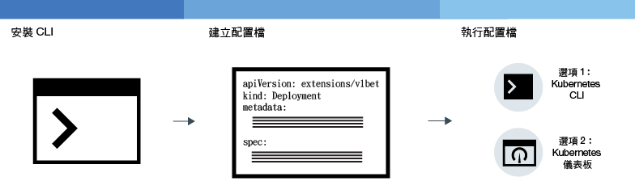

---

copyright:
  years: 2014, 2018
lastupdated: "2018-4-20"

---

{:new_window: target="_blank"}
{:shortdesc: .shortdesc}
{:screen: .screen}
{:pre: .pre}
{:table: .aria-labeledby="caption"}
{:codeblock: .codeblock}
{:tip: .tip}
{:download: .download}


# 在叢集中部署應用程式
{: #app}

您可以在 {{site.data.keyword.containerlong}} 中使用 Kubernetes 技術於容器中部署應用程式，並確保那些應用程式始終處於運行狀態。例如，您可以執行漸進式更新及回復，而不會對使用者造成任何關閉時間。
{: shortdesc}

藉由按一下下列影像的區域，來瞭解部署應用程式的一般步驟。


<map name="d62e18" id="d62e18">
<area href="cs_cli_install.html" target="_blank" alt="安裝 CLI。" title="安裝 CLI。" shape="rect" coords="30, 69, 179, 209" />
<area href="https://kubernetes.io/docs/concepts/configuration/overview/" target="_blank" alt="為您的應用程式建立配置檔。請檢閱來自 Kubernetes 的最佳作法。" title="為您的應用程式建立配置檔。請檢閱來自 Kubernetes 的最佳作法。" shape="rect" coords="254, 64, 486, 231" />
<area href="#app_cli" target="_blank" alt="選項 1：執行來自 Kubernetes CLI 的配置檔。" title="選項 1：執行來自 Kubernetes CLI 的配置檔。" shape="rect" coords="544, 67, 730, 124" />
<area href="#cli_dashboard" target="_blank" alt="選項 2：在本端啟動 Kubernetes 儀表板，並執行配置檔。" title="選項 2：在本端啟動 Kubernetes 儀表板，並執行配置檔。" shape="rect" coords="544, 141, 728, 204" />
</map>


<br />


## 規劃高可用性部署
{: #highly_available_apps}

將設定分佈到越多個工作者節點及叢集，使用者遇到應用程式關閉的可能性越低。
{: shortdesc}

檢閱下列潛在的應用程式設定，它們依遞增的可用性程度進行排序：


1.  含有 n+2 個 Pod 的部署，由抄本集管理。
2.  含有 n+2 個 Pod 的部署，由抄本集管理，分散於相同位置中的多個節點（反親緣性）。
3.  含有 n+2 個 Pod 的部署，由抄本集管理，分散於不同位置中的多個節點（反親緣性）。
4.  含有 n+2 個 Pod 的部署，由抄本集管理，分散於不同地區中的多個節點（反親緣性）。


### 增加應用程式的可用性

<dl>
  <dt>使用部署和抄本集來部署您的應用程式及其相依關係</dt>
    <dd><p>部署是一種 Kubernetes 資源，您可以用來宣告應用程式的所有元件及其相依關係。使用部署時，您不必寫下所有步驟，而是可以著重於您的應用程式。</p>
    <p>當您部署多個 Pod 時，會自動為您的部署建立抄本集來監視 Pod，並確保隨時都有所需數目的 Pod 在執行。當一個 Pod 關閉時，抄本集會以新的 Pod 來取代無回應的 Pod。</p>
    <p>您可以使用部署來定義應用程式的更新策略，包括您要在漸進式更新期間新增的 Pod 數目，以及每次更新時可能無法使用的 Pod 數目。當您執行漸進式更新時，部署會檢查修訂版是否正常運作，並且在偵測到失敗時停止推出。</p>
    <p>使用部署，您可以同時部署多個具有不同旗標的修訂。例如，您可以先測試部署，然後再決定將其推送至正式作業。</p>
    <p>部署可讓您追蹤任何已部署的修訂。如果發現更新無法如預期般運作時，則您可以使用此歷程來回復至舊版。</p></dd>
  <dt>為應用程式的工作負載包含足夠的抄本，然後加兩個</dt>
    <dd>為了讓應用程式具備高可用性以及更大的失敗復原力，請考慮包含多於最小值的額外抄本來處理預期工作負載。額外的抄本可以在 Pod 當機，而抄本集尚未回復當機的 Pod 時，處理工作負載。為了預防兩者同時失敗，請包含兩個額外的抄本。此設定是 N+2 型樣，其中 N 是處理送入工作負載的抄本數，而 +2 是額外的兩個抄本。只要您的叢集有足夠空間，就可以有任意數目的 Pod。</dd>
  <dt>將 Pod 分散於多個節點（反親緣性）</dt>
    <dd><p>當您建立部署時，可以將每一個 Pod 部署至相同的工作者節點。這稱為親緣性或主機託管。為了保護您的應用程式不受工作者節點失敗影響，您可以使用 <em>podAntiAffinity</em> 選項與標準叢集搭配，將部署配置為將 Pod 分散至多個工作者節點。您可以定義兩種類型的 Pod 反親緣性：偏好或必要。如需相關資訊，請參閱關於<a href="https://kubernetes.io/docs/concepts/configuration/assign-pod-node/" rel="external" target="_blank" title="（在新分頁或視窗中開啟）">將 Pod 指派給節點</a>的 Kubernetes 文件。</p>
    <p><strong>附註</strong>：使用必要的反親緣性，您只能部署對其具有工作者節點之抄本的數量。比方說，如果您的叢集中有 3 個工作者節點，但您在 YAML 檔案中定義 5 個抄本，則只會部署 3 個抄本。每一個抄本都位於不同的工作者節點上。剩餘的 2 個抄本會保持擱置狀態。如果您新增另一個工作者節點至叢集，則其中一個剩餘的抄本會自動部署至新的工作者節點。<p>
    <p><strong>範例部署 YAML 檔案</strong>:<ul>
    <li><a href="https://raw.githubusercontent.com/IBM-Cloud/kube-samples/master/deploy-apps-clusters/nginx_preferredAntiAffinity.yaml" rel="external" target="_blank" title="（在新分頁或視窗中開啟）">具有偏好的 Pod 反親緣性的 Nginx 應用程式。</a></li>
    <li><a href="https://raw.githubusercontent.com/IBM-Cloud/kube-samples/master/deploy-apps-clusters/liberty_requiredAntiAffinity.yaml" rel="external" target="_blank" title="（在新分頁或視窗中開啟）">具有必要的 Pod 反親緣性的 IBM® WebSphere® Application Server Liberty 應用程式。</a></li></ul></p>
    </dd>
<dt>將 Pod 分散在多個區域或地區</dt>
  <dd>為了保護應用程式不受位置或地區故障的影響，您可以在另一個位置或地區建立第二個叢集，並使用部署 YAML 來為應用程式部署複製的抄本集。透過在叢集前面新增共用路徑及負載平衡器，您可以將工作負載分散至各位置及地區。如需相關資訊，請參閱[叢集的高可用性](cs_clusters.html#clusters)。
  </dd>
</dl>


### 最小應用程式部署
{: #minimal_app_deployment}

免費或標準叢集中的基本應用程式部署可能包括下列元件。
{: shortdesc}


若要部署最小應用程式的元件（如圖所示），請使用類似於下列範例的配置檔：
```
apiVersion: apps/v1beta1
kind: Deployment
metadata:
  name: ibmliberty
spec:
  replicas: 1
  template:
    metadata:
      labels:
        app: ibmliberty
    spec:
      containers:
      - name: ibmliberty
        image: registry.bluemix.net/ibmliberty:latest
        ports:
        - containerPort: 9080        
---
apiVersion: v1
kind: Service
metadata:
  name: ibmliberty-service
  labels:
    app: ibmliberty
spec:
  selector:
    app: ibmliberty
  type: NodePort
  ports:
   - protocol: TCP
     port: 9080
```
{: codeblock}

**附註：**若要公開您的服務，請確定您在服務的 `spec.selector` 區段中使用的鍵值組，與您在部署 yaml 的 `spec.template.metadata.labels` 區段中使用的鍵值組相同。若要進一步瞭解每一個元件，請檢閱 [Kubernetes 基本概念](cs_tech.html#kubernetes_basics)。

<br />


## 啟動 Kubernetes 儀表板
{: #cli_dashboard}

在本端系統上開啟 Kubernetes 儀表板，以檢視叢集及其工作者節點的相關資訊。
{:shortdesc}

開始之前，請先將 [CLI 的目標](cs_cli_install.html#cs_cli_configure)設為您的叢集。此作業需要[管理者存取原則](cs_users.html#access_policies)。請驗證您的現行[存取原則](cs_users.html#infra_access)。

您可以使用預設埠或設定自己的埠，來啟動叢集的 Kubernetes 儀表板。

1.  對於 Kubernetes 主要版本為 1.7.16 或之前版本的叢集：

    1.  使用預設埠號來設定 Proxy。

        ```
        kubectl proxy
        ```
        {: pre}

        輸出：

        ```
        Starting to serve on 127.0.0.1:8001
        ```
        {: screen}

    2.  在 Web 瀏覽器中開啟 Kubernetes 儀表板。

        ```
        http://localhost:8001/ui
        ```
        {: codeblock}

2.  對於 Kubernetes 主要版本為 1.8.2 或更新版本的叢集：

    1.  取得 Kubernetes 的認證。

        ```
        kubectl config view -o jsonpath='{.users[0].user.auth-provider.config.id-token}'
        ```
        {: pre}

    2.  複製輸出中所顯示的 **id-token** 值。

    3.  使用預設埠號來設定 Proxy。

        ```
        kubectl proxy
        ```
        {: pre}

        輸出範例：

        ```
        Starting to serve on 127.0.0.1:8001
        ```
        {: screen}

    4.  登入儀表板。

      1.  在您的瀏覽器中，導覽至下列 URL：

          ```
            http://localhost:8001/api/v1/namespaces/kube-system/services/https:kubernetes-dashboard:/proxy/
            ```
          {: codeblock}

      2.  在登入頁面中，選取**記號**鑑別方法。

      3.  然後，將您先前複製的 **id-token** 值貼到**記號**欄位，然後按一下**登入**。

[接下來，您可以從儀表板執行配置檔。](#app_ui)

完成 Kubernetes 儀表板之後，使用 `CTRL+C` 來結束 `proxy` 指令。在您結束之後，無法再使用 Kubernetes 儀表板。請執行 `proxy` 指令，以重新啟動 Kubernetes 儀表板。


<br />


## 建立密碼
{: #secrets}

Kubernetes 密碼是一種儲存機密資訊（例如使用者名稱、密碼或金鑰）的安全方式。
{:shortdesc}

<table>
<caption>要藉由作業儲存在密碼中的必要檔案</caption>
<thead>
<th>作業</th>
<th>要儲存在密碼中的必要檔案</th>
</thead>
<tbody>
<tr>
<td>將服務新增至叢集</td>
<td>無。將服務連結至叢集時，系統會為您建立密碼。</td>
</tr>
<tr>
<td>選用項目：如果不是使用 ingress-secret，請配置 Ingress 服務與 TLS 搭配。<p><b>附註</b>：依預設，TLS 已啟用，且已針對「TLS 連線」建立密碼。

若要檢視預設 TLS 密碼，請執行下列指令：
<pre>
bx cs cluster-get &lt;cluster_name_or_ID&gt; | grep "Ingress secret"
</pre>
</p>
若要改為自行建立，請完成這個主題中的步驟。</td>
<td>伺服器憑證及金鑰：<code>server.crt</code> 及 <code>server.key</code></td>
<tr>
<td>建立交互鑑別註釋。</td>
<td>CA 憑證：<code>ca.crt</code></td>
</tr>
</tbody>
</table>

如需您可以在密碼中儲存哪些項目的相關資訊，請參閱 [Kubernetes 文件](https://kubernetes.io/docs/concepts/configuration/secret/)。


若要使用憑證來建立密碼，請執行下列動作：

1. 從憑證提供者產生憑證管理中心 (CA) 憑證及金鑰。如果您有自己的網域，請為您的網域購買正式的 TLS 憑證。基於測試目的，您可以產生自簽憑證。

 **重要事項**：請確定每一個憑證的 [CN](https://support.dnsimple.com/articles/what-is-common-name/) 都不同。

 用戶端憑證及用戶端金鑰必須最多驗證到授信主要憑證（在此情況下，指的是 CA 憑證）。範例：

 ```
 Client Certificate: issued by Intermediate Certificate
 Intermediate Certificate: issued by Root Certificate
 Root Certificate: issued by itself
 ```
 {: codeblock}

2. 建立憑證作為 Kubernetes 密碼。

   ```
   kubectl create secret generic <secret_name> --from-file=<cert_file>=<cert_file>
   ```
   {: pre}

     範例：
   - TLS 連線：

     ```
     kubectl create secret tls <secret_name> --from-file=tls.crt=server.crt --from-file=tls.key=server.key
     ```
     {: pre}

   - 交互鑑別註釋：

     ```
     kubectl create secret generic <secret_name> --from-file=ca.crt=ca.crt
     ```
     {: pre}

<br />


## 使用 GUI 部署應用程式
{: #app_ui}

當您使用 Kubernetes 儀表板將應用程式部署至叢集時，部署資源會自動在叢集中建立、更新及管理 Pod。
{:shortdesc}

開始之前：

-   安裝必要的 [CLI](cs_cli_install.html#cs_cli_install)。
-   [將 CLI 的目標設為](cs_cli_install.html#cs_cli_configure)您的叢集。

若要部署應用程式，請執行下列動作：

1.  開啟 Kubernetes [儀表板](#cli_dashboard)，然後按一下**+ 建立**。
2.  使用下列兩種方式之一來輸入您的應用程式詳細資料。
  * 選取**在下面指定應用程式詳細資料**，然後輸入詳細資料。
  * 選取**上傳 YAML 或 JSON 檔案**以上傳應用程式[配置檔 ](https://kubernetes.io/docs/tasks/inject-data-application/define-environment-variable-container/)。

  需要配置檔的說明嗎？請移出此[範例 YAML 檔案 ](https://github.com/IBM-Cloud/kube-samples/blob/master/deploy-apps-clusters/deploy-ibmliberty.yaml)。在此範例中，容器是從美國南部地區中的 **ibmliberty** 映像檔部署的。
  {: tip}

3.  驗證您是否已使用下列其中一種方式，順利部署您的應用程式。
  * 在 Kubernees 儀表板中，按一下**部署**。即會顯示成功部署的清單。
  * 如果您的應用程式是[公開可用](cs_network_planning.html#public_access)，請導覽至 {{site.data.keyword.containerlong}} 儀表板中的叢集概觀頁面。複製位於叢集摘要區段的子網域，並將其貼入瀏覽器中，以檢視您的應用程式。

<br />


## 使用 CLI 部署應用程式
{: #app_cli}

建立叢集之後，您可以使用 Kubernetes CLI 以將應用程式部署至該叢集。
{:shortdesc}

開始之前：

-   安裝必要的 [CLI](cs_cli_install.html#cs_cli_install)。
-   [將 CLI 的目標設為](cs_cli_install.html#cs_cli_configure)您的叢集。

若要部署應用程式，請執行下列動作：

1.  根據 [Kubernetes 最佳作法 ](https://kubernetes.io/docs/concepts/configuration/overview/) 建立配置檔。配置檔通常會包含您在 Kubernetes 中建立之每一個資源的配置詳細資料。您的 Script 可能包括下列一個以上區段：

    -   [Deployment ](https://kubernetes.io/docs/concepts/workloads/controllers/deployment/)：定義 Pod 和抄本集的建立。Pod 包括一個個別的容器化應用程式，而抄本集會控制多個 Pod 實例。

    -   [Service ](https://kubernetes.io/docs/concepts/services-networking/service/)：藉由使用工作者節點或負載平衡器公用 IP 位址，或公用 Ingress 路徑，提供 Pod 的前端存取。

    -   [Ingress ](https://kubernetes.io/docs/concepts/services-networking/ingress/)：指定一種負載平衡器，提供路徑來公開存取您的應用程式。

    

2.  在叢集的環境定義中執行配置檔。

    ```
    kubectl apply -f config.yaml
    ```
    {: pre}

3.  如果您使用節點埠服務讓應用程式可公開使用，負載平衡器服務（或 Ingress）會確認您可以存取此應用程式。

<br />


## 調整應用程式 
{: #app_scaling}

使用 Kubernetes，您可以啟用[水平 Pod 自動調整](https://kubernetes.io/docs/tasks/run-application/horizontal-pod-autoscale/)，根據 CPU 自動增加或減少應用程式的實例數目。
{:shortdesc}

要尋找調整 Cloud Foundry 應用程式的相關資訊嗎？請查看 [IBM Auto-Scaling for {{site.data.keyword.Bluemix_notm}}](/docs/services/Auto-Scaling/index.html)。
{: tip}

開始之前：
- [將 CLI 的目標設為](cs_cli_install.html#cs_cli_configure)您的叢集。
- Heapster 監視必須部署在您要自動調整的叢集中。

步驟：

1.  從 CLI 將應用程式部署至叢集。當您部署應用程式時，必須要求 CPU。

    ```
    kubectl run <app_name> --image=<image> --requests=cpu=<cpu> --expose --port=<port_number>
    ```
    {: pre}

    <table>
    <thead>
    <th colspan=2> 瞭解此指令的元件</th>
    </thead>
    <tbody>
    <tr>
    <td><code>--image</code></td>
    <td>您要部署的應用程式。</td>
    </tr>
    <tr>
    <td><code>--request=cpu</code></td>
    <td>容器的必要 CPU（以 millicores 為單位指定）。例如，<code>--requests=200m</code>。</td>
    </tr>
    <tr>
    <td><code>--expose</code></td>
    <td>設為 true 時，會建立外部服務。</td>
    </tr>
    <tr>
    <td><code>--port</code></td>
    <td>透過此埠可讓您的應用程式供外部使用。</td>
    </tr></tbody></table>

    若為更複雜的部署，您可能需要建立[配置檔](#app_cli)。
    {: tip}

2.  建立 autoscaler 並定義原則。如需使用 `kubectl autoscale` 指令的相關資訊，請參閱 [Kubernetes 文件 ](https://v1-8.docs.kubernetes.io/docs/reference/generated/kubectl/kubectl-commands#autoscale)。

    ```
    kubectl autoscale deployment <deployment_name> --cpu-percent=<percentage> --min=<min_value> --max=<max_value>
    ```
    {: pre}

    <table>
    <thead>
    <th colspan=2> 瞭解此指令的元件</th>
    </thead>
    <tbody>
    <tr>
    <td><code>--cpu-percent</code></td>
    <td>Horizontal Pod Autoscaler 所維護的平均 CPU 使用率（以百分比為指定單位）。</td>
    </tr>
    <tr>
    <td><code>--min</code></td>
    <td>用來維護指定 CPU 使用率百分比之已部署的 Pod 數目下限。</td>
    </tr>
    <tr>
    <td><code>--max</code></td>
    <td>用來維護指定 CPU 使用率百分比之已部署的 Pod 數目上限。</td>
    </tr>
    </tbody></table>


<br />


## 管理漸進式部署
{: #app_rolling}

您可以以自動化及受管制的方式來管理變更推出。如果推出不是根據計劃進行，您可以將部署回復為前一個修訂。
{:shortdesc}

在開始之前，請先建立[部署](#app_cli)。

1.  [推出 ](https://kubernetes.io/docs/reference/generated/kubectl/kubectl-commands#rollout) 變更。例如，您可能想要變更起始部署中所用的映像檔。

    1.  取得部署名稱。

        ```
        kubectl get deployments
        ```
        {: pre}

    2.  取得 Pod 名稱。

        ```
        kubectl get pods
        ```
        {: pre}

    3.  取得在 Pod 中執行的容器的名稱。

        ```
        kubectl describe pod <pod_name>
        ```
        {: pre}

    4.  設定部署要使用的新映像檔。

        ```
        kubectl set image deployment/<deployment_name><container_name>=<image_name>
        ```
        {: pre}

    當您執行這些指令時，會立即套用變更，並記載推出歷程。

2.  檢查部署的狀態。

    ```
    kubectl rollout status deployments/<deployment_name>
    ```
    {: pre}

3.  回復變更。
    1.  檢視部署的推出歷程，並識別前次部署的修訂號碼。

        ```
        kubectl rollout history deployment/<deployment_name>
        ```
        {: pre}

        **提示：**若要查看特定修訂的詳細資料，請包括修訂號碼。

        ```
        kubectl rollout history deployment/<deployment_name> --revision=<number>
        ```
        {: pre}

    2.  回復至舊版，或指定修訂版。若要回復至舊版，請使用下列指令。

        ```
        kubectl rollout undo deployment/<depoyment_name> --to-revision=<number>
        ```
        {: pre}

<br />


