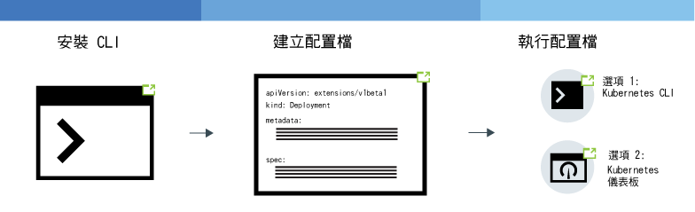

---

copyright:
  years: 2014, 2019
lastupdated: "2019-06-11"

keywords: kubernetes, iks, node.js, js, java, .net, go, flask, react, python, swift, rails, ruby, spring boot, angular

subcollection: containers

---

{:new_window: target="_blank"}
{:shortdesc: .shortdesc}
{:screen: .screen}
{:pre: .pre}
{:table: .aria-labeledby="caption"}
{:codeblock: .codeblock}
{:tip: .tip}
{:note: .note}
{:important: .important}
{:deprecated: .deprecated}
{:download: .download}
{:preview: .preview}


# 在叢集裡部署 Kubernetes 本機應用程式
{: #app}

您可以在 {{site.data.keyword.containerlong}} 中使用 Kubernetes 技術於容器中部署應用程式，並確保那些應用程式始終處於執行狀態。例如，您可以執行漸進式更新及回復，而不會對使用者造成任何關閉時間。因為 Kubernetes 是一個可延伸的容器編排平台，不會要求使用特定語言或應用程式，因此可以執行各種工作負載，例如：利用選擇語言所撰寫的不屬於任何國家的應用程式、屬於任一國家的應用程式，以及資料處理的應用程式。
{: shortdesc}

藉由按一下下列影像的區域，來瞭解部署應用程式的一般步驟。要先學習基本觀念嗎？請試用[部署應用程式指導教學](/docs/containers?topic=containers-cs_apps_tutorial#cs_apps_tutorial)。


<map name="d62e18" id="d62e18">
<area href="/docs/containers?topic=containers-cs_cli_install" target="_blank" alt="安裝 CLI。" title="安裝 CLI。" shape="rect" coords="30, 69, 179, 209" />
<area href="https://kubernetes.io/docs/concepts/configuration/overview/" target="_blank" alt="為您的應用程式建立配置檔。請檢閱來自 Kubernetes 的最佳作法。" title="為您的應用程式建立配置檔。請檢閱來自 Kubernetes 的最佳作法。" shape="rect" coords="254, 64, 486, 231" />
<area href="#app_cli" target="_blank" alt="選項 1：執行來自 Kubernetes CLI 的配置檔。" title="選項 1：執行來自 Kubernetes CLI 的配置檔。" shape="rect" coords="544, 67, 730, 124" />
<area href="#cli_dashboard" target="_blank" alt="選項 2：在本端啟動 Kubernetes 儀表板，並執行配置檔。" title="選項 2：在本端啟動 Kubernetes 儀表板，並執行配置檔。" shape="rect" coords="544, 141, 728, 204" />
</map>

<br />


## 規劃要在叢集裡執行應用程式
{: #plan_apps}

在您將應用程式部署至 {{site.data.keyword.containerlong_notm}} 叢集之前，請決定您要如何設定應用程式，以便可以適當地存取您的應用程式，而且其可與 {{site.data.keyword.Bluemix_notm}} 中的其他服務整合。
{:shortdesc}

### 我可以為應用程式提供哪些類型的 Kubernetes 物件？
{: #object}

當您準備應用程式 YAML 檔案時，有許多選項可以增加應用程式的可用性、效能及安全。例如，不是使用單一 Pod，而是您可以使用 Kubernetes 控制器物件來管理工作負載，例如抄本集、工作或常駐程式集。如需 Pod 及控制器的相關資訊，請檢視 [Kubernetes 文件 ](https://kubernetes.io/docs/concepts/workloads/pods/pod-overview/)。管理 Pod 的抄本集的部署是應用程式的常見使用案例。
{: shortdesc}

例如，`kind: Deployment` 物件是部署應用程式 Pod 的良好選擇，因為搭配它，您可以針對 Pod 指定可用性更高的抄本集。

下表說明為何您可以建立不同類型的 Kubernetes 工作負載物件。

|物件|說明|
| --- | --- |
| [`Pod` ](https://kubernetes.io/docs/concepts/workloads/pods/pod/) | Pod 是工作負載的最小可部署單元，而且可以保留單一或多個容器。與容器類似，Pod 是設計為可移除的，而且通常用於應用程式功能的單元測試。若要避免應用程式關閉，請考量使用 Kubernetes 控制器（例如部署）來部署 Pod。部署可協助您管理多個 Pod、抄本、Pod 調整、推出和其他。|
| [`ReplicaSet` ](https://kubernetes.io/docs/concepts/workloads/controllers/replicaset/) | 抄本集可確保 Pod 的多個抄本執行中，並在 Pod 關閉時重新排定 Pod。您可以建立抄本集以測試 Pod 排程如何運作，但若要管理應用程式更新、推出和調整，請改為建立一個部署。|
| [`Deployment` ](https://kubernetes.io/docs/concepts/workloads/controllers/deployment/) | 部署是管理 Pod 或 Pod 範本的[抄本集 ](https://kubernetes.io/docs/concepts/workloads/controllers/replicaset/) 的控制器。您可以在沒有部署的情況下建立 Pod 或抄本集來測試應用程式功能。若為正式作業層次設定，請使用部署來管理應用程式更新、推出及調整。|
| [`StatefulSet` ](https://kubernetes.io/docs/concepts/workloads/controllers/statefulset/) | 與部署類似，有狀態集合是管理一組 Pod 抄本的控制器。與部署不同的是，有狀態集合確保您的 Pod 具有唯一的網路身分，可在重新排程時維護其狀態。當您要在雲端中執行工作負載時，請嘗試[將應用程式設計為無狀態](/docs/containers?topic=containers-strategy#cloud_workloads)，以讓您的服務實例彼此獨立，且在失敗時不會中斷服務。不過，部分應用程式（例如資料庫）必須是有狀態。對於這些情況，請考量建立有狀態集合，並使用[檔案](/docs/containers?topic=containers-file_storage#file_statefulset)、[區塊](/docs/containers?topic=containers-block_storage#block_statefulset)或[物件](/docs/containers?topic=containers-object_storage#cos_statefulset)儲存空間，作為有狀態集合的持續性儲存空間。您也可以在裸機工作者節點上安裝 [Portworx](/docs/containers?topic=containers-portworx)，並使用 Portworx 作為高度可用的軟體定義儲存空間解決方案，來管理有狀態集合的持續性儲存空間。|
| [`DaemonSet` ](https://kubernetes.io/docs/concepts/workloads/controllers/daemonset/) | 當您必須在叢集裡的每個工作者節點上執行相同的 Pod 時，請使用常駐程式集。當工作者節點新增至叢集時，會自動排定常駐程式集所管理的 Pod。一般使用案例包括日誌收集器（例如 `logstash` 或 `promtheus`），可從每個工作者節點收集日誌，以洞察叢集或應用程式的性能。|
| [`Job` ](https://kubernetes.io/docs/concepts/workloads/controllers/jobs-run-to-completion/) | 工作可確保一個以上的 Pod 順利完成。您可將工作用於佇列或批次工作，來支援個別但相關工作項目的平行處理（例如，要呈現的特定頁框數、要傳送的電子郵件，以及要轉換的檔案）。若要排定工作在特定時間執行，請使用 [`CronJob` ](https://kubernetes.io/docs/concepts/workloads/controllers/cron-jobs/)。|
{: caption="您可以建立的 Kubernetes 工作負載物件的類型。" caption-side="top"}

### 如何將功能新增至我的 Kubernetes 應用程式配置？
如需您可能包括在部署中的項目的說明，請參閱[在 YAML 檔案中指定您的應用程式需求](#app_yaml)。範例包括：
* [抄本集](#replicaset)
* [標籤](#label)
* [親緣性](#affinity)
* [映像檔原則](#image)
* [埠](#port)
* [資源要求及限制](#resourcereq)
* [存活性及就緒探測](#probe)
* [服務](#app-service)，用來在埠上公開應用程式服務
* [ConfigMap](#configmap)，用來設定容器環境變數
* [密碼](#secret)，用來設定容器環境變數
* [持續性磁區](#pv)，裝載至容器以供儲存使用

### 如果我想要 Kubernetes 應用程式配置使用變數，該怎麼辦？如何將這些資料新增至 YAML？
{: #variables}

若要將變數資訊新增至您的部署而非將資料寫在 YAML 檔案中，您可以使用 Kubernetes [`ConfigMap` ](https://kubernetes.io/docs/tasks/configure-pod-container/configure-pod-configmap/) 或 [`Secret` ](https://kubernetes.io/docs/concepts/configuration/secret/) 物件。
{: shortdesc}

若要耗用 Configmap 或密碼，您需要將其裝載至 Pod。Configmap 或密碼會與 Pod 結合，再執行 Pod。您可以在許多應用程式之間重複使用部署規格和映像檔，但接著會交換自訂的 ConfigMap 或密碼。特定密碼可能會在本端節點上佔用許多儲存空間，因此請相應地規劃。

這兩個資源都定義金鑰值配對，但您將它們用於不同的狀況。

<dl>
<dt>Configmap</dt>
<dd>針對部署中指定的工作負載，提供非機密的配置資訊。您可以採用三種主要方式來使用 Configmap。
<ul><li><strong>檔案系統</strong>：您可以將整個檔案或一組變數裝載到 Pod 中。會根據設為此值的檔案金鑰名稱內容，為每一個項目建立一個檔案。</li>
<li><strong>環境變數</strong>：動態設定容器規格的環境變數。</li>
<li><strong>指令行引數</strong>：設定容器規格中使用的指令行引數。</li></ul></dd>

<dt>密碼</dt>
<dd>將機密性資訊提供給工作負載，如下所示。叢集的其他使用者可能有權存取密碼，因此請確保您確定可以與這些使用者共用密碼資訊。
<ul><li><strong>個人識別資訊 (PII)</strong>：在密碼中儲存機密性資訊，例如電子郵件位址或公司規範或政府法規所需的其他類型資訊。</li>
<li><strong>認證</strong>：放置密碼、金鑰和記號這類認證，以減少意外曝光的風險。例如，當您[連結服務](/docs/containers?topic=containers-service-binding#bind-services)至叢集時，認證會儲存在密碼中。</li></ul></dd>
</dl>

想要讓您的密碼更加安全嗎？要求叢集管理者在您的叢集裡[啟用 {{site.data.keyword.keymanagementservicefull}}](/docs/containers?topic=containers-encryption#keyprotect)，以加密新密碼及現有密碼。
{: tip}

### 如何將 IBM 服務新增至我的應用程式，例如 Watson？
請參閱[將服務新增至應用程式](/docs/containers?topic=containers-service-binding#adding_app)。

### 如何確定我的應用程式具有正確的資源？
當您[指定應用程式 YAML 檔案](#app_yaml)時，可以將 Kubernetes 功能新增至應用程式配置，以協助您的應用程式取得正確的資源。具體而言，針對 YAML 檔案中所定義的每一個容器，[設定資源限制及要求 ](https://kubernetes.io/docs/concepts/configuration/manage-compute-resources-container/)。
{: shortdesc}

此外，您的叢集管理者也可能設定可以影響應用程式部署的資源控制，如下所示。
*  [資源配額 ](https://kubernetes.io/docs/concepts/policy/resource-quotas/)
*  [Pod 優先順序](/docs/containers?topic=containers-pod_priority#pod_priority)

### 如何存取應用程式？
您可以[使用 `clusterIP` 服務](/docs/containers?topic=containers-cs_network_planning#in-cluster)，在叢集內私密存取您的應用程式。
{: shortdesc}

如果您要公開應用程式，則取決於叢集類型您會不同的選項。
*  **免費叢集**：您可以使用 [NodePort 服務](/docs/containers?topic=containers-nodeport#nodeport)來公開應用程式。
*  **標準叢集**：您可以使用 [NodePort、負載平衡器或 Ingress 服務](/docs/containers?topic=containers-cs_network_planning#external)來公開應用程式。
*  **使用 Calico 成為專用的叢集**：您可以使用 [NodePort、負載平衡器或 Ingress 服務](/docs/containers?topic=containers-cs_network_planning#private_both_vlans)來公開應用程式。您也必須使用 Calico DNAT 前網路原則，來封鎖公用節點埠。
*  **僅限專用 VLAN 標準叢集**：您可以使用 [NodePort、負載平衡器或 Ingress 服務](/docs/containers?topic=containers-cs_network_planning#plan_private_vlan)來公開應用程式。您也必須在防火牆中開啟服務專用 IP 位址的埠。

### 在我部署應用程式之後，如何監視其性能？
您可以針對叢集設定 {{site.data.keyword.Bluemix_notm}} [記載和監視](/docs/containers?topic=containers-health#health)。您也可以選擇與協力廠商[記載或監視服務](/docs/containers?topic=containers-supported_integrations#health_services)整合。
{: shortdesc}

### 如何將我的應用程式保持最新狀態？
如果您要動態新增及移除應用程式以回應工作負載使用情形，請參閱[調整應用程式](/docs/containers?topic=containers-app#app_scaling)。
{: shortdesc}

如果您要管理應用程式的更新，請參閱[管理漸進式部署](/docs/containers?topic=containers-app#app_rolling)。

### 如何控制誰可以存取我的應用程式部署？
帳戶和叢集管理者可以控制許多不同層次的存取：叢集、Kubernetes 名稱空間、Pod 及容器。
{: shortdesc}

使用 {{site.data.keyword.Bluemix_notm}} IAM，您可以在叢集實例層次上，將許可權指派給個別使用者、群組或服務帳戶。您可以限制使用者只能使用叢集內的特定名稱空間，來進一步限定叢集存取範圍。如需相關資訊，請參閱[指派叢集存取](/docs/containers?topic=containers-users#users)。

若要控制 Pod 層次的存取，您可以[使用 Kubernetes RBAC 配置 Pod 安全原則](/docs/containers?topic=containers-psp#psp)。

在應用程式部署 YAML 內，您可以設定 Pod 或容器的安全環境定義。如需相關資訊，請檢閱 [Kubernetes 文件 ](https://kubernetes.io/docs/tasks/configure-pod-container/security-context/)。

想要控制應用程式層次的存取嗎？若要建立無需變更應用程式碼即可隨時更新的登入流程，請嘗試使用 [{{site.data.keyword.appid_long_notm}}](/docs/services/appid?topic=appid-getting-started)。
{: tip}

<br />


## 規劃高可用性部署
{: #highly_available_apps}

將設定分佈到越多個工作者節點及叢集，使用者遇到應用程式關閉的可能性越低。
{: shortdesc}

檢閱下列潛在的應用程式設定，它們依遞增的可用性程度進行排序：


1.  含有 n+2 個 Pod 的部署，由抄本集管理，位於單一區域叢集的單一節點中。
2.  含有 n+2 個 Pod 的部署，由抄本集管理，分散於單一區域叢集的多個節點（反親緣性）中。
3.  含有 n+2 個 Pod 的部署，由抄本集管理，分散於各區域的多區域叢集的多個節點（反親緣性）中。

您也可以[使用廣域負載平衡器連接不同地區中的多個叢集](/docs/containers?topic=containers-ha_clusters#multiple_clusters)，以增加高可用性。

### 增加應用程式的可用性
{: #increase_availability}

請考量下列選項，以增加應用程式的可用性。
{: shortdesc}

<dl>
  <dt>使用部署和抄本集來部署您的應用程式及其相依關係</dt>
    <dd><p>部署是一種 Kubernetes 資源，您可以用來宣告應用程式的所有元件及其相依關係。使用部署時，您不必寫下所有步驟，而是可以著重於您的應用程式。</p>
    <p>當您部署多個 Pod 時，會自動為您的部署建立抄本集來監視 Pod，並確保隨時都有所指定數目的 Pod 可以啟動及執行。當一個 Pod 關閉時，抄本集會以新的 Pod 來取代無回應的 Pod。</p>
    <p>您可以使用部署來定義應用程式的更新策略，包括在滾動更新期間要新增的 Pod 數，以及允許同時無法使用的 Pod 數。當您執行漸進式更新時，部署會檢查修訂版是否正常運作，並且在偵測到失敗時停止推出。</p>
    <p>使用部署，您可以同時部署多個具有不同旗標的修訂。例如，您可以先測試部署，然後再決定將其推送至正式作業。</p>
    <p>藉由使用部署，您可以追蹤任何已部署的修訂。如果發現更新無法如預期般運作時，則您可以使用此歷程來回復至舊版。</p></dd>
  <dt>為應用程式的工作負載包含足夠的抄本，然後加兩個</dt>
    <dd>為了讓應用程式具備高可用性以及更大的失敗復原力，請考慮包含多於最小值的額外抄本來處理預期工作負載。在某個 Pod 當機且抄本集尚未回復已損毀 Pod 的情況下，額外的抄本可處理工作負載。為了預防兩者同時失敗，請包含兩個額外的抄本。此設定是 N+2 型樣，其中 N 是處理送入工作負載的抄本數，而 +2 是額外的兩個抄本。只要您的叢集有足夠空間，就可以有任意數目的 Pod。</dd>
  <dt>將 Pod 分散於多個節點（反親緣性）</dt>
    <dd><p>當您建立部署時，可以將每一個 Pod 部署至相同的工作者節點。這稱為親緣性或主機代管。為了保護您的應用程式不受工作者節點失敗影響，您可以使用 <code>podAntiAffinity</code> 選項與標準叢集搭配，將部署配置為將 Pod 分散至多個工作者節點。您可以定義兩種類型的 Pod 反親緣性：偏好或必要。<p>如需相關資訊，請參閱關於<a href="https://kubernetes.io/docs/concepts/configuration/assign-pod-node/" rel="external" target="_blank" title="（在新分頁或視窗中開啟）">將 Pod 指派給節點</a>的 Kubernetes 文件。</p>
      <p>如需應用程式部署中的親緣性範例，請參閱[建立應用程式部署 YAML 檔案](#app_yaml)。</p>
      </dd>
    </dd>
<dt>將 Pod 分散在多個區域或地區</dt>
  <dd><p>若要保護應用程式不發生區域失敗，您可以在不同區域中建立多個叢集，或將區域新增至多區域叢集裡的工作者節點儲存區。多區域叢集僅適用於[特定都會區域](/docs/containers?topic=containers-regions-and-zones#zones)（例如達拉斯）。如果您在不同區域中建立多個叢集，則必須[設定廣域負載平衡器](/docs/containers?topic=containers-ha_clusters#multiple_clusters)。</p>
  <p>當您使用抄本集並指定 Pod 反親緣性時，Kubernetes 會將應用程式 Pod 分散到各節點。如果您的節點位於多個區域中，則會將 Pod 分散到各區域，以增加應用程式的可用性。如果您要限制應用程式只在某個區域中執行，則可以配置 Pod 親緣性，或在某個區域中建立及標示工作者節點儲存區。如需相關資訊，請參閱[多區域叢集的高可用性](/docs/containers?topic=containers-ha_clusters#ha_clusters)。</p>
  <p><strong>在多區域叢集部署中，應用程式 Pod 是否平均分佈到各節點？</strong></p>
  <p>Pod 會平均分佈到各區域，但不一定會分佈到各節點。例如，如果叢集在 3 個區域中分別有 1 個節點，並且部署了包含 6 個 Pod 的抄本集，則每個節點會獲得 2 個 Pod。但是，如果叢集在 3 個區域中分別有 2 個節點，並且部署了包含 6 個 Pod 的抄本集，則每個區域會排定 2 個 Pod，這 2 個 Pod 可能會每個節點排定 1 個 Pod，也可能 2 個 Pod 都排定在一個節點上。如需進一步控制排程，您可以[設定 Pod 親緣性 ](https://kubernetes.io/docs/concepts/configuration/assign-pod-node)。</p>
  <p><strong>如果區域關閉，如何將 Pod 重新排定至其他區域中的其餘節點？</strong></br>它取決於您在部署中使用的排程原則。如果您已包括[節點特定 Pod 親緣性 ](https://kubernetes.io/docs/concepts/configuration/assign-pod-node/#node-affinity-beta-feature)，則不會重新排定 Pod。如果您未這麼做，則會在其他區域的可用工作者節點上建立 Pod，但它們可能不平衡。例如，這 2 個 Pod 可能分佈在 2 個可用節點上，也可能都排定到 1 個具有可用容量的節點上。同樣地，傳回無法使用區域時，不會自動刪除 Pod，也不會重新讓它在各節點之間保持平衡。如果您要在備份區域之後重新讓 Pod 在各區域之間保持平衡，請考慮使用 [Kubernetes 取消排程器 ](https://github.com/kubernetes-incubator/descheduler)。</p>
  <p><strong>提示</strong>：在多區域叢集裡，請盡量使每個區域的工作者節點容量保持在 50%，以便有足夠的剩餘容量來保護叢集不受區域故障的影響。</p>
  <p><strong>如果我要將應用程式分散到各地區，該怎麼辨？</strong></br>為了保護應用程式不發生地區失敗，請在另一個地區建立第二個叢集、[設定廣域負載平衡器](/docs/containers?topic=containers-ha_clusters#multiple_clusters)以連接叢集，以及使用部署 YAML 利用應用程式的 [Pod 反親緣性 ](https://kubernetes.io/docs/concepts/configuration/assign-pod-node/) 來部署重複抄本集。</p>
  <p><strong>如果應用程式需要持續性儲存空間，該怎麼辨？</strong></p>
  <p>請使用雲端服務（例如 [{{site.data.keyword.cloudant_short_notm}}](/docs/services/Cloudant?topic=cloudant-getting-started#getting-started) 或 [{{site.data.keyword.cos_full_notm}}](/docs/services/cloud-object-storage?topic=cloud-object-storage-about)）。</p></dd>
</dl>

## 在 YAML 檔案中指定應用程式需求
{: #app_yaml}

在 Kubernetes 中，您可在宣告 Kubernetes 物件配置的 YAML 檔案中說明應用程式。然後，Kubernetes API 伺服器會處理 YAML 檔案，並將該物件的配置和所需狀態儲存在 etcd 資料儲存庫中。Kubernetes 排程器會將您的工作負載排定至叢集內的工作者節點，同時考慮 YAML 檔案中的規格、管理者所設定的所有叢集原則，以及可用的叢集容量。
{: shortdesc}

檢閱[完整 YAML 檔案](https://raw.githubusercontent.com/IBM-Cloud/kube-samples/master/deploy-apps-clusters/deploy_wasliberty.yaml)的副本。然後，檢閱下列各節以瞭解如何加強您的應用程式部署。

* [抄本集](#replicaset)
* [標籤](#label)
* [親緣性](#affinity)
* [映像檔原則](#image)
* [埠](#port)
* [資源要求及限制](#resourcereq)
* [存活性及就緒探測](#probe)
* [服務](#app-service)，用來在埠上公開應用程式服務
* [ConfigMap](#configmap)，用來設定容器環境變數
* [密碼](#secret)，用來設定容器環境變數
* [持續性磁區](#pv)，裝載至容器以供儲存使用
* [後續步驟](#nextsteps)
* [完整範例 YAML](#yaml-example)

<dl>
<dt>基本部署 meta 資料</dt>
  <dd><p>將適當的 API 版本用於您部署的 [Kubernetes 物件類型](#object)。API 版本會判定 Kubernetes 物件支援的功能，有哪些可供您使用。您在 meta 資料中提供的名稱是物件的名稱，不是其標籤。您可在與物件互動時使用名稱，例如 `kubectl get deployment <name>`。</p>
  <p><pre class="codeblock"><code>apiVersion: apps/v1
kind: Deployment
  metadata:
  name: wasliberty</code></pre></p></dd>

<dt id="replicaset">抄本集</dt>
  <dd><p>若要增加應用程式的可用性，您可以在部署中指定抄本集。在抄本集中，您可以定義要部署多少個應用程式實例。抄本集是由您的 Kubernetes 部署所管理及監視。如果有一個應用程式實例關閉，Kubernetes 會自動啟動新的應用程式實例，以維持指定數目的應用程式實例。</p>
  <p><pre class="codeblock"><code>spec:
  replicas: 3
</pre></code></p></dd>

<dt id="label">標籤</dt>
  <dd><p>搭配[標籤](/docs/containers?topic=containers-strategy#deploy_organize)，您可以使用相同的 `key: value` 配對，標示叢集裡不同類型的資源。然後，您可以指定要符合標籤的選取器，讓您可以針對這些其他資源進行建置。如果您計劃公開應用程式，則必須使用一個符合您在服務中指定之選取器的標籤。在範例中，部署規格會使用符合標籤 `app: wasliberty` 的範本。</p>
  <p>您可以擷取叢集裡標示的物件，例如查看 `staging` 或 `production` 元件。例如，列出叢集裡所有名稱空間內具有 `env: production` 標籤的所有資源。<strong>附註：</strong>您需要存取所有名稱空間才能執行此指令。<pre class="pre"><code>kubectl get all -l env=production --all-namespaces</code></pre></p>
  <ul><li>如需標籤的相關資訊，請參閱 [Kubernetes 文件 ](https://kubernetes.io/docs/concepts/overview/working-with-objects/labels/)。</li>
  <li>若要將標籤套用至工作者節點，請套用標籤[建立工作者節點儲存區](/docs/containers?topic=containers-add_workers#add_pool)或[更新現有工作者節點儲存區](/docs/containers?topic=containers-add_workers#worker_pool_labels)。</li>
  <li>如需更詳細的範例，請參閱[使用標籤將應用程式部署至特定工作者節點](/docs/containers?topic=containers-app#node_affinity)。</li></ul>
  <p><pre class="codeblock"><code>selector:
  matchLabels:
        app: wasliberty
  template:
  metadata:
      labels:
        app: wasliberty
</pre></code></p></dd>

<dt id="affinity">親緣性</dt>
  <dd><p>當您要進一步控制要在哪些工作者節點上排定 Pod 時，請指定親緣性（主機代管）。親緣性僅在排定時影響 Pod。例如，若要將部署分散至工作者節點，而不是容許將 Pod 排定在相同節點上，請使用 <code>podAntiAffinity</code> 選項與標準叢集搭配。您可以定義兩種類型的 Pod 反親緣性：偏好或必要。</p>
  <p>如需相關資訊，請參閱關於<a href="https://kubernetes.io/docs/concepts/configuration/assign-pod-node/" rel="external" target="_blank" title="（在新分頁或視窗中開啟）">將 Pod 指派給節點</a>的 Kubernetes 文件。</p>
  <ul><li><strong>需要反親緣關係</strong>：只能部署與工作者節點數相等的抄本數。例如，如果叢集裡有 3 個工作者節點，但在 YAML 檔案中定義了 5 個抄本，則僅部署 3 個抄本。每一個抄本都位於不同的工作者節點上。剩餘的 2 個抄本保持擱置狀態。如果您新增另一個工作者節點至叢集，則其中一個剩餘的抄本會自動部署至新的工作者節點。如果工作者節點失敗，則 Pod 不會重新排程，因為需要親緣性原則。如需具有必要的 Pod 反親緣性的範例 YAML，請參閱<a href="https://github.com/IBM-Cloud/kube-samples/blob/master/deploy-apps-clusters/liberty_requiredAntiAffinity.yaml" rel="external" target="_blank" title="（在新分頁或視窗中開啟）">具有必要的 Pod 反親緣性的 Liberty 應用程式</a>。</li>
  <li><strong>偏好的反親緣性</strong>：您可以將 Pod 部署至具有可用容量的節點，這可為您的工作負載提供更大的彈性。可能的話，這些 Pod 會排定在不同的工作者節點上。例如，如果叢集裡有 3 個工作者節點具有足夠的容量，則可以在這些節點上排定 5 個抄本 Pod。但是，如果將 2 個以上的工作者節點新增至叢集，則該親緣性規則並不會強制將現有節點上執行的兩個額外 Pod 重新排定到空閒節點上。</li>
  <li><strong>工作者節點親緣性</strong>：您可以將部署配置為只在特定工作者節點（例如裸機）上執行。如需相關資訊，請參閱[使用標籤將應用程式部署至特定的工作者節點](/docs/containers?topic=containers-app#node_affinity)。</li></ul>
  <p>偏好的反親緣性範例：</p>
  <p><pre class="codeblock"><code>spec:
      affinity:
        podAntiAffinity:
          preferredDuringSchedulingIgnoredDuringExecution:
      - weight: 100
            podAffinityTerm:
              labelSelector:
                matchExpressions:
            - key: app
                  operator: In
                  values:
              - wasliberty
          topologyKey: kubernetes.io/hostname</pre></code></p></dd>

<dt id="image">容器映像檔</dt>
  <dd>
  <p>指定您要用於容器的映像檔、映像檔的位置，以及影像取回原則。如果您未指定映像檔標籤，依預設，它會取回標記為 `latest` 的映像檔。</p>
  <p>**注意**：避免將最新標籤用於正式作業工作負載。如果您是使用公用或共用儲存庫（例如 Docker Hub 或 {{site.data.keyword.registryshort_notm}}），則可能尚未測試具有最新映像檔的工作負載。</p>
  <p>例如，若要列出公用 IBM 映像檔的標籤，請執行下列動作：</p>
  <ol><li>切換至廣域登錄地區。<pre class="pre"><code>ibmcloud cr region-set global</code></pre></li>
  <li>列出 IBM 映像檔。<pre class="pre"><code>ibmcloud cr images --include-ibm</code></pre></li></ol>
  <p>預設 `imagePullPolicy` 設定為 `IfNotPresent`，僅當映像檔在本端不存在時才會取回該映像檔。如果您要在每次容器啟動時都取回映像檔，請指定 `imagePullPolicy: Always`。</p>
  <p><pre class="codeblock"><code>containers:
- name: wasliberty
  image: icr.io/ibmliberty:webProfile8
  imagePullPolicy: Always</pre></code></p></dd>

<dt id="port">應用程式服務的埠</dt>
  <dd><p>選取要在其上開啟應用程式服務的容器埠。若要查看需要開啟的埠，請參閱您的應用程式規格或 Dockerfile。此埠可從專用網路存取，但不能從公用網路連線存取。若要公開應用程式，您必須建立 NodePort、負載平衡器或 Ingress 服務。[建立 `Service` 物件](#app-service)時，您可以使用這個相同的埠號。</p>
  <p><pre class="codeblock"><code>ports:
- containerPort: 9080</pre></code></p></dd>

<dt id="resourcereq">資源要求及限制</dt>
  <dd><p>身為叢集管理者，您可以透過針對叢集裡的每一個 Kubernetes 名稱空間建立 [<code>ResourceQuota</code> 物件  ](https://kubernetes.io/docs/concepts/policy/resource-quotas/)，以確保共用該叢集的團隊不佔用超過其運算資源（記憶體和 CPU）的公平份額。如果叢集管理者設定運算資源配額，則部署範本內的每一個容器都必須指定記憶體及 CPU 的資源要求與限制，否則無法建立 Pod。</p>
  <p><ol><li>檢查是否為名稱空間設定了資源配額。<pre class="pre"><code>kubectl get quota --namespace=<namespace></code></pre></li>
  <li>請參閱何謂配額限制。<pre class="pre"><code>kubectl describe quota <quota_name> --namespace=<namespace></code></pre></li></ol></p>
  <p>即使未設定任何資源配額，您也可以將資源要求及限制包括在部署中，以改善工作者節點資源的管理。</p><p class="note">如果容器超出其限制，則容器可能會重新啟動或失敗。如果容器超出要求，則在工作者節點用光超出的資源時，可能會收回其 Pod。如需疑難排解的相關資訊，請參閱 [pod 重新啟動一再失敗或 Pod 被非預期移除](/docs/containers?topic=containers-cs_troubleshoot_clusters#pods_fail)。</p>
  <p>**要求**：排程器保留給容器使用的資源數量下限。如果數量等於限制，則保證要求。如果資源數量小於限制，則仍會保證要求，但排程器可以使用要求和限制之間的差異來利用其他容器的資源。</p>
  <p>**限制**：容器可以耗用的資源數量上限。如果跨容器使用的資源總數量超過工作者節點上可用的數量，則可以收回容器以釋放空間。若要防止收回，請將資源要求設為等於容器的限制。如果未指定任何限制，則預設值為工作者節點的容量。</p>
  <p>如需相關資訊，請參閱 [Kubernetes 文件 ](https://kubernetes.io/docs/concepts/configuration/manage-compute-resources-container/)。</p>
  <p><pre class="codeblock"><code>resources:
  requests:
    memory: "512Mi"
    cpu: "500m"
  limits:
    memory: "1024Mi"
    cpu: "1000m"</pre></code></p></dd>

<dt id="probe">存活性及就緒探測</dt>
  <dd><p>依預設，Kubernetes 會在 Pod 中的所有容器啟動之後，將資料流量傳送至您的應用程式 Pod，並在容器當機後重新啟動它們。不過，您可以設定性能檢查，以提高服務資料流量遞送的穩健性。例如，您的應用程式可能會有啟動延遲的情形。應用程式處理程序可能會在整個應用程式完全備妥之前就開始，此舉特別在跨多個實例擴增時可能會影響回應。使用性能檢查，您可以讓系統得知您的應用程式是否在執行中，以及是否已備妥可接收要求。藉由設定這些探測，您也可以在執行應用程式的[漸進式更新](#app_rolling)時，協助防止應用程式關閉。您可以設定兩種類型的性能檢查：存活性及就緒探測。</p>
  <p>**存活性探測**：設定存活性探測，以檢查容器是否在執行中。如果探測失敗，則容器會重新啟動。如果容器未指定存活性探測，則探測會順利，因為它假設當容器處於**執行中**狀態時，表示容器作用中。</p>
  <p>**就緒探測**：設定就緒探測，以檢查容器是否已準備好接收要求及外部資料流量。如果探測失敗，則會移除 Pod 的 IP 位址，作為符合 Pod 之服務的可用 IP 位址，但容器不會重新啟動。如果您的應用程式需要一些時間來啟動，則設定起始延遲的就緒探測特別重要。在起始延遲之前，探測器不會啟動，讓容器有時間啟動。如果容器未提供就緒探測，則探測會順利，因為它假設當容器處於**執行中**狀態時，表示容器作用中。</p>
  <p>您可以將探測設為指令、HTTP 要求或 TCP Socket。此範例使用 HTTP 要求。讓存活性探測比就緒探測具有更多的時間。如需相關資訊，請參閱 [Kubernetes 文件 ](https://kubernetes.io/docs/tasks/configure-pod-container/configure-liveness-readiness-probes/)。</p>
  <p><pre class="codeblock"><code>livenessProbe:
  httpGet:
    path: /
    port: 9080
  initialDelaySeconds: 300
  periodSeconds: 15
readinessProbe:
  httpGet:
    path: /
    port: 9080
  initialDelaySeconds: 45
  periodSeconds: 5</pre></code></p></dd>

<dt id="app-service">公開應用程式服務</dt>
  <dd><p>您可以建立一個公開應用程式的服務。在 `spec` 區段中，確定 `port` 及標籤值與您在部署中使用的值相符。服務會在下列範例中公開符合標籤（例如 `app: wasliberty`）的物件。</p>
  <ul><li>依預設，服務會使用 [`ClusterIP ` ](https://kubernetes.io/docs/tutorials/kubernetes-basics/expose/expose-intro/)，這讓服務只能在叢集內存取，不能在叢集外存取。</li>
  <li>您可以建立 NodePort、負載平衡器或 Ingress 服務，以公開應用程式。這些服務有兩個 IP，一個外部及一個內部。在外部 IP 收到資料流量時，會將其轉遞至內部叢集 IP。然後，從內部叢集 IP 中，資料流量會遞送至應用程式的容器 IP。</li>
  <li>範例會使用 `NodePort`，在叢集外公開服務。如需如何設定外部存取權的相關資訊，請參閱[選擇 NodePort、LoadBalancer 或 Ingress 服務](/docs/containers?topic=containers-cs_network_planning#external)。</li></ul>
  <p><pre class="codeblock"><code>apiVersion: v1
kind: Service
  metadata:
name: wasliberty
      labels:
        app: wasliberty
    spec:
  ports:
  - port: 9080
  selector:
    app: wasliberty
  type: NodePort</pre></code></p></dd>

<dt id="configmap">容器環境變數的 ConfigMap</dt>
<dd><p>ConfigMap 會將非機密配置資訊提供給您的部署工作負載。下列範例顯示如何在部署 YAML 的容器規格區段中，將您 ConfigMap 中的值參照為環境變數。藉由參照 ConfigMap 中的值，您可以取消此配置資訊與部署的連結，以將您的容器化應用程式保持可攜狀態。<ul><li>[協助我判定要將 Kubernetes `ConfigMap` 還是 `Secret` 物件用於變數](#variables)。</li>
<li>如需其他使用 ConfigMap 的方式，請參閱 [Kubernetes 文件 ](https://kubernetes.io/docs/tasks/configure-pod-container/configure-pod-configmap/)。</li></ul></p>
<p><pre class="codeblock"><code>apiVersion: apps/v1
kind: Deployment
  metadata:
name: wasliberty
    spec:
  replicas: 3
  template:
    ...
    spec:
      ...
      containers:
      - name: wasliberty
        ...
        env:
          - name: VERSION
            valueFrom:
              configMapKeyRef:
                name: wasliberty
                key: VERSION
          - name: LANGUAGE
            valueFrom:
              configMapKeyRef:
                name: wasliberty
                key: LANGUAGE
        ...
---
apiVersion: v1
kind: ConfigMap
metadata:
  name: wasliberty
  labels:
    app: wasliberty
data:
  VERSION: "1.0"
  LANGUAGE: en</pre></code></p></dd>

  <dt id="secret">容器環境變數的密碼</dt>
  <dd><p>密碼可將機密配置資訊（例如密碼）提供給您的部署工作負載。下列範例顯示如何在部署 YAML 的容器規格區段中，將密碼中的值作為環境變數參照。您也可以將密碼裝載為磁區。藉由參照密碼中的值，您可以取消此配置資訊與部署的連結，以將您的容器化應用程式保持可攜狀態。<ul><li>[協助我判定要將 ConfigMap 還是 Secret 用於變數](#variables)。</li>
  <li>如需相關資訊，請參閱[瞭解何時使用密碼](/docs/containers?topic=containers-encryption#secrets)。</li></ul></p>
  <p><pre class="codeblock"><code>apiVersion: apps/v1
kind: Deployment
  metadata:
name: wasliberty
    spec:
  replicas: 3
  template:
      ...
    spec:
        ...
        containers:
        - name: wasliberty
          ...
          env:
          - name: username
            valueFrom:
              secretKeyRef:
                name: wasliberty
                key: username
          - name: password
            valueFrom:
              secretKeyRef:
                name: wasliberty
                key: password
          ...
  ---
  apiVersion: v1
  kind: Secret
  metadata:
    name: wasliberty
    labels:
      app: wasliberty
  type: Opaque
  data:
    username: dXNlcm5hbWU=
    password: cGFzc3dvcmQ=</pre></code></p></dd>

<dt id="pv">容器儲存空間的持續性磁區</dt>
<dd><p>具有實體儲存空間的持續性磁區 (PV) 介面，用來為您的容器工作負載提供持續性資料儲存空間。下列範例顯示如何將持續性儲存空間新增至應用程式。若要佈建持續性儲存空間，請建立持續性磁區要求 (PVC)，以說明您要擁有之檔案儲存空間的類型及大小。建立 PVC 後，將使用[動態佈建](/docs/containers?topic=containers-kube_concepts#dynamic_provisioning)自動建立持續性磁區和實體儲存空間。藉由參照部署 YAML 中的 PVC，儲存空間會自動裝載至您的應用程式 Pod。當 Pod 中的容器將資料寫入 `/test` 裝載路徑目錄時，資料會儲存在 NFS 檔案儲存空間實例上。</p><ul><li>如需相關資訊，請參閱[瞭解 Kubernetes 儲存空間基本概念](/docs/containers?topic=containers-kube_concepts#kube_concepts)。</li><li>如需您可以佈建之其他儲存空間類型的相關選項，請參閱[規劃高度可用的持續性儲存空間](/docs/containers?topic=containers-storage_planning#storage_planning)。</li></ul>
<p><pre class="codeblock"><code>apiVersion: apps/v1
kind: Deployment
  metadata:
name: wasliberty
    spec:
  replicas: 3
  template:
    ...
    spec:
      ...
      containers:
      - name: wasliberty
        ...
        volumeMounts:
        - name: pvmount
          mountPath: /test
      volumes:
      - name: pvmount
        persistentVolumeClaim:
          claimName: wasliberty
        ...
---
apiVersion: v1
kind: PersistentVolumeClaim
metadata:
  name: wasliberty
  annotations:
    volume.beta.kubernetes.io/storage-class: "ibmc-file-bronze"
  labels:
    billingType: "hourly"
    app: wasliberty
spec:
  accessModes:
    - ReadWriteMany
         resources:
           requests:
             storage: 24Gi
        </pre></code></p></dd>

<dt id="nextsteps">準備好要部署應用程式了嗎？</dt>
<dd><ul><li>[使用完整 YAML 的副本作為範本來開始進行](https://raw.githubusercontent.com/IBM-Cloud/kube-samples/master/deploy-apps-clusters/deploy_wasliberty.yaml)。</li>
<li>[從 Kubernetes 儀表板部署應用程式](/docs/containers?topic=containers-app#app_ui)。</li>
<li>[從 CLI 部署應用程式](/docs/containers?topic=containers-app#app_cli)。</li></ul></dd>

</dl>

### 完整範例部署 YAML
{: #yaml-example}

下列範例是[先前逐個部分討論](#app_yaml)的部署 YAML 的副本。您也可以[從 GitHub 下載 YAML](https://raw.githubusercontent.com/IBM-Cloud/kube-samples/master/deploy-apps-clusters/deploy_wasliberty.yaml)。
{: shortdesc}

套用 YAML：

```
kubectl apply -f file.yaml [-n <namespace>]
```
{: pre}

範例 YAML：

```yaml
apiVersion: apps/v1
kind: Deployment
metadata:
  name: wasliberty
spec:
  replicas: 3
  selector:
    matchLabels:
      app: wasliberty
  template:
    metadata:
      labels:
        app: wasliberty
    spec:
      affinity:
        podAntiAffinity:
          preferredDuringSchedulingIgnoredDuringExecution:
          - weight: 100
            podAffinityTerm:
              labelSelector:
                matchExpressions:
                - key: app
                  operator: In
                  values:
                  - wasliberty
              topologyKey: kubernetes.io/hostname
      containers:
      - name: wasliberty
        image: icr.io/ibmliberty
        env:
          - name: VERSION
            valueFrom:
              configMapKeyRef:
                name: wasliberty
                key: VERSION
          - name: LANGUAGE
            valueFrom:
              configMapKeyRef:
                name: wasliberty
                key: LANGUAGE
          - name: username
            valueFrom:
              secretKeyRef:
                name: wasliberty
                key: username
          - name: password
            valueFrom:
              secretKeyRef:
                name: wasliberty
                key: password
        ports:
          - containerPort: 9080
        resources:
          requests:
            memory: "512Mi"
            cpu: "500m"
          limits:
            memory: "1024Mi"
            cpu: "1000m"
        livenessProbe:
          httpGet:
            path: /
            port: 9080
          initialDelaySeconds: 300
          periodSeconds: 15
        readinessProbe:
          httpGet:
            path: /
            port: 9080
          initialDelaySeconds: 45
          periodSeconds: 5
        volumeMounts:
        - name: pvmount
          mountPath: /test
      volumes:
      - name: pvmount
        persistentVolumeClaim:
          claimName: wasliberty
---
apiVersion: v1
kind: Service
metadata:
  name: wasliberty
  labels:
    app: wasliberty
spec:
  ports:
  - port: 9080
  selector:
    app: wasliberty
  type: NodePort
---
apiVersion: v1
kind: ConfigMap
metadata:
  name: wasliberty
  labels:
    app: wasliberty
data:
  VERSION: "1.0"
  LANGUAGE: en
---
apiVersion: v1
kind: Secret
metadata:
  name: wasliberty
  labels:
    app: wasliberty
type: Opaque
data:
  username: dXNlcm5hbWU=
  password: cGFzc3dvcmQ=
---
apiVersion: v1
kind: PersistentVolumeClaim
metadata:
  name: wasliberty
  annotations:
    volume.beta.kubernetes.io/storage-class: "ibmc-file-bronze"
  labels:
    billingType: "hourly"
    app: wasliberty
spec:
  accessModes:
    - ReadWriteMany
  resources:
    requests:
      storage: 24Gi
```
{: codeblock}

<br />


## 使用 Kustomize 管理 Kubernetes 配置檔以在多個環境中重複使用
{: #kustomize}

作為 [12 因子 ](https://12factor.net/)（雲端原生應用程式）的一部分，您希望藉由設定持續開發和交付管道（該管道使用版本控制的一般程式碼庫來源）使開發到正式作業保持一致。在程式碼庫儲存庫中，儲存 Kubernetes 資源配置資訊清單檔，檔案通常為 YAML 格式。可以使用 Kubernetes 專案 [Kustomize ](https://kustomize.io/) 來標準化和自訂跨多個環境的部署。
{: shortdesc}

例如，可以設定基本 `kustomization` YAML 來宣告 Kubernetes 物件，例如在開發、測試和正式作業環境中共用的部署和 PVC。接下來，可以設定個別的 `kustomization` YAML，這些 YAML 具有針對每個環境的自訂配置，例如正式作業中的抄本數多於測試。然後，這些自訂的 YAML 可以層疊共用的基本 YAML 或基於該 YAML 進行建置，以便您可以管理基本相同，而僅在進行來源控制的一些層疊配置方面有差異的環境進行。如需 Kustomize 的相關資訊（例如，名詞解釋和常見問題），請查看 [Kustomize 文件 ](https://github.com/kubernetes-sigs/kustomize/tree/master/docs)。

開始之前：
*   [建立](/docs/containers?topic=containers-clusters#clusters_ui)或[更新](/docs/containers?topic=containers-update)為執行 Kubernetes 1.14 版或更高版本的叢集。
*   確保 [`kubectl` 版本](/docs/containers?topic=containers-cs_cli_install#kubectl)與叢集版本相符。
*   [登入您的帳戶。適用的話，請將適當的資源群組設為目標。設定叢集的環境定義。](/docs/containers?topic=containers-cs_cli_install#cs_cli_configure)

若要使用 Kustomize 設定配置檔，請執行下列動作：
1.  [安裝 `kustomize` 工具 ](https://github.com/kubernetes-sigs/kustomize/blob/master/docs/INSTALL.md)。
    *   對於 MacOS，可以使用 `brew` 套件管理程式。
        ```
        brew install kustomize
        ```
        {: pre}
    *   對於 Windows，可以使用 `chocolatey` 套件管理程式。
        ```
        choco install kustomize
        ```
        {: pre}
2.  在版本控制系統中為應用程式建立目錄，例如 Git。
    ```
    git init ~/<my_app>
    ```
    {: pre}
3.  為 `kustomize` [`base` ](https://github.com/kubernetes-sigs/kustomize/blob/master/docs/glossary.md#base) 目錄、[`overlay`](https://github.com/kubernetes-sigs/kustomize/blob/master/docs/glossary.md#overlay) 目錄和環境目錄（例如，staging 和 prod）建立儲存庫結構。在後續步驟中，設定這些儲存庫以與 `Kustomize` 一起搭配使用。
    ```
    mkdir -p ~/<my_app>/base &&
    mkdir -p ~/<my_app>/overlay &&
    mkdir -p ~/<my_app>/overlay/staging &&
    mkdir -p ~/<my_app>/overlay/prod
    ```
    {: pre}
    
    範例儲存庫結構：
    ```
    .
    ├── base
    └── overlay
        ├── prod
        └── staging
    ```
    {: screen}
4.  設定 `base` 儲存庫。
    1.  導覽至 base 儲存庫。
        ```
        cd ~/<my_app>/base
        ```
        {: pre}
    2.  為應用程式部署建立一組初始的 Kubernetes 配置 YAML 檔案。您可以使用 `wasliberty` [YAML 範例](#yaml-example)來建立部署、服務、配置對映和持續性磁區要求。
    3.  建立 [`kustomization` 檔案 ](https://github.com/kubernetes-sigs/kustomize/blob/master/docs/kustomization.yaml)，用於指定要在環境中套用的基本配置。`kustomization` 檔案必須包含儲存在相同 `base` 儲存庫中的 Kubernetes 資源配置 YAML 的清單。在 `kustomization` 檔案中，還可以新增套用於 base 儲存庫中所有資源 YAML 的配置，例如附加到所有資源名稱的字首或字尾，以及標籤、密碼、ConfigMap、在其中建立所有資源的現有名稱空間等。
      ```
        apiVersion: kustomize.config.k8s.io/v1beta1
        kind: Kustomization
        namespace: wasliberty
        namePrefix: kustomtest-
        nameSuffix: -v2
        commonLabels:
          app: kustomized-wasliberty
        resources:
        - deployment.yaml
        - service.yaml
        - pvc.yaml
        - configmap.yaml
        - secret.yaml
        ```
        {: codeblock}
        
        `resources` YAML 的名稱必須與 `base` 儲存庫中其他檔案的名稱相符。您可在相同檔案中包含多個配置，但在範例中，這些配置分別位於不同的檔案中，例如 `deployment.yaml`、`service.yaml` 和 `pvc.yaml`。
        
    4.  使用在 `kustomization` 基本 YAML 檔案中定義的配置來建置資源 YAML 檔案。藉由將 `kustomization` 和資源 YAML 中的配置結合在一起來建置資源。結合的 YAML 檔案將在終端機輸出的 `stdout` 中傳回。使用此相同的指令可建置對 `kustomization` YAML 進行的任何後續變更，例如新增標籤。
        ```
        kustomize build
        ```
        {: pre}
5.  使用對每個環境（例如，暫置和正式作業）唯一的 `kustomization` YAML 檔案來設定 overlay 儲存庫。
    1.  在 staging 儲存庫中，建立 `kustomization.yaml` 檔案。新增對於暫置唯一的任何配置（例如，標籤或映像檔標籤），或為要測試的新元件新增 YAML。
        ```
        apiVersion: kustomize.config.k8s.io/v1beta1
        kind: Kustomization
        namePrefix: staging-
        commonLabels:
          env: staging
          owner: TeamA
        bases:
        - ../../base
        patchesStrategicMerge:
        - configmap.yaml
        - new_staging_resource.yaml
        resources:
        - new_staging_resource.yaml
        ```
        {: codeblock}
        <table summary="此表格說明第 1 欄是 YAML 檔案欄位，第 2 欄是如何填寫這些欄位。">
    <caption>YAML 元件</caption>
        <thead>
        <th colspan=2> 瞭解 YAML 檔案元件</th>
        </thead>
        <tbody>
        <tr>
        <td><code>namePrefix</code></td>
        <td>針對要使用暫置 `kustomization` 檔案建立的每個資源，指定要連接到其名稱的字首，如 `staging-`。</td>
        </tr>
        <tr>
        <td><code>commonLabels</code></td>
        <td>新增對暫置物件（例如，暫置環境和負責團隊）唯一的標籤。</td>
        </tr>
        <tr>
        <td><code>bases</code></td>
        <td>將目錄或 URL 的相對路徑新增到包含基本 `kustomization` 檔案的遠端儲存庫。在此範例中，相對路徑指向先前建立的 `base` 儲存庫中的基本 `kustomization` 檔案。對於層疊 `kustomization`，這是必要欄位。</td>
        </tr>
        <tr>
        <td><code>patchesStrategicMerge</code></td>
        <td>列出要合併到基本 `kustomization` 的資源配置 YAML 檔案。您還必須將這些檔案新增到 `kustomization` 檔案所在的儲存庫，例如 `overlay/staging`。這些資源配置檔可以包含小型變更，這些變更會合併到與修補程式同名的基本配置檔。該資源將取得 `base` 配置檔中的所有元件，以及在 `overlay` 配置檔中指定的任何其他元件。<br><br>如果配置不是 base 儲存庫中的新檔案，您必須同時將檔名新增至 `resources` 欄位。</td>
        </tr>
        <tr>
        <td><code>資源</code></td>
        <td>列出對 staging 儲存庫唯一且不包含在 base 儲存庫中的任何資源配置 YAML 檔案。請將這些檔案同時包含在 `patchesStrategicMerge` 欄位中，並將其新增到 `kustomization` 檔案所在的儲存庫，例如 `overlay/staging`。</td>
        </tr>
        <tr>
        <td>其他可能的配置</td>
        <td>如需可新增至檔案的相關配置，請參閱 [`kustomization` YAML 範例 ](https://github.com/kubernetes-sigs/kustomize/blob/master/docs/kustomization.yaml)。</td>
        </tr>
        </tbody></table>
    2.  建置暫置的層疊配置檔。
        ```
        kustomize build overlay/staging
        ```
        {: pre}
    3.  重複這些步驟以建立正式作業層疊 `kustomization` 及其他配置 YAML 檔案。例如，可能會增加 `deployment.yaml` 中的抄本數，以便正式作業環境可以處理更多使用者要求。
    4.  檢閱 `kustomize` 儲存庫結構，以確保它包含您需要的所有 YAML 配置檔。此結構可能類似於下列範例。
        ```
        ├── base
        │   ├── configmap.yaml
        │   ├── deployment.yaml
        │   ├── kustomization.yaml
        │   ├── pvc.yaml
        │   ├── secret.yaml
        │   └── service.yaml
        └── overlay
        ├── prod
        │   ├── deployment.yaml
        │   ├── kustomization.yaml
        │   └── new_prod_resource.yaml
            └── staging
                ├── configmap.yaml
                ├── kustomization.yaml
                └── new_staging_resource.yaml
        ```
        {: screen}
6.  對要部署的環境套用 Kubernetes 資源。下列範例使用 staging 儲存庫。
    1.  導覽至 overlay 下的 staging 目錄。如果在上一步中未建置資源，請立即建立這些資源。
        ```
        cd overlay/staging && kustomize build
        ```
        {: pre}
    2.  將 Kubernetes 資源套用於叢集。包含 `-k` 旗標和 `kustomization` 檔案所在的目錄。例如，如果已經位於 staging 目錄中，請包含 `../staging` 以標示該目錄的路徑。
        ```
        kubectl apply -k ../staging
        ```
        {: pre}
        輸出範例：
        ```
        configmap/staging-kustomtest-configmap-v2 created
        secret/staging-kustomtest-secret-v2 created
        service/staging-kustomtest-service-v2 created
        deployment.apps/staging-kustomtest-deployment-v2 created
        job.batch/staging-pi created
        persistentvolumeclaim/staging-kustomtest-pvc-v2 created
        ```
    3.  檢查以確保套用了暫置獨有的變更。例如，如果新增了 `staging-` 字首，則建立的 Pod 和其他資源將在其名稱中包含此字首。
        ```
        kubectl get -k ../staging
        ```
        {: pre}
        輸出範例：
        ```
        NAME                                        DATA   AGE
        configmap/staging-kustomtest-configmap-v2   2      90s

        NAME                                  TYPE     DATA   AGE
        secret/staging-kustomtest-secret-v2   Opaque   2      90s

        NAME                                    TYPE       CLUSTER-IP      EXTERNAL-IP   PORT(S)          AGE
        service/staging-kustomtest-service-v2   NodePort   172.21.xxx.xxx   <none>        9080:30200/TCP   90s

        NAME                                               READY   UP-TO-DATE   AVAILABLE   AGE
        deployment.apps/staging-kustomtest-deployment-v2   0/3     3            0           91s

        NAME                   COMPLETIONS   DURATION   AGE
        job.batch/staging-pi   1/1           41s        2m37s

        NAME                                              STATUS    VOLUME   CAPACITY   ACCESS MODES   STORAGECLASS       AGE
        persistentvolumeclaim/staging-kustomtest-pvc-v2   Pending                                      ibmc-file-bronze   90s
        ```
        {: screen}
    4.  針對要建置的每個環境，重複上述步驟。
7.  **選用**：透過移除使用 Kustomize 來套用的所有資源，清除您的環境。
    ```
    kubectl delete -k <directory>
    ```
    {: pre}
    輸出範例：
    ```
    configmap "staging-kustomtest-configmap-v2" deleted
    secret "staging-kustomtest-secret-v2" deleted
    service "staging-kustomtest-service-v2" deleted
    deployment.apps "staging-kustomtest-deployment-v2" deleted
    job.batch "staging-pi" deleted
    persistentvolumeclaim "staging-kustomtest-pvc-v2" deleted
    ```
    {: screen}

## 啟動 Kubernetes 儀表板
{: #cli_dashboard}

在本端系統上開啟 Kubernetes 儀表板，以檢視叢集和其工作者節點的相關資訊。
[在 {{site.data.keyword.Bluemix_notm}} 主控台中](#db_gui)，只需按一下按鈕，即可存取儀表板。[使用 CLI](#db_cli)，您可以存取儀表板，或使用自動化處理程序中的步驟，例如針對 CI/CD 管線。
{:shortdesc}

您在叢集裡具有太多的資源及使用者，以致 Kubernetes 儀表板的速度有點慢嗎？對於執行 Kubernetes 1.12 版或更新版本的叢集，您的叢集管理者可以藉由執行 `kubectl -n kube-system scale deploy kubernetes-dashboard --replicas=3`，來調整 `kubernetes-dashboard` 部署。
{: tip}

開始之前：
* 請確定已獲指派一個[服務角色](/docs/containers?topic=containers-users#platform)來授與適當的 Kubernetes RBAC 角色，以便您可以使用 Kubernetes 資源。
* 若要[從主控台啟動 Kubernetes 儀表板](#db_gui)，您必須獲指派一個[平台角色](/docs/containers?topic=containers-users#platform)。如果您只獲指派服務角色而無平台角色，請[從 CLI 啟動 Kubernetes 儀表板](#db_cli)。
* [登入您的帳戶。適用的話，請將適當的資源群組設為目標。設定叢集的環境定義。](/docs/containers?topic=containers-cs_cli_install#cs_cli_configure)

您可以使用預設埠或設定自己的埠，來啟動叢集的 Kubernetes 儀表板。

**從 {{site.data.keyword.Bluemix_notm}} 主控台啟動 Kubernetes 儀表板**
{: #db_gui}

1.  登入 [{{site.data.keyword.Bluemix_notm}} 主控台](https://cloud.ibm.com/)。
2.  從功能表列，選取您要使用的帳戶。
3.  從功能表  中，按一下 **Kubernetes**。
4.  在**叢集**頁面上，按一下您要存取的叢集。
5.  從叢集詳細資料頁面中，按一下 **Kubernetes 儀表板**按鈕。

</br>
</br>

**從 CLI 啟動 Kubernetes 儀表板**
{: #db_cli}

1.  取得 Kubernetes 的認證。

    ```
    kubectl config view -o jsonpath='{.users[0].user.auth-provider.config.id-token}'
    ```
    {: pre}

2.  複製輸出中所顯示的 **id-token** 值。

3.  使用預設埠號來設定 Proxy。

    ```
    kubectl proxy
    ```
    {: pre}

    輸出範例：

    ```
    Starting to serve on 127.0.0.1:8001
    ```
    {: screen}

4.  登入儀表板。

  1.  在您的瀏覽器中，導覽至下列 URL：

      ```
      http://localhost:8001/api/v1/namespaces/kube-system/services/https:kubernetes-dashboard:/proxy/
      ```
      {: codeblock}

  2.  在登入頁面中，選取**記號**鑑別方法。

  3.  然後，將您先前複製的 **id-token** 值貼到**記號**欄位，然後按一下**登入**。

完成 Kubernetes 儀表板之後，使用 `CTRL+C` 來結束 `proxy` 指令。在您結束之後，無法再使用 Kubernetes 儀表板。請執行 `proxy` 指令，以重新啟動 Kubernetes 儀表板。

[接下來，您可以從儀表板執行配置檔。](#app_ui)

<br />


## 使用 Kubernetes 儀表板部署應用程式
{: #app_ui}

當您使用 Kubernetes 儀表板將應用程式部署至叢集時，部署資源會自動在叢集裡建立、更新及管理 Pod。
如需使用儀表板的相關資訊，請參閱 [Kubernetes 文件 ](https://kubernetes.io/docs/tasks/access-application-cluster/web-ui-dashboard/)。
{:shortdesc}

您在叢集裡具有太多的資源及使用者，以致 Kubernetes 儀表板的速度有點慢嗎？對於執行 Kubernetes 1.12 版或更新版本的叢集，您的叢集管理者可以藉由執行 `kubectl -n kube-system scale deploy kubernetes-dashboard --replicas=3`，來調整 `kubernetes-dashboard` 部署。
{: tip}

開始之前：

-   [安裝必要的 CLI](/docs/containers?topic=containers-cs_cli_install#cs_cli_install)。
-   [登入您的帳戶。適用的話，請將適當的資源群組設為目標。設定叢集的環境定義。](/docs/containers?topic=containers-cs_cli_install#cs_cli_configure)
-   請確定已獲指派一個[服務角色](/docs/containers?topic=containers-users#platform)來授與適當的 Kubernetes RBAC 角色，以便您可以使用 Kubernetes 資源。
-   若要[從主控台啟動 Kubernetes 儀表板](#db_gui)，您必須獲指派一個[平台角色](/docs/containers?topic=containers-users#platform)。如果您只獲指派服務角色而無平台角色，請[從 CLI 啟動 Kubernetes 儀表板](#db_cli)。

若要部署應用程式，請執行下列動作：

1.  開啟 Kubernetes [儀表板](#cli_dashboard)，然後按一下**+ 建立**。
2.  利用下列兩種方式的其中一個來輸入應用程式詳細資料。
  * 選取**在下面指定應用程式詳細資料**，然後輸入詳細資料。
  * 選取**上傳 YAML 或 JSON 檔案**以上傳應用程式[配置檔 ](https://kubernetes.io/docs/tasks/inject-data-application/define-environment-variable-container/)。

  需要配置檔的說明嗎？請移出此[範例 YAML 檔案 ](https://github.com/IBM-Cloud/kube-samples/blob/master/deploy-apps-clusters/deploy-ibmliberty.yaml)。在此範例中，容器是從美國南部地區中的 **ibmliberty** 映像檔部署的。進一步瞭解使用 Kubernetes 資源時如何[保護個人資訊安全](/docs/containers?topic=containers-security#pi)。
  {: tip}

3.  驗證您是否已使用下列其中一種方式，順利部署您的應用程式。
  * 在 Kubernetes 儀表板中，按一下**部署**。即會顯示成功部署的清單。
  * 如果您的應用程式是[公開可用](/docs/containers?topic=containers-cs_network_planning#public_access)，請導覽至 {{site.data.keyword.containerlong}} 儀表板中的叢集概觀頁面。複製位於叢集摘要區段的子網域，並將其貼入瀏覽器中，以檢視您的應用程式。

<br />


## 使用 CLI 部署應用程式
{: #app_cli}

建立叢集之後，您可以使用 Kubernetes CLI 以將應用程式部署至該叢集。
{:shortdesc}

開始之前：

-   安裝必要的 [CLI](/docs/containers?topic=containers-cs_cli_install#cs_cli_install)。
-   [登入您的帳戶。適用的話，請將適當的資源群組設為目標。設定叢集的環境定義。](/docs/containers?topic=containers-cs_cli_install#cs_cli_configure)
-   請確定已獲指派一個[服務角色](/docs/containers?topic=containers-users#platform)來授與適當的 Kubernetes RBAC 角色，以便您可以使用名稱空間中的 Kubernetes 資源。

若要部署應用程式，請執行下列動作：

1.  根據 [Kubernetes 最佳作法 ](https://kubernetes.io/docs/concepts/configuration/overview/) 建立配置檔。配置檔通常會包含您在 Kubernetes 中建立之每一個資源的配置詳細資料。您的 Script 可能包括下列一個以上的區段：

    -   [Deployment ](https://kubernetes.io/docs/concepts/workloads/controllers/deployment/)：定義 Pod 和抄本集的建立。Pod 包括一個個別的容器化應用程式，而抄本集會控制多個 Pod 實例。

    -   [Service ](https://kubernetes.io/docs/concepts/services-networking/service/)：藉由使用工作者節點或負載平衡器公用 IP 位址，或公用 Ingress 路徑，提供 Pod 的前端存取。

    -   [Ingress ](https://kubernetes.io/docs/concepts/services-networking/ingress/)：指定一種負載平衡器，提供路徑來公開存取您的應用程式。

    進一步瞭解使用 Kubernetes 資源時如何[保護個人資訊安全](/docs/containers?topic=containers-security#pi)。

2.  在叢集的環境定義中執行配置檔。

    ```
    kubectl apply -f config.yaml
    ```
    {: pre}

3.  如果您使用 NodePort 服務讓應用程式可公開使用，負載平衡器服務（或 Ingress）會確認您可以存取此應用程式。

<br />


## 使用標籤將應用程式部署至特定工作者節點
{: #node_affinity}

當您部署應用程式時，應用程式 Pod 會任意地部署至叢集裡的各種工作者節點。在某些情況下，建議您限制應用程式 Pod 要部署至其中的工作者節點。例如，您可能希望應用程式 Pod 僅部署到特定工作者節點儲存區中的工作者節點，因為這些工作者節點位於裸機機器上。若要指定應用程式 Pod 必須部署至其中的工作者節點，請將親緣性規則新增至應用程式部署。
{:shortdesc}

開始之前：
*   [登入您的帳戶。適用的話，請將適當的資源群組設為目標。設定叢集的環境定義。](/docs/containers?topic=containers-cs_cli_install#cs_cli_configure)
*   請確定已獲指派一個[服務角色](/docs/containers?topic=containers-users#platform)來授與適當的 Kubernetes RBAC 角色，以便您可以使用名稱空間中的 Kubernetes 資源。

若要將應用程式部署至特定的工作者節點，請執行下列動作：

1.  取得您要將應用程式 Pod 部署至其中的工作者節點儲存區的 ID。
    ```
    ibmcloud ks worker-pools --cluster <cluster_name_or_ID>
    ```
    {: pre}

2.  列出工作者節點儲存區中的工作者節點，並記下其中一個**專用 IP** 位址。
    ```
    ibmcloud ks workers --cluster <cluster_name_or_ID> --worker-pool <worker_pool_name_or_ID>
    ```
    {: pre}

3.  說明工作者節點。在**標籤**輸出中，請注意工作者節點儲存區 ID 標籤 `ibm-cloud.kubernetes.io/worker-pool-id`。

    <p class="tip">本主題中的步驟使用工作者節點儲存區 ID，僅將應用程式 Pod 部署至該工作者節點儲存區內的工作者節點。若要使用不同的標籤將應用程式 Pod 部署至特定工作者節點，則就要注意此標籤。例如，若只要將應用程式 Pod 部署至特定專用 VLAN 上的工作者節點，請使用 `privateVLAN=` 標籤。</p>

    ```
    kubectl describe node <worker_node_private_IP>
    ```
    {: pre}

    輸出範例：
    ```
    Name:               10.xxx.xx.xxx
    Roles:              <none>
    Labels:             arch=amd64
                        beta.kubernetes.io/arch=amd64
                        beta.kubernetes.io/instance-type=b3c.4x16.encrypted
                        beta.kubernetes.io/os=linux
                        failure-domain.beta.kubernetes.io/region=us-south
                        failure-domain.beta.kubernetes.io/zone=dal10
                        ibm-cloud.kubernetes.io/encrypted-docker-data=true
                        ibm-cloud.kubernetes.io/ha-worker=true
                        ibm-cloud.kubernetes.io/iaas-provider=softlayer
                        ibm-cloud.kubernetes.io/machine-type=b3c.4x16.encrypted
                        ibm-cloud.kubernetes.io/sgx-enabled=false
                        ibm-cloud.kubernetes.io/worker-pool-id=00a11aa1a11aa11a1111a1111aaa11aa-11a11a
                        ibm-cloud.kubernetes.io/worker-version=1.13.6_1534
                        kubernetes.io/hostname=10.xxx.xx.xxx
                        privateVLAN=1234567
                        publicVLAN=7654321
    Annotations:        node.alpha.kubernetes.io/ttl=0
    ...
    ```
    {: screen}

4. 針對工作者節點儲存區 ID 標籤，[新增親緣性規則 ](https://kubernetes.io/docs/concepts/configuration/assign-pod-node/#node-affinity-beta-feature) 至應用程式部署。

    範例 YAML：

    ```
    apiVersion: apps/v1
    kind: Deployment
    metadata:
      name: with-node-affinity
    spec:
      template:
        spec:
          affinity:
            nodeAffinity:
              requiredDuringSchedulingIgnoredDuringExecution:
                nodeSelectorTerms:
                - matchExpressions:
                  - key: ibm-cloud.kubernetes.io/worker-pool-id
                    operator: In
                    values:
                    - <worker_pool_ID>
    ...
    ```
    {: codeblock}

    在範例 YAML 的 **affinity** 區段中，`ibm-cloud.kubernetes.io/worker-pool-id` 是 `key`，而 `<worker_pool_ID>` 是 `value`。

5. 套用已更新的部署配置檔。
    ```
    kubectl apply -f with-node-affinity.yaml
    ```
    {: pre}

6. 驗證應用程式 Pod 已部署至正確的工作者節點。

    1. 列出叢集裡的 Pod。
        ```
        kubectl get pods -o wide
        ```
        {: pre}

        輸出範例：
    ```
        NAME                   READY     STATUS              RESTARTS   AGE       IP               NODE
        cf-py-d7b7d94db-vp8pq  1/1       Running             0          15d       172.30.xxx.xxx   10.176.48.78
        ```
        {: screen}

    2. 在輸出中，識別應用程式的 Pod。記下 Pod 所在工作者節點的 **NODE** 專用 IP 位址。

        在前一個範例輸出中，應用程式 Pod `cf-py-d7b7d94db-vp8pq` 位於具有 IP 位址 `10.xxx.xx.xxx` 的工作者節點上。

    3. 列出您在應用程式部署內所指定工作者節點儲存區中的工作者節點。

        ```
        ibmcloud ks workers --cluster <cluster_name_or_ID> --worker-pool <worker_pool_name_or_ID>
        ```
        {: pre}

        輸出範例：

        ```
        ID                                                 Public IP       Private IP     Machine Type      State    Status  Zone    Version
        kube-dal10-crb20b637238bb471f8b4b8b881bbb4962-w7   169.xx.xxx.xxx  10.176.48.78   b3c.4x16          normal   Ready   dal10   1.8.6_1504
        kube-dal10-crb20b637238bb471f8b4b8b881bbb4962-w8   169.xx.xxx.xxx  10.176.48.83   b3c.4x16          normal   Ready   dal10   1.8.6_1504
        kube-dal12-crb20b637238bb471f8b4b8b881bbb4962-w9   169.xx.xxx.xxx  10.176.48.69   b3c.4x16          normal   Ready   dal12   1.8.6_1504
        ```
        {: screen}

        如果您已根據另一個因素建立應用程式親緣性規則，請改為取得該值。例如，若要驗證應用程式 Pod 是否已部署到特定 VLAN 上的工作者節點，請執行 `ibmcloud ks worker-get --cluster <cluster_name_or_ID> --worker <worker_ID>` 來檢視工作者節點所在的 VLAN。
        {: tip}

    4. 在輸出中，驗證具有您在前一個步驟中所識別之專用 IP 位址的工作者節點已部署在此工作者節點儲存區。

<br />


## 在 GPU 機器上部署應用程式
{: #gpu_app}

如果您有[裸機圖形處理裝置 (GPU) 機型](/docs/containers?topic=containers-planning_worker_nodes#planning_worker_nodes)，則可以將數學運算密集的工作負載排定在工作者節點上。例如，您可以執行 3D 應用程式，而此應用程式會使用「統一計算裝置架構 (CUDA)」平台來共用 GPU 和 CPU 之間的處理負載，以提高效能。
{:shortdesc}

在下列步驟中，您將學習如何部署需要 GPU 的工作負載。您也可以[部署應用程式](#app_ui)，不需要在 GPU 和 CPU 之間處理它們的工作負載。之後，您可能發現使用[此 Kubernetes 示範 ](https://github.com/pachyderm/pachyderm/tree/master/examples/ml/tensorflow) 來嘗試數學運算密集的工作負載（例如 [TensorFlow ](https://www.tensorflow.org/) 機器學習架構）很有用。

開始之前：
* [建立一個裸機 GPU 機型](/docs/containers?topic=containers-clusters#clusters_ui)。完成此程序可能需要超過一個營業日的時間。
* 請確定已獲指派一個[服務角色](/docs/containers?topic=containers-users#platform)來授與適當的 Kubernetes RBAC 角色，以便您可以使用名稱空間中的 Kubernetes 資源。

若要在 GPU 機器上執行工作負載，請執行下列動作：
1.  建立 YAML 檔案。在此範例中，`Job` YAML 會管理批次型工作負載，方法是建立一個短暫存在的 Pod，一直執行到排定它完成的指令順利終止。

    對於 GPU 工作負載，您必須一律在 YAML 規格中提供 `resources: limits: nvidia.com/gpu` 欄位。
    {: note}

    ```yaml
    apiVersion: batch/v1
    kind: Job
    metadata:
      name: nvidia-smi
      labels:
        name: nvidia-smi
    spec:
      template:
        metadata:
          labels:
            name: nvidia-smi
        spec:
          containers:
          - name: nvidia-smi
            image: nvidia/cuda:9.1-base-ubuntu16.04
            command: [ "/usr/test/nvidia-smi" ]
            imagePullPolicy: IfNotPresent
            resources:
              limits:
                nvidia.com/gpu: 2
            volumeMounts:
            - mountPath: /usr/test
              name: nvidia0
          volumes:
            - name: nvidia0
              hostPath:
                path: /usr/bin
          restartPolicy: Never
    ```
    {: codeblock}

    <table summary="此表格說明第 1 欄是 YAML 檔案欄位，第 2 欄是如何填寫這些欄位。">
    <caption>YAML 元件</caption>
    <thead>
    <th colspan=2> 瞭解 YAML 檔案元件</th>
    </thead>
    <tbody>
    <tr>
    <td>meta 資料及標籤名稱</td>
    <td>為工作提供名稱和標籤，並在檔案的 meta 資料及 `spec template` meta 資料中使用相同的名稱。例如，`nvidia-smi`。</td>
    </tr>
    <tr>
    <td><code>containers.image</code></td>
    <td>提供容器是其執行中實例的映像檔。在此範例中，該值會設為使用 DockerHub CUDA 映像檔：<code>nvidia/cuda:9.1-base-ubuntu16.04</code></td>
    </tr>
    <tr>
    <td><code>containers.command</code></td>
    <td>指定要在容器中執行的指令。在此範例中，<code>[ "/usr/test/nvidia-smi" ]</code> 指令會參照 GPU 機器上的二進位檔，因此您也必須設定磁區裝載。</td>
    </tr>
    <tr>
    <td><code>containers.imagePullPolicy</code></td>
    <td>若要只當映像檔目前不在工作者節點上時，才取回新的映像檔，請指定 <code>IfNotPresent</code>。</td>
    </tr>
    <tr>
    <td><code>resources.limits</code></td>
    <td>對於 GPU 機器，您必須指定資源限制。Kubernetes [裝置外掛程式 ](https://kubernetes.io/docs/concepts/cluster-administration/device-plugins/) 會設定預設資源要求，以符合限制。
    <ul><li>您必須將金鑰指定為 <code>nvidia.com/gpu</code>。</li>
    <li>輸入您要要求的 GPU 數目（整數），例如 <code>2</code>。<strong>附註</strong>：容器 Pod 不會共用 GPU，而且 GPU 不能過量使用。例如，如果您只有 1 部 `mg1c.16x128` 機器，則在該機器中您只有 2 個 GPU，且最多可以指定 `2`。</li></ul></td>
    </tr>
    <tr>
    <td><code>volumeMounts</code></td>
    <td>為裝載至容器的磁區命名，例如 <code>nvidia0</code>。請在磁區的容器上指定 <code>mountPath</code>。在此範例中，路徑 <code>/usr/test</code> 與工作容器指令中使用的路徑相符合。</td>
    </tr>
    <tr>
    <td><code>volumes</code></td>
    <td>為工作磁區命名，例如 <code>nvidia0</code>。在 GPU 工作者節點的 <code>hostPath</code> 中，指定主機上磁區的 <code>path</code>，在這個範例中，指定 <code>/usr/bin</code>。容器 <code>mountPath</code> 會對映至主機碟區 <code>path</code>，這可讓此工作存取 GPU 工作者節點上的 NVIDIA 二進位檔，以供容器指令執行。</td>
    </tr>
    </tbody></table>

2.  套用 YAML 檔案。例如：

    ```
    kubectl apply -f nvidia-smi.yaml
    ```
    {: pre}

3.  藉由依 `nvidia-sim` 標籤過濾您的 Pod 來檢查工作 Pod。驗證 **STATUS** 為 **Completed**。

    ```
    kubectl get pod -a -l 'name in (nvidia-sim)'
    ```
    {: pre}

    輸出範例：
    ```
    NAME                  READY     STATUS      RESTARTS   AGE
    nvidia-smi-ppkd4      0/1       Completed   0          36s
    ```
    {: screen}

4.  說明 Pod，以查看 GPU 裝置外掛程式如何排定 Pod。
    * 在 `Limits` 及 `Requests` 欄位中，查看您所指定的資源限制符合裝置外掛程式自動設定的要求。
    * 在事件中，驗證已將 Pod 指派給 GPU 工作者節點。

    ```
    kubectl describe pod nvidia-smi-ppkd4
    ```
    {: pre}

    輸出範例：
    ```
    Name:           nvidia-smi-ppkd4
    Namespace:      default
    ...
    Limits:
     nvidia.com/gpu:  2
    Requests:
     nvidia.com/gpu:  2
    ...
    Events:
    Type    Reason                 Age   From                     Message
    ----    ------                 ----  ----                     -------
    Normal  Scheduled              1m    default-scheduler        Successfully assigned nvidia-smi-ppkd4 to 10.xxx.xx.xxx
    ...
    ```
    {: screen}

5.  若要驗證工作已使用 GPU 來運算其工作負載，您可以檢查日誌。來自工作的 `[ "/usr/test/nvidia-smi" ]` 指令已查詢 GPU 工作者節點上的 GPU 裝置狀況。

    ```
    kubectl logs nvidia-sim-ppkd4
    ```
    {: pre}

    輸出範例：
    ```
    +-----------------------------------------------------------------------------+
    | NVIDIA-SMI 390.12                 Driver Version: 390.12                    |
    |-------------------------------+----------------------+----------------------+
    | GPU  Name        Persistence-M| Bus-Id        Disp.A | Volatile Uncorr. ECC |
    | Fan  Temp  Perf  Pwr:Usage/Cap|         Memory-Usage | GPU-Util  Compute M. |
    |===============================+======================+======================|
    |   0  Tesla K80           Off  | 00000000:83:00.0 Off |                  Off |
    | N/A   37C    P0    57W / 149W |      0MiB / 12206MiB |      0%      Default |
    +-------------------------------+----------------------+----------------------+
    |   1  Tesla K80           Off  | 00000000:84:00.0 Off |                  Off |
    | N/A   32C    P0    63W / 149W |      0MiB / 12206MiB |      1%      Default |
    +-------------------------------+----------------------+----------------------+

    +-----------------------------------------------------------------------------+
    | Processes:                                                       GPU Memory |
    |  GPU       PID   Type   Process name                             Usage      |
    |=============================================================================|
    |  No running processes found                                                 |
    +-----------------------------------------------------------------------------+
    ```
    {: screen}

    在此範例中，您會看到使用這兩個 GPU 來執行工作，因為在工作者節點中已排定這兩個 GPU。如果限制設為 1，則只會顯示 1 個 GPU。

## 調整應用程式
{: #app_scaling}

使用 Kubernetes，您可以啟用[水平 Pod 自動調整](https://kubernetes.io/docs/tasks/run-application/horizontal-pod-autoscale/)，根據 CPU 自動增加或減少應用程式的實例數目。
{:shortdesc}

要尋找調整 Cloud Foundry 應用程式的相關資訊嗎？請查看 [IBM Auto-Scaling for {{site.data.keyword.Bluemix_notm}}](/docs/services/Auto-Scaling?topic=Auto-Scaling%20-get-started)。
想要調整工作者節點而非 Pod？請查看[叢集 autoscaler](/docs/containers?topic=containers-ca#ca)。
{: tip}

開始之前：
- [登入您的帳戶。適用的話，請將適當的資源群組設為目標。設定叢集的環境定義。](/docs/containers?topic=containers-cs_cli_install#cs_cli_configure)
- Heapster 監視必須部署在您要自動調整的叢集裡。
- 請確定已獲指派一個[服務角色](/docs/containers?topic=containers-users#platform)來授與適當的 Kubernetes RBAC 角色，以便您可以使用名稱空間中的 Kubernetes 資源。

步驟：

1.  從 CLI 將您的應用程式部署至叢集。當您部署應用程式時，必須要求 CPU。

    ```
    kubectl run <app_name> --image=<image> --requests=cpu=<cpu> --expose --port=<port_number>
    ```
    {: pre}

    <table summary="說明第 1 欄是 Kubectl 指令選項，而第 2 欄是如何填寫這些選項的表格。">
    <caption>`kubectl run` 的指令元件</caption>
    <thead>
    <th colspan=2> 瞭解這個指令的元件</th>
    </thead>
    <tbody>
    <tr>
    <td><code>--image</code></td>
    <td>您要部署的應用程式。</td>
    </tr>
    <tr>
    <td><code>--request=cpu</code></td>
    <td>容器的必要 CPU（以 millicores 為單位指定）。例如，<code>--requests=200m</code>。</td>
    </tr>
    <tr>
    <td><code>--expose</code></td>
    <td>設為 true 時，會建立外部服務。</td>
    </tr>
    <tr>
    <td><code>--port</code></td>
    <td>透過此埠可讓您的應用程式供外部使用。</td>
    </tr></tbody></table>

    若為更複雜的部署，您可能需要建立[配置檔](#app_cli)。
    {: tip}

2.  建立 autoscaler 並定義原則。如需使用 `kubectl autoscale` 指令的相關資訊，請參閱 [Kubernetes 文件 ](https://kubernetes.io/docs/reference/generated/kubectl/kubectl-commands#autoscale)。

    ```
    kubectl autoscale deployment <deployment_name> --cpu-percent=<percentage> --min=<min_value> --max=<max_value>
    ```
    {: pre}

    <table summary="說明第 1 欄是 Kubectl 指令選項，而第 2 欄是如何填寫這些選項的表格。">
    <caption>`kubectl autoscale` 的指令元件</caption>
    <thead>
    <th colspan=2> 瞭解這個指令的元件</th>
    </thead>
    <tbody>
    <tr>
    <td><code>--cpu-percent</code></td>
    <td>Horizontal Pod Autoscaler 所維護的平均 CPU 使用率（以百分比為指定單位）。</td>
    </tr>
    <tr>
    <td><code>--min</code></td>
    <td>用來維護指定 CPU 使用率百分比之已部署的 Pod 數目下限。</td>
    </tr>
    <tr>
    <td><code>--max</code></td>
    <td>用來維護指定 CPU 使用率百分比之已部署的 Pod 數目上限。</td>
    </tr>
    </tbody></table>


<br />


## 管理漸進式部署以更新應用程式
{: #app_rolling}

您可以使用 Pod 範本（例如部署），以工作負載的自動化及受管制方式來管理應用程式變更的推出。如果推出不是根據計劃進行，您可以將部署回復為前一個修訂。
{:shortdesc}

想要在漸進式更新期間防止應用程式關閉嗎？請務必[在您的部署中指定就緒探測](#probe)，以讓推出可在最近更新的 Pod 就緒之後繼續進行至下一個應用程式 Pod。
{: tip}

開始之前：
*   [登入您的帳戶。適用的話，請將適當的資源群組設為目標。設定叢集的環境定義。](/docs/containers?topic=containers-cs_cli_install#cs_cli_configure)
*   建立[部署](#app_cli)。
*   請確定您已經具有[服務角色](/docs/containers?topic=containers-users#platform)來授與適當的 Kubernetes RBAC 角色，以便您可以使用名稱空間中的 Kubernetes 資源。

若要管理應用程式的漸進式更新，請執行下列動作：
1.  若要確定只有在容器正在執行且已準備好處理要求時，才將部署標示為就緒，請新增[存活性及就緒探測至部署](#probe)。

2.  更新部署以包括漸進式更新策略，該策略在更新期間指定突波上限及無法使用的 Pod 或 Pod 百分比。

    ```
    apiVersion: apps/v1
    kind: Deployment
    metadata:  
      name: nginx-test
    spec:
      replicas: 10
      selector:
        matchLabels:
          service: http-server
      minReadySeconds: 5
      progressDeadlineSeconds: 600
      strategy: 
        type: RollingUpdate  
        rollingUpdate:    
          maxUnavailable: 50%
          maxSurge: 2
    ...
    ```
    {: codeblock}

    <table summary="此表格說明第 1 欄是 YAML 檔案欄位，第 2 欄是如何填寫這些欄位。">
    <caption>YAML 元件</caption>
    <thead>
    <th colspan=2> 瞭解 YAML 檔案元件</th>
    </thead>
    <tbody>
    <tr>
    <td><code>spec.minReadySeconds</code></td>
    <td>依預設，部署會等到將 Pod 標示為 `ready`，再繼續推出。如果您注意到即使最新 Pod 中的應用程式尚未備妥，部署還是繼續建立 Pod，則請使用此欄位來減緩部署推出的速度。例如，如果您指定 `5`，則部署會在 Pod `ready` 之後先等待 5 秒，再建立下一個 Pod。</td>
    </tr>
    <tr>
    <td><code>spec.progressDeadlineSeconds</code></td>
    <td>設定將部署視為失敗之前的逾時（以秒為單位）。例如，若沒有逾時，如果您的新應用程式版本具有錯誤並立即停止，則無法繼續推出，因為 Pod 從未到達 `ready` 狀態。如果您將此逾時設為 `600` 秒，則推出的任何階段無法進行 10 分鐘時，會將部署標示為失敗，並停止推出。</td>
    </tr>
    <tr>
    <td><code>spec.strategy.type</code></td>
    <td>指定 `RollingUpdate` 策略類型。</td>
    </tr>
    <tr>
    <td><code>spec.strategy.rollingUpdate.maxUnavailable</code></td>
    <td>設定更新期間可能無法使用的 Pod 數目上限，以數字 (`2`) 或百分比 (`50%`) 表示。一般而言，請使用百分比，這樣，稍後變更抄本數目時，就不需要記得在這裡更新此數字，除非您要將推出限制為僅容許一次關閉一個 Pod。如果您絕不想低於 100% 容量，請將此值設為 `0%` 並指定 `spec.strategy.type.rollingUpdate.maxSurge` 參數。</td>
    </tr>
    <tr>
    <td><code>spec.strategy.rollingUpdate.maxSurge</code></td>
    <td>將應用期間部署可以使用的額外資源數設定為數字 (`2`) 或百分比 (`50%`)。例如，如果部署指定了 `10` 個抄本，並且您將 `maxSurge` 設定為 `2`，則在應用期間會建立 2 個新抄本。您現在會有 12 個抄本（10 個現有抄本，2 個新抄本）。在 2 個新抄本準備就緒後，部署會將舊抄本縮減為 8 個，以符合指定的 10 個抄本的設定。此處理程序會繼續進行，直到推出完成為止，而且 10 個抄本全部都會執行新版本。<p class="tip">如果您要執行藍綠即時切換樣式更新，請將 `maxSurge` 設為 `100%`。部署會建立所有新的必要抄本，然後將舊版本抄本縮減為 0。</p></td>
    </tr>
    </tbody></table>

3.  [推出 ](https://kubernetes.io/docs/concepts/workloads/controllers/deployment/#updating-a-deployment) 變更。例如，建議您變更起始部署中所用的映像檔。

    1.  取得部署名稱。

        ```
        kubectl get deployments
        ```
        {: pre}

    2.  取得 Pod 名稱。

        ```
        kubectl get pods
        ```
        {: pre}

    3.  取得在 Pod 中執行的容器的名稱。

        ```
        kubectl describe pod <pod_name>
        ```
        {: pre}

    4.  設定部署要使用的新映像檔。

        ```
        kubectl set image deployment/<deployment_name><container_name>=<image_name>
        ```
        {: pre}

    當您執行這些指令時，會立即套用變更，並記載推出歷程。

4.  檢查部署的狀態。

    ```
    kubectl rollout status deployments/<deployment_name>
    ```
    {: pre}

    如果您注意到某事項的狀態需要您花時間跟進，則可以使用下列指令來暫停及繼續推出。

    ```
    kubectl rollout pause deployment <deployment_name>
    ```
    {: pre}

    ```
    kubectl rollout resume deployment <deployment_name>
    ```
    {: pre}

5.  回復變更。
    1.  檢視部署的推出歷程，並識別前次部署的修訂號碼。

        ```
        kubectl rollout history deployment/<deployment_name>
        ```
        {: pre}

        **提示：**若要查看特定修訂的詳細資料，請包括修訂號碼。

        ```
        kubectl rollout history deployment/<deployment_name> --revision=<number>
        ```
        {: pre}

    2.  回復至舊版，或指定修訂版。若要回復至舊版，請使用下列指令。

        ```
        kubectl rollout undo deployment/<depoyment_name> --to-revision=<number>
        ```
        {: pre}

<br />

