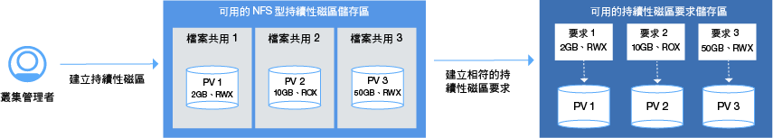
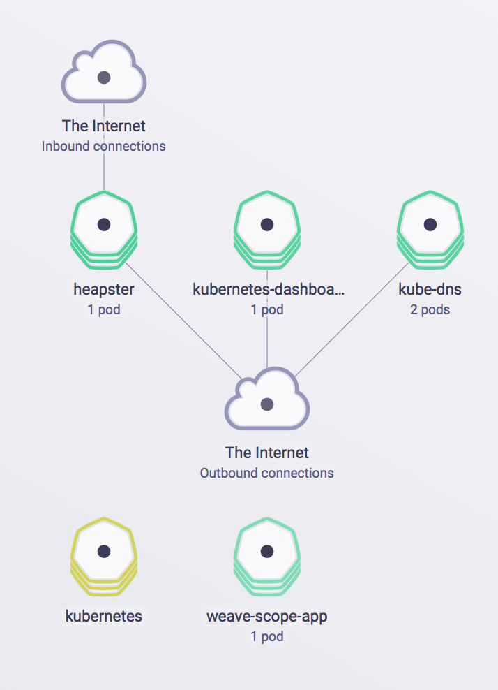

---

copyright:
  years: 2014, 2017
lastupdated: "2017-08-21"

---

{:new_window: target="_blank"}
{:shortdesc: .shortdesc}
{:screen: .screen}
{:pre: .pre}
{:codeblock: .codeblock}
{:table: .aria-labeledby="caption"}
{:codeblock: .codeblock}
{:tip: .tip} 
{:download: .download}


# 設定叢集
{: #cs_cluster}

設計最大可用性及容量的叢集設定。
{:shortdesc}

開始之前，請檢閱[高可用性叢集配置](cs_planning.html#cs_planning_cluster_config)的選項。

](https://console.bluemix.net/docs/api/content/containers/images/cs_cluster_ha_roadmap.png)

## 使用 GUI 建立叢集
{: #cs_cluster_ui}

Kubernetes 叢集是一組組織成網路的工作者節點。叢集的用途是要定義一組資源、節點、網路及儲存裝置，以讓應用程式保持高度可用。您必須先建立叢集並設定該叢集中工作者節點的定義，才能部署應用程式。
{:shortdesc}

若為「{{site.data.keyword.Bluemix_notm}} 專用」使用者，請改為參閱[在 {{site.data.keyword.Bluemix_notm}} 專用中從 GUI 建立 Kubernetes 叢集（封閉測試版）](#creating_cli_dedicated)。

若要建立叢集，請執行下列動作：
1.  從型錄中，選取**容器**，然後按一下 **Kubernetes 叢集**。

2.  在**叢集類型**中，選取**標準**。使用標準叢集，您可以取得多個工作者節點這類特性，以取得高可用性環境。
3.  輸入**叢集名稱**。
4.  選取要在工作者節點中使用的 **Kubernetes 版本**。 
5.  選取要在其中部署叢集的{{site.data.keyword.Bluemix_notm}} **位置**。可用的位置取決於您所登入的 {{site.data.keyword.Bluemix_notm}} 地區。選取實際上與您最接近的地區以獲得最佳效能。
若您選取的位置不在您的國家/地區境內，請謹記，您可能需要合法授權，才能實際將資料儲存在國外。
{{site.data.keyword.Bluemix_notm}} 地區會決定您可以使用的容器登錄，以及您適用的 {{site.data.keyword.Bluemix_notm}} 服務。

6.  選取**機型**。機型會定義設定於每一個工作者節點中，且可供節點中部署之所有容器使用的虛擬 CPU 及記憶體數量。
    -   微機型指出最小選項。
    -   平衡機型具有指派給每一個 CPU 的相等記憶體數量，以最佳化效能。
7.  選擇您需要的**工作者節點數目**。選取 3，以獲得叢集的較高可用性。
8.  從 {{site.data.keyword.BluSoftlayer_full}} 帳戶中，選取**專用 VLAN**。專用 VLAN 是用來在工作者節點之間進行通訊。您可以將相同的專用 VLAN 用於多個叢集。
9. 從 {{site.data.keyword.BluSoftlayer_notm}} 帳戶中，選取**公用 VLAN**。公用 VLAN 是用來在工作者節點與 IBM 所管理的 Kubernetes 主節點之間進行通訊。您可以將相同的公用 VLAN 用於多個叢集。如果您選擇不要選取「公用 VLAN」，則必須配置替代方案。
10. 對於**硬體**，選擇**專用**或**共用**。在大部分情況中，**共用**選項就已足夠。
    -   **專用**：確保完整隔離實體資源與其他 IBM 客戶。
    -   **共用**：容許 IBM 將實體資源儲存在與其他 IBM 客戶相同的硬體上。
11. 按一下**建立叢集**。即會開啟叢集的詳細資料，但叢集中的工作者節點需要數分鐘的時間進行佈建。在**工作者節點**標籤中，您可以看到工作者節點部署的進度。工作者節點備妥後，狀態會變更為**備妥**。

    **附註：**每個工作者節點都會獲指派唯一的工作者節點 ID 及網域名稱，在叢集建立之後即不得手動予以變更。變更 ID 或網域名稱會讓 Kubernetes 主節點無法管理叢集。


**下一步為何？**

當叢集開始執行時，您可以查看下列作業：

-   [安裝 CLI 以開始使用您的叢集。](cs_cli_install.html#cs_cli_install)
-   [在叢集中部署應用程式。](cs_apps.html#cs_apps_cli)
-   [在 {{site.data.keyword.Bluemix_notm}} 中設定您自己的專用登錄，以儲存 Docker 映像檔，並將它與其他使用者共用。](/docs/services/Registry/index.html)

### 在 {{site.data.keyword.Bluemix_notm}} 專用中使用 GUI 建立叢集（封閉測試版）
{: #creating_ui_dedicated}

1.  使用 IBM ID，登入「{{site.data.keyword.Bluemix_notm}} 公用」主控台 ([https://console.bluemix.net ](https://console.bluemix.net))。
2.  從帳戶功能表中，選取「{{site.data.keyword.Bluemix_notm}} 專用」帳戶。即會使用「{{site.data.keyword.Bluemix_notm}} 專用」實例的服務及資訊來更新主控台。
3.  從型錄中，選取**容器**，然後按一下 **Kubernetes 叢集**。
4.  輸入**叢集名稱**。
5.  選取要在工作者節點中使用的 **Kubernetes 版本**。 
6.  選取**機型**。機型會定義設定於每一個工作者節點中，且可供節點中部署之所有容器使用的虛擬 CPU 及記憶體數量。
    -   微機型指出最小選項。
    -   平衡機型具有指派給每一個 CPU 的相等記憶體數量，以最佳化效能。
7.  選擇您需要的**工作者節點數目**。選取 3，確保叢集的高可用性。
8.  按一下**建立叢集**。即會開啟叢集的詳細資料，但叢集中的工作者節點需要數分鐘的時間進行佈建。在**工作者節點**標籤中，您可以看到工作者節點部署的進度。工作者節點備妥後，狀態會變更為**備妥**。

**下一步為何？**

當叢集開始執行時，您可以查看下列作業：

-   [安裝 CLI 以開始使用您的叢集。](cs_cli_install.html#cs_cli_install)
-   [在叢集中部署應用程式。](cs_apps.html#cs_apps_cli)
-   [在 {{site.data.keyword.Bluemix_notm}} 中設定您自己的專用登錄，以儲存 Docker 映像檔，並將它與其他使用者共用。](/docs/services/Registry/index.html)

## 使用 CLI 建立叢集
{: #cs_cluster_cli}

叢集是一組組織成網路的工作者節點。叢集的用途是要定義一組資源、節點、網路及儲存裝置，以讓應用程式保持高度可用。您必須先建立叢集並設定該叢集中工作者節點的定義，才能部署應用程式。
{:shortdesc}

若為「{{site.data.keyword.Bluemix_notm}} 專用」使用者，請改為參閱[在 {{site.data.keyword.Bluemix_notm}} 專用中從 CLI 建立 Kubernetes 叢集（封閉測試版）](#creating_cli_dedicated)。

若要建立叢集，請執行下列動作：
1.  安裝 {{site.data.keyword.Bluemix_notm}} CLI 及 [{{site.data.keyword.containershort_notm}} 外掛程式](cs_cli_install.html#cs_cli_install)。
2.  登入 {{site.data.keyword.Bluemix_notm}} CLI。系統提示時，請輸入您的 {{site.data.keyword.Bluemix_notm}} 認證。

    ```
    bx login
    ```
    {: pre}

      若要指定特定 {{site.data.keyword.Bluemix_notm}} 地區，請包括 API 端點。如果您的專用 Docker 映像檔已儲存在特定 {{site.data.keyword.Bluemix_notm}} 地區的容器登錄中，或已建立的 {{site.data.keyword.Bluemix_notm}} 服務實例，請登入此地區以存取映像檔及 {{site.data.keyword.Bluemix_notm}} 服務。

      您登入的 {{site.data.keyword.Bluemix_notm}} 地區也會決定可以建立 Kubernetes 叢集的地區（包括可用的資料中心）。如果您未指定地區，則會將您自動登入最接近的地區。

       -  美國南部

           ```
           bx login -a api.ng.bluemix.net
           ```
           {: pre}
     
       -  雪梨

           ```
           bx login -a api.au-syd.bluemix.net
           ```
           {: pre}

       -  德國

           ```
           bx login -a api.eu-de.bluemix.net
           ```
           {: pre}

       -  英國

           ```
           bx login -a api.eu-gb.bluemix.net
           ```
           {: pre}

      **附註：**如果您具有聯合 ID，請使用 `bx login --sso` 來登入 {{site.data.keyword.Bluemix_notm}} CLI。請輸入使用者名稱，並使用 CLI 輸出中提供的 URL 來擷取一次性密碼。若沒有 `--sso` 時登入失敗，而有 `--sso` 選項時登入成功，即表示您有聯合 ID。

3.  如果您被指派到多個 {{site.data.keyword.Bluemix_notm}} 帳戶、組織及空間，請選取您要在其中建立 Kubernetes 叢集的帳戶。叢集是帳戶及組織所特有的，但與 {{site.data.keyword.Bluemix_notm}} 空間無關。因此，如果您可以存取組織中的多個空間，則可以從清單中選取任何空間。
4.  選用項目：如果您要在先前所選取 {{site.data.keyword.Bluemix_notm}} 地區以外的地區中建立或存取 Kubernetes 叢集，請指定此地區。例如，您可能因為下列原因而想要登入另一個 {{site.data.keyword.containershort_notm}} 地區：

    -   您已在其中一個地區中建立 {{site.data.keyword.Bluemix_notm}} 服務或專用 Docker 映像檔，並且想要在另一個地區中將它們與 {{site.data.keyword.containershort_notm}} 搭配使用。
    -   您要在與您登入的預設 {{site.data.keyword.Bluemix_notm}} 地區不同的地區中存取叢集。
    
    選擇下列 API 端點：

    -   美國南部：

        ```
        bx cs init --host https://us-south.containers.bluemix.net
        ```
        {: pre}

    -   英國南部：

        ```
        bx cs init --host https://uk-south.containers.bluemix.net
        ```
        {: pre}

    -   歐盟中部：

        ```
        bx cs init --host https://eu-central.containers.bluemix.net
        ```
        {: pre}

    -   亞太地區南部：

        ```
        bx cs init --host https://ap-south.containers.bluemix.net
        ```
        {: pre}
    
6.  建立叢集。
    1.  檢閱可用的位置。顯示的位置取決於您所登入的 {{site.data.keyword.containershort_notm}} 地區。

        ```
        bx cs locations
        ```
        {: pre}

        CLI 輸出會與下列內容類似：


        -   美國南部：

            ```
            dal10
            dal12
            ```
            {: screen}

        -   英國南部：

            ```
            lon02
            lon04
            ```
            {: screen}

        -   歐盟中部：

            ```
            ams03
            fra02
            ```
            {: screen}

        -   亞太地區南部

            ```
            syd01
            syd02
            ```
            {: screen}

    2.  選擇位置，並檢閱該位置中可用的機型。機型指定每一個工作者節點可用的虛擬運算資源。

        ```
        bx cs machine-types <location>
        ```
        {: pre}

        ```
        Getting machine types list...
        OK
        Machine Types
        Name         Cores   Memory   Network Speed   OS             Storage   Server Type   
        u1c.2x4      2       4GB      1000Mbps        UBUNTU_16_64   100GB     virtual   
        b1c.4x16     4       16GB     1000Mbps        UBUNTU_16_64   100GB     virtual   
        b1c.16x64    16      64GB     1000Mbps        UBUNTU_16_64   100GB     virtual   
        b1c.32x128   32      128GB    1000Mbps        UBUNTU_16_64   100GB     virtual   
        b1c.56x242   56      242GB    1000Mbps        UBUNTU_16_64   100GB     virtual 
        ```
        {: screen}

    3.  請查看 {{site.data.keyword.BluSoftlayer_notm}} 中是否已存在此帳戶的公用及專用 VLAN。

        ```
        bx cs vlans <location>
        ```
        {: pre}

        ```
        ID        Name                Number   Type      Router  
        1519999   vlan   1355     private   bcr02a.dal10  
        1519898   vlan   1357     private   bcr02a.dal10 
        1518787   vlan   1252     public   fcr02a.dal10 
        1518888   vlan   1254     public    fcr02a.dal10 
        ```
        {: screen}

        如果公用及專用 VLAN 已存在，請記下相符的路由器。專用 VLAN 路由器的開頭一律為 `bcr`（後端路由器），而公用 VLAN 路由器的開頭一律為 `fcr`（前端路由器）。這些字首後面的數字與字母組合必須相符，才能在建立叢集時使用這些 VLAN。在範例輸出中，任何專用 VLAN 都可以與任何公用 VLAN 搭配使用，因為路由器都會包括 `02a.dal10`。

    4.  執行 `cluster-create` 指令。您可以選擇精簡叢集（包括一個已設定 2vCPU 及 4GB 記憶體的工作者節點）或標準叢集（可以在 {{site.data.keyword.BluSoftlayer_notm}} 帳戶中包括您所選擇數目的工作者節點）。當您建立標準叢集時，依預設，工作者節點的硬體由多位 IBM 客戶所共用，並且按小時計費。</b>標準叢集的範例：

        ```
        bx cs cluster-create --location dal10; --public-vlan <public_vlan_id> --private-vlan <private_vlan_id> --machine-type u1c.2x4 --workers 3 --name <cluster_name>
        ```
        {: pre}

        精簡叢集的範例：

        ```
        bx cs cluster-create --name my_cluster
        ```
        {: pre}

        <table>
        <caption>表 1. 瞭解此指令的元件</caption>
        <thead>
        <th colspan=2> 瞭解此指令的元件</th>
        </thead>
        <tbody>
        <tr>
        <td><code>cluster-create</code></td>
        <td>在 {{site.data.keyword.Bluemix_notm}} 組織中建立叢集的指令。</td> 
        </tr>
        <tr>
        <td><code>--location <em>&lt;location&gt;</em></code></td>
        <td>將 <em>&lt;location&gt;</em> 取代為您要建立叢集的 {{site.data.keyword.Bluemix_notm}} 位置 ID。可用的位置取決於您所登入的 {{site.data.keyword.containershort_notm}} 地區。可用的位置如下：<ul><li>美國南部<ul><li>dal10 [達拉斯]</li><li>dal12 [達拉斯]</li></ul></li><li>英國南部<ul><li>lon02 [倫敦]</li><li>lon04 [倫敦]</li></ul></li><li>歐盟中部<ul><li>ams03 [阿姆斯特丹]</li><li>ra02 [法蘭克福]</li></ul></li><li>亞太地區南部<ul><li>syd01 [雪梨]</li><li>syd04 [雪梨]</li></ul></li></ul></td> 
        </tr>
        <tr>
        <td><code>--machine-type <em>&lt;machine_type&gt;</em></code></td>
        <td>如果您要建立標準叢集，請選擇機型。機型指定每一個工作者節點可用的虛擬運算資源。如需相關資訊，請檢閱[比較 {{site.data.keyword.containershort_notm}} 的精簡與標準叢集](cs_planning.html#cs_planning_cluster_type)。若為精簡叢集，您不需要定義機型。</td> 
        </tr>
        <tr>
        <td><code>--public-vlan <em>&lt;public_vlan_id&gt;</em></code></td>
        <td><ul><li>若為精簡叢集，您不需要定義公用 VLAN。精簡叢集會自動連接至 IBM 所擁有的公用 VLAN。</li><li>若為標準叢集，如果您已在 {{site.data.keyword.BluSoftlayer_notm}} 帳戶中設定該位置的公用 VLAN，請輸入公用 VLAN 的 ID。否則，您不需要指定此選項，因為 {{site.data.keyword.containershort_notm}} 會自動建立公用 VLAN。<br/><br/><strong>附註</strong>：您使用 create 指令所指定的公用及專用 VLAN 必須相符。專用 VLAN 路由器的開頭一律為 <code>bcr</code>（後端路由器），而公用 VLAN 路由器的開頭一律為 <code>fcr</code>（前端路由器）。這些字首後面的數字與字母組合必須相符，才能在建立叢集時使用這些 VLAN。請不要使用不相符的公用及專用 VLAN 來建立叢集。</li></ul></td> 
        </tr>
        <tr>
        <td><code>--private-vlan <em>&lt;private_vlan_id&gt;</em></code></td>
        <td><ul><li>若為精簡叢集，您不需要定義專用 VLAN。精簡叢集會自動連接至 IBM 所擁有的專用 VLAN。</li><li>若為標準叢集，如果您已在 {{site.data.keyword.BluSoftlayer_notm}} 帳戶中設定該位置的專用 VLAN，請輸入專用 VLAN 的 ID。否則，您不需要指定此選項，因為 {{site.data.keyword.containershort_notm}} 會自動建立專用 VLAN。<br/><br/><strong>附註</strong>：您使用 create 指令所指定的公用及專用 VLAN 必須相符。專用 VLAN 路由器的開頭一律為 <code>bcr</code>（後端路由器），而公用 VLAN 路由器的開頭一律為 <code>fcr</code>（前端路由器）。這些字首後面的數字與字母組合必須相符，才能在建立叢集時使用這些 VLAN。請不要使用不相符的公用及專用 VLAN 來建立叢集。</li></ul></td> 
        </tr>
        <tr>
        <td><code>--name <em>&lt;name&gt;</em></code></td>
        <td>將 <em>&lt;name&gt;</em> 取代為叢集的名稱。</td> 
        </tr>
        <tr>
        <td><code>--workers <em>&lt;number&gt;</em></code></td>
        <td>要包含在叢集中的工作者節點數目。如果未指定 <code>--workers</code> 選項，會建立 1 個工作者節點。</td> 
        </tr>
        </tbody></table>

7.  驗證已要求建立叢集。

    ```
    bx cs clusters
    ```
    {: pre}

    **附註：**訂購工作者節點機器，並在您的帳戶中設定及佈建叢集，最多可能需要 15 分鐘。

    叢集佈建完成之後，叢集的狀態會變更為**已部署**。

    ```
    Name         ID                                   State      Created          Workers   
    my_cluster   paf97e8843e29941b49c598f516de72101   deployed   20170201162433   1   
    ```
    {: screen}

8.  檢查工作者節點的狀態。

    ```
    bx cs workers <cluster>
    ```
    {: pre}

    工作者節點備妥後，狀態會變更為**正常**，而且狀態為**備妥**。當節點狀態為**備妥**時，您就可以存取叢集。

    **附註：**每個工作者節點都會獲指派唯一的工作者節點 ID 及網域名稱，在叢集建立之後即不得手動予以變更。變更 ID 或網域名稱會讓 Kubernetes 主節點無法管理叢集。

    ```
    ID                                                  Public IP        Private IP     Machine Type   State      Status  
    prod-dal10-pa8dfcc5223804439c87489886dbbc9c07-w1   169.47.223.113   10.171.42.93   free           normal    Ready
    ```
    {: screen}

9. 將您建立的叢集設為此階段作業的環境定義。請在您每次使用叢集時，完成下列配置步驟。
    1.  取得指令來設定環境變數，並下載 Kubernetes 配置檔。

        ```
        bx cs cluster-config <cluster_name_or_id>
        ```
        {: pre}

        配置檔下載完成之後，會顯示一個指令，可讓您用來將本端 Kubernetes 配置檔的路徑設定為環境變數。

        OS X 的範例：

        ```
        export KUBECONFIG=/Users/<user_name>/.bluemix/plugins/container-service/clusters/<cluster_name>/kube-config-prod-dal10-<cluster_name>.yml
        ```
        {: screen}

    2.  複製並貼上終端機中顯示的指令，以設定 `KUBECONFIG` 環境變數。
    3.  驗證 `KUBECONFIG` 環境變數已適當設定。

        OS X 的範例：

        ```
        echo $KUBECONFIG
        ```
        {: pre}

        輸出：

        ```
        /Users/<user_name>/.bluemix/plugins/container-service/clusters/<cluster_name>/kube-config-prod-dal10-<cluster_name>.yml

        ```
        {: screen}

10. 使用預設埠 8001 來啟動 Kubernetes 儀表板。
    1.  使用預設埠號來設定 Proxy。

        ```
        kubectl proxy
        ```
        {: pre}

        ```
        Starting to serve on 127.0.0.1:8001
        ```
        {: screen}

    2.  在 Web 瀏覽器中開啟下列 URL，以查看 Kubernetes 儀表板。

        ```
        http://localhost:8001/ui
        ```
        {: codeblock}


**下一步為何？**

-   [在叢集中部署應用程式。](cs_apps.html#cs_apps_cli)
-   [使用 `kubectl` 指令行管理叢集 。](https://kubernetes.io/docs/user-guide/kubectl/)
-   [在 {{site.data.keyword.Bluemix_notm}} 中設定您自己的專用登錄，以儲存 Docker 映像檔，並將它與其他使用者共用。](/docs/services/Registry/index.html)

### 在 {{site.data.keyword.Bluemix_notm}} 專用中使用 CLI 建立叢集（封閉測試版）
{: #creating_cli_dedicated}

1.  安裝 {{site.data.keyword.Bluemix_notm}} CLI 及 [{{site.data.keyword.containershort_notm}} 外掛程式](cs_cli_install.html#cs_cli_install)。
2.  登入 {{site.data.keyword.containershort_notm}} 的公用端點。系統提示時，請輸入 {{site.data.keyword.Bluemix_notm}} 認證，然後選取「{{site.data.keyword.Bluemix_notm}} 專用」帳戶。

    ```
    bx login -a api.<region>.bluemix.net
    ```
    {: pre}

    **附註：**如果您具有聯合 ID，請使用 `bx login --sso` 來登入 {{site.data.keyword.Bluemix_notm}} CLI。請輸入使用者名稱，並使用 CLI 輸出中提供的 URL 來擷取一次性密碼。若沒有 `--sso` 時登入失敗，而有 `--sso` 選項時登入成功，即表示您有聯合 ID。

3.  使用 `cluster-create` 指令來建立叢集。當您建立標準叢集時，工作者節點的硬體會按小時計費。

    範例

    ```
    bx cs cluster-create --machine-type <machine-type> --workers <number> --name <cluster_name>
    ```
    {: pre}
    
    <table>
    <caption>表 2. 瞭解此指令的元件</caption>
    <thead>
    <th colspan=2> 瞭解此指令的元件</th>
    </thead>
    <tbody>
    <tr>
    <td><code>cluster-create</code></td>
    <td>在 {{site.data.keyword.Bluemix_notm}} 組織中建立叢集的指令。</td> 
    </tr>
    <tr>
    <td><code>--location <em>&lt;location&gt;</em></code></td>
    <td>將 &lt;location&gt; 取代為您要建立叢集的 {{site.data.keyword.Bluemix_notm}} 位置 ID。可用的位置取決於您所登入的 {{site.data.keyword.containershort_notm}} 地區。可用的位置如下：<ul><li>美國南部<ul><li>dal10 [達拉斯]</li><li>dal12 [達拉斯]</li></ul></li><li>英國南部<ul><li>lon02 [倫敦]</li><li>lon04 [倫敦]</li></ul></li><li>歐盟中部<ul><li>ams03 [阿姆斯特丹]</li><li>ra02 [法蘭克福]</li></ul></li><li>亞太地區南部<ul><li>syd01 [雪梨]</li><li>syd04 [雪梨]</li></ul></li></ul></td> 
    </tr>
    <tr>
    <td><code>--machine-type <em>&lt;machine_type&gt;</em></code></td>
    <td>如果您要建立標準叢集，請選擇機型。機型指定每一個工作者節點可用的虛擬運算資源。如需相關資訊，請檢閱[比較 {{site.data.keyword.containershort_notm}} 的精簡與標準叢集](cs_planning.html#cs_planning_cluster_type)。若為精簡叢集，您不需要定義機型。</td> 
    </tr>
    <tr>
    <td><code>--name <em>&lt;name&gt;</em></code></td>
    <td>將 <em>&lt;name&gt;</em> 取代為叢集的名稱。</td> 
    </tr>
    <tr>
    <td><code>--workers <em>&lt;number&gt;</em></code></td>
    <td>要包含在叢集中的工作者節點數目。如果未指定 <code>--workers</code> 選項，會建立 1 個工作者節點。</td> 
    </tr>
    </tbody></table>

4.  驗證已要求建立叢集。

    ```
    bx cs clusters
    ```
    {: pre}

    **附註：**訂購工作者節點機器，並在您的帳戶中設定及佈建叢集，最多可能需要 15 分鐘。

    叢集佈建完成之後，叢集的狀態會變更為**已部署**。

    ```
    Name         ID                                   State      Created          Workers   
    my_cluster   paf97e8843e29941b49c598f516de72101   deployed   20170201162433   1   
    ```
    {: screen}

5.  檢查工作者節點的狀態。

    ```
    bx cs workers <cluster>
    ```
    {: pre}

    工作者節點備妥後，狀態會變更為**正常**，而且狀態為**備妥**。當節點狀態為**備妥**時，您就可以存取叢集。


    ```
    ID                                                  Public IP        Private IP     Machine Type   State      Status  
    prod-dal10-pa8dfcc5223804439c87489886dbbc9c07-w1   169.47.223.113   10.171.42.93   free           normal    Ready
    ```
    {: screen}

6.  將您建立的叢集設為此階段作業的環境定義。請在您每次使用叢集時，完成下列配置步驟。

    1.  取得指令來設定環境變數，並下載 Kubernetes 配置檔。

        ```
        bx cs cluster-config <cluster_name_or_id>
        ```
        {: pre}

        配置檔下載完成之後，會顯示一個指令，可讓您用來將本端 Kubernetes 配置檔的路徑設定為環境變數。

        OS X 的範例：

        ```
        export KUBECONFIG=/Users/<user_name>/.bluemix/plugins/container-service/clusters/<cluster_name>/kube-config-prod-dal10-<cluster_name>.yml
        ```
        {: screen}

    2.  複製並貼上終端機中顯示的指令，以設定 `KUBECONFIG` 環境變數。
    3.  驗證 `KUBECONFIG` 環境變數已適當設定。

        OS X 的範例：

        ```
        echo $KUBECONFIG
        ```
        {: pre}

        輸出：

        ```
        /Users/<user_name>/.bluemix/plugins/container-service/clusters/<cluster_name>/kube-config-prod-dal10-<cluster_name>.yml

        ```
        {: screen}

7.  使用預設埠 8001 來存取 Kubernetes 儀表板。
    1.  使用預設埠號來設定 Proxy。

        ```
        kubectl proxy
        ```
        {: pre}

        ```
        Starting to serve on 127.0.0.1:8001
        ```
        {: screen}

    2.  在 Web 瀏覽器中開啟下列 URL，以查看 Kubernetes 儀表板。

        ```
        http://localhost:8001/ui
        ```
        {: codeblock}


**下一步為何？**

-   [在叢集中部署應用程式。](cs_apps.html#cs_apps_cli)
-   [使用 `kubectl` 指令行管理叢集 。](https://kubernetes.io/docs/user-guide/kubectl/)
-   [在 {{site.data.keyword.Bluemix_notm}} 中設定您自己的專用登錄，以儲存 Docker 映像檔，並將它與其他使用者共用。](/docs/services/Registry/index.html)

## 使用專用及公用映像檔登錄
{: #cs_apps_images}

Docker 映像檔是您建立的每個容器的基礎。映像檔是從 Dockerfile 所建立的，該 Dockerfile 檔案包含建置映像檔的指示。Dockerfile 可能會參照其指示中個別儲存的建置構件（例如應用程式、應用程式的配置及其相依關係）。映像檔通常會儲存在登錄中，而該登錄可供公開存取（公用登錄）或已設定一小組使用者的有限存取（專用登錄）。
{:shortdesc}

請檢閱下列選項，以尋找如何設定映像檔登錄以及如何使用登錄中之映像檔的相關資訊。

-   [存取 {{site.data.keyword.registryshort_notm}} 中的名稱空間，以使用 IBM 提供的映像檔及您自己的專用 Docker 映像檔](#bx_registry_default)。
-   [從 Docker Hub 存取公用映像檔](#dockerhub)。
-   [存取儲存在其他專用登錄中的專用映像檔](#private_registry)。

### 存取 {{site.data.keyword.registryshort_notm}} 中的名稱空間，以使用 IBM 提供的映像檔及您自己的專用 Docker 映像檔
{: #bx_registry_default}

您可以將容器從 IBM 提供的公用映像檔或 {{site.data.keyword.registryshort_notm}} 的名稱空間中所儲存的專用映像檔部署至叢集中。

開始之前：

-   [在「{{site.data.keyword.Bluemix_notm}} 公用」或「{{site.data.keyword.Bluemix_notm}} 專用」上，於 {{site.data.keyword.registryshort_notm}} 中設定名稱空間，並將映像檔推送至此名稱空間](/docs/services/Registry/registry_setup_cli_namespace.html#registry_namespace_add)。
-   [建立叢集](#cs_cluster_cli)。
-   [將 CLI 的目標設為叢集](cs_cli_install.html#cs_cli_configure)。

當您建立叢集時，會自動建立叢集的未過期登錄記號。此記號是用來授權 {{site.data.keyword.registryshort_notm}} 中所設定的任何名稱空間的唯讀存取，因此您可以使用 IBM 提供的公用及您自己的專用 Docker 映像檔。當您部署容器化應用程式時，記號必須儲存在 Kubernetes `imagePullSecret` 中，才能供 Kubernetes 叢集存取。建立叢集時，{{site.data.keyword.containershort_notm}} 會自動將此記號儲存在 Kubernetes `imagePullSecret` 中。`imagePullSecret` 會新增至預設 Kubernetes 名稱空間、該名稱空間的 ServiceAccount 中的預設 Secret 清單，以及 kube-system 名稱空間。

**附註：**使用此起始設定，即可將容器從 {{site.data.keyword.Bluemix_notm}} 帳戶之名稱空間中可用的任何映像檔，部署至叢集的 **default** 名稱空間。如果您要將容器部署至叢集的其他名稱空間，或者要使用儲存在另一個 {{site.data.keyword.Bluemix_notm}} 地區或另一個 {{site.data.keyword.Bluemix_notm}} 帳戶中的映像檔，則必須[為叢集建立您自己的 imagePullSecret](#bx_registry_other)。

若要將容器部署至叢集的 **default** 名稱空間，請建立部署配置 Script。

1.  開啟偏好的編輯器，然後建立名為 <em>mydeployment.yaml</em> 的部署配置 Script。
2.  從 {{site.data.keyword.registryshort_notm}} 中的名稱空間，定義您要使用的部署及映像檔。

    若要使用 {{site.data.keyword.registryshort_notm}} 的名稱空間中的專用映像檔：

    ```
    apiVersion: extensions/v1beta1
    kind: Deployment
    metadata:
      name: ibmliberty-deployment
    spec:
      replicas: 3
      template:
        metadata:
          labels:
            app: ibmliberty
        spec:
          containers:
          - name: ibmliberty
            image: registry.<region>.bluemix.net/<namespace>/<my_image>:<tag>
    ```
    {: codeblock}

    **提示：**若要擷取名稱空間資訊，請執行 `bx cr namespace-list`。

3.  在叢集中建立部署。

    ```
    kubectl apply -f mydeployment.yaml
    ```
    {: pre}

    **提示：**您也可以部署現有配置 Script，例如其中一個 IBM 提供的公用映像檔。此範例在美國南部地區使用 **ibmliberty** 映像檔。

    ```
    kubectl apply -f https://raw.githubusercontent.com/IBM-{{site.data.keyword.Bluemix_notm}}/kube-samples/master/deploy-apps-clusters/deploy-ibmliberty.yaml
    ```
    {: pre}

### 將映像檔部署至其他 Kubernetes 名稱空間，或存取其他 {{site.data.keyword.Bluemix_notm}} 地區及帳戶中的映像檔
{: #bx_registry_other}

您可以將容器部署至其他 Kubernetes 名稱空間、使用儲存在其他 {{site.data.keyword.Bluemix_notm}} 地區或帳戶中的映像檔，或使用儲存在「{{site.data.keyword.Bluemix_notm}} 專用」中的映像檔，方法是建立您自己的 imagePullSecret。

開始之前：

1.  [在「{{site.data.keyword.Bluemix_notm}} 公用」或「{{site.data.keyword.Bluemix_notm}} 專用」上，於 {{site.data.keyword.registryshort_notm}} 中設定名稱空間，並將映像檔推送至此名稱空間](/docs/services/Registry/registry_setup_cli_namespace.html#registry_namespace_add)。
2.  [建立叢集](#cs_cluster_cli)。
3.  [將 CLI 的目標設為叢集](cs_cli_install.html#cs_cli_configure)。

若要建立您自己的 imagePullSecret，請執行下列動作：

**附註：**ImagePullSecrets 僅適用於建立它們的 Kubernetes 名稱空間。請針對您要從專用映像檔中部署容器的每個名稱空間，重複這些步驟。

1.  如果您還沒有記號，請[為您要存取的登錄建立記號](/docs/services/Registry/registry_tokens.html#registry_tokens_create)。
2.  列出 {{site.data.keyword.Bluemix_notm}} 帳戶中的可用記號。

    ```
    bx cr token-list
    ```
    {: pre}

3.  記下您要使用的記號 ID。
4.  擷取記號的值。將 <token_id> 取代為您在前一個步驟中所擷取的記號 ID。

    ```
    bx cr token-get <token_id>
    ```
    {: pre}

    您的記號值會顯示在 CLI 輸出的**記號**欄位中。

5.  建立用來儲存記號資訊的 Kubernetes Secret。

    ```
    kubectl --namespace <kubernetes_namespace> create secret docker-registry <secret_name>  --docker-server=<registry_url> --docker-username=token --docker-password=<token_value> --docker-email=<docker_email>
    ```
    {: pre}
    
    <table>
    <caption>表 3. 瞭解此指令的元件</caption>
    <thead>
    <th colspan=2> 瞭解此指令的元件</th>
    </thead>
    <tbody>
    <tr>
    <td><code>--namespace <em>&lt;kubernetes_namespace&gt;</em></code></td>
    <td>必要。您要使用 Secret 並在其中部署容器的叢集的 Kubernetes 名稱空間。執行 <code>kubectl get namespaces</code>，以列出叢集中的所有名稱空間。</td> 
    </tr>
    <tr>
    <td><code><em>&lt;secret_name&gt;</em></code></td>
    <td>必要。您要用於 imagePullSecret 的名稱。</td> 
    </tr>
    <tr>
    <td><code>--docker-server <em>&lt;registry_url&gt;</em></code></td>
    <td>必要。已設定名稱空間的映像檔登錄的 URL。<ul><li>對於美國南部所設定的名稱空間：registry.ng.bluemix.net</li><li>對於英國南部所設定的名稱空間：registry.eu-gb.bluemix.net</li><li>對於歐盟中部（法蘭克福）所設定的名稱空間：registry.eu-de.bluemix.net</li><li>對於澳洲（雪梨）所設定的名稱空間：registry.au-syd.bluemix.net</li><li>對於「{{site.data.keyword.Bluemix_notm}} 專用」所設定的名稱空間：registry.<em>&lt;dedicated_domain&gt;</em></li></ul></td> 
    </tr>
    <tr>
    <td><code>--docker-username <em>&lt;docker_username&gt;</em></code></td>
    <td>必要。登入專用登錄的使用者名稱。</td> 
    </tr>
    <tr>
    <td><code>--docker-password <em>&lt;token_value&gt;</em></code></td>
    <td>必要。先前所擷取的登錄記號值。</td> 
    </tr>
    <tr>
    <td><code>--docker-email <em>&lt;docker-email&gt;</em></code></td>
    <td>必要。如果您有 Docker 電子郵件位址，請輸入它。否則，請輸入虛構的電子郵件位址，例如 a@b.c。此電子郵件是建立 Kubernetes Secret 的必要項目，但在建立之後就不再使用。</td> 
    </tr>
    </tbody></table>

6.  驗證已順利建立 Secret。將 <em>&lt;kubernetes_namespace&gt;</em> 取代為已建立 imagePullSecret 的名稱空間的名稱。

    ```
    kubectl get secrets --namespace <kubernetes_namespace>
    ```
    {: pre}

7.  建立會參照 imagePullSecret 的 Pod。
    1.  開啟偏好的編輯器，然後建立名為 mypod.yaml 的 Pod 配置 Script。
    2.  定義您要用來存取專用 {{site.data.keyword.Bluemix_notm}} 登錄的 Pod 及 imagePullSecret。若要使用名稱空間中的專用映像檔：

        ```
        apiVersion: v1
        kind: Pod
        metadata:
          name: <pod_name>
        spec:
          containers:
            - name: <container_name>
              image: registry.<region>.bluemix.net/<my_namespace>/<my_image>:<tag>  
          imagePullSecrets:
            - name: <secret_name>
        ```
        {: codeblock}

        <table>
        <caption>表 4. 瞭解 YAML 檔案元件</caption>
        <thead>
        <th colspan=2> 瞭解 YAML 檔案元件</th>
        </thead>
        <tbody>
        <tr>
        <td><code><em>&lt;container_name&gt;</em></code></td>
        <td>您要部署至叢集的容器的名稱。</td> 
        </tr>
        <tr>
        <td><code><em>&lt;secret_name&gt;</em></code></td>
        <td>在其中儲存映像檔的名稱空間。若要列出可用的名稱空間，請執行 `bx cr namespace-list`。</td> 
        </tr>
        <tr>
        <td><code><em>&lt;my_namespace&gt;</em></code></td>
        <td>在其中儲存映像檔的名稱空間。若要列出可用的名稱空間，請執行 `bx cr namespace-list`。</td> 
        </tr>
        <tr>
        <td><code><em>&lt;my_image&gt;</em></code></td>
        <td>您要使用的映像檔的名稱。若要列出 {{site.data.keyword.Bluemix_notm}} 帳戶中的可用映像檔，請執行 `bx cr image-list`。</td> 
        </tr>
        <tr>
        <td><code><em>&lt;tag&gt;</em></code></td>
        <td>您要使用的映像檔的版本。如果未指定任何標籤，預設會使用標記為<strong>最新</strong>的映像檔。</td> 
        </tr>
        <tr>
        <td><code><em>&lt;secret_name&gt;</em></code></td>
        <td>您先前建立的 imagePullSecret 的名稱。</td> 
        </tr>
        </tbody></table>

   3.  儲存變更。
   4.  在叢集中建立部署。

        ```
        kubectl apply -f mypod.yaml
        ```
        {: pre}


### 從 Docker Hub 存取公用映像檔
{: #dockerhub}

您可以使用儲存在 Docker Hub 中的任何公用映像檔來將容器部署至叢集，而不需要進行任何額外配置。建立部署配置 Script 檔，或部署現有部署配置 Script 檔。

開始之前：

1.  [建立叢集](#cs_cluster_cli)。
2.  [將 CLI 的目標設為叢集](cs_cli_install.html#cs_cli_configure)。

建立部署配置 Script。

1.  開啟偏好的編輯器，然後建立名為 mydeployment.yaml 的部署配置 Script。
2.  從 Docker Hub 中，定義您要使用的部署及公用映像檔。下列配置 Script 使用 Docker Hub 上可用的公用 NGINX 映像檔。

    ```
    apiVersion: extensions/v1beta1
    kind: Deployment
    metadata:
      name: nginx-deployment
    spec:
      replicas: 3
      template:
        metadata:
          labels:
            app: nginx
        spec:
          containers:
          - name: nginx
            image: nginx
    ```
    {: codeblock}

3.  在叢集中建立部署。

    ```
    kubectl apply -f mydeployment.yaml
    ```
    {: pre}

    **提示：**或者，您也可以部署現有配置 Script。下列範例使用相同的公用 NGINX 映像檔，但直接將它套用至叢集。

    ```
    kubectl apply -f https://raw.githubusercontent.com/IBM-{{site.data.keyword.Bluemix_notm}}/kube-samples/master/deploy-apps-clusters/deploy-nginx.yaml
    ```
    {: pre}


### 存取儲存在其他專用登錄中的專用映像檔
{: #private_registry}

如果您已具有想要使用的專用登錄，則必須將登錄認證儲存至 Kubernetes imagePullSecret 中，然後在配置 Script 中參照此 Secret。

開始之前：

1.  [建立叢集](#cs_cluster_cli)。
2.  [將 CLI 的目標設為叢集](cs_cli_install.html#cs_cli_configure)。

若要建立 imagePullSecret，請遵循下列步驟。

**附註：**ImagePullSecrets 適用於建立它們的 Kubernetes 名稱空間。請針對您要從專用 {{site.data.keyword.Bluemix_notm}} 登錄的映像檔中部署容器的每個名稱空間，重複這些步驟。

1.  建立用來儲存專用登錄認證的 Kubernetes Secret。

    ```
    kubectl --namespace <kubernetes_namespace> create secret docker-registry <secret_name>  --docker-server=<registry_url> --docker-username=<docker_username> --docker-password=<docker_password> --docker-email=<docker_email>
    ```
    {: pre}
    
    <table>
    <caption>表 5. 瞭解此指令的元件</caption>
    <thead>
    <th colspan=2> 瞭解此指令的元件</th>
    </thead>
    <tbody>
    <tr>
    <td><code>--namespace <em>&lt;kubernetes_namespace&gt;</em></code></td>
    <td>必要。您要使用 Secret 並在其中部署容器的叢集的 Kubernetes 名稱空間。執行 <code>kubectl get namespaces</code>，以列出叢集中的所有名稱空間。</td> 
    </tr>
    <tr>
    <td><code><em>&lt;secret_name&gt;</em></code></td>
    <td>必要。您要用於 imagePullSecret 的名稱。</td> 
    </tr>
    <tr>
    <td><code>--docker-server <em>&lt;registry_url&gt;</em></code></td>
    <td>必要。儲存專用映像檔的登錄的 URL。</td> 
    </tr>
    <tr>
    <td><code>--docker-username <em>&lt;docker_username&gt;</em></code></td>
    <td>必要。登入專用登錄的使用者名稱。</td> 
    </tr>
    <tr>
    <td><code>--docker-password <em>&lt;token_value&gt;</em></code></td>
    <td>必要。先前所擷取的登錄記號值。</td> 
    </tr>
    <tr>
    <td><code>--docker-email <em>&lt;docker-email&gt;</em></code></td>
    <td>必要。如果您有 Docker 電子郵件位址，請輸入它。否則，請輸入虛構的電子郵件位址，例如 a@b.c。此電子郵件是建立 Kubernetes Secret 的必要項目，但在建立之後就不再使用。</td> 
    </tr>
    </tbody></table>

2.  驗證已順利建立 Secret。將 <em>&lt;kubernetes_namespace&gt;</em> 取代為已建立 imagePullSecret 的名稱空間的名稱。

    ```
    kubectl get secrets --namespace <kubernetes_namespace>
    ```
    {: pre}

3.  建立會參照 imagePullSecret 的 Pod。
    1.  開啟偏好的編輯器，然後建立名為 mypod.yaml 的 Pod 配置 Script。
    2.  定義您要用來存取專用 {{site.data.keyword.Bluemix_notm}} 登錄的 Pod 及 imagePullSecret。若要使用專用登錄中的專用映像檔：

        ```
        apiVersion: v1
        kind: Pod
        metadata:
          name: <pod_name>
        spec:
          containers:
            - name: <container_name>
              image: <my_image>:<tag>  
          imagePullSecrets:
            - name: <secret_name>
        ```
        {: codeblock}

        <table>
        <caption>表 6. 瞭解 YAML 檔案元件</caption>
        <thead>
        <th colspan=2> 瞭解 YAML 檔案元件</th>
        </thead>
        <tbody>
        <tr>
        <td><code><em>&lt;pod_name&gt;</em></code></td>
        <td>您要建立的 Pod 的名稱。</td> 
        </tr>
        <tr>
        <td><code><em>&lt;container_name&gt;</em></code></td>
        <td>您要部署至叢集的容器的名稱。</td> 
        </tr>
        <tr>
        <td><code><em>&lt;my_image&gt;</em></code></td>
        <td>專用登錄中您要使用的映像檔的完整路徑。</td> 
        </tr>
        <tr>
        <td><code><em>&lt;tag&gt;</em></code></td>
        <td>您要使用的映像檔的版本。如果未指定任何標籤，預設會使用標記為<strong>最新</strong>的映像檔。</td> 
        </tr>
        <tr>
        <td><code><em>&lt;secret_name&gt;</em></code></td>
        <td>您先前建立的 imagePullSecret 的名稱。</td> 
        </tr>
        </tbody></table>

  3.  儲存變更。
  4.  在叢集中建立部署。

        ```
        kubectl apply -f mypod.yaml
        ```
        {: pre}


## 將 {{site.data.keyword.Bluemix_notm}} 服務新增至叢集
{: #cs_cluster_service}

將現有 {{site.data.keyword.Bluemix_notm}} 服務實例新增至叢集，讓叢集使用者在將應用程式部署至叢集時能夠存取及使用 {{site.data.keyword.Bluemix_notm}} 服務。
{:shortdesc}

開始之前：

-   [將 CLI 的目標設為](cs_cli_install.html#cs_cli_configure)您的叢集。
-   在空間中[要求 {{site.data.keyword.Bluemix_notm}} 服務的實例](/docs/services/reqnsi.html#req_instance)以新增至叢集。
-   若為「{{site.data.keyword.Bluemix_notm}} 專用」使用者，請改為參閱[在 {{site.data.keyword.Bluemix_notm}} 專用中將 {{site.data.keyword.Bluemix_notm}} 服務新增至叢集（封閉測試版）](#binding_dedicated)。

**附註：**您只能新增支援服務金鑰的 {{site.data.keyword.Bluemix_notm}} 服務（捲動至[讓外部應用程式使用 {{site.data.keyword.Bluemix_notm}} 服務](/docs/services/reqnsi.html#req_instance)小節）。

若要新增服務，請執行下列動作：
2.  列出 {{site.data.keyword.Bluemix_notm}} 空間中的所有現有服務。

    ```
    bx service list
    ```
    {: pre}

    CLI 輸出範例：

    ```
    name                      service           plan    bound apps   last operation   
    <service_instance_name>   <service_name>    spark                create succeeded
    ```
    {: screen}

3.  記下您要新增至叢集的服務實例的**名稱**。
4.  識別您要用來新增服務的叢集名稱空間。請選擇下列選項。
    -   列出現有名稱空間，並選擇您要使用的名稱空間。

        ```
        kubectl get namespaces
        ```
        {: pre}

    -   在叢集中建立新的名稱空間。

        ```
        kubectl create namespace <namespace_name>
        ```
        {: pre}

5.  將服務新增至叢集。

    ```
    bx cs cluster-service-bind <cluster_name_or_id> <namespace> <service_instance_name>
    ```
    {: pre}

    將服務順利新增至叢集之後，即會建立叢集 Secret，以保留服務實例認證。CLI 輸出範例：

    ```
    bx cs cluster-service-bind mycluster mynamespace cleardb 
    Binding service instance to namespace...
    OK
    Namespace: mynamespace
    Secret name:     binding-<service_instance_name>
    ```
    {: screen}

6.  驗證已在叢集名稱空間中建立 Secret。

    ```
    kubectl get secrets --namespace=<namespace>
    ```
    {: pre}


若要在叢集中所部署的 Pod 中使用服務，叢集使用者可以存取 {{site.data.keyword.Bluemix_notm}} 服務的服務認證，方法是[將 Kubernetes 密碼以密碼磁區形式裝載至 Pod](cs_apps.html#cs_apps_service)。

### 在 {{site.data.keyword.Bluemix_notm}} 專用中將 {{site.data.keyword.Bluemix_notm}} 服務新增至叢集（封閉測試版）
{: #binding_dedicated}

開始之前，請在空間中[要求 {{site.data.keyword.Bluemix_notm}} 服務的實例](/docs/services/reqnsi.html#req_instance)以新增至叢集。

1.  登入在其中建立服務實例的「{{site.data.keyword.Bluemix_notm}} 專用」環境。

    ```
    bx login -a api.<dedicated_domain>
    ```
    {: pre}

2.  列出 {{site.data.keyword.Bluemix_notm}} 空間中的所有現有服務。

    ```
    bx service list
    ```
    {: pre}

    CLI 輸出範例：

    ```
    name                      service           plan    bound apps   last operation   
    <service_instance_name>   <service_name>    spark                create succeeded
    ```
    {: screen}

3.  建立服務認證金鑰，其中包含服務的機密資訊（例如，使用者名稱、密碼及 URL）。

    ```
    bx service key-create <service_name> <service_key_name>
    ```
    {: pre}

4.  使用服務認證金鑰，以在電腦上建立包含服務機密資訊的 JSON 檔案。

    ```
    bx service key-show <service_name> <service_key_name>| sed -n '/{/,/}/'p >> /filepath/<dedicated-service-key>.json
    ```
    {: pre}

5.  登入 {{site.data.keyword.containershort_notm}} 的公用端點，並將 CLI 的目標設為「{{site.data.keyword.Bluemix_notm}} 專用」環境中的叢集。
    1.  使用 {{site.data.keyword.containershort_notm}} 的公用端點登入帳戶。系統提示時，請輸入 {{site.data.keyword.Bluemix_notm}} 認證，然後選取「{{site.data.keyword.Bluemix_notm}} 專用」帳戶。

        ```
        bx login -a api.ng.bluemix.net
        ```
        {: pre}

        **附註：**如果您具有聯合 ID，請使用 `bx login --sso` 來登入 {{site.data.keyword.Bluemix_notm}} CLI。請輸入使用者名稱，並使用 CLI 輸出中提供的 URL 來擷取一次性密碼。若沒有 `--sso` 時登入失敗，而有 `--sso` 選項時登入成功，即表示您有聯合 ID。

    2.  取得可用叢集清單，並識別 CLI 中要設為目標的叢集名稱。

        ```
        bx cs clusters
        ```
        {: pre}

    3.  取得指令來設定環境變數，並下載 Kubernetes 配置檔。

        ```
        bx cs cluster-config <cluster_name_or_id>
        ```
        {: pre}

        配置檔下載完成之後，會顯示一個指令，可讓您用來將本端 Kubernetes 配置檔的路徑設定為環境變數。

        OS X 的範例：

        ```
        export KUBECONFIG=/Users/<user_name>/.bluemix/plugins/container-service/clusters/<cluster_name>/kube-config-prod-dal10-<cluster_name>.yml
        ```
        {: screen}

    4.  複製並貼上終端機中顯示的指令，以設定 `KUBECONFIG` 環境變數。
6.  從服務認證 JSON 檔案建立 Kubernetes 密碼。

    ```
    kubectl create secret generic <secret_name> --from-file=/filepath/<dedicated-service-key>.json
    ```
    {: pre}

7.  針對每一個您要使用的 {{site.data.keyword.Bluemix_notm}} 服務，重複這些步驟。

{{site.data.keyword.Bluemix_notm}} 服務會連結至叢集，並且可以供該叢集中部署的任何 Pod 使用。若要在 Pod 中使用服務，叢集使用者可以[將 Kubernetes 密碼以密碼磁區形式裝載至 Pod](cs_apps.html#cs_apps_service)，以存取 {{site.data.keyword.Bluemix_notm}} 服務的服務認證。


## 管理叢集存取
{: #cs_cluster_user}

您可以將叢集的存取權授與其他使用者，讓他們可以存取叢集、管理叢集，以及將應用程式部署至叢集。
{:shortdesc}

每位使用 {{site.data.keyword.containershort_notm}} 的使用者都必須在「身分及存取管理」中獲指派服務特定使用者角色，以判斷此使用者可以執行的動作。「身分及存取管理」可區分下列存取許可權。

-   {{site.data.keyword.containershort_notm}} 存取原則

    存取原則可以判斷您可對叢集執行的叢集管理動作，例如，建立或移除叢集，以及新增或移除額外的工作者節點。

<!-- If you want to prevent a user from deploying apps to a cluster or creating other Kubernetes resources, you must create RBAC policies for the cluster. -->

-   Cloud Foundry 角色

    每位使用者都必須獲指派 Cloud Foundry 使用者角色。此角色可以判斷使用者可對 {{site.data.keyword.Bluemix_notm}} 帳戶執行的動作，例如，邀請其他使用者，或檢視配額用量。若要檢閱每一個角色的許可權，請參閱 [Cloud Foundry 角色](/docs/iam/users_roles.html#cfroles)。

-   RBAC 角色

    每位獲指派 {{site.data.keyword.containershort_notm}} 存取原則的使用者都會自動獲指派 RBAC 角色。RBAC 角色可以判斷您可對叢集內 Kubernetes 資源執行的動作。只有 default 名稱空間才能設定 RBAC 角色。叢集管理者可以為叢集中的其他名稱空間新增 RBAC 角色。如需相關資訊，請參閱 Kubernetes 文件中的[使用 RBAC 授權 ](https://kubernetes.io/docs/admin/authorization/rbac/#api-overview)。


請選擇下列動作，以繼續進行：

-   [檢視使用叢集的必要存取原則及許可權](#access_ov)。
-   [檢視現行存取原則](#view_access)。
-   [變更現有使用者的存取原則](#change_access)。
-   [將其他使用者新增至 {{site.data.keyword.Bluemix_notm}} 帳戶](#add_users)。

### 必要 {{site.data.keyword.containershort_notm}} 存取原則及許可權概觀
{: #access_ov}

檢閱您可以授與 {{site.data.keyword.Bluemix_notm}} 帳戶中使用者的存取原則及許可權。

|存取原則|叢集管理許可權|Kubernetes 資源許可權|
|-------------|------------------------------|-------------------------------|
|<ul><li>角色：管理者</li><li>服務實例：所有現行服務實例</li></ul>|<ul><li>建立精簡或標準叢集</li><li>設定 {{site.data.keyword.Bluemix_notm}} 帳戶的認證，以存取 {{site.data.keyword.BluSoftlayer_notm}} 組合</li><li>移除叢集</li><li>指派及變更此帳戶中其他現有使用者的 {{site.data.keyword.containershort_notm}} 存取原則。</li></ul><br/>此角色會繼承此帳戶中所有叢集的「編輯者」、「操作員」及「檢視者」角色的許可權。|<ul><li>RBAC 角色：cluster-admin</li><li>每個名稱空間中資源的讀寫存取</li><li>建立名稱空間內的角色</li></ul>|
|<ul><li>角色：管理者</li><li>服務實例：特定叢集 ID</li></ul>|<ul><li>移除特定叢集。</li></ul><br/>此角色會繼承所選取叢集的「編輯者」、「操作員」及「檢視者」角色的許可權。|<ul><li>RBAC 角色：cluster-admin</li><li>每個名稱空間中資源的讀寫存取</li><li>建立名稱空間內的角色</li><li>存取 Kubernetes 儀表板</li></ul>|
|<ul><li>角色：操作員</li><li>服務實例：所有現行服務實例/特定叢集 ID</li></ul>|<ul><li>將其他工作者節點新增至叢集</li><li>移除叢集中的工作者節點</li><li>重新啟動工作者節點</li><li>重新載入工作者節點</li><li>將子網路新增至叢集</li></ul>|<ul><li>RBAC 角色：admin</li><li>讀寫存取預設名稱空間內的資源，但不會讀寫存取名稱空間本身</li><li>建立名稱空間內的角色</li></ul>|
|<ul><li>角色：編輯者</li><li>服務實例：所有現行服務實例或特定叢集 ID</li></ul>|<ul><li>將 {{site.data.keyword.Bluemix_notm}} 服務連結至叢集。</li><li>取消 {{site.data.keyword.Bluemix_notm}} 服務與叢集的連結。</li><li>建立 Webhook。</li></ul><br/>請對應用程式開發人員使用此角色。|<ul><li>RBAC 角色：edit</li><li>default 名稱空間內資源的讀寫存取</li></ul>|
|<ul><li>角色：檢視者</li><li>服務實例：所有現行服務實例/特定叢集 ID</li></ul>|<ul><li>列出叢集</li><li>檢視叢集的詳細資料</li></ul>|<ul><li>RBAC 角色：view</li><li>default 名稱空間內資源的讀取權</li><li>沒有 Kubernetes Secret 的讀取權</li></ul>|
|<ul><li>Cloud Foundry 組織角色：管理員</li></ul>|<ul><li>將其他使用者新增至 {{site.data.keyword.Bluemix_notm}} 帳戶</li></ul>||
|<ul><li>Cloud Foundry 空間角色：開發人員</li></ul>|<ul><li>建立 {{site.data.keyword.Bluemix_notm}} 服務實例</li><li>將 {{site.data.keyword.Bluemix_notm}} 服務實例連結至叢集</li></ul>||
{: caption="表 7. 必要 IBM Bluemix Container Service 存取原則及許可權的概觀" caption-side="top"}

### 驗證您的 {{site.data.keyword.containershort_notm}} 存取原則
{: #view_access}

您可以檢閱及驗證您已獲指派的 {{site.data.keyword.containershort_notm}} 存取原則。存取原則可以判斷您可執行的叢集管理動作。

1.  選取您要驗證您的 {{site.data.keyword.containershort_notm}} 存取原則的 {{site.data.keyword.Bluemix_notm}} 帳戶。
2.  從功能表列中，按一下**管理** > **安全** > **身分及存取**。**使用者**視窗會顯示一份使用者清單，其中包含其電子郵件位址以及對所選取帳戶的現行狀態。
3.  選取您要檢查存取原則的使用者。
4.  在**服務原則**區段中，檢閱使用者的存取原則。若要尋找您可以使用此角色執行之動作的詳細資訊，請參閱[必要 {{site.data.keyword.containershort_notm}} 存取原則及許可權的概觀](#access_ov)。
5.  選用項目：[變更現行存取原則](#change_access)。

    **附註：**只有具有 {{site.data.keyword.containershort_notm}} 中所有資源的已指派「管理者」服務原則的使用者，才能變更現有使用者的存取原則。若要將更多使用者新增至 {{site.data.keyword.Bluemix_notm}} 帳戶，您必須具有此帳戶的「管理員」Cloud Foundry 角色。若要尋找 {{site.data.keyword.Bluemix_notm}} 帳戶擁有者的 ID，請執行 `bx iam accounts`，並尋找**擁有者使用者 ID**。


### 變更現有使用者的 {{site.data.keyword.containershort_notm}} 存取原則
{: #change_access}

您可以變更現有使用者的存取原則，以授與 {{site.data.keyword.Bluemix_notm}} 帳戶中叢集的叢集管理許可權。

開始之前，請針對 {{site.data.keyword.containershort_notm}} 中的所有資源，[驗證您已獲指派「管理者」存取原則](#view_access)。

1.  選取您要變更現有使用者的 {{site.data.keyword.containershort_notm}} 存取原則的 {{site.data.keyword.Bluemix_notm}} 帳戶。
2.  從功能表列中，按一下**管理** > **安全** > **身分及存取**。**使用者**視窗會顯示一份使用者清單，其中包含其電子郵件位址以及對所選取帳戶的現行狀態。
3.  尋找您要變更存取原則的使用者。如果您找不到所要尋找的使用者，請[邀請此使用者加入 {{site.data.keyword.Bluemix_notm}} 帳戶](#add_users)。
4.  從**動作**標籤中，按一下**指派原則**。
5.  從**服務**下拉清單中，選取 **{{site.data.keyword.containershort_notm}}**。
6.  從**角色**下拉清單中，選取您要指派的存取原則。選取不限制任何特定地區或叢集的角色，會自動將此存取原則套用至此帳戶中已建立的所有叢集。如果您要限制存取特定叢集或地區，請從**服務實例**及**地區**下拉清單中選取它們。若要尋找每個存取原則的支援動作清單，請參閱[必要 {{site.data.keyword.containershort_notm}} 存取原則及許可權的概觀](#access_ov)。若要尋找特定叢集的 ID，請執行 `bx cs clusters`。
7.  按一下**指派原則**，以儲存變更。

### 將使用者新增至 {{site.data.keyword.Bluemix_notm}} 帳戶
{: #add_users}

您可以將其他使用者新增至 {{site.data.keyword.Bluemix_notm}} 帳戶，以授與對叢集的存取權。

開始之前，請驗證您已獲指派 {{site.data.keyword.Bluemix_notm}} 帳戶的「管理員」Cloud Foundry 角色。

1.  選取您要新增使用者的 {{site.data.keyword.Bluemix_notm}} 帳戶。
2.  從功能表列中，按一下**管理** > **安全** > **身分及存取**。「使用者」視窗會顯示一份使用者清單，其中包含其電子郵件位址以及對所選取帳戶的現行狀態。
3.  按一下**邀請使用者**。
4.  在**電子郵件位址或現有 IBM ID** 中，輸入您要新增至 {{site.data.keyword.Bluemix_notm}} 帳戶的使用者的電子郵件位址。
5.  在**存取**區段中，展開**已啟用身分及存取的服務**。
6.  從**服務**下拉清單中，選取 **{{site.data.keyword.containershort_notm}}**。
7.  從**角色**下拉清單中，選取您要指派的存取原則。選取不限制任何特定地區或叢集的角色，會自動將此存取原則套用至此帳戶中已建立的所有叢集。如果您要限制存取特定叢集或地區，請從**服務實例**及**地區**下拉清單中選取它們。若要尋找每個存取原則的支援動作清單，請參閱[必要 {{site.data.keyword.containershort_notm}} 存取原則及許可權的概觀](#access_ov)。若要尋找特定叢集的 ID，請執行 `bx cs clusters`。
8.  展開 **Cloud Foundry 存取**區段，然後從**組織**下拉清單中選取您要新增使用者的 {{site.data.keyword.Bluemix_notm}} 組織。
9.  從**空間角色**下拉清單中，選取任何角色。Kubernetes 叢集與 {{site.data.keyword.Bluemix_notm}} 空間無關。若要容許此使用者將其他使用者新增至 {{site.data.keyword.Bluemix_notm}} 帳戶，您必須將 Cloud Foundry **組織角色**指派給使用者。不過，您只能在稍後的步驟中指派 Cloud Foundry 組織角色。
10. 按一下**邀請使用者**。
11. 選用項目：從**使用者**概觀中，在**動作**標籤中選取**管理使用者**。
12. 選用項目：在 **Cloud Foundry 角色**區段中，尋找已授與您在先前步驟中所新增的使用者的 Cloud Foundry 組織角色。
13. 選用項目：從**動作**標籤中，選取**編輯組織角色**。
14. 選用項目：從**組織角色**下拉清單中，選取**管理員**。
15. 選用項目：按一下**儲存角色**。

## 將子網路新增至叢集
{: #cs_cluster_subnet}

將子網路新增至叢集，以變更可用的可攜式公用 IP 位址的儲存區。
{:shortdesc}

在 {{site.data.keyword.containershort_notm}} 中，您可以將網路子網路新增至叢集，為 Kubernetes 服務新增穩定的可攜式 IP。當您建立標準叢集時，{{site.data.keyword.containershort_notm}} 會自動佈建 1 個可攜式公用子網路及 5 個 IP 位址。可攜式公用 IP 位址是靜態的，不會在移除工作者節點或甚至叢集時變更。

使用公用路徑，以將其中一個可攜式公用 IP 位址用於可用來公開叢集中多個應用程式的 [Ingress 控制器](cs_apps.html#cs_apps_public_ingress)。[建立負載平衡器服務](cs_apps.html#cs_apps_public_load_balancer)，即可使用其餘 4 個可攜式公用 IP 位址，將單一應用程式公開給大眾使用。

**附註：**可攜式公用 IP 位址是按月收費。如果您選擇在佈建叢集之後移除可攜式公用 IP 位址，則仍需要按月支付費用，即使您僅短時間使用。

### 要求叢集的其他子網路
{: #add_subnet}

您可以將子網路指派給叢集，以將穩定的可攜式公用 IP 新增至叢集。

若為「{{site.data.keyword.Bluemix_notm}} 專用」使用者，您必須[開立支援問題單](/docs/support/index.html#contacting-support)來建立子網路，然後使用 [`bx cs cluster-subnet-add`](cs_cli_reference.html#cs_cluster_subnet_add) 指令將子網路新增至叢集，而不是使用此作業。

開始之前，請確定您可以透過 {{site.data.keyword.Bluemix_notm}} GUI 存取 {{site.data.keyword.BluSoftlayer_notm}} 組合。若要存取組合，您必須設定或使用現有的「{{site.data.keyword.Bluemix_notm}} 隨收隨付制」帳戶。

1.  從型錄中，選取**基礎架構**區段中的**網路**。
2.  選取**子網路/IP**，然後按一下**建立**。
3.  從**選取要新增至此帳戶的子網路類型**下拉功能表中，選取**可攜式公用**。
4.  從可攜式子網路中，選取您要新增的 IP 位址數目。

    **附註：**當您新增子網路的可攜式公用 IP 位址時，會使用 3 個 IP 位址來建立叢集內部網路，因此，您無法將它們用於 Ingress 控制器，或是使用它們來建立負載平衡器服務。例如，如果您要求 8 個可攜式公用 IP 位址，則可以使用其中的 5 個將您的應用程式公開給大眾使用。

5.  選取您要將可攜式公用 IP 位址遞送至其中的公用 VLAN。您必須選取現有工作者節點所連接的公用 VLAN。請檢閱工作者節點的公用 VLAN。

    ```
    bx cs worker-get <worker_id>
    ```
    {: pre}

6.  完成問卷，然後按一下**下單**。

    **附註：**可攜式公用 IP 位址是按月收費。如果您在建立可攜式公用 IP 位址之後選擇將它移除，則仍必須按月支付費用，即使您只使用不到一個月。<!-- removed conref to test bx login -->
7.  佈建子網路之後，讓子網路可供 Kubernetes 叢集使用。
    1.  從「基礎架構」儀表板中，選取您已建立的子網路，並記下子網路的 ID。
    2.  登入 {{site.data.keyword.Bluemix_notm}} CLI。

        ```
        bx login
        ```
        {: pre}

        若要指定特定 {{site.data.keyword.Bluemix_notm}} 地區，請選擇下列其中一個 API 端點：

       -  美國南部

           ```
           bx login -a api.ng.bluemix.net
           ```
           {: pre}
     
       -  雪梨

           ```
           bx login -a api.au-syd.bluemix.net
           ```
           {: pre}

       -  德國

           ```
           bx login -a api.eu-de.bluemix.net
           ```
           {: pre}

       -  英國

           ```
           bx login -a api.eu-gb.bluemix.net
           ```
           {: pre}

    3.  列出帳戶中的所有叢集，並記下您要在其中使用子網路的叢集的 ID。

        ```
        bx cs clusters
        ```
        {: pre}

    4.  將子網路新增至叢集。當您讓叢集可以使用子網路時，會自動建立 Kubernetes 配置對映，其中包括您可以使用的所有可用的可攜式公用 IP 位址。如果您的叢集沒有 Ingress 控制器，則會自動使用某個可攜式公用 IP 位址來建立 Ingress 控制器。所有其他可攜式公用 IP 位址，則可用來為您的應用程式建立負載平衡器服務。

        ```
        bx cs cluster-subnet-add <cluster name or id> <subnet id>
        ```
        {: pre}

8.  驗證子網路已順利新增至叢集。叢集 ID 會列在**連結叢集**直欄中。

    ```
    bx cs subnets
    ```
    {: pre}

### 將自訂及現有子網路新增至 Kubernetes 叢集
{: #custom_subnet}

您可以將現有的可攜式公用子網路新增至 Kubernetes 叢集。

開始之前，請先將 [CLI 的目標](cs_cli_install.html#cs_cli_configure)設為您的叢集。

如果 {{site.data.keyword.BluSoftlayer_notm}} 組合中的現有子網路具有自訂防火牆規則或您要使用的可用 IP 位址，則請建立沒有子網路的叢集，並在叢集佈建時，讓現有子網路可供叢集使用。

1.  識別要使用的子網路。請記下子網路的 ID 及 VLAN ID。在此範例中，子網路 ID 是 807861，而 VLAN ID 是 1901230。

    ```
    bx cs subnets
    ```
    {: pre}

    ```
    Getting subnet list...
    OK
    ID        Network                                      Gateway                                   VLAN ID   Type      Bound Cluster   
    553242    203.0.113.0/24                               10.87.15.00                               1565280   private      
    807861    192.0.2.0/24                                 10.121.167.180                            1901230   public      
    
    ```
    {: screen}

2.  確認 VLAN 所在的位置。在此範例中，位置是 dal10。

    ```
    bx cs vlans dal10
    ```
    {: pre}

    ```
    Getting VLAN list...
    OK
    ID        Name                  Number   Type      Router   
    1900403   vlan                    1391     private   bcr01a.dal10   
    1901230   vlan                    1180     public   fcr02a.dal10 
    ```
    {: screen}

3.  使用您所識別的位置及 VLAN ID 來建立叢集。包括 `--no-subnet` 旗標，以防止自動建立新的可攜式公用 IP 子網路。

    ```
    bx cs cluster-create --location dal10 --machine-type u1c.2x4 --no-subnet --public-vlan 1901230 --private-vlan 1900403 --workers 3 --name my_cluster 
    ```
    {: pre}

4.  驗證已要求建立叢集。

    ```
    bx cs clusters
    ```
    {: pre}

    **附註：**訂購工作者節點機器，並在您的帳戶中設定及佈建叢集，最多可能需要 15 分鐘。

    叢集佈建完成之後，叢集的狀態會變更為**已部署**。

    ```
    Name         ID                                   State      Created          Workers   
    my_cluster   paf97e8843e29941b49c598f516de72101   deployed   20170201162433   3   
    ```
    {: screen}

5.  檢查工作者節點的狀態。

    ```
    bx cs workers <cluster>
    ```
    {: pre}

    工作者節點備妥後，狀態會變更為**正常**，而且狀態為**備妥**。當節點狀態為**備妥**時，您就可以存取叢集。


    ```
    ID                                                  Public IP        Private IP     Machine Type   State      Status  
    prod-dal10-pa8dfcc5223804439c87489886dbbc9c07-w1   169.47.223.113   10.171.42.93   free           normal    Ready
    ```
    {: screen}

6.  指定子網路 ID，以將子網路新增至叢集。當您讓叢集可以使用子網路時，會自動建立 Kubernetes 配置對映，其中包括您可以使用的所有可用的可攜式公用 IP 位址。如果您的叢集還沒有 Ingress 控制器，會自動使用某個可攜式公用 IP 位址來建立 Ingress 控制器。所有其他可攜式公用 IP 位址，則可用來為您的應用程式建立負載平衡器服務。

    ```
    bx cs cluster-subnet-add mycluster 807861
    ```
    {: pre}


## 使用叢集中的現有 NFS 檔案共用
{: #cs_cluster_volume_create}

如果您要使用 {{site.data.keyword.BluSoftlayer_notm}} 帳戶中的現有 NFS 檔案共用與 Kubernetes 搭配使用，則可以透過在現有 NFS 檔案共用上建立持續性磁區來進行。持續性磁區是實際硬體的一部分，可作為 Kubernetes 叢集資源，並可供叢集使用者使用。
{:shortdesc}

開始之前，請確定您有可用來建立持續性磁區的現有 NFS 檔案共用。

[](https://console.bluemix.net/docs/api/content/containers/images/cs_cluster_pv_pvc.png)

Kubernetes 會區分代表實際硬體的持續性磁區與通常由叢集使用者所起始之儲存要求的持續性磁區宣告。當您要啟用與 Kubernetes 搭配使用的現有 NFS 檔案共用時，必須建立具有特定大小及存取模式的持續性磁區，以及建立與持續性磁區規格相符的持續性磁區宣告。如果持續性磁區與持續性磁區宣告相符，它們會彼此連結。叢集使用者只能使用連結的持續性磁區宣告，將磁區裝載至 Pod。此處理程序稱為靜態佈建的持續性儲存空間。

**附註：**靜態佈建持續性儲存空間只適用於現有 NFS 檔案共用。如果您沒有現有 NFS 檔案共用，叢集使用者可以使用[動態佈建](cs_apps.html#cs_apps_volume_claim)處理程序來新增持續性磁區。

若要建立持續性磁區及相符的持續性磁區宣告，請遵循下列步驟。

1.  在 {{site.data.keyword.BluSoftlayer_notm}} 帳戶中，查閱您要建立持續性磁區物件的 NFS 檔案共用的 ID 及路徑。
    1.  登入 {{site.data.keyword.BluSoftlayer_notm}} 帳戶。
    2.  按一下**儲存空間**。
    3.  按一下**檔案儲存空間**，記下您要使用的 NFS 檔案共用的 ID 及路徑。
2.  開啟您偏好的編輯器。
3.  建立持續性磁區的儲存空間配置 Script。

    ```
    apiVersion: v1
    kind: PersistentVolume
    metadata:
     name: mypv
    spec:
     capacity:
       storage: "20Gi"
     accessModes:
       - ReadWriteMany
     nfs:
       server: "nfslon0410b-fz.service.softlayer.com"
       path: "/IBM01SEV8491247_0908"
    ```
    {: codeblock}

    <table>
    <caption>表 8. 瞭解 YAML 檔案元件</caption>
    <thead>
    <th colspan=2> 瞭解 YAML 檔案元件</th>
    </thead>
    <tbody>
    <tr>
    <td><code>name</code></td>
    <td>輸入您要建立的持續性磁區物件的名稱。</td> 
    </tr>
    <tr>
    <td><code>儲存空間</code></td>
    <td>輸入現有 NFS 檔案共用的儲存空間大小。儲存空間大小必須以 GB 為單位寫入（例如，20Gi (20 GB) 或 1000Gi (1 TB)），而且大小必須符合現有檔案共用的大小。</td> 
    </tr>
    <tr>
    <td><code>accessMode</code></td>
    <td>存取模式可定義將持續性磁區宣告裝載至工作者節點的方式。<ul><li>ReadWriteOnce (RWO)：持續性磁區只能裝載至單一工作者節點中的 Pod。裝載至此持續性磁區的 Pod 可以讀取及寫入磁區。</li><li>ReadOnlyMany (ROX)：持續性磁區可以裝載至在多個工作者節點上管理的 Pod。裝載至此持續性磁區的 Pod 只能讀取磁區。</li><li>ReadWriteMany (RWX)：此持續性磁區可以裝載至在多個工作者節點上管理的 Pod。裝載至此持續性磁區的 Pod 可以讀取及寫入磁區。</li></ul></td> 
    </tr>
    <tr>
    <td><code>server</code></td>
    <td>輸入 NFS 檔案共用伺服器 ID。</td> 
    </tr>
    <tr>
    <td><code>path</code></td>
    <td>輸入您要建立持續性磁區物件的 NFS 檔案共用的路徑。</td> 
    </tr>
    </tbody></table>

4.  在叢集中建立持續性磁區物件。

    ```
    kubectl apply -f <yaml_path>
    ```
    {: pre}

    範例

    ```
    kubectl apply -f deploy/kube-config/pv.yaml
    ```
    {: pre}

5.  驗證已建立持續性磁區。

    ```
    kubectl get pv
    ```
    {: pre}

6.  建立另一個配置 Script 來建立持續性磁區宣告。為了讓持續性磁區宣告符合您先前建立的持續性磁區物件，您必須對 `storage` 及 `accessMode` 選擇相同的值。`storage-class` 欄位必須是空的。如果其中有任何欄位不符合持續性磁區，則會改為自動建立新的持續性磁區。

    ```
    kind: PersistentVolumeClaim
    apiVersion: v1
    metadata:
     name: mypvc
     annotations:
       volume.beta.kubernetes.io/storage-class: ""
    spec:
     accessModes:
       - ReadWriteMany
     resources:
       requests:
         storage: "20Gi"
    ```
    {: codeblock}

7.  建立持續性磁區宣告。

    ```
    kubectl apply -f deploy/kube-config/mypvc.yaml
    ```
    {: pre}

8.  驗證持續性磁區宣告已建立並連結至持續性磁區物件。此處理程序可能需要幾分鐘的時間。

    ```
    kubectl describe pvc mypvc
    ```
    {: pre}

    您的輸出會與下列內容類似。

    ```
    Name: mypvc
    Namespace: default
    StorageClass: ""
    Status: Bound
    Volume: pvc-0d787071-3a67-11e7-aafc-eef80dd2dea2
    Labels: <none>
    Capacity: 20Gi
    Access Modes: RWX
    Events:
      FirstSeen LastSeen Count From        SubObjectPath Type Reason Message
      --------- -------- ----- ----        ------------- -------- ------ -------
      3m 3m 1 {ibm.io/ibmc-file 31898035-3011-11e7-a6a4-7a08779efd33 } Normal Provisioning External provisioner is provisioning volume for claim "default/my-persistent-volume-claim"
      3m 1m  10 {persistentvolume-controller } Normal ExternalProvisioning cannot find provisioner "ibm.io/ibmc-file", expecting that a volume for the claim is provisioned either manually or via external software
      1m 1m 1 {ibm.io/ibmc-file 31898035-3011-11e7-a6a4-7a08779efd33 } Normal ProvisioningSucceeded Successfully provisioned volume pvc-0d787071-3a67-11e7-aafc-eef80dd2dea2
    ```
    {: screen}


您已順利建立持續性磁區物件，並將其連結至持續性磁區宣告。叢集使用者現在可以[將持續性磁區宣告裝載](cs_apps.html#cs_apps_volume_mount)至其 Pod，並開始讀取及寫入至持續性磁區物件。

## 視覺化 Kubernetes 叢集資源
{: #cs_weavescope}

Weave Scope 提供 Kubernetes 叢集內資源（包括服務、Pod、容器、處理程序、節點等項目）的視覺圖。Weave Scope 提供 CPU 及記憶體的互動式度量值，也提供工具來調整並執行至容器。
{:shortdesc}

開始之前：

-   請記住不要在公用網際網路上公開叢集資訊。請完成下列步驟，以安全地部署 Weave Scope，並於本端從 Web 瀏覽器進行存取。
-   如果您還沒有叢集，請[建立標準叢集](#cs_cluster_ui)。Weave Scope 可能需要大量 CPU，特別是應用程式。請搭配執行 Weave Scope 與較大的標準叢集，而非精簡叢集。
-   [將 CLI 的目標設為](cs_cli_install.html#cs_cli_configure)叢集，才能執行 `kubectl` 指令。


若要搭配使用 Weave Scope 與叢集，請執行下列動作：
2.  在叢集中部署其中一個提供的 RBAC 許可權配置檔。

    若要啟用讀寫許可權，請執行下列動作：


    ```
    kubectl apply -f "https://raw.githubusercontent.com/IBM-{{site.data.keyword.Bluemix_notm}}/kube-samples/master/weave-scope/weave-scope-rbac.yaml"
    ```
    {: pre}

    若要啟用唯讀許可權，請執行下列動作：

    ```
    kubectl apply -f "https://raw.githubusercontent.com/IBM-{{site.data.keyword.Bluemix_notm}}/kube-samples/master/weave-scope/weave-scope-rbac-readonly.yaml"
    ```
    {: pre}

    輸出：

    ```
    clusterrole "weave-scope-mgr" created
    clusterrolebinding "weave-scope-mgr-role-binding" created
    ```
    {: screen}

3.  部署 Weave Scope 服務（只能透過叢集 IP 位址進行私密存取）。

    <pre class="pre">
    <code>kubectl apply --namespace kube-system -f "https://cloud.weave.works/k8s/scope.yaml?k8s-version=$(kubectl version | base64 | tr -d '&bsol;n')"</code>
    </pre>

    輸出：

    ```
    serviceaccount "weave-scope" created
    deployment "weave-scope-app" created
    service "weave-scope-app" created
    daemonset "weave-scope-agent" created
    ```
    {: screen}

4.  在您的電腦上執行埠轉遞指令，以啟動服務。既然 Weave Scope 已配置叢集，則下一次存取 Weave Scope 時，您就可以執行此埠轉遞指令，而不需要再次完成先前的配置步驟。

    ```
    kubectl port-forward -n kube-system "$(kubectl get -n kube-system pod --selector=weave-scope-component=app -o jsonpath='{.items..metadata.name}')" 4040
    ```
    {: pre}

    輸出：

    ```
    Forwarding from 127.0.0.1:4040 -> 4040
    Forwarding from [::1]:4040 -> 4040
    Handling connection for 4040
    ```
    {: screen}

5.  開啟 Web 瀏覽器，並前往 `http://localhost:4040`。選擇檢視拓蹼圖，或叢集中的 Kubernetes 資源表格。

      


[進一步瞭解 Weave Scope 特性 ](https://www.weave.works/docs/scope/latest/features/)。

## 移除叢集
{: #cs_cluster_remove}

當您完成叢集時，即可予以移除，讓叢集不再使用資源。
{:shortdesc}

不再需要使用標準或「{{site.data.keyword.Bluemix_notm}} 隨收隨付制」帳戶所建立的精簡及標準叢集時，使用者必須手動予以移除。在免費試用期間結束之後，會自動移除使用免費試用帳戶所建立的精簡叢集。

當您刪除叢集時，也會刪除叢集上的資源（包括容器、Pod、連結服務及 Secret）。如果您未在刪除叢集時刪除儲存空間，則可以透過 {{site.data.keyword.Bluemix_notm}} GUI 中的 {{site.data.keyword.BluSoftlayer_notm}} 儀表板來刪除儲存空間。基於每月計費週期，不能在月底最後一天刪除持續性磁區宣告。如果您在該月份的最後一天刪除持續性磁區宣告，則刪除會保持擱置，直到下個月開始為止。

**警告：**不會在持續性儲存空間中建立叢集或資料的備份。刪除叢集是永久性的，無法復原。

-   從 {{site.data.keyword.Bluemix_notm}} GUI
    1.  選取叢集，然後按一下**其他動作...** 功能表中的**刪除**。
-   從 {{site.data.keyword.Bluemix_notm}} CLI
    1.  列出可用的叢集。

        ```
        bx cs clusters
        ```
        {: pre}

    2.  刪除叢集。

        ```
        bx cs cluster-rm my_cluster
        ```
        {: pre}

    3.  遵循提示，然後選擇是否刪除叢集資源。

當您移除叢集時，並不會自動移除可攜式公用及專用子網路。子網路是用來將可攜式公用 IP 位址指派給負載平衡器服務或 Ingress 控制器。您可以選擇手動刪除子網路，或在新的叢集中重複使用它們。

