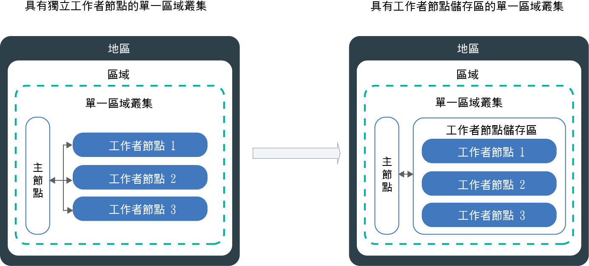

---

copyright:
  years: 2014, 2019
lastupdated: "2019-06-12"

keywords: kubernetes, iks

subcollection: containers

---

{:new_window: target="_blank"}
{:shortdesc: .shortdesc}
{:screen: .screen}
{:pre: .pre}
{:table: .aria-labeledby="caption"}
{:codeblock: .codeblock}
{:tip: .tip}
{:note: .note}
{:important: .important}
{:deprecated: .deprecated}
{:download: .download}
{:preview: .preview}


# 更新叢集、工作者節點和叢集元件
{: #update}

您可以安裝更新，讓 Kubernetes 叢集在 {{site.data.keyword.containerlong}} 中保持最新。
{:shortdesc}

## 更新 Kubernetes 主節點
{: #master}

Kubernetes 會定期發行[主要、次要或修補程式更新](/docs/containers?topic=containers-cs_versions#version_types)。更新會影響 Kubernetes API 伺服器版本或 Kubernetes 主節點的其他元件。IBM 會更新修補程式版本，但您必須更新主節點的主要及次要版本。
{:shortdesc}

**如何知道何時更新主節點？**</br>
在更新可用時，您會於 {{site.data.keyword.Bluemix_notm}} 主控台及 CLI 中收到通知，也可以檢查[支援的版本](/docs/containers?topic=containers-cs_versions)頁面。

**主節點在最新版本後面可以有多少版本？**</br>
IBM 通常同時支援 3 個版本的 Kubernetes。只能將 Kubernetes API 伺服器更新為比其現行版本高最多兩個版本。

例如，如果現行 Kubernetes API 伺服器的版本是 1.11，而您要更新到 1.14，則必須先更新到 1.12。

如果叢集執行不受支援的 Kubernetes 版本，請按照[版本保存指示](/docs/containers?topic=containers-cs_versions#k8s_version_archive)進行操作。若要避免進入不受支援的狀態及操作影響，請使叢集保持最新。

**工作者節點所執行的版本可以比主節點還要新嗎？**</br>
您的工作者節點無法執行比主節點更新的 `major.minor` Kubernetes 版本。首先，[更新主節點](#update_master)為最新 Kubernetes 版本。然後，在叢集裡[更新工作者節點](#worker_node)。

工作者節點可以執行比主節點更新的修補程式版本，例如針對安全更新項目的工作者節點專用修補程式版本。

**如何套用修補程式更新？**</br>
依預設，主節點的修補程式更新會在幾天內自動套用，因此，主節點修補程式版本可能會先顯示為可用，再將它套用至您的主節點。更新自動化也會跳過處於性能不佳狀態或目前正在進行作業的叢集。有時，IBM 可能會停用特定主節點修正套件的自動更新，例如只有在主節點從某個次要版本更新為另一個次要版本時才需要的修補程式。在其中任何情況下，您可以[檢查版本變更日誌](/docs/containers?topic=containers-changelog)，以找出任何潛在的影響，並選擇自行安全地使用 `ibmcloud ks cluster-update` [指令](/docs/containers?topic=containers-cli-plugin-kubernetes-service-cli#cs_cluster_update)，而不需要等待套用更新自動化。

與主節點不同，您必須更新每個修補程式版本的工作者節點。

**在主節點更新期間會發生什麼情況？**</br>
在執行 Kubernetes 1.11 版或更新版本的叢集裡，您的主節點可以高度地與三個抄本主節點 Pod 搭配使用。主節點 Pod 具有漸進式更新，在漸進式更新期間，一次僅有一個 Pod 無法使用。兩個實例會啟動並執行，讓您可在更新期間存取和變更叢集。您的工作者節點、應用程式及資源會繼續執行。

若為執行舊版 Kubernetes 的叢集，當您更新 Kubernetes API 伺服器時，API 伺服器會關閉大約 5-10 分鐘。在更新期間，您無法存取或變更叢集。但是，不會修改叢集使用者已部署的工作者節點、應用程式和資源，它們將繼續執行。

**是否可以回復更新？**</br>
不可以，在更新處理程序進行之後，您無法將叢集回復至舊版。請確保使用測試叢集並按照指示來解決潛在問題，然後再更新正式作業主節點。

**更新主節點時可遵循的處理程序為何？**</br>
下圖顯示您可以採取來更新主節點的處理程序。


圖 1. 更新 Kubernetes 主節點程序圖

{: #update_master}
開始之前，請確保您具有 [{{site.data.keyword.Bluemix_notm}} IAM **操作員**或**管理者**平台角色](/docs/containers?topic=containers-users#platform)。

若要更新 Kubernetes 主節點的_主要_ 或_次要_ 版本，請執行下列動作：

1.  檢閱 [Kubernetes 變更](/docs/containers?topic=containers-cs_versions)，並更新標示為_在主節點之前更新_ 的任何項目。

2.  使用 [{{site.data.keyword.Bluemix_notm}} 主控台](https://cloud.ibm.com/login)或執行 CLI `ibmcloud ks cluster-update` [指令](/docs/containers?topic=containers-cli-plugin-kubernetes-service-cli#cs_cluster_update)，來更新 Kubernetes API 伺服器及關聯的 Kubernetes 主節點元件。

3.  等待幾分鐘，然後確認更新已完成。在 {{site.data.keyword.Bluemix_notm}} 叢集儀表板上檢閱 Kubernetes API 伺服器版本，或執行 `ibmcloud ks clusters`。

4.  安裝符合在 Kubernetes 主節點中執行的 Kubernetes API 伺服器版本的 [`kibectl cli`](/docs/containers?topic=containers-cs_cli_install#kubectl) 版本。[Kubernetes 不支援 ](https://kubernetes.io/docs/setup/version-skew-policy/) 比伺服器版本高/低 2 個或更多版本 (n +/- 2) 的 `kubectl` 用戶端版本。

當 Kubernetes API 伺服器更新完成時，您可以更新工作者節點。

<br />


## 更新工作者節點
{: #worker_node}

您收到更新工作者節點的通知。這代表什麼意思？當 Kubernetes API 伺服器及其他 Kubernetes 主節點元件的安全更新和修補程式備妥之後，您必須確定工作者節點保持同步。
{: shortdesc}

**應用程式在更新期間會發生什麼情況？**</br>
如果您在更新的工作者節點上進行部署時執行應用程式，則會將應用程式重新排定至叢集裡的其他工作者節點。這些工作者節點可能位於不同的工作者節點儲存區中，或者，如果您有獨立式工作者節點，則可能會將應用程式排定至獨立式工作者節點。若要避免應用程式關閉，您必須確定叢集裡有足夠的容量可以執行工作負載。

**如何控制更新期間的一次有多少個工作者節點關閉？**</br>
如果您需要啟動並執行所有工作者節點，請考慮[調整工作者節點儲存區大小](/docs/containers?topic=containers-cli-plugin-kubernetes-service-cli#cs_worker_pool_resize)或[新增獨立式工作者節點](/docs/containers?topic=containers-cli-plugin-kubernetes-service-cli#cs_worker_add)以新增更多工作者節點。更新完成之後，即可移除其他工作者節點。

此外，您可以建立 Kubernetes 配置對映，以指定在更新期間的某個時間可能無法使用的工作者節點數目上限。工作者節點是透過工作者節點標籤所識別。您可以使用已新增至工作者節點的 IBM 提供的標籤或自訂標籤。

**我選擇不要定義配置對映的話，會發生什麼情況？**</br>
未定義配置對映時，會使用預設值。依預設，在每個叢集裡，您所有的工作者節點最多會有 20% 在更新處理程序期間無法使用。

**開始之前**：
- [登入您的帳戶。適用的話，請將適當的資源群組設為目標。設定叢集的環境定義。](/docs/containers?topic=containers-cs_cli_install#cs_cli_configure)
- [更新 Kubernetes 主節點](#master)。工作者節點 Kubernetes 版本不得高於在 Kubernetes 主節點中執行的 Kubernetes API 伺服器版本。
- 進行 [Kubernetes 變更](/docs/containers?topic=containers-cs_versions)中標示為_在主節點之後更新_ 的所有變更。
- 如果您要套用修補程式更新，請檢閱 [Kubernetes 版本變更日誌](/docs/containers?topic=containers-changelog#changelog)。
- 確定您具有[**操作員**或**管理者** {{site.data.keyword.Bluemix_notm}} IAM 平台角色](/docs/containers?topic=containers-users#platform)。</br>

更新工作者節點可能會導致應用程式及服務關閉。您的工作者節點機器會重新安裝映像，而且如果資料不是[儲存在 Pod 之外](/docs/containers?topic=containers-storage_planning#persistent_storage_overview)即會被刪除。
{: important}

{: #worker-up-configmap}
**若要建立配置對映以及更新工作者節點**，請執行下列動作：

1.  列出可用的工作者節點，並記下其專用 IP 位址。

    ```
        ibmcloud ks workers --cluster <cluster_name_or_ID>
        ```
    {: pre}

2. 檢視工作者節點的標籤。您可以在 CLI 輸出的 **Labels** 區段中找到工作者節點標籤。每個標籤都包含 `NodeSelectorKey` 及 `NodeSelectorValue`。
   ```
   kubectl describe node <private_worker_IP>
   ```
   {: pre}

   輸出範例：
   ```
   Name:               10.184.58.3
   Roles:              <none>
   Labels:             arch=amd64
                    beta.kubernetes.io/arch=amd64
                    beta.kubernetes.io/os=linux
                    failure-domain.beta.kubernetes.io/region=us-south
                    failure-domain.beta.kubernetes.io/zone=dal12
                    ibm-cloud.kubernetes.io/encrypted-docker-data=true
                    ibm-cloud.kubernetes.io/iaas-provider=softlayer
                    ibm-cloud.kubernetes.io/machine-type=u3c.2x4.encrypted
                    kubernetes.io/hostname=10.123.45.3
                    privateVLAN=2299001
                    publicVLAN=2299012
   Annotations:        node.alpha.kubernetes.io/ttl=0
                    volumes.kubernetes.io/controller-managed-attach-detach=true
   CreationTimestamp:  Tue, 03 Apr 2018 15:26:17 -0400
   Taints:             <none>
   Unschedulable:      false
   ```
   {: screen}

3. 建立配置對映，並且定義工作者節點的無效性規則。下列範例顯示四項檢查：`zonecheck.json`、`regioncheck.json`、`defaultcheck.json` 及檢查範本。您可以使用這些範例檢查，以定義下列項目的規則：特定區域 (`zonecheck.json`) 或地區 (`regioncheck.json`) 中的工作者節點，或是不符合您已在配置對映 (`defaultcheck.json`) 中定義的任何檢查的所有工作者節點。使用檢查範本以建立自己的檢查。針對每項檢查，若要識別工作者節點，您必須選擇前一個步驟中所擷取的其中一個工作者節點標籤。  

   針對每項檢查，您只能為 <code>NodeSelectorKey</code> 及 <code>NodeSelectorValue</code> 設定一個值。如果您要為多個地區、區域或其他工作者節點標籤設定規則，請建立新的檢查。在配置對映中，最多定義 10 項檢查。如果您新增更多檢查，則會忽略它們。
   {: note}

   範例：
   ```
    apiVersion: v1
    kind: ConfigMap
    metadata:
      name: ibm-cluster-update-configuration
      namespace: kube-system
    data:
     drain_timeout_seconds: "120"
     zonecheck.json: |
       {
         "MaxUnavailablePercentage": 30,
        "NodeSelectorKey": "failure-domain.beta.kubernetes.io/zone",
        "NodeSelectorValue": "dal13"
      }
    regioncheck.json: |
       {
         "MaxUnavailablePercentage": 20,
        "NodeSelectorKey": "failure-domain.beta.kubernetes.io/region",
        "NodeSelectorValue": "us-south"
      }
    defaultcheck.json: |
       {
         "MaxUnavailablePercentage": 20
      }
    <check_name>: |
      {
        "MaxUnavailablePercentage": <value_in_percentage>,
        "NodeSelectorKey": "<node_selector_key>",
        "NodeSelectorValue": "<node_selector_value>"
      }
   ```
   {: codeblock}

   <table summary="表格中的第一列跨這兩個直欄。其餘的列應該從左到右閱讀，第一欄為參數，第二欄則為符合的說明。">
    <caption>ConfigMap 元件</caption>
    <thead>
      <th colspan=2> 瞭解元件</th>
    </thead>
    <tbody>
      <tr>
        <td><code>drain_timeout_seconds</code></td>
        <td> 選用項目：等待 [drain ](https://kubernetes.io/docs/tasks/administer-cluster/safely-drain-node/) 完成的逾時（以秒為單位）。排除工作者節點可安全地移除工作者節點中的所有現有 Pod，以及將 Pod 重新排定至叢集裡的其他工作者節點。接受的值為範圍在 1 到 180 之間的整數。預設值為 30。</td>
      </tr>
      <tr>
        <td><code>zonecheck.json</code></br><code>regioncheck.json</code></td>
        <td>定義一組工作者節點的規則的兩項檢查，而您可以使用指定的 <code>NodeSelectorKey</code> 及 <code>NodeSelectorValue</code> 來識別這組工作者節點。<code>zonecheck.json</code> 可根據工作者節點的區域標籤來識別工作者節點，而 <code>regioncheck.json</code> 會使用在佈建期間新增至每個工作者節點的地區標籤。在此範例中，<code>dal13</code> 作為其區域標籤的所有工作者節點的 30% 以及 <code>us-south</code> 中所有工作者節點的 20% 在更新期間可能無法使用。</td>
      </tr>
      <tr>
        <td><code>defaultcheck.json</code></td>
        <td>如果您未建立配置對映，或對映的配置不正確，則會套用 Kubernetes 預設值。依預設，叢集裡只能有 20% 的工作者節點同時無法使用。您可以新增配置對映的預設檢查，來置換預設值。在此範例中，於更新期間可能無法使用區域及地區檢查（<code>dal13</code> 或 <code>us-south</code>）中未指定的每個工作者節點。</td>
      </tr>
      <tr>
        <td><code>MaxUnavailablePercentage</code></td>
        <td>對於指定的標籤鍵和值，容許無法使用的節點數目上限，以百分比的格式指定。工作者節點在部署、重新載入或佈建程序中會無法使用。如果已排入佇列的工作者節點超出任何已定義的無法使用百分比上限，則會被封鎖而無法更新。</td>
      </tr>
      <tr>
        <td><code>NodeSelectorKey</code></td>
        <td>您要設定規則的工作者節點的標籤索引鍵。可以為 IBM 提供的預設標籤以及您建立的工作者節點標籤設定規則。<ul><li>如果您要新增屬於某個工作者節點儲存區的工作者節點的規則，則可以使用 <code>ibm-cloud.kubernetes.io/machine-type</code> 標籤。</li><li> 如果您有多個工作者節點儲存區具有相同的機型，請使用自訂標籤。</li></ul></td>
      </tr>
      <tr>
        <td><code>NodeSelectorValue</code></td>
        <td>工作者節點必須具有以讓您定義的規則考量的標籤值。</td>
      </tr>
    </tbody>
   </table>

4. 在叢集裡建立配置對映。
   ```
   kubectl apply -f <filepath/configmap.yaml>
   ```
   {: pre}

5.  驗證已建立配置對映。
    ```
    kubectl get configmap --namespace kube-system
    ```
    {: pre}

6.  更新工作者節點。

    ```
    ibmcloud ks worker-update --cluster <cluster_name_or_ID> --workers <worker_node1_ID> <worker_node2_ID>
    ```
    {: pre}

7. 選用項目：驗證配置對映所觸發的事件，以及發生的所有驗證錯誤。在 CLI 輸出的 **Events** 區段中，可以檢閱事件。
   ```
    kubectl describe -n kube-system cm ibm-cluster-update-configuration
    ```
   {: pre}

8. 藉由檢閱工作者節點的 Kubernetes 版本，來確認更新已完成。  
   ```
   kubectl get nodes
   ```
   {: pre}

9. 驗證您沒有重複的工作者節點。在部分情況下，較舊的叢集可能在更新之後將重複的工作者節點列為 **`NotReady`** 狀態。若要移除重複項目，請參閱[疑難排解](/docs/containers?topic=containers-cs_troubleshoot_clusters#cs_duplicate_nodes)。

後續步驟：
-   對其他工作者節點儲存區重複更新處理程序。
-   通知在叢集內工作的開發人員，將 `kubectl` CLI 更新至 Kubernetes 主節點的版本。
-   如果 Kubernetes 儀表板未顯示使用率圖形，則會[刪除 `kudbe-dashboard` Pod](/docs/containers?topic=containers-cs_troubleshoot_health#cs_dashboard_graphs)。


### 在主控台更新工作者節點
{: #worker_up_console}

首次設定配置對映後，接著就可以使用 {{site.data.keyword.Bluemix_notm}} 主控台來更新工作者節點。
{: shortdesc}

開始之前：
*   [設定配置對映](#worker_node)以控制如何更新工作者節點。
*   [更新 Kubernetes 主節點](#master)。工作者節點 Kubernetes 版本不得高於在 Kubernetes 主節點中執行的 Kubernetes API 伺服器版本。
*   進行 [Kubernetes 變更](/docs/containers?topic=containers-cs_versions)中標示為_在主節點之後更新_ 的所有變更。
*   如果您要套用修補程式更新，請檢閱 [Kubernetes 版本變更日誌](/docs/containers?topic=containers-changelog#changelog)。
*   確定您具有[**操作員**或**管理者** {{site.data.keyword.Bluemix_notm}} IAM 平台角色](/docs/containers?topic=containers-users#platform)。</br>

更新工作者節點可能會導致應用程式及服務關閉。您的工作者節點機器會重新安裝映像，而且如果資料不是[儲存在 Pod 之外](/docs/containers?topic=containers-storage_planning#persistent_storage_overview)即會被刪除。
{: important}

若要從主控台更新工作者節點，請執行下列動作：
1.  從 [{{site.data.keyword.Bluemix_notm}} 主控台](https://cloud.ibm.com/)功能表  中，按一下 **Kubernetes**。
2.  從**叢集**頁面中，按一下您的叢集。
3.  從**工作者節點**標籤中，選取您要更新的每一個工作者節點的勾選框。動作列顯示在表格標頭列上方。
4.  從動作列中，按一下**更新 Kubernetes**。

<br />


## 更新機型
{: #machine_type}

您可以藉由新增工作者節點及移除舊的工作者節點，來更新工作者節點的機型。例如，如果您的叢集已淘汰 `x1c` 或更舊版本的 Ubuntu 16 `x2c` 工作者節點特性，請建立 Ubuntu 18 工作者節點，而這些工作者節點使用名稱有 `x3c` 的機型。
{: shortdesc}

開始之前：
- [登入您的帳戶。適用的話，請將適當的資源群組設為目標。設定叢集的環境定義。](/docs/containers?topic=containers-cs_cli_install#cs_cli_configure)
- 如果您在工作者節點上儲存資料，則如果資料不是[儲存在工作者節點之外](/docs/containers?topic=containers-storage_planning#persistent_storage_overview)即會被刪除。
- 確保您具有 [{{site.data.keyword.Bluemix_notm}} IAM **操作員**或**管理者**平台角色](/docs/containers?topic=containers-users#platform)。

若要更新機型，請執行下列動作：

1. 列出可用的工作者節點，並記下其專用 IP 位址。
   - **針對工作者節點儲存區中的工作者節點**：
     1. 列出叢集裡可用的工作者節點儲存區。
        ```
        ibmcloud ks worker-pools --cluster <cluster_name_or_ID>
        ```
        {: pre}

     2. 列出工作者節點儲存區中的工作者節點。
        ```
        ibmcloud ks workers --cluster <cluster_name_or_ID> --worker-pool <pool_name>
        ```
        {: pre}

     3. 取得工作者節點的詳細資料，並記下區域、專用及公用 VLAN ID。
        ```
        ibmcloud ks worker-get --cluster <cluster_name_or_ID> --worker <worker_ID>
        ```
        {: pre}

   - **已淘汰：針對獨立式工作者節點**：
     1. 列出可用的工作者節點。
        ```
        ibmcloud ks workers --cluster <cluster_name_or_ID>
        ```
        {: pre}

     2. 取得工作者節點的詳細資料，並記下區域、專用及公用 VLAN ID。
        ```
        ibmcloud ks worker-get --cluster <cluster_name_or_ID> --worker <worker_ID>
        ```
        {: pre}

2. 列出區域中的可用機型。
   ```
   ibmcloud ks machine-types <zone>
   ```
   {: pre}

3. 使用新機型建立工作者節點。
   - **針對工作者節點儲存區中的工作者節點**：
     1. 使用您要取代的工作者節點數目，建立工作者節點儲存區。
        ```
        ibmcloud ks worker-pool-create --name <pool_name> --cluster <cluster_name_or_ID> --machine-type <machine_type> --size-per-zone <number_of_workers_per_zone>
        ```
        {: pre}

     2. 驗證已建立工作者節點儲存區。
        ```
        ibmcloud ks worker-pools --cluster <cluster_name_or_ID>
        ```
        {: pre}

     3. 將區域新增至您先前擷取的工作者節點儲存區。當您新增區域時，會在區域中佈建工作者節點儲存區中所定義的工作者節點，並考慮用於排定未來的工作負載。如果您要將工作者節點分散到多個區域，請選擇[具有多區域功能的區域](/docs/containers?topic=containers-regions-and-zones#zones)。
        ```
        ibmcloud ks zone-add --zone <zone> --cluster <cluster_name_or_ID> --worker-pools <pool_name> --private-vlan <private_VLAN_ID> --public-vlan <public_VLAN_ID>
        ```
        {: pre}

   - **已淘汰：針對獨立式工作者節點**：
       ```
       ibmcloud ks worker-add --cluster <cluster_name> --machine-type <machine_type> --workers <number_of_worker_nodes> --private-vlan <private_VLAN_ID> --public-vlan <public_VLAN_ID>
       ```
       {: pre}

4. 等待部署工作者節點。
   ```
   ibmcloud ks workers --cluster <cluster_name_or_ID>
   ```
   {: pre}

   工作者節點狀況變更為**正常**時，部署已完成。

5. 移除舊的工作者節點。**附註**：如果您要移除按月計費的機型（例如裸機），則會向您收取整個月的費用。
   - **針對工作者節點儲存區中的工作者節點**：
     1. 移除具有舊機型的工作者節點儲存區。移除工作者節點儲存區，會移除所有區域的儲存區中的所有工作者節點。此處理程序可能需要幾分鐘的時間才能完成。
        ```
        ibmcloud ks worker-pool-rm --worker-pool <pool_name> --cluster <cluster_name_or_ID>
        ```
        {: pre}

     2. 驗證已移除工作者節點儲存區。
        ```
        ibmcloud ks worker-pools --cluster <cluster_name_or_ID>
        ```
        {: pre}

   - **已淘汰：針對獨立式工作者節點**：
       ```
      ibmcloud ks worker-rm --cluster <cluster_name> --worker <worker_node>
      ```
      {: pre}

6. 驗證已從叢集移除工作者節點。
   ```
   ibmcloud ks workers --cluster <cluster_name_or_ID>
   ```
   {: pre}

7. 重複這些步驟，將其他工作者節點儲存區或獨立式工作者節點更新為不同機型。

## 更新叢集元件
{: #components}

{{site.data.keyword.containerlong_notm}} 叢集隨附在佈建叢集時自動安裝的元件，例如用於記載的 Fluentd。依預設，IBM 會自動更新這些元件。但是，您可以停用某些元件的自動更新，而個別從主節點和工作者節點節點手動更新這些元件。
{: shortdesc}

**可以獨立於叢集更新哪些預設元件？**</br>
您可以選擇停用下列元件的自動更新：
* [Fluentd 以進行記載](#logging-up)
* [Ingress 應用程式負載平衡器 (ALB)](#alb)

**有無法獨立於叢集更新的元件嗎？**</br>

是。叢集部署的下列受管理元件和相關聯的資源不能變更，但為了獲得特定效能優點而調整 Pod 或編輯配置對映時除外。如果嘗試變更下列其中一個部署元件，其原始設定會定期還原。

* `coredns`
* `coredns-autoscaler`
* `heapster`
* `ibm-file-plugin`
* `ibm-storage-watcher`
* `ibm-keepalived-watcher`
* `kube-dns-amd64`
* `kube-dns-autoscaler`
* `kubernetes-dashboard`
* `metrics-server`
* `vpn`

您可以使用 `addonmanager.kubernetes.io/mode: Reconcile` 標籤來檢視這些資源。例如：

```
kubectl get deployments --all-namespaces -l addonmanager.kubernetes.io/mode=Reconcile
```
{: pre}

**可以安裝其他不屬於預設元件的外掛程式或附加程式嗎？**</br>
是。{{site.data.keyword.containerlong_notm}} 提供了其他外掛程式和附加程式，您可以從中進行選擇以向叢集新增相應功能。例如，您可能想要[使用 Helm 圖表](/docs/containers?topic=containers-helm#public_helm_install)來安裝[區塊儲存空間外掛程式](/docs/containers?topic=containers-block_storage#install_block)或 [strongSwan VPN](/docs/containers?topic=containers-vpn#vpn-setup)。或者，您可能想要在叢集裡啟用 IBM 管理的附加程式，例如 [Istio](/docs/containers?topic=containers-istio) 或 [Knative](/docs/containers?topic=containers-serverless-apps-knative)。必須按照 Helm 圖表 Readme 中的指示或執行[更新受管理附加程式](/docs/containers?topic=containers-managed-addons#updating-managed-add-ons)的步驟來個別更新這些 Helm 圖表和附加程式。

### 管理 Fluentd 的自動更新
{: #logging-up}

為了對記載或過濾器配置進行變更，Fluentd 元件必須為最新版本。依預設，會啟用元件的自動更新。
{: shortdesc}

您可以透過下列方式來管理 Fluentd 元件的自動更新。**附註**：若要執行下列指令，您必須具有叢集的[**管理者** {{site.data.keyword.Bluemix_notm}} IAM 平台角色](/docs/containers?topic=containers-users#platform)。

* 執行 `ibmcloud ks logging-autoupdate-get --cluster <cluster_name_or_ID>` [指令](/docs/containers?topic=containers-cli-plugin-kubernetes-service-cli#cs_log_autoupdate_get)，檢查是否已啟用自動更新。
* 執行 `ibmcloud ks logging-autoupdate-disable` [指令](/docs/containers?topic=containers-cli-plugin-kubernetes-service-cli#cs_log_autoupdate_disable)，來停用自動更新。
* 如果停用了自動更新，但您需要對配置進行變更，則有兩個選項：
    * 開啟 Fluentd Pod 的自動更新。
        ```
        ibmcloud ks logging-autoupdate-enable --cluster <cluster_name_or_ID>
        ```
        {: pre}
    * 在您使用包括 `--force-update` 選項的 logging 指令時，強制執行一次性更新。**附註**：pod 會更新到最新版本的 Fluentd 元件，但 Fluentd 此後不會自動更新。
        指令範例：

        ```
        ibmcloud ks logging-config-update --cluster <cluster_name_or_ID> --id <log_config_ID> --type <log_type> --force-update
        ```
        {: pre}

### 管理 Ingress ALB 的自動更新
{: #alb}

控制何時更新 Ingress 應用程式負載平衡器 (ALB) 元件。
{: shortdesc}

更新 Ingress ALB 元件時，所有 ALB Pod 中的 `nginx-ingress` 和 `ingress-auth` 容器都會更新至最新的建置版本。依預設，會啟用 ALB 的自動更新。以漸進方式執行更新，讓您的 Ingress ALB 不會經歷任何關閉時間。

如果停用了自動更新，則您應負責更新 ALB。當更新項目變成可用時，如果您執行 `ibmcloud k albs` 或 `alb-autoupdate-get` 指令，則會在 CLI 中收到通知。

更新叢集的 Kubernetes 主版本或次版本時，IBM 會自動對 Ingress 部署進行必要的變更，但不會變更 Ingress ALB 的建置版本。您應負責檢查最新的 Kubernetes 版本和 Ingress ALB 映像檔的相容性。
{: note}

開始之前：

1. 驗證您的 ALB 在執行中。
    ```
    ibmcloud ks albs
    ```
    {: pre}

2. 檢查 Ingress ALB 組件自動更新的狀態。
    ```
    ibmcloud ks alb-autoupdate-get --cluster <cluster_name_or_ID>
    ```
    {: pre}

    自動更新已啟用時的輸出範例：
    ```
    Retrieving automatic update status of application load balancer (ALB) pods in cluster mycluster...
    OK
    Automatic updates of the ALB pods are enabled in cluster mycluster
    ALBs are at the latest version in cluster mycluster
    ```
    {: screen}

    自動更新已停用時的輸出範例：
    ```
    Retrieving automatic update status of application load balancer (ALB) pods in cluster mycluster...
    OK
    Automatic updates of the ALB pods are disabled in cluster mycluster
    ALBs are not at the latest version in cluster mycluster. To view the current version, run 'ibmcloud ks albs'.
    ```
    {: screen}

3. 驗證 ALB Pod 的現行**建置**版本。
    ```
    ibmcloud ks albs --cluster <cluster_name_or_ID>
    ```
    {: pre}

    輸出範例：
    ```
    ALB ID                                            Enabled   Status     Type      ALB IP          Zone    Build                           ALB VLAN ID
    private-crdf253b6025d64944ab99ed63bb4567b6-alb2   false     disabled   private   10.xxx.xx.xxx   dal10   ingress:411/ingress-auth:315*   2234947
    public-crdf253b6025d64944ab99ed63bb4567b6-alb2    true      enabled    public    169.xx.xxx.xxx  dal10   ingress:411/ingress-auth:315*   2234945

    * 有 ALB Pod 的更新可供使用。在更新之前，請檢閱最新版本任何可能的非連續變更：https://cloud.ibm.com/docs/containers?topic=containers-update#alb
    ```
    {: screen}

您可以透過下列方式來管理 Ingress ALB 元件的自動更新。**附註**：若要執行下列指令，您必須具有叢集的[**編輯者**或**管理者** {{site.data.keyword.Bluemix_notm}} IAM 平台角色](/docs/containers?topic=containers-users#platform)。
* 停用自動更新。
    ```
    ibmcloud ks alb-autoupdate-disable --cluster <cluster_name_or_ID>
    ```
    {: pre}
* 手動更新 Ingress ALB。
    1. 如果更新可用並且您想要更新 ALB，請先查看[最新版本 Ingress ALB 元件的變更日誌](/docs/containers?topic=containers-cluster-add-ons-changelog#alb_changelog)，以驗證是否有任何潛在非連續變更。
    2. 強制一次性更新 ALB Pod。叢集裡的所有 ALB Pod 都會更新至最新的建置版本。您無法更新個別 ALB，也無法選擇要將 ALB 更新到哪個建置。自動更新會保留停用狀態。
        ```
        ibmcloud ks alb-update --cluster <cluster_name_or_ID>
        ```
        {: pre}
* 如果您的 ALB Pod 最近已更新，但 ALB 自訂配置受到最新建置的影響，您可以將更新回復至您的 ALB Pod 先前執行的建置。**附註**：在回復更新之後，會停用 ALB Pod 的自動更新。
    ```
    ibmcloud ks alb-rollback --cluster <cluster_name_or_ID>
    ```
    {: pre}
* 重新啟用自動更新。每當下一個建置變成可用時，ALB Pod 就會自動更新至最新的建置。
        ```
        ibmcloud ks alb-autoupdate-enable --cluster <cluster_name_or_ID>
        ```
    {: pre}

<br />


## 更新受管理附加程式
{: #addons}

透過受管理 {{site.data.keyword.containerlong_notm}} 附加程式，可以輕鬆使用開放程式碼功能（如 Istio 或 Knative）來增強叢集功能。您新增至叢集的開放程式碼工具版本經由 IBM 測試並核准用於 {{site.data.keyword.containerlong_notm}} 中。若要將叢集裡已啟用的受管理附加程式更新到最新版本，請參閱[更新受管理附加程式](/docs/containers?topic=containers-managed-addons#updating-managed-add-ons)。

## 從獨立式工作者節點更新至工作者節點儲存區
{: #standalone_to_workerpool}

引進多區域叢集時，在工作者節點儲存區中，具有相同配置（例如機型）的工作者節點會群組在一起。當您建立新的叢集時，會自動建立名為 `default` 的工作者節點儲存區。
{: shortdesc}

您可以使用工作者節點儲存區將工作者節點平均分散到各區域，以及建置平衡叢集。平衡叢集具備高可用性以及更大的失敗復原力。如果從區域移除工作者節點，則您可以重新平衡工作者節點儲存區，以及自動將新的工作者節點佈建至該區域。工作者節點儲存區也用來安裝所有工作者節點的 Kubernetes 版本更新。  

如果您已在多區域叢集變成可用之前建立叢集，則工作者節點仍然是獨立式的，並且不會自動群組到工作者節點儲存區。您必須更新這些叢集，才能使用工作者節點儲存區。如果未更新，則無法將單一區域叢集變更為多區域叢集。
{: important}

請檢閱下圖，以查看從獨立式工作者節點移至工作者節點儲存區時，叢集設定如何變更。



開始之前：
- 確保您具有對叢集的 [{{site.data.keyword.Bluemix_notm}} IAM **操作員**或**管理者**平台角色](/docs/containers?topic=containers-users#platform)。
- [登入您的帳戶。適用的話，請將適當的資源群組設為目標。設定叢集的環境定義。](/docs/containers?topic=containers-cs_cli_install#cs_cli_configure)

若要將獨立式工作者節點更新至工作者節點儲存區，請執行下列動作：

1. 列出叢集裡的現有獨立式工作者節點，並記下 **ID**、**機型**及**專用 IP**。
   ```
   ibmcloud ks workers --cluster <cluster_name_or_ID>
   ```
   {: pre}

2. 建立工作者節點儲存區，並決定您要新增至儲存區的機型及工作者節點數目。
   ```
   ibmcloud ks worker-pool-create --name <pool_name> --cluster <cluster_name_or_ID> --machine-type <machine_type> --size-per-zone <number_of_workers_per_zone>
   ```
   {: pre}

3. 列出可用的區域，並決定要在哪裏佈建工作者節點儲存區中的工作者節點。若要檢視在其中佈建獨立式工作者節點的區域，請執行 `ibmcloud ks cluster-get --cluster <cluster_name_or_ID>`。如果您要將工作者節點分散到多個區域，請選擇[具有多區域功能的區域](/docs/containers?topic=containers-regions-and-zones#zones)。
   ```
   ibmcloud ks zones
   ```
   {: pre}

4. 列出您在前一個步驟中選擇的區域的可用 VLAN。如果您在該區域中還沒有 VLAN，則會在將區域新增至工作者節點儲存區時自動為您建立 VLAN。
   ```
   ibmcloud ks vlans --zone <zone>
   ```
   {: pre}

5. 將區域新增至工作者節點儲存區。當您將區域新增至工作者節點儲存區時，會在區域中佈建工作者節點儲存區中所定義的工作者節點，並考慮用於排定未來的工作負載。{{site.data.keyword.containerlong}} 會自動將地區的 `failure-domain.beta.kubernetes.io/region` 標籤以及區域的 `failure-domain.beta.kubernetes.io/zone` 標籤新增至每一個工作者節點。Kubernetes 排程器使用這些標籤，以將 Pod 分散到相同地區內的區域。
   1. **將區域新增至某個工作者節點儲存區**：將 `<pool_name>` 取代為工作者節點儲存區名稱，並使用您先前擷取到的資訊填入叢集 ID、區域及 VLAN。如果您在該區域中沒有專用及公用 VLAN，請不要指定此選項。會自動為您建立專用及公用 VLAN。

      如果您要對不同的工作者節點儲存區使用不同的 VLAN，則請針對每一個 VLAN 及其對應工作者節點儲存區重複這個指令。任何新的工作者節點都會新增至您指定的 VLAN，但不會變更任何現有工作者節點的 VLAN。
      ```
      ibmcloud ks zone-add --zone <zone> --cluster <cluster_name_or_ID> --worker-pools <pool_name> --private-vlan <private_VLAN_ID> --public-vlan <public_VLAN_ID>
      ```
      {: pre}

   2. **將區域新增至多個工作者節點儲存區**：將多個工作者節點儲存區新增至 `ibmcloud ks zone-add` 指令。若要將多個工作者節點儲存區新增至區域，您在該區域中必須要有現有專用及公用 VLAN。如果您在該區域中沒有公用及專用 VLAN，請考慮先將該區域新增至一個工作者節點儲存區，以為您建立公用及專用 VLAN。然後，您可以將該區域新增至其他工作者節點儲存區。</br></br>請務必將所有工作者節點儲存區中的工作者節點佈建至所有區域，以確保您的叢集在各區域之間保持平衡。如果您要對不同的工作者節點儲存區使用不同的 VLAN，則請針對要用於工作者節點儲存區的 VLAN 重複這個指令。如果您的叢集具有多個 VLAN、同一個 VLAN 上有多個子網路，或者是您具有多區域叢集，則必須為您的 IBM Cloud 基礎架構 (SoftLayer) 帳戶啟用[虛擬路由器功能 (VRF)](/docs/infrastructure/direct-link?topic=direct-link-overview-of-virtual-routing-and-forwarding-vrf-on-ibm-cloud#overview-of-virtual-routing-and-forwarding-vrf-on-ibm-cloud)，讓工作者節點可以在專用網路上彼此通訊。若要啟用 VRF，[請與 IBM Cloud 基礎架構 (SoftLayer) 客戶代表聯絡](/docs/infrastructure/direct-link?topic=direct-link-overview-of-virtual-routing-and-forwarding-vrf-on-ibm-cloud#how-you-can-initiate-the-conversion)。如果您無法或不想要啟用 VRF，請啟用 [VLAN Spanning](/docs/infrastructure/vlans?topic=vlans-vlan-spanning#vlan-spanning)。若要執行此動作，您需要**網路 > 管理網路 VLAN Spanning** [基礎架構許可權](/docs/containers?topic=containers-users#infra_access)，或者您可以要求帳戶擁有者啟用它。若要確認是否已啟用 VLAN Spanning，請使用 `ibmcloud ks vlan-spanning-get --region <region>` [指令](/docs/containers?topic=containers-cli-plugin-kubernetes-service-cli#cs_vlan_spanning_get)。
      ```
      ibmcloud ks zone-add --zone <zone> --cluster <cluster_name_or_ID> --worker-pools <pool_name1,pool_name2,pool_name3> --private-vlan <private_VLAN_ID> --public-vlan <public_VLAN_ID>
      ```
      {: pre}

   3. **將多個區域新增至工作者節點儲存區**：向不同的區域重複 `ibmcloud ks zone-add` 指令，並指定您若要在該區域中佈建的工作者節點儲存區。將其他區域新增至叢集，即可將叢集從單一區域叢集變更為[多區域叢集](/docs/containers?topic=containers-ha_clusters#multizone)。

6. 等待在每個區域中部署工作者節點。
   ```
   ibmcloud ks workers --cluster <cluster_name_or_ID>
   ```
   {: pre}
   工作者節點狀況變更為**正常**時，部署已完成。

7. 移除獨立式工作者節點。如果您有多個獨立式工作者節點，請一次移除一個。
   1. 列出叢集裡的工作者節點，並比較這個指令中的專用 IP 位址與開始尋找獨立式工作者節點時所擷取的專用 IP 位址。
      ```
      kubectl get nodes
      ```
      {: pre}
   2. 在一個稱為隔離的處理程序中，將工作者節點標示為無法排程。當您隔離工作者節點時，會使它無法用於未來 Pod 排程。使用 `kubectl get nodes` 指令中傳回的 `name`。
      ```
      kubectl cordon <worker_name>
      ```
      {: pre}
   3. 驗證已停用工作者節點的 Pod 排程。
      ```
      kubectl get nodes
      ```
      {: pre}
如果狀態顯示 **`SchedulingDisabled`**，表示工作者節點已停用 Pod 排程。
   4. 強制從獨立式工作者節點移除 Pod，並將其重新排定至其餘 uncordon 處理過的獨立式工作者節點以及工作者節點儲存區中的工作者節點。
      ```
      kubectl drain <worker_name> --ignore-daemonsets
      ```
      {: pre}
      此處理程序可能需要幾分鐘的時間。

   5. 移除獨立式工作者節點。使用透過 `ibmcloud ks workers --cluster <cluster_name_or_ID>` 指令擷取到的工作者節點的 ID。
      ```
      ibmcloud ks worker-rm --cluster <cluster_name_or_ID> --worker <worker_ID>
      ```
      {: pre}
   6. 重複這些步驟，直到移除所有獨立式工作者節點。


**下一步為何？** </br>
既然您已將叢集更新成使用工作者節點儲存區，則可以藉由將其他區域新增至叢集來改善可用性。將其他區域新增至叢集，即可將叢集從單一區域叢集變更為[多區域叢集](/docs/containers?topic=containers-ha_clusters#ha_clusters)。當您將單一區域叢集變更為多區域叢集時，Ingress 網域會從 `<cluster_name>.<region>.containers.mybluemix.net` 變更為 `<cluster_name>.<region_or_zone>.containers.appdomain.cloud`。現有 Ingress 網域仍然有效，而且可以用來將要求傳送至應用程式。

<br />

