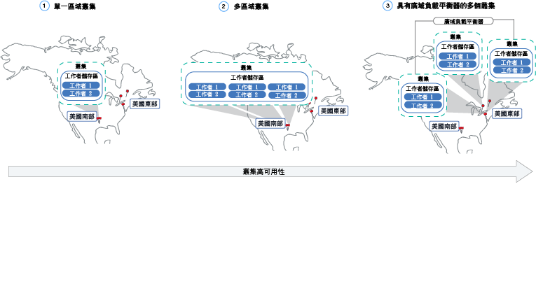
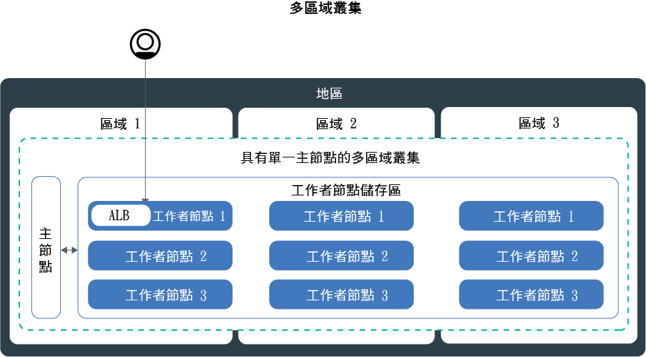

---

copyright:
  years: 2014, 2018
lastupdated: "2018-09-12"

---

{:new_window: target="_blank"}
{:shortdesc: .shortdesc}
{:screen: .screen}
{:pre: .pre}
{:table: .aria-labeledby="caption"}
{:codeblock: .codeblock}
{:tip: .tip}
{:download: .download}


# 規劃叢集及工作者節點設定
{: #plan_clusters}
使用 {{site.data.keyword.containerlong}} 設計標準叢集的應用程式最大可用性及容量。

## 高可用性叢集
{: #ha_clusters}

若將應用程式分佈到多個工作者節點、區域及叢集，使用者遇到應用程式關閉的可能性就越低。內建功能（例如負載平衡及隔離）可提高對於潛在主機、網路或應用程式失敗的備援。
{: shortdesc}

檢閱這些潛在的叢集設定，它們依遞增的可用性程度進行排序。



1. [單一區域叢集](#single_zone)，其在工作者節點儲存區中有多個工作者節點。
2. [多區域叢集](#multizone)，可將工作者節點分散到某個地區內的各區域。
3. [多個叢集](#multiple_clusters)，其已設定為跨各區域或地區，且已透過廣域負載平衡器進行連接。

## 單一區域叢集
{: #single_zone}

若要改善應用程式的可用性，以及容許無法在叢集裡使用某個工作者節點時失效接手，請將其他工作者節點新增至單一區域叢集。
{: shortdesc}


依預設，單一區域叢集已設定名為 `default` 的工作者節點儲存區。工作者節點儲存區會將具有您在建立叢集期間所定義之相同配置（例如機型）的工作者節點分組在一起。您可以藉由[調整現有工作者節點儲存區大小](cs_clusters.html#resize_pool)或[新增工作者節點儲存區](cs_clusters.html#add_pool)，來將更多工作者節點新增至叢集裡。

當您新增更多工作者節點時，應用程式實例可以分佈到多個工作者節點。如果某個工作者節點關閉，則可用工作者節點上的應用程式實例會繼續執行。Kubernetes 會自動從無法使用的工作者節點重新排定 Pod，以確保應用程式的效能及容量。若要確定 Pod 平均分佈到工作者節點，請實作 [Pod 親緣性](https://kubernetes.io/docs/concepts/configuration/assign-pod-node/#inter-pod-affinity-and-anti-affinity-beta-feature)。

**可以將單一區域叢集轉換成多區域叢集嗎？**</br>
如果叢集是在其中一個[受支援的多區域都會城市](cs_regions.html#zones)，請輸入 yes。請參閱[從獨立式工作者節點更新至工作者儲存區](cs_cluster_update.html#standalone_to_workerpool)。


**必須使用多區域叢集嗎？**</br>
不必。您可以建立所需數目的單一區域叢集。實際上，您可能偏好使用單一區域叢集來簡化管理，或者，如果您的叢集必須位於特定[單一區域城市](cs_regions.html#zones)中。

## 多區域叢集
{: #multizone}

使用 {{site.data.keyword.containerlong}}，您可以建立多區域叢集。若使用工作者節點儲存區將應用程式分佈到多個工作者節點及區域，使用者遇到應用程式關閉的可能性就會越低。內建功能（例如負載平衡）可提高對於主機、網路或應用程式潛在區域故障的備援。如果某個區域中的資源降低，則叢集工作負載仍然可以在其他區域中運作。
**附註**：{{site.data.keyword.Bluemix_dedicated_notm}} 實例只能使用單一區域叢集。
{: shortdesc}

**何謂工作者節點儲存區？**</br>
工作者節點儲存區是具有相同特性（例如機型、CPU 及記憶體）的工作者節點的集合。建立叢集時，會自動為您建立預設工作者節點儲存區。若要跨區域展開儲存區中的工作者節點，請將工作程式節點新增至儲存區，或更新工作者節點，您可以使用新的 `ibmcloud ks worker-pool` 指令。

**我仍然可以使用獨立式工作者節點嗎？**</br>
支援獨立式工作者節點的前一個叢集設定，但已遭淘汰。請務必[將工作者節點儲存區新增至叢集](cs_clusters.html#add_pool)，然後[移轉成使用工作者節點儲存區](cs_cluster_update.html#standalone_to_workerpool)來組織工作者節點，而非獨立式工作者節點。

**可以將單一區域叢集轉換成多區域叢集嗎？**</br>
如果叢集是在其中一個[受支援的多區域都會城市](cs_regions.html#zones)，請輸入 yes。請參閱[從獨立式工作者節點更新至工作者儲存區](cs_cluster_update.html#standalone_to_workerpool)。


### 告訴我多區域叢集設定的相關資訊
{: #mz_setup}



您可以將其他區域新增至叢集，以將工作者節點儲存區中的工作者節點抄寫到某個地區內的多個區域。多區域叢集的設計為將 Pod 平均排定到各工作者節點及區域，以確保可用性及失敗回復。如果工作者節點未平均分散到各區域，或其中一個區域中的容量不足，則 Kubernetes 排程器可能無法排定所有要求的 Pod。因此，Pod 可能會進入**擱置**狀態，直到有足夠的可用容量為止。如果您要變更預設行為，讓 Kubernetes 排程器以最佳效能分佈將 Pod 分佈到各區域，請使用 `preferredDuringSchedulingIgnoredDuringExecution` [Pod 親緣性原則](https://kubernetes.io/docs/concepts/configuration/assign-pod-node/#inter-pod-affinity-and-anti-affinity-beta-feature)。

**為什麼 3 個區域中需要有工作者節點？** </br>
將工作負載分佈到 3 個區域，可確保一個或兩個區域無法使用時的應用程式高可用性，但也讓您的叢集設定更具成本效益。但為什麼是這樣？請參考以下範例。

假設您需要具有 6 個核心的工作者節點來處理應用程式的工作負載。為了讓您的叢集更為可用，您具有下列選項：

- **在另一個區域中複製資源：**此選項可讓您具有 2 個工作者節點，而每一個區域中的每一個工作者節點都有 6 個核心，因此共有 12 個核心。</br>
- **將資源分佈到 3 個區域：**使用此選項，每個區域都會部署 3 個核心，因此總容量為 9 個核心。若要處理工作負載，必須同時啟動兩個區域。如果有一個區域無法使用，則其他兩個區域都可以處理工作負載。如果有兩個區域無法使用，則會啟動剩下的 3 個核心來處理工作負載。每個區域都部署 3 個核心，表示機器數目較少，因而可降低成本。</br>

**我的 Kubernetes 主節點的設定如何？** </br>
多區域叢集已設定在相同都會區域中佈建為工作者節點的單一 Kubernetes 主節點。例如，如果工作者節點位於 `dal10`、`dal12` 或 `dal13` 中的其中一個或多個區域，則主節點位於達拉斯多區域都會城市中。

**如果 Kubernetes 主節點變成無法使用，會發生什麼情況？**</br>
[Kubernetes 主節點](cs_tech.html#architecture)是保持叢集運作的主要元件。主節點將叢集資源及其配置儲存在 etcd 資料庫中，作為叢集的單點真實資料 (SPOT)。Kubernetes API 伺服器是從工作者節點到主節點的所有叢集管理要求的主要進入點，或是您想要與叢集資源互動的主要進入點。<br><br>如果發生主節點失敗，則工作負載會繼續在工作者節點上執行，但您無法使用 `kubectl` 指令來使用叢集資源，或檢視叢集性能，直到主節點中的 Kubernetes API 伺服器完成備份為止。如果 Pod 在主節點中斷期間關閉，則除非工作者節點再次呼叫到 Kubernetes API 伺服器，否則 Pod 無法重新排程。<br><br>在主節點中斷期間，您仍然可以針對 {{site.data.keyword.containerlong_notm}} API 執行 `ibmcloud ks` 指令，以使用您的基礎架構資源，例如工作者節點或 VLAN。如果您透過在叢集中新增或移除工作者節點來變更現行叢集配置，您所做的變更要等到備份主節點之後才會發生。**附註**：在主節點中斷期間，請勿重新啟動或將工作者節點重新開機。此動作會從您的工作者節點中移除 Pod。因為 Kubernetes API 伺服器無法使用，所以無法將 Pod 重新排程至叢集中的其他工作者節點。


若要保護叢集不發生 Kubernetes 主節點失敗，或在多區域叢集無法使用的地區中保護叢集，您可以[設定多個叢集，並使用廣域負載平衡器進行連接](#multiple_clusters)。

**我是否必須執行什麼動作才能讓主節點跨區域與工作者節點通訊？**</br>
是。如果您的叢集有多個 VLAN、同一個 VLAN 上有多個子網路，或有多區域叢集，則必須為您的 IBM Cloud 基礎架構 (SoftLayer) 帳戶啟用 [VLAN Spanning](/docs/infrastructure/vlans/vlan-spanning.html#vlan-spanning)，讓工作者節點可以在專用網路上彼此通訊。若要執行此動作，您需要**網路 > 管理網路 VLAN Spanning** [基礎架構許可權](cs_users.html#infra_access)，或者您可以要求帳戶擁有者啟用它。若要確認是否已啟用 VLAN Spanning，請使用 `ibmcloud ks vlan-spanning-get` [指令](/docs/containers/cs_cli_reference.html#cs_vlan_spanning_get)。如果您使用 {{site.data.keyword.BluDirectLink}}，則必須改為使用[虛擬路由器功能 (VRF)](/docs/infrastructure/direct-link/subnet-configuration.html#more-about-using-vrf)。若要啟用 VRF，請聯絡 IBM Cloud 基礎架構 (SoftLayer) 業務代表。

**如何讓使用者從公用網際網路存取我的應用程式？**</br>
您可以使用 Ingress 應用程式負載平衡器 (ALB) 或負載平衡器服務來公開應用程式。

依預設，會在叢集的每一個區域中自動建立及啟用公用 ALB。也會自動建立及部署叢集的 Cloudflare 多區域負載平衡器 (MZLB)，使每個地區有 1 個 MZLB。MZLB 會在相同主機名稱後面放置 ALB 的 IP 位址，並對這些 IP 位址啟用性能檢查，以判斷是否可以使用它們。例如，如果您在美國東部地區的 3 個區域有工作者節點，則主機名稱 `yourcluster.us-east.containers.appdomain.cloud` 具有 3 個 ALB IP 位址。MZLB 性能檢查會檢查地區中每一個區域的公用 ALB IP，並根據這些性能檢查來更新 DNS 查閱結果。如需相關資訊，請參閱 [Ingress 元件和架構](cs_ingress.html#planning)。

負載平衡器服務只會設定在某個區域中。您應用程式的送入要求會從該區域遞送至其他區域中的所有應用程式實例。如果此區域變成無法使用，則可能無法從網際網路存取您的應用程式。您可以在其他區域中設定其他負載平衡器服務來負責單一區域故障。如需相關資訊，請參閱高可用性[負載平衡器服務](cs_loadbalancer.html#multi_zone_config)。

**我可以為多區域叢集設定持續性儲存空間嗎？**</br>
對於高可用性持續性儲存空間，請使用雲端服務（例如 [{{site.data.keyword.cloudant_short_notm}}](/docs/services/Cloudant/getting-started.html#getting-started-with-cloudant) 或 [{{site.data.keyword.cos_full_notm}}](/docs/services/cloud-object-storage/about-cos.html#about-ibm-cloud-object-storage)）。

無法跨區域共用 NFS 檔案及區塊儲存空間。持續性磁區只能在實際儲存裝置所在的區域中使用。如果您要繼續使用叢集中的現有 NFS 檔案或區塊儲存空間，則必須將地區及區域標籤套用至現有的持續性磁區。這些標籤可協助 kube-scheduler 判斷在何處排定使用持續性磁區的應用程式。執行下列指令，並將 `<mycluster>` 取代為您的叢集名稱。

```
bash <(curl -Ls https://raw.githubusercontent.com/IBM-Cloud/kube-samples/master/file-pv-labels/apply_pv_labels.sh) <mycluster>
```
{: pre}

**我已建立多區域叢集。為什麼還是只有一個區域？如何將區域新增至我的叢集？**</br>
如果您[使用 CLI 建立多區域叢集](cs_clusters.html#clusters_cli)，會建立叢集，但必須將區域新增至工作者節點儲存區，才能完成該處理程序。若要跨越多個區域，您的叢集必須位在[多區域都會城市](cs_regions.html#zones)中。若要將區域新增至叢集，並將工作者節點分散到各區域，請參閱[將區域新增至叢集](cs_clusters.html#add_zone)。

### 我目前管理叢集的方式有哪些改變？
{: #mz_new_ways}

透過引進工作者節點儲存區，您可以使用一組新的 API 及指令來管理叢集。您可以在 [CLI 文件頁面](cs_cli_reference.html#cs_cli_reference)中看到這些新指令，也可以透過執行 `ibmcloud ks help` 在終端中檢視這些新指令。

下表比較若干一般叢集管理動作的新舊方法。
<table summary="此表格顯示執行多區域指令之新方法的說明。列應該從左到右閱讀，第一欄為說明、第二欄為舊的方法，而第三欄為新的多區域方法。">
<caption>多區域工作者節點儲存區指令的新方法。</caption>
  <thead>
  <th>說明</th>
  <th>舊的獨立式工作者節點</th>
  <th>新的多區域工作者節點儲存區</th>
  </thead>
  <tbody>
    <tr>
    <td>將工作者節點新增至叢集。</td>
    <td><strong>已淘汰</strong>：<code>ibmcloud ks worker-add</code>，用來新增獨立式工作者節點。</td>
    <td><ul><li>若要新增與現有儲存區不同的機型，請建立新的工作者節點儲存區：<code>ibmcloud ks worker-pool-create</code> [指令](cs_cli_reference.html#cs_worker_pool_create)。</li>
    <li>若要將工作者節點新增至現有儲存區，請調整儲存區中每個區域的節點數：<code>ibmcloud ks worker-pool-resize</code> [指令](cs_cli_reference.html#cs_worker_pool_resize)。</li></ul></td>
    </tr>
    <tr>
    <td>從叢集裡移除工作者節點。</td>
    <td><code>ibmcloud ks worker-rm</code>，仍可用來刪除叢集裡麻煩的工作者節點。</td>
    <td><ul><li>如果您的工作者節點儲存區不平衡（例如，在移除工作者節點之後），請重新予以平衡：<code>ibmcloud ks worker-pool-rebalance</code> [指令](cs_cli_reference.html#cs_rebalance)。</li>
    <li>若要減少儲存區中的工作者節點數目，請調整每個區域的數目（最小值 1）：<code>ibmcloud ks worker-pool-resize</code> [指令](cs_cli_reference.html#cs_worker_pool_resize)。</li></ul></td>
    </tr>
    <tr>
    <td>針對工作者節點，使用新的 VLAN。</td>
    <td><strong>已淘汰</strong>：新增可使用新專用或公用 VLAN 的新工作者節點：<code>ibmcloud ks worker-add</code>。</td>
    <td>將工作者節點儲存區設定成使用與先前所使用不同的公用或專用 VLAN：<code>ibmcloud ks zone-network-set</code> [指令](cs_cli_reference.html#cs_zone_network_set)。</td>
    </tr>
  </tbody>
  </table>

## 多個使用廣域負載平衡器連接的叢集
{: #multiple_clusters}

若要保護應用程式不發生 Kubernetes 主節點失敗，以及在多區域叢集無法使用的地區中保護叢集，您可以在某個地區的不同區域中建立多個叢集，並使用廣域負載平衡器進行連接。
{: shortdesc}


若要平衡多個叢集間的工作負載，您必須設定廣域負載平衡器，並將應用程式負載平衡器 (ALB) 或負載平衡器服務的 IP 位址新增至網域。新增這些 IP 位址，即可在叢集之間遞送送入資料流量。若要讓廣域負載平衡器偵測是否有一個叢集無法使用，請考慮將以 Ping 為基礎的性能檢查新增至每個 IP 位址。當您設定此檢查時，DNS 提供者會定期對您新增至網域的 IP 位址執行連線測試。如果有一個 IP 位址變成無法使用，則不會再將資料流量傳送至此 IP 位址。不過，Kubernetes 不會自動從可用叢集之工作者節點的無法使用叢集裡重新啟動 Pod。如果您要 Kubernetes 自動重新啟動可用叢集裡的 Pod，請考慮設定[多區域叢集](#multizone)。

**為什麼 3 個區域中需要有 3 個叢集？** </br>
與[在多區域叢集裡使用 3 個區域](#multizone)類似，跨區域設定 3 個叢集，您可以提供應用程式的更多可用性。您也可以購買較少的機器來處理工作量，以降低成本。

**如果我要跨地區設定多個叢集，該怎麼辨？** </br>
您可以在一個地理位置（例如美國南部和美國東部）或跨地理位置（例如美國南部和歐盟中心）的不同地區中設定多個叢集。這兩個設定都為應用程式提供相同的可用性層次，但在共用資料及抄寫資料時也增加了複雜性。在大部分情況下，停留在相同地理位置就已足夠。但是，如果您的使用者位分佈在世界各地，則最好在使用者所在位置設定叢集，這樣您的使用者在將要求傳送給應用程式時就不需要長時間等待。

**若要設定多個叢集的廣域負載平衡器，請執行下列動作：**

1. 在多個區域或地區中[建立叢集](cs_clusters.html#clusters)。
2. 如果您的叢集有多個 VLAN、同一個 VLAN 上有多個子網路，或有多區域叢集，則必須為您的 IBM Cloud 基礎架構 (SoftLayer) 帳戶啟用 [VLAN Spanning](/docs/infrastructure/vlans/vlan-spanning.html#vlan-spanning)，讓工作者節點可以在專用網路上彼此通訊。若要執行此動作，您需要**網路 > 管理網路 VLAN Spanning** [基礎架構許可權](cs_users.html#infra_access)，或者您可以要求帳戶擁有者啟用它。若要確認是否已啟用 VLAN Spanning，請使用 `ibmcloud ks vlan-spanning-get` [指令](/docs/containers/cs_cli_reference.html#cs_vlan_spanning_get)。如果您使用 {{site.data.keyword.BluDirectLink}}，則必須改為使用[虛擬路由器功能 (VRF)](/docs/infrastructure/direct-link/subnet-configuration.html#more-about-using-vrf)。若要啟用 VRF，請聯絡 IBM Cloud 基礎架構 (SoftLayer) 業務代表。
3. 在每一個叢集中，使用[應用程式負載平衡器 (ALB)](cs_ingress.html#ingress_expose_public) 或[負載平衡器服務](cs_loadbalancer.html#config)來公開應用程式。
4. 針對每一個叢集，列出您 ALB 或負載平衡器服務的公用 IP 位址。
   - 若要列出叢集裡所有公用已啟用 ALB 的 IP 位址，請執行下列指令：
     ```
     ibmcloud ks albs --cluster <cluster_name_or_id>
     ```
     {: pre}

   - 若要列出負載平衡器服務的 IP 位址，請執行下列指令：
     ```
    kubectl describe service <myservice>
    ```
     {: pre}

          **LoadBalancer Ingress** IP 位址是已指派給負載平衡器服務的可攜式 IP 位址。


4.  使用 {{site.data.keyword.Bluemix_notm}} Internet Services (CIS) 設定廣域負載平衡器，或設定您自己的廣域負載平衡器。

    **若要使用 CIS 廣域負載平衡器，請執行下列動作：**
    1.  遵循[開始使用 {{site.data.keyword.Bluemix_notm}} Internet Services (CIS)](/docs/infrastructure/cis/getting-started.html#getting-started-with-ibm-cloud-internet-services-cis-) 中的步驟 1 - 4，來設定服務。
        *  步驟 1 - 3 會引導您完成佈建服務實例、新增應用程式網域，以及配置名稱伺服器。
        * 步驟 4 會引導您完成建立 DNS 記錄。針對收集到的每一個 ALB 或負載平衡器 IP 位址，建立 DNS 記錄。這些 DNS 記錄會將應用程式網域對映至所有叢集 ALB 或負載平衡器，並確保以循環式週期將應用程式網域的要求轉遞至叢集。
    2. 針對 ALB 或負載平衡器，[新增性能檢查](/docs/infrastructure/cis/glb-setup.html#add-a-health-check)。您可以針對所有叢集裡的 ALB 或負載平衡器使用相同的性能檢查，或建立要用於特定叢集的特定性能檢查。
    3. 新增叢集的 ALB 或負載平衡器 IP，以針對每一個叢集[新增原始儲存區](/docs/infrastructure/cis/glb-setup.html#add-a-pool)。例如，如果您的 3 個叢集各有 2 個 ALB，則請建立 3 個各有 2 個 ALB IP 位址的原始儲存區。將性能檢查新增至您建立的每一個原始儲存區。
    4. [新增廣域負載平衡器](/docs/infrastructure/cis/glb-setup.html#set-up-and-configure-your-load-balancers)。

    **若要使用您自己的廣域負載平衡器，請執行下列動作：**
    1. 將所有公用已啟用 ALB 及負載平衡器服務的 IP 位址新增至網域，以配置網域將送入資料流量遞送至 ALB 或負載平衡器服務。
    2. 針對每一個 IP 位址，啟用以 Ping 為基礎的性能檢查，讓 DNS 提供者可以偵測到性能不佳的 IP 位址。如果偵測到性能不佳的 IP 位址，則不會再將資料流量遞送至此 IP 位址。

## 專用叢集
{: #private_clusters}

依預設，{{site.data.keyword.containerlong_notm}} 會設定叢集能夠存取專用 VLAN 和公用 VLAN。專用 VLAN 會判定指派給每一個工作者節點的專用 IP 位址，以將專用網路介面提供給每一個工作者節點。
公用 VLAN 容許工作者節點自動及安全地連接至主節點。


如果您要建立只能存取專用 VLAN 的叢集，則可以建立單一區域或多區域專用叢集。不過，當您的工作者節點僅連接至專用 VLAN 時，工作者節點無法自動連接至主節點。您必須配置閘道應用裝置，才能提供工作者節點與主節點之間的網路連線功能。**附註**：您無法轉換已連接至公用及專用 VLAN 的叢集，使其變成僅限專用叢集。從叢集中移除所有公用 VLAN 會導致數個叢集元件停止運作。您必須使用下列步驟來建立新的叢集。

如果您想要建立只能存取專用 VLAN 的叢集，請執行下列動作：

1.  檢閱[規劃僅限專用叢集網路](cs_network_planning.html#private_vlan)
2.  為網路連線功能配置閘道應用裝置。請注意，您必須在防火牆中[開啟必要的埠和 IP 位址](cs_firewall.html#firewall_outbound)，以及對子網路[啟用 VLAN Spanning](cs_subnets.html#vra-routing)。
3.  透過併入 `--private-only` 旗標，以[使用 CLI 來建立叢集](cs_clusters.html#clusters_cli)。
4.  如果您要使用專用 NodePort、LoadBalancer 或 Ingress 服務，將應用程式公開給專用網路，請檢閱[針對僅限專用 VLAN 設定來規劃專用外部網路](cs_network_planning.html#private_vlan)。只能在專用 IP 位址存取此服務，且您必須在防火牆中配置埠，才能使用專用 IP 位址。


## 工作者節點儲存區及工作者節點
{: #planning_worker_nodes}

Kubernetes 叢集包含可分組至工作者節點儲存區的工作者節點，並且由 Kubernetes 主節點集中進行監視及管理。叢集管理者可以決定如何設定工作者節點的叢集，以確保叢集使用者具有部署及執行叢集裡應用程式的所有資源。
{:shortdesc}

當您建立標準叢集時，會代表您在 IBM Cloud 基礎架構 (SoftLayer) 中訂購具有相同記憶體、CPU 及磁碟空間規格（特性）的工作者節點，並將它們新增至叢集中的預設工作者節點儲存區。每個工作者節點都會獲指派建立叢集之後即不得變更的唯一工作者節點 ID 及網域名稱。您可以選擇虛擬或實體（裸機）伺服器。視您選擇的硬體隔離層次而定，虛擬工作者節點可以設定為共用或專用節點。若要將不同的特性新增至叢集，請[建立另一個工作者節點儲存區](cs_cli_reference.html#cs_worker_pool_create)。

Kubernetes 會限制您在叢集裡可以有的工作者節點數目上限。如需相關資訊，請檢閱[工作者節點及 Pod 配額 ](https://kubernetes.io/docs/setup/cluster-large/)。


## 工作者節點可用的硬體
{: #shared_dedicated_node}

當您在 {{site.data.keyword.Bluemix_notm}} 中建立標準叢集時，您可以選擇工作者節點儲存區包含的工作者節點是實體機器（裸機），或是在實體硬體上執行的虛擬機器。您也可以選取工作者節點特性，或記憶體、CPU 及其他機器規格（例如磁碟儲存空間）的組合。
{:shortdesc}


如果您想要工作者節點的多個特性，則必須為每個特性建立一個工作者節點儲存區。當您建立免費叢集時，工作者節點會自動佈建為 IBM Cloud 基礎架構 (SoftLayer) 帳戶中的虛擬共用節點。計劃時，請考量[工作者節點最低臨界值](#resource_limit_node)，即總記憶體容量的 10%。

您可以使用[主控台使用者介面](cs_clusters.html#clusters_ui)或 [CLI](cs_clusters.html#clusters_cli) 來部署叢集。

請選取下列其中一個選項，以決定您要的工作者節點儲存區類型。
* [虛擬機器](#vm)
* [實體機器（裸機）](#bm)
* [軟體定義儲存 (SDS) 機器](#sds)

### 虛擬機器
{: #vm}

使用 VM，您可以取得更大的彈性、更快速的佈建時間，以及比裸機還要多的自動可擴充性功能，而且價格更加划算。您可以對大部分一般用途的使用案例使用 VM，例如測試與開發環境、暫置及 Prod 環境、微服務，以及商務應用程式。不過，會犧牲效能。如果您需要高效能運算來處理 RAM、資料或 GPU 密集型工作負載，請使用[裸機伺服器](#bm)。
{: shortdesc}

**我要使用共用或專用硬體？**</br>
當您建立標準虛擬叢集時，必須選擇是要由多個 {{site.data.keyword.IBM_notm}} 客戶（多方承租戶）共用基礎硬體，還是只供您一人專用（單一承租戶）。


* **在多方承租戶共用硬體設定中**：在部署至相同實體硬體的所有虛擬機器之間，會共用 CPU 和記憶體之類的實體資源。為了確保每台虛擬機器都可以獨立執行，虛擬機器監視器（也稱為 Hypervisor）會將實體資源分段為隔離實體，並將它們當成專用資源配置至虛擬機器（Hypervisor 隔離）。
* **在單一承租戶專用硬體設定中**：所有實體資源都僅供您專用。您可以將多個工作者節點部署為相同實體主機上的虛擬機器。與多方承租戶設定類似，Hypervisor 確保每個工作者節點都可以共用可用的實體資源。

因為基礎硬體的成本是由多個客戶分攤，所以共用節點成本通常會比專用節點成本低。不過，當您決定共用或專用節點時，可能會想要與法務部門討論應用程式環境所需的基礎架構隔離及法規遵循層次。

**哪些是 VM 的一般功能？**</br>
虛擬機器使用本端磁碟而非儲存區域網路 (SAN) 來達到可靠性。可靠性優點包括將位元組序列化到本端磁碟時的更高傳輸量，以及減少檔案系統由於網路故障而造成的退化。每個 VM 都配備了 1000Mbps 網路速度、OS 檔案系統的 25GB 主要本端磁碟儲存空間，以及 100GB 次要本端磁碟儲存空間（用於容器運行環境和 `kubelet` 等資料）。

**如果我已淘汰 `u1c` 或 `b1c` 機型，怎麼辨？**</br>若要開始使用 `u2c` 及 `b2c` 機型，[請藉由新增工作者節點來更新機型](cs_cluster_update.html#machine_type)。

**哪些虛擬機器特性可用？**</br>
機型因區域而異。若要查看您區域中可用的機型，請執行 `ibmcloud ks machine-types <zone>`。您也可以檢閱可用的[裸機](#bm)或 [SDS](#sds) 機型。

<table>
<caption>{{site.data.keyword.containerlong_notm}} 中可用的虛擬機器類型。</caption>
<thead>
<th>名稱及使用案例</th>
<th>核心 / 記憶體</th>
<th>主要 / 次要磁碟</th>
<th>網路速度</th>
</thead>
<tbody>
<tr>
<td><strong>虛擬，u2c.2x4</strong>：針對快速測試、概念證明，以及其他輕型工作負載，使用這個大小最小的 VM。</td>
<td>2 / 4GB</td>
<td>25GB / 100GB</td>
<td>1000Mbps</td>
</tr>
<tr>
<td><strong>虛擬，b2c.4x16</strong>：針對測試與開發，以及其他輕型工作負載，選取這個已平衡的 VM。</td>
<td>4 / 16GB</td>
<td>25GB / 100GB</td>
<td>1000Mbps</td>
</tr>
<tr>
<td><strong>虛擬，b2c.16x64</strong>：針對中型工作負載，選取這個已平衡的 VM。</td></td>
<td>16 / 64GB</td>
<td>25GB / 100GB</td>
<td>1000Mbps</td>
</tr>
<tr>
<td><strong>虛擬，b2c.32x128</strong>：針對中型或大型工作負載（例如一個資料庫及一個具有許多並行使用者的動態網站），選取這個已平衡的 VM。</td></td>
<td>32 / 128GB</td>
<td>25GB / 100GB</td>
<td>1000Mbps</td>
</tr>
<tr>
<td><strong>虛擬，b2c.56x242</strong>：針對大型工作負載（例如一個資料庫及多個具有許多並行使用者的應用程式），選取這個已平衡的 VM。</td></td>
<td>56 / 242GB</td>
<td>25GB / 100GB</td>
<td>1000Mbps</td>
</tr>
<tr>
<td><strong>虛擬，c2c.16x16</strong>：當您想要工作者節點的計算資源取得均等平衡以處理輕量型工作負載時，請使用此特性。</td></td>
<td>16 / 16GB</td>
<td>25GB / 100GB</td>
<td>1000Mbps</td>
</tr><tr>
<td><strong>虛擬，c2c.16x32</strong>：當您想要工作者節點的 CPU 和記憶體資源取得近似平衡以處理輕量型到中量型工作負載時，請使用此特性。</td></td>
<td>16 / 32GB</td>
<td>25GB / 100GB</td>
<td>1000Mbps</td>
</tr><tr>
<td><strong>虛擬，c2c.32x32</strong>：當您想要工作者節點的計算資源取得均等平衡以處理中量型工作負載時，請使用此特性。</td></td>
<td>32 / 32GB</td>
<td>25GB / 100GB</td>
<td>1000Mbps</td>
</tr><tr>
<td><strong>虛擬，c2c.32x64</strong>：當您想要工作者節點的 CPU 和記憶體資源取得近似平衡以處理中量型工作負載時，請使用此特性。</td></td>
<td>16 / 16GB</td>
<td>25GB / 100GB</td>
<td>1000Mbps</td>
</tr>
</tbody>
</table>

### 實體機器（裸機）
{: #bm}

您可以將工作者節點佈建為單一承租戶實體伺服器，也稱為裸機伺服器。
{: shortdesc}

**裸機與 VM 的不同之處？**</br>
裸機可讓您直接存取機器上的實體資源，例如記憶體或 CPU。此設定可免除虛擬機器 Hypervisor，該 Hypervisor 將實體資源配置給在主機上執行的虛擬機器。相反地，裸機的所有資源將由工作者節點專用，因此您不需要擔心「吵雜的鄰居」共用資源或降低效能。實體機型的本端儲存空間多於虛擬機型，有些實體機型具有 RAID 可用來備份本端資料。

**除了更好的效能規格之外，裸機還有什麼功能是 VM 所沒有的？**</br>
是。透過裸機，您可以選擇啟用「授信運算」，以驗證工作者節點是否遭到竄改。如果您未在建立叢集期間啟用信任，但後來想要啟用，則可以使用 `ibmcloud ks feature-enable` [指令](cs_cli_reference.html#cs_cluster_feature_enable)。啟用信任之後，以後您就無法再予以停用。無需信任，即可建立新叢集。如需在節點啟動處理程序期間信任如何運作的相關資訊，請參閱[使用授信運算的 {{site.data.keyword.containerlong_notm}}](cs_secure.html#trusted_compute)。「授信運算」適用於執行 Kubernets 1.9 版或更新版本，且具有特定裸機機型的叢集。當您執行 `ibmcloud ks machine-types <zone>` [指令](cs_cli_reference.html#cs_machine_types)時，可以檢閱 **Trustable** 欄位來查看哪些機器支援信任。例如，`mgXc` GPU 特性不支援「授信運算」。

**裸機聽起來真棒！有什麼原因阻止我立即訂購？**</br>
裸機伺服器的成本高於虛擬伺服器，最適合需要更多資源和主機控制的高效能應用程式。 

**重要事項**：裸機伺服器是按月計費。如果您在月底之前取消裸機伺服器，則會向您收取該月整個月的費用。訂購及取消裸機伺服器是透過 IBM Cloud 基礎架構 (SoftLayer) 帳戶進行的手動程序。可能需要多個營業日才能完成。

**我可以訂購哪些裸機特性？**</br>
機型因區域而異。若要查看您區域中可用的機型，請執行 `ibmcloud ks machine-types <zone>`。您也可以檢閱可用的 [VM](#vm) 或 [SDS](#sds) 機型。

裸機伺服器針對不同的使用案例（例如 RAM 密集型、資料密集型或 GPU 密集型工作負載）進行最佳化。

選擇具有正確儲存空間配置的機型以支援您的工作負載。有些特性混合了下列磁碟及儲存空間配置。例如，有些特性可能具有含原始 SSD 次要磁碟的 SATA 主要磁碟。

* **SATA**：這是一個轉盤式磁碟儲存裝置，通常用於儲存 OS 檔案系統之工作者節點的主要磁碟。
* **SSD**：用於高效能資料的固態硬碟儲存裝置。
* **原始**：此儲存裝置未格式化，有完整容量可供使用。
* **RAID**：此儲存裝置會分散儲存資料以提供備援並增進效能，其視 RAID 層次而異。因此，可供使用的磁碟容量會有所不同。


<table>
<caption>{{site.data.keyword.containerlong_notm}} 中可用的裸機機型。</caption>
<thead>
<th>名稱及使用案例</th>
<th>核心 / 記憶體</th>
<th>主要 / 次要磁碟</th>
<th>網路速度</th>
</thead>
<tbody>
<tr>
<td><strong>RAM 密集的裸機，mr1c.28x512</strong>：將工作者節點可用的 RAM 最大化。</td>
<td>28 / 512GB</td>
<td>2TB SATA / 960GB SSD</td>
<td>10000Mbps</td>
</tr>
<tr>
<td><strong>GPU 裸機，mg1c.16x128</strong>：針對數學運算密集的工作負載（例如高效能運算、機器學習或 3D 應用程式）選擇這種類型。此特性有 1 張 Tesla K80 實體卡，而每張卡有 2 個圖形處理裝置 (GPU)，總計 2 個 GPU。</td>
<td>16 / 128GB</td>
<td>2TB SATA / 960GB SSD</td>
<td>10000Mbps</td>
</tr>
<tr>
<td><strong>GPU 裸機，mg1c.28x256</strong>：針對數學運算密集的工作負載（例如高效能運算、機器學習或 3D 應用程式）選擇這種類型。此特性有 2 張 Tesla K80 實體卡，而每張卡有 2 個 GPU，總計 4 個 GPU。</td>
<td>28 / 256GB</td>
<td>2TB SATA / 960GB SSD</td>
<td>10000Mbps</td>
</tr>
<tr>
<td><strong>資料密集的裸機，md1c.16x64.4x4tb</strong>：適用於大量的本端磁碟儲存空間，包括 RAID 來備份儲存在本端機器上的資料。用於分散式檔案系統、大型資料庫及海量資料分析工作負載之類的案例。</td>
<td>16 / 64GB</td>
<td>2x2TB RAID1 / 4x4TB SATA RAID10</td>
<td>10000Mbps</td>
</tr>
<tr>
<td><strong>資料密集的裸機，md1c.28x512.4x4tb</strong>：適用於大量的本端磁碟儲存空間，包括 RAID 來備份儲存在本端機器上的資料。用於分散式檔案系統、大型資料庫及海量資料分析工作負載之類的案例。</td>
<td>28 / 512 GB</td>
<td>2x2TB RAID1 / 4x4TB SATA RAID10</td>
<td>10000Mbps</td>
</tr>
<tr>
<td><strong>平衡的裸機，mb1c.4x32</strong>：用於所需的運算資源比虛擬機器提供的還多的已平衡工作負載。</td>
<td>4 / 32GB</td>
<td>2TB SATA / 2TB SATA</td>
<td>10000Mbps</td>
</tr>
<tr>
<td><strong>平衡的裸機，mb1c.16x64</strong>：用於所需的運算資源比虛擬機器提供的還多的已平衡工作負載。</td>
<td>16 / 64GB</td>
<td>2TB SATA / 960GB SSD</td>
<td>10000Mbps</td>
</tr>
<tr>
</tbody>
</table>

### 軟體定義儲存 (SDS) 機器
{: #sds}

軟體定義儲存 (SDS) 特性是使用原始磁碟作為實體本端儲存空間而佈建的實體機器。由於資料與計算節點會並存，所以 SDS 機器很適合高效能工作負載。
{: shortdesc}

**何時要使用 SDS 特性？**</br>
一般您會在下列情況使用 SDS 機器：
*  如果您在叢集中使用 SDS 附加程式，則必須使用 SDS 機器。
*  如果您的應用程式是一個需要本端儲存空間的 [StatefulSet ](https://kubernetes.io/docs/concepts/workloads/controllers/statefulset/)，則可以使用 SDS 機器，並佈建 [Kubernetes 本端持續性磁區（測試版）](https://kubernetes.io/blog/2018/04/13/local-persistent-volumes-beta/)。
*  您可能有需要 SDS 或本端儲存空間的自訂應用程式或叢集附加程式。例如，如果您計劃使用 logDNA，則必須使用 SDS 機型。

**我可以訂購哪些 SDS 特性？**</br>
機型因區域而異。若要查看您區域中可用的機型，請執行 `ibmcloud ks machine-types <zone>`。您也可以檢閱可用的[裸機](#bm)或 [VM](#vm) 機型。

選擇具有正確儲存空間配置的機型以支援您的工作負載。有些特性混合了下列磁碟及儲存空間配置。例如，有些特性可能具有含原始 SSD 次要磁碟的 SATA 主要磁碟。

* **SATA**：這是一個轉盤式磁碟儲存裝置，通常用於儲存 OS 檔案系統之工作者節點的主要磁碟。
* **SSD**：用於高效能資料的固態硬碟儲存裝置。
* **原始**：此儲存裝置未格式化，有完整容量可供使用。
* **RAID**：此儲存裝置會分散儲存資料以提供備援並增進效能，其視 RAID 層次而異。因此，可供使用的磁碟容量會有所不同。


<table>
<caption>{{site.data.keyword.containerlong_notm}} 中可用的 SDS 機型。</caption>
<thead>
<th>名稱及使用案例</th>
<th>核心 / 記憶體</th>
<th>主要 / 次要磁碟</th>
<th>本端儲存空間</th>
<th>網路速度</th>
</thead>
<tbody>
<tr>
<td><strong>具有 SDS 的裸機，ms2c.28x256.3.8tb.ssd</strong>：如果您需要額外的本端儲存空間以獲得效能，請使用支援軟體定義儲存 (SDS) 的這個需要大量磁碟空間的特性。</td>
<td>28 / 256GB</td>
<td>2TB SATA / 1.9TB SSD</td>
<td>3.8TB 原始 SSD</td>
<td>10000Mbps</td>
</tr>
<tr>
<td><strong>具有 SDS 的裸機，ms2c.28x512.4x3.8tb.ssd</strong>：如果您需要額外的本端儲存空間以獲得效能，請使用支援軟體定義儲存 (SDS) 的這個需要大量磁碟空間的特性。</td>
<td>28 / 512GB</td>
<td>2TB SATA / 1.9TB SSD</td>
<td>4 個磁碟，3.8TB 原始 SSD</td>
<td>10000Mbps</td>
</tr>
</tbody>
</table>

## 工作者節點記憶體限制
{: #resource_limit_node}

{{site.data.keyword.containerlong_notm}} 會在每一個工作者節點上設定記憶體限制。當工作者節點上執行的 Pod 超出此記憶體限制時，就會移除這些 Pod。在 Kubernetes 中，此限制稱為[強制收回臨界值 ](https://kubernetes.io/docs/tasks/administer-cluster/out-of-resource/#hard-eviction-thresholds)。
{:shortdesc}

如果經常移除 Pod，請將更多的工作者節點新增至叢集，或在 Pod 上設定[資源限制 ](https://kubernetes.io/docs/concepts/configuration/manage-compute-resources-container/#resource-requests-and-limits-of-pod-and-container)。

**每一部機器都有最低臨界值，等於其總記憶體容量的 10%**。如果工作者節點上可用的記憶體少於容許的最低臨界值，Kubernetes 會立即移除 Pod。如果有工作者節點可供使用，則 Pod 會重新排定至另一個工作者節點。例如，如果您有一台 `b2c.4x16` 虛擬機器，它的總記憶體容量是 16GB。如果可用記憶體少於 1600MB (10%)，則無法在這個工作者節點上排定新 Pod，而會在另一個工作者節點上排定。如果沒有其他工作者節點可用，則新 Pod 會保持未排定狀態。

若要檢閱工作者節點上使用的記憶體數量，請執行 [`kubectltop node ` ](https://kubernetes.io/docs/reference/kubectl/overview/#top)。

## 工作者節點的自動回復
{: #autorecovery}

重要元件（例如 `containerd`、`kubelet`、`kube-proxy` 及 `calico`）必須能夠運作，才能有健全的 Kubernetes 工作者節點。經過一段時間後，這些元件可能會中斷，而讓工作者節點處於無功能的狀況。無功能工作者節點會降低叢集的總容量，並可能導致應用程式關閉。
{:shortdesc}

您可以[為工作者節點配置性能檢查，並啟用自動回復](cs_health.html#autorecovery)。如果「自動回復」根據配置的檢查，偵測到性能不佳的工作者節點，則「自動回復」會觸發更正動作，如在工作者節點上重新載入 OS。如需自動回復運作方式的相關資訊，請參閱[自動回復部落格](https://www.ibm.com/blogs/bluemix/2017/12/autorecovery-utilizes-consistent-hashing-high-availability/)。

<br />

