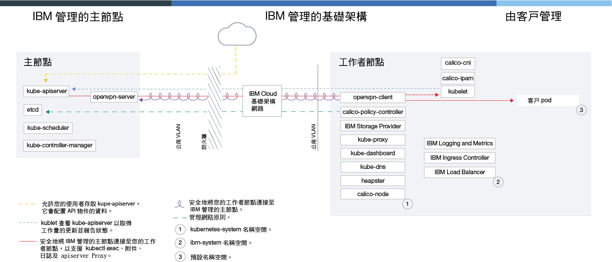

---

copyright:
  years: 2014, 2018
lastupdated: "2018-01-12"

---

{:new_window: target="_blank"}
{:shortdesc: .shortdesc}
{:screen: .screen}
{:pre: .pre}
{:table: .aria-labeledby="caption"}
{:codeblock: .codeblock}
{:tip: .tip}
{:download: .download}

# 在 {{site.data.keyword.Bluemix_dedicated_notm}} 中開始使用叢集
{: #dedicated}

如果您具有 {{site.data.keyword.Bluemix_dedicated}} 帳戶，則可以在專用雲端環境 (`https://<my-dedicated-cloud-instance>.bluemix.net`) 中部署叢集，並與也在該處執行的預先選取 {{site.data.keyword.Bluemix}} 服務連接。
{:shortdesc}

如果您沒有 {{site.data.keyword.Bluemix_dedicated_notm}} 帳戶，則可以在公用 {{site.data.keyword.Bluemix_notm}} 帳戶中[開始使用 {{site.data.keyword.containershort_notm}}](container_index.html#container_index)。

## 關於專用雲端環境
{: #dedicated_environment}

使用 {{site.data.keyword.Bluemix_dedicated_notm}} 帳戶，可用的實體資源只供您的叢集專用，無法與其他 {{site.data.keyword.IBM_notm}} 客戶的叢集共用。如果想要您的叢集具有隔離功能，而且所使用的其他 {{site.data.keyword.Bluemix_notm}} 服務也需要這類隔離功能，則可以選擇設定 {{site.data.keyword.Bluemix_dedicated_notm}} 環境。如果您沒有「專用」帳戶，則可以在 {{site.data.keyword.Bluemix_notm}} 公用中建立具有專用硬體的叢集。

使用 {{site.data.keyword.Bluemix_dedicated_notm}} ，您可以在「專用」主控台中從型錄建立叢集，或使用 {{site.data.keyword.containershort_notm}} CLI 來建立叢集。當您使用「專用」主控台時，請同時使用 IBM ID 來登入「專用」及公用帳戶。這項雙重登入可讓您使用「專用」主控台來存取公用叢集。當您使用 CLI 時，請使用「專用」端點 (`api.<my-dedicated-cloud-instance>.bluemix.net.`) 登入，並將目標設為與「專用」環境相關聯之公用地區的 {{site.data.keyword.containershort_notm}} API 端點。

{{site.data.keyword.Bluemix_notm}} 公用與「專用」之間的最重要差異如下。

*   {{site.data.keyword.IBM_notm}} 擁有並管理在其中部署工作者節點、VLAN 及子網路的 IBM Cloud 基礎架構 (SoftLayer) 帳戶，而不是您所擁有的帳戶。
*   這些 VLAN 及子網路的規格是在啟用「專用」環境時決定，而不是建立叢集時。

### 雲端環境之間的叢集管理差異
{: #dedicated_env_differences}

|範疇|{{site.data.keyword.Bluemix_notm}} 公用|{{site.data.keyword.Bluemix_dedicated_notm}}|
|--|--------------|--------------------------------|
|叢集建立|建立精簡叢集，或針對標準叢集指定下列詳細資料：<ul><li>叢集類型</li><li>名稱</li><li>位置</li><li>機型</li><li>工作者節點數目</li><li>公用 VLAN</li><li>專用 VLAN</li><li>硬體</li></ul>|針對標準叢集指定下列詳細資料：<ul><li>名稱</li><li>Kubernetes 版本</li><li>機型</li><li>工作者節點數目</li></ul><p>**附註：**VLAN 及「硬體」設定是在建立 {{site.data.keyword.Bluemix_notm}} 環境期間所預先定義。</p>|
|叢集硬體及所有權|在標準叢集中，硬體可以與其他 {{site.data.keyword.IBM_notm}} 客戶共用，或者只供您專用。在您的 IBM Cloud 基礎架構 (SoftLayer) 帳戶中，是由您擁有及管理公用及專用 VLAN。|在 {{site.data.keyword.Bluemix_dedicated_notm}} 的叢集中，硬體一律是專用的。IBM 會為您擁有及管理公用及專用 VLAN。位置是針對 {{site.data.keyword.Bluemix_notm}} 環境所預先定義。|
|負載平衡器及 Ingress 網路|在佈建標準叢集期間，會自動執行下列動作。<ul><li>一個可攜式公用子網路及一個可攜式專用子網路會連結至叢集，並指派給您的 IBM Cloud 基礎架構 (SoftLayer) 帳戶。</li><li>一個可攜式公用 IP 位址用於高可用性應用程式負載平衡器，並以 &lt;cluster_name&gt;.containers.mybluemix.net 的格式指派唯一公用路徑。您可以使用此路徑將多個應用程式公開給大眾使用。一個可攜式專用 IP 位址用於專用應用程式負載平衡器。</li><li>四個可攜式公用及四個可攜式專用 IP 位址會指派給叢集，而此叢集可用來透過負載平衡器服務來公開應用程式。您可以透過 IBM Cloud 基礎架構 (SoftLayer) 帳戶要求其他子網路。</li></ul>|當您建立「專用」帳戶時，您會決定要如何公開及存取叢集服務的連線功能。如果您要使用自己的企業 IP 範圍（使用者管理的 IP），則必須在[設定 {{site.data.keyword.Bluemix_dedicated_notm}} 環境](/docs/dedicated/index.html#setupdedicated)時提供它們。<ul><li>依預設，不會將任何可攜式公用子網路連結至您在「專用」帳戶中建立的叢集。相反地，您可以彈性地選擇最適合您企業的連線功能模型。</li><li>在您建立叢集之後，請針對負載平衡器或 Ingress 連線功能，選擇您要連結以及與叢集搭配使用的子網路類型。<ul><li>針對公用或專用可攜式子網路，您可以[將子網路新增至叢集](cs_subnets.html#subnets)</li><li>針對您在「專用」上線時提供給 IBM 之使用者管理的 IP 位址，您可以[將使用者管理的子網路新增至叢集](#dedicated_byoip_subnets)。</li></ul></li><li>將子網路連結至叢集之後，即會建立 Ingress 控制器。只有在您使用可攜式公用子網路時，才會建立公用 Ingress 路徑。</li></ul>|
|NodePort 網路|公開工作者節點上的公用埠，並使用工作者節點的公用 IP 位址來公開存取您在叢集中的服務。|工作者節點的所有公用 IP 位址都會遭到防火牆封鎖。不過，針對新增至叢集的 {{site.data.keyword.Bluemix_notm}} 服務，可以透過公用 IP 位址或專用 IP 位址存取節點埠。|
|持續性儲存空間|使用磁區的[動態佈建](cs_storage.html#create)或[靜態佈建](cs_storage.html#existing)。|使用磁區的[動態佈建](cs_storage.html#create)。[開立支援問題單](/docs/support/index.html#contacting-support)以要求備份磁區、要求從磁區還原，以及執行其他儲存空間功能。</li></ul>|
|{{site.data.keyword.registryshort_notm}} 中的映像檔登錄 URL|<ul><li>美國南部及美國東部：<code>registry.ng bluemix.net</code></li><li>英國南部：<code>registry.eu-gb.bluemix.net</code></li><li>歐盟中部（法蘭克福）：<code>registry.eu-de.bluemix.net</code></li><li>澳洲（雪梨）：<code>registry.au-syd.bluemix.net</code></li></ul>|<ul><li>若為新的名稱空間，請使用針對 {{site.data.keyword.Bluemix_notm}} 公用所定義的相同地區型登錄。</li><li>若為已針對 {{site.data.keyword.Bluemix_dedicated_notm}} 中的單一及可擴充容器所設定的名稱空間，請使用 <code>registry.&lt;dedicated_domain&gt;</code></li></ul>|
|存取登錄|請參閱[搭配使用專用及公用映像檔登錄與 {{site.data.keyword.containershort_notm}}](cs_images.html) 中的選項。|<ul><li>若為新的名稱空間，請參閱[搭配使用專用及公用映像檔登錄與 {{site.data.keyword.containershort_notm}}](cs_images.html) 中的選項。</li><li>若為已針對單一及可擴充群組所設定的名稱空間，請[使用記號及建立 Kubernetes 密碼](cs_dedicated_tokens.html#cs_dedicated_tokens)來進行鑑別。</li></ul>|
{: caption="{{site.data.keyword.Bluemix_notm}} 公用與 {{site.data.keyword.Bluemix_dedicated_notm}} 的特性差異" caption-side="top"}

<br />


### 服務架構
{: #dedicated_ov_architecture}

每一個工作者節點都已設定 {{site.data.keyword.IBM_notm}} 所管理的 Docker Engine、不同的運算資源、網路及磁區服務。內建安全特性可提供隔離、資源管理功能及工作者節點安全相符性。工作者節點會使用安全 TLS 憑證及 openVPN 連線來與主節點進行通訊。
{:shortdesc}

*{{site.data.keyword.Bluemix_dedicated_notm}} 中的 Kubernetes 架構及網路*



<br />


## 在專用上設定 {{site.data.keyword.containershort_notm}}
{: #dedicated_setup}

每一個 {{site.data.keyword.Bluemix_dedicated_notm}} 環境都具有 {{site.data.keyword.Bluemix_notm}} 中的公用、用戶端擁有的公司帳戶。為了讓「專用」環境中的使用者建立叢集，管理者必須將使用者新增至「專用」環境的這個公用公司帳戶。

開始之前：
  * [設定 {{site.data.keyword.Bluemix_dedicated_notm}} 環境](/docs/dedicated/index.html#setupdedicated)。
  * 如果您的本端系統或組織網路使用 Proxy 或防火牆控制公用網際網路端點，則必須[在您的防火牆中開啟必要的埠和 IP 位址](cs_firewall.html#firewall)。
  * [下載 Cloud Foundy CLI ](https://github.com/cloudfoundry/cli/releases) 並[新增 IBM Cloud 管理 CLI 外掛程式](/docs/cli/plugins/bluemix_admin/index.html#adding-the-ibm-cloud-admin-cli-plug-in)。

若要容許 {{site.data.keyword.Bluemix_dedicated_notm}} 使用者存取叢集，請執行下列動作：

1.  公用 {{site.data.keyword.Bluemix_notm}} 帳戶的擁有者必須產生 API 金鑰。
    1.  登入 {{site.data.keyword.Bluemix_dedicated_notm}} 實例的端點。輸入公用帳戶擁有者的 {{site.data.keyword.Bluemix_notm}} 認證，並在系統提示時選取您的帳戶。

        ```
        bx login -a api.<my-dedicated-cloud-instance>.<region>.bluemix.net
        ```
        {: pre}

        **附註：**如果您具有聯合 ID，請使用 `bx login -a api.<my-dedicated-cloud-instance>.<region>.bluemix.net --sso` 來登入 {{site.data.keyword.Bluemix_notm}} CLI。請輸入使用者名稱，並使用 CLI 輸出中提供的 URL 來擷取一次性密碼。若沒有 `--sso` 時登入失敗，而有 `--sso` 選項時登入成功，即表示您有聯合 ID。

    2.  產生用於邀請使用者加入公用帳戶的 API 金鑰。請記下 API 金鑰值，「專用」帳戶管理者將在下一步中使用。

        ```
        bx iam api-key-create <key_name> -d "Key to invite users to <dedicated_account_name>"
        ```
        {: pre}

    3.  記下您要邀請使用者加入的公用帳戶組織的 GUID，「專用」帳戶管理者將在下一步中使用。

        ```
        bx account orgs
        ```
        {: pre}

2.  {{site.data.keyword.Bluemix_dedicated_notm}} 帳戶的擁有者可以邀請單一或多位使用者加入您的「公用」帳戶。
    1.  登入 {{site.data.keyword.Bluemix_dedicated_notm}} 實例的端點。輸入「專用」帳戶擁有者的 {{site.data.keyword.Bluemix_notm}} 認證，並在系統提示時選取您的帳戶。

        ```
        bx login -a api.<my-dedicated-cloud-instance>.<region>.bluemix.net
        ```
        {: pre}

        **附註：**如果您具有聯合 ID，請使用 `bx login -a api.<my-dedicated-cloud-instance>.<region>.bluemix.net --sso` 來登入 {{site.data.keyword.Bluemix_notm}} CLI。請輸入使用者名稱，並使用 CLI 輸出中提供的 URL 來擷取一次性密碼。若沒有 `--sso` 時登入失敗，而有 `--sso` 選項時登入成功，即表示您有聯合 ID。

    2.  邀請使用者加入公用帳戶。
        * 若要邀請單一使用者，請執行下列指令：

            ```
            bx cf bluemix-admin invite-users-to-public -userid=<user_email> -apikey=<public_api_key> -public_org_id=<public_org_id>
            ```
            {: pre}

            將 <em>&lt;user_IBMid&gt;</em> 取代為您要邀請之使用者的電子郵件、將 <em>&lt;public_api_key&gt;</em> 取代為前一個步驟中所產生的 API 金鑰，並將 <em>&lt;public_org_id&gt;</em> 取代為公用帳戶組織的 GUID。如需這個指令的相關資訊，請參閱[從 IBM Cloud Dedicated 邀請使用者](/docs/cli/plugins/bluemix_admin/index.html#admin_dedicated_invite_public)。

        * 若要邀請目前在「專用」帳戶組織中的所有使用者，請執行下列指令：

            ```
            bx cf bluemix-admin invite-users-to-public -organization=<dedicated_org_id> -apikey=<public_api_key> -public_org_id=<public_org_id>
            ```

            將 <em>&lt;dedicated_org_id&gt;</em> 取代為「專用」帳戶組織 ID、將 <em>&lt;public_api_key&gt;</em> 取代為前一個步驟中所產生的 API 金鑰，並將 <em>&lt;public_org_id&gt;</em> 取代為公用帳戶組織的 GUID。如需這個指令的相關資訊，請參閱[從 IBM Cloud Dedicated 邀請使用者](/docs/cli/plugins/bluemix_admin/index.html#admin_dedicated_invite_public)。

    3.  如果使用者有 IBM ID，則會自動將使用者新增至公用帳戶中的指定組織。如果使用者還沒有 IBM ID，則會將邀請傳送到使用者的電子郵件位址。使用者接受邀請之後，就會為使用者建立 IBM ID，並將使用者新增至公用帳戶中的指定組織。

    4.  驗證已將使用者新增至帳戶。

        ```
        bx cf bluemix-admin invite-users-status -apikey=<public_api_key>
        ```
        {: pre}

        具有現有 IBM ID 的受邀使用者將會有 `ACTIVE` 狀態。沒有現有 IBM ID 的受邀使用者將會有 `PENDING` 或 `ACTIVE` 狀態（視他們是否已接受邀請加入帳戶而定）。

3.  如果任何使用者需要叢集建立專用權，您必須授與管理者角色給該位使用者。

    1.  從公用主控台的功能表列，按一下**管理 > 安全 > 身分及存取**，然後按一下**使用者**。

    2.  從您要指派存取權的使用者列，選取**動作**功能表，然後按一下**指派存取權**。

    3.  選取**將存取權指派給資源**。

    4.  從**服務**清單，選取 **IBM Cloud Container Service**。

    5.  從**地區**清單，選取**所有現行地區**或特定的地區（如果您收到提示的話）。

    6. 在**選取角色**下，選取「管理者」。

    7. 按一下**指派**。

4.  使用者現在可以登入「專用」帳戶端點來開始建立叢集。

    1.  登入 {{site.data.keyword.Bluemix_dedicated_notm}} 實例的端點。當系統提示時，請輸入 IBM ID。

        ```
        bx login -a api.<my-dedicated-cloud-instance>.<region>.bluemix.net
        ```
        {: pre}

        **附註：**如果您具有聯合 ID，請使用 `bx login -a api.<my-dedicated-cloud-instance>.<region>.bluemix.net --sso` 來登入 {{site.data.keyword.Bluemix_notm}} CLI。請輸入使用者名稱，並使用 CLI 輸出中提供的 URL 來擷取一次性密碼。若沒有 `--sso` 時登入失敗，而有 `--sso` 選項時登入成功，即表示您有聯合 ID。

    2.  如果您是第一次登入，請在系統提示時提供您的「專用」使用者 ID 及密碼。這會鑑別「專用」帳戶，並將「專用」與公用帳戶鏈結在一起。在第一次登入後的每次登入，都只需使用您的 IBM ID 來登入。如需相關資訊，請參閱[將專用 ID 連接至公用 IBM ID](/docs/cli/connect_dedicated_id.html#connect_dedicated_id)。

        **附註**：您必須同時登入「專用」帳戶及公用帳戶，才能建立叢集。如果您只要登入「專用」帳戶，請在登入「專用」端點時使用 `--no-iam` 旗標。

5.  如果您要解除鏈結您的帳戶，則可以中斷 IBM ID 與「專用」使用者 ID 的連線。如需相關資訊，請參閱[中斷專用 ID 與公用 IBM ID 的連線](/docs/cli/connect_dedicated_id.html#disconnect-your-dedicated-id-from-the-public-ibmid)。

    ```
    bx iam dedicated-id-disconnect
    ```
    {: pre}

<br />


## 建立叢集
{: #dedicated_administering}

設計最大可用性及容量的 {{site.data.keyword.Bluemix_dedicated_notm}} 叢集設定。
{:shortdesc}

### 使用 GUI 建立叢集
{: #dedicated_creating_ui}

1.  開啟「專用」主控台：`https://<my-dedicated-cloud-instance>.bluemix.net`。
2. 選取**也登入 {{site.data.keyword.Bluemix_notm}} 公用**勾選框，然後按一下**登入**。
3. 遵循提示，以使用 IBM ID 登入。如果這是您第一次登入「專用」帳戶，則請遵循提示來登入 {{site.data.keyword.Bluemix_dedicated_notm}}。
4.  從型錄中，選取**容器**，然後按一下 **Kubernetes 叢集**。
5.  輸入**叢集名稱**。
6.  選取**機型**。機型會定義設定於每一個工作者節點中的虛擬 CPU 及記憶體數量。此虛擬 CPU 及記憶體可供節點中部署的所有容器使用。
    -   微機型指出最小選項。
    -   平衡機型具有指派給每一個 CPU 的相等記憶體數量，以最佳化效能。
7.  選擇您需要的**工作者節點數目**。選取 `3`，確保叢集的高可用性。
8.  按一下**建立叢集**。即會開啟叢集的詳細資料，但叢集中的工作者節點需要數分鐘的時間進行佈建。在**工作者節點**標籤上，您可以看到工作者節點部署的進度。工作者節點備妥後，狀態會變更為 **Ready**。

### 使用 CLI 建立叢集
{: #dedicated_creating_cli}

1.  安裝 {{site.data.keyword.Bluemix_notm}} CLI 及 [{{site.data.keyword.containershort_notm}} 外掛程式](cs_cli_install.html#cs_cli_install)。
2.  登入 {{site.data.keyword.Bluemix_dedicated_notm}} 實例的端點。當系統提示時，請輸入 {{site.data.keyword.Bluemix_notm}} 認證，然後選取帳戶。

    ```
    bx login -a api.<my-dedicated-cloud-instance>.<region>.bluemix.net
    ```
    {: pre}

    **附註：**如果您具有聯合 ID，請使用 `bx login -a api.<my-dedicated-cloud-instance>.<region>.bluemix.net --sso` 來登入 {{site.data.keyword.Bluemix_notm}} CLI。請輸入使用者名稱，並使用 CLI 輸出中提供的 URL 來擷取一次性密碼。若沒有 `--sso` 時登入失敗，而有 `--sso` 選項時登入成功，即表示您有聯合 ID。

3.  若要將目標設為地區，請執行 `bx cs region-set`。

4.  使用 `cluster-create` 指令來建立叢集。當您建立標準叢集時，工作者節點的硬體會按小時計費。

    範例：

    ```
    bx cs cluster-create --location <location> --machine-type <machine-type> --name <cluster_name> --workers <number>
    ```
    {: pre}

    <table>
    <caption>瞭解此指令的元件</caption>
    <thead>
    <th colspan=2> 瞭解此指令的元件</th>
    </thead>
    <tbody>
    <tr>
    <td><code>cluster-create</code></td>
    <td>在 {{site.data.keyword.Bluemix_notm}} 組織中建立叢集的指令。</td>
    </tr>
    <tr>
    <td><code>--location <em>&lt;location&gt;</em></code></td>
    <td>將 &lt;location&gt; 取代為配置「專用」環境使用的 {{site.data.keyword.Bluemix_notm}} 位置 ID。</td>
    </tr>
    <tr>
    <td><code>--machine-type <em>&lt;machine_type&gt;</em></code></td>
    <td>如果您要建立標準叢集，請選擇機型。機型指定每一個工作者節點可用的虛擬運算資源。如需相關資訊，請檢閱[比較 {{site.data.keyword.containershort_notm}} 的精簡與標準叢集](cs_why.html#cluster_types)。若為精簡叢集，您不需要定義機型。</td>
    </tr>
    <tr>
    <td><code>--name <em>&lt;name&gt;</em></code></td>
    <td>將 <em>&lt;name&gt;</em> 取代為叢集的名稱。</td>
    </tr>
    <tr>
    <td><code>--workers <em>&lt;number&gt;</em></code></td>
    <td>要包含在叢集中的工作者節點數目。如果未指定 <code>--workers</code> 選項，則會建立一個工作者節點。</td>
    </tr>
    </tbody></table>

5.  驗證已要求建立叢集。

    ```
    bx cs clusters
    ```
    {: pre}

    **附註：**訂購工作者節點機器，並在您的帳戶中設定及佈建叢集，最多可能需要 15 分鐘。

    叢集佈建完成之後，叢集的狀態會變更為 **deployed**。

    ```
    Name         ID                                   State      Created          Workers   
    my_cluster   paf97e8843e29941b49c598f516de72101   deployed   20170201162433   1   
    ```
    {: screen}

6.  檢查工作者節點的狀態。

    ```
    bx cs workers <cluster>
    ```
    {: pre}

    工作者節點備妥後，狀態會變更為 **Normal**，而且狀態為 **Ready**。當節點狀態為 **Ready** 時，您就可以存取叢集。

    ```
    ID                                                  Public IP        Private IP     Machine Type   State      Status  
    prod-dal10-pa8dfcc5223804439c87489886dbbc9c07-w1   169.47.223.113   10.171.42.93   free           normal    Ready
    ```
    {: screen}

7.  將您建立的叢集設為此階段作業的環境定義。請在您每次使用叢集時，完成下列配置步驟。

    1.  取得指令來設定環境變數，並下載 Kubernetes 配置檔。

        ```
        bx cs cluster-config <cluster_name_or_id>
        ```
        {: pre}

        配置檔下載完成之後，會顯示一個指令，可讓您用來將本端 Kubernetes 配置檔的路徑設定為環境變數。

        OS X 的範例：

        ```
        export KUBECONFIG=/Users/<user_name>/.bluemix/plugins/container-service/clusters/<cluster_name>/kube-config-prod-dal10-<cluster_name>.yml
        ```
        {: screen}

    2.  複製並貼上終端機中顯示的指令，以設定 `KUBECONFIG` 環境變數。
    3.  驗證 `KUBECONFIG` 環境變數已適當設定。

        OS X 的範例：

        ```
        echo $KUBECONFIG
        ```
        {: pre}

        輸出：

        ```
        /Users/<user_name>/.bluemix/plugins/container-service/clusters/<cluster_name>/kube-config-prod-dal10-<cluster_name>.yml

        ```
        {: screen}

8.  使用預設埠 8001 來存取 Kubernetes 儀表板。
    1.  使用預設埠號來設定 Proxy。

        ```
        kubectl proxy
        ```
        {: pre}

        ```
        Starting to serve on 127.0.0.1:8001
        ```
        {: screen}

    2.  在 Web 瀏覽器中開啟下列 URL，以查看 Kubernetes 儀表板。

        ```
        http://localhost:8001/ui
        ```
        {: codeblock}

### 使用專用及公用映像檔登錄
{: #dedicated_images}

若為新的名稱空間，請參閱[搭配使用專用及公用映像檔登錄與 {{site.data.keyword.containershort_notm}}](cs_images.html) 中的選項。若為已針對單一及可擴充群組所設定的名稱空間，請[使用記號及建立 Kubernetes 密碼](cs_dedicated_tokens.html#cs_dedicated_tokens)來進行鑑別。

### 將子網路新增至叢集
{: #dedicated_cluster_subnet}

將子網路新增至叢集，以變更可用的可攜式公用 IP 位址的儲存區。
如需相關資訊，請參閱[將子網路新增至叢集](cs_subnets.html#subnets)。請檢閱下列將子網路新增至「專用」叢集的差異。

#### 將其他使用者管理的子網路及 IP 位址新增至 Kubernetes 叢集
{: #dedicated_byoip_subnets}

從您要用來存取 {{site.data.keyword.containershort_notm}} 的內部部署網路，提供更多自己的子網路。您可以將專用 IP 位址從這些子網路新增至 Kubernetes 叢集中的 Ingress 及負載平衡器服務。根據您要使用的子網路格式，使用兩種方式中的其中一種來配置使用者管理的子網路。

需求：
- 使用者管理的子網路只能新增至專用 VLAN。
- 子網路字首長度限制為 /24 到 /30。例如，`203.0.113.0/24` 指定 253 個可用的專用 IP 位址，而 `203.0.113.0/30` 指定 1 個可用的專用 IP 位址。
- 子網路中的第一個 IP 位址必須用來作為子網路的閘道。

開始之前：請配置進入您企業網路的網路資料流量，以及離開您的企業網路到將利用使用者管理子網路之 {{site.data.keyword.Bluemix_dedicated_notm}} 網路的網路資料流量遞送。

1. 若要使用您自己的子網路，請[開立支援問題單](/docs/support/index.html#contacting-support)，並提供您要使用的子網路 CIDR 清單。
    **附註**：針對內部部署及內部帳戶連線功能管理 ALB 及負載平衡器的方式會不同（視子網路 CIDR 的格式而定）。請參閱最終步驟，以瞭解配置差異。

2. 在 {{site.data.keyword.IBM_notm}} 佈建使用者管理的子網路之後，讓子網路可供 Kubernetes 叢集使用。

    ```
   bx cs cluster-user-subnet-add <cluster_name> <subnet_CIDR> <private_VLAN>
   ```
    {: pre}
    將 <em>&lt;cluster_name&gt;</em> 取代為叢集的名稱或 ID、將 <em>&lt;subnet_CIDR&&gt;</em> 取代為支援問題單中所提供的其中一個子網路 CIDR，並將 <em>&lt;private_VLAN&gt;</em> 取代為可用的專用 VLAN ID。您可以藉由執行 `bx cs vlsans`，來尋找可用的專用 VLAN ID。
3. 驗證子網路已新增至叢集。使用者所提供子網路的 **User-managed** 欄位為 _true_。

    ```
    bx cs cluster-get --showResources <cluster_name>
    ```
    {: pre}

    ```
    VLANs
    VLAN ID   Subnet CIDR         Public       User-managed
    1555503   192.0.2.0/24        true         false
    1555505   198.51.100.0/24     false        false
    1555505   203.0.113.0/24      false        true
    ```
    {: screen}

4. 若要配置內部部署及內部帳戶連線功能，請從下列選項中進行選擇：
  - 如果您已使用子網路的 10.x.x.x 專用 IP 位址範圍，請使用該範圍中的有效 IP，以使用 Ingress 及負載平衡器來配置內部部署及內部帳戶連線功能。如需相關資訊，請參閱[配置應用程式的存取](cs_network_planning.html#planning)。
  - 如果您未使用子網路的 10.x.x.x 專用 IP 位址範圍，請使用該範圍中的有效 IP，以使用 Ingress 及負載平衡器來配置內部部署連線功能。如需相關資訊，請參閱[配置應用程式的存取](cs_network_planning.html#planning)。不過，您必須使用 IBM Cloud 基礎架構 (SoftLayer) 可攜式專用子網路，來配置叢集與其他 Cloud Foundry 型服務之間的內部帳戶連線功能。您可以使用 [`bx cs cluster-subnet-add`](cs_cli_reference.html#cs_cluster_subnet_add) 指令來建立可攜式專用子網路。在此情境中，您的叢集同時具有用於內部部署連線功能的使用者管理子網路，以及用於內部帳戶連線功能的 IBM Cloud 基礎架構 (SoftLayer) 可攜式專用子網路。

### 其他叢集配置
{: #dedicated_other}

請檢閱下列用於其他叢集配置的選項：
  * [管理叢集存取](cs_users.html#managing)
  * [更新 Kubernetes 主節點](cs_cluster_update.html#master)
  * [更新工作者節點](cs_cluster_update.html#worker_node)
  * [配置叢集記載](cs_health.html#logging)
  * [配置叢集監視](cs_health.html#monitoring)
      * **附註**：每一個 {{site.data.keyword.Bluemix_dedicated_notm}} 帳戶內都會有 `ibm-monitoring` 叢集。此叢集會持續監視「專用」環境中的 {{site.data.keyword.containerlong_notm}} 性能，並檢查環境的穩定性及連線功能。請不要從環境中移除此叢集。
  * [視覺化 Kubernetes 叢集資源](cs_integrations.html#weavescope)
  * [移除叢集](cs_clusters.html#remove)

<br />


## 在叢集中部署應用程式
{: #dedicated_apps}

您可以使用 Kubernetes 技術，在 {{site.data.keyword.Bluemix_dedicated_notm}} 叢集中部署應用程式，並確保應用程式一律已啟動並在執行中。
{:shortdesc}

若要在叢集中部署應用程式，您可以遵循[在 {{site.data.keyword.Bluemix_notm}} 公用叢集中部署應用程式](cs_app.html#app)的指示。請檢閱下列 {{site.data.keyword.Bluemix_dedicated_notm}} 叢集的差異。

### 容許對應用程式的公用存取
{: #dedicated_apps_public}

對於 {{site.data.keyword.Bluemix_dedicated_notm}} 環境，防火牆會封鎖公用主要 IP 位址。若要讓應用程式可公開使用，請使用 [LoadBalancer 服務](#dedicated_apps_public_load_balancer)或 [Ingress](#dedicated_apps_public_ingress)，而非 NodePort 服務。如果您需要存取可攜式公用 IP 位址的 LoadBalancer 服務或 Ingress，請在服務上線時提供企業防火牆白名單給 IBM。

#### 使用負載平衡器服務類型來配置應用程式的存取
{: #dedicated_apps_public_load_balancer}

如果您要將公用 IP 位址用於負載平衡器，請確定已向 IBM 提供企業防火牆白名單，或[開立支援問題單](/docs/support/index.html#contacting-support)來配置防火牆白名單。然後遵循[使用負載平衡器服務類型來配置應用程式的存取](cs_loadbalancer.html#config)中的步驟。

#### 使用 Ingress 來配置應用程式的公用存取
{: #dedicated_apps_public_ingress}

如果您要將公用 IP 位址用於應用程式負載平衡器，請確定已向 IBM 提供企業防火牆白名單，或[開立支援問題單](/docs/support/index.html#contacting-support)來配置防火牆白名單。然後遵循[使用 Ingress 來配置應用程式的存取](cs_ingress.html#config)中的步驟。

### 建立持續性儲存空間
{: #dedicated_apps_volume_claim}

若要檢閱用於建立持續性儲存空間的選項，請參閱[持續性資料儲存空間](cs_storage.html#planning)。若要要求備份磁區、從磁區還原，以及其他儲存空間功能，您必須[開立支援問題單](/docs/support/index.html#contacting-support)。
