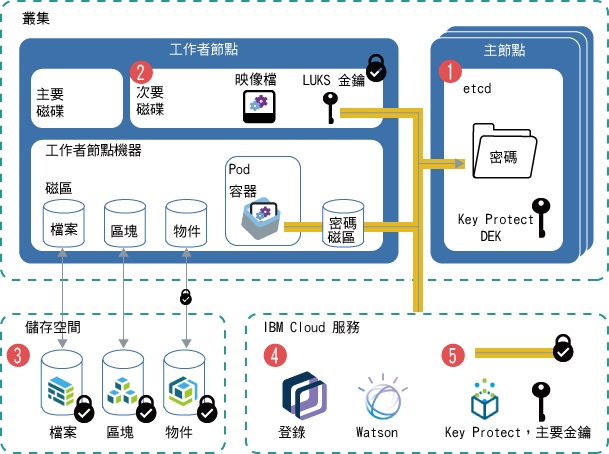

---

copyright:
  years: 2014, 2019
lastupdated: "2019-05-31"

keywords: kubernetes, iks

subcollection: containers

---

{:new_window: target="_blank"}
{:shortdesc: .shortdesc}
{:screen: .screen}
{:pre: .pre}
{:table: .aria-labeledby="caption"}
{:codeblock: .codeblock}
{:tip: .tip}
{:note: .note}
{:important: .important}
{:deprecated: .deprecated}
{:download: .download}
{:preview: .preview}


# 保護叢集裡的機密性資訊
{: #encryption}

保護機密叢集資訊，以確保資料完整性，並防止將資料公開給未獲授權的使用者。
{: shortdesc}

您可以在叢集裡的不同層次上建立機密資料，每一個層次都需要適當的保護。
- **叢集層次：**叢集配置資料會儲存在 Kubernetes 主節點的 etcd 元件中。etcd 中的資料會儲存在 Kubernetes 主節點的本端磁碟上，且會備份至 {{site.data.keyword.cos_full_notm}}。資料是在傳送至 {{site.data.keyword.cos_full_notm}} 期間和靜止時加密。您可以選擇在 Kubernetes 主節點的本端磁碟上針對 etcd 資料啟用加密，方法是針對叢集[啟用 {{site.data.keyword.keymanagementservicelong_notm}} 加密](/docs/containers?topic=containers-encryption#encryption)。執行舊版 Kubernetes 之叢集的 etcd 資料會儲存在由 IBM 管理的已加密磁碟上，並且每日進行備份。
- **應用程式層次：**部署應用程式時，請不要在 YAML 配置檔、ConfigMap 或 Script 中儲存機密資訊，例如認證或金鑰。請改用 [Kubernetes 密碼 ](https://kubernetes.io/docs/concepts/configuration/secret/)。您也可以[加密 Kubernetes 密碼中的資料](#keyprotect)，以防止未獲授權的使用者存取機密叢集資訊。

如需保護叢集安全的相關資訊，請參閱 [{{site.data.keyword.containerlong_notm}} 的安全](/docs/containers?topic=containers-security#security)。


_圖例：叢集裡資料加密的概觀_

1.  **etcd**：etcd 是儲存 Kubernetes 資源之資料的主節點元件，例如物件配置 `.yaml` 檔案和密碼。etcd 中的資料會儲存在 Kubernetes 主節點的本端磁碟上，且會備份至 {{site.data.keyword.cos_full_notm}}。資料是在傳送至 {{site.data.keyword.cos_full_notm}} 期間和靜止時加密。您可以選擇在 Kubernetes 主節點的本端磁碟上針對 etcd 資料啟用加密，方法是針對叢集[啟用 {{site.data.keyword.keymanagementservicelong_notm}} 加密](#keyprotect)。執行舊版 Kubernetes 之叢集裡的 etcd 資料會儲存在由 IBM 管理的已加密磁碟上，並且每日進行備份。當 etcd 資料傳送至 Pod 時，會透過 TLS 將資料加密，以確保資料保護及完整性。
2.  **工作者節點的次要磁碟**：工作者節點的次要磁碟是儲存容器檔案系統和本端取回之映像檔的位置。磁碟是以 LUKS 加密金鑰進行 AES 256 位元加密，該金鑰對於工作者節點是唯一的，且以密碼形式儲存在 etcd 中，由 IBM 管理。當您重新載入或更新工作者節點時，LUKS 金鑰會進行輪換。
3.  **儲存空間**：您可以選擇藉由[設定檔案、區塊或物件持續性儲存空間](/docs/containers?topic=containers-storage_planning#persistent_storage_overview)來儲存資料。IBM Cloud 基礎架構 (SoftLayer) 儲存空間實例會將資料儲存在已加密磁碟上，因此靜止資料已加密。此外，如果您選擇物件儲存空間，則傳送中資料也已加密。
4.  **{{site.data.keyword.Bluemix_notm}} 服務**：您可以[整合 {{site.data.keyword.Bluemix_notm}} 服務](/docs/containers?topic=containers-service-binding#bind-services)（例如 {{site.data.keyword.registryshort_notm}} 或 {{site.data.keyword.watson}}）與您的叢集。服務認證會儲存在 etcd 中儲存的密碼中，而您的應用程式可以將密碼裝載為磁區，或將密碼指定為[部署](/docs/containers?topic=containers-app#secret)中的環境變數，來存取這些服務認證。
5.  **{{site.data.keyword.keymanagementserviceshort}}**：當您在叢集裡[啟用 {{site.data.keyword.keymanagementserviceshort}}](#keyprotect) 時，已包裝的資料加密金鑰 (DEK) 會儲存在 etcd 中。DEK 會加密叢集裡的密碼，包括服務認證及 LUKS 金鑰。因為根金鑰位於您的 {{site.data.keyword.keymanagementserviceshort}} 實例中，所以您可以控制對已加密密碼的存取。{{site.data.keyword.keymanagementserviceshort}} 金鑰是由 FIPS 140-2 層次 2 認證的雲端型硬體安全模組來保護，這些模組可防止資訊遭到竊取。如需 {{site.data.keyword.keymanagementserviceshort}} 加密如何運作的相關資訊，請參閱[封裝加密](/docs/services/key-protect/concepts?topic=key-protect-envelope-encryption#envelope-encryption)。

## 瞭解何時使用密碼
{: #secrets}

Kubernetes 密碼是一種儲存機密資訊（例如使用者名稱、密碼或金鑰）的安全方式。如果您需要加密機密資訊，請[啟用 {{site.data.keyword.keymanagementserviceshort}}](#keyprotect) 來加密密碼。如需您可以在密碼中儲存哪些項目的相關資訊，請參閱 [Kubernetes 文件 ](https://kubernetes.io/docs/concepts/configuration/secret/)。
{:shortdesc}

請檢閱下列需要密碼的作業。

### 將服務新增至叢集
{: #secrets_service}

將服務連結至叢集時，不必建立密碼來儲存您的服務認證。會自動為您建立密碼。如需相關資訊，請參閱[將 {{site.data.keyword.Bluemix_notm}} 服務新增至叢集](/docs/containers?topic=containers-service-binding#bind-services)。
{: shortdesc}

### 使用 TLS 密碼將資料流量加密至應用程式
{: #secrets_tls}

ALB 會對叢集裡應用程式的 HTTP 網路資料流量進行負載平衡。若要同時對送入的 HTTPS 連線進行負載平衡，您可以配置 ALB 來解密網路資料流量，並將解密的要求轉遞至叢集裡公開的應用程式。如需相關資訊，請參閱 [Ingress 配置文件](/docs/containers?topic=containers-ingress#public_inside_3)。
{: shortdesc}

此外，如果您的應用程式需要 HTTPS 通訊協定，並且需要資料流量保持加密狀態，則您可以使用單向或交互鑑別密碼與 `ssl-services` 註釋搭配。如需相關資訊，請參閱 [Ingress 註釋文件](/docs/containers?topic=containers-ingress_annotation#ssl-services)。

### 以儲存在 Kubernetes 映像檔取回密碼中的認證來存取您的登錄
{: #imagepullsecret}

建立叢集時，會在 `default` Kubernetes 名稱空間中自動為您建立 {{site.data.keyword.registrylong}} 認證的密碼。不過，如果您要在下列狀況中部署容器，則必須[為您的叢集建立您自己的映像檔取回密碼](/docs/containers?topic=containers-images#other)。
* 從 {{site.data.keyword.registryshort_notm}} 登錄中的映像檔到 `default` 以外的 Kubernetes 名稱空間。
* 從 {{site.data.keyword.registryshort_notm}} 登錄中儲存在不同 {{site.data.keyword.Bluemix_notm}} 地區或 {{site.data.keyword.Bluemix_notm}} 帳戶中的映像檔。
* 從外部專用登錄中儲存的映像檔。

<br />


## 使用 {{site.data.keyword.keymanagementserviceshort}}（測試版）來加密 Kubernetes 主節點的本端磁碟及密碼
{: #keyprotect}

您可以在叢集裡使用 [{{site.data.keyword.keymanagementservicefull}} ](/docs/services/key-protect?topic=key-protect-getting-started-tutorial) 作為 Kubernetes [金鑰管理服務 (KMS) 提供者 ](https://kubernetes.io/docs/tasks/administer-cluster/kms-provider/)，來保護 Kubernetes 主節點中的 etcd 元件，以及 Kubernetes 密碼。KMS 提供者是 Kubernetes 1.11 版中的 alpha 特性，它讓 {{site.data.keyword.keymanagementserviceshort}} 整合成為 {{site.data.keyword.containerlong_notm}} 中的測試版。
{: shortdesc}

依預設，叢集配置及 Kubernetes 密碼儲存在 IBM 管理之 Kubernetes 主節點的 etcd 元件中。您的工作者節點也具有由 IBM 管理的 LUKS 金鑰所加密的次要磁碟，這些金鑰在 etcd 中儲存為密碼。etcd 中的資料會儲存在 Kubernetes 主節點的本端磁碟上，且會備份至 {{site.data.keyword.cos_full_notm}}。資料是在傳送至 {{site.data.keyword.cos_full_notm}} 期間和靜止時加密。不過，不會自動加密 Kubernetes 主節點之本端磁碟上 etcd 元件中的資料，直到您針對叢集啟用 {{site.data.keyword.keymanagementserviceshort}} 加密為止。執行舊版 Kubernetes 之叢集的 etcd 資料會儲存在由 IBM 管理的已加密磁碟上，並且每日進行備份。

當您在叢集裡啟用 {{site.data.keyword.keymanagementserviceshort}} 時，您自己的根金鑰是用來加密 etcd 中的資料，包括 LUKS 密碼。您可以使用根金鑰來加密密碼，以進一步控制機密資料。使用自己的加密可在 etcd 資料及 Kubernetes 密碼中加入一層安全，並讓您更精細地控制誰可以存取機密叢集資訊。如果您需要不可逆轉地移除對 etcd 或密碼的存取權，則可以刪除根金鑰。

請不要刪除 {{site.data.keyword.keymanagementserviceshort}} 實例中的根金鑰。即使替換使用新的金鑰，也請不要刪除金鑰。如果您刪除根金鑰，則無法在叢集裡存取或移除 etcd 或密碼中的資料。
{: important}

開始之前：
* [登入您的帳戶。適用的話，請將適當的資源群組設為目標。設定叢集的環境定義。](/docs/containers?topic=containers-cs_cli_install#cs_cli_configure)
* 確認您的叢集執行 Kubernetes 1.11.3_1521 版或更新版本，方法是執行 `ibmcloud ks cluster-get --cluster <cluster_name_or_ID>`，並檢查**版本**欄位。
* 確定您具有叢集的[**管理者** {{site.data.keyword.Bluemix_notm}} IAM 平台角色](/docs/containers?topic=containers-users#platform)。
* 確定針對叢集所在地區設定的 API 金鑰已獲授權使用 Key Protect。若要檢查針對地區儲存其認證的 API 金鑰擁有者，請執行 `ibmcloud ks api-key-info --cluster <cluster_name_or_ID>`。

若要啟用 {{site.data.keyword.keymanagementserviceshort}}，或更新在叢集裡加密密碼的實例或根金鑰，請執行下列動作：

1.  [建立 {{site.data.keyword.keymanagementserviceshort}} 實例](/docs/services/key-protect?topic=key-protect-provision#provision)。

2.  取得服務實例 ID。

    ```
    ibmcloud resource service-instance <kp_instance_name> | grep GUID
    ```
    {: pre}

3.  [建立根金鑰](/docs/services/key-protect?topic=key-protect-create-root-keys#create-root-keys)。依預設，會建立沒有到期日的根金鑰。

    需要設定到期日以符合內部安全原則嗎？[使用 API 建立根金鑰](/docs/services/key-protect?topic=key-protect-create-root-keys#create-root-key-api)，並包括 `expirationDate` 參數。**重要事項**：在您的根金鑰到期之前，您必須重複這些步驟來更新叢集，以使用新的根金鑰。否則，您無法將密碼解密。
    {: tip}

4.  記下[根金鑰 **ID**](/docs/services/key-protect?topic=key-protect-view-keys#view-keys-gui)。

5.  取得實例的 [{{site.data.keyword.keymanagementserviceshort}} 端點](/docs/services/key-protect?topic=key-protect-regions#service-endpoints)。

6.  取得您要為其啟用 {{site.data.keyword.keymanagementserviceshort}} 的叢集名稱。

    ```
    ibmcloud ks clusters
    ```
    {: pre}

7.  在叢集裡啟用 {{site.data.keyword.keymanagementserviceshort}}。在旗標中填入您先前擷取的資訊。啟用處理程序可能需要一點時間才能完成。

    ```
    ibmcloud ks key-protect-enable --cluster <cluster_name_or_ID> --key-protect-url <kp_endpoint> --key-protect-instance <kp_instance_ID> --crk <kp_root_key_ID>
    ```
    {: pre}

8.  在啟用期間，您可能無法存取 Kubernetes 主節點，例如更新用於部署的 YAML 配置。在下列指令的輸出中，檢查**主節點狀態**是否為**備妥**。
    ```
    ibmcloud ks cluster-get --cluster <cluster_name_or_ID>
    ```
    {: pre}

    正在進行啟用時的範例輸出：
    ```
    Name:                   <cluster_name>   
    ID:                     <cluster_ID>   
    ...
    Master Status:          Key Protect feature enablement in progress.  
    ```
    {: screen}

    當主節點備妥時的範例輸出：
    ```
    Name:                   <cluster_name>   
    ID:                     <cluster_ID>   
    ...
    Master Status:          Ready (1 min ago)   
    ```
    {: screen}

    在叢集裡啟用 {{site.data.keyword.keymanagementserviceshort}} 之後，會使用 {{site.data.keyword.keymanagementserviceshort}} 根金鑰來自動加密 `etcd` 中的資料、現有密碼，以及叢集裡建立的新密碼。

9.  選用項目：若要替換金鑰，請使用新的根金鑰 ID 來重複這些步驟。新的根金鑰會與前一個根金鑰一起新增至叢集配置，讓現有的加密資料仍然受到保護。

請不要刪除 {{site.data.keyword.keymanagementserviceshort}} 實例中的根金鑰。即使替換使用新的金鑰，也請不要刪除金鑰。如果您刪除根金鑰，則無法在叢集裡存取或移除 etcd 或密碼中的資料。
{: important}


## 使用 IBM Cloud Data Shield（測試版）來加密資料
{: #datashield}

{{site.data.keyword.datashield_short}} 與 Intel® Software Guard Extensions (SGX) 及 Fortanix® 技術整合，以在使用時保護 {{site.data.keyword.Bluemix_notm}} 容器工作負載程式碼和資料。應用程式碼及資料是在 CPU 強化的區域中執行，這些是工作者節點上的記憶體信任區域，能保護應用程式的重要方面，有助於保持程式碼和資料的機密性，並使其不會遭到修改。
{: shortdesc}

在保護資料方面，加密是最普遍及有效的控制方式之一。但是，在生命週期的每一個步驟中，資料都必須加密。資料在其生命週期內會經歷三個階段：靜態資料、動態資料及使用中資料。資料處於靜態和動態通常是為了在資料進行儲存及傳輸時用來保護資料。為了更進一步提升保護，您現在可以將使用中的資料加密。

如果您或貴公司因為內部政策、政府規定或產業法規遵循需求而需要顧及資料敏感度，本解決方案也許可協助您移至雲端。解決方案的範例包括財務及醫療機構，或其政府政策需要內部部署雲端解決方案的國家/地區。

若要開始使用，請使用機型為 mb2c.4x32 來佈建已啟用 SGX 的裸機工作者節點叢集，並查看[ {{site.data.keyword.datashield_short}} 文件](/docs/services/data-shield?topic=data-shield-getting-started#getting-started)。
