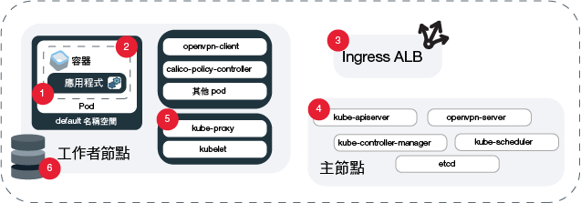

---

copyright:
  years: 2014, 2019
lastupdated: "2019-06-11"

keywords: kubernetes, iks, logmet, logs, metrics

subcollection: containers

---

{:new_window: target="_blank"}
{:shortdesc: .shortdesc}
{:screen: .screen}
{:pre: .pre}
{:table: .aria-labeledby="caption"}
{:codeblock: .codeblock}
{:tip: .tip}
{:note: .note}
{:important: .important}
{:deprecated: .deprecated}
{:download: .download}
{:preview: .preview}


# 記載及監視
{: #health}

在 {{site.data.keyword.containerlong}} 中設定記載及監視，以協助對問題進行疑難排解，以及改善 Kubernetes 叢集和應用程式的性能和效能。
{: shortdesc}

持續監視及記載是偵測叢集上攻擊以及疑難排解它們所造成之問題的關鍵。持續監視叢集，即可更充分地瞭解叢集容量以及您應用程式可用的資源可用性。透過此洞察，您可以準備保護應用程式免於關閉。**附註**：若要配置記載和監視，您必須在 {{site.data.keyword.containerlong_notm}} 中使用標準叢集。

## 選擇記載解決方案
{: #logging_overview}

依預設，會針對下列所有 {{site.data.keyword.containerlong_notm}} 叢集元件產生日誌並在本端寫入：工作者節點、容器、應用程式、持續性儲存空間、Ingress 應用程式負載平衡器、Kubernetes API 及 `kube-system` 名稱空間。有數個記載解決方案可用來收集、轉遞及檢視這些日誌。
{: shortdesc}

您可以根據您需要為其收集日誌的叢集元件，來選擇記載解決方案。一般實作是根據其分析和介面功能（例如 {{site.data.keyword.loganalysisfull}}、{{site.data.keyword.la_full}} 或協力廠商服務）來選擇您偏好的記載服務。然後，您可以使用 {{site.data.keyword.cloudaccesstrailfull}} 來審核叢集裡的使用者活動，並將主要叢集日誌備份至 {{site.data.keyword.cos_full}}。**附註**：若要配置記載，您必須具有標準 Kubernetes 叢集。

<dl>

<dt>{{site.data.keyword.la_full_notm}}</dt>
<dd>透過將 LogDNA 當成協力廠商服務部署至叢集，來管理 Pod 容器日誌。若要使用 {{site.data.keyword.la_full_notm}}，您必須將記載代理程式部署至叢集裡的每個工作者節點。此代理程式會從所有名稱空間（包括 `kube-system`），收集儲存在 Pod 的 `/var/log` 目錄中，副檔名為 `*.log` 的日誌以及無副檔名的檔案。然後，此代理程式會將日誌轉遞至 {{site.data.keyword.la_full_notm}} 服務。如需該服務的相關資訊，請參閱 [{{site.data.keyword.la_full_notm}}](/docs/services/Log-Analysis-with-LogDNA?topic=LogDNA-about) 文件。若要開始使用，請參閱[使用具有 LogDNA 的 {{site.data.keyword.loganalysisfull_notm}} 來管理 Kubernetes 叢集日誌](/docs/services/Log-Analysis-with-LogDNA/tutorials?topic=LogDNA-kube#kube)。</dd>

<dt>具有 {{site.data.keyword.loganalysisfull_notm}} 的 Fluentd</dt>
<dd><p class="deprecated">先前，您可以建立記載配置，將 Fluentd 叢集元件所收集的記載配置轉遞給 {{site.data.keyword.loganalysisfull_notm}}。從 2019 年 4 月 30 日開始，您無法佈建新的 {{site.data.keyword.loganalysisshort_notm}} 實例，並且會刪除所有精簡方案實例。到 2019 年 9 月 30 日之前，支援現有超值方案實例。若要繼續收集叢集的日誌，您必須設定 {{site.data.keyword.la_full_notm}} 或變更配置，將日誌轉遞到外部伺服器。</p>
</dd>

<dt>具有外部伺服器的 Fluentd</dt>
<dd>若要收集、轉遞及檢視叢集元件的日誌，您可以使用 Fluentd 來建立記載配置。建立記載配置時，[Fluentd ](https://www.fluentd.org/) 叢集元件會從指定來源的路徑收集日誌。然後，Fluentd 可以將這些日誌轉遞到接受 syslog 通訊協定的外部伺服器。首先，請參閱[瞭解如何將叢集和應用程式日誌轉遞到 syslog](#logging)。
</dd>

<dt>{{site.data.keyword.cloudaccesstrailfull_notm}}</dt>
<dd>若要監視叢集裡所做的使用者起始管理活動，您可以收集並轉遞審核日誌至 {{site.data.keyword.cloudaccesstrailfull_notm}}。叢集會產生兩種類型的 {{site.data.keyword.cloudaccesstrailshort}} 事件。<ul><li>叢集管理事件會自動產生並轉遞至 {{site.data.keyword.cloudaccesstrailshort}}。</li>
<li>Kubernetes API 伺服器審核事件會自動產生，但您必須[建立記載配置](#api_forward)，Fluentd 才能將這些日誌轉遞至 {{site.data.keyword.cloudaccesstrailshort}}。</li></ul>
如需您可追蹤之 {{site.data.keyword.containerlong_notm}} 事件類型的相關資訊，請參閱 [Activity Tracker 事件](/docs/containers?topic=containers-at_events)。如需服務的相關資訊，請參閱 [Activity Tracker](/docs/services/cloud-activity-tracker?topic=cloud-activity-tracker-getting-started) 文件。<p class="note">{{site.data.keyword.containerlong_notm}} 目前未配置為使用 {{site.data.keyword.at_full}}。若要管理叢集管理事件及 Kubernetes API 審核日誌，請繼續使用 {{site.data.keyword.cloudaccesstrailfull_notm}} with LogAnalysis。
</p>
</dd>

<dt>{{site.data.keyword.cos_full_notm}}</dt>
<dd>若要收集、轉遞及檢視叢集的 Kubernetes 主節點的日誌，您可以在任何時間點產生主節點日誌的 Snapshot，以收集到 {{site.data.keyword.cos_full_notm}} 儲存區中。Snapshot 包括透過 API 伺服器傳送的任何事物，例如 Pod 排程、部署或 RBAC 原則。
若要開始，請參閱[收集主節點日誌](#collect_master)。</dd>

<dt>協力廠商服務</dt>
<dd>如果您有特殊需求，您可以設定自己的記載解決方案。在[記載和監視整合](/docs/containers?topic=containers-supported_integrations#health_services)中，查看您可以新增至叢集的協力廠商記載服務。可以從 `/var/log/pods/` 路徑中收集容器日誌。</dd>

</dl>

<br />


## 將叢集和應用程式日誌轉遞到 {{site.data.keyword.la_full_notm}}
{: #logdna}

透過將 LogDNA 當成協力廠商服務部署至叢集，來管理 Pod 容器日誌。
{: shortdesc}

若要使用 {{site.data.keyword.la_full_notm}}，您必須將記載代理程式部署至叢集裡的每個工作者節點。此代理程式會從所有名稱空間（包括 `kube-system`），收集儲存在 Pod 的 `/var/log` 目錄中，副檔名為 `*.log` 的日誌以及無副檔名的檔案。然後，此代理程式會將日誌轉遞至 {{site.data.keyword.la_full_notm}} 服務。如需該服務的相關資訊，請參閱 [{{site.data.keyword.la_full_notm}}](/docs/services/Log-Analysis-with-LogDNA?topic=LogDNA-about) 文件。若要開始使用，請參閱[使用具有 LogDNA 的 {{site.data.keyword.loganalysisfull_notm}} 來管理 Kubernetes 叢集日誌](/docs/services/Log-Analysis-with-LogDNA/tutorials?topic=LogDNA-kube#kube)。

<br />


## 已淘汰：將叢集、應用程式和 Kubernetes API 審核日誌轉遞到 {{site.data.keyword.loganalysisfull_notm}}
{: #loga}

先前，您可以建立記載配置，將 Fluentd 叢集元件所收集的記載配置轉遞給 {{site.data.keyword.loganalysisfull_notm}}。自 2019 年 4 月 30 日開始，淘汰使用 {{site.data.keyword.loganalysisfull_notm}}。您無法佈建新的 {{site.data.keyword.loganalysisshort_notm}} 實例，並且所有精簡方案實例都會被刪除。到 2019 年 9 月 30 日之前，支援現有超值方案實例。
{: deprecated}

若要繼續收集叢集的日誌，您有下列選項：
* 設定 {{site.data.keyword.la_full_notm}}。如需相關資訊，請參閱[轉換到 {{site.data.keyword.la_full_notm}}](/docs/services/CloudLogAnalysis?topic=cloudloganalysis-transition)。
* [變更配置以將日誌轉遞到外部伺服器](#configuring)。

如需現有 {{site.data.keyword.loganalysisshort_notm}} 實例的相關資訊，請參閱 [{{site.data.keyword.loganalysisshort_notm}} 文件](/docs/services/CloudLogAnalysis?topic=cloudloganalysis-containers_kube_other_logs)。

<br />


## 將叢集、應用程式和 Kubernetes API 審核日誌轉遞到外部伺服器
{: #configuring}

配置將 {{site.data.keyword.containerlong_notm}} 標準叢集的日誌轉遞到外部伺服器。
{: shortdesc}

### 瞭解如何將日誌轉遞到外部伺服器
{: #logging}

依預設，日誌是由叢集裡的 [Fluentd ](https://www.fluentd.org/) 附加程式所收集。為叢集裡的來源（如容器）建立記載配置後，Fluentd 從該來源的路徑中收集的日誌會轉遞到外部伺服器。從來源到汲取埠上的記載服務的資料流量已加密。
{: shortdesc}

**我可以配置日誌轉遞的來源有哪些？**

在下圖中，可以查看可為其配置記載的來源的位置。



1. `worker`：您針對工作者節點所具有之基礎架構配置特有的資訊。工作者節點日誌會擷取至 syslog，並且包含作業系統事件。在 `auth.log` 中，您可以找到對作業系統提出的鑑別要求的資訊。</br>**路徑**：
    * `/var/log/syslog`
    * `/var/log/auth.log`

2. `container`：執行中的容器記錄的資訊。</br>**路徑**：寫入 `STDOUT` 或 `STDERR` 的任何內容。

3. `application`：在應用程式層次發生的事件的相關資訊。這可能是有關發生了事件（例如成功登入）的通知、有關儲存空間的警告或可在應用程式層次執行的其他作業。</br>**路徑**：可以設定日誌轉遞到的路徑。不過，若要傳送日誌，您必須在記載配置中使用絕對路徑，否則無法讀取日誌。如果您的路徑已裝載至工作者節點，則可能已建立一個符號鏈結。範例：如果指定的路徑是 `/usr/local/spark/work/app-0546/0/stderr`，但實際上日誌是移至 `/usr/local/spark-1.0-hadoop-1.2/work/app-0546/0/stderr`，則無法讀取日誌。

4. `storage`：在叢集裡設定之持續性儲存空間的相關資訊。儲存空間日誌可協助您設定問題判斷儀表板及警示，作為 DevOps 管線及正式作業版本的一部分。**附註**：`/var/log/kelbet.log` 和 `/var/log/syslog` 路徑也包含儲存空間日誌，但來自這些路徑的日誌是由 `kubernetes` 和 `worker` 日誌來源收集的。</br>**路徑**：
    * `/var/log/ibmc-s3fs.log`
    * `/var/log/ibmc-block.log`

  **Pod**：
    * `portworx-***`
    * `ibmcloud-block-storage-attacher-***`
    * `ibmcloud-block-storage-driver-***`
    * `ibmcloud-block-storage-plugin-***`
    * `ibmcloud-object-storage-plugin-***`

5. `kubernetes`：來自 kubelet、kube-proxy 以及在工作者節點的 kube-system 名稱空間中所發生之其他 Kubernetes 事件的資訊。</br>**路徑**：
    * `/var/log/kubelet.log`
    * `/var/log/kube-proxy.log`
    * `/var/log/event-exporter/1..log`

6. `kube-audit`：傳送至 Kubernetes API 伺服器之叢集相關動作的相關資訊，包括時間、使用者及受影響資源。

7. `ingress`：透過 Ingress ALB 進入叢集之網路資料流量的相關資訊。</br>**路徑**：
    * `/var/log/alb/ids/*.log`
    * `/var/log/alb/ids/*.err`
    * `/var/log/alb/customerlogs/*.log`
    * `/var/log/alb/customerlogs/*.err`

</br>

**我具有哪些配置選項？**

下表顯示了配置記載時的不同選項及其說明。

<table>
<caption> 瞭解記載配置選項</caption>
  <thead>
    <th>選項</th>
    <th>說明</th>
  </thead>
  <tbody>
    <tr>
      <td><code><em>&lt;cluster_name_or_ID&gt;</em></code></td>
      <td>叢集的名稱或 ID。</td>
    </tr>
    <tr>
      <td><code><em>--log_source</em></code></td>
      <td>您要從中轉遞日誌的來源。接受值為 <code>container</code>、<code>application</code>、<code>worker</code>、<code>kubernetes</code>、<code>ingress</code>、<code>storage</code> 及 <code>kube-audit</code>。此引數支援要套用於配置的日誌來源的以逗點區隔的清單。如果您未提供日誌來源，則會建立 <code>container</code> 及 <code>ingress</code> 日誌來源的記載配置。</td>
    </tr>
    <tr>
      <td><code><em>--type syslog</em></code></td>
      <td>值 <code>syslog</code> 會將日誌轉遞到外部伺服器。</p>
      </dd></td>
    </tr>
    <tr>
      <td><code><em>--namespace</em></code></td>
      <td>選用項目：您要從中轉遞日誌的 Kubernetes 名稱空間。<code>ibm-system</code> 及 <code>kube-system</code> Kubernetes 名稱空間不支援日誌轉遞。此值僅適用於 <code>container</code> 日誌來源。如果未指定名稱空間，則叢集裡的所有名稱空間都會使用此配置。</td>
    </tr>
    <tr>
      <td><code><em>--hostname</em></code></td>
      <td><p>對於 {{site.data.keyword.loganalysisshort_notm}}，請使用[汲取 URL](/docs/services/CloudLogAnalysis?topic=cloudloganalysis-log_ingestion#log_ingestion_urls)。如果您未指定汲取 URL，則會使用您在其中建立叢集之地區的端點。</p>
      <p>對於 syslog，請指定日誌收集器服務的主機名稱或 IP 位址。</p></td>
    </tr>
    <tr>
      <td><code><em>--port</em></code></td>
      <td>汲取埠。如果您未指定埠，則會使用標準埠 <code>9091</code>。<p>對於 syslog，請指定日誌收集器伺服器的埠。如果您未指定埠，則會使用標準埠 <code>514</code>。</td>
    </tr>
    <tr>
      <td><code><em>--app-containers</em></code></td>
      <td>選用項目：若要從應用程式中轉遞日誌，可以指定包含您應用程式之容器的名稱。您可以使用逗點區隔清單來指定多個容器。如果未指定任何容器，則會從包含您所提供路徑的所有容器轉遞日誌。</td>
    </tr>
    <tr>
      <td><code><em>--app-paths</em></code></td>
      <td>容器上應用程式記載至其中的路徑。若要使用來源類型 <code>application</code> 轉遞日誌，您必須提供路徑。若要指定多個路徑，請使用逗點區隔清單。範例：<code>/var/log/myApp1/*,/var/log/myApp2/*</code></td>
    </tr>
    <tr>
      <td><code><em>--syslog-protocol</em></code></td>
      <td>記載類型是 <code>syslog</code> 時，則為傳輸層通訊協定。您可以使用下列通訊協定：`udp`、`tls` 或 `tcp`。使用 <code>udp</code> 通訊協定轉遞到 rsyslog 伺服器時，將截斷超過 1 KB 的日誌。</td>
    </tr>
    <tr>
      <td><code><em>--ca-cert</em></code></td>
      <td>必要：記載類型是 <code>syslog</code> 且通訊協定是 <code>tls</code> 時，則為包含「憑證管理中心憑證」的 Kubernetes 密碼名稱。</td>
    </tr>
    <tr>
      <td><code><em>--verify-mode</em></code></td>
      <td>記載類型是 <code>syslog</code> 且通訊協定是 <code>tls</code> 時，則為驗證模式。支援的值為 <code>verify-peer</code> 及預設 <code>verify-none</code>。</td>
    </tr>
    <tr>
      <td><code><em>--skip-validation</em></code></td>
      <td>選用項目：在指定組織及空間名稱時跳過其驗證。跳過驗證可減少處理時間，但是無效的記載配置不會正確轉遞日誌。</td>
    </tr>
  </tbody>
</table>

**我負責持續更新 Fluentd 嗎？**

為了對記載或過濾器配置進行變更，Fluentd 記載附加程式必須為最新版本。依預設，會啟用自動更新附加程式。若要停用自動更新，請參閱[更新叢集附加程式：Fluentd 以進行記載](/docs/containers?topic=containers-update#logging-up)。

**我可以從叢集裡的一個來源轉遞一部分日誌，而不轉遞其他日誌嗎？**

是。例如，如果您有一個特別會聊的 Pod，則可能想要防止該 Pod 的日誌佔用日誌儲存空間，但仍允許轉遞其他 Pod 的日誌。若要防止轉遞來自特定 Pod 的日誌，請參閱[過濾日誌](#filter-logs)。

<br />


### 轉遞叢集和應用程式日誌
{: #enable-forwarding}

針對叢集和應用程式記載建立配置。您可以使用旗標來區分不同的記載選項。
{: shortdesc}

**透過 `udp` 或 `tcp` 通訊協定，將日誌轉遞至您自己的伺服器**

1. 確保您具有 [{{site.data.keyword.Bluemix_notm}} IAM **編輯器**或**管理者**平台角色](/docs/containers?topic=containers-users#platform)。

2. 若為日誌來源所在的叢集：[登入您的帳戶。適用的話，請將適當的資源群組設為目標。設定叢集的環境定義。](/docs/containers?topic=containers-cs_cli_install#cs_cli_configure)

3. 利用下列兩種方式的其中一個來設定接受 syslog 通訊協定的伺服器：
  * 設定並管理自己的伺服器，或讓提供者為您管理。如果提供者為您管理伺服器，請從記載提供者取得記載端點。

  * 從容器執行 syslog。例如，您可以使用此[部署 .yaml 檔案 ](https://github.com/IBM-Cloud/kube-samples/blob/master/deploy-apps-clusters/deploy-syslog-from-kube.yaml)，來提取在叢集裡執行容器的 Docker 公用映像檔。映像檔會發佈公用叢集 IP 位址上的埠 `514`，並使用這個公用叢集 IP 位址來配置 syslog 主機。

  您可以移除 syslog 字首，以將日誌看成有效的 JSON。若要這樣做，請將下列程式碼新增至 rsyslog 伺服器執行所在之 <code>etc/rsyslog.conf</code> 檔案的頂端：<code>$template customFormat,"%msg%\n"</br>$ActionFileDefaultTemplate customFormat</code>
  {: tip}

4. 建立日誌轉遞配置。
    ```
    ibmcloud ks logging-config-create --cluster <cluster_name_or_ID> --logsource <log_source> --namespace <kubernetes_namespace> --hostname <log_server_hostname_or_IP> --port <log_server_port> --type syslog --app-containers <containers> --app-paths <paths_to_logs> --syslog-protocol <protocol> --skip-validation
    ```
    {: pre}

</br></br>

**透過 `tls` 通訊協定，將日誌轉遞至您自己的伺服器**

下列步驟是一般指示。在正式作業環境中使用容器之前，請確定符合您需要的全部安全需求。
{: tip}

1. 請確定您有下列 [{{site.data.keyword.Bluemix_notm}} IAM 角色](/docs/containers?topic=containers-users#platform)：
    * 叢集的**編輯者**或**管理者**平台角色
    * `kube-system` 名稱空間的**撰寫者**或**管理員**服務角色

2. 若為日誌來源所在的叢集：[登入您的帳戶。適用的話，請將適當的資源群組設為目標。設定叢集的環境定義。](/docs/containers?topic=containers-cs_cli_install#cs_cli_configure)

3. 利用下列兩種方式的其中一個來設定接受 syslog 通訊協定的伺服器：
  * 設定並管理自己的伺服器，或讓提供者為您管理。如果提供者為您管理伺服器，請從記載提供者取得記載端點。

  * 從容器執行 syslog。例如，您可以使用此[部署 .yaml 檔案 ](https://github.com/IBM-Cloud/kube-samples/blob/master/deploy-apps-clusters/deploy-syslog-from-kube.yaml)，來提取在叢集裡執行容器的 Docker 公用映像檔。映像檔會發佈公用叢集 IP 位址上的埠 `514`，並使用這個公用叢集 IP 位址來配置 syslog 主機。您需要注入相關憑證管理中心和伺服器端憑證，並更新 `syslog.conf` 以在伺服器上啟用 `tls`。

4. 將「憑證管理中心憑證」儲存至名為 `ca-cert` 的檔案。它必須是該確切名稱。

5. 在 `ca-cert` 檔案的 `kube-system` 名稱空間中，建立密碼。建立記載配置時，請將密碼名稱用於 `--ca-cert` 旗標。
    ```
    kubectl -n kube-system create secret generic --from-file=ca-cert
    ```
    {: pre}

6. 建立日誌轉遞配置。
    ```
    ibmcloud ks logging-config-create --cluster <cluster name or id> --logsource <log source> --type syslog --syslog-protocol tls --hostname <ip address of syslog server> --port <port for syslog server, 514 is default> --ca-cert <secret name> --verify-mode <defaults to verify-none>
    ```
    {: pre}

### 轉遞 Kubernetes API 審核日誌
{: #audit_enable}

若要審核透過 Kubernetes API 伺服器傳遞的任何事件，可以建立配置以將事件轉遞到外部伺服器。
{: shortdesc}

如需 Kubernetes 審核日誌的相關資訊，請參閱 Kubernetes 文件中的<a href="https://kubernetes.io/docs/tasks/debug-application-cluster/audit/" target="blank">審核主題 </a>。

* 預設審核原則目前用於所有具有此記載配置的叢集。
* 目前不支援過濾器。
* 每個叢集只能有一個 `kube-audit` 配置，但是您可以建立記載配置及 Webhook，將日誌轉遞至 {{site.data.keyword.cloudaccesstrailshort}} 和外部伺服器。

* 您必須具有叢集的[**管理者** {{site.data.keyword.Bluemix_notm}} IAM 平台角色](/docs/containers?topic=containers-users#platform)。

**開始之前**

1. 在您可以轉遞日誌之處設定遠端記載伺服器。例如，您可以[使用 Logstash 搭配 Kubernetes ](https://kubernetes.io/docs/tasks/debug-application-cluster/audit/#use-logstash-to-collect-and-distribute-audit-events-from-webhook-backend) 以收集審核事件。

2. 若為您要從中收集 API 伺服器審核日誌的叢集：[登入您的帳戶。適用的話，請將適當的資源群組設為目標。設定叢集的環境定義。](/docs/containers?topic=containers-cs_cli_install#cs_cli_configure)

若要轉遞 Kubernetes API 審核日誌，請執行下列動作：

1. 設定 Webhook。如果您未在旗標中提供任何資訊，則會使用預設配置。

    ```
    ibmcloud ks apiserver-config-set audit-webhook <cluster_name_or_ID> --remoteServer <server_URL_or_IP> --caCert <CA_cert_path> --clientCert <client_cert_path> --clientKey <client_key_path>
    ```
    {: pre}

  <table>
  <caption>瞭解這個指令的元件</caption>
    <thead>
      <th colspan=2> 瞭解這個指令的元件</th>
    </thead>
    <tbody>
      <tr>
        <td><code><em>&lt;cluster_name_or_ID&gt;</em></code></td>
        <td>叢集的名稱或 ID。</td>
      </tr>
      <tr>
        <td><code><em>&lt;server_URL&gt;</em></code></td>
        <td>您要將日誌傳送至其中的遠端記載服務的 URL 或 IP 位址。如果您提供不具安全保護的伺服器 URL，則會忽略憑證。</td>
      </tr>
      <tr>
        <td><code><em>&lt;CA_cert_path&gt;</em></code></td>
        <td>用來驗證遠端記載服務之 CA 憑證的檔案路徑。</td>
      </tr>
      <tr>
        <td><code><em>&lt;client_cert_path&gt;</em></code></td>
        <td>用來對遠端記載服務進行鑑別之用戶端憑證的檔案路徑。</td>
      </tr>
      <tr>
        <td><code><em>&lt;client_key_path&gt;</em></code></td>
        <td>用來連接至遠端記載服務之對應用戶端金鑰的檔案路徑。</td>
      </tr>
    </tbody>
  </table>

2. 藉由檢視遠端記載服務的 URL，來驗證已啟用日誌轉遞。

    ```
    ibmcloud ks apiserver-config-get audit-webhook <cluster_name_or_ID>
    ```
    {: pre}

    輸出範例：
    ```
    OK
    Server:			https://8.8.8.8
    ```
    {: screen}

3. 重新啟動 Kubernetes 主節點，以套用配置更新。

    ```
    ibmcloud ks apiserver-refresh --cluster <cluster_name_or_ID>
    ```
    {: pre}

4. 選用項目：如果您要停止轉遞審核日誌，則可以停用您的配置。
    1. 若為您要從中停止收集 API 伺服器審核日誌的叢集：[登入您的帳戶。適用的話，請將適當的資源群組設為目標。設定叢集的環境定義。](/docs/containers?topic=containers-cs_cli_install#cs_cli_configure)
    2. 停用叢集 API 伺服器的 Webhook 後端配置。

        ```
        ibmcloud ks apiserver-config-unset audit-webhook <cluster_name_or_ID>
        ```
        {: pre}

    3. 重新啟動 Kubernetes 主節點，以套用配置更新。

        ```
        ibmcloud ks apiserver-refresh --cluster <cluster_name_or_ID>
        ```
        {: pre}

### 過濾轉遞的日誌
{: #filter-logs}

可以透過過濾掉某段時間內的特定日誌來選擇要轉遞到外部伺服器的日誌。您可以使用旗標來區分不同的過濾選項。
{: shortdesc}

<table>
<caption>瞭解日誌過濾的選項</caption>
  <thead>
    <th colspan=2> 瞭解日誌過濾選項</th>
  </thead>
  <tbody>
    <tr>
      <td>&lt;cluster_name_or_ID&gt;</td>
      <td>必要：您要過濾其日誌之叢集的名稱或 ID。</td>
    </tr>
    <tr>
      <td><code>&lt;log_type&gt;</code></td>
      <td>您要將過濾器套用至其中的日誌類型。目前支援 <code>all</code>、<code>container</code> 及 <code>host</code>。</td>
    </tr>
    <tr>
      <td><code>&lt;configs&gt;</code></td>
      <td>選用項目：以逗點區隔的記載配置 ID 清單。如果未提供，過濾器會套用至傳遞給過濾器的所有叢集記載配置。您可以使用 <code>--show-matching-configs</code> 選項，來檢視符合過濾器的日誌配置。</td>
    </tr>
    <tr>
      <td><code>&lt;kubernetes_namespace&gt;</code></td>
      <td>選用項目：您要從中轉遞日誌的 Kubernetes 名稱空間。只有在您使用日誌類型 <code>container</code> 時，此旗標才適用。</td>
    </tr>
    <tr>
      <td><code>&lt;container_name&gt;</code></td>
      <td>選用項目：您要從中過濾日誌的容器名稱。</td>
    </tr>
    <tr>
      <td><code>&lt;logging_level&gt;</code></td>
      <td>選用項目：過濾掉指定層次以下的日誌。可接受的值依其標準順序為 <code>fatal</code>、<code>error</code>、<code>warn/warning</code>、<code>info</code>、<code>debug</code> 及 <code>trace</code>。舉例來說，如果您過濾掉 <code>info</code> 層次的日誌，則也會過濾掉 <code>debug</code> 及 <code>trace</code>。**附註**：只有在日誌訊息是 JSON 格式且包含 level 欄位時，才能使用此旗標。若要以 JSON 顯示您的訊息，請將 <code>--json</code> 旗標附加至指令。</td>
    </tr>
    <tr>
      <td><code>&lt;message&gt;</code></td>
      <td>選用項目：過濾掉包含撰寫為正規表示式之指定訊息的日誌。</td>
    </tr>
    <tr>
      <td><code>&lt;filter_ID&gt;</code></td>
      <td>選用項目：日誌過濾器的 ID。</td>
    </tr>
    <tr>
      <td><code>--show-matching-configs</code></td>
      <td>選用項目：顯示每一個過濾器套用至其中的記載配置。</td>
    </tr>
    <tr>
      <td><code>--all</code></td>
      <td>選用項目：刪除所有日誌轉遞過濾器。</td>
    </tr>
  </tbody>
</table>

1. 建立記載過濾器。
  ```
  ibmcloud ks logging-filter-create --cluster <cluster_name_or_ID> --type <log_type> --logging-configs <configs> --namespace <kubernetes_namespace> --container <container_name> --level <logging_level> --regex-message <message>
  ```
  {: pre}

2. 檢視您已建立的日誌過濾器。

  ```
  ibmcloud ks logging-filter-get --cluster <cluster_name_or_ID> --id <filter_ID> --show-matching-configs
  ```
  {: pre}

3. 更新您已建立的日誌過濾器。
  ```
  ibmcloud ks logging-filter-update --cluster <cluster_name_or_ID> --id <filter_ID> --type <server_type> --logging-configs <configs> --namespace <kubernetes_namespace --container <container_name> --level <logging_level> --regex-message <message>
  ```
  {: pre}

4. 刪除您已建立的日誌過濾器。

  ```
  ibmcloud ks logging-filter-rm --cluster <cluster_name_or_ID> --id <filter_ID> [--all]
  ```
  {: pre}

### 驗證、更新和刪除日誌轉遞
{: #verifying-log-forwarding}

**驗證**</br>
利用下列兩種方式的其中一個來驗證配置是否正確設定：

* 若要列出叢集裡的所有記載配置，請執行下列指令：
    
  ```
    ibmcloud ks logging-config-get --cluster <cluster_name_or_ID>
    ```
  {: pre}

* 若要列出某種類型日誌來源的記載配置，請執行下列指令：
    
  ```
    ibmcloud ks logging-config-get --cluster <cluster_name_or_ID> --logsource <source>
    ```
  {: pre}

**更新**</br>
可以更新已建立的記載配置：
```
ibmcloud ks logging-config-update --cluster <cluster_name_or_ID> --id <log_config_id> --namespace <namespace> --type <server_type> --syslog-protocol <protocol> --logsource <source> --hostname <hostname_or_ingestion_URL> --port <port> --space <cluster_space> --org <cluster_org> --app-containers <containers> --app-paths <paths_to_logs>
```
{: pre}

**刪除**</br>
可以停止叢集的一個或全部記載配置的日誌轉遞：


* 若要刪除一個記載配置，請執行下列指令：
  ```
  ibmcloud ks logging-config-rm --cluster <cluster_name_or_ID> --id <log_config_ID>
  ```
  {: pre}

* 若要刪除所有記載配置，請執行下列指令：
  ```
  ibmcloud ks logging-config-rm --cluster <my_cluster> --all
  ```
  {: pre}

<br />


## 將 Kubernetes API 審核日誌轉遞到 {{site.data.keyword.cloudaccesstrailfull_notm}}
{: #api_forward}

Kubernetes 會自動審核經由您的 Kubernetes API 伺服器傳遞的任何事件。您可以將事件轉遞到 {{site.data.keyword.cloudaccesstrailfull_notm}}。
{: shortdesc}

如需 Kubernetes 審核日誌的相關資訊，請參閱 Kubernetes 文件中的<a href="https://kubernetes.io/docs/tasks/debug-application-cluster/audit/" target="blank">審核主題 </a>。

* 預設審核原則目前用於所有具有此記載配置的叢集。
* 目前不支援過濾器。
* 每個叢集只能有一個 `kube-audit` 配置，但是您可以建立記載配置及 Webhook，將日誌轉遞至 {{site.data.keyword.cloudaccesstrailshort}} 和外部伺服器。

* 您必須具有叢集的[**管理者** {{site.data.keyword.Bluemix_notm}} IAM 平台角色](/docs/containers?topic=containers-users#platform)。

{{site.data.keyword.containerlong_notm}} 目前未配置為使用 {{site.data.keyword.at_full}}。若要管理 Kubernetes API 審核日誌，請繼續將 {{site.data.keyword.cloudaccesstrailfull_notm}} 與 Log Analysis 配合使用。
{: note}

**開始之前**

1. 驗證許可權。如果您在建立叢集時指定一個空間，則帳戶擁有者及 {{site.data.keyword.containerlong_notm}} 金鑰擁有者都需要有該空間的「管理員」、「開發人員」或「審核員」許可權。

2. 若為您要從中收集 API 伺服器審核日誌的叢集：[登入您的帳戶。適用的話，請將適當的資源群組設為目標。設定叢集的環境定義。](/docs/containers?topic=containers-cs_cli_install#cs_cli_configure)

**轉遞日誌**

1. 建立記載配置。

    ```
    ibmcloud ks logging-config-create --cluster <cluster_name_or_ID> --logsource kube-audit --space <cluster_space> --org <cluster_org> --hostname <ingestion_URL> --type ibm
    ```
    {: pre}

    指令及輸出範例：

    ```
    ibmcloud ks logging-config-create --cluster myCluster --logsource kube-audit
    Creating logging configuration for kube-audit logs in cluster myCluster...
    OK
    Id                                     Source      Namespace   Host                                   Port     Org    Space   Server Type   Protocol  Application Containers   Paths
    14ca6a0c-5bc8-499a-b1bd-cedcf40ab850   kube-audit    -         ingest-au-syd.logging.bluemix.net✣    9091✣     -       -         ibm          -              -                  -

    ✣ Indicates the default endpoint for the {{site.data.keyword.loganalysisshort_notm}} service.

    ```
    {: screen}

    <table>
    <caption>瞭解這個指令的元件</caption>
      <thead>
        <th colspan=2> 瞭解這個指令的元件</th>
      </thead>
      <tbody>
        <tr>
          <td><code><em>&lt;cluster_name_or_ID&gt;</em></code></td>
          <td>叢集的名稱或 ID。</td>
        </tr>
        <tr>
          <td><code><em>&lt;ingestion_URL&gt;</em></code></td>
          <td>您要從中轉遞日誌的端點。如果您未指定[汲取 URL](/docs/services/CloudLogAnalysis?topic=cloudloganalysis-log_ingestion#log_ingestion_urls)，則會使用您在其中建立叢集之地區的端點。</td>
        </tr>
        <tr>
          <td><code><em>&lt;cluster_space&gt;</em></code></td>
          <td>選用項目：您要將日誌傳送至其中的 Cloud Foundry 空間的名稱。將日誌轉遞至 {{site.data.keyword.loganalysisshort_notm}} 時，會在汲取點指定空間及組織。如果您未指定空間，則會將日誌傳送至帳戶層次。</td>
        </tr>
        <tr>
          <td><code><em>&lt;cluster_org&gt;</em></code></td>
          <td>空間所在的 Cloud Foundry 組織的名稱。如果您已指定空間，則這是必要值。</td>
        </tr>
      </tbody>
    </table>

2. 檢視您的叢集記載配置，以驗證它是以您所需的方式實作。

    ```
    ibmcloud ks logging-config-get --cluster <cluster_name_or_ID>
    ```
    {: pre}

    指令及輸出範例：
    ```
    ibmcloud ks logging-config-get --cluster myCluster
    Retrieving cluster myCluster logging configurations...
    OK
    Id                                     Source        Namespace   Host                                 Port    Org   Space   Server Type  Protocol  Application Containers   Paths
    a550d2ba-6a02-4d4d-83ef-68f7a113325c   container     *           ingest-au-syd.logging.bluemix.net✣  9091✣   -     -         ibm           -          -              -
    14ca6a0c-5bc8-499a-b1bd-cedcf40ab850   kube-audit    -           ingest-au-syd.logging.bluemix.net✣  9091✣   -     -         ibm           -          -              -       
    ```
    {: screen}

3. 若要檢視轉遞的 Kubernetes API 審核事件，請執行下列動作：
  1. 登入 {{site.data.keyword.Bluemix_notm}} 帳戶。
  2. 從型錄中，在與 {{site.data.keyword.containerlong_notm}} 實例相同的帳戶中佈建 {{site.data.keyword.cloudaccesstrailshort}} 服務實例。
  3. 在 {{site.data.keyword.cloudaccesstrailshort}} 儀表板的**管理**標籤上，選取帳戶或空間網域。
    * **帳戶日誌**：叢集管理事件及 Kubernetes API 伺服器審核事件位於產生事件之 {{site.data.keyword.Bluemix_notm}} 地區的**帳戶網域**中。
    * **空間日誌**：如果在步驟 2 中配置記載配置時指定了空間，則這些事件可在與佈建 {{site.data.keyword.cloudaccesstrailshort}} 服務的 Cloud Foundry 空間相關聯的**空間網域**中找到。
  4. 按一下**在 Kibana 中檢視**。
  5. 設定您要檢視其日誌的時間範圍。預設值為 24 小時。
  6. 若要縮小搜尋範圍，您可以按一下 `ActivityTracker_Account_Search_in_24h` 的編輯圖示，並在**可用欄位**直欄中新增欄位。

  若要讓其他使用者檢視帳戶及空間事件，請參閱[授與許可權來查看帳戶事件](/docs/services/cloud-activity-tracker/how-to?topic=cloud-activity-tracker-grant_permissions#grant_permissions)。
  {: tip}

<br />


## 收集 {{site.data.keyword.cos_full_notm}} 儲存區中的主要日誌
{: #collect_master}

使用 {{site.data.keyword.containerlong_notm}}，您可以在任何時間點取得要在 {{site.data.keyword.cos_full_notm}} 儲存區收集之主要日誌的 Snapshot。Snapshot 包括透過 API 伺服器傳送的任何事物，例如 Pod 排程、部署或 RBAC 原則。
{: shortdesc}

因為「Kubernetes API 伺服器」日誌會自動進行串流，所以也會自動刪除它們，以騰出空間讓新日誌進入。藉由保存特定時間點的日誌 Snapshot，您可以對問題進行更適當的疑難排解、查看使用差異，以及找出模式來協助維護更安全的應用程式。

**開始之前**

* 從 {{site.data.keyword.Bluemix_notm}} 型錄[佈建 {{site.data.keyword.cos_short}} 的實例](/docs/services/cloud-object-storage/basics?topic=cloud-object-storage-gs-dev)。
* 確保您具有對叢集的 [{{site.data.keyword.Bluemix_notm}} IAM **管理者**平台角色](/docs/containers?topic=containers-users#platform)。

**建立 Snapshot**

1. 透過 {{site.data.keyword.Bluemix_notm}} 主控台遵循[此入門指導教學](/docs/services/cloud-object-storage?topic=cloud-object-storage-getting-started#gs-create-buckets)來建立 Object Storage 儲存區。

2. 在已建立的儲存區中產生 [HMAC 服務認證](/docs/services/cloud-object-storage/iam?topic=cloud-object-storage-service-credentials)。
  1. 在 {{site.data.keyword.cos_short}} 儀表板的**服務認證**標籤中，按一下**新建認證**。
  2. 將 HMAC 認證提供給`撰寫者`服務角色。
  3. 在**新增線型配置參數**欄位中，指定 `{"HMAC":true}`。

3. 透過 CLI，要求主要日誌的 Snapshot。

  ```
  ibmcloud ks logging-collect --cluster <cluster name or ID> --cos-bucket <COS_bucket_name> --cos-endpoint <location_of_COS_bucket> --hmac-key-id <HMAC_access_key_ID> --hmac-key <HMAC_access_key>
  ```
  {: pre}

  <table>
  <caption>瞭解這個指令的元件</caption>
    <thead>
      <th colspan=2> 瞭解這個指令的元件</th>
    </thead>
    <tbody>
      <tr>
        <td><code>--cluster <em>&lt;cluster_name_or_ID&gt;</em></code></td>
        <td>叢集的名稱或 ID。</td>
      </tr>
      <tr>
        <td><code>--cos-bucket <em>&lt;COS_bucket_name&gt;</em></code></td>
        <td>您想要在其中儲存日誌之 {{site.data.keyword.cos_short}} 儲存區的名稱。</td>
      </tr>
      <tr>
        <td><code>--cos-endpoint <em>&lt;location_of_COS_bucket&gt;</em></code></td>
        <td>您要在其中儲存日誌之儲存區的地區、跨地區或單一資料中心 {{site.data.keyword.cos_short}} 端點。如需可用的端點，請參閱 {{site.data.keyword.cos_short}} 文件中的[端點及儲存空間位置](/docs/services/cloud-object-storage/basics?topic=cloud-object-storage-endpoints)。</td>
      </tr>
      <tr>
        <td><code>--hmac-key-id <em>&lt;HMAC_access_key_ID&gt;</em></code></td>
        <td>{{site.data.keyword.cos_short}} 實例之 HMAC 認證的唯一 ID。</td>
      </tr>
      <tr>
        <td><code>--hmac-key <em>&lt;HMAC_access_key&gt;</em></code></td>
        <td>{{site.data.keyword.cos_short}} 實例的 HMAC 金鑰。</td>
      </tr>
    </tbody>
  </table>

  指令及回應範例：

  ```
  ibmcloud ks logging-collect --cluster mycluster --cos-bucket mybucket --cos-endpoint s3-api.us-geo.objectstorage.softlayer.net --hmac-key-id e2e7f5c9fo0144563c418dlhi3545m86 --hmac-key c485b9b9fo4376722f692b63743e65e1705301ab051em96j
  There is no specified log type. The default master will be used.
  Submitting log collection request for master logs for cluster mycluster...
  OK
  The log collection request was successfully submitted. To view the status of the request run ibmcloud ks logging-collect-status mycluster.
  ```
  {: screen}

4. 檢查要求的狀態。可能需要一些時間 Snapshot 才能完成，但您可以查看要求是否順利完成。您可以在回應中找到包含主要日誌的檔案名稱，並使用 {{site.data.keyword.Bluemix_notm}} 主控台來下載此檔案。

  ```
  ibmcloud ks logging-collect-status --cluster <cluster_name_or_ID>
  ```
  {: pre}

  輸出範例：

  ```
  ibmcloud ks logging-collect-status --cluster mycluster
  Getting the status of the last log collection request for cluster mycluster...
  OK
  State     Start Time             Error   Log URLs
  success   2018-09-18 16:49 PDT   - s3-api.us-geo.objectstorage.softlayer.net/mybucket/master-0-0862ae70a9ae6c19845ba3pc0a2a6o56-1297318756.tgz
  s3-api.us-geo.objectstorage.softlayer.net/mybucket/master-1-0862ae70a9ae6c19845ba3pc0a2a6o56-1297318756.tgz
  s3-api.us-geo.objectstorage.softlayer.net/mybucket/master-2-0862ae70a9ae6c19845ba3pc0a2a6o56-1297318756.tgz
  ```
  {: screen}

<br />


## 選擇監視解決方案
{: #view_metrics}

度量值可以協助您監視叢集的性能及效能。您可以使用標準 Kubernetes 及容器運行環境功能，來監視叢集及應用程式的性能。**附註**：只有標準叢集支援監視。
{:shortdesc}

**IBM 是否會監視我的叢集？**

IBM 會持續監視每個 Kubernetes 主節點。{{site.data.keyword.containerlong_notm}} 會自動掃描每個已部署 Kubernetes 主節點的節點，以尋找 Kubernetes 及 OS 特定安全修正程式中存在的漏洞。如果找到漏洞，{{site.data.keyword.containerlong_notm}} 會自動套用修正程式，並代表使用者來解決漏洞以確保主節點保護。您負責監視及分析其餘叢集元件的日誌。

為了避免在使用度量服務時發生衝突，請確定資源群組和地區之間的叢集具有唯一名稱。
{: tip}

<dl>
  <dt>{{site.data.keyword.mon_full_notm}}</dt>
    <dd>取得應用程式效能及性能的作業可見性，方法為將 Sysdig 作為協力廠商服務部署至工作者節點，以將度量轉遞至 {{site.data.keyword.monitoringlong}}。如需相關資訊，請參閱[分析在 Kubernetes 叢集裡部署之應用程式的度量](/docs/services/Monitoring-with-Sysdig/tutorials?topic=Sysdig-kubernetes_cluster#kubernetes_cluster)。</dd>

  <dt>Kubernetes 儀表板</dt>
    <dd>Kubernetes 儀表板是一種管理 Web 介面，您可以在此介面中檢閱工作者節點的性能、尋找 Kubernetes 資源、部署容器化應用程式，以及使用記載和監視資訊對應用程式進行疑難排解。如需如何存取 Kubernetes 儀表板的相關資訊，請參閱[啟動 {{site.data.keyword.containerlong_notm}} 的 Kubernetes 儀表板](/docs/containers?topic=containers-app#cli_dashboard)。</dd>

  <dt>已淘汰：{{site.data.keyword.Bluemix_notm}} 主控台的叢集概觀頁面中和 <code>ibmcloud ks cluster-get</code> 輸出中的度量值儀表板</dt>
    <dd>{{site.data.keyword.containerlong_notm}} 提供叢集性能及容量以及叢集資源用量的相關資訊。您可以使用此主控台來橫向擴充叢集、使用持續性儲存空間，以及透過 {{site.data.keyword.Bluemix_notm}} 服務連結將更多功能新增至叢集。若要檢視度量，請移至 **Kubernetes** > **叢集**儀表板，選取叢集，然後按一下**度量**鏈結。
  <p class="deprecated">淘汰使用 {{site.data.keyword.Bluemix_notm}} 主控台的叢集概觀頁面和 `ibmcloud ks cluster-get` 輸出中度量儀表板的鏈結。在 2019 年 5 月 3 日後建立的叢集不會建立有度量儀表板的鏈結。在 2019 年 5 月 3 日或之前建立的叢集將繼續具有度量儀表板的鏈結。</p></dd>

  <dt>{{site.data.keyword.monitoringlong_notm}}</dt>
    <dd><p>標準叢集的度量值位於在建立 Kubernetes 叢集時所登入的 {{site.data.keyword.Bluemix_notm}} 帳戶。如果您在建立叢集時指定了 {{site.data.keyword.Bluemix_notm}} 空間，則度量值位於該空間中。會自動收集叢集裡所部署的所有容器的容器度量值。這些度量值會透過 Grafana 傳送並設為可供使用。如需度量值的相關資訊，請參閱 [{{site.data.keyword.containerlong_notm}} 的監視功能](/docs/services/cloud-monitoring/containers?topic=cloud-monitoring-monitoring_bmx_containers_ov#monitoring_bmx_containers_ov)。</p>
    <p>若要存取 Grafana 儀表板，請移至下列其中一個 URL，然後選取您建立叢集所在的 {{site.data.keyword.Bluemix_notm}} 帳戶或空間。</p>
    <table summary="表格中的第一列跨越兩個直欄。其餘的列應該從左到右閱讀，第一欄為伺服器區域，第二欄則為要符合的 IP 位址。">
  <caption>針對監視資料流量開啟的 IP 位址</caption>
            <thead>
            <th>{{site.data.keyword.containerlong_notm}} 地區</th>
            <th>監視位址</th>
            <th>監視子網路</th>
            </thead>
          <tbody>
            <tr>
             <td>歐盟中部</td>
             <td><code>metrics.eu-de.bluemix.net</code></td>
             <td><code>158.177.65.80/30</code></td>
            </tr>
            <tr>
             <td>英國南部</td>
             <td><code>metrics.eu-gb.bluemix.net</code></td>
             <td><code>169.50.196.136/29</code></td>
            </tr>
            <tr>
              <td>美國東部、美國南部、亞太地區北部、亞太地區南部</td>
              <td><code>metrics.ng.bluemix.net</code></td>
              <td><code>169.47.204.128/29</code></td>
             </tr>
            </tbody>
          </table> </dd>
</dl>

### 其他性能監視工具
{: #health_tools}

您可以配置其他工具來取得更多的監視功能。
<dl>
  <dt>Prometheus</dt>
    <dd>Prometheus 是一個針對 Kubernetes 所設計的開放程式碼監視、記載及警示工具。此工具會根據 Kubernetes 記載資訊來擷取叢集、工作者節點及部署性能的詳細資訊。如需設定的相關資訊，請參閱 [CoreOS 指示 ](https://github.com/coreos/prometheus-operator/tree/master/contrib/kube-prometheus)。</dd>
</dl>

<br />


## 檢視叢集狀況
{: #states}

檢閱 Kubernetes 叢集的狀態，以取得有關叢集可用性和容量的資訊以及可能發生的潛在問題。
{:shortdesc}

若要檢視特定叢集的相關資訊（例如，其區域、服務端點 URL、Ingress 子網域、版本和擁有者），請使用 `ibmcloud ks cluster-get --cluster <cluster_name_or_ID>` [指令](/docs/containers?topic=containers-cli-plugin-kubernetes-service-cli#cs_cluster_get)。包括 `--showResources` 旗標，以檢視其他叢集資源，例如儲存空間 Pod 的附加程式，或是公用及專用 IP 的子網路 VLAN。

您可以檢閱有關整個叢集、IBM 管理的主節點以及工作者節點的資訊。若要對叢集和工作者節點進行疑難排解，請參閱[叢集的疑難排解](/docs/containers?topic=containers-cs_troubleshoot#debug_clusters)。

### 叢集狀況
{: #states_cluster}

您可以執行 `ibmcloud ks clusters` 指令並找出**狀況**欄位，以檢視現行叢集狀況。
{: shortdesc}

<table summary="每個表格列都應該從左到右閱讀，第一欄為工作者節點狀況，第二欄則為說明。">
<caption>叢集狀況</caption>
   <thead>
   <th>叢集狀況</th>
   <th>說明</th>
   </thead>
   <tbody>
<tr>
   <td>`Aborted`</td>
   <td>在部署 Kubernetes 主節點之前，使用者要求刪除叢集。叢集刪除完成之後，即會從儀表板移除該叢集。如果叢集停留在此狀況很長一段時間，請開立 [{{site.data.keyword.Bluemix_notm}} 支援案例](/docs/containers?topic=containers-cs_troubleshoot#ts_getting_help)。</td>
   </tr>
 <tr>
     <td>`Critical`</td>
     <td>無法連接 Kubernetes 主節點，或叢集裡的所有工作者節點都已關閉。</td>
    </tr>
   <tr>
     <td>`Delete failed`</td>
     <td>無法刪除 Kubernetes 主節點或至少一個工作者節點。</td>
   </tr>
   <tr>
     <td>`Deleted`</td>
     <td>叢集已刪除，但尚未從儀表板移除。如果叢集停留在此狀況很長一段時間，請開立 [{{site.data.keyword.Bluemix_notm}} 支援案例](/docs/containers?topic=containers-cs_troubleshoot#ts_getting_help)。</td>
   </tr>
   <tr>
   <td>`Deleting`</td>
   <td>正在刪除叢集，且正在拆除叢集基礎架構。您無法存取該叢集。</td>
   </tr>
   <tr>
     <td>`Deploy failed`</td>
     <td>無法完成 Kubernetes 主節點的部署。您無法解決此狀況。請開立 [{{site.data.keyword.Bluemix_notm}} 支援案例](/docs/containers?topic=containers-cs_troubleshoot#ts_getting_help)，以與 IBM Cloud 支援中心聯絡。</td>
   </tr>
     <tr>
       <td>`Deploying`</td>
       <td>Kubernetes 主節點尚未完整部署。您無法存取叢集。請等到叢集完成部署後，再檢閱叢集的性能。</td>
      </tr>
      <tr>
       <td>`Normal`</td>
       <td>叢集裡的所有工作者節點都已開始執行。您可以存取叢集，並將應用程式部署至叢集。此狀態被視為健全，您不需要採取動作。<p class="note">雖然工作者節點可能是正常的，但也可能需要注意其他的基礎架構資源（例如[網路](/docs/containers?topic=containers-cs_troubleshoot_network)和[儲存空間](/docs/containers?topic=containers-cs_troubleshoot_storage)）。如果您才剛建立叢集，則其他服務所使用的一些叢集部分（例如 Ingress 密碼或登錄映像檔取回密碼）可能還在處理中。</p></td>
    </tr>
      <tr>
       <td>`Pending`</td>
       <td>已部署 Kubernetes 主節點。正在佈建工作者節點，因此還無法在叢集裡使用。您可以存取叢集，但無法將應用程式部署至叢集。</td>
     </tr>
   <tr>
     <td>`Requested`</td>
     <td>已傳送要建立叢集和訂購 Kubernetes 主節點和工作者節點之基礎架構的要求。當開始部署叢集時，叢集狀況會變更為 <code>Deploying</code>。如果叢集停留在 <code>Requested</code> 狀況很長一段時間，請開立 [{{site.data.keyword.Bluemix_notm}} 支援案例](/docs/containers?topic=containers-cs_troubleshoot#ts_getting_help)。</td>
   </tr>
   <tr>
     <td>`Updating`</td>
     <td>在 Kubernetes 主節點中執行的 Kubernetes API 伺服器正更新為新的 Kubernetes API 版本。在更新期間，您無法存取或變更叢集。使用者所部署的工作者節點、應用程式及資源不會遭到修改，並會繼續執行。請等到更新完成後，再檢閱叢集的性能。</td>
   </tr>
   <tr>
    <td>`Unsupported`</td>
    <td>叢集執行的 [Kubernetes 版本](/docs/containers?topic=containers-cs_versions#cs_versions)不再受支援。您的叢集性能不再受到積極監視或報告。此外，您無法新增或重新載入工作者節點。若要繼續接收重要的安全更新及支援，您必須更新您的叢集。請檢閱[版本更新準備動作](/docs/containers?topic=containers-cs_versions#prep-up)，然後[更新叢集](/docs/containers?topic=containers-update#update)至支援的 Kubernetes 版本。<br><br><p class="note">比最舊的支援版本還早三個以上版本的叢集將無法更新。若要避免此狀況，您可以將叢集更新至現行版本之前少於 3 版本的支援版本，例如 1.12 更新至 1.14。此外，如果您的叢集執行 1.5、1.7 或 1.8 版，則版本已經太落後而無法更新。相反地，您必須[建立叢集](/docs/containers?topic=containers-clusters#clusters)，然後[部署應用程式](/docs/containers?topic=containers-app#app)至該叢集。</p></td>
   </tr>
    <tr>
       <td>`Warning`</td>
       <td>叢集裡至少有一個工作者節點無法使用，但有其他工作者節點可用，並且可以接管工作負載。</td>
    </tr>
   </tbody>
 </table>


### 主節點狀況
{: #states_master}

您的 {{site.data.keyword.containerlong_notm}} 包含 IBM 管理的主節點，且主節點具有高可用性抄本、已套用自動安全修補程式，並實施自動化以便在發生突發事件時進行回復。您可以執行 `ibmcloud ks cluster-get --cluster <cluster_name_or_ID>`，檢查叢集主節點的性能、狀態及狀況。
{: shortdesc} 

**主節點性能**<br>
**主節點性能**會反映主節點元件的狀況，並且在有事情需要您注意時通知您。性能可能是下列其中一項：
*   `error`：主節點不在作業中。IBM 會自動收到通知，並採取動作來解決此問題。您可以繼續監視性能，直到主節點為 `normal` 為止。
*   `normal`：主節點在作業中及性能健全。無需採取任何動作。
*   `unavailable`：主節點可能無法存取，這表示部分動作（例如重新調整工作者節點儲存區大小）暫時無法使用。IBM 會自動收到通知，並採取動作來解決此問題。您可以繼續監視性能，直到主節點為 `normal` 為止。 
*   `unsupported`：主節點執行不受支援的 Kubernetes 版本。您必須[更新叢集](/docs/containers?topic=containers-update)，以讓主節點回到 `normal` 性能。

**主節點狀態及狀況**<br>
**主節點狀態**提供來自主節點狀況的何種作業正在進行中的詳細資料。狀態包含時間戳記，它記錄了主節點已在相同狀況中（例如 `Ready (1 month ago)`）多長的時間。**主節點狀況**反映可以對主節點執行之可能作業的生命週期，例如 deploying、updating 及 deleting。各個狀況說明於下表。

<table summary="每個表格列都應該從左到右閱讀，第一欄為主節點狀況，第二欄則為說明。">
<caption>主節點狀況</caption>
   <thead>
   <th>主節點狀況</th>
   <th>說明</th>
   </thead>
   <tbody>
<tr>
   <td>`deployed`</td>
   <td>已順利部署主節點。請檢查狀態以驗證主節點為 `Ready`，或是查看是否有更新可用。</td>
   </tr>
 <tr>
     <td>`deploying`</td>
     <td>主節點目前正在部署。請等待狀況變成 `deployed` 再使用叢集，例如新增工作者節點。</td>
    </tr>
   <tr>
     <td>`deploy_failed`</td>
     <td>主節點無法部署。IBM 支援中心已收到通知，並努力解決問題。如需相關資訊，請檢查**主節點狀態**欄位，或等待狀況變成 `deployed`。</td>
   </tr>
   <tr>
   <td>`deleting`</td>
   <td>目前正在刪除主節點，因為您已刪除叢集。您無法復原刪除。刪除叢集之後，您便無法再檢查主節點狀況，因為已完全移除叢集。</td>
   </tr>
     <tr>
       <td>`delete_failed`</td>
       <td>主節點無法刪除。IBM 支援中心已收到通知，並努力解決問題。您無法藉由嘗試重新刪除叢集來解決問題。相反地，如需相關資訊，請檢查**主節點狀態**欄位，或等待刪除叢集。</td>
      </tr>
      <tr>
       <td>`updating`</td>
       <td>主節點正在更新其 Kubernetes 版本。更新可能是自動套用的修補程式更新，或是您藉由更新叢集而套用的次要或主要版本。在更新期間，您的高可用性主節點可以繼續處理要求，且您的應用程式工作負載及工作者節點會繼續執行。主節點更新完成之後，您可以[更新工作者節點](/docs/containers?topic=containers-update#worker_node)。<br><br>
       如果更新不順利，主節點會回到 `deployed` 狀況並繼續執行舊版。IBM 支援中心已收到通知，並努力解決問題。您可以在**主節點狀態**欄位中檢查更新是否失敗。</td>
    </tr>
   </tbody>
 </table>


### 工作者節點狀況
{: #states_workers}

您可以執行 `ibmcloud ks workers --cluster <cluster_name_or_ID` 指令並找到**狀況**和**狀態**欄位，以檢視現行的工作者節點狀況。
{: shortdesc}

<table summary="每個表格列都應該從左到右閱讀，第一欄為工作者節點狀況，第二欄則為說明。">
    <caption>工作者節點狀況</caption>
  <thead>
  <th>工作者節點狀況</th>
  <th>說明</th>
  </thead>
  <tbody>
<tr>
    <td>`Critical`</td>
    <td>工作者節點可能因為各種原因而進入 Critical 狀況：<ul><li>您針對工作者節點起始重新啟動，但未隔離及排除您的工作者節點。重新啟動工作者節點會導致 <code>containerd</code>、<code>kubelet</code>、<code>kube-proxy</code> 及 <code>calico</code> 中的資料毀損。</li>
    <li>部署至工作者節點的 Pod 未使用[記憶體 ](https://kubernetes.io/docs/tasks/configure-pod-container/assign-memory-resource/) 及 [CPU ](https://kubernetes.io/docs/tasks/configure-pod-container/assign-cpu-resource/) 的資源限制。沒有資源限制，Pod 可能會取用所有可用的資源，而未留下任何資源給在此工作者節點上執行的其他 Pod。工作負載的過度使用會導致工作者節點失敗。</li>
    <li>在一段時間內執行數百或數千個容器之後，<code>containerd</code>、<code>kubelet</code> 或 <code>calico</code> 會進入無法復原的狀況。</li>
    <li>您為工作者節點設定 Virtual Router Appliance，而工作者節點關閉並中斷工作者節點與 Kubernetes 主節點之間的通訊。</li><li> {{site.data.keyword.containerlong_notm}} 或 IBM Cloud 基礎架構 (SoftLayer) 中的現行網路問題，導致工作者節點與 Kubernetes 主節點之間的通訊失敗。</li>
    <li>工作者節點容量不足。請檢查工作者節點的<strong>狀態</strong> (Status)，以查看它是否顯示<strong>磁碟不足</strong> (Out of disk) 或<strong>記憶體不足</strong> (Out of memory)。如果工作者節點容量不足，請考慮減少工作者節點上的工作負載，或將工作者節點新增至叢集，以協助對工作負載進行負載平衡。</li>
    <li>已從 [{{site.data.keyword.Bluemix_notm}} 主控台資源清單 ](https://cloud.ibm.com/resources) 關閉裝置電源。開啟資源清單，並在**裝置**清單中尋找您的工作者節點 ID。在動作功能表中，按一下**開啟電源**。</li></ul>
在許多情況下，[重新載入](/docs/containers?topic=containers-cli-plugin-kubernetes-service-cli#cs_worker_reload)工作者節點可以解決此問題。當您重新載入工作者節點時，最新的[修補程式版本](/docs/containers?topic=containers-cs_versions#version_types)會套用至您的工作者節點。主要版本和次要版本不會變更。在您重新載入工作者節點之前，請確定隔離及排除工作者節點，以確保現有 Pod 會循序終止並重新排定其餘的工作者節點。</br></br>如果重新載入工作者節點未解決此問題，請移至下一步，以繼續進行工作者節點的疑難排解。</br></br><strong>提示：</strong>您可以[為工作者節點配置性能檢查，並啟用自動回復](/docs/containers?topic=containers-health#autorecovery)。如果「自動回復」根據配置的檢查，偵測到性能不佳的工作者節點，則「自動回復」會觸發更正動作，如在工作者節點上重新載入 OS。如需自動回復運作方式的相關資訊，請參閱[自動回復部落格](https://www.ibm.com/blogs/bluemix/2017/12/autorecovery-utilizes-consistent-hashing-high-availability/)。</td>
   </tr>
   <tr>
   <td>`已部署`</td>
   <td>更新項目已順利部署至您的工作者節點。部署更新項目之後，{{site.data.keyword.containerlong_notm}} 會啟動工作者節點上的性能檢查。性能檢查成功之後，工作者節點會進入 <code>Normal</code> 狀態。處於 <code>Deployed</code> 狀態的工作者節點通常已準備好接收工作負載，而檢查方式是執行 <code>kubectl get nodes</code> 並確認狀態顯示 <code>Normal</code>。</td>
   </tr>
    <tr>
      <td>`Deploying`</td>
      <td>當您更新工作者節點的 Kubernetes 版本時，會重新部署工作者節點以安裝更新。如果您重新載入或重新開機工作者節點，則會重新部署工作者節點，以自動安裝最新的修補程式版本。如果工作者節點停留在此狀況很長一段時間，請繼續下一步，以查看部署期間是否發生問題。</td>
   </tr>
      <tr>
      <td>`Normal`</td>
      <td>工作者節點已完整佈建，並已準備好用於叢集。此狀況被視為健全，不需要使用者採取動作。**附註**：雖然工作者節點可能是正常的，但可能仍需注意其他的基礎架構資源（例如[網路](/docs/containers?topic=containers-cs_troubleshoot_network)和[儲存空間](/docs/containers?topic=containers-cs_troubleshoot_storage)）。</td>
   </tr>
 <tr>
      <td>`Provisioning`</td>
      <td>正在佈建工作者節點，因此還無法在叢集裡使用。您可以在 CLI 輸出的 <strong>Status</strong> 直欄中監視佈建處理程序。如果工作者節點停留在此狀況很長一段時間，請繼續下一步，以查看佈建期間是否發生問題。</td>
    </tr>
    <tr>
      <td>`Provision_failed`</td>
      <td>無法佈建工作者節點。請繼續進行下一步，以尋找失敗的詳細資料。</td>
    </tr>
 <tr>
      <td>`Reloading`</td>
      <td>正在重新載入工作者節點，因此無法在叢集裡使用。您可以在 CLI 輸出的 <strong>Status</strong> 直欄中監視重新載入處理程序。如果工作者節點停留在此狀況很長一段時間，請繼續下一步，以查看重新載入期間是否發生問題。</td>
     </tr>
     <tr>
      <td>`Reloading_failed`</td>
      <td>無法重新載入工作者節點。請繼續進行下一步，以尋找失敗的詳細資料。</td>
    </tr>
    <tr>
      <td>`Reload_pending `</td>
      <td>傳送重新載入或更新工作者節點的 Kubernetes 版本的要求。重新載入工作者節點時，State 會變更為 <code>Reloading</code>。</td>
    </tr>
    <tr>
     <td>`Unknown`</td>
     <td>因下列其中一個原因而無法連接 Kubernetes 主節點：<ul><li>您已要求更新 Kubernetes 主節點。在更新期間，無法擷取工作者節點的狀況。如果工作者節點即使在 Kubernetes 主節點順利更新之後仍長期處於此狀態，請嘗試[重新載入](/docs/containers?topic=containers-cli-plugin-kubernetes-service-cli#cs_worker_reload)工作者節點。</li><li>您可能有另一個防火牆保護工作者節點，或最近變更過防火牆設定。{{site.data.keyword.containerlong_notm}} 需要開啟特定 IP 位址及埠，以容許從工作者節點到 Kubernetes 主節點的通訊，反之亦然。如需相關資訊，請參閱[防火牆阻止工作者節點連接](/docs/containers?topic=containers-cs_troubleshoot_clusters#cs_firewall)。</li><li>Kubernetes 主節點已關閉。請開立 [{{site.data.keyword.Bluemix_notm}} 支援案例](/docs/containers?topic=containers-cs_troubleshoot#ts_getting_help)，以與 {{site.data.keyword.Bluemix_notm}} 支援中心聯絡。</li></ul></td>
</tr>
   <tr>
      <td>`Warning`</td>
      <td>工作者節點將達到記憶體或磁碟空間的限制。您可以減少工作者節點上的工作負載，或將工作者節點新增至叢集，以協助對工作負載進行負載平衡。</td>
</tr>
  </tbody>
</table>


## 針對具有自動回復的工作者節點配置性能監視
{: #autorecovery}

「自動回復」系統會使用各種檢查來查詢工作者節點性能狀態。如果「自動回復」根據配置的檢查，偵測到性能不佳的工作者節點，則「自動回復」會觸發更正動作，如在工作者節點上重新載入 OS。一次只有一個工作者節點進行一個更正動作。工作者節點必須先順利完成更正動作，然後任何其他工作者節點才能進行更正動作。如需相關資訊，請參閱此[自動回復部落格文章 ](https://www.ibm.com/blogs/bluemix/2017/12/autorecovery-utilizes-consistent-hashing-high-availability/)。
{: shortdesc}

「自動回復」至少需要一個性能良好的節點，才能正常運作。只在具有兩個以上工作者節點的叢集裡，配置具有主動檢查的「自動回復」。
{: note}

開始之前：
- 請確定您有下列 [{{site.data.keyword.Bluemix_notm}} IAM 角色](/docs/containers?topic=containers-users#platform)：
    - 叢集的**管理者**平台角色
    - `kube-system` 名稱空間的**撰寫者**或**管理員**服務角色
- [登入您的帳戶。適用的話，請將適當的資源群組設為目標。設定叢集的環境定義。](/docs/containers?topic=containers-cs_cli_install#cs_cli_configure)

若要配置 Autorecovery，請執行下列動作：

1.  [遵循指示](/docs/containers?topic=containers-helm#public_helm_install)，在您的本端機器上安裝 Helm 用戶端、使用服務帳戶安裝 Helm 伺服器 (Tiller)，以及新增 {{site.data.keyword.Bluemix_notm}} Helm 儲存庫。

2.  驗證已使用服務帳戶安裝 Tiller。
    ```
    kubectl get serviceaccount -n kube-system | grep tiller
    ```
    {: pre}

    輸出範例：
    ```
    NAME                                 SECRETS   AGE
    tiller                               1         2m
    ```
    {: screen}

3. 以 JSON 格式建立配置對映檔，以定義您的檢查。例如，下列 YAML 檔案定義三個檢查：一個 HTTP 檢查及兩個 Kubernetes API 伺服器檢查。如需三種檢查的相關資訊以及個別檢查元件的相關資訊，請參閱下列範例 YAML 檔案中的表格。
</br>
   **提示：**在配置對映的 `data` 區段中，將每一項檢查定義為唯一索引鍵。

   ```
   kind: ConfigMap
   apiVersion: v1
   metadata:
     name: ibm-worker-recovery-checks
     namespace: kube-system
   data:
     checknode.json: |
       {
         "Check":"KUBEAPI",
         "Resource":"NODE",
         "FailureThreshold":3,
         "CorrectiveAction":"RELOAD",
         "CooloffSeconds":1800,
         "IntervalSeconds":180,
         "TimeoutSeconds":10,
         "Enabled":true
       }
     checkpod.json: |
       {
         "Check":"KUBEAPI",
         "Resource":"POD",
         "PodFailureThresholdPercent":50,
         "FailureThreshold":3,
         "CorrectiveAction":"RELOAD",
         "CooloffSeconds":1800,
         "IntervalSeconds":180,
         "TimeoutSeconds":10,
         "Enabled":true
       }
     checkhttp.json: |
       {
         "Check":"HTTP",
         "FailureThreshold":3,
         "CorrectiveAction":"REBOOT",
         "CooloffSeconds":1800,
         "IntervalSeconds":180,
         "TimeoutSeconds":10,
         "Port":80,
         "ExpectedStatus":200,
         "Route":"/myhealth",
         "Enabled":false
       }
   ```
   {:codeblock}

   <table summary="瞭解 ConfigMap 的元件">
   <caption>瞭解 ConfigMap 元件</caption>
   <thead>
   <th colspan=2> 瞭解 ConfigMap 元件</th>
   </thead>
   <tbody>
   <tr>
   <td><code>name</code></td>
   <td>配置名稱 <code>ibm-worker-recovery-checks- checks</code> 是一個常數，且無法變更。</td>
   </tr>
   <tr>
   <td><code>namespace</code></td>
   <td><code>kube-system</code> 名稱空間是一個常數，且無法變更。</td>
   </tr>
   <tr>
   <td><code>checknode.json</code></td>
   <td>定義 Kubernetes API 節點檢查，以檢查每個工作者節點是否處於 <code>Ready</code> 狀況。如果工作者節點不是處於 <code>Ready</code> 狀況，則特定工作者節點的檢查會計算為失敗。範例 YAML 中的檢查每 3 分鐘執行一次。如果它連續失敗三次，則會重新載入工作者節點。此動作相當於執行 <code>ibmcloud ks worker-reload</code>。<br></br>節點檢查會啟用，直到您將 <b>Enabled</b> 欄位設為 <code>false</code> 或移除檢查。</td>
   </tr>
   <tr>
   <td><code>checkpod.json</code></td>
   <td>
   定義 Kubernetes API Pod 檢查，它會根據指派給該工作者節點的 Pod 總數，檢查工作者節點上的 <code>NotReady</code> Pod 的百分比總計。如果 <code>NotReady</code> Pod 的百分比總計大於已定義的 <code>PodFailureThresholdPercent</code>，特定工作者節點的檢查會計算為失敗。範例 YAML 中的檢查每 3 分鐘執行一次。如果它連續失敗三次，則會重新載入工作者節點。此動作相當於執行 <code>ibmcloud ks worker-reload</code>。例如，預設 <code>PodFailureThresholdPercent</code> 為 50%。如果 <code>NotReady</code> Pod 的百分比連續三次大於 50%，則會重新載入工作者節點。<br></br>依預設，會檢查所有名稱空間中的 Pod。若要限制只檢查所指定名稱空間中的 Pod，請將 <code>Namespace</code> 欄位新增至檢查。Pod 檢查會啟用，直到您將 <b>Enabled</b> 欄位設為 <code>false</code> 或移除檢查。</td>
   </tr>
   <tr>
   <td><code>checkhttp.json</code></td>
   <td>定義 HTTP 檢查，檢查在工作者節點上執行的 HTTP 伺服器是否健全。若要使用此檢查，您必須在叢集裡的每個工作者節點上部署 HTTP 伺服器，方法是使用[常駐程式集 ](https://kubernetes.io/docs/concepts/workloads/controllers/daemonset/)。您必須實作可在 <code>/myhealth</code> 路徑中使用的性能檢查，而且此檢查可驗證您的 HTTP 伺服器是否健全。您可以變更 <code>Route</code> 參數，來定義其他路徑。如果 HTTP 伺服器健全，則您必須傳回 <code>ExpectedStatus</code> 中所定義的 HTTP 回應碼。HTTP 伺服器必須配置為在工作者節點的專用 IP 位址上接聽。您可以執行 <code>kubectl get nodes</code> 找到專用 IP 位址。<br></br>
      例如，請考量叢集裡兩個具有專用 IP 位址 10.10.10.1 及 10.10.10.2 的節點。在此範例中，會檢查兩個路徑是否有 200 HTTP 回應：<code>http://10.10.10.1:80/myhealth</code> 和 <code>http://10.10.10.2:80/myhealth</code>。範例 YAML 中的檢查每 3 分鐘執行一次。如果它連續失敗三次，則會重新啟動工作者節點。此動作相當於執行 <code>ibmcloud ks worker-reboot</code>。<br></br>HTTP 檢查會停用，直到您將 <b>Enabled</b> 欄位設為 <code>true</code>。</td>
   </tr>
   </tbody>
   </table>

   <table summary="瞭解個別檢查元件">
   <caption>瞭解個別檢查元件</caption>
   <thead>
   <th colspan=2> 瞭解個別檢查元件</th>
   </thead>
   <tbody>
   <tr>
   <td><code>Check</code></td>
   <td>輸入您要「自動回復」使用的檢查類型。<ul><li><code>HTTP</code>：「自動回復」會呼叫每一個節點上執行的 HTTP 伺服器，以判斷節點是否適當地執行。</li><li><code>KUBEAPI</code>：「自動回復」會呼叫 Kubernetes API 伺服器，並讀取工作者節點所回報的性能狀態資料。</li></ul></td>
   </tr>
   <tr>
   <td><code>Resource</code></td>
   <td>當檢查類型為 <code>KUBEAPI</code> 時，請輸入您要「自動回復」檢查的資源類型。接受值為 <code>NODE</code> 或 <code>POD</code>。</td>
   </tr>
   <tr>
   <td><code>FailureThreshold</code></td>
   <td>輸入連續失敗檢查次數的臨界值。符合此臨界值時，「自動回復」會觸發指定的更正動作。例如，如果值為 3，且「自動回復」連續三次無法進行配置的檢查，則「自動回復」會觸發與該檢查相關聯的更正動作。</td>
   </tr>
   <tr>
   <td><code>PodFailureThresholdPercent</code></td>
   <td>資源類型為 <code>POD</code> 時，請輸入工作者節點上可以處於 [<strong><code>NotReady </code></strong> ](https://kubernetes.io/docs/tasks/configure-pod-container/configure-liveness-readiness-probes/#define-readiness-probes) 狀況之 Pod 的百分比臨界值。此百分比是以排定給工作者節點的 Pod 總數為基礎。當檢查判定性能不佳之 Pod 的百分比大於臨界值時，此檢查會將其算成一次失敗。</td>
   </tr>
   <tr>
   <td><code>CorrectiveAction</code></td>
   <td>輸入當符合失敗臨界值時要執行的動作。只有在未修復任何其他工作者，且此工作者節點不在前一個動作的冷卻期內時，才會執行更正動作。<ul><li><code>REBOOT</code>：重新啟動工作者節點。</li><li><code>RELOAD</code>：從全新的 OS 重新載入工作者節點的所有必要配置。</li></ul></td>
   </tr>
   <tr>
   <td><code>CooloffSeconds</code></td>
   <td>輸入「自動回復」必須等待幾秒，才能對已發出更正動作的節點發出另一個更正動作。散熱期間開始於發出更正動作時。</td>
   </tr>
   <tr>
   <td><code>IntervalSeconds</code></td>
   <td>輸入連續檢查之間的秒數。例如，如果值為 180，則「自動回復」每 3 分鐘會對每一個節點執行一次檢查。</td>
   </tr>
   <tr>
   <td><code>TimeoutSeconds</code></td>
   <td>輸入在「自動回復」終止呼叫作業之前，對資料庫進行檢查呼叫所花費的秒數上限。<code>TimeoutSeconds</code> 的值必須小於 <code>IntervalSeconds</code> 的值。</td>
   </tr>
   <tr>
   <td><code>Port</code></td>
   <td>檢查類型為 <code>HTTP</code> 時，請輸入工作者節點上 HTTP 伺服器必須連結的埠。此埠必須公開在叢集裡每個工作者節點的 IP 上。「自動回復」需要在所有節點之中固定不變的埠號，以檢查伺服器。當您將自訂伺服器部署到叢集時，請使用[常駐程式集 ](https://kubernetes.io/docs/concepts/workloads/controllers/daemonset/)。</td>
   </tr>
   <tr>
   <td><code>ExpectedStatus</code></td>
   <td>檢查類型為 <code>HTTP</code> 時，請輸入您預期從檢查傳回的 HTTP 伺服器狀態。例如，值 200 指出您預期伺服器傳回 <code>OK</code> 回應。</td>
   </tr>
   <tr>
   <td><code>Route</code></td>
   <td>檢查類型為 <code>HTTP</code> 時，請輸入 HTTP 伺服器所要求的路徑。此值通常是在所有工作者節點上執行之伺服器的度量值路徑。</td>
   </tr>
   <tr>
   <td><code>Enabled</code></td>
   <td>輸入 <code>true</code> 以啟用檢查，或輸入 <code>false</code> 以停用檢查。</td>
   </tr>
   <tr>
   <td><code>Namespace</code></td>
   <td> 選用項目：若要限制 <code>checkpod.json</code> 只能檢查某個名稱空間中的 Pod，請新增 <code>Namespace</code> 欄位，並輸入名稱空間。</td>
   </tr>
   </tbody>
   </table>

4. 在叢集裡建立配置對映。
    ```
    kubectl apply -f ibm-worker-recovery-checks.yaml
    ```
    {: pre}

5. 使用適當的檢查，驗證您已在 `kube-system` 名稱空間中建立名稱為 `ibm-worker-recovery-checks` 的配置對映。
    ```
    kubectl -n kube-system get cm ibm-worker-recovery-checks -o yaml
    ```
    {: pre}

6. 安裝 `ibm-worker-recovery` Helm 圖表，以將「自動回復」部署至叢集。
    ```
    helm install --name ibm-worker-recovery iks-charts/ibm-worker-recovery  --namespace kube-system
    ```
    {: pre}

7. 幾分鐘之後，您可以檢查下列指令輸出中的 `Events` 區段，以查看「自動回復」部署上的活動。
    ```
    kubectl -n kube-system describe deployment ibm-worker-recovery
    ```
    {: pre}

8. 如果您在「自動回復」部署上沒有看到活動，則可以執行「自動回復」圖表定義中包括的測試來檢查 Helm 部署。
    ```
    helm test ibm-worker-recovery
    ```
    {: pre}
