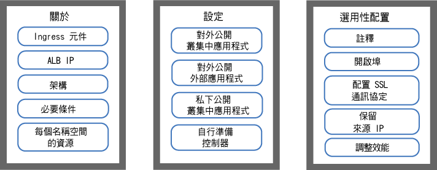
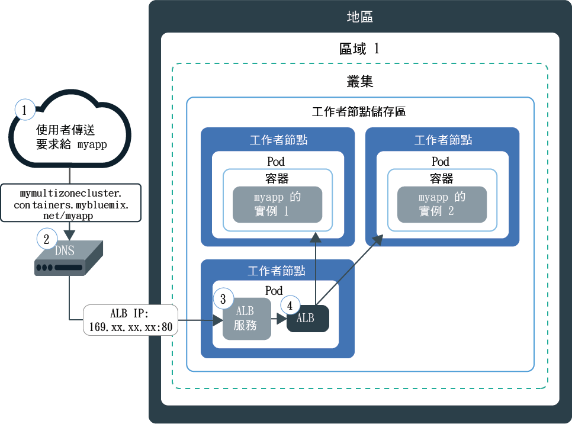
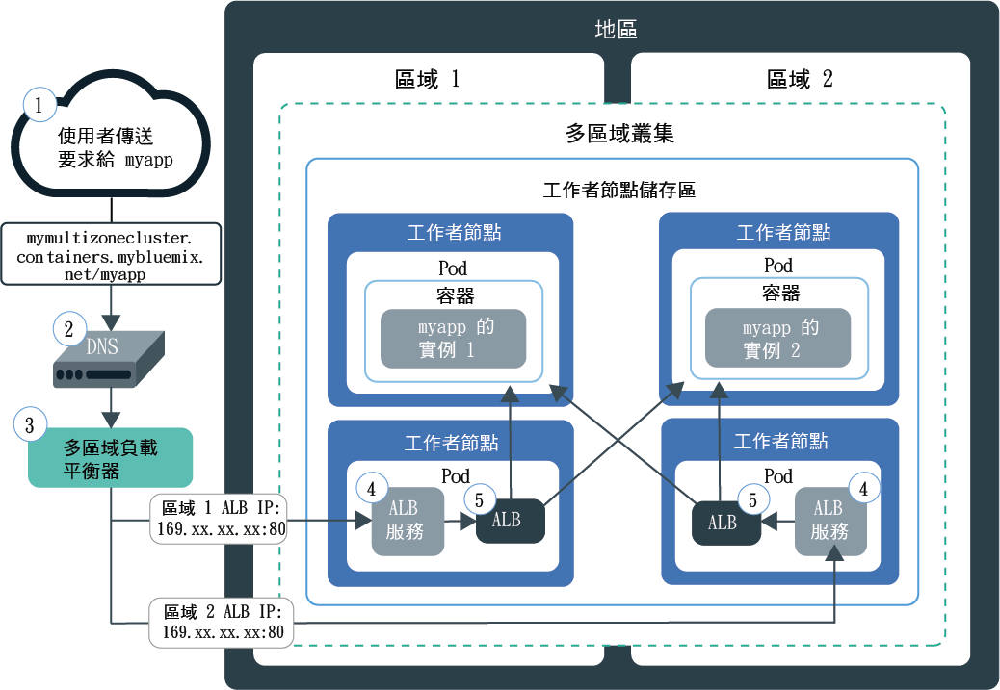
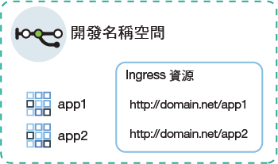
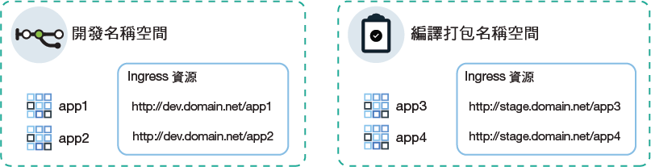
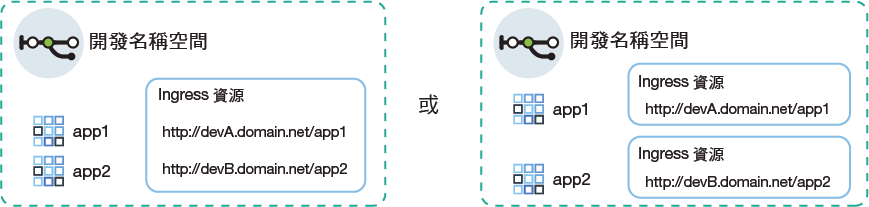

---

copyright:
  years: 2014, 2019
lastupdated: "2019-06-12"

keywords: kubernetes, iks, nginx, ingress controller

subcollection: containers

---

{:new_window: target="_blank"}
{:shortdesc: .shortdesc}
{:screen: .screen}
{:pre: .pre}
{:table: .aria-labeledby="caption"}
{:codeblock: .codeblock}
{:tip: .tip}
{:note: .note}
{:important: .important}
{:deprecated: .deprecated}
{:download: .download}
{:preview: .preview}


# 使用 Ingress 應用程式負載平衡器 (ALB) 的 HTTPS 負載平衡
{: #ingress}

藉由在 {{site.data.keyword.containerlong}} 中建立由 IBM 提供的應用程式負載平衡器所管理的 Ingress 資源，來公開 Kubernetes 叢集裡的多個應用程式。
{:shortdesc}



<map name="image-map">
    <area target="" alt="Ingress 元件" title="Ingress 元件" href="#ingress_components" coords="28,42,172,69" shape="rect">
    <area target="" alt="ALB IP" title="ALB IP" href="#ips" coords="27,79,171,104" shape="rect">
    <area target="" alt="架構" title="架構" href="#architecture-single" coords="31,114,171,140" shape="rect">
    <area target="" alt="必要條件" title="必要條件" href="#config_prereqs" coords="28,151,171,176" shape="rect">
    <area target="" alt="規劃單一或多個名稱空間的網路" title="規劃單一或多個名稱空間的網路" href="#multiple_namespaces" coords="31,191,172,229" shape="rect">
    <area target="" alt="將叢集內的應用程式公開給大眾使用" title="將叢集內的應用程式公開給大眾使用" href="#ingress_expose_public" coords="275,43,418,78" shape="rect">
    <area target="" alt="將叢集外的應用程式公開給大眾使用" title="將叢集外的應用程式公開給大眾使用" href="#external_endpoint" coords="275,94,419,128" shape="rect">
    <area target="" alt="將應用程式公開給專用網路使用" title="將應用程式公開給專用網路使用" href="#ingress_expose_private" coords="277,141,418,177" shape="rect">
    <area target="" alt="使用您自己的 Ingress 控制器" title="使用您自己的 Ingress 控制器" href="#user_managed" coords="278,192,416,228" shape="rect">
    <area target="" alt="自訂包含註釋的 Ingress 資源" title="自訂包含註釋的 Ingress 資源" href="#annotations" coords="523,44,670,73" shape="rect">
    <area target="" alt="開啟 Ingress ALB 中的埠" title="開啟 Ingress ALB 中的埠" href="#opening_ingress_ports" coords="521,83,669,105" shape="rect">
    <area target="" alt="配置 HTTP 層次的 SSL 通訊協定及 SSL 密碼" title="配置 HTTP 層次的 SSL 通訊協定及 SSL 密碼" href="#ssl_protocols_ciphers" coords="523,116,669,158" shape="rect">
    <area target="" alt="保留來源 IP 位址" title="保留來源 IP 位址" href="#preserve_source_ip" coords="522,167,671,202" shape="rect">
    <area target="" alt="調整 ALB 效能" title="調整 ALB 效能" href="#perf_tuning" coords="524,213,669,237" shape="rect">
</map>

## 範例 YAML
{: #sample_ingress}

使用這些範例 YAML 檔案，以快速開始指定 Ingress 資源。
{: shortdesc}

**用來對大眾公開應用程式的 Ingress 資源**</br>

您是否已完成下列動作？
- 部署應用程式
- 建立應用程式服務
- 選取網域名稱和 TLS 密碼

您可以使用下列部署 YAML 來建立 Ingress 資源：

```
apiVersion: extensions/v1beta1
kind: Ingress
metadata:
  name: myingressresource
spec:
  tls:
  - hosts:
    - <domain>
    secretName: <tls_secret_name>
  rules:
  - host: <domain>
    http:
      paths:
      - path: /<app1_path>
        backend:
          serviceName: <app1_service>
          servicePort: 80
      - path: /<app2_path>
        backend:
          serviceName: <app2_service>
          servicePort: 80
```
{: codeblock}

</br>

**用來私下公開應用程式的 Ingress 資源**</br>

您是否已完成下列動作？
- 啟用專用 ALB
- 部署應用程式
- 建立應用程式服務
- 登錄自訂網域名稱和 TLS 密碼

您可以使用下列部署 YAML 來建立 Ingress 資源：

```
apiVersion: extensions/v1beta1
kind: Ingress
metadata:
  name: myingressresource
  annotations:
    ingress.bluemix.net/ALB-ID: "<private_ALB_ID_1>;<private_ALB_ID_2>"
spec:
  tls:
  - hosts:
    - <domain>
    secretName: <tls_secret_name>
  rules:
  - host: <domain>
    http:
      paths:
      - path: /<app1_path>
        backend:
          serviceName: <app1_service>
          servicePort: 80
      - path: /<app2_path>
        backend:
          serviceName: <app2_service>
          servicePort: 80
```
{: codeblock}

<br />


## 何謂 Ingress？
{: #planning}

Ingress 是一種 Kubernetes 服務，可將公用或專用要求轉遞給您的應用程式，以平衡叢集裡的網路資料流量工作負載。您可以使用 Ingress 將多個應用程式服務公開給大眾使用，或是使用唯一的公用或專用路徑公開給專用網路。
{:shortdesc}

### Ingress 包含哪些東西？
{: #ingress_components}

Ingress 包含三個元件：
<dl>
<dt>Ingress 資源</dt>
<dd>若要使用 Ingress 公開應用程式，您必須為應用程式建立 Kubernetes 服務，並藉由定義 Ingress 資源，向 Ingress 登錄此服務。Ingress 資源是一項 Kubernetes 資源，它定義如何遞送應用程式送入要求的規則。Ingress 資源也指定您應用程式服務的路徑，這會附加到公用路徑，以形成唯一應用程式 URL，例如 `mycluster.us-south.containers.appdomain.cloud/myapp1`。<p class="note">自 2018 年 5 月24 日開始，已變更新叢集的 Ingress 子網域格式。會根據建立叢集的區域，產生新子網域格式中所含的地區或區域名稱。如果您的管線相依於一致的應用程式網域名稱，則可以使用自己的自訂網域，而非 IBM 提供的 Ingress 子網域。<ul><li>在 2018 年 5 月 24 日之後建立的所有叢集都會獲指派新格式的子網域，即 <code>&lt;cluster_name&gt;.&lt;region_or_zone&gt;.containers.appdomain.cloud</code>。</li><li>在 2018 年 5 月 24 日之前建立的單一區域叢集會繼續使用舊格式的已指派子網域，即 <code>&lt;cluster_name&gt;.&lt;region&gt;.containers.mybluemix.net</code>。</li><li>如果您在第一次[將區域新增至叢集](/docs/containers?topic=containers-add_workers#add_zone)時，將 2018 年 5 月 24 日之前建立的單一區域叢集變更為多區域，則叢集會繼續使用舊格式 <code>&lt;cluster_name&gt;.&lt;region&gt;.containers.mybluemix.net</code> 的已指派子網域，且會獲指派新格式 <code>&lt;cluster_name&gt;.&lt;region_or_zone&gt;.containers.appdomain.cloud</code> 的子網域。您可以使用任一種子網域。</li></ul></p>**多區域叢集**：Ingress 資源為廣域，而多區域叢集的每個名稱空間只需要一個 Ingress 資源。</dd>
<dt>應用程式負載平衡器 (ALB)</dt>
<dd>應用程式負載平衡器 (ALB) 是一種外部負載平衡器，負責接聽送入的 HTTP、HTTPS 或 TCP 服務要求。ALB 接著會根據 Ingress 資源中所定義的規則，將要求轉遞至適當的應用程式 Pod。當您建立標準叢集時，{{site.data.keyword.containerlong_notm}} 會為叢集自動建立高可用性的 ALB，並將唯一的公用路徑指派給它。公用路徑會鏈結至在建立叢集期間佈建至 IBM Cloud 基礎架構 (SoftLayer) 帳戶的可攜式公用 IP 位址。也會自動建立預設專用 ALB，但不會自動啟用它。<br></br>**多區域叢集**：當您將區域新增至叢集時，會新增一個可攜式公用子網路，並在該區域的子網路上自動建立及啟用新的公用 ALB。叢集裡的所有預設公用 ALB 都會共用一個公用路徑，但具有不同的 IP 位址。也會自動在每一個區域中建立預設專用 ALB，但不會自動予以啟用。</dd>
<dt>多區域負載平衡器 (MZLB)</dt>
<dd><p>**多區域叢集**：每當您建立多區域叢集或[將區域新增至單一區域叢集](/docs/containers?topic=containers-add_workers#add_zone)時，就會自動建立和部署 Cloudflare 多區域負載平衡器 (MZLB)，使每個地區有 1 個 MZLB。MZLB 會將 ALB 的 IP 位址放置在相同的子網域後面，並對這些 IP 位址啟用性能檢查，以判斷是否可以使用它們。例如，如果您在美國東部地區的 3 個區域有工作者節點，則子網域 `yourcluster.us-east.containers.appdomain.cloud` 具有 3 個 ALB IP 位址。MZLB 性能檢查會檢查地區中每一個區域的公用 ALB IP，並根據這些性能檢查來更新 DNS 查閱結果。例如，如果您的 ALB 具有 IP 位址 `1.1.1.1`、`2.2.2.2` 及 `3.3.3.3`，則 Ingress 子網域的正常作業 DNS 查閱會傳回所有 3 個 IP，用戶端會隨機存取其中之一。如果由於區域故障等任何原因而導致無法使用具有 IP 位址 `3.3.3.3` 的 ALB，則該區域的性能檢查會失敗、MZLB 會從子網域移除失敗的 IP，而 DNS 查閱只會傳回健全的 `1.1.1.1` 和 `2.2.2.2` ALB IP。子網域的存活時間 (TTL) 為 30 秒，因此在 30 秒之後，新的用戶端應用程式只能存取其中一個可用的健全 ALB IP。</p><p>在少數情況下，部分 DNS 解析器或用戶端應用程式可能會在 30 秒的 TTL 之後繼續使用不健全 ALB IP。這些用戶端應用程式可能會經歷較長的載入時間，直到用戶端應用程式放棄 `3.3.3.3` IP，而嘗試連接至 `1.1.1.1` 或 `2.2.2.2` 為止。視用戶端瀏覽器或用戶端應用程式設定而定，延遲範圍可能會從幾秒鐘到整個 TCP 逾時。</p>
<p>MZLB 會針對僅使用 IBM 提供之 Ingress 子網域的公用 ALB 進行負載平衡。如果您僅使用專用 ALB，則必須手動檢查 ALB 的性能，並更新 DNS 查閱結果。如果您使用的公用 ALB 使用自訂網域，則可以在 MZLB 負載平衡時包括 ALB，方法是在 DNS 項目中建立 CNAME，以將來自自訂網域的要求轉遞至叢集裡由 IBM 提供的 Ingress 子網域。</p>
<p class="note">如果您使用 Calico DNAT 前網路原則封鎖 Ingress 服務的所有送入資料流量，則也必須將用來檢查 ALB 性能的 <a href="https://www.cloudflare.com/ips/">Cloudflare 的 IPv4 IP </a> 列入白名單。如需如何建立 Calico DNAT 前原則以將這些 IP 列入白名單的步驟，請參閱 <a href="/docs/containers?topic=containers-policy_tutorial#lesson3">Calico 網路原則指導教學</a>的課程 3。</p></dd>
</dl>

### 如何將 IP 指派給 Ingress ALB？
{: #ips}

當您建立標準叢集時，{{site.data.keyword.containerlong_notm}} 會自動佈建 1 個可攜式公用子網路及 1 個可攜式專用子網路。依預設，叢集會自動使用：
* 針對預設公用 Ingress ALB，來自可攜式公用子網路的 1 個可攜式公用 IP 位址。
* 針對預設專用 Ingress ALB，來自可攜式專用子網路的 1 個可攜式專用 IP 位址。
{: shortdesc}

如果您有多區域叢集，則會在每個區域中自動建立一個預設公用 ALB 及一個預設專用 ALB。預設公用 ALB 的 IP 位址全部都在叢集的相同 IBM 提供的子網域後面。

可攜式公用及專用 IP 位址是靜態浮動 IP，而且不會在移除工作者節點時變更。如果移除工作者節點，則持續監視 IP 的 `Keepalived` 常駐程式會自動將該工作者節點上的 ALB Pod 重新排定至該區域中的另一個工作者節點。重新排定的 ALB Pod 會保留相同的靜態 IP 位址。對於叢集的使用期限，每個區域中的 ALB IP 位址都不會變更。如果您從叢集移除區域，則會移除該區域的 ALB IP 位址。

若要查看指派給 ALB 的 IP，您可以執行下列指令。
```
     ibmcloud ks albs --cluster <cluster_name_or_id>
     ```
{: pre}

如需 ALB IP 在區域失敗時發生什麼情況的相關資訊，請參閱[多區域負載平衡器元件](#ingress_components)的定義。


### 如何透過單一區域叢集裡的 Ingress 讓要求傳入我的應用程式？
{: #architecture-single}


下圖顯示 Ingress 如何在單一區域叢集裡將通訊從網際網路導向至應用程式：



1. 使用者會藉由存取應用程式的 URL，將要求傳送給您的應用程式。此 URL 是您公開之應用程式的公用 URL，並附加 Ingress 資源路徑，例如 `mycluster.us-south.containers.appdomain.cloud/myapp`。

2. DNS 系統服務會將 URL 中的子網域解析為叢集裡用於公開 ALB 之負載平衡器的可攜式公用 IP 位址。

3. 根據已解析 IP 位址，用戶端會將要求傳送至用於公開 ALB 的負載平衡器服務。

4. 負載平衡器服務會將要求遞送至 ALB。

5. ALB 會檢查叢集裡是否有 `myapp` 路徑的遞送規則。如果找到相符規則，則會根據您在 Ingress 資源中定義的規則，將要求轉遞至應用程式部署所在的 Pod。套件的來源 IP 位址會變更為應用程式 Pod 執行所在之工作者節點的公用 IP 位址的 IP 位址。如果叢集裡已部署多個應用程式實例，則 ALB 負載會平衡應用程式 Pod 之間的要求。

### 如何透過多區域叢集裡的 Ingress 讓要求傳入我的應用程式？
{: #architecture-multi}

下圖顯示 Ingress 如何在多區域叢集裡將通訊從網際網路導向至應用程式：



1. 使用者會藉由存取應用程式的 URL，將要求傳送給您的應用程式。此 URL 是您公開之應用程式的公用 URL，並附加 Ingress 資源路徑，例如 `mycluster.us-south.containers.appdomain.cloud/myapp`。

2. DNS 系統服務（其作為廣域負載平衡器）會將 URL 中的子網域解析為 MZLB 報告為性能良好的可用 IP 位址。MZLB 會持續檢查負載平衡器服務的可攜式公用 IP 位址，其將公開叢集裡每一個區域的公用 ALB。IP 位址是以循環式週期進行解析，確保在各種區域的性能良好 ALB 之間平均地負載平衡要求。

3. 用戶端會將要求傳送至用於公開 ALB 之負載平衡器服務的 IP 位址。

4. 負載平衡器服務會將要求遞送至 ALB。

5. ALB 會檢查叢集裡是否有 `myapp` 路徑的遞送規則。如果找到相符規則，則會根據您在 Ingress 資源中定義的規則，將要求轉遞至應用程式部署所在的 Pod。套件的來源 IP 位址會變更為應用程式 Pod 執行所在之工作者節點的公用 IP 位址。如果叢集裡已部署多個應用程式實例，則 ALB 會負載平衡所有區域之應用程式 Pod 之間的要求。

<br />


## 必要條件
{: #config_prereqs}

在開始使用 Ingress 之前，請檢閱下列必要條件。
{:shortdesc}

**所有 Ingress 配置的必要條件：**
- Ingress 僅適用於標準叢集，而且每個區域都至少需要兩個工作者節點才能確保高可用性，並且套用定期更新。如果區域中只有一個工作者節點，則 ALB 無法接收自動更新項目。將自動更新項目推出至 ALB Pod 時，會重新載入 Pod。不過，ALB Pod 具有反親緣性規則，確保僅將一個 Pod 排定至每個工作者節點，以達到高可用性。因為一個工作者節點上只有一個 ALB Pod，所以不會重新啟動 Pod，因此不會岔斷資料流量。只有在手動刪除舊 Pod 以排定新的已更新 Pod 時，才會將 ALB Pod 更新為最新版本。
- 設定 Ingress 需要下列 [{{site.data.keyword.Bluemix_notm}} IAM 角色](/docs/containers?topic=containers-users#platform)：
    - 叢集的**管理者**平台角色
    - 所有名稱空間中的**管理員**服務角色

**在多區域叢集裡使用 Ingress 的必要條件**：
 - 如果您將網路資料流量限制為[邊緣工作者節點](/docs/containers?topic=containers-edge)，則必須在每一個區域中至少啟用 2 個邊緣工作者節點，以取得 Ingress Pod 的高可用性。[建立邊緣節點工作者節點儲存區](/docs/containers?topic=containers-add_workers#add_pool)，以跨越叢集裡的所有區域，而每個區域至少具有 2 個工作者節點。
 - 如果您的叢集具有多個 VLAN、同一個 VLAN 上有多個子網路，或者是您具有多區域叢集，則必須為您的 IBM Cloud 基礎架構 (SoftLayer) 帳戶啟用[虛擬路由器功能 (VRF)](/docs/infrastructure/direct-link?topic=direct-link-overview-of-virtual-routing-and-forwarding-vrf-on-ibm-cloud#overview-of-virtual-routing-and-forwarding-vrf-on-ibm-cloud)，讓工作者節點可以在專用網路上彼此通訊。若要啟用 VRF，[請與 IBM Cloud 基礎架構 (SoftLayer) 客戶代表聯絡](/docs/infrastructure/direct-link?topic=direct-link-overview-of-virtual-routing-and-forwarding-vrf-on-ibm-cloud#how-you-can-initiate-the-conversion)。如果您無法或不想要啟用 VRF，請啟用 [VLAN Spanning](/docs/infrastructure/vlans?topic=vlans-vlan-spanning#vlan-spanning)。若要執行此動作，您需要**網路 > 管理網路 VLAN Spanning** [基礎架構許可權](/docs/containers?topic=containers-users#infra_access)，或者您可以要求帳戶擁有者啟用它。若要確認是否已啟用 VLAN Spanning，請使用 `ibmcloud ks vlan-spanning-get --region <region>` [指令](/docs/containers?topic=containers-cli-plugin-kubernetes-service-cli#cs_vlan_spanning_get)。
 - 如果發生區域故障，您可能會在該區域內 Ingress ALB 的要求中看到間歇性失敗。

<br />


## 規劃單一或多個名稱空間的網路
{: #multiple_namespaces}

每個名稱空間都需要一個 Ingress 資源，而您在此名稱空間中具有要公開的應用程式。
{:shortdesc}

### 所有應用程式都位於一個名稱空間中
{: #one-ns}

如果叢集裡的應用程式全部都位於相同的名稱空間，則需要一個 Ingress 資源，才能針對該處公開的應用程式定義遞送規則。例如，如果您具有由開發名稱空間中之服務公開的 `app1` 及 `app2`，則可以在名稱空間中建立 Ingress 資源。此資源會指定 `domain.net` 作為主機，並使用 `domain.net` 登錄每一個應用程式接聽所在的路徑。
{: shortdesc}



### 應用程式位於多個名稱空間中
{: #multi-ns}

如果叢集裡的應用程式位於不同的名稱空間中，則每個名稱空間必須建立一個資源，才能針對該處公開的應用程式定義規則。
{: shortdesc}

不過，您只能在一個資源中定義主機名稱。您不能在多個資源中定義相同的主機名稱。若要使用相同的主機名稱來登錄多個 Ingress 資源，則必須使用萬用字元網域。登錄 `*.domain.net` 這類萬用字元網域時，可以將多個子網域全部都解析為相同的主機。然後，您可以在每一個名稱空間中建立 Ingress 資源，並在每一個 Ingress 資源中指定不同的子網域。


例如，請考量下列情境：
* 基於測試目的，您有相同應用程式的兩個版本，即 `app1` 及 `app3`。
* 您可以將相同叢集內兩個不同名稱空間中的應用程式（`app1`）部署至開發名稱空間，並將 `app3` 部署至暫置名稱空間。

若要使用相同的叢集 ALB 來管理這些應用程式的資料流量，請建立下列服務及資源：
* 開發名稱空間中要公開 `app1` 的 Kubernetes 服務。
* 開發名稱空間中將主機指定為 `dev.domain.net` 的 Ingress 資源。
* 暫置名稱空間中要公開 `app3` 的 Kubernetes 服務。
* 暫置名稱空間中將主機指定為 `stage.domain.net` 的 Ingress 資源。
</br>



現在，兩個 URL 都已解析為相同網域，因此同時由相同的 ALB 服務。不過，因為暫置名稱空間中的資源是使用 `stage` 子網域進行登錄的，所以 Ingress ALB 會正確地將 `stage.domain.net/app3` URL 中的要求僅遞送至 `app3`。

{: #wildcard_tls}
IBM 提供的 Ingress 子網域萬用字元 `*.<cluster_name>.<region>.containers.appdomain.cloud`，依預設是針對您的叢集所登錄的。IBM 提供的 TLS 憑證是萬用字元憑證，可用於萬用字元子網域。如果您要使用自訂網域，則必須將自訂網域登錄為萬用字元網域，例如 `*.custom_domain.net`。若要使用 TLS，您必須取得萬用字元憑證。
{: note}

### 名稱空間內的多個網域
{: #multi-domains}

在個別名稱空間內，您可以使用一個網域來存取名稱空間中的所有應用程式。如果您想要針對個別名稱空間內的應用程式使用不同網域，請使用萬用字元網域。登錄 `*.mycluster.us-south.containers.appdomain.cloud` 之類的萬用字元網域時，多個子網域會全部解析為相同的主機。然後，您可以使用一個資源來指定該資源內的多個子網域主機。或者，您也可以在名稱空間中建立多個 Ingress 資源，並在每一個 Ingress 資源中指定不同的子網域。
{: shortdesc}



IBM 提供的 Ingress 子網域萬用字元 `*.<cluster_name>.<region>.containers.appdomain.cloud`，依預設是針對您的叢集所登錄的。IBM 提供的 TLS 憑證是萬用字元憑證，可用於萬用字元子網域。如果您要使用自訂網域，則必須將自訂網域登錄為萬用字元網域，例如 `*.custom_domain.net`。若要使用 TLS，您必須取得萬用字元憑證。
{: note}

<br />


## 將叢集內的應用程式公開給大眾使用
{: #ingress_expose_public}

使用公用 Ingress ALB，將叢集內的應用程式公開給大眾使用。
{:shortdesc}

開始之前：

* 檢閱 Ingress [必要條件](#config_prereqs)。
* [登入您的帳戶。適用的話，請將適當的資源群組設為目標。設定叢集的環境定義。](/docs/containers?topic=containers-cs_cli_install#cs_cli_configure)

### 步驟 1：部署應用程式並建立應用程式服務
{: #public_inside_1}

首先，部署您的應用程式並建立 Kubernetes 服務來公開它們。
{: shortdesc}

1.  [將應用程式部署至叢集](/docs/containers?topic=containers-app#app_cli)。請確定您已將標籤新增至您部署中配置檔的 meta 資料區段，例如 `app: code`。此標籤是識別您應用程式執行所在之所有 Pod 的必要項目，如此才能將 Pod 包含在 Ingress 負載平衡中。

2.   針對您要公開的每一個應用程式建立 Kubernetes 服務。您的應用程式必須由 Kubernetes 服務公開，才能由叢集 ALB 包含在 Ingress 負載平衡中。
      1.  例如，開啟偏好的編輯器，然後建立名稱為 `myappservice.yaml` 的服務配置檔。
      2.  針對 ALB 將公開的應用程式定義服務。

          ```
          apiVersion: v1
          kind: Service
          metadata:
            name: myappservice
          spec:
            selector:
              <selector_key>: <selector_value>
            ports:
             - protocol: TCP
               port: 8080
          ```
          {: codeblock}

          <table>
          <thead>
          <th colspan=2> 瞭解 ALB 服務 YAML 檔案元件</th>
          </thead>
          <tbody>
          <tr>
          <td><code>selector</code></td>
          <td>輸入標籤索引鍵 (<em>&lt;selector_key&gt;</em>) 及值 (<em>&lt;selector_value&gt;</em>) 配對，您想要用來將應用程式執行所在的 Pod 設為目標。若要將 Pod 設為目標，並在服務負載平衡中包括它們，請確保 <em>&lt;selector_key&gt;</em> 和 <em>&lt;selector_value&gt;</em> 與部署 YAML 的 <code>spec.template.metadata.labels</code> 區段中的鍵值組相同。</td>
           </tr>
           <tr>
           <td><code>port</code></td>
           <td>服務所接聽的埠。</td>
           </tr>
           </tbody></table>
      3.  儲存變更。
      4.  在叢集裡建立服務。如果應用程式部署在叢集的多個名稱空間中，請確保服務會部署至與您要公開之應用程式相同的名稱空間。

          ```
          kubectl apply -f myappservice.yaml [-n <namespace>]
          ```
          {: pre}
      5.  針對每個您要公開的應用程式，重複這些步驟。


### 步驟 2：選取應用程式網域
{: #public_inside_2}

配置公用 ALB 時，請選擇將可透過其存取您應用程式的網域。
{: shortdesc}

您可以使用 IBM 提供的網域（例如 `mycluster-12345.us-south.containers.appdomain.cloud/myapp`），從網際網路存取您的應用程式。若要改用自訂網域，您可以設定 CNAME 記錄以將自訂網域對映至 IBM 提供的網域，或搭配使用 DNS 提供者與 ALB 的公用 IP 位址來設定 A 記錄。

**若要使用 IBM 提供的 Ingress 網域，請執行下列動作：**

取得 IBM 提供的子網域。將 `<cluster_name_or_ID>` 取代為已在其中部署應用程式的叢集名稱。
```
ibmcloud ks cluster-get --cluster <cluster_name_or_ID> | grep Ingress
```
{: pre}

輸出範例：
```
Ingress Subdomain:      mycluster-12345.us-south.containers.appdomain.cloud
Ingress Secret:         <tls_secret>
```
{: screen}

**若要使用自訂網域，請執行下列動作：**
1.    建立自訂網域。若要登錄自訂網域，請使用「網域名稱服務 (DNS)」提供者或 [{{site.data.keyword.Bluemix_notm}} DNS](/docs/infrastructure/dns?topic=dns-getting-started)。
      * 如果您要 Ingress 公開的應用程式位於某叢集內不同的名稱空間中，請將自訂網域登錄為萬用字元網域，例如 `*.custom_domain.net`。

2.  配置網域，將送入的網路資料流量遞送至 IBM 提供的 ALB。請從下列選項中進行選擇：
    -   將 IBM 提供的網域指定為「標準名稱記錄 (CNAME)」，以定義自訂網域的別名。若要尋找 IBM 提供的 Ingress 網域，請執行 `ibmcloud ks cluster-get --cluster <cluster_name>`，並尋找 **Ingress subdomain** 欄位。最好使用 CNAME，因為 IBM 會對 IBM 子網域提供自動性能檢查，並從 DNS 回應移除任何失敗的 IP。
    -   將您的自訂網域對映至 IBM 提供的 ALB 的可攜式公用 IP 位址，方法是將 IP 位址新增為記錄。若要尋找 ALB 的可攜式公用 IP 位址，請執行 `ibmcloud ks alb-get --albID <public_alb_ID>`。

### 步驟 3：選取 TLS 終止
{: #public_inside_3}

在選擇應用程式網域之後，請選擇是否使用 TLS 終止。
{: shortdesc}

ALB 會對叢集裡應用程式的 HTTP 網路資料流量進行負載平衡。若要同時對送入的 HTTPS 連線進行負載平衡，您可以配置 ALB 來解密網路資料流量，並將解密的要求轉遞至叢集裡公開的應用程式。

* 如果您使用 IBM 提供的 Ingress 子網域，則可以使用 IBM 提供的 TLS 憑證。IBM 提供的 TLS 憑證是由 LetsEncrypt 所簽署，並且由 IBM 完全管理。憑證每 90 天到期，並且會在到期之前的 37 天自動更新。如需萬用字元 TLS 憑證的相關資訊，請參閱[此附註](#wildcard_tls)。
* 如果您使用自訂網域，則可以使用自己的 TLS 憑證來管理 TLS 終止。ALB 會先檢查應用程式所在名稱空間中的密碼，接著檢查 `default`，最後檢查 `ibm-cert-store`。如果您只在一個名稱空間中有應用程式，則可以針對該相同名稱空間中的憑證匯入或建立 TLS 密碼。如果您在多個名稱空間中有應用程式，則可以針對 `default` 名稱空間中的憑證匯入或建立 TLS 密碼，讓 ALB 可以在每個名稱空間中存取及使用憑證。在您針對每個名稱空間所定義的 Ingress 資源中，指定 default 名稱空間中密碼的名稱。如需萬用字元 TLS 憑證的相關資訊，請參閱[此附註](#wildcard_tls)。**附註**：不支援包含預先共用金鑰 (TLS-PSK) 的 TLS 憑證。

**如果您使用 IBM 提供的 Ingress 網域，請執行下列動作：**

為您的叢集取得 IBM 提供的 TLS 密碼。
```
ibmcloud ks cluster-get --cluster <cluster_name_or_ID> | grep Ingress
```
{: pre}

輸出範例：
```
Ingress Subdomain:      mycluster-12345.us-south.containers.appdomain.cloud
Ingress Secret:         <tls_secret>
```
{: screen}
</br>

**如果您使用自訂網域，請執行下列動作：**

如果 TLS 憑證儲存在您要使用的 {{site.data.keyword.cloudcerts_long_notm}} 中，您可以執行下列指令，將其相關聯的密碼匯入至叢集裡：

```
ibmcloud ks alb-cert-deploy --secret-name <secret_name> --cluster <cluster_name_or_ID> --cert-crn <certificate_crn>
```
{: pre}

請確定您未使用與 IBM 提供的 Ingress 密碼相同的名稱來建立密碼。您可以執行 `ibmcloud ks cluster-get --cluster <cluster_name_or_ID> | grep Ingress`，以取得 IBM 提供的 Ingress 密碼名稱。
{: note}

當您使用這個指令來匯入憑證時，會在名稱為 `ibm-cert-store` 的名稱空間中建立憑證密碼。然後，會在 `default` 名稱空間中建立此密碼的參照，任何名稱空間中的任何 Ingress 資源都可以存取它。ALB 處理要求時，會遵循此參照來挑選及使用 `ibm-cert-store` 名稱空間中的憑證密碼。

</br>

如果您沒有 TLS 憑證，請遵循下列步驟：
1. 從憑證提供者產生憑證管理中心 (CA) 憑證及金鑰。如果您有自己的網域，請為您的網域購買正式的 TLS 憑證。請確定每一個憑證的 [CN ](https://support.dnsimple.com/articles/what-is-common-name/) 都不同。
2. 將憑證及金鑰轉換為 Base-64。
   1. 將憑證及金鑰編碼為 Base-64，並將 Base-64 編碼值儲存在新的檔案中。
      ```
      openssl base64 -in tls.key -out tls.key.base64
      ```
      {: pre}

   2. 檢視憑證及金鑰的 Base-64 編碼值。
      ```
      cat tls.key.base64
      ```
      {: pre}

3. 使用憑證及金鑰，以建立密碼 YAML 檔案。
     ```
     apiVersion: v1
     kind: Secret
     metadata:
       name: ssl-my-test
     type: Opaque
     data:
       tls.crt: <client_certificate>
       tls.key: <client_key>
     ```
     {: codeblock}

4. 建立憑證作為 Kubernetes 密碼。
     ```
     kubectl create -f ssl-my-test
     ```
     {: pre}
     請確定您未使用與 IBM 提供的 Ingress 密碼相同的名稱來建立密碼。您可以執行 `ibmcloud ks cluster-get --cluster <cluster_name_or_ID> | grep Ingress`，以取得 IBM 提供的 Ingress 密碼名稱。
     {: note}


### 步驟 4：建立 Ingress 資源
{: #public_inside_4}

Ingress 資源會定義 ALB 用來將資料流量遞送至應用程式服務的遞送規則。
{: shortdesc}

如果您的叢集有多個公開應用程式的名稱空間，則每個名稱空間都需要一個 Ingress 資源。不過，每一個名稱空間都必須使用不同的主機。您必須登錄萬用字元網域，並在每一個資源中指定不同的子網域。如需相關資訊，請參閱[規劃單一或多個名稱空間的網路](#multiple_namespaces)。
{: note}

1. 例如，開啟偏好的編輯器，然後建立名稱為 `myingressresource.yaml` 的 Ingress 配置檔。

2. 在配置檔中定義 Ingress 資源，以使用 IBM 提供的網域或您的自訂網域，將送入的網路資料流量遞送至您先前建立的服務。

    不使用 TLS 的範例 YAML：
    ```
    apiVersion: extensions/v1beta1
    kind: Ingress
    metadata:
      name: myingressresource
    spec:
      rules:
      - host: <domain>
        http:
          paths:
          - path: /<app1_path>
            backend:
              serviceName: <app1_service>
              servicePort: 80
          - path: /<app2_path>
            backend:
              serviceName: <app2_service>
              servicePort: 80
    ```
    {: codeblock}

    使用 TLS 的範例 YAML：
    ```
    apiVersion: extensions/v1beta1
    kind: Ingress
    metadata:
      name: myingressresource
    spec:
      tls:
      - hosts:
        - <domain>
        secretName: <tls_secret_name>
      rules:
      - host: <domain>
        http:
          paths:
          - path: /<app1_path>
            backend:
              serviceName: <app1_service>
              servicePort: 80
          - path: /<app2_path>
            backend:
              serviceName: <app2_service>
              servicePort: 80
    ```
    {: codeblock}

    <table>
    <thead>
    <th colspan=2> 瞭解 YAML 檔案元件</th>
    </thead>
    <tbody>
    <tr>
    <td><code>tls.hosts</code></td>
    <td>若要使用 TLS，請將 <em>&lt;domain&gt;</em> 取代為 IBM 提供的 Ingress 子網域或您的自訂網域。

    </br></br>
    <strong>附註：</strong><ul><li>如果您的應用程式是由某個叢集裡不同名稱空間的服務公開，請將萬用字元子網域附加至網域的開頭，例如 `subdomain1.custom_domain.net` 或 `subdomain1.mycluster.us-south.containers.appdomain.cloud`。針對您在叢集裡建立的每一個資源使用唯一的子網域。</li><li>請不要使用 &ast; 作為您的主機，也不要讓主機內容保留為空白，以避免建立 Ingress 期間發生失敗。</li></ul></td>
    </tr>
    <tr>
    <td><code>tls.secretName</code></td>
    <td><ul><li>如果您使用 IBM 提供的 Ingress 網域，請將 <em>&lt;tls_secret_name&gt;</em> 取代為 IBM 提供的 Ingress 密碼的名稱。</li><li>如果您使用自訂網域，請將 <em>&lt;tls_secret_name&gt;</em> 取代為您先前建立的密碼，此密碼會保留您的自訂 TLS 憑證及金鑰。如果您已從 {{site.data.keyword.cloudcerts_short}} 匯入憑證，則可以執行 <code>ibmcloud ks alb-cert-get --cluster <cluster_name_or_ID> --cert-crn <certificate_crn></code>，來查看與 TLS 憑證相關聯的密碼。</li><ul><td>
    </tr>
    <tr>
    <td><code>host</code></td>
    <td>將 <em>&lt;domain&gt;</em> 取代為 IBM 提供的 Ingress 子網域或您的自訂網域。

    </br></br>
    <strong>附註：</strong><ul><li>如果您的應用程式是由某個叢集裡不同名稱空間的服務公開，請將萬用字元子網域附加至網域的開頭，例如 `subdomain1.custom_domain.net` 或 `subdomain1.mycluster.us-south.containers.appdomain.cloud`。針對您在叢集裡建立的每一個資源使用唯一的子網域。</li><li>請不要使用 &ast; 作為您的主機，也不要讓主機內容保留為空白，以避免建立 Ingress 期間發生失敗。</li></ul></td>
    </tr>
    <tr>
    <td><code>path</code></td>
    <td>將 <em>&lt;app_path&gt;</em> 取代為斜線或應用程式接聽所在的路徑。此路徑會附加至 IBM 提供的網域或您的自訂網域，以建立應用程式的唯一路徑。當您在 Web 瀏覽器中輸入此路徑時，網路資料流量就會遞送至 ALB。ALB 會查閱相關聯的服務，將網路資料流量傳送至服務。然後，服務會將資料流量轉遞至應用程式執行所在的 Pod。
    </br></br>
            許多應用程式不會接聽特定路徑，但卻使用根路徑及特定埠。在此情況下，請將根路徑定義為 <code>/</code>，並且不要為應用程式指定個別路徑。        範例：<ul><li>若為 <code>http://domain/</code>，輸入 <code>/</code> 作為路徑。</li><li>若為 <code>http://domain/app1_path</code>，輸入 <code>/app1_path</code> 作為路徑。</li></ul>
    </br>
    <strong>提示：</strong>若要配置 Ingress 接聽與應用程式所接聽路徑不同的路徑，您可以使用[重寫註釋](/docs/containers?topic=containers-ingress_annotation#rewrite-path)。</td>
    </tr>
    <tr>
    <td><code>serviceName</code></td>
    <td>將 <em>&lt;app1_service&gt;</em> 及 <em>&lt;app2_service&gt;</em> 等等，取代為您為了公開應用程式而建立的服務名稱。如果您的應用程式是由叢集裡不同名稱空間的服務公開，請只包括相同名稱空間中的應用程式服務。針對每一個您在其中具有要公開之應用程式的名稱空間，您必須建立一個 Ingress 資源。</td>
    </tr>
    <tr>
    <td><code>servicePort</code></td>
    <td>您的服務所接聽的埠。請使用您為應用程式建立 Kubernetes 服務時所定義的相同埠。</td>
    </tr>
    </tbody></table>

3.  建立叢集的 Ingress 資源。請確保資源會部署至與您已在資源中指定之應用程式服務相同的名稱空間。

    ```
    kubectl apply -f myingressresource.yaml -n <namespace>
    ```
    {: pre}
4.   驗證已順利建立 Ingress 資源。

      ```
      kubectl describe ingress myingressresource
      ```
      {: pre}

      1. 如果事件中的訊息說明資源配置中的錯誤，請變更資源檔中的值，然後重新套用該資源的檔案。


您的 Ingress 資源建立在與應用程式服務相同的名稱空間中。此名稱空間中的應用程式是利用叢集的 Ingress ALB 來登錄的。

### 步驟 5：從網際網路存取您的應用程式
{: #public_inside_5}

在 Web 瀏覽器中，輸入要存取的應用程式服務的 URL。
{: shortdesc}

```
https://<domain>/<app1_path>
```
{: codeblock}

如果您已公開多個應用程式，請變更附加至 URL 的路徑來存取那些應用程式。

```
https://<domain>/<app2_path>
```
{: codeblock}

如果您使用萬用字元網域來公開不同名稱空間中的應用程式，請使用它們自己的子網域來存取那些應用程式。

```
http://<subdomain1>.<domain>/<app1_path>
```
{: codeblock}

```
http://<subdomain2>.<domain>/<app1_path>
```
{: codeblock}


透過 Ingress 連接至應用程式時發生困難嗎？請嘗試[除錯 Ingress](/docs/containers?topic=containers-cs_troubleshoot_debug_ingress)。
{: tip}

<br />


## 將叢集外的應用程式公開給大眾使用
{: #external_endpoint}

將叢集外的應用程式公開給大眾使用，方法是在公用 Ingress ALB 負載平衡中包括它們。IBM 提供的網域或自訂網域上的送入公用要求，會自動轉遞給外部應用程式。
{: shortdesc}

開始之前：

* 檢閱 Ingress [必要條件](#config_prereqs)。
* 確定您可以使用公用 IP 位址來存取您要包含在叢集負載平衡中的外部應用程式。
* [登入您的帳戶。適用的話，請將適當的資源群組設為目標。設定叢集的環境定義。](/docs/containers?topic=containers-cs_cli_install#cs_cli_configure)

若要將叢集外的應用程式公開給大眾使用，請執行下列動作：

1.  針對將送入要求轉遞至您將建立之外部端點的叢集，建立 Kubernetes 服務。
    1.  例如，開啟偏好的編輯器，然後建立名稱為 `myexternalservice.yaml` 的服務配置檔。
    2.  針對 ALB 將公開的應用程式定義服務。

        ```
        apiVersion: v1
        kind: Service
        metadata:
          name: myexternalservice
        spec:
          ports:
           - protocol: TCP
             port: 8080
        ```
        {: codeblock}

        <table>
        <caption>瞭解 ALB 服務檔元件</caption>
        <thead>
        <th colspan=2> 瞭解 YAML 檔案元件</th>
        </thead>
        <tbody>
        <tr>
        <td><code>metadata.name</code></td>
        <td>將 <em><code>&lt;myexternalservice&gt;</code></em> 取代為您服務的名稱。<p>進一步瞭解使用 Kubernetes 資源時如何[保護個人資訊安全](/docs/containers?topic=containers-security#pi)。</p></td>
        </tr>
        <tr>
        <td><code>port</code></td>
        <td>服務所接聽的埠。</td>
        </tr></tbody></table>

    3.  儲存變更。
    4.  建立叢集的 Kubernetes 服務。

        ```
        kubectl apply -f myexternalservice.yaml
        ```
        {: pre}
2.  配置 Kubernetes 端點，以定義您要包含在叢集負載平衡中的應用程式的外部位置。
    1.  例如，開啟偏好的編輯器，然後建立名稱為 `myexternalendpoint.yaml` 的端點配置檔。
    2.  定義外部端點。請包含您可用來存取外部應用程式的所有公用 IP 位址及埠。

        ```
        kind: Endpoints
        apiVersion: v1
        metadata:
          name: myexternalendpoint
        subsets:
          - addresses:
              - ip: <external_IP1>
              - ip: <external_IP2>
            ports:
              - port: <external_port>
        ```
        {: codeblock}

        <table>
        <thead>
        <th colspan=2> 瞭解 YAML 檔案元件</th>
        </thead>
        <tbody>
        <tr>
        <td><code>name</code></td>
        <td>將 <em><code>&lt;myexternalendpoint&gt;</code></em> 取代為您先前建立的 Kubernetes 服務的名稱。</td>
        </tr>
        <tr>
        <td><code>ip</code></td>
        <td>將 <em>&lt;external_IP&gt;</em> 取代為用來連接至外部應用程式的公用 IP 位址。</td>
         </tr>
         <td><code>port</code></td>
         <td>將 <em>&lt;external_port&gt;</em> 取代為外部應用程式所接聽的埠。</td>
         </tbody></table>

    3.  儲存變更。
    4.  建立叢集的 Kubernetes 端點。

        ```
        kubectl apply -f myexternalendpoint.yaml
        ```
        {: pre}

3. 繼續進行「將叢集內的應用程式公開給大眾使用」中的步驟，即[步驟 2：選取應用程式網域](#public_inside_2)。

<br />


## 將應用程式公開給專用網路使用
{: #ingress_expose_private}

使用專用 Ingress ALB，將應用程式公開至專用網路。
{:shortdesc}

若要使用專用 ALB，您必須先啟用專用 ALB。因為僅限專用 VLAN 叢集未獲指派 IBM 提供的 Ingress 子網域，所以在設定叢集期間未建立任何 Ingress 密碼。若要將應用程式公開至專用網路，您必須使用自訂網域來登錄 ALB，並選擇性地匯入自己的 TLS 憑證。

開始之前：
* 檢閱 Ingress [必要條件](#config_prereqs)。
* 工作者節點連接至[公用及專用 VLAN](/docs/containers?topic=containers-cs_network_planning#private_both_vlans) 或[僅限專用 VLAN](/docs/containers?topic=containers-cs_network_planning#plan_private_vlan) 時，請檢閱規劃專用應用程式存取的選項。
    * 如果您的工作者節點只連接至專用 VLAN，則您必須配置[在專用網路上可用的 DNS 服務 ](https://kubernetes.io/docs/tasks/administer-cluster/dns-custom-nameservers/)。

### 步驟 1：部署應用程式並建立應用程式服務
{: #private_1}

首先，部署您的應用程式並建立 Kubernetes 服務來公開它們。
{: shortdesc}

1.  [將應用程式部署至叢集](/docs/containers?topic=containers-app#app_cli)。請確定您已將標籤新增至您部署中配置檔的 meta 資料區段，例如 `app: code`。此標籤是識別您應用程式執行所在之所有 Pod 的必要項目，如此才能將 Pod 包含在 Ingress 負載平衡中。

2.   針對您要公開的每一個應用程式建立 Kubernetes 服務。您的應用程式必須由 Kubernetes 服務公開，才能由叢集 ALB 包含在 Ingress 負載平衡中。
      1.  例如，開啟偏好的編輯器，然後建立名稱為 `myappservice.yaml` 的服務配置檔。
      2.  針對 ALB 將公開的應用程式定義服務。

          ```
          apiVersion: v1
          kind: Service
          metadata:
            name: myappservice
          spec:
            selector:
              <selector_key>: <selector_value>
            ports:
             - protocol: TCP
               port: 8080
          ```
          {: codeblock}

          <table>
          <thead>
          <th colspan=2> 瞭解 ALB 服務 YAML 檔案元件</th>
          </thead>
          <tbody>
          <tr>
          <td><code>selector</code></td>
          <td>輸入標籤索引鍵 (<em>&lt;selector_key&gt;</em>) 及值 (<em>&lt;selector_value&gt;</em>) 配對，您想要用來將應用程式執行所在的 Pod 設為目標。若要將 Pod 設為目標，並在服務負載平衡中包括它們，請確保 <em>&lt;selector_key&gt;</em> 和 <em>&lt;selector_value&gt;</em> 與部署 YAML 的 <code>spec.template.metadata.labels</code> 區段中的鍵值組相同。</td>
           </tr>
           <tr>
           <td><code>port</code></td>
           <td>服務所接聽的埠。</td>
           </tr>
           </tbody></table>
      3.  儲存變更。
      4.  在叢集裡建立服務。如果應用程式部署在叢集的多個名稱空間中，請確保服務會部署至與您要公開之應用程式相同的名稱空間。

          ```
          kubectl apply -f myappservice.yaml [-n <namespace>]
          ```
          {: pre}
      5.  針對每個您要公開的應用程式，重複這些步驟。


### 步驟 2：啟用預設專用 ALB
{: #private_ingress}

建立標準叢集時，會在您具有工作者節點的每一個區域中建立 IBM 提供的專用應用程式負載平衡器 (ALB)，並為其指派可攜式專用 IP 位址及專用路徑。不過，不會自動啟用每一個區域中的預設專用 ALB。若要使用預設專用 ALB，以對您應用程式的專用網路資料流量進行負載平衡，您必須先使用 IBM 提供的可攜式專用 IP 位址或您自己的可攜式專用 IP 位址來啟用它。
{:shortdesc}

如果您在建立叢集時使用 `--no-subnet` 旗標，則必須先新增可攜式專用子網路或使用者管理的子網路之後，您才能啟用專用 ALB。如需相關資訊，請參閱[要求叢集的其他子網路](/docs/containers?topic=containers-subnets#request)。
{: note}

**若要使用預先指派、且由 IBM 提供的可攜式專用 IP 位址來啟用預設專用 ALB，請執行下列動作：**

1. 取得您要啟用的預設專用 ALB ID。將 <em>&lt;cluster_name&gt;</em> 取代為您要公開之應用程式部署所在的叢集名稱。

    ```
    ibmcloud ks albs --cluster <cluster_name>
    ```
    {: pre}

    專用 ALB 的 **Status** 欄位為 _disabled_。
    ```
    ALB ID                                            Enabled   Status     Type      ALB IP          Zone    Build                          ALB VLAN ID
    private-crdf253b6025d64944ab99ed63bb4567b6-alb1   false     disabled   private   -               dal10   ingress:411/ingress-auth:315   2234947
    public-crdf253b6025d64944ab99ed63bb4567b6-alb1    true      enabled    public    169.xx.xxx.xxx  dal10   ingress:411/ingress-auth:315   2234945
    ```
    {: screen}
    在多區域叢集裡，ALB ID 上的編號字尾指出新增 ALB 的順序。
    * 例如，ALB `private-cr6d779503319d419aa3b4ab171d12c3b8-alb1` 上的 `-alb1` 字尾表示它是已建立的第一個預設專用 ALB。它存在於您建立叢集的區域中。在上述範例中，叢集建立於 `dal10` 中。
    * ALB `private-crb2f60e9735254ac8b20b9c1e38b649a5-alb2` 上的 `-alb2` 字尾表示它是已建立的第二個預設專用 ALB。它存在於您已新增至叢集的第二個區域中。在上述範例中，第二個區域為 `dal12`。

2. 啟用專用 ALB。將 <em>&lt;private_ALB_ID&gt;</em> 取代為專用 ALB 的 ID（來自前一個步驟中的輸出）。

   ```
   ibmcloud ks alb-configure --albID <private_ALB_ID> --enable
   ```
   {: pre}

3. **多區域叢集**：為了達到高可用性，請對每一個區域中的專用 ALB 重複上述步驟。

<br>
**若要使用您自己的可攜式專用 IP 位址來啟用專用 ALB，請執行下列動作：**

1. 配置所選擇 IP 位址之使用者管理的子網路，以遞送叢集之專用 VLAN 上的資料流量。

   ```
    ibmcloud ks cluster-user-subnet-add --cluster <cluster_name> --subnet-cidr <subnet_CIDR> --private-vlan <private_VLAN>
    ```
   {: pre}

   <table>
   <thead>
   <th colspan=2> 瞭解指令元件</th>
   </thead>
   <tbody>
   <tr>
   <td><code>&lt;cluster_name&gt;</code></td>
   <td>其中部署您要公開之應用程式的叢集名稱或 ID。</td>
   </tr>
   <tr>
   <td><code>&lt;subnet_CIDR&gt;</code></td>
   <td>使用者管理之子網路的 CIDR。</td>
   </tr>
   <tr>
   <td><code>&lt;private_VLAN_ID&gt;</code></td>
   <td>可用的專用 VLAN ID。您可以藉由執行 `ibmcloud ks vlans`，來尋找可用的專用 VLAN ID。</td>
   </tr>
   </tbody></table>

2. 列出叢集裡可用的 ALB，以取得專用 ALB 的 ID。

    ```
    ibmcloud ks albs --cluster <cluster_name>
    ```
    {: pre}

    專用 ALB 的 **Status** 欄位為 _disabled_。
    ```
    ALB ID                                            Enabled   Status     Type      ALB IP          Zone    Build                          ALB VLAN ID
    private-crdf253b6025d64944ab99ed63bb4567b6-alb1   false     disabled   private   -               dal10   ingress:411/ingress-auth:315   2234947
    public-crdf253b6025d64944ab99ed63bb4567b6-alb1    true      enabled    public    169.xx.xxx.xxx  dal10   ingress:411/ingress-auth:315   2234945
    ```
    {: screen}

3. 啟用專用 ALB。將 <em>&lt;private_ALB_ID&gt;</em> 取代為專用 ALB 的 ID（來自前一個步驟中的輸出），並將 <em>&lt;user_IP&gt;</em> 取代為您要使用之使用者所管理子網路的 IP 位址。

   ```
   ibmcloud ks alb-configure --albID <private_ALB_ID> --enable --user-ip <user_IP>
   ```
   {: pre}

4. **多區域叢集**：為了達到高可用性，請對每一個區域中的專用 ALB 重複上述步驟。

### 步驟 3：對映自訂網域
{: #private_3}

僅限專用 VLAN 叢集未獲指派 IBM 提供的 Ingress 子網域。配置專用 ALB 時，請使用自訂網域來公開應用程式。
{: shortdesc}

**僅限專用 VLAN 叢集：**

1. 如果工作者節點只連接至專用 VLAN，則您必須配置[專用網路上可用的專屬 DNS 服務 ](https://kubernetes.io/docs/tasks/administer-cluster/dns-custom-nameservers/)。
2. 透過 DNS 提供者，建立自訂網域。如果您要 Ingress 公開的應用程式位於某叢集的不同名稱空間中，請將自訂網域登錄為萬用字元網域，例如 *.custom_domain.net`。
3. 使用專用 DNS 服務，將 IP 位址新增為 A 記錄，以將自訂網域對映至 ALB 的可攜式專用 IP 位址。若要尋找 ALB 的可攜式專用 IP 位址，請為每個 ALB 執行 `ibmcloud ks alb-get --albID <private_alb_ID>`。

**專用及公用 VLAN 叢集：**

1.    建立自訂網域。若要登錄自訂網域，請使用「網域名稱服務 (DNS)」提供者或 [{{site.data.keyword.Bluemix_notm}} DNS](/docs/infrastructure/dns?topic=dns-getting-started)。
      * 如果您要 Ingress 公開的應用程式位於某叢集內不同的名稱空間中，請將自訂網域登錄為萬用字元網域，例如 `*.custom_domain.net`。

2.  將 IP 位址新增為 A 記錄，以將自訂網域對映至 ALB 的可攜式專用 IP 位址。若要尋找 ALB 的可攜式專用 IP 位址，請為每個 ALB 執行 `ibmcloud ks alb-get --albID <private_alb_ID>`。

### 步驟 4：選取 TLS 終止
{: #private_4}

在選擇您的自訂網域之後，請選擇是否使用 TLS 終止。
{: shortdesc}

ALB 會對叢集裡應用程式的 HTTP 網路資料流量進行負載平衡。若要同時對送入的 HTTPS 連線進行負載平衡，您可以配置 ALB 來解密網路資料流量，並將解密的要求轉遞至叢集裡公開的應用程式。

因為僅限專用 VLAN 叢集未獲指派 IBM 提供的 Ingress 網域，所以在設定叢集期間未建立任何 Ingress 密碼。您可以使用自己的 TLS 憑證來管理 TLS 終止。ALB 會先檢查應用程式所在名稱空間中的密碼，接著檢查 `default`，最後檢查 `ibm-cert-store`。如果您只在一個名稱空間中有應用程式，則可以針對該相同名稱空間中的憑證匯入或建立 TLS 密碼。如果您在多個名稱空間中有應用程式，則可以針對 `default` 名稱空間中的憑證匯入或建立 TLS 密碼，讓 ALB 可以在每個名稱空間中存取及使用憑證。在您針對每個名稱空間所定義的 Ingress 資源中，指定 default 名稱空間中密碼的名稱。如需萬用字元 TLS 憑證的相關資訊，請參閱[此附註](#wildcard_tls)。**附註**：不支援包含預先共用金鑰 (TLS-PSK) 的 TLS 憑證。

如果 TLS 憑證儲存在您要使用的 {{site.data.keyword.cloudcerts_long_notm}} 中，您可以執行下列指令，將其相關聯的密碼匯入至叢集裡：

```
ibmcloud ks alb-cert-deploy --secret-name <secret_name> --cluster <cluster_name_or_ID> --cert-crn <certificate_crn>
```
{: pre}

當您使用這個指令來匯入憑證時，會在名稱為 `ibm-cert-store` 的名稱空間中建立憑證密碼。然後，會在 `default` 名稱空間中建立此密碼的參照，任何名稱空間中的任何 Ingress 資源都可以存取它。ALB 處理要求時，會遵循此參照來挑選及使用 `ibm-cert-store` 名稱空間中的憑證密碼。

### 步驟 5：建立 Ingress 資源
{: #private_5}

Ingress 資源會定義 ALB 用來將資料流量遞送至應用程式服務的遞送規則。
{: shortdesc}

如果您的叢集有多個公開應用程式的名稱空間，則每個名稱空間都需要一個 Ingress 資源。不過，每一個名稱空間都必須使用不同的主機。您必須登錄萬用字元網域，並在每一個資源中指定不同的子網域。如需相關資訊，請參閱[規劃單一或多個名稱空間的網路](#multiple_namespaces)。
{: note}

1. 例如，開啟偏好的編輯器，然後建立名稱為 `myingressresource.yaml` 的 Ingress 配置檔。

2.  在配置檔中定義 Ingress 資源，以使用自訂網域，將送入的網路資料流量遞送至您先前建立的服務。

    不使用 TLS 的範例 YAML：
    ```
    apiVersion: extensions/v1beta1
    kind: Ingress
    metadata:
      name: myingressresource
      annotations:
        ingress.bluemix.net/ALB-ID: "<private_ALB_ID_1>;<private_ALB_ID_2>"
    spec:
      rules:
      - host: <domain>
        http:
          paths:
          - path: /<app1_path>
            backend:
              serviceName: <app1_service>
              servicePort: 80
          - path: /<app2_path>
            backend:
              serviceName: <app2_service>
              servicePort: 80
    ```
    {: codeblock}

    使用 TLS 的範例 YAML：
    ```
    apiVersion: extensions/v1beta1
    kind: Ingress
    metadata:
      name: myingressresource
      annotations:
        ingress.bluemix.net/ALB-ID: "<private_ALB_ID_1>;<private_ALB_ID_2>"
    spec:
      tls:
      - hosts:
        - <domain>
        secretName: <tls_secret_name>
      rules:
      - host: <domain>
        http:
          paths:
          - path: /<app1_path>
            backend:
              serviceName: <app1_service>
              servicePort: 80
          - path: /<app2_path>
            backend:
              serviceName: <app2_service>
              servicePort: 80
    ```
    {: codeblock}

    <table>
    <thead>
    <th colspan=2> 瞭解 YAML 檔案元件</th>
    </thead>
    <tbody>
    <tr>
    <td><code>ingress.bluemix.net/ALB-ID</code></td>
    <td>將 <em>&lt;private_ALB_ID&gt;</em> 取代為專用 ALB 的 ID。如果您具有多區域叢集，並已啟用多個專用 ALB，請包括每個 ALB 的 ID。執行 <code>ibmcloud ks albs --cluster <my_cluster></code> 以尋找 ALB ID。如需此 Ingress 註釋的相關資訊，請參閱[專用應用程式負載平衡器遞送](/docs/containers?topic=containers-ingress_annotation#alb-id)。</td>
    </tr>
    <tr>
    <td><code>tls.hosts</code></td>
    <td>若要使用 TLS，請將 <em>&lt;domain&gt;</em> 取代為您的自訂網域。</br></br><strong>附註：</strong><ul><li>如果您的應用程式是由某個叢集裡不同名稱空間的服務公開，請將萬用字元子網域附加至網域的開頭，例如 `subdomain1.custom_domain.net`。針對您在叢集裡建立的每一個資源使用唯一的子網域。</li><li>請不要使用 &ast; 作為您的主機，也不要讓主機內容保留為空白，以避免建立 Ingress 期間發生失敗。</li></ul></td>
    </tr>
    <tr>
    <td><code>tls.secretName</code></td>
    <td>將 <em>&lt;tls_secret_name&gt;</em> 取代為您先前建立的密碼的名稱，而且此密碼保留自訂 TLS 憑證及金鑰。如果您已從 {{site.data.keyword.cloudcerts_short}} 匯入憑證，則可以執行 <code>ibmcloud ks alb-cert-get --cluster <cluster_name_or_ID> --cert-crn <certificate_crn></code>，來查看與 TLS 憑證相關聯的密碼。</tr>
    <tr>
    <td><code>host</code></td>
    <td>將 <em>&lt;domain&gt;</em> 取代為您的自訂網域。
    </br></br>
    <strong>附註：</strong><ul><li>如果您的應用程式是由某個叢集裡不同名稱空間的服務公開，請將萬用字元子網域附加至網域的開頭，例如 `subdomain1.custom_domain.net`。針對您在叢集裡建立的每一個資源使用唯一的子網域。</li><li>請不要使用 &ast; 作為您的主機，也不要讓主機內容保留為空白，以避免建立 Ingress 期間發生失敗。</li></ul></td>
    </td>
    </tr>
    <tr>
    <td><code>path</code></td>
    <td>將 <em>&lt;app_path&gt;</em> 取代為斜線或應用程式接聽所在的路徑。此路徑會附加至您的自訂網域，以建立應用程式的唯一路徑。當您在 Web 瀏覽器中輸入此路徑時，網路資料流量就會遞送至 ALB。ALB 會查閱相關聯的服務，將網路資料流量傳送至服務。然後，服務會將資料流量轉遞至應用程式執行所在的 Pod。
    </br></br>
            許多應用程式不會接聽特定路徑，但卻使用根路徑及特定埠。在此情況下，請將根路徑定義為 <code>/</code>，並且不要為應用程式指定個別路徑。        範例：<ul><li>若為 <code>http://domain/</code>，輸入 <code>/</code> 作為路徑。</li><li>若為 <code>http://domain/app1_path</code>，輸入 <code>/app1_path</code> 作為路徑。</li></ul>
    </br>
    <strong>提示：</strong>若要配置 Ingress 接聽與應用程式所接聽路徑不同的路徑，您可以使用[重寫註釋](/docs/containers?topic=containers-ingress_annotation#rewrite-path)。</td>
    </tr>
    <tr>
    <td><code>serviceName</code></td>
    <td>將 <em>&lt;app1_service&gt;</em> 及 <em>&lt;app2_service&gt;</em> 等等，取代為您為了公開應用程式而建立的服務名稱。如果您的應用程式是由叢集裡不同名稱空間的服務公開，請只包括相同名稱空間中的應用程式服務。針對每一個您在其中具有要公開之應用程式的名稱空間，您必須建立一個 Ingress 資源。</td>
    </tr>
    <tr>
    <td><code>servicePort</code></td>
    <td>您的服務所接聽的埠。請使用您為應用程式建立 Kubernetes 服務時所定義的相同埠。</td>
    </tr>
    </tbody></table>

3.  建立叢集的 Ingress 資源。請確保資源會部署至與您已在資源中指定之應用程式服務相同的名稱空間。

    ```
    kubectl apply -f myingressresource.yaml -n <namespace>
    ```
    {: pre}
4.   驗證已順利建立 Ingress 資源。

      ```
      kubectl describe ingress myingressresource
      ```
      {: pre}

      1. 如果事件中的訊息說明資源配置中的錯誤，請變更資源檔中的值，然後重新套用該資源的檔案。


您的 Ingress 資源建立在與應用程式服務相同的名稱空間中。此名稱空間中的應用程式是利用叢集的 Ingress ALB 來登錄的。

### 步驟 6：從專用網路存取您的應用程式
{: #private_6}

1. 在可以存取應用程式之前，請確定您可以存取 DNS 服務。
  * 公用及專用 VLAN：若要使用預設外部 DNS 提供者，您必須[配置具備公用存取權的邊緣節點](/docs/containers?topic=containers-edge#edge)以及[配置 Virtual Router Appliance ](https://www.ibm.com/blogs/bluemix/2017/07/kubernetes-and-bluemix-container-based-workloads-part4/)。
  * 僅限專用 VLAN：您必須配置[專用網路上可用的 DNS 服務 ](https://kubernetes.io/docs/tasks/administer-cluster/dns-custom-nameservers/)。

2. 從專用網路防火牆內，在 Web 瀏覽器中輸入應用程式服務的 URL。

```
https://<domain>/<app1_path>
```
{: codeblock}

如果您已公開多個應用程式，請變更附加至 URL 的路徑來存取那些應用程式。

```
https://<domain>/<app2_path>
```
{: codeblock}

如果您使用萬用字元網域來公開不同名稱空間中的應用程式，請使用它們自己的子網域來存取那些應用程式。

```
http://<subdomain1>.<domain>/<app1_path>
```
{: codeblock}

```
http://<subdomain2>.<domain>/<app1_path>
```
{: codeblock}


如需如何使用專用 ALB 且搭配 TLS 來保護叢集之間的微服務到微服務通訊安全的最完整指導教學，請參閱[本部落格文章 ](https://medium.com/ibm-cloud/secure-microservice-to-microservice-communication-across-kubernetes-clusters-using-a-private-ecbe2a8d4fe2)。
{: tip}

<br />


## 自訂包含註釋的 Ingress 資源
{: #annotations}

若要將功能新增至 Ingress 應用程式負載平衡器 (ALB)，您可以將 IBM 特定註釋新增為 Ingress 資源中的 meta 資料。
{: shortdesc}

開始使用一些最常用的註釋。
* [redirect-to-https](/docs/containers?topic=containers-ingress_annotation#redirect-to-https)：將不安全的 HTTP 用戶端要求轉換成 HTTPS。
* [rewrite-path](/docs/containers?topic=containers-ingress_annotation#rewrite-path)：將送入的網路資料流量遞送至後端應用程式接聽的不同路徑。
* [ssl-services](/docs/containers?topic=containers-ingress_annotation#ssl-services)：使用 TLS 加密要送至需要 HTTPS 的上游應用程式的資料流量。
* [appid-auth](/docs/containers?topic=containers-ingress_annotation#appid-auth)：使用 {{site.data.keyword.appid_full_notm}} 對您的應用程式進行鑑別。
* [client-max-body-size](/docs/containers?topic=containers-ingress_annotation#client-max-body-size)：設定用戶端在要求中所能傳送的內文大小上限。

僅支援格式為 `ingress.bluemix.net/<annotation>` 的註釋。如需完整的支援註釋清單，請參閱[自訂包含註釋的 Ingress](/docs/containers?topic=containers-ingress_annotation)。不支援格式為 `ingress.kubernetes.io/<annotation>`、`kubernetes.io/<annotation>` 和 `nginx.ingress.kubernetes.io/<annotation>` 的註釋。
{: note}

<br />


## 開啟 Ingress ALB 中的埠
{: #opening_ingress_ports}

依預設，Ingress ALB 中只會公開埠 80 及 443。若要公開其他埠，您可以編輯 `ibm-cloud-provider-ingress-cm` ConfigMap 資源。
{:shortdesc}

1. 編輯 `ibm-cloud-provider-ingress-cm` ConfigMap 資源的配置檔。

    ```
    kubectl edit cm ibm-cloud-provider-ingress-cm -n kube-system
    ```
    {: pre}

2. 新增 <code>data</code> 區段，並指定公用埠 `80`、`443` 以及您要公開的任何其他埠，並以分號 (;) 區隔。

    依預設，會開啟埠 80 及 443。如果您要將 80 及 443 保留開啟狀態，則除了您在 `public-ports` 欄位中指定的任何其他埠之外，還必須包括它們。任何未指定的埠都會關閉。如果已啟用專用 ALB，則也必須在 `private-ports` 欄位中指定您要保留開啟狀態的任何埠。
    {: important}

    ```
    apiVersion: v1
    data:
      public-ports: "80;443;<port3>"
      private-ports: "80;443;<port4>"
    kind: ConfigMap
    metadata:
      name: ibm-cloud-provider-ingress-cm
      namespace: kube-system
    ```
    {: codeblock}

    將 `80`、`443` 及 `9443` 保留為開啟狀態的範例：
    ```
    apiVersion: v1
    data:
      public-ports: "80;443;9443"
    kind: ConfigMap
    metadata:
      name: ibm-cloud-provider-ingress-cm
      namespace: kube-system
    ```
    {: screen}

3. 儲存配置檔。

4. 驗證已套用 ConfigMap 變更。
  ```
  kubectl get cm ibm-cloud-provider-ingress-cm -n kube-system -o yaml
  ```
  {: pre}

5. 選用項目：
  * 透過使用 [`tcp-ports`](/docs/containers?topic=containers-ingress_annotation#tcp-ports) 註釋所開啟的非標準 TCP 埠來存取應用程式。
  * 將 HTTP（埠 80）及 HTTPS（埠 443）網路資料流量的預設埠變更為使用 [`custom-port`](/docs/containers?topic=containers-ingress_annotation#custom-port) 註釋所開啟的埠。

如需 ConfigMap 資源的相關資訊，請參閱 [Kubernetes 文件](https://kubernetes.io/docs/tasks/configure-pod-container/configure-pod-configmap/)。

<br />


## 保留來源 IP 位址
{: #preserve_source_ip}

依預設，不會保留用戶端要求的來源 IP 位址。將應用程式的用戶端要求傳送至叢集時，會將該要求遞送至可公開 ALB 之負載平衡器服務的 Pod。如果沒有應用程式 Pod 存在於與負載平衡器服務 Pod 相同的工作者節點上，則負載平衡器會將要求轉遞至不同工作者節點上的應用程式 Pod。套件的來源 IP 位址會變更為應用程式 Pod 執行所在之工作者節點的公用 IP 位址。
{: shortdesc}

若要保留用戶端要求的原始來源 IP 位址，您可以[啟用來源 IP 保留 ](https://kubernetes.io/docs/tutorials/services/source-ip/#source-ip-for-services-with-typeloadbalancer)。例如，當應用程式伺服器必須套用安全及存取控制原則時，保留用戶端的 IP 是很有用的。

如果您[停用 ALB](/docs/containers?topic=containers-cli-plugin-kubernetes-service-cli#cs_alb_configure)，則您對公開 ALB 的負載平衡器服務所做的所有來源 IP 變更都會遺失。當您重新啟用 ALB 時，必須重新啟用來源 IP。
{: note}

若要啟用來源 IP 保留，請編輯用於公開 Ingress ALB 的負載平衡器服務：

1. 啟用叢集裡單一 ALB 或所有 ALB 的來源 IP 保留。
    * 若要設定單一 ALB 的來源 IP 保留，請執行下列動作：
        1. 取得您要啟用來源 IP 的 ALB ID。ALB 服務的格式類似 `public-cr18e61e63c6e94b658596ca93d087eed9-alb1`（若為公用 ALB）或 `private-cr18e61e63c6e94b658596ca93d087eed9-alb1`（若為專用 ALB）。
            ```
            kubectl get svc -n kube-system | grep alb
            ```
            {: pre}

        2. 開啟用於公開 ALB 的負載平衡器服務的 YAML。
            ```
            kubectl edit svc <ALB_ID> -n kube-system
            ```
            {: pre}

        3. 在 **`spec`** 下，將 **`externalTrafficPolicy`** 的值從 `Cluster` 變更為 `Local`。

        4. 儲存並關閉配置檔。輸出與下列內容類似：

            ```
            service "public-cr18e61e63c6e94b658596ca93d087eed9-alb1" edited
            ```
            {: screen}
    * 若要設定叢集裡所有公用 ALB 的來源 IP 保留，請執行下列指令：
        ```
        kubectl get svc -n kube-system | grep alb | awk '{print $1}' | grep "^public" | while read alb; do kubectl patch svc $alb -n kube-system -p '{"spec":{"externalTrafficPolicy":"Local"}}'; done
        ```
        {: pre}

        輸出範例：
    ```
        "public-cr18e61e63c6e94b658596ca93d087eed9-alb1", "public-cr17e61e63c6e94b658596ca92d087eed9-alb2" patched
        ```
        {: screen}

    * 若要設定叢集裡所有專用 ALB 的來源 IP 保留，請執行下列指令：
        ```
        kubectl get svc -n kube-system | grep alb | awk '{print $1}' | grep "^private" | while read alb; do kubectl patch svc $alb -n kube-system -p '{"spec":{"externalTrafficPolicy":"Local"}}'; done
        ```
        {: pre}

        輸出範例：
    ```
        "private-cr18e61e63c6e94b658596ca93d087eed9-alb1", "private-cr17e61e63c6e94b658596ca92d087eed9-alb2" patched
        ```
        {: screen}

2. 驗證將來源 IP 保留在 ALB Pod 日誌中。
    1. 取得您已修改的 ALB Pod ID。
        ```
        kubectl get pods -n kube-system | grep alb
        ```
        {: pre}

    2. 開啟該 ALB Pod 的日誌。驗證 `client` 欄位的 IP 位址是用戶端要求 IP 位址，而非負載平衡器服務 IP 位址。
        ```
        kubectl logs <ALB_pod_ID> nginx-ingress -n kube-system
        ```
        {: pre}

3. 現在，當您查閱傳送至後端應用程式的要求的標頭時，可以在 `x-forwarded-for` 標頭中看到用戶端 IP 位址。

4. 如果您不想再保留來源 IP，則可以回復您對服務所做的變更。
    * 若要回復公用 ALB 的來源 IP 保留，請執行下列指令：
        ```
        kubectl get svc -n kube-system | grep alb | awk '{print $1}' | grep "^public" | while read alb; do kubectl patch svc $alb -n kube-system -p '{"spec":{"externalTrafficPolicy":"Cluster"}}'; done
        ```
        {: pre}
    * 若要回復專用 ALB 的來源 IP 保留，請執行下列指令：
        ```
        kubectl get svc -n kube-system | grep alb | awk '{print $1}' | grep "^private" | while read alb; do kubectl patch svc $alb -n kube-system -p '{"spec":{"externalTrafficPolicy":"Cluster"}}'; done
        ```
        {: pre}

<br />


## 配置 HTTP 層次的 SSL 通訊協定及 SSL 密碼
{: #ssl_protocols_ciphers}

透過編輯 `ibm-cloud-provider-ingress-cm` ConfigMap，在廣域 HTTP 層次啟用 SSL 通訊協定及密碼。
{:shortdesc}

為了符合「PCI 安全標準委員會」規定，Ingress 服務依預設會在 2019 年 1 月 23 日停用具有即將進行 Ingress ALB Pod 版本更新的 TLS 1.0 和 1.1。此更新會從自動 ALB 更新項目自動推出至所有尚未拒絕的 {{site.data.keyword.containerlong_notm}} 叢集。如果連接至您應用程式的用戶端支援 TLS 1.2，則不需要採取任何動作。如果您仍然具有需要 TLS 1.0 或 1.1 支援的舊式用戶端，則必須手動啟用所需的 TLS 版本。您可以遵循本節中的步驟，來置換預設值以使用 TLS 1.1 或 1.0 通訊協定。如需如何查看您用戶端使用哪個 TLS 版本來存取您應用程式的相關資訊，請參閱此 [{{site.data.keyword.Bluemix_notm}} 部落格文章](https://www.ibm.com/blogs/bluemix/2018/11/ibm-cloud-kubernetes-service-alb-update-tls-1-0-and-1-1-disabled-by-default/)。
{: important}

當您指定所有主機的已啟用通訊協定時，只有在使用 OpenSSL 1.0.1 或更新版本時，TLSv1.1 及 TLSv1.2 參數（1.1.13、1.0.12）才有作用。只有在使用以 TLSv1.3 支援所建置的 OpenSSL 1.1.1 時，TLSv1.3 參數 (1.13.0) 才有作用。
{: note}

若要編輯 ConfigMap，以啟用 SSL 通訊協定及密碼，請執行下列動作：

1. 編輯 `ibm-cloud-provider-ingress-cm` ConfigMap 資源的配置檔。

    ```
    kubectl edit cm ibm-cloud-provider-ingress-cm -n kube-system
    ```
    {: pre}

2. 新增 SSL 通訊協定及密碼。根據 [OpenSSL 程式庫密碼清單格式 ](https://www.openssl.org/docs/man1.0.2/apps/ciphers.html)，將密碼格式化。

   ```
   apiVersion: v1
   data:
     ssl-protocols: "TLSv1 TLSv1.1 TLSv1.2"
     ssl-ciphers: "HIGH:!aNULL:!MD5"
   kind: ConfigMap
   metadata:
     name: ibm-cloud-provider-ingress-cm
     namespace: kube-system
   ```
   {: codeblock}

3. 儲存配置檔。

4. 驗證已套用 ConfigMap 變更。

   ```
   kubectl get cm ibm-cloud-provider-ingress-cm -n kube-system -o yaml
   ```
   {: pre}

<br />


## 調整 ALB 效能
{: #perf_tuning}

若要將 Ingress ALB 的效能最佳化，您可以根據需求來變更預設值。
{: shortdesc}


### 調整 ALB
{: #scale_albs}

建立標準叢集時，會在具有工作者節點的每個區域中建立一個公用 ALB 和一個專用 ALB。每個 ALB 每秒可處理 32,768 個連線。但是，如果每秒必須處理 32,768 個以上的連線，則可以透過建立更多 ALB 來擴展 ALB。
{: shortdesc}

例如，如果您在 `dal10` 中有工作者節點，則預設公用 ALB 存在於 `dal10` 中。此預設公用 ALB 部署為該區域中的兩個工作者節點上的兩個 Pod。但是，要每秒處理更多連線數，需要增加 `dal10` 中的 ALB 數。您可以在 `dal10` 中建立另一個公用 ALB。此 ALB 也會部署為 `dal10` 中的兩個工作者節點上的兩個 Pod。叢集裡的所有公用 ALB 共用 IBM 分配的相同 Ingress 子網域，因此新 ALB 的 IP 位址會自動新增到 Ingress 子網域。您無需變更 Ingress 資源檔案。

您還可以跨更多區域擴展 ALB。建立多區域叢集時，會在具有工作者節點的每個區域中建立預設公用 ALB。但是，最多只會在 3 個區域中建立預設公用 ALB。例如，如果日後移除了原始 3 個區域中的一個區域，並在不同的區域中新增了工作者節點，則不會在該新區域中建立預設公用 ALB。您可以手動建立 ALB 來處理該新區域中的連線。
{: tip}

1. 在具有工作者節點的每個區域中，建立 ALB。
  ```
  ibmcloud ks alb-create --cluster <cluster_name_or_ID> --type <public_or_private> --zone <zone> --vlan <VLAN_ID> [--user-ip <IP_address>]
  ```
  {: pre}

  <table>
  <caption>瞭解這個指令的元件</caption>
  <thead>
  <th colspan=2> 瞭解這個指令的元件</th>
  </thead>
  <tbody>
  <tr>
  <td><code>--cluster &lt;cluster_name_or_ID&gt;</code></td>
  <td>叢集的名稱或 ID。</td>
  </tr>
  <tr>
  <td><code>--type &lt;public_or_private&gt;</code></td>
  <td>ALB 的類型：<code>public</code> 或 <code>private</code>。</td>
  </tr>
  <tr>
  <td><code>--zone &lt;zone&gt;</code></td>
  <td>您要建立 ALB 的區域。</td>
  </tr>
  <tr>
  <td><code>--vlan &lt;VLAN_ID&gt;</code></td>
  <td>此 VLAN 必須與 ALB <code>type</code>（public 或 private）相符合，並且必須位於要建立的 ALB 所在的 <code>zone</code> 中。若要查看區域的可用 VLAN，請執行 <code>ibmcloud ks worker-get --cluster &lt;cluster_name_or_ID&gt; --worker &lt;worker_id&gt;</code>，並記下公用或專用 VLAN 的 ID。</td>
  </tr>
  <tr>
  <td><code>--user-ip &lt;IP_address&gt;</code></td>
  <td>選用項目：要指派給 ALB 的 IP 位址。此 IP 必須在您指定的 <code>vlan</code> 上，且必須在與您要建立之 ALB 相同的 <code>zone</code> 中。如需相關資訊，請參閱[檢視可用的可攜式公用 IP 位址](/docs/containers?topic=containers-subnets#managing_ips)。</td>
  </tr>
  </tbody>
  </table>

2. 驗證在每個區域中建立的 ALB 的 **Status** 是否為 `enabled`，以及是否分配了 **ALB IP**。
    ```
    ibmcloud ks albs --cluster <cluster_name_or_ID>
    ```
    {: pre}

    叢集的範例輸出，其中在 `dal10` 和 `dal12` 中建立了 ID 為 `public-crdf253b6025d64944ab99ed63bb4567b6-alb3` 和 `public-crdf253b6025d64944ab99ed63bb4567b6-alb4` 的新公用 ALB：
    ```
    ALB ID                                            Enabled   Status     Type      ALB IP          Zone    Build                          ALB VLAN ID
    private-crdf253b6025d64944ab99ed63bb4567b6-alb1   false     disabled   private   -               dal12   ingress:411/ingress-auth:315   2294021
    private-crdf253b6025d64944ab99ed63bb4567b6-alb2   false     disabled   private   -               dal10   ingress:411/ingress-auth:315   2234947
    public-crdf253b6025d64944ab99ed63bb4567b6-alb1    true      enabled    public    169.48.228.78   dal12   ingress:411/ingress-auth:315   2294019
    public-crdf253b6025d64944ab99ed63bb4567b6-alb2    true      enabled    public    169.46.17.6     dal10   ingress:411/ingress-auth:315   2234945
    public-crdf253b6025d64944ab99ed63bb4567b6-alb3    true      enabled    public    169.49.28.09    dal12   ingress:411/ingress-auth:315   2294019
    public-crdf253b6025d64944ab99ed63bb4567b6-alb4    true      enabled    public    169.50.35.62    dal10   ingress:411/ingress-auth:315   2234945
    ```
    {: screen}

3. 對於公用 ALB 為選用：使用新 ALB 的 IP 時，驗證新的 ALB 是否列在叢集的由 IBM 提供的 Ingress 子網域下。您可以執行 `ibmcloud ks cluster-get --cluster <cluster_name_or_ID>` 來尋找這個子網域。
  ```
  nslookup <Ingress_subdomain>
  ```
  {: pre}

  輸出範例：
  ```
  Non-authoritative answer:
  Name:    mycluster.us-south.containers.appdomain.cloud
  Addresses:  169.48.228.78
            169.46.17.6
            169.49.28.09
            169.50.35.62
  ```
  {: screen}

4. 如果日後決定縮減 ALB，則可以停用 ALB。例如，您可能希望停用 ALB 以在工作者節點上使用較少的運算資源。ALB 停用後，即不會在叢集裡路由資料流量。您可以隨時透過執行 `ibmcloud ks alb-configure --albID <ALB_ID> --enable` 來重新啟用 ALB。
    ```
        ibmcloud ks alb-configure --albID <ALB_ID> --disable
        ```
    {: pre}


### 啟用日誌緩衝和清除逾時
{: #access-log}

依預設，Ingress ALB 會在每一個要求到達時記載每一個要求。如果您有大量使用的環境，在每一個要求送達時記載它，可大幅增加磁碟 I/O 使用率。若要避免執行連續磁碟 I/O，您可以透過編輯 `ibm-cloud-provider-ingress-cm` Ingress ConfigMap 來啟用 ALB 的日誌緩衝及清除逾時。當啟用緩衝時，ALB 會緩衝處理一連串項目並以單一作業將其全部寫到檔案中，而不是對每一個日誌項目執行個別的寫入作業。
{: shortdesc}

1. 建立並編輯 `ibm-cloud-provider-ingress-cm` ConfigMap 資源的配置檔。

    ```
    kubectl edit cm ibm-cloud-provider-ingress-cm -n kube-system
    ```
    {: pre}

2. 編輯 ConfigMap。
    1. 新增 `access-log-buffering` 欄位並將它設為 `"true"`，以啟用日誌緩衝。

    2. 設定當 ALB 應該將緩衝區內容寫入至日誌時的臨界值。
        * 時間間隔：新增 `flush-interval` 欄位，並將它設為 ALB 應該寫入至日誌的頻率。比方說，如果使用預設值 `5m`，則 ALB 會每 5 分鐘將緩衝區內容寫入至日誌中。
        * 緩衝區大小：新增 `buffer-size` 欄位，並將它設為 ALB 將緩衝區內容寫入至日誌之前可保留在緩衝區中的日誌記憶體量。比方說，如果使用預設值 `100KB`，則每次緩衝區到達 100kb 日誌內容時，ALB 就會將緩衝區內容寫入至日誌中。
        * 時間間隔或緩衝區大小：若同時設定 `flush-interval` 和 `buffer-size`，ALB 會根據先符合哪一個臨界值參數，而將緩衝區內容寫入至日誌中。

    ```
    apiVersion: v1
    kind: ConfigMap
    data:
      access-log-buffering: "true"
      flush-interval: "5m"
      buffer-size: "100KB"
    metadata:
      name: ibm-cloud-provider-ingress-cm
      ...
    ```
   {: codeblock}

3. 儲存配置檔。

4. 驗證是否已使用存取日誌的變更配置您的 ALB。

   ```
   kubectl logs -n kube-system <ALB_ID> -c nginx-ingress
   ```
   {: pre}

### 變更保留作用中連線的數目或持續時間
{: #keepalive_time}

保留作用中連線主要會影響效能，它會減少開啟及關閉連線所需的 CPU 和網路用量。若要將 ALB 的效能最佳化，您可以變更 ALB 與用戶端之間的保留作用中連線數上限，以及保留作用中連線可以持續多久。
{: shortdesc}

1. 編輯 `ibm-cloud-provider-ingress-cm` ConfigMap 資源的配置檔。

    ```
    kubectl edit cm ibm-cloud-provider-ingress-cm -n kube-system
    ```
    {: pre}

2. 變更 `keep-alive-requests` 和 `keep-alive` 的值。
    * `keep-alive-requests`：可對 Ingress ALB 保持開啟的保留作用中用戶端連線數目。預設值為 `4096`。
    * `keep-alive`：保留作用中用戶端連線對 Ingress ALB 保持開啟的逾時期間（以秒為單位）。預設值為 `8s`。
   ```
   apiVersion: v1
   data:
     keep-alive-requests: "4096"
     keep-alive: "8s"
   kind: ConfigMap
   metadata:
     name: ibm-cloud-provider-ingress-cm
     namespace: kube-system
   ```
   {: codeblock}

3. 儲存配置檔。

4. 驗證已套用 ConfigMap 變更。

   ```
   kubectl get cm ibm-cloud-provider-ingress-cm -n kube-system -o yaml
   ```
   {: pre}


### 變更擱置中連線待辦事項
{: #backlog}

您可以針對有多少擱置連線可在伺服器佇列中等待，來減少其預設待辦事項設定。
{: shortdesc}

在 `ibm-cloud-provider-ingress-cm` Ingress ConfigMap 中，`backlog` 欄位會設定可在伺服器佇列中等待的擱置連線數目上限。依預設，`backlog` 是設為 `32768`。您可以藉由編輯 Ingress ConfigMap 來置換預設值。

1. 編輯 `ibm-cloud-provider-ingress-cm` ConfigMap 資源的配置檔。

    ```
    kubectl edit cm ibm-cloud-provider-ingress-cm -n kube-system
    ```
    {: pre}

2. 將 `backlog` 的值從 `32768` 變更為較低的值。該值必須等於或小於 32768。

   ```
   apiVersion: v1
   data:
     backlog: "32768"
   kind: ConfigMap
   metadata:
     name: ibm-cloud-provider-ingress-cm
     namespace: kube-system
   ```
   {: codeblock}

3. 儲存配置檔。

4. 驗證已套用 ConfigMap 變更。

   ```
   kubectl get cm ibm-cloud-provider-ingress-cm -n kube-system -o yaml
   ```
   {: pre}


### 調整核心效能
{: #ingress_kernel}

若要將 Ingress ALB 的效能最佳化，您也可以[變更工作者節點上的 Linux Kernel `sysctl` 參數](/docs/containers?topic=containers-kernel)。會以最佳化核心調整來自動佈建工作者節點，因此唯有當您有特定的效能最佳化需求時，才要變更這些設定。
{: shortdesc}

<br />


## 在 VLAN 之間移動 ALB
{: #migrate-alb-vlan}

[變更工作者節點 VLAN 連線](/docs/containers?topic=containers-cs_network_cluster#change-vlans)時，工作者節點會連接至新 VLAN，並指派有新的公用或專用 IP 位址。但是，ALB 無法自動移轉到新的 VLAN，原因是為 ALB 指派了屬於舊 VLAN 的子網路中的穩定、可攜式公用或專用 IP 位址。工作者節點與 ALB 連接至不同的 VLAN 時，ALB 無法將送入網路資料流量轉遞到工作者節點的應用程式 Pod。若要將 ALB 移至其他 VLAN，必須在新 VLAN 上建立 ALB，並停用舊 VLAN 上的 ALB。
{: shortdesc}

請注意，叢集裡的所有公用 ALB 都共用 IBM 分配的相同 Ingress 子網域。建立新的 ALB 時，無需變更 Ingress 資源檔案。

1. 取得每個區域中變更了與其之間的工作者節點連線的新公用或專用 VLAN。
  1. 列出區域中工作者節點的詳細資料。
    ```
    ibmcloud ks worker-get --cluster <cluster_name_or_ID> --worker <worker_id>
    ```
    {: pre}

  2. 記下輸出中公用或專用 VLAN 的 **ID** 。
    * 若要建立公用 ALB，請記下公用 VLAN ID。
    * 若要建立專用 ALB，請記下專用 VLAN ID。

  3. 對每個區域中的工作者節點重複步驟 **a** 和 **b**，以便有每個區域中新的公用或專用 VLAN 的 ID。

2. 在每個區域中，在新 VLAN 上建立 ALB。
  ```
  ibmcloud ks alb-create --cluster <cluster_name_or_ID> --type <public_or_private> --zone <zone> --vlan <VLAN_ID> [--user-ip <IP_address>]
  ```
  {: pre}

  <table>
  <caption>瞭解這個指令的元件</caption>
  <thead>
  <th colspan=2> 瞭解這個指令的元件</th>
  </thead>
  <tbody>
  <tr>
  <td><code>--cluster &lt;cluster_name_or_ID&gt;</code></td>
  <td>叢集的名稱或 ID。</td>
  </tr>
  <tr>
  <td><code>--type &lt;public_or_private&gt;</code></td>
  <td>ALB 的類型：<code>public</code> 或 <code>private</code>。</td>
  </tr>
  <tr>
  <td><code>--zone &lt;zone&gt;</code></td>
  <td>您要建立 ALB 的區域。</td>
  </tr>
  <tr>
  <td><code>--vlan &lt;VLAN_ID&gt;</code></td>
  <td>此 VLAN 必須與 ALB <code>type</code>（public 或 private）相符合，並且必須位於要建立的 ALB 所在的 <code>zone</code> 中。</td>
  </tr>
  <tr>
  <td><code>--user-ip &lt;IP_address&gt;</code></td>
  <td>選用項目：要指派給 ALB 的 IP 位址。此 IP 必須在您指定的 <code>vlan</code> 上，且必須在與您要建立之 ALB 相同的 <code>zone</code> 中。如需相關資訊，請參閱[檢視可用的可攜式公用 IP 位址](/docs/containers?topic=containers-subnets#managing_ips)。</td>
  </tr>
  </tbody>
  </table>

3. 驗證在每個區域中的新 VLAN 上建立的 ALB 的 **Status** 是否為 `enabled`，以及是否分配了 **ALB IP** 位址。
   ```
    ibmcloud ks albs --cluster <cluster_name_or_ID>
    ```
    {: pre}

    叢集的範例輸出，其中在 `dal12` 中的 VLAN `2294030` 上以及在 `dal10` 中的 VLAN `2234940` 上建立了新的公用 ALB：
    ```
    ALB ID                                            Enabled   Status     Type      ALB IP          Zone    Build                          ALB VLAN ID
    private-crdf253b6025d64944ab99ed63bb4567b6-alb1   false     disabled   private   -               dal12   ingress:411/ingress-auth:315   2294021
    private-crdf253b6025d64944ab99ed63bb4567b6-alb2   false     disabled   private   -               dal10   ingress:411/ingress-auth:315   2234947
    public-crdf253b6025d64944ab99ed63bb4567b6-alb1    true      enabled    public    169.48.228.78   dal12   ingress:411/ingress-auth:315   2294019
    public-crdf253b6025d64944ab99ed63bb4567b6-alb2    true      enabled    public    169.46.17.6     dal10   ingress:411/ingress-auth:315   2234945
    public-crdf253b6025d64944ab99ed63bb4567b6-alb3    true      enabled    public    169.49.28.09    dal12   ingress:411/ingress-auth:315   2294030
    public-crdf253b6025d64944ab99ed63bb4567b6-alb4    true      enabled    public    169.50.35.62    dal10   ingress:411/ingress-auth:315   2234940
    ```
    {: screen}

4. 停用連接至舊 VLAN 的每個 ALB。
  ```
  ibmcloud ks alb-configure --albID <old_ALB_ID> --disable
  ```
  {: pre}

5. 驗證連接至舊 VLAN 的每個 ALB 的 **Status** 是否為 `disabled`。只有連接至新 VLAN 的 ALB 才會收到送入網路資料流量，並與應用程式 Pod 進行通訊。
    ```
    ibmcloud ks albs --cluster <cluster_name_or_ID>
    ```
    {: pre}

    叢集的範例輸出，其中在 `dal12` 中的 VLAN `2294019` 上以及在 `dal10` 中的 VLAN `2234945` 上的預設公用 ALB 已停用：
    ```
    ALB ID                                            Enabled   Status     Type      ALB IP          Zone    Build
    private-crdf253b6025d64944ab99ed63bb4567b6-alb1   false     disabled   private   -               dal12   ingress:411/ingress-auth:315   2294021
    private-crdf253b6025d64944ab99ed63bb4567b6-alb2   false     disabled   private   -               dal10   ingress:411/ingress-auth:315   2234947
    public-crdf253b6025d64944ab99ed63bb4567b6-alb1    false     disabled   public    169.48.228.78   dal12   ingress:411/ingress-auth:315   2294019
    public-crdf253b6025d64944ab99ed63bb4567b6-alb2    false     disabled   public    169.46.17.6     dal10   ingress:411/ingress-auth:315   2234945
    public-crdf253b6025d64944ab99ed63bb4567b6-alb3    true      enabled    public    169.49.28.09    dal12   ingress:411/ingress-auth:315   2294030
    public-crdf253b6025d64944ab99ed63bb4567b6-alb4    true      enabled    public    169.50.35.62    dal10   ingress:411/ingress-auth:315   2234940
    ```
    {: screen}

7. 對於公用 ALB 為選用：驗證新 ALB 的 IP 是否列在叢集的由 IBM 提供的 Ingress 子網域下。您可以執行 `ibmcloud ks cluster-get --cluster <cluster_name_or_ID>` 來尋找這個子網域。
  ```
  nslookup <Ingress_subdomain>
  ```
  {: pre}

  輸出範例：
  ```
  Non-authoritative answer:
  Name:    mycluster.us-south.containers.appdomain.cloud
  Addresses:  169.49.28.09
            169.50.35.62
  ```
  {: screen}

<br />


## 使用您自己的 Ingress 控制器
{: #user_managed}

使用自帶 Ingress 控制器在 {{site.data.keyword.Bluemix_notm}} 上執行，並利用 IBM 提供的主機名稱和 TLS 證書。
{: shortdesc}

IBM 提供的 Ingress 應用程式負載平衡器 (ALB) 根據 NGINX 控制器，可以使用[自訂 {{site.data.keyword.Bluemix_notm}} 註釋](/docs/containers?topic=containers-ingress_annotation)對這些控制器進行配置。根據應用程式需要的內容，您可能希望配置自己的自訂 Ingress 控制器。如果自帶 Ingress 控制器而不是使用 IBM 提供的 Ingress ALB，則由您負責提供控制器映像檔，維護控制器，更新控制器以及執行任何與安全相關的更新，以避免 Ingress 控制器受到漏洞的影響。**附註**：僅支援使用您自己的 Ingress 控制器來提供對應用程式的公用外部存取權，但不支援用來提供專用外部存取權。

對於自帶 Ingress 控制器，有 2 個選項：
* [建立網路負載平衡器 (NLB) 以公開自訂 Ingress 控制器部署，然後為 NLB IP 位址建立主機名稱](#user_managed_nlb)。{{site.data.keyword.Bluemix_notm}} 提供主機名稱並負責為主機名稱產生和維護萬用字元 SSL 憑證。如需 IBM 提供之 NLB DNS 主機名稱的相關資訊，請參閱[登錄 NLB 主機名稱](/docs/containers?topic=containers-loadbalancer#loadbalancer_hostname)。
* [停用 IBM 提供的 ALB 部署，並使用公開了 IBM 提供的 Ingress 子網域的 ALB 和 DNS 登錄的 LoadBalancer 服務](#user_managed_alb)。此選項允許您利用已指派給叢集的 Ingress 子網域和 TLS 憑證。

### 透過建立 NLB 和主機名稱來公開 Ingress 控制器
{: #user_managed_nlb}

建立網路負載平衡器 (NLB) 以公開自訂 Ingress 控制器部署，然後為 NLB IP 地址建立主機名稱。
{: shortdesc}

1. 備妥 Ingress 控制器的配置檔。例如，您可以使用 [cloud-generic NGINX 社群 Ingress 控制器 ](https://github.com/kubernetes/ingress-nginx/tree/master/deploy/cloud-generic)。如果您使用社群控制器，請遵循下列步驟來編輯 `kustomization.yaml` 檔案。
  1. 將 `namespace: ingress-nginx` 取代為 `namespace: kube-system`。
  2. 在 `commonLabels` 區段中，將 `app.kubernetes.io/name: ingress-nginx` 及 `app.kubernetes.io/part-of: ingress-nginx` 標籤取代為一個 `app: ingress-nginx` 標籤。

2. 部署您自己的 Ingress 控制器。例如，若要使用 cloud-generic NGINX 社群 Ingress 控制器，請執行下列指令。
    ```
    kubectl apply --kustomize . -n kube-system
    ```
    {: pre}

3. 定義負載平衡器以公開自訂 Ingress 部署。
    ```
    apiVersion: v1
    kind: Service
    metadata:
      name: my-lb-svc
    spec:
      type: LoadBalancer
      selector:
        app: ingress-nginx
      ports:
       - protocol: TCP
             port: 8080
          externalTrafficPolicy: Local
        ```
    {: codeblock}

4. 在叢集裡建立服務。
    ```
    kubectl apply -f my-lb-svc.yaml
    ```
    {: pre}

5. 取得負載平衡器的 **EXTERNAL-IP** 位址。
   ```
    kubectl get svc my-lb-svc -n kube-system
    ```
    {: pre}

    在下列輸出範例中，**EXTERNAL-IP** 是 `168.1.1.1`。
    ```
    NAME         TYPE           CLUSTER-IP       EXTERNAL-IP      PORT(S)            AGE
    my-lb-svc    LoadBalancer   172.21.xxx.xxx   168.1.1.1        80:30104/TCP       2m
    ```
    {: screen}

6. 透過建立 DNS 主機名稱來登錄負載平衡器 IP 位址。
    ```
    ibmcloud ks nlb-dns-create --cluster <cluster_name_or_id> --ip <LB_IP>
    ```
    {: pre}

7. 驗證已建立主機名稱。
  ```
  ibmcloud ks nlb-dnss --cluster <cluster_name_or_id>
  ```
  {: pre}

  輸出範例：
  ```
  Hostname                                                                                IP(s)              Health Monitor   SSL Cert Status           SSL Cert Secret Name
  mycluster-a1b2cdef345678g9hi012j3kl4567890-0001.us-south.containers.appdomain.cloud     ["168.1.1.1"]      None             created                   <certificate>
  ```
  {: screen}

8. 選用：[透過建立性能監視器，啟用對主機名稱的性能檢查](/docs/containers?topic=containers-loadbalancer#loadbalancer_hostname_monitor)。

9. 部署自訂 Ingress 控制器（例如 ConfigMap）所需的任何其他資源。

10. 為應用程式建立 Ingress 資源。您可以使用 Kubernetes 文件來建立 [Ingress 資源檔案 ](https://kubernetes.io/docs/concepts/services-networking/ingress/) 並使用[註釋 ](https://kubernetes.github.io/ingress-nginx/user-guide/nginx-configuration/annotations/)。
  <p class="tip">如果繼續在一個叢集裡同時使用 IBM 提供的 ALB 和自訂 Ingress 控制器，則可以為 ALB 和自訂控制器分別建立個別的 Ingress 資源。在[建立的僅適用於 IBM ALB 的 Ingress 資源](/docs/containers?topic=containers-ingress#ingress_expose_public)中，新增註釋 <code>kubernetes.io/ingress.class: "iks-nginx"</code>。</p>

11. 使用在步驟 7 中找到的負載平衡器主機名稱以及在 Ingress 資源檔案中指定的供應用程式接聽的路徑來存取應用程式。
  ```
  https://<load_blanacer_host_name>/<app_path>
  ```
  {: codeblock}

### 使用現有負載平衡器和 Ingress 子網域公開 Ingress 控制器
{: #user_managed_alb}

停用 IBM 提供的 ALB 部署，並使用公開了 IBM 提供的 Ingress 子域的 ALB 和 DNS 登錄的 LoadBalancer 服務。
{: shortdesc}

1. 取得預設公用 ALB 的 ID。公用 ALB 的格式類似 `public-cr18e61e63c6e94b658596ca93d087eed9-alb1`。
    ```
    kubectl get svc -n kube-system | grep alb
    ```
    {: pre}

2. 停用預設公用 ALB。`--disable-deployment` 旗標會停用 IBM 提供的 ALB 部署，但不會針對 IBM 提供的 Ingress 子網域或用來公開 Ingress 控制器的負載平衡器服務，移除 DNS 登錄。
    ```
    ibmcloud ks alb-configure --albID <ALB_ID> --disable-deployment
    ```
    {: pre}

3. 備妥 Ingress 控制器的配置檔。例如，您可以使用 [cloud-generic NGINX 社群 Ingress 控制器 ](https://github.com/kubernetes/ingress-nginx/tree/master/deploy/cloud-generic)。如果您使用社群控制器，請遵循下列步驟來編輯 `kustomization.yaml` 檔案。
  1. 將 `namespace: ingress-nginx` 取代為 `namespace: kube-system`。
  2. 在 `commonLabels` 區段中，將 `app.kubernetes.io/name: ingress-nginx` 及 `app.kubernetes.io/part-of: ingress-nginx` 標籤取代為一個 `app: ingress-nginx` 標籤。
  3. 在 `SERVICE_NAME` 變數中，將 `name: ingress-nginx` 取代為 `name: <ALB_ID>`。例如，步驟 1 中的 ALB ID 可能類似於 `name: public-cr18e61e63c6e94b658596ca93d087eed9-alb1`。

4. 部署您自己的 Ingress 控制器。例如，若要使用 cloud-generic NGINX 社群 Ingress 控制器，請執行下列指令。
    **重要事項**：若要繼續使用可公開控制器的負載平衡器服務以及 IBM 提供的 Ingress 子網域，您的控制器必須部署於 `kube-system` 名稱空間中。
    ```
    kubectl apply --kustomize . -n kube-system
    ```
    {: pre}

5. 取得自訂 Ingress 部署上的標籤。
    ```
    kubectl get deploy <ingress-controller-name> -n kube-system --show-labels
    ```
    {: pre}

    在下列輸出範例中，標籤值為 `ingress-nginx`：
    ```
    NAME                       DESIRED   CURRENT   UP-TO-DATE   AVAILABLE   AGE       LABELS
    nginx-ingress-controller   1         1         1            1           1m        app=ingress-nginx
    ```
    {: screen}

6. 使用您在步驟 1 取得的 ALB ID，開啟用於公開 IBM ALB 的負載平衡器服務。
    ```
    kubectl edit svc <ALB_ID> -n kube-system
    ```
    {: pre}

7. 更新負載平衡器服務，以指向自訂 Ingress 部署。在 `spec/selector` 下，從 `app` 標籤移除 ALB ID，並新增您在步驟 5 取得的專屬 Ingress 控制器的標籤。
    ```
    apiVersion: v1
    kind: Service
    metadata:
      ...
    spec:
      clusterIP: 172.21.xxx.xxx
      externalTrafficPolicy: Cluster
      loadBalancerIP: 169.xx.xxx.xxx
      ports:
      - name: http
        nodePort: 31070
        port: 80
        protocol: TCP
        targetPort: 80
      - name: https
        nodePort: 31854
        port: 443
        protocol: TCP
        targetPort: 443
      selector:
        app: <custom_controller_label>
      ...
    ```
    {: codeblock}
    1. 選用項目：依預設，負載平衡器服務容許埠 80 及 443 上的資料流量。如果您的自訂 Ingress 控制器需要不同的埠集，請將這些埠新增至 `ports` 區段。

8. 儲存並關閉配置檔。輸出與下列內容類似：
    ```
    service "public-cr18e61e63c6e94b658596ca93d087eed9-alb1" edited
    ```
    {: screen}

9. 驗證 ALB `Selector` 現在指向您的控制器。
    ```
    kubectl describe svc <ALB_ID> -n kube-system
    ```
    {: pre}

    輸出範例：
    ```
    Name:                     public-cre58bff97659a4f41bc927362d5a8ee7a-alb1
    Namespace:                kube-system
    Labels:                   app=public-cre58bff97659a4f41bc927362d5a8ee7a-alb1
    Annotations:              service.kubernetes.io/ibm-ingress-controller-public=169.xx.xxx.xxx
                              service.kubernetes.io/ibm-load-balancer-cloud-provider-zone=wdc07
    Selector:                 app=ingress-nginx
    Type:                     LoadBalancer
    IP:                       172.21.xxx.xxx
    IP:                       169.xx.xxx.xxx
    LoadBalancer Ingress:     169.xx.xxx.xxx
    Port:                     port-443  443/TCP
    TargetPort:               443/TCP
    NodePort:                 port-443  30087/TCP
    Endpoints:                172.30.xxx.xxx:443
    Port:                     port-80  80/TCP
    TargetPort:               80/TCP
    NodePort:                 port-80  31865/TCP
    Endpoints:                172.30.xxx.xxx:80
    Session Affinity:         None
    External Traffic Policy:  Cluster
    Events:                   <none>
    ```
    {: screen}

10. 部署自訂 Ingress 控制器（例如 ConfigMap）所需的任何其他資源。

11. 如果您有多區域叢集，請針對每一個 ALB 重複這些步驟。

12. 如果您有多區域叢集，則必須配置性能檢查。Cloudflare DNS 性能檢查端點 `albhealth.<clustername>.<region>.containers.appdomain.com` 預期會收到 `200` 回應，回應中的主體為 `healthy`。如果任何性能檢查均未設定為傳回 `200` 和 `healthy`，則性能檢查將從 DNS 儲存區中移除所有 ALB IP 位址。可以編輯現有性能檢查資源，也可以建立您自己的資源。
  * 若要編輯現有性能檢查資源，請執行下列動作：
      1. 開啟 `alb-health` 資源。
        ```
        kubectl edit ingress alb-health --namespace kube-system
        ```
        {: pre}
      2. 在 `metadata.annotations` 區段中，將 `ingress.bluemix.net/server-snippets` 註釋名稱變更為控制器支援的註釋。例如，可使用 `nginx.ingress.kubernetes.io/server-snippet` 註釋。不要變更伺服器 Snippet 的內容。
      3. 儲存並關閉檔案。變更將自動套用。
  * 若要建立您自己的性能檢查資源，請確保將下列 Snippet 傳回給 Cloudflare：
    ```
    { return 200 'healthy'; add_header Content-Type text/plain; }
    ```
    {: codeblock}

13. 遵循[將叢集內部的應用程式公開給大眾使用](#ingress_expose_public)中的步驟，來建立應用程式的 Ingress 資源。

自訂 Ingress 控制器現在會公開您的應用程式。若要還原 IBM 提供的 ALB 部署，請重新啟用 ALB。會重新部署 ALB，並且會自動重新配置負載平衡器服務以指向 ALB。

```
ibmcloud ks alb-configure --albID <alb ID> --enable
```
{: pre}
