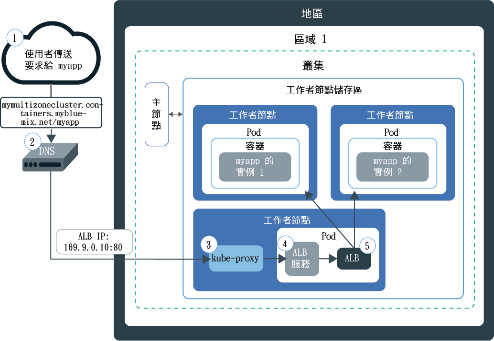
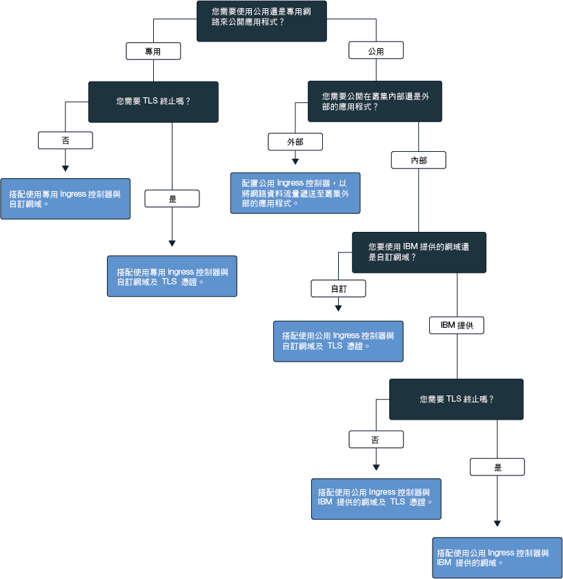

---

copyright:
  years: 2014, 2018
lastupdated: "2018-03-16"

---

{:new_window: target="_blank"}
{:shortdesc: .shortdesc}
{:screen: .screen}
{:pre: .pre}
{:table: .aria-labeledby="caption"}
{:codeblock: .codeblock}
{:tip: .tip}
{:download: .download}


# 設定 Ingress 服務
{: #ingress}

藉由在 {{site.data.keyword.containerlong}} 中建立由 IBM 提供的應用程式負載平衡器所管理的 Ingress 資源，來公開 Kubernetes 叢集中的多個應用程式。
{:shortdesc}

## 使用 Ingress 服務規劃網路
{: #planning}

透過 Ingress，您可以公開叢集中的多個服務，並使用單一公用進入點將它們設為可公開使用。
{:shortdesc}

Ingress 提供唯一公用路徑，根據個別路徑將公用要求轉遞給叢集內外部的應用程式，而不是為您要公開給大眾使用的每一個應用程式建立負載平衡器服務。Ingress 由兩個主要元件組成：應用程式負載平衡器及 Ingress 資源。

應用程式負載平衡器 (ALB) 是一種外部負載平衡器，負責接聽送入的 HTTP 或 HTTPS、TCP 或 UDP 服務要求，並將要求轉遞至適當的應用程式 Pod。當您建立標準叢集時，{{site.data.keyword.containershort_notm}} 會為叢集自動建立高可用性的 ALB，並將唯一的公用路徑指派給它。公用路徑會鏈結至在建立叢集期間佈建至 IBM Cloud 基礎架構 (SoftLayer) 帳戶的可攜式公用 IP 位址。也會自動建立預設專用 ALB，但不會自動啟用它。

若要透過 Ingress 公開應用程式，您必須為應用程式建立 Kubernetes 服務，並藉由定義 Ingress 資源，向 ALB 登錄此服務。Ingress 資源指定附加至公用路徑的路徑，以形成公開應用程式的唯一 URL，例如 `mycluster.us-south.containers.mybluemix.net/myapp`，並定義如何遞送應用程式之送入要求的規則。

下圖顯示 Ingress 如何將通訊從網際網路導向至應用程式：



1. 使用者會藉由存取應用程式的 URL，將要求傳送給您的應用程式。此 URL 是公開應用程式的公用 URL，其中已附加 Ingress 資源路徑，例如 `mycluster.us-south.containers.mybluemix.net/myapp`。

2. 用來作為廣域負載平衡器的 DNS 系統服務，會將 URL 解析為叢集中預設公用 ALB 的可攜式公用 IP 位址。

3. `kube-proxy` 會將要求遞送至應用程式的 Kubernetes ALB 服務。

4. Kubernetes 服務會將要求遞送至 ALB。

5. ALB 會檢查叢集中是否有 `myapp` 路徑的遞送規則。如果找到相符規則，則會根據您在 Ingress 資源中定義的規則，將要求轉遞至應用程式部署所在的 Pod。如果叢集中已部署多個應用程式實例，則 ALB 負載會平衡應用程式 Pod 之間的要求。


**附註：**Ingress 僅適用於標準叢集，而且叢集中需要至少兩個工作者節點才能確保高可用性，並套用定期更新。設定 Ingress 需要[管理者存取原則](cs_users.html#access_policies)。請驗證您的現行[存取原則](cs_users.html#infra_access)。

若要選擇 Ingress 的最佳配置，您可以遵循這個決策樹狀結構：


<map name="ingress_map" id="ingress_map">
<area href="/docs/containers/cs_ingress.html#private_ingress_no_tls" alt="使用自訂網域且不搭配 TLS 來專用地公開應用程式" shape="rect" coords="25, 246, 187, 294"/>
<area href="/docs/containers/cs_ingress.html#private_ingress_tls" alt="使用自訂網域且搭配 TLS 來專用地公開應用程式" shape="rect" coords="161, 337, 309, 385"/>
<area href="/docs/containers/cs_ingress.html#external_endpoint" alt="使用 IBM 提供的網域或自訂網域且搭配 TLS，公用地公用叢集外的應用程式" shape="rect" coords="313, 229, 466, 282"/>
<area href="/docs/containers/cs_ingress.html#custom_domain_cert" alt="使用自訂網域且搭配 TLS 來公用地公開應用程式" shape="rect" coords="365, 415, 518, 468"/>
<area href="/docs/containers/cs_ingress.html#ibm_domain" alt="使用 IBM 提供的網域且不搭配 TLS 來公用地公開應用程式" shape="rect" coords="414, 629, 569, 679"/>
<area href="/docs/containers/cs_ingress.html#ibm_domain_cert" alt="使用 IBM 提供的網域且搭配 TLS 來公用地公開應用程式" shape="rect" coords="563, 711, 716, 764"/>
</map>

<br />


## 將應用程式公開給大眾使用
{: #ingress_expose_public}

建立標準叢集時，會自動啟用 IBM 提供的應用程式負載平衡器 (ALB)，並為其指派可攜式公用 IP 位址及公用路徑。
{:shortdesc}

每個透過 Ingress 公開給大眾使用的應用程式都會獲指派附加至公用路徑的唯一路徑，因此，您可以使用唯一 URL 來公開存取叢集中的應用程式。若要將應用程式公開給大眾使用，您可以針對下列情境配置 Ingress。

-   [使用 IBM 提供的網域且不搭配 TLS 來公用地公開應用程式。](#ibm_domain)
-   [使用 IBM 提供的網域且搭配 TLS 來公用地公開應用程式。](#ibm_domain_cert)
-   [使用自訂網域且搭配 TLS 來公用地公開應用程式。](#custom_domain_cert)
-   [使用 IBM 提供的網域或自訂網域且搭配 TLS，公用叢集外的應用程式。](#external_endpoint)

### 使用 IBM 提供的網域且不搭配 TLS 來公用地公開應用程式
{: #ibm_domain}

您可以配置 ALB，對送入您叢集中應用程式的 HTTP 網路資料流量進行負載平衡，以及使用 IBM 提供的網域從網際網路存取應用程式。
{:shortdesc}

開始之前：

-   如果您還沒有叢集，請[建立標準叢集](cs_clusters.html#clusters_ui)。
-   [將 CLI 的目標設為](cs_cli_install.html#cs_cli_configure)叢集，才能執行 `kubectl` 指令。

若要使用 IBM 提供的網域來公開應用程式，請執行下列動作：

1.  [將應用程式部署至叢集](cs_app.html#app_cli)。將應用程式部署至叢集時，會自動建立一個以上的 Pod，以在容器中執行您的應用程式。請確定您已將標籤新增至您部署中配置檔的 meta 資料區段。此標籤是識別您應用程式執行所在之所有 Pod 的必要項目，如此才能將 Pod 包含在 Ingress 負載平衡中。
2.  為要公開的應用程式，建立 Kubernetes 服務。只有在您的應用程式是透過叢集內的 Kubernetes 服務公開時，ALB 才能將應用程式納入 Ingress 負載平衡。
    1.  例如，開啟偏好的編輯器，然後建立名為 `myservice.yaml` 的服務配置檔。
    2.  為您要公開給大眾使用的應用程式定義服務。

        ```
        apiVersion: v1
        kind: Service
        metadata:
          name: <myservice>
        spec:
          selector:
            <selectorkey>: <selectorvalue>
          ports:
           - protocol: TCP
             port: 8080
        ```
        {: codeblock}

        <table>
        <caption>瞭解 ALB 服務檔元件</caption>
        <thead>
        <th colspan=2> 瞭解 YAML 檔案元件</th>
        </thead>
        <tbody>
        <tr>
        <td><code>name</code></td>
        <td>將 <em>&lt;myservice&gt;</em> 取代為 ALB 服務的名稱。</td>
        </tr>
        <tr>
        <td><code>selector</code></td>
        <td>輸入標籤索引鍵 (<em>&lt;selectorkey&gt;</em>) 及值 (<em>&lt;selectorvalue&gt;</em>) 配對，以用來將應用程式執行所在的 Pod 設為目標。例如，如果您使用下列選取器 <code>app: code</code>，會將所有其 meta 資料中具有此標籤的 Pod 都包含在負載平衡中。當您將應用程式部署至叢集時，請輸入所使用的相同標籤。</td>
         </tr>
         <tr>
         <td><code>port</code></td>
         <td>服務所接聽的埠。</td>
         </tr>
         </tbody></table>
    3.  儲存變更。
    4.  在叢集中建立服務。

        ```
        kubectl apply -f myservice.yaml
        ```
        {: pre}
    5.  針對每個您要公開給大眾使用的應用程式，重複這些步驟。
3.  取得叢集的詳細資料，以檢視 IBM 提供的網域。將 _&lt;mycluster&gt;_ 取代為要公開給大眾使用的應用程式部署所在的叢集名稱。

    ```
    bx cs cluster-get <mycluster>
    ```
    {: pre}

    CLI 輸出會與下列內容類似。

    ```
    Retrieving cluster <mycluster>...
    OK
    Name:    <mycluster>
    ID:    b9c6b00dc0aa487f97123440b4895f2d
    State:    normal
    Created:  2017-04-26T19:47:08+0000
    Location: dal10
    Master URL:  https://169.57.40.165:1931
    Ingress subdomain:  <ibmdomain>
    Ingress secret:  <ibmtlssecret>
    Workers:  3
    Version: 1.8.8
    ```
    {: screen}

    您可以在 **Ingress subdomain** 欄位中看到 IBM 提供的網域。
4.  建立 Ingress 資源。Ingress 資源會為您為應用程式建立的 Kubernetes 服務定義遞送規則，並且由 ALB 用來將送入的網路資料流量遞送至服務。如果每個應用程式都是透過叢集內的 Kubernetes 服務公開，則您必須使用一個 Ingress 資源來為多個應用程式定義遞送規則。
    1.  例如，開啟偏好的編輯器，然後建立名為 `myingress.yaml` 的 Ingress 配置檔。
    2.  在配置檔中定義 Ingress 資源，以使用 IBM 提供的網域將送入的網路資料流量遞送至您先前建立的服務。

        ```
        apiVersion: extensions/v1beta1
        kind: Ingress
        metadata:
          name: <myingressname>
        spec:
          rules:
          - host: <ibmdomain>
            http:
              paths:
              - path: /<myservicepath1>
                backend:
                  serviceName: <myservice1>
                  servicePort: 80
              - path: /<myservicepath2>
                backend:
                  serviceName: <myservice2>
                  servicePort: 80
        ```
        {: codeblock}

        <table>
        <caption>瞭解 Ingress 資源檔案元件</caption>
        <thead>
        <th colspan=2> 瞭解 YAML 檔案元件</th>
        </thead>
        <tbody>
        <tr>
        <td><code>name</code></td>
        <td>將 <em>&lt;myingressname&gt;</em> 取代為 Ingress 資源的名稱。</td>
        </tr>
        <tr>
        <td><code>host</code></td>
        <td>將 <em>&lt;ibmdomain&gt;</em> 取代為前一個步驟中的 IBM 提供的 <strong>Ingress subdomain</strong> 名稱。

        </br></br>
        <strong>附註：</strong>請不要使用 * 作為您的主機，也不要讓主機內容保留為空白，以避免建立 Ingress 期間發生失敗。</td>
        </tr>
        <tr>
        <td><code>path</code></td>
        <td>將 <em>&lt;myservicepath1&gt;</em> 取代為斜線或應用程式所接聽的唯一路徑，讓網路資料流量可以轉遞至該應用程式。

        </br>
        針對每個 Kubernetes 服務，您可以定義附加至 IBM 所提供之網域的個別路徑，以建立應用程式的唯一路徑，例如 <code>ingress_domain/myservicepath1</code>。當您在 Web 瀏覽器中輸入此路徑時，網路資料流量就會遞送至 ALB。ALB 會查閱相關聯的服務，將網路資料流量傳送至服務，然後使用相同路徑傳送至執行該應用程式的 Pod。應用程式必須設定成接聽此路徑，以接收送入的網路資料流量。

        </br></br>
        許多應用程式不會接聽特定路徑，但卻使用根路徑及特定埠。在此情況下，請將根路徑定義為 <code>/</code>，並且不要為應用程式指定個別路徑。</br>
        範例：<ul><li>針對 <code>http://ingress_host_name/</code>，輸入 <code>/</code> 作為路徑。</li><li>針對 <code>http://ingress_host_name/myservicepath</code>，輸入 <code>/myservicepath</code> 作為路徑。</li></ul>
        </br>
        <strong>提示：</strong>若要配置 Ingress 接聽與應用程式所接聽路徑不同的路徑，您可以使用[重寫註釋](cs_annotations.html#rewrite-path)來建立應用程式的適當遞送。</td>
        </tr>
        <tr>
        <td><code>serviceName</code></td>
        <td>將 <em>&lt;myservice1&gt;</em> 取代為您為應用程式建立 Kubernetes 服務時所使用的服務名稱。</td>
        </tr>
        <tr>
        <td><code>servicePort</code></td>
        <td>您的服務所接聽的埠。請使用您為應用程式建立 Kubernetes 服務時所定義的相同埠。</td>
        </tr>
        </tbody></table>

    3.  建立叢集的 Ingress 資源。

        ```
        kubectl apply -f myingress.yaml
        ```
        {: pre}

5.  驗證已順利建立 Ingress 資源。將 _&lt;myingressname&gt;_ 取代為您先前建立的 Ingress 資源的名稱。

    ```
    kubectl describe ingress <myingressname>
    ```
    {: pre}

    1. 如果事件中的訊息說明資源配置中的錯誤，請變更資源檔中的值，然後重新套用該資源的檔案。

6.  在 Web 瀏覽器中，輸入要存取的應用程式服務的 URL。

    ```
    http://<ibmdomain>/<myservicepath1>
    ```
    {: codeblock}

<br />


### 使用 IBM 提供的網域且搭配 TLS 來公用地公開應用程式
{: #ibm_domain_cert}

您可以配置 Ingress ALB 來管理應用程式的送入 TLS 連線、使用 IBM 提供的 TLS 憑證來解密網路資料流量，以及將已解密的要求轉遞至叢集中已公開的應用程式。
{:shortdesc}

開始之前：

-   如果您還沒有叢集，請[建立標準叢集](cs_clusters.html#clusters_ui)。
-   [將 CLI 的目標設為](cs_cli_install.html#cs_cli_configure)叢集，才能執行 `kubectl` 指令。

若要使用 IBM 提供的網域且搭配 TLS 來公開應用程式，請執行下列動作：

1.  [將應用程式部署至叢集](cs_app.html#app_cli)。請確定您已將標籤新增至您部署中配置檔的 meta 資料區段。此標籤會識別您應用程式執行所在的所有 Pod，如此才能將 Pod 包含在 Ingress 負載平衡中。
2.  為要公開的應用程式，建立 Kubernetes 服務。只有在您的應用程式是透過叢集內的 Kubernetes 服務公開時，ALB 才能將應用程式納入 Ingress 負載平衡。
    1.  例如，開啟偏好的編輯器，然後建立名為 `myservice.yaml` 的服務配置檔。
    2.  為您要公開給大眾使用的應用程式定義 ALB 服務。

        ```
        apiVersion: v1
        kind: Service
        metadata:
          name: <myservice>
        spec:
          selector:
            <selectorkey>: <selectorvalue>
          ports:
           - protocol: TCP
             port: 8080
        ```
        {: codeblock}

        <table>
        <caption>瞭解 ALB 服務檔元件</caption>
        <thead>
        <th colspan=2> 瞭解 YAML 檔案元件</th>
        </thead>
        <tbody>
        <tr>
        <td><code>name</code></td>
        <td>將 <em>&lt;myservice&gt;</em> 取代為 ALB 服務的名稱。</td>
        </tr>
        <tr>
        <td><code>selector</code></td>
        <td>輸入標籤索引鍵 (<em>&lt;selectorkey&gt;</em>) 及值 (<em>&lt;selectorvalue&gt;</em>) 配對，以用來將應用程式執行所在的 Pod 設為目標。例如，如果您使用下列選取器 <code>app: code</code>，會將所有其 meta 資料中具有此標籤的 Pod 都包含在負載平衡中。當您將應用程式部署至叢集時，請輸入所使用的相同標籤。</td>
         </tr>
         <tr>
         <td><code>port</code></td>
         <td>服務所接聽的埠。</td>
         </tr>
         </tbody></table>

    3.  儲存變更。
    4.  在叢集中建立服務。

        ```
        kubectl apply -f myservice.yaml
        ```
        {: pre}

    5.  針對每個您要公開給大眾使用的應用程式，重複這些步驟。

3.  檢視 IBM 提供的網域及 TLS 憑證。將 _&lt;mycluster&gt;_ 取代為應用程式部署到其中的叢集名稱。

    ```
    bx cs cluster-get <mycluster>
    ```
    {: pre}

    CLI 輸出會與下列內容類似。

    ```
    bx cs cluster-get <mycluster>
    Retrieving cluster <mycluster>...
    OK
    Name:    <mycluster>
    ID:    b9c6b00dc0aa487f97123440b4895f2d
    State:    normal
    Created:  2017-04-26T19:47:08+0000
    Location: dal10
    Master URL:  https://169.57.40.165:1931
    Ingress subdomain:  <ibmdomain>
    Ingress secret:  <ibmtlssecret>
    Workers:  3
    Version: 1.8.8
    ```
    {: screen}

    您可以在 **Ingress subdomain** 中看到 IBM 提供的網域，並在 **Ingress secret** 欄位中看到 IBM 提供的憑證。

4.  建立 Ingress 資源。Ingress 資源會為您為應用程式建立的 Kubernetes 服務定義遞送規則，並且由 ALB 用來將送入的網路資料流量遞送至服務。如果每個應用程式都是透過叢集內的 Kubernetes 服務公開，則您必須使用一個 Ingress 資源來為多個應用程式定義遞送規則。
    1.  例如，開啟偏好的編輯器，然後建立名為 `myingress.yaml` 的 Ingress 配置檔。
    2.  在配置檔中定義 Ingress 資源，以使用 IBM 提供的網域將送入的網路資料流量遞送至服務，以及使用 IBM 提供的憑證來管理 TLS 終止。針對每個服務，您可以定義附加至 IBM 所提供網域的個別路徑，以建立應用程式的唯一路徑，例如 `https://ingress_domain/myapp`。當您在 Web 瀏覽器中輸入此路徑時，網路資料流量就會遞送至 ALB。ALB 會查閱相關聯的服務，將網路資料流量傳送至服務，然後進一步傳送至執行該應用程式的 Pod。

        **附註：**應用程式必須接聽 Ingress 資源中所定義的路徑。否則，無法將網路資料流量轉遞至應用程式。大部分的應用程式不會接聽特定路徑，但使用根路徑及特定埠。在此情況下，請將根路徑定義為 `/`，並且不要為應用程式指定個別路徑。

        ```
        apiVersion: extensions/v1beta1
        kind: Ingress
        metadata:
          name: <myingressname>
        spec:
          tls:
          - hosts:
            - <ibmdomain>
            secretName: <ibmtlssecret>
          rules:
          - host: <ibmdomain>
            http:
              paths:
              - path: /<myservicepath1>
                backend:
                  serviceName: <myservice1>
                  servicePort: 80
              - path: /<myservicepath2>
                backend:
                  serviceName: <myservice2>
                  servicePort: 80
        ```
        {: codeblock}

        <table>
        <caption>瞭解 Ingress 資源檔案元件</caption>
        <thead>
        <th colspan=2> 瞭解 YAML 檔案元件</th>
        </thead>
        <tbody>
        <tr>
        <td><code>name</code></td>
        <td>將 <em>&lt;myingressname&gt;</em> 取代為 Ingress 資源的名稱。</td>
        </tr>
        <tr>
        <td><code>tls/hosts</code></td>
        <td>將 <em>&lt;ibmdomain&gt;</em> 取代為前一個步驟中的 IBM 提供的 <strong>Ingress subdomain</strong> 名稱。此網域已配置 TLS 終止。

        </br></br>
        <strong>附註：</strong>請不要使用 &ast; 作為您的主機，也不要讓主機內容保留為空白，以避免建立 Ingress 期間發生失敗。</td>
        </tr>
        <tr>
        <td><code>tls/secretName</code></td>
        <td>將 <em>&lt;ibmtlssecret&gt;</em> 取代為前一個步驟中的 IBM 提供的 <strong>Ingress secret</strong> 名稱。此憑證會管理 TLS 終止。
        </tr>
        <tr>
        <td><code>host</code></td>
        <td>將 <em>&lt;ibmdomain&gt;</em> 取代為前一個步驟中的 IBM 提供的 <strong>Ingress subdomain</strong> 名稱。此網域已配置 TLS 終止。

        </br></br>
        <strong>附註：</strong>請不要使用 &ast; 作為您的主機，也不要讓主機內容保留為空白，以避免建立 Ingress 期間發生失敗。</td>
        </tr>
        <tr>
        <td><code>path</code></td>
        <td>將 <em>&lt;myservicepath1&gt;</em> 取代為斜線或應用程式所接聽的唯一路徑，讓網路資料流量可以轉遞至該應用程式。

        </br>
        針對每個 Kubernetes 服務，您可以定義附加至 IBM 所提供之網域的個別路徑，以建立應用程式的唯一路徑，例如 <code>ingress_domain/myservicepath1</code>。當您在 Web 瀏覽器中輸入此路徑時，網路資料流量就會遞送至 ALB。ALB 會查閱相關聯的服務，將網路資料流量傳送至服務，然後使用相同路徑傳送至執行該應用程式的 Pod。應用程式必須設定成接聽此路徑，以接收送入的網路資料流量。

        </br>
        許多應用程式不會接聽特定路徑，但卻使用根路徑及特定埠。在此情況下，請將根路徑定義為 <code>/</code>，並且不要為應用程式指定個別路徑。

        </br>
        範例：<ul><li>針對 <code>http://ingress_host_name/</code>，輸入 <code>/</code> 作為路徑。</li><li>針對 <code>http://ingress_host_name/myservicepath</code>，輸入 <code>/myservicepath</code> 作為路徑。</li></ul>
        <strong>提示：</strong>若要配置 Ingress 接聽與應用程式所接聽路徑不同的路徑，您可以使用[重寫註釋](cs_annotations.html#rewrite-path)來建立應用程式的適當遞送。</td>
        </tr>
        <tr>
        <td><code>serviceName</code></td>
        <td>將 <em>&lt;myservice1&gt;</em> 取代為您為應用程式建立 Kubernetes 服務時所使用的服務名稱。</td>
        </tr>
        <tr>
        <td><code>servicePort</code></td>
        <td>您的服務所接聽的埠。請使用您為應用程式建立 Kubernetes 服務時所定義的相同埠。</td>
        </tr>
        </tbody></table>

    3.  建立叢集的 Ingress 資源。

        ```
        kubectl apply -f myingress.yaml
        ```
        {: pre}

5.  驗證已順利建立 Ingress 資源。將 _&lt;myingressname&gt;_ 取代為您先前建立的 Ingress 資源的名稱。

    ```
    kubectl describe ingress <myingressname>
    ```
    {: pre}

    1. 如果事件中的訊息說明資源配置中的錯誤，請變更資源檔中的值，然後重新套用該資源的檔案。

6.  在 Web 瀏覽器中，輸入要存取的應用程式服務的 URL。

    ```
    https://<ibmdomain>/<myservicepath1>
    ```
    {: codeblock}

<br />


### 使用自訂網域且搭配 TLS 來公用地公開應用程式
{: #custom_domain_cert}

您可以配置 ALB，將送入的網路資料流量遞送至叢集中的應用程式，以及使用您自己的 TLS 憑證來管理 TLS 終止，同時使用您的自訂網域而非 IBM 提供的網域。
{:shortdesc}

開始之前：

-   如果您還沒有叢集，請[建立標準叢集](cs_clusters.html#clusters_ui)。
-   [將 CLI 的目標設為](cs_cli_install.html#cs_cli_configure)叢集，才能執行 `kubectl` 指令。

若要使用自訂網域且搭配 TLS 來公開應用程式，請執行下列動作：

1.  建立自訂網域。若要建立自訂網域，請使用「網域名稱服務 (DNS)」提供者或 [{{site.data.keyword.Bluemix_notm}}](/docs/infrastructure/dns/getting-started.html#getting-started-with-dns) 來登錄自訂網域。
2.  配置網域，將送入的網路資料流量遞送至 IBM 提供的 ALB。可選擇的選項有：
    -   將 IBM 提供的網域指定為「標準名稱記錄 (CNAME)」，以定義自訂網域的別名。若要尋找 IBM 提供的 Ingress 網域，請執行 `bx cs cluster-get <mycluster>` 並尋找 **Ingress subdomain** 欄位。
    -   將您的自訂網域對映至 IBM 提供的 ALB 的可攜式公用 IP 位址，方法是將 IP 位址新增為記錄。若要尋找 ALB 的可攜式公用 IP 位址，請執行 `bx cs alb-get <public_alb_ID>`。
3.  匯入或建立 TLS 憑證及金鑰密碼：
    * 如果 TLS 憑證儲存在您要使用的 {{site.data.keyword.cloudcerts_long_notm}} 中，您可以執行下列指令，將其相關聯的密碼匯入至叢集中：

      ```
          bx cs alb-cert-deploy --secret-name <secret_name> --cluster <cluster_name_or_ID> --cert-crn <certificate_crn>
          ```
      {: pre}

    * 如果您沒有 TLS 憑證，請遵循下列步驟：
        1. 建立以 PEM 格式編碼的網域的 TLS 憑證及金鑰。
        2. 建立使用 TLS 憑證及金鑰的密碼。將 <em>&lt;mytlssecret&gt;</em> 取代為 Kubernetes 密碼的名稱、將 <em>&lt;tls_key_filepath&gt;</em> 取代為自訂 TLS 金鑰檔的路徑，並將 <em>&lt;tls_cert_filepath&gt;</em> 取代為自訂 TLS 憑證檔的路徑。

            ```
            kubectl create secret tls <mytlssecret> --key <tls_key_filepath> --cert <tls_cert_filepath>
            ```
            {: pre}

4.  [將應用程式部署至叢集](cs_app.html#app_cli)。將應用程式部署至叢集時，會自動建立一個以上的 Pod，以在容器中執行您的應用程式。請確定您已將標籤新增至您部署中配置檔的 meta 資料區段。此標籤是識別您應用程式執行所在之所有 Pod 的必要項目，如此才能將 Pod 包含在 Ingress 負載平衡中。

5.  為要公開的應用程式，建立 Kubernetes 服務。只有在您的應用程式是透過叢集內的 Kubernetes 服務公開時，ALB 才能將應用程式納入 Ingress 負載平衡。

    1.  例如，開啟偏好的編輯器，然後建立名為 `myservice.yaml` 的服務配置檔。
    2.  為您要公開給大眾使用的應用程式定義 ALB 服務。

        ```
        apiVersion: v1
        kind: Service
        metadata:
          name: <myservice>
        spec:
          selector:
            <selectorkey>: <selectorvalue>
          ports:
           - protocol: TCP
             port: 8080
        ```
       {: codeblock}

        <table>
        <caption>瞭解 ALB 服務檔元件</caption>
        <thead>
        <th colspan=2> 瞭解 YAML 檔案元件</th>
        </thead>
        <tbody>
        <tr>
        <td><code>name</code></td>
        <td>將 <em>&lt;myservice1&gt;</em> 取代為 ALB 服務的名稱。</td>
        </tr>
        <tr>
        <td><code>selector</code></td>
        <td>輸入標籤索引鍵 (<em>&lt;selectorkey&gt;</em>) 及值 (<em>&lt;selectorvalue&gt;</em>) 配對，以用來將應用程式執行所在的 Pod 設為目標。例如，如果您使用下列選取器 <code>app: code</code>，會將所有其 meta 資料中具有此標籤的 Pod 都包含在負載平衡中。當您將應用程式部署至叢集時，請輸入所使用的相同標籤。</td>
         </tr>
         <td><code>port</code></td>
         <td>服務所接聽的埠。</td>
         </tbody></table>

    3.  儲存變更。
    4.  在叢集中建立服務。

        ```
        kubectl apply -f myservice.yaml
        ```
        {: pre}

    5.  針對每個您要公開給大眾使用的應用程式，重複這些步驟。
6.  建立 Ingress 資源。Ingress 資源會為您為應用程式建立的 Kubernetes 服務定義遞送規則，並且由 ALB 用來將送入的網路資料流量遞送至服務。如果每個應用程式都是透過叢集內的 Kubernetes 服務公開，則您必須使用一個 Ingress 資源來為多個應用程式定義遞送規則。
    1.  例如，開啟偏好的編輯器，然後建立名為 `myingress.yaml` 的 Ingress 配置檔。
    2.  在配置檔中定義 Ingress 資源，以使用自訂網域將送入的網路資料流量遞送至服務，以及使用自訂憑證來管理 TLS 終止。針對每個服務，您可以定義附加至自訂網域的個別路徑，以建立應用程式的唯一路徑；例如，`https://mydomain/myapp`。當您在 Web 瀏覽器中輸入此路徑時，網路資料流量就會遞送至 ALB。ALB 會查閱相關聯的服務，將網路資料流量傳送至服務，然後進一步傳送至執行該應用程式的 Pod。

        應用程式必須接聽您在 Ingress 資源中所定義的路徑。否則，無法將網路資料流量轉遞至應用程式。大部分的應用程式不會接聽特定路徑，但使用根路徑及特定埠。在此情況下，請將根路徑定義為 `/`，並且不要為應用程式指定個別路徑。

        ```
        apiVersion: extensions/v1beta1
        kind: Ingress
        metadata:
          name: <myingressname>
        spec:
          tls:
          - hosts:
            - <mycustomdomain>
            secretName: <mytlssecret>
          rules:
          - host: <mycustomdomain>
            http:
              paths:
              - path: /<myservicepath1>
                backend:
                  serviceName: <myservice1>
                  servicePort: 80
              - path: /<myservicepath2>
                backend:
                  serviceName: <myservice2>
                  servicePort: 80
        ```
        {: codeblock}

        <table>
        <caption>瞭解 Ingress 資源檔案元件</caption>
        <thead>
        <th colspan=2> 瞭解 YAML 檔案元件</th>
        </thead>
        <tbody>
        <tr>
        <td><code>name</code></td>
        <td>將 <em>&lt;myingressname&gt;</em> 取代為 Ingress 資源的名稱。</td>
        </tr>
        <tr>
        <td><code>tls/hosts</code></td>
        <td>將 <em>&lt;mycustomdomain&gt;</em> 取代為您要配置 TLS 終止的自訂網域。

        </br></br>
        <strong>附註：</strong>請不要使用 &ast; 作為您的主機，也不要讓主機內容保留為空白，以避免建立 Ingress 期間發生失敗。</td>
        </tr>
        <tr>
        <td><code>tls/secretName</code></td>
        <td>將 <em>&lt;mytlssecret&gt;</em> 取代為您先前建立的密碼的名稱，而此密碼可保留自訂 TLS 憑證及金鑰。如果您從 {{site.data.keyword.cloudcerts_short}} 匯入了憑證，則可以執行 <code>bx cs alb-cert-get --cluster <cluster_name_or_ID> --cert-crn <certificate_crn></code>，來查看與 TLS 憑證相關聯的密碼。
        </tr>
        <tr>
        <td><code>host</code></td>
        <td>將 <em>&lt;mycustomdomain&gt;</em> 取代為您要配置 TLS 終止的自訂網域。

        </br></br>
        <strong>附註：</strong>請不要使用 &ast; 作為您的主機，也不要讓主機內容保留為空白，以避免建立 Ingress 期間發生失敗。</td>
        </tr>
        <tr>
        <td><code>path</code></td>
        <td>將 <em>&lt;myservicepath1&gt;</em> 取代為斜線或應用程式所接聽的唯一路徑，讓網路資料流量可以轉遞至該應用程式。

        </br>
        針對每個 Kubernetes 服務，您可以定義附加至 IBM 所提供之網域的個別路徑，以建立應用程式的唯一路徑，例如 <code>ingress_domain/myservicepath1</code>。當您在 Web 瀏覽器中輸入此路徑時，網路資料流量就會遞送至 ALB。ALB 會查閱相關聯的服務，將網路資料流量傳送至服務，然後使用相同路徑傳送至執行該應用程式的 Pod。應用程式必須設定成接聽此路徑，以接收送入的網路資料流量。

        </br>
        許多應用程式不會接聽特定路徑，但卻使用根路徑及特定埠。在此情況下，請將根路徑定義為 <code>/</code>，並且不要為應用程式指定個別路徑。

        </br></br>
        範例：<ul><li>針對 <code>https://mycustomdomain/</code>，輸入 <code>/</code> 作為路徑。</li><li>針對 <code>https://mycustomdomain/myservicepath</code>，輸入 <code>/myservicepath</code> 作為路徑。</li></ul>
        <strong>提示：</strong>若要配置 Ingress 接聽與應用程式所接聽路徑不同的路徑，您可以使用[重寫註釋](cs_annotations.html#rewrite-path)來建立應用程式的適當遞送。</td>
        </tr>
        <tr>
        <td><code>serviceName</code></td>
        <td>將 <em>&lt;myservice1&gt;</em> 取代為您為應用程式建立 Kubernetes 服務時所使用的服務名稱。</td>
        </tr>
        <tr>
        <td><code>servicePort</code></td>
        <td>您的服務所接聽的埠。請使用您為應用程式建立 Kubernetes 服務時所定義的相同埠。</td>
        </tr>
        </tbody></table>

    3.  儲存變更。
    4.  建立叢集的 Ingress 資源。

        ```
        kubectl apply -f myingress.yaml
        ```
        {: pre}

7.  驗證已順利建立 Ingress 資源。將 _&lt;myingressname&gt;_ 取代為您先前建立的 Ingress 資源的名稱。

    ```
    kubectl describe ingress <myingressname>
    ```
    {: pre}

    1. 如果事件中的訊息說明資源配置中的錯誤，請變更資源檔中的值，然後重新套用該資源的檔案。

8.  從網際網路存取您的應用程式。
    1.  開啟偏好的 Web 瀏覽器。
    2.  輸入要存取的應用程式服務的 URL。

        ```
        https://<mycustomdomain>/<myservicepath1>
        ```
        {: codeblock}

<br />


### 使用 IBM 提供的網域或自訂網域且搭配 TLS，公用叢集外的應用程式
{: #external_endpoint}

您可以配置 ALB 來納入位於叢集外的應用程式。IBM 提供的網域或自訂網域上的送入要求，會自動轉遞給外部應用程式。
{:shortdesc}

開始之前：

-   如果您還沒有叢集，請[建立標準叢集](cs_clusters.html#clusters_ui)。
-   [將 CLI 的目標設為](cs_cli_install.html#cs_cli_configure)叢集，才能執行 `kubectl` 指令。
-   確定您可以使用公用 IP 位址來存取您要包含在叢集負載平衡中的外部應用程式。

您可以將 IBM 所提供網域上的送入網路資料流量遞送至位於叢集外部的應用程式。如果您要改用自訂網域及 TLS 憑證，請將 IBM 提供的網域及 TLS 憑證取代為[自訂網域及 TLS 憑證](#custom_domain_cert)。

1.  針對將送入的要求轉遞至您將建立的外部端點的叢集，建立 Kubernetes 服務。
    1.  例如，開啟偏好的編輯器，然後建立名為 `myexternalservice.yaml` 的服務配置檔。
    2.  定義 ALB 服務。

        ```
        apiVersion: v1
        kind: Service
        metadata:
          name: <myservicename>
        spec:
          ports:
           - protocol: TCP
             port: 8080
        ```
        {: codeblock}

        <table>
        <caption>瞭解 ALB 服務檔元件</caption>
        <thead>
        <th colspan=2> 瞭解 YAML 檔案元件</th>
        </thead>
        <tbody>
        <tr>
        <td><code>metadata/name</code></td>
        <td>將 <em>&lt;myservicename&gt;</em> 取代為您服務的名稱。</td>
        </tr>
        <tr>
        <td><code>port</code></td>
        <td>服務所接聽的埠。</td>
        </tr></tbody></table>

    3.  儲存變更。
    4.  建立叢集的 Kubernetes 服務。

        ```
        kubectl apply -f myexternalservice.yaml
        ```
        {: pre}

2.  配置 Kubernetes 端點，以定義您要包含在叢集負載平衡中的應用程式的外部位置。
    1.  例如，開啟偏好的編輯器，然後建立名為 `myexternalendpoint.yaml` 的端點配置檔。
    2.  定義外部端點。請包含您可用來存取外部應用程式的所有公用 IP 位址及埠。

        ```
        kind: Endpoints
        apiVersion: v1
        metadata:
          name: <myservicename>
        subsets:
          - addresses:
              - ip: <externalIP1>
              - ip: <externalIP2>
            ports:
              - port: <externalport>
        ```
        {: codeblock}

        <table>
        <thead>
        <th colspan=2> 瞭解 YAML 檔案元件</th>
        </thead>
        <tbody>
        <tr>
        <td><code>name</code></td>
        <td>將 <em>&lt;myendpointname&gt;</em> 取代為您先前建立的 Kubernetes 服務的名稱。</td>
        </tr>
        <tr>
        <td><code>ip</code></td>
        <td>將 <em>&lt;externalIP&gt;</em> 取代為用來連接至外部應用程式的公用 IP 位址。</td>
         </tr>
         <td><code>port</code></td>
         <td>將 <em>&lt;externalport&gt;</em> 取代為外部應用程式所接聽的埠。</td>
         </tbody></table>

    3.  儲存變更。
    4.  建立叢集的 Kubernetes 端點。

        ```
        kubectl apply -f myexternalendpoint.yaml
        ```
        {: pre}

3.  檢視 IBM 提供的網域及 TLS 憑證。將 _&lt;mycluster&gt;_ 取代為應用程式部署到其中的叢集名稱。

    ```
    bx cs cluster-get <mycluster>
    ```
    {: pre}

    CLI 輸出會與下列內容類似。

    ```
    Retrieving cluster <mycluster>...
    OK
    Name:    <mycluster>
    ID:    b9c6b00dc0aa487f97123440b4895f2d
    State:    normal
    Created:  2017-04-26T19:47:08+0000
    Location: dal10
    Master URL:  https://169.57.40.165:1931
    Ingress subdomain:  <ibmdomain>
    Ingress secret:  <ibmtlssecret>
    Workers:  3
    Version: 1.8.8
    ```
    {: screen}

    您可以在 **Ingress subdomain** 中看到 IBM 提供的網域，並在 **Ingress secret** 欄位中看到 IBM 提供的憑證。

4.  建立 Ingress 資源。Ingress 資源會為您為應用程式建立的 Kubernetes 服務定義遞送規則，並且由 ALB 用來將送入的網路資料流量遞送至服務。只要每個應用程式都是透過叢集內的 Kubernetes 服務使用其外部端點公開時，您就可以使用一個 Ingress 資源來為多個外部應用程式定義遞送規則。
    1.  例如，開啟偏好的編輯器，然後建立名為 `myexternalingress.yaml` 的 Ingress 配置檔。
    2.  在配置檔中定義 Ingress 資源，以使用 IBM 提供的網域及 TLS 憑證將送入的網路資料流量遞送至外部應用程式，方法是使用您先前定義的外部端點。針對每個服務，您可以定義附加至 IBM 所提供網域或自訂網域的個別路徑，以建立應用程式的唯一路徑，例如 `https://ingress_domain/myapp`。當您在 Web 瀏覽器中輸入此路徑時，網路資料流量就會遞送至 ALB。ALB 會查閱相關聯的服務，將網路資料流量傳送至服務，然後進一步傳送至外部應用程式。

        應用程式必須接聽您在 Ingress 資源中所定義的路徑。否則，無法將網路資料流量轉遞至應用程式。大部分的應用程式不會接聽特定路徑，但使用根路徑及特定埠。在此情況下，請將根路徑定義為 /，並且不要為應用程式指定個別路徑。

        ```
        apiVersion: extensions/v1beta1
        kind: Ingress
        metadata:
          name: <myingressname>
        spec:
          tls:
          - hosts:
            - <ibmdomain>
            secretName: <ibmtlssecret>
          rules:
          - host: <ibmdomain>
            http:
              paths:
              - path: /<myexternalservicepath1>
                backend:
                  serviceName: <myservice1>
                  servicePort: 80
              - path: /<myexternalservicepath2>
                backend:
                  serviceName: <myexternalservice2>
                  servicePort: 80
        ```
        {: codeblock}

        <table>
        <caption>瞭解 Ingress 資源檔案元件</caption>
        <thead>
        <th colspan=2> 瞭解 YAML 檔案元件</th>
        </thead>
        <tbody>
        <tr>
        <td><code>name</code></td>
        <td>將 <em>&lt;myingressname&gt;</em> 取代為 Ingress 資源的名稱。</td>
        </tr>
        <tr>
        <td><code>tls/hosts</code></td>
        <td>將 <em>&lt;ibmdomain&gt;</em> 取代為前一個步驟中的 IBM 提供的 <strong>Ingress subdomain</strong> 名稱。此網域已配置 TLS 終止。

        </br></br>
        <strong>附註：</strong>請不要使用 &ast; 作為您的主機，也不要讓主機內容保留為空白，以避免建立 Ingress 期間發生失敗。</td>
        </tr>
        <tr>
        <td><code>tls/secretName</code></td>
        <td>將 <em>&lt;ibmtlssecret&gt;</em> 取代為前一個步驟中的 IBM 提供的 <strong>Ingress secret</strong>。此憑證會管理 TLS 終止。
        </td>
        </tr>
        <tr>
        <td><code>rules/host</code></td>
        <td>將 <em>&lt;ibmdomain&gt;</em> 取代為前一個步驟中的 IBM 提供的 <strong>Ingress subdomain</strong> 名稱。此網域已配置 TLS 終止。

        </br></br>
        <strong>附註：</strong>請不要使用 &ast; 作為您的主機，也不要讓主機內容保留為空白，以避免建立 Ingress 期間發生失敗。</td>
        </tr>
        <tr>
        <td><code>path</code></td>
        <td>將 <em>&lt;myexternalservicepath&gt;</em> 取代為斜線或外部應用程式所接聽的唯一路徑，以將網路資料流量轉遞至應用程式。

        </br>
        針對每個 Kubernetes 服務，您可以定義附加至自訂網域的個別路徑，以建立應用程式的唯一路徑，例如 <code>https://ibmdomain/myservicepath1</code>。當您在 Web 瀏覽器中輸入此路徑時，網路資料流量就會遞送至 ALB。ALB 會查閱相關聯的服務，然後使用相同路徑將網路資料流量傳送至外部應用程式。應用程式必須設定成接聽此路徑，以接收送入的網路資料流量。

        </br></br>
        許多應用程式不會接聽特定路徑，但卻使用根路徑及特定埠。在此情況下，請將根路徑定義為 <code>/</code>，並且不要為應用程式指定個別路徑。

        </br></br>
        <strong>提示：</strong>若要配置 Ingress 接聽與應用程式所接聽路徑不同的路徑，您可以使用[重寫註釋](cs_annotations.html#rewrite-path)來建立應用程式的適當遞送。</td>
        </tr>
        <tr>
        <td><code>serviceName</code></td>
        <td>將 <em>&lt;myexternalservice&gt;</em> 取代為您為外部應用程式建立 Kubernetes 服務時所使用的服務名稱。</td>
        </tr>
        <tr>
        <td><code>servicePort</code></td>
        <td>您的服務所接聽的埠。</td>
        </tr>
        </tbody></table>

    3.  儲存變更。
    4.  建立叢集的 Ingress 資源。

        ```
        kubectl apply -f myexternalingress.yaml
        ```
        {: pre}

5.  驗證已順利建立 Ingress 資源。將 _&lt;myingressname&gt;_ 取代為您先前建立的 Ingress 資源的名稱。

    ```
    kubectl describe ingress <myingressname>
    ```
    {: pre}

    1. 如果事件中的訊息說明資源配置中的錯誤，請變更資源檔中的值，然後重新套用該資源的檔案。

6.  存取外部應用程式。
    1.  開啟偏好的 Web 瀏覽器。
    2.  輸入用來存取外部應用程式的 URL。

        ```
        https://<ibmdomain>/<myexternalservicepath>
        ```
        {: codeblock}

<br />


## 將應用程式公開給專用網路使用
{: #ingress_expose_private}

您建立標準叢集時，會建立 IBM 提供的應用程式負載平衡器 (ALB)，並為其指派可攜式專用 IP 位址及專用路徑。不過，不會自動啟用預設專用 ALB。若要將應用程式公開給專用網路使用，請先[啟用預設專用應用程式負載平衡器](#private_ingress)。
{:shortdesc}

然後，您可以針對下列情境配置 Ingress。
-   [使用自訂網域且不搭配 TLS 來專用地公開應用程式。](#private_ingress_no_tls)
-   [使用自訂網域且搭配 TLS 來專用地公開應用程式。](#private_ingress_tls)

### 啟用預設專用應用程式負載平衡器
{: #private_ingress}

在可以使用預設專用 ALB 之前，您必須使用 IBM 所提供的可攜式專用 IP 位址，或您自己的可攜式專用 IP 位址來予以啟用。
{:shortdesc}

**附註**：如果您在建立叢集時使用 `--no-subnet` 旗標，則必須先新增可攜式專用子網路或使用者管理的子網路之後，您才能啟用專用 ALB。如需相關資訊，請參閱[要求叢集的其他子網路](cs_subnets.html#request)。

開始之前：

-   如果您還沒有叢集，請[建立標準叢集](cs_clusters.html#clusters_ui)。
-   [將 CLI 的目標設為](cs_cli_install.html#cs_cli_configure)您的叢集。

若要使用預先指派、且由 IBM 提供的可攜式專用 IP 位址來啟用專用 ALB，請執行下列動作：

1. 列出叢集中可用的 ALB，以取得專用 ALB 的 ID。將 <em>&lt;cluser_name&gt;</em> 取代為您要公開之應用程式部署所在的叢集名稱。

    ```
    bx cs albs --cluster <my_cluster>
    ```
    {: pre}

    專用 ALB 的 **Status** 欄位為 _disabled_。
    ```
    ALB ID                                            Enabled   Status     Type      ALB IP
    private-cr6d779503319d419ea3b4ab171d12c3b8-alb1   false     disabled   private   -
    public-cr6d779503319d419ea3b4ab171d12c3b8-alb1    true      enabled    public    169.46.63.150
    ```
    {: screen}

2. 啟用專用 ALB。將 <em>&lt;private_ALB_ID&gt;</em> 取代為專用 ALB 的 ID（來自前一個步驟中的輸出）。

   ```
   bx cs alb-configure --albID <private_ALB_ID> --enable
   ```
   {: pre}


若要使用您自己的可攜式專用 IP 位址來啟用專用 ALB，請執行下列動作：

1. 配置所選擇 IP 位址之使用者管理的子網路，以遞送叢集之專用 VLAN 上的資料流量。將 <em>&lt;cluser_name&gt;</em> 取代為您要公開之應用程式部署所在的叢集名稱或 ID、將 <em>&lt;subnet_CIDR&gt;</em> 取代為使用者管理之子網路的 CIDR，並將 <em>&lt;private_VLAN&gt;</em> 取代為可用的專用 VLAN ID。您可以藉由執行 `bx cs vlsans`，來尋找可用的專用 VLAN ID。

   ```
   bx cs cluster-user-subnet-add <cluster_name> <subnet_CIDR> <private_VLAN>
   ```
   {: pre}

2. 列出叢集中可用的 ALB，以取得專用 ALB 的 ID。

    ```
    bx cs albs --cluster <my_cluster>
    ```
    {: pre}

    專用 ALB 的 **Status** 欄位為 _disabled_。
    ```
    ALB ID                                            Enabled   Status     Type      ALB IP
    private-cr6d779503319d419ea3b4ab171d12c3b8-alb1   false     disabled   private   -
    public-cr6d779503319d419ea3b4ab171d12c3b8-alb1    true      enabled    public    169.46.63.150
    ```
    {: screen}

3. 啟用專用 ALB。將 <em>&lt;private_ALB_ID&gt;</em> 取代為專用 ALB 的 ID（來自前一個步驟中的輸出），並將 <em>&lt;user_ip&gt;</em> 取代為您要使用之使用者所管理子網路的 IP 位址。

   ```
   bx cs alb-configure --albID <private_ALB_ID> --enable --user-ip <user_ip>
   ```
   {: pre}

<br />


### 使用自訂網域且不搭配 TLS 來專用地公開應用程式
{: #private_ingress_no_tls}

您可以配置專用 ALB，使用自訂網域將送入的網路資料流量遞送至叢集中的應用程式。
{:shortdesc}

開始之前，請[啟用專用應用程式負載平衡器](#private_ingress)。

若要使用自訂網域且不搭配 TLS 來專用地公開應用程式，請執行下列動作：

1.  建立自訂網域。若要建立自訂網域，請使用「網域名稱服務 (DNS)」提供者或 [{{site.data.keyword.Bluemix_notm}}](/docs/infrastructure/dns/getting-started.html#getting-started-with-dns) 來登錄自訂網域。

2.  將您的自訂網域對映至 IBM 提供的專用 ALB 的可攜式專用 IP 位址，方法是將 IP 位址新增為記錄。若要尋找專用 ALB 的可攜式專用 IP 位址，請執行 `bx cs albs --cluster <cluster_name>`.

3.  [將應用程式部署至叢集](cs_app.html#app_cli)。將應用程式部署至叢集時，會自動建立一個以上的 Pod，以在容器中執行您的應用程式。請確定您已將標籤新增至您部署中配置檔的 meta 資料區段。此標籤會識別您應用程式執行所在的所有 Pod，如此才能將 Pod 內含在 Ingress 負載平衡中。

4.  為要公開的應用程式，建立 Kubernetes 服務。只有在您的應用程式是透過叢集內的 Kubernetes 服務公開時，專用 ALB 才能將應用程式納入 Ingress 負載平衡。

    1.  例如，開啟偏好的編輯器，然後建立名為 `myservice.yaml` 的服務配置檔。
    2.  為您要公開給大眾使用的應用程式定義 ALB 服務。

        ```
        apiVersion: v1
        kind: Service
        metadata:
          name: <myservice>
        spec:
          selector:
            <selectorkey>: <selectorvalue>
          ports:
           - protocol: TCP
             port: 8080
        ```
       {: codeblock}

        <table>
        <caption>瞭解 ALB 服務檔元件</caption>
        <thead>
        <th colspan=2> 瞭解 YAML 檔案元件</th>
        </thead>
        <tbody>
        <tr>
        <td><code>name</code></td>
        <td>將 <em>&lt;myservice1&gt;</em> 取代為 ALB 服務的名稱。</td>
        </tr>
        <tr>
        <td><code>selector</code></td>
        <td>輸入標籤索引鍵 (<em>&lt;selectorkey&gt;</em>) 及值 (<em>&lt;selectorvalue&gt;</em>) 配對，以用來將應用程式執行所在的 Pod 設為目標。例如，如果您使用下列選取器 <code>app: code</code>，會將所有其 meta 資料中具有此標籤的 Pod 都包含在負載平衡中。當您將應用程式部署至叢集時，請輸入所使用的相同標籤。</td>
         </tr>
         <td><code>port</code></td>
         <td>服務所接聽的埠。</td>
         </tbody></table>

    3.  儲存變更。
    4.  在叢集中建立 Kubernetes 服務。

        ```
        kubectl apply -f myservice.yaml
        ```
        {: pre}

    5.  針對每個您要公開給專用網路使用的應用程式，重複這些步驟。
7.  建立 Ingress 資源。Ingress 資源會為您為應用程式建立的 Kubernetes 服務定義遞送規則，並且由 ALB 用來將送入的網路資料流量遞送至服務。如果每個應用程式都是透過叢集內的 Kubernetes 服務公開，則您必須使用一個 Ingress 資源來為多個應用程式定義遞送規則。
    1.  例如，開啟偏好的編輯器，然後建立名為 `myingress.yaml` 的 Ingress 配置檔。
    2.  在配置檔中定義 Ingress 資源，以使用自訂網域將送入的網路資料流量遞送至您的服務。針對每個服務，您可以定義附加至自訂網域的個別路徑，以建立應用程式的唯一路徑，例如 `https://mydomain/myapp`。當您在 Web 瀏覽器中輸入此路徑時，網路資料流量就會遞送至 ALB。ALB 會查閱相關聯的服務，將網路資料流量傳送至服務，然後進一步傳送至執行該應用程式的 Pod。

        應用程式必須接聽您在 Ingress 資源中所定義的路徑。否則，無法將網路資料流量轉遞至應用程式。大部分的應用程式不會接聽特定路徑，但使用根路徑及特定埠。在此情況下，請將根路徑定義為 `/`，並且不要為應用程式指定個別路徑。

        ```
        apiVersion: extensions/v1beta1
        kind: Ingress
        metadata:
          name: <myingressname>
          annotations:
            ingress.bluemix.net/ALB-ID: "<private_ALB_ID>"
        spec:
          rules:
          - host: <mycustomdomain>
            http:
              paths:
              - path: /<myservicepath1>
                backend:
                  serviceName: <myservice1>
                  servicePort: 80
              - path: /<myservicepath2>
                backend:
                  serviceName: <myservice2>
                  servicePort: 80
        ```
        {: codeblock}

        <table>
        <caption>瞭解 Ingress 資源檔案元件</caption>
        <thead>
        <th colspan=2> 瞭解 YAML 檔案元件</th>
        </thead>
        <tbody>
        <tr>
        <td><code>name</code></td>
        <td>將 <em>&lt;myingressname&gt;</em> 取代為 Ingress 資源的名稱。</td>
        </tr>
        <tr>
        <td><code>ingress.bluemix.net/ALB-ID</code></td>
        <td>將 <em>&lt;private_ALB_ID&gt;</em> 取代為專用 ALB 的 ID。執行 <code>bx cs albs --cluster <my_cluster></code> 以尋找 ALB ID。如需此 Ingress 註釋的相關資訊，請參閱[專用應用程式負載平衡器遞送](cs_annotations.html#alb-id)。</td>
        </tr>
        <td><code>host</code></td>
        <td>將 <em>&lt;mycustomdomain&gt;</em> 取代為自訂網域。

        </br></br>
        <strong>附註：</strong>請不要使用 &ast; 作為您的主機，也不要讓主機內容保留為空白，以避免建立 Ingress 期間發生失敗。</td>
        </tr>
        <tr>
        <td><code>path</code></td>
        <td>將 <em>&lt;myservicepath1&gt;</em> 取代為斜線或應用程式所接聽的唯一路徑，讓網路資料流量可以轉遞至該應用程式。

        </br>
        針對每個 Kubernetes 服務，您可以定義附加至自訂網域的個別路徑，以建立應用程式的唯一路徑，例如 <code>custom_domain/myservicepath1</code>。當您在 Web 瀏覽器中輸入此路徑時，網路資料流量就會遞送至 ALB。ALB 會查閱相關聯的服務，將網路資料流量傳送至服務，然後使用相同路徑傳送至執行該應用程式的 Pod。應用程式必須設定成接聽此路徑，以接收送入的網路資料流量。

        </br>
        許多應用程式不會接聽特定路徑，但卻使用根路徑及特定埠。在此情況下，請將根路徑定義為 <code>/</code>，並且不要為應用程式指定個別路徑。

        </br></br>
        範例：<ul><li>針對 <code>https://mycustomdomain/</code>，輸入 <code>/</code> 作為路徑。</li><li>針對 <code>https://mycustomdomain/myservicepath</code>，輸入 <code>/myservicepath</code> 作為路徑。</li></ul>
        <strong>提示：</strong>若要配置 Ingress 接聽與應用程式所接聽路徑不同的路徑，您可以使用[重寫註釋](cs_annotations.html#rewrite-path)來建立應用程式的適當遞送。</td>
        </tr>
        <tr>
        <td><code>serviceName</code></td>
        <td>將 <em>&lt;myservice1&gt;</em> 取代為您為應用程式建立 Kubernetes 服務時所使用的服務名稱。</td>
        </tr>
        <tr>
        <td><code>servicePort</code></td>
        <td>您的服務所接聽的埠。請使用您為應用程式建立 Kubernetes 服務時所定義的相同埠。</td>
        </tr>
        </tbody></table>

    3.  儲存變更。
    4.  建立叢集的 Ingress 資源。

        ```
        kubectl apply -f myingress.yaml
        ```
        {: pre}

8.  驗證已順利建立 Ingress 資源。將 _&lt;myingressname&gt;_ 取代為您先前建立的 Ingress 資源的名稱。

    ```
    kubectl describe ingress <myingressname>
    ```
    {: pre}

    1. 如果事件中的訊息說明資源配置中的錯誤，請變更資源檔中的值，然後重新套用該資源的檔案。

9.  從網際網路存取您的應用程式。
    1.  開啟偏好的 Web 瀏覽器。
    2.  輸入要存取的應用程式服務的 URL。

        ```
        http://<mycustomdomain>/<myservicepath1>
        ```
        {: codeblock}

<br />


### 使用自訂網域且搭配 TLS 來專用地公開應用程式
{: #private_ingress_tls}

您可以使用專用 ALB，將送入的網路資料流量遞送至叢集中的應用程式。此外，在使用自訂網域時，請使用您自己的 TLS 憑證來管理 TLS 終止。
{:shortdesc}

開始之前，請[啟用預設專用應用程式負載平衡器](#private_ingress)。

若要使用自訂網域且搭配 TLS 來專用地公開應用程式，請執行下列動作：

1.  建立自訂網域。若要建立自訂網域，請使用「網域名稱服務 (DNS)」提供者或 [{{site.data.keyword.Bluemix_notm}}](/docs/infrastructure/dns/getting-started.html#getting-started-with-dns) 來登錄自訂網域。

2.  將您的自訂網域對映至 IBM 提供的專用 ALB 的可攜式專用 IP 位址，方法是將 IP 位址新增為記錄。若要尋找專用 ALB 的可攜式專用 IP 位址，請執行 `bx cs albs --cluster <cluster_name>`.

3.  匯入或建立 TLS 憑證及金鑰密碼：
    * 如果 TLS 憑證儲存在您要使用的 {{site.data.keyword.cloudcerts_long_notm}} 中，您可以執行下列指令，將其相關聯的密碼匯入至叢集中：`bx cs alb-cert-deploy --secret-name <secret_name> --cluster <cluster_name_or_ID> --cert-crn <certificate_crn>`.
    * 如果您沒有 TLS 憑證，請遵循下列步驟：
        1. 建立以 PEM 格式編碼的網域的 TLS 憑證及金鑰。
        2. 建立使用 TLS 憑證及金鑰的密碼。將 <em>&lt;mytlssecret&gt;</em> 取代為 Kubernetes 密碼的名稱、將 <em>&lt;tls_key_filepath&gt;</em> 取代為自訂 TLS 金鑰檔的路徑，並將 <em>&lt;tls_cert_filepath&gt;</em> 取代為自訂 TLS 憑證檔的路徑。

            ```
            kubectl create secret tls <mytlssecret> --key <tls_key_filepath> --cert <tls_cert_filepath>
            ```
            {: pre}

4.  [將應用程式部署至叢集](cs_app.html#app_cli)。將應用程式部署至叢集時，會自動建立一個以上的 Pod，以在容器中執行您的應用程式。請確定您已將標籤新增至您部署中配置檔的 meta 資料區段。此標籤是識別您應用程式執行所在之所有 Pod 的必要項目，如此才能將 Pod 包含在 Ingress 負載平衡中。

5.  為要公開的應用程式，建立 Kubernetes 服務。只有在您的應用程式是透過叢集內的 Kubernetes 服務公開時，專用 ALB 才能將應用程式納入 Ingress 負載平衡。

    1.  例如，開啟偏好的編輯器，然後建立名為 `myservice.yaml` 的服務配置檔。
    2.  為您要公開給大眾使用的應用程式定義應用程式負載平衡器服務。

        ```
        apiVersion: v1
        kind: Service
        metadata:
          name: <myservice>
        spec:
          selector:
            <selectorkey>: <selectorvalue>
          ports:
           - protocol: TCP
             port: 8080
        ```
       {: codeblock}

        <table>
        <caption>瞭解 ALB 服務檔元件</caption>
        <thead>
        <th colspan=2> 瞭解 YAML 檔案元件</th>
        </thead>
        <tbody>
        <tr>
        <td><code>name</code></td>
        <td>將 <em>&lt;myservice1&gt;</em> 取代為 ALB 服務的名稱。</td>
        </tr>
        <tr>
        <td><code>selector</code></td>
        <td>輸入標籤索引鍵 (<em>&lt;selectorkey&gt;</em>) 及值 (<em>&lt;selectorvalue&gt;</em>) 配對，以用來將應用程式執行所在的 Pod 設為目標。例如，如果您使用下列選取器 <code>app: code</code>，會將所有其 meta 資料中具有此標籤的 Pod 都包含在負載平衡中。當您將應用程式部署至叢集時，請輸入所使用的相同標籤。</td>
         </tr>
         <td><code>port</code></td>
         <td>服務所接聽的埠。</td>
         </tbody></table>

    3.  儲存變更。
    4.  在叢集中建立服務。

        ```
        kubectl apply -f myservice.yaml
        ```
        {: pre}

    5.  針對每個您要在專用網路上公開的應用程式，重複這些步驟。
6.  建立 Ingress 資源。Ingress 資源會為您為應用程式建立的 Kubernetes 服務定義遞送規則，並且由 ALB 用來將送入的網路資料流量遞送至服務。如果每個應用程式都是透過叢集內的 Kubernetes 服務公開，則您必須使用一個 Ingress 資源來為多個應用程式定義遞送規則。
    1.  例如，開啟偏好的編輯器，然後建立名為 `myingress.yaml` 的 Ingress 配置檔。
    2.  在配置檔中定義 Ingress 資源，以使用自訂網域將送入的網路資料流量遞送至服務，以及使用自訂憑證來管理 TLS 終止。針對每個服務，您可以定義附加至自訂網域的個別路徑，以建立應用程式的唯一路徑，例如 `https://mydomain/myapp`。當您在 Web 瀏覽器中輸入此路徑時，網路資料流量就會遞送至 ALB。ALB 會查閱相關聯的服務，將網路資料流量傳送至服務，然後進一步傳送至執行該應用程式的 Pod。

        **附註：**應用程式必須接聽您在 Ingress 資源中所定義的路徑。否則，無法將網路資料流量轉遞至應用程式。大部分的應用程式不會接聽特定路徑，但使用根路徑及特定埠。在此情況下，請將根路徑定義為 `/`，並且不要為應用程式指定個別路徑。

        ```
        apiVersion: extensions/v1beta1
        kind: Ingress
        metadata:
          name: <myingressname>
          annotations:
            ingress.bluemix.net/ALB-ID: "<private_ALB_ID>"
        spec:
          tls:
          - hosts:
            - <mycustomdomain>
            secretName: <mytlssecret>
          rules:
          - host: <mycustomdomain>
            http:
              paths:
              - path: /<myservicepath1>
                backend:
                  serviceName: <myservice1>
                  servicePort: 80
              - path: /<myservicepath2>
                backend:
                  serviceName: <myservice2>
                  servicePort: 80
        ```
         {: codeblock}

         <table>
        <caption>瞭解 Ingress 資源檔案元件</caption>
        <thead>
        <th colspan=2> 瞭解 YAML 檔案元件</th>
        </thead>
        <tbody>
        <tr>
        <td><code>name</code></td>
        <td>將 <em>&lt;myingressname&gt;</em> 取代為 Ingress 資源的名稱。</td>
        </tr>
        <tr>
        <td><code>ingress.bluemix.net/ALB-ID</code></td>
        <td>將 <em>&lt;private_ALB_ID&gt;</em> 取代為專用 ALB 的 ID。執行 <code>bx cs albs --cluster <my_cluster></code> 以尋找 ALB ID。如需此 Ingress 註釋的相關資訊，請參閱[專用應用程式負載平衡器遞送 (ALB-ID)](cs_annotations.html#alb-id)。</td>
        </tr>
        <tr>
        <td><code>tls/hosts</code></td>
        <td>將 <em>&lt;mycustomdomain&gt;</em> 取代為您要配置 TLS 終止的自訂網域。

        </br></br>
        <strong>附註：</strong>請不要使用 &ast; 作為您的主機，也不要讓主機內容保留為空白，以避免建立 Ingress 期間發生失敗。</td>
        </tr>
        <tr>
        <td><code>tls/secretName</code></td>
        <td>將 <em>&lt;mytlssecret&gt;</em> 取代為您先前建立的密碼的名稱，而此密碼可保留自訂 TLS 憑證及金鑰。如果您從 {{site.data.keyword.cloudcerts_short}} 匯入了憑證，則可以執行 <code>bx cs alb-cert-get --cluster <cluster_name_or_ID> --cert-crn <certificate_crn></code>，來查看與 TLS 憑證相關聯的密碼。
        </tr>
        <tr>
        <td><code>host</code></td>
        <td>將 <em>&lt;mycustomdomain&gt;</em> 取代為您要配置 TLS 終止的自訂網域。

        </br></br>
        <strong>附註：</strong>請不要使用 &ast; 作為您的主機，也不要讓主機內容保留為空白，以避免建立 Ingress 期間發生失敗。</td>
        </tr>
        <tr>
        <td><code>path</code></td>
        <td>將 <em>&lt;myservicepath1&gt;</em> 取代為斜線或應用程式所接聽的唯一路徑，讓網路資料流量可以轉遞至該應用程式。

        </br>
        針對每個 Kubernetes 服務，您可以定義附加至 IBM 所提供之網域的個別路徑，以建立應用程式的唯一路徑，例如 <code>ingress_domain/myservicepath1</code>。當您在 Web 瀏覽器中輸入此路徑時，網路資料流量就會遞送至 ALB。ALB 會查閱相關聯的服務，將網路資料流量傳送至服務，然後使用相同路徑傳送至執行該應用程式的 Pod。應用程式必須設定成接聽此路徑，以接收送入的網路資料流量。

        </br>
        許多應用程式不會接聽特定路徑，但卻使用根路徑及特定埠。在此情況下，請將根路徑定義為 <code>/</code>，並且不要為應用程式指定個別路徑。

        </br></br>
        範例：<ul><li>針對 <code>https://mycustomdomain/</code>，輸入 <code>/</code> 作為路徑。</li><li>針對 <code>https://mycustomdomain/myservicepath</code>，輸入 <code>/myservicepath</code> 作為路徑。</li></ul>
        <strong>提示：</strong>若要配置 Ingress 接聽與應用程式所接聽路徑不同的路徑，您可以使用[重寫註釋](cs_annotations.html#rewrite-path)來建立應用程式的適當遞送。</td>
        </tr>
        <tr>
        <td><code>serviceName</code></td>
        <td>將 <em>&lt;myservice1&gt;</em> 取代為您為應用程式建立 Kubernetes 服務時所使用的服務名稱。</td>
        </tr>
        <tr>
        <td><code>servicePort</code></td>
        <td>您的服務所接聽的埠。請使用您為應用程式建立 Kubernetes 服務時所定義的相同埠。</td>
        </tr>
         </tbody></table>

    3.  儲存變更。
    4.  建立叢集的 Ingress 資源。

        ```
        kubectl apply -f myingress.yaml
        ```
        {: pre}

7.  驗證已順利建立 Ingress 資源。將 _&lt;myingressname&gt;_ 取代為您先前建立的 Ingress 資源的名稱。

    ```
    kubectl describe ingress <myingressname>
    ```
    {: pre}

    1. 如果事件中的訊息說明資源配置中的錯誤，請變更資源檔中的值，然後重新套用該資源的檔案。

8.  從網際網路存取您的應用程式。
    1.  開啟偏好的 Web 瀏覽器。
    2.  輸入要存取的應用程式服務的 URL。

        ```
        https://<mycustomdomain>/<myservicepath1>
        ```
        {: codeblock}

關於如何使用專用 ALB 且搭配 TLS 來保護叢集之間的微服務到微服務通訊的安全，如需全面性指導教學，請參閱 [本部落格文章]](https://medium.com/ibm-cloud/secure-microservice-to-microservice-communication-across-kubernetes-clusters-using-a-private-ecbe2a8d4fe2)。

<br />


## 選用的應用程式負載平衡器配置
{: #configure_alb}

您可以使用下列選項進一步配置應用程式負載平衡器。

-   [開啟 Ingress 應用程式負載平衡器中的埠](#opening_ingress_ports)
-   [配置 HTTP 層次的 SSL 通訊協定及 SSL 密碼](#ssl_protocols_ciphers)
-   [使用註釋自訂應用程式負載平衡器](cs_annotations.html)
{: #ingress_annotation}


### 開啟 Ingress 應用程式負載平衡器中的埠
{: #opening_ingress_ports}

依預設，Ingress ALB 中只會公開埠 80 及 443。若要公開其他埠，您可以編輯 `ibm-cloud-provider-ingress-cm` ConfigMap 資源。
{:shortdesc}

1.  為 `ibm-cloud-provider-ingress-cm` ConfigMap 資源建立配置檔的本端版本。新增 <code>data</code> 區段，並指定公用埠 80、443 以及您要新增至 ConfigMap 檔的任何其他埠，並以分號 (;) 區隔。

 附註：指定埠時，還必須包括 80 及 443，以讓那些埠保持開啟。任何未指定的埠都會關閉。

 ```
 apiVersion: v1
 data:
   public-ports: "80;443;<port3>"
 kind: ConfigMap
 metadata:
   name: ibm-cloud-provider-ingress-cm
   namespace: kube-system
 ```
 {: codeblock}

 範例：
 ```
 apiVersion: v1
 data:
   public-ports: "80;443;9443"
 kind: ConfigMap
 metadata:
   name: ibm-cloud-provider-ingress-cm
   namespace: kube-system
 ```

2. 套用配置檔。

 ```
 kubectl apply -f <path/to/configmap.yaml>
 ```
 {: pre}

3. 驗證已套用配置檔。

 ```
 kubectl describe cm ibm-cloud-provider-ingress-cm -n kube-system
 ```
 {: pre}

 輸出：
 ```
 Name:        ibm-cloud-provider-ingress-cm
 Namespace:    kube-system
 Labels:        <none>
 Annotations:    <none>

 Data
 ====

  public-ports: "80;443;<port3>"
 ```
 {: codeblock}

如需 ConfigMap 資源的相關資訊，請參閱 [Kubernetes 文件](https://kubernetes-v1-4.github.io/docs/user-guide/configmap/)。

### 配置 HTTP 層次的 SSL 通訊協定及 SSL 密碼
{: #ssl_protocols_ciphers}

透過編輯 `ibm-cloud-provider-ingress-cm` ConfigMap，在廣域 HTTP 層次啟用 SSL 通訊協定及密碼。
{:shortdesc}


**附註**：當您指定所有主機的已啟用通訊協定時，只有在使用 OpenSSL 1.0.1 或更新版本時，TLSv1.1 及 TLSv1.2 參數（1.1.13、1.0.12）才有作用。只有在使用以 TLSv1.3 支援所建置的 OpenSSL 1.1.1 時，TLSv1.3 參數 (1.13.0) 才有作用。

若要編輯 ConfigMap，以啟用 SSL 通訊協定及密碼，請執行下列動作：

1. 建立並開啟 ibm-cloud-provider-ingress-cm configmap 資源的配置檔的本端版本。

    ```
    kubectl edit cm ibm-cloud-provider-ingress-cm -n kube-system
    ```
    {: pre}

2. 新增 SSL 通訊協定及密碼。根據 [OpenSSL 程式庫密碼清單格式 ](https://www.openssl.org/docs/man1.0.2/apps/ciphers.html)，將密碼格式化。

   ```
 apiVersion: v1
 data:
   ssl-protocols: "TLSv1 TLSv1.1 TLSv1.2"
   ssl-ciphers: "HIGH:!aNULL:!MD5"
 kind: ConfigMap
 metadata:
   name: ibm-cloud-provider-ingress-cm
   namespace: kube-system
 ```
   {: codeblock}

2. 套用配置檔。

   ```
 kubectl apply -f <path/to/configmap.yaml>
 ```
   {: pre}

3. 驗證已套用配置檔。

   ```
 kubectl describe cm ibm-cloud-provider-ingress-cm -n kube-system
 ```
   {: pre}

   輸出：
   ```
 Name:        ibm-cloud-provider-ingress-cm
 Namespace:    kube-system
 Labels:        <none>
 Annotations:    <none>

 Data
 ====

  ssl-protocols: "TLSv1 TLSv1.1 TLSv1.2"
  ssl-ciphers: "HIGH:!aNULL:!MD5"
 ```
   {: screen}
