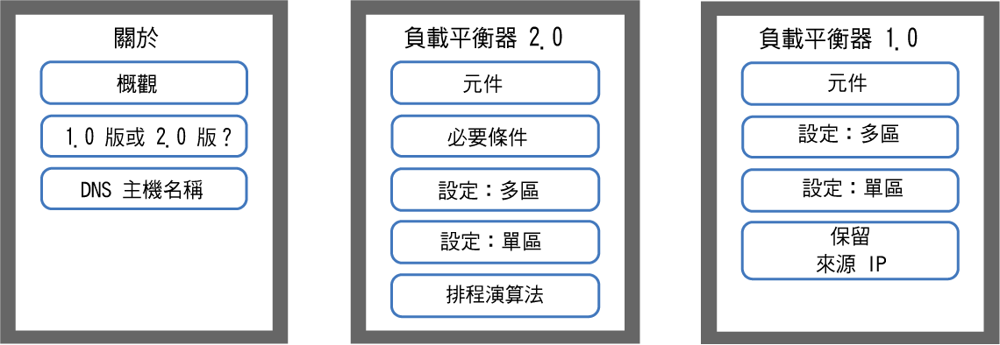
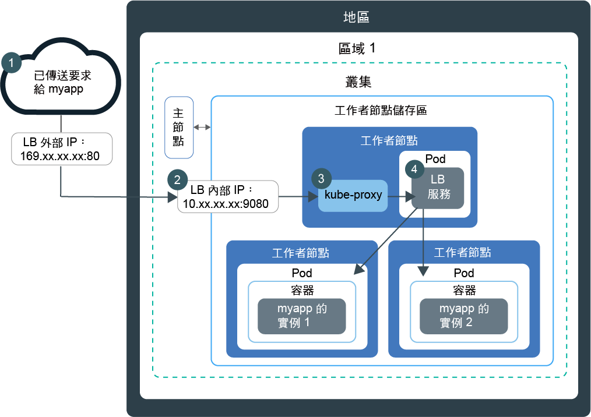
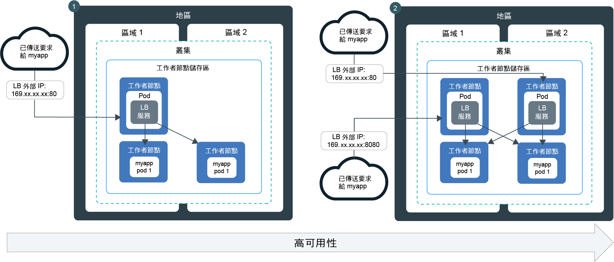
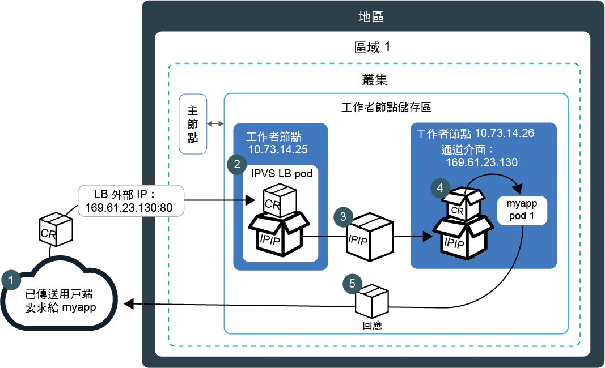
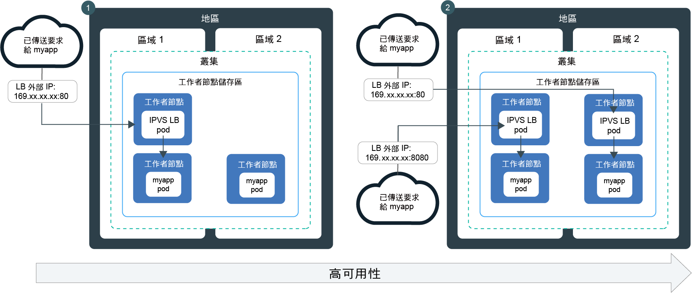

---

copyright:
  years: 2014, 2019
lastupdated: "2019-06-05"

keywords: kubernetes, iks, lb2.0, nlb, health check

subcollection: containers

---

{:new_window: target="_blank"}
{:shortdesc: .shortdesc}
{:screen: .screen}
{:pre: .pre}
{:table: .aria-labeledby="caption"}
{:codeblock: .codeblock}
{:tip: .tip}
{:note: .note}
{:important: .important}
{:deprecated: .deprecated}
{:download: .download}
{:preview: .preview}


# 使用網路負載平衡器 (NLB) 的基本及 DSR 負載平衡
{: #loadbalancer}

公開埠並使用可攜式 IP 位址，讓第 4 層網路負載平衡器 (NLB) 可以存取容器化應用程式。
{:shortdesc}

選擇下列其中一個選項以開始使用：


<map name="image-map">
    <area target="" alt="概觀" title="概觀" href="#lb_overview" coords="35,44,175,72" shape="rect">
    <area target="" alt="1.0 版與 2.0 版負載平衡器的比較" title="1.0 版與 2.0 版負載平衡器的比較" href="#comparison" coords="34,83,173,108" shape="rect">
    <area target="" alt="登錄負載平衡器主機名稱" title="登錄負載平衡器主機名稱" href="#loadbalancer_hostname" coords="33,119,174,146" shape="rect">
    <area target="" alt="2.0 版：元件和架構（測試版）" title="2.0 版：元件和架構（測試版）" href="#planning_ipvs" coords="273,45,420,72" shape="rect">
    <area target="" alt="2.0 版：必要條件" title="2.0 版：必要條件" href="#ipvs_provision" coords="277,85,417,108" shape="rect">
    <area target="" alt="2.0 版：在多區域叢集裡設定負載平衡器 2.0" title="2.0 版：在多區域叢集裡設定負載平衡器 2.0" href="#ipvs_multi_zone_config" coords="276,122,417,147" shape="rect">
    <area target="" alt="2.0 版：在單一區域叢集裡設定負載平衡器 2.0" title="2.0 版：在單一區域叢集裡設定負載平衡器 2.0" href="#ipvs_single_zone_config" coords="277,156,419,184" shape="rect">
    <area target="" alt="2.0 版：排程演算法" title="2.0 版：排程演算法" href="#scheduling" coords="276,196,419,220" shape="rect">
    <area target="" alt="1.0 版：元件和架構" title="1.0 版：元件和架構" href="#v1_planning" coords="519,47,668,74" shape="rect">
    <area target="" alt="1.0 版：在多區域叢集裡設定負載平衡器 1.0" title="1.0 版：在多區域叢集裡設定負載平衡器 1.0" href="#multi_zone_config" coords="520,85,667,110" shape="rect">
    <area target="" alt="1.0 版：在單一區域叢集裡設定負載平衡器 1.0" title="1.0 版：在單一區域叢集裡設定負載平衡器 1.0" href="#lb_config" coords="520,122,667,146" shape="rect">
    <area target="" alt="1.0 版：啟用來源 IP 保留" title="1.0 版：啟用來源 IP 保留" href="#node_affinity_tolerations" coords="519,157,667,194" shape="rect">
</map>
</br>

若要快速開始使用，您可以執行下列指令來建立負載平衡器 1.0：
```
kubectl expose deploy my-app --port=80 --target-port=8080 --type=LoadBalancer --name my-lb-svc
```
{: pre}

## 概觀
{: #lb_overview}

當您建立標準叢集時，{{site.data.keyword.containerlong}} 會自動佈建 1 個可攜式公用子網路及 1 個可攜式專用子網路。
{: shortdesc}

* 可攜式公用子網路提供 5 個可用 IP 位址。1 個可攜式公用 IP 位址是由預設[公用 Ingress ALB](/docs/containers?topic=containers-ingress) 使用。藉由建立公用網路負載平衡器服務或 NLB，即可使用其餘 4 個可攜式公用 IP 位址，將單一應用程式公開至網際網路。
* 可攜式專用子網路提供 5 個可用 IP 位址。1 個可攜式專用 IP 位址是由預設[專用 Ingress ALB](/docs/containers?topic=containers-ingress#private_ingress) 使用。藉由建立專用負載平衡器服務或 NLB，即可使用其餘 4 個可攜式專用 IP 位址，將單一應用程式公開至專用網路。

可攜式公用及專用 IP 位址是靜態浮動 IP，而且不會在移除工作者節點時變更。如果移除 NLB IP 位址所在的工作者節點，則持續監視 IP 的 Keepalived 常駐程式會自動將 IP 移至另一個工作者節點。您可以將任何埠指派給 NLB。NLB 服務是作為應用程式送入要求的外部進入點。若要從網際網路存取 NLB，您可以使用 NLB 的公用 IP 位址以及 `<IP_address>:<port>` 格式的已指派埠。您也可以使用主機名稱登錄 NLB IP 位址，來建立 NLB 的 DNS 項目。

當您使用 NLB 服務公開應用程式時，也會透過服務的 NodePort 自動讓您的應用程式可供使用。叢集內每個工作者節點的每個公用及專用 IP 位址上都可以存取 [NodePort](/docs/containers?topic=containers-nodeport)。若要在使用 NLB 時封鎖流向 NodePort 的資料流量，請參閱[控制網路負載平衡器 (NLB) 或 NodePort 服務的入埠資料流量](/docs/containers?topic=containers-network_policies#block_ingress)。

<br />


## 1.0 版和 2.0 版 NLB 中基本負載平衡和 DSR 負載平衡的比較
{: #comparison}

建立 NLB 時，可以選擇 1.0 版 NLB（執行基本負載平衡）或 2.0 版 NLB（執行直接伺服器傳回 (DSR) 負載平衡）。請注意，2.0 版 NLB 是測試版。
{: shortdesc}

**1.0 版與 2.0 版 NLB 有何類似之處？**

1.0 版及 2.0 版 NLB 都是第 4 層負載平衡器，僅存在於 Linux Kernel 空間中。這兩個版本都在叢集內執行，並使用工作者節點資源。因此，NLB 的可用容量一律為您自己的叢集所專用。此外，這兩個版本的 NLB 不會終止連線。相反地，它們會將連線轉遞至應用程式 Pod。

**1.0 版與 2.0 版 NLB 有何不同？**

當用戶端將要求傳送至您的應用程式時，NLB 會將要求封包遞送至應用程式 Pod 所在的工作者節點 IP 位址。1.0 版 NLB 會使用網址轉換 (NAT)，將要求封包的來源 IP 位址重寫為負載平衡器 Pod 所在之工作者節點的 IP。當工作者節點傳回應用程式回應封包時，會使用 NLB 所在的工作者節點 IP。然後，NLB 必須將回應封包傳送至用戶端。若要防止 IP 位址重寫，您可以[啟用來源 IP 保留](#node_affinity_tolerations)。不過，來源 IP 保留需要負載平衡器 Pod 和應用程式 Pod 在相同的工作者節點上執行，以便要求不需要轉遞至另一個工作者節點。您必須將節點親緣性及容忍新增至應用程式 Pod。如需使用 1.0 版 NB 進行基本負載平衡的相關資訊，請參閱 [1.0 版：基本負載平衡的元件和架構](#v1_planning)。

相對於 1.0 版 NLB，2.0 版 NLB 在轉遞要求至其他工作者節點上的應用程式 Pod 時，不會使用 NAT。當 NLB 2.0 遞送用戶端要求時，會使用 IP over IP (IPIP) 將原始要求封包封裝至另一個新封包。此封裝 IPIP 封包具有負載平衡器 Pod 所在之工作者節點的來源 IP，如此可讓原始要求封包保留用戶端 IP 作為其來源 IP 位址。然後，工作者節點會使用直接伺服器傳回 (DSR)，將應用程式回應封包傳送至用戶端 IP。回應封包會跳過 NLB，並直接傳送至用戶端，因而可減少 NLB 必須處理的資料流量。如需使用 2.0 版 NB 進行 DSR 負載平衡的相關資訊，請參閱 [2.0 版：DSR 負載平衡的元件和架構](#planning_ipvs)。

<br />


## 1.0 版：基本負載平衡的元件和架構
{: #v1_planning}

TCP/UDP 網路負載平衡器 (NLB) 1.0 會使用 Iptables（Linux Kernel 特性），跨應用程式的 Pod 對要求進行負載平衡。
{: shortdesc}

### 單一區域叢集裡的資料傳輸流
{: #v1_single}

下圖顯示 NLB 1.0 如何將通訊從網際網路導向至單一區域叢集裡的應用程式。
{: shortdesc}



1. 應用程式的要求使用 NLB 的公用 IP 位址及工作者節點上的已指派埠。

2. 要求會自動轉遞至 NLB 服務的內部叢集 IP 位址及埠。內部叢集 IP 位址只能在叢集內部存取。

3. `kube-proxy` 會將要求遞送至應用程式的 NLB 服務。

4. 要求會轉遞至應用程式 Pod 的專用 IP 位址。要求套件的來源 IP 位址會變更為應用程式 Pod 執行所在之工作者節點的公用 IP 位址。如果叢集裡已部署多個應用程式實例，則 NLB 會在應用程式 Pod 之間遞送要求。

### 多區域叢集裡的資料傳輸流
{: #v1_multi}

下圖顯示網路負載平衡器 (NLB) 1.0 如何將通訊從網際網路導向至多區域叢集裡的應用程式。
{: shortdesc}



依預設，每個 NLB 1.0 只會設定在某個區域中。若要達到高可用性，必須在您具有應用程式實例的每個區域中部署 NLB 1.0。各種區域中的 NLB 會以循環式週期處理要求。此外，每個 NLB 都會將要求遞送至其專屬區域中的應用程式實例，以及遞送至其他區域中的應用程式實例。

<br />


## 1.0 版：在多區域叢集裡設定 NLB 1.0
{: #multi_zone_config}

**開始之前**：
* 若要在多個區域中建立公用網路負載平衡器 (NLB)，則必須至少有一個公用 VLAN 在每個區域中都具有可用的可攜式子網路。若要在多個區域中建立專用 NLB，則必須至少有一個專用 VLAN 在每個區域中都具有可用的可攜式子網路。您可以遵循[配置叢集子網路](/docs/containers?topic=containers-subnets)中的步驟，來新增子網路。
* 如果您將網路資料流量限制為邊緣工作者節點，請確定在每個區域中至少啟用 2 個[邊緣工作者節點](/docs/containers?topic=containers-edge#edge)，以統一部署 NLB。
* 針對您的 IBM Cloud 基礎架構 (SoftLayer) 帳戶啟用 [VLAN Spanning](/docs/infrastructure/vlans?topic=vlans-vlan-spanning#vlan-spanning)，讓您的工作者節點可在專用網路上彼此通訊。若要執行此動作，您需要**網路 > 管理網路 VLAN Spanning** [基礎架構許可權](/docs/containers?topic=containers-users#infra_access)，或者您可以要求帳戶擁有者啟用它。若要確認是否已啟用 VLAN Spanning，請使用 `ibmcloud ks vlan-spanning-get --region <region>` [指令](/docs/containers?topic=containers-cli-plugin-kubernetes-service-cli#cs_vlan_spanning_get)。
* 確定您具有 `default` 名稱空間的[**撰寫者**或**管理員** {{site.data.keyword.Bluemix_notm}} IAM 服務角色](/docs/containers?topic=containers-users#platform)。


若要在多區域叢集裡設定 NLB 1.0 服務，請執行下列動作：
1.  [將應用程式部署至叢集](/docs/containers?topic=containers-app#app_cli)。請確定您已將標籤新增至您部署中配置檔的 meta 資料區段。此標籤是識別您應用程式執行所在之所有 Pod 的必要項目，如此才能將 Pod 包含在負載平衡中。

2.  為您要公開至公用網際網路或專用網路的應用程式建立負載平衡器服務。
  1. 例如，建立名稱為 `myloadbalancer.yaml` 的服務配置檔。
  2. 為您要公開的應用程式定義負載平衡器服務。您可以指定區域、VLAN 及 IP 位址。

      ```
      apiVersion: v1
      kind: Service
      metadata:
        name: myloadbalancer
        annotations:
          service.kubernetes.io/ibm-load-balancer-cloud-provider-ip-type: <public_or_private>
          service.kubernetes.io/ibm-load-balancer-cloud-provider-zone: "<zone>"
          service.kubernetes.io/ibm-load-balancer-cloud-provider-vlan: "<vlan_id>"
      spec:
        type: LoadBalancer
        selector:
          <selector_key>: <selector_value>
        ports:
         - protocol: TCP
             port: 8080
          loadBalancerIP: <IP_address>
        ```
      {: codeblock}

      <table>
      <caption>瞭解 YAML 檔案元件</caption>
      <thead>
      <th colspan=2> 瞭解 YAML 檔案元件</th>
      </thead>
      <tbody>
      <tr>
        <td><code>service.kubernetes.io/ibm-load-balancer-cloud-provider-ip-type:</code>
          <td>用來指定 <code>private</code> 或 <code>public</code> 負載平衡器的註釋。</td>
      </tr>
      <tr>
        <td><code>service.kubernetes.io/ibm-load-balancer-cloud-provider-zone:</code>
        <td>用來指定負載平衡器服務要部署至其中之區域的註釋。若要查看區域，請執行 <code>ibmcloud ks zones</code>。</td>
      </tr>
      <tr>
        <td>`service.kubernetes.io/ibm-load-balancer-cloud-provider-vlan:`
        <td>用來指定負載平衡器服務要部署至其中之 VLAN 的註釋。若要查看 VLAN，請執行 <code>ibmcloud ks vlans --zone <zone></code>。</td>
      </tr>
      <tr>
        <td><code>selector</code></td>
        <td>您在應用程式部署 YAML 的 <code>spec.template.metadata.labels</code> 區段中使用的標籤索引鍵 (<em>&lt;selector_key&gt;</em>) 和值 (<em>&lt;selector_value&gt;</em>)。</td>
      </tr>
      <tr>
        <td><code>port</code></td>
        <td>服務所接聽的埠。</td>
      </tr>
      <tr>
        <td><code>loadBalancerIP</code></td>
        <td>選用項目：若要建立專用負載平衡器，或針對公用負載平衡器使用特定的可攜式 IP 位址，請指定您要使用的 IP 位址。IP 位址必須位於您在註釋中指定的 VLAN 和區域上。如果您未指定 IP 位址：<ul><li>如果叢集是在公用 VLAN 上，則會使用可攜式公用 IP 位址。大部分叢集都在公用 VLAN 上。</li><li>如果叢集只能在專用 VLAN 上使用，則會使用可攜式專用 IP 位址。</li></ul></td>
      </tr>
      </tbody></table>

      這個配置檔範例用來建立專用 NLB 1.0 服務，其會使用 `dal12` 中專用 VLAN `2234945` 上指定的 IP 位址：

      ```
      apiVersion: v1
      kind: Service
      metadata:
        name: myloadbalancer
        annotations:
          service.kubernetes.io/ibm-load-balancer-cloud-provider-ip-type: private
          service.kubernetes.io/ibm-load-balancer-cloud-provider-zone: "dal12"
          service.kubernetes.io/ibm-load-balancer-cloud-provider-vlan: "2234945"
      spec:
        type: LoadBalancer
        selector:
          app: nginx
        ports:
         - protocol: TCP
           port: 8080
        loadBalancerIP: 172.21.xxx.xxx
      ```
      {: codeblock}

  3. 選用項目：在 `spec.loadBalancerSourceRanges` 欄位中指定 IP，讓 NLB 服務僅可用於有限範圍的 IP 位址。`loadBalancerSourceRanges` 是由叢集裡的 `kube-proxy` 透過工作者節點的 Iptables 規則予以實作。如需相關資訊，請參閱 [Kubernetes 文件 ](https://kubernetes.io/docs/tasks/access-application-cluster/configure-cloud-provider-firewall/)。

  4. 在叢集裡建立服務。

      ```
        kubectl apply -f myloadbalancer.yaml
        ```
      {: pre}

3. 驗證已順利建立 NLB 服務。這可能需要幾分鐘的時間，才能建立服務，並讓應用程式可供使用。

    ```
    kubectl describe service myloadbalancer
    ```
    {: pre}

    CLI 輸出範例：

    ```
    Name:                   myloadbalancer
    Namespace:              default
    Labels:                 <none>
    Selector:               app=liberty
    Type:                   LoadBalancer
    Zone:                   dal10
    IP:                     172.21.xxx.xxx
    LoadBalancer Ingress:   169.xx.xxx.xxx
    Port:                   <unset> 8080/TCP
    NodePort:               <unset> 32040/TCP
    Endpoints:              172.30.xxx.xxx:8080
    Session Affinity:       None
    Events:
      FirstSeen	LastSeen	Count	From			SubObjectPath	Type	 Reason			          Message
      ---------	--------	-----	----			-------------	----	 ------			          -------
      10s		    10s		    1	    {service-controller }	  Normal CreatingLoadBalancer	Creating load balancer
      10s		    10s		    1	    {service-controller }		Normal CreatedLoadBalancer	Created load balancer
    ```
    {: screen}

    **LoadBalancer Ingress** IP 位址是已指派給 NLB 服務的可攜式 IP 位址。

4.  如果您已建立公用 NLB，請從網際網路存取您的應用程式。
    1.  開啟偏好的 Web 瀏覽器。
    2.  輸入 NLB 的可攜式公用 IP 位址及埠。

        ```
        http://169.xx.xxx.xxx:8080
        ```
        {: codeblock}    

5. 重複步驟 2 - 4，以在每個區域中新增 1.0 版 NLB。    

6. 如果您選擇[針對 NLB 1.0 啟用來源 IP 保留](#node_affinity_tolerations)，請[將邊緣節點親緣性新增至應用程式 Pod](#lb_edge_nodes)，來確保在邊緣工作者節點上排定應用程式 Pod。必須在邊緣節點上排定應用程式 Pod，才能接收送入要求。

7. 選用項目：負載平衡器服務也可讓您的應用程式透過服務的 NodePort 提供使用。叢集內每個節點的每個公用及專用 IP 位址上都可以存取 [NodePort](/docs/containers?topic=containers-nodeport)。若要在使用 NLB 服務時封鎖流向 NodePort 的資料流量，請參閱[控制網路負載平衡器 (NLB) 或 NodePort 服務的入埠資料流量](/docs/containers?topic=containers-network_policies#block_ingress)。

接下來，您可以[登錄 NLB 主機名稱](#loadbalancer_hostname)。

<br />


## 1.0 版：在單一區域叢集裡設定 NLB 1.0
{: #lb_config}

**開始之前**：
* 您必須具有可指派給網路負載平衡器 (NLB) 服務的可用可攜式公用或專用 IP 位址。如需相關資訊，請參閱[配置叢集的子網路](/docs/containers?topic=containers-subnets)。
* 確定您具有 `default` 名稱空間的[**撰寫者**或**管理員** {{site.data.keyword.Bluemix_notm}} IAM 服務角色](/docs/containers?topic=containers-users#platform)。

若要在單一區域叢集裡建立 NLB 1.0 服務，請執行下列動作：

1.  [將應用程式部署至叢集](/docs/containers?topic=containers-app#app_cli)。請確定您已將標籤新增至您部署中配置檔的 meta 資料區段。此標籤是識別您應用程式執行所在之所有 Pod 的必要項目，如此才能將 Pod 包含在負載平衡中。
2.  為您要公開至公用網際網路或專用網路的應用程式建立負載平衡器服務。
    1.  例如，建立名稱為 `myloadbalancer.yaml` 的服務配置檔。

    2.  為您要公開的應用程式定義負載平衡器服務。
        ```
        apiVersion: v1
        kind: Service
        metadata:
          name: myloadbalancer
          annotations:
            service.kubernetes.io/ibm-load-balancer-cloud-provider-ip-type: <public_or_private>
            service.kubernetes.io/ibm-load-balancer-cloud-provider-vlan: "<vlan_id>"
        spec:
          type: LoadBalancer
          selector:
            <selector_key>: <selector_value>
          ports:
           - protocol: TCP
             port: 8080
          loadBalancerIP: <IP_address>
          externalTrafficPolicy: Local
        ```
        {: codeblock}

        <table>
        <caption>瞭解 YAML 檔案元件</caption>
        <thead>
        <th colspan=2> 瞭解 YAML 檔案元件</th>
        </thead>
        <tbody>
        <tr>
          <td>`service.kubernetes.io/ibm-load-balancer-cloud-provider-ip-type:`
          <td>用來指定 <code>private</code> 或 <code>public</code> 負載平衡器的註釋。</td>
        </tr>
        <tr>
          <td>`service.kubernetes.io/ibm-load-balancer-cloud-provider-vlan:`
          <td>用來指定負載平衡器服務要部署至其中之 VLAN 的註釋。若要查看 VLAN，請執行 <code>ibmcloud ks vlans --zone <zone></code>。</td>
        </tr>
        <tr>
          <td><code>selector</code></td>
          <td>您在應用程式部署 YAML 的 <code>spec.template.metadata.labels</code> 區段中使用的標籤索引鍵 (<em>&lt;selector_key&gt;</em>) 和值 (<em>&lt;selector_value&gt;</em>)。</td>
        </tr>
        <tr>
          <td><code>port</code></td>
          <td>服務所接聽的埠。</td>
        </tr>
        <tr>
          <td><code>loadBalancerIP</code></td>
          <td>選用項目：若要建立專用負載平衡器，或針對公用負載平衡器使用特定的可攜式 IP 位址，請指定您要使用的 IP 位址。IP 位址必須位於您在註釋中指定的 VLAN 上。如果您未指定 IP 位址：<ul><li>如果叢集是在公用 VLAN 上，則會使用可攜式公用 IP 位址。大部分叢集都在公用 VLAN 上。</li><li>如果叢集只能在專用 VLAN 上使用，則會使用可攜式專用 IP 位址。</li></ul></td>
        </tr>
        </tbody></table>

        這個配置檔範例用來建立專用 NLB 1.0 服務，其會使用專用 VLAN `2234945` 上指定的 IP 位址：

        ```
        apiVersion: v1
        kind: Service
        metadata:
          name: myloadbalancer
          annotations:
            service.kubernetes.io/ibm-load-balancer-cloud-provider-ip-type: private
            service.kubernetes.io/ibm-load-balancer-cloud-provider-vlan: "2234945"
        spec:
          type: LoadBalancer
          selector:
            app: nginx
          ports:
           - protocol: TCP
             port: 8080
          loadBalancerIP: 172.21.xxx.xxx
        ```
        {: codeblock}

    3. 選用項目：在 `spec.loadBalancerSourceRanges` 欄位中指定 IP，讓 NLB 服務僅可用於有限範圍的 IP 位址。`loadBalancerSourceRanges` 是由叢集裡的 `kube-proxy` 透過工作者節點的 Iptables 規則予以實作。如需相關資訊，請參閱 [Kubernetes 文件 ](https://kubernetes.io/docs/tasks/access-application-cluster/configure-cloud-provider-firewall/)。

    4.  在叢集裡建立服務。

        ```
        kubectl apply -f myloadbalancer.yaml
        ```
        {: pre}

3.  驗證已順利建立 NLB 服務。這可能需要幾分鐘的時間，才能建立服務，並讓應用程式可供使用。

    ```
    kubectl describe service myloadbalancer
    ```
    {: pre}

    CLI 輸出範例：

    ```
    Name:                   myloadbalancer
    Namespace:              default
    Labels:                 <none>
    Selector:               app=liberty
    Type:                   LoadBalancer
    Location:               dal10
    IP:                     172.21.xxx.xxx
    LoadBalancer Ingress:   169.xx.xxx.xxx
    Port:                   <unset> 8080/TCP
    NodePort:               <unset> 32040/TCP
    Endpoints:              172.30.xxx.xxx:8080
    Session Affinity:       None
    Events:
      FirstSeen	LastSeen	Count	From			SubObjectPath	Type	 Reason			          Message
      ---------	--------	-----	----			-------------	----	 ------			          -------
      10s		    10s		    1	    {service-controller }	  Normal CreatingLoadBalancer	Creating load balancer
      10s		    10s		    1	    {service-controller }		Normal CreatedLoadBalancer	Created load balancer
    ```
    {: screen}

    **LoadBalancer Ingress** IP 位址是已指派給 NLB 服務的可攜式 IP 位址。

4.  如果您已建立公用 NLB，請從網際網路存取您的應用程式。
    1.  開啟偏好的 Web 瀏覽器。
    2.  輸入 NLB 的可攜式公用 IP 位址及埠。

        ```
        http://169.xx.xxx.xxx:8080
        ```
        {: codeblock}

5. 如果您選擇[針對 NLB 1.0 啟用來源 IP 保留](#node_affinity_tolerations)，請[將邊緣節點親緣性新增至應用程式 Pod](#lb_edge_nodes)，來確保在邊緣工作者節點上排定應用程式 Pod。必須在邊緣節點上排定應用程式 Pod，才能接收送入要求。

6. 選用項目：負載平衡器服務也可讓您的應用程式透過服務的 NodePort 提供使用。叢集內每個節點的每個公用及專用 IP 位址上都可以存取 [NodePort](/docs/containers?topic=containers-nodeport)。若要在使用 NLB 服務時封鎖流向 NodePort 的資料流量，請參閱[控制網路負載平衡器 (NLB) 或 NodePort 服務的入埠資料流量](/docs/containers?topic=containers-network_policies#block_ingress)。

接下來，您可以[登錄 NLB 主機名稱](#loadbalancer_hostname)。

<br />


## 1.0 版：啟用來源 IP 保留
{: #node_affinity_tolerations}

此特性僅適用於 1.0 版網路負載平衡器 (NLB)。在 2.0 版 NLB 中，依預設會保留用戶端要求的來源 IP 位址。
{: note}

將應用程式的用戶端要求傳送至叢集時，負載平衡器服務 Pod 會接收此要求。如果沒有應用程式 Pod 存在於與負載平衡器服務 Pod 相同的工作者節點上，NLB 會將要求轉遞至不同工作者節點上的應用程式 Pod。套件的來源 IP 位址會變更為負載平衡器服務 Pod 執行所在之工作者節點的公用 IP 位址。
{: shortdesc}

若要保留用戶端要求的原始來源 IP 位址，您可以針對負載平衡器服務[啟用來源 IP ](https://kubernetes.io/docs/tasks/access-application-cluster/create-external-load-balancer/#preserving-the-client-source-ip)。TCP 連線會繼續一路連線至應用程式 Pod，讓應用程式可以看到起始器的實際來源 IP 位址。例如，當應用程式伺服器必須套用安全及存取控制原則時，保留用戶端的 IP 是很有用的。

在啟用來源 IP 之後，負載平衡器服務 Pod 必須將要求轉遞至僅部署至相同工作者節點的應用程式 Pod。一般而言，負載平衡器服務 Pod 也會部署至應用程式 Pod 部署至其中的工作者節點。不過，存在某些狀況，可能未在相同的工作者節點上排定負載平衡器 Pod 及應用程式 Pod。


* 您的邊緣節點已有污點，因此只有負載平衡器服務 Pod 可以部署至其中。不允許將應用程式 Pod 部署至那些節點。
* 您的叢集連接至多個公用或專用 VLAN，但您的應用程式 Pod 可能部署至僅連接至某個 VLAN 的工作者節點。負載平衡器服務 Pod 可能未部署至那些工作者節點，因為 NLB IP 位址連接至與工作者節點不同的 VLAN。

若要將您的應用程式強制部署至負載平衡器服務 Pod 也可以部署至其中的特定工作者節點，您必須將親緣性規則及容忍新增至您的應用程式部署。

### 新增邊緣節點親緣性規則及容忍
{: #lb_edge_nodes}

當您[將工作者節點標示為邊緣節點](/docs/containers?topic=containers-edge#edge_nodes)，且同時[為邊緣節點加上污點](/docs/containers?topic=containers-edge#edge_workloads)時，負載平衡器服務 Pod 只會部署至那些邊緣節點，而且應用程式 Pod 無法部署至邊緣節點。啟用 NLB 服務的來源 IP 時，邊緣節點上的負載平衡器 Pod 無法將送入要求轉遞至其他工作者節點上的應用程式 Pod。
{:shortdesc}

若要強制您的應用程式 Pod 部署至邊緣節點，請將邊緣節點[親緣性規則 ](https://kubernetes.io/docs/concepts/configuration/assign-pod-node/#node-affinity-beta-feature) 及[容忍 ](https://kubernetes.io/docs/concepts/configuration/taint-and-toleration/#concepts) 新增至應用程式部署。

具有邊緣節點親緣性及邊緣節點容忍的部署 YAML 檔案範例：

```
apiVersion: apps/v1
kind: Deployment
metadata:
  name: with-node-affinity
spec:
  selector:
    matchLabels:
      <label_name>: <label_value>
  template:
    spec:
      affinity:
        nodeAffinity:
          requiredDuringSchedulingIgnoredDuringExecution:
            nodeSelectorTerms:
            - matchExpressions:
              - key: dedicated
                operator: In
                values:
                - edge
      tolerations:
        - key: dedicated
          value: edge
...
```
{: codeblock}

**affinity** 及 **tolerations** 區段同時具有 `dedicated` 作為 `key`，及具有 `edge` 作為 `value`。

### 新增多個公用或專用 VLAN 的親緣性規則
{: #edge_nodes_multiple_vlans}

當您的叢集連接至多個公用或專用 VLAN 時，您的應用程式 Pod 可能部署至僅連接至某個 VLAN 的工作者節點。如果 NLB IP 位址連接至與這些工作者節點不同的 VLAN，則負載平衡器服務 Pod 不會部署至那些工作者節點。
{:shortdesc}

啟用來源 IP 時，請將親緣性規則新增至應用程式部署，以在其 VLAN 與 NLB 的 IP 位址相同的工作者節點上排定應用程式 Pod。

開始之前：[登入您的帳戶。適用的話，請將適當的資源群組設為目標。設定叢集的環境定義。](/docs/containers?topic=containers-cs_cli_install#cs_cli_configure)

1. 取得 NLB 服務的 IP 位址。在 **LoadBalancer Ingress** 欄位中尋找 IP 位址。
    ```
    kubectl describe service <loadbalancer_service_name>
    ```
    {: pre}

2. 擷取 NLB 服務連接至其中的 VLAN ID。

    1. 列出叢集的可攜式公用 VLAN。
        ```
        ibmcloud ks cluster-get --cluster <cluster_name_or_ID> --showResources
        ```
        {: pre}

        輸出範例：
        ```
        ...

        Subnet VLANs
        VLAN ID   Subnet CIDR       Public   User-managed
        2234947   10.xxx.xx.xxx/29  false    false
        2234945   169.36.5.xxx/29   true     false
        ```
        {: screen}

    2. 在 **Subnet VLANs** 下的輸出中，尋找符合您先前所擷取之 NLB IP 位址的子網路 CIDR，並記下 VLAN ID。

        例如，如果 NLB 服務 IP 位址為 `169.36.5.xxx`，則前一個步驟之輸出範例中的相符子網路為 `169.36.5.xxx/29`。子網路連接至其中的 VLAN ID 為 `22334945`。

3. 針對您在前一個步驟中記下的 VLAN ID，[新增親緣性規則 ](https://kubernetes.io/docs/concepts/configuration/assign-pod-node/#node-affinity-beta-feature) 至應用程式部署。

    比方說，如果您有數個 VLAN，但想要應用程式 Pod 僅部署至 `2234945` 公用 VLAN 上的工作者節點，請執行下列指令：

    ```
    apiVersion: apps/v1
    kind: Deployment
    metadata:
      name: with-node-affinity
    spec:
      selector:
        matchLabels:
          <label_name>: <label_value>
      template:
        spec:
          affinity:
            nodeAffinity:
              requiredDuringSchedulingIgnoredDuringExecution:
                nodeSelectorTerms:
                - matchExpressions:
                  - key: publicVLAN
                    operator: In
                    values:
                    - "2234945"
    ...
    ```
    {: codeblock}

    在 YAML 範例中，**affinity** 區段具有 `publicVLAN` 作為 `key`，以及具有 `"224945"` 作為 `value`。

4. 套用已更新的部署配置檔。
    ```
    kubectl apply -f with-node-affinity.yaml
    ```
    {: pre}

5. 驗證部署至工作者節點的應用程式 Pod 是否已連接至指定的 VLAN。

    1. 列出叢集裡的 Pod。將 `<selector>` 取代為您用於應用程式的標籤。
        ```
        kubectl get pods -o wide app=<selector>
        ```
        {: pre}

        輸出範例：
        ```
        NAME                   READY     STATUS              RESTARTS   AGE       IP               NODE
        cf-py-d7b7d94db-vp8pq  1/1       Running             0          15d       172.30.xxx.xxx   10.176.48.78
        ```
        {: screen}

    2. 在輸出中，識別應用程式的 Pod。記下 Pod 所在之工作者節點的**節點** ID。

        在前一個步驟的輸出範例中，應用程式 Pod `cf-py-d7b7d94db-vp8pq` 位於工作者節點 `10.176.48.78` 上。

    3. 列出工作者節點的詳細資料。

        ```
        kubectl describe node <worker_node_ID>
        ```
        {: pre}

        輸出範例：

        ```
        Name:                   10.xxx.xx.xxx
        Role:
        Labels:                 arch=amd64
                                beta.kubernetes.io/arch=amd64
                                beta.kubernetes.io/os=linux
                                failure-domain.beta.kubernetes.io/region=us-south
                                failure-domain.beta.kubernetes.io/zone=dal10
                                ibm-cloud.kubernetes.io/encrypted-docker-data=true
                                kubernetes.io/hostname=10.xxx.xx.xxx
                                privateVLAN=2234945
                                publicVLAN=2234967
        ...
        ```
        {: screen}

    4. 在輸出的 **Labels** 區段中，驗證公用或專用 VLAN 是否為您在先前步驟中指定的 VLAN。

<br />


## 2.0 版：元件和架構（測試版）
{: #planning_ipvs}

網路負載平衡器 (NLB) 2.0 功能為測試版。若要使用 NLB 2.0，您必須[更新叢集的主節點及工作者節點](/docs/containers?topic=containers-update)至 Kubernetes 1.12 版或更新版本。
{: note}

NLB 2.0 是使用 Linux Kernel 的「IP 虛擬伺服器 (IPVS)」的第 4 層負載平衡器。NLB 2.0 支援 TCP 和 UDP、在多個工作者節點的前面執行，並使用 IP over IP (IPIP) 通道作業，將到達單一 NLB IP 位址的資料流量分佈到那些工作者節點。

想要 {{site.data.keyword.containerlong_notm}} 中可用負載平衡部署模式的其他詳細資料嗎？請參閱此[部落格文章 ](https://www.ibm.com/blogs/bluemix/2018/10/ibm-cloud-kubernetes-service-deployment-patterns-for-maximizing-throughput-and-availability/)。
{: tip}

### 單一區域叢集裡的資料傳輸流
{: #ipvs_single}

下圖顯示 NLB 2.0 如何將通訊從網際網路導向至單一區域叢集裡的應用程式。
{: shortdesc}



1. 應用程式的用戶端要求會使用 NLB 的公用 IP 位址及工作者節點上的已指派埠。在此範例中，NLB 的虛擬 IP 位址為 169.61.23.130，目前位於工作者節點 10.73.14.25 上。

2. NLB 會在 IPIP 封包（標示為 "IPIP"）內封裝用戶端要求封包（在映像檔中標示為 "CR"）。用戶端要求封包會將用戶端 IP 保留為其來源 IP 位址。IPIP 封裝封包會使用工作者節點 10.73.14.25 IP 作為其來源 IP 位址。

3. NLB 會將 IPIP 封包遞送至應用程式 Pod 所在的工作者節點，即 10.73.14.26。如果叢集裡已部署多個應用程式實例，則 NLB 會在應用程式 Pod 部署所在的工作者節點之間遞送要求。

4. 工作者節點 10.73.14.26 會解壓縮 IPIP 封裝封包，然後解壓縮用戶端要求封包。用戶端要求封包會轉遞至該工作者節點上的應用程式 Pod。

5. 然後，工作者節點 10.73.14.26 會使用來自原始要求封包的來源 IP 位址（用戶端 IP），將應用程式 Pod 的回應封包直接傳回給用戶端。

### 多區域叢集裡的資料傳輸流
{: #ipvs_multi}

透過多區域叢集的資料傳輸流與[透過單一區域叢集的資料傳輸流](#ipvs_single)遵循相同的路徑。在多區域叢集裡，NLB 會將要求遞送至其專屬區域中的應用程式實例，以及遞送至其他區域中的應用程式實例。下圖顯示每個區域中的 2.0 版 NLB 如何將網際網路中的資料流量導向至多區域叢集裡的應用程式。
{: shortdesc}



依預設，每個 2.0 版 NLB 只會設定在某個區域中。在您具有應用程式實例的每個區域中部署 2.0 版 NLB，即可達到更高可用性。

<br />


## 2.0 版：必要條件
{: #ipvs_provision}

您無法將現有的 1.0 版 NLB 更新至 2.0。您必須建立新的 NLB 2.0。請注意，您可以在叢集裡同步執行 1.0 版及 2.0 版 NLB。
{: shortdesc}

在建立 NLB 2.0 之前，您必須完成下列必要步驟。

1. [更新叢集的主節點及工作者節點](/docs/containers?topic=containers-update)至 Kubernetes 1.12 版或更新版本。

2. 若要容許 NLB 2.0 將要求轉遞到多個區域中的應用程式 Pod，請開立支援案例以要求對 VLAN 進行容量聚集。此配置設定不會導致任何網路中斷。
    1. 登入 [{{site.data.keyword.Bluemix_notm}} 主控台](https://cloud.ibm.com/)。
    2. 從功能表列，按一下**支援**，按一下**管理案例**標籤，然後按一下**建立新的案例**。
    3. 在案例欄位中，輸入下列內容：
       * 對於支援類型，選取**技術**。
       * 對於種類，選取 **VLAN Spanning**。
       * 對於主旨，輸入 **Public VLAN Network Question**。
    4. 將下列資訊新增至說明：「請設定網路，以容許在與我的帳戶相關聯的公用 VLAN 上進行容量聚集。此要求的參照問題單如下：https://control.softlayer.com/support/tickets/63859145」。請注意，如果要容許特定 VLAN 上的容量聚集（例如，僅一個叢集的公用 VLAN），則可以在說明中指定這些 VLAN ID。
    5. 按一下**提交**。

3. 啟用 IBM Cloud 基礎架構 (SoftLayer) 帳戶的[虛擬路由器功能 (VRF)](/docs/infrastructure/direct-link?topic=direct-link-overview-of-virtual-routing-and-forwarding-vrf-on-ibm-cloud#overview-of-virtual-routing-and-forwarding-vrf-on-ibm-cloud)。若要啟用 VRF，[請與 IBM Cloud 基礎架構 (SoftLayer) 客戶代表聯絡](/docs/infrastructure/direct-link?topic=direct-link-overview-of-virtual-routing-and-forwarding-vrf-on-ibm-cloud#how-you-can-initiate-the-conversion)。如果您無法或不想要啟用 VRF，請啟用 [VLAN Spanning](/docs/infrastructure/vlans?topic=vlans-vlan-spanning#vlan-spanning)。啟用 VRF 或 VLAN Spanning 時，NLB 2.0 可以將封包遞送至帳戶中的各種子網路。

4. 如果您使用 [Calico 前置 DNAT 網路原則](/docs/containers?topic=containers-network_policies#block_ingress)來管理 NLB 2.0 之 IP 位址的資料流量，則必須將 `applyOnForward: true` 和 `doNotTrack: true` 欄位新增至原則中的 `spec` 區段，並從中移除 `preDNAT: true`。`applyOnForward: true` 確保在封裝和轉遞時，將 Calico 原則套用至資料流量。`doNotTrack: true` 確保工作者節點可以使用 DSR，直接將回應封包傳回給用戶端，而不需要追蹤連線。例如，如果您使用 Calico 原則，僅將從特定 IP 位址到 NLB IP 位址的資料流量列入白名單，則此原則與下列內容類似：
    ```
    apiVersion: projectcalico.org/v3
    kind: GlobalNetworkPolicy
    metadata:
      name: whitelist
    spec:
      applyOnForward: true
      doNotTrack: true
      ingress:
      - action: Allow
        destination:
          nets:
          - <loadbalancer_IP>/32
          ports:
          - 80
        protocol: TCP
        source:
          nets:
          - <client_address>/32
      selector: ibm.role=='worker_public'
      order: 500
      types:
      - Ingress
    ```
    {: screen}

接下來，您可以遵循[在多區域叢集裡設定 NLB 2.0](#ipvs_multi_zone_config) 或[在單一區域叢集裡設定 NLB 2.0](#ipvs_single_zone_config) 中的步驟。

<br />


## 2.0 版：在多區域叢集裡設定 NLB 2.0
{: #ipvs_multi_zone_config}

**開始之前**：

* **重要事項**：請完成 [NLB 2.0 必要條件](#ipvs_provision)。
* 若要在多個區域中建立公用 NLB，則必須至少有一個公用 VLAN 在每個區域中都具有可用的可攜式子網路。若要在多個區域中建立專用 NLB，則必須至少有一個專用 VLAN 在每個區域中都具有可用的可攜式子網路。您可以遵循[配置叢集子網路](/docs/containers?topic=containers-subnets)中的步驟，來新增子網路。
* 如果您將網路資料流量限制為邊緣工作者節點，請確定在每個區域中至少啟用 2 個[邊緣工作者節點](/docs/containers?topic=containers-edge#edge)，以統一部署 NLB。
* 確定您具有 `default` 名稱空間的[**撰寫者**或**管理員** {{site.data.keyword.Bluemix_notm}} IAM 服務角色](/docs/containers?topic=containers-users#platform)。


若要在多區域叢集裡設定 NLB 2.0，請執行下列動作：
1.  [將應用程式部署至叢集](/docs/containers?topic=containers-app#app_cli)。請確定您已將標籤新增至您部署中配置檔的 meta 資料區段。此標籤是識別您應用程式執行所在之所有 Pod 的必要項目，如此才能將 Pod 包含在負載平衡中。

2.  為您要公開至公用網際網路或專用網路的應用程式建立負載平衡器服務。
  1. 例如，建立名稱為 `myloadbalancer.yaml` 的服務配置檔。
  2. 為您要公開的應用程式定義負載平衡器服務。您可以指定區域、VLAN 及 IP 位址。

      ```
      apiVersion: v1
      kind: Service
      metadata:
        name: myloadbalancer
        annotations:
          service.kubernetes.io/ibm-load-balancer-cloud-provider-ip-type: <public_or_private>
          service.kubernetes.io/ibm-load-balancer-cloud-provider-zone: "<zone>"
          service.kubernetes.io/ibm-load-balancer-cloud-provider-vlan: "<vlan_id>"
          service.kubernetes.io/ibm-load-balancer-cloud-provider-enable-features: "ipvs"
          service.kubernetes.io/ibm-load-balancer-cloud-provider-scheduler: "<algorithm>"
      spec:
        type: LoadBalancer
        selector:
          <selector_key>: <selector_value>
        ports:
         - protocol: TCP
           port: 8080
        loadBalancerIP: <IP_address>
        externalTrafficPolicy: Local
      ```
      {: codeblock}

      <table>
      <caption>瞭解 YAML 檔案元件</caption>
      <thead>
      <th colspan=2> 瞭解 YAML 檔案元件</th>
      </thead>
      <tbody>
      <tr>
        <td><code>service.kubernetes.io/ibm-load-balancer-cloud-provider-ip-type:</code>
          <td>用來指定 <code>private</code> 或 <code>public</code> 負載平衡器的註釋。</td>
      </tr>
      <tr>
        <td><code>service.kubernetes.io/ibm-load-balancer-cloud-provider-zone:</code>
        <td>用來指定負載平衡器服務要部署至其中之區域的註釋。若要查看區域，請執行 <code>ibmcloud ks zones</code>。</td>
      </tr>
      <tr>
        <td>`service.kubernetes.io/ibm-load-balancer-cloud-provider-vlan:`
        <td>用來指定負載平衡器服務要部署至其中之 VLAN 的註釋。若要查看 VLAN，請執行 <code>ibmcloud ks vlans --zone <zone></code>。</td>
      </tr>
      <tr>
        <td><code>service.kubernetes.io/ibm-load-balancer-cloud-provider-enable-features: "ipvs"</code>
        <td>用來指定 2.0 版負載平衡器的註釋。</td>
      </tr>
      <tr>
        <td><code>service.kubernetes.io/ibm-load-balancer-cloud-provider-scheduler:</code>
        <td>選用項目：用來指定排程演算法的註釋。接受值為 <code>"rr"</code> 代表「循環式」（預設值）或 <code>"sh"</code> 代表「來源雜湊」。如需相關資訊，請參閱 [2.0：排程演算法](#scheduling)。</td>
      </tr>
      <tr>
        <td><code>selector</code></td>
        <td>您在應用程式部署 YAML 的 <code>spec.template.metadata.labels</code> 區段中使用的標籤索引鍵 (<em>&lt;selector_key&gt;</em>) 和值 (<em>&lt;selector_value&gt;</em>)。</td>
      </tr>
      <tr>
        <td><code>port</code></td>
        <td>服務所接聽的埠。</td>
      </tr>
      <tr>
        <td><code>loadBalancerIP</code></td>
        <td>選用項目：若要建立專用 NLB，或針對公用 NLB 使用特定的可攜式 IP 位址，請指定您要使用的 IP 位址。IP 位址必須位於您在註釋中指定的區域和 VLAN 中。如果您未指定 IP 位址：<ul><li>如果叢集是在公用 VLAN 上，則會使用可攜式公用 IP 位址。大部分叢集都在公用 VLAN 上。</li><li>如果叢集只能在專用 VLAN 上使用，則會使用可攜式專用 IP 位址。</li></ul></td>
      </tr>
      <tr>
        <td><code>externalTrafficPolicy: Local</code></td>
        <td>設為 <code>Local</code>。</td>
      </tr>
      </tbody></table>

      這個配置檔範例用來在 `dal12` 中建立使用「循環式」排程演算法的 NLB 2.0 服務：

      ```
      apiVersion: v1
      kind: Service
      metadata:
        name: myloadbalancer
        annotations:
          service.kubernetes.io/ibm-load-balancer-cloud-provider-zone: "dal12"
          service.kubernetes.io/ibm-load-balancer-cloud-provider-enable-features: "ipvs"
          service.kubernetes.io/ibm-load-balancer-cloud-provider-scheduler: "rr"
      spec:
        type: LoadBalancer
        selector:
          app: nginx
        ports:
         - protocol: TCP
           port: 8080
        externalTrafficPolicy: Local
      ```
      {: codeblock}

  3. 選用項目：在 `spec.loadBalancerSourceRanges` 欄位中指定 IP，讓 NLB 服務僅可用於有限範圍的 IP 位址。`loadBalancerSourceRanges` 是由叢集裡的 `kube-proxy` 透過工作者節點的 Iptables 規則予以實作。如需相關資訊，請參閱 [Kubernetes 文件 ](https://kubernetes.io/docs/tasks/access-application-cluster/configure-cloud-provider-firewall/)。

  4. 在叢集裡建立服務。

      ```
        kubectl apply -f myloadbalancer.yaml
        ```
      {: pre}

3. 驗證已順利建立 NLB 服務。這可能需要幾分鐘的時間，才能適當地建立 NLB 服務，並讓應用程式可供使用。

    ```
    kubectl describe service myloadbalancer
    ```
    {: pre}

    CLI 輸出範例：

    ```
    Name:                   myloadbalancer
    Namespace:              default
    Labels:                 <none>
    Selector:               app=liberty
    Type:                   LoadBalancer
    Zone:                   dal10
    IP:                     172.21.xxx.xxx
    LoadBalancer Ingress:   169.xx.xxx.xxx
    Port:                   <unset> 8080/TCP
    NodePort:               <unset> 32040/TCP
    Endpoints:              172.30.xxx.xxx:8080
    Session Affinity:       None
    Events:
      FirstSeen	LastSeen	Count	From			SubObjectPath	Type	 Reason			          Message
      ---------	--------	-----	----			-------------	----	 ------			          -------
      10s		    10s		    1	    {service-controller }	  Normal CreatingLoadBalancer	Creating load balancer
      10s		    10s		    1	    {service-controller }		Normal CreatedLoadBalancer	Created load balancer
    ```
    {: screen}

    **LoadBalancer Ingress** IP 位址是已指派給 NLB 服務的可攜式 IP 位址。

4.  如果您已建立公用 NLB，請從網際網路存取您的應用程式。
    1.  開啟偏好的 Web 瀏覽器。
    2.  輸入 NLB 的可攜式公用 IP 位址及埠。

        ```
        http://169.xx.xxx.xxx:8080
        ```
        {: codeblock}

5. 若要達到高可用性，請重複步驟 2 - 4，以在您具有應用程式實例的每個區域中新增 NLB 2.0。

6. 選用項目：NLB 服務也可讓您的應用程式透過服務的 NodePort 提供使用。叢集內每個節點的每個公用及專用 IP 位址上都可以存取 [NodePort](/docs/containers?topic=containers-nodeport)。若要在使用 NLB 服務時封鎖流向 NodePort 的資料流量，請參閱[控制網路負載平衡器 (NLB) 或 NodePort 服務的入埠資料流量](/docs/containers?topic=containers-network_policies#block_ingress)。

接下來，您可以[登錄 NLB 主機名稱](#loadbalancer_hostname)。

<br />


## 2.0 版：在單一區域叢集裡設定 NLB 2.0
{: #ipvs_single_zone_config}

**開始之前**：

* **重要事項**：請完成 [NLB 2.0 必要條件](#ipvs_provision)。
* 您必須具有可指派給 NLB 服務的可用可攜式公用或專用 IP 位址。如需相關資訊，請參閱[配置叢集的子網路](/docs/containers?topic=containers-subnets)。
* 確定您具有 `default` 名稱空間的[**撰寫者**或**管理員** {{site.data.keyword.Bluemix_notm}} IAM 服務角色](/docs/containers?topic=containers-users#platform)。

若要在單一區域叢集裡建立 NLB 2.0 服務，請執行下列動作：

1.  [將應用程式部署至叢集](/docs/containers?topic=containers-app#app_cli)。請確定您已將標籤新增至您部署中配置檔的 meta 資料區段。此標籤是識別您應用程式執行所在之所有 Pod 的必要項目，如此才能將 Pod 包含在負載平衡中。
2.  為您要公開至公用網際網路或專用網路的應用程式建立負載平衡器服務。
    1.  例如，建立名稱為 `myloadbalancer.yaml` 的服務配置檔。

    2.  為您要公開的應用程式定義負載平衡器 2.0 服務。
        ```
        apiVersion: v1
        kind: Service
        metadata:
          name: myloadbalancer
          annotations:
            service.kubernetes.io/ibm-load-balancer-cloud-provider-ip-type: <public_or_private>
            service.kubernetes.io/ibm-load-balancer-cloud-provider-vlan: "<vlan_id>"
            service.kubernetes.io/ibm-load-balancer-cloud-provider-enable-features: "ipvs"
            service.kubernetes.io/ibm-load-balancer-cloud-provider-scheduler: "<algorithm>"
        spec:
          type: LoadBalancer
          selector:
            <selector_key>: <selector_value>
          ports:
           - protocol: TCP
             port: 8080
          loadBalancerIP: <IP_address>
          externalTrafficPolicy: Local
        ```
        {: codeblock}

        <table>
        <caption>瞭解 YAML 檔案元件</caption>
        <thead>
        <th colspan=2> 瞭解 YAML 檔案元件</th>
        </thead>
        <tbody>
        <tr>
          <td>`service.kubernetes.io/ibm-load-balancer-cloud-provider-ip-type:`
          <td>用來指定 <code>private</code> 或 <code>public</code> 負載平衡器的註釋。</td>
        </tr>
        <tr>
          <td>`service.kubernetes.io/ibm-load-balancer-cloud-provider-vlan:`
          <td>選用項目：用來指定負載平衡器服務要部署至其中之 VLAN 的註釋。若要查看 VLAN，請執行 <code>ibmcloud ks vlans --zone <zone></code>。</td>
        </tr>
        <tr>
          <td><code>service.kubernetes.io/ibm-load-balancer-cloud-provider-enable-features: "ipvs"</code>
          <td>用來指定負載平衡器 2.0 的註釋。</td>
        </tr>
        <tr>
          <td><code>service.kubernetes.io/ibm-load-balancer-cloud-provider-scheduler:</code>
          <td>選用項目：用來指定排程演算法的註釋。接受值為 <code>"rr"</code> 代表「循環式」（預設值）或 <code>"sh"</code> 代表「來源雜湊」。如需相關資訊，請參閱 [2.0：排程演算法](#scheduling)。</td>
        </tr>
        <tr>
          <td><code>selector</code></td>
          <td>您在應用程式部署 YAML 的 <code>spec.template.metadata.labels</code> 區段中使用的標籤索引鍵 (<em>&lt;selector_key&gt;</em>) 和值 (<em>&lt;selector_value&gt;</em>)。</td>
        </tr>
        <tr>
          <td><code>port</code></td>
          <td>服務所接聽的埠。</td>
        </tr>
        <tr>
          <td><code>loadBalancerIP</code></td>
          <td>選用項目：若要建立專用 NLB，或針對公用 NLB 使用特定的可攜式 IP 位址，請指定您要使用的 IP 位址。IP 位址必須位於您在註釋中指定的 VLAN 上。如果您未指定 IP 位址：<ul><li>如果叢集是在公用 VLAN 上，則會使用可攜式公用 IP 位址。大部分叢集都在公用 VLAN 上。</li><li>如果叢集只能在專用 VLAN 上使用，則會使用可攜式專用 IP 位址。</li></ul></td>
        </tr>
        <tr>
          <td><code>externalTrafficPolicy: Local</code></td>
          <td>設為 <code>Local</code>。</td>
        </tr>
        </tbody></table>

    3.  選用項目：在 `spec.loadBalancerSourceRanges` 欄位中指定 IP，讓 NLB 服務僅可用於有限範圍的 IP 位址。`loadBalancerSourceRanges` 是由叢集裡的 `kube-proxy` 透過工作者節點的 Iptables 規則予以實作。如需相關資訊，請參閱 [Kubernetes 文件 ](https://kubernetes.io/docs/tasks/access-application-cluster/configure-cloud-provider-firewall/)。

    4.  在叢集裡建立服務。

        ```
        kubectl apply -f myloadbalancer.yaml
        ```
        {: pre}

3.  驗證已順利建立 NLB 服務。這可能需要幾分鐘的時間，才能建立服務，並讓應用程式可供使用。

    ```
    kubectl describe service myloadbalancer
    ```
    {: pre}

    CLI 輸出範例：

    ```
    Name:                   myloadbalancer
    Namespace:              default
    Labels:                 <none>
    Selector:               app=liberty
    Type:                   LoadBalancer
    Location:               dal10
    IP:                     172.21.xxx.xxx
    LoadBalancer Ingress:   169.xx.xxx.xxx
    Port:                   <unset> 8080/TCP
    NodePort:               <unset> 32040/TCP
    Endpoints:              172.30.xxx.xxx:8080
    Session Affinity:       None
    Events:
      FirstSeen	LastSeen	Count	From			SubObjectPath	Type	 Reason			          Message
      ---------	--------	-----	----			-------------	----	 ------			          -------
      10s		    10s		    1	    {service-controller }	  Normal CreatingLoadBalancer	Creating load balancer
      10s		    10s		    1	    {service-controller }		Normal CreatedLoadBalancer	Created load balancer
    ```
    {: screen}

    **LoadBalancer Ingress** IP 位址是已指派給 NLB 服務的可攜式 IP 位址。

4.  如果您已建立公用 NLB，請從網際網路存取您的應用程式。
    1.  開啟偏好的 Web 瀏覽器。
    2.  輸入 NLB 的可攜式公用 IP 位址及埠。

        ```
        http://169.xx.xxx.xxx:8080
        ```
        {: codeblock}

5. 選用項目：NLB 服務也可讓您的應用程式透過服務的 NodePort 提供使用。叢集內每個節點的每個公用及專用 IP 位址上都可以存取 [NodePort](/docs/containers?topic=containers-nodeport)。若要在使用 NLB 服務時封鎖流向 NodePort 的資料流量，請參閱[控制網路負載平衡器 (NLB) 或 NodePort 服務的入埠資料流量](/docs/containers?topic=containers-network_policies#block_ingress)。

接下來，您可以[登錄 NLB 主機名稱](#loadbalancer_hostname)。

<br />


## 2.0 版：排程演算法
{: #scheduling}

排程演算法決定 NLB 2.0 如何將網路連線指派給您的應用程式 Pod。當用戶端要求到達您的叢集時，NLB 會根據排程演算法，將要求封包遞送至工作者節點。若要使用排程演算法，請在 NLB 服務配置檔的排程器註釋中指定其 Keepalived 簡稱：`service.kubernetes.io/ibm-load-balancer-cloud-provider-scheduler: "rr"`。請檢查下列清單，以查看 {{site.data.keyword.containerlong_notm}} 中支援哪些排程演算法。如果您未指定排程演算法，則依預設會使用「循環式」演算法。如需相關資訊，請參閱 [Keepalived 文件 ](http://www.Keepalived.org/doc/scheduling_algorithms.html)。
{: shortdesc}

### 支援的排程演算法
{: #scheduling_supported}

<dl>
<dt>循環式 (<code>rr</code>)</dt>
<dd>將連線遞送至工作者節點時，NLB 會在整個應用程式 Pod 清單中循環，同等地對待每個應用程式 Pod。「循環式」是 2.0 版 NLB 的預設排程演算法。</dd>
<dt>來源雜湊 (<code>sh</code>)</dt>
<dd>NLB 會根據用戶端要求封包的來源 IP 位址來產生雜湊金鑰。然後，NLB 會在靜態指派的雜湊表中查閱雜湊金鑰，並將該要求遞送至處理該範圍雜湊的應用程式 Pod。此演算法可確保來自特定用戶端的要求一律導向至相同的應用程式 Pod。</br>**附註**：Kubernetes 會使用 Iptables 規則，這會導致將要求傳送至工作者節點上的隨機 Pod。若要使用此排程演算法，您必須確保每個工作者節點都只部署一個應用程式 Pod。例如，如果每個 Pod 都有 <code>run=&lt;app_name&gt;</code> 標籤，請將下列反親緣性規則新增至應用程式部署的 <code>spec</code> 區段：</br>
<pre class="codeblock">
<code>
    spec:
      affinity:
        podAntiAffinity:
          preferredDuringSchedulingIgnoredDuringExecution:
          - weight: 100
            podAffinityTerm:
              labelSelector:
                matchExpressions:
                - key: run
                  operator: In
                  values:
                  - <APP_NAME>
              topologyKey: kubernetes.io/hostname</code></pre>

您可以在[這個 IBM Cloud 部署模式部落格 ](https://www.ibm.com/blogs/bluemix/2018/10/ibm-cloud-kubernetes-service-deployment-patterns-4-multi-zone-cluster-app-exposed-via-loadbalancer-aggregating-whole-region-capacity/) 中找到完整範例。</dd>
</dl>

### 不受支援的排程演算法
{: #scheduling_unsupported}

<dl>
<dt>目的地雜湊 (<code>dh</code>)</dt>
<dd>封包的目的地（即 NLB IP 位址及埠）是用來判定哪個工作者節點會處理送入的要求。不過，{{site.data.keyword.containerlong_notm}} 中 NLB 的 IP 位址及埠不會變更。NLB 被迫將要求保留在其所在之相同工作者節點內，因此只有某個工作者節點上的應用程式 Pod 才可處理所有送入的要求。</dd>
<dt>動態連線計數演算法</dt>
<dd>下列演算法取決於用戶端與 NLB 之間的動態連線計數。不過，因為直接服務傳回 (DSR) 會避免 NLB 2.0 Pod 在傳回封包路徑中，因此 NLB 不會追蹤已建立的連線。<ul>
<li>最少連線 (<code>lc</code>)</li>
<li>地區型最少連線 (<code>lblc</code>)</li>
<li>搭配抄寫的地區型最少連線 (<code>lblcr</code>)</li>
<li>永不列入佇列 (<code>nq</code>)</li>
<li>最短的預期延遲 (<code>seq</code>)</li></ul></dd>
<dt>加權 Pod 演算法</dt>
<dd>下列演算法取決於加權應用程式 Pod。不過，在 {{site.data.keyword.containerlong_notm}} 中，所有應用程式 Pod 都會獲指派相等的負載平衡加權。<ul>
<li>加權最少連線 (<code>wlc</code>)</li>
<li>加權循環式 (<code>wrr</code>)</li></ul></dd></dl>

<br />


## 登錄 NLB 主機名稱
{: #loadbalancer_hostname}

設定網路負載平衡器 (NLB) 之後，即可藉由建立主機名稱來建立 NLB IP 的 DNS 項目。您也可以設定 TCP/HTTP(S) 監視器，以檢查受每個主機名稱保護的 NLB IP 位址性能。
{: shortdesc}

<dl>
<dt>主機名稱</dt>
<dd>當您在單一或多區域叢集裡建立公用 NLB 時，可以藉由建立 NLB IP 位址的主機名稱來將應用程式公開至網際網路。此外，{{site.data.keyword.Bluemix_notm}} 還負責為您產生並維護主機名稱的萬用字元 SSL 憑證。
<p>在多區域叢集裡，您可以建立主機名稱，並將每個區域中的 NLB IP 位址新增至該主機名稱 DNS 項目。例如，如果您已在美國南部的 3 個區域中部署應用程式的 NLB，則可以針對 3 個 NLB IP 位址建立主機名稱 `mycluster-a1b2cdef345678g9hi012j3kl4567890-0001.us-south.containers.appdomain.cloud`。當使用者存取您的應用程式主機名稱時，用戶端會隨機存取其中一個 IP，並將要求傳送至該 NLB。</p>
請注意，您目前無法建立專用 NLB 的主機名稱。</dd>
<dt>性能檢查監視器</dt>
<dd>啟用受單一主機名稱保護的 NLB IP 位址的性能檢查，以判定它們是否可用。當您啟用主機名稱的監視器時，監視器會檢查每個 NLB IP 的性能，並根據這些性能檢查來更新 DNS 查閱結果。例如，如果您的 NLB 具有 IP 位址 `1.1.1.1`、`2.2.2.2` 及 `3.3.3.3`，則主機名稱的正常作業 DNS 查閱會傳回所有 3 個 IP，用戶端會隨機存取其中之一。如果由於區域故障等任何原因而導致無法使用具有 IP 位址 `3.3.3.3` 的 NLB，則該 IP 的性能檢查會失敗，監視器會從主機名稱移除失敗的 IP，而 DNS 查閱只會傳回健全的 `1.1.1.1` 和 `2.2.2.2` IP。</dd>
</dl>

您可以執行下列指令，以查看叢集裡 NLB IP 的所有已登錄主機名稱。
```
ibmcloud ks nlb-dnss --cluster <cluster_name_or_id>
```
{: pre}

</br>

### 使用 DNS 主機名稱登錄 NLB IP
{: #loadbalancer_hostname_dns}

藉由建立網路負載平衡器 (NLB) IP 位址的主機名稱，來將應用程式公開至公用網際網路。
{: shortdesc}

開始之前：
* 請檢閱下列考量和限制。
  * 您可以為公用 1.0 版和 2.0 版 NLB 建立主機名稱。
  * 您目前無法建立專用 NLB 的主機名稱。
  * 您最多可以登錄 128 個主機名稱。開立[支援案例](/docs/get-support?topic=get-support-getting-customer-support)，即可對要求提出此限制。
* [在單一區域叢集裡建立應用程式的 NLB](#lb_config) 或[在多區域叢集的每個區域中建立 NLB](#multi_zone_config)。

若要為一個以上的 NLB IP 位址建立主機名稱，請執行下列動作：

1. 取得 NLB 的 **EXTERNAL-IP** 位址。如果您在多區域叢集的每個區域中都有 NLB 可公開一個應用程式，則會取得每個 NLB 的 IP。
  ```
    kubectl get svc
    ```
  {: pre}

  在下列輸出範例中，NLB **EXTERNAL-IP** 是 `168.2.4.5` 和 `88.2.4.5`。
  ```
  NAME             TYPE           CLUSTER-IP       EXTERNAL-IP       PORT(S)                AGE
  lb-myapp-dal10   LoadBalancer   172.21.xxx.xxx   168.2.4.5         1883:30303/TCP         6d
  lb-myapp-dal12   LoadBalancer   172.21.xxx.xxx   88.2.4.5          1883:31303/TCP         6d
  ```
  {: screen}

2. 建立 DNS 主機名稱來登錄 IP。請注意，您一開始可以建立只有一個 IP 位址的主機名稱。
  ```
  ibmcloud ks nlb-dns-create --cluster <cluster_name_or_id> --ip <NLB_IP>
  ```
  {: pre}

3. 驗證已建立主機名稱。
  ```
  ibmcloud ks nlb-dnss --cluster <cluster_name_or_id>
  ```
  {: pre}

  輸出範例：
  ```
  Hostname                                                                                IP(s)              Health Monitor   SSL Cert Status           SSL Cert Secret Name
  mycluster-a1b2cdef345678g9hi012j3kl4567890-0001.us-south.containers.appdomain.cloud     ["168.2.4.5"]      None             created                   <certificate>
  ```
  {: screen}

4. 如果您在多區域叢集的每個區域中都有 NLB 可公開一個應用程式，則請將其他 NLB 的 IP 新增至主機名稱。請注意，您必須針對要新增的每個 IP 位址執行下列指令。
  ```
  ibmcloud ks nlb-dns-add --cluster <cluster_name_or_id> --ip <IP_address> --nlb-host <host_name>
  ```
  {: pre}

5. 選用項目：執行 `host` 或 `ns lookup`，驗證已使用主機名稱登錄 IP。指令範例：
  ```
  host mycluster-a1b2cdef345678g9hi012j3kl4567890-0001.us-south.containers.appdomain.cloud
  ```
  {: pre}

  輸出範例：
  ```
  mycluster-a1b2cdef345678g9hi012j3kl4567890-0001.us-south.containers.appdomain.cloud has address 88.2.4.5  
  mycluster-a1b2cdef345678g9hi012j3kl4567890-0001.us-south.containers.appdomain.cloud has address 168.2.4.5
  ```
  {: screen}

6. 在 Web 瀏覽器中，輸入 URL 以透過您建立的主機名稱來存取應用程式。

接下來，您可以[藉由建立性能監視器來啟用主機名稱的性能檢查](#loadbalancer_hostname_monitor)。

</br>

### 瞭解主機名稱格式
{: #loadbalancer_hostname_format}

NLB 的主機名稱遵循 `<cluster_name>-<globally_unique_account_HASH>-0001.<region>.containers.appdomain.cloud` 格式。
{: shortdesc}

例如，您為 NLB 建立的主機名稱看起來可能像這樣 `mycluster-a1b2cdef345678g9hi012j3kl4567890-0001.us-south.containers.appdomain.cloud`。下表說明主機名稱的每個元件。

<table>
<thead>
<th colspan=2> 瞭解 LB 主機名稱格式</th>
</thead>
<tbody>
<tr>
<td><code>&lt;cluster_name&gt;</code></td>
<td>叢集的名稱。
<ul><li>如果叢集名稱等於或小於 26 個字元，則會包括整個叢集名稱，且無法進行修改：<code>myclustername</code>。</li>
<li>如果叢集名稱等於或大於 26 個字元，而且叢集名稱在此地區中是唯一的，則只會使用叢集名稱的前 24 個字元：<code>myveryverylongclusternam</code>。</li>
<li>如果叢集名稱等於或大於 26 個字元，而且此地區中有一個同名的現有叢集，則只會使用叢集名稱的前 17 個字元，並加上一個橫線與 6 個隨機字元：<code>myveryverylongclu-ABC123</code>。</li></ul>
</td>
</tr>
<tr>
<td><code>&lt;globally_unique_account_HASH&gt;</code></td>
<td>已為 {{site.data.keyword.Bluemix_notm}} 帳戶建立廣域唯一 HASH。您在帳戶的叢集裡針對 NLB 建立的所有主機名稱都會使用這個廣域唯一 HASH。</td>
</tr>
<tr>
<td><code>0001</code></td>
<td>
第一個和第二個字元 <code>00</code> 表示公用主機名稱。第三個和第四個字元（例如 <code>01</code> 或其他數字）用來作為您建立的每個主機名稱的計數器。</td>
</tr>
<tr>
<td><code>&lt;region&gt;</code></td>
<td>在其中建立叢集的地區。</td>
</tr>
<tr>
<td><code>containers.appdomain.cloud</code></td>
<td>{{site.data.keyword.containerlong_notm}} 主機名稱的子網域。</td>
</tr>
</tbody>
</table>

</br>

### 藉由建立性能監視器來啟用主機名稱的性能檢查
{: #loadbalancer_hostname_monitor}

啟用受單一主機名稱保護的 NLB IP 位址的性能檢查，以判定它們是否可用。
{: shortdesc}

開始之前，請[使用 DNS 主機名稱登錄 NLB IP](#loadbalancer_hostname_dns)。

1. 取得主機名稱的名稱。在輸出中，請注意，主機有一個監視器**狀態** `Unconfigured`。
  ```
  ibmcloud ks nlb-dns-monitor-ls --cluster <cluster_name_or_id>
  ```
  {: pre}

  輸出範例：
  ```
  Hostname                                                                                   Status         Type    Port   Path
  mycluster-a1b2cdef345678g9hi012j3kl4567890-0001.us-south.containers.appdomain.cloud        Unconfigured   N/A     0      N/A
  ```
  {: screen}

2. 建立主機名稱的性能檢查監視器。如果您未包括配置參數，則會使用預設值。
  ```
  ibmcloud ks nlb-dns-monitor-configure --cluster <cluster_name_or_id> --nlb-host <host_name> --enable --desc <description> --type <type> --method <method> --path <path> --timeout <timeout> --retries <retries> --interval <interval> --port <port> --expected-body <expected-body> --expected-codes <expected-codes> --follows-redirects <true> --allows-insecure <true>
  ```
  {: pre}

  <table>
  <caption>瞭解這個指令的元件</caption>
  <thead>
  <th colspan=2> 瞭解這個指令的元件</th>
  </thead>
  <tbody>
  <tr>
  <td><code>--cluster &lt;cluster_name_or_ID&gt;</code></td>
  <td>必要：主機名稱登錄所在叢集的名稱或 ID。</td>
  </tr>
  <tr>
  <td><code>--nlb-host &lt;host_name&gt;</code></td>
  <td>必要：要啟用其性能檢查監視器的主機名稱。</td>
  </tr>
  <tr>
  <td><code>--enable</code></td>
  <td>必要：啟用主機名稱的性能檢查監視器。</td>
  </tr>
  <tr>
  <td><code>--description &lt;description&gt;</code></td>
  <td>性能監視器的說明。</td>
  </tr>
  <tr>
  <td><code>--type &lt;type&gt;</code></td>
  <td>要用於性能檢查的通訊協定：<code>HTTP</code>、<code>HTTPS</code> 或 <code>TCP</code>。預設值：<code>HTTP</code></td>
  </tr>
  <tr>
  <td><code>--method &lt;method&gt;</code></td>
  <td>要用於性能檢查的方法。<code>type</code> <code>HTTP</code> 及 <code>HTTPS</code> 的預設值：<code>GET</code>。<code>type</code> <code>TCP</code> 的預設值：<code>connection_established</code></td>
  </tr>
  <tr>
  <td><code>--path &lt;path&gt;</code></td>
  <td><code>type</code> 是 <code>HTTPS</code> 時：對其進行性能檢查的端點路徑。預設值：<code>/</code></td>
  </tr>
  <tr>
  <td><code>--timeout &lt;timeout&gt;</code></td>
  <td>將 IP 視為性能不佳之前的逾時（以秒為單位）。預設值：<code>5</code></td>
  </tr>
  <tr>
  <td><code>--retries &lt;retries&gt;</code></td>
  <td>如果發生逾時，在將 IP 視為性能不佳之前會嘗試的重試次數。立即嘗試重試。預設值：<code>2</code></td>
  </tr>
  <tr>
  <td><code>--interval &lt;interval&gt;</code></td>
  <td>每次性能檢查之間的間隔（以秒為單位）。短間隔可能會改善失效接手時間，但會增加 IP 的負載。預設值：<code>60</code></td>
  </tr>
  <tr>
  <td><code>--port &lt;port&gt;</code></td>
  <td>要連接至以進行性能檢查的埠號。<code>type</code> 是 <code>TCP</code> 時，需要此參數。<code>type</code> 是 <code>HTTP</code> 或 <code>HTTPS</code> 時，只有在針對 HTTP 使用 80 以外的埠或針對 HTTPS 使用 443 以外的埠時，才會定義埠。TCP 的預設值：<code>0</code>。HTTP 的預設值：<code>80</code>。HTTPS 的預設值：<code>443</code>。</td>
  </tr>
  <tr>
  <td><code>--expected-body &lt;expected-body&gt;</code></td>
  <td><code>type</code> 是 <code>HTTP</code> 或 <code>HTTPS</code> 時：性能檢查會在回應內文中尋找的不區分大小寫子字串。如果找不到這個字串，則會將 IP 視為性能不佳。</td>
  </tr>
  <tr>
  <td><code>--expected-codes &lt;expected-codes&gt;</code></td>
  <td><code>type</code> 是 <code>HTTP</code> 或 <code>HTTPS</code> 時：性能檢查會在回應中尋找的 HTTP 代碼。如果找不到 HTTP 代碼，則會將 IP 視為性能不佳。預設值：<code>2xx</code></td>
  </tr>
  <tr>
  <td><code>--allows-insecure &lt;true&gt;</code></td>
  <td><code>type</code> 是 <code>HTTP</code> 或 <code>HTTPS</code> 時：設為 <code>true</code>，不驗證憑證。</td>
  </tr>
  <tr>
  <td><code>--follows-redirects &lt;true&gt;</code></td>
  <td><code>type</code> 是 <code>HTTP</code> 或 <code>HTTPS</code> 時：設為 <code>true</code>，遵循 IP 所傳回的任何重新導向。</td>
  </tr>
  </tbody>
  </table>

  指令範例：
  ```
  ibmcloud ks nlb-dns-monitor-configure --cluster mycluster --nlb-host mycluster-a1b2cdef345678g9hi012j3kl4567890-0001.us-south.containers.appdomain.cloud --enable --desc "Login page monitor" --type HTTPS --method GET --path / --timeout 5 --retries 2 --interval 60 --expected-body "healthy" --expected-codes 2xx --follows-redirects true
  ```
  {: pre}

3. 驗證已使用正確的設定配置性能檢查監視器。
  ```
  ibmcloud ks nlb-dns-monitor-get --cluster <cluster_name_or_id> --nlb-host <host_name>
  ```
  {: pre}

  輸出範例：
  ```
  <placeholder - still want to test this one>
  ```
  {: screen}

4. 檢視受主機名稱保護的 NLB IP 的性能檢查狀態。
  ```
  ibmcloud ks nlb-dns-monitor-status --cluster <cluster_name_or_id> --nlb-host <host_name>
  ```
  {: pre}

  輸出範例：
  ```
  Hostname                                                                                IP          Health Monitor   H.Monitor Status
  mycluster-a1b2cdef345678g9hi012j3kl4567890-0001.us-south.containers.appdomain.cloud     168.2.4.5   Enabled          Healthy
  mycluster-a1b2cdef345678g9hi012j3kl4567890-0001.us-south.containers.appdomain.cloud     88.2.4.5    Enabled          Healthy
  ```
  {: screen}

</br>

### 從主機名稱更新及移除 IP 和監視器
{: #loadbalancer_hostname_delete}

您可以從已產生的主機名稱中新增及移除 NLB IP 位址。您也可以視需要停用及啟用主機名稱的性能檢查監視器。
{: shortdesc}

**NLB IP**

如果您後來在叢集的其他區域中新增更多的 NLB 來公開相同的應用程式，則可以將 NLB IP 新增至現有的主機名稱。請注意，您必須針對要新增的每個 IP 位址執行下列指令。
```
ibmcloud ks nlb-dns-add --cluster <cluster_name_or_id> --ip <IP_address> --nlb-host <host_name>
```
{: pre}

您也可以移除不想再使用主機名稱登錄之 NLB 的 IP 位址。請注意，您必須針對要移除的每個 IP 位址執行下列指令。如果您移除主機名稱中的所有 IP，則主機名稱仍然存在，但沒有相關聯的 IP。
```
ibmcloud ks nlb-dns-rm --cluster <cluster_name_or_id> --ip <ip1,ip2> --nlb-host <host_name>
```
{: pre}

</br>

**性能檢查監視器**

如果您需要變更性能監視器配置，則可以變更特定設定。只包括您要變更之設定的旗標。
```
ibmcloud ks nlb-dns-monitor-configure --cluster <cluster_name_or_id> --nlb-host <host_name> --desc <description> --type <type> --method <method> --path <path> --timeout <timeout> --retries <retries> --interval <interval> --port <port> --expected-body <expected-body> --expected-codes <expected-codes> --follows-redirects <true> --allows-insecure <true>
```
{: pre}

您可以執行下列指令，隨時停用主機名稱的性能檢查監視器：
```
ibmcloud ks nlb-dns-monitor-disable --cluster <cluster_name_or_id> --nlb-host <host_name>
```
{: pre}

若要重新啟用主機名稱的監視器，請執行下列指令：
```
ibmcloud ks nlb-dns-monitor-enable --cluster <cluster_name_or_id> --nlb-host <host_name>
```
{: pre}
