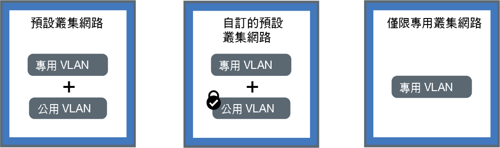

---

copyright:
  years: 2014, 2018
lastupdated: "2018-10-25"

---

{:new_window: target="_blank"}
{:shortdesc: .shortdesc}
{:screen: .screen}
{:pre: .pre}
{:table: .aria-labeledby="caption"}
{:codeblock: .codeblock}
{:tip: .tip}
{:download: .download}

# 規劃叢集內網路及專用網路
{: #planning}

為 {{site.data.keyword.containerlong}} 叢集規劃網路設定。
{: shortdesc}

## 瞭解叢集內網路
{: #in-cluster}

所有已部署至工作者節點的 Pod 會獲指派 172.30.0.0/16 範圍中的專用 IP 位址，並且只在工作者節點之間遞送。為了避免衝突，請勿在與工作者節點進行通訊的任何節點上使用此 IP 範圍。使用專用 IP 位址，工作者節點及 Pod 可以在專用網路上安全地進行通訊。不過，Pod 損毀或需要重建工作者節點時，會指派新的專用 IP 位址。

依預設，對必須為高可用性的應用程式，很難追蹤其變更中的專用 IP 位址。相反地，您可以使用內建 Kubernetes 服務探索特性，將應用程式公開為專用網路上的叢集 IP 服務。Kubernetes 服務會將一組 Pod 分組並提供這些 Pod 的網路連線。此連線提供與叢集中其他服務的連線功能，而不會公開每一個 Pod 的實際專用 IP 位址。服務會獲指派只能在叢集內部存取的叢集內 IP 位址。
* 較舊的叢集：在 2018 年 2 月之前在 dal13 區域或在 2017 年 10 月之前在任何其他區域建立的叢集中，服務從 10.10.10.0/24 範圍中的 254 個 IP 當中獲指派其中一個 IP。如果您已達 254 個服務的限制，而且需要更多服務，則必須建立新的叢集。
* 較新的叢集：在 2018 年 2 月之後在 dal13 區域或在 2017 年 10 月之後在任何其他區域建立的叢集中，服務從 172.21.0.0/16 範圍中的 65,000 個 IP 當中獲指派其中一個 IP。

為了避免衝突，請勿在與工作者節點進行通訊的任何節點上使用此 IP 範圍。也會建立服務的 DNS 查閱項目，並將其儲存在叢集的 `kube-dns` 元件中。DNS 項目包含服務的名稱、已建立服務的名稱空間，以及已指派叢集內 IP 位址的鏈結。

若要存取叢集服務背後的 Pod，應用程式可以使用服務的叢集內 IP 位址，或使用服務名稱來傳送要求。當您使用服務的名稱時，會在 `kube-dns` 元件中查閱該名稱，並將其遞送至服務的叢集內 IP 位址。當要求到達服務時，服務會將要求平均轉遞至 Pod，並與 Pod 的叢集內 IP 位址及其部署至的工作者節點無關。

 

## 瞭解 VLAN 連線及網路介面
{: #interfaces}

{{site.data.keyword.containerlong_notm}} 提供 IBM Cloud 基礎架構 (SoftLayer) VLAN，確保工作者節點上的優質網路效能及網路隔離。VLAN 會配置一組工作者節點及 Pod，就像它們已連接至相同的實體佈線。VLAN 為您的 {{site.data.keyword.Bluemix_notm}} 帳戶所專用，不會在 IBM 客戶之間共用。

依預設，所有叢集都連接至專用 VLAN。專用 VLAN 會決定指派給每一個工作者節點的專用 IP 位址。工作者節點具有專用網路介面，可透過專用網路進行存取。當您建立的叢集也連接至公用 VLAN 時，您的叢集也有公用網路介面。公用 VLAN 容許工作者節點自動及安全地連接至主節點。如需叢集的預設 VLAN 的相關資訊，請參閱[叢集的預設 VLAN、子網路及 IP](cs_subnets.html#default_vlans_subnets)。

叢集網路功能設定可由叢集的網路介面定義：

* **預設叢集網路功能**：同時具有專用和公用網路介面的叢集
* **自訂的預設叢集網路功能**：同時具有專用和公用網路介面的叢集，並以 Calico 網路原則來封鎖送入的公用資料流量
* **僅限專用叢集網路功能**：僅具有專用網路介面的叢集

按下列其中一項設定以規劃叢集的網路功能：

<map name="home_map" id="home_map">
<area href="#both_vlans" alt="規劃預設叢集網路功能" title="規劃預設叢集網路功能" shape="rect" coords="-7, -8, 149, 211" />
<area href="#both_vlans_private" alt="規劃自訂的預設叢集網路功能" title="規劃自訂的預設叢集網路功能" shape="rect" coords="196, -1, 362, 210" />
<area href="#private_vlan" alt="規劃僅限專用叢集網路功能" title="規劃僅限專用叢集網路功能" shape="rect" coords="409, -10, 572, 218" />
</map>

 

## 規劃預設叢集網路功能
{: #both_vlans}

依預設，{{site.data.keyword.containerlong_notm}} 設定叢集能夠存取公用 VLAN 和專用 VLAN。
{:shortdesc}

**透過此設定我的叢集可以獲得什麼？**
* 每一個工作者節點的公用 IP 位址，其為工作者節點提供公用網路介面
* 每一個工作者節點的專用 IP 位址，其為工作者節點提供專用網路介面
* 所有工作者節點與主節點之間的自動安全 OpenVPN 連線

**為何我可能使用此設定？**

* 您有一個應用程式必須可供單一區域叢集中的公用網際網路存取。
* 您有一個應用程式必須可供多區域叢集中的公用網際網路存取。因為您必須啟用 [VLAN Spanning](cs_subnets.html#subnet-routing) 來建立多區域叢集，叢集才可以與連接至相同 IBM Cloud 帳戶中之任何專用 VLAN 的其他系統進行通訊。**附註**：若要在專用網路上隔離多區域叢集，請使用 [Calico 網路原則](cs_network_policy.html#isolate_workers)。

**我要管理叢集的公用和專用存取權時有哪些選項？**
 下列各節說明跨越 {{site.data.keyword.containerlong_notm}} 的功能，您可以使用這些功能來設定連接至公用及專用 VLAN 之叢集的網路功能。

### 透過網路服務來公開您的應用程式
{: #both_vlans_services}

工作者節點的公用網路介面受到[預先定義的 Calico 網路原則設定](cs_network_policy.html#default_policy)所保護，這些設定是在建立叢集期間配置於每個工作者節點上。依預設，所有工作者節點都允許所有出埠網路資料流量。除了少數埠之外，入埠網路資料流量會遭到封鎖。會開啟這些埠讓 IBM 可以監視網路資料流量，並自動安裝 Kubernetes 主節點的安全更新項目。

如果您要向公用或專用網路公開您的應用程式，您可以建立公用或專用 NodePort、LoadBalancer 或 Ingress 服務。如需每一個服務的相關資訊，請參閱[選擇 NodePort、LoadBalancer 或 Ingress 服務](cs_network_planning.html#external)。

### 選用項目：將網路工作負載隔離至邊緣工作者節點
{: #both_vlans_edge}

邊緣工作者節點可以藉由容許較少的工作者節點可在外部進行存取，以及隔離網路工作負載，來增進叢集的安全。若要確定只將 Ingress 及負載平衡器 Pod 部署至指定的工作者節點，請[將工作者節點標示為邊緣節點](cs_edge.html#edge_nodes)。若也要防止在邊緣節點上執行其他工作負載，請[污染邊緣節點](cs_edge.html#edge_workloads)。

### 選用項目：使用 strongSwan VP，連接至內部部署網路或 IBM Cloud Private
{: #both_vlans_vpn}

若要將工作者節點及應用程式安全地連接至內部部署網路，您可以設定 [strongSwan IPSec VPN 服務 ](https://www.strongswan.org/about.html)。在根據業界標準網際網路通訊協定安全 (IPSec) 通訊協定套組的網際網路上，strongsWan IPSec VPN 服務提供安全的端對端通訊通道。
* 若要設定叢集與內部部署網路之間的安全連線，請直接在叢集的 Pod 中[配置及部署 strongSwan IPSec VPN 服務](cs_vpn.html#vpn-setup)。
* 若要設定叢集與 IBM Cloud Private 實例之間的安全連線，請參閱[使用 strongSwan VPN 來連接公用和專用雲端](cs_hybrid.html#hybrid_vpn)。

 

## 規劃自訂的預設叢集網路功能
{: #both_vlans_private}

依預設，{{site.data.keyword.containerlong_notm}} 設定叢集能夠存取公用 VLAN 和專用 VLAN。不過，您可以使用網路原則來封鎖公用存取，以自訂預設網路功能設定。
{:shortdesc}

**透過此設定我的叢集可以獲得什麼？**
* 每一個工作者節點的公用 IP 位址，其為工作者節點提供公用網路介面
* 每一個工作者節點的專用 IP 位址，其為工作者節點提供專用網路介面
* 所有工作者節點與主節點之間的自動安全 OpenVPN 連線

**為何我可能使用此設定？**

* 您在單一區域叢集中具有一個應用程式。您只想要將應用程式公開給該叢集內或連接至相同專用 VLAN 的其他叢集中的 Pod。
* 您在多區域叢集中具有一個應用程式。您只想要將應用程式公開給該叢集內或連接至與您叢集相同的專用 VLAN 的其他叢集中的 Pod。不過，因為必須對多區域叢集啟用 [VLAN Spanning](cs_subnets.html#subnet-routing)，所以連接至相同 IBM Cloud 帳戶中任何專用 VLAN 的其他系統都可以存取叢集。您想要將多區域叢集與其他系統隔離。

**我要管理叢集的公用和專用存取權時有哪些選項？** 下列各節說明跨越 {{site.data.keyword.containerlong_notm}} 的功能，您可以使用這些功能來設定連接至公用及專用 VLAN 之叢集的僅限專用網路功能及鎖定公用網路功能。

### 使用專用網路服務公開您的應用程式，並使用 Calico 網路原則保護您的叢集免於遭到公用存取
{: #both_vlans_private_services}

工作者節點的公用網路介面受到[預先定義的 Calico 網路原則設定](cs_network_policy.html#default_policy)所保護，這些設定是在建立叢集期間配置於每個工作者節點上。依預設，所有工作者節點都允許所有出埠網路資料流量。除了少數埠之外，入埠網路資料流量會遭到封鎖。會開啟這些埠讓 IBM 可以監視網路資料流量，並自動安裝 Kubernetes 主節點的安全更新項目。

如果您只想在專用網路上公開應用程式，您可以建立專用 NodePort、LoadBalancer 或 Ingress 服務。如需規劃專用外部網路功能的相關資訊，請參閱[為公用及專用 VLAN 設定規劃專用外部網路功能](cs_network_planning.html#private_both_vlans)。

不過，預設 Calico 網路原則也容許從網際網路到這些服務的入埠公用網路資料流量。您可以建立 Calico 原則，改為封鎖服務的所有公用資料流量。例如，NodePort 服務會在工作者節點的專用及公用 IP 位址上開啟工作者節點上的埠。具有可攜式專用 IP 位址的負載平衡器服務會在每個工作者節點上開啟一個公用 NodePort。您必須建立 [Calico DNAT 前網路原則](cs_network_policy.html#block_ingress)，以封鎖公用 NodePort。

舉例來說，假設您已建立專用負載平衡器服務。您也建立了 Calico DNAT 前原則來封鎖公用資料流量，使其無法到達負載平衡器所開啟的公用 NodePort。可以透過下列方式存取此專用負載平衡器：
* [相同叢集中的任何 Pod](#in-cluster)
* 已連接至相同專用 VLAN 的任何叢集中的任何 Pod
* 如果您[已啟用 VLAN Spanning](cs_subnets.html#subnet-routing)，則為任何已連接至位於相同 IBM Cloud 帳戶中之任何專用 VLAN 的系統
* 如果您不屬於 IBM Cloud 帳戶，而仍然在公司防火牆背後，則為透過 VPN 連線連至負載平衡器 IP 所在的子網路的任何系統
* 如果您屬於不同的 IBM Cloud 帳戶，則為透過 VPN 連線連至負載平衡器 IP 所在的子網路的任何系統

### 在專用網路上隔離叢集
{: #isolate}

如果您有多區域叢集、單一區域叢集的多個 VLAN，或相同 VLAN 上的多個子網路，則必須[啟用 VLAN Spanning](/docs/infrastructure/vlans/vlan-spanning.html#vlan-spanning)，讓工作者節點可以在專用網路上彼此通訊。不過，當啟用 VLAN Spanning 時，任何已連接至相同 IBM Cloud 帳戶中的任何專用 VLAN 的系統都可以存取您的工作者節點。您可以使用 [Calico 網路原則](cs_network_policy.html#isolate_workers)，將多區域叢集與專用網路上的其他系統隔離。這些原則也容許您在專用防火牆中開啟的 IP 範圍和埠進行 ingress 和 egress。

### 選用項目：將網路工作負載隔離至邊緣工作者節點
{: #both_vlans_private_edge}

邊緣工作者節點可以藉由容許較少的工作者節點可在外部進行存取，以及隔離網路工作負載，來增進叢集的安全。若要確定只將 Ingress 及負載平衡器 Pod 部署至指定的工作者節點，請[將工作者節點標示為邊緣節點](cs_edge.html#edge_nodes)。若也要防止在邊緣節點上執行其他工作負載，請[污染邊緣節點](cs_edge.html#edge_workloads)。

然後，使用 [Calico DNAT 前網路原則](cs_network_policy.html#block_ingress)，封鎖對執行邊緣工作者節點的叢集上的公用 NodePort 的資料流量。封鎖節點埠可確保邊緣工作者節點是處理送入資料流量的唯一工作者節點。

### 選用項目：使用 strongSwan VP，連接至內部部署網路或 IBM Cloud Private
{: #both_vlans_private_vpn}

若要將工作者節點及應用程式安全地連接至內部部署網路，您可以設定 [strongSwan IPSec VPN 服務 ](https://www.strongswan.org/about.html)。在根據業界標準網際網路通訊協定安全 (IPSec) 通訊協定套組的網際網路上，strongsWan IPSec VPN 服務提供安全的端對端通訊通道。
* 若要設定叢集與內部部署網路之間的安全連線，請直接在叢集的 Pod 中[配置及部署 strongSwan IPSec VPN 服務](cs_vpn.html#vpn-setup)。
* 若要設定叢集與 IBM Cloud Private 實例之間的安全連線，請參閱[使用 strongSwan VPN 來連接公用和專用雲端](cs_hybrid.html#hybrid_vpn)。

 

## 規劃僅限專用叢集網路功能
{: #private_vlan}

透過在 CLI 中包含 `--private-only` 旗標，您可以選擇[建立僅限專用 VLAN 叢集](cs_clusters.html#clusters_cli)。當您的工作者節點連接至僅限專用 VLAN 時，工作者節點無法自動連接至主節點。您必須使用閘道應用裝置將工作者節點連接至主節點。您也可以使用閘道應用裝置作為防火牆，保護叢集免於遭受有害的存取。
{:shortdesc}

**透過此設定我的叢集可以獲得什麼？**
* 每一個工作者節點的專用 IP 位址，其為工作者節點提供專用網路介面

**透過此設定我的叢集無法獲得什麼？**
* 每一個工作者節點的公用 IP 位址，其為工作者節點提供公用網路介面。叢集永不提供公用。
* 所有工作者節點與主節點之間的自動連線。您必須透過[配置閘道應用裝置](#private_vlan_gateway)來提供此連線。

**為何我可能使用此設定？**
 您具有特定的安全需求或需要建立自訂網路原則及遞送規則，以提供專用網路安全。**附註**：使用閘道應用裝置會產生個別費用。如需詳細資料，請參閱[文件](/docs/infrastructure/fortigate-10g/explore-firewalls.html)。

**我要管理叢集的公用和專用存取權時有哪些選項？**
 下列各節說明跨越 {{site.data.keyword.containerlong_notm}} 的功能，您可以使用這些功能來設定連接至僅限專用 VLAN 之叢集的網路功能。

### 配置閘道應用裝置
{: #private_vlan_gateway}

如果工作者節點是設定為僅限專用 VLAN，則您必須針對工作者節點與主節點之間的網路連線功能配置替代方案。您可以使用自訂網路原則來設定防火牆，以提供標準叢集的專用網路安全，以及偵測及重新修補網路侵入。例如，您可能選擇設定 [Virtual Router Appliance](/docs/infrastructure/virtual-router-appliance/about.html) 或 [Fortigate Security Appliance](/docs/infrastructure/fortigate-10g/about.html) 作為防火牆，並且封鎖不想要的資料流量。當您設定防火牆時，也必須針對每一個地區[開啟必要埠及 IP 位址](cs_firewall.html#firewall_outbound)，讓主節點與工作者節點可以進行通訊。

**附註**：如果您具有現有的路由器應用裝置，然後新增叢集，則系統不會在路由器應用裝置上配置針對該叢集所訂購的新可攜式子網路。為了能夠使用網路服務，您必須[啟用 VLAN Spanning](cs_subnets.html#vra-routing)，在相同 VLAN 上的子網路之間啟用遞送。

若要檢查是否已啟用 VLAN Spanning，請使用 `ibmcloud s vlan-spanning` [指令](cs_cli_reference.html#cs_vlan_spanning_get)。
{: tip}

### 使用專用網路服務公開應用程式
{: #private_vlan_services}

若要讓應用程式只可從專用網路進行存取，您可以使用專用 NodePort、LoadBalancer 或 Ingress 服務。因為您的工作者節點未連接至公用 VLAN，所以不會將任何公用資料流量遞送至這些服務。您也必須[開啟必要埠及 IP 位址](cs_firewall.html#firewall_inbound)，以允許針對這些服務的入埠資料流量。

如需每一個服務的相關資訊，請參閱[選擇 NodePort、LoadBalancer 或 Ingress 服務](cs_network_planning.html#external)。

### 選用項目：使用閘道應用裝置連接至內部部署資料庫
{: #private_vlan_vpn}

若要將工作者節點及應用程式安全地連接至內部部署網路，您必須設定 VPN 閘道。您可以使用先前設定的 VRA 或 FSA，同時配置 IPSec VPN 端點。若要配置 VRA，請參閱[使用 VRA 設定 VPN 連線功能](cs_vpn.html#vyatta)。
