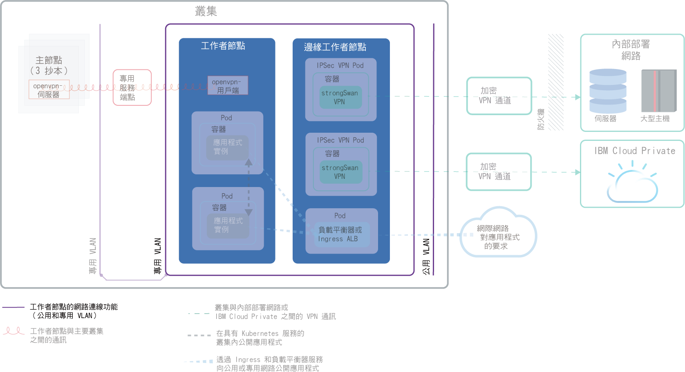
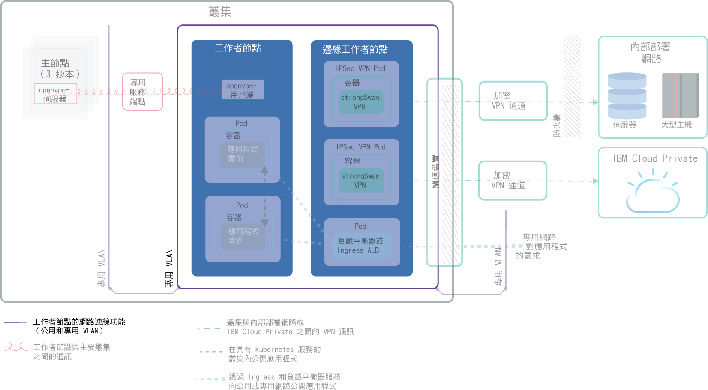
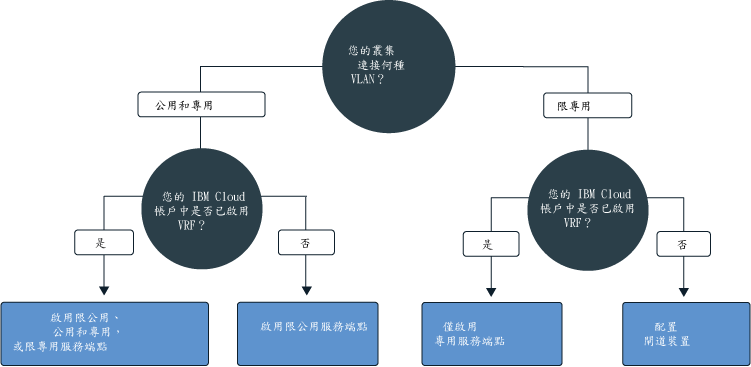
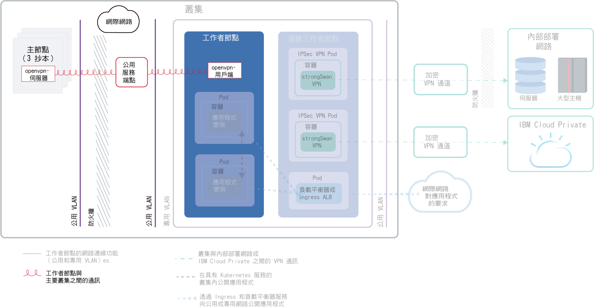
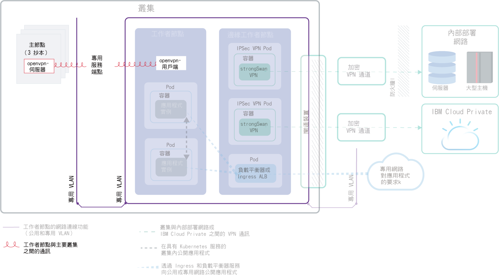
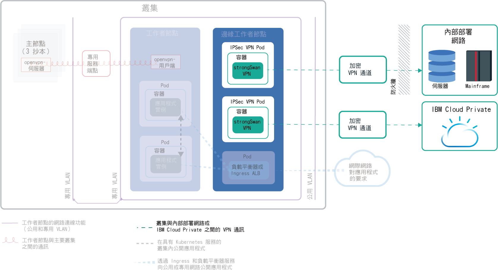
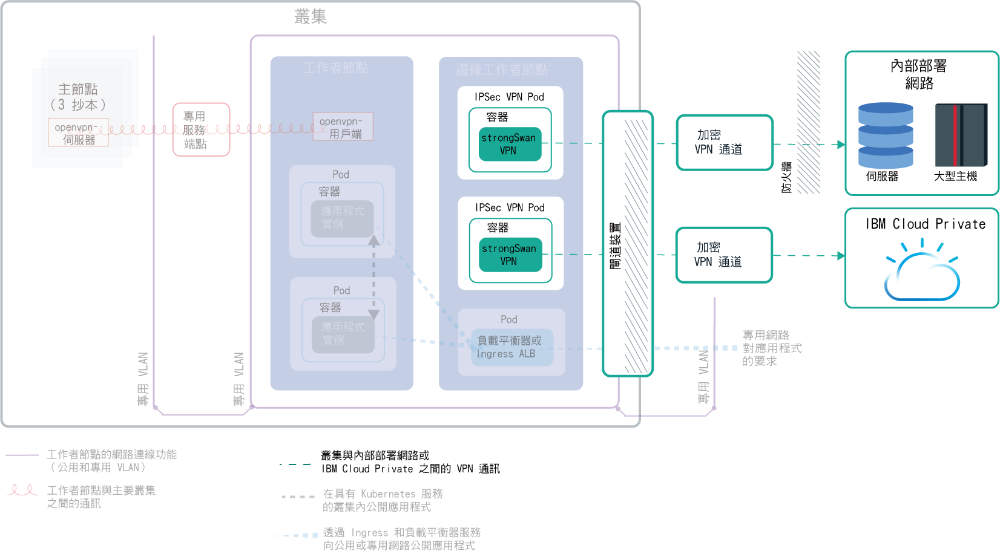

---

copyright:
  years: 2014, 2019
lastupdated: "2019-04-15"

---

{:new_window: target="_blank"}
{:shortdesc: .shortdesc}
{:screen: .screen}
{:pre: .pre}
{:table: .aria-labeledby="caption"}
{:codeblock: .codeblock}
{:tip: .tip}
{:note: .note}
{:important: .important}
{:deprecated: .deprecated}
{:download: .download}

# 規劃叢集網路
{: #cs_network_ov}

為 {{site.data.keyword.containerlong}} 叢集規劃網路設定。
{: shortdesc}

此頁面可協助您設定叢集的網路配置。要尋找設定應用程式網路的相關資訊嗎？請參閱[規劃使用叢集內及外部網路公開應用程式](/docs/containers?topic=containers-cs_network_planning)。
{: tip}

## 瞭解 {{site.data.keyword.containerlong_notm}} 網路基本觀念
{: #cs_network_ov_basics}

開始設定叢集網路之前，請務必瞭解 {{site.data.keyword.containerlong_notm}} 叢集中的網路基本概念。
{: shortdesc}

### 哪些叢集元件必須彼此通訊？
{: #cs_network_ov_basics_components}

建立叢集時，您必須選擇網路設定，讓特定叢集元件可以彼此通訊。
{: shortdesc}

* 所有工作者節點都必須連接至一個 VLAN，才能彼此通訊，以及與 Kubernetes 主節點通訊。若要選擇 VLAN，請參閱[規劃工作者節點與工作者節點通訊](#cs_network_ov_worker)。
* 必須允許跨多個專用 VLAN 進行通訊，讓工作者節點彼此連接，以及與主節點連接。若要啟用「虛擬路由器功能 (VRF)」或 VLAN Spanning，請參閱[如何配置 VLAN 及子網路以確保網路分段？](#cs_network_ov_basics_segmentation)。
* 工作者節點可以透過公用網路或專用網路安全地與 Kubernetes 主節點通訊。若要選擇工作者節點與主節點通訊通道，請參閱[規劃主節點與工作者節點通訊](#cs_network_ov_master)。

### {{site.data.keyword.containerlong_notm}} 中的網路如何運作？
{: #cs_network_ov_basics_vlans}

{{site.data.keyword.containerlong_notm}} 使用 VLAN、子網路及 IP 位址來提供叢集元件網路連線功能。
{: shortdesc}

**何謂 VLAN？{{site.data.keyword.containerlong_notm}} 提供哪些類型的 VLAN？** 

當您建立叢集時，叢集的工作者節點會自動連接至 VLAN。VLAN 會配置一組工作者節點及 Pod，彷彿它們已連接至相同的實體佈線，並提供一個通道，在工作者與 Pod 之間進行連線。
{: shortdesc}

<dl>
<dt>免費叢集的 VLAN</dt>
<dd>在免費叢集裡，叢集的工作者節點依預設會連接至 IBM 擁有的公用 VLAN 及專用 VLAN。由於 IBM 控制了 VLAN、子網路及 IP 位址，所以您無法建立多區域叢集，或將子網路新增至您的叢集，只能使用 NodePort 服務來公開您的應用程式。</dd>
<dt>標準叢集的 VLAN</dt>
<dd>在標準叢集裡，第一次在區域中建立叢集時，會在您的 IBM Cloud 基礎架構 (SoftLayer) 帳戶中，自動為您在該區域中佈建公用 VLAN 及專用 VLAN。針對您在該區域建立的每個後續叢集，您必須指定要在該區域中使用的 VLAN 配對。您可以重複使用為您所建立的相同公用和專用 VLAN，因為多個叢集可以共用 VLAN。  您可以將工作者節點同時連接至公用 VLAN 和專用 VLAN，或僅連接至專用 VLAN。如果您只想要將工作者節點連接至專用 VLAN，則可以使用現有專用 VLAN 的 ID，或[建立專用 VLAN](/docs/cli/reference/ibmcloud?topic=cloud-cli-manage-classic-vlans#sl_vlan_create)，並在建立叢集期間使用該 ID。</dd></dl>

若要查看每個區域中針對您帳戶所佈建的 VLAN，請執行 `ibmcloud ks vlans --zone <zone>`。若要查看某個叢集佈建所在的 VLAN，請執行 `ibmcloud ks cluster-get --cluster <cluster_name_or_ID> --showResources`，並尋找 **Subnet VLANs** 區段。

IBM Cloud 基礎架構 (SoftLayer) 管理在您於區域中建立第一個叢集時所自動供應的 VLAN。如果您讓 VLAN 變成未使用（例如移除 VLAN 中的所有工作者節點），IBM Cloud 基礎架構 (SoftLayer) 會收回此 VLAN。之後，如果您需要新建的 VLAN，請[與 {{site.data.keyword.Bluemix_notm}} 支援中心聯絡](/docs/infrastructure/vlans?topic=vlans-ordering-premium-vlans#ordering-premium-vlans)。

**選擇的 VLAN 對叢集的影響為何？** 

選擇的 VLAN 連線決定 Kubernetes 主節點與工作者節點如何在叢集中彼此通訊。如需相關資訊，請參閱[規劃工作者節點與 Kubernetes 主節點之間的通訊](/docs/containers?topic=containers-cs_network_ov#cs_network_ov_master)。

選擇的 VLAN 連線也會決定應用程式的網路連線功能。如需相關資訊，請參閱[規劃使用叢集內及外部網路公開應用程式](/docs/containers?topic=containers-cs_network_planning)。

### 何謂子網路？{{site.data.keyword.containerlong_notm}} 提供哪些類型的子網路？
{: #cs_network_ov_basics_subnets}

除了工作者節點及 Pod 外，子網路也會自動佈建在 VLAN 上。子網路可藉由將 IP 位址指派給您的叢集元件，為它們提供網路連線功能。
{: shortdesc}

下列子網路會自動佈建在預設公用及專用 VLAN 上：

**公用 VLAN 子網路**
* 主要公用子網路會決定在建立叢集期間指派給工作者節點的公用 IP 位址。相同 VLAN 上的多個叢集可以共用一個主要公用子網路。
* 可攜式公用子網路只會連結至一個叢集，並提供該叢集 8 個公用 IP 位址。有 3 個 IP 保留給 IBM Cloud 基礎架構 (SoftLayer) 功能。1 個 IP 由預設公用 Ingress ALB 使用，而 4 個 IP 可以用來建立公用網路負載平衡器 (NLB) 服務。可攜式公用 IP 是永久性的固定 IP 位址，可以用來透過網際網路存取 NLB。如果 NLB 需要超過 4 個 IP，請參閱[新增可攜式 IP 位址](/docs/containers?topic=containers-subnets#adding_ips)。

**專用 VLAN 子網路**
* 主要專用子網路會決定在建立叢集期間指派給工作者節點的專用 IP 位址。相同 VLAN 上的多個叢集可以共用一個主要專用子網路。
* 可攜式專用子網路只會連結至一個叢集，並提供該叢集 8 個專用 IP 位址。有 3 個 IP 保留給 IBM Cloud 基礎架構 (SoftLayer) 功能。1 個 IP 由預設專用 Ingress ALB 使用，而 4 個 IP 可以用來建立專用網路負載平衡器 (NLB) 服務。可攜式專用 IP 是永久性的固定 IP 位址，可以用來透過專用網路存取 NLB。如果專用 NLB 需要超過 4 個 IP，請參閱[新增可攜式 IP 位址](/docs/containers?topic=containers-subnets#adding_ips)。

若要查看您帳戶中佈建的所有子網路，請執行 `ibmcloud ks subnets`。若要查看連結至某個叢集的可攜式公用及可攜式專用子網路，您可以執行 `ibmcloud ks cluster-get --cluster <cluster_name_or_ID> --showResources`，並尋找 **Subnet VLANs** 區段。

在 {{site.data.keyword.containerlong_notm}} 中，VLAN 的限制為 40 個子網路。如果您達到此限制，首先請查看您是否可以[重複使用 VLAN 中的子網路來建立新的叢集](/docs/containers?topic=containers-subnets#subnets_custom)。如果您需要新的 VLAN，請[與 {{site.data.keyword.Bluemix_notm}} 支援中心聯絡](/docs/infrastructure/vlans?topic=vlans-ordering-premium-vlans#ordering-premium-vlans)，進行訂購。然後，[建立叢集](/docs/containers?topic=containers-cs_cli_reference#cs_cluster_create)，而叢集使用這個新的 VLAN。
{: note}

### 如何配置 VLAN 及子網路以確保網路分段？
{: #cs_network_ov_basics_segmentation}

網路區隔說明將網路分成多個子網路的方式。在某個子網路中執行的應用程式無法查看或存取另一個子網路中的應用程式。如需網路分段選項及其與 VLAN 的關係的相關資訊，請參閱[此叢集安全主題](/docs/containers?topic=containers-security#network_segmentation)。
{: shortdesc}

不過，在數種狀況下，必須允許叢集中的元件跨多個專用 VLAN 進行通訊。例如，如果您要建立多區域叢集、某個叢集有多個 VLAN，或在相同的 VLAN 上有多個子網路，則相同 VLAN 的不同子網路上的工作者節點或是不同 VLAN 上的工作者節點無法自動彼此通訊。您必須針對 IBM Cloud 基礎架構 (SoftLayer) 帳戶啟用「虛擬路由器功能 (VRF)」或 VLAN Spanning。

**何謂「虛擬路由器功能 (VRF)」和 VLAN Spanning？** 

<dl>
<dt>[虛擬路由器功能 (VRF)](/docs/infrastructure/direct-link?topic=direct-link-overview-of-virtual-routing-and-forwarding-vrf-on-ibm-cloud#overview-of-virtual-routing-and-forwarding-vrf-on-ibm-cloud)</dt>
<dd>VRF 可讓基礎架構帳戶中的所有 VLAN 和子網路彼此通訊。此外，還需要有 VRF，才能容許工作者節點與主節點透過專用服務端點進行通訊。若要啟用 VRF，[請與 IBM Cloud 基礎架構 (SoftLayer) 帳戶業務代表聯絡](/docs/infrastructure/direct-link?topic=direct-link-overview-of-virtual-routing-and-forwarding-vrf-on-ibm-cloud#how-you-can-initiate-the-conversion)。請注意，VRF 會刪除帳戶的 VLAN Spanning 選項，因為除非您配置閘道應用裝置來管理資料流量，否則所有 VLAN 都可以通訊。</dd>
<dt>[VLAN Spanning](/docs/infrastructure/vlans?topic=vlans-vlan-spanning#vlan-spanning)</dt>
<dd>如果您無法或不要啟用 VRF，請啟用 VLAN Spanning。若要執行此動作，您需要**網路 > 管理網路 VLAN Spanning** [基礎架構許可權](/docs/containers?topic=containers-users#infra_access)，或者您可以要求帳戶擁有者啟用它。若要確認是否已啟用 VLAN Spanning，請使用 `ibmcloud ks vlan-spanning-get` [指令](/docs/containers?topic=containers-cs_cli_reference#cs_vlan_spanning_get)。
請注意，如果您選擇啟用 VLAN Spanning 而非 VRF，則無法啟用專用服務端點。</dd>
</dl>

**VRF 或 VLAN Spanning 對網路分段的影響為何？** 

啟用 VRF 或 VLAN Spanning 時，任何已連接至相同 {{site.data.keyword.Bluemix_notm}} 帳戶中任何專用 VLAN 的系統都可以與工作者節點通訊。您可以套用 [Calico 專用網路原則](/docs/containers?topic=containers-network_policies#isolate_workers)，將叢集與專用網路上的其他系統隔離。{{site.data.keyword.containerlong_notm}} 也與所有 [IBM Cloud 基礎架構 (SoftLayer) 防火牆供應項目 ](https://www.ibm.com/cloud-computing/bluemix/network-security) 相容。您可以使用自訂網路原則來設定 [Virtual Router Appliance](/docs/infrastructure/virtual-router-appliance?topic=virtual-router-appliance-about-the-vra) 這類防火牆，以提供標準叢集的專用網路安全，以及偵測及重新修補網路侵入。

 

## 規劃工作者節點與工作者節點通訊
{: #cs_network_ov_worker}

所有工作者節點都必須連接至一個 VLAN，才能具有網路介面。此網路介面容許每個工作者節點將資訊傳送至其他工作者節點，以及從中接收資訊。
{: shortdesc}

### 工作者節點 VLAN 連線功能的選項為何？
{: #cs_network_ov_worker_options}

建立叢集時，您可以將工作者節點同時連接至公用 VLAN 和專用 VLAN，或僅連接至專用 VLAN。
{: shortdesc}

**為何將叢集連接至公用和專用 VLAN？** 

對於大部分情況，您可以建立同時連接至公用和專用 VLAN 的叢集，以達到網路彈性。例如：
* 您有一個應用程式必須可供公用網際網路存取。
* 您有一個應用程式只要公開給叢集內或連接至相同專用 VLAN 的其他叢集中的 Pod。有數個選項可用於保護應用程式不受公用介面存取（例如使用 Calico 網路原則），或將外部網路工作負載隔離至邊緣工作者節點。

下圖顯示連接至公用和專用 VLAN 的工作者節點的網路連線功能。

<figure>
 
 <figcaption>連接至公用和專用 VLAN 的工作者節點的網路連線功能</figcaption>
</figure>

如果您要建立多區域叢集、某個叢集有多個 VLAN，或在相同的 VLAN 上有多個子網路，則相同 VLAN 的不同子網路上的工作者節點或是不同 VLAN 上的工作者節點無法自動彼此通訊。您必須針對 IBM Cloud 基礎架構 (SoftLayer) 帳戶啟用 [VRF 或 VLAN Spanning](#cs_network_ov_basics_segmentation)。選擇 VRF，以啟用[主節點與工作者節點通訊的專用服務端點](#cs_network_ov_master_private)。如果您無法或不要啟用 VRF，請啟用 VLAN Spanning。

**為何只將叢集連接至專用 VLAN？** 

如果您具有特定安全需求，或需要建立自訂網路原則及遞送規則來提供專用網路安全，請建立僅限專用 VLAN 叢集。
{: shortdesc}

下圖顯示連接至僅限專用 VLAN 的工作者節點的網路連線功能。

<figure>
 
 <figcaption>專用網路設定中工作者節點的網路連線功能</figcaption>
</figure>

如果您要建立多區域叢集、某個叢集有多個 VLAN，或在相同的 VLAN 上有多個子網路，則相同 VLAN 的不同子網路上的工作者節點或是不同 VLAN 上的工作者節點無法自動彼此通訊。您必須針對 IBM Cloud 基礎架構 (SoftLayer) 帳戶啟用 [VRF 或 VLAN Spanning](#cs_network_ov_basics_segmentation)。選擇 VRF，以啟用[主節點與工作者節點通訊的專用服務端點](#cs_network_ov_master_private)。如果您無法或不要啟用 VRF，則必須啟用 VLAN Spanning，也必須配置閘道裝置，以用於主節點與工作者節點通訊。

### 我已選擇進行 VLAN 連線。如何設定它們？
{: #cs_network_ov_worker_setup}

您可以遵循[設定具有公用和專用 VLAN 的叢集網路](/docs/containers?topic=containers-cs_network_cluster#both_vlans)或[設定具有僅限專用 VLAN 的叢集網路](/docs/containers?topic=containers-cs_network_cluster#setup_private_vlan)中的步驟。
{: shortdesc}

### 稍後可以變更 VLAN 決策嗎？我的工作者節點 IP 位址是否變更？
{: #cs_network_ov_worker_change}

您可以修改叢集中的工作者節點儲存區，來變更 VLAN 設定。如需相關資訊，請參閱[變更工作者節點 VLAN 連線](/docs/containers?topic=containers-cs_network_cluster#change-vlans)。
{: shortdesc}

您的工作者節點獲指派叢集所使用之公用或專用 VLAN 上的 IP 位址。佈建工作者節點之後，IP 位址不會變更。例如，工作者節點 IP 位址會跨 `reload`、`reboot` 及 `update` 作業持續保存。此外，工作者節點的專用 IP 位址會用於大多數 `kubectl` 指令中的工作者節點身分。如果您變更工作者節點儲存區所使用的 VLAN，則該儲存區中佈建的新工作者節點會使用新的 VLAN 作為其 IP 位址。現有工作者節點 IP 位址不會變更，但您可以選擇移除使用舊 VLAN 的工作者節點。

 

## 規劃主節點與工作者節點通訊
{: #cs_network_ov_master}

建立叢集時，您必須選擇工作者節點與 Kubernetes 主節點如何通訊，以編排叢集配置。
{: shortdesc}

必須設定通訊通道，讓 Kubernetes 主節點可以管理工作者節點。此通訊設定取決於 VLAN 連線功能的設定方式。您可能可以啟用僅限公用、公用和專用或僅限專用服務端點，來容許工作者節點與 Kubernetes 主節點通訊。若要判定您是否可以使用服務端點，請遵循此決策樹狀結構。

<map name="dt-image-map" id="dt-image-map">
  <area alt="具有公用、公用和專用或專用服務端點的預設網路" title="具有公用、公用和專用或專用服務端點的預設網路" href="#cs_network_ov_master_both" coords="0,296,195,354" shape="rect" />
  <area alt="具有僅限公用服務端點的預設網路" title="具有僅限公用服務端點的預設網路" href="#cs_network_ov_master_public" coords="220,295,353,352" shape="rect" />
  <area alt="具有僅限專用服務端點的專用網路" title="具有僅限專用服務端點的專用網路" href="#cs_network_ov_master_private" coords="393,294,524,356" shape="rect" />
  <area alt="具有閘道應用裝置的專用網路" title="具有閘道應用裝置的專用網路" href="#cs_network_ov_master_gateway" coords="579,294,697,354" shape="rect" />
</map>

如需每個設定的相關資訊，請參閱下列各節。

### 僅限公用服務端點
{: #cs_network_ov_master_public}

如果工作者節點設定為具有專用和公用 VLAN，則工作者節點可以透過公用服務端點，自動透過公用網路連接至主節點。{{site.data.keyword.Bluemix_notm}} 帳戶中不需要 VRF。
{: shortdesc}

下圖顯示工作者節點與 Kubernetes 主節點之間透過公用服務端點的通訊。

<figure>
 
 <figcaption>工作者節點與 Kubernetes 主節點之間透過公用服務端點的通訊</figcaption>
</figure>

**工作者節點與主節點之間的通訊** 
使用公用服務端點，透過公用網路安全地建立通訊。工作者節點安全地透過 TLS 憑證與主節點交談，而且主節點透過 OpenVPN 連線與工作者節點交談。

**存取主節點** 
授權叢集使用者可透過公用服務端點公然地存取主節點。例如，叢集使用者可以透過網際網路安全地存取 Kubernetes 主節點，以執行 `kubectl` 指令。

若只要在建立叢集期間或之後設定公用服務端點，請遵循[設定公用服務端點](/docs/containers?topic=containers-cs_network_cluster#set-up-public-se)中的步驟。

### 僅限專用服務端點
{: #cs_network_ov_master_private}

若要讓主節點僅可供專用存取，您可以在執行 Kubernetes 1.11 版或更新版本的叢集中啟用專用服務端點。{{site.data.keyword.Bluemix_notm}} 帳戶中需要 VRF。叢集僅連接至專用 VLAN 時，專用服務端點不需要閘道裝置就可以安全地連接至主節點。
{: shortdesc}

下圖顯示工作者節點與 Kubernetes 主節點之間透過專用服務端點的通訊。

<figure>
 
 <figcaption>工作者節點與 Kubernetes 主節點之間透過專用服務端點的通訊</figcaption>
</figure>

**工作者節點與主節點之間的通訊** 
使用專用服務端點，透過專用網路建立通訊。

**存取主節點** 
叢集使用者必須位於 {{site.data.keyword.Bluemix_notm}} 專用網路，或透過 VPN 連線連接至專用網路，才能存取主節點。

若只要在建立叢集期間或之後設定專用服務端點，請遵循[設定專用服務端點](/docs/containers?topic=containers-cs_network_cluster#set-up-private-se)中的步驟。

### 公用和專用服務端點
{: #cs_network_ov_master_both}

若要讓主節點可供叢集使用者公開或專用存取，您可以在執行 Kubernetes 1.11 版或更新版本的叢集中啟用公用和專用服務端點。{{site.data.keyword.Bluemix_notm}} 帳戶中需要 VRF。
{: shortdesc}

**工作者節點與主節點之間的通訊** 
使用專用服務端點以透過專用網路建立通訊，以及使用公用服務端點以透過公用網路建立通訊。透過公用端點遞送一半的工作者節點到主節點資料流量，並透過專用端點遞送另一半，可防範主節點到工作者節點通訊發生公用或專用網路的中斷。

**存取主節點** 
如果授權叢集使用者位於 {{site.data.keyword.Bluemix_notm}} 專用網路，或透過 VPN 連線連接至專用網路，則可以透過專用服務端點私下存取主節點。否則，授權叢集使用者可透過公用服務端點公然存取主節點。

若要在建立叢集期間設定公用和專用服務端點，請遵循[設定專用服務端點](/docs/containers?topic=containers-cs_network_cluster#set-up-private-se)中的步驟。建立叢集之後，您可以個別地啟用[公用](/docs/containers?topic=containers-cs_network_cluster#set-up-public-se)或[專用](/docs/containers?topic=containers-cs_network_cluster#set-up-private-se)服務端點。

### 具有閘道應用裝置的專用網路
{: #cs_network_ov_master_gateway}

如果工作者節點設定為具有僅限專用 VLAN，而且在 {{site.data.keyword.Bluemix_notm}} 帳戶中未啟用 VRF，則您必須針對工作者節點與主節點之間的網路連線功能配置替代方案。您可以使用自訂網路原則來設定防火牆，以提供標準叢集的專用網路安全，以及偵測及重新修補網路侵入。例如，您可能選擇設定 [Virtual Router Appliance](/docs/infrastructure/virtual-router-appliance?topic=virtual-router-appliance-about-the-vra) 或 [Fortigate Security Appliance](/docs/services/vmwaresolutions/services?topic=vmware-solutions-fsa_considerations) 作為防火牆，並且封鎖不想要的資料流量。當您設定防火牆時，也必須針對每一個地區[開啟必要埠及 IP 位址](/docs/containers?topic=containers-firewall#firewall_outbound)，讓主節點與工作者節點可以進行通訊。
{: shortdesc}

如果您具有現有的路由器應用裝置，然後新增叢集，則系統不會在路由器應用裝置上配置針對該叢集所訂購的新可攜式子網路。為了能夠使用網路服務，您必須[啟用 VLAN Spanning](/docs/containers?topic=containers-subnets#vra-routing)，在相同 VLAN 上的子網路之間啟用遞送。
{: important}

## 規劃叢集與內部部署網路或 {{site.data.keyword.icpfull_notm}} 的通訊
{: #cs_network_ov_vpn}

在叢集中設定 strongSwan VPN 連線服務，以將工作者節點和應用程式安全地連接至內部部署網路或 {{site.data.keyword.icpfull_notm}}。
{: shortdesc}

### 設定公用和專用 VLAN 設定的 VPN 連線
{: #cs_network_ov_vpn_public}

<figure>
 
 <figcaption>預設網路設定中叢集與內部部署網路或 {{site.data.keyword.icpfull_notm}} 之間的 VPN 通訊</figcaption>
</figure>

若要將工作者節點和應用程式安全地連接至內部部署網路，您可以直接在叢集中設定 [strongSwan IPSec VPN 服務 ](https://www.strongswan.org/about.html)。在根據業界標準網際網路通訊協定安全 (IPSec) 通訊協定套組的網際網路上，strongsWan IPSec VPN 服務提供安全的端對端通訊通道。
* 若要設定叢集與內部部署網路之間的安全連線，請直接在叢集的 Pod 中[配置及部署 strongSwan IPSec VPN 服務](/docs/containers?topic=containers-vpn#vpn-setup)。
* 若要設定叢集與 {{site.data.keyword.icpfull_notm}} 實例之間的安全連線，請參閱[使用 strongSwan VPN 來連接公用和專用雲端](/docs/containers?topic=containers-hybrid_iks_icp#hybrid_vpn)。

### 設定僅限專用 VLAN 設定的 VPN 連線
{: #cs_network_ov_vpn_private}

如果叢集僅連接至專用 VLAN，則必須在 VRA (Vyatta) 或 FSA 閘道裝置上設定 IPSec VPN 端點。然後，您可以在叢集中[配置及部署 strongSwan IPSec VPN 服務](/docs/containers?topic=containers-vpn#vpn-setup)，以在閘道上使用 VPN 端點。如果您不想要使用 strongSwan，則可以[使用 VRA 直接設定 VPN 連線功能](/docs/containers?topic=containers-vpn#vyatta)。
{: shortdesc}

<figure>
 
 <figcaption>專用網路設定中叢集與內部部署網路或 {{site.data.keyword.icpfull_notm}} 之間透過閘道裝置的 VPN 通訊</figcaption>
</figure>

