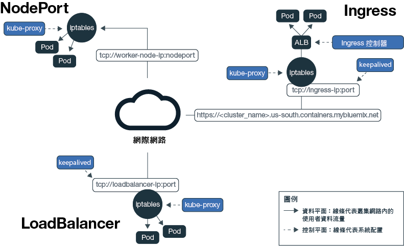
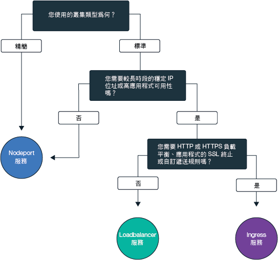
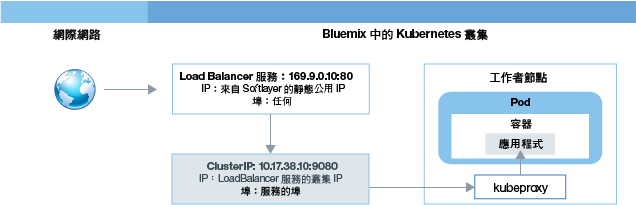
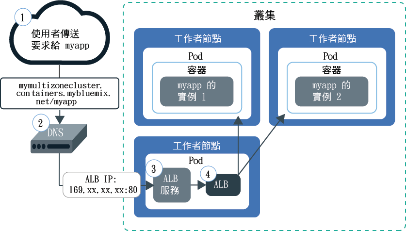

---

copyright:
  years: 2014, 2018
lastupdated: "2018-01-12"

---

{:new_window: target="_blank"}
{:shortdesc: .shortdesc}
{:screen: .screen}
{:pre: .pre}
{:table: .aria-labeledby="caption"}
{:codeblock: .codeblock}
{:tip: .tip}
{:download: .download}

# 規劃外部網路
{: #planning}

當您建立叢集時，每個叢集都必須連接至公用 VLAN。公用 VLAN 會判定在建立叢集期間指派給工作者節點的公用 IP 位址。
{:shortdesc}

精簡和標準叢集中的工作者節點公用網路介面都受到 Calico 網路原則的保護。依預設，這些原則會封鎖大部分入埠資料流量。不過，會容許讓 Kubernetes 運作所需的入埠資料流量，對 NodePort、Loadbalancer 及 Ingress 服務的連線也是相同。如需這些原則的相關資訊，包括如何修改它們，請參閱[網路原則](cs_network_policy.html#network_policies)。

|叢集類型|叢集之公用 VLAN 的管理員|
|------------|------------------------------------------|
|{{site.data.keyword.Bluemix_notm}} 中的精簡叢集|{{site.data.keyword.IBM_notm}}|
|{{site.data.keyword.Bluemix_notm}}中的標準叢集|在您的 IBM Cloud 基礎架構 (SoftLayer) 帳戶中時|
{: caption="VLAN 管理責任" caption-side="top"}

## 容許對應用程式的公用存取
{: #public_access}

若要將應用程式設為可在網際網路上公開使用，您必須先更新配置檔，再將應用程式部署至叢集。
{:shortdesc}

*{{site.data.keyword.containershort_notm}} 中的 Kubernetes 資料平面*

此圖顯示 Kubernetes 在 {{site.data.keyword.containershort_notm}} 中如何攜帶使用者網路資料流量。視您所建立的是精簡還是標準叢集而定，會有不同的方式可從網際網路存取您的應用程式。

<dl>
<dt><a href="#nodeport" target="_blank">NodePort 服務</a>（精簡及標準叢集）</dt>
<dd>
 <ul>
  <li>公開每個工作者節點上的公用埠，並使用任何工作者節點的公用 IP 位址來公開存取您在叢集中的服務。</li>
  <li>Iptables 是一種 Linux Kernel 特性，可在應用程式 Pod 之間負載平衡要求、提供高效能網路遞送，以及提供網路存取控制。</li>
  <li>工作者節點的公用 IP 位址不是永久性的。移除或重建工作者節點時，會將新的公用 IP 位址指派給工作者節點。</li>
  <li>NodePort 服務十分適用於測試公用存取。如果您只有短時間需要公用存取，也可以使用此選項。</li>
 </ul>
</dd>
<dt><a href="#loadbalancer" target="_blank">LoadBalancer 服務</a>（僅限標準叢集）</dt>
<dd>
 <ul>
  <li>每個標準叢集都會佈建 4 個可攜式公用 IP 位址及 4 個可攜式專用 IP 位址，可用來建立應用程式的外部 TCP/ UDP 負載平衡器。</li>
  <li>Iptables 是一種 Linux Kernel 特性，可在應用程式 Pod 之間負載平衡要求、提供高效能網路遞送，以及提供網路存取控制。</li>
  <li>指派給負載平衡器的可攜式公用 IP 位址是永久性的，因此在叢集中重建工作者節點時並不會變更。</li>
  <li>您可以公開應用程式所需的任何埠來自訂負載平衡器。</li></ul>
</dd>
<dt><a href="#ingress" target="_blank">Ingress</a>（僅限標準叢集）</dt>
<dd>
 <ul>
  <li>公開您叢集中的多個應用程式，方法是建立一個外部 HTTP 或 HTTPS 負載平衡器，以使用安全且唯一的公用進入點，將送入要求遞送給應用程式。</li>
  <li>您可以使用一個公用路徑，將叢集中的多個應用程式公開為服務。</li>
  <li>Ingress 包含三個主要元件：Ingress 資源、Ingress 控制器及應用程式負載平衡器。
   <ul>
    <li>Ingress 資源會定義如何遞送及負載平衡應用程式送入要求的規則。</li>
    <li>Ingress 控制器會啟用應用程式負載平衡器，以接聽送入的 HTTP 或 HTTPS 服務要求，並根據針對每一個 Ingress 資源所定義的規則來轉遞要求。</li>
    <li>應用程式負載平衡器會在應用程式的 Pod 之間負載平衡要求。
   </ul>
  <li>如果您要使用自訂遞送規則來實作自己的負載平衡器，以及需要應用程式的 SSL 終止，請使用 Ingress。</li>
 </ul>
</dd></dl>

若要選擇應用程式的最佳網路選項，您可以遵循這個決策樹狀結構：

<map name="networking_map" id="networking_map">
<area href="/docs/containers/cs_nodeport.html#config" alt="Nodeport 服務" shape="circle" coords="52, 283, 45"/>
<area href="/docs/containers/cs_loadbalancer.html#config" alt="Loadbalancer 服務" shape="circle" coords="247, 419, 44"/>
<area href="/docs/containers/cs_ingress.html#config" alt="Ingress 服務" shape="circle" coords="445, 420, 45"/>
</map>

 

## 使用 NodePort 服務將應用程式公開至網際網路
{: #nodeport}

公開工作者節點上的公用埠，並使用工作者節點的公用 IP 位址，從網際網路中公開存取您在叢集中的服務。
{:shortdesc}

當您建立 Kubernetes NodePort 類型服務來公開應用程式時，會將 30000 到 32767 範圍內的 NodePort 及內部叢集 IP 位址指派給服務。NodePort 服務是作為應用程式送入要求的外部進入點。所指派的 NodePort 會公開於叢集中每一個工作者節點的 kubeproxy 設定。每個工作者節點都會開始接聽所指派的 NodePort，來取得服務的送入要求。若要從網際網路存取服務，您可以使用在建立叢集期間所指派的任何工作者節點的公用 IP 位址，以及 `<ip_address>:<nodeport>` 格式的 NodePort。除了公用 IP 位址之外，在工作者節點的專用 IP 位址上，也可以使用 NodePort 服務。

下圖顯示配置 NodePort 服務時，通訊如何從網際網路導向至應用程式。

如圖所示，要求在到達 NodePort 服務時，會自動轉遞給服務的內部叢集 IP，並從 `kube-proxy` 元件進一步轉遞給應用程式部署所在之 Pod 的專用 IP 位址。叢集 IP 只能在叢集內存取。如果您有在不同 Pod 中執行之應用程式的多個抄本，則 `kube-proxy` 元件會在所有抄本之間為送入的要求進行負載平衡。

**附註：**工作者節點的公用 IP 位址不是永久性的。移除或重建工作者節點時，會將新的公用 IP 位址指派給工作者節點。NodePort 服務可以用於測試應用程式的公用存取，也可以用於僅短時間需要公用存取時。當您需要服務有穩定的公用 IP 位址及更高可用性時，請使用 [LoadBalancer 服務](#loadbalancer)或 [Ingress](#ingress) 來公開應用程式。

如需如何使用 {{site.data.keyword.containershort_notm}} 來建立 NodePort 類型服務的指示，請參閱[使用 NodePort 服務類型來配置應用程式的公用存取](cs_nodeport.html#config)。

 

## 使用 LoadBalancer 服務將應用程式公開至網際網路
{: #loadbalancer}

公開埠並使用公用或專用 IP 位址，讓負載平衡器可以存取應用程式。
{:shortdesc}

當您建立標準叢集時，{{site.data.keyword.containershort_notm}} 會自動要求五個可攜式公用 IP 位址及五個可攜式專用 IP 位址，並在建立叢集期間將它們佈建至 IBM Cloud 基礎架構 (SoftLayer) 帳戶。兩個可攜式 IP 位址（一個公用、一個專用）會用於 [Ingress 應用程式負載平衡器](#ingress)。建立 LoadBalancer 服務，即可使用四個可攜式公用 IP 位址及四個可攜式專用 IP 位址來公開應用程式。

當您在公用 VLAN 上的叢集建立 Kubernetes LoadBalancer 服務時，會建立外部負載平衡器。四個可用公用 IP 位址的其中一個會指派給它。如果沒有可用的可攜式公用 IP 位址，則建立 LoadBalancer 服務會失敗。LoadBalancer 服務是作為應用程式送入要求的外部進入點。與 NodePort 服務不同，您可以將任何埠指派給負載平衡器，而且未連結至特定埠範圍。指派給 LoadBalancer 服務的可攜式公用 IP 位址是永久性的，在叢集中移除或重建工作者節點時並不會變更。因此，LoadBalancer 服務的可用性比 NodePort 服務高。若要從網際網路存取 LoadBalancer 服務，請使用負載平衡器的公用 IP 位址以及 `<ip_address>:<port>` 格式的已指派埠。

下圖顯示 LoadBalancer 如何將通訊從網際網路導向至應用程式：

如圖所示，要求在到達 LoadBalancer 服務時，該要求會自動轉遞給在建立服務期間指派給 LoadBalancer 服務的內部叢集 IP 位址。叢集 IP 位址只能在叢集內存取。從叢集 IP 位址，將送入的要求進一步轉遞至工作者節點的 `kube-proxy` 元件。接著會將要求轉遞至應用程式部署所在 Pod 的專用 IP 位址。如果您有在不同 Pod 中執行之應用程式的多個抄本，則 `kube-proxy` 元件會在所有抄本之間為送入的要求進行負載平衡。

如果您使用 LoadBalancer 服務，則任何工作者節點的每一個 IP 位址也都有一個節點埠可用。若要在使用 LoadBalancer 服務時封鎖對節點埠的存取，請參閱[封鎖送入的資料流量](cs_network_policy.html#block_ingress)。

當您建立 LoadBalancer 服務時，您的 IP 位址選項如下：

- 如果叢集是在公用 VLAN 上，則會使用可攜式公用 IP 位址。
- 如果您的叢集只能在專用 VLAN 上使用，則會使用可攜式專用 IP 位址。
- 您可以透過將註釋新增至配置檔，要求 LoadBalancer 服務的可攜式公用或專用 IP 位址：`service.kubernetes.io/ibm-load-balancer-cloud-provider-ip-type: <public_or_private>`。

如需如何使用 {{site.data.keyword.containershort_notm}} 來建立 LoadBalancer 服務的指示，請參閱[使用負載平衡器服務類型來配置應用程式的公用存取](cs_loadbalancer.html#config)。

 

## 使用 Ingress 將應用程式公開至網際網路
{: #ingress}

Ingress 可讓您公開叢集中的多個服務，並使用單一公用進入點將它們設為可公開使用。
{:shortdesc}

Ingress 提供唯一公用路徑，讓您可以根據個別路徑，將公用要求轉遞給叢集內外部的應用程式，而不是為您要公開給大眾使用的每一個應用程式建立負載平衡器服務。Ingress 包含兩個主要元件。Ingress 資源會定義如何遞送應用程式送入要求的規則。所有 Ingress 資源都必須向 Ingress 控制器登錄，而 Ingress 控制器會接聽送入 HTTP 或 HTTPS 服務要求，並根據針對每一個 Ingress 資源所定義的規則來轉遞要求。

當您建立標準叢集時，{{site.data.keyword.containershort_notm}} 會自動建立叢集的高可用性 Ingress 控制器，並將格式為 `<cluster_name>.<region>.containers.mybluemix.net` 的唯一公用路徑指派給它。公用路徑會鏈結至在建立叢集期間佈建至 IBM Cloud 基礎架構 (SoftLayer) 帳戶的可攜式公用 IP 位址。

下圖顯示 Ingress 如何將通訊從網際網路導向至應用程式：

若要透過 Ingress 公開應用程式，您必須建立應用程式的 Kubernetes 服務，並藉由定義 Ingress 資源向 Ingress 控制器登錄此服務。Ingress 資源指定您要附加至公用路徑的路徑，以形成所公開應用程式的唯一 URL，例如：`mycluster.us-south.containers.mybluemix.net/myapp`。如圖所示，當您將此路徑輸入 Web 瀏覽器時，會將要求傳送給 Ingress 控制器的鏈結可攜式公用 IP 位址。Ingress 控制器會檢查 `mycluster` 叢集中是否有 `myapp` 路徑的遞送規則。如果找到相符規則，則會將包括個別路徑的要求轉遞給已部署應用程式的 Pod，請考慮已在原始 Ingress 資源物件中定義的規則。若要讓應用程式處理送入要求，請確定應用程式接聽 Ingress 資源中已定義的個別路徑。

您可以針對下列情境配置 Ingress 控制器來管理應用程式的送入網路資料流量：

-   使用 IBM 提供的網域且不搭配 TLS 終止
-   使用 IBM 提供的網域且搭配 TLS 終止
-   使用自訂網域且搭配 TLS 終止
-   使用 IBM 提供的網域或自訂網域且搭配 TLS 終止，來存取叢集外部的應用程式
-   使用專用應用程式負載平衡器和自訂網域且不搭配 TLS 終止
-   使用專用應用程式負載平衡器和客戶網域且搭配 TLS 終止
-   使用註釋將功能新增至您的應用程式負載平衡器

如需如何搭配使用 Ingress 與 {{site.data.keyword.containershort_notm}} 的指示，請參閱[使用 Ingress 來配置應用程式的公用存取](cs_ingress.html#ingress)。

 

