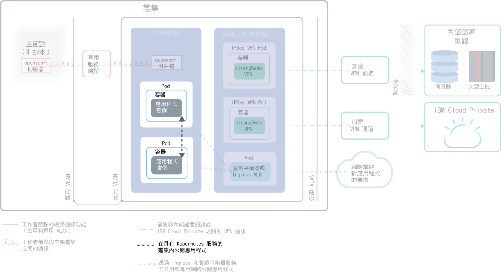
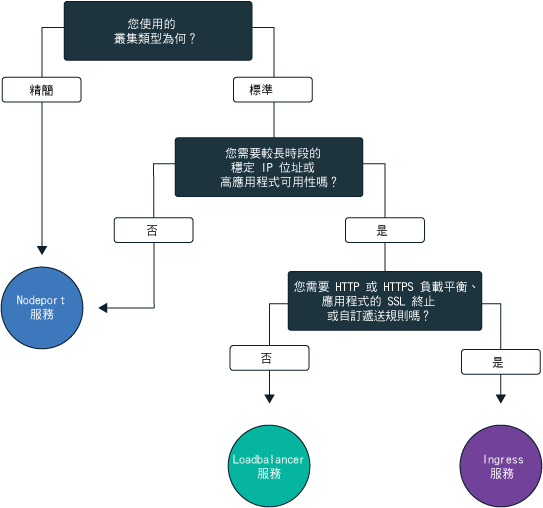
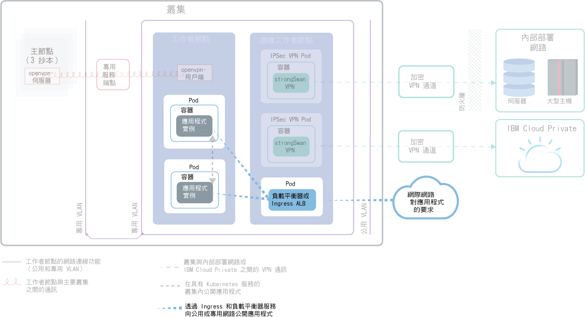
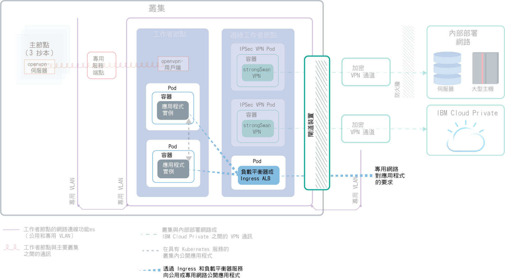

---

copyright:
  years: 2014, 2019
lastupdated: "2019-03-21"

keywords: kubernetes, iks

subcollection: containers

---

{:new_window: target="_blank"}
{:shortdesc: .shortdesc}
{:screen: .screen}
{:pre: .pre}
{:table: .aria-labeledby="caption"}
{:codeblock: .codeblock}
{:tip: .tip}
{:note: .note}
{:important: .important}
{:deprecated: .deprecated}
{:download: .download}

# 規劃使用叢集內及外部網路公開應用程式
{: #cs_network_planning}

使用 {{site.data.keyword.containerlong}}，您可以讓應用程式進行公然或私下地存取，以管理叢集內及外部網路。
{: shortdesc}

此頁面可協助您規劃應用程式的叢集內及外部網路。如需設定叢集網路功能的相關資訊，請參閱[設定叢集網路](/docs/containers?topic=containers-cs_network_cluster)。
{: tip}

## 透過 Kubernetes 服務將應用程式公開至叢集內的資料流量
{: #in-cluster}

建立 Kubernetes Discovery Service，以容許在叢集的 Pod 之間通訊。
{: shortdesc}

<figure>
 
 <figcaption>使用 Kubernetes 服務公開叢集內的應用程式</figcaption>
</figure>

所有已部署至工作者節點的 Pod 會獲指派 172.30.0.0/16 範圍中的專用 IP 位址，並且只在工作者節點之間遞送。為了避免衝突，請勿在與工作者節點進行通訊的任何節點上使用此 IP 範圍。使用專用 IP 位址，工作者節點及 Pod 可以在專用網路上安全地進行通訊。不過，Pod 損毀或需要重建工作者節點時，會指派新的專用 IP 位址。

依預設，對必須為高可用性的應用程式，很難追蹤其變更中的專用 IP 位址。相反地，您可以使用內建 Kubernetes 服務探索特性，將應用程式公開為專用網路上的叢集 IP 服務。Kubernetes 服務會將一組 Pod 分組並提供這些 Pod 的網路連線。此連線提供與叢集裡其他服務的連線功能，而不會公開每一個 Pod 的實際專用 IP 位址。服務會獲指派只能在叢集內部存取的叢集內 IP 位址。
* 較舊的叢集：在 2018 年 2 月之前在 dal13 區域或在 2017 年 10 月之前在任何其他區域建立的叢集裡，服務從 10.10.10.0/24 範圍中的 254 個 IP 當中獲指派其中一個 IP。如果您已達 254 個服務的限制，而且需要更多服務，則必須建立新的叢集。
* 較新的叢集：在 2018 年 2 月之後在 dal13 區域或在 2017 年 10 月之後在任何其他區域建立的叢集裡，服務從 172.21.0.0/16 範圍中的 65,000 個 IP 當中獲指派其中一個 IP。

為了避免衝突，請勿在與工作者節點進行通訊的任何節點上使用此 IP 範圍。也會建立服務的 DNS 查閱項目，並將其儲存在叢集的 `kube-dns` 元件中。DNS 項目包含服務的名稱、已建立服務的名稱空間，以及已指派叢集內 IP 位址的鏈結。

若要存取叢集服務背後的 Pod，應用程式可以使用服務的叢集內 IP 位址，或使用服務名稱來傳送要求。當您使用服務的名稱時，會在 `kube-dns` 元件中查閱該名稱，並將其遞送至服務的叢集內 IP 位址。當要求到達服務時，服務會將要求平均轉遞至 Pod，並與 Pod 的叢集內 IP 位址及其部署至的工作者節點無關。

 

## 選擇 NodePort、LoadBalancer 或 Ingress 服務以將應用程式公開至叢集外的資料流量
{: #external}

為了讓您的應用程式可從公用網際網路或專用網路進行外部存取，{{site.data.keyword.containerlong_notm}} 支援三個網路服務。
{:shortdesc}

**[NodePort 服務](/docs/containers?topic=containers-nodeport)**（免費及標準叢集）
* 公開每個工作者節點上的埠，並使用任何工作者節點的公用或專用 IP 位址來存取您在叢集裡的服務。
* Iptables 是一種 Linux Kernel 特性，可對應用程式 Pod 之間的要求進行負載平衡、提供高效能網路遞送，以及提供網路存取控制。
* 工作者節點的公用及專用 IP 位址不是永久性的。移除或重建工作者節點時，會將新的公用及新的專用 IP 位址指派給工作者節點。
* NodePort 服務十分適用於測試公用或專用存取。如果您只是短時間需要公用或專用存取，也可以使用此選項。

**[LoadBalancer 服務](/docs/containers?topic=containers-loadbalancer)**（僅限標準叢集）
* 每個標準叢集裡都會佈建四個可攜式公用 IP 位址及四個可攜式專用 IP 位址，您可用來建立應用程式的外部 TCP/UDP 負載平衡器。您可以公開應用程式所需的任何埠來自訂負載平衡器。
* Iptables 是一種 Linux Kernel 特性，可對應用程式 Pod 之間的要求進行負載平衡、提供高效能網路遞送，以及提供網路存取控制。
* 指派給負載平衡器的可攜式公用及專用 IP 位址是永久性的，因此在叢集裡重建工作者節點時並不會變更。
* 您可以建立應用程式的主機名稱，以在 DNS 項目中登錄公用負載平衡器 IP 位址。您也可以在每個主機名稱的負載平衡器 IP 上，啟用性能檢查監視器。

**[Ingress](/docs/containers?topic=containers-ingress)**（僅限標準叢集）
* 建立一個外部 HTTP、HTTPS 或 TCP 應用程式負載平衡器 (ALB)，來公開叢集中的多個應用程式。ALB 使用安全且唯一的公用或專用進入點（Ingress 子網域），將送入要求遞送至應用程式。
* 您可以使用一個路徑，將叢集裡的多個應用程式公開為服務。
* Ingress 包含三個元件：
  * Ingress 資源會定義如何遞送及負載平衡應用程式送入要求的規則。
  * ALB 會接聽送入的 HTTP、HTTPS 或 TCP 服務要求。它會根據您在 Ingress 資源中所定義的規則，在應用程式的 Pod 之間轉遞要求。
  * 多區域負載平衡器 (MZLB) 處理應用程式的所有送入要求，並負載平衡各種區域中 ALB 之間的要求。它也會在每個區域中啟用 ALB IP 位址的性能檢查。
* 如果您需要使用自訂遞送規則來實作自己的 ALB，而且應用程式需要 SSL 終止，則請使用 Ingress。

若要選擇應用程式的最佳網路服務，您可以遵循此決策樹狀結構，然後按一下其中一個選項來開始使用。

<map name="networking_map" id="networking_map">
<area href="/docs/containers?topic=containers-nodeport" alt="Nodeport 服務" shape="circle" coords="52, 283, 45"/>
<area href="/docs/containers?topic=containers-loadbalancer" alt="LoadBalancer 服務" shape="circle" coords="247, 419, 44"/>
<area href="/docs/containers?topic=containers-ingress" alt="Ingress 服務" shape="circle" coords="445, 420, 45"/>
</map>

想要 {{site.data.keyword.containerlong_notm}} 中可用負載平衡部署型樣的其他詳細資料嗎？請參閱此[部落格文章 ](https://www.ibm.com/blogs/bluemix/2018/10/ibm-cloud-kubernetes-service-deployment-patterns-for-maximizing-throughput-and-availability/)。
{: tip}

 

## 規劃公用及專用 VLAN 設定的公用外部網路功能
{: #public_access}

當您在 {{site.data.keyword.containerlong_notm}} 中建立 Kubernetes 叢集時，可以將叢集連接至公用 VLAN。公用 VLAN 會判定指派給每一個工作者節點的公用 IP 位址，以將公用網路介面提供給每一個工作者節點。
{:shortdesc}

<figure>
 
 <figcaption>預設網路設定中將應用程式公開至公用網路</figcaption>
</figure>

工作者節點的公用網路介面受到[預先定義的 Calico 網路原則設定](/docs/containers?topic=containers-network_policies#default_policy)所保護，這些設定是在建立叢集期間配置於每個工作者節點上。

依預設，所有工作者節點都允許所有出埠網路資料流量。除了少數埠之外，入埠網路資料流量會遭到封鎖。開啟這些埠讓 IBM 可以監視網路資料流量，並自動安裝 Kubernetes 主節點的安全更新項目，以及可以建立與 NodePort、LoadBalancer 及 Ingress 服務的連線。如需這些原則的相關資訊，包括如何修改它們，請參閱[網路原則](/docs/containers?topic=containers-network_policies#network_policies)。

若要將應用程式設為可在網際網路上公開使用，您可以建立 NodePort、LoadBalancer 或 Ingress 服務。若要比較每一個服務，請參閱[選擇 NodePort、LoadBalancer 或 Ingress 服務](#external)。

下圖顯示 Kubernetes 在 {{site.data.keyword.containerlong_notm}} 中如何轉遞公用網路資料流量。

 

## 規劃公用及專用 VLAN 設定的專用外部網路功能
{: #private_both_vlans}

當您的工作者節點同時連接至公用及專用 VLAN 時，您可以透過建立專用 NodePort、LoadBalancer 或 Ingress 服務，讓您的應用程式只能從專用網路存取。然後，您可以建立 Calico 原則來封鎖服務的公用資料流量。
{: shortdesc}

工作者節點的公用網路介面受到[預先定義的 Calico 網路原則設定](/docs/containers?topic=containers-network_policies#default_policy)所保護，這些設定是在建立叢集期間配置於每個工作者節點上。依預設，所有工作者節點都允許所有出埠網路資料流量。除了少數埠之外，入埠網路資料流量會遭到封鎖。開啟這些埠讓 IBM 可以監視網路資料流量，並自動安裝 Kubernetes 主節點的安全更新項目，以及可以建立與 NodePort、LoadBalancer 及 Ingress 服務的連線。

如果您只想在專用網路上公開應用程式，您可以建立專用 NodePort、LoadBalancer 或 Ingress 服務。

**NodePort**
* [建立 NodePort 服務](/docs/containers?topic=containers-nodeport)。除了公用 IP 位址之外，在工作者節點的專用 IP 位址上，也可以使用 NodePort 服務。
* NodePort 服務會透過工作者節點的專用及公用 IP 位址在工作者節點上開啟埠。您必須使用 [Calico DNAT 前網路原則](/docs/containers?topic=containers-network_policies#block_ingress)來封鎖公用 NodePort。

**LoadBalancer**
* [建立專用 LoadBalancer 服務](/docs/containers?topic=containers-loadbalancer)。
* 具有可攜式專用 IP 位址的負載平衡器服務仍然會在每個工作者節點上開啟一個公用節點埠。您必須使用 [Calico DNAT 前網路原則](/docs/containers?topic=containers-network_policies#block_ingress)來封鎖其上的公用節點埠。

**Ingress**
* 當您建立叢集時，會自動建立一個公用及一個專用 Ingress 應用程式負載平衡器 (ALB)。因為依預設會啟用公用 ALB 並停用專用 ALB，所以您必須[停用公用 ALB](/docs/containers?topic=containers-cs_cli_reference#cs_alb_configure) 以及[啟用專用 ALB](/docs/containers?topic=containers-ingress#private_ingress)。
* 然後，[建立專用 Ingress 服務](/docs/containers?topic=containers-ingress#ingress_expose_private)。

因為預設 Calico 網路原則容許入埠公用資料流量進入這些服務，所以您可以建立 Calico 原則，改為封鎖服務的所有公用資料流量。例如，NodePort 服務會在工作者節點的專用及公用 IP 位址上開啟工作者節點上的埠。具有可攜式專用 IP 位址的負載平衡器服務會在每個工作者節點上開啟一個公用 NodePort。您必須建立 [Calico DNAT 前網路原則](/docs/containers?topic=containers-network_policies#block_ingress)，以封鎖公用 NodePort。

舉例來說，假設您已建立專用負載平衡器服務。您也建立了 Calico DNAT 前原則來封鎖公用資料流量，使其無法到達負載平衡器所開啟的公用 NodePort。可以透過下列方式存取此專用負載平衡器：
* 此一相同叢集裡的任何 Pod
* 相同 {{site.data.keyword.Bluemix_notm}} 帳戶中任何叢集的任何 Pod
* 如果您已[啟用 VLAN Spanning](/docs/containers?topic=containers-subnets#subnet-routing)，則為已連接至相同 {{site.data.keyword.Bluemix_notm}} 帳戶中任何專用 VLAN 的任何系統
* 如果您不屬於 {{site.data.keyword.Bluemix_notm}} 帳戶，但仍然受公司防火牆保護，則為透過 VPN 連線連至負載平衡器 IP 所在的子網路的任何系統
* 如果您屬於不同的 {{site.data.keyword.Bluemix_notm}} 帳戶，則為透過 VPN 連線連至負載平衡器 IP 所在的子網路的任何系統

 

## 規劃僅限專用 VLAN 設定的專用外部網路功能
{: #plan_private_vlan}

若工作者節點僅連接至專用 VLAN，而且讓主節點與工作者節點透過[閘道裝置](/docs/containers?topic=containers-cs_network_ov#cs_network_ov_master_gateway)通訊，則可以透過建立專用 NodePort、LoadBalancer 或 Ingress 服務，讓您的應用程式只能從專用網路進行存取。
{: shortdesc}

<figure>
 
 <figcaption>專用網路設定中將應用程式公開至專用網路</figcaption>
</figure>

因為您的工作者節點未連接至公用 VLAN，所以不會將任何公用資料流量遞送至這些服務。您也必須在閘道裝置防火牆中[開啟必要埠及 IP 位址](/docs/containers?topic=containers-firewall#firewall_inbound)，以允許針對這些服務的入埠資料流量。

**NodePort**:
* [建立專用 NodePort 服務](/docs/containers?topic=containers-nodeport)。透過工作者節點的專用 IP 位址也可以使用此服務。
* 在您的專用防火牆中，開啟您在將服務部署至所有工作者節點的公用 IP 位址時所配置的埠，以容許接收資料流量。若要尋找埠，請執行 `kubectl get svc`。該埠在 20000-32000 的範圍內。

**LoadBalancer**
* [建立專用 LoadBalancer 服務](/docs/containers?topic=containers-loadbalancer)。如果您的叢集只能在專用 VLAN 上使用，則會使用四個可用的可攜式專用 IP 位址的其中一個。
* 在您的專用防火牆中，開啟您在將服務部署至負載平衡器服務的專用 IP 位址時所配置的埠。

**Ingress**：
* 您必須配置[專用網路上可用的 DNS 服務](https://kubernetes.io/docs/tasks/administer-cluster/dns-custom-nameservers/)。
* 當您建立叢集時，會自動建立專用 Ingress 應用程式負載平衡器 (ALB)，但依預設未啟用。您必須[啟用專用 ALB](/docs/containers?topic=containers-ingress#private_ingress)。
* 然後，[建立專用 Ingress 服務](/docs/containers?topic=containers-ingress#ingress_expose_private)。
* 在您的專用防火牆中，針對專用 ALB 的 IP 位址，開啟埠 80（適用於 HTTP）或埠 443（適用於 HTTPS）。

如果叢集僅連接至專用 VLAN，而且讓主節點與工作者節點透過僅限專用服務端點通訊，則無法將應用程式公開至專用網路。您必須設定閘道裝置（例如 [VRA](/docs/infrastructure/virtual-router-appliance?topic=virtual-router-appliance-about-the-vra) 或 [FSA](/docs/services/vmwaresolutions/services?topic=vmware-solutions-fsa_considerations)）作為防火牆，並且封鎖不想要的資料流量。如果您不要設定閘道裝置，則可以[建立工作者節點儲存區](/docs/containers?topic=containers-clusters#add_pool)，而工作者節點儲存區連接至公用及專用 VLAN。然後，您可以將這些工作者節點標示為邊緣節點，並使用 Calico 原則來封鎖所有不想要的公用資料流量。如需相關資訊，請參閱[將網路工作負載隔離至邊緣工作者節點](/docs/containers?topic=containers-cs_network_planning#both_vlans_private_edge)。
{: note}

 

## 選用項目：將網路工作負載隔離至邊緣工作者節點
{: #both_vlans_private_edge}

邊緣工作者節點可以藉由容許較少的工作者節點可在外部進行存取，以及隔離網路工作負載，來增進叢集的安全。若要確定只將 Ingress 及負載平衡器 Pod 部署至指定的工作者節點，請[將工作者節點標示為邊緣節點](/docs/containers?topic=containers-edge#edge_nodes)。若也要防止在邊緣節點上執行其他工作負載，請[污染邊緣節點](/docs/containers?topic=containers-edge#edge_workloads)。
{: shortdesc}

如果叢集連接至公用 VLAN，但您想要封鎖邊緣工作者節點上公用 NodePort 的資料流量，則也可以使用 [Calico preDNAT 網路原則](/docs/containers?topic=containers-network_policies#block_ingress)。封鎖節點埠可確保邊緣工作者節點是處理送入資料流量的唯一工作者節點。

## 選用項目：在專用網路上隔離叢集
{: #isolate}

如果您有多區域叢集、單一區域叢集的多個 VLAN，或相同 VLAN 上的多個子網路，則必須[啟用 VLAN Spanning](/docs/infrastructure/vlans?topic=vlans-vlan-spanning#vlan-spanning) 或 [VRF](/docs/infrastructure/direct-link?topic=direct-link-overview-of-virtual-routing-and-forwarding-vrf-on-ibm-cloud#customer-vrf-overview)，讓工作者節點可以在專用網路上彼此通訊。不過，啟用 VLAN Spanning 或 VRF 時，連接至相同 IBM Cloud 帳戶中任何專用 VLAN 的任何系統都可以存取工作者節點。您可以使用 [Calico 網路原則](/docs/containers?topic=containers-network_policies#isolate_workers)，將多區域叢集與專用網路上的其他系統隔離。這些原則也容許您在專用防火牆中開啟的 IP 範圍和埠進行 ingress 和 egress。
{: shortdesc}
