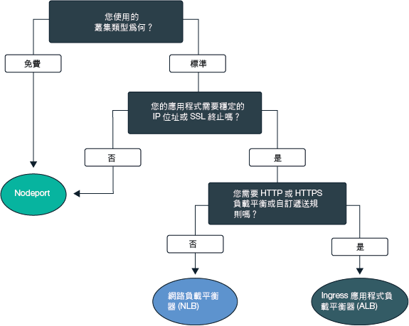
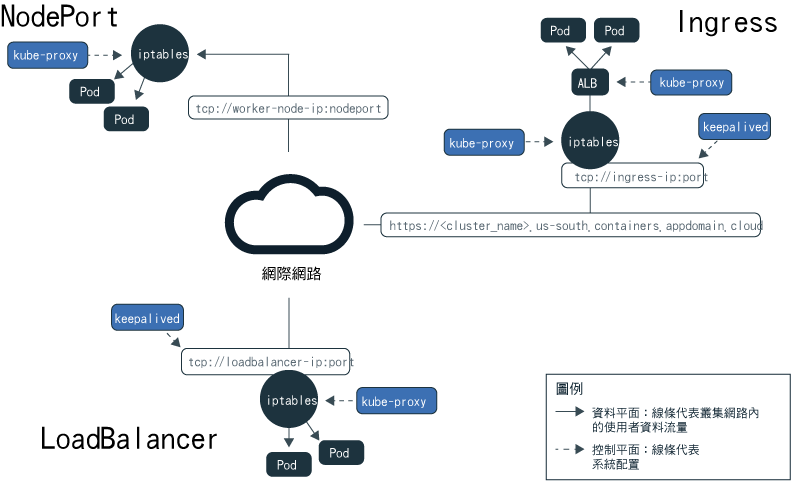
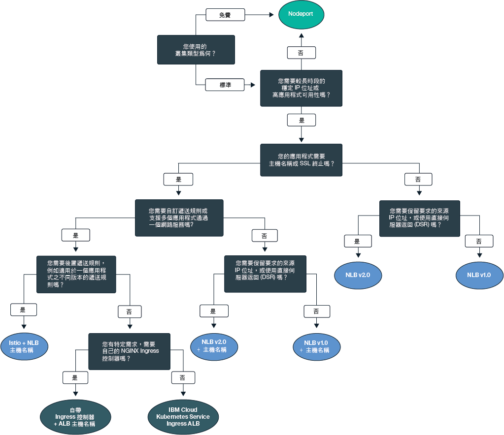

---

copyright:
  years: 2014, 2019
lastupdated: "2019-06-05"

keywords: kubernetes, iks

subcollection: containers

---

{:new_window: target="_blank"}
{:shortdesc: .shortdesc}
{:screen: .screen}
{:pre: .pre}
{:table: .aria-labeledby="caption"}
{:codeblock: .codeblock}
{:tip: .tip}
{:note: .note}
{:important: .important}
{:deprecated: .deprecated}
{:download: .download}
{:preview: .preview}

# 規劃應用程式的叢集內網路連線功能和外部網路連線功能
{: #cs_network_planning}

使用 {{site.data.keyword.containerlong}}，您可以讓應用程式進行公開或私下地存取，以管理叢集內及外部網路。
{: shortdesc}

若要快速開始使用應用程式網路，請遵循此決策樹狀結構，然後按一下選項以查看其設定文件：

<map name="networking_map" id="networking_map">
<area target="" href="/docs/containers?topic=containers-nodeport" alt="NodePort 服務" coords="52,254,78,260,93,270,101,285,92,302,72,314,49,318,19,309,0,281,18,263" shape="poly">
<area target="" href="/docs/containers?topic=containers-loadbalancer" alt="網路負載平衡器 (NLB) 服務" coords="288,405,324,414,348,434,350,455,327,471,295,477,246,471,222,446,237,417" shape="poly">
<area target="" href="/docs/containers?topic=containers-ingress" alt="Ingress 應用程式負載平衡器 (ALB) 服務" coords="532,405,568,410,593,427,600,448,582,468,554,477,508,476,467,463,454,441,474,419" shape="poly">
</map>

## 瞭解透過 Kubernetes 服務探索對應用程式的負載平衡
{: #in-cluster}

Kubernetes 服務探索使用網路服務及本端 Kubernetes Proxy，以提供具有網路連線的應用程式。
{: shortdesc}

**服務** 
所有已部署至工作者節點的 Pod 會獲指派 172.30.0.0/16 範圍中的專用 IP 位址，並且只在工作者節點之間遞送。為了避免衝突，請勿在與工作者節點進行通訊的任何節點上使用此 IP 範圍。使用專用 IP 位址，工作者節點及 Pod 可以在專用網路上安全地進行通訊。不過，Pod 損毀或需要重建工作者節點時，會指派新的專用 IP 位址。

您可以使用內建的 Kubernetes 服務探索特性將應用程式公開為服務，而不是嘗試追蹤對必須具有高可用性的應用程式的專用 IP 位址變更。Kubernetes 服務會將一組 Pod 分組並提供這些 Pod 的網路連線。服務會選取要透過標籤將資料流量遞送至其中的目標 Pod。

服務提供應用程式 Pod 與叢集裡其他服務之間的連線功能，而不會公開每個 Pod 的實際專用 IP 位址。服務會獲指派只能在叢集內部存取的叢集內 IP 位址 `clusterIP`。此 IP 位址已關聯於服務的整個有效期限，而且不會在服務存在時變更。
* 較新的叢集：在 2018 年 2 月之後在 dal13 區域或在 2017 年 10 月之後在任何其他區域建立的叢集裡，服務從 172.21.0.0/16 範圍中的 65,000 個 IP 當中獲指派其中一個 IP。
* 較舊的叢集：在 2018 年 2 月之前在 dal13 區域或在 2017 年 10 月之前在任何其他區域建立的叢集裡，服務從 10.10.10.0/24 範圍中的 254 個 IP 當中獲指派其中一個 IP。如果您已達 254 個服務的限制，而且需要更多服務，則必須建立新的叢集。

為了避免衝突，請勿在與工作者節點進行通訊的任何節點上使用此 IP 範圍。也會建立服務的 DNS 查閱項目，並將其儲存在叢集的 `kube-dns` 元件中。DNS 項目包含服務的名稱、已建立服務的名稱空間，以及已指派叢集內 IP 位址的鏈結。

**`kube-proxy`** 
若要提供服務的所有 TCP 及 UDP 網路資料流量的基本負載平衡（本端 Kubernetes 網路 Proxy `kube-proxy`），請在 `kube-system` 名稱空間的每個工作者節點上作為常駐程式來執行。`kube-proxy` 會使用 Iptables 規則（Linux Kernel 特性），將要求平均導向至受服務保護的 Pod，並與 Pod 的叢集內 IP 位址以及在其中部署的工作者節點無關。

例如，叢集內部的應用程式可以使用服務的叢集內 IP 或將要求傳送至服務名稱，來存取受叢集服務保護的 Pod。當您使用服務的名稱時，`kube-proxy` 會查閱叢集 DNS 提供者中的名稱，並將要求遞送至服務的叢集內 IP 位址。

如果您使用的服務同時提供內部叢集 IP 位址及外部 IP 位址，則叢集外的用戶端可以將要求傳送至服務的外部公用或專用 IP 位址。`kube-proxy` 會將要求轉遞至服務的叢集內 IP 位址，以及在受服務保護之應用程式 Pod 間進行負載平衡。

下圖示範 Kubernetes 如何在 {{site.data.keyword.containerlong_notm}} 中透過 `kube-proxy` 和 NodePort、LoadBalancer 或 Ingress 服務轉遞公用網路資料流量。

<figure>
 
 <figcaption>Kubernetes 如何透過 {{site.data.keyword.containerlong_notm}} 中的 NodePort、LoadBalancer 及 Ingress 服務來轉遞公用網路資料流量</figcaption>
</figure>

 

## 瞭解 Kubernetes 服務類型
{: #external}

Kubernetes 支援四種基本類型的網路服務：`ClusterIP`、`NodePort`、`LoadBalancer` 及 `Ingress`。`ClusterIP` 服務可讓您的應用程式進行內部存取，只容許您叢集裡 Pod 之間的通訊。`NodePort`、`LoadBalancer` 及 `Ingress` 服務可讓您的應用程式從公用網際網路或專用網路進行外部存取。
{: shortdesc}

<dl>
<dt>[ClusterIP](https://kubernetes.io/docs/concepts/services-networking/service/#defining-a-service)</dt>
<dd>您只能將應用程式公開為專用網路上的叢集 IP 服務。`clusterIP` 服務提供只能由叢集內的其他 Pod 及服務存取的叢集內 IP 位址。未建立應用程式的外部 IP 位址。若要存取受叢集服務保護的 Pod，叢集裡的其他應用程式可以使用服務的叢集內 IP 位址，或使用服務名稱來傳送要求。當要求到達服務時，服務會將要求平均轉遞至 Pod，並與 Pod 的叢集內 IP 位址及其部署至的工作者節點無關。請注意，如果您未在服務的 YAML 配置檔中指定 `type`，則依預設會建立 `ClusterIP` 類型。</dd>

<dt>[NodePort](/docs/containers?topic=containers-nodeport)</dt>
<dd>當您使用 NodePort 服務公開應用程式時，會將 30000 到 32767 範圍內的 NodePort 及內部叢集 IP 位址指派給服務。若要從叢集外存取服務，您可以使用任何工作者節點的公用或專用 IP 位址，以及 <code>&lt;IP_address&gt;:&lt;nodeport&gt;</code> 格式的 NodePort。不過，工作者節點的公用及專用 IP 位址不是永久性的。移除或重建工作者節點時，會將新的公用及新的專用 IP 位址指派給工作者節點。NodePort 適用於測試公用或專用存取，或僅提供短時間的存取。</dd>

<dt>[LoadBalancer (NLB)](/docs/containers?topic=containers-loadbalancer)</dt>
<dd>每個標準叢集都會佈建四個可攜式公用 IP 位址及四個可攜式專用 IP 位址，可用來建立應用程式的第 4 層 TCP/UDP 網路負載平衡器 (NLB)。您可以公開應用程式所需的任何埠來自訂 NLB。指派給 NLB 的可攜式公用及專用 IP 位址是永久性的，因此在叢集裡重建工作者節點時並不會變更。您可以建立應用程式的主機名稱，以在 DNS 項目中登錄公用 NLB IP 位址。您也可以在每個主機名稱的 NLB IP 上啟用性能檢查監視器。</dd>

<dt>[Ingress (ALB)](/docs/containers?topic=containers-ingress)</dt>
<dd>建立一個第 7 層 HTTP、HTTPS 或 TCP Ingress 應用程式負載平衡器 (ALB)，來公開叢集裡的多個應用程式。ALB 使用安全且唯一的公用或專用進入點（Ingress 子網域），將送入要求遞送至應用程式。您可以使用一個路徑，將叢集裡的多個應用程式公開為服務。Ingress 包含三個元件：<ul>
  <li>Ingress 資源會定義如何遞送及負載平衡應用程式送入要求的規則。</li>
  <li>ALB 會接聽送入的 HTTP、HTTPS 或 TCP 服務要求。它會根據您在 Ingress 資源中所定義的規則，在應用程式的 Pod 之間轉遞要求。</li>
  <li>多區域負載平衡器 (MZLB) 處理應用程式的所有送入要求，並負載平衡各種區域中 ALB 之間的要求。它也會在每個區域中啟用 ALB IP 位址的性能檢查。</li></ul></dd>
</dl>

 
下表比較每種網路服務類型的特性。

|特徵|ClusterIP|NodePort|LoadBalancer (NLB)|Ingress (ALB)|
|---------------|---------|--------|------------|-------|
|免費叢集||| | |
|標準叢集|||||
|可外部存取| ||||
|穩定外部 IP| | |||
|外部主機名稱| | |||
|SSL 終止| | |||
|HTTP(S) 負載平衡| | | ||
|自訂遞送規則| | | ||
|每個服務有多個應用程式| | | ||
{: caption="Kubernetes 網路服務類型的特徵" caption-side="top"}

若要根據其中一個以上的網路服務來選擇負載平衡部署模式，請參閱[選擇公用外部負載平衡的部署模式](#pattern_public)或[選擇專用外部負載平衡的部署模式](#private_access)。

 

## 規劃公用外部負載平衡
{: #public_access}

將叢集裡的應用程式公開至網際網路。
{: shortdesc}

當您在 {{site.data.keyword.containerlong_notm}} 中建立 Kubernetes 叢集時，可以將叢集連接至公用 VLAN。公用 VLAN 會判定指派給每一個工作者節點的公用 IP 位址，以將公用網路介面提供給每一個工作者節點。
公用網路服務使用公用 IP 位址及選用公用 URL 來提供應用程式，以連接至此公用網路介面。公開應用程式時，具有您為應用程式設定的公用服務 IP 位址或 URL 的任何人都可以將要求傳送至應用程式。因此，請儘可能公開最少的應用程式。當您準備接受來自外部 Web 用戶端或使用者的資料流量時，只會將應用程式公開給大眾使用。

工作者節點的公用網路介面受到[預先定義的 Calico 網路原則設定](/docs/containers?topic=containers-network_policies#default_policy)所保護，這些設定是在建立叢集期間配置於每個工作者節點上。依預設，所有工作者節點都允許所有出埠網路資料流量。除了少數埠之外，入埠網路資料流量會遭到封鎖。開啟這些埠讓 IBM 可以監視網路資料流量，並自動安裝 Kubernetes 主節點的安全更新項目，以及可以建立與 NodePort、LoadBalancer 及 Ingress 服務的連線。如需這些原則的相關資訊，包括如何修改它們，請參閱[網路原則](/docs/containers?topic=containers-network_policies#network_policies)。

若要將應用程式設為可在網際網路上公開使用，請為應用程式選擇負載平衡部署模式，以建立公用 NodePort、LoadBalancer 或 Ingress 服務。

### 選擇用於公用外部負載平衡的部署模式
{: #pattern_public}

使用網路服務公開應用程式時，您有數個部署模式選擇。若要快速入門，請遵循決策樹狀結構來選擇部署模式。如需每個部署模式、使用原因及設定方式的相關資訊，請參閱決策樹狀結構後面的表格。如需這些部署模式所使用網路服務的基本資訊，請參閱[瞭解 Kubernetes 服務類型](#external)。
{: shortdesc}

<figure>
  
  <figcaption>使用此決策樹狀結構來選擇應用程式的最佳網路部署模式。如需每個部署模式的相關資訊，請參閱下表。</figcaption>
</figure>

<table summary="此表格從左到右閱讀公用網路部署模式的名稱、特徵、使用案例及部署步驟。">
<caption>IBM Cloud Kubernetes Service 中的公用網路部署模式性質</caption>
<col width="10%">
<col width="25%">
<col width="25%">
<thead>
<th>名稱</th>
<th>負載平衡方法</th>
<th>使用案例</th>
<th>實作</th>
</thead>
<tbody>
<tr>
<td>NodePort</td>
<td>工作者節點上的埠，可在工作者節點的公用 IP 位址上公開應用程式</td>
<td>測試某個應用程式的公用存取，或僅提供短時間的存取。</td>
<td>[建立公用 NodePort 服務](/docs/containers?topic=containers-nodeport#nodeport_config)。</td>
</tr><tr>
<td>NLB 1.0 版（+ 主機名稱）</td>
<td>使用 IP 位址或主機名稱公開應用程式的基本負載平衡</td>
<td>使用支援 SSL 終止的 IP 位址或主機名稱，快速將一個應用程式公開給大眾使用。</td>
<td><ol><li>在[單一區域](/docs/containers?topic=containers-loadbalancer#lb_config)或[多區域](/docs/containers?topic=containers-loadbalancer#multi_zone_config)叢集裡建立公用網路負載平衡器 (NLB) 1.0。</li><li>選擇性地[登錄](/docs/containers?topic=containers-loadbalancer#loadbalancer_hostname)主機名稱及性能檢查。</li></ol></td>
</tr><tr>
<td>NLB 2.0 版（+ 主機名稱）</td>
<td>使用 IP 位址或主機名稱公開應用程式的 DSR 負載平衡</td>
<td>使用支援 SSL 終止的 IP 位址或主機名稱，將可能收到大量資料流量的應用程式公開給大眾使用。</td>
<td><ol><li>完成[必要條件](/docs/containers?topic=containers-loadbalancer#ipvs_provision)。</li><li>在[單一區域](/docs/containers?topic=containers-loadbalancer#ipvs_single_zone_config)或[多區域](/docs/containers?topic=containers-loadbalancer#ipvs_multi_zone_config)叢集裡建立公用 NLB 2.0。</li><li>選擇性地[登錄](/docs/containers?topic=containers-loadbalancer#loadbalancer_hostname)主機名稱及性能檢查。</li></ol></td>
</tr><tr>
<td>Istio + NLB 主機名稱</td>
<td>使用主機名稱公開應用程式以及使用 Istio 遞送規則的基本負載平衡</td>
<td>實作 Istio 後遞送規則（例如一個應用程式微服務的不同版本的規則），並使用公用主機名稱公開 Istio 受管理應用程式。</li></ol></td>
<td><ol><li>安裝[受管理 Istio 附加程式](/docs/containers?topic=containers-istio#istio_install)。</li><li>請在 [Istio 服務網](/docs/containers?topic=containers-istio#istio_sidecar)中包括您的應用程式。</li><li>使用[主機名稱](/docs/containers?topic=containers-istio#istio_expose_link)登錄預設 Istio 負載平衡器。</li></ol></td>
</tr><tr>
<td>Ingress ALB</td>
<td>使用主機名稱公開應用程式以及使用自訂遞送規則的 HTTPS 負載平衡</td>
<td>實作多個應用程式的自訂遞送規則及 SSL 終止。</td>
<td><ol><li>建立公用 ALB 的 [Ingress 服務](/docs/containers?topic=containers-ingress#ingress_expose_public)。</li><li>使用[註釋](/docs/containers?topic=containers-ingress_annotation)來自訂 ALB 遞送規則。</li></ol></td>
</tr><tr>
<td>自行準備 Ingress 控制器 + ALB 主機名稱</td>
<td>具有自訂 Ingress 控制器的 HTTPS 負載平衡，其使用 IBM 提供的 ALB 主機名稱公開應用程式以及使用自訂遞送規則</td>
<td>實作自訂遞送規則或針對多個應用程式自訂調整的其他特定需求。</td>
<td>[部署 Ingress 控制器，並運用 IBM 提供的 ALB 主機名稱](/docs/containers?topic=containers-ingress#user_managed)。</td>
</tr>
</tbody>
</table>

仍然想要 {{site.data.keyword.containerlong_notm}} 中可用負載平衡部署模式的其他詳細資料嗎？請參閱此[部落格文章 ](https://www.ibm.com/blogs/bluemix/2018/10/ibm-cloud-kubernetes-service-deployment-patterns-for-maximizing-throughput-and-availability/)。
{: tip}

 

## 規劃專用外部負載平衡
{: #private_access}

只將叢集裡的應用程式私下公開至專用網路。
{: shortdesc}

當您在 {{site.data.keyword.containerlong_notm}} 的 Kubernetes 叢集裡部署應用程式時，建議您只讓位於與叢集相同專用網路上的使用者和服務存取應用程式。專用負載平衡適用於讓叢集外的要求使用您的應用程式，而不將應用程式公開給一般大眾使用。您也可以先使用專用負載平衡來測試應用程式的存取、要求遞送及其他配置，稍後再使用公用網路服務將應用程式公開給大眾使用。

舉例來說，假設您為應用程式建立專用 NLB。可以透過下列方式存取此專用 NLB：
* 該相同叢集裡的任何 Pod。
* 相同 {{site.data.keyword.Bluemix_notm}} 帳戶中任何叢集的任何 Pod。
* 任何連接至相同 {{site.data.keyword.Bluemix_notm}} 帳戶中任何專用 VLAN 的系統（如果已啟用了 [VRF 或 VLAN Spanning](/docs/containers?topic=containers-subnets#basics_segmentation)）。
* 如果您不屬於 {{site.data.keyword.Bluemix_notm}} 帳戶，但仍然受公司防火牆保護，則為透過 VPN 連線連至 NLB IP 所在之子網路的任何系統
* 如果您屬於不同的 {{site.data.keyword.Bluemix_notm}} 帳戶，則為透過 VPN 連線連至 NLB IP 所在之子網路的任何系統。

若要讓應用程式只能透過專用網路使用，請根據叢集的 VLAN 設定來選擇負載平衡部署模式：
* [公用和專用 VLAN 設定](#private_both_vlans)
* [僅限專用 VLAN 設定](#plan_private_vlan)

### 在公用和專用 VLAN 設定中設定專用負載平衡
{: #private_both_vlans}

當您的工作者節點同時連接至公用及專用 VLAN 時，您可以透過建立專用 NodePort、LoadBalancer 或 Ingress 服務，讓您的應用程式只能從專用網路存取。然後，您可以建立 Calico 原則來封鎖服務的公用資料流量。
{: shortdesc}

工作者節點的公用網路介面受到[預先定義的 Calico 網路原則設定](/docs/containers?topic=containers-network_policies#default_policy)所保護，這些設定是在建立叢集期間配置於每個工作者節點上。依預設，所有工作者節點都允許所有出埠網路資料流量。除了少數埠之外，入埠網路資料流量會遭到封鎖。開啟這些埠讓 IBM 可以監視網路資料流量，並自動安裝 Kubernetes 主節點的安全更新項目，以及可以建立與 NodePort、LoadBalancer 及 Ingress 服務的連線。

因為預設 Calico 網路原則容許入埠公用資料流量進入這些服務，所以您可以建立 Calico 原則，改為封鎖服務的所有公用資料流量。例如，NodePort 服務會在工作者節點的專用及公用 IP 位址上開啟工作者節點上的埠。具有可攜式專用 IP 位址的 NLB 服務會在每個工作者節點上開啟一個公用 NodePort。您必須建立 [Calico DNAT 前網路原則](/docs/containers?topic=containers-network_policies#block_ingress)，以封鎖公用 NodePort。

請查看下列適用於專用網路的負載平衡部署模式：

|名稱|負載平衡方法|使用案例|實作|
|----|---------------------|--------|--------------|
|NodePort|工作者節點上的埠，可在工作者節點的專用 IP 位址上公開應用程式|測試某個應用程式的專用存取，或僅提供短時間的存取。|<ol><li>[建立 NodePort 服務](/docs/containers?topic=containers-nodeport)。</li><li>NodePort 服務會透過工作者節點的專用及公用 IP 位址在工作者節點上開啟埠。您必須使用 [Calico DNAT 前網路原則](/docs/containers?topic=containers-network_policies#block_ingress)來封鎖對公用 NodePort 的資料流量。</li></ol>|
|NLB 1.0 版|使用專用 IP 位址公開應用程式的基本負載平衡|使用專用 IP 位址將某個應用程式快速公開至專用網路。|<ol><li>[建立專用 NLB 服務](/docs/containers?topic=containers-loadbalancer)。</li><li>具有可攜式專用 IP 位址的 NLB 仍然會在每個工作者節點上開啟一個公用節點埠。建立 [Calico DNAT 前網路原則](/docs/containers?topic=containers-network_policies#block_ingress)來封鎖對公用 NodePort 的資料流量。</li></ol>|
|NLB 2.0 版|使用專用 IP 位址公開應用程式的 DSR 負載平衡|使用 IP 位址，將可能收到大量資料流量的應用程式公開至專用網路。|<ol><li>[建立專用 NLB 服務](/docs/containers?topic=containers-loadbalancer)。</li><li>具有可攜式專用 IP 位址的 NLB 仍然會在每個工作者節點上開啟一個公用節點埠。建立 [Calico DNAT 前網路原則](/docs/containers?topic=containers-network_policies#block_ingress)來封鎖對公用 NodePort 的資料流量。</li></ol>|
|Ingress ALB|使用主機名稱公開應用程式以及使用自訂遞送規則的 HTTPS 負載平衡|實作多個應用程式的自訂遞送規則及 SSL 終止。|<ol><li>[停用公用 ALB](/docs/containers?topic=containers-cli-plugin-kubernetes-service-cli#cs_alb_configure)。</li><li>[啟用專用 ALB，並建立 Ingress 資源](/docs/containers?topic=containers-ingress#ingress_expose_private)。</li><li>使用[註釋](/docs/containers?topic=containers-ingress_annotation)來自訂 ALB 遞送規則。</li></ol>|
{: caption="公用和專用 VLAN 設定的網路部署模式特徵" caption-side="top"}

 

### 設定僅限專用 VLAN 設定的專用負載平衡
{: #plan_private_vlan}

當您的工作者節點連接至僅限專用 VLAN 時，您可以藉由建立專用 NodePort、LoadBalancer 或 Ingress 服務，讓您的應用程式只能從專用網路進行外部存取。
{: shortdesc}

如果叢集僅連接至專用 VLAN，而且讓主節點與工作者節點透過僅限專用服務端點通訊，則您無法自動將應用程式公開至專用網路。您必須設定閘道裝置（例如 [VRA (Vyatta)](/docs/infrastructure/virtual-router-appliance?topic=virtual-router-appliance-about-the-vra) 或 [FSA](/docs/services/vmwaresolutions/services?topic=vmware-solutions-fsa_considerations)）作為防火牆，並且封鎖或容許資料流量。因為您的工作者節點未連接至公用 VLAN，所以不會將任何公用資料流量遞送至 NodePort、LoadBalancer 或 Ingress 服務。不過，您必須在閘道裝置防火牆中開啟必要埠及 IP 位址，以允許對這些服務的入埠資料流量。

請查看下列適用於專用網路的負載平衡部署模式：

|名稱|負載平衡方法|使用案例|實作|
|----|---------------------|--------|--------------|
|NodePort|工作者節點上的埠，可在工作者節點的專用 IP 位址上公開應用程式|測試某個應用程式的專用存取，或僅提供短時間的存取。|<ol><li>[建立 NodePort 服務](/docs/containers?topic=containers-nodeport)。</li><li>在您的專用防火牆中，開啟您在將服務部署至所有工作者節點的公用 IP 位址時所配置的埠，以容許接收資料流量。若要尋找埠，請執行 `kubectl get svc`。該埠在 20000-32000 的範圍內。</li></ol>|
|NLB 1.0 版|使用專用 IP 位址公開應用程式的基本負載平衡|使用專用 IP 位址將某個應用程式快速公開至專用網路。|<ol><li>[建立專用 NLB 服務](/docs/containers?topic=containers-loadbalancer)。</li><li>在您的專用防火牆中，開啟您在將服務部署至 NLB 的專用 IP 位址時所配置的埠。</li></ol>|
|NLB 2.0 版|使用專用 IP 位址公開應用程式的 DSR 負載平衡|使用 IP 位址，將可能收到大量資料流量的應用程式公開至專用網路。|<ol><li>[建立專用 NLB 服務](/docs/containers?topic=containers-loadbalancer)。</li><li>在您的專用防火牆中，開啟您在將服務部署至 NLB 的專用 IP 位址時所配置的埠。</li></ol>|
|Ingress ALB|使用主機名稱公開應用程式以及使用自訂遞送規則的 HTTPS 負載平衡|實作多個應用程式的自訂遞送規則及 SSL 終止。|<ol><li>配置[專用網路上可用的 DNS 服務 ](https://kubernetes.io/docs/tasks/administer-cluster/dns-custom-nameservers/)。</li><li>[啟用專用 ALB，並建立 Ingress 資源](/docs/containers?topic=containers-ingress#private_ingress)。</li><li>在您的專用防火牆中，針對專用 ALB 的 IP 位址，開啟埠 80（適用於 HTTP）或埠 443（適用於 HTTPS）。</li><li>使用[註釋](/docs/containers?topic=containers-ingress_annotation)來自訂 ALB 遞送規則。</li></ol>|
{: caption="僅限專用 VLAN 設定的網路部署模式特徵" caption-side="top"}
