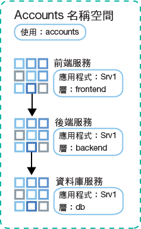
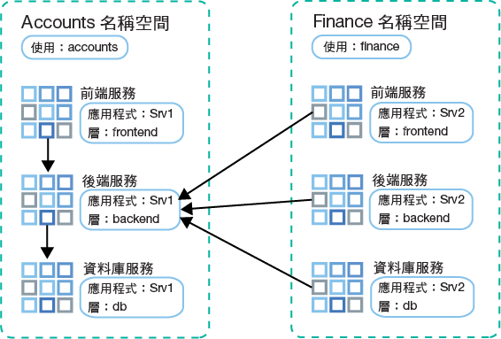

---

copyright:
  years: 2014, 2019
lastupdated: "2019-06-11"

keywords: kubernetes, iks

subcollection: containers

---

{:new_window: target="_blank"}
{:shortdesc: .shortdesc}
{:screen: .screen}
{:pre: .pre}
{:table: .aria-labeledby="caption"}
{:codeblock: .codeblock}
{:tip: .tip}
{:note: .note}
{:important: .important}
{:deprecated: .deprecated}
{:download: .download}
{:preview: .preview}


# 使用網路原則控制資料流量
{: #network_policies}

每個 Kubernetes 叢集都會設定稱為 Calico 的網路外掛程式。已設定預設的網路原則來保護 {{site.data.keyword.containerlong}} 中每個工作者節點的公用網路介面。
{: shortdesc}

如果您有獨特的安全需求，或您有已啟用 VLAN Spanning 的多區域叢集，則可以使用 Calico 及 Kubernetes 來建立叢集的網路原則。使用 Kubernetes 網路原則，您可以指定要容許或封鎖進出叢集內 Pod 的網路資料流量。若要設定其他進階網路原則，例如封鎖入埠 (Ingress) 資料流量進入網路負載平衡器 (NLB) 服務，請使用 Calico 網路原則。

<ul>
  <li>
  [Kubernetes 網路原則 ](https://kubernetes.io/docs/concepts/services-networking/network-policies/)：這些原則指定 Pod 如何與其他 Pod 及外部端點通訊。自 Kubernetes 1.8 版開始，可根據通訊協定、埠及來源或目的地 IP 位址，容許或封鎖送入及送出的網路資料流量。也可以根據 Pod 及名稱空間標籤來過濾資料流量。您可以使用 `kubectl` 指令或 Kubernetes API 來套用 Kubernetes 網路原則。這些原則在套用時會自動轉換為 Calico 網路原則，而 Calico 會強制執行這些原則。</li>
  <li>
  [Calico 網路原則 ](https://docs.projectcalico.org/v3.3/getting-started/bare-metal/policy/)：這些原則是 Kubernetes 網路原則的超集，並且使用 `calicoctl` 指令予以套用。Calico 原則新增下列特性。
    <ul>
    <li>不論 Kubernetes Pod 來源或目的地 IP 位址或 CIDR，都容許或封鎖特定網路介面上的網路資料流量。</li>
    <li>容許或封鎖名稱空間的 Pod 之間的網路資料流量。</li>
    <li>[封鎖 Kubernetes LoadBalancer 或 NodePort Kubernetes 服務的入埠 (Ingress) 資料流量](#block_ingress)。</li>
    </ul>
  </li>
  </ul>

Calico 藉由在 Kubernetes 工作者節點上設定 Linux Iptables 規則，來強制執行這些原則（包括任何會自動轉換為 Calico 原則的 Kubernetes 網路原則）。iptables 規則作為工作者節點的防火牆，以定義網路資料流量必須符合才能轉遞至目標資源的特徵。

若要使用網路負載平衡器 (NLB) 及 Ingress 應用程式負載平衡器 (ALB) 服務，請使用 Calico 及 Kubernetes 原則來管理進出叢集的網路資料流量。請不要使用 IBM Cloud 基礎架構 (SoftLayer) [安全群組](/docs/infrastructure/security-groups?topic=security-groups-about-ibm-security-groups#about-ibm-security-groups)。IBM Cloud 基礎架構 (SoftLayer) 安全群組會套用至單一虛擬伺服器的網路介面，以過濾 Hypervisor 層次的資料流量。不過，安全群組不支援 VRRP 通訊協定，而 {{site.data.keyword.containerlong_notm}} 使用此通訊協定來管理 ALB 及 NLB IP 位址。如果沒有 VRRP 通訊協定可以管理 IP，則 ALB 及 NLB 服務無法正常運作。
{: tip}

<br />


## 預設 Calico 及 Kubernetes 網路原則
{: #default_policy}

建立具有公用 VLAN 的叢集時，會針對每個工作者節點及其公用網路介面，自動建立具有 `ibm.role: worker_public` 標籤的 `HostEndpoint` 資源。若要保護工作者節點的公用網路介面，預設 Calico 原則會套用至任何具有 `ibm.role: worker_public` 標籤的主機端點。
{:shortdesc}

這些預設 Calico 主機原則容許所有出埠網路資料流量，並容許特定叢集元件（例如 Kubernetes NodePort、LoadBalancer 及 Ingress 服務）的入埠資料流量。會封鎖從網際網路至工作者節點的任何其他入埠網路資料流量（預設原則中未指定的）。預設原則不會影響 Pod 至 Pod 的資料流量。

檢閱下列自動套用至叢集的預設 Calico 主機原則。

除非您完全瞭解原則，否則請不要移除套用至主機端點的原則。確定您不需要原則所容許的資料流量。
{: important}

 <table summary="表格中的第一列跨越兩個直欄。請由左至右閱讀其餘的列，第一欄為伺服器區域，第二欄則為要符合的 IP 位址。">
 <caption>每個叢集的預設 Calico 主機原則</caption>
  <thead>
  <th colspan=2> 每個叢集的預設 Calico 主機原則</th>
  </thead>
  <tbody>
    <tr>
      <td><code>allow-all-outbound</code></td>
      <td>容許所有出埠資料流量。</td>
    </tr>
    <tr>
      <td><code>allow-bigfix-port</code></td>
      <td>容許埠 52311 上 BigFix 應用程式的送入資料流量，以容許必要的工作者節點更新。</td>
    </tr>
    <tr>
      <td><code>allow-icmp</code></td>
      <td>容許送入的 ICMP 封包 (ping)。</td>
     </tr>
    <tr>
      <td><code>allow-node-port-dnat</code></td>
      <td>容許將網路負載平衡器 (NLB)、Ingress 應用程式負載平衡器 (ALB) 及 NodePort 服務資料流量送入至那些服務所公開的 Pod。<strong>附註</strong>：您不需要指定公開的埠，因為 Kubernetes 會使用目的地網址轉譯 (DNAT) 將服務要求轉遞至正確的 Pod。該轉遞是在 Iptables 套用主機端點原則之前執行。</td>
   </tr>
   <tr>
      <td><code>allow-sys-mgmt</code></td>
      <td>容許用來管理工作者節點之特定 IBM Cloud 基礎架構 (SoftLayer) 系統的送入連線。</td>
   </tr>
   <tr>
    <td><code>allow-vrrp</code></td>
    <td>容許 VRRP 封包，用來監視及移動工作者節點之間的虛擬 IP 位址。</td>
   </tr>
  </tbody>
</table>

同時建立了預設 Kubernetes 原則，用來限制對「Kubernetes 儀表板」的存取。Kubernetes 原則不適用於主機端點，反而適用於 `kube-dashboard` Pod。此原則適用於僅連接至專用 VLAN 的叢集，以及連接至公用及專用 VLAN 的叢集。

<table>
<caption>每一個叢集的預設 Kubernetes 原則</caption>
<thead>
<th colspan=2> 每一個叢集的預設 Kubernetes 原則</th>
</thead>
<tbody>
 <tr>
  <td><code>kubernetes-dashboard</code></td>
  <td>在 <code>kube-system</code> 名稱空間中提供：封鎖所有 Pod 存取「Kubernetes 儀表板」。此原則不會影響從 {{site.data.keyword.Bluemix_notm}} 主控台，或使用 <code>kubectl proxy</code> 存取儀表板。如果 Pod 需要存取儀表板，請在名稱空間中部署具有 <code>kubernetes-dashboard-policy: allow</code> 標籤的 Pod。</td>
 </tr>
</tbody>
</table>

<br />


## 安裝並配置 Calico CLI
{: #cli_install}

若要檢視、管理及新增 Calico 原則，請安裝並配置 Calico CLI。
{:shortdesc}

1. [登入您的帳戶。適用的話，請將適當的資源群組設為目標。設定叢集的環境定義。](/docs/containers?topic=containers-cs_cli_install#cs_cli_configure)請包括 `--admin` 及 `--network` 選項與 `ibmcloud ks cluster-config` 指令。`--admin` 會下載金鑰，以存取基礎架構組合以及在工作者節點上執行 Calico 指令。`--network` 會下載 Calico 配置檔，以執行所有 Calico 指令。

  ```
  ibmcloud ks cluster-config --cluster <cluster_name_or_ID> --admin --network
  ```
  {: pre}

3. 若為 OS X 及 Linux 使用者，請完成下列步驟。
    1. 建立 `/etc/calico` 目錄。
        ```
        sudo mkdir /etc/calico
        ```
        {: pre}

    2. 將您先前所下載的 Calico 配置檔移至目錄。
        ```
        sudo mv /Users/<user>/.bluemix/plugins/container-service/clusters/<cluster_name>-admin/calicoctl.cfg /etc/calico
        ```
        {: pre}

4. [下載 Calico CLI ](https://github.com/projectcalico/calicoctl/releases)。

    如果您使用 OS X，請下載 `-darwin-amd64` 版本。如果您使用的是 Windows，請將 Calico CLI 安裝在與 {{site.data.keyword.Bluemix_notm}} CLI 相同的目錄中。當您稍後執行指令時，這項設定可為您省去一些檔案路徑變更。請務必將檔案儲存為 `calicoctl.exe`。
    {: tip}

5. 若為 OS X 及 Linux 使用者，請完成下列步驟。
    1. 將執行檔移至 _/usr/local/bin_ 目錄。
        - Linux：

          ```
          mv filepath/calicoctl /usr/local/bin/calicoctl
          ```
          {: pre}

        - OS X：

          ```
          mv filepath/calicoctl-darwin-amd64 /usr/local/bin/calicoctl
          ```
          {: pre}

    2. 讓檔案成為可執行檔。

        ```
        chmod +x /usr/local/bin/calicoctl
        ```
        {: pre}

6. 如果組織網路原則使用 Proxy 或防火牆，來阻止從本端系統存取公用端點，請[容許 Calico 指令的 TCP 存取](/docs/containers?topic=containers-firewall#firewall)。

7. 驗證 Calico 配置正確運作。

    - Linux 及 OS X：

      ```
      calicoctl get nodes
      ```
      {: pre}

    - Windows：使用 `--config` 旗標來指向您在步驟 1 中取得的網路配置檔。每次執行 `calicoctl` 指令時，都包括此旗標。

      ```
      calicoctl get nodes --config=filepath/calicoctl.cfg
      ```
      {: pre}

      輸出：

      ```
      NAME
      kube-dal10-crc21191ee3997497ca90c8173bbdaf560-w1.cloud.ibm
      kube-dal10-crc21191ee3997497ca90c8173bbdaf560-w2.cloud.ibm
      kube-dal10-crc21191ee3997497ca90c8173bbdaf560-w3.cloud.ibm
      ```
      {: screen}

<br />


## 檢視網路原則
{: #view_policies}

檢視預設值的詳細資料，以及任何已套用至叢集的新增網路原則。
{:shortdesc}

開始之前：
1. [安裝並配置 Calico CLI。](#cli_install)
2. [登入您的帳戶。適用的話，請將適當的資源群組設為目標。設定叢集的環境定義。](/docs/containers?topic=containers-cs_cli_install#cs_cli_configure)請包括 `--admin` 及 `--network` 選項與 `ibmcloud ks cluster-config` 指令。`--admin` 會下載金鑰，以存取基礎架構組合以及在工作者節點上執行 Calico 指令。`--network` 會下載 Calico 配置檔，以執行所有 Calico 指令。

  ```
  ibmcloud ks cluster-config --cluster <cluster_name_or_ID> --admin --network
  ```
  {: pre}

**若要檢視叢集裡的網路原則**，請執行下列動作：

Linux 和 Mac 使用者不需要在 `calicoctl` 指令中包括 `--config=filepath/calicoctl.cfg` 旗標。
{: tip}

1. 檢視 Calico 主機端點。

    ```
    calicoctl get hostendpoint -o yaml --config=filepath/calicoctl.cfg
    ```
    {: pre}

2. 檢視已為叢集建立的所有 Calico 及 Kubernetes 網路原則。這份清單包括可能尚未套用至任何 Pod 或主機的原則。若要強制執行網路原則，則必須找到符合 Calico 網路原則中所定義之選取器的 Kubernetes 資源。

    [網路原則 ](https://docs.projectcalico.org/v3.3/reference/calicoctl/resources/networkpolicy) 的範圍會限制為特定的名稱空間：
    ```
    calicoctl get NetworkPolicy --all-namespaces -o wide --config=filepath/calicoctl.cfg
    ```
    {:pre}

    [廣域網路原則 ](https://docs.projectcalico.org/v3.3/reference/calicoctl/resources/globalnetworkpolicy) 的範圍不會限制為特定的名稱空間：
    ```
    calicoctl get GlobalNetworkPolicy -o wide --config=filepath/calicoctl.cfg
    ```
    {: pre}

3. 檢視網路原則的詳細資料。

    ```
    calicoctl get NetworkPolicy -o yaml <policy_name> --namespace <policy_namespace> --config=filepath/calicoctl.cfg
    ```
    {: pre}

4. 檢視叢集之所有廣域網路原則的詳細資料。

    ```
    calicoctl get GlobalNetworkPolicy -o yaml --config=filepath/calicoctl.cfg
    ```
    {: pre}

<br />


## 新增網路原則
{: #adding_network_policies}

在大部分情況下，不需要變更預設原則。只有進階情境會有可能需要變更。如果發現必須進行變更，則您可以建立自己的網路原則。
{:shortdesc}

若要建立 Kubernetes 網路原則，請參閱 [Kubernetes 網路原則文件 ](https://kubernetes.io/docs/concepts/services-networking/network-policies/)。

若要建立 Calico 原則，請使用下列步驟。

1. [安裝並配置 Calico CLI。](#cli_install)
2. [登入您的帳戶。適用的話，請將適當的資源群組設為目標。設定叢集的環境定義。](/docs/containers?topic=containers-cs_cli_install#cs_cli_configure)請包括 `--admin` 及 `--network` 選項與 `ibmcloud ks cluster-config` 指令。`--admin` 會下載金鑰，以存取基礎架構組合以及在工作者節點上執行 Calico 指令。`--network` 會下載 Calico 配置檔，以執行所有 Calico 指令。

  ```
  ibmcloud ks cluster-config --cluster <cluster_name_or_ID> --admin --network
  ```
  {: pre}

3. 定義 Calico [網路原則 ](https://docs.projectcalico.org/v3.3/reference/calicoctl/resources/networkpolicy) 或[廣域網路原則 ](https://docs.projectcalico.org/v3.3/reference/calicoctl/resources/globalnetworkpolicy)，方法為使用 Calico 第 3 版原則語法建立配置 Script (`.yaml`)。這些配置檔包含選取器，其說明這些原則適用的 Pod、名稱空間或主機。請參閱這些 [Calico 原則範例 ](http://docs.projectcalico.org/v3.3/getting-started/kubernetes/tutorials/advanced-policy)，以協助您建立自己的原則。

4. 將原則套用至叢集。
    - Linux 及 OS X：

      ```
      calicoctl apply -f policy.yaml
      ```
      {: pre}

    - Windows：

      ```
      calicoctl apply -f filepath/policy.yaml --config=filepath/calicoctl.cfg
      ```
      {: pre}

<br />


## 控制 NLB 或 NodePort 服務的入埠資料流量
{: #block_ingress}

[依預設](#default_policy)，Kubernetes NodePort 及 LoadBalancer 服務的設計是要讓您的應用程式能夠在所有公用和專用叢集介面上使用。不過，您可以根據資料流量來源或目的地，使用 Calico 原則來封鎖對您服務的送入資料流量。
{:shortdesc}

預設的 Kubernetes 及 Calico 原則很難套用來保護 Kubernetes NodePort 和 LoadBalancer 服務，這是由於針對這些服務產生之 DNAT Iptables 規則。不過，DNAT 前原則可防止指定的資料流量到達您的應用程式，因為它們會在 Kubernetes 使用一般 DNAT 將資料流量轉遞至 Pod 之前產生並套用 Iptables 原則。

Calico DNAT 前網路原則的一些常見用途：

  - 封鎖送入專用網路負載平衡器 (NLB) 服務的公用節點埠的資料流量：NLB 服務可讓您的應用程式透過 NLB IP 位址及埠提供使用，並讓您的應用程式可透過服務的節點埠提供使用。叢集裡每個節點的每個 IP 位址（公開和專用）上都可以存取節點埠。
  - 封鎖資料流量傳輸至叢集上正在執行[邊緣工作者節點](/docs/containers?topic=containers-edge#edge)的公用節點埠：封鎖節點埠可確保邊緣工作者節點是處理送入資料流量的唯一工作者節點。
  - 封鎖來自特定來源 IP 位址或 CIDR（黑名單）的資料流量
  - 只容許來自特定來源 IP 位址或 CIDR（白名單）的資料流量，並封鎖所有其他資料流量

若要查看如何將來源 IP 位址列入白名單或黑名單，請嘗試[使用 Calico 網路原則封鎖資料流量指導教學](/docs/containers?topic=containers-policy_tutorial#policy_tutorial)。如需其他控制資料流量進出叢集的範例 Calico 網路原則，請參閱[主要原則展示 ](https://docs.projectcalico.org/v3.3/getting-started/kubernetes/tutorials/stars-policy/) 及[進階網路原則 ](https://docs.projectcalico.org/v3.3/getting-started/kubernetes/tutorials/advanced-policy)。
{: tip}

開始之前：
1. [安裝並配置 Calico CLI。](#cli_install)
2. [登入您的帳戶。適用的話，請將適當的資源群組設為目標。設定叢集的環境定義。](/docs/containers?topic=containers-cs_cli_install#cs_cli_configure)請包括 `--admin` 及 `--network` 選項與 `ibmcloud ks cluster-config` 指令。`--admin` 會下載金鑰，以存取基礎架構組合以及在工作者節點上執行 Calico 指令。`--network` 會下載 Calico 配置檔，以執行所有 Calico 指令。

  ```
  ibmcloud ks cluster-config --cluster <cluster_name_or_ID> --admin --network
  ```
  {: pre}

若要建立 DNAT 前原則，請執行下列動作：

1. 針對 Kubernetes 服務的 Ingress（入埠資料流量）存取，定義 Calico DNAT 前網路原則。
    * 使用 [Calico 第 3 版原則語法 ](https://docs.projectcalico.org/v3.3/reference/calicoctl/resources/networkpolicy)。
    * 如果您管理送入 [NLB 2.0](/docs/containers?topic=containers-loadbalancer#planning_ipvs) 的資料流量，則必須將 `applyOnForward: true` 及 `doNotTrack: true` 欄位包含在原則的 `spec` 區段。

        封鎖所有節點埠的資源範例：

        ```
        apiVersion: projectcalico.org/v3
        kind: GlobalNetworkPolicy
        metadata:
          name: deny-nodeports
        spec:
          applyOnForward: true
          preDNAT: true
          ingress:
          - action: Deny
            destination:
              ports:
              - 30000:32767
            protocol: TCP
            source: {}
          - action: Deny
            destination:
              ports:
              - 30000:32767
        protocol: UDP
        source: {}
      selector: ibm.role=='worker_public'
      order: 1100
      types:
          - Ingress
        ```
        {: codeblock}

        只將來自指定來源 CIDR 的資料流量設為 NLB 2.0 白名單的資源範例：

        ```
apiVersion: projectcalico.org/v3
    kind: GlobalNetworkPolicy
    metadata:
      name: whitelist
    spec:
      applyOnForward: true
      doNotTrack: true
      ingress:
          - action: Allow
        destination:
          nets:
              - <loadbalancer_IP>/32
          ports:
              - 80
        protocol: TCP
        source:
          nets:
              - <client_address>/32
      selector: ibm.role=='worker_public'
      order: 500
      types:
          - Ingress
        ```
        {: codeblock}

        只將來自指定來源 CIDR 的資料流量設為 NLB 1.0 白名單的資源範例：

        ```
        apiVersion: projectcalico.org/v3
        kind: GlobalNetworkPolicy
        metadata:
          name: whitelist
        spec:
          applyOnForward: true
          preDNAT: true
          ingress:
          - action: Allow
        destination:
          nets:
              - <loadbalancer_IP>/32
          ports:
              - 80
        protocol: TCP
        source:
          nets:
              - <client_address>/32
      selector: ibm.role=='worker_public'
      order: 500
      types:
          - Ingress
        ```
        {: codeblock}

2. 套用 Calico DNAT 前網路原則。大約需要 1 分鐘，才能在整個叢集裡套用原則變更。

  - Linux 及 OS X：

    ```
    calicoctl apply -f deny-nodeports.yaml
    ```
    {: pre}

  - Windows：

    ```
    calicoctl apply -f filepath/deny-nodeports.yaml --config=filepath/calicoctl.cfg
    ```
    {: pre}

3. 選用項目：在多區域叢集裡，多區域負載平衡器 (MZLB) 會對叢集的每個區域中的 Ingress 應用程式負載平衡器 (ALB) 進行性能檢查，並根據這些性能檢查來持續更新 DNS 查閱結果。如果您使用 DNAT 前原則封鎖 Ingress 服務的所有送入資料流量，則也必須將用來檢查 ALB 性能的 [Cloudflare 的 IPv4 IP ](https://www.cloudflare.com/ips/) 列入白名單。如需如何建立 Calico DNAT 前原則以將這些 IP 列入白名單的步驟，請參閱 [Calico 網路原則指導教學](/docs/containers?topic=containers-policy_tutorial#lesson3)的課程 3。

## 隔離專用網路上的叢集
{: #isolate_workers}

如果有多區域叢集、有多個 VLAN 用於單一區域叢集，或者在同一個 VLAN 上有多個子網路，則必須啟用 VRF 或 VLAN Spanning，以便工作者節點可以在專用網路上相互通訊。但是，已啟用 VRF 或 VLAN Spanning 後，任何連接至相同 {{site.data.keyword.Bluemix_notm}} 帳戶中的任何專用 VLAN 的系統都可以與工作者節點進行通訊。
{: shortdesc}

您可以套用 [Calico 專用網路原則](https://github.com/IBM-Cloud/kube-samples/tree/master/calico-policies/private-network-isolation)，將您的叢集與專用網路上的其他系統隔離。此組 Calico 原則和主機端點將叢集的專用網路資料流量與帳戶專用網路中的其他資源隔離。

原則以工作者節點專用介面 (eth0) 及叢集的 Pod 網路為鎖定目標。

**工作者節點**

* 專用介面 egress 僅允許到 Pod IP、此叢集裡的工作者節點，以及 UPD/TCP 埠 53（適用於 DNS 存取）、埠 2049（適用於與 NFS 檔案伺服器通訊）及埠 443 與 3260（適用於區塊儲存空間通訊）。
* 專用介面 ingress 僅允許來自叢集裡的工作者節點，且僅允許到 DNS、kubelet、ICMP 及 VRRP。

**Pod**

* Pod 的所有 ingress 僅允許來自叢集裡的工作者節點。
* Pod 的 egress 僅限於到公用 IP、DNS、kubelet 及叢集裡的其他 Pod。

開始之前：
1. [安裝並配置 Calico CLI。](#cli_install)
2. [登入您的帳戶。適用的話，請將適當的資源群組設為目標。設定叢集的環境定義。](/docs/containers?topic=containers-cs_cli_install#cs_cli_configure)請包括 `--admin` 及 `--network` 選項與 `ibmcloud ks cluster-config` 指令。`--admin` 會下載金鑰，以存取基礎架構組合以及在工作者節點上執行 Calico 指令。`--network` 會下載 Calico 配置檔，以執行所有 Calico 指令。

  ```
  ibmcloud ks cluster-config --cluster <cluster_name_or_ID> --admin --network
  ```
  {: pre}

若要使用 Calico 原則隔離專用網路上的叢集，請執行下列動作：

1. 複製 `IBM-Cloud/kube-samples` 儲存庫。
    ```
    git clone https://github.com/IBM-Cloud/kube-samples.git
    ```
    {: pre}

2. 導覽至與您的叢集版本相容的 Calico 版本的專用原則目錄。
   ```
      cd <filepath>/IBM-Cloud/kube-samples/calico-policies/private-network-isolation/calico-v3
      ```
   {: pre}

3. 設定專用主機端點的原則。
    1. 開啟 `generic-privatehostendpoint.yaml` 原則。
    2. 將 `<worker_name>` 取代為工作者節點的名稱。**重要事項**：部分工作者節點必須遵循 Calico 原則的不同命名結構。您必須使用採用下列指令所傳回格式的工作者節點名稱。
      ```
      calicoctl get nodes --config==filepath/calicoctl.cfg
      ```
      {: pre}
    3. 將 `<worker-node-private-ip>` 取代為工作者節點的專用 IP 位址。若要查看工作者節點的專用 IP，請執行 `ibmcloud ks workers --cluster <my_cluster>`。
    4. 在新的一節針對叢集裡的每個工作者節點重複這組步驟。**附註**：每次將工作者節點新增至叢集時，您必須使用新項目來更新主機端點檔案。

4. 將所有原則套用至叢集。
    - Linux 及 OS X：

      ```
      calicoctl apply -f allow-all-workers-private.yaml
      calicoctl apply -f allow-ibm-ports-private.yaml
      calicoctl apply -f allow-egress-pods.yaml
      calicoctl apply -f allow-icmp-private.yaml
      calicoctl apply -f allow-vrrp-private.yaml
      calicoctl apply -f generic-privatehostendpoint.yaml
      ```
      {: pre}

    - Windows：

      ```
      calicoctl apply -f allow-all-workers-private.yaml --config=filepath/calicoctl.cfg
      calicoctl apply -f allow-ibm-ports-private.yaml --config=filepath/calicoctl.cfg
      calicoctl apply -f allow-egress-pods.yaml --config=filepath/calicoctl.cfg
      calicoctl apply -f allow-icmp-private.yaml --config=filepath/calicoctl.cfg
      calicoctl apply -f allow-vrrp-private.yaml --config=filepath/calicoctl.cfg
      calicoctl apply -f generic-privatehostendpoint.yaml --config=filepath/calicoctl.cfg
      ```
      {: pre}

## 控制 Pod 之間的資料流量
{: #isolate_services}

Kubernetes 原則保護 Pod 沒有內部網路資料流量。您可以建立簡單的 Kubernetes 網路原則，以在名稱空間內或跨名稱空間將應用程式微服務相互隔離。
{: shortdesc}

如需 Kubernetes 網路原則如何控制 Pod 對 Pod 資料流量的相關資訊以及其他範例原則，請參閱 [Kubernetes 文件 ](https://kubernetes.io/docs/concepts/services-networking/network-policies/)。
{: tip}

### 隔離名稱空間內的應用程式服務
{: #services_one_ns}

下列情境示範如何管理某個名稱空間內應用程式微服務之間的資料流量。

Accounts 團隊會在一個名稱空間中部署多個應用程式服務，但需要隔離，只允許公用網路上的微服務之間進行必要通訊。針對應用程式 `Srv1`，團隊具有前端、後端及資料庫服務。他們會將每個服務都標上 `app: Srv1` 標籤，以及 `tier: frontend`、`tier: backend` 或 `tier: db` 標籤。



Accounts 團隊想要容許從前端到後端的資料流量，以及從後端到資料庫的資料流量。他們會使用其網路原則中的標籤，來指定微服務之間允許的資料傳輸流。

首先，他們會建立 Kubernetes 網路原則，以容許從前端到後端的資料流量：

```
kind: NetworkPolicy
apiVersion: networking.k8s.io/v1
metadata:
  name: backend-allow
spec:
  podSelector:
    matchLabels:
      app: Srv1
      tier: backend
  ingress:
  - from:
    - podSelector:
        matchLabels:
          app: Srv1
          Tier: frontend
```
{: codeblock}

`spec.podSelector.matchLabels` 區段列出 Srv1 後端服務的標籤，因此原則只會套用_至_ 這些 Pod。`spec.ingress.from.podSelector.matchLabels` 區段列出 Srv1 前端服務的標籤，因此只允許_來自_ 這些 Pod 的 Ingress。

然後，他們會建立類似的 Kubernetes 網路原則，以容許從後端到資料庫的資料流量：

```
kind: NetworkPolicy
apiVersion: networking.k8s.io/v1
metadata:
  name: db-allow
spec:
  podSelector:
    matchLabels:
      app: Srv1
      tier: db
  ingress:
  - from:
    - podSelector:
        matchLabels:
          app: Srv1
          Tier: backend
  ```
  {: codeblock}

`spec.podSelector.matchLabels` 區段列出 Srv1 資料庫服務的標籤，因此原則只會套用_至_ 這些 Pod。`spec.ingress.from.podSelector.matchLabels` 區段列出 Srv1 前端服務的標籤，因此只允許_來自_ 這些 Pod 的 Ingress。

資料流量現在可以從前端到後端，以及從後端到資料庫。資料庫可以回應後端，而後端可以回應前端，但無法建立反向資料流量連線。

### 隔離名稱空間之間的應用程式服務
{: #services_across_ns}

下列情境示範如何管理跨多個名稱空間的應用程式微服務之間的資料流量。

不同子團隊所擁有的服務需要通訊，但服務會部署至相同叢集內的不同名稱空間。Accounts 團隊會將應用程式 Srv1 的前端、後端及資料庫服務部署至 accounts 名稱空間。Finance 團隊會將應用程式 Srv2 的前端、後端及資料庫服務部署至 finance 名稱空間。兩個團隊都會將每個服務標上 `app: Srv1` 或 `app: Srv2` 標籤，以及 `tier: frontend`、`tier: backend` 或 `tier: db` 標籤。它們也會為名稱空間加上 `usage: accounts` 或 `usage: finance` 標籤。



Finance 團隊的 Srv2 需要呼叫 Accounts 團隊之 Srv1 後端中的資訊。因此 Accounts 團隊會建立 Kubernetes 網路原則，以使用標籤來容許從 finance 名稱空間到 accounts 名稱空間中 Srv1 後端的所有資料流量。此團隊也會指定埠 3111，僅隔離透過該埠的存取。

```
kind: NetworkPolicy
apiVersion: networking.k8s.io/v1
metadata:
  Namespace: accounts
  name: accounts-allow
spec:
  podSelector:
    matchLabels:
      app: Srv1
      Tier: backend
  ingress:
  - from:
    - NamespaceSelector:
        matchLabels:
          usage: finance
      ports:
        port: 3111
```
{: codeblock}

`spec.podSelector.matchLabels` 區段列出 Srv1 後端服務的標籤，因此原則只會套用_至_ 這些 Pod。`spec.ingress.from.NamespaceSelector.matchLabels` 區段列出 finance 名稱空間的標籤，因此只允許_來自_ 該名稱空間的服務的進入。

資料流量現在可以從 finance 微服務流向 accounts Srv1 後端。accounts Srv1 後端可以回應 finance 微服務，但無法建立反向資料流量連線。

在此範例中，允許來自 finance 名稱空間中所有微服務的所有資料流量。您無法容許來自另一個名稱空間中特定應用程式 Pod 的資料流量，因為無法結合 `podSelector` 及 `namespaceSelector`。

<br />


## 記載被拒絕的資料流量
{: #log_denied}

若要記載針對叢集裡的特定 Pod 而被拒絕的資料流量要求，您可以建立 Calico 日誌網路原則。
{: shortdesc}

當您設定網路原則來限制應用程式 Pod 的資料流量時，這些原則所不允許的資料流量要求會遭到拒絕及捨棄。在某些情況下，您可能想要取得被拒絕之資料流量要求的相關資訊。例如，您可能會注意到不斷被您的其中一個網路原則拒絕的一些異常資料流量。若要監視潛在的安全威脅，您可以設定記載，在每次原則拒絕所指定的應用程式 Pod 的嘗試動作時就進行記錄。

本節顯示如何記載 Kubernetes 網路原則所拒絕的資料流量。若要記載 Calico 網路原則所拒絕的資料流量，請參閱 [Calico 網路原則指導教學的第 5 課](/docs/containers?topic=containers-policy_tutorial#lesson5)。
{: tip}

開始之前：
1. [安裝並配置 Calico CLI。](#cli_install)
2. [將 Kubernetes CLI 的目標設為叢集](/docs/containers?topic=containers-cs_cli_install#cs_cli_configure)。請在 `ibmcloud ks cluster-config` 指令包含 `--admin` 選項，這用來下載憑證及許可權檔案。此下載還包括可存取基礎架構組合以及在工作者節點上執行 Calico 指令的金鑰。
    ```
    ibmcloud ks cluster-config --cluster <cluster_name> --admin
    ```
    {: pre}

若要記載遭拒絕的資料流量，請執行下列動作：

1. 建立或使用現有 Kubernetes 網路原則，以封鎖或限制送入的資料流量。
  1. 建立 Kubernetes 網路原則。例如，若要控制 Pod 之間的資料流量，您可以使用限制存取 NGINX 應用程式的下列 Kubernetes 原則範例，名稱為 `access-nginx`。具有 "run=nginx" 標籤的 Pod 的送入資料流量，只能是來自具有 "run=access" 標籤的 Pod。"run=nginx" 應用程式 Pod 的所有其他送入的資料流量會遭到封鎖。
    ```
    kind: NetworkPolicy
    apiVersion: networking.k8s.io/v1
    metadata:
      name: access-nginx
    spec:
      podSelector:
        matchLabels:
          run: nginx
      ingress:
        - from:
          - podSelector:
              matchLabels:
                run: access
    ```
    {: codeblock}

  2. 套用原則。
    ```
        kubectl apply -f <policy_name>.yaml
        ```
    {: pre}

  3.         Kubernetes 原則會自動轉換為 Calico NetworkPolicy，所以 Calico 可以將其套用為 Iptables 規則。請檢閱自動建立的 Calico 原則的語法，並複製 `spec.selector` 欄位的值。
    ```
    calicoctl get policy -o yaml <policy_name> --config=<filepath>/calicoctl.cfg
    ```
    {: pre}

    例如，在套用 Kubernetes 原則並將其轉換為 Calico NetworkPolicy 之後，`access-nginx` 原則具有下列 Calico 第 3 版語法。`spec.selector` 欄位含有此值：`projectcalico.org/orchestrator == 'k8s' && run =='nginx'`。
    ```
    apiVersion: projectcalico.org/v3
    kind: NetworkPolicy
    metadata:
      name: access-nginx
    spec:
      ingress:
      - action: Allow
        destination: {}
        source:
          selector: projectcalico.org/orchestrator == 'k8s' && run == 'access'
      order: 1000
      selector: projectcalico.org/orchestrator == 'k8s' && run == 'nginx'
      types:
      - Ingress
        ```
    {: screen}

2. 若要記載您在前一個步驟中建立的原則所拒絕的所有資料流量，請建立一個名稱為 `log-denied-packets` 的 Calico NetworkPolicy。例如，下列日誌原則會使用與步驟 1 所述之範例 `access-nginx` Kubernetes 原則相同的 Pod 選取器，以將此原則新增至 Calico Iptables 規則鏈。透過使用更高的順序號碼（例如，`3000`），可確保將此規則新增到 Iptables 規則鏈的末尾。來自標示 `run=access` 之 Pod 的任何要求封包若符合 `access-nginx` 原則規則，即為 `run=nginx` Pod 所接受。但是，當來自任何其他來源的封包嘗試符合低順序 `access-nginx` 原則規則時，就會遭到拒絕。之後，這些封包會嘗試符合高順序 `log-denied-packets` 原則規則。`log-denied-packets` 會記載所有到達它的封包，因此只會記載標示 `run=nginx` 之 Pod 所拒絕的封包。在記載封包的嘗試之後，即捨棄封包。
    
  ```
  apiVersion: projectcalico.org/v3
  kind: NetworkPolicy
  metadata:
    name: log-denied-packets
  spec:
    types:
    - Ingress
    ingress:
    - action: Log
      destination: {}
      source: {}
    selector: projectcalico.org/orchestrator == 'k8s' && run == 'nginx'
    order: 3000
  ```
  {: codeblock}

  <table>
  <caption>瞭解日誌原則 YAML 元件</caption>
  <thead>
  <th colspan=2>瞭解日誌原則 YAML 元件</th>
  </thead>
  <tbody>
  <tr>
   <td><code>types</code></td>
   <td>這個 <code>Ingress</code> 原則套用至所有送入的資料流量要求。值 <code>Ingress</code> 是所有送入的資料流量的通稱，而不是僅指來自於 IBM Ingress ALB 的資料流量。</td>
  </tr>
   <tr>
    <td><code>ingress</code></td>
    <td><ul><li><code>action</code>：<code>Log</code> 動作會將符合此原則的任何要求的日誌項目寫入到工作者節點上的 `/var/log/syslog` 路徑。</li><li><code>destination</code>：不指定任何目的地，因為 <code>selector</code> 會將此原則套用至具有特定標籤的所有 Pod。</li><li><code>source</code>：此原則套用至來自任何來源的要求。</li></ul></td>
   </tr>
   <tr>
    <td><code>selector</code></td>
    <td>將 &lt;selector&gt; 取代為您在步驟 1 的原則中使用於 `spec.selector` 欄位的相同選取器。例如，使用選取器 <code>selector: projectcalico.org/orchestrator == 'k8s' && run == 'nginx'</code>，此原則的規則即會新增至與步驟 1 的 <code>access-nginx</code> 範例 Kubernetes 網路原則規則相同的 Iptables 鏈。此原則僅適用於使用相同選取器標籤的 Pod 的送入網路資料流量。</td>
   </tr>
   <tr>
    <td><code>order</code></td>
    <td>Calico 原則含有順序可判定其何時套用至送入的要求封包。會先套用含有低順序的原則（例如 <code>1000</code>）。會在較低順序的原則之後套用較高順序的原則。例如，具有非常高順序的原則（例如 <code>3000</code>），實際上會在套用所有較低順序的原則之後最後套用。</br></br>送入的要求封包會經過 Iptables 規則鏈，並嘗試先符合較低順序原則的規則。如果封包符合任何規則，則接受封包。不過，如果封包不符合任何規則，它會抵達 Iptables 規則鏈中具有最高順序的最後一個規則。若要確定這是規則鏈中的最後一個原則，請使用較高順序，例如 <code>3000</code>，而不是您在步驟 1 建立的原則。</td>
   </tr>
  </tbody>
  </table>

3. 套用原則。
  ```
    calicoctl apply -f log-denied-packets.yaml --config=<filepath>/calicoctl.cfg
    ```
  {: pre}

4. 藉由傳送您在步驟 1 中建立的原則所不容許的要求，來產生日誌項目。例如，嘗試從不允許的 Pod 或 IP 位址對網路原則所保護的 Pod 進行連線測試。

5. 檢查寫入 `/var/log/syslog` 路徑的日誌項目。請注意，日誌項目中的 DST（目的地）或 SRC（來源）IP 位址可能會因為 Proxy、「網址轉換 (NAT)」及其他網路處理程序，而與預期不同。日誌項目會與下列內容類似。
  ```
  Sep 5 14:34:40 <worker_hostname> kernel: [158271.044316] calico-packet: IN=eth1 OUT= MAC=08:00:27:d5:4e:57:0a:00:27:00:00:00:08:00 SRC=192.XXX.XX.X DST=192.XXX.XX.XX LEN=60 TOS=0x00 PREC=0x00 TTL=64 ID=52866 DF PROTO=TCP SPT=42962 DPT=22 WINDOW=29200 RES=0x00 SYN URGP=0
  ```
  {: screen}

6. 選用項目：[轉遞日誌](/docs/containers?topic=containers-health#configuring)，從 `/var/log/syslog` 到外部 syslog 伺服器。
