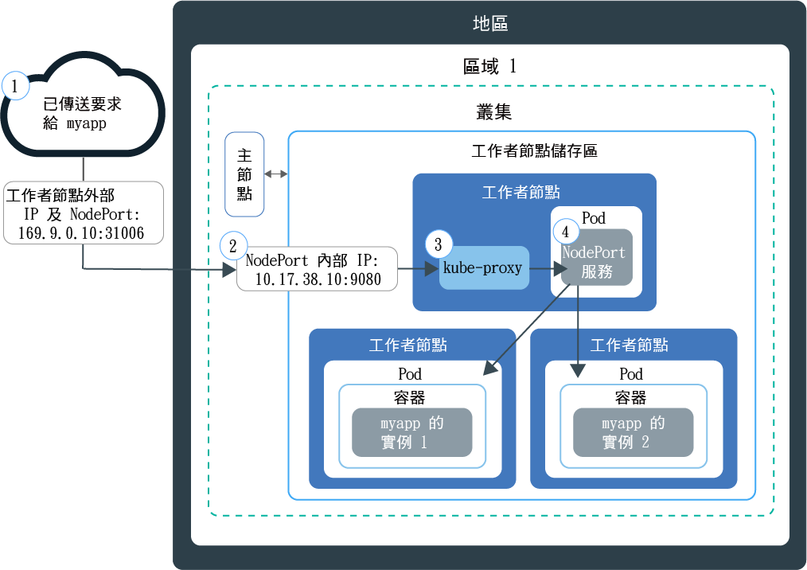

---

copyright:
  years: 2014, 2018
lastupdated: "2018-05-24"

---

{:new_window: target="_blank"}
{:shortdesc: .shortdesc}
{:screen: .screen}
{:pre: .pre}
{:table: .aria-labeledby="caption"}
{:codeblock: .codeblock}
{:tip: .tip}
{:download: .download}


# 使用 NodePort 公開應用程式
{: #nodeport}

使用 Kubernetes 叢集中任何工作者節點的公用 IP 位址，並公開 NodePort，將容器化應用程式設為可在網際網路上進行存取。使用此選項，在 {{site.data.keyword.containerlong}} 進行測試，以及進行短期公用存取。
{:shortdesc}

## 使用 NodePort 管理網路資料流量
{: #planning}

公開工作者節點上的公用埠，並使用工作者節點的公用 IP 位址，從網際網路中公開存取您在叢集中的服務。
{:shortdesc}

當您建立 Kubernetes NodePort 類型服務來公開應用程式時，會將 30000 到 32767 範圍內的 NodePort 及內部叢集 IP 位址指派給服務。NodePort 服務是作為應用程式送入要求的外部進入點。所指派的 NodePort 會公開於叢集中每一個工作者節點的 kubeproxy 設定。每個工作者節點都會開始接聽所指派的 NodePort，來取得服務的送入要求。若要從網際網路存取服務，您可以使用在建立叢集期間所指派的任何工作者節點的公用 IP 位址，以及 `<IP_address>:<nodeport>` 格式的 NodePort。除了公用 IP 位址之外，在工作者節點的專用 IP 位址上，也可以使用 NodePort 服務。

下圖顯示配置 NodePort 服務時，通訊如何從網際網路導向應用程式：



1. 使用工作者節點的公用 IP 位址以及工作者節點上的 NodePort，將要求傳送至應用程式。

2. 要求會自動轉遞至 NodePort 服務的內部叢集 IP 位址及埠。內部叢集 IP 位址只能在叢集內部存取。

3. `kube-proxy` 會將要求遞送至應用程式的 Kubernetes NodePort 服務。

4. 要求會轉遞至應用程式部署所在 Pod 的專用 IP 位址。如果叢集中已部署多個應用程式實例，則 NodePort 服務會在應用程式 Pod 之間遞送要求。

**附註：**工作者節點的公用 IP 位址不是永久性的。移除或重建工作者節點時，會將新的公用 IP 位址指派給工作者節點。NodePort 服務可以用於測試應用程式的公用存取，也可以用於僅短時間需要公用存取時。當您需要服務有穩定的公用 IP 位址及更高可用性時，請使用 [LoadBalancer 服務](cs_loadbalancer.html)或 [Ingress](cs_ingress.html) 來公開應用程式。

<br />


## 使用 NodePort 服務來啟用應用程式的公用存取
{: #config}

對於免費或標準叢集，您可以將應用程式公開為 Kubernetes NodePort 服務。
{:shortdesc}

如果您還沒有應用程式，您可以使用稱為 [Guestbook ](https://github.com/kubernetes/examples/blob/master/guestbook/all-in-one/guestbook-all-in-one.yaml) 的 Kubernetes 範例應用程式。

1.  在應用程式的配置檔中，定義 [service ](https://kubernetes.io/docs/concepts/services-networking/service/) 區段。**附註**：就 Guestbook 範例而言，配置檔中存在前端服務區段。若要讓 Guestbook 應用程式可在外部使用，請新增 NodePort 類型及範圍 30000 - 32767 內的 NodePort 至前端服務區段。

    範例：

    ```
    apiVersion: v1
    kind: Service
    metadata:
      name: <my-nodeport-service>
      labels:
        <my-label-key>: <my-label-value>
    spec:
      selector:
        <my-selector-key>: <my-selector-value>
      type: NodePort
      ports:
       - port: <8081>
         # nodePort: <31514>

    ```
    {: codeblock}

    <table>
    <caption>瞭解 NodePort 服務元件</caption>
    <thead>
    <th colspan=2> 瞭解 NodePort 服務區段元件</th>
    </thead>
    <tbody>
    <tr>
    <td><code>metadata.name</code></td>
    <td>將 <code><em>&lt;my-nodeport-service&gt;</em></code> 取代為 NodePort 服務的名稱。<p>當您使用 Kubernetes 資源時，進一步瞭解[保護您的個人資訊](cs_secure.html#pi)。</p></td>
    </tr>
    <tr>
    <td><code>metadata.labels</code></td>
    <td>將 <code><em>&lt;my-label-key&gt;</em></code> 及 <code><em>&lt;my-label-value&gt;</em></code> 取代為您要用於服務的標籤。</td>
    </tr>
    <tr>
      <td><code>spec.selector</code></td>
      <td>將 <code><em>&lt;my-selector-key&gt;</em></code> 及 <code><em>&lt;my-selector-value&gt;</em></code> 取代為您在部署 yaml 的 <code>spec.template.metadata.labels</code> 區段中所使用的鍵值組。</tr>
    <tr>
    <td><code>ports.port</code></td>
    <td>將 <code><em>&lt;8081&gt;</em></code> 取代為服務所接聽的埠。</td>
     </tr>
     <tr>
     <td><code>ports.nodePort</code></td>
     <td>選用項目：將 <code><em>&lt;31514&gt;</em></code> 取代為 30000 到 32767 範圍內的 NodePort。請不要指定另一個服務已在使用中的 NodePort。如果未指派 NodePort，則會自動指派一個隨機 NodePort。<br><br>若要指定 NodePort 並查看哪些 NodePort 已在使用中，請執行下列指令：<pre class="pre"><code>kubectl get svc</code></pre><p>使用中的任何 NodePort 會出現在**埠**欄位下。</p></td>
     </tr>
     </tbody></table>

2.  儲存已更新的配置檔。

3.  針對每個您要公開給網際網路使用的應用程式，重複這些步驟以建立 NodePort 服務。

**下一步為何：**

部署應用程式時，您可以使用任何工作者節點的公用 IP 位址以及 NodePort 來形成可在瀏覽器中存取應用程式的公用 URL。

1.  取得叢集中工作者節點的公用 IP 位址。

    ```
        bx cs workers <cluster_name>
    ```
    {: pre}

    輸出：

    ```
        ID                                                Public IP   Private IP    Size     State    Status
    prod-dal10-pa215dcf5bbc0844a990fa6b0fcdbff286-w1  192.0.2.23  10.100.10.10  u2c.2x4  normal   Ready
    prod-dal10-pa215dcf5bbc0844a990fa6b0fcdbff286-w2  192.0.2.27  10.100.10.15  u2c.2x4  normal   Ready
    ```
    {: screen}

2.  如果已指派隨機 NodePort，請找出已指派的 NodePort。

    ```
        kubectl describe service <service_name>
    ```
    {: pre}

    輸出：

    ```
        Name:                   <service_name>
    Namespace:              default
    Labels:                 run=<deployment_name>
    Selector:               run=<deployment_name>
    Type:                   NodePort
    IP:                     10.10.10.8
    Port:                   <unset> 8080/TCP
    NodePort:               <unset> 30872/TCP
    Endpoints:              172.30.171.87:8080
    Session Affinity:       None
    No events.
    ```
    {: screen}

    在此範例中，NodePort 是 `30872`。</br>
    **附註：**如果**端點**區段顯示 `<none>`，請檢查您在 NodePort 服務的 `spec.selector` 區段中使用的 `<selectorkey>` 及 `<selectorvalue>`。確定它與您在部署 yaml 的 `spec.template.metadata.labels` 區段中所使用的_鍵值組_ 相同。

3.  形成具有其中一個工作者節點公用 IP 位址及 NodePort 的 URL。範例：`http://192.0.2.23:30872`
