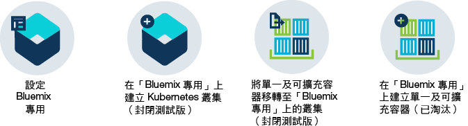

---

copyright:
  years: 2014, 2017
lastupdated: "2017-08-14"

---

{:new_window: target="_blank"}
{:shortdesc: .shortdesc}
{:screen: .screen}
{:pre: .pre}
{:table: .aria-labeledby="caption"}
{:codeblock: .codeblock}
{:tip: .tip} 
{:download: .download}

# 關於 {{site.data.keyword.containerlong_notm}}
{: #cs_ov}

{{site.data.keyword.containershort}} 會結合 Docker 與 Kubernetes 來提供功能強大的工具、直覺式使用者體驗和內建安全和隔離，以使用 Kubernetes API，透過獨立運算主機叢集來自動化進行容器化應用程式的部署、作業、擴充及監視。
{:shortdesc}

## Kubernetes 基本
{: #kubernetes_basics}

Kubernetes 是由 Google 開發作為 Borg 專案的一部分，並在 2014 年提交給開放程式碼社群。Kubernetes 結合 Google 15 年以上對於下列事項的研究：執行具有正式作業工作負載、開放程式碼貢獻及 Docker 容器管理工具的容器化基礎架構，以提供為可攜式、可延伸且可在失效接手時自我修復的隔離及安全應用程式平台。
{:shortdesc}

使用一些術語來瞭解 Kubernetes 運作方式的基本觀念。 

<dl>
<dt>叢集</dt>
<dd>Kubernetes 叢集包含一個以上稱為工作者節點的虛擬機器。每個工作者節點都代表您可以在其中部署、執行及管理容器化應用程式的運算主機。工作者節點是由 Kubernetes 主節點進行管理，Kubernetes 主節點會集中控制及監視叢集中的所有 Kubernetes 資源。當您部署容器化應用程式時，Kubernetes 主節點會考慮叢集中的部署需求及可用容量，來決定在何處部署應用程式。</dd>
<dt>Pod</dt>
<dd>Pod 會部署、執行及管理每個部署至 Kubernetes 叢集的容器化應用程式。Pod 代表 Kubernetes 叢集中的最小可部署單元，並且用來將必須視為單一單元的容器分組在一起。在大部分情況下，容器都會部署至其專屬 Pod。不過，應用程式可能會要求將一個容器及其他協助容器部署至某個 Pod，以便使用相同的專用 IP 位址來為那些容器定址。</dd>
<dt>部署</dt>
<dd>部署是您指定容器的 Kubernetes 資源，以及執行應用程式所需的其他 Kubernetes 資源（例如持續性儲存空間、服務或註釋）。部署是記載在 Kubernetes 部署 Script 中。當您執行部署時，Kubernetes 主節點會將指定的容器部署至 Pod，並且考慮叢集的工作者節點上可用的容量。依部署 Script 中所指定，建立及配置其他 Kubernetes 資源。  
您可以使用部署來定義應用程式的更新策略，包括您要在漸進式更新期間新增的 Pod 數目，以及在同一時間可能無法使用的 Pod 數目。當您執行漸進式更新時，部署會檢查修訂版是否正常運作，並且在偵測到失敗時停止推出。</dd>
<dt>服務</dt>
<dd>Kubernetes 服務會將一組 Pod 分組在一起，並為叢集中其他服務提供這些 Pod 的網路連線，而不公開每一個 Pod 的實際專用 IP 位址。您可以使用服務，將您的應用程式設為可在叢集內或公用網際網路中使用。  
若要進一步瞭解 Kubernetes 術語，請嘗試 <a href="https://kubernetes.io/docs/tutorials/kubernetes-basics/" target="_blank">Kubernetes 基本指導教學</a>。</dd>
</dl>

## 使用叢集的優點
{: #cs_ov_benefits}

每一個叢集都會部署於提供原生 Kubernetes 及 {{site.data.keyword.IBM_notm}} 所新增功能的共用或專用虛擬機器上。
{:shortdesc}

|優點|說明|
|-------|-----------|
|具有運算、網路及儲存空間基礎架構隔離的單一承租戶 Kubernetes 叢集|<ul><li>建立符合商業及開發環境需求的專屬自訂基礎架構。</li><li>使用 {{site.data.keyword.BluSoftlayer_full}} 所提供的資源，來佈建專用且受保護的 Kubernetes 主節點、工作者節點、虛擬網路及儲存空間。</li><li>儲存持續性資料、在 Kubernetes Pod 之間共用資料，以及在需要時使用整合及安全磁區服務來還原資料。</li><li>高度可用且由 {{site.data.keyword.IBM_notm}} 持續監視的完整受管理 Kubernetes 主節點。</li><li>所有原生 Kubernetes API 的完整支援的優點。</li></ul>|
|「漏洞警告器」的映像檔安全相符性|<ul><li>設定您自己的安全 Docker 專用映像檔登錄，而組織中的所有使用者都會在這裡儲存及共用映像檔。</li><li>自動掃描專用 {{site.data.keyword.Bluemix_notm}} 登錄中映像檔的優點。</li><li>檢閱映像檔中所使用的作業系統特有的建議，來修正潛在漏洞。</li></ul>|
|自動擴充應用程式|<ul><li>定義自訂原則，以根據 CPU 及記憶體耗用量來擴增及縮減應用程式。</li></ul>|
|叢集性能的持續監視|<ul><li>使用叢集儀表板，快速查看及管理叢集、工作者節點及容器部署的性能。</li><li>使用 {{site.data.keyword.monitoringlong}} 來尋找詳細的耗用度量值，並快速擴充叢集以符合工作負載。</li><li>使用 {{site.data.keyword.loganalysislong}} 來檢閱記載資訊，以查看詳細的叢集活動。</li></ul>|
|性能不佳之容器的自動回復|<ul><li>工作者節點上所部署容器的持續性能檢查。</li><li>在失敗時自動重建容器。</li></ul>|
|服務探索及服務管理|<ul><li>集中登錄應用程式服務，讓它們可供叢集中的其他應用程式使用，而不需要公開它們。</li><li>不需要持續追蹤變更中的 IP 位址或容器 ID 即可探索登錄的服務，並可獲得自動遞送至可用實例的優點。</li></ul>|
|安全地將服務公開給大眾使用|<ul><li>具有完整負載平衡器及 Ingress 支援的專用覆蓋網路，讓應用程式可公開使用，並平衡多個工作者節點之間的工作負載，而不需要追蹤叢集內不停變更的 IP 位址。</li><li>選擇公用 IP 位址、{{site.data.keyword.IBM_notm}} 所提供的路徑，或您自己的自訂網域，以從網際網路存取叢集中的服務。</li></ul>|
|{{site.data.keyword.Bluemix_notm}} 服務整合|<ul><li>透過整合 {{site.data.keyword.Bluemix_notm}} 服務（例如 Watson API、Blockchain、資料服務或 Internet of Things）來新增應用程式的額外功能，並協助叢集使用者簡化應用程式開發及容器管理程序。</li></ul>|
{: caption="表 1. 搭配使用叢集與 {{site.data.keyword.containerlong_notm}} 的優點" caption-side="top"}

## 雲端環境
{: #cs_ov_environments}

您可以選擇在其上部署叢集及容器的 {{site.data.keyword.Bluemix_notm}} 雲端環境。
{:shortdesc}

###{{site.data.keyword.Bluemix_notm}} 公用
{: #public_environment}

將叢集部署至公用雲端環境 ([https://console.bluemix.net ](https://console.bluemix.net))，並連接至 {{site.data.keyword.Bluemix_notm}} 型錄中的任何服務。

在「{{site.data.keyword.Bluemix_notm}} 公用」中使用叢集，即可選擇叢集中工作者節點的硬體隔離層次。請使用專用硬體讓可用的實體資源只供您的叢集專用，或者若要容許與其他 {{site.data.keyword.IBM_notm}} 客戶的叢集共用實體資源，請使用共用硬體。如果想要您的叢集具有隔離功能，但所使用的其他 {{site.data.keyword.Bluemix_notm}} 服務不需要這類隔離功能，則可以選擇「{{site.data.keyword.Bluemix_notm}} 公用」環境中的專用叢集。

請按下列其中一個選項以開始使用：

    <map name="public_options" id="public_options">
    <area href="container_index.html#clusters" alt="在 Bluemix 中開始使用 Kubernetes 叢集" title="在 Bluemix 中開始使用 Kubernetes 叢集" shape="rect" coords="-5, -6, 123, 154" />
    <area href="cs_classic.html#cs_classic" alt="在 IBM Bluemix Container Service 中執行單一及可擴充容器" title="在 IBM Bluemix Container Service 中執行單一及可擴充容器" shape="rect" coords="181, -5, 320, 161" />
</map>

### {{site.data.keyword.Bluemix_notm}} 專用
{: #dedicated_environment}

在專用雲端環境中部署叢集（封閉測試版）或單一及可擴充容器 (`https://<my-dedicated-cloud-instance>.bluemix.net`)，並與也在該處執行的預先選取 {{site.data.keyword.Bluemix_notm}} 服務連接。

使用「{{site.data.keyword.Bluemix_notm}} 專用」的叢集相當於使用「{{site.data.keyword.Bluemix_notm}} 公用」中專用硬體所建立的叢集。可用的實體資源只供您的叢集專用，無法與其他 {{site.data.keyword.IBM_notm}} 客戶的叢集共用。針對「公用」及「專用」，都會使用公用 API 端點來建立叢集。不過，使用「{{site.data.keyword.Bluemix_notm}} 專用」的最明顯差異如下。

*   {{site.data.keyword.IBM_notm}} 擁有並管理在其中部署工作者節點、VLAN 及子網路的 {{site.data.keyword.BluSoftlayer_notm}} 帳戶，而不是您擁有的帳戶。
*   這些 VLAN 及子網路的規格是在建立「專用」環境時決定，而不是建立叢集時。

如果想要您的叢集具有隔離功能，而且所使用的其他 {{site.data.keyword.Bluemix_notm}} 服務也需要這類隔離功能，則可以選擇設定「{{site.data.keyword.Bluemix_notm}} 專用」環境。

請按下列其中一個選項以開始使用：

    <map name="dedicated_options" id="dedicated_options">
    <area href="#setup_dedicated" alt="在 Bluemix 專用上設定 IBM Bluemix Container Service（封閉測試版）" title="在 Bluemix 專用上設定 IBM Bluemix Container Service（封閉測試版）" shape="rect" coords="-5, -15, 100, 153" />
    <area href="container_index.html#dedicated" alt="在 Bluemix 專用中開始使用 Kubernetes 叢集（封閉測試版）" title="在 Bluemix 專用中開始使用 Kubernetes 叢集（封閉測試版）" shape="rect" coords="153, -10, 276, 182" />
    <area href="cs_classic.html#cs_classic" alt="在 IBM Bluemix Container Service 中執行單一及可擴充容器" title="在 IBM Bluemix Container Service 中執行單一及可擴充容器" shape="rect" coords="317, -11, 436, 188" />
<area href="container_ha.html#container_group_ui" alt="從 Bluemix GUI 將長期服務當作容器群組來執行" title="從 Bluemix GUI 將長期服務當作容器群組來執行" shape="rect" coords="485, -1, 600, 173" />
    </map>

### 雲端環境之間的叢集管理差異
{: #env_differences}

|範疇|{{site.data.keyword.Bluemix_notm}} 公用|{{site.data.keyword.Bluemix_notm}} 專用（封閉測試版）|
|--|--------------|--------------------------------|
|叢集建立|建立精簡叢集，或針對標準叢集指定下列詳細資料：<ul><li>叢集類型</li><li>名稱</li><li>Kubernetes 版本</li><li>位置</li><li>機型</li><li>工作者節點數目</li><li>公用 VLAN</li><li>專用 VLAN</li><li>硬體</li></ul>|針對標準叢集指定下列詳細資料：<ul><li>名稱</li><li>Kubernetes 版本</li><li>機型</li><li>工作者節點數目</li></ul>
**附註：**VLAN 及「硬體」設定是在建立 {{site.data.keyword.Bluemix_notm}} 環境期間所預先定義。
|
|叢集硬體及所有權|在標準叢集中，硬體可以與其他 {{site.data.keyword.IBM_notm}} 客戶共用，或者只供您專用。在您的 {{site.data.keyword.BluSoftlayer_notm}} 帳戶中，是由您擁有及管理公用及專用 VLAN。|在「{{site.data.keyword.Bluemix_notm}} 專用」的叢集中，硬體一律是專用的。IBM 會為您擁有及管理公用及專用 VLAN。位置是針對 {{site.data.keyword.Bluemix_notm}} 環境所預先定義。|
|服務與叢集的連結|使用 [bx cs cluster-service-bind](cs_cluster.html#cs_cluster_service) 指令，將 Kubernetes 密碼連結至叢集。|建立服務認證的 [JSON 金鑰檔](cs_cluster.html#binding_dedicated)，然後從該檔案建立 Kubernetes 密碼以連結至叢集。|
|負載平衡器及 Ingress 網路|在佈建標準叢集期間，會自動執行下列動作。<ul><li>公用可攜式子網路會連結至叢集，並指派給您的 {{site.data.keyword.BluSoftlayer_notm}} 帳戶。</li><li>一個可攜式公用 IP 位址用於高可用性 Ingress 控制器，並以 &lt;cluster_name&gt;.containers.mybluemix.net 格式指派唯一公用路徑。您可以使用此路徑將多個應用程式公開給大眾使用。</li><li>會將四個可攜式公用 IP 位址指派給叢集，此叢集可用來透過負載平衡器服務將應用程式公開給大眾使用。您可以透過 {{site.data.keyword.BluSoftlayer_notm}} 帳戶要求其他子網路。</li></ul>|當您建立「專用」帳戶時，請做出下列決策：<ul><li>您想要的子網路數目</li><li>您想要的子網路類型（負載平衡器或 Ingress）。{{site.data.keyword.IBM_notm}} 會為您建立子網路並執行網路管理作業。根據您的選擇，可能會建立 Ingress 控制器，且可能會指派公用路徑。請[開立支援問題單](/docs/support/index.html#contacting-support)建立子網路，然後使用 [`bx cs cluster-subnet-add`](cs_cli_reference.html#cs_cluster_subnet_add) 指令將子網路新增至叢集，以要求其他子網路。|
|NodePort 網路|公開工作者節點上的公用埠，並使用工作者節點的公用 IP 位址來公開存取您在叢集中的服務。|工作者節點的所有公用 IP 位址都會遭到防火牆封鎖。不過，針對新增至叢集的 {{site.data.keyword.Bluemix_notm}} 服務，可以透過公用 IP 位址或專用 IP 位址存取節點埠。|
|持續性儲存空間|使用磁區的[動態佈建](cs_apps.html#cs_apps_volume_claim)或[靜態佈建](cs_cluster.html#cs_cluster_volume_create)。|使用磁區的[動態佈建](cs_apps.html)。</li></ul>|
|{{site.data.keyword.registryshort_notm}} 中的映像檔登錄 URL|<ul><li>美國南部：<code>registry.ng bluemix.net</code></li><li>英國南部：<code>registry.eu-gb.bluemix.net</code></li><li>歐盟中部（法蘭克福）：<code>registry.eu-de.bluemix.net</code></li><li>澳洲（雪梨）：<code>registry.au-syd.bluemix.net</code></li></ul>||<ul><li>若為新的名稱空間，請使用針對「{{site.data.keyword.Bluemix_notm}} 公用」定義的相同地區型登錄。</li><li>若為已針對「{{site.data.keyword.Bluemix_notm}} 專用」中單一及可擴充容器所設定的名稱空間，請使用 <code>registry.&lt;dedicated_domain&gt;</code></li></ul>|
|存取登錄|請參閱[搭配使用專用及公用映像檔登錄與 {{site.data.keyword.containershort_notm}}](cs_cluster.html#cs_apps_images) 中的選項。|<ul><li>若為新的名稱空間，請參閱[搭配使用專用及公用映像檔登錄與 {{site.data.keyword.containershort_notm}}](cs_cluster.html#cs_apps_images) 中的選項。</li><li>若為已針對單一及可擴充群組所設定的名稱空間，請[使用記號及建立 Kubernetes 密碼](cs_dedicated_tokens.html#cs_dedicated_tokens)來進行鑑別。</li></ul>|
{: caption="表 2. {{site.data.keyword.Bluemix_notm}} 公用與 {{site.data.keyword.Bluemix_notm}} 專用的特性差異" caption-side="top"}

### 在 {{site.data.keyword.Bluemix_notm}} 專用上設定 {{site.data.keyword.containershort_notm}}（封閉測試版）
{: #setup_dedicated}

管理者必須將 IBM 管理者 ID 及您組織的使用者新增至「專用」環境。

開始之前，請[設定 {{site.data.keyword.Bluemix_notm}} 專用環境](/docs/dedicated/index.html#setupdedicated)。

若要設定「專用」環境以使用叢集，請執行下列動作：

1.  將提供的 IBM 管理者 ID 新增至環境。
    1.  選取「{{site.data.keyword.Bluemix_notm}} 專用」帳戶。
    2.  從功能表列中，按一下**管理>安全>身分及存取**。「使用者」視窗會顯示一份使用者清單，其中包含其電子郵件位址以及所選取帳戶的狀態。
    3.  按一下**邀請使用者**。
    4.  在**電子郵件位址或現有 IBM ID** 中，輸入下列電子郵件位址：`cfsdl@us.ibm.com`。
    5.  在**存取**區段中，展開**已啟用身分及存取的服務**。
    6.  從**服務**下拉清單中，選取 **{{site.data.keyword.containershort_notm}}**。
    7.  從**角色**下拉清單中，選取**管理者**。
    8.  按一下**邀請使用者**。
2.  [建立 {{site.data.keyword.Bluemix_notm}} 帳戶之一般使用者的 IBM ID 。](https://www.ibm.com/account/us-en/signup/register.html)
3.  [將前一個步驟中的使用者新增至 {{site.data.keyword.Bluemix_notm}} 帳戶。](cs_cluster.html#add_users)
4.  透過「專用」主控台存取「{{site.data.keyword.Bluemix_notm}} 專用」帳戶，並開始建立叢集。

    1.  使用 IBM ID，登入「{{site.data.keyword.Bluemix_notm}} 公用」主控台 ([https://console.bluemix.net ](https://console.bluemix.net))。
    2.  從帳戶功能表中，選取「{{site.data.keyword.Bluemix_notm}} 專用」帳戶。即會使用「{{site.data.keyword.Bluemix_notm}} 專用」實例的服務及資訊來更新主控台。
    3.  從「{{site.data.keyword.Bluemix_notm}} 專用」實例的型錄中，選取**容器**，然後按一下 **Kubernetes 叢集**。

接下來，如需建立叢集的相關資訊，請參閱[在 {{site.data.keyword.Bluemix_notm}} 專用中從 GUI 建立 Kubernetes 叢集（封閉測試版）](cs_cluster.html#creating_ui_dedicated)。

## Kubernetes 叢集運作方式 
{: #cs_ov_architecture}

Kubernetes 叢集包含一個以上的實體或虛擬機器（也稱為工作者節點），這些實體或虛擬機器為鬆散耦合、可延伸，並且由 Kubernetes 主節點集中進行監視及管理。對於每一個客戶帳戶，Kubernetes 主節點是由 IBM 所管理，並且具有高復原力及高可用性。
{:shortdesc}

每一個工作者節點都已設定 {{site.data.keyword.IBM_notm}} 所管理的 Docker Engine、不同的運算資源、網路及磁區服務，以及提供隔離、資源管理功能及工作者節點安全相符性的內建安全特性。工作者節點會使用安全 TLS 憑證及 openVPN 連線來與主節點進行通訊。

*圖 1. IBM Bluemix Container Service 中的 Kubernetes 架構及網路*

## Docker 容器
{: #cs_ov_docker}

Docker 是 dotCloud 在 2013 年發行的開放程式碼專案。Docker 建立在現有 Linux 容器技術 (LXC) 特性之上，已成為您可以用來快速建置、測試、部署及擴充應用程式的軟體平台。Docker 會將軟體包裝為稱為容器的標準化單元，其中包括應用程式執行所需的所有元素。
{:shortdesc}

請檢閱這些概念來瞭解基本 Docker 概念。

<dl>
<dt>容器</dt>
<dd>容器是用來包裝應用程式及其所有相依關係的標準方式，它讓應用程式能夠在環境之間移動，並且不需變更即可執行。容器與虛擬機器不同，容器不會將裝置、其作業系統及基礎硬體虛擬化。只有應用程式碼、運行環境、系統工具、程式庫及設定會包裝在容器中。容器會以隔離處理程序形式在部署它們的運算主機上執行，並共用主機作業系統及其硬體資源。此方式讓容器比虛擬機器更輕量、可攜性更高且更有效率。</dd>
<dt>映像檔</dt>
<dd>每個容器都是根據 Docker 映像檔，並且視為映像檔的實例。映像檔是從 Dockerfile 所建置的，該 Dockerfile 檔案包含映像檔建置指示及任何建置構件（例如應用程式、應用程式的配置及其相依關係）。</dd>
<dt>登錄</dt>
<dd>映像檔登錄是您儲存、擷取及共用 Docker 映像檔的位置。登錄中所儲存的映像檔可公開使用（公用登錄）或只能供一小組使用者存取（專用登錄）。{{site.data.keyword.containershort_notm}} 提供公用映像檔（例如 ibmliberty），可用來開始使用 Docker 及 Kubernetes，以在叢集中建立您的第一個容器化應用程式。如果是企業應用程式，請使用專用登錄（例如 {{site.data.keyword.Bluemix_notm}} 中提供的專用登錄）來防止未獲授權使用者使用及變更映像檔。

  
當您要從映像檔部署容器時，必須確定映像檔儲存在公用或專用映像檔登錄中。</dd>
</dl>

### 使用容器的重要優點
{: #container_benefits}

<dl>
<dt>容器靈活多變</dt>
<dd>容器可透過為開發及正式作業小組提供標準化環境來簡化系統管理。引擎的輕量型運行環境能達到快速擴增及縮減，以回應需求變更。它們有助於消除管理不同作業系統平台及基礎架構時的複雜性。容器可協助您在任何基礎架構上快速且可靠地部署及執行任何應用程式。</dd>
<dt>容器很小</dt>
<dd>您可在單一虛擬機器所需的空間量中容納更多的容器。</dd>
<dt>容器具有可攜性</dt>
<dd>使用另一個映像檔作為基礎，建置另一個容器的映像檔。讓其他人對映像檔執行大量工作，並調整映像檔以供您使用。您也可以將應用程式碼從暫置環境快速移轉至正式作業環境。您可以使用如 Delivery Pipeline 或 UrbanCode Deploy 這類的工具，來自動執行移轉處理程序。</dd>
</dl>

## 容器濫用
{: #cs_terms}

客戶不得誤用 {{site.data.keyword.containershort_notm}}。
{:shortdesc}

誤用包括：

*   任何不合法的活動
*   散佈或執行惡意軟體
*   危害 {{site.data.keyword.containershort_notm}} 或干擾任何人使用 {{site.data.keyword.containershort_notm}}
*   危害或干擾任何人使用任何其他服務或系統
*   任何服務或系統的未獲授權存取
*   任何服務或系統的未獲授權修改
*   違反其他人權利

如需整體使用條款，請參閱[雲端服務條款](/docs/navigation/notices.html#terms)。
