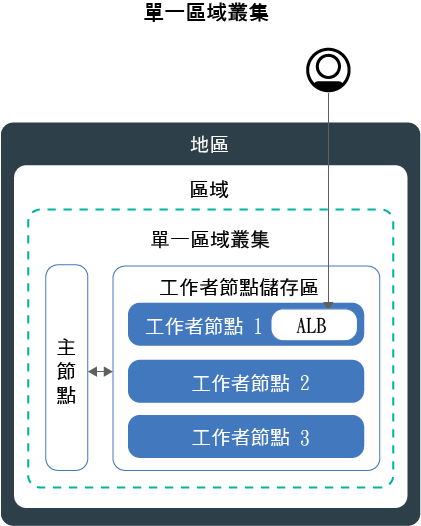
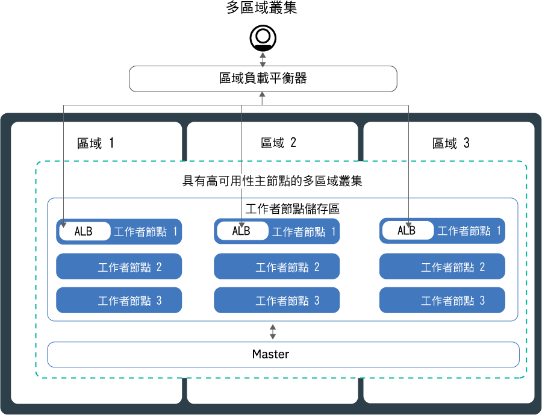
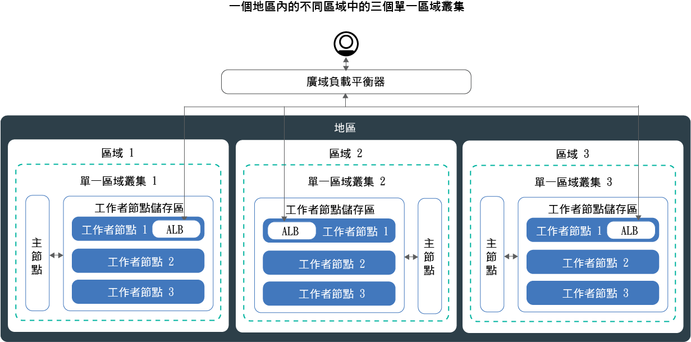

---

copyright:
  years: 2014, 2019
lastupdated: "2019-06-11"

keywords: kubernetes, iks, multi az, multi-az, szr, mzr

subcollection: containers

---

{:new_window: target="_blank"}
{:shortdesc: .shortdesc}
{:screen: .screen}
{:pre: .pre}
{:table: .aria-labeledby="caption"}
{:codeblock: .codeblock}
{:tip: .tip}
{:note: .note}
{:important: .important}
{:deprecated: .deprecated}
{:download: .download}
{:preview: .preview}


# 規劃叢集以實現高可用性
{: #ha_clusters}

使用 {{site.data.keyword.containerlong}} 設計標準叢集的應用程式最大可用性及容量。
{: shortdesc}

若將應用程式分佈到多個工作者節點、區域及叢集，使用者遇到應用程式關閉的可能性就越低。內建功能（例如負載平衡及隔離）可提高對於潛在主機、網路或應用程式失敗的備援。
檢閱這些潛在的叢集設定，它們依遞增的可用性程度進行排序。


1. [單一區域叢集](#single_zone)，其在工作者節點儲存區中有多個工作者節點。
2. [多區域叢集](#multizone)，可將工作者節點分散到某個地區內的各區域。
3. **連接至公用和僅專用 VLAN 的叢集**：跨區域或地區設定並透過廣域負載平衡器連接的[多個叢集](#multiple_clusters)。

## 單一區域叢集
{: #single_zone}

若要改善應用程式的可用性，以及容許無法在叢集裡使用某個工作者節點時失效接手，請將其他工作者節點新增至單一區域叢集。
{: shortdesc}



依預設，單一區域叢集已設定名稱為 `default` 的工作者節點儲存區。工作者節點儲存區會將具有您在建立叢集期間所定義之相同配置（例如機型）的工作者節點分組在一起。您可以藉由[調整現有工作者節點儲存區大小](/docs/containers?topic=containers-add_workers#resize_pool)或[新增工作者節點儲存區](/docs/containers?topic=containers-add_workers#add_pool)，來將更多工作者節點新增至叢集裡。

當您新增更多工作者節點時，應用程式實例可以分佈到多個工作者節點。如果某個工作者節點關閉，則可用工作者節點上的應用程式實例會繼續執行。Kubernetes 會自動從無法使用的工作者節點重新排定 Pod，以確保應用程式的效能及容量。若要確定 Pod 平均分佈到工作者節點，請實作 [Pod 親緣性](https://kubernetes.io/docs/concepts/configuration/assign-pod-node/#inter-pod-affinity-and-anti-affinity-beta-feature)。

**可以將單一區域叢集轉換成多區域叢集嗎？**</br>
如果叢集是在其中一個[受支援的多區域都會位置](/docs/containers?topic=containers-regions-and-zones#zones)，請輸入 yes。請參閱[從獨立式工作者節點更新至工作者儲存區](/docs/containers?topic=containers-update#standalone_to_workerpool)。


**必須使用多區域叢集嗎？**</br>
不是。您可以根據需要建立任意數量的單一區域叢集。實際上，您可能偏好使用單一區域叢集來簡化管理，或者，如果您的叢集必須位於特定[單一區域城市](/docs/containers?topic=containers-regions-and-zones#zones)中。

**我是否可以在單一區域中具有高可用性主節點？**</br>
是。在單一區域中，您的主節點具有高可用性，且會在個別實體主機上包含 Kubernetes API 伺服器、etcd、排程器及控制器管理程式的抄本，來防範在主節點更新這類期間發生運作中斷。若要防範區域失敗，您可以：
* [在具有多區域功能的區域中建立叢集](#multizone)，其中主節點會分散在各區域之中。
* [建立連接至公用和專用 VLAN 的多個叢集](#multiple_clusters)並使用廣域負載平衡器連接這些叢集。

## 多區域叢集
{: #multizone}

使用 {{site.data.keyword.containerlong_notm}}，您可以建立多區域叢集。若使用工作者節點儲存區將應用程式分佈到多個工作者節點及區域，使用者遇到應用程式關閉的可能性就會越低。透過內建功能（如負載平衡），可在主機、網路或應用程式發生潛在區域故障時更快恢復。如果某個區域中的資源降低，則叢集工作負載仍然可以在其他區域中運作。
{: shortdesc}

**何謂工作者節點儲存區？**</br>
工作者節點儲存區是具有相同特性（例如機型、CPU 及記憶體）的工作者節點的集合。建立叢集時，會自動為您建立預設工作者節點儲存區。若要跨區域展開儲存區中的工作者節點，請將工作者節點新增至儲存區，或更新工作者節點，您可以使用新的 `ibmcloud ks worker-pool` 指令。

**我仍然可以使用獨立式工作者節點嗎？**</br>
支援獨立式工作者節點的前一個叢集設定，但已遭淘汰。請務必[將工作者節點儲存區新增至叢集](/docs/containers?topic=containers-planning_worker_nodes#add_pool)，然後[使用工作者節點儲存區](/docs/containers?topic=containers-update#standalone_to_workerpool)來組織工作者節點，而非獨立式工作者節點。

**可以將單一區域叢集轉換成多區域叢集嗎？**</br>
如果叢集是在其中一個[受支援的多區域都會位置](/docs/containers?topic=containers-regions-and-zones#zones)，請輸入 yes。請參閱[從獨立式工作者節點更新至工作者儲存區](/docs/containers?topic=containers-update#standalone_to_workerpool)。


### 告訴我多區域叢集設定的相關資訊
{: #mz_setup}



您可以將其他區域新增至叢集，以將工作者節點儲存區中的工作者節點抄寫到某個地區內的多個區域。多區域叢集的設計為將 Pod 平均排定到各工作者節點及區域，以確保可用性及失敗回復。如果工作者節點未平均分散到各區域，或其中一個區域的容量不足，則 Kubernetes 排程器可能無法排定所有要求的 Pod。因此，Pod 可能會進入**擱置**狀態，直到有足夠的可用容量為止。如果您要變更預設行為，讓 Kubernetes 排程器以最佳效能分佈將 Pod 分佈到各區域，請使用 `preferredDuringSchedulingIgnoredDuringExecution` [Pod 親緣性原則](https://kubernetes.io/docs/concepts/configuration/assign-pod-node/#inter-pod-affinity-and-anti-affinity-beta-feature)。

**為什麼需要工作者節點位於 3 個區域中？**</br>在 3 個區域中分佈工作負載可確保應用程式的高可用性，以防一個或兩個區域無法使用的情況，同時這也使叢集設定更符合成本效益。但為什麼是這樣？請參考以下範例。

假設您需要具有 6 個核心數的工作者節點來處理應用程式的工作負載。為了讓您的叢集更為可用，您具有下列選項：

- **在另一個區域中複製資源：**使用此選項時，會有 2 個工作者節點，每個節點在每個區域中有 6 個核心數，總計 12 個核心數。</br>
- **在 3 個區域中分佈資源：**使用此選項時，每個區域會部署 3 個核心數，總容量為 9 個核心數。若要處理工作負載，必須同時啟動兩個區域。如果有一個區域無法使用，則其他兩個區域都可以處理工作負載。如果兩個區域無法使用，則剩餘 3 個核心數可供處理工作負載。每個區域部署 3 個核心數意味著機器更小，進而降低了成本。</br>

**我的 Kubernetes 主節點的設定如何？** </br> 當您在[多區域都會位置](/docs/containers?topic=containers-regions-and-zones#zones)中建立叢集時，會自動部署高可用性的 Kubernetes 主節點，且三個抄本會分散在都會的各個區域中。例如，如果叢集是在 `dal10`、`dal12` 或 `dal13` 區域中，則 Kubernetes 主節點的抄本會分散在 Dallas 多區域都會的每一個區域中。

**如果 Kubernetes 主節點變成無法使用，會發生什麼情況？** </br>[Kubernetes 主節點](/docs/containers?topic=containers-ibm-cloud-kubernetes-service-technology#architecture)是保持叢集運作的主要元件。主節點將叢集資源及其配置儲存在 etcd 資料庫中，作為叢集的單點真實資料 (SPOT)。Kubernetes API 伺服器是從工作者節點到主節點之所有叢集管理要求的主要進入點，或您要與叢集資源互動時。<br><br>如果發生主節點失敗，則工作負載會繼續在工作者節點上執行，但無法使用 `kubectl` 指令來使用叢集資源，或檢視叢集性能，直到備份主節點中的 Kubernetes API 伺服器為止。如果 Pod 在主節點中斷期間關閉，則除非工作者節點再次到達 Kubernetes API 伺服器，否則無法重新排定 Pod。<br><br>在主節點中斷期間，您仍然可以針對 {{site.data.keyword.containerlong_notm}} API 執行 `ibmcloud ks` 指令，以使用您的基礎架構資源（例如工作者節點或 VLAN）。如果您透過在叢集裡新增或移除工作者節點來變更現行叢集配置，則除非備份主節點，否則您的變更不會發生。

在主節點中斷期間，請不要將工作者節點重新啟動或重新開機。此動作會從您的工作者節點移除 Pod。因為 Kubernetes API 伺服器無法使用，所以無法將 Pod 重新排程至叢集裡的其他工作者節點。
{: important}


若要保護叢集不受 Kubernetes 主節點故障的影響或在多區域叢集無法使用的地區中保護叢集，可以[設定連接至公用和專用 VLAN 的多個叢集並透過廣域負載平衡器連接](#multiple_clusters)。

**我是否必須執行什麼動作才能讓主節點跨區域與工作者節點通訊？**</br>
是。如果您的叢集具有多個 VLAN、同一個 VLAN 上有多個子網路，或者是您具有多區域叢集，則必須為您的 IBM Cloud 基礎架構 (SoftLayer) 帳戶啟用[虛擬路由器功能 (VRF)](/docs/infrastructure/direct-link?topic=direct-link-overview-of-virtual-routing-and-forwarding-vrf-on-ibm-cloud#overview-of-virtual-routing-and-forwarding-vrf-on-ibm-cloud)，讓工作者節點可以在專用網路上彼此通訊。若要啟用 VRF，[請與 IBM Cloud 基礎架構 (SoftLayer) 客戶代表聯絡](/docs/infrastructure/direct-link?topic=direct-link-overview-of-virtual-routing-and-forwarding-vrf-on-ibm-cloud#how-you-can-initiate-the-conversion)。如果您無法或不想要啟用 VRF，請啟用 [VLAN Spanning](/docs/infrastructure/vlans?topic=vlans-vlan-spanning#vlan-spanning)。若要執行此動作，您需要**網路 > 管理網路 VLAN Spanning** [基礎架構許可權](/docs/containers?topic=containers-users#infra_access)，或者您可以要求帳戶擁有者啟用它。若要確認是否已啟用 VLAN Spanning，請使用 `ibmcloud ks vlan-spanning-get --region <region>` [指令](/docs/containers?topic=containers-cli-plugin-kubernetes-service-cli#cs_vlan_spanning_get)。

**如何讓我的使用者從公用網際網路存取我的應用程式？**</br>
您可以使用 Ingress 應用程式負載平衡器 (ALB) 或負載平衡器服務來公開應用程式。

- **Ingress 應用程式負載平衡器 (ALB)** 依預設，會在叢集的每一個區域中自動建立及啟用公用 ALB。也會自動建立及部署叢集的 Cloudflare 多區域負載平衡器 (MZLB)，使每個地區有 1 個 MZLB。MZLB 會在相同主機名稱後面放置 ALB 的 IP 位址，並對這些 IP 位址啟用性能檢查，以判斷是否可以使用它們。例如，如果您的工作者節點是在美國東部地區的 3 個區域中，則主機名稱 `yourcluster.us-east.containers.appdomain.cloud` 有 3 個 ALB IP 位址。MZLB 性能檢查會檢查地區中每一個區域的公用 ALB IP，並根據這些性能檢查來更新 DNS 查閱結果。如需相關資訊，請參閱 [Ingress 元件和架構](/docs/containers?topic=containers-ingress#planning)。

- **負載平衡器服務：**負載平衡器服務只會設定在某個區域中。您應用程式的送入要求會從該區域遞送至其他區域中的所有應用程式實例。如果此區域變成無法使用，則可能無法從網際網路存取您的應用程式。您可以在其他區域中設定其他負載平衡器服務來負責單一區域故障。如需相關資訊，請參閱高可用性[負載平衡器服務](/docs/containers?topic=containers-loadbalancer#multi_zone_config)。

**我可以為多區域叢集設定持續性儲存空間嗎？**</br>
對於高可用性持續性儲存空間，請使用雲端服務（例如 [{{site.data.keyword.cloudant_short_notm}}](/docs/services/Cloudant?topic=cloudant-getting-started#getting-started) 或 [{{site.data.keyword.cos_full_notm}}](/docs/services/cloud-object-storage?topic=cloud-object-storage-about)）。您也可以嘗試軟體定義儲存空間 (SDS) 解決方案，例如 [Portworx](/docs/containers?topic=containers-portworx#portworx)，它使用 [SDS 機器](/docs/containers?topic=containers-planning_worker_nodes#sds)。如需相關資訊，請參閱[多區域叢集的持續性儲存空間選項比較](/docs/containers?topic=containers-storage_planning#persistent_storage_overview)。

NFS 檔案儲存空間和區塊儲存空間不可跨區域共享。持續性磁區只能在實際儲存裝置所在的區域中使用。如果您要繼續使用叢集裡的現有 NFS 檔案或區塊儲存空間，則必須將地區及區域標籤套用至現有的持續性磁區。這些標籤可協助 kube-scheduler 判斷在何處排定使用持續性磁區的應用程式。執行下列指令，並將 `<mycluster>` 取代為您的叢集名稱。

```
bash <(curl -Ls https://raw.githubusercontent.com/IBM-Cloud/kube-samples/master/file-pv-labels/apply_pv_labels.sh) <mycluster>
```
{: pre}

**我已建立多區域叢集。為什麼還是只有一個區域？如何將區域新增至我的叢集？**</br>
如果您[使用 CLI 建立多區域叢集](/docs/containers?topic=containers-clusters#clusters_ui)，會建立叢集，但必須將區域新增至工作者節點儲存區，才能完成該處理程序。若要跨越多個區域，您的叢集必須位在[多區域都會位置](/docs/containers?topic=containers-regions-and-zones#zones)中。若要將區域新增至叢集，並將工作者節點分散到各區域，請參閱[將區域新增至叢集](/docs/containers?topic=containers-add_workers#add_zone)。

### 我目前管理叢集的方式有哪些改變？
{: #mz_new_ways}

透過引進工作者節點儲存區，您可以使用一組新的 API 及指令來管理叢集。您可以在 [CLI 文件頁面](/docs/containers?topic=containers-cli-plugin-kubernetes-service-cli)中看到這些新指令，也可以透過執行 `ibmcloud ks help` 在終端中檢視這些新指令。
{: shortdesc}

下表比較若干一般叢集管理動作的新舊方法。
<table summary="此表格顯示執行多區域指令之新方法的說明。列應該從左到右閱讀，第一欄為說明、第二欄為舊的方法，而第三欄為新的多區域方法。">
<caption>多區域工作者節點儲存區指令的新方法。</caption>
  <thead>
  <th>說明</th>
  <th>舊的獨立式工作者節點</th>
  <th>新的多區域工作者節點儲存區</th>
  </thead>
  <tbody>
    <tr>
    <td>將工作者節點新增至叢集。</td>
    <td><p class="deprecated"><code>ibmcloud ks worker-add</code>，用來新增獨立式工作者節點。</p></td>
    <td><ul><li>若要新增與現有儲存區不同的機型，請建立新的工作者節點儲存區：<code>ibmcloud ks worker-pool-create</code> [指令](/docs/containers?topic=containers-cli-plugin-kubernetes-service-cli#cs_worker_pool_create)。</li>
    <li>若要將工作者節點新增至現有儲存區，請調整儲存區中每個區域的節點數：<code>ibmcloud ks worker-pool-resize</code> [指令](/docs/containers?topic=containers-cli-plugin-kubernetes-service-cli#cs_worker_pool_resize)。</li></ul></td>
    </tr>
    <tr>
    <td>從叢集移除工作者節點。</td>
    <td><code>ibmcloud ks worker-rm</code>，仍可用來刪除叢集裡麻煩的工作者節點。</td>
    <td><ul><li>如果工作者節點儲存區不均衡（例如，移除工作者節點後），請對其進行重新均衡：<code>ibmcloud ks worker-pool-rebalance</code> [指令](/docs/containers?topic=containers-cli-plugin-kubernetes-service-cli#cs_rebalance)。</li>
    <li>若要減少儲存區中的工作者節點數，請調整每個區域的工作者節點數（最小值為 `1`）：<code>ibmcloud ks worker-pool-resize</code> [指令](/docs/containers?topic=containers-cli-plugin-kubernetes-service-cli#cs_worker_pool_resize)。</li></ul></td>
    </tr>
    <tr>
    <td>針對工作者節點，使用新的 VLAN。</td>
    <td><p class="deprecated">新增可使用新專用或公用 VLAN 的新工作者節點：<code>ibmcloud ks worker-add</code>。</p></td>
    <td>將工作者節點儲存區設定成使用與先前所使用不同的公用或專用 VLAN：<code>ibmcloud ks zone-network-set</code> [指令](/docs/containers?topic=containers-cli-plugin-kubernetes-service-cli#cs_zone_network_set)。</td>
    </tr>
  </tbody>
  </table>

## 透過廣域負載平衡器連接的多個公用叢集
{: #multiple_clusters}

若要保護應用程式不發生 Kubernetes 主節點失敗，以及在多區域叢集無法使用的地區中保護叢集，您可以在某個地區的不同區域中建立多個叢集，並使用廣域負載平衡器進行連接。
{: shortdesc}

若要使用廣域負載平衡器連接多個叢集，叢集必須連接至公用和專用 VLAN。
{: note}



若要跨多個叢集均衡工作負載，必須設定廣域負載平衡器，並將應用程式負載平衡器 (ALB) 或 LoadBalancer 服務的公用 IP 位址新增到網域。新增這些 IP 位址，即可在叢集之間遞送送入資料流量。若要讓廣域負載平衡器偵測是否有一個叢集無法使用，請考慮將以 Ping 為基礎的性能檢查新增至每個 IP 位址。當您設定此檢查時，DNS 提供者會定期對您新增至網域的 IP 位址執行連線測試。如果有一個 IP 位址變成無法使用，則不會再將資料流量傳送至此 IP 位址。不過，Kubernetes 不會自動從可用叢集之工作者節點的無法使用叢集裡重新啟動 Pod。如果您要 Kubernetes 自動重新啟動可用叢集裡的 Pod，請考慮設定[多區域叢集](#multizone)。

**為什麼需要 3 個叢集位於 3 個區域中？**</br>類似於[在多區域叢集裡使用 3 個區域](#multizone)，您可以透過設定跨區域的 3 個叢集，為應用程式提供更高可用性。您也可以購買較少的機器來處理工作負載，以降低成本。

**如果我要跨地區設定多個叢集，該怎麼辨？** </br> 您可以在一個地理位置（例如美國南部和美國東部）或跨地理位置（例如美國南部和歐盟中心）的不同地區中設定多個叢集。這兩個設定都為應用程式提供相同的可用性層次，但在共用資料及抄寫資料時也增加了複雜性。在大部分情況下，停留在相同地理位置就已足夠。但是，如果您的使用者分佈在世界各地，則最好設定使用者所在的叢集，以便使用者在向應用程式傳送要求時不會遇到很長的等待時間。

**若要設定多個叢集的廣域負載平衡器，請執行下列動作：**

1. 在多個區域或地區中[建立叢集](/docs/containers?topic=containers-clusters#clusters)。
2. 如果您的叢集具有多個 VLAN、同一個 VLAN 上有多個子網路，或者是您具有多區域叢集，則必須為您的 IBM Cloud 基礎架構 (SoftLayer) 帳戶啟用[虛擬路由器功能 (VRF)](/docs/infrastructure/direct-link?topic=direct-link-overview-of-virtual-routing-and-forwarding-vrf-on-ibm-cloud#overview-of-virtual-routing-and-forwarding-vrf-on-ibm-cloud)，讓工作者節點可以在專用網路上彼此通訊。若要啟用 VRF，[請與 IBM Cloud 基礎架構 (SoftLayer) 客戶代表聯絡](/docs/infrastructure/direct-link?topic=direct-link-overview-of-virtual-routing-and-forwarding-vrf-on-ibm-cloud#how-you-can-initiate-the-conversion)。如果您無法或不想要啟用 VRF，請啟用 [VLAN Spanning](/docs/infrastructure/vlans?topic=vlans-vlan-spanning#vlan-spanning)。若要執行此動作，您需要**網路 > 管理網路 VLAN Spanning** [基礎架構許可權](/docs/containers?topic=containers-users#infra_access)，或者您可以要求帳戶擁有者啟用它。若要確認是否已啟用 VLAN Spanning，請使用 `ibmcloud ks vlan-spanning-get --region <region>` [指令](/docs/containers?topic=containers-cli-plugin-kubernetes-service-cli#cs_vlan_spanning_get)。
3. 在每一個叢集裡，使用[應用程式負載平衡器 (ALB)](/docs/containers?topic=containers-ingress#ingress_expose_public) 或[負載平衡器服務](/docs/containers?topic=containers-loadbalancer)來公開應用程式。
4. 針對每一個叢集，列出您 ALB 或負載平衡器服務的公用 IP 位址。
   - 若要列出叢集裡所有公用已啟用 ALB 的 IP 位址，請執行下列指令：
     ```
     ibmcloud ks albs --cluster <cluster_name_or_id>
     ```
     {: pre}

   - 若要列出負載平衡器服務的 IP 位址，請執行下列指令：
     ```
    kubectl describe service <myservice>
    ```
     {: pre}

          **LoadBalancer Ingress** IP 位址是已指派給負載平衡器服務的可攜式 IP 位址。


4.  使用 {{site.data.keyword.Bluemix_notm}} Internet Services (CIS) 設定廣域負載平衡器，或設定您自己的廣域負載平衡器。

    **若要使用 CIS 廣域負載平衡器，請執行下列動作：**
    1.  遵循[開始使用 {{site.data.keyword.Bluemix_notm}} Internet Services (CIS)](/docs/infrastructure/cis?topic=cis-getting-started#getting-started) 中的步驟 1 - 5，來設定服務。這些步驟會逐步引導您佈建服務實例、新增應用程式網域，以及配置名稱伺服器及建立 DNS 記錄。針對收集到的每一個 ALB 或負載平衡器 IP 位址，建立 DNS 記錄。這些 DNS 記錄會將應用程式網域對映至所有叢集 ALB 或負載平衡器，並確保以循環式週期將應用程式網域的要求轉遞至叢集。
    2. 針對 ALB 或負載平衡器，[新增性能檢查](/docs/infrastructure/cis?topic=cis-set-up-and-configure-your-load-balancers#add-a-health-check)。您可以針對所有叢集裡的 ALB 或負載平衡器使用相同的性能檢查，或建立要用於特定叢集的特定性能檢查。
    3. 新增叢集的 ALB 或負載平衡器 IP，以針對每一個叢集[新增原始儲存區](/docs/infrastructure/cis?topic=cis-set-up-and-configure-your-load-balancers#add-a-pool)。例如，如果您有 3 個叢集，每個叢集有 2 個 ALB，請建立 3 個原始儲存區，每個儲存區有 2 個 ALB IP 位址。將性能檢查新增至您建立的每一個原始儲存區。
    4. [新增廣域負載平衡器](/docs/infrastructure/cis?topic=cis-set-up-and-configure-your-load-balancers#set-up-and-configure-your-load-balancers)。

    **若要使用您自己的廣域負載平衡器，請執行下列動作：**
    1. 將所有公用已啟用 ALB 及負載平衡器服務的 IP 位址新增至網域，以配置網域將送入資料流量遞送至 ALB 或負載平衡器服務。
    2. 針對每一個 IP 位址，啟用以 Ping 為基礎的性能檢查，讓 DNS 提供者可以偵測到性能不佳的 IP 位址。如果偵測到性能不佳的 IP 位址，則不會再將資料流量遞送至此 IP 位址。
