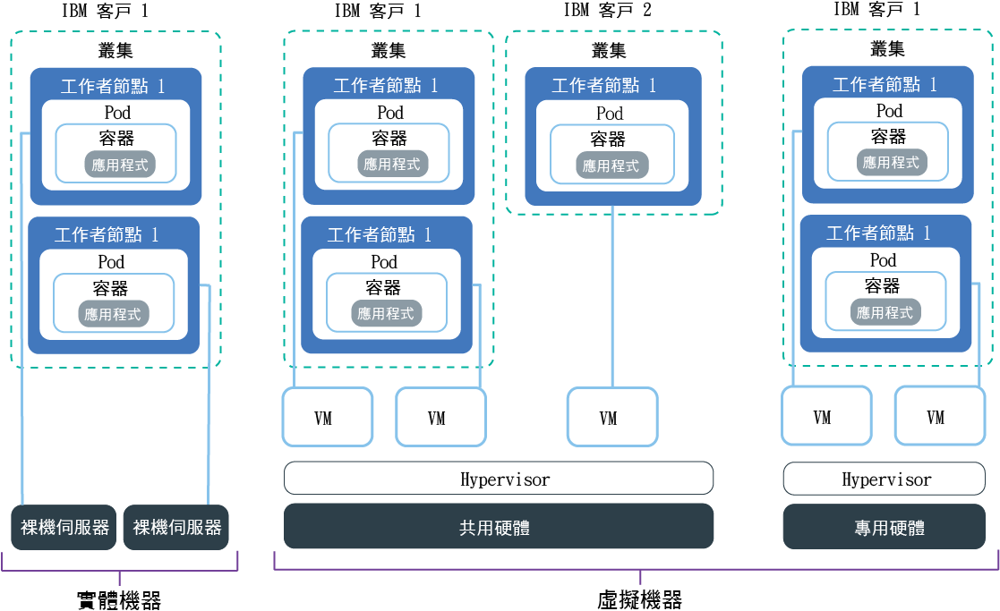

---

copyright:
  years: 2014, 2019
lastupdated: "2019-06-11"

keywords: kubernetes, iks, multi az, multi-az, szr, mzr

subcollection: containers

---

{:new_window: target="_blank"}
{:shortdesc: .shortdesc}
{:screen: .screen}
{:pre: .pre}
{:table: .aria-labeledby="caption"}
{:codeblock: .codeblock}
{:tip: .tip}
{:note: .note}
{:important: .important}
{:deprecated: .deprecated}
{:download: .download}
{:preview: .preview}

# 規劃工作者節點設定
{: #planning_worker_nodes}

Kubernetes 叢集包含可分組至工作者節點儲存區的工作者節點，並且由 Kubernetes 主節點集中進行監視及管理。叢集管理者可以決定如何設定工作者節點的叢集，以確保叢集使用者具有要在叢集裡部署及執行應用程式的所有資源。
{:shortdesc}

當您建立標準叢集時，會代表您在 IBM Cloud 基礎架構 (SoftLayer) 中訂購具有相同記憶體、CPU 及磁碟空間規格（特性）的工作者節點，並將它們新增至叢集裡的預設工作者節點儲存區。每個工作者節點都會獲指派建立叢集之後即不得變更的唯一工作者節點 ID 及網域名稱。您可以選擇虛擬或實體（裸機）伺服器。視您選擇的硬體隔離層次而定，虛擬工作者節點可以設定為共用或專用節點。若要將不同的特性新增至叢集，請[建立另一個工作者節點儲存區](/docs/containers?topic=containers-cli-plugin-kubernetes-service-cli#cs_worker_pool_create)。

Kubernetes 會限制您在叢集裡可以有的工作者節點數目上限。如需相關資訊，請檢閱[工作者節點及 Pod 配額 ](https://kubernetes.io/docs/setup/cluster-large/)。

想要確定您是否永遠擁有足夠的工作者節點來滿足您的工作負載？請試試[叢集 autoscaler](/docs/containers?topic=containers-ca#ca)。
{: tip}

 

## 工作者節點可用的硬體
{: #shared_dedicated_node}

當您在 {{site.data.keyword.Bluemix_notm}} 中建立標準叢集時，您可以選擇工作者節點儲存區包含的工作者節點是實體機器（裸機），或是在實體硬體上執行的虛擬機器。您也可以選取工作者節點特性，或記憶體、CPU 及其他機器規格（例如磁碟儲存空間）的組合。
{:shortdesc}

如果您想要工作者節點的多個特性，則必須為每個特性建立一個工作者節點儲存區。您無法調整現有工作者節點的大小來具有不同的資源，例如 CPU 或記憶體。當您建立免費叢集時，工作者節點會自動佈建為 IBM Cloud 基礎架構 (SoftLayer) 帳戶中的虛擬共用節點。在標準叢集裡，您可以選擇最適用於工作負載的機器類型。計劃時，請考量 CPU 及記憶體容量總計上的[工作者節點資源保留](#resource_limit_node)。

請選取下列其中一個選項，以決定您要的工作者節點儲存區類型。
* [虛擬機器](#vm)
* [實體機器（裸機）](#bm)
* [軟體定義儲存 (SDS) 機器](#sds)

## 虛擬機器
{: #vm}

使用 VM，您可以取得更大的彈性、更快速的佈建時間，以及比裸機還要多的自動可擴充性功能，而且價格更加划算。您可以將 VM 用於大部份一般用途的使用案例，例如測試和開發環境、暫置和正式作業環境、微服務以及商務應用程式。不過，會犧牲效能。如果需要針對 RAM 密集型、資料密集型或 GPU 密集型工作負載進行高效能運算，請使用 [Bare Metal Server](#bm)。
{: shortdesc}

**我要使用共用或專用硬體？** 
當您建立標準虛擬叢集時，必須選擇是要由多個 {{site.data.keyword.IBM_notm}} 客戶（多方承租戶）共用基礎硬體，還是只供您一人專用（單一承租戶）。

* **在多方承租戶共用硬體設定中**：在部署至相同實體硬體的所有虛擬機器之間，會共用 CPU 和記憶體之類的實體資源。為了確保每台虛擬機器都可以獨立執行，虛擬機器監視器（也稱為 Hypervisor）會將實體資源分段為隔離實體，並將它們當成專用資源配置至虛擬機器（Hypervisor 隔離）。
* **在單一承租戶專用硬體設定中**：所有實體資源都僅供您專用。您可以將多個工作者節點部署為相同實體主機上的虛擬機器。與多方承租戶設定類似，系統管理程序也會確保每個工作者節點在可用實體資源中獲得應有的份額。

因為基礎硬體的成本是由多個客戶分攤，所以共用節點成本通常會比專用節點成本低。不過，當您決定共用或專用節點時，可能會想要與法務部門討論應用程式環境所需的基礎架構隔離及法規遵循層次。

部分特性僅適用於一種類型的承租戶設定。例如，`m3c` VM 只能作為 `shared` 承租戶設定。
{: note}

**哪些是 VM 的一般特性？** 
虛擬機器使用本端磁碟而非儲存區域網路 (SAN) 來達到可靠性。可靠性優點包括將位元組序列化到本端磁碟時的更高傳輸量，以及減少檔案系統由於網路故障而造成的退化。每個 VM 具備 1000 Mbps 網路連線功能速度、用於作業系統檔案系統的 25 GB 主要本端磁碟儲存空間和用於資料（例如，容器運行環境和 `kubelet`）的 100 GB 次要本端磁碟儲存空間。工作者節點上的本端儲存空間僅適用於短期處理，當您更新或重新載入工作者節點時，會清除主要及次要磁碟。如需持續性儲存空間解決方案的相關資訊，請參閱[規劃高度可用的持續性儲存空間](/docs/containers?topic=containers-storage_planning#storage_planning)。

**如果我有較舊的機型，該怎麼辨？** 
如果您的叢集已淘汰 `x1c` 或更舊版本的 Ubuntu 16 `x2c` 工作者節點特性，您可以[更新叢集使其具有 Ubuntu 18 `x3c` 工作者節點](/docs/containers?topic=containers-update#machine_type)。

**哪些虛擬機器特性可供使用？** 
工作者節點特性依區域而有所不同。下表包括特性的最新版本（例如 `x3c` Ubuntu 18 工作者節點特性，相對於較舊的 `x2c` Ubuntu 16 工作者節點特性）。若要查看您區域中可用的機型，請執行 `ibmcloud ks machine-types <zone>`。您也可以檢閱可用的[裸機](#bm)或 [SDS](#sds) 機型。

{: #vm-table}
<table>
<caption>{{site.data.keyword.containerlong_notm}} 中可用的虛擬機器類型。</caption>
<thead>
<th>名稱及使用案例</th>
<th>核心 / 記憶體</th>
<th>主要 / 次要磁碟</th>
<th>網路速度</th>
</thead>
<tbody>
<tr>
<td><strong>虛擬，u3c.2x4</strong>：針對快速測試、概念證明，以及其他輕量型工作負載，使用這個大小最小的 VM。</td>
<td>2 / 4 GB</td>
<td>25 GB / 100 GB</td>
<td>1000 Mbps</td>
</tr>
<tr>
<td><strong>虛擬，b3c.4x16</strong>：針對測試與開發，以及其他輕量型工作負載，選取這個平衡的 VM。</td>
<td>4 / 16 GB</td>
<td>25 GB / 100 GB</td>
<td>1000 Mbps</td>
</tr>
<tr>
<td><strong>虛擬，b3c.16x64</strong>：針對中型工作負載，選取這個平衡的 VM。</td></td>
<td>16 / 64 GB</td>
<td>25 GB / 100 GB</td>
<td>1000 Mbps</td>
</tr>
<tr>
<td><strong>虛擬，b3c.32x128</strong>：針對中型或大型工作負載（例如一個資料庫及一個具有許多並行使用者的動態網站），選取這個平衡的 VM。</td>
<td>32 / 128 GB</td>
<td>25 GB / 100 GB</td>
<td>1000 Mbps</td>
</tr>
<tr>
<td><strong>虛擬，c3c.16x16</strong>：當您想要工作者節點的運算資源取得均等平衡以處理輕量型工作負載時，請使用此特性。</td>
<td>16 / 16 GB</td>
<td>25 GB / 100 GB</td>
<td>1000 Mbps</td>
</tr><tr>
<td><strong>虛擬，c3c.16x32</strong>：當您想要輕量型到中量型工作負載之工作者節點的 CPU 和記憶體資源比例為 1:2 時，請使用此特性。</td>
<td>16 / 32 GB</td>
<td>25 GB / 100 GB</td>
<td>1000 Mbps</td>
</tr><tr>
<td><strong>虛擬，c3c.32x32</strong>：當您想要工作者節點的運算資源取得均等平衡以處理中量型工作負載時，請使用此特性。</td>
<td>32 / 32 GB</td>
<td>25 GB / 100 GB</td>
<td>1000 Mbps</td>
</tr><tr>
<td><strong>虛擬，c3c.32x64</strong>：當您想要中量型工作負載之工作者節點的 CPU 和記憶體資源比例為 1:2 時，請使用此特性。</td>
<td>32 / 64 GB</td>
<td>25 GB / 100 GB</td>
<td>1000 Mbps</td>
</tr>
<tr>
<td><strong>虛擬，m3c.8x64</strong>：如果想要針對需要更多記憶體的輕型到中型工作負載（類似於 {{site.data.keyword.Db2_on_Cloud_short}} 等資料庫）提供比例為 1:8 的 CPU 和記憶體資源，請使用此特性。僅適用於 Dallas，並作為 `--hardware shared` 承租戶。</td>
<td>8 / 64 GB</td>
<td>25 GB / 100 GB</td>
<td>1000 Mbps</td>
</tr><tr>
<td><strong>虛擬，m3c.16x128</strong>：如果想要針對需要更多記憶體的中型工作負載（類似於 {{site.data.keyword.Db2_on_Cloud_short}} 等資料庫）提供比例為 1:8 的 CPU 和記憶體資源，請使用此特性。僅適用於 Dallas，並作為 `--hardware shared` 承租戶。</td>
<td>16 / 128 GB</td>
<td>25 GB / 100 GB</td>
<td>1000 Mbps</td>
</tr><tr>
<td><strong>虛擬，m3c.30x240</strong>：如果想要針對需要更多記憶體的中型到大型工作負載（類似於 {{site.data.keyword.Db2_on_Cloud_short}} 等資料庫）提供比例為 1:8 的 CPU 和記憶體資源，請使用此特性。僅適用於 Dallas，並作為 `--hardware shared` 承租戶。</td>
<td>30 / 240 GB</td>
<td>25 GB / 100 GB</td>
<td>1000 Mbps</td>
</tr>
<tr>
<td><strong>虛擬，z1.2x4</strong>：如果想要在 IBM Z Systems 中的 Hyper Protect Containers 上建立工作者節點，請使用此特性。</td>
<td>2 / 4 GB</td>
<td>25 GB / 100 GB</td>
<td>1000 Mbps</td>
</tr>
</tbody>
</table>

## 實體機器（裸機）
{: #bm}

您可以將工作者節點佈建為單一承租戶實體伺服器，也稱為裸機伺服器。
{: shortdesc}

**裸機與 VM 的不同之處？** 
裸機可讓您直接存取機器上的實體資源，例如記憶體或 CPU。此設定可免除虛擬機器 Hypervisor，該 Hypervisor 將實體資源配置給在主機上執行的虛擬機器。相反地，裸機的所有資源將由工作者節點專用，因此您不需要擔心「吵雜的鄰居」共用資源或降低效能。實體機型的本端儲存空間多於虛擬機型，而且有些實體機型具有 RAID 可用來增加資料可用性。工作者節點上的本端儲存空間僅適用於短期處理，當您更新或重新載入工作者節點時，會清除主要及次要磁碟。如需持續性儲存空間解決方案的相關資訊，請參閱[規劃高度可用的持續性儲存空間](/docs/containers?topic=containers-storage_planning#storage_planning)。

**除了更好的效能規格之外，裸機還有什麼功能是 VM 所沒有的？** 
是。透過裸機，您可以選擇啟用「授信運算」，以驗證工作者節點是否遭到竄改。如果在建立叢集期間未啟用信任，但想要日後啟用，則可以使用 `ibmcloud ks feature-enable` [指令](/docs/containers?topic=containers-cli-plugin-kubernetes-service-cli#cs_cluster_feature_enable)。啟用信任之後，以後您就無法再予以停用。無需信任，即可建立新叢集。如需在節點啟動處理程序期間信任如何運作的相關資訊，請參閱[使用授信運算的 {{site.data.keyword.containerlong_notm}}](/docs/containers?topic=containers-security#trusted_compute)。「授信運算」可用於特定裸機的機型。當您執行 `ibmcloud ks machine-types <zone>` [指令](/docs/containers?topic=containers-cli-plugin-kubernetes-service-cli#cs_machine_types)時，可以檢閱 **Trustable** 欄位來查看哪些機器支援信任。例如，`mgXc` GPU 特性不支援「授信運算」。

除了「授信運算」之外，您也可以利用 {{site.data.keyword.datashield_full}}（測試版）。{{site.data.keyword.datashield_short}} 與 Intel® Software Guard Extensions (SGX) 及 Fortanix® 技術整合，以在使用時保護 {{site.data.keyword.Bluemix_notm}} 容器工作負載程式碼和資料。應用程式碼及資料是在 CPU 強化的區域中執行，這些是工作者節點上的記憶體信任區域，能保護應用程式的重要方面，有助於保持程式碼和資料的機密性，並使其不會遭到修改。如果您或貴公司因為內部政策、政府規定或產業合規性需求而需要顧及資料敏感度，本解決方案也許可協助您移至雲端。使用案例的範例包括財務及醫療機構，或其政府政策需要內部部署雲端解決方案的國家/地區。

**裸機聽起來真棒！有什麼原因阻止我立即訂購？** 
裸機伺服器的成本高於虛擬伺服器，最適合需要更多資源和主機控制的高效能應用程式。

裸機伺服器按月計費。如果您在月底之前取消裸機伺服器，則會向您收取該月整個月的費用。當您訂購或取消裸機伺服器之後，即會在 IBM Cloud 基礎架構 (SoftLayer) 帳戶中手動完成此處理程序。因此，可能需要多個營業日才能完成。
{: important}

**我可以訂購哪些裸機特性？** 
工作者節點特性依區域而有所不同。下表包括特性的最新版本（例如 `x3c` Ubuntu 18 工作者節點特性，相對於較舊的 `x2c` Ubuntu 16 工作者節點特性）。若要查看您區域中可用的機型，請執行 `ibmcloud ks machine-types <zone>`。您也可以檢閱可用的 [VM](#vm) 或 [SDS](#sds) 機型。

裸機伺服器針對不同的使用案例（例如 RAM 密集型、資料密集型或 GPU 密集型工作負載）進行最佳化。

選擇具有正確儲存空間配置的機型以支援您的工作負載。有些特性混合了下列磁碟及儲存空間配置。例如，有些特性可能具有含原始 SSD 次要磁碟的 SATA 主要磁碟。

* **SATA**：這是一個轉盤式磁碟儲存裝置，通常用於儲存 OS 檔案系統之工作者節點的主要磁碟。
* **SSD**：用於高效能資料的固態硬碟儲存裝置。
* **原始**：此儲存裝置未格式化，有完整容量可供使用。
* **RAID**：此儲存裝置會分散儲存資料以提供備援並增進效能，其視 RAID 層次而異。因此，可供使用的磁碟容量會有所不同。

{: #bm-table}
<table>
<caption>{{site.data.keyword.containerlong_notm}} 中可用的裸機機型。</caption>
<thead>
<th>名稱及使用案例</th>
<th>核心 / 記憶體</th>
<th>主要 / 次要磁碟</th>
<th>網路速度</th>
</thead>
<tbody>
<tr>
<td><strong>RAM 密集的裸機，mr3c.28x512</strong>：將工作者節點可用的 RAM 最大化。</td>
<td>28 / 512 GB</td>
<td>2 TB SATA / 960 GB SSD</td>
<td>10000 Mbps</td>
</tr>
<tr>
<td><strong>GPU Bare Metal Server，mg3c.16x128</strong>：對於數學密集型工作負載（例如，高效能運算、機器學習或 3D 應用程式），請選擇此類型。此特性有 1 塊 Tesla K80 實體卡，每塊卡有 2 個圖形處理裝置 (GPU)，共有 2 個 GPU。</td>
<td>16 / 128 GB</td>
<td>2 TB SATA / 960 GB SSD</td>
<td>10000 Mbps</td>
</tr>
<tr>
<td><strong>GPU Bare Metal Server，mg3c.28x256</strong>：對於數學密集型工作負載（例如，高效能運算、機器學習或 3D 應用程式），請選擇此類型。此特性有 2 塊 Tesla K80 實體卡，每塊卡有 2 個 GPU，共有 4 個 GPU。</td>
<td>28 / 256 GB</td>
<td>2 TB SATA / 960 GB SSD</td>
<td>10000 Mbps</td>
</tr>
<tr>
<td><strong>資料密集的裸機，md3c.16x64.4x4tb</strong>：針對大量的本端磁碟儲存空間（包括 RAID 來增加資料可用性）、工作負載（例如分散式檔案系統）、大型資料庫及海量資料分析使用此類型。</td>
<td>16 / 64 GB</td>
<td>2x2 TB RAID1 / 4x4 TB SATA RAID10</td>
<td>10000 Mbps</td>
</tr>
<tr>
<td><strong>資料密集的裸機，md3c.28x512.4x4tb</strong>：針對大量的本端磁碟儲存空間（包括 RAID 來增加資料可用性）、工作負載（例如分散式檔案系統）、大型資料庫及海量資料分析使用此類型。</td>
<td>28 / 512 GB</td>
<td>2x2 TB RAID1 / 4x4 TB SATA RAID10</td>
<td>10000 Mbps</td>
</tr>
<tr>
<td><strong>平衡的裸機，mb3c.4x32</strong>：用於平衡的工作負載，其需要的運算資源比虛擬機器提供的更多。也可以使用 Intel® Software Guard Extensions (SGX) 來啟用此特性，以便您可以使用<a href="/docs/services/data-shield?topic=data-shield-getting-started#getting-started" target="_blank">{{site.data.keyword.datashield_short}}（測試版）</a>來加密資料記憶體。</td>
<td>4 / 32 GB</td>
<td>2 TB SATA / 2 TB SATA</td>
<td>10000 Mbps</td>
</tr>
<tr>
<td><strong>平衡的裸機，mb3c.16x64</strong>：用於平衡的工作負載，其需要的運算資源比虛擬機器提供的更多。</td>
<td>16 / 64 GB</td>
<td>2 TB SATA / 960 GB SSD</td>
<td>10000 Mbps</td>
</tr>
<tr>
</tbody>
</table>

## 軟體定義儲存 (SDS) 機器
{: #sds}

軟體定義儲存 (SDS) 特性是使用其他原始磁碟作為實體本端儲存空間而佈建的實體機器。不同於主要及次要本端磁碟，在工作者節點更新或重新載入期間，不會清除這些原始磁碟。由於資料與運算節點會並存，所以 SDS 機器很適合高效能工作負載。
{: shortdesc}

**何時要使用 SDS 特性？** 
一般您會在下列情況使用 SDS 機器：
*  如果您對叢集使用 SDS 附加程式（例如 [Portworx](/docs/containers?topic=containers-portworx#portworx)），請使用 SDS 機器。
*  如果您的應用程式是一個需要本端儲存空間的 [StatefulSet ](https://kubernetes.io/docs/concepts/workloads/controllers/statefulset/)，則可以使用 SDS 機器，並佈建 [Kubernetes 本端持續性磁區（測試版）](https://kubernetes.io/blog/2018/04/13/local-persistent-volumes-beta/)。
*  您可能具有需要額外原始本端儲存空間的自訂應用程式。

如需其他儲存空間解決方案，請參閱[規劃高度可用的持續性儲存空間](/docs/containers?topic=containers-storage_planning#storage_planning)。

**我可以訂購哪些 SDS 特性？** 
工作者節點特性依區域而有所不同。下表包括特性的最新版本（例如 `x3c` Ubuntu 18 工作者節點特性，相對於較舊的 `x2c` Ubuntu 16 工作者節點特性）。若要查看您區域中可用的機型，請執行 `ibmcloud ks machine-types <zone>`。您也可以檢閱可用的[裸機](#bm)或 [VM](#vm) 機型。

選擇具有正確儲存空間配置的機型以支援您的工作負載。有些特性混合了下列磁碟及儲存空間配置。例如，有些特性可能具有含原始 SSD 次要磁碟的 SATA 主要磁碟。

* **SATA**：這是一個轉盤式磁碟儲存裝置，通常用於儲存 OS 檔案系統之工作者節點的主要磁碟。
* **SSD**：用於高效能資料的固態硬碟儲存裝置。
* **原始**：此儲存裝置未格式化，有完整容量可供使用。
* **RAID**：此儲存裝置會分散儲存資料以提供備援並增進效能，其視 RAID 層次而異。因此，可供使用的磁碟容量會有所不同。

{: #sds-table}
<table>
<caption>{{site.data.keyword.containerlong_notm}} 中可用的 SDS 機型。</caption>
<thead>
<th>名稱及使用案例</th>
<th>核心 / 記憶體</th>
<th>主要 / 次要磁碟</th>
<th>其他原始磁碟</th>
<th>網路速度</th>
</thead>
<tbody>
<tr>
<td><strong>具有 SDS 的裸機，ms3c.4x32.1.9tb.ssd</strong>：如果您需要額外的本端儲存空間以獲得效能，請使用支援軟體定義儲存空間 (SDS) 的這個需要大量磁碟空間的特性。</td>
<td>4 / 32 GB</td>
<td>2 TB SATA / 960 GB SSD</td>
<td>1.9 TB 原始 SSD（裝置路徑：`/dev/sdc`）</td>
<td>10000 Mbps</td>
</tr>
<tr>
<td><strong>具有 SDS 的裸機，ms3c.16x64.1.9tb.ssd</strong>：如果您需要額外的本端儲存空間以獲得效能，請使用支援軟體定義儲存空間 (SDS) 的這個需要大量磁碟空間的特性。</td>
<td>16 / 64 GB</td>
<td>2 TB SATA / 960 GB SSD</td>
<td>1.9 TB 原始 SSD（裝置路徑：`/dev/sdc`）</td>
<td>10000 Mbps</td>
</tr>
<tr>
<td><strong>具有 SDS 的裸機，ms3c.28x256.3.8tb.ssd</strong>：如果您需要額外的本端儲存空間以獲得效能，請使用支援軟體定義儲存空間 (SDS) 的這個需要大量磁碟空間的特性。</td>
<td>28 / 256 GB</td>
<td>2 TB SATA / 1.9 TB SSD</td>
<td>3.8 TB 原始 SSD（裝置路徑：`/dev/sdc`）</td>
<td>10000 Mbps</td>
</tr>
<tr>
<td><strong>具有 SDS 的裸機，ms3c.28x512.4x3.8tb.ssd</strong>：如果您需要額外的本端儲存空間以獲得效能，請使用支援軟體定義儲存空間 (SDS) 的這個需要大量磁碟空間的特性。</td>
<td>28 / 512 GB</td>
<td>2 TB SATA / 1.9 TB SSD</td>
<td>4 個磁碟，3.8 TB 原始 SSD（裝置路徑：`/dev/sdc`、`/dev/sdd`、`/dev/sde` 和 `/dev/sdf`）</td>
<td>10000 Mbps</td>
</tr>
</tbody>
</table>

## 工作者節點資源保留
{: #resource_limit_node}

{{site.data.keyword.containerlong_notm}} 會設定運算資源保留，限制每一個工作者節點上的可用運算資源。保留記憶體及 CPU 資源無法供工作者節點上的 Pod 使用，並會減少每一個工作者節點上的可配置資源。起始部署 Pod 時，如果工作者節點沒有足夠的可配置資源，則部署會失敗。此外，如果 Pod 超出工作者節點資源限制，則會收回 Pod。在 Kubernetes 中，此限制稱為[強制收回臨界值 ](https://kubernetes.io/docs/tasks/administer-cluster/out-of-resource/#hard-eviction-thresholds)。
{:shortdesc}

如果可用的 CPU 或記憶體少於工作者節點保留，則 Kubernetes 會開始收回 Pod，以還原足夠的運算資源。如果有工作者節點可供使用，則 Pod 會重新排定至另一個工作者節點。如果經常收回 Pod，請將更多的工作者節點新增至叢集，或在 Pod 上設定[資源限制 ](https://kubernetes.io/docs/concepts/configuration/manage-compute-resources-container/#resource-requests-and-limits-of-pod-and-container)。

工作者節點上保留的資源，取決於工作者節點隨附的 CPU 和記憶體數量。{{site.data.keyword.containerlong_notm}} 定義記憶體及 CPU 層級，如下表所示。如果工作者節點隨附多個層級中的運算資源，則會為每一個層級保留某個百分比的 CPU 及記憶體資源。

若要檢閱工作者節點上目前使用的運算資源，請執行 [`kubectltop node ` ](https://kubernetes.io/docs/reference/kubectl/overview/#top)。
{: tip}

<table summary="本表依層級顯示工作者節點記憶體保留。">
<caption>依層級的工作者節點記憶體保留。</caption>
<thead>
<tr>
  <th>記憶體層級</th>
  <th>% 或保留數量</th>
  <th>`b3c.4x16` 工作者節點 (16 GB) 範例</th>
  <th>`mg1c.28x256` 工作者節點 (256 GB) 範例</th>
</tr>
</thead>
<tbody>
<tr>
  <td>前 4 GB (0-4 GB)</td>
  <td>25% 的記憶體</td>
  <td>1 GB</td>
  <td>1 GB</td>
</tr>
<tr>
  <td>接下來 4 GB (5-8 GB)</td>
  <td>20% 的記憶體</td>
  <td>0.8 GB</td>
  <td>0.8 GB</td>
</tr>
<tr>
  <td>接下來 8 GB (9-16 GB)</td>
  <td>10% 的記憶體</td>
  <td>0.8 GB</td>
  <td>0.8 GB</td>
</tr>
<tr>
  <td>接下來 112 GB (17-128 GB)</td>
  <td>6% 的記憶體</td>
  <td>N/A</td>
  <td>6.72 GB</td>
</tr>
<tr>
  <td>剩餘 GB（129 GB 以上）</td>
  <td>2% 的記憶體</td>
  <td>N/A</td>
  <td>2.54 GB</td>
</tr>
<tr>
  <td>其他用於 [`kubelet` 收回的保留 ](https://kubernetes.io/docs/tasks/administer-cluster/out-of-resource/)</td>
  <td>100 MB</td>
  <td>100 MB（固定數量）</td>
  <td>100 MB（固定數量）</td>
</tr>
<tr>
  <td>**保留總計**</td>
  <td>**（變化）**</td>
  <td>**2.7 GB，總計 16 GB**</td>
  <td>**11.96 GB，總計 256 GB**</td>
</tr>
</tbody>
</table>

<table summary="本表依層級顯示工作者節點 CPU 保留。">
<caption>依層級的工作者節點 CPU 保留。</caption>
<thead>
<tr>
  <th>CPU 層級</th>
  <th>% 保留</th>
  <th>`b3c.4x16` 工作者節點（4 個核心）範例</th>
  <th>`mg1c.28x256` 工作者節點（28 個核心）範例</th>
</tr>
</thead>
<tbody>
<tr>
  <td>第一個核心（核心 1）</td>
  <td>6% 核心</td>
  <td>0.06 個核心</td>
  <td>0.06 個核心</td>
</tr>
<tr>
  <td>下 2 個核心（核心 2-3）</td>
  <td>1% 核心</td>
  <td>0.02 個核心</td>
  <td>0.02 個核心</td>
</tr>
<tr>
  <td>下 2 個核心（核心 4-5）</td>
  <td>0.5% 核心</td>
  <td>0.005 個核心</td>
  <td>0.01 個核心</td>
</tr>
<tr>
  <td>剩餘核心（核心 6+）</td>
  <td>0.25% 核心</td>
  <td>N/A</td>
  <td>0.0575 個核心</td>
</tr>
<tr>
  <td>**保留總計**</td>
  <td>**（變化）**</td>
  <td>**0.085 個核心，總計 4 個核心**</td>
  <td>**0.1475 個核心，總計 28 個核心**</td>
</tr>
</tbody>
</table>
