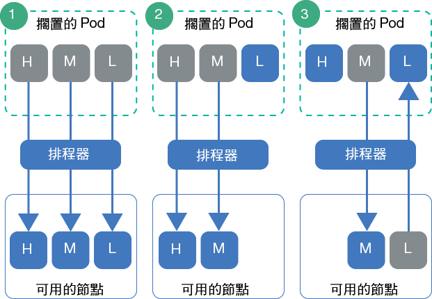

---

copyright:
  years: 2014, 2019
lastupdated: "2019-05-31"

keywords: kubernetes, iks

subcollection: containers

---

{:new_window: target="_blank"}
{:shortdesc: .shortdesc}
{:screen: .screen}
{:pre: .pre}
{:table: .aria-labeledby="caption"}
{:codeblock: .codeblock}
{:tip: .tip}
{:note: .note}
{:important: .important}
{:deprecated: .deprecated}
{:download: .download}
{:preview: .preview}


# 設定 Pod 優先順序
{: #pod_priority}

透過 Kubernetes Pod 優先順序及先占，您可以配置優先順序等級來指示 Pod 的相對優先順序。Kubernetes 排程器會將 Pod 的優先順序列入考量，甚至可以先占（移除）具有較低優先順序的 Pod，以便在工作者節點上騰出空間給較高優先順序的 Pod。您執行 Kubernetes 1.11.2 版或更新版本的 {{site.data.keyword.containerlong}} 叢集支援施行這些等級的 `Priority` 許可控制器。
{: shortdesc}

**我為何要設定 Pod 優先順序？**</br>
身為叢集管理者，您要控制哪些 Pod 對於叢集工作負載更為重要。優先順序等級可協助您控制 Kubernetes 排程器決策，使高優先順序 Pod 勝過低優先順序 Pod。排程器甚至可以先占（移除）執行中的低優先順序 Pod，以便排程擱置中的高優先順序 Pod。

透過設定 Pod 優先順序，您可以協助防止較低優先順序的工作負載影響叢集裡的重要工作負載，尤其是在叢集開始達到其資源容量的情況下。

請確定您已對叢集[設定適當的使用者存取權](/docs/containers?topic=containers-users#users)及（如果適用）[Pod 安全原則](/docs/containers?topic=containers-psp#psp)。存取權及 Pod 安全原則有助於防止不受信任的使用者部署高優先順序 Pod，而防止其他 Pod 進行排程。
{: tip}

{: #priority_scheduling}
**優先順序排程及先占如何運作？**</br>
一般而言，具有較高優先順序的擱置中 Pod 會排程在較低優先順序 Pod 之前。如果您的工作者節點中沒有留下足夠的資源，則排程器可以先占（移除）Pod，釋出足夠的資源，以便排程較高優先順序 Pod。先占也受到溫和終止期間、Pod 中斷預算及工作者節點親緣性的影響。

如果您沒有為 Pod 部署指定優先順序，則預設值是設為 `globalDefault` 優先順序等級。如果您沒有 `globalDefault` 優先順序等級，則所有 Pod 的預設優先順序都是零 (`0`)。依預設，{{site.data.keyword.containerlong_notm}} 不會設定 `globalDefault`，因此 Pod 預設優先順序為零。

若要瞭解 Pod 優先順序與排程器如何一起運作，請考量下圖中的情境。您必須在具有可用資源的工作者節點上放置已設定優先順序的 Pod。否則，在移除現有 Pod 的同時，叢集裡的高優先順序 Pod 可能保持擱置狀態，如「情境 3」所示。

_圖：Pod 優先順序情境_


1.  具有高、中、低優先順序的三個 Pod 擱置排程。排程器會尋找有空間給所有 3 個 Pod 的可用工作者節點，並依優先順序排程它們，優先順序最高的 Pod 先排。
2.  具有高、中、低優先順序的三個 Pod 擱置排程。排程器會尋找可用的工作者節點，但工作者節點的資源僅足以支援高及中優先順序的 Pod。低優先順序 Pod 未進行排程而保持擱置。
3.  具有高及中優先順序的兩個 Pod 擱置排程。可用的工作者節點上具有低優先順序的第三個 Pod。不過，工作者節點沒有足夠的資源來進行任何擱置 Pod 的排程。排程器會先占或移除低優先順序 Pod，這使得 Pod 回到擱置狀態。然後，排程器會嘗試排程高優先順序 Pod。不過，工作者節點沒有足夠的資源來排程高優先順序 Pod，排程器改為排程中優先順序 Pod。

**如需相關資訊**：請參閱有關 [Pod 優先順序及先占 ](https://kubernetes.io/docs/concepts/configuration/pod-priority-preemption/)的 Kubernetes 文件。

**我可以停用 Pod 優先順序許可控制器嗎？**</br>
不能。如果不想使用 Pod 優先順序，請勿設定 `globalDefault` 或在 Pod 部署中包含優先順序類別。除了 IBM 使用[預設優先順序等級](#default_priority_class)部署的叢集重要 Pod 之外，每個 Pod 都預設為零。因為 Pod 優先順序是相對的，所以此基本設定確保叢集重要 Pod 已針對資源設定了優先順序，並遵循您已設定的現有排程原則來排程任何其他 Pod。

**資源配額如何影響 Pod 優先順序？**</br>
您可以針對執行 Kubernetes 1.12 或更新版本的叢集，搭配使用 Pod 優先順序與資源配額，包括[配額範圍 ](https://kubernetes.io/docs/concepts/policy/resource-quotas/#quota-scopes)。使用配額範圍，您可以將資源配額設為帳戶，以取得 Pod 優先順序。較高優先順序的 Pod 會在較低優先順序的 Pod 之前，開始耗用資源配額所限制的系統資源。

## 瞭解預設優先順序等級
{: #default_priority_class}

依預設，您的 {{site.data.keyword.containerlong_notm}} 叢集具有一些優先順序等級。
{: shortdesc}

請不要修改預設等級，其係用來正確管理您的叢集。您可以在應用程式部署中使用這些等級，或[建立您自己的優先順序等級](#create_priority_class)。
{: important}

下表說明依預設存在於您叢集裡的優先順序等級及其使用原因。

|名稱| 設定者 | 優先順序值 | 用途 |
|---|---|---|
| `system-node-critical` |Kubernetes| 2000001000 | 當您建立叢集時，選取要部署至 `kube-system` 名稱空間的 Pod，使用此優先順序等級來保護工作者節點的重要功能，例如網路功能、儲存空間、記載、監視及度量值 Pod。 |
| `system-cluster-critical` |Kubernetes| 2000000000 | 當您建立叢集時，選取要部署至 `kube-system` 名稱空間的 Pod，使用此優先順序等級來保護叢集的重要功能，例如網路功能、儲存空間、記載、監視及度量值 Pod。 |
| `ibm-app-cluster-critical` | IBM | 900000000 | 當您建立叢集時，選取要部署至 `ibm-system` 名稱空間的 Pod，使用此優先順序等級來保護應用程式的重要功能，例如負載平衡器 Pod。 |
{: caption="您不得修改的預設優先順序等級" caption-side="top"}

您可以執行下列指令來檢查哪些 Pod 使用優先順序等級。

```
kubectl get pods --all-namespaces -o custom-columns=NAME:.metadata.name,PRIORITY:.spec.priorityClassName
```
{: pre}

## 建立優先順序等級
{: #create_priority_class}

若要設定 Pod 優先順序，您必須使用優先順序等級。
{: shortdesc}

開始之前：
* [登入您的帳戶。適用的話，請將適當的資源群組設為目標。設定叢集的環境定義。](/docs/containers?topic=containers-cs_cli_install#cs_cli_configure)
* 確定您具有 `default` 名稱空間的[**撰寫者**或**管理員** {{site.data.keyword.Bluemix_notm}} IAM 服務角色](/docs/containers?topic=containers-users#platform)。
* [建立](/docs/containers?topic=containers-clusters#clusters_ui)或[更新](/docs/containers?topic=containers-update#update)您的叢集至 Kubernetes 1.11 版或更新版本。

若要使用優先順序等級，請執行下列動作：

1.  選用項目：使用現有的優先順序等級作為新等級的範本。

    1.  列出現有的優先順序等級。

        ```
        kubectl get priorityclasses
        ```
        {: pre}

    2.  選擇您要複製的優先順序等級，並建立本端 YAML 檔案。

        ```
        kubectl get priorityclass <priority_class> -o yaml > Downloads/priorityclass.yaml
        ```
        {: pre}

2.  建立優先順序等級 YAML 檔案。

    ```yaml
    apiVersion: scheduling.k8s.io/v1alpha1
    kind: PriorityClass
    metadata:
      name: <priority_class_name>
    value: <1000000>
    globalDefault: <false>
    description: "Use this class for XYZ service pods only."
    ```
    {: codeblock}

    <table>
    <caption>瞭解 YAML 檔案元件</caption>
    <thead>
    <th colspan=2> 瞭解 YAML 檔案元件</th>
    </thead>
    <tbody>
    <tr>
    <td><code>metadata.name</code></td>
    <td>必要：您要建立的優先順序等級的名稱。</td>
    </tr>
    <tr>
    <td><code>value</code></td>
    <td>必要：輸入小於或等於 10 億 (1000000000) 的整數。值越高，優先順序越高。這些值相對於叢集裡其他優先順序等級的值。對於您不想先佔（移除）的系統重要 Pod 保留非常高的數字。</br></br>例如，[預設叢集重要優先順序等級](#default_priority_class)範圍是介於 900000000-2000001000 的值，所以對於新優先順序等級，請輸入小於這些數字的值，這樣就不會有任何 Pod 高於這些 Pod 的優先順序。</td>
    </tr>
    <tr>
    <td><code>globalDefault</code></td>
    <td>選用項目：將欄位設為 `true`，讓此優先順序等級成為廣域預設值，其將套用至每一個未使用 `priorityClassName` 值進行排程的 Pod。您的叢集裡只有 1 個優先順序等級可以設為廣域預設值。如果沒有廣域預設值，則未指定 `priorityClassName` 的 Pod，其優先順序為零 (`0`)。</br></br>
        [預設優先順序等級](#default_priority_class)未設定 `globalDefault`。如果您已在叢集裡建立其他優先順序等級，則可以執行 `kubectl describe priorityclass <name>`，以檢查並確定其未設定 `globalDefault`。</td>
    </tr>
    <tr>
    <td><code>description</code></td>
    <td>選用項目：告訴使用者為何要使用此優先順序等級。請使用引號 (`""`) 括住字串。</td>
    </tr></tbody></table>

3.  在叢集裡建立優先順序等級。

    ```
    kubectl apply -f filepath/priorityclass.yaml
    ```
    {: pre}

4.  驗證是否已建立優先順序等級。

    ```
    kubectl get priorityclasses
    ```
    {: pre}

太棒了！您已建立優先順序等級。讓您的團隊瞭解優先順序等級，以及它們必須用於其 Pod 部署的優先順序等級（如果有的話）。  

## 指派 Pod 的優先順序
{: #prioritize}

在 Pod 規格中指派優先順序等級，以便在 {{site.data.keyword.containerlong_notm}} 叢集內設定 Pod 的優先順序。如果您的 Pod 在有優先順序等級之前就已存在於 Kubernetes 1.11 版，您必須編輯 Pod YAML 檔案以指派 Pod 的優先順序。
{: shortdesc}

開始之前：
* [登入您的帳戶。適用的話，請將適當的資源群組設為目標。設定叢集的環境定義。](/docs/containers?topic=containers-cs_cli_install#cs_cli_configure)
* 確定您具有要在其中部署 Pod 之名稱空間的[**撰寫者**或**管理員** {{site.data.keyword.Bluemix_notm}} IAM 服務角色](/docs/containers?topic=containers-users#platform)。
* [建立](/docs/containers?topic=containers-clusters#clusters_ui)或[更新](/docs/containers?topic=containers-update#update)您的叢集至 Kubernetes 1.11 版或更新版本。
* [瞭解優先順序排程的運作方式](#priority_scheduling)，因為優先順序可能先佔現有的 Pod，並影響叢集資源的使用。

若要指派 Pod 的優先順序，請執行下列動作：

1.  檢查其他已部署的 Pod 的重要性，這樣您就可以衡量與已部署的 Pod 的關係，為您的 Pod 選擇正確的優先順序等級。

    1.  檢視名稱空間中的其他 Pod 使用的優先順序等級。

        ```
        kubectl get pods -n <namespace> -o custom-columns=NAME:.metadata.name,PRIORITY:.spec.priorityClassName
        ```
        {: pre}

    2.  取得優先順序等級的詳細資料，並記下 **value** 數字。具有較高數字的 Pod 的優先順序是在具有較低數字的 Pod 之前。對於您想要檢閱的每一個優先順序等級重複此步驟。

        ```
        kubectl describe priorityclass <priorityclass_name>
        ```
        {: pre}

2.  取得您要使用的優先順序等級，或[建立您自己的優先順序等級](#create_priority_class)。

    ```
    kubectl get priorityclasses
    ```
    {: pre}

3.  在您的 Pod 規格中，把您在前一個步驟擷取的優先順序等級的名稱新增至 `priorityClassName` 欄位中。

    ```yaml
    apiVersion: apps/v1
    kind: Deployment
    metadata:
      name: ibmliberty
    spec:
      replicas: 1
      selector:
        matchLabels:
          app: ibmliberty
      template:
        metadata:
          labels:
            app: ibmliberty
        spec:
          containers:
          - name: ibmliberty
            image: icr.io/ibmliberty:latest
            ports:
            - containerPort: 9080
          priorityClassName: <priorityclass_name>
    ```
    {: codeblock}

4.  在您要在其中部署的名稱空間中建立已設定優先順序的 Pod。

    ```
    kubectl apply -f filepath/pod-deployment.yaml
    ```
    {: pre}
