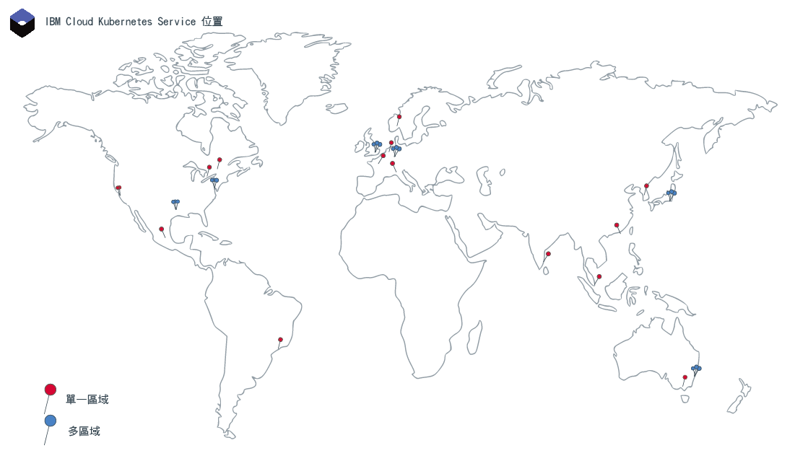

---

copyright:
  years: 2014, 2019
lastupdated: "2019-06-06"

keywords: kubernetes, iks

subcollection: containers

---

{:new_window: target="_blank"}
{:shortdesc: .shortdesc}
{:screen: .screen}
{:pre: .pre}
{:table: .aria-labeledby="caption"}
{:codeblock: .codeblock}
{:tip: .tip}
{:note: .note}
{:important: .important}
{:deprecated: .deprecated}
{:download: .download}
{:preview: .preview}

# 位置
{: #regions-and-zones}

您可以在全球範圍部署 {{site.data.keyword.containerlong}} 叢集。建立 Kubernetes 叢集時，其資源會保留在將叢集部署到的位置中。可以透過廣域 API 端點來存取 {{site.data.keyword.containerlong_notm}} 以使用叢集。
{:shortdesc}



_{{site.data.keyword.containerlong_notm}} 位置_

{{site.data.keyword.Bluemix_notm}} 資源過去都組織成為地區，透過[地區特有的端點](#bluemix_regions)存取。請改用[廣域端點](#endpoint)。
{: deprecated}

## {{site.data.keyword.containerlong_notm}} 位置
{: #locations}

{{site.data.keyword.Bluemix_notm}} 資源會依地理位置的階層進行組織。{{site.data.keyword.containerlong_notm}} 在其中一部分位置中可用，包括所有六個全球具有多區域功能的地區。免費叢集僅在精選位置中可用。其他 {{site.data.keyword.Bluemix_notm}} 服務可能在全球或在特定位置內提供。
{: shortdesc}

### 可用位置
{: #available-locations}

若要列出可用的 {{site.data.keyword.containerlong_notm}} 位置，請使用 `ibmcloud ks supported-locations` 指令。
{: shortdesc}

下圖用作範例，說明了 {{site.data.keyword.containerlong_notm}} 位置的組織方式。


<table summary="該表格顯示了 {{site.data.keyword.containerlong_notm}} 位置的組織方式。每行從左到右閱讀，其中第一直欄是位置類型，第二直欄是類型範例，第三直欄是說明。">
<caption>{{site.data.keyword.containerlong_notm}} 位置的組織方式。</caption>
  <thead>
  <th>類型</th>
  <th>範例</th>
  <th>說明</th>
  </thead>
  <tbody>
    <tr>
      <td>地理位置</td>
      <td>北美洲 (`na`)</td>
      <td>根據地理區域板塊的組織分組。</td>
    </tr>
    <tr>
      <td>國家/地區</td>
      <td>加拿大 (`ca`)</td>
      <td>地理位置內位置的國家/地區。</td>
    </tr>
    <tr>
      <td>都會</td>
      <td>墨西哥城 (`mex-cty`)、達拉斯 (`dal`)</td>
      <td>一個以上資料中心（區域）所在城市的名稱。都會可以具有多區域功能，也可以具有多區域的資料中心（例如，達拉斯），或者只具有單一區域資料中心（例如，墨西哥城）。如果在具有多區域功能的都會中建立叢集，則可以在各區域中分佈 Kubernetes 主節點和工作者節點，以實現高可用性。</td>
    </tr>
    <tr>
      <td>資料中心（區域）</td>
      <td>達拉斯 12 (`dal12`)</td>
      <td>用於管理雲端服務和應用程式的運算、網路和儲存空間基礎架構以及相關冷卻系統和電源所在的實體位置。叢集可在多區域架構中的各資料中心（或區域）中分佈，以實現高可用性。區域彼此隔離，以確保不會共用單一失敗點。
</td>
    </tr>
  </tbody>
  </table>

### {{site.data.keyword.containerlong_notm}} 中的單一區域和多區域位置
{: #zones}

下表列出了 {{site.data.keyword.containerlong_notm}} 中的可用單一區域和多區域位置。請注意，在某些都會中，可以將叢集作為單一區域或多區域叢集進行佈建。此外，免費叢集僅在精選地理區域中可用，且僅作為具有一個工作者節點的單一區域叢集。
{: shortdesc}

* **多區域**：如果在多區域都會位置中建立叢集，則高可用性 Kubernetes 主節點的抄本會在各區域中自動分佈。您可以選擇將工作者節點分散至各區域，以保護應用程式不受區域故障影響。
* **單一區域**：如果在單一資料中心位置中建立叢集，則可以建立多個工作者節點，但卻不能在各區域中分佈這些節點。高可用性主節點在個別主機上包括三個抄本，但不會分散在各區域之中。

若要快速確定區域是否具有多區域功能，可以執行 `ibmcloud ks supported-locations`，並在 `Multizone Metro` 列中尋找值。
{: tip}


{{site.data.keyword.Bluemix_notm}} 資源過去都組織成為地區，透過[地區特有的端點](#bluemix_regions)存取。以下各表格列出了先前的地區以供參考。未來，您可以使用[廣域端點](#endpoint)來移至無地區架構。
{: deprecated}

**多區域都會位置**

<table summary="該表格顯示了 {{site.data.keyword.containerlong_notm}} 中的可用多區域都會位置。每行從左到右閱讀。第一直欄是位置所在的地理位置，第二直欄是位置所在的國家，第三直欄是位置所在的都會，第四直欄是資料中心，第五直欄是過去將位置劃分到其中的淘汰地區。">
<caption>{{site.data.keyword.containerlong_notm}} 中的可用多區域都會位置。</caption>
  <thead>
  <th>地理位置</th>
  <th>國家/地區</th>
  <th>都會</th>
  <th>資料中心</th>
  <th>已淘汰的地區</th>
  </thead>
  <tbody>
    <tr>
      <td>亞太地區</td>
      <td>澳洲</td>
      <td>雪梨</td>
      <td>syd01, syd04, syd05</td>
      <td>亞太地區南部（`ap-south`、`au-syd`）</td>
    </tr>
    <tr>
      <td>亞太地區</td>
      <td>日本</td>
      <td> 東京 </td>
      <td>tok02、tok04、tok05</td>
      <td>亞太地區北部（`ap-north`、`jp-tok`）</td>
    </tr>
    <tr>
      <td>歐洲</td>
      <td>德國</td>
      <td>法蘭克福</td>
      <td>fra02、fra04、fra05</td>
      <td>歐盟中部（`eu-central`、`eu-de`）</td>
    </tr>
    <tr>
      <td>歐洲</td>
      <td>英國</td>
      <td>倫敦</td>
      <td>lon04、lon05`*`、lon06</td>
      <td>英國南部（`uk-south`、`eu-gb`）</td>
    </tr>
    <tr>
      <td>北美洲</td>
      <td>美國</td>
      <td>達拉斯</td>
      <td>dal10、dal12、dal13</td>
      <td>美國南部 (`us-south`)</td>
    </tr>
    <tr>
      <td>北美洲</td>
      <td>美國</td>
      <td>華盛頓特區</td>
      <td>wdc04、wdc06、wdc07</td>
      <td>美國東部 (`us-east`)</td>
    </tr>
  </tbody>
  </table>

**單一區域資料中心位置**

<table summary="該表格顯示了 {{site.data.keyword.containerlong_notm}} 中的可用單一區域都會位置。每行從左到右閱讀。第一直欄是位置所在的地理位置，第二直欄是位置所在的國家，第三直欄是位置所在的都會，第四直欄是資料中心，第五直欄是過去將位置劃分到其中的淘汰地區。">
<caption>{{site.data.keyword.containerlong_notm}} 中的可用單一區域位置。</caption>
  <thead>
  <th>地理位置</th>
  <th>國家/地區</th>
  <th>都會</th>
  <th>資料中心</th>
  <th>已淘汰的地區</th>
  </thead>
  <tbody>
    <tr>
      <td>亞太地區</td>
      <td>澳洲</td>
      <td>墨爾本</td>
      <td>mel01</td>
      <td>亞太地區南部（`ap-south`、`au-syd`）</td>
    </tr>
    <tr>
      <td>亞太地區</td>
      <td>澳洲</td>
      <td>雪梨</td>
      <td>syd01, syd04, syd05</td>
      <td>亞太地區南部（`ap-south`、`au-syd`）</td>
    </tr>
    <tr>
      <td>亞太地區</td>
      <td>中國</td>
      <td>中國香港<br>特別行政區</td>
      <td>hkg02</td>
      <td>亞太地區北部（`ap-north`、`jp-tok`）</td>
    </tr>
    <tr>
      <td>亞太地區</td>
      <td>印度</td>
      <td>清奈</td>
      <td>che01</td>
      <td>亞太地區北部（`ap-north`、`jp-tok`）</td>
    </tr>
    <tr>
      <td>亞太地區</td>
      <td>日本</td>
      <td> 東京 </td>
      <td>tok02、tok04、tok05</td>
      <td>亞太地區北部（`ap-north`、`jp-tok`）</td>
    </tr>
    <tr>
      <td>亞太地區</td>
      <td>韓國</td>
      <td>首爾</td>
      <td>seo01</td>
      <td>亞太地區北部（`ap-north`、`jp-tok`）</td>
    </tr>
    <tr>
      <td>亞太地區</td>
      <td>新加坡</td>
      <td>新加坡</td>
      <td>sng01</td>
      <td>亞太地區北部（`ap-north`、`jp-tok`）</td>
    </tr>
    <tr>
      <td>歐洲</td>
      <td>法國</td>
      <td>巴黎</td>
      <td>par01</td>
      <td>歐盟中部（`eu-central`、`eu-de`）</td>
    </tr>
    <tr>
      <td>歐洲</td>
      <td>德國</td>
      <td>法蘭克福</td>
      <td>fra02、fra04、fra05</td>
      <td>歐盟中部（`eu-central`、`eu-de`）</td>
    </tr>
    <tr>
      <td>歐洲</td>
      <td>義大利</td>
      <td>米蘭</td>
      <td>mil01</td>
      <td>歐盟中部（`eu-central`、`eu-de`）</td>
    </tr>
    <tr>
      <td>歐洲</td>
      <td>荷蘭</td>
      <td>阿姆斯特丹</td>
      <td>ams03</td>
      <td>歐盟中部（`eu-central`、`eu-de`）</td>
    </tr>
    <tr>
      <td>歐洲</td>
      <td>挪威 </td>
      <td>奧斯陸</td>
      <td>osl</td>
      <td>歐盟中部（`eu-central`、`eu-de`）</td>
    </tr>
    <tr>
      <td>歐洲</td>
      <td>英國</td>
      <td>倫敦</td>
      <td>lon02`*`、lon04、lon05`*`、lon06</td>
      <td>英國南部（`uk-south`、`eu-gb`）</td>
    </tr>
    <tr>
      <td>北美洲</td>
      <td>加拿大</td>
      <td>蒙特婁</td>
      <td>mon01</td>
      <td>美國東部 (`us-east`)</td>
    </tr>
    <tr>
      <td>北美洲</td>
      <td>加拿大</td>
      <td>多倫多</td>
      <td>tor01</td>
      <td>美國東部 (`us-east`)</td>
    </tr>
    <tr>
      <td>北美洲</td>
      <td>墨西哥</td>
      <td>墨西哥市</td>
      <td>mex01</td>
      <td>美國南部 (`us-south`)</td>
    </tr>
    <tr>
      <td>北美洲</td>
      <td>美國</td>
      <td>達拉斯</td>
      <td>dal10、dal12、dal13</td>
      <td>美國南部 (`us-south`)</td>
    </tr>
    <tr>
      <td>北美洲</td>
      <td>美國</td>
      <td>聖荷西</td>
      <td>sjc03、sjc04</td>
      <td>美國南部 (`us-south`)</td>
    </tr>
    <tr>
      <td>北美洲</td>
      <td>美國</td>
      <td>華盛頓特區</td>
      <td>wdc04、wdc06、wdc07</td>
      <td>美國東部 (`us-east`)</td>
    </tr>
    <tr>
      <td>南美洲</td>
      <td>巴西 </td>
      <td>聖保羅</td>
      <td>sao01</td>
      <td>美國南部 (`us-south`)</td>
    </tr>
  </tbody>
  </table>

`*` lon05 會取代 lon02。新叢集必須使用 lon05，而且只有 lon05 支援高可用性主節點分散在各區域之中。
{: note}

### 單一區域叢集
{: #regions_single_zone}

在單一區域叢集裡，叢集的資源會保留在部署叢集的區域中。下圖重點說明了單一區域叢集元件的關係，以加拿大多倫多 `tor01` 位置為例。
{: shortdesc}


_瞭解單一區域叢集資源的位置。_

1.  叢集資源（包括主節點和工作者節點）位於將叢集部署到的資料中心。當您起始本端容器編排動作（例如 `kubectl` 指令）時，會在相同區域內的主節點與工作者節點之間交換資訊。

2.  如果您已設定其他叢集資源（例如，儲存空間、網路、運算或在 Pod 執行的應用程式），則資源及其資料會保留在您已部署叢集的區域。

3.  起始叢集管理動作（例如，使用 `ibmcloud ks` 指令）時，將經由廣域端點透過地區端點傳遞有關叢集的基本資訊（例如，名稱、ID、使用者和指令）。地區端點位於距離最近的多區域都會地區中。在此範例中，都會地區為華盛頓。

### 多區域叢集
{: #regions_multizone}

在多區域叢集裡，叢集的資源會在多個區域中分佈，以實現更高可用性。
{: shortdesc}

1.  工作者節點在都會位置的多個區域中分佈，進而為叢集提供更高可用性。此外，Kubernetes 主節點抄本也在多個區域中分佈。起始本端容器編排動作（例如，`kubectl` 指令）時，將透過廣域端點在主節點與工作者節點之間交換資訊。

2.  其他叢集資源（例如儲存空間、網路、運算或在 Pod 執行的應用程式）在部署至多區域叢集裡各區域的方式會不同。如需相關資訊，請檢閱以下主題：
    *   在多區域叢集裡設定[檔案儲存空間](/docs/containers?topic=containers-file_storage#add_file)和[區塊儲存空間](/docs/containers?topic=containers-block_storage#add_block)，或[選擇多區域持續性儲存空間解決方案](/docs/containers?topic=containers-storage_planning#persistent_storage_overview)。
    *   [在多區域叢集裡使用網路負載平衡器 (NLB) 服務啟用對應用程式的公用或專用存取權](/docs/containers?topic=containers-loadbalancer#multi_zone_config)。
    *   [使用 Ingress 管理網路資料流量](/docs/containers?topic=containers-ingress#planning)。
    *   [提高應用程式的可用性](/docs/containers?topic=containers-app#increase_availability)。

3.  起始叢集管理動作（例如，使用 [`ibmcloud ks` 指令](/docs/containers?topic=containers-cli-plugin-kubernetes-service-cli)）時，將透過廣域端點傳遞有關叢集的基本資訊（例如，名稱、ID、使用者和指令）。

### 免費叢集
{: #regions_free}

免費叢集僅限於在特定位置可用。
{: shortdesc}

**在 CLI 中建立免費叢集**：建立免費叢集之前，必須透過執行 `ibmcloud ks region-set` 將某個地區設定為目標。叢集將在目標地區內的某個都會中進行建立：在 `ap-south` 中為雪梨都會，在 `eu-central` 中為法蘭克福都會，在 `uk-south` 中為倫敦都會，在 `us-south` 中為達拉斯都會。請注意，不能在都會內指定區域。

**在 {{site.data.keyword.Bluemix_notm}} 主控台中建立免費叢集**：使用主控台時，可以選取地理位置和地理位置中的都會位置。在北美，可以選取達拉斯都會，在歐洲，選取法蘭克福或倫敦都會，或者在亞太地區，選取雪梨都會。您的叢集建立在這個所選擇的都會內的某個區域中。

<br />


## 存取廣域端點
{: #endpoint}

您可以使用 {{site.data.keyword.Bluemix_notm}} 位置（原先稱為地區）組織各 {{site.data.keyword.Bluemix_notm}} 服務中的資源。例如，您可以使用儲存在相同位置的 {{site.data.keyword.registryshort_notm}} 中的專用 Docker 映像檔，來建立 Kubernetes 叢集。若要存取這些資源，可以使用廣域端點並依位置進行過濾。
{:shortdesc}

### 登入到 {{site.data.keyword.Bluemix_notm}}
{: #login-ic}

登入到 {{site.data.keyword.Bluemix_notm}} (`ibmcloud`) 指令行時，系統將提示您選取地區。但是，此地區不會影響仍使用廣域端點的 {{site.data.keyword.containerlong_notm}} 外掛程式 (`ibmcloud ks`) 端點。請注意，如果叢集不在預設資源群組中，您仍需要將叢集所在的資源群組設定為目標。
{: shortdesc}

若要登入到 {{site.data.keyword.Bluemix_notm}} 廣域 API 端點，並將叢集所在的資源群組設定為目標，請執行以下指令：
```
ibmcloud login -a https://cloud.ibm.com -g <nondefault_resource_group_name>
```
{: pre}

### 登入到 {{site.data.keyword.containerlong_notm}}
{: #login-iks}

登入到 {{site.data.keyword.Bluemix_notm}} 後，可以存取 {{site.data.keyword.containershort_notm}}。為了協助您開始使用，請查看有關使用 {{site.data.keyword.containerlong_notm}} CLI 和 API 的下列資源。
{: shortdesc}

**{{site.data.keyword.containerlong_notm}} CLI**：
* [將 CLI 設定為使用 `ibmcloud ks` 外掛程式](/docs/containers?topic=containers-cs_cli_install#cs_cli_install)。
* [配置 CLI 以連接至特定叢集並執行 `kubectl` 指令](/docs/containers?topic=containers-cs_cli_install#cs_cli_configure)。

依預設，您已登入到廣域 {{site.data.keyword.containerlong_notm}} 端點：`https://containers.cloud.ibm.com`。

在 {{site.data.keyword.containerlong_notm}} CLI 中使用新的廣域功能時，請考慮以地區為基礎之舊功能的下列變更。

* 列出資源：
  * 列出資源時，例如使用 `ibmcloud ks clusters`、`ibmcloud ks subnets` 或 `ibmcloud ks zones` 指令，會傳回所有位置中的資源。若要依特定位置過濾資源，某些指令可包含 `--locations` 旗標。例如，如果您過濾 `dal` 都會的叢集，會傳回該都會中的多區域叢集和該都會內之資料中心（區域）中的單一區域叢集。例如，如果您過濾 `dal10` 資料中心（區域）的叢集，會傳回在該區域中具有工作者節點的多區域叢集以及該區域中的單一區域叢集。請注意，您可以傳遞一個位置，或是以逗點區隔的位置清單。依位置過濾的範例：
    ```
    ibmcloud ks clusters --locations dal
    ```
    {: pre}
  * 其他指令不會傳回所有位置中的資源。若要執行 `credential-set/unset/get`、`api-key-reset` 和 `vlan-spanning-get` 指令，必須在 `--region` 中指定地區。

* 使用資源：
  * 使用廣域端點時，可以使用任何位置中您有權存取的資源，即使透過執行 `ibmcloud ks region-set` 設定了地區，且要使用的資源位於其他地區中也一樣。
  * 如果您在不同地區中有相同名稱的叢集，您可以在執行指令時使用叢集 ID，或是使用 `ibmcloud ks region-set` 指令設定地區，然後在執行指令時使用叢集名稱。

* 舊功能：
  * 如果只需要列出和使用一個地區中的資源，則可以使用 `ibmcloud ks init` [指令](/docs/containers?topic=containers-cli-plugin-kubernetes-service-cli#cs_init)將地區端點而不是廣域端點設定為目標。將美國南部地區端點設為目標的範例：
    ```
    ibmcloud ks init --host https://us-south.containers.cloud.ibm.com
    ```
    {: pre}
  * 若要使用廣域功能，可以再次使用 `ibmcloud ks init` 指令將廣域端點設定為目標。再次將全球端點設為目標的範例：
    ```
    ibmcloud ks init --host https://containers.cloud.ibm.com
    ```
    {: pre}

</br></br>
**{{site.data.keyword.containerlong_notm}} API**：
* [API 開始使用](/docs/containers?topic=containers-cs_cli_install#cs_api)。
* [檢視有關 API 指令的文件](https://containers.cloud.ibm.com/global/swagger-global-api/)。
* 使用 [`swagger.json` API](https://containers.cloud.ibm.com/global/swagger-global-api/swagger.json)，產生要在自動化中使用的 API 用戶端。

若要與廣域 {{site.data.keyword.containerlong_notm}} API 互動，請輸入指令類型並將 `global/v1/command` 附加到該端點。

`GET /clusters` 廣域 API 的範例：
```
GET https://containers.cloud.ibm.com/global/v1/clusters
```
{: codeblock}

</br>

如果需要在 API 呼叫中指定地區，請從路徑中移除 `/global` 參數，並在 `X-Region` 標頭中傳遞地區名稱。若要列出可用的地區，請執行 `ibmcloud ks regions`。


<br />


## 已淘汰：先前的 {{site.data.keyword.Bluemix_notm}} 地區和區域結構
{: #bluemix_regions}

先前，您的 {{site.data.keyword.Bluemix_notm}} 資源是依地區組織的。地區是用於組織區域的概念工具，可以包含不同國家和地理位置中的區域（資料中心）。下表對映了先前的 {{site.data.keyword.Bluemix_notm}} 地區、{{site.data.keyword.containerlong_notm}} 地區和 {{site.data.keyword.containerlong_notm}} 區域。具有多區域功能的區域以粗體顯示。
{: shortdesc}

地區特有的端點已淘汰。請改用[廣域端點](#endpoint)。如果您必須使用地區端點，[請將 {{site.data.keyword.containerlong_notm}} 外掛程式中的 `IKS_BETA_VERSION` 環境變數設為 `0.2`](/docs/containers-cli-plugin?topic=containers-cli-plugin-kubernetes-service-cli#cs_beta)。
{: deprecated}

| {{site.data.keyword.containerlong_notm}} 地區 |對應的 {{site.data.keyword.Bluemix_notm}} 地區|地區中的可用區域|
| --- | --- | --- |
|亞太地區北部（僅限標準叢集）| 東京 |che01、hkg02、seo01、sng01、**tok02、tok04、tok05**|
|亞太地區南部| 雪梨 |mel01、**syd01、syd04、syd05**|
|歐盟中部| 法蘭克福 |ams03、**fra02、fra04、fra05**、mil01、osl01、par01|
|英國南部|倫敦|lon02、**lon04、lon05、lon06**|
|美國東部（僅限標準叢集）| 華盛頓特區 |mon01、tor01、**wdc04、wdc06、wdc07**|
| 美國南部 | 達拉斯 |**dal10、dal12、dal13**、mex01、sjc03、sjc04、sao01|
{: caption="對應的 {{site.data.keyword.containershort_notm}} 和 {{site.data.keyword.Bluemix_notm}} 地區以及區域。具有多區域功能的區域以粗體顯示。" caption-side="top"}

透過使用 {{site.data.keyword.containerlong_notm}} 地區，您可以在您登入的 {{site.data.keyword.Bluemix_notm}} 地區以外的地區建立或存取 Kubernetes 叢集。{{site.data.keyword.containerlong_notm}} 地區端點特指 {{site.data.keyword.containerlong_notm}}，而不是 {{site.data.keyword.Bluemix_notm}} 整體。

您可能因為下列原因而想要登入另一個 {{site.data.keyword.containerlong_notm}} 地區：
  * 您已在其中一個地區中建立 {{site.data.keyword.Bluemix_notm}} 服務或專用 Docker 映像檔，並且想要在另一個地區中將它們與 {{site.data.keyword.containerlong_notm}} 搭配使用。
  * 您要在與您登入的預設 {{site.data.keyword.Bluemix_notm}} 地區不同的地區中存取叢集。

若要快速切換地區，請使用 `ibmcloud ks region-set` [指令](/docs/containers?topic=containers-cli-plugin-kubernetes-service-cli#cs_region-set)。
