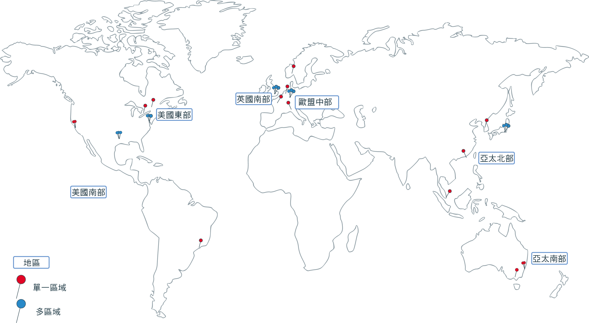

---

copyright:
  years: 2014, 2018
lastupdated: "2018-12-05"

---

{:new_window: target="_blank"}
{:shortdesc: .shortdesc}
{:screen: .screen}
{:pre: .pre}
{:table: .aria-labeledby="caption"}
{:codeblock: .codeblock}
{:tip: .tip}
{:note: .note}
{:important: .important}
{:deprecated: .deprecated}
{:download: .download}

# 地區及區域
{: #regions-and-zones}

地區是您可部署應用程式、服務及其他 {{site.data.keyword.Bluemix}} 資源的特定地理位置。[{{site.data.keyword.Bluemix_notm}} 地區](#bluemix_regions)與 [{{site.data.keyword.containerlong}} 地區](#container_regions)不同。地區包含一個以上的區域，這些區域是實體資料中心，用於管理運算、網路和儲存空間資源以及管理服務和應用程式的相關散熱及電源。區域彼此隔離，以確保不會共用單一失敗點。
{:shortdesc}



_{{site.data.keyword.containerlong_notm}} 地區及區域_

{{site.data.keyword.Bluemix_notm}} 是在全球各地管理。{{site.data.keyword.Bluemix_notm}} 內的服務可能在全球提供，或在特定地區內提供。當您在 {{site.data.keyword.containerlong_notm}} 中建立 Kubernetes 叢集時，其資源會保留在您已部署叢集的地區。


您可以在每個支援的 {{site.data.keyword.containerlong_notm}} 地區建立標準叢集。免費叢集僅適用於選取地區。
{: note}

| {{site.data.keyword.containerlong_notm}} 地區 | 對應 {{site.data.keyword.Bluemix_notm}} 位置 |
| --- | --- |
|亞太地區北部（僅限標準叢集）| 東京 |
|亞太地區南部| 雪梨 |
|歐盟中部| 法蘭克福 |
|英國南部|倫敦|
|美國東部（僅限標準叢集）| 華盛頓特區 |
| 美國南部 | 達拉斯 |
{: caption="表格：支援的 Kubernetes 服務地區及對應的 IBM Cloud 位置。" caption-side="top"}

<br />


## {{site.data.keyword.Bluemix_notm}} 中的位置
{: #bluemix_regions}

您可以使用 {{site.data.keyword.Bluemix_notm}} 位置（也稱為地區），跨 {{site.data.keyword.Bluemix_notm}} 服務來組織資源。例如，您可以使用儲存在相同位置的 {{site.data.keyword.registryshort_notm}} 中的專用 Docker 映像檔，來建立 Kubernetes 叢集。
{:shortdesc}

若要檢查您目前所在的 {{site.data.keyword.Bluemix_notm}} 位置，請執行 `ibmcloud info`，並檢閱**地區**欄位。

{{site.data.keyword.Bluemix_notm}} 位置可以藉由在登入時指定地區 API 端點來存取。如果您未指定地區端點，則會將您自動登入最接近的地區。

例如，您可以使用下列指令來登入 {{site.data.keyword.Bluemix_notm}} 地區 API 端點：

  * 達拉斯
      ```
      ibmcloud login -a api.ng.bluemix.net
      ```
      {: pre}

  * 華盛頓特區
      ```
      ibmcloud login -a api.us-east.bluemix.net
      ```
      {: pre}

  * 雪梨及東京
      ```
      ibmcloud login -a api.au-syd.bluemix.net
      ```
      {: pre}

  * 法蘭克福
      ```
      ibmcloud login -a api.eu-de.bluemix.net
      ```
      {: pre}

  * 倫敦
      ```
      ibmcloud login -a api.eu-gb.bluemix.net
      ```
      {: pre}

<br />


## {{site.data.keyword.containerlong_notm}} 中的地區
{: #container_regions}

透過使用 {{site.data.keyword.containerlong_notm}} 地區，您可以在您登入的 {{site.data.keyword.Bluemix_notm}} 地區以外的地區建立或存取 Kubernetes 叢集。{{site.data.keyword.containerlong_notm}} 地區端點特指 {{site.data.keyword.containerlong_notm}}，而不是 {{site.data.keyword.Bluemix_notm}} 整體。
{:shortdesc}

您可以在每個支援的 {{site.data.keyword.containerlong_notm}} 地區建立標準叢集。免費叢集僅適用於選取地區。
{: note}

支援的 {{site.data.keyword.containerlong_notm}} 地區：
  * 亞太地區北部（僅限標準叢集）
  * 亞太地區南部
  * 歐盟中部
  * 英國南部
  * 美國東部（僅限標準叢集）
  * 美國南部

您可以透過某個廣域端點 `https://containers.bluemix.net/v1` 來存取 {{site.data.keyword.containerlong_notm}}。
* 若要檢查您目前所在的 {{site.data.keyword.containerlong_notm}} 地區，請執行 `ibmcloud ks region`。
* 若要擷取可用地區及其端點的清單，請執行 `ibmcloud ks regions`。

若要使用 API 搭配廣域端點，請在您的所有要求中，在 `X-Region` 標頭傳遞地區名稱。
{: tip}

### 登入不同的 {{site.data.keyword.containerlong_notm}} 地區
{: #container_login_endpoints}

您可以使用 {{site.data.keyword.containerlong_notm}} CLI 來變更地區。
{:shortdesc}

您可能因為下列原因而想要登入另一個 {{site.data.keyword.containerlong_notm}} 地區：
  * 您已在其中一個地區中建立 {{site.data.keyword.Bluemix_notm}} 服務或專用 Docker 映像檔，並且想要在另一個地區中將它們與 {{site.data.keyword.containerlong_notm}} 搭配使用。
  * 您要在與您登入的預設 {{site.data.keyword.Bluemix_notm}} 地區不同的地區中存取叢集。

若要快速切換地區，請執行 [`ibmcloud ks region-set`](cs_cli_reference.html#cs_region-set)。

### 使用 {{site.data.keyword.containerlong_notm}} API 指令
{: #containers_api}

若要與 {{site.data.keyword.containerlong_notm}} API 互動，請輸入指令類型，並在廣域端點附加 `/v1/command`。
{:shortdesc}

`GET /clusters` API 的範例：
  ```
  GET https://containers.bluemix.net/v1/clusters
  ```
  {: codeblock}

</br>

若要使用 API 搭配廣域端點，請在您的所有要求中，在 `X-Region` 標頭傳遞地區名稱。若要列出可用的地區，請執行 `ibmcloud ks regions`。
{: tip}

若要檢視 API 指令的文件，請檢視 [https://containers.bluemix.net/swagger-api/](https://containers.bluemix.net/swagger-api/)。

## {{site.data.keyword.containerlong_notm}} 中的區域
{: #zones}

區域是指 {{site.data.keyword.Bluemix_notm}} 地區內可用的實體資料中心。地區是組織區域的概念工具，可包括不同國家/地區中的區域（資料中心）。下表依地區顯示可用的區域。
{:shortdesc}

* **多區域都會城市**：叢集裡在多區域都會城市中建立的工作者節點可以分散到各區域。此外，如果您在多區域都會城市中建立 Kubernetes 1.10 版或更新版本的叢集，則高可用性主節點會分散在各區域之中。
* **單一區域城市**：叢集裡在單一區域城市中建立的工作者節點都會保留在某個區域中。您無法將工作者節點分散到多個區域。高可用性主節點在個別主機上包括三個抄本，但不會分散在各區域之中。

<table summary="此表格顯示依地區可用的區域。列應該從左到右閱讀，第一欄為地區、第二欄為多區域都會城市，而第三欄為單一區域城市。">
<caption>依地區可用的單一及多區域。</caption>
  <thead>
  <th>地區</th>
  <th>多區域都會城市</th>
  <th>單一區域城市</th>
  </thead>
  <tbody>
    <tr>
      <td>亞太地區北部</td>
      <td>東京：tok02、tok04、tok05</td>
      <td><p>清奈：che01</p>
      <p>中華人民共和國香港特別行政區：hkg02</p>
      <p>首爾：seo01</p>
      <p>新加坡：sng01</p></td>
    </tr>
    <tr>
      <td>亞太地區南部</td>
      <td>無</td>
      <td><p>雪梨：syd01、syd04</p>
      <p>墨爾本：mel01</p></td>
    </tr>
    <tr>
      <td>歐盟中部</td>
      <td>法蘭克福：fra02、fra04、fra05</td>
      <td><p>阿姆斯特丹：ams03</p>
      <p>米蘭：mil01</p>
      <p>奧斯陸：osl01</p>
      <p>巴黎：par01</p>
      </td>
    </tr>
    <tr>
      <td>英國南部</td>
      <td>倫敦：lon04、lon05、lon06 **附註**：lon05 會取代 lon02。新叢集必須使用 lon05，而且只有 lon05 支援高可用性主節點分散在各區域之中。</td>
      <td></td>
    </tr>
    <tr>
      <td>美國東部</td>
      <td>華盛頓特區：wdc04、wdc06、wdc07</td>
      <td><p>蒙特婁：mon01</p>
      <p>多倫多：tor01</p></td>
    </tr>
    <tr>
      <td>美國南部</td>
      <td>達拉斯：dal10、dal12、dal13</td>
      <td><p>聖荷西：sjc03、sjc04</p><p>聖保羅：sao01</p></td>
    </tr>
  </tbody>
</table>

### 單一區域叢集
{: #single_zone}

在單一區域叢集中，叢集的資源會保留在已部署叢集的區域中。下圖強調顯示單一區域叢集元件在美國東部地區範例內的關係：


_瞭解單一區域叢集資源所在的位置。_

1.  叢集的資源（包括主節點及工作者節點）位於您已部署叢集的相同區域。當您起始本端容器編排動作（例如 `kubectl` 指令）時，會在相同區域內的主節點與工作者節點之間交換資訊。

2.  如果您已設定其他叢集資源（例如，儲存空間、網路、運算或在 Pod 執行的應用程式），則資源及其資料會保留在您已部署叢集的區域。

3.  當您起始叢集管理動作（例如，使用 `ibmcloud ks` 指令）時，會透過地區端點遞送叢集的基本資訊（例如名稱、ID、使用者、指令）。

### 多區域叢集
{: #multizone}

在多區域叢集中，主節點部署於具有多區域功能的區域中，而且您的叢集資源會分散到多個區域。

1.  工作者節點會分散到某個地區中的多個區域，以提供叢集的更多可用性。主節點會保留在您已部署叢集的相同具有多區域功能的區域中。當您起始本端容器編排動作（例如 `kubectl` 指令）時，會透過地區端點在主節點與工作者節點之間交換資訊。

2.  其他叢集資源（例如儲存空間、網路、運算或在 Pod 執行的應用程式）在部署至多區域叢集裡各區域的方式會不同。如需相關資訊，請檢閱以下主題：
    * 在多區域叢集裡設定[檔案儲存空間](cs_storage_file.html#add_file)及[區塊儲存空間](cs_storage_block.html#add_block)
    * [在多區域叢集裡使用 LoadBalancer 服務來啟用應用程式的公用或專用存取](cs_loadbalancer.html#multi_zone_config)
    * [使用 Ingress 來管理網路資料流量](cs_ingress.html#planning)
    * [增加應用程式的可用性](cs_app.html#increase_availability)

3.  當您起始叢集管理動作（例如，使用 [`ibmcloud ks` 指令](cs_cli_reference.html#cs_cli_reference)）時，會透過地區端點遞送叢集的基本資訊（例如名稱、ID、使用者、指令）。
