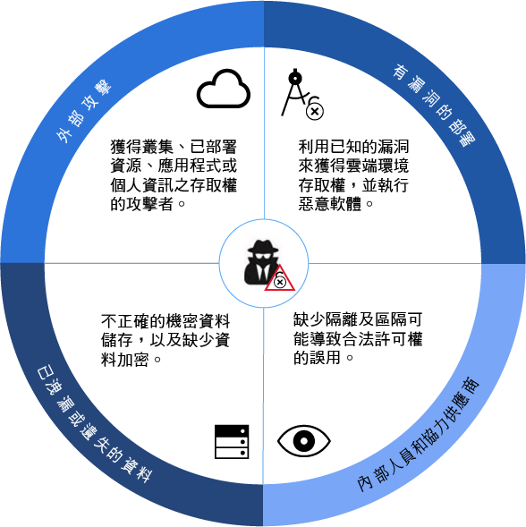
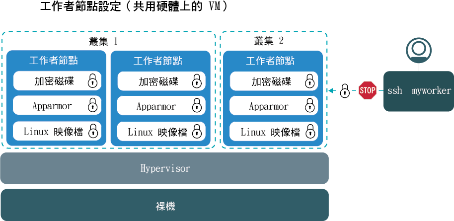
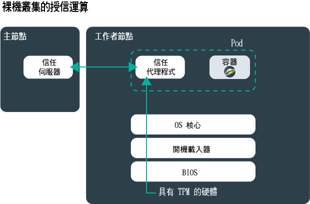
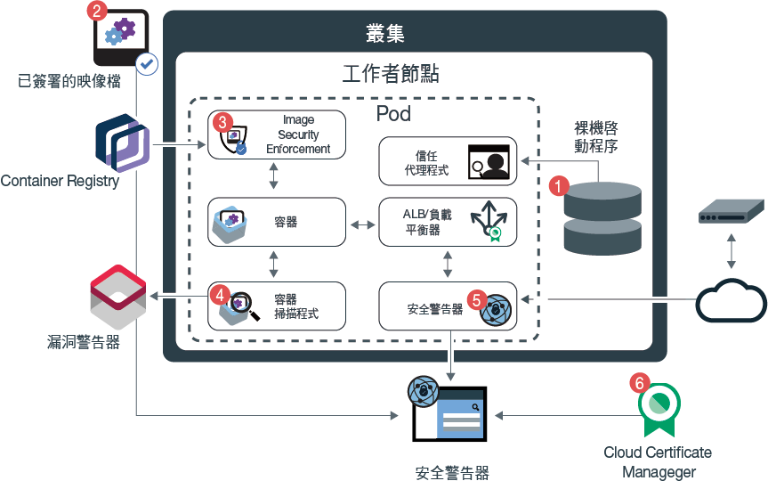
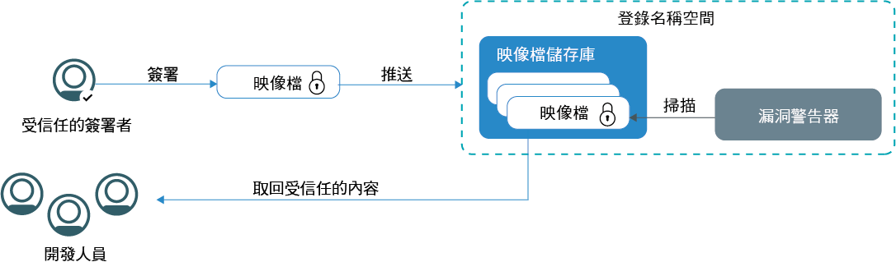
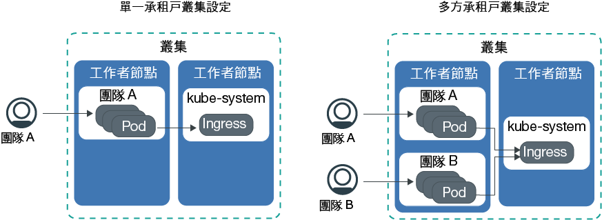

---

copyright:
  years: 2014, 2019
lastupdated: "2019-06-05"

keywords: kubernetes, iks

subcollection: containers

---

{:new_window: target="_blank"}
{:shortdesc: .shortdesc}
{:screen: .screen}
{:pre: .pre}
{:table: .aria-labeledby="caption"}
{:codeblock: .codeblock}
{:tip: .tip}
{:note: .note}
{:important: .important}
{:deprecated: .deprecated}
{:download: .download}
{:preview: .preview}

# {{site.data.keyword.containerlong_notm}} 的安全
{: #security}

您可以在 {{site.data.keyword.containerlong}} 中使用內建安全特性，以進行風險分析及安全保護。這些特性可協助您保護 Kubernetes 叢集基礎架構及網路通訊、隔離運算資源，以及確保基礎架構元件和容器部署之間的安全規範。
{: shortdesc}

## 叢集安全威脅概觀
{: #threats}

若要保護叢集免於受損，您必須瞭解叢集的潛在安全威脅，以及可為減少漏洞曝光所執行的作業。
{: shortdesc}

在過去幾年，雲端安全以及保護系統、基礎架構和資料免受攻擊變得非常重要，因為公司會持續將其工作負載移至公用雲端。叢集由數個元件組成，而且每一個元件都可能讓您的環境面臨惡意攻擊的風險。若要保護叢集免於這些安全威脅，您必須確定套用最新的 {{site.data.keyword.containerlong_notm}}，以及所有叢集元件中的 Kubernetes 安全特性和更新。

這些元件包括：
- [Kubernetes API 伺服器及 etcd 資料儲存庫](#apiserver)
- [工作者節點](#workernodes)
- [網路](#network)
- [持續性儲存空間](#storage)
- [監視及記載](#monitoring_logging)
- [容器映像檔及登錄](#images_registry)
- [容器隔離及安全](#container)
- [個人資訊](#pi)

 

## Kubernetes API 伺服器及 etcd
{: #apiserver}

Kubernetes API 伺服器及 etcd 是在 Kubernetes 主節點中執行的最容易遭到攻擊的元件。如果未獲授權的使用者或系統可以存取您的 Kubernetes API 伺服器，則使用者或系統可以變更設定、操作或控制您的叢集（這會讓您的叢集面臨惡意攻擊的風險）。
{: shortdesc}

若要保護 Kubernetes API 伺服器及 etcd 資料儲存庫，您必須保護及限制對人工使用者及 Kubernetes 服務帳戶之 Kubernetes API 伺服器的存取權。

**如何授與對 Kubernetes API 伺服器的存取權？**   依預設，Kubernetes 需要每個要求都先經過數個階段，才能授與對 API 伺服器的存取權：

<ol><li><strong>鑑別：</strong>驗證已登錄使用者或服務帳戶的身分。</li><li><strong>授權：</strong>限制已鑑別使用者及服務帳戶的許可權，確保他們只能存取及操作您要他們使用的叢集元件。</li><li><strong>許可控制：</strong>先驗證或改變要求，再由 Kubernetes API 伺服器進行處理。許多 Kubernetes 特性都需要有許可控制器，才能適當地運作。</li></ol>

**{{site.data.keyword.containerlong_notm}} 要怎麼做才能保護 Kubernetes API 伺服器和 etcd 資料儲存庫？**  
下圖顯示預設叢集安全設定，用於處理 Kubernetes 主節點與工作者節點之間的鑑別、授權、許可控制及安全連線功能。

<table>
<caption>Kubernetes API 伺服器及 etcd 安全</caption>
  <thead>
  <th>安全特性</th>
  <th>說明</th>
  </thead>
  <tbody>
    <tr>
      <td>完整受管理及專用的 Kubernetes 主節點</td>
      <td>
{{site.data.keyword.containerlong_notm}} 中的每個 Kubernetes 叢集都是由 IBM 透過 IBM 擁有的 IBM Cloud 基礎架構 (SoftLayer) 帳戶所管理的專用 Kubernetes 主節點予以控制。Kubernetes 主節點已設定下列未與其他 IBM 客戶共用的專用元件。

        <ul><li><strong>etcd data store：</strong>儲存叢集的所有 Kubernetes 資源（例如`服務`、`部署`及 `Pod`）。Kubernetes `ConfigMaps` 及 `Secrets` 是儲存為鍵值組的應用程式資料，因此，Pod 中執行的應用程式可以使用它們。etcd 中的資料會儲存在 Kubernetes 主節點的本端磁碟上，且會備份至 {{site.data.keyword.cos_full_notm}}。資料是在傳送至 {{site.data.keyword.cos_full_notm}} 期間和靜止時加密。您可以選擇在 Kubernetes 主節點的本端磁碟上針對 etcd 資料啟用加密，方法是針對叢集[啟用 {{site.data.keyword.keymanagementservicelong_notm}} 加密](/docs/containers?topic=containers-encryption#encryption)。執行舊版 Kubernetes 之叢集的 etcd 資料會儲存在由 IBM 管理的已加密磁碟上，並且每日進行備份。當 etcd 資料傳送至 Pod 時，會透過 TLS 將資料加密，以確保資料保護及完整性。</li>
          <li><strong>kube-apiserver：</strong>作為從工作者節點到 Kubernetes 主節點的所有叢集管理要求的主要進入點。kube-apiserver 會驗證及處理要求，並且可以讀取及寫入 etcd 資料儲存庫。</li>
          <li><strong>kube-scheduler：</strong>考量容量及效能需求、軟硬體原則限制、反親緣性規格及工作負載需求，以決定要在何處部署 Pod。如果找不到符合需求的工作者節點，則不會在叢集裡部署 Pod。</li>
          <li><strong>kube-controller-manager：</strong>負責監視抄本集，以及建立對應的 Pod 來達到所指定的狀態。</li>
          <li><strong>OpenVPN：</strong> {{site.data.keyword.containerlong_notm}} 特定元件，提供所有 Kubernetes 主節點與工作者節點的通訊的安全網路連線功能。Kubernetes 主節點與工作者節點的通訊是由使用者所起始，並包括 <code>kubectl</code> 指令（例如 <code>logs</code>、<code>attach</code>、<code>exec</code> 及 <code>top</code>）。</li></ul></td>
    </tr>
    <tr>
    <td>由 IBM Site Reliability Engineer (SRE) 持續監視</td>
    <td>IBM Site Reliability Engineer (SRE) 會持續監視 Kubernetes 主節點（包括所有主節點元件、運算、網路及儲存空間資源）。SRE 會套用最新的安全標準、偵測並重新修補惡意活動，並且努力確保 {{site.data.keyword.containerlong_notm}} 的可靠性及可用性。</td>
    </tr>
    <tr>
      <td>透過 TLS 的安全通訊</td>
      <td>若要使用 {{site.data.keyword.containerlong_notm}}，您必須使用認證向服務鑑別。在鑑別您時，{{site.data.keyword.containerlong_notm}} 會產生 TLS 憑證，以加密往返於 Kubernetes API 伺服器及 etcd 資料儲存庫的通訊，確保工作者節點與 Kubernetes 主節點之間的安全端對端通訊。這些憑證絕不會在叢集或 Kubernetes 主節點元件之間共用。</td>
    </tr>
    <tr>
      <td>與工作者節點的 OpenVPN 連線功能</td>
      <td>雖然 Kubernetes 會使用 <code>https</code> 通訊協定來保護 Kubernetes 主節點與工作者節點之間的通訊，但是預設不會提供工作者節點的鑑別。為了保護此通訊，{{site.data.keyword.containerlong_notm}} 會在建立叢集時自動設定 Kubernetes 主節點與工作者節點之間的 OpenVPN 連線。</td>
    </tr>
    <tr>
      <td>精細存取控制</td>
      <td>當您作為帳戶管理者時，可以使用 {{site.data.keyword.Bluemix_notm}} Identity and Access Management (IAM) 來[授與其他使用者對 {{site.data.keyword.containerlong_notm}} 的存取權](/docs/containers?topic=containers-users#users)。{{site.data.keyword.Bluemix_notm}} IAM 提供與 {{site.data.keyword.Bluemix_notm}} 平台、{{site.data.keyword.containerlong_notm}} 及帳戶中所有資源的安全鑑別。設定適當的使用者角色及許可權，是限制誰可以存取您的資源以及限制使用者可在誤用合法許可權時執行之損壞的關鍵。  您可以從下列預先定義的使用者角色中進行選取，這些角色決定使用者可以執行的動作集：<ul><li><strong>平台角色：</strong>決定使用者可在 {{site.data.keyword.containerlong_notm}} 中執行的叢集和工作者節點相關動作。</li><li><strong>基礎架構角色：</strong>決定用來訂購、更新或移除基礎架構資源（例如工作者節點、VLAN 或子網路）的許可權。</li><li><strong>Kubernetes RBAC 角色：</strong>決定使用者可在獲授權存取叢集時執行的 `kubectl` 指令。會自動設定叢集之 default 名稱空間的 RBAC 角色。若要在其他名稱空間中使用相同的 RBAC 角色，您可以複製 default 名稱空間中的 RBAC 角色。</li></ul>  您可以選擇[自訂基礎架構許可權](/docs/containers?topic=containers-users#infra_access)或[設定自己的 RBAC 角色](/docs/containers?topic=containers-users#rbac)來新增更精細的存取控制，而非使用預先定義的使用者角色。</td>
    </tr>
    <tr>
      <td>許可控制器</td>
      <td>針對 Kubernetes 及 {{site.data.keyword.containerlong_notm}} 中的特定特性，實作許可控制器。使用許可控制器，您可以在叢集裡設定原則，以判定是否允許叢集裡的特定動作。在此原則中，您可以指定使用者無法執行動作時的條件，即使此動作是您使用 RBAC 指派使用者的一般許可權的一部分。因此，在 Kubernetes API 伺服器處理 API 要求之前，許可控制器可以提供叢集的額外安全層。  建立叢集時，{{site.data.keyword.containerlong_notm}} 會在使用者無法變更的 Kubernetes 主節點中自動安裝下列 [Kubernetes 許可控制器 ](https://kubernetes.io/docs/admin/admission-controllers/)：<ul>
      <li>`DefaultTolerationSeconds`</li>
      <li>`DefaultStorageClass`</li>
      <li>`GenericAdmissionWebhook`</li>
      <li>`Initializers`（Kubernetes 1.13 或更低版本）</li>
      <li>`LimitRanger`</li>
      <li>`MutatingAdmissionWebhook`</li>
      <li>`NamespaceLifecycle`</li>
      <li>`NodeRestriction`（Kubernetes 1.14 或更高版本）</li>
      <li>`PersistentVolumeLabel`</li>
      <li>[`PodSecurityPolicy`](/docs/containers?topic=containers-psp#ibm_psp)</li>
      <li>[`Priority`](/docs/containers?topic=containers-pod_priority#pod_priority)（Kubernetes 1.11 或更高版本）</li>
      <li>`ResourceQuota`</li>
      <li>`ServiceAccount`</li>
      <li>`StorageObjectInUseProtection`</li>
      <li>`TaintNodesByCondition`（Kubernetes 1.12 或更高版本）</li>
      <li>`ValidatingAdmissionWebhook`</li></ul> 
      您可以[在叢集裡安裝您自己的許可控制器 ](https://kubernetes.io/docs/reference/access-authn-authz/extensible-admission-controllers/#admission-webhooks)，或從 {{site.data.keyword.containerlong_notm}} 提供的選用許可控制器中進行選擇：<ul><li><strong>[容器映像檔安全強制執行程式](/docs/services/Registry?topic=registry-security_enforce#security_enforce)：</strong>使用此許可控制器在叢集裡強制執行 Vulnerability Advisor 原則，以封鎖部署有漏洞的映像檔。</li></ul> 
如果您已手動安裝許可控制器，而且不想再使用它們，請務必完全予以移除。如果未完全移除許可控制器，它們可能會封鎖您要在叢集上執行的所有動作。
</td>
    </tr>
  </tbody>
</table>

**我還能做什麼來保護 Kubernetes API 伺服器？** 

如果叢集連接至專用和公用 VLAN，則 {{site.data.keyword.containerlong_notm}} 會透過公用服務端點自動設定叢集主節點與工作者節點之間的安全 OpenVPN 連線。如果已在 {{site.data.keyword.Bluemix_notm}} 帳戶中啟用 VRF，則可以容許叢集主節點與工作者節點改為使用專用服務端點以透過專用網路進行通訊。

服務端點決定工作者節點和叢集使用者如何存取叢集主節點。
* 僅限公用服務端點：透過公用網路建立叢集主節點與工作者節點之間的安全 OpenVPN 連線。叢集使用者可以公開地存取主節點。
* 公用和專用服務端點：通訊透過專用服務端點在專用網路上建立，並透過公用服務端點在公用網路上建立。透過公用端點遞送一半的工作者節點到主節點資料流量，並透過專用端點遞送另一半，可防範主節點到工作者節點通訊發生公用或專用網路的中斷。如果授權叢集使用者位於 {{site.data.keyword.Bluemix_notm}} 專用網路，或透過 VPN 連線連接至專用網路，則可以透過專用服務端點私下存取主節點。否則，授權叢集使用者可透過公用服務端點公開地存取主節點。
* 僅限專用服務端點：透過專用網路建立主節點與工作者節點之間的通訊。叢集使用者必須位於 {{site.data.keyword.Bluemix_notm}} 專用網路，或透過 VPN 連線連接至專用網路，才能存取主節點。

如需服務端點的相關資訊，請參閱[工作者節點到主節點的通訊以及使用者到主節點的通訊](/docs/containers?topic=containers-plan_clusters#workeruser-master)。

 

## 工作者節點
{: #workernodes}

工作者節點會執行構成您應用程式的部署及服務。當您管理公用雲端中的工作負載時，可以確定保護未獲授權的使用者或軟體無法存取、變更或監視您的應用程式。
{: shortdesc}

**誰擁有工作者節點？我要負責保護它的安全嗎？**   工作者節點的所有權取決於您建立的叢集類型。免費叢集裡的工作者節點會佈建至 IBM 所擁有的 IBM Cloud 基礎架構 (SoftLayer) 帳戶。您可以將應用程式部署至工作者節點，但無法變更設定，或在工作者節點上安裝額外軟體。因為容量有限且 {{site.data.keyword.containerlong_notm}} 特性有限，所以請不要在免費叢集上執行正式作業工作負載。請考量將標準叢集用於正式作業工作負載。

標準叢集裡的工作者節點會佈建至與您的公用或專用 {{site.data.keyword.Bluemix_notm}} 帳戶相關聯的 IBM Cloud 基礎架構 (SoftLayer) 帳戶。工作者節點為您的帳戶所專用，而且您負責向工作者節點要求及時更新，以確保工作者節點 OS 和 {{site.data.keyword.containerlong_notm}} 元件套用最新的安全更新及修補程式。

定期（例如每月）使用 `ibmcloud ks worker-update` [指令](/docs/containers?topic=containers-cli-plugin-kubernetes-service-cli#cs_worker_update)，將更新及安全修補程式部署至作業系統，以及更新 Kubernetes 版本。有可用的更新時，會在您檢視 {{site.data.keyword.Bluemix_notm}} 主控台或 CLI 中主節點及工作者節點的相關資訊時，使用如下指令通知您：`ibmcloud ks clusters` 或 `ibmcloud ks workers --cluster <cluster_name>`。IBM 會以包括最新安全修補程式的完整工作者節點映像檔形式提供工作者節點更新項目。若要套用更新項目，必須使用新的映像檔來重新映像化及重新載入工作者節點。重新載入工作者節點時，會自動替換 root 使用者的金鑰。
{: important}

**工作者節點設定是什麼樣子？** 
下圖顯示針對每個工作者節點所設定的元件，用於保護工作者節點免於惡意攻擊。

此映像檔不包括可確保進出工作者節點之端對端通訊安全的元件。如需相關資訊，請參閱[網路安全](#network)。
{: note}

<table>
<caption>工作者節點安全設定</caption>
  <thead>
  <th>安全特性</th>
  <th>說明</th>
  </thead>
  <tbody>
    <tr><td>符合 CIS 標準的 Linux 映像檔</td><td>每個工作者節點都已設定 Ubuntu 作業系統，而此作業系統實作 Center of Internet Security (CIS) 所發佈的基準性能測試。機器的使用者或擁有者無法變更 Ubuntu 作業系統。若要檢閱現行 Ubuntu 版本，請執行 <code>kibbectl get nodes -o wide</code>。IBM 與內部及外部安全顧問團隊合作，解決潛在的安全規範漏洞。作業系統的安全更新和修補程式是透過 {{site.data.keyword.containerlong_notm}} 所提供，並且必須由使用者安裝，才能確保工作者節點的安全。
{{site.data.keyword.containerlong_notm}}使用 Ubuntu Linux Kernel 來表示工作者節點。您可以根據 {{site.data.keyword.containerlong_notm}} 中的任何 Linux 發行套件，來執行容器。如果您的容器映像檔供應商支援要在 Ubuntu Linux 核心上執行的容器映像檔，請向容器映像檔供應商進行驗證。
</td></tr>
    <tr>
    <td>由 Site Reliability Engineer (SRE) 持續監視</td>
    <td>IBM Site Reliability Engineer (SRE) 會持續監視工作者節點上所安裝的 Linux 映像檔，以偵測漏洞及安全規範問題。為了解決漏洞，SRE 會建立工作者節點的安全修補程式及修正套件。請務必在這些修補程式可用時予以套用，以確保工作者節點及您在其上執行之應用程式的安全環境。</td>
    </tr>
    <tr>
  <td>運算隔離</td>
  <td>工作者節點專用於叢集，而且未管理其他叢集的工作負載。當您建立標準叢集時，可以選擇將工作者節點佈建為[實體機器（裸機）或虛擬機器](/docs/containers?topic=containers-planning_worker_nodes#planning_worker_nodes)，以在共用或專用實體硬體上執行。免費叢集裡的工作者節點會自動佈建為 IBM 所擁有的 IBM Cloud 基礎架構 (SoftLayer) 帳戶中的虛擬共用節點。</td>
</tr>
<tr>
<td>裸機的部署選項</td>
<td>如果您選擇要在裸機實體伺服器（而非虛擬伺服器實例）上佈建工作者節點，則您對運算主機可以有更多控制，例如記憶體或 CPU。此設定可免除虛擬機器 Hypervisor，該 Hypervisor 將實體資源配置給在主機上執行的虛擬機器。相反地，裸機的所有資源將由工作者節點專用，因此您不需要擔心「吵雜的鄰居」共用資源或降低效能。裸機伺服器為您所專用，其所有資源都可供叢集使用。</td>
</tr>
<tr>
  <td id="trusted_compute">授信運算的選項</td>
    <td>當您在支援「授信運算」的裸機上部署叢集時，可以[啟用信任](/docs/containers?topic=containers-cli-plugin-kubernetes-service-cli#cs_cluster_feature_enable)。在支援「授信運算」的叢集裡的每一個裸機工作者節點上（包括您新增至該叢集的未來節點），已啟用「授信平台模組 (TPM)」晶片。因此，啟用信任之後，以後您就無法針對叢集予以停用。信任伺服器會部署在主節點上，且信任代理程式會作為 Pod 部署在工作者節點上。當工作者節點啟動時，信任代理程式 Pod 會監視處理程序的每一個階段。
硬體位於信任伺服器根目錄，它使用 TPM 來傳送測量。TPM 會產生加密金鑰，用來保護整個處理程序中的測量資料的傳輸。信任代理程式會將啟動處理程序中的每一個元件的測量傳遞至信任伺服器：從與 TPM 硬體互動的 BIOS 韌體到開機載入器和 OS 核心。然後，授信代理程式會比較這些測量與授信伺服器中的期望值，以認證啟動是否有效。「授信運算」處理程序不會監視工作者節點中的其他 Pod，例如應用程式。

例如，如果未獲授權的使用者獲得對系統的存取權，並使用額外的邏輯來修改 OS 核心以收集資料，則信任代理程式會偵測到此變更，並將節點標示為不信任。使用「授信運算」，您可以驗證工作者節點免於遭到竄改。

    
「授信運算」可用於選取裸機的機型。例如，`mgXc` GPU 特性不支援「授信運算」。

    

</td>
  </tr>
    <tr>
  <td id="encrypted_disk">加密磁碟</td>
    <td>依預設，每個工作者節點都會佈建兩個本端 SSD、AES 256 位元加密資料分割區。第一個分割區包含用來啟動工作者節點且未加密的核心映像檔。第二個分割區會保留容器檔案系統，並使用 LUKS 加密金鑰解除鎖定。每個 Kubernetes 叢集裡的每一個工作者節點都有由 {{site.data.keyword.containerlong_notm}} 所管理的專屬唯一 LUKS 加密金鑰。當您建立叢集或將工作者節點新增至現有叢集時，會安全地取回金鑰，然後在解除鎖定已加密磁碟之後予以捨棄。
  
加密可能會影響磁碟 I/O 效能。對於需要高效能磁碟 I/O 的工作負載，請測試已啟用及停用加密的叢集，以協助您決定是否關閉加密。
</td>
      </tr>
    <tr>
      <td>專家級 AppArmor 原則</td>
      <td>每個工作者節點都已設定 [AppArmor ](https://wiki.ubuntu.com/AppArmor) 設定檔所強制執行的安全及存取原則，在引導期間會將這些設定檔載入至工作者節點。機器的使用者或擁有者無法變更 AppArmor 設定檔。</td>
    </tr>
    <tr>
      <td>已停用 SSH</td>
      <td>依預設，工作者節點上已停用 SSH 存取，以保護叢集免於惡意攻擊。停用 SSH 存取時，會透過 Kubernetes API 伺服器強制存取叢集。在叢集裡執行要求之前，Kubernetes API 伺服器需要針對鑑別、授權及許可控制模組中所設定的原則來檢查每個要求。  如果您具有標準叢集，且想要在工作者節點上安裝其他特性，則可以從 {{site.data.keyword.containerlong_notm}} 所提供的附加程式中進行選擇，或針對您要在每個工作者節點上執行的所有項目使用 [Kubernetes 常駐程式集 ](https://kubernetes.io/docs/concepts/workloads/controllers/daemonset/)。針對您必須執行的任何一次性動作，使用 [Kubernetes 工作 ](https://kubernetes.io/docs/concepts/workloads/controllers/jobs-run-to-completion/)。</td>
    </tr>
  </tbody>
  </table>

 

## 網路
{: #network}
保護公司網路的典型方式是設定防火牆，以及封鎖流向您應用程式的任何不想要的網路資料流量。雖然這仍然正確，但研究顯示，許多惡意攻擊都來自誤用其指派許可權的內部人員或授權使用者。
{: shortdesc}

若要保護您的網路，並限制使用者在獲得網路存取權時可能造成的損壞範圍，您必須確定盡量隔離工作負載，並且限制公開的應用程式及工作者節點數目。

**依預設，叢集允許哪些網路資料流量？** 
所有容器都受到[預先定義的 Calico 網路原則設定](/docs/containers?topic=containers-network_policies#default_policy)所保護，這些設定是在建立叢集期間配置於每個工作者節點上。依預設，所有工作者節點都允許所有出埠網路資料流量。而封鎖入埠網路資料流量，但下列少數埠除外：開啟讓 IBM 可以監視網路資料流量的埠，以及讓 IBM 自動安裝 Kubernetes 主節點的安全更新的埠。從 Kubernetes 主節點存取工作者節點的 Kubelet，受到 OpenVPN 通道的保護。如需相關資訊，請參閱 [{{site.data.keyword.containerlong_notm}} 架構](/docs/containers?topic=containers-ibm-cloud-kubernetes-service-technology)。

如果您要容許來自網際網路的送入網路資料流量，則必須使用 [NodePort 服務、網路負載平衡器 (NLB) 或 Ingress 應用程式負載平衡器 (ALB)](/docs/containers?topic=containers-cs_network_planning#external) 來公開您的應用程式。  

{: #network_segmentation}
**何謂網路區隔，以及如何針對叢集設定此功能？**   網路區隔說明將網路分成多個子網路的方式。您可以將可供組織中特定群組存取的應用程式及相關資料分組在一起。在某個子網路中執行的應用程式無法查看或存取另一個子網路中的應用程式。網路區隔也會限制提供給內部人員或協力廠商軟體的存取權，並且可以限制惡意活動的範圍。   

{{site.data.keyword.containerlong_notm}} 提供 IBM Cloud 基礎架構 (SoftLayer) VLAN，確保工作者節點上的優質網路效能及網路隔離。VLAN 會配置一組工作者節點及 Pod，就像它們已連接至相同的實體佈線。
VLAN 為您的 {{site.data.keyword.Bluemix_notm}} 帳戶所專用，不會在 IBM 客戶之間共用。如果您的叢集具有多個 VLAN、同一個 VLAN 上有多個子網路，或者是您具有多區域叢集，則必須為您的 IBM Cloud 基礎架構 (SoftLayer) 帳戶啟用[虛擬路由器功能 (VRF)](/docs/infrastructure/direct-link?topic=direct-link-overview-of-virtual-routing-and-forwarding-vrf-on-ibm-cloud#overview-of-virtual-routing-and-forwarding-vrf-on-ibm-cloud)，讓工作者節點可以在專用網路上彼此通訊。若要啟用 VRF，[請與 IBM Cloud 基礎架構 (SoftLayer) 客戶代表聯絡](/docs/infrastructure/direct-link?topic=direct-link-overview-of-virtual-routing-and-forwarding-vrf-on-ibm-cloud#how-you-can-initiate-the-conversion)。如果您無法或不想要啟用 VRF，請啟用 [VLAN Spanning](/docs/infrastructure/vlans?topic=vlans-vlan-spanning#vlan-spanning)。若要執行此動作，您需要**網路 > 管理網路 VLAN Spanning** [基礎架構許可權](/docs/containers?topic=containers-users#infra_access)，或者您可以要求帳戶擁有者啟用它。若要確認是否已啟用 VLAN Spanning，請使用 `ibmcloud ks vlan-spanning-get --region <region>` [指令](/docs/containers?topic=containers-cli-plugin-kubernetes-service-cli#cs_vlan_spanning_get)。

當您啟用帳戶的 VRF 或 VLAN Spanning 時，即會移除叢集的網路分段。

請檢閱下表，以查看在啟用帳戶的 VRF 或 VLAN Spanning 時如何達成網路分段的選項。

|安全特性|說明|
|-------|----------------------------------|
|使用 Calico 設定自訂網路原則|您可以使用內建 Calico 介面，針對工作者節點[設定自訂 Calico 網路原則](/docs/containers?topic=containers-network_policies#network_policies)。例如，您可以允許或封鎖特定網路介面、特定 Pod 或服務的網路資料流量。若要設定自訂網路原則，您必須[安裝 <code>calicoctl</code> CLI](/docs/containers?topic=containers-network_policies#cli_install)。|
|支援 IBM Cloud 基礎架構 (SoftLayer) 網路防火牆|{{site.data.keyword.containerlong_notm}} 與所有 [IBM Cloud 基礎架構 (SoftLayer) 防火牆供應項目 ](https://www.ibm.com/cloud-computing/bluemix/network-security) 相容。在「{{site.data.keyword.Bluemix_notm}} 公用」上，您可以使用自訂網路原則來設定防火牆，以提供標準叢集的專用網路安全，以及偵測及重新修補網路侵入。例如，您可能選擇設定 [Virtual Router Appliance](/docs/infrastructure/virtual-router-appliance?topic=virtual-router-appliance-about-the-vra) 作為防火牆，並且封鎖不想要的資料流量。當您設定防火牆時，[也必須開啟必要埠及 IP 位址](/docs/containers?topic=containers-firewall#firewall)（針對每一個地區），讓主節點與工作者節點可以進行通訊。|
{: caption="網路區隔選項" caption-side="top"}

**我還能做什麼來減少外部攻擊面？** 
您公開的應用程式或工作者節點越多，防止外部惡意攻擊所必須採取的步驟就越多。請檢閱下表，以找出如何將應用程式及工作者節點維持專用狀態的選項。

|安全特性|說明|
|-------|----------------------------------|
|限制已公開的應用程式數目|依預設，無法透過公用網際網路存取在叢集內執行的應用程式及服務。您可以選擇要將應用程式公開給大眾使用，還是想要應用程式及服務只能在專用網路上存取。當您將應用程式及服務維持為專用狀態時，可以運用內建安全特性，來確保工作者節點與 Pod 之間的安全通訊。若要將服務及應用程式公開給公用網際網路使用，您可以運用 [NLB 及 Ingress ALB 支援](/docs/containers?topic=containers-cs_network_planning#external)，安全地將服務設為可公開使用。請確定僅公開必要的服務，並定期重訪已公開的應用程式清單，以確保其仍然有效。|
|將工作者節點維持為專用狀態|當您建立叢集時，每個叢集都會自動連接至專用 VLAN。專用 VLAN 會判定指派給工作者節點的專用 IP 位址。您可以選擇只將工作者節點連接至專用 VLAN，來將它們維持為專用狀態。在您的 IBM Cloud 基礎架構 (SoftLayer) 帳戶中，免費叢集裡的專用 VLAN 是由 IBM 所管理，而標準叢集裡的專用 VLAN 是由您所管理。  <strong>注意：</strong> 請謹記，為了與 Kubernetes 主節點通訊，並且讓 {{site.data.keyword.containerlong_notm}} 可以正常運作，您必須配置與[特定 URL 及 IP 位址](/docs/containers?topic=containers-firewall#firewall_outbound)的公用連線功能。若要設定此公用連線功能，您可以在工作者節點的前面配置防火牆（例如 [Virtual Router Appliance](/docs/infrastructure/virtual-router-appliance?topic=virtual-router-appliance-about-the-vra)），並啟用流入這些 URL 及 IP 位址的網路資料流量。|
|限制與邊緣節點的公用網際網路連線功能|依預設，每個工作者節點都會配置成接受應用程式 Pod 及關聯的負載平衡器或 Ingress Pod。您可以將工作者節點標示為[邊緣節點](/docs/containers?topic=containers-edge#edge)，強制只將負載平衡器及 Ingress Pod 部署至這些工作者節點。此外，您可以[為工作者節點加上污點](/docs/containers?topic=containers-edge#edge_workloads)，讓應用程式 Pod 無法排定至邊緣節點。使用邊緣節點，您可以將網路工作負載隔離到叢集裡較少的工作者節點，並將叢集裡的其他工作者節點維持為專用狀態。|
{: caption="專用服務及工作者節點選項" caption-side="top"}

**如果我要將叢集連接至內部部署資料中心，該怎麼辨？** 
若要將工作者節點及應用程式連接至內部部署資料中心，您可以配置[具有 strongSwan 服務、Virtual Router Appliance 或 Fortigate Security Appliance 的 VPN IPSec 端點](/docs/containers?topic=containers-vpn#vpn)。

### LoadBalancer 及 Ingress 服務
{: #network_lb_ingress}

您可以使用網路負載平衡器 (NLB) 及 Ingress 應用程式負載平衡器 (ALB) 網路服務，將您的應用程式連接至公用網際網路或外部專用網路。請檢閱 NLB 及 ALB 的下列選用設定，您可以使用這些設定來符合後端應用程式安全需求，或在資料流量流經叢集時加密資料流量。
{: shortdesc}

**我可以使用安全群組來管理叢集的網路資料流量嗎？**   若要使用 NLB 及 Ingress ALB 服務，請使用 [Calico 及 Kubernetes 原則](/docs/containers?topic=containers-network_policies)來管理進出叢集的網路資料流量。請不要使用 IBM Cloud 基礎架構 (SoftLayer) [安全群組](/docs/infrastructure/security-groups?topic=security-groups-about-ibm-security-groups#about-ibm-security-groups)。IBM Cloud 基礎架構 (SoftLayer) 安全群組會套用至單一虛擬伺服器的網路介面，以過濾 Hypervisor 層次的資料流量。不過，安全群組不支援 VRRP 通訊協定，而 {{site.data.keyword.containerlong_notm}} 使用此通訊協定來管理 NLB IP 位址。如果沒有 VRRP 通訊協定可以管理 NLB IP，則 NLB 及 Ingress ALB 服務無法正常運作。如果您未使用 NLB 及 Ingress ALB 服務，並且想要將工作者節點與大眾完全隔離，則可以使用安全群組。

**如何保護叢集內的來源 IP？**   在 2.0 版 NLB 中，依預設會保留用戶端要求的來源 IP 位址。不過，在 1.0 版 NLB 及所有 Ingress ALB 中，不會保留用戶端要求的來源 IP 位址。將應用程式的用戶端要求傳送至叢集時，會將該要求遞送至 NLB 1.0 或 ALB 的 Pod。如果沒有應用程式 Pod 存在於與負載平衡器服務 Pod 相同的工作者節點上，則 NLB 或 ALB 會將要求轉遞至不同工作者節點上的應用程式 Pod。套件的來源 IP 位址會變更為應用程式 Pod 執行所在之工作者節點的公用 IP 位址。

例如，當應用程式伺服器必須套用安全及存取控制原則時，保留用戶端的 IP 是很有用的。若要保留用戶端要求的原始來源 IP 位址，您可以針對 [1.0 版 NLB](/docs/containers?topic=containers-loadbalancer#node_affinity_tolerations) 或 [Ingress ALB](/docs/containers?topic=containers-ingress#preserve_source_ip) 啟用來源 IP 保留。

**如何才能使用 TLS 加密資料流量？**   Ingress 服務會在資料傳輸流的兩個點提供 TLS 終止：
* [到達時解密套件](/docs/containers?topic=containers-ingress#public_inside_2)：依預設，Ingress ALB 會對叢集裡應用程式的 HTTP 網路資料流量進行負載平衡。若要同時對送入的 HTTPS 連線進行負載平衡，您可以配置 ALB 來解密網路資料流量，並將解密的要求轉遞至叢集裡公開的應用程式。如果您是使用 IBM 提供的 Ingress 子網域，則可以使用 IBM 提供的 TLS 憑證。如果您是使用自訂網域，則可以使用自己的 TLS 憑證來管理 TLS 終止。
* [套件在轉遞至上游應用程式之前會進行重新加密](/docs/containers?topic=containers-ingress_annotation#ssl-services)：在將資料流量轉遞至應用程式之前，ALB 會解密 HTTPS 要求。如果您的應用程式需要 HTTPS，並且需要在轉遞至這些上游應用程式之前加密資料流量，則可以使用 `ssl-services` 註釋。如果您的上游應用程式可以處理 TLS，則您可以選擇提供單向或交互鑑別 TLS 密碼中包含的憑證。

若要保護服務對服務通訊，您可以使用 [Istio 的相互 TLS 鑑別 ](https://istio.io/docs/concepts/security/mutual-tls/)。Istio 是一種開放程式碼服務，提供方法讓開發人員連接、保護、管理及監視雲端編排平台（例如 Kubernetes）上微服務的網路（也稱為服務網）。

 

## 持續性儲存空間
{: #storage}

如果您佈建持續性儲存空間以將資料儲存在叢集裡，則在將資料儲存至檔案共用或區塊儲存空間時，會自動加密資料，而不需要額外成本。加密包括 Snapshot 及已抄寫的儲存空間。
{: shortdesc}

如需如何加密特定儲存空間類型之資料的相關資訊，請參閱下列鏈結。
- [NFS 檔案儲存空間](/docs/infrastructure/FileStorage?topic=FileStorage-encryption#encryption)
- [區塊儲存空間](/docs/infrastructure/BlockStorage?topic=BlockStorage-encryption#block-storage-encryption-at-rest)  

您也可以使用 {{site.data.keyword.Bluemix_notm}} 資料庫服務（例如 [{{site.data.keyword.cloudant}} NoSQL DB](/docs/services/Cloudant?topic=cloudant-getting-started#getting-started)），將資料持續保存在叢集外部的受管理資料庫中。利用雲端資料庫服務所儲存的資料，可以跨越叢集、區域及地區進行存取。如需 IBM Cloudant NoSQL DB 的安全相關資訊，請參閱[服務文件](/docs/services/Cloudant/offerings?topic=cloudant-security#security)。

 

## 監視及記載
{: #monitoring_logging}

偵測叢集裡惡意攻擊的關鍵，在於適當監視及記載度量值以及叢集裡發生的所有事件。監視及記載也可協助您瞭解應用程式的叢集容量及資源可用性，因此您可以據此規劃來保護應用程式免於關閉。
{: shortdesc}

**IBM 是否會監視我的叢集？** 
IBM 會持續監視每個 Kubernetes 主節點，以控制及重新修補處理程序層次的「拒絕服務 (DOS)」攻擊。{{site.data.keyword.containerlong_notm}} 會自動掃描每個已部署 Kubernetes 主節點的節點，以尋找 Kubernetes 及 OS 特定安全修正程式中存在的漏洞。如果找到漏洞，{{site.data.keyword.containerlong_notm}} 會自動套用修正程式，並代表使用者來解決漏洞以確保主節點保護。  

**記載了哪些資訊？** 
對於標準叢集，您可以[設定日誌轉遞](/docs/containers?topic=containers-health#logging)，以將所有叢集相關事件從不同的來源轉遞至 {{site.data.keyword.loganalysislong_notm}} 或另一部外部伺服器，以過濾及分析日誌。這些來源包括來自下列項目的日誌：

- **容器**：寫入至 STDOUT 或 STDERR 的日誌。
- **應用程式**：寫入至應用程式內特定路徑的日誌。
- **工作者節點**：來自 Ubuntu 作業系統並傳送至 /var/log/syslog and /var/log/auth.log 的日誌。
- **Kubernetes API 伺服器**：會記載傳送至 Kubernetes API 伺服器的每個叢集相關動作以供審核，包括時間、使用者及受影響資源。如需相關資訊，請參閱 [Kubernetes 審核日誌 ](https://kubernetes.io/docs/tasks/debug-application-cluster/audit/)
- **Kubernetes 系統元件**：來自 `kubelet`、`kube-proxy` 以及在 `kube-system` 名稱空間中執行之其他元件的日誌。
- **Ingress**：管理進入叢集之網路資料流量的 Ingress 應用程式負載平衡器 (ALB) 的日誌。

您可以選擇要針對叢集記載的事件，以及要將日誌轉遞至其中的位置。若要偵測惡意活動，以及驗證叢集的性能，您必須持續分析日誌。

**如何監視叢集的性能及效能？** 
您可以監視叢集元件及運算資源（例如 CPU 及記憶體用量）來驗證叢集的容量及效能。{{site.data.keyword.containerlong_notm}} 會自動將標準叢集的度量值傳送至 {{site.data.keyword.monitoringlong}}，讓您可以[在 Grafana 中查看及分析](/docs/containers?topic=containers-health#view_metrics)。

您也可以使用內建工具（例如 {{site.data.keyword.containerlong_notm}} 詳細資料頁面）、Kubernetes 儀表板，或者[設定協力廠商整合](/docs/containers?topic=containers-supported_integrations#health_services)（例如 Prometheus、Sysdig、LogDNA、Weave Scope 及其他項目）。

若要設定主機型侵入偵測系統 (HIDS) 及安全事件日誌監視 (SELM)，請安裝協力廠商工具，其設計目的是監視叢集及容器化應用程式以偵測侵入或誤用，例如 [Twistlock ](https://www.twistlock.com/) 或 [Sysdig Falco 專案 ](https://sysdig.com/opensource/falco/)。Sysdig Falco 是一種獨立工具，因此，如果您選擇在叢集裡安裝 IBM 提供的 [Sysdig 附加程式](/docs/services/Monitoring-with-Sysdig/tutorials?topic=Sysdig-kubernetes_cluster#kubernetes_cluster)，則不會包括在內。  

**如何才能審核叢集裡所發生的事件？** 
您可以[在 {{site.data.keyword.containerlong_notm}} 叢集裡設定 {{site.data.keyword.cloudaccesstraillong}}](/docs/containers?topic=containers-at_events#at_events)。如需相關資訊，請檢視 [{{site.data.keyword.cloudaccesstrailshort}} 文件](/docs/services/cloud-activity-tracker?topic=cloud-activity-tracker-activity_tracker_ov#activity_tracker_ov)。

**我可以選擇哪些選項來啟用叢集裡的信任？**   依預設，{{site.data.keyword.containerlong_notm}} 提供叢集元件的許多特性，讓您可以在高度安全的環境中部署容器化應用程式。擴大叢集裡的信任層次，更確保在叢集內發生的事情是您預期會發生的情況。您可以使用各種方式在叢集裡實作信任，如下圖所示。

1.  **{{site.data.keyword.containerlong_notm}} 與授信運算**：在祼機工作者節點上，您可以啟用信任。信任代理程式會監視硬體啟動程序並報告任何變更，讓您可以驗證裸機工作者節點是否遭到竄改。使用「授信運算」，您可以將容器部署在已驗證的裸機主機上，以便您的工作負載可在授信硬體上執行。請注意，有些裸機機器（例如 GPU）不支援「授信運算」。[進一步瞭解「授信運算」如何運作](#trusted_compute)。

2.  **映像檔的內容信任**：在 {{site.data.keyword.registryshort_notm}} 中啟用內容信任，以確保映像檔的完整性。使用授信內容，您可以控制誰可以將映像檔簽署為授信映像檔。在授信簽章者將映像檔推送至您的登錄之後，使用者可以取回已簽署的內容，讓他們可以驗證映像檔的來源。如需相關資訊，請參閱[簽署授信內容的映像檔](/docs/services/Registry?topic=registry-registry_trustedcontent#registry_trustedcontent)。

3.  **Container Image Security Enforcement（測試版）**：使用自訂原則建立許可控制器，以便您可以在部署容器映像檔之前驗證它們。使用 Container Image Security Enforcement，您可以控制從何處部署映像檔，並確保它們符合 [Vulnerability Advisor](/docs/services/va?topic=va-va_index) 原則或[內容信任](/docs/services/Registry?topic=registry-registry_trustedcontent#registry_trustedcontent)需求。如果部署不符合您所設定的原則，則安全強制執行會阻止他人修改您的叢集。如需相關資訊，請參閱[強制執行容器映像檔安全（測試版）](/docs/services/Registry?topic=registry-security_enforce#security_enforce)。

4.  **容器漏洞掃描器**：依預設，Vulnerability Advisor 會掃描 {{site.data.keyword.registryshort_notm}} 中儲存的映像檔。若要檢查正在叢集裡執行之即時容器的狀態，您可以安裝容器掃描器。如需相關資訊，請參閱[安裝容器掃描器](/docs/services/va?topic=va-va_index#va_install_container_scanner)。

5.  **利用安全顧問進行網路分析（預覽）**：使用「{{site.data.keyword.Bluemix_notm}} 安全顧問」，您可以將來自 {{site.data.keyword.Bluemix_notm}} 服務（例如 Vulnerability Advisor 及 {{site.data.keyword.cloudcerts_short}}）的安全見解集中化。當您在叢集裡啟用「安全顧問」時，可以檢視可疑的送入及送出網路資料流量的相關報告。如需相關資訊，請參閱[網路分析](/docs/services/security-advisor?topic=security-advisor-setup-network#setup-network)。若要安裝，請參閱[針對 Kubernetes 叢集設定可疑用戶端及伺服器 IP 的監視](/docs/services/security-advisor?topic=security-advisor-setup-network#setup-network)。

6.  **{{site.data.keyword.cloudcerts_long_notm}}**：如果您要[搭配使用自訂網域與 TLS 來公開應用程式](/docs/containers?topic=containers-ingress#ingress_expose_public)，則可以在 {{site.data.keyword.cloudcerts_short}} 中儲存您的 TLS 憑證。在 {{site.data.keyword.security-advisor_short}} 儀表板中，也可以報告過期或即將到期的憑證。如需相關資訊，請參閱[開始使用 {{site.data.keyword.cloudcerts_short}}](/docs/services/certificate-manager?topic=certificate-manager-getting-started#getting-started)。

 

## 映像檔及登錄
{: #images_registry}

每個部署都是根據映像檔，而映像檔保留如何旋轉可執行應用程式之容器的指示。這些指示包括容器內部的作業系統，以及您要安裝的額外軟體。若要保護您的應用程式，您必須保護映像檔，並建立檢查以確保映像檔的完整性。
{: shortdesc}

**應該使用公用登錄還是專用登錄來儲存我的映像檔？**   公用登錄（例如 Docker Hub）可用來開始使用 Docker 映像檔及 Kubernetes，以在叢集裡建立第一個容器化應用程式。但是，如果是企業應用程式，請避免使用您不知道或不信任的登錄來保護叢集裡不會有惡意映像檔。將映像檔保留在專用登錄中（例如 {{site.data.keyword.registryshort_notm}} 中提供的專用登錄），並且務必控制對登錄的存取以及可推送的映像檔內容。

**為什麼檢查映像是否有漏洞至關重要？**   研究顯示，大部分的惡意攻擊會運用已知的軟體漏洞及弱系統配置。當您從映像檔部署容器時，容器會隨著您在映像檔中所描述的 OS 及額外二進位檔進行操作。就像保護虛擬或實體機器一樣，您必須刪除容器內所使用 OS 及二進位檔的已知漏洞，讓未獲授權的使用者無法存取應用程式。 

若要保護應用程式，請考慮處理下列領域：

1. **自動化建置處理程序並限制許可權**： 
自動化從原始碼建置容器映像檔的處理程序，以刪除原始碼變異和問題報告。將建置處理程序整合到 CI/CD 管線，即可確保只有在映像檔通過指定的安全檢查時，才會掃描及建置映像檔。若要避免開發人員將緊急修復程式套用至機密映像檔，請限制組織中有權存取建置處理程序的人員數目。

2. **在將映像檔部署至正式作業環境之前掃描映像檔：**  
請務必先掃描每個映像檔，再從中部署容器。例如，如果您使用 {{site.data.keyword.registryshort_notm}}，則將映像檔推送至名稱空間時，會自動掃描所有映像檔中的漏洞。如果發現漏洞，請考慮刪除漏洞，或封鎖這些映像檔的部署。請尋找組織中負責監視及移除漏洞的人員或團隊。取決於組織結構，此人員可能是安全、作業或部署團隊的一員。使用許可控制器（例如 [Container Image Security Enforcement](/docs/services/Registry?topic=registry-security_enforce#security_enforce)）來封鎖未通過漏洞檢查並啟用[內容信任](/docs/services/Registry?topic=registry-registry_trustedcontent#registry_trustedcontent)的映像檔部署，因此，授信簽章者必須先核准映像檔，才能將它們推送至容器登錄。

3. **定期掃描執行中容器：**  
即使您已從映像檔中部署通過漏洞檢查的容器，但一段時間之後，容器中執行的作業系統或二進位檔還是會有漏洞。若要保護您的應用程式，您必須確定定期掃描執行中容器，以偵測及重新修補漏洞。根據應用程式，若要新增額外安全，您可以建立一個處理程序，以在偵測到有漏洞的容器之後將它們記錄下來。

**{{site.data.keyword.registryshort_notm}} 如何才能協助我保護映像檔及部署處理程序？**  

<table>
<caption>映像檔及部署的安全</caption>
  <thead>
    <th>安全特性</th>
    <th>說明</th>
  </thead>
  <tbody>
    <tr>
      <td>{{site.data.keyword.registryshort_notm}} 中的安全 Docker 專用映像檔儲存庫</td>
      <td>在多方承租戶、高可用性並且由 IBM 所管理的可擴充專用映像檔登錄中，設定您自己的 Docker [映像檔登錄](/docs/services/Registry?topic=registry-getting-started#getting-started)。使用登錄，即可建置、安全地儲存 Docker 映像檔，並且在叢集使用者之間進行共用。
    進一步瞭解使用容器映像檔時如何[保護個人資訊安全](/docs/containers?topic=containers-security#pi)。</td>
    </tr>
    <tr>
      <td>僅推送具有授信內容的映像檔</td>
      <td>在映像檔儲存庫中啟用[內容信任](/docs/services/Registry?topic=registry-registry_trustedcontent#registry_trustedcontent)，以確保映像檔的完整性。使用授信內容，您可以控制誰可以將映像檔簽署為授信映像檔，並將映像檔推送至特定登錄名稱空間。在授信簽章者將映像檔推送至登錄名稱空間之後，使用者可以取回已簽署的內容，讓他們可以驗證映像檔的發佈者及完整性。</td>
    </tr>
    <tr>
      <td>自動漏洞掃描</td>
      <td>當您使用 {{site.data.keyword.registryshort_notm}} 時，可以運用 [Vulnerability Advisor](/docs/services/va?topic=va-va_index#va_registry_cli) 所提供的內建安全掃描。會自動掃描每個推送至您登錄名稱空間的映像檔，以對照已知 CentOS、Debian、Red Hat 及 Ubuntu 問題資料庫來掃描漏洞。如果發現漏洞，Vulnerability Advisor 會提供其解決方式的指示，以確保映像檔的完整性及安全。</td>
    </tr>
    <tr>
      <td>封鎖來自有漏洞映像檔或未授信使用者的部署</td>
      <td>使用自訂原則建立許可控制器，以在部署容器映像檔之前進行驗證。使用 [Container Image Security Enforcement](/docs/services/Registry?topic=registry-security_enforce#security_enforce)，您可以控制從何處部署映像檔，並確保它們符合 Vulnerability Advisor 原則或內容信任需求。如果部署不符合您所設定的原則，則許可控制器會封鎖叢集裡的部署。</td>
    </tr>
    <tr>
      <td>即時掃描容器</td>
      <td>為了能夠偵測執行中容器的漏洞，您可以安裝 [ibmcloud-container-scanner](/docs/services/va?topic=va-va_index#va_install_container_scanner)。與映像檔類似，您可以設定容器掃描器，來監視所有叢集名稱空間中的容器是否有漏洞。發現漏洞時，請更新來源映像檔，並且重新部署容器。</td>
    </tr>
  </tbody>
  </table>

 

## 容器隔離及安全
{: #container}

**何謂 Kubernetes 名稱空間以及應該使用它的原因？**   Kubernetes 名稱空間這種方式使用虛擬方式分割叢集，並隔離部署以及要將其工作負載移至叢集的使用者群組。使用名稱空間，您可以組織跨工作者節點的資源，以及跨多區域叢集裡區域的資源。  

每個叢集都已設定下列名稱空間：
- **default：**將所有項目部署至其中的名稱空間，不定義特定名稱空間。當您將「檢視者」、「編輯者」及「操作員」平台角色指派給使用者時，使用者可以存取 default 名稱空間，而非 `kube-system`、`ibm-system` 或 `ibm-cloud-cert` 名稱空間。
- **kube-system 及 ibm-system：**此名稱空間會保留 Kubernetes 及 {{site.data.keyword.containerlong_notm}} 管理叢集所需的部署及服務。叢集管理者可以使用此名稱空間，讓 Kubernetes 資源可跨名稱空間使用。
- **ibm-cloud-cert：**此名稱空間用於與 {{site.data.keyword.cloudcerts_long_notm}} 相關的資源。
- **kube-public：**所有使用者都可以存取此名稱空間，即使他們未經過叢集鑑別。將資源部署至此名稱空間時請注意，因為您可能會讓叢集面臨洩露風險。

叢集管理者可以在叢集裡設定其他名稱空間，並且根據他們的需求進行自訂。

針對您在叢集裡的每個名稱空間，請務必設定適當的 [RBAC 原則](/docs/containers?topic=containers-users#rbac)以限制存取此名稱空間、控制已部署的項目，以及設定適當的[資源配額 ](https://kubernetes.io/docs/concepts/policy/resource-quotas/) 及[限制範圍 ](https://kubernetes.io/docs/tasks/administer-cluster/memory-default-namespace/)。
{: important}

**應該設定單一承租戶還是多方承租戶叢集？**   在單一承租戶叢集裡，您會針對必須在叢集裡執行工作負載的每組人員建立一個叢集。通常，此團隊負責管理叢集，以及適當地配置與保護其安全。多方承租戶叢集會使用多個名稱空間來隔離承租戶及其工作負載。

單一承租戶及多方承租戶叢集會針對您的工作負載提供相同的隔離層次，而且成本大約相同。您適用的選項取決於必須在叢集裡執行工作負載的團隊數目、其服務需求及服務大小。

如果您有許多團隊所包含的複雜服務都必須控制叢集生命週期，則單一承租戶叢集可能是您的選擇。這包括自行決定叢集更新時間或可部署至叢集的資源。請謹記，管理叢集需要深度 Kubernetes 及基礎架構知識，才能確保部署的叢集容量及安全。  

多方承租戶叢集的優點在於您可以在不同的名稱空間中使用相同的服務名稱，而當您計劃使用名稱空間來區隔正式作業、暫置及開發環境時，這可能會派上用場。雖然多方承租戶叢集通常需要較少的人員來管理叢集，但在下列領域通常會增加更高的複雜性：

- **存取：**當您設定多個名稱空間時，必須為每一個名稱空間配置適當的 RBAC 原則，以確保資源隔離。RBAC 原則十分複雜，而且需要深度 Kubernetes 知識。
- **運算資源限制：**若要確保每個團隊都有所需的資源可以部署服務以及在叢集裡執行應用程式，您必須設定每個名稱空間的[資源配額](https://kubernetes.io/docs/concepts/policy/resource-quotas/)。資源配額決定名稱空間的部署限制項，例如您可以部署的 Kubernetes 資源數目，以及可供那些資源耗用的 CPU 和記憶體數量。設定配額之後，使用者必須在其部署中包括資源要求和限制。
- **共用叢集資源：**如果您在某個叢集裡執行多個承租戶，則會跨承租戶共用部分叢集資源（例如 Ingress 應用程式負載平衡器 (ALB) 或可用的可攜式 IP 位址）。如果較小的服務必須根據叢集裡的大型服務才能完成，則可能很難使用共用資源。
- **更新：**一次只能執行一個 Kubernetes API 版本。所有在叢集裡執行的應用程式都必須符合現行 Kubernetes API 版本，與擁有應用程式的團隊無關。當您要更新叢集時，必須確保所有團隊都準備好切換至新的 Kubernetes API 版本，以及更新應用程式來使用新的 Kubernetes API 版本。這也表示個別團隊對他們要執行的 Kubernetes API 版本的控制較低。
- **叢集設定變更：**如果您要變更叢集設定，或將工作負載重新排程至新的工作者節點，則必須跨承租戶推出這項變更。這項推出需要的核對及測試高於單一承租戶叢集。
- **通訊處理程序：**當您管理多個承租戶時，請考慮設定通訊處理程序，讓承租戶知道叢集發生問題時或需要其服務的更多資源時要前往的位置。此通訊處理程序也包括通知承租戶有關叢集設定或計劃更新中的所有變更。

**我還能做什麼來保護容器？**

|安全特性|說明|
|-------|----------------------------------|
|限制特許容器數目|在與其他處理程序隔離的運算主機上，容器會以不同的 Linux 處理程序執行。雖然使用者在容器內部有 root 存取權，但是會限制此使用者在容器外部的許可權來保護其他 Linux 處理程序、主機檔案系統及主機裝置。部分應用程式需要存取主機檔案系統或進階許可權，才能正常執行。您可以使用特許模式來執行容器，以容許容器具有與運算主機上執行之處理程序相同的存取權。
請謹記，特許容器若受損，可能會對叢集和基礎運算主機造成重大損壞。請嘗試限制以特許模式執行的容器數目，並考慮變更應用程式的配置，讓應用程式可以在沒有進階許可權的情況下執行。如果您要封鎖特許容器，使其無法在叢集裡執行，請考慮設定自訂 [Pod 安全原則](/docs/containers?topic=containers-psp#customize_psp)。
|
|設定容器的 CPU 及記憶體限制|每個容器都需要特定 CPU 及記憶體量，才能適當地開始及繼續執行。您可以定義容器的 [Kubernetes 資源要求及資源限制 ](https://kubernetes.io/docs/concepts/configuration/manage-compute-resources-container/)，以限制容器可使用的 CPU 及記憶體量。如果未設定 CPU 及記憶體的限制，而且容器忙碌，則容器會使用所有可用的資源。這項大量使用資源可能會影響工作者節點上沒有足夠資源可適當開始或執行的其他容器，並讓工作者節點面臨拒絕服務攻擊的風險。|
|將 OS 安全設定套用至 Pod|您可以將 [<code>securityContext</code> 區段 ](https://kubernetes.io/docs/tasks/configure-pod-container/security-context/) 新增至 Pod 部署，以將 Linux 特定安全設定套用至 Pod 或 Pod 內部的特定容器。安全設定包括控制在容器內部執行 Script 的使用者 ID 及群組 ID（例如進入點 Script），或擁有磁區裝載路徑的使用者 ID 及群組 ID。  <strong>提示：</strong>如果您要使用 <code>securityContext</code> 來設定 <code>runAsUser</code> 使用者 ID 或 <code>fsGroup</code> 群組 ID，請考慮在[建立持續性儲存空間](/docs/containers?topic=containers-block_storage#add_block)時使用區塊儲存空間。NFS 儲存空間不支援 <code>fsGroup</code>，而且必須在容器層次設定 <code>runAsUser</code>，而非 Pod 層次。|
|強制執行原則驅動鑑別|您可以將 Ingress 註釋新增至部署，以容許您控制對服務和 API 的存取。使用 {{site.data.keyword.appid_short_notm}} 和宣告式安全，即可確保使用者鑑別和記號驗證。|
{: caption="其他安全保護" caption-side="top"}

 

## 儲存個人資訊
{: #pi}

您負責確保 Kubernetes 資源及容器映像檔中的個人資訊安全。個人資訊包括您的姓名、地址、電話號碼、電子郵件位址，或可能識別、聯絡或找到您、您的客戶或其他人的其他資訊。
{: shortdesc}

<dl>
  <dt>使用 Kubernetes 密碼儲存個人資訊</dt>
  <dd>只將個人資訊儲存在 Kubernetes 資源中，這些資源設計來保留個人資訊。例如，請不要在 Kubernetes 名稱空間、部署、服務或配置對映的名稱中使用您的姓名。如需適當的保護與加密，請改為將個人資訊儲存在 <a href="/docs/containers?topic=containers-encryption#secrets">Kubernetes 密碼</a>中。</dd>

  <dt>使用 Kubernetes `imagePullSecret` 儲存映像檔登錄認證</dt>
  <dd>請不要將個人資訊儲存在容器映像檔或登錄名稱空間中。如需適當的保護與加密，請改為將登錄認證儲存在 <a href="/docs/containers?topic=containers-images#other">Kubernetes `imagePullSecrets`</a> 中，以及將其他個人資訊儲存在 <a href="/docs/containers?topic=containers-encryption#secrets">Kubernetes 密碼</a>中。請記住，如果個人資訊儲存在映像檔的上一層中，則刪除映像檔可能不足以刪除此個人資訊。</dd>
  </dl>

若要設定密碼的加密，請參閱[使用 {{site.data.keyword.keymanagementserviceshort}} 加密 Kubernetes 密碼](/docs/containers?topic=containers-encryption#keyprotect)。

在已啟用 SGX 的裸機工作者節點上，您可以使用 [{{site.data.keyword.datashield_short}}（測試版）服務](/docs/services/data-shield?topic=data-shield-getting-started#getting-started)來加密資料。與靜態資料及動態資料的加密方式類似，Fortanix Runtime Encryption 與 {{site.data.keyword.datashield_short}} 整合，可保護金鑰、資料及應用程式不受外部及內部威脅。威脅可能包括惡意的內部人員、雲端提供者、OS 層次駭客或網路侵入者。

## Kubernetes 安全性公告
{: #security_bulletins}

如果在 Kubernetes 中找到漏洞，則 Kubernetes 會在安全性公告中發行 CVE，以通知使用者並且說明使用者為補救漏洞必須採取的動作。影響 {{site.data.keyword.containerlong_notm}} 使用者或 {{site.data.keyword.Bluemix_notm}} 平台的 Kubernetes 安全性公告則會在 [{{site.data.keyword.Bluemix_notm}} 安全性公告](https://cloud.ibm.com/status?component=containers-kubernetes&selected=security)中發佈。

部分 CVE 需要 Kubernetes 版本的最新修補程式更新，您可以在 {{site.data.keyword.containerlong_notm}} 中的一般[叢集更新處理程序](/docs/containers?topic=containers-update#update)過程中安裝。請務必及時套用安全修補程式，以保護叢集不受惡意攻擊。如需安全修補程式中所含內容的相關資訊，請參閱[版本變更日誌](/docs/containers?topic=containers-changelog#changelog)。
