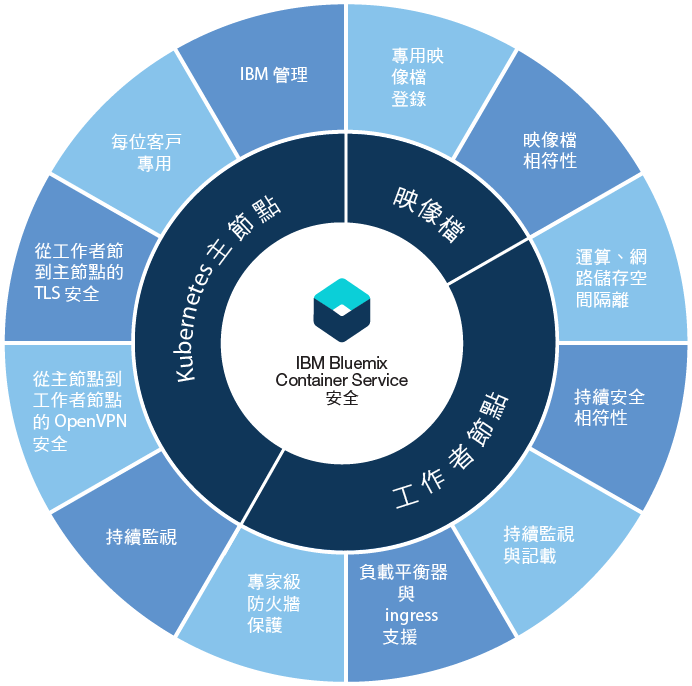

---

copyright:
  years: 2014, 2017
lastupdated: "2017-10-24"

---

{:new_window: target="_blank"}
{:shortdesc: .shortdesc}
{:screen: .screen}
{:pre: .pre}
{:table: .aria-labeledby="caption"}
{:codeblock: .codeblock}
{:tip: .tip}
{:download: .download}


# {{site.data.keyword.containerlong_notm}} 的安全
{: #cs_security}

您可以使用內建的安全特性，以進行風險分析及安全保護。這些特性可協助您保護叢集基礎架構及網路通訊、隔離運算資源，以及確保基礎架構元件和容器部署的安全相符性。
{: shortdesc}

<a href="https://console.bluemix.net/docs/api/content/containers/images/cs_security.png" ></a>


  <table summary="表格中的第一列跨這兩個直欄。其餘的列應該從左到右閱讀，第一欄為伺服器位置，第二欄則為要符合的 IP 位址。">
  <thead>
  <th colspan=2> {{site.data.keyword.containershort_notm}} 中的內建叢集安全設定</th>
  </thead>
  <tbody>
    <tr>
      <td>Kubernetes 主節點</td>
      <td>每一個叢集中的 Kubernetes 主節點都是由 IBM 管理，並且具備高可用性。它包括 {{site.data.keyword.containershort_notm}} 安全設定，可確保安全相符性及進出工作者節點的安全通訊。IBM 會視需要執行更新。專用 Kubernetes 主節點可集中控制及監視叢集中的所有 Kubernetes 資源。根據叢集中的部署需求及容量，Kubernetes 主節點會自動排定容器化應用程式，在可用的工作者節點之間進行部署。如需相關資訊，請參閱 [Kubernetes 主節點安全](#cs_security_master)。</td>
    </tr>
    <tr>
      <td>工作者節點</td>
      <td>容器部署於叢集專用的工作者節點，可確保 IBM 客戶的運算、網路及儲存空間隔離。{{site.data.keyword.containershort_notm}} 提供內建安全特性，讓工作者節點在專用及公用網路上保持安全，以及確保工作者節點的安全相符性。如需相關資訊，請參閱[工作者節點安全](#cs_security_worker)。</td>
     </tr>
     <tr>
      <td>映像檔</td>
      <td>身為叢集管理者，您可以在 {{site.data.keyword.registryshort_notm}} 中設定您自己的安全 Docker 映像檔儲存庫，您可以在其中儲存 Docker 映像檔並且在叢集使用者之間進行共用。為了確保安全容器部署，「漏洞警告器」會掃描專用登錄中的每個映像檔。「漏洞警告器」是 {{site.data.keyword.registryshort_notm}} 的元件，可掃描以尋找潛在漏洞、提出安全建議，並提供解決漏洞的指示。如需相關資訊，請參閱 [{{site.data.keyword.containershort_notm}} 中的映像檔安全](#cs_security_deployment)。</td>
    </tr>
  </tbody>
</table>

<br />


## Kubernetes 主節點
{: #cs_security_master}

檢閱內建 Kubernetes 主節點安全特性，此安全特性用來保護 Kubernetes 主節點，以及保護叢集網路通訊安全。
{: shortdesc}

<dl>
  <dt>完整受管理及專用的 Kubernetes 主節點</dt>
    <dd>{{site.data.keyword.containershort_notm}} 中的每個 Kubernetes 叢集都是 IBM 透過 IBM 擁有的 IBM Bluemix 基礎架構 (SoftLayer) 帳戶所管理的專用 Kubernetes 主節點予以控制。Kubernetes 主節點已設定下列未與其他 IBM 客戶共用的專用元件。<ul><li>etcd 資料儲存庫：儲存叢集的所有 Kubernetes 資源（例如「服務」、「部署」及 Pod）。Kubernetes ConfigMap 及 Secret 是儲存為金鑰值組的應用程式資料，因此，Pod 中執行的應用程式可以使用它們。傳送至 Pod 時，etcd 中的資料會儲存在 IBM 所管理並透過 TLS 加密的已加密磁碟中，以確保資料保護及完整性。</li>
    <li>kube-apiserver：提供為從工作者節點到 Kubernetes 主節點的所有要求的主要進入點。kube-apiserver 會驗證及處理要求，並且可以讀取及寫入 etcd 資料儲存庫。</li>
    <li>kube-scheduler：考量容量及效能需求、軟硬體原則限制、反親緣性規格及工作負載需求，以決定在何處部署 Pod。如果找不到符合需求的工作者節點，則不會在叢集中部署 Pod。</li>
    <li>kube-controller-manager：負責監視抄本集，以及建立對應的 Pod 來達到想要的狀態。</li>
    <li>OpenVPN：{{site.data.keyword.containershort_notm}} 特定元件，提供所有 Kubernetes 主節點與工作者節點的通訊的安全網路連線功能。</li></ul></dd>
  <dt>所有工作者節點與 Kubernetes 主節點的通訊的 TLS 安全網路連線功能</dt>
    <dd>為了保護與 Kubernetes 主節點的網路通訊安全，{{site.data.keyword.containershort_notm}} 會產生 TLS 憑證，以加密每個叢集的 kube-apiserver 及 etcd 資料儲存庫元件的進出通訊。這些憑證絕不會在叢集或 Kubernetes 主節點元件之間共用。</dd>
  <dt>所有 Kubernetes 主節點與工作者節點的通訊的 OpenVPN 安全網路連線功能</dt>
    <dd>雖然 Kubernetes 會使用 `https` 通訊協定來保護 Kubernetes 主節點與工作者節點之間的通訊，但是預設不會提供工作者節點的鑑別。為了保護此通訊，{{site.data.keyword.containershort_notm}} 會在建立叢集時自動設定 Kubernetes 主節點與工作者節點之間的 OpenVPN 連線。</dd>
  <dt>持續 Kubernetes 主節點網路監視</dt>
    <dd>IBM 會持續監視每個 Kubernetes 主節點，以控制及重新修補處理程序層次的「拒絕服務 (DOS)」攻擊。</dd>
  <dt>Kubernetes 主節點節點安全相符性</dt>
    <dd>{{site.data.keyword.containershort_notm}} 會自動掃描每個已部署 Kubernetes 主節點的節點，以尋找需要套用以確保主節點保護的 Kubernetes 及 OS 特定安全修正程式中存在的漏洞。如果找到漏洞，{{site.data.keyword.containershort_notm}} 會自動套用修正程式，並代表使用者來解決漏洞。</dd>
</dl>

<br />


## 工作者節點
{: #cs_security_worker}

檢閱內建的工作者節點安全特性，以保護工作者節點環境，以及確保資源、網路及儲存空間隔離。
{: shortdesc}

<dl>
  <dt>運算、網路及儲存空間基礎架構隔離</dt>
    <dd>當您建立叢集時，會將虛擬機器佈建為客戶 IBM Bluemix 基礎架構 (SoftLayer) 帳戶中的工作者節點，或由 IBM 將虛擬機器佈建為專用 IBM Bluemix 基礎架構 (SoftLayer) 帳戶中的工作者節點。工作者節點專用於叢集，而且未管理其他叢集的工作負載。</br> 每個 {{site.data.keyword.Bluemix_notm}} 帳戶都已設定 IBM Bluemix 基礎架構 (SoftLayer) VLAN，確保工作者節點上的優質網路效能及隔離。</br>若要持續保存叢集中的資料，您可以從 IBM Bluemix 基礎架構 (SoftLayer) 佈建專用 NFS 型檔案儲存空間，並運用該平台的內建資料安全特性。</dd>
  <dt>設定受保護的工作者節點</dt>
    <dd>每個工作者節點都設定了 Ubuntu 作業系統，且使用者無法變更。為了保護工作者節點的作業系統不會受到潛在攻擊，每個工作者節都會以 Linux iptables 規則所強制執行的專家級防火牆設定來進行配置。</br> 在 Kubernetes 上執行的所有容器都受到預先定義的 Calico 網路原則設定所保護，這些設定是在建立叢集期間，配置於每個工作者節點上。這項設定確保工作者節點與 Pod 之間的安全網路通訊。若要進一步限制容器可以在工作者節點上執行的動作，使用者可以選擇在工作者節點上配置 [AppArmor 原則 ](https://kubernetes.io/docs/tutorials/clusters/apparmor/)。</br> 依預設，工作者節點上會停用 root 使用者的 SSH 存取權。如果您要在工作者節點上安裝其他特性，則可以針對您要在每個工作者節點上執行的所有項目，使用 [Kubernetes 常駐程式集 ](https://kubernetes.io/docs/concepts/workloads/controllers/daemonset)，或是針對您必須執行的任何一次性動作，使用 [Kubernetes 工作 ](https://kubernetes.io/docs/concepts/workloads/controllers/jobs-run-to-completion/)。</dd>
  <dt>Kubernetes 工作者節點安全相符性</dt>
    <dd>IBM 與內部及外部安全顧問團隊合作，解決潛在的安全相符性漏洞。IBM 會維護對工作者節點的 SSH 存取權，以將更新項目及安全修補程式部署至作業系統。</br> <b>重要事項</b>：請定期重新啟動工作者節點，以確保安裝自動部署至作業系統的更新項目及安全修補程式。IBM 不會將您的工作者節點重新開機。</dd>
  <dt>支援 IBM Bluemix 基礎架構 (SoftLayer) 網路防火牆</dt>
    <dd>{{site.data.keyword.containershort_notm}} 與所有 [IBM Bluemix 基礎架構 (SoftLayer) 防火牆供應項目 ](https://www.ibm.com/cloud-computing/bluemix/network-security) 相容。在「{{site.data.keyword.Bluemix_notm}} 公用」上，您可以使用自訂網路原則來設定防火牆，以提供叢集的專用網路安全，以及偵測及重新修補網路侵入。例如，您可能選擇設定 [Vyatta ](https://knowledgelayer.softlayer.com/topic/vyatta-1) 作為防火牆，並且封鎖不想要的資料流量。當您設定防火牆時，[也必須開啟必要埠及 IP 位址](#opening_ports)（針對每一個地區），讓主節點與工作者節點可以進行通訊。在「{{site.data.keyword.Bluemix_notm}} 專用」上，防火牆、DataPower、Fortigate 及 DNS 已配置為標準專用環境部署的一部分。</dd>
  <dt>將服務維持為專用狀態，或選擇性地將服務及應用程式公開給公用網際網路使用</dt>
    <dd>您可以選擇將服務及應用程式維持為專用狀態，並運用本主題所述的內建安全特性，來確保工作者節點與 Pod 之間的安全通訊。若要將服務及應用程式公開給公用網際網路使用，您可以運用 Ingress 及負載平衡器支援，安全地將服務設為可公開使用。</dd>
  <dt>將工作者節點及應用程式安全地連接至內部部署資料中心</dt>
    <dd>您可以設定 Vyatta Gateway Appliance 或 Fortigate Appliance，以配置 IPSec VPN 端點，連接 Kubernetes 叢集與內部部署資料中心。透過加密通道，所有在 Kubernetes 叢集中執行的服務都可以安全地與內部部署應用程式進行通訊（例如使用者目錄、資料庫或大型主機）。如需相關資訊，請參閱[將叢集連接至內部部署資料中心 ](https://www.ibm.com/blogs/bluemix/2017/07/kubernetes-and-bluemix-container-based-workloads-part4/)。</dd>
  <dt>叢集活動的持續監視及記載</dt>
    <dd>對於標準叢集，{{site.data.keyword.containershort_notm}} 會記載並監視所有叢集相關事件，例如新增工作者節點、漸進式更新進度或容量使用資訊，這些事件也會傳送至 IBM Monitoring and Logging Service。</dd>
</dl>

### 在防火牆中開啟必要埠及 IP 位址
{: #opening_ports}

請檢閱下列狀況，您在下列狀況時可能需要在防火牆中開啟特定的埠和 IP 位址：
* 當已針對工作者節點設定防火牆，或是在 IBM Bluemix 基礎架構 (SoftLayer) 帳戶中自訂了防火牆設定時，打算容許 Kubernetes 主節點與工作者節點之間的通訊
* 打算從叢集外部存取負載平衡器或 Ingress 控制器
* 當公司網路原則阻止透過 Proxy 或防火牆存取公用網際網路端點時，打算從您的本端系統執行 `kubectl` 指令

  1.  記下叢集中所有工作者節點的公用 IP 位址。

      ```
      bx cs workers <cluster_name_or_id>
      ```
      {: pre}

  2.  在防火牆中，針對來自工作者節點的 OUTBOUND 連線，容許從來源工作者節點到 `<each_worker_node_publicIP>` 之目的地 TCP/UDP 埠範圍 20000-32767 及埠 443，以及下列 IP 位址和網路群組的送出網路資料流量。
      - **重要事項**：您必須容許對埠 443 的送出資料流量，以及地區內所有位置彼此之間的資料流量，以便平衡引導程序期間的負載。例如，如果您的叢集是在美國南部，您必須容許從埠 443 到 dal10 和 dal12 的資料流量，以及從 dal10 和 dal12 到彼此之間的資料流量。
      <p>
  <table summary="表格中的第一列跨這兩個直欄。其餘的列應該從左到右閱讀，第一欄為伺服器位置，第二欄則為要符合的 IP 位址。">
  <thead>
      <th>地區</th>
      <th>位置</th>
      <th>IP 位址</th>
      </thead>
    <tbody>
      <tr>
         <td>亞太地區南部</td>
         <td>mel01<br>syd01</td>
         <td><code>168.1.97.67</code><br><code>168.1.8.195</code></td>
      </tr>
      <tr>
         <td>歐盟中部</td>
         <td>ams03<br>fra02</td>
         <td><code>169.50.169.110</code><br><code>169.50.56.174</code></td>
        </tr>
      <tr>
        <td>英國南部</td>
        <td>lon02<br>lon04</td>
        <td><code>159.122.242.78</code><br><code>158.175.65.170</code></td>
      </tr>
      <tr>
        <td>美國東部</td>
         <td>wdc06<br>wdc07</td>
         <td><code>169.60.73.142</code><br><code>169.61.83.62</code></td>
      </tr>
      <tr>
        <td>美國南部</td>
        <td>dal10<br>dal12<br>dal13</td>
        <td><code>169.46.7.238</code><br><code>169.47.70.10</code><br><code>169.60.128.2</code></td>
      </tr>
      </tbody>
    </table>
</p>

  3.  容許從工作者節點到 {{site.data.keyword.registrylong_notm}} 的送出網路資料流量：
      - `TCP port 443 FROM <each_worker_node_publicIP> TO <registry_publicIP>`
      - 將 <em>&lt;registry_publicIP&gt;</em> 取代為您要容許資料流量的登錄地區的所有位址：
        <p>      
<table summary="表格中的第一列跨這兩個直欄。其餘的列應該從左到右閱讀，第一欄為伺服器位置，第二欄則為要符合的 IP 位址。">
  <thead>
        <th colspan=2> 登錄 IP 位址</th>
        </thead>
      <tbody>
        <tr>
          <td>registry.au-syd.bluemix.net</td>
          <td><code>168.1.45.160/27</code></br><code>168.1.139.32/27</code></td>
        </tr>
        <tr>
          <td>registry.eu-de.bluemix.net</td>
          <td><code>169.50.56.144/28</code></br><code>159.8.73.80/28</code></td>
         </tr>
         <tr>
          <td>registry.eu-gb.bluemix.net</td>
          <td><code>159.8.188.160/27</code></br><code>169.50.153.64/27</code></td>
         </tr>
         <tr>
          <td>registry.ng.bluemix.net</td>
          <td><code>169.55.39.112/28</code></br><code>169.46.9.0/27</code></br><code>169.55.211.0/27</code></td>
         </tr>
        </tbody>
      </table>
</p>

  4.  選用項目：容許從工作者節點到 {{site.data.keyword.monitoringlong_notm}} 及 {{site.data.keyword.loganalysislong_notm}} 服務的送出網路資料流量：
      - `TCP port 443, port 9095 FROM <each_worker_node_publicIP> TO <monitoring_publicIP>`
      - 將 <em>&lt;monitoring_publicIP&gt;</em> 取代為您要容許資料流量的監視地區的所有位址：
        <p><table summary="表格中的第一列跨這兩個直欄。其餘的列應該從左到右閱讀，第一欄為伺服器位置，第二欄則為要符合的 IP 位址。">
  <thead>
        <th colspan=2> 監視公用 IP 位址</th>
        </thead>
      <tbody>
        <tr>
         <td>metrics.eu-de.bluemix.net</td>
         <td><code>159.122.78.136/29</code></td>
        </tr>
        <tr>
         <td>metrics.eu-gb.bluemix.net</td>
         <td><code>169.50.196.136/29</code></td>
        </tr>
        <tr>
          <td>metrics.ng.bluemix.net</td>
          <td><code>169.47.204.128/29</code></td>
         </tr>
         
        </tbody>
      </table>
</p>
      - `TCP port 443, port 9091 FROM <each_worker_node_publicIP> TO <logging_publicIP>`
      - 將 <em>&lt;logging_publicIP&gt;</em> 取代為您要容許資料流量的記載地區的所有位址：
        <p><table summary="表格中的第一列跨這兩個直欄。其餘的列應該從左到右閱讀，第一欄為伺服器位置，第二欄則為要符合的 IP 位址。">
  <thead>
        <th colspan=2> 記載公用 IP 位址</th>
        </thead>
      <tbody>
        <tr>
         <td>ingest.logging.eu-de.bluemix.net</td>
         <td><code>169.50.25.125</code></td>
        </tr>
        <tr>
         <td>ingest.logging.eu-gb.bluemix.net</td>
         <td><code>169.50.115.113</code></td>
        </tr>
        <tr>
          <td>ingest.logging.ng.bluemix.net</td>
          <td><code>169.48.79.236</code><br><code>169.46.186.113</code></td>
         </tr>
        </tbody>
      </table>
</p>

  5. 針對專用防火牆，容許適當的 IBM Bluemix 基礎架構 (SoftLayer) 專用 IP 範圍。請參閱[此鏈結](https://knowledgelayer.softlayer.com/faq/what-ip-ranges-do-i-allow-through-firewall)，從 **Backend (private) Network** 小節開始。
      - 新增您正在使用之[地區內的所有位置](cs_regions.html#locations)
      - 請注意，您必須新增 dal01 位置（資料中心）
      - 開啟埠 80 和 443 以容許叢集引導處理程序

  6. 選用項目：若要從 VLAN 外部存取負載平衡器，請在該負載平衡器特定 IP 位址上，為送入的網路資料流量開啟埠。

  7. 選用項目：若要從 VLAN 外部存取 Ingress 控制器，請在該 Ingress 控制器特定 IP 位址上，為送入的網路資料流量開啟埠，視您配置的埠而定。

<br />


## 網路原則
{: #cs_security_network_policies}

每個 Kubernetes 叢集都會設定稱為 Calico 的網路外掛程式。已設定預設的網路原則來保護每個工作者節點的公用網路介面。當您有獨特的安全需求時，可以使用 Calico 及原生 Kubernetes 功能來配置叢集的其他網路原則。這些網路原則指定您要容許或封鎖的與叢集中 Pod 之間往來的網路資料流量。
{: shortdesc}

您可以選擇 Calico 與原生 Kubernetes 功能，以建立叢集的網路原則。您可以使用 Kubernetes 網路原則開始，但若需要更健全的功能，請使用 Calico 網路原則。

<ul>
  <li>[Kubernetes 網路原則 ](https://kubernetes.io/docs/concepts/services-networking/network-policies/)：提供部分基本選項，例如，指定可以彼此通訊的 Pod。對於通訊協定及埠，可以容許或封鎖送入的網路資料流量。可以根據正在嘗試連接至其他 Pod 之 Pod 的標籤及 Kubernetes 名稱空間來過濾此資料流量。</br>您可以使用 `kubectl` 指令或 Kubernetes API 來套用這些原則。這些原則在套用時會轉換為 Calico 網路原則，而 Calico 會強制執行這些原則。</li>
  <li>[Calico 網路原則 ](http://docs.projectcalico.org/v2.4/getting-started/kubernetes/tutorials/advanced-policy)：這些原則是 Kubernetes 網路原則的超集，並且使用下列特性來加強原生 Kubernetes 功能。
</li>
    <ul><ul><li>容許或封鎖特定網路介面的網路資料流量，而不只是 Kubernetes Pod 資料流量。</li>
    <li>容許或封鎖送入 (Ingress) 及送出 (Egress) 的網路資料流量。</li>
    <li>[封鎖對 LoadBalancer 或 NodePort Kubernetes 服務的送入 (ingress) 資料流量](#cs_block_ingress)。</li>
    <li>容許或封鎖根據來源或目的地 IP 位址或 CIDR 的資料流量。</li></ul></ul></br>

您可以使用 `calicoctl` 指令來套用這些原則。Calico 透過在 Kubernetes 工作者節點上設定 Linux iptables 規則，來強制執行這些原則（包括任何會轉換為 Calico 原則的 Kubernetes 網路原則）。iptables 規則作為工作者節點的防火牆，以定義網路資料流量必須符合才能轉遞至目標資源的特徵。</ul>


### 預設原則配置
{: #concept_nq1_2rn_4z}

建立叢集時，會自動設定每一個工作者節點的公用網路介面的預設網路原則，以限制工作者節點來自公用網際網路的送入資料流量。這些原則不會影響 Pod 對 Pod 的資料流量，並且設定以容許存取 Kubernetes NodePort、負載平衡器及 Ingress 服務。

預設原則不會直接套用至 Pod：它們是使用 Calico [主機端點 ](http://docs.projectcalico.org/v2.0/getting-started/bare-metal/bare-metal) 套用至工作者節點的公用網路介面。在 Calico 中建立主機端點時，會封鎖與該工作者節點的網路介面之間往來的所有資料流量，除非原則容許該資料流量。

請注意，容許 SSH 的原則不存在，因此會封鎖透過公用網路介面的 SSH 存取，也會封鎖沒有原則可開啟它們的所有其他埠。每一個工作者節點的專用網路介面上都可以進行 SSH 存取及其他存取。

**重要事項：**除非您完全瞭解原則，並且知道您不需要原則所容許的資料流量，否則請不要移除套用至主機端點的原則。


 <table summary="表格中的第一列跨這兩個直欄。其餘的列應該從左到右閱讀，第一欄為伺服器位置，第二欄則為要符合的 IP 位址。">
  <thead>
  <th colspan=2> 每一個叢集的預設原則</th>
  </thead>
  <tbody>
    <tr>
      <td><code>allow-all-outbound</code></td>
      <td>容許所有出埠資料流量。</td>
    </tr>
    <tr>
      <td><code>allow-icmp</code></td>
      <td>容許送入的 icmp 封包 (ping)。</td>
     </tr>
     <tr>
      <td><code>allow-kubelet-port</code></td>
      <td>容許埠 10250 的所有送入資料流量，而此埠是 kubelet 所使用的埠。此原則容許 `kubectl logs` 及 `kubectl exec` 在 Kubernetes 叢集中適當地運作。</td>
    </tr>
    <tr>
      <td><code>allow-node-port-dnat</code></td>
      <td>容許 NodePort、負載平衡器及 Ingress 服務將公開至 pod 的送入 NodePort、負載平衡器及 Ingress 服務的資料流量。請注意，不需要指定這些服務在公用介面上公開的埠，因為 Kubernetes 會使用目的地網址轉譯 (DNAT) 將這些服務要求轉遞至正確的 Pod。該轉遞是在 iptables 套用主機端點原則之前進行。</td>
   </tr>
   <tr>
      <td><code>allow-sys-mgmt</code></td>
      <td>容許用來管理工作者節點的特定 IBM Bluemix 基礎架構 (SoftLayer) 系統的送入連線。</td>
   </tr>
   <tr>
    <td><code>allow-vrrp</code></td>
    <td>容許 vrrp 封包，用來監視及移動工作者節點之間的虛擬 IP 位址。</td>
   </tr>
  </tbody>
</table>


### 新增網路原則
{: #adding_network_policies}

在大部分情況下，不需要變更預設原則。只有進階情境會有可能需要變更。如果您發現必須進行變更，請安裝 Calico CLI，並建立自己的網路原則。

開始之前：

1.  [安裝 {{site.data.keyword.containershort_notm}} 及 Kubernetes CLI。](cs_cli_install.html#cs_cli_install)
2.  [建立精簡或標準叢集。](cs_cluster.html#cs_cluster_ui)
3.  [將 Kubernetes CLI 的目標設為叢集](cs_cli_install.html#cs_cli_configure)。請在 `bx cs cluster-config` 指令包含 `--admin` 選項，這用來下載憑證及許可權檔案。此下載還包括「超級使用者」角色的金鑰，您需要此金鑰才能執行 Calico 指令。

  ```
  bx cs cluster-config <cluster_name> --admin
  ```
  {: pre}

  **附註**：支援 Calico CLI 1.4.0 版。

若要新增網路原則，請執行下列動作：
1.  安裝 Calico CLI。
    1.  [下載 Calico CLI ](https://github.com/projectcalico/calicoctl/releases/tag/v1.4.0)。

        **提示：**如果您使用的是 Windows，請將 Calico CLI 安裝在與 {{site.data.keyword.Bluemix_notm}} CLI 相同的目錄中。當您稍後執行指令時，此設定可為您省去一些檔案路徑變更。

    2.  若為 OSX 及 Linux 使用者，請完成下列步驟。
        1.  將執行檔移至 /usr/local/bin 目錄。
            -   Linux：

              ```
              mv /<path_to_file>/calicoctl /usr/local/bin/calicoctl
              ```
              {: pre}

            -   OS X：

              ```
              mv /<path_to_file>/calicoctl-darwin-amd64 /usr/local/bin/calicoctl
              ```
              {: pre}

        2.  使檔案成為可執行檔。

            ```
            chmod +x /usr/local/bin/calicoctl
            ```
            {: pre}

    3.  檢查 Calico CLI 用戶端版本，驗證已適當地執行 `calico` 指令。

        ```
        calicoctl version
        ```
        {: pre}

2.  配置 Calico CLI。

    1.  若為 Linux 及 OS X，請建立 `/etc/calico` 目錄。若為 Windows，任何目錄皆可使用。

      ```
      sudo mkdir -p /etc/calico/
      ```
      {: pre}

    2.  建立 `calicoctl.cfg` 檔案。
        -   Linux 及 OS X：

          ```
          sudo vi /etc/calico/calicoctl.cfg
          ```
          {: pre}

        -   Windows：使用文字編輯器建立檔案。

    3.  在 <code>calicoctl.cfg</code> 檔案中，輸入下列資訊。

        ```
        apiVersion: v1
        kind: calicoApiConfig
        metadata:
        spec:
            etcdEndpoints: <ETCD_URL>
            etcdKeyFile: <CERTS_DIR>/admin-key.pem
            etcdCertFile: <CERTS_DIR>/admin.pem
            etcdCACertFile: <CERTS_DIR>/<ca-*pem_file>
        ```
        {: codeblock}

        1.  擷取 `<ETCD_URL>`。如果這個指令失敗，且出現 `calico-config` 錯誤，請參閱這個[疑難排解主題](cs_troubleshoot.html#cs_calico_fails)。

          -   Linux 及 OS X：

              ```
              kubectl get cm -n kube-system calico-config -o yaml | grep "etcd_endpoints:" | awk '{ print $2 }'
              ```
              {: pre}

          -   輸出範例：

              ```
              https://169.1.1.1:30001
              ```
              {: screen}

          -   Windows：<ol>
            <li>從配置對映取得 calico 配置值。</br><pre class="codeblock"><code>kubectl get cm -n kube-system calico-config -o yaml</code></pre></br>
            <li>在 `data` 區段中，找到 etcd_endpoints 值。範例：<code>https://169.1.1.1:30001</code>
            </ol>

        2.  擷取 `<CERTS_DIR>`，這是將 Kubernetes 憑證下載至其中的目錄。

            -   Linux 及 OS X：

              ```
              dirname $KUBECONFIG
              ```
              {: pre}

                輸出範例：

              ```
              /home/sysadmin/.bluemix/plugins/container-service/clusters/<cluster_name>-admin/
              ```
              {: screen}

            -   Windows：

              ```
              ECHO %KUBECONFIG%
              ```
              {: pre}

                輸出範例：

              ```
              C:/Users/<user>/.bluemix/plugins/container-service/<cluster_name>-admin/kube-config-prod-<location>-<cluster_name>.yml
              ```
              {: screen}

            **附註**：若要取得目錄路徑，請移除輸出結尾中的檔名 `kube-config-prod-<location>-<cluster_name>.yml`。

        3.  擷取 <code>ca-*pem_file<code>。

            -   Linux 及 OS X：

              ```
              ls `dirname $KUBECONFIG` | grep "ca-"
              ```
              {: pre}

            -   Windows：<ol><li>開啟您在最後一個步驟中擷取的目錄。</br><pre class="codeblock"><code>C:\Users\<user>\.bluemix\plugins\container-service\&lt;cluster_name&gt;-admin\</code></pre>
              <li> 找出 <code>ca-*pem_file</code> 檔案。</ol>

        4.  驗證 Calico 配置正確運作。

            -   Linux 及 OS X：

              ```
              calicoctl get nodes
              ```
              {: pre}

            -   Windows：

              ```
              calicoctl get nodes --config=<path_to_>/calicoctl.cfg
              ```
              {: pre}

              輸出：

              ```
              NAME
              kube-dal10-crc21191ee3997497ca90c8173bbdaf560-w1.cloud.ibm
              kube-dal10-crc21191ee3997497ca90c8173bbdaf560-w2.cloud.ibm
              kube-dal10-crc21191ee3997497ca90c8173bbdaf560-w3.cloud.ibm
              ```
              {: screen}

3.  檢查現有網路原則。

    -   檢視 Calico 主機端點。

      ```
      calicoctl get hostendpoint -o yaml
      ```
      {: pre}

    -   檢視已為叢集建立的所有 Calico 及 Kubernetes 網路原則。這份清單包含可能尚未套用至任何 Pod 或主機的原則。若要強制執行網路原則，則必須找到符合 Calico 網路原則中所定義之選取器的 Kubernetes 資源。

      ```
      calicoctl get policy -o wide
      ```
      {: pre}

    -   檢視網路原則的詳細資料。

      ```
      calicoctl get policy -o yaml <policy_name>
      ```
      {: pre}

    -   檢視叢集的所有網路原則的詳細資料。

      ```
      calicoctl get policy -o yaml
      ```
      {: pre}

4.  建立要容許或封鎖資料流量的 Calico 網路原則。

    1.  建立配置 Script (.yaml)，以定義 [Calico 網路原則 ](http://docs.projectcalico.org/v2.1/reference/calicoctl/resources/policy)。這些配置檔包含選取器，其說明這些原則適用的 Pod、名稱空間或主機。請參閱這些 [Calico 原則範例 ](http://docs.projectcalico.org/v2.0/getting-started/kubernetes/tutorials/advanced-policy)，以協助您建立自己的原則。

    2.  將原則套用至叢集。
        -   Linux 及 OS X：

          ```
          calicoctl apply -f <policy_file_name.yaml>
          ```
          {: pre}

        -   Windows：

          ```
          calicoctl apply -f <path_to_>/<policy_file_name.yaml> --config=<path_to_>/calicoctl.cfg
          ```
          {: pre}

### 封鎖對 LoadBalancer 或 NodePort 服務的送入 (ingress) 資料流量
{: #cs_block_ingress}

依預設，Kubernetes `NodePort` 及 `LoadBalancer` 服務的設計是要讓您的應用程式能夠在所有公用和專用叢集介面上使用。不過，您可以根據資料流量來源或目的地，封鎖對您服務的送入資料流量。若要封鎖資料流量，請建立 Calico `preDNAT` 網路原則。

Kubernetes LoadBalancer 服務也是 NodePort 服務。LoadBalancer 服務可讓您的應用程式透過負載平衡器 IP 位址及埠提供使用，並讓您的應用程式可透過服務的節點埠提供使用。叢集中每個節點的每個 IP 位址（公開和專用）上都可以存取節點埠。

叢集管理者可以使用 Calico `preDNAT` 網路原則區塊：

  - 對 NodePort 服務的資料流量。容許 LoadBalancer 服務的資料流量。
  - 根據來源位址或 CIDR 的資料流量。

這些特性的其中一項好處是，叢集管理者可以封鎖對專用 LoadBalancer 服務之公用節點埠的資料流量。管理者也可以對 NodePort 或 LoadBalancer 服務啟用白名單存取權。`preDNAT` 網路原則很有用，因為預設的 Kubernetes 及 Calico 原則很難套用來保護 Kubernetes NodePort 和 LoadBalancer 服務，這是針對這些服務產生之 DNAT iptables 規則的緣故。

Calico `preDNAT` 網路原則會根據 [Calico 網路原則資源 ](https://docs.projectcalico.org/v2.4/reference/calicoctl/resources/policy)產生 iptables 規則。

1. 針對 Kubernetes 服務的進入存取，定義 Calico `preDNAT` 網路原則。這個範例會封鎖所有節點埠。

  ```
  apiVersion: v1
  kind: policy
  metadata:
    name: deny-kube-node-port-services
  spec:
    preDNAT: true
    selector: ibm.role in { 'worker_public', 'master_public' }
    ingress:
    - action: deny
      protocol: tcp
      destination:
        ports:
        - 30000:32767
    - action: deny
      protocol: udp
      destination:
        ports:
        - 30000:32767
  ```
  {: codeblock}

2. 套用 Calico preDNAT 網路原則。大約需要 1 分鐘，才能在整個叢集中套用原則變更。

  ```
  /opt/bin/calicoctl apply -f deny-kube-node-port-services.yaml
  ```
  {: pre}

<br />


## 映像檔
{: #cs_security_deployment}

使用內建安全特性來管理映像檔的安全及完整性。
{: shortdesc}

### {{site.data.keyword.registryshort_notm}} 中的安全 Docker 專用映像檔儲存庫：

 您可以在多方承租戶中設定您自己的 Docker 映像檔儲存庫、高可用性，以及由 IBM 所管理的可擴充專用映像檔儲存庫，以建置、安全地儲存 Docker 映像檔，並且在叢集使用者之間進行共用。

### 映像檔安全相符性：

當您使用 {{site.data.keyword.registryshort_notm}} 時，可以運用「漏洞警告器」所提供的內建安全掃描。會自動掃描每個推送至您名稱空間的映像檔，以對照已知 CentOS、Debian、Red Hat 及 Ubuntu 問題資料庫，掃描漏洞。如果發現漏洞，「漏洞警告器」會提供其解決方式的指示，以確保映像檔的完整性及安全。

若要檢視映像檔的漏洞評量，請執行下列動作：

1.  從**型錄**的容器區段中，選取 **Container Registry**。
2.  在**專用儲存庫**頁面的**儲存庫**表格中，識別映像檔。
3.  在**安全報告**直欄中，按一下映像檔的狀態來擷取其漏洞評量。
