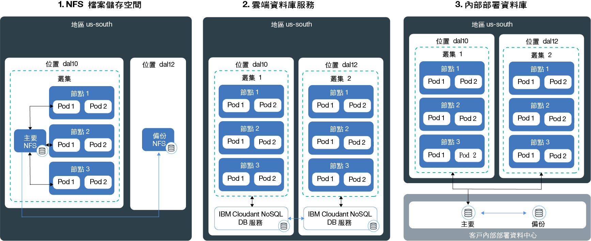

---

copyright:
  years: 2014, 2018
lastupdated: "2018-4-20"

---

{:new_window: target="_blank"}
{:shortdesc: .shortdesc}
{:screen: .screen}
{:pre: .pre}
{:table: .aria-labeledby="caption"}
{:codeblock: .codeblock}
{:tip: .tip}
{:download: .download}


# 在叢集中儲存資料
{: #storage}
您可以將資料持續保存在 {{site.data.keyword.containerlong}} 中，以在應用程式實例之間共用資料，並且萬一 Kubernetes 叢集中的元件失敗時還可防範資料遺失。

## 規劃高可用性儲存空間
{: #planning}

在 {{site.data.keyword.containerlong_notm}} 中，您可以從數個選項中進行選擇，以在叢集中的各個 Pod 之間儲存應用程式資料並共用資料。不過，如果叢集中的某個元件或整個網站失敗，在這類情況下，則並非所有儲存空間選項都提供相同層次的持續性和可用性。
{: shortdesc}

### 非持續性資料儲存空間選項
{: #non_persistent}

若發生下列情況，您可以使用非持續性儲存空間選項：您的資料不需要持續儲存，以便您可以在叢集中的某個元件失敗之後回復它；或不需要在各個應用程式實例之間共用資料。也可以使用非持續性儲存空間選項，針對您的應用程式元件進行單元測試，或嘗試新的特性。
{: shortdesc}

下圖顯示 {{site.data.keyword.containerlong_notm}} 中可用的非持續性資料儲存空間選項。這些選項適用於免費叢集和標準叢集。
<p>
</p>

<table summary="表格顯示非持續性儲存空間選項。列應該從左到右閱讀，第一欄為選項編號，第二欄為選項的標題，第三欄為說明。" style="width: 100%">
<caption>非持續性儲存空間選項</caption>
  <thead>
  <th>選項</th>
  <th>說明</th>
  </thead>
  <tbody>
    <tr>
      <td>1. 在容器或 Pod 內</td>
      <td>依設計，容器及 Pod 存在時間很短，且可能非預期地失敗。不過，您可以將資料寫入至容器的本端檔案系統，以便在容器的整個生命週期中儲存資料。容器內的資料無法與其他容器或 Pod 共用，而且會在容器損毀或移除時遺失。如需相關資訊，請參閱[在容器中儲存資料](https://docs.docker.com/storage/)。</td>
    </tr>
  <tr>
    <td>2. 在工作者節點上
</td>
    <td>每個工作者節點都設定有主要及次要儲存空間，此儲存空間是由您為工作者節點選取的機型所決定。主要儲存空間是用來儲存作業系統中的資料，並且可使用 [Kubernetes <code>hostPath</code> 磁區 ](https://kubernetes.io/docs/concepts/storage/volumes/#hostpath) 進行存取。次要儲存空間則是用來將資料儲存在 <code>/var/lib/docker</code>，而所有容器資料都會寫入該目錄中。您可以使用 [Kubernetes<code>emptyDir</code> 磁區 ](https://kubernetes.io/docs/concepts/storage/volumes/#emptydir) 來存取次要儲存空間<br/><br/><code>hostPath</code> 磁區的用途是將工作者節點檔案系統上的檔案裝載至 Pod，而 <code>emptyDir</code> 則會建立一個空目錄來指派給叢集中的 Pod。該 Pod 中的所有容器都可以對該磁區進行讀寫。因為磁區已指派給一個特定 Pod，所以無法與抄本集中的其他 Pod 共用資料。
<br/><br/><p>在下列情況下，會移除 <code>hostPath</code> 或 <code>emptyDir</code> 磁區及其資料：<ul><li>已刪除工作者節點。</li><li>已重新載入或更新工作者節點。</li><li>已刪除叢集。</li><li>{{site.data.keyword.Bluemix_notm}} 帳戶達到暫停狀態。</li></ul></p><p>此外，在下列情況下，會移除 <code>emptyDir</code> 磁區中的資料：<ul><li>已從工作者節點中永久地刪除指派的 Pod。</li><li>已在另一個工作者節點上排定指派的 Pod。</li></ul></p><p><strong>附註：</strong>如果 Pod 內的容器損毀，則工作者節點上仍然會有磁區中的資料。</p></td>
    </tr>
    </tbody>
    </table>

### 高可用性的持續性資料儲存空間選項
{: persistent}

當您建立高可用性的有狀態應用程式時，主要的挑戰是在多個位置中的多個應用程式實例之間持續保存資料，並隨時讓資料保持同步。對於高可用性資料，您會想要確保有一個主要資料庫，且有多個實例分散在多個資料中心或甚至多個地區，並且會持續抄寫這個主要資料庫中的資料。叢集中的所有實例都必須對這個主要資料庫進行讀寫。如果主要資料庫的某一個實例關閉，其他實例可以接管工作負載，因此您不會經歷應用程式的關閉時間。
{: shortdesc}

下圖顯示您在 {{site.data.keyword.containerlong_notm}} 中具有的選項，可讓您的資料在標準叢集中具有高可用性。適合您的選項，取決於下列因素：
  * **您具有的應用程式類型：**例如，您的應用程式可能必須根據檔案來儲存資料，而不是儲存於資料庫內。
  * **資料儲存及遞送地點的法律要求：**例如，您可能只能在美國儲存及遞送資料，而無法使用位於歐洲的服務。
  * **備份及還原選項：**每個儲存空間選項都具有備份及還原資料的功能。請檢查可用的備份及還原選項是否符合災難回復計劃的需求，例如備份的頻率，或是在主要資料中心以外儲存資料的功能。
  * **全球抄寫：**如需高可用性，您可能想要設定分散在全球資料中心並互相抄寫的多個儲存空間實例。

<br/>


<table summary="表格顯示持續性儲存空間選項。列應該從左到右閱讀，第一欄為選項編號，第二欄為選項的標題，第三欄為說明。">
  <caption>持續性儲存空間選項</caption>
  <thead>
  <th>選項</th>
  <th>說明</th>
  </thead>
  <tbody>
  <tr>
  <td>1. NFS 檔案儲存空間或區塊儲存空間</td>
  <td>使用此選項，您可以使用 Kubernetes 持續性磁區來持續保存應用程式及容器資料。這些磁區是在具有「耐久性」及「效能」的 [NFS 型檔案儲存空間 ](https://www.ibm.com/cloud/file-storage/details) 或[區塊儲存空間 ](https://www.ibm.com/cloud/block-storage) 上進行管理，該儲存空間可以用於讓應用程式根據檔案或作為區塊來儲存資料，而不是儲存於資料庫內。檔案儲存空間及區塊儲存空間加密靜止中資料。<p>{{site.data.keyword.containershort_notm}} 提供預先定義的儲存空間類別，以定義儲存空間的大小範圍、IOPS、刪除原則，以及磁區的讀取和寫入權。若要針對檔案儲存空間或區塊儲存空間起始要求，您必須建立[持續性磁區宣告 (PVC)](cs_storage.html#create)。提交 PVC 之後，{{site.data.keyword.containershort_notm}} 會動態佈建一個在 NFS 型檔案儲存空間或區塊儲存空間上管理的持續性磁區。[您可以將 PVC 以磁區形式裝載](cs_storage.html#app_volume_mount)至部署中，以容許容器對該磁區進行讀寫。</p><p>持續性磁區佈建在工作者節點所在的資料中心。您可以在相同抄本集之間共用資料，或與相同叢集中的其他部署共用。當叢集位於不同的資料中心或地區時，無法在叢集之間共用資料。</p><p>依預設，不會自動備份 NFS 儲存空間及區塊儲存空間。您可以使用提供的[備份及還原機制](cs_storage.html#backup_restore)，為叢集設定定期備份。容器損毀或從工作者節點移除 Pod 時，不會移除資料，您仍然可以透過裝載磁區的其他部署進行存取。</p><p><strong>附註：</strong>持續性 NFS 檔案共用儲存空間及區塊儲存空間是按月收費。如果您佈建叢集的持續性儲存空間，並立即移除，仍然需要支付一個月的持續性儲存空間費用，即使您只是短時間使用也是一樣。</p></td>
  </tr>
  <tr id="cloud-db-service">
    <td>2. Cloud 資料庫服務</td>
    <td>使用此選項，您可以利用 {{site.data.keyword.Bluemix_notm}} 資料庫雲端服務，例如 [IBM Cloudant NoSQL DB](/docs/services/Cloudant/getting-started.html#getting-started-with-cloudant)，來持續保存資料。利用這個選項儲存的資料，可以跨越叢集、位置及地區進行存取。<p> 您可以選擇配置所有應用程式都可存取的單一資料庫實例，或是選擇在實例之間[跨資料中心和抄寫設定多個實例](/docs/services/Cloudant/guides/active-active.html#configuring-cloudant-nosql-db-for-cross-region-disaster-recovery)，以取得更高的可用性。在 IBM Cloudant NoSQL 資料庫中，不會自動備份資料。您可以使用所提供的[備份和還原機制](/docs/services/Cloudant/guides/backup-cookbook.html#cloudant-nosql-db-backup-and-recovery)在發生網站失敗時保護資料。</p> <p> 若要在您的叢集中使用服務，您必須[將 {{site.data.keyword.Bluemix_notm}} 服務連結](cs_integrations.html#adding_app)至叢集中的名稱空間。將服務連結至叢集時，即會建立 Kubernetes 密碼。Kubernetes 密碼會保留服務的機密資訊（例如服務的 URL、使用者名稱及密碼）。您可以將密碼以密碼磁區形式裝載至 Pod，並使用密碼中的認證來存取服務。透過將密碼磁區裝載至其他 Pod，您也可以在 Pod 之間共用資料。容器損毀或從工作者節點移除 Pod 時，不會移除資料，您仍然可以透過裝載密碼磁區的其他 Pod 進行存取。<p>大部分 {{site.data.keyword.Bluemix_notm}} 資料庫服務會免費提供少量資料的磁碟空間，讓您可以測試其特性。</p></td>
  </tr>
  <tr>
    <td>3. 內部部署資料庫</td>
    <td>如果因為法律原因而必須現場儲存資料，您可以對內部部署資料庫[設定 VPN 連線](cs_vpn.html#vpn)，並在資料中心裡使用現有的儲存空間、備份及抄寫機制。</td>
  </tr>
  </tbody>
  </table>

{: caption="表.Kubernetes 叢集中部署的持續性資料儲存空間選項" caption-side="top"}

<br />


## 使用叢集中的現有 NFS 檔案共用
{: #existing}

如果您要使用 IBM Cloud 基礎架構 (SoftLayer) 帳戶中的現有 NFS 檔案共用與 Kubernetes 搭配使用，則可以藉由為現有儲存空間建立持續性磁區 (PV) 來達成此目的。
{:shortdesc}

持續性磁區 (PV) 是一種 Kubernetes 資源，代表在資料中心內佈建的實際儲存裝置。持續性磁區會摘錄 {{site.data.keyword.Bluemix_notm}} Storage 如何佈建特定儲存空間類型的詳細資料。若要將 PV 裝載到叢集，您必須建立持續性磁區宣告 (PVC)，以要求 Pod 的持續性儲存空間。下圖說明 PV 與 PVC 之間的關係。


 如圖所示，若要讓現有的 NFS 檔案共用與 Kubernetes 搭配使用，您必須建立具有特定大小及存取模式的 PV，以及建立符合 PV 規格的 PVC。如果 PV 與 PVC 相符，則彼此連結。叢集使用者只能使用連結的 PVC 將磁區裝載至部署。此處理程序稱為靜態佈建的持續性儲存空間。

開始之前，請確定您有一個現有 NFS 檔案共用，您可以用它來建立 PV。例如，如果您先前[使用 `retain` 儲存空間類別原則建立了 PVC](#create)，則可以對這個新的 PVC 使用現有 NFS 檔案共用中保留的資料。

**附註：**靜態佈建持續性儲存空間只適用於現有 NFS 檔案共用。如果您沒有現有 NFS 檔案共用，叢集使用者可以使用[動態佈建](cs_storage.html#create)處理程序來新增 PV。

若要建立 PV 及相符的 PVC，請遵循下列步驟。

1.  在 IBM Cloud 基礎架構 (SoftLayer) 帳戶中，查閱您要在其中建立 PV 物件的 NFS 檔案共用的 ID 及路徑。此外，將檔案儲存空間授權給叢集中的子網路。此授權會將儲存空間的存取權授與叢集。
    1.  登入您的 IBM Cloud 基礎架構 (SoftLayer) 帳戶。
    2.  按一下**儲存空間**。
    3.  按一下**檔案儲存空間**，並從**動作**功能表中選取**授權主機**。
    4.  選取**子網路**。
    5.  從下拉清單中，選取您的工作者節點所連接的專用 VLAN 子網路。若要尋找工作者節點的子網路，請執行 `bx cs Worker <cluster_name>`，並且比較工作者節點的 `Private IP` 與您在下拉清單中找到的子網路。
    6.  按一下**提交**。
    6.  按一下檔案儲存空間的名稱。
    7.  記下**裝載點**欄位。此欄位會顯示為 `<server>:/<path>`。
2.  建立 PV 的儲存空間配置檔。包含來自檔案儲存空間**裝載點**欄位的伺服器及路徑。

    ```
    apiVersion: v1
    kind: PersistentVolume
    metadata:
     name: mypv
    spec:
     capacity:
       storage: "20Gi"
     accessModes:
       - ReadWriteMany
     nfs:
       server: "nfslon0410b-fz.service.networklayer.com"
       path: "/IBM01SEV8491247_0908/data01"
    ```
    {: codeblock}

    <table>
    <thead>
    <th colspan=2> 瞭解 YAML 檔案元件</th>
    </thead>
    <tbody>
    <tr>
    <td><code>name</code></td>
    <td>輸入您要建立的 PV 物件的名稱。</td>
    </tr>
    <tr>
    <td><code>spec/capacity/storage</code></td>
    <td>輸入現有 NFS 檔案共用的儲存空間大小。儲存空間大小必須以 GB 為單位寫入（例如，20Gi (20 GB) 或 1000Gi (1 TB)），而且大小必須符合現有檔案共用的大小。</td>
    </tr>
    <tr>
    <td><code>accessMode</code></td>
    <td>存取模式定義 PVC 可裝載至工作者節點的方式。<ul><li>ReadWriteOnce (RWO)：PV 只能裝載至單一工作者節點中的部署。部署中裝載至這個 PV 的容器可以對磁區進行讀寫。</li><li>ReadOnlyMany (ROX)：PV 可以裝載至在多個工作者節點上管理的部署。裝載至這個 PV 的部署只能對該磁區進行讀取。</li><li>ReadWriteMany (RWX)：這個 PV 可以裝載至在多個工作者節點上管理的部署。裝載至這個 PV 的部署可以對該磁區進行讀寫。</li></ul></td>
    </tr>
    <tr>
    <td><code>spec/nfs/server</code></td>
    <td>輸入 NFS 檔案共用伺服器 ID。</td>
    </tr>
    <tr>
    <td><code>path</code></td>
    <td>輸入您要在其中建立 PV 物件的 NFS 檔案共用的路徑。</td>
    </tr>
    </tbody></table>

3.  在叢集中建立 PV 物件。

    ```
    kubectl apply -f deploy/kube-config/mypv.yaml
    ```
    {: pre}

4.  驗證已建立 PV。

    ```
    kubectl get pv
    ```
    {: pre}

5.  建立另一個配置檔來建立您的 PVC。為了讓 PVC 符合您先前建立的 PV 物件，您必須對 `storage` 及 `accessMode` 選擇相同的值。`storage-class` 欄位必須是空的。如果其中有任何欄位不符合 PV，則會改為自動建立新的 PV。

    ```
    kind: PersistentVolumeClaim
    apiVersion: v1
    metadata:
     name: mypvc
     annotations:
       volume.beta.kubernetes.io/storage-class: ""
    spec:
     accessModes:
       - ReadWriteMany
     resources:
       requests:
         storage: "20Gi"
    ```
    {: codeblock}

6.  建立您的 PVC。

    ```
    kubectl apply -f deploy/kube-config/mypvc.yaml
    ```
    {: pre}

7.  驗證您的 PVC 已建立並已連結至 PV 物件。此處理程序可能需要幾分鐘的時間。

    ```
    kubectl describe pvc mypvc
    ```
    {: pre}

    您的輸出會與下列內容類似。

    ```
    Name: mypvc
    Namespace: default
    StorageClass: ""
    Status: Bound
    Volume: pvc-0d787071-3a67-11e7-aafc-eef80dd2dea2
    Labels: <none>
    Capacity: 20Gi
    Access Modes: RWX
    Events:
      FirstSeen LastSeen Count From        SubObjectPath Type Reason Message
      --------- -------- ----- ----        ------------- -------- ------ -------
      3m 3m 1 {ibm.io/ibmc-file 31898035-3011-11e7-a6a4-7a08779efd33 } Normal Provisioning External provisioner is provisioning volume for claim "default/my-persistent-volume-claim"
      3m 1m  10 {persistentvolume-controller } Normal ExternalProvisioning cannot find provisioner "ibm.io/ibmc-file", expecting that a volume for the claim is provisioned either manually or via external software
      1m 1m 1 {ibm.io/ibmc-file 31898035-3011-11e7-a6a4-7a08779efd33 } Normal ProvisioningSucceeded Successfully provisioned volume pvc-0d787071-3a67-11e7-aafc-eef80dd2dea2
    ```
    {: screen}


您已順利建立 PV 物件，並將它連結至 PVC。現在，叢集使用者可以[裝載 PVC](#app_volume_mount) 至其部署，並開始對 PV 物件進行讀寫。

<br />


## 在叢集中使用現有的區塊儲存空間
{: #existing_block}

開始之前，請確定您有一個現有的區塊儲存空間實例，您可以用它來建立 PV。比方說，如果您先前[使用 `retain` 儲存空間類別原則建立了 PVC](#create)，則可以對這個新的 PVC 使用現有區塊儲存空間中保留的資料。

若要建立 PV 及相符的 PVC，請遵循下列步驟。

1.  擷取或產生 IBM Cloud 基礎架構 (SoftLayer) 帳戶的 API 金鑰。
    1. 登入 [IBM Cloud 基礎架構 (SoftLayer) 入口網站 ](https://control.softlayer.com/)。
    2. 依序選取**帳戶**、**使用者**、**使用者清單**。
    3. 尋找您的使用者 ID。
    4. 在**API 金鑰**直欄中，按一下**產生**以產生 API 金鑰，或按一下**檢視**以檢視現有的 API 金鑰。
2.  擷取 IBM Cloud 基礎架構 (SoftLayer) 帳戶的 API 使用者名稱。
    1. 從**使用者清單**功能表中，選取您的使用者 ID。
    2. 在 **API 存取資訊**區段中，尋找您的 **API 使用者名稱**。
3.  登入 IBM Cloud 基礎架構 CLI 外掛程式。
    ```
    bx sl init
    ```
    {: pre}

4.  選擇使用 IBM Cloud 基礎架構 (SoftLayer) 帳戶的使用者名稱及 API 金鑰來進行鑑別。
5.  輸入您在先前步驟中擷取的使用者名稱及 API 金鑰。
6.  列出可用的區塊儲存裝置。
    ```
    bx sl block volume-list
    ```
    {: pre}

    您的輸出會與下列內容類似：
    ```
    id         username            datacenter   storage_type              capacity_gb   bytes_used   ip_addr         lunId   active_transactions
    38642141   IBM02SEL1543159-1   dal10        endurance_block_storage   20            -            169.xx.xxx.xxx   170     0
    ```
    {: screen}

7.  記下您要裝載至叢集之區塊儲存裝置的 `id`、`ip_addr`、`capacity_gb` 及 `lunId`。
8.  建立 PV 的配置檔。包括您在前一個步驟中所擷取的區塊儲存空間 ID、IP 位址、大小及 LUN ID。

    ```
    apiVersion: v1
    kind: PersistentVolume
    metadata:
      name: mypv
    spec:
      capacity:
        storage: "<storage_size>"
      accessModes:
        - ReadWriteOnce
      flexVolume:
        driver: "ibm/ibmc-block"
        fsType: "ext4"
        options:
          "Lun": "<lun_ID>"
          "TargetPortal": "<IP_address>"
          "VolumeID": "<volume_ID>"
          "volumeName": "<volume_name>"
      ```
      {: codeblock}

    <table>
    <thead>
    <th colspan=2> 瞭解 YAML 檔案元件</th>
    </thead>
    <tbody>
    <tr>
    <td><code>metadata/name</code></td>
    <td>輸入您要建立的 PV 名稱。</td>
    </tr>
    <tr>
    <td><code>spec/capacity/storage</code></td>
    <td>輸入您在前一個步驟中所擷取之現有區塊儲存空間的儲存空間大小，作為 <code>capacity-gb</code>。必須以 GB 為單位寫入儲存空間大小，例如，20Gi (20 GB) 或 1000Gi (1 TB)。</td>
    </tr>
    <tr>
    <td><code>flexVolume/options/Lun</code></td>
    <td>輸入您在前一個步驟中所擷取之區塊儲存空間的 LUN ID，作為 <code>lunId</code>。</td>
    </tr>
    <tr>
    <td><code>flexVolume/options/TargetPortal</code></td>
    <td>輸入您在前一個步驟中所擷取之區塊儲存空間的 IP 位址，作為 <code>ip_addr</code>。</td>
    </tr>
    <tr>
	    <td><code>flexVolume/options/VolumeId</code></td>
	    <td>輸入您在前一個步驟中所擷取之區塊儲存空間的 ID，作為 <code>id</code>。</td>
	    </tr>
	    <tr>
		    <td><code>flexVolume/options/volumeName</code></td>
		    <td>輸入磁區的名稱。</td>
	    </tr>
    </tbody></table>

9.  在叢集中建立 PV。
    ```
    kubectl apply -f mypv.yaml
    ```
    {: pre}

10. 驗證已建立 PV。
    ```
    kubectl get pv
    ```
    {: pre}

11. 建立另一個配置檔來建立您的 PVC。為了讓 PVC 符合您先前建立的 PV，您必須對 `storage` 及 `accessMode` 選擇相同的值。`storage-class` 欄位必須是空的。如果其中有任何欄位不符合 PV，則會改為自動建立新的 PV。

     ```
    kind: PersistentVolumeClaim
    apiVersion: v1
    metadata:
     name: mypvc
     annotations:
       volume.beta.kubernetes.io/storage-class: ""
    spec:
      accessModes:
        - ReadWriteOnce
      resources:
        requests:
          storage: "20Gi"
     ```
     {: codeblock}

12.  建立您的 PVC。
     ```
     kubectl apply -f mypvc.yaml
     ```
     {: pre}

13.  驗證是否已建立您的 PVC，並將其連結至您先前建立的 PV。此處理程序可能需要幾分鐘的時間。
     ```
    kubectl describe pvc mypvc
    ```
     {: pre}

     您的輸出會與下列內容類似。

     ```
    Name: mypvc
    Namespace: default
    StorageClass: ""
    Status: Bound
     Volume: pvc-0d787071-3a67-11e7-aafc-eef80dd2dea2
     Labels: <none>
     Capacity: 20Gi
     Access Modes: RWO
     Events:
       FirstSeen LastSeen Count From        SubObjectPath Type Reason Message
       --------- -------- ----- ----        ------------- -------- ------ -------
       3m 3m 1 {ibm.io/ibmc-block 31898035-3011-11e7-a6a4-7a08779efd33 } Normal Provisioning External provisioner is provisioning volume  for claim "default/my-persistent-volume-claim"
       3m 1m	 10 {persistentvolume-controller } Normal ExternalProvisioning cannot find provisioner "ibm.io/ibmc-block", expecting that  a volume for the claim is provisioned either manually or via external software
       1m 1m 1 {ibm.io/ibmc-block 31898035-3011-11e7-a6a4-7a08779efd33 } Normal ProvisioningSucceeded	Successfully provisioned volume  pvc-0d787071-3a67-11e7-aafc-eef80dd2dea2
     ```
     {: screen}

您已順利建立 PV，並將它連結至 PVC。現在，叢集使用者可以[裝載 PVC](#app_volume_mount) 至其部署，並開始對 PV 進行讀寫。

<br />


## 將 NFS 檔案儲存空間或區塊儲存空間新增至應用程式
{: #create}

建立持續性磁區宣告 (PVC)，為叢集佈建 NFS 檔案儲存空間或區塊儲存空間。然後，將此宣告裝載至持續性磁區 (PV)，以確保即使 Pod 損毀或關閉，也能使用資料。
{:shortdesc}

IBM 已叢集化支援 PV 的 NFS 檔案儲存空間及區塊儲存空間，可提供資料的高可用性。儲存空間類別說明可用的儲存空間供應項目的類型，並且定義如下的層面：資料保留原則、大小（以 GB 為單位），以及建立 PV 時的 IOPS。

開始之前：
- 如果您有防火牆，則對叢集所在位置的 IBM Cloud 基礎架構 (SoftLayer) IP 範圍[容許進行 Egress 存取](cs_firewall.html#pvc)，這樣您才可以建立 PVC。
- 如果您想要將區塊儲存空間裝載至應用程式，則必須先安裝[區塊儲存空間的 {{site.data.keyword.Bluemix_notm}} Storage 外掛程式](#install_block)。

若要新增持續性儲存空間，請執行下列動作：

1.  檢閱可用的儲存空間類別。{{site.data.keyword.containerlong}} 為 NFS 檔案儲存空間及區塊儲存空間提供預先定義的儲存空間類別，因此叢集管理者不需要建立任何儲存空間類別。`ibmc-file-bronze` 儲存空間類別與 `default` 儲存空間類別相同。

    ```
    kubectl get storageclasses
    ```
    {: pre}

    ```
    $ kubectl get storageclasses
    NAME                         TYPE
    default                      ibm.io/ibmc-file
    ibmc-file-bronze (default)   ibm.io/ibmc-file
    ibmc-file-custom             ibm.io/ibmc-file
    ibmc-file-gold               ibm.io/ibmc-file
    ibmc-file-retain-bronze      ibm.io/ibmc-file
    ibmc-file-retain-custom      ibm.io/ibmc-file
    ibmc-file-retain-gold        ibm.io/ibmc-file
    ibmc-file-retain-silver      ibm.io/ibmc-file
    ibmc-file-silver             ibm.io/ibmc-file
    ibmc-block-custom            ibm.io/ibmc-block
    ibmc-block-bronze            ibm.io/ibmc-block
    ibmc-block-gold              ibm.io/ibmc-block
    ibmc-block-silver            ibm.io/ibmc-block
    ibmc-block-retain-bronze     ibm.io/ibmc-block
    ibmc-block-retain-silver     ibm.io/ibmc-block
    ibmc-block-retain-gold       ibm.io/ibmc-block
    ibmc-block-retain-custom     ibm.io/ibmc-block
    ```
    {: screen}

    **提示：**如果您要變更預設儲存空間類別，請執行 `kubectl patch storageclass <storageclass> -p '{"metadata": {"annotations":{"storageclass.kubernetes.io/is-default-class":"true"}}}'`，並將 `<storageclass>` 取代為儲存空間類別的名稱。

2.  決定在刪除 PVC 之後，是否要保留資料及 NFS 檔案共用或區塊儲存空間。
    - 如果要保留資料，則請選擇 `retain` 儲存空間類別。當您刪除 PVC 時，會移除 PV，但 NFS 檔案或區塊儲存空間及您的資料仍會存在於 IBM Cloud 基礎架構 (SoftLayer) 帳戶中。稍後，若要在叢集中存取此資料，請建立一個 PVC，以及一個參照您現有 [NFS 檔案](#existing)或[區塊](#existing_block)儲存空間的相符 PV。
    - 如果您要在刪除 PVC 時刪除資料及 NFS 檔案共用或區塊儲存空間，請選擇儲存空間類別而不使用 `retain`。

3.  **如果您選擇銅級、銀級或黃金級儲存空間類別**：您會取得[耐久性儲存空間 ](https://knowledgelayer.softlayer.com/topic/endurance-storage)，其定義每一個類別每 GB 的 IOPS 數目。不過，您可以在可用範圍中選擇大小來決定 IOPS 總計。您可以選取所接受大小範圍內的任何整數的 GB 大小（例如 20 Gi、256 Gi、11854 Gi）。比方說，如果您在每 GB 4 個 IOPS 的銀級儲存空間類別中選取 1000Gi 檔案共用或區塊儲存空間大小，則您的磁區總共有 4000 個 IOPS。PV 擁有的 IOPS 越多，其處理輸入及輸出作業的速度就越快。下表說明每 GB 的 IOPS 數目，以及每一個儲存空間類別的大小範圍。

    <table>
         <caption>儲存空間類別大小範圍及每 GB IOPS 數目的表格</caption>
         <thead>
         <th>儲存空間類別</th>
         <th>每 GB 的 IOPS 數目</th>
         <th>大小範圍（以 GB 為單位）</th>
         </thead>
         <tbody>
         <tr>
         <td>銅級（預設值）</td>
         <td>2 IOPS/GB</td>
         <td>20-12000 Gi</td>
         </tr>
         <tr>
         <td>銀級</td>
         <td>4 IOPS/GB</td>
         <td>20-12000 Gi</td>
         </tr>
         <tr>
         <td>黃金級</td>
         <td>10 IOPS/GB</td>
         <td>20-4000 Gi</td>
         </tr>
         </tbody></table>

    <p>**顯示儲存空間類別詳細資料的指令範例**：</p>

    <pre class="pre"><code>    kubectl describe storageclasses ibmc-file-silver
    </code></pre>

4.  **如果您選擇自訂儲存空間類別**：您會取得[效能儲存空間 ](https://knowledgelayer.softlayer.com/topic/performance-storage)，並且在選擇 IOPS 和大小的組合時有更大控制權。例如，如果您為 PVC 選取的大小為 40Gi，則可選擇的 IOPS 是在 100 - 2000 IOPS 範圍內的 100 的倍數。下表顯示您可以根據所選取的大小來選擇的 IOPS 範圍。

    <table>
         <caption>自訂儲存空間類別大小範圍及 IOPS 的表格</caption>
         <thead>
         <th>大小範圍（以 GB 為單位）</th>
         <th>IOPS 範圍（以 100 的倍數表示）</th>
         </thead>
         <tbody>
         <tr>
         <td>20-39 Gi</td>
         <td>100-1000 IOPS</td>
         </tr>
         <tr>
         <td>40-79 Gi</td>
         <td>100-2000 IOPS</td>
         </tr>
         <tr>
         <td>80-99 Gi</td>
         <td>100-4000 IOPS</td>
         </tr>
         <tr>
         <td>100-499 Gi</td>
         <td>100-6000 IOPS</td>
         </tr>
         <tr>
         <td>500-999 Gi</td>
         <td>100-10000 IOPS</td>
         </tr>
         <tr>
         <td>1000-1999 Gi</td>
         <td>100-20000 IOPS</td>
         </tr>
         <tr>
         <td>2000-2999 Gi</td>
         <td>200-40000 IOPS</td>
         </tr>
         <tr>
         <td>3000-3999 Gi</td>
         <td>200-48000 IOPS</td>
         </tr>
         <tr>
         <td>4000-7999 Gi</td>
         <td>300-48000 IOPS</td>
         </tr>
         <tr>
         <td>8000-9999 Gi</td>
         <td>500-48000 IOPS</td>
         </tr>
         <tr>
         <td>10000-12000 Gi</td>
         <td>1000-48000 IOPS</td>
         </tr>
         </tbody></table>

    <p>**顯示自訂儲存空間類別詳細資料的指令範例**：</p>

    <pre class="pre"><code>    kubectl describe storageclasses ibmc-file-retain-custom 
    </code></pre>

5.  決定您要按小時或按月計費。依預設，您會是按月計費。

6.  建立配置檔以定義 PVC，並將此配置儲存為 `.yaml` 檔案。

    -  **銅級、銀級、黃金級儲存空間類別的範例**：下列 `.yaml` 檔案會建立一個名為 `mypvc` 的宣告，其儲存空間類別為 `"ibmc-file-sliver"`，計費方式為 `"hourly"`，GB 大小為 `24Gi`。如果您想要建立 PVC 以將區塊儲存空間裝載至叢集，請務必在 `accessModes` 區段中輸入 `ReadWriteOnce`。

       ```
       apiVersion: v1
       kind: PersistentVolumeClaim
       metadata:
         name: mypvc
         annotations:
           volume.beta.kubernetes.io/storage-class: "ibmc-file-silver"
         labels:
           billingType: "hourly"
       spec:
         accessModes:
           - ReadWriteMany
         resources:
           requests:
             storage: 24Gi
        ```
        {: codeblock}

    -  **自訂儲存空間類別的範例**：
       下列 `.yaml` 檔案會建立一個名為 `mypvc` 的宣告，其儲存空間類別為 `ibmc-file-retain-custom`，計費方式為預設的 `"monthly"`，GB 大小為 `45Gi`，IOPS 數目為 `"300"`。如果您想要建立 PVC 以將區塊儲存空間裝載至叢集，請務必在 `accessModes` 區段中輸入 `ReadWriteOnce`。

       ```
       apiVersion: v1
       kind: PersistentVolumeClaim
       metadata:
         name: mypvc
         annotations:
           volume.beta.kubernetes.io/storage-class: "ibmc-file-retain-custom"
         labels:
           billingType: "monthly"
       spec:
         accessModes:
           - ReadWriteMany
         resources:
           requests:
             storage: 45Gi
             iops: "300"
        ```
        {: codeblock}

        <table>
        <thead>
        <th colspan=2> 瞭解 YAML 檔案元件</th>
        </thead>
        <tbody>
        <tr>
        <td><code>metadata/name</code></td>
        <td>輸入 PVC 名稱。</td>
        </tr>
        <tr>
        <td><code>metadata/annotations</code></td>
        <td>指定 PV 的儲存空間類別：
          <ul>
          <li>ibmc-file-bronze / ibmc-file-retain-bronze：每個 GB 有 2 個 IOPS。</li>
          <li>ibmc-file-silver / ibmc-file-retain-silver：每個 GB 有 4 個 IOPS。</li>
          <li>ibmc-file-gold / ibmc-file-retain-gold：每個 GB 有 10 個 IOPS。</li>
          <li>ibmc-file-custom / ibmc-file-retain-custom：可以使用多個 IOPS 值。</li>
          <li>ibmc-block-bronze / ibmc-block-retain-bronze：每個 GB 有 2 個 IOPS。</li>
          <li>ibmc-block-silver / ibmc-block-retain-silver：每個 GB 有 4 個 IOPS。</li>
          <li>ibmc-block-gold / ibmc-block-retain-gold：每個 GB 有 10 個 IOPS。</li>
          <li>ibmc-block-custom / ibmc-block-retain-custom：可以使用多個 IOPS 值。</li></ul>
          <p>如果您未指定儲存空間類別，則會建立具有預設儲存空間類別的 PV。</p><p>**提示：**如果您要變更預設儲存空間類別，請執行 <code>kubectl patch storageclass &lt;storageclass&gt; -p '{"metadata": {"annotations":{"storageclass.kubernetes.io/is-default-class":"true"}}}'</code>，並將 <code>&lt;storageclass&gt;</code> 取代為儲存空間類別的名稱。</p></td>
        </tr>
        <tr>
          <td><code>metadata/labels/billingType</code></td>
          <td>指定計算儲存空間費用的頻率為 "monthly" 或 "hourly"。預設值為 "monthly"。</td>
        </tr>
        <tr>
        <td><code>spec/resources/requests/storage</code></td>
        <td>輸入檔案儲存空間大小，以 GB 為單位 (Gi)。請選擇在容許的大小範圍內的整數。</br></br><strong>附註：</strong>在佈建儲存空間之後，您無法變更 NFS 檔案共用或區塊儲存空間的大小。請確定指定符合您要儲存的資料量的大小。</td>
        </tr>
        <tr>
        <td><code>spec/resources/requests/iops</code></td>
        <td>此選項僅適用於自訂儲存空間類別 (`ibmc-file-custom / ibmc-file-retain-custom / ibmc-block-custom / ibmc-block-retain-custom`)。選取容許範圍內的 100 的倍數，來指定儲存空間的 IOPS 總數。若要查看所有選項，請執行 `kubectl describe storageclasses <storageclass>`。如果您選擇的 IOPS 不是所列出的 IOPS，則會將 IOPS 無條件進位。</td>
        </tr>
        </tbody></table>

7.  建立 PVC。

    ```
    kubectl apply -f mypvc.yaml
    ```
    {: pre}

8.  驗證您的 PVC 已建立並已連結至 PV。此處理程序可能需要幾分鐘的時間。

    ```
    kubectl describe pvc mypvc
    ```
    {: pre}

    輸出範例：

    ```
    Name: mypvc
    Namespace: default
    StorageClass: ""
    Status:  Bound
    Volume:  pvc-0d787071-3a67-11e7-aafc-eef80dd2dea2
    Labels:  <none>
    Capacity: 20Gi
    Access Modes: RWX
    Events:
      FirstSeen LastSeen Count From        SubObjectPath Type  Reason   Message
      --------- -------- ----- ----        ------------- -------- ------   -------
      3m  3m  1 {ibm.io/ibmc-file 31898035-3011-11e7-a6a4-7a08779efd33 }   Normal  Provisioning  External provisioner is provisioning volume for claim "default/my-persistent-volume-claim"
      3m  1m  10 {persistentvolume-controller }       Normal  ExternalProvisioning cannot find provisioner "ibm.io/ibmc-file", expecting that a volume for the claim is provisioned either manually or via external software
      1m  1m  1 {ibm.io/ibmc-file 31898035-3011-11e7-a6a4-7a08779efd33 }   Normal  ProvisioningSucceeded Successfully provisioned volume pvc-0d787071-3a67-11e7-aafc-eef80dd2dea2

    ```
    {: screen}

9.  {: #app_volume_mount}若要將 PVC 裝載至部署，請建立配置檔 `.yaml`。

    ```
    apiVersion: apps/v1beta1
    kind: Deployment
    metadata:
      name: <deployment_name>
      labels:
        app: <deployment_label>
    spec:
      selector:
        matchLabels:
          app: <app_name>
      template:
        metadata:
          labels:
            app: <app_name>
        spec:
          containers:
          - image: <image_name>
            name: <container_name>
            volumeMounts:
            - name: <volume_name>
              mountPath: /<file_path>
          volumes:
          - name: <volume_name>
            persistentVolumeClaim:
              claimName: <pvc_name>
    ```
    {: codeblock}

    <table>
    <thead>
    <th colspan=2> 瞭解 YAML 檔案元件</th>
    </thead>
    <tbody>
        <tr>
    <td><code>metadata/labels/app</code></td>
    <td>部署的標籤。</td>
      </tr>
      <tr>
        <td><code>spec/selector/matchLabels/app</code> <br/> <code>spec/template/metadata/labels/app</code></td>
        <td>應用程式的標籤。</td>
      </tr>
    <tr>
    <td><code>template/metadata/labels/app</code></td>
    <td>部署的標籤。</td>
      </tr>
    <tr>
    <td><code>spec/containers/image</code></td>
    <td>您要使用的映像檔的名稱。若要列出 {{site.data.keyword.registryshort_notm}} 帳戶中的可用映像檔，請執行 `bx cr image-list`。</td>
    </tr>
    <tr>
    <td><code>spec/containers/name</code></td>
    <td>您要部署至叢集的容器的名稱。</td>
    </tr>
    <tr>
    <td><code>spec/containers/volumeMounts/mountPath</code></td>
    <td>容器內裝載磁區之目錄的絕對路徑。</td>
    </tr>
    <tr>
    <td><code>spec/containers/volumeMounts/name</code></td>
    <td>要裝載至 Pod 之磁區的名稱。</td>
    </tr>
    <tr>
    <td><code>volumes/name</code></td>
    <td>要裝載至 Pod 之磁區的名稱。此名稱通常與 <code>volumeMounts/name</code> 相同。</td>
    </tr>
    <tr>
    <td><code>volumes/persistentVolumeClaim/claimName</code></td>
    <td>您要用來作為磁區的 PVC 的名稱。當您將磁區裝載至 Pod 時，Kubernetes 會識別連結至 PVC 的 PV，並讓使用者對此 PV 進行讀寫。</td>
    </tr>
    </tbody></table>

10.  建立部署並裝載 PVC。
     ```
    kubectl apply -f <local_yaml_path>
    ```
     {: pre}

11.  驗證已順利裝載磁區。

     ```
    kubectl describe deployment <deployment_name>
    ```
     {: pre}

     裝載點在 **Volume Mounts**（磁區裝載）欄位中，而磁區在 **Volumes**（磁區）欄位中。

     ```
     Volume Mounts:
          /var/run/secrets/kubernetes.io/serviceaccount from default-token-tqp61 (ro)
          /volumemount from myvol (rw)
    ...
     Volumes:
      myvol:
        Type: PersistentVolumeClaim (a reference to a PersistentVolumeClaim in the same namespace)
        ClaimName: mypvc
        ReadOnly: false

    ```
     {: screen}

{: #nonroot}
{: #enabling_root_permission}

**NFS 許可權**：尋找啟用 NFS 非 root 許可權的相關文件？請參閱[新增非 root 使用者對 NFS 檔案儲存空間的存取權](cs_troubleshoot_storage.html#nonroot)。

<br />


## 在叢集上安裝 {{site.data.keyword.Bluemix_notm}} Block Storage 外掛程式
{: #install_block}

安裝 {{site.data.keyword.Bluemix_notm}}Block Storage 外掛程式與 Helm 圖表，以設定區塊儲存空間的預先定義儲存空間類別。您可以使用這些儲存空間類別來建立 PVC ，以佈建應用程式的區塊儲存空間。
{: shortdesc}

開始之前，請先將 [CLI 的目標](cs_cli_install.html#cs_cli_configure)設為您要在其中安裝 {{site.data.keyword.Bluemix_notm}} Block Storage 外掛程式的叢集。

1. 在您要在其中使用 {{site.data.keyword.Bluemix_notm}} Block Storage 外掛程式的叢集上安裝 [Helm](cs_integrations.html#helm)。
2. 更新 helm 報告，以在此報告中擷取所有 helm 圖表的最新版本。
   ```
        helm repo update
        ```
   {: pre}

3. 安裝 {{site.data.keyword.Bluemix_notm}} Block Storage 外掛程式。安裝外掛程式時，會將預先定義的區塊儲存空間類別新增至叢集。
   ```
   helm install ibm/ibmcloud-block-storage-plugin
   ```
   {: pre}

   輸出範例：
   ```
   NAME:   bald-olm
   LAST DEPLOYED: Wed Apr 18 10:02:55 2018
   NAMESPACE: default
   STATUS: DEPLOYED

   RESOURCES:
   ==> v1beta1/DaemonSet
   NAME                           DESIRED  CURRENT  READY  UP-TO-DATE  AVAILABLE  NODE SELECTOR  AGE
   ibmcloud-block-storage-driver  0        0        0      0           0          <none>         0s

   ==> v1beta1/Deployment
   NAME                           DESIRED  CURRENT  UP-TO-DATE  AVAILABLE  AGE
   ibmcloud-block-storage-plugin  1        0        0           0          0s

   ==> v1/StorageClass
   NAME                      PROVISIONER        AGE
   ibmc-block-bronze         ibm.io/ibmc-block  0s
   ibmc-block-custom         ibm.io/ibmc-block  0s
   ibmc-block-gold           ibm.io/ibmc-block  0s
   ibmc-block-retain-bronze  ibm.io/ibmc-block  0s
   ibmc-block-retain-custom  ibm.io/ibmc-block  0s
   ibmc-block-retain-gold    ibm.io/ibmc-block  0s
   ibmc-block-retain-silver  ibm.io/ibmc-block  0s
   ibmc-block-silver         ibm.io/ibmc-block  0s

   ==> v1/ServiceAccount
   NAME                           SECRETS  AGE
   ibmcloud-block-storage-plugin  1        0s

   ==> v1beta1/ClusterRole
   NAME                           AGE
   ibmcloud-block-storage-plugin  0s

   ==> v1beta1/ClusterRoleBinding
   NAME                           AGE
   ibmcloud-block-storage-plugin  0s

   NOTES:
   Thank you for installing: ibmcloud-block-storage-plugin.   Your release is named: bald-olm
   ```
   {: screen}

4. 驗證安裝是否成功。
   ```
   kubectl get pod -n kube-system | grep ibmcloud-block-storage-plugin
   ```
   {: pre}

   輸出範例：
   ```
   ibmcloud-block-storage-plugin-58c5f9dc86-js6fd                    1/1       Running   0          4m
   ```
   {: screen}

5. 驗證區塊儲存空間的儲存空間類別是否已新增至叢集。
   ```
   kubectl get storageclasses | grep block
   ```
   {: pre}

   輸出範例：
   ```
   ibmc-block-bronze            ibm.io/ibmc-block
   ibmc-block-custom            ibm.io/ibmc-block
   ibmc-block-gold              ibm.io/ibmc-block
   ibmc-block-retain-bronze     ibm.io/ibmc-block
   ibmc-block-retain-custom     ibm.io/ibmc-block
   ibmc-block-retain-gold       ibm.io/ibmc-block
   ibmc-block-retain-silver     ibm.io/ibmc-block
   ibmc-block-silver            ibm.io/ibmc-block
   ```
   {: screen}

6. 對於您要在其中佈建區塊儲存空間的每一個叢集重複這些步驟。

現在，您可以繼續[建立一個 PVC](#create)，佈建應用程式的區塊儲存空間。

<br />


### 更新 {{site.data.keyword.Bluemix_notm}} Block Storage 外掛程式
您可以將現有的 {{site.data.keyword.Bluemix_notm}} Block Storage 外掛程式升級至最新版本。
{: shortdesc}

開始之前，請先將 [CLI 的目標](cs_cli_install.html#cs_cli_configure)設為叢集。

1. 尋找您已在叢集中安裝之區塊儲存空間 helm 圖表的名稱。
   ```
   helm ls | grep ibmcloud-block-storage-plugin
   ```
   {: pre}

   輸出範例：
   ```
   myhelmchart 	1       	Mon Sep 18 15:31:40 2017	DEPLOYED	ibmcloud-block-storage-plugin-0.1.0	default
   ```
   {: screen}

2. 將 {{site.data.keyword.Bluemix_notm}} Block Storage 外掛程式升級至最新版本。
   ```
   helm upgrade --force --recreate-pods <helm_chart_name>  ibm/ibmcloud-block-storage-plugin
   ```
   {: pre}

<br />


### 移除 {{site.data.keyword.Bluemix_notm}} Block Storage 外掛程式
如果您不想要針對叢集佈建及使用 {{site.data.keyword.Bluemix_notm}} Block Storage，則可以解除安裝 helm 圖表。
{: shortdesc}

**附註：**移除外掛程式不會移除現有的 PVC、PV 或資料。移除外掛程式時，會從叢集中移除所有相關的 Pod 及常駐程式集。在移除外掛程式之後，您無法針對叢集佈建新的區塊儲存空間，也無法使用現有的區塊儲存空間 PVU 及 PV。

開始之前，請先將 [CLI 的目標](cs_cli_install.html#cs_cli_configure)設為叢集，並確定叢集中沒有任何 PVC 或 PV 使用區塊儲存空間。

1. 尋找您已在叢集中安裝之區塊儲存空間 helm 圖表的名稱。
   ```
   helm ls | grep ibmcloud-block-storage-plugin
   ```
   {: pre}

   輸出範例：
   ```
   myhelmchart 	1       	Mon Sep 18 15:31:40 2017	DEPLOYED	ibmcloud-block-storage-plugin-0.1.0	default
   ```
   {: screen}

2. 刪除 {{site.data.keyword.Bluemix_notm}} Block Storage 外掛程式。
   ```
   helm delete <helm_chart_name>
   ```
   {: pre}

3. 驗證是否已移除區塊儲存空間 Pod。
   ```
   kubectl get pod -n kube-system | grep ibmcloud-block-storage-plugin
   ```
   {: pre}
   如果 CLI 輸出中沒有顯示任何 Pod，則表示已順利移除 Pod。

4. 驗證是否已移除區塊儲存空間的儲存空間類別。
   ```
   kubectl get storageclasses | grep block
   ```
   {: pre}
   如果 CLI 輸出中沒有顯示任何儲存空間類別，則表示已順利移除儲存空間類別。

<br />


## 針對 NFS 檔案共用及區塊儲存空間設定備份及還原解決方案
{: #backup_restore}

檔案共用及區塊儲存空間會佈建至與叢集相同的位置。儲存空間是在叢集化伺服器上由 {{site.data.keyword.IBM_notm}} 管理，以在伺服器關閉時提供可用性。不過，如果整個位置失敗，則不會自動備份檔案共用及區塊儲存空間，且可能無法存取它們。若要避免資料遺失或損壞，您可以設定定期備份，以在需要時使用它們來還原您的資料。
{: shortdesc}

檢閱 NFS 檔案共用及區塊儲存空間的下列備份及還原選項：

<dl>
  <dt>設定定期 Snapshot</dt>
  <dd><p>您可以針對 NFS 檔案共用或區塊儲存空間設定[定期 Snapshot](/docs/infrastructure/FileStorage/snapshots.html)，這是唯讀映像檔，其擷取實例在某個時間點的狀態。Snapshot 儲存於相同位置內的相同檔案共用及區塊儲存空間上。如果使用者不小心從磁區中移除重要資料，您可以從 Snapshot 還原資料。</p>
  <p>如需相關資訊，請參閱：<ul><li>[NFS 定期 Snapshot](/docs/infrastructure/FileStorage/snapshots.html)</li><li>[區塊定期 Snapshot](/docs/infrastructure/BlockStorage/snapshots.html#snapshots)</li></ul></p></dd>
  <dt>將 Snapshot 抄寫至另一個位置</dt>
 <dd><p>若要在發生位置失敗時保護資料，您可以[將 Snapshot 抄寫](/docs/infrastructure/FileStorage/replication.html#working-with-replication)至另一個位置中設定的 NFS 檔案共用或區塊儲存空間實例。資料只能從主要儲存空間抄寫至備份儲存空間。您無法將抄寫的 NFS 檔案共用或區塊儲存空間實例裝載至叢集。當主要儲存空間失敗時，您可以手動將抄寫的備份儲存空間設為主要儲存空間。然後，您可以將它裝載至叢集。還原主要儲存空間之後，您可以從備份儲存空間中還原資料。</p>
 <p>如需相關資訊，請參閱：<ul><li>[NFS 抄寫 Snapshot](/docs/infrastructure/FileStorage/replication.html#working-with-replication)</li><li>[區塊抄寫 Snapshot](/docs/infrastructure/BlockStorage/replication.html#working-with-replication)</li></ul></p></dd>
 <dt>複製儲存空間</dt>
 <dd><p>您可以在與原始儲存空間實例相同的位置中，複製 NFS 檔案共用或區塊儲存空間實例。在建立複本的時間點，複本具有與原始儲存空間實例相同的資料。與抄本不同，使用複本作為完全獨立於原始儲存空間實例外的儲存空間實例。若要複製，請先設定磁區的 Snapshot。</p>
 <p>如需相關資訊，請參閱：<ul><li>[NFS 複製 Snapshot](/docs/infrastructure/FileStorage/how-to-create-duplicate-volume.html#creating-a-duplicate-file-storage)</li><li>[區塊複製 Snapshot](/docs/infrastructure/BlockStorage/how-to-create-duplicate-volume.html#creating-a-duplicate-block-volume)</li></ul></p></dd>
  <dt>將資料備份至物件儲存空間</dt>
  <dd><p>您可以使用 [**ibm-backup-restore image**](/docs/services/RegistryImages/ibm-backup-restore/index.html#ibmbackup_restore_starter)，在叢集中啟動一個備份及還原 Pod。這個 Pod 包含一個 Script，它會針對叢集中的任何持續性磁區宣告 (PVC) 執行一次性或定期備份。資料會儲存在您於位置中設定的 {{site.data.keyword.objectstoragefull}} 實例中。</p>
  <p>若要讓資料有更高的可用性，並在發生位置失敗時保護應用程式，請設定第二個 {{site.data.keyword.objectstoragefull}} 實例，並在位置之間抄寫資料。如果您需要從 {{site.data.keyword.objectstoragefull}} 實例還原資料，請使用隨該映像檔所提供的還原 Script。</p></dd>
<dt>在 Pod 與容器之間複製資料</dt>
<dd><p>您可以使用 `kubectl cp`[指令 ](https://kubernetes.io/docs/reference/generated/kubectl/kubectl-commands#cp)，在叢集的 Pod 或特定容器之間複製檔案及目錄。</p>
<p>開始之前，請先將 [Kubernetes CLI 的目標](cs_cli_install.html#cs_cli_configure)設為您想要使用的叢集。如果未使用 <code>-c</code> 來指定容器，則指令會使用 Pod 中第一個可用的容器。</p>
<p>您可以透過下列各種方式來使用指令：</p>
<ul>
<li>將資料從本端機器複製至叢集中的 Pod：<code>kubectl cp <var>&lt;local_filepath&gt;/&lt;filename&gt;</var> <var>&lt;namespace&gt;/&lt;pod&gt;:&lt;pod_filepath&gt;</var></code></li>
<li>將資料從叢集中的 Pod 複製至本端機器：<code>kubectl cp <var>&lt;namespace&gt;/&lt;pod&gt;:&lt;pod_filepath&gt;/&lt;filename&gt;</var> <var>&lt;local_filepath&gt;/&lt;filename&gt;</var></code></li>
<li>將資料從叢集中的 Pod 複製至另一個 Pod 中的特定容器：<code>kubectl cp <var>&lt;namespace&gt;/&lt;pod&gt;:&lt;pod_filepath&gt;</var> <var>&lt;namespace&gt;/&lt;other_pod&gt;:&lt;pod_filepath&gt;</var> -c <var>&lt;container></var></code></li>
</ul>
</dd>
  </dl>

