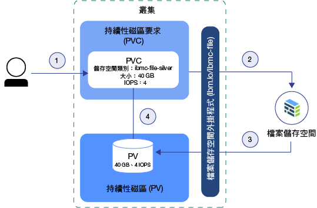
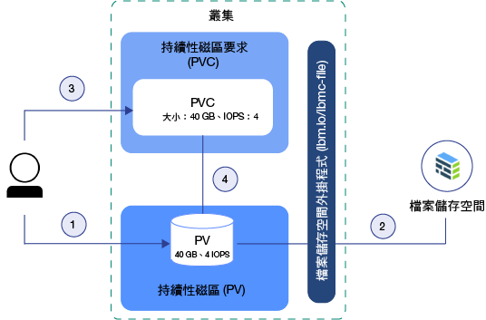

---

copyright:
  years: 2014, 2019
lastupdated: "2019-05-31"

keywords: kubernetes, iks

subcollection: containers

---

{:new_window: target="_blank"}
{:shortdesc: .shortdesc}
{:screen: .screen}
{:pre: .pre}
{:table: .aria-labeledby="caption"} 
{:codeblock: .codeblock}
{:tip: .tip}
{:note: .note}
{:important: .important}
{:deprecated: .deprecated}
{:download: .download}
{:preview: .preview}


# 瞭解 Kubernetes 儲存空間基本觀念
{: #kube_concepts}

## 持續性磁區及持續性磁區要求
{: #pvc_pv}

在開始佈建儲存空間之前，務必要瞭解持續性磁區及持續性磁區要求的 Kubernetes 概念，以及它們在叢集裡一起運作的方式。
{: shortdesc}

下圖顯示 Kubernetes 叢集裡的儲存空間元件。


- **叢集**</br> 依預設，每個叢集都會設定一個外掛程式，以[佈建檔案儲存空間](/docs/containers?topic=containers-file_storage#add_file)。您可以選擇安裝其他附加程式，例如適用於[區塊儲存空間](/docs/containers?topic=containers-block_storage)的附加程式。若要在叢集裡使用儲存空間，您必須建立持續性磁區要求、持續性磁區及實體儲存空間實例。當您刪除叢集時，可以選擇刪除相關的儲存空間實例。
- **應用程式**</br> 若要從您的儲存空間實例中讀取與寫入，您必須將持續性磁區要求 (PVC) 裝載至您的應用程式。不同的儲存空間類型有不同的讀寫規則。例如，針對檔案儲存空間，您可以將多個 Pod 裝載至同一個 PVC。區塊儲存空間具有 RWO (ReadWriteOnce) 存取模式，因此您只能將儲存空間裝載至一個 Pod。
- **持續性磁區要求 (PVC)**</br> PVC 是使用特定類型和配置來佈建持續性儲存空間的要求。若要指定您想要的持續性儲存空間特性，請使用 [Kubernetes 儲存空間類別](#storageclasses)。叢集管理者可以定義儲存空間類別，或者您可以從 {{site.data.keyword.containerlong_notm}} 的預先定義儲存空間類別中選擇一個。當您建立 PVC 時，要求會傳送至 {{site.data.keyword.Bluemix}} 儲存空間提供者。視儲存空間類別中定義的配置而定，會訂購實體儲存裝置，並將其佈建至您的 IBM Cloud 基礎架構 (SoftLayer) 帳戶。如果所要求的配置不存在，則不會建立儲存空間。
- **持續性磁區 (PV)**</br> PV 是以磁區形式新增至叢集的虛擬儲存空間實例。PV 指向 IBM Cloud 基礎架構 (SoftLayer) 帳戶中的實體儲存裝置，並使用來與儲存裝置通訊的 API 抽象化。若要將 PV 裝載至應用程式，您必須具有相符的 PVC。裝載的 PV 會以資料夾形式出現在容器的檔案系統內。
- **實體儲存空間**</br> 您可以用來持續保存資料的實體儲存空間實例。{{site.data.keyword.Bluemix_notm}} 中的實體儲存空間範例包括 [File Storage](/docs/containers?topic=containers-file_storage#file_storage)、[Block Storage](/docs/containers?topic=containers-block_storage#block_storage)、[Object Storage](/docs/containers?topic=containers-object_storage#object_storage)，以及可用來作為具有 [Portworx](/docs/containers?topic=containers-portworx#portworx) 之 SDS 儲存空間的本端工作者節點儲存空間。{{site.data.keyword.Bluemix_notm}} 提供實體儲存空間實例的高可用性。不過，儲存在實體儲存空間實例上的資料不會自動備份。視您使用的儲存空間類型而定，有不同的方法存在，可設定備份及還原解決方案。

如需如何建立及使用 PVC、PV 及實體儲存裝置的相關資訊，請參閱：
- [動態佈建](#dynamic_provisioning)
- [靜態佈建](#static_provisioning)

## 動態佈建
{: #dynamic_provisioning}

如果您想要讓開發人員可在需要時自由佈建儲存空間，請使用動態佈建。
{: shortdesc}

**它如何運作？**</br>

動態佈建是 Kubernetes 的原生特性，容許叢集開發人員訂購已預先定義類型和配置的儲存空間，而不需知道如何佈建實體儲存裝置的所有詳細資料。若要使特定儲存空間類型的詳細資料抽象化，叢集管理者必須建立開發人員可以使用的[儲存空間類別](#storageclasses)，或使用 {{site.data.keyword.Bluemix}} 儲存空間外掛程式隨附的儲存空間類別。

若要訂購儲存空間，您必須建立 PVC。PVC 可決定您要佈建之儲存空間的規格。在建立 PVC 之後，會自動為您建立儲存裝置及 PV。  

下圖顯示如何在叢集裡動態佈建檔案儲存空間。此範例流程的運作方式與其他儲存空間類型（例如區塊儲存空間）類似。

**具有預先定義銀級儲存空間類別的檔案儲存空間動態佈建範例流程**



1. 使用者會建立一個持續性磁區要求 (PVC)，用於指定儲存空間類型、儲存空間類別、大小（以 GB 為單位）、IOPS 數目，以及計費類型。儲存空間類別決定佈建的儲存空間類型，以及大小和 IOPS 的容許範圍。在叢集裡建立 PVC 會自動觸發所要求之儲存空間類型的儲存空間外掛程式，利用給定規格佈建儲存空間。
2. 會自動訂購儲存裝置，並將其佈建至您的 IBM Cloud 基礎架構 (SoftLayer) 帳戶。儲存裝置的計費週期即會開始。
3. 儲存空間外掛程式會自動在叢集裡建立持續性磁區 (PV)，這是一種虛擬儲存裝置，指向 IBM Cloud 基礎架構 (SoftLayer) 帳戶中的實際儲存裝置。
4. PVC 及 PV 會自動彼此連接。PVC 及 PV 的狀態會變更為 `Bound`。您現在可以使用 PVC，將持續性儲存空間裝載至您的應用程式。如果刪除 PVC，則同時會刪除 PV 及相關的儲存空間實例。</br>

**何時使用動態佈建？**</br>

請檢閱下列用於動態佈建的一般使用案例：
1. **需要時佈建儲存空間：**您可以讓開發人員在需要時自由佈建儲存空間，而不是為開發人員預先提供持續性儲存空間並為未使用的儲存空間付費。若要決定開發人員可以佈建的儲存空間類型，您可以定義[儲存空間類別](#storageclasses)。
2. **自動建立 PVC、PV 及儲存裝置：**您想要自動佈建及取消佈建儲存空間，而無需叢集管理者的人為介入。
3. **經常建立及刪除儲存空間：**您有一個應用程式或設定了持續交付管線，用於定期建立及移除持續性儲存空間。可以藉由刪除 PVC 來移除使用非保留儲存空間類別動態佈建的持續性儲存空間。

如需如何動態佈建持續性儲存空間的相關資訊，請參閱：
- [檔案儲存空間](/docs/containers?topic=containers-file_storage#add_file)
- [區塊儲存空間](/docs/containers?topic=containers-block_storage#add_block)

## 靜態佈建
{: #static_provisioning}

如果您在 IBM Cloud 基礎架構 (SoftLayer) 帳戶中具有現有的持續性儲存裝置，則可以使用靜態佈建，讓儲存空間實例可供您的叢集使用。
{: shortdesc}

**它如何運作？**</br>

靜態佈建是 Kubernetes 的原生特性，容許叢集管理者讓現有儲存裝置可供叢集使用。身為叢集管理者，您必須知道儲存裝置的詳細資料、其支援的配置，以及裝載選項。  

若要讓現有儲存空間可供叢集使用者使用，您必須手動建立儲存裝置、PV 及 PVC。  

下圖顯示如何在叢集裡靜態佈建檔案儲存空間。此範例流程的運作方式與其他儲存空間類型（例如區塊儲存空間）類似。

**靜態佈建檔案儲存空間的範例流程**



1. 叢集管理者會收集有關現有儲存裝置的所有詳細資料，並在叢集裡建立持續性磁區 (PV)。
2. 根據 PV 中的儲存空間詳細資料，儲存空間外掛程式會連接 PV 與 IBM Cloud 基礎架構 (SoftLayer) 帳戶中的儲存裝置。
3. 叢集管理者或開發人員會建立 PVC。因為 PV 及儲存裝置已存在，所以不會在 PVC 中指定儲存空間類別。
4. 在建立 PVC 之後，儲存空間外掛程式會嘗試讓 PVC 符合現有 PV。在 PVC 及 PV 中，對大小、IOPS 及存取模式使用相同值時，PVC 及 PV 便會相符。當 PVC 及 PV 相符時，PVC 及 PV 的狀態會變更為 `Bound`。您現在可以使用 PVC，將持續性儲存空間裝載至您的應用程式。刪除 PVC 時，不會移除 PV 及實體儲存空間實例。您必須個別移除 PVC、PV 及實體儲存空間實例。</br>

**何時使用靜態佈建？**</br>

請檢閱下列用於靜態佈建持續性儲存空間的一般使用案例：
1. **讓保留的資料可供叢集使用：**您已使用動態佈建搭配保留儲存空間類別來佈建持續性儲存空間。您已移除 PVC，但 PV、IBM Cloud 基礎架構 (SoftLayer) 中的實體儲存空間，以及資料都仍然存在。您想要從叢集裡的應用程式存取保留的資料。
2. **使用現有儲存裝置：**您已在 IBM Cloud 基礎架構 (SoftLayer) 帳戶中直接佈建持續性儲存空間，而且想要在叢集裡使用此儲存裝置。
3. **在相同區域中跨叢集共用持續性儲存空間：**您已針對叢集佈建持續性儲存空間。若要與相同區域中的其他叢集共用相同的持續性儲存空間實例，您必須在其他叢集裡手動建立 PV 及相符的 PVC。**附註：**只有在叢集與儲存空間實例位於相同區域時，才能跨叢集共用持續性儲存空間。
4. **在相同叢集裡跨名稱空間共用持續性儲存空間：**您已在叢集的名稱空間中佈建持續性儲存空間。您想要對部署至叢集裡不同名稱空間的應用程式 Pod 使用相同的儲存空間實例。

如需如何靜態佈建儲存空間的相關資訊，請參閱：
- [檔案儲存空間](/docs/containers?topic=containers-file_storage#file_predefined_storageclass)
- [區塊儲存空間](/docs/containers?topic=containers-block_storage#block_predefined_storageclass)

## 儲存空間類別
{: #storageclasses}

若要動態佈建持續性儲存空間，您必須定義想要的儲存空間類型及配置。
{: shortdesc}

[Kubernetes 儲存空間類別 ](https://kubernetes.io/docs/concepts/storage/storage-classes/) 用來使 {{site.data.keyword.Bluemix_notm}} 中支援的基礎儲存空間平台抽象化，因此您不必知道所有關於支援大小、IOPS 或保留原則的詳細資料，即可在叢集裡順利地佈建持續性儲存空間。{{site.data.keyword.containerlong_notm}} 為支援的每種儲存空間類型提供預先定義的儲存空間類別。每一個儲存空間類別都設計成使支援的儲存空間層級抽象化，同時又可讓您選擇決定想要的大小、IOPS 及保留原則。

如需預先定義的儲存空間類別規格相關資訊，請參閱：
- [檔案儲存空間](/docs/containers?topic=containers-file_storage#file_storageclass_reference)
- [區塊儲存空間](/docs/containers?topic=containers-block_storage#block_storageclass_reference)

找不到您要尋找的項目嗎？您也可以自行建立自訂儲存空間類別，來佈建您想要的儲存空間類型。
{: tip}

### 自訂儲存空間類別
{: #customized_storageclass}

如果您無法使用其中一個提供的儲存空間類別，可以自行建立自訂儲存空間類別。
建議您自訂儲存空間類別以指定配置，例如區域、檔案系統類型、伺服器類型或[磁區連結模式 ](https://kubernetes.io/docs/concepts/storage/storage-classes/#volume-binding-mode) 選項（僅限區塊儲存空間）。
{: shortdesc}

1. 建立自訂的儲存空間類別。首先，您可以使用其中一個預先定義的儲存空間類別，或是參閱我們的自訂儲存空間類別範例。
   - 預先定義的儲存空間類別：
     - [檔案儲存空間](/docs/containers?topic=containers-file_storage#file_storageclass_reference)
     - [區塊儲存空間](/docs/containers?topic=containers-block_storage#block_storageclass_reference)
   - 自訂儲存空間類別範例：
     - [檔案儲存空間](/docs/containers?topic=containers-file_storage#file_custom_storageclass)
     - [區塊儲存空間](/docs/containers?topic=containers-block_storage#block_custom_storageclass)

2. 建立自訂儲存空間類別。
   ```
    kubectl apply -f <local_file_path>
    ```
   {: pre}

3.  驗證已建立自訂儲存空間類別。
    ```
    kubectl get storageclasses
                                                            
    ```
    {: pre}

4. 建立持續性磁區要求 (PVC)，以搭配自訂儲存空間類別來動態佈建儲存空間。
   - [檔案儲存空間](/docs/containers?topic=containers-file_storage#add_file)
   - [區塊儲存空間](/docs/containers?topic=containers-block_storage#add_block)

5. 驗證已建立您的 PVC，並且已連結至持續性磁區 (PV)。此處理程序可能需要幾分鐘的時間才能完成。
   ```
   kubectl get pvc
   ```
   {: pre}

### 變更或更新為不同的儲存空間類別
{: #update_storageclass}

使用儲存空間類別來動態佈建持續性儲存空間時，您可以使用特定配置來佈建持續性儲存空間。您無法變更儲存空間類別的名稱，或所佈建之儲存空間的類型。不過，您可以選擇調整儲存空間，如下表所示。
{: shortdesc}

<table>
<caption>{{site.data.keyword.containerlong_notm}} 儲存空間解決方案之調整選項的概觀</caption>
<thead>
<th>儲存空間解決方案</th>
<th>調整選項</th>
</thead>
<tbody>
<tr>
<td>檔案儲存空間</td>
<td>您可以[修改現有的磁區](/docs/containers?topic=containers-file_storage#file_change_storage_configuration)，來增加儲存空間大小和指派的 IOPS。</td>
</tr>
<tr>
<td>區塊儲存空間</td>
<td>您可以[修改現有的磁區](/docs/containers?topic=containers-block_storage#block_change_storage_configuration)，來增加儲存空間大小和指派的 IOPS。</td>
</tr>
<tr>
<td>Object Storage</td>
<td>您的磁區會自動調整大小，並會根據實際的耗用量向您收費。不過，您無法變更磁區的效能屬性，因為它們定義在您在 {{site.data.keyword.cos_full_notm}} 中用來建立儲存區的儲存空間類別中。若要變更為不同的儲存空間類別，您必須使用您想要的儲存空間類別，佈建一個新的儲存區。然後，將您的資料從舊儲存區複製到新儲存區。</td>
</tr>
</tbody>
</table>


## 準備現有的儲存空間，以 Kubernetes 標籤來進行多區域使用
{: #storage_multizone}

如果已將您的叢集從單一區域叢集更新為多區域叢集，而且具有現有的持續性磁區 (PV)，請將 Kubernetes 區域及地區標籤新增至您的 PV。標籤可確保將裝載此儲存空間的 Pod 部署至持續性儲存空間所在區域。
{:shortdesc}

只有在您已有在多區域功能可用之前建立的現有 PV 時，才需要進行這些步驟。在多區域可用之後建立的 PV 已經包含 Kubernetes 地區及區域標籤。
{: note}

使用 Script 來尋找叢集裡的所有 PV，並套用 Kubernetes `failure-domain.beta.kubernetes.io/region` 及 `failure-domain.beta.kubernetes.io/zone` 標籤。如果 PV 已有標籤，則 Script 不會改寫現有值。

開始之前：
- [將 Kubernetes CLI 的目標設為叢集](/docs/containers?topic=containers-cs_cli_install#cs_cli_configure)。
- 如果您的叢集具有多個 VLAN、同一個 VLAN 上有多個子網路，或者是您具有多區域叢集，則必須為您的 IBM Cloud 基礎架構 (SoftLayer) 帳戶啟用[虛擬路由器功能 (VRF)](/docs/infrastructure/direct-link?topic=direct-link-overview-of-virtual-routing-and-forwarding-vrf-on-ibm-cloud#overview-of-virtual-routing-and-forwarding-vrf-on-ibm-cloud)，讓工作者節點可以在專用網路上彼此通訊。若要啟用 VRF，[請與 IBM Cloud 基礎架構 (SoftLayer) 客戶代表聯絡](/docs/infrastructure/direct-link?topic=direct-link-overview-of-virtual-routing-and-forwarding-vrf-on-ibm-cloud#how-you-can-initiate-the-conversion)。如果您無法或不想要啟用 VRF，請啟用 [VLAN Spanning](/docs/infrastructure/vlans?topic=vlans-vlan-spanning#vlan-spanning)。若要執行此動作，您需要**網路 > 管理網路 VLAN Spanning** [基礎架構許可權](/docs/containers?topic=containers-users#infra_access)，或者您可以要求帳戶擁有者啟用它。若要確認是否已啟用 VLAN Spanning，請使用 `ibmcloud ks vlan-spanning-get --region <region>` [指令](/docs/containers?topic=containers-cs_cli_reference#cs_vlan_spanning_get)。

若要更新現有 PV，請執行下列動作：

1.  執行 Script，將多區域標籤套用至您的 PV。將 <mycluster> 取代為叢集的名稱。系統提示時，確認更新 PV。

    ```
    bash <(curl -Ls https://raw.githubusercontent.com/IBM-Cloud/kube-samples/master/file-pv-labels/apply_pv_labels.sh) <mycluster>
    ```
    {: pre}

    **輸出範例**：

    ```
    Retrieving cluster storage...
    OK

    Name:			mycluster
    ID:			  myclusterID1234
    State:			normal
    ...
    Addons
    Name                   Enabled
    storage-watcher-pod    true
    basic-ingress-v2       true
    customer-storage-pod   true
    us-south
    kube-config-dal10-storage.yml
    storage.yml
    dal10\n
    The persistent volumes which do not have region and zone labels will be updated with REGION=
    us-south and ZONE=dal10. Are you sure to continue (y/n)?y
    persistentvolume "pvc-ID-123456" labeled
    persistentvolume "pvc-ID-789101" labeled
    ['failure-domain.beta.kubernetes.io/region' already has a value (us-south), and --overwrite is false, 'failure-domain.beta.kubernetes.io/zone' already has a value (dal10), and --overwrite is false]
    ['failure-domain.beta.kubernetes.io/region' already has a value (us-south), and --overwrite is false, 'failure-domain.beta.kubernetes.io/zone' already has a value (dal10), and --overwrite is false]
    \nSuccessfully applied labels to persistent volumes which did not have region and zone labels.
    ```
    {: screen}

2.  驗證標籤已套用至您的 PV。

    1.  在前一個指令的輸出中尋找已加上標籤之 PV 的 ID。

        ```
        persistentvolume "pvc-ID-123456" labeled
        persistentvolume "pvc-ID-789101" labeled
        ```
        {: screen}

    2.  檢閱 PV 的地區及區域標籤。

        ```
        kubectl describe pv pvc-ID-123456
        ```
        {: pre}

        **輸出範例**：
        ```
        Name:		pvc-ID-123456
        Labels:		CapacityGb=4
        		Datacenter=dal10
            ...
        		failure-domain.beta.kubernetes.io/region=us-south
        		failure-domain.beta.kubernetes.io/zone=dal10
            ...
        ```
        {: screen}

**下一步為何？**

既然您已為現有 PV 加上標籤，就可以將 PV 裝載至多區域叢集。如需相關資訊，請參閱下列鏈結。
- 使用[現有的 NFS 檔案儲存空間](/docs/containers?topic=containers-file_storage#existing_file)
- 使用[現有的區塊儲存空間](/docs/containers?topic=containers-block_storage#existing_block)
